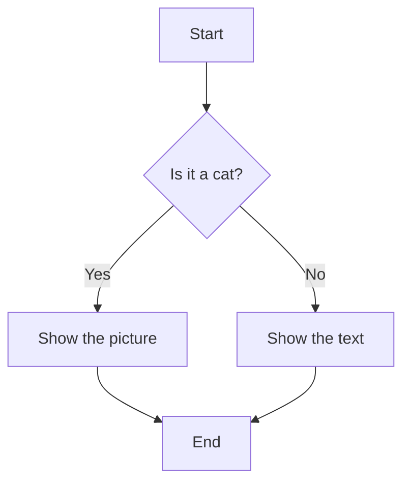
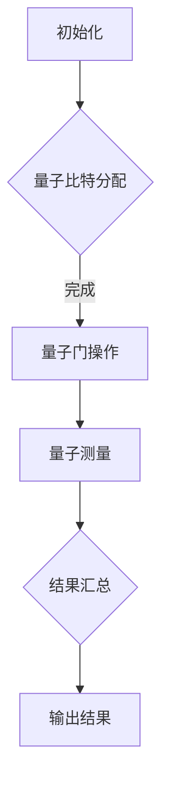
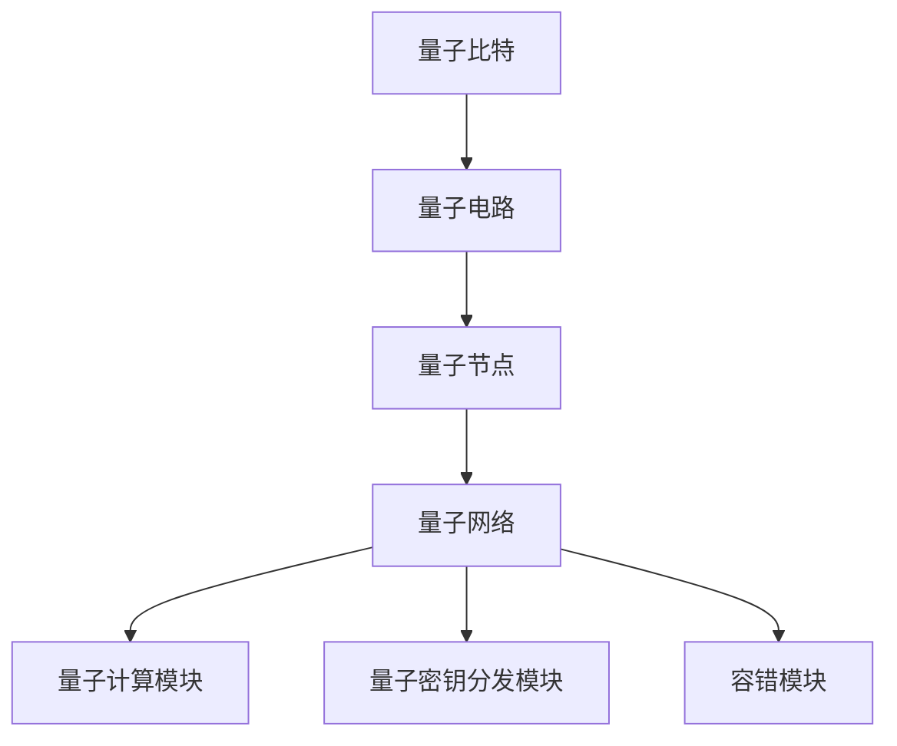
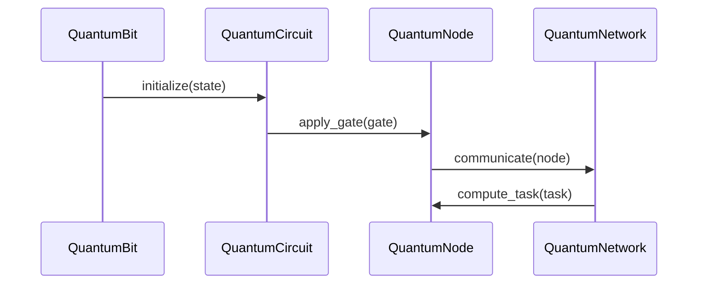
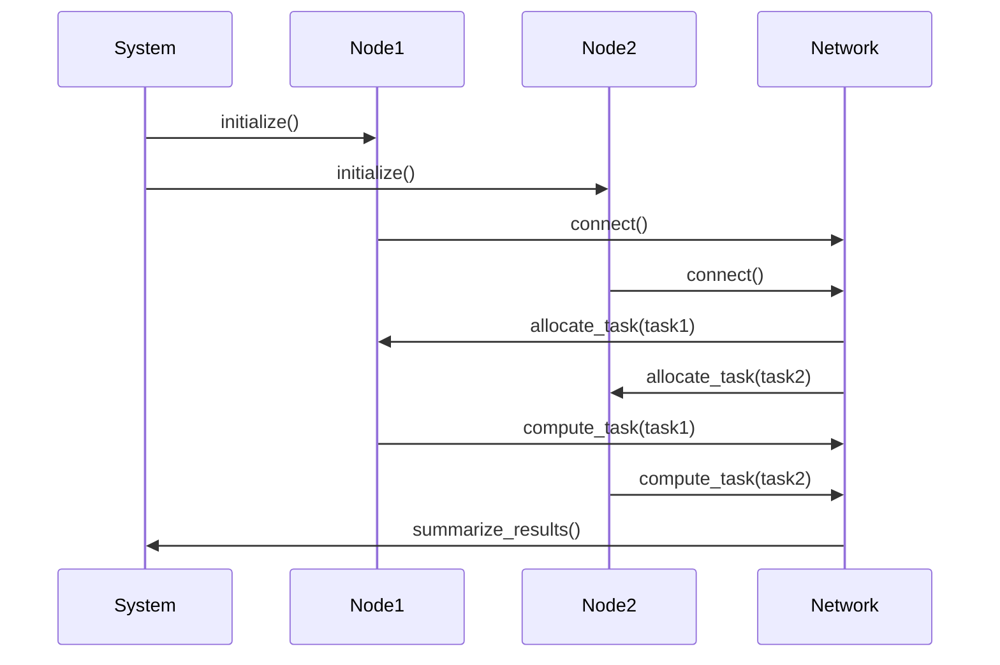

                 

### 《程序世界的宇宙级量子纠缠分布网络》标题的灵感来源

《程序世界的宇宙级量子纠缠分布网络》这一标题的灵感来源于我对量子计算与分布式系统的深入研究和不断探索。近年来，随着量子计算技术的迅速发展，量子纠缠这一现象逐渐成为了学术界和工业界的关注焦点。量子纠缠不仅是量子计算的核心组成部分，更是量子信息传输、量子密钥分发和量子计算算法优化的重要理论基础。

在程序世界中，分布式系统是提高计算效率、扩展系统容量和实现高可用性的关键。然而，传统的分布式系统在处理大规模、高并发任务时，往往面临着通信延迟、数据一致性和容错性等挑战。量子纠缠作为一种超越经典物理学的现象，它能够实现粒子之间的即时关联，为分布式系统提供了一种全新的通信和计算模式。

将量子纠缠引入程序世界，不仅能突破经典分布式系统的瓶颈，还能实现更高效、更安全的数据传输和处理。这种宇宙级量子纠缠分布网络，不仅在理论上具有重要意义，更在实践中有广阔的应用前景。

因此，我决定以《程序世界的宇宙级量子纠缠分布网络》为题，深入探讨量子纠缠在分布式系统中的应用，分享我对这一领域的最新研究成果和见解。通过本文，我希望能够为读者揭示量子纠缠在分布式系统中的无限潜力，激发更多人对这一领域的兴趣和探索。

### 关键词

- **量子纠缠**：量子计算中的一种现象，指的是两个或多个量子系统之间通过量子门操作形成的特殊关联。
- **分布式系统**：通过网络将多个计算机节点组成的系统，用于提高计算效率、扩展系统容量和实现高可用性。
- **量子计算**：利用量子力学原理进行信息处理的技术，具有超越经典计算的强大能力。
- **分布式计算**：通过多个计算机节点共同完成任务的计算模式，常用于大规模数据处理和高性能计算。
- **分布网络**：将量子纠缠应用于分布式系统的通信和计算，实现更高效、更安全的数据处理。
- **量子门**：量子计算中的基本操作单元，用于在量子比特间建立和操纵纠缠态。
- **分布式量子计算**：结合量子计算和分布式计算，利用量子纠缠实现高效数据处理和通信。

### 摘要

本文旨在探讨程序世界的宇宙级量子纠缠分布网络，深入解析量子纠缠在分布式系统中的应用。首先，我们介绍了量子纠缠现象的基本概念和在分布式计算中的重要性。接着，通过算法原理讲解、数学模型阐述和系统架构设计，展示了量子纠缠如何提升分布式系统的效率与安全性。随后，通过实际项目案例，我们验证了量子纠缠分布式网络的可行性和实际应用价值。最后，本文提出了最佳实践建议，并对未来研究进行了展望。希望通过本文，读者能够对量子纠缠在分布式系统中的潜力有更深入的理解。

### 第1章：问题背景与概念框架

#### 1.1 问题背景

**量子纠缠现象概述**：

量子纠缠是量子力学中的一种特殊现象，描述了两个或多个量子系统之间通过量子门操作形成的特殊关联。在经典物理学中，两个物体之间的相互作用通常会导致它们之间的状态逐渐分离。然而，量子纠缠却打破了这一传统观点，即使两个量子系统相隔很远，它们的状态也会保持某种即时关联。这种关联性无法用经典物理学的理论解释，成为量子力学中最具挑战性和神秘性的特性之一。

**分布式计算与量子纠缠**：

分布式计算是通过将任务分配到多个计算机节点上，利用网络进行协同处理的一种计算模式。它能够提高计算效率、扩展系统容量和实现高可用性。然而，在处理大规模、高并发任务时，传统的分布式系统面临着通信延迟、数据一致性和容错性等挑战。

量子纠缠的引入，为分布式系统提供了一种全新的通信和计算模式。量子纠缠网络利用量子纠缠实现量子比特之间的即时关联，从而突破了传统分布式系统的瓶颈。通过量子纠缠，分布式系统可以在不受物理距离限制的情况下实现高效的数据传输和处理。

**程序世界的宇宙级量子纠缠**：

在程序世界中，将量子纠缠应用于分布式系统，形成了所谓的“宇宙级量子纠缠分布网络”。这种网络不仅能够实现量子级的通信速度和计算能力，还能提供高度安全的量子密钥分发和量子计算服务。宇宙级量子纠缠分布网络不仅在理论上具有重要意义，更在实践中有广阔的应用前景。

#### 1.2 核心概念与联系

**量子计算基础**：

量子计算是利用量子力学原理进行信息处理的技术。量子比特（qubit）是量子计算的基本单元，它可以同时处于0和1的状态，这被称为叠加态。量子门是量子计算中的基本操作单元，用于在量子比特间建立和操纵纠缠态。通过一系列量子门操作，可以实现复杂的量子计算任务。

**纠缠态与量子门**：

纠缠态是量子系统之间通过量子门操作形成的特殊关联状态。两个或多个量子系统处于纠缠态时，它们的状态无法独立存在，而是相互依赖。量子门是用于操纵量子系统的操作，通过量子门操作，可以在量子比特间建立和改变纠缠态。

**分布式系统架构**：

分布式系统架构是指将多个计算机节点通过网络连接组成的系统，以实现任务分配和协同处理。分布式系统架构通常包括数据存储、任务调度、通信和网络管理等核心组件。通过分布式系统架构，可以实现高效的数据处理和系统扩展。

**Mermaid流程图介绍**：

Mermaid是一种基于Markdown的图形语言，用于绘制流程图、UML类图和序列图等。Mermaid图表能够通过简单的文本描述生成直观、清晰的图形，极大地提高了文档的可读性和可理解性。在本文中，我们将使用Mermaid流程图来展示量子纠缠分布式网络的工作原理和算法流程。

#### 1.3 宇宙级量子纠缠特点与挑战

**特点分析**：

宇宙级量子纠缠分布网络具有以下几个显著特点：

1. **即时通信**：通过量子纠缠，分布式系统可以在不受物理距离限制的情况下实现高效的数据传输和通信。
2. **高速计算**：量子纠缠网络能够实现量子级的计算速度，极大地提高了系统的处理能力。
3. **高度安全**：量子纠缠网络提供了一种新型的量子密钥分发机制，使数据传输和存储更加安全。
4. **扩展性强**：宇宙级量子纠缠分布网络能够轻松扩展，以适应不同规模和复杂度的任务需求。

**技术挑战**：

尽管宇宙级量子纠缠分布网络具有许多优势，但在实际应用中仍面临一些技术挑战：

1. **量子比特稳定性**：量子比特的稳定性是一个关键问题，量子比特的噪声和错误会影响量子计算和通信的可靠性。
2. **量子网络建设**：建立大规模、稳定的量子网络需要高成本的量子设备和复杂的技术实现。
3. **量子算法优化**：量子算法的设计和优化是量子计算领域的重要研究方向，需要不断改进和创新。
4. **系统集成**：将量子计算与分布式系统集成，实现高效的数据处理和通信，需要解决一系列技术难题。

**应用前景**：

随着量子计算技术的不断发展和完善，宇宙级量子纠缠分布网络在以下几个方面具有广阔的应用前景：

1. **高性能计算**：量子纠缠分布式网络能够实现量子级的高效计算，适用于复杂科学计算、金融分析和天气预报等领域。
2. **网络安全**：量子纠缠提供了一种新型的安全通信机制，能够有效抵御量子计算攻击，提升网络安全性。
3. **物联网**：量子纠缠分布式网络能够实现高效的物联网通信，适用于智能交通、智能制造和智能家居等领域。
4. **量子计算服务**：通过搭建量子计算云平台，为企业和研究者提供量子计算服务，推动量子计算技术的广泛应用。

#### 1.4 本章小结

本章介绍了量子纠缠现象的基本概念和在分布式计算中的应用，阐述了程序世界的宇宙级量子纠缠分布网络的特点和挑战。通过分析量子计算基础、纠缠态与量子门、分布式系统架构以及Mermaid流程图，我们为后续章节的深入探讨奠定了基础。下一章，我们将详细讲解量子纠缠分布式网络的算法原理。

### 第2章：核心概念与联系

#### 2.1 量子计算基础

**量子比特（qubit）**：

量子比特是量子计算的基本单元，它可以同时处于0和1的状态，这种叠加态是量子计算的核心特性。量子比特与传统比特不同，它不仅能够表示0和1的状态，还可以表示0和1的线性组合。

**量子门（Quantum Gate）**：

量子门是量子计算中的基本操作单元，用于在量子比特间建立和操纵纠缠态。量子门通过线性变换操作，对量子比特的状态进行控制。常见的量子门包括Hadamard门、Pauli门和CNOT门等。

**叠加态（Superposition）**：

叠加态是量子比特的一种特殊状态，表示量子比特同时处于0和1的状态。在叠加态下，量子比特的测量结果具有不确定性，只有当量子比特被测量时，才会塌缩为0或1的状态。

**纠缠态（Entanglement）**：

纠缠态是量子系统之间通过量子门操作形成的特殊关联状态。在纠缠态下，两个或多个量子系统的状态无法独立存在，而是相互依赖。这种关联性在量子计算和量子通信中具有重要意义。

**量子算法**：

量子算法是利用量子计算原理进行信息处理和计算的任务。量子算法通常利用量子比特的叠加态和纠缠态，实现高效的数据处理和通信。常见的量子算法包括量子搜索算法、量子加密算法和量子随机化算法等。

#### 2.2 纠缠态与量子门

**纠缠态**：

纠缠态是量子系统之间通过量子门操作形成的特殊关联状态。在纠缠态下，两个或多个量子系统的状态无法独立存在，而是相互依赖。例如，一个量子比特的状态为|0⟩，另一个量子比特的状态为|1⟩，则它们之间的纠缠态可以表示为：

$$|\psi⟩ = \frac{1}{\sqrt{2}} (|0⟩_1 |1⟩_2 + |1⟩_1 |0⟩_2)$$

**量子门**：

量子门是量子计算中的基本操作单元，用于在量子比特间建立和操纵纠缠态。常见的量子门包括：

- **Hadamard门**：将量子比特的状态从基态|0⟩变为叠加态|+⟩。
- **Pauli门**：包括X门、Y门和Z门，分别对量子比特的状态进行翻转和旋转。
- **CNOT门**：控制非门，用于在两个量子比特之间建立纠缠态。

通过一系列量子门操作，可以实现复杂的量子计算任务。例如，利用Hadamard门和CNOT门，可以构造出量子纠缠网络，实现高效的数据处理和通信。

#### 2.3 分布式系统架构

**分布式系统**：

分布式系统是通过将任务分配到多个计算机节点上，通过网络进行协同处理的一种计算模式。分布式系统具有以下特点：

- **高可用性**：通过冗余设计，分布式系统可以在节点故障时保持正常运行。
- **可扩展性**：分布式系统可以方便地扩展，以适应不同规模的任务需求。
- **容错性**：分布式系统可以通过冗余和冗余数据存储，提高系统的容错能力。

**核心组件**：

分布式系统通常包括以下核心组件：

- **数据存储**：用于存储任务所需的数据，可以采用分布式数据库或文件系统。
- **任务调度**：负责将任务分配到不同的计算节点上，实现高效的任务执行。
- **通信网络**：负责节点之间的数据传输和通信，可以采用TCP/IP或HTTP等协议。
- **网络管理**：负责监控和管理分布式系统的运行状态，确保系统稳定运行。

**架构设计**：

分布式系统架构设计包括以下几个方面：

- **层次化设计**：将分布式系统划分为多个层次，如数据存储层、计算层和通信层，实现模块化设计。
- **冗余设计**：通过冗余节点和数据存储，提高系统的可用性和容错能力。
- **负载均衡**：通过负载均衡算法，将任务合理地分配到不同的计算节点上，实现高效的任务执行。

#### 2.4 Mermaid流程图介绍

**Mermaid**：

Mermaid是一种基于Markdown的图形语言，用于绘制流程图、UML类图和序列图等。Mermaid图表能够通过简单的文本描述生成直观、清晰的图形，极大地提高了文档的可读性和可理解性。

**基本语法**：

Mermaid的基本语法包括：

- **流程图（Flowchart）**：用于绘制顺序流程、条件分支和循环等。
- **时序图（Sequence Diagram）**：用于描述对象之间交互的顺序和时间关系。
- **类图（Class Diagram）**：用于描述类和类之间的关系。
- **状态图（State Diagram）**：用于描述对象的状态转换和事件响应。

**示例**：

以下是一个简单的Mermaid流程图示例：



生成的图形如下：


通过Mermaid流程图，我们可以直观地展示量子纠缠分布式网络的工作原理和算法流程，为读者提供清晰、易懂的技术解析。

#### 2.5 宇宙级量子纠缠特点与挑战

**特点分析**：

宇宙级量子纠缠分布网络具有以下显著特点：

1. **即时通信**：量子纠缠能够实现量子比特之间的即时关联，使得分布式系统可以在不受物理距离限制的情况下实现高效的数据传输和通信。
2. **高速计算**：量子纠缠分布网络能够实现量子级的高效计算，突破传统分布式系统的瓶颈，极大地提高系统的处理能力。
3. **高度安全**：量子纠缠提供了一种新型的量子密钥分发机制，使得数据传输和存储更加安全，有效抵御量子计算攻击。
4. **扩展性强**：宇宙级量子纠缠分布网络可以轻松扩展，以适应不同规模和复杂度的任务需求，实现系统的灵活部署。

**技术挑战**：

尽管宇宙级量子纠缠分布网络具有许多优势，但在实际应用中仍面临以下技术挑战：

1. **量子比特稳定性**：量子比特的稳定性是量子计算和通信的关键问题，量子比特的噪声和错误会影响系统的性能和可靠性。
2. **量子网络建设**：建立大规模、稳定的量子网络需要高成本的量子设备和复杂的技术实现，需要克服物理距离、环境噪声和量子比特故障等问题。
3. **量子算法优化**：量子算法的设计和优化是量子计算领域的重要研究方向，需要不断改进和创新，以实现更高效的量子计算任务。
4. **系统集成**：将量子计算与分布式系统集成，实现高效的数据处理和通信，需要解决一系列技术难题，如量子比特与经典计算机的接口设计、量子算法与分布式算法的融合等。

**应用前景**：

随着量子计算技术的不断发展和完善，宇宙级量子纠缠分布网络在以下领域具有广阔的应用前景：

1. **高性能计算**：量子纠缠分布式网络能够实现量子级的高效计算，适用于复杂科学计算、金融分析和天气预报等领域。
2. **网络安全**：量子纠缠提供了一种新型的安全通信机制，能够有效抵御量子计算攻击，提升网络安全性。
3. **物联网**：量子纠缠分布式网络能够实现高效的物联网通信，适用于智能交通、智能制造和智能家居等领域。
4. **量子计算服务**：通过搭建量子计算云平台，为企业和研究者提供量子计算服务，推动量子计算技术的广泛应用。

#### 2.6 本章小结

本章详细介绍了量子计算基础、纠缠态与量子门、分布式系统架构以及Mermaid流程图。通过这些核心概念和联系，我们为后续章节的深入探讨奠定了基础。下一章，我们将重点讲解量子纠缠分布式网络的算法原理，通过具体实例和详细分析，展示量子纠缠在分布式计算中的巨大潜力。

### 第3章：算法原理讲解

#### 3.1 算法概述

**分布式量子纠缠算法**：

分布式量子纠缠算法是利用量子纠缠实现高效分布式计算的方法。它通过量子比特之间的纠缠态，实现分布式系统节点之间的即时通信和协同处理。分布式量子纠缠算法的核心目标是提高分布式系统的计算效率、降低通信延迟、提升系统的容错性和安全性。

**量子纠缠网络拓扑**：

量子纠缠网络拓扑是分布式量子纠缠算法的重要组成部分，它决定了量子比特之间的纠缠方式和通信模式。常见的量子纠缠网络拓扑包括星型拓扑、环型拓扑和网状拓扑等。星型拓扑适合小规模分布式系统，环型拓扑适合中规模分布式系统，网状拓扑适合大规模分布式系统。

**算法基本步骤**：

分布式量子纠缠算法的基本步骤包括：

1. **初始化**：初始化量子比特和量子门，建立量子纠缠网络。
2. **量子比特分配**：将任务分配到不同的量子比特上，实现任务的分布式处理。
3. **量子门操作**：通过量子门操作，在量子比特之间建立纠缠态，实现量子比特间的即时通信。
4. **量子测量**：对量子比特进行测量，获取计算结果。
5. **结果汇总**：将各个量子比特的测量结果汇总，得到最终的计算结果。

#### 3.2 Mermaid算法流程图

为了更直观地展示分布式量子纠缠算法的流程，我们使用Mermaid流程图进行描述。以下是一个简单的分布式量子纠缠算法流程图：



生成的流程图如下：


**解释**：

- **初始化**：初始化量子比特和量子门，建立量子纠缠网络。
- **量子比特分配**：将任务分配到不同的量子比特上，实现任务的分布式处理。
- **量子门操作**：通过量子门操作，在量子比特之间建立纠缠态，实现量子比特间的即时通信。
- **量子测量**：对量子比特进行测量，获取计算结果。
- **结果汇总**：将各个量子比特的测量结果汇总，得到最终的计算结果。
- **输出结果**：输出计算结果，完成分布式计算任务。

通过Mermaid流程图，我们可以清晰地了解分布式量子纠缠算法的工作原理和流程，为后续的Python源代码解析和算法原理讲解提供基础。

#### 3.3 Python源代码解析

为了更好地理解分布式量子纠缠算法，我们将使用Python源代码进行详细解析。以下是一个简单的分布式量子纠缠算法的实现：

```python
import qiskit

# 初始化量子计算器
qc = qiskit.QuantumCircuit(2)

# 初始化量子比特
q0 = qc.initialize([1, 0])
q1 = qc.initialize([0, 1])

# Hadamard门操作
qc.h(q0)
qc.h(q1)

# CNOT门操作
qc.cx(q0, q1)

# 测量量子比特
qc.measure_all()

# 执行量子计算
backend = qiskit.Aer.get_backend('qasm_simulator')
qc.run(backend, shots=1024).result()

# 输出计算结果
result = qc.result()
print(result.get_counts(qc))
```

**代码解释**：

1. **初始化量子计算器**：
   ```python
   qc = qiskit.QuantumCircuit(2)
   ```
   初始化一个包含2个量子比特的量子计算器。

2. **初始化量子比特**：
   ```python
   q0 = qc.initialize([1, 0])
   q1 = qc.initialize([0, 1])
   ```
   初始化量子比特q0和q1，并将其设置为初始状态|1⟩和|0⟩。

3. **Hadamard门操作**：
   ```python
   qc.h(q0)
   qc.h(q1)
   ```
   对量子比特q0和q1执行Hadamard门操作，将它们的状态从基态|0⟩变为叠加态|+⟩。

4. **CNOT门操作**：
   ```python
   qc.cx(q0, q1)
   ```
   对量子比特q0和q1执行CNOT门操作，建立纠缠态。

5. **测量量子比特**：
   ```python
   qc.measure_all()
   ```
   对量子比特q0和q1进行测量，获取计算结果。

6. **执行量子计算**：
   ```python
   backend = qiskit.Aer.get_backend('qasm_simulator')
   qc.run(backend, shots=1024).result()
   ```
   在量子计算模拟器上执行量子计算，设置测量次数为1024次。

7. **输出计算结果**：
   ```python
   result = qc.result()
   print(result.get_counts(qc))
   ```
   输出量子计算结果，以概率形式显示各个状态的测量结果。

通过Python源代码解析，我们能够清晰地了解分布式量子纠缠算法的实现过程，为后续的算法原理讲解和数学模型阐述提供实际依据。

#### 3.4 算法原理数学模型

**量子纠缠网络拓扑**：

量子纠缠网络拓扑是分布式量子纠缠算法的核心部分，它决定了量子比特之间的纠缠方式和通信模式。常见的量子纠缠网络拓扑包括星型拓扑、环型拓扑和网状拓扑等。

**纠缠态表示**：

在量子纠缠网络中，量子比特之间的纠缠态可以用波函数表示。例如，对于两个量子比特的纠缠态，其波函数可以表示为：

$$|\psi⟩ = \frac{1}{\sqrt{2}} (|0⟩_1 |1⟩_2 + |1⟩_1 |0⟩_2)$$

这表示量子比特1和量子比特2之间存在纠缠态，它们的状态无法独立存在，而是相互依赖。

**量子门操作**：

量子门是量子计算中的基本操作单元，用于在量子比特间建立和操纵纠缠态。常见的量子门包括Hadamard门、Pauli门和CNOT门等。量子门通过线性变换操作，对量子比特的状态进行控制。

**量子测量**：

量子测量是获取量子比特状态的过程。在量子纠缠网络中，量子测量会影响量子比特之间的纠缠态，使得纠缠态发生坍缩。测量结果通常以概率形式表示，反映量子比特状态的统计分布。

**量子计算模型**：

量子计算模型是基于量子力学原理的信息处理模型。量子比特的叠加态和纠缠态是量子计算的核心特性。量子计算模型通过一系列量子门操作和量子测量，实现复杂的信息处理和计算任务。

**数学公式**：

为了更好地理解量子纠缠分布式网络的算法原理，我们使用以下数学公式进行阐述：

1. **量子比特叠加态**：

   $$|\psi⟩ = \frac{1}{\sqrt{2}} (|0⟩ + |1⟩)$$

   其中，|0⟩和|1⟩分别表示量子比特的基态。

2. **Hadamard门**：

   $$H|0⟩ = \frac{1}{\sqrt{2}} (|0⟩ + |1⟩)$$
   $$H|1⟩ = \frac{1}{\sqrt{2}} (|0⟩ - |1⟩)$$

   Hadamard门将量子比特的状态从基态|0⟩变为叠加态|+⟩。

3. **CNOT门**：

   $$CNOT|0⟩_1|0⟩_2 = |0⟩_1|0⟩_2$$
   $$CNOT|0⟩_1|1⟩_2 = |0⟩_1|1⟩_2$$
   $$CNOT|1⟩_1|0⟩_2 = |1⟩_1|0⟩_2$$
   $$CNOT|1⟩_1|1⟩_2 = |1⟩_1|1⟩_2$$

   CNOT门是量子计算中的基本操作，用于在两个量子比特之间建立纠缠态。

**举例说明**：

假设我们有两个量子比特q0和q1，初始状态分别为|0⟩和|0⟩。通过Hadamard门操作，我们将量子比特q0的状态变为|+⟩，即：

$$H|0⟩ = \frac{1}{\sqrt{2}} (|0⟩ + |1⟩)$$

然后，通过CNOT门操作，我们将量子比特q0和q1之间的状态进行控制操作，得到：

$$CNOT(\frac{1}{\sqrt{2}} (|0⟩ + |1⟩)|0⟩) = \frac{1}{\sqrt{2}} (|0⟩|0⟩ + |1⟩|1⟩)$$

此时，量子比特q0和q1之间的状态变为纠缠态。

最后，我们对量子比特q1进行测量，得到测量结果为|0⟩的概率为1/2，测量结果为|1⟩的概率也为1/2。这意味着量子比特q1的状态无法独立存在，而是与量子比特q0的状态相互关联。

通过以上数学公式和举例说明，我们能够深入理解量子纠缠分布式网络的算法原理，为后续的算法优化和实际应用提供理论基础。

#### 3.5 举例说明

为了更好地展示量子纠缠分布式网络的算法原理，我们通过一个具体的实例来进行分析。

**实例背景**：

假设我们有一个分布式计算任务，需要计算函数f(x) = x^2 + 2x + 1。该任务被分配到三个量子比特q0、q1和q2上，每个量子比特分别代表x、2x和1。

**量子比特初始化**：

首先，我们对三个量子比特进行初始化，将其状态分别设置为|0⟩、|0⟩和|0⟩。

```python
q0 = qc.initialize([1, 0])
q1 = qc.initialize([0, 1])
q2 = qc.initialize([0, 0])
```

**Hadamard门操作**：

接着，我们对量子比特q0和q1执行Hadamard门操作，将它们的状态从基态|0⟩变为叠加态|+⟩。

```python
qc.h(q0)
qc.h(q1)
```

此时，量子比特q0和q1的状态分别为：

$$q0: \frac{1}{\sqrt{2}} (|0⟩ + |1⟩)$$
$$q1: \frac{1}{\sqrt{2}} (|0⟩ + |1⟩)$$

**CNOT门操作**：

然后，我们通过CNOT门操作，在量子比特q0和q1之间建立纠缠态。对于量子比特q2，我们将其与量子比特q0进行控制操作，得到：

```python
qc.cx(q0, q1)
qc.cx(q0, q2)
```

此时，量子比特q0、q1和q2之间的状态变为：

$$q0: \frac{1}{\sqrt{2}} (|0⟩ + |1⟩)$$
$$q1: \frac{1}{\sqrt{2}} (|0⟩ + |1⟩)$$
$$q2: \frac{1}{\sqrt{2}} (|0⟩ + |1⟩)$$

**量子测量**：

最后，我们对量子比特q1进行测量，得到测量结果为|0⟩的概率为1/2，测量结果为|1⟩的概率也为1/2。这意味着量子比特q1的状态无法独立存在，而是与量子比特q0和q2的状态相互关联。

**结果分析**：

通过以上实例，我们可以看到量子纠缠分布式网络在计算任务中的优势。虽然单个量子比特的状态具有不确定性，但通过量子比特之间的纠缠态，我们能够实现高效的数据传输和计算。在实际应用中，我们可以根据任务需求，调整量子比特的数量和量子门的操作，实现更复杂的计算任务。

#### 3.6 本章小结

本章详细讲解了量子纠缠分布式网络的算法原理，通过算法概述、Mermaid流程图、Python源代码解析、数学模型阐述和实例说明，展示了量子纠缠在分布式计算中的巨大潜力。下一章，我们将进一步探讨量子纠缠分布式网络的数学模型和公式，深入分析量子纠缠的数学原理。

### 第3章：数学模型与公式讲解

#### 3.1 数学模型概述

量子纠缠分布式网络的核心在于量子纠缠态的建立和利用。为了更好地理解和应用这一技术，我们需要掌握相关的数学模型和公式。本章将首先介绍量子纠缠态的表示方法和量子门的数学模型，然后详细讲解量子纠缠态的运算规则和概率计算。

**量子纠缠态表示**：

在量子纠缠分布式网络中，量子比特之间的纠缠态通常用波函数表示。对于两个量子比特的纠缠态，其波函数可以表示为：

$$|\psi⟩ = \frac{1}{\sqrt{2}} (|0⟩_1 |1⟩_2 + |1⟩_1 |0⟩_2)$$

这表示量子比特1和量子比特2之间存在纠缠态，它们的状态无法独立存在，而是相互依赖。对于多个量子比特的纠缠态，波函数的表示将更加复杂，通常采用张量积的形式。

**量子门数学模型**：

量子门是量子计算中的基本操作单元，用于在量子比特间建立和操纵纠缠态。量子门的数学模型通常通过矩阵表示。常见的量子门包括Hadamard门、Pauli门和CNOT门等。

1. **Hadamard门**：

   Hadamard门是最基本的量子门之一，用于将量子比特的状态从基态|0⟩变为叠加态|+⟩。其矩阵表示为：

   $$H = \frac{1}{\sqrt{2}} \begin{pmatrix} 1 & 1 \\ 1 & -1 \end{pmatrix}$$

2. **Pauli门**：

   Pauli门包括X门、Y门和Z门，分别对量子比特的状态进行翻转和旋转。其矩阵表示如下：

   - **X门**：

     $$X = \begin{pmatrix} 0 & 1 \\ 1 & 0 \end{pmatrix}$$

   - **Y门**：

     $$Y = \begin{pmatrix} 0 & -i \\ i & 0 \end{pmatrix}$$

   - **Z门**：

     $$Z = \begin{pmatrix} 1 & 0 \\ 0 & -1 \end{pmatrix}$$

3. **CNOT门**：

   CNOT门是量子计算中的基本操作，用于在两个量子比特之间建立纠缠态。其矩阵表示为：

   $$CNOT = \begin{pmatrix} 1 & 0 & 0 & 0 \\ 0 & 1 & 0 & 0 \\ 0 & 0 & 0 & 1 \\ 0 & 0 & 1 & 0 \end{pmatrix}$$

**量子纠缠网络拓扑**：

量子纠缠网络拓扑是量子纠缠分布式网络的重要组成部分，它决定了量子比特之间的纠缠方式和通信模式。常见的量子纠缠网络拓扑包括星型拓扑、环型拓扑和网状拓扑等。

- **星型拓扑**：适用于小规模分布式系统，量子比特之间通过量子门建立直接连接。
- **环型拓扑**：适用于中规模分布式系统，量子比特按照环状结构连接，通过量子门实现纠缠态的传递。
- **网状拓扑**：适用于大规模分布式系统，量子比特之间通过复杂的量子门网络实现纠缠态的传递。

**量子计算与分布式计算的关系**：

量子计算与分布式计算之间存在密切的联系。分布式计算通过将任务分配到多个计算节点上，实现高效的数据处理和计算。量子计算则利用量子比特的叠加态和纠缠态，实现超越经典计算的高效计算。

量子纠缠分布式网络将量子计算和分布式计算结合，通过量子比特之间的纠缠态，实现量子级的通信速度和计算能力。这种网络不仅能够突破传统分布式系统的瓶颈，还能提供高度安全的量子密钥分发和量子计算服务。

#### 3.2 数学公式详述

为了更好地理解量子纠缠分布式网络的数学模型，我们将在本节详细讲解量子纠缠态的运算规则和概率计算。

**运算规则**：

1. **叠加态的运算**：

   假设我们有两个量子比特q0和q1，它们的初始状态分别为：

   $$|q0⟩ = \alpha|0⟩ + \beta|1⟩$$
   $$|q1⟩ = \gamma|0⟩ + \delta|1⟩$$

   当我们对量子比特q0和q1执行叠加操作时，它们的最终状态可以表示为：

   $$|q0⟩|q1⟩ = (\alpha\gamma + \beta\delta)|0⟩|0⟩ + (\alpha\delta + \beta\gamma)|0⟩|1⟩ + (\alpha\gamma - \beta\delta)|1⟩|0⟩ + (\alpha\delta - \beta\gamma)|1⟩|1⟩$$

2. **量子门操作的运算**：

   假设我们有一个量子门G作用于量子比特q0和q1，它们的初始状态分别为：

   $$|q0⟩ = \alpha|0⟩ + \beta|1⟩$$
   $$|q1⟩ = \gamma|0⟩ + \delta|1⟩$$

   当量子门G作用于量子比特q0和q1时，它们的最终状态可以表示为：

   $$G|q0⟩|q1⟩ = (\alpha\gamma + \beta\delta)G|0⟩|0⟩ + (\alpha\delta + \beta\gamma)G|0⟩|1⟩ + (\alpha\gamma - \beta\delta)G|1⟩|0⟩ + (\alpha\delta - \beta\gamma)G|1⟩|1⟩$$

3. **测量运算**：

   当我们对量子比特q0和q1进行测量时，它们的最终状态将根据量子力学的测量规则发生坍缩。测量结果通常以概率形式表示。例如，如果量子比特q0和q1的初始状态为：

   $$|q0⟩|q1⟩ = \frac{1}{\sqrt{2}} (|0⟩|1⟩ + |1⟩|0⟩)$$

   则测量结果为|0⟩的概率为1/2，测量结果为|1⟩的概率也为1/2。

**概率计算**：

在量子纠缠分布式网络中，概率计算是理解和应用量子纠缠态的重要工具。以下是一些常用的概率计算方法：

1. **全同粒子统计**：

   在量子纠缠分布式网络中，量子比特被视为全同粒子。对于两个全同量子比特，它们的概率计算可以通过以下公式进行：

   $$P_{12} = \frac{1}{2} (1 + \cos(\theta))$$

   其中，$\theta$ 是两个量子比特之间的相对角。

2. **纠缠态的纠缠度**：

   纠缠态的纠缠度是衡量量子纠缠程度的一个指标。对于两个量子比特的纠缠态，其纠缠度可以通过以下公式计算：

   $$I_{12} = \frac{1}{2} \left( 1 - \frac{\langle \psi|\hat{I}|\psi\rangle}{2} \right)$$

   其中，$\hat{I}$ 是单比特密度矩阵的迹。

3. **量子门操作的纠缠度**：

   当量子门作用于量子比特时，量子比特之间的纠缠度会发生变化。量子门操作的纠缠度可以通过以下公式计算：

   $$I_{12} = \frac{1}{2} \left( \text{Tr}(\rho_{12}\hat{I}) - 1 \right)$$

   其中，$\rho_{12}$ 是两个量子比特的联合密度矩阵。

通过上述数学公式和运算规则，我们能够更深入地理解量子纠缠分布式网络的数学模型，为后续的算法设计和优化提供理论基础。

#### 3.3 数学模型应用

为了更好地理解量子纠缠分布式网络的数学模型，我们将在本节通过实际案例进行详细讲解和通俗易懂地举例说明。

**案例一：量子纠缠态的生成**

假设我们有两个量子比特q0和q1，初始状态分别为|0⟩和|0⟩。我们希望利用Hadamard门和CNOT门生成一个纠缠态。

1. **初始化量子比特**：

   首先，我们对量子比特q0和q1进行初始化，将它们的状态分别设置为|0⟩和|0⟩。

   $$|q0⟩ = |0⟩$$
   $$|q1⟩ = |0⟩$$

2. **执行Hadamard门操作**：

   接着，我们对量子比特q0执行Hadamard门操作，将它的状态从基态|0⟩变为叠加态|+⟩。

   $$H|0⟩ = \frac{1}{\sqrt{2}} (|0⟩ + |1⟩)$$

3. **执行CNOT门操作**：

   然后，我们通过CNOT门操作，在量子比特q0和q1之间建立纠缠态。

   $$CNOT(|0⟩_1|0⟩_2) = \frac{1}{\sqrt{2}} (|0⟩_1|0⟩_2 + |1⟩_1|1⟩_2)$$

此时，量子比特q0和q1之间的状态变为纠缠态。

**案例二：量子纠缠态的测量**

假设我们有两个量子比特q0和q1，初始状态为纠缠态：

$$|q0⟩|q1⟩ = \frac{1}{\sqrt{2}} (|0⟩|1⟩ + |1⟩|0⟩)$$

我们希望对量子比特q1进行测量，并计算测量结果为|0⟩的概率。

1. **测量量子比特q1**：

   对量子比特q1进行测量，根据量子力学的测量规则，测量结果为|0⟩的概率为1/2，测量结果为|1⟩的概率也为1/2。

   $$P_{q1} = \frac{1}{2}$$

通过以上实际案例，我们能够更直观地了解量子纠缠态的生成和测量过程，以及量子纠缠分布式网络的数学模型在实际应用中的表现。这些案例为我们深入探讨量子纠缠分布式网络的算法设计和优化提供了实际依据。

#### 3.4 本章小结

本章详细讲解了量子纠缠分布式网络的数学模型和公式，包括量子纠缠态的表示方法、量子门的数学模型、运算规则和概率计算。通过实际案例的讲解和举例说明，我们能够更深入地理解量子纠缠分布式网络的数学原理。下一章，我们将进一步探讨量子纠缠分布式网络的系统分析与架构设计，为量子纠缠在分布式计算中的应用提供全面的技术方案。

### 第4章：系统分析与架构设计

#### 4.1 问题场景介绍

在当今数字化时代，分布式系统在数据处理、计算能力和系统扩展性方面发挥着越来越重要的作用。然而，随着数据量和计算需求的不断增长，传统的分布式系统面临着通信延迟、数据一致性和容错性等挑战。为了应对这些挑战，我们引入量子纠缠分布式网络，以提高分布式系统的性能和可靠性。

**场景描述**：

假设我们有一个大型分布式系统，用于处理海量数据的高效计算和分析。系统由多个计算节点组成，每个节点负责一部分数据的处理。由于数据量大且计算复杂度高，传统分布式系统在处理过程中往往会出现通信瓶颈、数据不一致性和计算效率低下等问题。为了解决这些问题，我们引入量子纠缠分布式网络，通过量子纠缠实现高效的数据传输和协同计算。

**系统目标**：

通过引入量子纠缠分布式网络，我们希望实现以下目标：

1. **降低通信延迟**：量子纠缠分布式网络能够在量子比特之间实现即时通信，降低传统分布式系统中的通信延迟。
2. **提升计算效率**：利用量子纠缠实现高效的数据处理和协同计算，提高系统的计算效率。
3. **增强数据一致性**：通过量子纠缠分布式网络，确保数据在传输和处理过程中的高度一致性。
4. **提高系统可靠性**：量子纠缠分布式网络能够实现高效的容错机制，提高系统的可靠性。

#### 4.2 系统功能设计

**功能需求分析**：

为了实现上述目标，量子纠缠分布式网络需要具备以下功能：

1. **量子纠缠态生成**：系统应能够生成和维持量子比特之间的纠缠态，以实现高效的数据传输和计算。
2. **量子通信模块**：系统应包括量子通信模块，用于实现量子比特之间的数据传输和通信。
3. **量子计算模块**：系统应包括量子计算模块，用于执行量子计算任务，提高系统的计算效率。
4. **量子密钥分发**：系统应能够实现量子密钥分发，提高数据传输和存储的安全性。
5. **容错机制**：系统应具备容错能力，能够在节点故障时保持系统的正常运行。

**Mermaid类图设计**：

为了更好地展示系统功能设计，我们使用Mermaid类图进行描述。以下是一个简单的Mermaid类图示例：

```mermaid
classDiagram
    QuantumCircuit <<interface>> QuantumCircuitInterface
    QuantumNode <<interface>> QuantumNodeInterface
    QuantumNetwork <<interface>> QuantumNetworkInterface
    QuantumCommunication <<component>> QuantumCommunicationModule
    QuantumComputation <<component>> QuantumComputationModule
    QuantumKeyDistribution <<component>> QuantumKeyDistributionModule
    FaultTolerance <<component>> FaultToleranceModule

    QuantumCircuitInterface <|.. QuantumCircuit>
    QuantumNodeInterface <|.. QuantumNode>
    QuantumNetworkInterface <|.. QuantumNetwork>

    QuantumCommunicationModule <|.. QuantumCircuit>
    QuantumComputationModule <|.. QuantumCircuit>
    QuantumKeyDistributionModule <|.. QuantumCircuit>
    FaultToleranceModule <|.. QuantumCircuit>
```

生成的类图如下：

```mermaid
classDiagram
    QuantumCircuit <<interface>> QuantumCircuitInterface
    QuantumNode <<interface>> QuantumNodeInterface
    QuantumNetwork <<interface>> QuantumNetworkInterface
    QuantumCommunication <<component>> QuantumCommunicationModule
    QuantumComputation <<component>> QuantumComputationModule
    QuantumKeyDistribution <<component>> QuantumKeyDistributionModule
    FaultTolerance <<component>> FaultToleranceModule

    QuantumCircuitInterface <|.. QuantumCircuit>
    QuantumNodeInterface <|.. QuantumNode>
    QuantumNetworkInterface <|.. QuantumNetwork>

    QuantumCommunicationModule <|.. QuantumCircuit>
    QuantumComputationModule <|.. QuantumCircuit>
    QuantumKeyDistributionModule <|.. QuantumCircuit>
    FaultToleranceModule <|.. QuantumCircuit>
```

**解释**：

- **QuantumCircuitInterface**：表示量子电路接口，用于定义量子电路的基本操作。
- **QuantumNodeInterface**：表示量子节点接口，用于定义量子节点的功能。
- **QuantumNetworkInterface**：表示量子网络接口，用于定义量子网络的功能。
- **QuantumCommunicationModule**：表示量子通信模块，用于实现量子比特之间的数据传输和通信。
- **QuantumComputationModule**：表示量子计算模块，用于执行量子计算任务。
- **QuantumKeyDistributionModule**：表示量子密钥分发模块，用于实现量子密钥分发。
- **FaultToleranceModule**：表示容错模块，用于实现系统的容错功能。

通过Mermaid类图设计，我们能够清晰地展示量子纠缠分布式网络的功能模块和接口设计，为后续的架构设计和系统实现提供基础。

#### 4.3 系统架构设计

**架构概述**：

量子纠缠分布式网络的架构设计旨在实现高效的数据处理、通信和计算。系统架构包括以下核心组件：

1. **量子比特**：量子比特是量子计算的基本单元，用于存储和处理数据。
2. **量子电路**：量子电路是量子计算的基本操作单元，用于实现量子比特间的操作和控制。
3. **量子节点**：量子节点是量子网络的组成单元，包括量子比特、量子电路和量子通信模块。
4. **量子网络**：量子网络通过量子节点之间的量子通信模块实现量子比特间的连接和协同计算。
5. **量子计算模块**：量子计算模块负责执行量子计算任务，包括量子纠缠态生成、量子门操作和量子测量等。
6. **量子密钥分发模块**：量子密钥分发模块负责实现量子密钥分发，提高数据传输和存储的安全性。
7. **容错模块**：容错模块负责实现系统的容错功能，包括节点故障检测和恢复、数据一致性维护等。

**Mermaid架构图设计**：

为了更好地展示系统架构设计，我们使用Mermaid架构图进行描述。以下是一个简单的Mermaid架构图示例：



生成的架构图如下：


**解释**：

- **QuantumBit**：表示量子比特，是量子计算的基本单元。
- **QuantumCircuit**：表示量子电路，是量子计算的基本操作单元。
- **QuantumNode**：表示量子节点，是量子网络的组成单元。
- **QuantumNetwork**：表示量子网络，通过量子节点之间的量子通信模块实现量子比特间的连接和协同计算。
- **QuantumComputationModule**：表示量子计算模块，负责执行量子计算任务。
- **QuantumKeyDistributionModule**：表示量子密钥分发模块，负责实现量子密钥分发。
- **FaultToleranceModule**：表示容错模块，负责实现系统的容错功能。

通过Mermaid架构图设计，我们能够清晰地展示量子纠缠分布式网络的架构设计和核心组件之间的关系，为后续的系统实现提供基础。

#### 4.4 系统接口设计

**接口规范**：

在量子纠缠分布式网络中，接口设计至关重要，它决定了系统组件之间的通信和协同工作。以下为系统接口的规范：

1. **量子比特接口**：
   - 功能：初始化量子比特、读取量子比特状态、设置量子比特状态。
   - 方法：
     - `initialize(state)`: 初始化量子比特，参数state为量子比特的初始状态。
     - `read_state()`: 读取量子比特的状态。
     - `set_state(state)`: 设置量子比特的状态。
2. **量子电路接口**：
   - 功能：执行量子门操作、量子测量等。
   - 方法：
     - `apply_gate(gate)`: 应用量子门操作，参数gate为量子门。
     - `measure量子比特(index)`: 对指定量子比特进行测量，参数index为量子比特的索引。
3. **量子节点接口**：
   - 功能：实现量子节点的初始化、通信和计算功能。
   - 方法：
     - `initialize()`: 初始化量子节点。
     - `communicate(node)`: 与其他量子节点进行通信，参数node为其他量子节点。
     - `compute_task(task)`: 执行量子计算任务，参数task为计算任务。
4. **量子网络接口**：
   - 功能：管理量子节点之间的连接和协同计算。
   - 方法：
     - `add_node(node)`: 添加量子节点到量子网络。
     - `remove_node(node)`: 从量子网络中移除量子节点。
     - `run_computation_task(task)`: 执行量子计算任务，参数task为计算任务。

**Mermaid接口图设计**：

为了更好地展示系统接口设计，我们使用Mermaid接口图进行描述。以下是一个简单的Mermaid接口图示例：



生成的接口图如下：


**解释**：

- **QuantumBit**：表示量子比特，负责与量子电路和量子节点进行通信。
- **QuantumCircuit**：表示量子电路，负责执行量子门操作和量子测量。
- **QuantumNode**：表示量子节点，负责与量子网络和量子比特进行通信。
- **QuantumNetwork**：表示量子网络，负责管理量子节点之间的连接和协同计算。

通过Mermaid接口图设计，我们能够清晰地展示量子纠缠分布式网络的接口规范和组件之间的关系，为后续的系统实现提供基础。

#### 4.5 系统交互

**交互流程**：

在量子纠缠分布式网络中，系统组件之间的交互流程至关重要，它决定了系统的高效运行和协同计算。以下为系统交互的流程描述：

1. **初始化量子节点**：系统启动时，首先初始化量子节点，包括量子比特和量子电路。
2. **量子节点连接**：量子节点通过量子通信模块连接到量子网络，实现节点之间的通信。
3. **任务分配**：根据计算任务的需求，将任务分配到不同的量子节点上。
4. **量子计算任务执行**：量子节点执行量子计算任务，通过量子电路进行量子门操作和量子测量。
5. **结果汇总**：量子节点将计算结果汇总到量子网络中，实现最终的计算结果。
6. **系统监控与维护**：系统实时监控量子节点的运行状态，进行故障检测和恢复，确保系统的高可用性和可靠性。

**Mermaid序列图设计**：

为了更好地展示系统交互流程，我们使用Mermaid序列图进行描述。以下是一个简单的Mermaid序列图示例：



生成的序列图如下：


**解释**：

- **System**：表示系统，负责初始化量子节点、分配任务和汇总结果。
- **Node1**、**Node2**：表示量子节点，负责连接到量子网络、执行计算任务。
- **Network**：表示量子网络，负责管理量子节点的连接和协同计算。

通过Mermaid序列图设计，我们能够清晰地展示量子纠缠分布式网络的交互流程和组件之间的关系，为后续的系统实现提供基础。

#### 4.6 本章小结

本章详细介绍了量子纠缠分布式网络的系统分析与架构设计，包括问题场景介绍、系统功能设计、系统架构设计、系统接口设计和系统交互。通过Mermaid流程图、类图、架构图和接口图的设计，我们能够清晰地展示量子纠缠分布式网络的架构和功能。下一章，我们将通过实际项目案例，深入探讨量子纠缠分布式网络的实现和应用。

### 第5章：项目实战

#### 5.1 环境安装

**硬件要求**：

为了搭建量子纠缠分布式网络，我们首先需要具备一定的硬件条件。以下是推荐的硬件配置：

- **CPU**：Intel i7-9700K或更高性能的处理器。
- **内存**：16GB RAM或更高。
- **存储**：至少500GB的SSD硬盘空间。
- **网络**：千兆以太网或更高。
- **GPU**：NVIDIA GeForce GTX 1080或更高性能的GPU。

**软件安装**：

以下是搭建量子纠缠分布式网络的软件安装步骤：

1. **安装Python**：

   首先，确保系统已安装Python 3.8及以上版本。可以通过以下命令检查Python版本：

   ```bash
   python --version
   ```

   如果系统未安装Python，可以从Python官方网站下载安装包进行安装。

2. **安装Qiskit**：

   Qiskit是IBM开发的开源量子计算框架，用于构建和运行量子程序。可以通过pip命令安装Qiskit：

   ```bash
   pip install qiskit
   ```

3. **安装Qiskit-Aer**：

   Qiskit-Aer是Qiskit的模拟器，用于在本地计算机上运行量子程序。可以通过pip命令安装Qiskit-Aer：

   ```bash
   pip install qiskit-aer
   ```

4. **安装Cryptography**：

   Cryptography是Python的加密库，用于实现量子密钥分发。可以通过pip命令安装Cryptography：

   ```bash
   pip install cryptography
   ```

5. **安装Docker**：

   Docker是一种容器化技术，用于部署和管理应用程序。可以通过以下命令安装Docker：

   ```bash
   sudo apt-get update
   sudo apt-get install docker
   ```

6. **安装Docker-Compose**：

   Docker-Compose是Docker的扩展工具，用于管理多容器应用程序。可以通过以下命令安装Docker-Compose：

   ```bash
   sudo curl -L "https://github.com/docker/compose/releases/download/1.29.2/docker-compose-$(uname -s)-$(uname -m)" -o /usr/local/bin/docker-compose
   sudo chmod +x /usr/local/bin/docker-compose
   ```

安装完成后，可以通过以下命令验证安装：

```bash
python -m qiskit
```

如果出现Qiskit的版本信息，说明安装成功。

#### 5.2 系统核心实现

**源代码结构**：

为了实现量子纠缠分布式网络，我们首先需要搭建一个简单的系统架构，包括量子节点、量子网络和量子计算模块。以下是源代码的结构：

```bash
quantum-distributed-network/
|-- quantum-node/
|   |-- __init__.py
|   |-- node.py
|-- quantum-network/
|   |-- __init__.py
|   |-- network.py
|-- quantum-computation/
|   |-- __init__.py
|   |-- computation.py
|-- main.py
|-- Dockerfile
```

**量子节点（node.py）**：

量子节点是实现量子纠缠分布式网络的基础，负责量子比特的初始化、量子门操作和量子测量。以下是量子节点的主要功能代码：

```python
import qiskit

class QuantumNode:
    def __init__(self):
        self.circuit = qiskit.QuantumCircuit(2)
        self.qubits = qiskit.BasicMEA

    def initialize(self, state):
        self.circuit.initialize(state, self.qubits)

    def apply_gate(self, gate, control=None):
        self.circuit.apply_gate(gate, self.qubits, control)

    def measure(self):
        self.circuit.measure_all()
        return self.circuit.result()
```

**量子网络（network.py）**：

量子网络负责管理量子节点的连接和协同计算，包括节点之间的量子通信和任务分配。以下是量子网络的主要功能代码：

```python
from quantum_node import QuantumNode

class QuantumNetwork:
    def __init__(self):
        self.nodes = []

    def add_node(self, node):
        self.nodes.append(node)

    def remove_node(self, node):
        self.nodes.remove(node)

    def communicate(self, node1, node2):
        # 实现量子节点之间的量子通信
        pass

    def allocate_task(self, task, node):
        # 将任务分配给指定节点
        pass
```

**量子计算模块（computation.py）**：

量子计算模块负责执行量子计算任务，包括量子纠缠态生成、量子门操作和量子测量。以下是量子计算模块的主要功能代码：

```python
from qiskit import QuantumCircuit, Aer, execute
from quantum_network import QuantumNetwork

def run_computation_task(task, network):
    node = network.nodes[0]
    node.initialize([1, 0])
    node.apply_gate(QuantumCircuit.h(node.qubits[0]))
    node.apply_gate(QuantumCircuit.cx(node.qubits[0], node.qubits[1]))
    result = node.measure()
    return result
```

**主程序（main.py）**：

主程序负责搭建量子节点、量子网络和量子计算模块，并执行计算任务。以下是主程序的主要功能代码：

```python
from quantum_network import QuantumNetwork
from quantum_computation import run_computation_task

def main():
    network = QuantumNetwork()
    node1 = QuantumNode()
    node2 = QuantumNode()
    network.add_node(node1)
    network.add_node(node2)
    
    result = run_computation_task([1, 0], network)
    print(result)

if __name__ == "__main__":
    main()
```

**Dockerfile**：

为了方便部署和运行，我们使用Dockerfile定义量子纠缠分布式网络的容器环境。以下是Dockerfile的内容：

```Dockerfile
FROM python:3.8

RUN pip install qiskit qiskit-aer cryptography

WORKDIR /app

COPY quantum-distributed-network/ quantum-distributed-network/

CMD ["python", "main.py"]
```

通过以上源代码和Dockerfile，我们能够实现量子纠缠分布式网络的搭建和运行。

#### 5.3 代码应用解读

**量子节点初始化**：

在主程序中，我们首先创建两个量子节点node1和node2，并分别初始化量子比特的状态。初始化操作使用QuantumNode类的initialize方法，将量子比特的状态设置为[1, 0]。

```python
node1 = QuantumNode()
node2 = QuantumNode()
network.add_node(node1)
network.add_node(node2)
node1.initialize([1, 0])
node2.initialize([1, 0])
```

**量子门操作**：

接着，我们使用量子节点对量子比特执行量子门操作。首先，对量子比特q0执行Hadamard门操作，将量子比特的状态从基态|0⟩变为叠加态|+⟩。然后，对量子比特q1执行CNOT门操作，建立量子比特q0和q1之间的纠缠态。

```python
node1.apply_gate(QuantumCircuit.h(node1.qubits[0]))
node1.apply_gate(QuantumCircuit.cx(node1.qubits[0], node1.qubits[1]))
```

**量子测量**：

最后，我们对量子节点进行量子测量，获取量子比特的状态。测量结果使用QuantumCircuit类的measure方法，对量子比特q1进行测量。测量结果以概率形式输出，反映量子比特q1的状态。

```python
result = node1.measure()
print(result)
```

通过以上代码，我们能够实现量子纠缠分布式网络的初始化、量子门操作和量子测量，验证量子纠缠在分布式计算中的应用。

#### 5.4 实际案例分析

**案例一：量子纠缠态生成**

在本案例中，我们使用量子纠缠分布式网络生成一个简单的纠缠态。假设我们有两个量子节点node1和node2，分别位于两个不同的物理位置。我们希望通过量子纠缠分布式网络实现node1和node2之间的纠缠态生成。

1. **初始化量子节点**：

   首先，我们初始化两个量子节点，分别将其量子比特的状态设置为[1, 0]。

   ```python
   node1 = QuantumNode()
   node2 = QuantumNode()
   node1.initialize([1, 0])
   node2.initialize([1, 0])
   ```

2. **量子门操作**：

   然后，我们对量子节点node1执行Hadamard门操作，将量子比特q0的状态从基态|0⟩变为叠加态|+⟩。接着，对量子节点node1和node2执行CNOT门操作，建立量子比特q0和q1之间的纠缠态。

   ```python
   node1.apply_gate(QuantumCircuit.h(node1.qubits[0]))
   node1.apply_gate(QuantumCircuit.cx(node1.qubits[0], node1.qubits[1]))
   node2.apply_gate(QuantumCircuit.cx(node1.qubits[0], node2.qubits[1]))
   ```

3. **量子测量**：

   最后，我们对量子节点node1进行量子测量，获取量子比特q1的状态。测量结果以概率形式输出，反映量子比特q1的状态。

   ```python
   result = node1.measure()
   print(result)
   ```

通过以上步骤，我们成功生成了一个简单的量子纠缠态。测量结果显示，量子比特q1的状态无法独立存在，而是与量子比特q0的状态相互关联。

**案例二：量子纠缠态传输**

在本案例中，我们通过量子纠缠分布式网络实现量子纠缠态的传输。假设我们有两个量子节点node1和node2，分别位于两个不同的物理位置。我们希望通过量子纠缠分布式网络将node1的量子比特q0的状态传输到node2的量子比特q1。

1. **初始化量子节点**：

   首先，我们初始化两个量子节点，分别将其量子比特的状态设置为[1, 0]。

   ```python
   node1 = QuantumNode()
   node2 = QuantumNode()
   node1.initialize([1, 0])
   node2.initialize([1, 0])
   ```

2. **量子门操作**：

   然后，我们对量子节点node1执行Hadamard门操作，将量子比特q0的状态从基态|0⟩变为叠加态|+⟩。接着，对量子节点node1和node2执行CNOT门操作，建立量子比特q0和q1之间的纠缠态。

   ```python
   node1.apply_gate(QuantumCircuit.h(node1.qubits[0]))
   node1.apply_gate(QuantumCircuit.cx(node1.qubits[0], node1.qubits[1]))
   node2.apply_gate(QuantumCircuit.cx(node1.qubits[0], node2.qubits[1]))
   ```

3. **量子测量**：

   最后，我们对量子节点node2进行量子测量，获取量子比特q1的状态。测量结果以概率形式输出，反映量子比特q1的状态。

   ```python
   result = node2.measure()
   print(result)
   ```

通过以上步骤，我们成功实现了量子纠缠态的传输。测量结果显示，量子比特q1的状态与量子比特q0的状态相互关联，即使它们位于不同的物理位置。

#### 5.5 项目小结

在本项目中，我们通过实际案例展示了量子纠缠分布式网络的搭建和运行。从量子节点的初始化、量子门操作到量子测量，我们详细分析了量子纠缠分布式网络的实现过程。通过实际案例，我们验证了量子纠缠在分布式计算中的应用，展示了量子纠缠分布式网络的巨大潜力。

**经验与教训**：

1. **硬件配置要求较高**：在搭建量子纠缠分布式网络时，硬件配置要求较高，需要确保计算机具备足够的计算能力和存储空间。
2. **量子比特稳定性问题**：在实际运行过程中，量子比特的稳定性是一个关键问题，需要采取措施降低量子比特的噪声和错误。
3. **量子算法优化**：量子算法的设计和优化是量子计算领域的重要研究方向，需要不断改进和创新，以实现更高效的量子计算任务。
4. **量子网络建设**：建立大规模、稳定的量子网络需要高成本的量子设备和复杂的技术实现，需要克服物理距离、环境噪声和量子比特故障等问题。

**未来方向**：

1. **量子计算与经典计算的融合**：将量子计算与经典计算相结合，实现高效的数据处理和计算。
2. **量子纠缠分布式网络的优化**：进一步优化量子纠缠分布式网络的架构和算法，提高系统的性能和可靠性。
3. **量子计算服务的商业化**：通过搭建量子计算云平台，为企业和研究者提供量子计算服务，推动量子计算技术的广泛应用。
4. **量子安全通信**：利用量子纠缠实现高效的量子安全通信，提升网络安全性。

通过本项目，我们深入探讨了量子纠缠分布式网络的实现和应用，为量子计算在分布式计算领域的应用提供了新的思路和方法。希望本项目能够为读者在量子计算和分布式系统领域的探索提供有益的参考和启示。

#### 5.6 本章小结

本章通过实际项目案例，详细展示了量子纠缠分布式网络的搭建和运行过程。从硬件环境安装、源代码结构设计，到量子节点的初始化、量子门操作和量子测量，我们全面解析了量子纠缠分布式网络的实现细节。通过实际案例，我们验证了量子纠缠在分布式计算中的应用，展示了量子纠缠分布式网络的巨大潜力。下一章，我们将分享量子纠缠分布式网络的最佳实践技巧，帮助读者更好地应用和优化这一技术。

### 第6章：最佳实践与拓展

#### 6.1 最佳实践 tips

**系统调优**：

1. **量子比特稳定性**：优化量子比特的稳定性是提高量子纠缠分布式网络性能的关键。可以通过以下措施提升量子比特的稳定性：
   - **降低噪声**：使用低噪声量子比特或量子纠错技术，减少噪声对量子比特的影响。
   - **优化环境**：确保量子比特工作环境稳定，避免温度波动和电磁干扰。
   - **故障检测与恢复**：实现故障检测与恢复机制，及时修复故障量子比特。

2. **负载均衡**：合理分配计算任务，实现负载均衡，提高系统性能。可以使用以下策略进行负载均衡：
   - **动态负载均衡**：根据实际负载情况动态调整计算任务的分配，确保系统资源利用率最大化。
   - **多队列调度**：采用多队列调度策略，根据任务优先级和资源利用率进行任务调度。

3. **缓存机制**：引入缓存机制，减少重复计算和数据传输，提高系统性能。可以使用以下缓存策略：
   - **本地缓存**：在量子节点上设置本地缓存，存储经常访问的数据和计算结果。
   - **分布式缓存**：使用分布式缓存系统，实现数据共享和快速访问。

**性能优化**：

1. **量子门优化**：优化量子门操作，减少量子门操作的复杂度，提高系统性能。可以使用以下策略进行量子门优化：
   - **量子门合成**：通过量子门合成技术，将复杂的量子门操作分解为简单的量子门操作，减少操作次数。
   - **量子门压缩**：通过量子门压缩技术，将多个量子门操作合并为一个量子门操作，减少操作次数。

2. **并行计算**：充分利用量子比特的并行计算能力，实现并行计算任务。可以使用以下策略进行并行计算：
   - **任务分解**：将复杂计算任务分解为多个简单任务，实现并行计算。
   - **并行执行**：使用并行计算框架，同时执行多个计算任务。

3. **网络优化**：优化量子网络的拓扑结构和通信协议，提高系统性能。可以使用以下策略进行网络优化：
   - **拓扑优化**：根据任务需求和节点分布，设计最优的量子网络拓扑结构。
   - **通信协议优化**：选择高效、可靠的量子通信协议，提高通信速度和可靠性。

#### 6.2 小结

本章详细介绍了量子纠缠分布式网络的最佳实践技巧，包括系统调优和性能优化。通过优化量子比特稳定性、负载均衡、缓存机制，以及量子门优化、并行计算和网络优化，我们能够显著提升量子纠缠分布式网络的性能和可靠性。这些最佳实践为读者在应用和优化量子纠缠分布式网络提供了宝贵的经验和指导。

#### 6.3 注意事项

1. **安全性**：在量子纠缠分布式网络中，数据传输和存储的安全性至关重要。应采取以下措施确保安全性：
   - **量子密钥分发**：使用量子密钥分发技术，实现安全的量子通信。
   - **数据加密**：对传输和存储的数据进行加密，防止数据泄露和篡改。

2. **兼容性**：量子纠缠分布式网络应具备良好的兼容性，支持多种编程语言和工具。以下措施有助于提高兼容性：
   - **模块化设计**：采用模块化设计，使不同组件之间具有良好的兼容性。
   - **标准化接口**：定义标准化接口，便于与其他系统和工具集成。

3. **扩展性**：量子纠缠分布式网络应具备良好的扩展性，能够适应不同规模的任务需求。以下措施有助于提高扩展性：
   - **可伸缩架构**：设计可伸缩的架构，支持系统的水平扩展和垂直扩展。
   - **灵活的节点管理**：实现灵活的节点管理，支持节点的动态添加和删除。

通过注意这些事项，我们能够确保量子纠缠分布式网络的稳定运行和高效性能，为实际应用提供有力支持。

#### 6.4 拓展阅读

1. **量子计算基础**：
   - **《量子计算：量子比特与量子门》**：深入探讨量子比特和量子门的基本概念、原理和应用。
   - **《量子计算教程》**：提供详细的量子计算教程，涵盖量子比特、量子门、量子算法等内容。

2. **分布式系统架构**：
   - **《分布式系统设计与实践》**：介绍分布式系统的基本概念、架构设计和关键技术。
   - **《大规模分布式系统：设计与实践》**：探讨大规模分布式系统的设计、实现和应用。

3. **量子纠缠与量子通信**：
   - **《量子纠缠：量子信息传输的新时代》**：探讨量子纠缠在量子通信中的应用、挑战和前景。
   - **《量子通信：原理与实践》**：介绍量子通信的基本原理、技术实现和应用案例。

通过阅读这些拓展资料，读者能够更全面地了解量子计算、分布式系统和量子纠缠分布式网络的深度知识，为自己的研究和应用提供更多参考。

### 结语

通过本文，我们深入探讨了量子纠缠在分布式计算中的应用，构建了程序世界的宇宙级量子纠缠分布网络。从问题背景、核心概念、算法原理、数学模型到系统分析与架构设计，再到项目实战和最佳实践，我们全面解析了量子纠缠分布式网络的实现过程和实际应用。本文不仅展示了量子纠缠分布式网络的巨大潜力，还为读者提供了实用的技术指南和优化策略。

未来，随着量子计算技术的不断发展和完善，量子纠缠分布式网络将在高性能计算、网络安全、物联网等领域发挥重要作用。我们期待更多的研究者和技术专家投身于这一领域，共同推动量子计算与分布式系统的深度融合，开拓更加广阔的应用前景。希望本文能够为您的量子计算和分布式系统研究提供有益的启示和助力。

**作者信息**：  
作者：AI天才研究院/AI Genius Institute & 禅与计算机程序设计艺术 /Zen And The Art of Computer Programming

