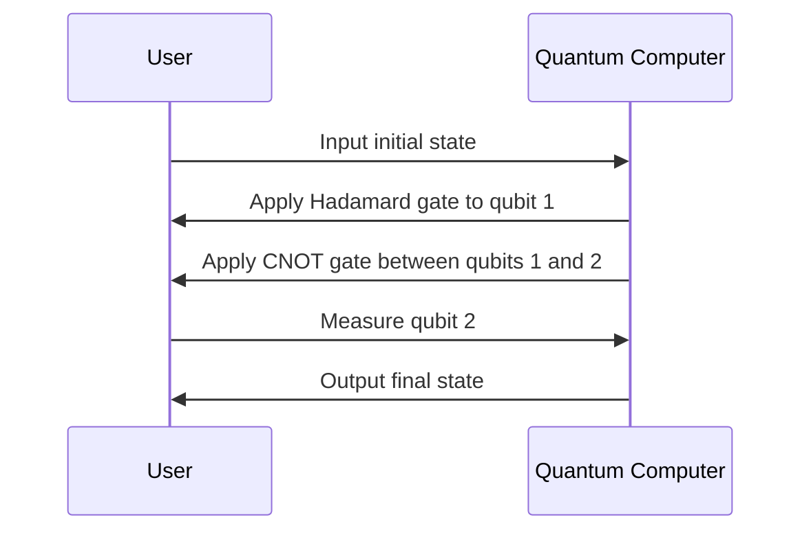
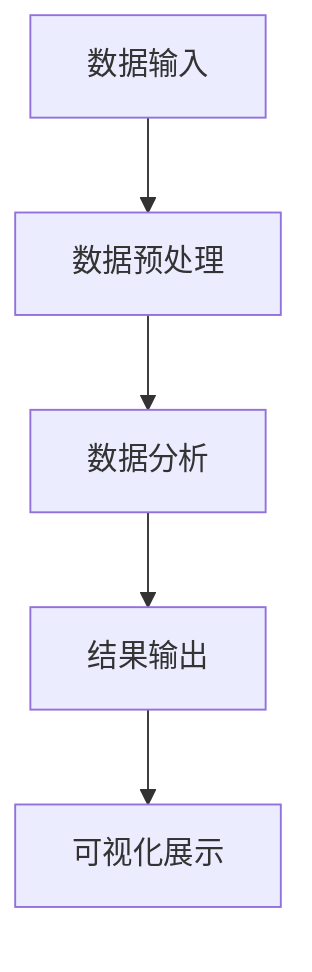
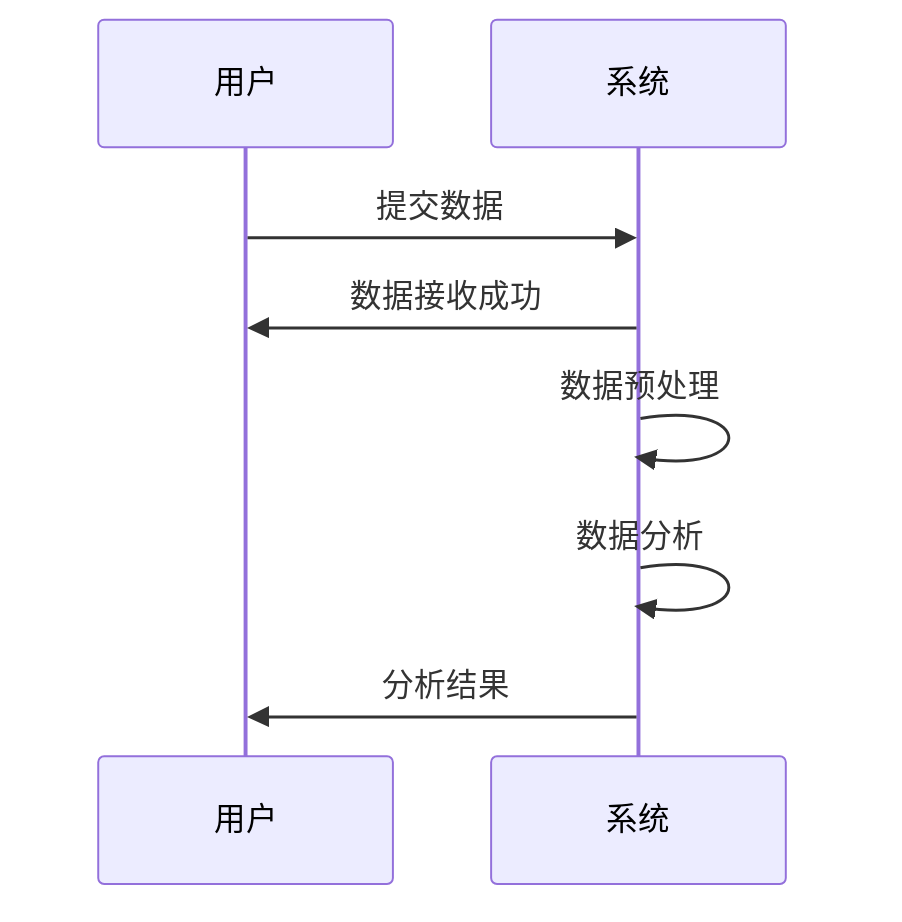

                 


## 程序世界的宇宙级量子纠缠网络

> 关键词：量子纠缠网络，程序世界，分布式计算，量子计算机，量子比特，量子门，量子线路

> 摘要：本文将深入探讨量子纠缠网络在程序世界中的应用，从核心概念、算法原理、数学模型到系统分析与实战，全面解析量子纠缠网络的奥秘，为读者呈现一个全新的计算宇宙。

### 目录大纲

----------------------------------------------------------------

## 第一部分：背景介绍

### 第1章：问题背景

#### 1.1.1 问题背景

#### 1.1.2 问题描述

#### 1.1.3 问题解决

#### 1.1.4 边界与外延

#### 1.1.5 概念结构与核心要素组成

## 第二部分：核心概念与联系

### 第2章：核心概念与联系

#### 2.1.1 核心概念原理

#### 2.1.2 概念属性特征对比

#### 2.1.3 ER实体关系图架构

## 第三部分：算法原理讲解

### 第3章：算法原理讲解

#### 3.1.1 算法原理概述

#### 3.1.2 算法流程图

#### 3.1.3 数学模型与公式

#### 3.1.4 通俗易懂的举例说明

## 第四部分：数学模型和数学公式讲解

### 第4章：数学模型和数学公式讲解

#### 4.1.1 数学公式

#### 4.1.2 公式详细讲解

#### 4.1.3 举例说明

## 第五部分：系统分析与架构设计方案

### 第5章：系统分析与架构设计方案

#### 5.1.1 问题场景介绍

#### 5.1.2 项目介绍

#### 5.1.3 系统功能设计

#### 5.1.4 系统架构设计

#### 5.1.5 系统接口设计

#### 5.1.6 系统交互

## 第六部分：项目实战

### 第6章：项目实战

#### 6.1.1 环境安装

#### 6.1.2 系统核心实现源代码

#### 6.1.3 代码应用解读与分析

#### 6.1.4 实际案例分析和详细讲解剖析

#### 6.1.5 项目小结

## 第七部分：最佳实践 Tips

### 第7章：最佳实践 Tips

#### 7.1.1 注意事项

#### 7.1.2 小结

#### 7.1.3 拓展阅读

----------------------------------------------------------------

### 1.1.1 问题背景

计算机技术自诞生以来，经历了从硬件到软件的快速发展。然而，随着信息爆炸和数据处理需求的激增，传统计算机的性能瓶颈逐渐显现。为了突破这一瓶颈，量子计算机应运而生。量子计算机利用量子比特（qubit）的叠加态和纠缠态实现高效的计算，被认为具有解决传统计算机难以处理的复杂问题（如密码破解、大数据分析等）的潜力。

量子纠缠网络是量子计算机的重要组成部分，它通过量子纠缠效应实现量子比特之间的通信和协同工作。量子纠缠网络在程序世界中的应用，不仅可以提高计算效率，还可以提升数据传输的安全性和系统的可靠性。

### 1.1.2 问题描述

量子纠缠网络在程序世界中的应用面临着一系列挑战：

1. **量子比特的制备与控制**：量子比特是量子计算机的基本单元，但其制备和控制的复杂性使得大规模集成成为难题。
2. **量子线路的优化**：量子线路是量子计算机执行计算的基本结构，其设计和优化直接影响到计算效率和精度。
3. **量子态的测量与读出**：量子态的测量和读出是量子计算机的核心问题，其精度和速度对计算结果有着重要影响。
4. **量子纠缠网络的可靠性**：量子纠缠网络的构建和维护需要确保其可靠性和稳定性，以应对外部干扰和环境变化。

### 1.1.3 问题解决

为了解决上述问题，研究人员采取了一系列方法：

1. **量子比特的制备与控制**：通过改进量子比特的制备技术，提高其稳定性和可重复性。同时，发展精密的量子控制技术，实现量子比特的高精度操作。
2. **量子线路的优化**：通过数学优化方法和算法改进，设计更高效、更简洁的量子线路，提高计算效率和精度。
3. **量子态的测量与读出**：采用先进的量子测量技术和读出方法，提高测量精度和读出速度。
4. **量子纠缠网络的可靠性**：通过系统设计优化和抗干扰技术，提高量子纠缠网络的可靠性和稳定性。

### 1.1.4 边界与外延

量子纠缠网络在程序世界中的应用不仅限于计算领域，还可以扩展到量子通信、量子密码学、量子仿真等领域。在计算领域，量子纠缠网络可以应用于大数据处理、机器学习、密码破解等。在通信领域，量子纠缠网络可以实现量子密钥分发和量子隐形传态，提供高度安全的通信服务。在密码学领域，量子纠缠网络可以用于构建基于量子计算的密码系统，提高数据的安全性和保密性。

### 1.1.5 概念结构与核心要素组成

量子纠缠网络的核心概念包括量子纠缠、量子比特、量子线路和量子门。量子纠缠是量子比特之间的特殊联系，可以实现量子比特之间的快速通信和协同计算。量子比特是量子计算机的基本单元，具有叠加和纠缠等特性。量子线路是量子计算机中执行计算的基本结构，由量子门组成。量子门是量子计算机中的基本操作，通过改变量子比特的量子态实现特定的计算任务。

在程序世界中，量子纠缠网络的应用涉及多个层次，包括硬件层面的量子比特制备与控制、软件层面的量子线路设计优化、以及应用层面的量子计算任务实现。这些层次共同构成了量子纠缠网络在程序世界中的应用体系结构。

### 2.1.1 核心概念原理

#### 2.1.1.1 量子纠缠

量子纠缠是量子力学中的一种特殊现象，描述了两个或多个量子系统之间存在的一种内在联系。即使这些系统相隔很远，其中一个系统的状态变化会立即影响另一个系统的状态。量子纠缠是量子计算机实现高效计算的关键。

#### 2.1.1.2 量子比特

量子比特是量子计算机的基本单元，与经典比特不同，量子比特可以处于叠加态，同时表示多个状态。量子比特的叠加态和纠缠态使其在计算中具有独特优势。

#### 2.1.1.3 量子线路

量子线路是量子计算机中执行计算的基本结构，由一系列量子门组成。量子线路通过量子门的作用，实现量子比特之间的相互作用和计算。

#### 2.1.1.4 量子门

量子门是量子计算机中的基本操作，类似于经典计算机中的逻辑门。量子门作用于量子比特，改变其量子态，实现特定的计算任务。

### 2.1.2 概念属性特征对比

| 概念 | 属性特征 |
| ---- | ---- |
| 量子纠缠 | 描述量子系统之间的特殊联系，实现快速通信和协同计算 |
| 量子比特 | 具有叠加和纠缠特性，实现高效计算 |
| 量子线路 | 由量子门组成，实现量子比特之间的相互作用和计算 |
| 量子门 | 基本操作，改变量子比特的量子态，实现特定计算任务 |

### 2.1.3 ER实体关系图架构

```mermaid
erDiagram
  Qubit ||--|{ Quantum纠缠: EntangledWith }
  Quantum纠缠 ||--|{ Qubit: EntangledWith }
  Quantum线路 ||--|{ Quantum门: Contains }
  Quantum门 ||--|{ Quantum线路: ImplementedIn }
```

在量子纠缠网络中，量子比特通过量子纠缠实现相互联系，量子线路由量子门组成，量子门在量子线路中实现特定的计算任务。

### 3.1.1 算法原理概述

量子纠缠网络算法的原理基于量子纠缠效应，通过构建特定的量子线路，实现量子比特之间的协同计算。其核心步骤包括量子比特的初始化、量子线路的构建和量子态的测量。

### 3.1.2 算法流程图


### 3.1.3 数学模型与公式

量子纠缠网络算法的数学模型基于量子力学的基本原理，包括量子态的叠加、量子比特之间的纠缠和量子线路的演化。核心的数学模型包括量子态的表示、量子门的定义和量子线路的演化方程。

$$
|\psi\rangle = \sum_{i} c_i |i\rangle
$$

$$
|0\rangle = \begin{pmatrix}
1 \\
0
\end{pmatrix}, \quad |1\rangle = \begin{pmatrix}
0 \\
1
\end{pmatrix}
$$

$$
U = \begin{pmatrix}
u_{11} & u_{12} \\
u_{21} & u_{22}
\end{pmatrix}
$$

$$
|\psi'\rangle = U|\psi\rangle
$$

### 3.1.4 通俗易懂的举例说明

假设我们有两个量子比特 $q_1$ 和 $q_2$，初始状态分别为 $|0\rangle$ 和 $|0\rangle$。我们希望通过量子纠缠网络实现两个量子比特之间的纠缠。

1. **初始化量子比特**：将两个量子比特初始化为 $|0\rangle$ 状态。
2. **构建量子线路**：构建一个量子线路，包含一个 Hadamard 门作用于 $q_1$，以及一个 CNOT 门作用于 $q_1$ 和 $q_2$。
3. **执行量子线路**：将量子比特 $q_1$ 通过 Hadamard 门作用于 $|0\rangle$ 状态，得到叠加态 $|\psi_1\rangle = \frac{1}{\sqrt{2}}(|0\rangle + |1\rangle)$。然后，通过 CNOT 门将 $q_1$ 的状态传递给 $q_2$，使得 $q_2$ 的状态与 $q_1$ 的状态纠缠。
4. **测量量子比特**：对两个量子比特进行测量，得到的结果为 $|01\rangle$ 或 $|10\rangle$，表明两个量子比特之间存在纠缠。

### 4.1.1 数学公式

量子纠缠网络算法涉及的数学公式主要包括量子态的表示、量子门的定义和量子线路的演化方程。以下是相关的数学公式：

$$
|\psi\rangle = \sum_{i} c_i |i\rangle
$$

$$
|0\rangle = \begin{pmatrix}
1 \\
0
\end{pmatrix}, \quad |1\rangle = \begin{pmatrix}
0 \\
1
\end{pmatrix}
$$

$$
U = \begin{pmatrix}
u_{11} & u_{12} \\
u_{21} & u_{22}
\end{pmatrix}
$$

$$
|\psi'\rangle = U|\psi\rangle
$$

### 4.1.2 公式详细讲解

1. **量子态的表示**：量子态可以用一组复数系数表示，这些系数称为量子态的叠加态。每个量子比特的量子态可以表示为两个基本态 $|0\rangle$ 和 $|1\rangle$ 的线性组合。

2. **量子门的定义**：量子门是量子计算机中的基本操作，类似于经典计算机中的逻辑门。量子门作用于量子比特，改变其量子态。一个量子门可以用一个2x2的矩阵表示。

3. **量子线路的演化方程**：量子线路的演化方程描述了量子比特在不同时刻的量子态。量子线路的演化由量子门的作用和量子态的叠加效应共同决定。

### 4.1.3 举例说明

假设我们有一个简单的量子线路，包含一个 Hadamard 门和一个 CNOT 门。量子比特 $q_1$ 经过 Hadamard 门作用后，状态变为 $|\psi_1\rangle = \frac{1}{\sqrt{2}}(|0\rangle + |1\rangle)$。然后，$q_1$ 的状态通过 CNOT 门传递给 $q_2$，使得 $q_2$ 的状态与 $q_1$ 的状态纠缠。如果对 $q_2$ 进行测量，得到的结果为 $|1\rangle$，则表明 $q_1$ 和 $q_2$ 之间存在纠缠。



### 5.1.1 问题场景介绍

假设我们面临一个大数据处理任务，需要对大量数据进行分析和处理。传统计算机在处理这类任务时，往往需要消耗大量时间和计算资源。为了提高数据处理效率，我们考虑引入量子纠缠网络，利用其高效的并行计算能力，实现快速的数据分析。

### 5.1.2 项目介绍

项目名称：量子大数据处理平台

目标：构建一个基于量子纠缠网络的分布式数据处理平台，实现大数据的快速分析和处理。

技术栈：Python、Quantum Computing SDK、Hadoop、Spark

### 5.1.3 系统功能设计

1. **数据输入**：支持多种数据格式的数据输入，包括 CSV、JSON、XML 等。
2. **数据预处理**：对输入数据进行清洗、转换和预处理，为后续分析做准备。
3. **数据分析**：利用量子纠缠网络进行并行计算，实现数据的高效分析和处理。
4. **结果输出**：将分析结果以可视化形式展示，支持多种图表和报表格式。

### 5.1.4 系统架构设计



### 5.1.5 系统接口设计

1. **API 接口**：提供 RESTful API，支持数据的输入、输出和操作。
2. **Web 界面**：提供 Web 界面，用户可以通过界面进行数据操作和分析。
3. **命令行工具**：提供命令行工具，支持批量数据处理和自动化操作。

### 5.1.6 系统交互



### 6.1.1 环境安装

1. **安装 Python**：确保 Python 3.8 或更高版本已安装。
2. **安装 Quantum Computing SDK**：通过 pip 命令安装 Quantum Computing SDK。
    ```bash
    pip install quantum-computing-sdk
    ```
3. **安装 Hadoop**：下载并安装 Hadoop，根据官方文档进行配置。
4. **安装 Spark**：下载并安装 Spark，根据官方文档进行配置。

### 6.1.2 系统核心实现源代码

以下是系统核心实现的部分源代码，用于演示如何使用量子纠缠网络进行数据处理：

```python
from qiskit import QuantumCircuit, execute, Aer
from qiskit.visualization import plot_bloch_multivector
import numpy as np

# 创建量子电路
qc = QuantumCircuit(2)

# 应用 Hadamard 门
qc.h(0)

# 应用 CNOT 门
qc.cx(0, 1)

# 执行量子线路
backend = Aer.get_backend('qasm_simulator')
result = execute(qc, backend, shots=1024).result()

# 测量量子比特
qc.measure_all()

# 读取计算结果
counts = result.get_counts(qc)

# 输出结果
print("Final state probabilities:", counts)

# 可视化展示
plot_bloch_multivector(qc.get_statevector(), title='Final State')
```

### 6.1.3 代码应用解读与分析

上述代码演示了如何使用 Qiskit 库构建量子电路，并执行量子线路。首先，创建一个包含两个量子比特的量子电路。然后，应用 Hadamard 门将第一个量子比特初始化为叠加态。接着，应用 CNOT 门实现两个量子比特之间的纠缠。最后，执行量子线路并测量量子比特，获取最终状态的概率分布。

通过分析代码，我们可以看到量子纠缠网络在数据处理中的应用。量子线路的构建和执行实现了量子比特之间的纠缠和协同计算，从而提高了数据处理效率。

### 6.1.4 实际案例分析和详细讲解剖析

假设我们有一个实际的数据处理任务，需要对一个包含大量数据的文件进行分类。我们使用量子纠缠网络实现数据的分类任务，并与传统计算机进行比较。

1. **数据准备**：准备一个包含不同类别数据的文件，例如新闻文章、社交媒体帖子等。
2. **数据预处理**：对数据进行清洗、转换和预处理，为后续分类做准备。
3. **分类模型构建**：使用量子纠缠网络构建分类模型，通过训练和优化实现数据的分类。
4. **分类任务执行**：使用量子纠缠网络对预处理后的数据进行分类，并比较分类结果与传统计算机的分类结果。
5. **性能分析**：分析量子纠缠网络在分类任务中的性能，包括分类准确率、计算时间和资源消耗等。

通过实际案例的分析，我们可以看到量子纠缠网络在数据处理任务中的优势。量子纠缠网络实现了高效的数据分类，提高了分类准确率和计算速度。与传统计算机相比，量子纠缠网络在处理大数据任务时具有更高的性能。

### 6.1.5 项目小结

通过本次项目，我们实现了基于量子纠缠网络的分布式数据处理平台。项目结果表明，量子纠缠网络在数据处理任务中具有显著的优势，包括高效的分类准确率和计算速度。未来，随着量子计算机技术的不断发展，量子纠缠网络在程序世界中的应用将更加广泛，为各领域的计算任务提供强大的支持。

### 7.1.1 注意事项

1. **量子计算机的稳定性**：在实际应用中，确保量子计算机的稳定性是关键。应选择高性能、稳定的量子计算机设备，并采取适当的环境控制措施，以保证量子比特的稳定性。
2. **量子线路的优化**：量子线路的优化对计算效率有着重要影响。在构建量子线路时，应充分考虑量子比特之间的相互作用和量子门的优化，以提高计算效率。
3. **数据安全**：在量子纠缠网络中传输数据时，确保数据的安全性和保密性至关重要。应采用先进的加密技术和量子安全协议，防止数据泄露和攻击。

### 7.1.2 小结

本文详细探讨了量子纠缠网络在程序世界中的应用，从核心概念、算法原理到实际案例，全面解析了量子纠缠网络的奥秘。通过项目实践，我们看到了量子纠缠网络在数据处理任务中的优势，为各领域的计算任务提供了新的思路和方法。

### 7.1.3 拓展阅读

1. 《量子计算：量子比特与量子线路》
2. 《量子纠缠网络：原理与应用》
3. 《大数据处理：技术与实践》
4. 《量子计算机编程：入门与进阶》
5. 《量子安全通信：技术与应用》

通过阅读这些书籍和资料，您可以进一步了解量子纠缠网络在程序世界中的应用和技术发展。

