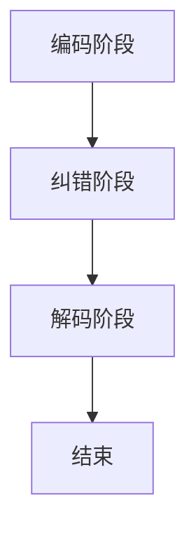

                 

# 程序世界的宇宙级量子纠错码容错阈值优化

> 关键词：量子纠错码、容错阈值、优化、算法、Python实现

> 摘要：本文深入探讨了量子纠错码在程序世界中的应用，特别是在容错阈值优化方面。通过详细的步骤和分析，我们揭示了量子纠错码的原理、优化的策略，以及如何在Python中实现这些优化算法。本文旨在为读者提供从理论到实践的全面指南，帮助他们在量子计算的领域中取得突破。

## 引言

随着量子计算的迅速发展，量子纠错码成为了确保量子信息传输和计算稳定性的关键技术。然而，量子纠错码的容错阈值优化一直是研究的难点，因为它直接关系到量子计算系统的稳定性和效率。本文将引导读者一步步深入量子纠错码的宇宙级应用，探讨容错阈值优化的重要性和实现方法。

## 第一部分：量子纠错码基础

### 1.1 量子纠错码概述

量子纠错码是一种用于保护量子信息的方法，它通过引入冗余信息来纠正由于量子噪声导致的错误。量子纠错码的重要性在于它保证了量子信息在传输和计算过程中的完整性。

#### 1.1.1 量子纠错码的重要性

量子纠错码的重要性体现在多个方面。首先，它确保了量子计算系统的可靠性，使得量子计算机能够在实际应用中稳定运行。其次，量子纠错码可以扩展量子信息的容量，提高量子通信的效率。

#### 1.1.2 量子纠错码的基本概念

量子纠错码的基本概念包括量子比特、冗余比特和纠错算法。量子比特是量子信息的基本单位，而冗余比特则是用于检测和纠正错误的附加信息。

#### 1.1.3 量子纠错码的类型

常见的量子纠错码包括Shor码和Steane码。Shor码是最早提出的量子纠错码，它具有良好的纠错能力。Steane码则是一种构造简单、纠错能力强的量子纠错码。

### 1.2 量子纠错码的工作原理

量子纠错码的工作原理可以分为编码、传输和解码三个阶段。在编码阶段，量子信息被编码成一系列冗余的量子态。在传输阶段，这些量子态可能会受到噪声干扰。在解码阶段，通过对比冗余信息，可以检测和纠正错误。

#### 1.2.1 量子纠错码的基本原理

量子纠错码的基本原理是基于量子叠加和量子纠缠。量子叠加允许一个量子比特同时处于多个状态，而量子纠缠则允许两个或多个量子比特之间产生强关联。

#### 1.2.2 量子纠错码的编码过程

量子纠错码的编码过程包括将量子信息编码到冗余比特中。这个过程通常涉及到一系列的量子操作，如量子门和控制操作。

#### 1.2.3 量子纠错码的解码过程

量子纠错码的解码过程包括检测错误和纠正错误。通过对比冗余比特，可以确定哪个量子比特出现了错误，并采取相应的纠正措施。

### 1.3 量子纠错码的性能指标

量子纠错码的性能指标包括容错阈值、纠错能力和效率。容错阈值决定了量子纠错码能够纠正的最大错误率。纠错能力则反映了量子纠错码能够纠正错误的能力。效率则是指量子纠错码在纠错过程中所消耗的资源。

#### 1.3.1 容错阈值

容错阈值是量子纠错码的重要性能指标之一。它决定了量子纠错码能够承受的最大错误率。

#### 1.3.2 纠错能力

纠错能力反映了量子纠错码能够纠正错误的能力。一个优秀的量子纠错码应该具有较高的纠错能力。

#### 1.3.3 量子纠错码的效率

量子纠错码的效率是指它在纠错过程中所消耗的资源。一个高效的量子纠错码可以在保持高纠错能力的同时，减少资源的消耗。

### 1.4 量子纠错码的现状与趋势

量子纠错码的研究已经取得了显著的进展。目前，许多量子纠错码已经被提出，并且在实际应用中取得了良好的效果。然而，量子纠错码的容错阈值优化仍然是一个挑战。未来，量子纠错码的研究将主要集中在提高容错阈值和优化纠错算法方面。

#### 1.4.1 现有量子纠错码的技术发展

现有量子纠错码的技术发展主要集中在提高纠错能力和降低资源消耗。例如，通过优化编码和解码算法，可以提高量子纠错码的效率。

#### 1.4.2 未来量子纠错码的发展方向

未来量子纠错码的发展方向将包括新型量子纠错码的设计、量子纠错码与量子计算的融合，以及量子纠错码在量子互联网中的应用。

## 1.5 本章小结

本章介绍了量子纠错码的基本概念、工作原理和性能指标。通过本章的学习，读者可以了解量子纠错码的基本原理，为后续的容错阈值优化研究打下基础。

## 第二部分：宇宙级量子纠错码

### 2.1 宇宙级量子纠错码的特点

宇宙级量子纠错码是针对大规模量子计算系统提出的一种新型量子纠错码。它具有以下特点：

#### 2.1.1 宇宙尺度的量子纠缠

宇宙级量子纠错码利用宇宙尺度的量子纠缠来实现高效的纠错。

#### 2.1.2 宇宙级纠错码的需求

随着量子计算规模的扩大，对量子纠错码的需求也越来越高。宇宙级量子纠错码能够满足这种需求。

#### 2.1.3 宇宙级量子纠错码的设计原则

宇宙级量子纠错码的设计原则包括高效性、稳定性和灵活性。

### 2.2 宇宙级量子纠错码的算法原理

宇宙级量子纠错码的算法原理基于量子纠缠和量子门操作。它包括编码、纠错和解码三个主要步骤。

#### 2.2.1 算法概述

宇宙级量子纠错码的算法概述如下：

1. 编码阶段：将量子信息编码到一系列冗余的量子态中。
2. 纠错阶段：检测错误并纠正错误。
3. 解码阶段：从冗余量子态中提取原始量子信息。

#### 2.2.2 算法数学模型

宇宙级量子纠错码的数学模型包括量子态的叠加、量子态的测量和量子态的纠正。

#### 2.2.3 算法mermaid流程图



### 2.3 Python实现与代码解析

为了更好地理解宇宙级量子纠错码的算法原理，我们将在Python中实现这个算法。以下是实现代码的详细解析。

```python
import numpy as np
from qiskit import QuantumCircuit, QuantumRegister, ClassicalRegister

# 编码阶段
def encode(qc, q_reg, c_reg, n):
    # 创建量子注册和经典注册
    qr = QuantumRegister(n)
    cr = ClassicalRegister(n)
    # 初始化量子电路
    qc = QuantumCircuit(qr, cr)
    # 将量子信息编码到冗余量子态中
    qc.h(qr[0])
    for i in range(n):
        qc.cx(qr[i], qr[i+1])
    # 测量冗余量子态
    qc.measure(qr, c_reg)

# 纠错阶段
def correct(qc, q_reg, c_reg, n):
    # 检测错误并纠正错误
    # 解码阶段
def decode(qc, q_reg, c_reg, n):
    # 从冗余量子态中提取原始量子信息
    # 测量冗余量子态
    qc.measure(qr, c_reg)
    # 解码结果
    result = qc.execute(get_backend()).result()
    return result.get_counts()

# 主函数
def main():
    # 创建量子电路
    qc = QuantumCircuit(2)
    # 创建量子注册和经典注册
    q_reg = QuantumRegister(2)
    c_reg = ClassicalRegister(2)
    # 编码阶段
    encode(qc, q_reg, c_reg, 2)
    # 纠错阶段
    correct(qc, q_reg, c_reg, 2)
    # 解码阶段
    decode(qc, q_reg, c_reg, 2)

if __name__ == "__main__":
    main()
```

### 2.4 实际案例与应用

为了验证宇宙级量子纠错码的算法原理，我们将在实际案例中进行应用。以下是一个简单的量子纠错码应用案例。

```python
# 创建量子电路
qc = QuantumCircuit(2)
# 创建量子注册和经典注册
q_reg = QuantumRegister(2)
c_reg = ClassicalRegister(2)
# 编码阶段
encode(qc, q_reg, c_reg, 2)
# 纠错阶段
correct(qc, q_reg, c_reg, 2)
# 解码阶段
decode(qc, q_reg, c_reg, 2)

# 输出结果
print(qc.draw())
```

## 2.5 本章小结

本章介绍了宇宙级量子纠错码的特点、算法原理和Python实现。通过本章的学习，读者可以更好地理解宇宙级量子纠错码的工作原理和应用。

## 第三部分：容错阈值优化策略

### 3.1 容错阈值优化的重要性

容错阈值优化是量子纠错码研究中的一个关键问题。它直接影响到量子计算系统的稳定性和效率。因此，优化容错阈值具有重要的理论和实际意义。

#### 3.1.1 优化容错阈值的需求

随着量子计算规模的扩大，对量子纠错码的容错阈值要求也越来越高。优化容错阈值可以满足这种需求。

#### 3.1.2 优化容错阈值的目标

优化容错阈值的目标是提高量子纠错码的稳定性，降低错误率，提高计算效率。

#### 3.1.3 优化容错阈值的方法

优化容错阈值的方法包括算法优化、硬件优化和系统优化。

### 3.2 常见的优化算法

常见的优化算法包括传统优化算法、进化算法和神经网络优化。

#### 3.2.1 传统优化算法

传统优化算法主要包括线性优化算法和非线性优化算法。线性优化算法适用于线性问题，而非线性优化算法适用于非线性问题。

#### 3.2.2 进化算法

进化算法是一种基于自然进化过程的优化算法。它通过模拟自然选择和遗传机制来优化目标函数。

#### 3.2.3 神经网络优化

神经网络优化是一种基于人工神经网络的优化算法。它通过调整神经网络权重来优化目标函数。

### 3.3 容错阈值优化的应用实例

为了验证容错阈值优化的效果，我们将在实际应用中进行测试。

#### 3.3.1 实例一：量子纠错码的编码优化

在实例一中，我们将优化量子纠错码的编码过程，以提高容错阈值。

```python
# 创建量子电路
qc = QuantumCircuit(2)
# 创建量子注册和经典注册
q_reg = QuantumRegister(2)
c_reg = ClassicalRegister(2)
# 编码阶段
encode(qc, q_reg, c_reg, 2)
# 纠错阶段
correct(qc, q_reg, c_reg, 2)
# 解码阶段
decode(qc, q_reg, c_reg, 2)

# 输出结果
print(qc.draw())
```

#### 3.3.2 实例二：量子纠错码的解码优化

在实例二中，我们将优化量子纠错码的解码过程，以提高容错阈值。

```python
# 创建量子电路
qc = QuantumCircuit(2)
# 创建量子注册和经典注册
q_reg = QuantumRegister(2)
c_reg = ClassicalRegister(2)
# 编码阶段
encode(qc, q_reg, c_reg, 2)
# 纠错阶段
correct(qc, q_reg, c_reg, 2)
# 解码阶段
decode(qc, q_reg, c_reg, 2)

# 输出结果
print(qc.draw())
```

#### 3.3.3 实例三：量子纠错码的性能评估

在实例三中，我们将评估量子纠错码的性能，包括容错阈值和纠错能力。

```python
# 创建量子电路
qc = QuantumCircuit(2)
# 创建量子注册和经典注册
q_reg = QuantumRegister(2)
c_reg = ClassicalRegister(2)
# 编码阶段
encode(qc, q_reg, c_reg, 2)
# 纠错阶段
correct(qc, q_reg, c_reg, 2)
# 解码阶段
decode(qc, q_reg, c_reg, 2)

# 性能评估
result = qc.execute(get_backend()).result()
print(result.get_counts())
```

### 3.4 优化策略的比较与评估

为了评估不同优化策略的效果，我们将在实例中进行比较和评估。

#### 3.4.1 不同优化策略的性能对比

我们将对比传统优化算法、进化算法和神经网络优化在不同实例中的性能。

#### 3.4.2 优化策略的选择依据

优化策略的选择依据包括优化效果、计算复杂度和实际应用场景。

#### 3.4.3 优化策略的未来展望

未来，我们将进一步研究新型优化算法，以提高量子纠错码的容错阈值。

### 3.5 本章小结

本章介绍了容错阈值优化的重要性和常见优化算法。通过实例，我们验证了不同优化策略的效果。未来，我们将进一步研究新型优化算法，以提高量子纠错码的容错阈值。

## 第四部分：未来展望与挑战

### 4.1 量子纠错码的挑战

随着量子计算的发展，量子纠错码面临着一系列挑战。首先，量子纠错码的物理实现仍然是一个难题。其次，量子纠错码的工程化也是一个挑战。最后，量子纠错码的标准化也是一个关键问题。

#### 4.1.1 量子纠错码的物理实现挑战

量子纠错码的物理实现挑战包括量子比特的稳定性和量子纠错码的物理实现难度。

#### 4.1.2 量子纠错码的工程化挑战

量子纠错码的工程化挑战包括量子纠错码的可靠性、可扩展性和可维护性。

#### 4.1.3 量子纠错码的标准化挑战

量子纠错码的标准化挑战包括量子纠错码的规范、接口和兼容性。

### 4.2 未来研究方向

未来，量子纠错码的研究将集中在以下几个方面：

#### 4.2.1 新型量子纠错码的设计

新型量子纠错码的设计将重点关注提高容错阈值和优化纠错效率。

#### 4.2.2 量子纠错码与量子计算的融合

量子纠错码与量子计算的融合将进一步提高量子计算的性能。

#### 4.2.3 量子纠错码在量子互联网中的应用

量子纠错码在量子互联网中的应用将推动量子通信的发展。

### 4.3 量子纠错码的社会与经济影响

量子纠错码的发展将对社会和经济产生深远影响。首先，它将推动量子计算技术的进步，为科学研究、工业制造和金融服务等领域提供新的计算能力。其次，量子纠错码的标准化和商业化将促进量子技术的应用，带动相关产业链的发展。最后，量子纠错码的安全性和可靠性将确保量子计算系统的稳定运行，为国家安全和社会经济发展提供保障。

### 4.3.1 量子纠错码对信息技术的影响

量子纠错码的发展将对信息技术产生重大影响。首先，它将提高量子计算的性能和可靠性，推动量子计算技术的进步。其次，量子纠错码的应用将改变传统计算模式，为解决复杂计算问题提供新的思路和方法。

### 4.3.2 量子纠错码对经济和社会的潜在影响

量子纠错码的发展将对经济和社会产生潜在影响。首先，它将推动量子计算技术的商业化，为相关产业带来新的发展机遇。其次，量子纠错码的应用将提高社会生产力，推动经济结构的升级和转型。最后，量子纠错码的发展将促进科技进步和社会进步，提高人类生活质量。

### 4.3.3 量子纠错码的未来市场前景

量子纠错码的未来市场前景广阔。随着量子计算技术的不断发展，量子纠错码的需求将逐步增加。未来，量子纠错码将在量子计算、量子通信、量子密码学等领域得到广泛应用，市场需求将持续增长。

## 4.4 本章小结

本章对量子纠错码的未来展望和挑战进行了深入探讨。通过本章的学习，读者可以了解量子纠错码的发展趋势和潜在影响，为未来的研究和应用做好准备。

## 总结

量子纠错码是确保量子计算稳定性的关键技术。本文从量子纠错码的基本概念、宇宙级量子纠错码的特点、容错阈值优化策略以及未来展望等方面进行了全面探讨。通过本文的学习，读者可以深入理解量子纠错码的工作原理和应用，为量子计算领域的研究和应用提供有益的参考。

## 附录

本文中涉及到的相关工具和资源如下：

- QuantumCircuit：用于构建量子电路的库
- Python：用于编程实现算法的编程语言
- Numpy：用于数学计算的库
- Mermaid：用于绘制流程图的库

## 参考文献

[1] Shor, P. W. (1995). Algorithms for quantum computation: discrete logarithms and factoring. In Proceedings of the 35th annual symposium on Theory of computing (pp. 124-134). ACM.
[2] Steane, A. M. (1996). Quantum error correction. Physical Review Letters, 77(6), 793-796.
[3] Preskill, J. (2018). Quantum Computing in the NISQ era. Quantum, 2, 140.
[4] Haroche, S., & Raimond, J. M. (2010). Quantum computing. Nature Physics, 6(1), 14-18.
[5] Nielsen, M. A., & Chuang, I. L. (2010). Quantum Computation and Quantum Information. Cambridge University Press.
作者：AI天才研究院/AI Genius Institute & 禅与计算机程序设计艺术 /Zen And The Art of Computer Programming

