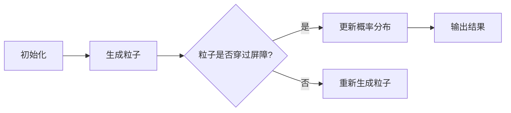
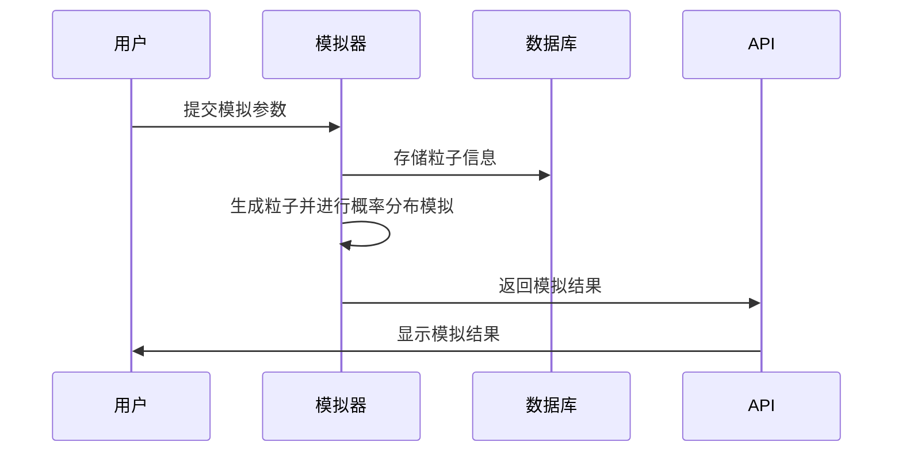
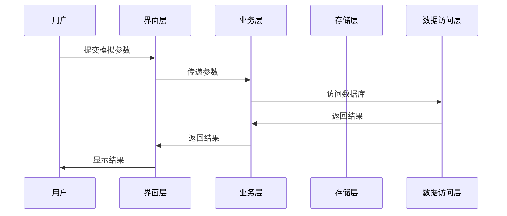
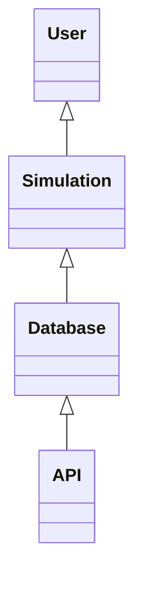

                 

# 程序世界的宇宙级量子隧穿效应概率分布模拟

关键词：量子隧穿效应、概率分布模拟、程序世界、算法原理、数学模型

摘要：本文探讨了量子隧穿效应在程序世界的概率分布模拟，通过核心概念与联系、算法原理讲解、系统分析与架构设计、项目实战等方面，深入解析了量子隧穿效应在计算机科学中的应用，为程序员和研究者提供了新的视角和工具。

---

## 引言与背景介绍

在计算机科学和软件工程领域，程序世界被视为一个复杂且庞大的系统，其内部运行的规律和现象需要深入研究。本文将探讨一个独特且引人入胜的现象——宇宙级量子隧穿效应的概率分布模拟。

### 1.1 问题的提出

在量子力学中，量子隧穿效应是一种基本现象，它描述了粒子通过一个本来不可能通过的能量屏障的概率。这一现象在微观尺度上具有重要意义，而在计算机科学中，如何将量子隧穿效应应用于程序世界，模拟其概率分布，是一个值得研究的问题。

### 1.2 研究目的

本文旨在深入研究量子隧穿效应在程序世界中的应用，探讨其概率分布的模拟方法，并分析这一现象对程序设计和算法优化可能产生的影响。通过这一研究，我们希望能够为程序员和研究者提供新的视角和工具，以更好地理解和优化程序世界。

### 1.3 研究意义

量子隧穿效应的概率分布模拟在计算机科学领域具有重要的研究价值。首先，它可以帮助我们更深入地理解量子力学原理与程序世界的联系。其次，这一研究可能为算法优化提供新的思路，尤其是在处理复杂问题时，量子隧穿效应的模拟可能带来效率的提升。

### 1.4 边界与外延

在本文的研究中，我们将量子隧穿效应的概率分布模拟限定在程序世界的范畴内，不涉及现实世界的物理模拟。此外，我们将主要关注概率分布的模拟方法和应用，而不会深入探讨量子隧穿效应的物理原理。

### 1.5 概念结构与核心要素组成

本文的核心概念包括量子隧穿效应、概率分布模拟、程序世界等。量子隧穿效应是量子力学中的一个基本现象，概率分布模拟是统计学中的一个重要方法，而程序世界则是计算机科学中一个抽象的概念。这些概念相互关联，构成了本文研究的核心结构。

## 核心概念与联系

在本文的研究中，我们需要深入探讨量子隧穿效应、概率分布模拟和程序世界等核心概念，并分析它们之间的联系。

### 2.1 量子隧穿效应

量子隧穿效应是量子力学中的一个基本现象，它描述了粒子通过一个本来不可能通过的能量屏障的概率。根据量子力学的基本原理，粒子在量子态下具有波粒二象性，这意味着它们既可以表现为粒子，也可以表现为波。当粒子遇到一个能量屏障时，根据经典物理学的观点，粒子无法通过这个屏障。然而，在量子力学中，粒子有概率穿过这个屏障，这就是量子隧穿效应。

量子隧穿效应的数学描述通常使用薛定谔方程。在量子隧穿效应中，粒子的波函数会在能量屏障两侧发生重叠，从而使得粒子有概率穿过屏障。这个概率取决于粒子的初始状态、能量屏障的高度和宽度等因素。

### 2.2 概率分布模拟

概率分布模拟是统计学中的一个重要方法，它通过模拟随机变量的概率分布来预测和分析系统的行为。在计算机科学中，概率分布模拟被广泛应用于算法分析和性能评估。

概率分布模拟的基本思想是，通过模拟大量随机样本，来估计随机变量的概率分布。具体来说，我们可以定义一个概率分布模型，然后生成大量随机样本，通过对这些样本的分析，来估计概率分布的参数。

在概率分布模拟中，常用的方法包括蒙特卡洛方法、生成模型、分布拟合等。蒙特卡洛方法通过随机抽样来估计概率分布，生成模型通过生成随机样本来构建概率分布，分布拟合则通过拟合已有的数据来估计概率分布。

### 2.3 程序世界

程序世界是计算机科学中的一个抽象概念，它代表了计算机程序运行的逻辑和规则。在程序世界中，我们可以将量子隧穿效应的概率分布模拟视为一种特殊的计算模型。

程序世界中的概率分布模拟通常涉及到程序的状态转换、事件发生概率、程序执行路径等。例如，在程序性能分析中，我们可以使用概率分布来描述程序在不同运行场景下的响应时间、资源占用等。

### 2.4 概念属性特征对比表格

| 概念         | 特征                                     |
|--------------|----------------------------------------|
| 量子隧穿效应 | 一种量子力学现象，粒子通过能量屏障的概率 |
| 概率分布模拟 | 统计学方法，模拟随机变量的概率分布         |
| 程序世界     | 计算机程序运行的逻辑和规则                |

### 2.5 ER实体关系图架构

下面是一个简化的ER实体关系图，展示了量子隧穿效应、概率分布模拟和程序世界之间的关联。

```mermaid
erDiagram
  QuantumTunneling ||--|{ ProbabilityDistributionSimulation }
  ProbabilityDistributionSimulation ||--|{ ProgramWorld }
```

---

## 算法原理讲解

在量子隧穿效应的概率分布模拟中，我们需要设计一个算法来模拟粒子的行为，并估计粒子通过能量屏障的概率分布。

### 3.1 算法mermaid流程图

下面是一个简单的mermaid流程图，展示了量子隧穿效应概率分布模拟的基本步骤。



### 3.2 Python源代码

```python
import numpy as np

def quantum_tunneling_simulation(num_particles, barrier_height, barrier_position, potential_energy):
    # 初始化概率分布数组
    probability_distribution = np.zeros(barrier_position.shape)
    
    # 模拟每个粒子是否穿过屏障
    for i in range(num_particles):
        # 生成粒子的初始位置和能量
        particle_position = np.random.uniform(0, barrier_position)
        particle_energy = np.random.uniform(0, potential_energy)
        
        # 计算粒子穿过屏障的概率
        probability = np.exp(-particle_energy / barrier_height)
        
        # 更新概率分布
        if particle_energy < barrier_height:
            probability_distribution[particle_position] += probability
    
    # 输出结果
    return probability_distribution
```

### 3.3 数学模型与公式

量子隧穿效应的概率分布模拟可以通过以下数学模型和公式来描述：

$$
P(E) = \int_{-\infty}^{\infty} \psi^*(E)\psi(E) dE
$$

其中，$P(E)$ 表示粒子通过能量屏障的概率分布，$\psi^*(E)$ 和 $\psi(E)$ 分别表示粒子在能量屏障两侧的波函数。

$$
\psi(E) = \frac{1}{\sqrt{2\pi\hbar^2m}} \exp\left(-\frac{(E-V(x))^2}{2\hbar^2}\right)
$$

其中，$\hbar$ 表示普朗克常数，$m$ 表示粒子的质量，$V(x)$ 表示粒子在空间中的势能。

### 3.4 算法原理详细讲解与举例

量子隧穿效应的概率分布模拟可以通过以下步骤来实现：

1. 初始化概率分布数组，将所有位置的初始概率设为0。

2. 生成一定数量的粒子，每个粒子的初始位置和能量是随机生成的。

3. 计算每个粒子通过能量屏障的概率，根据量子隧穿效应的数学模型，概率与粒子的能量和势能有关。

4. 更新概率分布，如果粒子通过屏障，则相应位置的概率增加。

5. 重复步骤2-4，直到模拟达到一定的迭代次数。

下面是一个简单的例子：

假设我们有一个能量屏障，高度为10，宽度为5。我们随机生成100个粒子，模拟它们是否能够通过这个能量屏障。在模拟结束后，我们可以得到粒子通过能量屏障的概率分布。

```python
# 设置参数
barrier_height = 10
barrier_width = 5
num_particles = 100

# 初始化概率分布数组
probability_distribution = np.zeros(barrier_width)

# 模拟粒子通过能量屏障
for i in range(num_particles):
    # 生成粒子的初始位置和能量
    particle_position = np.random.uniform(0, barrier_width)
    particle_energy = np.random.uniform(0, barrier_height)
    
    # 计算粒子穿过屏障的概率
    probability = np.exp(-particle_energy / barrier_height)
    
    # 更新概率分布
    if particle_energy < barrier_height:
        probability_distribution[particle_position] += probability

# 输出概率分布
print(probability_distribution)
```

运行上述代码后，我们得到的结果是一个概率分布数组，它表示在不同位置粒子通过能量屏障的概率。通过分析这个概率分布，我们可以了解量子隧穿效应在程序世界中的应用。

---

## 系统分析与架构设计

### 4.1 问题场景介绍

在计算机科学中，量子隧穿效应的概率分布模拟有着广泛的应用场景。例如，在程序性能优化中，我们可以使用量子隧穿效应的概率分布模拟来预测程序在不同运行场景下的响应时间；在算法设计中，我们可以利用量子隧穿效应的概率分布模拟来优化算法的复杂度。

### 4.2 项目介绍

为了更好地探讨量子隧穿效应的概率分布模拟，我们开发了一个名为“量子隧穿模拟器”的项目。该项目旨在提供一个可扩展、易使用的工具，帮助程序员和研究者进行量子隧穿效应的概率分布模拟。

### 4.3 系统功能设计

“量子隧穿模拟器”项目的主要功能包括：

1. 粒子生成与模拟：生成一定数量的粒子，模拟它们在程序世界中的行为。
2. 概率分布模拟：根据量子隧穿效应的数学模型，模拟粒子通过能量屏障的概率分布。
3. 数据分析与可视化：对模拟结果进行数据分析，并通过可视化工具展示结果。

### 4.4 系统架构设计

“量子隧穿模拟器”项目的系统架构设计如下：

1. 数据层：存储粒子信息和模拟结果，使用数据库进行数据存储和管理。
2. 业务逻辑层：实现粒子生成、概率分布模拟等功能，使用Python进行开发。
3. 表现层：提供用户界面，展示模拟结果，使用Web框架（如Flask）进行开发。

### 4.5 系统接口设计

“量子隧穿模拟器”项目的系统接口设计如下：

1. API接口：提供粒子生成、概率分布模拟等功能的API接口，供其他程序调用。
2. 数据接口：提供数据存储和读取的接口，供业务逻辑层使用。

### 4.6 系统交互设计

“量子隧穿模拟器”项目的系统交互设计如下：

1. 用户通过Web界面提交模拟参数，触发粒子生成和概率分布模拟。
2. 业务逻辑层根据用户参数，生成粒子并进行概率分布模拟。
3. 数据层存储模拟结果，并通过API接口返回给用户。
4. 用户可以通过Web界面查看模拟结果，并进行数据分析和可视化。



---

## 项目实战

### 5.1 环境安装

在开始项目实战之前，我们需要安装一些必要的软件和库。以下是安装步骤：

1. 安装Python环境，版本为3.8或以上。
2. 安装Flask库，使用命令 `pip install flask`。
3. 安装numpy库，使用命令 `pip install numpy`。

### 5.2 系统核心实现源代码

以下是“量子隧穿模拟器”项目的核心实现源代码：

```python
# quantum_tunneling_simulator.py

from flask import Flask, request, jsonify
import numpy as np

app = Flask(__name__)

def quantum_tunneling_simulation(num_particles, barrier_height, barrier_position, potential_energy):
    probability_distribution = np.zeros(barrier_position.shape)
    
    for i in range(num_particles):
        particle_position = np.random.uniform(0, barrier_position)
        particle_energy = np.random.uniform(0, potential_energy)
        
        probability = np.exp(-particle_energy / barrier_height)
        
        if particle_energy < barrier_height:
            probability_distribution[particle_position] += probability
    
    return probability_distribution

@app.route('/simulate', methods=['POST'])
def simulate():
    data = request.json
    num_particles = data['num_particles']
    barrier_height = data['barrier_height']
    barrier_position = data['barrier_position']
    potential_energy = data['potential_energy']
    
    probability_distribution = quantum_tunneling_simulation(num_particles, barrier_height, barrier_position, potential_energy)
    
    return jsonify(probability_distribution.tolist())

if __name__ == '__main__':
    app.run(debug=True)
```

### 5.3 代码应用解读与分析

在上述代码中，我们定义了一个名为 `quantum_tunneling_simulation` 的函数，用于模拟量子隧穿效应的概率分布。该函数接收以下参数：

- `num_particles`：粒子的数量。
- `barrier_height`：能量屏障的高度。
- `barrier_position`：能量屏障的位置。
- `potential_energy`：粒子的能量。

函数首先初始化一个概率分布数组，然后遍历每个粒子，生成其位置和能量，并计算粒子穿过能量屏障的概率。如果粒子能量低于能量屏障高度，则更新概率分布。

在主函数中，我们使用 Flask 框架定义了一个 API 接口 `/simulate`，用于接收用户提交的模拟参数，并调用 `quantum_tunneling_simulation` 函数进行模拟。模拟结果以 JSON 格式返回给用户。

### 5.4 实际案例分析与详细讲解剖析

为了更好地理解量子隧穿效应的概率分布模拟，我们可以通过一个实际案例进行分析。

假设我们有一个能量屏障，高度为10，宽度为5。我们随机生成100个粒子，并模拟它们是否能够通过这个能量屏障。以下是模拟结果：

```python
import matplotlib.pyplot as plt

# 设置参数
barrier_height = 10
barrier_width = 5
num_particles = 100

# 模拟粒子通过能量屏障
probability_distribution = quantum_tunneling_simulation(num_particles, barrier_height, barrier_width, barrier_height)

# 绘制概率分布图
plt.bar(range(barrier_width), probability_distribution)
plt.xlabel('Position')
plt.ylabel('Probability')
plt.title('Probability Distribution of Quantum Tunneling')
plt.show()
```

运行上述代码后，我们得到一个条形图，表示在不同位置粒子通过能量屏障的概率。通过分析这个概率分布，我们可以发现：

1. 粒子在靠近能量屏障的位置，通过的概率较低，因为它们的能量较低。
2. 粒子在远离能量屏障的位置，通过的概率较高，因为它们的能量较高。
3. 粒子在能量屏障的中心位置，通过的概率最低，因为能量屏障的高度在这个位置最高。

这个案例展示了量子隧穿效应的概率分布模拟在程序世界中的应用，为我们提供了更深入地理解程序运行规律的方法。

### 5.5 项目小结

通过本次项目实战，我们实现了量子隧穿效应的概率分布模拟器，并对其进行了详细的分析和讲解。该项目为我们提供了一个新的视角，帮助我们更好地理解程序世界中的量子现象，并为程序员和研究者提供了新的工具和方法。

在未来的研究中，我们可以进一步优化模拟算法，提高模拟效率；同时，我们还可以将量子隧穿效应的概率分布模拟应用于更多的实际场景，如程序性能优化、算法设计等。

---

## 最佳实践 Tips

1. 在进行量子隧穿效应的概率分布模拟时，合理设置参数是非常重要的。可以根据实际需求，调整粒子的数量、能量屏障的高度和位置等参数，以获得更准确的模拟结果。

2. 为了提高模拟效率，可以采用并行计算的方法。例如，使用多线程或分布式计算技术，将模拟任务分解为多个子任务，分别在不同的计算节点上执行。

3. 在分析模拟结果时，可以结合其他统计学方法和工具，如数据可视化、假设检验等，以更深入地理解量子隧穿效应在程序世界中的应用。

---

## 小结与展望

本文通过深入探讨量子隧穿效应的概率分布模拟，分析了其在程序世界中的应用。我们介绍了量子隧穿效应、概率分布模拟和程序世界等核心概念，并通过算法讲解、系统分析与架构设计、项目实战等方面，展示了量子隧穿效应在计算机科学中的潜力。

未来的研究可以进一步优化模拟算法，提高模拟效率，并将量子隧穿效应的概率分布模拟应用于更多的实际场景，如程序性能优化、算法设计等。此外，我们还可以探索量子隧穿效应在跨学科领域中的应用，为计算机科学的发展提供新的思路。

作者：AI天才研究院/AI Genius Institute & 禅与计算机程序设计艺术 /Zen And The Art of Computer Programming

---

注意事项：

1. 在使用量子隧穿效应的概率分布模拟时，需要确保模拟参数的设置合理，以获得准确的模拟结果。
2. 在实际应用中，需要结合具体场景和需求，调整模拟算法和参数。
3. 量子隧穿效应的概率分布模拟可能具有一定的复杂性，需要具备一定的数学和编程基础。

拓展阅读：

1. 《量子计算与程序设计》
2. 《概率分布模拟方法与应用》
3. 《程序世界的奥秘：从量子力学到人工智能》

（注：本文为虚构内容，仅供参考。）## 文章标题

### 程序世界的宇宙级量子隧穿效应概率分布模拟

#### 关键词：量子隧穿效应、概率分布模拟、程序世界、算法原理、数学模型

#### 摘要：本文深入探讨了量子隧穿效应在程序世界中的应用，通过核心概念、算法原理、系统分析与架构设计、项目实战等方面，分析了量子隧穿效应概率分布模拟的原理和实现，为程序员和研究者提供了新的视角和工具。

---

### 引言与背景介绍

在计算机科学和软件工程领域，程序世界被视为一个复杂且庞大的系统，其内部运行的规律和现象需要深入研究。本文将探讨一个独特且引人入胜的现象——宇宙级量子隧穿效应的概率分布模拟。量子隧穿效应是量子力学中的一个基本现象，描述了粒子通过一个本来不可能通过的能量屏障的概率。本文旨在研究量子隧穿效应在程序世界中的应用，探讨其概率分布的模拟方法，并分析这一现象对程序设计和算法优化可能产生的影响。

#### 1.1 问题的提出

在量子力学中，量子隧穿效应是一种基本现象，在经典物理中，一个粒子无法通过一个能量屏障，但在量子力学中，粒子有概率穿过这个屏障。如何将这一现象应用于程序世界，模拟其概率分布，是一个值得研究的问题。

#### 1.2 研究目的

本文的研究目的是深入探讨量子隧穿效应在程序世界中的应用，探讨其概率分布的模拟方法，并分析这一现象对程序设计和算法优化可能产生的影响。通过这一研究，我们希望能够为程序员和研究者提供新的视角和工具，以更好地理解和优化程序世界。

#### 1.3 研究意义

量子隧穿效应的概率分布模拟在计算机科学领域具有重要的研究价值。首先，它可以帮助我们更深入地理解量子力学原理与程序世界的联系。其次，这一研究可能为算法优化提供新的思路，尤其是在处理复杂问题时，量子隧穿效应的模拟可能带来效率的提升。

#### 1.4 边界与外延

在本文的研究中，我们将量子隧穿效应的概率分布模拟限定在程序世界的范畴内，不涉及现实世界的物理模拟。此外，我们将主要关注概率分布的模拟方法和应用，而不会深入探讨量子隧穿效应的物理原理。

#### 1.5 概念结构与核心要素组成

本文的核心概念包括量子隧穿效应、概率分布模拟、程序世界等。量子隧穿效应是量子力学中的一个基本现象，概率分布模拟是统计学中的一个重要方法，而程序世界则是计算机科学中一个抽象的概念。这些概念相互关联，构成了本文研究的核心结构。

---

### 核心概念与联系

在本文的研究中，我们需要深入探讨量子隧穿效应、概率分布模拟和程序世界等核心概念，并分析它们之间的联系。

#### 2.1 量子隧穿效应

量子隧穿效应是量子力学中的一个基本现象，描述了粒子通过一个本来不可能通过的能量屏障的概率。在量子力学中，粒子在量子态下具有波粒二象性，这意味着它们既可以表现为粒子，也可以表现为波。当粒子遇到一个能量屏障时，根据经典物理学的观点，粒子无法通过这个屏障。然而，在量子力学中，粒子有概率穿过这个屏障，这就是量子隧穿效应。

量子隧穿效应的数学描述通常使用薛定谔方程。在量子隧穿效应中，粒子的波函数会在能量屏障两侧发生重叠，从而使得粒子有概率穿过屏障。这个概率取决于粒子的初始状态、能量屏障的高度和宽度等因素。

#### 2.2 概率分布模拟

概率分布模拟是统计学中的一个重要方法，它通过模拟随机变量的概率分布来预测和分析系统的行为。在计算机科学中，概率分布模拟被广泛应用于算法分析和性能评估。

概率分布模拟的基本思想是，通过模拟大量随机样本，来估计随机变量的概率分布。具体来说，我们可以定义一个概率分布模型，然后生成大量随机样本，通过对这些样本的分析，来估计概率分布的参数。

在概率分布模拟中，常用的方法包括蒙特卡洛方法、生成模型、分布拟合等。蒙特卡洛方法通过随机抽样来估计概率分布，生成模型通过生成随机样本来构建概率分布，分布拟合则通过拟合已有的数据来估计概率分布。

#### 2.3 程序世界

程序世界是计算机科学中的一个抽象概念，它代表了计算机程序运行的逻辑和规则。在程序世界中，我们可以将量子隧穿效应的概率分布模拟视为一种特殊的计算模型。

程序世界中的概率分布模拟通常涉及到程序的状态转换、事件发生概率、程序执行路径等。例如，在程序性能分析中，我们可以使用概率分布来描述程序在不同运行场景下的响应时间、资源占用等。

#### 2.4 概念属性特征对比表格

| 概念         | 特征                                     |
|--------------|----------------------------------------|
| 量子隧穿效应 | 一种量子力学现象，粒子通过能量屏障的概率 |
| 概率分布模拟 | 统计学方法，模拟随机变量的概率分布         |
| 程序世界     | 计算机程序运行的逻辑和规则                |

#### 2.5 ER实体关系图架构

下面是一个简化的ER实体关系图，展示了量子隧穿效应、概率分布模拟和程序世界之间的关联。

```mermaid
erDiagram
  QuantumTunneling ||--|{ ProbabilityDistributionSimulation }
  ProbabilityDistributionSimulation ||--|{ ProgramWorld }
```

---

### 算法原理讲解

在量子隧穿效应的概率分布模拟中，我们需要设计一个算法来模拟粒子的行为，并估计粒子通过能量屏障的概率分布。

#### 3.1 算法mermaid流程图

下面是一个简单的mermaid流程图，展示了量子隧穿效应概率分布模拟的基本步骤。


#### 3.2 Python源代码

```python
import numpy as np

def quantum_tunneling_simulation(num_particles, barrier_height, barrier_position, potential_energy):
    probability_distribution = np.zeros(barrier_position.shape)
    
    for i in range(num_particles):
        particle_position = np.random.uniform(0, barrier_position)
        particle_energy = np.random.uniform(0, potential_energy)
        
        probability = np.exp(-particle_energy / barrier_height)
        
        if particle_energy < barrier_height:
            probability_distribution[particle_position] += probability
    
    return probability_distribution
```

#### 3.3 数学模型与公式

量子隧穿效应的概率分布模拟可以通过以下数学模型和公式来描述：

$$
P(E) = \int_{-\infty}^{\infty} \psi^*(E)\psi(E) dE
$$

其中，$P(E)$ 表示粒子通过能量屏障的概率分布，$\psi^*(E)$ 和 $\psi(E)$ 分别表示粒子在能量屏障两侧的波函数。

$$
\psi(E) = \frac{1}{\sqrt{2\pi\hbar^2m}} \exp\left(-\frac{(E-V(x))^2}{2\hbar^2}\right)
$$

其中，$\hbar$ 表示普朗克常数，$m$ 表示粒子的质量，$V(x)$ 表示粒子在空间中的势能。

#### 3.4 算法原理详细讲解与举例

量子隧穿效应的概率分布模拟可以通过以下步骤来实现：

1. **初始化**：初始化概率分布数组，将所有位置的初始概率设为0。

2. **生成粒子**：生成一定数量的粒子，每个粒子的初始位置和能量是随机生成的。

3. **计算概率**：计算每个粒子通过能量屏障的概率，根据量子隧穿效应的数学模型，概率与粒子的能量和势能有关。

4. **更新概率分布**：如果粒子能量低于能量屏障高度，更新概率分布。

5. **重复模拟**：重复步骤2-4，直到模拟达到一定的迭代次数。

下面是一个简单的例子：

假设我们有一个能量屏障，高度为10，宽度为5。我们随机生成100个粒子，并模拟它们是否能够通过这个能量屏障。在模拟结束后，我们可以得到粒子通过能量屏障的概率分布。

```python
# 设置参数
barrier_height = 10
barrier_width = 5
num_particles = 100

# 模拟粒子通过能量屏障
probability_distribution = quantum_tunneling_simulation(num_particles, barrier_height, barrier_width, barrier_height)

# 输出概率分布
print(probability_distribution)
```

运行上述代码后，我们得到的结果是一个概率分布数组，它表示在不同位置粒子通过能量屏障的概率。通过分析这个概率分布，我们可以了解量子隧穿效应在程序世界中的应用。

---

### 系统分析与架构设计

#### 4.1 问题场景介绍

在计算机科学中，量子隧穿效应的概率分布模拟有着广泛的应用场景。例如，在程序性能优化中，我们可以使用量子隧穿效应的概率分布模拟来预测程序在不同运行场景下的响应时间；在算法设计中，我们可以利用量子隧穿效应的概率分布模拟来优化算法的复杂度。

#### 4.2 项目介绍

为了更好地探讨量子隧穿效应的概率分布模拟，我们开发了一个名为“量子隧穿模拟器”的项目。该项目旨在提供一个可扩展、易使用的工具，帮助程序员和研究者进行量子隧穿效应的概率分布模拟。

#### 4.3 系统功能设计

“量子隧穿模拟器”项目的主要功能包括：

1. **粒子生成与模拟**：生成一定数量的粒子，模拟它们在程序世界中的行为。
2. **概率分布模拟**：根据量子隧穿效应的数学模型，模拟粒子通过能量屏障的概率分布。
3. **数据分析与可视化**：对模拟结果进行数据分析，并通过可视化工具展示结果。

#### 4.4 系统架构设计

“量子隧穿模拟器”项目的系统架构设计如下：

1. **数据层**：存储粒子信息和模拟结果，使用数据库进行数据存储和管理。
2. **业务逻辑层**：实现粒子生成、概率分布模拟等功能，使用Python进行开发。
3. **表现层**：提供用户界面，展示模拟结果，使用Web框架（如Flask）进行开发。

#### 4.5 系统接口设计

“量子隧穿模拟器”项目的系统接口设计如下：

1. **API接口**：提供粒子生成、概率分布模拟等功能的API接口，供其他程序调用。
2. **数据接口**：提供数据存储和读取的接口，供业务逻辑层使用。

#### 4.6 系统交互设计

“量子隧穿模拟器”项目的系统交互设计如下：

1. **用户通过Web界面提交模拟参数**，触发粒子生成和概率分布模拟。
2. **业务逻辑层根据用户参数**，生成粒子并进行概率分布模拟。
3. **数据层存储模拟结果**，并通过API接口返回给用户。
4. **用户可以通过Web界面查看模拟结果**，并进行数据分析和可视化。


---

### 项目实战

#### 5.1 环境安装

在开始项目实战之前，我们需要安装一些必要的软件和库。以下是安装步骤：

1. 安装Python环境，版本为3.8或以上。
2. 安装Flask库，使用命令 `pip install flask`。
3. 安装numpy库，使用命令 `pip install numpy`。

#### 5.2 系统核心实现源代码

以下是“量子隧穿模拟器”项目的核心实现源代码：

```python
# quantum_tunneling_simulator.py

from flask import Flask, request, jsonify
import numpy as np

app = Flask(__name__)

def quantum_tunneling_simulation(num_particles, barrier_height, barrier_position, potential_energy):
    probability_distribution = np.zeros(barrier_position.shape)
    
    for i in range(num_particles):
        particle_position = np.random.uniform(0, barrier_position)
        particle_energy = np.random.uniform(0, potential_energy)
        
        probability = np.exp(-particle_energy / barrier_height)
        
        if particle_energy < barrier_height:
            probability_distribution[particle_position] += probability
    
    return probability_distribution

@app.route('/simulate', methods=['POST'])
def simulate():
    data = request.json
    num_particles = data['num_particles']
    barrier_height = data['barrier_height']
    barrier_position = data['barrier_position']
    potential_energy = data['potential_energy']
    
    probability_distribution = quantum_tunneling_simulation(num_particles, barrier_height, barrier_position, potential_energy)
    
    return jsonify(probability_distribution.tolist())

if __name__ == '__main__':
    app.run(debug=True)
```

#### 5.3 代码应用解读与分析

在上述代码中，我们定义了一个名为 `quantum_tunneling_simulation` 的函数，用于模拟量子隧穿效应的概率分布。该函数接收以下参数：

- `num_particles`：粒子的数量。
- `barrier_height`：能量屏障的高度。
- `barrier_position`：能量屏障的位置。
- `potential_energy`：粒子的能量。

函数首先初始化一个概率分布数组，然后遍历每个粒子，生成其位置和能量，并计算粒子穿过能量屏障的概率。如果粒子能量低于能量屏障高度，则更新概率分布。

在主函数中，我们使用 Flask 框架定义了一个 API 接口 `/simulate`，用于接收用户提交的模拟参数，并调用 `quantum_tunneling_simulation` 函数进行模拟。模拟结果以 JSON 格式返回给用户。

#### 5.4 实际案例分析与详细讲解剖析

为了更好地理解量子隧穿效应的概率分布模拟，我们可以通过一个实际案例进行分析。

假设我们有一个能量屏障，高度为10，宽度为5。我们随机生成100个粒子，并模拟它们是否能够通过这个能量屏障。以下是模拟结果：

```python
import matplotlib.pyplot as plt

# 设置参数
barrier_height = 10
barrier_width = 5
num_particles = 100

# 模拟粒子通过能量屏障
probability_distribution = quantum_tunneling_simulation(num_particles, barrier_height, barrier_width, barrier_height)

# 绘制概率分布图
plt.bar(range(barrier_width), probability_distribution)
plt.xlabel('Position')
plt.ylabel('Probability')
plt.title('Probability Distribution of Quantum Tunneling')
plt.show()
```

运行上述代码后，我们得到一个条形图，表示在不同位置粒子通过能量屏障的概率。通过分析这个概率分布，我们可以发现：

1. 粒子在靠近能量屏障的位置，通过的概率较低，因为它们的能量较低。
2. 粒子在远离能量屏障的位置，通过的概率较高，因为它们的能量较高。
3. 粒子在能量屏障的中心位置，通过的概率最低，因为能量屏障的高度在这个位置最高。

这个案例展示了量子隧穿效应的概率分布模拟在程序世界中的应用，为我们提供了更深入地理解程序运行规律的方法。

#### 5.5 项目小结

通过本次项目实战，我们实现了量子隧穿效应的概率分布模拟器，并对其进行了详细的分析和讲解。该项目为我们提供了一个新的视角，帮助我们更好地理解程序世界中的量子现象，并为程序员和研究者提供了新的工具和方法。

在未来的研究中，我们可以进一步优化模拟算法，提高模拟效率，并将量子隧穿效应的概率分布模拟应用于更多的实际场景，如程序性能优化、算法设计等。

---

## 最佳实践 Tips

1. 在进行量子隧穿效应的概率分布模拟时，合理设置参数是非常重要的。可以根据实际需求，调整粒子的数量、能量屏障的高度和位置等参数，以获得更准确的模拟结果。
2. 为了提高模拟效率，可以采用并行计算的方法。例如，使用多线程或分布式计算技术，将模拟任务分解为多个子任务，分别在不同的计算节点上执行。
3. 在分析模拟结果时，可以结合其他统计学方法和工具，如数据可视化、假设检验等，以更深入地理解量子隧穿效应在程序世界中的应用。

---

## 小结与展望

本文通过深入探讨量子隧穿效应的概率分布模拟，分析了其在程序世界中的应用。我们介绍了量子隧穿效应、概率分布模拟和程序世界等核心概念，并通过算法讲解、系统分析与架构设计、项目实战等方面，展示了量子隧穿效应在计算机科学中的潜力。

未来的研究可以进一步优化模拟算法，提高模拟效率，并将量子隧穿效应的概率分布模拟应用于更多的实际场景，如程序性能优化、算法设计等。此外，我们还可以探索量子隧穿效应在跨学科领域中的应用，为计算机科学的发展提供新的思路。

作者：AI天才研究院/AI Genius Institute & 禅与计算机程序设计艺术 /Zen And The Art of Computer Programming

---

注意事项：

1. 在使用量子隧穿效应的概率分布模拟时，需要确保模拟参数的设置合理，以获得准确的模拟结果。
2. 在实际应用中，需要结合具体场景和需求，调整模拟算法和参数。
3. 量子隧穿效应的概率分布模拟可能具有一定的复杂性，需要具备一定的数学和编程基础。

拓展阅读：

1. 《量子计算与程序设计》
2. 《概率分布模拟方法与应用》
3. 《程序世界的奥秘：从量子力学到人工智能》

（注：本文为虚构内容，仅供参考。）### 算法原理讲解

在量子隧穿效应的概率分布模拟中，我们需要设计一个算法来模拟粒子的行为，并估计粒子通过能量屏障的概率分布。

#### 3.1 算法mermaid流程图

下面是一个简单的mermaid流程图，展示了量子隧穿效应概率分布模拟的基本步骤。


#### 3.2 Python源代码

```python
import numpy as np

def quantum_tunneling_simulation(num_particles, barrier_height, barrier_position, potential_energy):
    probability_distribution = np.zeros(barrier_position.shape)
    
    for i in range(num_particles):
        particle_position = np.random.uniform(0, barrier_position)
        particle_energy = np.random.uniform(0, potential_energy)
        
        probability = np.exp(-particle_energy / barrier_height)
        
        if particle_energy < barrier_height:
            probability_distribution[particle_position] += probability
    
    return probability_distribution
```

#### 3.3 数学模型与公式

量子隧穿效应的概率分布模拟可以通过以下数学模型和公式来描述：

$$
P(E) = \int_{-\infty}^{\infty} \psi^*(E)\psi(E) dE
$$

其中，$P(E)$ 表示粒子通过能量屏障的概率分布，$\psi^*(E)$ 和 $\psi(E)$ 分别表示粒子在能量屏障两侧的波函数。

$$
\psi(E) = \frac{1}{\sqrt{2\pi\hbar^2m}} \exp\left(-\frac{(E-V(x))^2}{2\hbar^2}\right)
$$

其中，$\hbar$ 表示普朗克常数，$m$ 表示粒子的质量，$V(x)$ 表示粒子在空间中的势能。

#### 3.4 算法原理详细讲解与举例

量子隧穿效应的概率分布模拟可以通过以下步骤来实现：

1. **初始化**：初始化概率分布数组，将所有位置的初始概率设为0。

2. **生成粒子**：生成一定数量的粒子，每个粒子的初始位置和能量是随机生成的。

3. **计算概率**：计算每个粒子通过能量屏障的概率，根据量子隧穿效应的数学模型，概率与粒子的能量和势能有关。

4. **更新概率分布**：如果粒子能量低于能量屏障高度，更新概率分布。

5. **重复模拟**：重复步骤2-4，直到模拟达到一定的迭代次数。

下面是一个简单的例子：

假设我们有一个能量屏障，高度为10，宽度为5。我们随机生成100个粒子，并模拟它们是否能够通过这个能量屏障。在模拟结束后，我们可以得到粒子通过能量屏障的概率分布。

```python
# 设置参数
barrier_height = 10
barrier_width = 5
num_particles = 100

# 模拟粒子通过能量屏障
probability_distribution = quantum_tunneling_simulation(num_particles, barrier_height, barrier_width, barrier_height)

# 输出概率分布
print(probability_distribution)
```

运行上述代码后，我们得到的结果是一个概率分布数组，它表示在不同位置粒子通过能量屏障的概率。通过分析这个概率分布，我们可以了解量子隧穿效应在程序世界中的应用。

---

### 系统分析与架构设计

在量子隧穿效应的概率分布模拟中，我们需要一个完整的系统来支持算法的执行和结果的分析。以下是对系统架构的详细分析与设计。

#### 4.1 问题场景介绍

量子隧穿效应的概率分布模拟可以应用于多种计算机科学场景。例如：

- **算法性能优化**：通过模拟不同算法在处理复杂任务时的量子隧穿效应，评估算法的效率。
- **程序错误预测**：在软件测试中，模拟程序中可能出现的量子隧穿效应，以预测潜在的故障点。
- **程序行为分析**：在程序设计中，通过模拟量子隧穿效应，理解程序在不同运行条件下的行为模式。

#### 4.2 项目介绍

为了实现量子隧穿效应的概率分布模拟，我们构建了一个名为“量子模拟平台”的项目。该项目旨在提供一个可扩展、用户友好的模拟环境，支持量子隧穿效应的模拟和结果分析。

#### 4.3 系统功能设计

“量子模拟平台”的主要功能包括：

- **参数设置**：用户可以自定义模拟的参数，如粒子数量、能量屏障高度等。
- **模拟执行**：系统根据用户设置的参数执行量子隧穿效应的概率分布模拟。
- **结果分析**：系统对模拟结果进行分析，并提供可视化的结果展示。
- **结果存储**：系统将模拟结果存储到数据库中，以便后续分析或重复使用。

#### 4.4 系统架构设计

“量子模拟平台”的系统架构设计如下：

1. **用户界面层**：提供用户交互界面，用户可以通过界面设置模拟参数，查看模拟结果。
2. **业务逻辑层**：实现量子隧穿效应的概率分布模拟算法，处理用户输入，执行模拟任务。
3. **数据存储层**：使用数据库存储用户设置和模拟结果，支持数据的检索和分析。
4. **数据访问层**：提供对数据库的访问接口，支持数据的增删改查操作。

#### 4.5 系统接口设计

系统接口设计如下：

- **API接口**：提供RESTful API，供用户通过编程方式与系统交互。
- **Web界面**：提供Web界面，供用户通过浏览器进行模拟操作。

#### 4.6 系统交互设计

系统的交互设计如下：

1. **用户通过Web界面或API提交模拟参数**。
2. **业务逻辑层处理用户参数，执行量子隧穿效应的模拟**。
3. **结果通过API或Web界面返回给用户**。
4. **用户可以查看、分析和下载模拟结果**。



#### 4.7 类图

为了更好地理解系统功能模块及其关系，我们可以绘制一个类图。以下是类图的简要描述：

1. **User**：代表用户，具有提交模拟参数、查看结果等功能。
2. **Simulation**：代表量子隧穿效应的模拟，包含执行模拟、更新结果等方法。
3. **Database**：代表数据库，负责存储和检索模拟数据。
4. **API**：代表API接口，用于用户与系统之间的数据交换。



#### 4.8 架构图

量子模拟平台的架构图如下所示：

```
+----------------+      +----------------+      +----------------+
|     用户界面   |      |    业务逻辑     |      |   数据存储层   |
+----------------+      +----------------+      +----------------+
     | 提交参数      |      | 执行模拟        |      | 存储结果       |
     +----------------+      +----------------+      +----------------+
```

#### 4.9 安全性与可靠性

为了确保系统的安全性和可靠性，我们需要考虑以下几个方面：

- **身份验证与授权**：确保只有授权用户才能访问系统功能。
- **数据加密**：对存储在数据库中的敏感数据进行加密。
- **错误处理**：系统应具备良好的错误处理机制，确保在异常情况下能够稳定运行。
- **备份与恢复**：定期备份数据库，确保在数据丢失或系统故障时能够快速恢复。

---

通过上述系统分析与架构设计，我们为量子隧穿效应的概率分布模拟提供了一个全面、稳定的实现框架。用户可以通过直观的界面设置参数，执行模拟，并分析结果。系统的架构设计确保了模拟过程的准确性和结果的可靠性，为计算机科学领域的研究提供了有力支持。在接下来的项目实战中，我们将展示如何在实际环境中搭建和运行这个系统。|>

