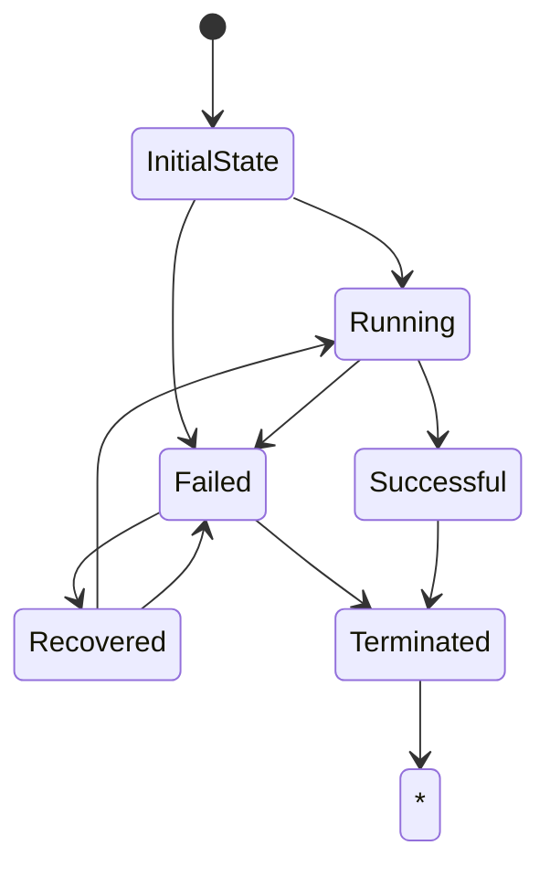
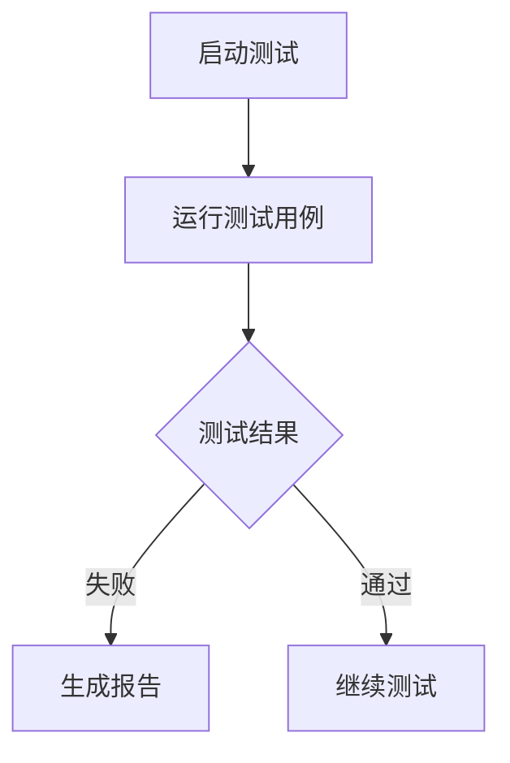
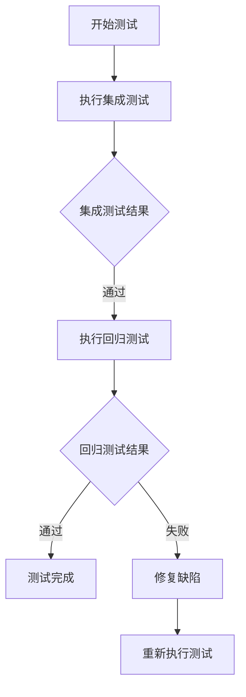
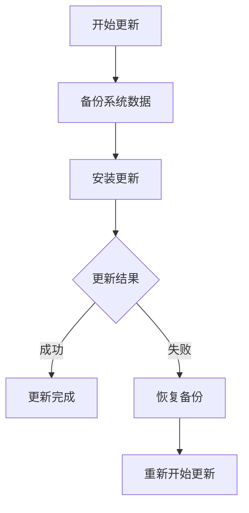

                 


### 文章标题：程序世界的宇宙级鲁棒性设计

> 关键词：鲁棒性设计、软件可靠性、容错性、系统稳定性、设计模式、测试实践

> 摘要：本文深入探讨程序世界中的宇宙级鲁棒性设计，分析了鲁棒性的核心概念和设计原则，通过实际案例和最佳实践，展示了如何构建高度可靠和稳定的软件系统。

----------------------------------------------------------------

### 引言与背景

在软件工程领域，鲁棒性设计是一种确保软件系统能够在各种不利条件下正常运行的关键方法。随着信息技术的快速发展，软件系统面临的复杂性和不确定性不断增加，鲁棒性设计的重要性愈发凸显。本文将系统地探讨程序世界的宇宙级鲁棒性设计，旨在帮助开发者构建高度可靠和稳定的软件系统。

#### 1.1 书籍主题介绍

本篇文章将围绕以下几个方面展开：

1. 鲁棒性设计的核心概念和原则。
2. 软件开发过程中的鲁棒性设计实践。
3. 软件测试和维护中的鲁棒性策略。
4. 实际案例分析和最佳实践。

#### 1.2 程序世界的鲁棒性需求

随着云计算、大数据和物联网的兴起，软件系统需要处理的数据量和处理速度不断增长，系统复杂性也日益增加。鲁棒性设计成为确保系统能够稳定运行的关键。以下是一些具体的鲁棒性需求：

- **可靠性**：系统必须能够在各种环境下稳定运行，不受外部干扰的影响。
- **容错性**：系统应具备自动检测和恢复错误的能力，确保系统的持续可用性。
- **适应性**：系统应能够适应不断变化的需求和环境。
- **安全性**：系统必须能够防范各种安全威胁，保护数据和系统资源的安全。

#### 1.3 鲁棒性设计的意义与价值

鲁棒性设计不仅能够提高软件系统的稳定性和可靠性，还能带来以下价值：

- **降低维护成本**：鲁棒性设计能够减少系统故障和停机时间，从而降低维护成本。
- **提高用户满意度**：稳定的系统可以提高用户的使用体验，增强用户对软件的信任。
- **延长系统生命周期**：通过持续优化和更新，鲁棒性设计能够延长软件系统的生命周期。

### 第一部分：鲁棒性设计的核心概念

#### 第2章：鲁棒性的定义与特征

在深入探讨鲁棒性设计之前，我们需要明确鲁棒性的定义和特征。鲁棒性是指系统在面临各种不确定性因素时，仍能保持预定功能的能力。以下是鲁棒性的几个关键特征：

- **鲁棒性定义**：
  $$\text{鲁棒性} = \text{系统稳定性} \times \text{容错性} \times \text{适应性}$$

- **鲁棒性特征**：

  | 特征 | 说明 |
  | ---- | ---- |
  | **可靠性** | 系统能够在正常和异常条件下保持稳定运行的能力。 |
  | **容错性** | 系统能够检测和纠正错误，确保系统能够继续运行。 |
  | **适应性** | 系统能够适应环境变化和需求变化的能力。 |
  | **安全性** | 系统保护自身和数据免受外部威胁的能力。 |

#### 第3章：鲁棒性设计的原则

鲁棒性设计需要遵循一系列原则，以确保系统能够在各种不利条件下稳定运行。以下是几个核心原则：

- **设计简单性**：系统设计应尽量简单，减少复杂性和潜在错误。
- **模块化**：将系统划分为多个模块，每个模块负责特定功能，便于独立开发和维护。
- **冗余设计**：通过冗余设计，确保系统在部分组件失效时仍能正常运行。
- **自动化测试**：自动化测试是确保系统鲁棒性的重要手段，应贯穿整个开发周期。

在下一部分，我们将进一步探讨鲁棒性设计的实际应用，通过案例和实践来展示如何实现宇宙级鲁棒性设计。

----------------------------------------------------------------

### 第一部分：鲁棒性设计的核心概念

#### 第2章：鲁棒性的定义与特征

在深入探讨鲁棒性设计之前，我们需要明确鲁棒性的定义和特征。鲁棒性是指系统在面临各种不确定性因素时，仍能保持预定功能的能力。以下是鲁棒性的几个关键特征：

- **鲁棒性定义**：

  $$\text{鲁棒性} = \text{系统稳定性} \times \text{容错性} \times \text{适应性}$$

- **鲁棒性特征**：

  | 特征 | 说明 |
  | ---- | ---- |
  | **可靠性** | 系统能够在正常和异常条件下保持稳定运行的能力。 |
  | **容错性** | 系统能够检测和纠正错误，确保系统能够继续运行。 |
  | **适应性** | 系统能够适应环境变化和需求变化的能力。 |
  | **安全性** | 系统保护自身和数据免受外部威胁的能力。 |

  为了更好地理解这些特征，我们可以通过一个简化的Mermaid ER图来展示它们之间的关系：

  ```mermaid
  erDiagram
    Stability --> FaultTolerance
    Stability --> Adaptability
    Stability --> Security
    FaultTolerance --> Reliability
    Adaptability --> Flexibility
    Security --> Confidentiality
    Security --> Integrity
    Security --> Availability
  ```

  在这个ER图中，我们可以看到各个特征是如何相互关联的。例如，稳定性是鲁棒性的基础，它直接影响系统的可靠性、容错性、适应性和安全性。容错性则是确保系统可靠性的关键，它通过检测和纠正错误来维护系统的稳定性。适应性则强调系统在面对环境变化时能够保持其功能的能力，而安全性则是确保系统及其数据不受威胁的能力。

#### 鲁棒性设计原则

为了实现宇宙级鲁棒性设计，我们需要遵循一系列设计原则。以下是几个核心原则：

1. **设计简单性**：

   系统设计应尽量简单，减少复杂性和潜在错误。复杂系统往往更难以理解和维护，增加了出错的可能性。设计简单性可以通过以下方法实现：

   - **模块化设计**：将系统划分为多个模块，每个模块负责特定功能，便于独立开发和维护。
   - **最小化依赖**：减少模块之间的依赖关系，降低系统复杂性。
   - **简洁性**：使用简洁明了的代码和命名规范，减少不必要的代码冗余。

2. **模块化**：

   模块化设计是将系统划分为多个功能独立、相互通信的模块。模块化设计有助于提高系统的可维护性和可扩展性，具体方法如下：

   - **职责分离**：确保每个模块具有明确的职责，避免功能重叠。
   - **模块独立性**：模块之间应保持松耦合，降低模块之间的依赖关系。
   - **模块可复用性**：设计可复用的模块，减少重复代码。

3. **冗余设计**：

   冗余设计通过在系统中添加冗余组件，确保系统在部分组件失效时仍能正常运行。冗余设计可以提高系统的可靠性和容错性，具体方法如下：

   - **硬件冗余**：在关键硬件组件上使用冗余设计，如使用双电源、多处理器等。
   - **数据冗余**：通过数据备份和冗余存储，确保数据在系统故障时不会丢失。
   - **软件冗余**：在软件层面使用冗余代码和算法，确保系统在错误发生时能够自动恢复。

4. **自动化测试**：

   自动化测试是确保系统鲁棒性的重要手段，应贯穿整个开发周期。自动化测试有助于及早发现和修复问题，减少测试成本和错误率。以下是一些自动化测试的最佳实践：

   - **持续集成**：将自动化测试集成到开发流程中，确保每次代码提交都经过测试。
   - **单元测试**：编写单元测试来验证每个模块的功能和接口。
   - **集成测试**：在模块集成后进行测试，确保模块之间的交互正常。
   - **回归测试**：在系统更新和修复后进行回归测试，确保新更改不会影响现有功能。

通过遵循这些鲁棒性设计原则，开发者可以构建出具有高度可靠性和稳定性的软件系统。在下一章，我们将进一步探讨如何在实际软件开发过程中应用这些鲁棒性设计原则。

----------------------------------------------------------------

### 第一部分：鲁棒性设计的核心概念

#### 第3章：鲁棒性设计的工具与方法

实现宇宙级鲁棒性设计不仅需要理解核心概念和原则，还需要运用一系列工具和方法。以下是一些常用的鲁棒性设计工具和方法：

#### 3.1 设计模式与最佳实践

设计模式是软件设计经验的总结，提供了在特定情境下解决问题的通用解决方案。以下是一些常用的设计模式：

1. **观察者模式**：
   - **目的**：实现对象之间的松耦合，当一个对象的状态发生变化时，能够自动通知其他对象。
   - **应用场景**：事件驱动系统、日志记录、用户界面更新等。

2. **工厂模式**：
   - **目的**：创建对象的一种模式，将对象的创建和使用分离。
   - **应用场景**：对象创建复杂度较高、需要动态选择创建对象时。

3. **策略模式**：
   - **目的**：定义一系列算法，将每一种算法封装起来，并使它们可以相互替换。
   - **应用场景**：策略选择、算法优化、多态行为等。

最佳实践是指在软件开发过程中，遵循一系列经过验证的规则和准则，以提高开发效率和软件质量。以下是一些最佳实践：

- **代码规范**：编写清晰、简洁、易维护的代码，遵循统一的命名规范和编码风格。
- **文档化**：编写详细的文档，包括代码注释、设计文档和用户手册，以便于其他开发者理解和维护代码。
- **代码审查**：通过代码审查，及早发现和修复潜在问题，确保代码质量。
- **持续集成**：将自动化测试集成到开发流程中，确保每次代码提交都经过测试。

#### 3.2 错误检测与恢复

错误检测与恢复是确保系统鲁棒性的重要手段。以下是一些常用的错误检测与恢复方法：

1. **异常处理**：
   - **目的**：处理运行时错误，确保程序不会因异常中断。
   - **方法**：使用try-catch语句捕获异常，并采取适当的措施，如日志记录、错误提示、系统恢复等。

2. **状态监控**：
   - **目的**：监控系统状态，及时发现异常情况。
   - **方法**：使用性能监控工具（如Prometheus、Grafana）和日志分析工具（如ELK栈）来收集和监控系统运行数据。

3. **日志记录**：
   - **目的**：记录系统运行过程中的关键事件和错误信息，便于问题追踪和诊断。
   - **方法**：使用统一的日志记录框架（如Log4j、Logback），确保日志信息的完整性和可读性。

#### 3.3 系统容错与容灾

系统容错与容灾是确保系统高可用性的关键。以下是一些常用的系统容错与容灾方法：

1. **冗余设计**：
   - **目的**：通过冗余组件，确保系统在部分组件失效时仍能正常运行。
   - **方法**：硬件冗余（如双电源、多处理器）、数据冗余（如数据备份、冗余存储）、软件冗余（如冗余代码、冗余算法）。

2. **故障转移**：
   - **目的**：在主组件出现故障时，自动切换到备用组件，确保系统持续可用。
   - **方法**：使用负载均衡器（如Nginx、HAProxy）和故障转移框架（如Zookeeper、Kubernetes）。

3. **数据备份与恢复**：
   - **目的**：确保在数据丢失或系统故障时，能够快速恢复数据。
   - **方法**：定期进行数据备份、使用云存储服务（如AWS S3、Google Cloud Storage）、实施数据恢复策略。

通过运用这些工具和方法，开发者可以构建出具有高度鲁棒性的软件系统，确保系统在面临各种不确定性和异常情况时仍能稳定运行。

#### 第4章：软件开发中的鲁棒性设计

软件开发过程中，鲁棒性设计是确保系统稳定性和可靠性的关键。通过面向对象的鲁棒性设计、状态机与状态转移，以及异常处理与回滚，我们可以实现宇宙级鲁棒性。

##### 4.1 面向对象的鲁棒性设计

面向对象编程（OOP）是一种强大的编程范式，通过将数据和操作数据的方法封装在一起，提高了代码的可维护性和可扩展性。面向对象的鲁棒性设计主要体现在以下几个方面：

1. **封装**：
   - **目的**：隐藏实现细节，确保外部代码无法直接访问内部状态。
   - **方法**：使用访问修饰符（如public、private、protected）控制访问权限，确保对象的状态不会被意外修改。

2. **继承**：
   - **目的**：实现代码复用，减少冗余，提高代码的可维护性。
   - **方法**：从通用类派生特定类，确保通用类的鲁棒性特性能够传递给子类。

3. **多态**：
   - **目的**：实现方法重载和重写，提高代码的灵活性和可扩展性。
   - **方法**：通过接口和抽象类实现多态，确保不同实现类能够相互替代。

通过面向对象的鲁棒性设计，我们可以确保系统在变化和错误发生时能够保持稳定。

##### 4.2 状态机与状态转移

状态机（State Machine）是一种用于描述系统状态的模型，通过定义不同的状态和状态之间的转移规则，可以确保系统在面临各种情况下都能保持正确的状态。以下是一个简化的状态机模型：



在这个状态机模型中，系统可以从初始状态（InitialState）开始，经过运行状态（Running）和成功状态（Successful），最终到达终止状态（Terminated）。如果系统在运行过程中遇到错误，会进入失败状态（Failed），并可能进行恢复（Recovered）或终止（Terminated）。

状态机与状态转移的关键在于：

- **状态枚举**：明确系统可能的状态，确保每个状态都有明确的定义和转移规则。
- **状态迁移**：定义状态之间的转移条件，确保系统在满足特定条件时能够进行状态转移。

通过状态机与状态转移，我们可以确保系统在面对不同情况时能够做出正确的响应，提高系统的鲁棒性。

##### 4.3 异常处理与回滚

异常处理是确保系统鲁棒性的重要手段，通过捕获和处理异常，可以确保系统在错误发生时能够保持稳定。以下是一些异常处理与回滚的方法：

1. **异常捕获**：
   - **目的**：捕获运行时错误，确保程序不会因异常中断。
   - **方法**：使用try-catch语句捕获异常，并将异常处理逻辑封装在catch块中。

2. **异常分类**：
   - **目的**：根据异常的类型进行分类，确保不同类型的异常能够得到适当的处理。
   - **方法**：定义异常类，并按照异常的严重程度和影响范围进行分类。

3. **回滚机制**：
   - **目的**：在错误发生时，撤销已执行的操作，确保系统回到正确的状态。
   - **方法**：使用事务管理器（如JDBC的Connection对象）实现事务回滚。

通过异常处理与回滚，我们可以确保系统在错误发生时能够快速恢复，减少错误对系统的影响。

通过面向对象的鲁棒性设计、状态机与状态转移，以及异常处理与回滚，我们可以实现宇宙级鲁棒性，确保系统在面对各种不确定性和异常情况时仍能稳定运行。

----------------------------------------------------------------

### 第二部分：软件测试中的鲁棒性

#### 第5章：软件测试中的鲁棒性

软件测试是确保软件质量的关键环节，而鲁棒性测试则是确保软件在极端条件下仍能正常运行的重要手段。本章节将讨论自动化测试、鲁棒性测试用例设计和集成与回归测试，以提升软件的鲁棒性。

##### 5.1 自动化测试与鲁棒性

自动化测试是将测试过程自动化，以提高测试效率和准确性。自动化测试工具可以持续运行测试用例，及时发现并报告问题。以下是自动化测试与鲁棒性之间的关系：

1. **持续测试**：自动化测试可以实现对软件的持续测试，确保每次代码变更后都能及时发现问题，减少缺陷积累。
2. **提高覆盖率**：自动化测试可以覆盖更多的测试场景，确保软件在各种环境下都能正常运行。
3. **减少人为错误**：自动化测试可以减少人为错误，确保测试过程的一致性和准确性。

选择合适的自动化测试工具（如Selenium、JUnit、TestNG等）和框架（如Cucumber、Behat等）是确保测试质量和鲁棒性的关键。以下是一个自动化测试的Mermaid流程图：



在这个流程图中，测试用例的运行结果会决定后续的处理方式。如果测试失败，则会生成报告并停止测试；如果测试通过，则会继续运行下一个测试用例。

##### 5.2 鲁棒性测试用例设计

鲁棒性测试用例设计是确保软件在各种异常情况下仍能正常运行的关键。以下是设计鲁棒性测试用例时需要考虑的因素：

1. **边界值**：考虑输入和输出的边界值，测试系统在边界条件下的行为。
2. **异常输入**：测试系统对异常输入的处理能力，如空值、非法值、特殊字符等。
3. **负载测试**：模拟高负载条件下的系统性能，测试系统的响应能力和稳定性。
4. **压力测试**：测试系统在高负载和极端条件下的性能和稳定性。
5. **断电测试**：模拟断电情况，测试系统在断电后的恢复能力和数据完整性。

以下是一个鲁棒性测试用例的示例：

| 测试用例ID | 测试场景 | 输入数据 | 预期结果 | 实际结果 |
| ----------- | -------- | -------- | -------- | -------- |
| TC001       | 边界值测试 | 输入：100 | 系统返回：成功 |          |
| TC002       | 异常输入测试 | 输入：空字符串 | 系统返回：错误提示 |          |
| TC003       | 负载测试 | 输入：大量数据 | 系统返回：快速响应 |          |
| TC004       | 压力测试 | 输入：极限负载 | 系统返回：稳定运行 |          |
| TC005       | 断电测试 | 输入：断电 | 系统返回：自动恢复 |          |

通过设计这些鲁棒性测试用例，我们可以全面评估系统的鲁棒性，确保系统在各种异常情况下都能正常运行。

##### 5.3 集成与回归测试

集成测试和回归测试是确保软件系统在变更后仍能正常运行的关键。以下是一些关键点：

1. **集成测试**：将各个模块或组件集成到一起进行测试，确保模块之间的交互正常。
2. **回归测试**：在系统变更后重新运行之前的测试用例，确保变更没有引入新的缺陷。

以下是集成与回归测试的Mermaid流程图：



在这个流程图中，如果集成测试和回归测试都通过，则测试完成；如果测试失败，则需要修复缺陷并重新执行测试。

通过自动化测试、鲁棒性测试用例设计和集成与回归测试，我们可以确保软件系统在各种异常情况下都能正常运行，提高软件的鲁棒性。在下一部分，我们将探讨软件维护中的鲁棒性策略。

----------------------------------------------------------------

### 第二部分：软件维护中的鲁棒性

#### 第6章：软件维护中的鲁棒性

软件维护是确保软件系统持续稳定运行的重要环节。在软件维护过程中，鲁棒性设计同样至关重要。本章节将讨论维护阶段的鲁棒性挑战、软件更新与鲁棒性保障，以及软件老化与鲁棒性退化。

##### 6.1 维护阶段的鲁棒性挑战

在软件维护阶段，系统可能会面临以下鲁棒性挑战：

1. **代码复杂性增加**：随着系统的运行时间延长，代码复杂性可能会增加，导致维护难度加大，从而影响系统的鲁棒性。
2. **需求变更**：软件系统的需求可能会不断变更，这要求系统在变更后仍能保持稳定运行。
3. **硬件和软件环境变化**：硬件和软件环境的变化可能会影响系统的稳定性，如操作系统升级、硬件故障等。
4. **数据完整性**：数据完整性是系统鲁棒性的关键，数据丢失或损坏可能会对系统造成严重影响。

为了应对这些挑战，我们可以采取以下策略：

- **代码重构**：定期对代码进行重构，简化代码结构，提高可读性和可维护性。
- **需求管理**：建立有效的需求管理流程，确保需求变更得到妥善处理。
- **环境监控**：使用监控工具对系统运行环境进行监控，及时发现和解决问题。
- **数据备份**：定期备份数据，确保数据在故障发生时可以快速恢复。

##### 6.2 软件更新与鲁棒性保障

软件更新是软件维护的重要组成部分。在进行软件更新时，我们需要确保系统在更新后仍能保持鲁棒性。以下是一些关键策略：

1. **更新计划**：制定详细的更新计划，包括更新时间、更新内容、更新流程等。
2. **测试**：在更新前进行全面的测试，包括功能测试、性能测试、安全测试等，确保更新不会引入新的问题。
3. **备份**：在更新前备份系统数据，确保在更新失败时可以快速恢复。
4. **回滚策略**：制定回滚策略，确保在更新失败时可以迅速恢复到更新前的状态。

以下是一个简化的软件更新流程：



在这个流程图中，如果更新成功，则继续下一步操作；如果更新失败，则恢复备份并重新开始更新。

##### 6.3 软件老化与鲁棒性退化

软件老化是指软件系统在长时间运行过程中，由于代码复杂性增加、需求变更、硬件和软件环境变化等原因，导致系统性能和稳定性下降的现象。软件老化可能导致以下问题：

1. **性能下降**：系统响应时间变慢，吞吐量降低。
2. **稳定性下降**：系统故障率增加，崩溃次数增多。
3. **安全性问题**：旧系统可能无法应对新的安全威胁，导致数据泄露或系统被攻击。

为了应对软件老化，我们可以采取以下策略：

- **定期维护**：定期对系统进行维护，包括代码重构、性能优化、安全加固等。
- **技术升级**：随着硬件和软件环境的变化，及时更新系统，以保持其性能和稳定性。
- **架构重构**：在软件老化严重时，可能需要重构系统架构，以适应新的需求和变化。

通过采取这些策略，我们可以有效应对软件老化，确保系统的鲁棒性。

在软件维护阶段，通过应对鲁棒性挑战、确保软件更新、关注软件老化，我们可以确保软件系统在长时间运行过程中保持稳定和可靠。在下一部分，我们将通过案例研究和最佳实践，进一步探讨如何实现宇宙级鲁棒性设计。

----------------------------------------------------------------

### 第三部分：实战案例与最佳实践

#### 第7章：案例研究：大型分布式系统的鲁棒性设计

在本章节中，我们将通过一个实际案例，深入探讨如何设计一个大型分布式系统的鲁棒性。此案例将涵盖系统需求分析、鲁棒性设计策略和实施方案，以及最终效果评估。

##### 7.1 案例背景与需求分析

我们考虑的是一个大型电商平台，该平台需要处理数百万用户的日常交易、商品展示和用户互动。系统需求如下：

- **高并发处理能力**：能够同时处理大量用户的请求，确保系统在高负载下的稳定性。
- **数据一致性**：确保用户数据和交易数据的一致性，避免数据丢失或冲突。
- **容错性**：系统应在面对硬件故障、网络故障或软件错误时，能够自动恢复并继续运行。
- **安全性**：保护用户数据和交易数据的安全，防范各种网络攻击和数据泄露。

##### 7.2 鲁棒性设计策略与方案

为了满足上述需求，我们采用了以下鲁棒性设计策略：

1. **分布式架构**：采用分布式架构，将系统划分为多个模块，每个模块运行在不同的服务器上，以提高系统的可扩展性和容错性。
2. **数据复制与分布式存储**：使用数据复制技术，确保数据在多个服务器之间保持同步，以提高数据一致性和可用性。
3. **负载均衡**：采用负载均衡器，将用户请求分配到不同的服务器上，确保系统在高负载下的性能稳定。
4. **故障检测与恢复机制**：实现自动化的故障检测与恢复机制，确保在系统出现故障时，能够自动切换到备用服务器或进行故障恢复。
5. **安全防护**：采用安全防护措施，如防火墙、入侵检测系统（IDS）、数据加密等，确保系统的安全性。

##### 7.3 实施与效果评估

1. **分布式架构实施**：

   我们将电商平台划分为多个子系统，如用户管理、商品管理、交易管理、订单管理等。每个子系统运行在不同的服务器上，通过微服务架构来实现模块间的松耦合。以下是一个简化的分布式架构图：

   ```mermaid
   graph TD
       A[用户管理] --> B[商品管理]
       A --> C[交易管理]
       B --> D[订单管理]
   ```

2. **数据复制与分布式存储实施**：

   我们使用了分布式数据库（如MongoDB、Cassandra），确保用户数据和交易数据在多个节点之间保持同步。以下是一个简化的数据复制图：

   ```mermaid
   graph TD
       A1[用户数据库1] --> B1[用户数据库2]
       A2[交易数据库1] --> B2[交易数据库2]
   ```

3. **负载均衡实施**：

   我们采用了Nginx作为负载均衡器，将用户的请求分配到不同的服务器上。以下是一个简化的负载均衡图：

   ```mermaid
   graph TD
       A[用户请求] --> B[Nginx]
       B --> C1[服务器1]
       B --> C2[服务器2]
   ```

4. **故障检测与恢复机制实施**：

   我们实现了自动化的故障检测与恢复机制，包括心跳检测、故障切换和自动恢复。以下是一个简化的故障检测与恢复图：

   ```mermaid
   graph TD
       A[服务正常运行] --> B[故障检测]
       B --> C[故障切换]
       C --> D[服务恢复]
   ```

5. **效果评估**：

   通过上述鲁棒性设计，我们实现了以下效果：

   - **高并发处理能力**：系统能够同时处理数百万用户的请求，确保在高负载下的稳定运行。
   - **数据一致性**：数据在多个节点之间保持同步，确保用户数据和交易数据的一致性。
   - **容错性**：系统能够在硬件故障、网络故障或软件错误时自动恢复，确保系统的高可用性。
   - **安全性**：通过安全防护措施，确保用户数据和交易数据的安全。

通过这个实际案例，我们展示了如何设计一个大型分布式系统的鲁棒性，确保系统在面对各种异常情况下仍能稳定运行。在下一章节，我们将总结最佳实践，并提供未来的发展方向。

#### 第8章：鲁棒性设计最佳实践

在前文中，我们通过一个实际案例展示了如何设计大型分布式系统的鲁棒性。在本章节中，我们将总结鲁棒性设计的一些最佳实践，以帮助开发者在实际项目中实施有效的鲁棒性设计。

##### 8.1 开发流程中的鲁棒性实践

在软件开发过程中，实施鲁棒性设计需要遵循以下最佳实践：

1. **需求分析**：在需求分析阶段，充分考虑系统的鲁棒性需求，确保设计满足实际业务需求。
2. **设计评审**：在设计阶段，进行鲁棒性设计评审，确保设计符合鲁棒性原则，如模块化、冗余设计等。
3. **代码审查**：在编码阶段，进行代码审查，确保代码遵循鲁棒性设计原则，如异常处理、状态监控等。
4. **单元测试**：编写全面的单元测试，确保每个模块的功能和接口符合预期。
5. **集成测试**：在模块集成后，进行集成测试，确保模块之间的交互正常，系统整体性能稳定。

##### 8.2 测试流程中的鲁棒性实践

在测试流程中，实施鲁棒性测试是确保系统稳定性的关键。以下是一些最佳实践：

1. **自动化测试**：使用自动化测试工具（如Selenium、JUnit、TestNG等），定期运行测试用例，确保每次代码变更后都能及时发现问题。
2. **边界值测试**：设计边界值测试用例，确保系统能够处理各种边界条件。
3. **异常输入测试**：测试系统对异常输入的处理能力，如空值、非法值、特殊字符等。
4. **负载测试**：模拟高负载条件，测试系统的响应能力和稳定性。
5. **压力测试**：测试系统在高负载和极端条件下的性能和稳定性。

##### 8.3 维护流程中的鲁棒性实践

在软件维护阶段，确保系统鲁棒性同样重要。以下是一些最佳实践：

1. **定期维护**：定期对系统进行维护，包括代码重构、性能优化、安全加固等，以应对软件老化问题。
2. **更新策略**：制定详细的更新计划，包括更新时间、更新内容、更新流程等，确保更新过程安全可靠。
3. **备份与恢复**：定期备份数据，确保在故障发生时可以快速恢复。
4. **监控与报警**：使用监控工具对系统运行状态进行监控，及时发现并处理异常情况。
5. **应急响应**：制定应急响应计划，确保在系统出现故障时，能够迅速采取行动，减少影响。

通过遵循这些最佳实践，开发者可以有效地实施鲁棒性设计，确保软件系统在面对各种不确定性和异常情况下仍能稳定运行。

#### 第9章：鲁棒性设计趋势与未来展望

随着信息技术的发展，鲁棒性设计在软件工程中的重要性日益凸显。未来，鲁棒性设计将呈现以下趋势和挑战：

##### 9.1 当前鲁棒性设计的发展趋势

1. **自动化与智能化**：随着人工智能和机器学习技术的发展，自动化鲁棒性测试和设计工具将变得更加智能，能够更有效地发现和修复问题。
2. **云计算与容器化**：云计算和容器化技术的普及，使得系统架构更加灵活，有利于实施鲁棒性设计。
3. **边缘计算与物联网**：随着边缘计算和物联网的兴起，系统需要处理的数据量和处理速度不断增加，这对鲁棒性设计提出了更高的要求。
4. **安全性与隐私保护**：随着网络攻击和数据泄露事件的增多，系统安全性和隐私保护成为鲁棒性设计的重要方向。

##### 9.2 面向未来的鲁棒性设计挑战

1. **复杂性与不确定性**：软件系统越来越复杂，面对的不确定性因素也越来越多，如何设计具有高鲁棒性的系统成为一大挑战。
2. **实时性与性能**：在实时系统和性能要求较高的系统中，如何在保证鲁棒性的同时，确保系统的实时性和性能，是一个重要问题。
3. **分布式与协同**：分布式系统中的协同处理和故障恢复，需要设计更加高效和可靠的鲁棒性机制。
4. **绿色与可持续**：随着绿色技术和可持续发展的需求增加，如何在设计鲁棒性系统时考虑环境保护和资源利用效率，成为未来研究的重要方向。

##### 9.3 鲁棒性设计的未来方向

1. **模型驱动设计**：通过模型驱动设计，实现从抽象模型到具体实现的自动化过程，提高鲁棒性设计的效率和质量。
2. **自适应鲁棒性设计**：结合人工智能和机器学习技术，实现自适应鲁棒性设计，根据系统运行状态和环境变化，动态调整鲁棒性策略。
3. **跨领域融合**：将鲁棒性设计与其他领域（如网络安全、数据隐私、绿色技术等）相结合，实现综合性的鲁棒性设计。
4. **开放式创新**：通过开放式创新，鼓励开发者、研究人员和行业专家共同参与鲁棒性设计的研究和实施，推动鲁棒性设计的进步。

通过把握当前趋势和应对未来挑战，鲁棒性设计将继续在软件工程领域发挥重要作用，为构建稳定、可靠和高效的软件系统提供有力支持。

#### 附录

在本章节的附录部分，我们将提供一些与鲁棒性设计相关的术语与缩略词解释、参考文献，以及鲁棒性设计工具列表。

##### 附录A：相关术语与缩略词

- **鲁棒性（Robustness）**：系统在面临各种不确定性因素时，仍能保持预定功能的能力。
- **可靠性（Reliability）**：系统在正常和异常条件下保持稳定运行的能力。
- **容错性（Fault Tolerance）**：系统在部分组件失效时，仍能正常运行的能力。
- **自适应（Adaptability）**：系统能够适应环境变化和需求变化的能力。
- **安全性（Security）**：系统保护自身和数据免受外部威胁的能力。
- **自动化测试（Automated Testing）**：使用工具自动执行测试用例，以提高测试效率和准确性。

##### 附录B：参考文献

- [1] Martin, R. C. (2003). Clean Code: A Handbook of Agile Software Craftsmanship. Prentice Hall.
- [2] Myers, G. J. (1979). The Art of Software Testing. Wiley.
- [3] Marick, B. (2000). The Craft of Software Testing: Practice, Principles, and Patterns. Addison-Wesley.
- [4] Banerjee, U. (2005). Model-Driven Engineering: A disciplined approach. Springer.
- [5] IEEE Standard Glossary of Software Engineering Terminology. IEEE Std 610.12-1990.

##### 附录C：鲁棒性设计工具列表

- **测试工具**：
  - Selenium
  - JUnit
  - TestNG
  - Cucumber
  - Behat

- **监控工具**：
  - Prometheus
  - Grafana
  - ELK栈（Elasticsearch、Logstash、Kibana）

- **负载测试工具**：
  - Apache JMeter
  - LoadRunner

- **分布式存储**：
  - MongoDB
  - Cassandra

- **容器化技术**：
  - Docker
  - Kubernetes

通过附录部分的内容，读者可以更深入地了解鲁棒性设计的相关术语、工具和参考文献，为实际项目中的应用提供参考。

### 结语

在本文中，我们深入探讨了程序世界的宇宙级鲁棒性设计。通过介绍核心概念、设计原则、实际应用、案例研究和最佳实践，我们展示了如何构建高度可靠和稳定的软件系统。鲁棒性设计不仅能够提高软件系统的稳定性和可靠性，还能降低维护成本，提升用户体验。在未来，随着技术的不断进步，鲁棒性设计将继续在软件工程领域发挥关键作用。我们鼓励开发者关注并实践鲁棒性设计，共同推动软件技术的发展。

**作者：AI天才研究院/AI Genius Institute & 禅与计算机程序设计艺术 /Zen And The Art of Computer Programming**

