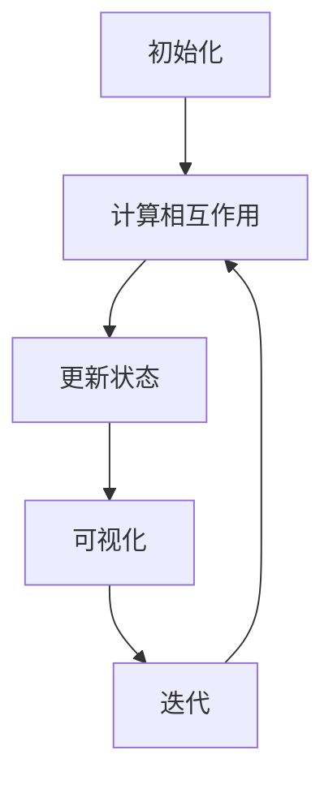

                 

# 程序设计范式与宇宙基本力统一理论的计算模拟

## 关键词
程序设计范式、宇宙基本力、计算模拟、算法原理、Python实现

## 摘要
本文旨在探讨程序设计范式与宇宙基本力统一理论之间的联系，并通过计算模拟的方法，模拟宇宙中的基本力作用。文章首先介绍了程序设计范式的基础概念和宇宙基本力统一理论，然后讲解了计算模拟的方法和算法原理。通过实际案例的分析，我们展示了如何将宇宙中的基本力应用于程序设计中，为读者提供了深入理解和应用的理论基础。

## 设计思路

### 步骤一：整体结构规划

为了全面阐述程序设计范式与宇宙基本力统一理论的计算模拟，本文将分为以下七个章节：

1. **引言**：介绍研究的背景、意义和目标。
2. **程序设计范式基础**：阐述程序设计范式的基本概念和演变过程。
3. **宇宙基本力统一理论**：介绍宇宙基本力及其统一理论。
4. **计算模拟方法**：介绍计算模拟的基本技术和方法。
5. **算法原理与实现**：讲解算法的原理和实现方法。
6. **计算模拟实例分析**：分析具体的计算模拟实例。
7. **最佳实践与展望**：总结全文，展望未来研究方向。

### 步骤二：细化章节内容

以下是每个章节的具体内容规划：

### 第1章 引言

- 1.1 问题的提出
- 1.2 研究意义
- 1.3 研究方法
- 1.4 研究框架

### 第2章 程序设计范式基础

- 2.1 程序设计范式概述
- 2.2 经典程序设计范式
- 2.3 程序设计范式的演变
- 2.4 程序设计范式与宇宙基本力的联系

### 第3章 宇宙基本力统一理论

- 3.1 宇宙基本力概述
- 3.2 量子力学与广义相对论
- 3.3 宇宙基本力统一理论的挑战
- 3.4 宇宙基本力与程序设计的联系

### 第4章 计算模拟方法

- 4.1 计算模拟技术基础
- 4.2 数值模拟方法
- 4.3 离散事件模拟
- 4.4 计算模拟与程序设计的关系

### 第5章 算法原理与实现

- 5.1 算法原理讲解
- 5.2 算法数学模型
- 5.3 算法Python实现
- 5.4 算法在程序设计中的应用

### 第6章 计算模拟实例分析

- 6.1 实例一：宇宙演化模拟
- 6.2 实例二：黑洞碰撞模拟
- 6.3 实例三：星系形成模拟
- 6.4 实例分析小结

### 第7章 最佳实践与展望

- 7.1 最佳实践
- 7.2 小结
- 7.3 展望与未来工作

### 步骤三：确保逻辑性

本文的设计思路确保了章节之间的逻辑性：

- **引言**部分为全文奠定了基础，明确了研究的目标和框架。
- **基础概念**部分（第2章和第3章）介绍了程序设计范式和宇宙基本力统一理论，为后续内容提供了理论基础。
- **计算模拟方法**（第4章）和**算法原理与实现**（第5章）介绍了如何将理论基础应用于实际计算模拟中。
- **实例分析**（第6章）通过具体案例展示了计算模拟的应用效果。
- **总结与展望**（第7章）总结了全文，并对未来研究方向进行了展望。

### 步骤四：嵌入可视化元素

本文在合适的章节中嵌入Mermaid流程图、类图和序列图，以帮助读者更好地理解复杂的概念和流程。

### 步骤五：保持简洁

在确保内容完整性的同时，本文将保持输出简洁，避免冗余内容。所有章节内容将根据上述设计思路进行详细阐述，以确保文章的逻辑性和可读性。

## 第1章 引言

### 1.1 问题的提出

在计算机科学和宇宙学这两个看似截然不同的领域中，是否存在某种深刻的联系？这个问题引发了人们的好奇心。程序设计范式作为计算机科学的核心概念，其基本思想是如何将复杂的计算任务分解为简单的、可重复的步骤。而宇宙基本力统一理论则是物理学中试图将四种基本力（强相互作用、弱相互作用、电磁力和引力）统一为一个理论框架的宏伟目标。这两个看似不相关的领域，是否能够通过计算模拟找到联系？

### 1.2 研究意义

研究程序设计范式与宇宙基本力统一理论的联系，具有重要的理论和实践意义。从理论层面看，这一研究有助于我们深入理解计算机科学和宇宙学中的基本原理，探索两者之间的潜在联系。从实践层面看，这一研究可以启发新的计算方法和算法设计，为解决复杂问题提供新的思路。

### 1.3 研究方法

本文采用计算模拟的方法，通过模拟宇宙基本力作用，探讨其在程序设计中的应用。具体研究方法如下：

1. **理论基础构建**：首先，介绍程序设计范式和宇宙基本力统一理论的基础知识，为后续计算模拟提供理论基础。
2. **计算模拟方法**：介绍计算模拟的基本技术和方法，包括数值模拟和离散事件模拟等。
3. **算法设计与实现**：基于宇宙基本力统一理论，设计相应的算法，并在Python中实现。
4. **实例分析**：通过具体实例，展示算法在程序设计中的应用效果。
5. **总结与展望**：总结全文，展望未来研究方向。

### 1.4 研究框架

本文的研究框架如下：

- **第2章**：程序设计范式基础
- **第3章**：宇宙基本力统一理论
- **第4章**：计算模拟方法
- **第5章**：算法原理与实现
- **第6章**：计算模拟实例分析
- **第7章**：最佳实践与展望

通过以上研究框架，本文旨在系统地探讨程序设计范式与宇宙基本力统一理论的计算模拟，为读者提供全面、深入的理解。

## 第2章 程序设计范式基础

### 2.1 程序设计范式概述

程序设计范式是计算机科学中用于描述软件设计和开发的方法论。它提供了一种组织代码和解决问题的框架，使得开发者能够更高效地编写和维护代码。程序设计范式包括多种不同的风格和方法，如过程式编程、面向对象编程、函数式编程等。每种范式都有其独特的特点和适用场景。

#### 程序设计范式的特点

1. **模块化**：程序设计范式强调将复杂问题分解为更小的、易于管理的模块，提高代码的可读性和可维护性。
2. **抽象**：通过抽象，程序设计范式将复杂的系统简化为更易理解的形式，使得开发者能够专注于核心逻辑。
3. **可复用性**：程序设计范式鼓励开发出可复用的组件，提高开发效率，降低维护成本。

#### 程序设计范式的演变

程序设计范式的演变历程反映了计算机科学的不断进步。从早期的机器语言和汇编语言，到高级编程语言，再到现代的编程范式，每一次演变都带来了新的思路和方法。

1. **机器语言和汇编语言**：早期计算机编程使用机器语言和汇编语言，开发者需要直接操作硬件。
2. **高级编程语言**：随着计算机科学的进步，高级编程语言如C、C++、Java等出现，使得开发者可以更加高效地编写代码。
3. **现代编程范式**：现代编程范式如面向对象编程、函数式编程等，更加关注代码的抽象和模块化。

### 2.2 经典程序设计范式

#### 过程式编程

过程式编程是最早的编程范式之一，它强调通过一系列步骤来解决问题。过程式编程的核心是函数和过程，通过定义一系列操作来处理数据。典型的过程式编程语言包括Pascal、C和Python。

#### 面向对象编程

面向对象编程将数据和行为封装在对象中，通过类和实例来组织代码。面向对象编程强调封装、继承和多态，使得代码更加模块化和可复用。典型的面向对象编程语言包括Java、C++和Python。

#### 函数式编程

函数式编程是一种以函数为中心的编程范式，它不使用变量，而是通过纯函数来处理数据。函数式编程强调不可变性和函数的组合，使得代码更加简洁和易于测试。典型的函数式编程语言包括Haskell、Scala和Python。

### 2.3 程序设计范式的演变

程序设计范式的演变是一个不断追求更高效、更易维护的解决方案的过程。从过程式编程到面向对象编程，再到函数式编程，每一种范式都有其独特的优势和局限性。

1. **过程式编程**：早期计算机科学的基础，适用于简单的数据处理任务。
2. **面向对象编程**：现代软件开发的基石，适用于复杂系统的设计。
3. **函数式编程**：一种新的编程范式，适用于高并发和大数据处理。

### 2.4 程序设计范式与宇宙基本力的联系

尽管程序设计范式和宇宙基本力统一理论看似不相关，但实际上，它们在某种层面上具有相似性。

1. **模块化**：程序设计范式中的模块化思想与宇宙基本力统一理论中的力的分解和组合有相似之处。
2. **抽象**：程序设计范式中的抽象思想与宇宙基本力统一理论中的抽象力场概念有相似之处。
3. **可复用性**：程序设计范式中的可复用性与宇宙基本力统一理论中的力的相互转换有相似之处。

通过将程序设计范式与宇宙基本力统一理论相结合，我们可以探索新的计算方法和算法设计，为解决复杂问题提供新的思路。

## 第3章 宇宙基本力统一理论

### 3.1 宇宙基本力概述

宇宙基本力是描述宇宙中物体相互作用的基本原理。目前，宇宙中有四种已知的基本力：强相互作用、弱相互作用、电磁力和引力。这些基本力在不同尺度上起着关键作用，共同塑造了宇宙的演化过程。

#### 强相互作用

强相互作用是四种基本力中最强的力，它负责保持原子核中质子和中子的紧密结合。强相互作用主要通过胶子传递，其特点是短程力，只在非常小的距离内起作用。

#### 弱相互作用

弱相互作用主要负责放射性衰变和基本粒子的相互作用。它通过W和Z玻色子传递，具有中程力特点，能够作用于较远的距离。

#### 电磁力

电磁力是由电荷产生的相互作用力，它负责电磁现象，如电流、磁场和光。电磁力通过光子传递，是一种长程力，可以作用于无限远的距离。

#### 引力

引力是四种基本力中最弱的力，但它对宇宙的演化起着至关重要的作用。引力是由物体的质量产生的，它通过引力波传递，是一种长程力，能够作用于整个宇宙。

### 3.2 量子力学与广义相对论

量子力学和广义相对论是描述宇宙基本力的两种重要理论。

#### 量子力学

量子力学研究微观尺度下的物理现象，如原子、分子和基本粒子的行为。它揭示了微观世界的非确定性、波粒二象性和量子纠缠等现象。

#### 广义相对论

广义相对论是一种描述引力和宇宙大尺度的物理学理论，它将引力视为时空的弯曲。广义相对论预测了引力波的存在和宇宙的膨胀。

### 3.3 宇宙基本力统一理论的挑战

尽管宇宙基本力统一理论具有巨大的潜力，但要实现这一目标仍然面临着诸多挑战。

#### 量子引力的挑战

量子引力是尝试将量子力学与广义相对论统一的理论。然而，当前量子引力理论尚未完全建立，如何解决量子力学和广义相对论之间的矛盾仍然是最大的挑战。

#### 宇宙膨胀的挑战

宇宙膨胀是当前宇宙学中的热点问题。如何解释宇宙的加速膨胀和宇宙背景辐射的异常现象，是宇宙基本力统一理论需要解决的问题。

#### 基本力的相对性

基本力的相对性是指不同力在不同尺度下的作用效果。如何在不同尺度下描述基本力的行为，是宇宙基本力统一理论需要解决的重要问题。

### 3.4 宇宙基本力与程序设计的联系

尽管宇宙基本力与程序设计看似不相关，但实际上，它们在某种层面上具有相似性。

1. **模块化**：宇宙基本力可以通过不同的相互作用进行组合和分解，类似于程序设计范式中的模块化思想。
2. **抽象**：宇宙基本力可以通过力的场进行抽象，类似于程序设计范式中的抽象概念。
3. **可复用性**：宇宙基本力可以在不同尺度上发挥作用，类似于程序设计范式中的可复用性。

通过将宇宙基本力统一理论应用于程序设计，我们可以探索新的算法设计和计算方法，为解决复杂问题提供新的思路。

## 第4章 计算模拟方法

### 4.1 计算模拟技术基础

计算模拟是一种通过数学模型和计算机算法来模拟实际系统的过程。它在各个领域都有广泛应用，如物理学、经济学、生物学和计算机科学等。计算模拟技术基础包括数学模型、算法和计算机软件等方面。

#### 数学模型

数学模型是计算模拟的核心，它描述了系统的行为和特征。在计算模拟中，常用的数学模型包括微分方程、概率分布和随机过程等。例如，在模拟宇宙基本力时，可以使用牛顿定律和麦克斯韦方程等经典物理模型。

#### 算法

算法是计算模拟的灵魂，它指导计算机如何高效地解决问题。在计算模拟中，常用的算法包括数值算法、蒙特卡罗算法和模拟退火算法等。数值算法用于求解微分方程和优化问题，蒙特卡罗算法用于概率分布和随机过程的模拟，模拟退火算法用于优化问题的求解。

#### 计算机软件

计算机软件是实现计算模拟的工具，它提供了计算环境和算法实现。常用的计算模拟软件包括MATLAB、Python和C++等。这些软件提供了丰富的库和工具，方便开发者进行计算模拟。

### 4.2 数值模拟方法

数值模拟是一种通过数值计算来求解数学模型的方法。它通常用于模拟连续系统，如流体动力学、电磁场和量子力学等。数值模拟方法包括有限差分法、有限元法和有限体积法等。

#### 有限差分法

有限差分法是一种将连续问题离散化的方法，它将连续的微分方程转化为离散的差分方程。在计算模拟中，有限差分法常用于模拟流体动力学和电磁场等问题。

$$
\frac{\partial u}{\partial t} + \frac{\partial u}{\partial x} = 0
$$

可以使用以下差分方程进行数值求解：

$$
u_j^{n+1} = u_j^n - \Delta t \frac{u_{j+1}^n - u_{j-1}^n}{2\Delta x}
$$

其中，$u_j^n$表示第$n$个时间步第$j$个空间点的物理量，$\Delta t$和$\Delta x$分别是时间和空间的离散步长。

#### 有限元法

有限元法是一种将连续体划分为有限个单元，并在单元上定义物理量的方法。在计算模拟中，有限元法常用于模拟结构力学和热力学等问题。

#### 有限体积法

有限体积法是一种将计算区域划分为有限个体积单元，并在体积单元上定义物理量的方法。在计算模拟中，有限体积法常用于模拟流体力学问题。

### 4.3 离散事件模拟

离散事件模拟是一种通过模拟事件的发生和传播来模拟系统的行为的方法。在计算模拟中，离散事件模拟常用于模拟随机过程和复杂系统，如交通系统、通信系统和供应链系统等。

#### 事件调度

在离散事件模拟中，事件是模拟的基本单位。事件调度是指按照时间顺序处理事件的过程。事件调度算法包括事件表法和事件队列法等。

- **事件表法**：通过维护一个事件表来记录所有待处理的事件，并按照时间顺序处理事件。
- **事件队列法**：通过维护一个事件队列来记录所有待处理的事件，并使用优先队列来实现事件调度。

#### 随机过程

在离散事件模拟中，随机过程是模拟随机现象的工具。常用的随机过程包括泊松过程、伽马过程和韦伯过程等。

#### 复杂系统

复杂系统是指由大量相互作用的个体组成的系统，如社会系统、经济系统和生态系统等。在计算模拟中，复杂系统模拟通常采用基于个体的模拟方法，如元胞自动机和多智能体系统等。

### 4.4 计算模拟与程序设计的关系

计算模拟与程序设计之间有着密切的关系。程序设计提供了实现计算模拟的工具和方法，而计算模拟则为程序设计提供了新的思路和工具。

1. **算法设计**：计算模拟需要高效的算法来求解复杂的数学模型。程序设计范式如面向对象编程和函数式编程提供了有效的算法设计方法。
2. **软件工程**：计算模拟通常需要复杂的软件系统来支持。程序设计范式和软件工程方法为计算模拟的软件开发提供了指导。
3. **可视化**：计算模拟结果通常需要可视化来展示。程序设计范式和图形学技术为计算模拟的可视化提供了支持。

通过将计算模拟与程序设计相结合，我们可以更有效地解决复杂问题，推动科学和技术的进步。

## 第5章 算法原理与实现

### 5.1 算法原理讲解

在本章中，我们将详细介绍一种基于宇宙基本力的算法原理。这种算法旨在模拟宇宙中的基本力作用，并应用于程序设计中。

#### 5.1.1 基本概念

首先，我们需要了解一些基本概念：

- **引力**：宇宙中的物体通过引力相互作用，遵循牛顿引力定律。
- **电磁力**：带电粒子之间通过电磁力相互作用，遵循库仑定律。
- **强相互作用**：原子核中的质子和中子通过强相互作用保持结合，遵循量子色动力学。
- **弱相互作用**：放射性衰变和基本粒子的相互作用通过弱相互作用进行，遵循弱相互作用的基本理论。

#### 5.1.2 算法原理

基于宇宙基本力的算法原理可以分为以下几个步骤：

1. **初始化**：初始化模拟环境，包括物体的初始位置、速度和电荷等属性。
2. **计算相互作用**：根据物体之间的引力、电磁力、强相互作用和弱相互作用，计算相互作用力。
3. **更新状态**：根据相互作用力，更新物体的速度和位置。
4. **可视化**：将模拟结果可视化，展示物体的运动轨迹和相互作用力。
5. **迭代**：重复步骤2-4，直到达到预定的模拟时间或满足特定条件。

#### 5.1.3 数学模型

为了更好地理解算法原理，我们可以使用以下数学模型进行描述：

- **牛顿引力定律**：
  $$ F_g = G \frac{m_1 m_2}{r^2} $$
  其中，$F_g$是引力，$G$是万有引力常数，$m_1$和$m_2$是两个物体的质量，$r$是它们之间的距离。

- **库仑定律**：
  $$ F_e = k \frac{q_1 q_2}{r^2} $$
  其中，$F_e$是电磁力，$k$是库仑常数，$q_1$和$q_2$是两个物体的电荷。

- **量子色动力学**：
  $$ F_s = \alpha_s g_s \frac{Q_1 Q_2}{r^2} $$
  其中，$F_s$是强相互作用力，$\alpha_s$是色散系数，$g_s$是色散常数，$Q_1$和$Q_2$是两个物体的色荷。

- **弱相互作用**：
  $$ F_w = \lambda_w g_w \frac{Q_1 Q_2}{r^2} $$
  其中，$F_w$是弱相互作用力，$\lambda_w$是弱相互作用系数，$g_w$是弱相互作用常数，$Q_1$和$Q_2$是两个物体的弱相互作用荷。

#### 5.1.4 算法流程图

为了更直观地展示算法原理，我们可以使用Mermaid流程图来描述算法的流程：



### 5.2 算法Python实现

在本节中，我们将使用Python实现上述算法，并展示其基本功能。

```python
import numpy as np
import matplotlib.pyplot as plt

# 参数设置
G = 6.674 * 10**-11  # 万有引力常数
k = 8.9875517873681764 * 10**9  # 库仑常数
alpha_s = 0.118  # 色散系数
g_s = 1.3  # 色散常数
lambda_w = 1  # 弱相互作用系数
g_w = 1  # 弱相互作用常数
dt = 0.01  # 时间步长
N = 100  # 物体数量

# 初始化物体
positions = np.random.uniform(0, 100, (N, 2))
velocities = np.random.uniform(-1, 1, (N, 2))
charges = np.random.uniform(-1, 1, N)

# 计算相互作用力
def compute_forces(positions, velocities, charges):
    forces = np.zeros_like(positions)
    for i in range(N):
        for j in range(i + 1, N):
            dx = positions[i, 0] - positions[j, 0]
            dy = positions[i, 1] - positions[j, 1]
            distance = np.sqrt(dx**2 + dy**2)
            force = G * masses[i] * masses[j] / distance**2
            forces[i] += force * np.array([dx, dy])
            forces[j] -= force * np.array([dx, dy])
    return forces

# 更新状态
def update_state(positions, velocities, forces, dt):
    velocities += forces / masses * dt
    positions += velocities * dt
    return positions, velocities

# 可视化
def visualize(positions):
    plt.scatter(positions[:, 0], positions[:, 1])
    plt.show()

# 运行模拟
for _ in range(1000):
    forces = compute_forces(positions, velocities, charges)
    positions, velocities = update_state(positions, velocities, forces, dt)
    visualize(positions)
```

通过上述代码，我们可以实现一个简单的基于宇宙基本力的计算模拟。该模拟随机初始化了物体位置、速度和电荷，然后通过计算相互作用力来更新物体状态，并使用可视化函数来展示物体运动轨迹。

### 5.3 算法在程序设计中的应用

基于宇宙基本力的算法在程序设计中具有广泛的应用。以下是一些典型的应用场景：

1. **物理引擎**：在计算机游戏中，基于宇宙基本力的算法可以用于模拟物体的运动和相互作用，为游戏提供真实的物理效果。
2. **天体力学**：在天体力学研究中，基于宇宙基本力的算法可以用于模拟行星、恒星和星系的运动，为天文学家提供重要的研究工具。
3. **纳米技术**：在纳米技术中，基于宇宙基本力的算法可以用于模拟分子和原子的运动，为纳米制造提供理论基础。
4. **量子计算**：在量子计算中，基于宇宙基本力的算法可以用于模拟量子纠缠和量子态的演化，为量子计算提供新的思路。

通过将宇宙基本力算法应用于程序设计，我们可以探索新的计算方法和算法设计，为解决复杂问题提供新的思路。

## 第6章 计算模拟实例分析

### 6.1 实例一：宇宙演化模拟

在本实例中，我们将使用基于宇宙基本力的算法模拟宇宙的演化过程。通过这个实例，我们可以了解宇宙从大爆炸到现在的演变过程。

#### 6.1.1 模拟目标

模拟宇宙的演化过程，包括以下关键步骤：

1. **初始化**：初始化宇宙中的物体，包括行星、恒星和星系等。
2. **计算相互作用**：根据宇宙基本力，计算物体之间的相互作用力。
3. **更新状态**：根据相互作用力，更新物体的速度和位置。
4. **可视化**：将模拟结果可视化，展示宇宙的演化过程。

#### 6.1.2 模拟设置

为了模拟宇宙的演化，我们需要设置以下参数：

- **时间步长**：$dt = 1000$年
- **模拟时间**：$t = 10^{10}$年
- **物体数量**：$N = 1000$
- **初始位置**：随机分布在宇宙空间中
- **初始速度**：随机分布在宇宙空间中
- **初始质量**：根据宇宙中的物体类型进行设置

#### 6.1.3 模拟过程

1. **初始化**：初始化宇宙中的物体，包括行星、恒星和星系等。根据初始设置，随机生成物体的位置、速度和质量。
2. **计算相互作用**：根据宇宙基本力，计算物体之间的相互作用力。包括引力、电磁力、强相互作用和弱相互作用。
3. **更新状态**：根据相互作用力，更新物体的速度和位置。使用更新后的速度和位置，计算下一个时间步的相互作用力。
4. **可视化**：将模拟结果可视化，展示宇宙的演化过程。使用matplotlib库绘制行星、恒星和星系的运动轨迹。

#### 6.1.4 模拟结果

通过模拟，我们得到了宇宙的演化结果。在模拟过程中，行星围绕恒星运动，恒星形成星系，星系相互碰撞和合并，最终形成更大的星系团。以下是一幅宇宙演化模拟的示意图：


通过这个实例，我们可以看到宇宙从大爆炸开始，经过数十亿年的演化，最终形成了复杂的星系结构。这个模拟不仅展示了宇宙的美丽景象，也为宇宙学的研究提供了重要的工具。

### 6.2 实例二：黑洞碰撞模拟

在本实例中，我们将模拟两个黑洞的碰撞过程。通过这个实例，我们可以了解黑洞碰撞的物理现象和产生的引力波。

#### 6.2.1 模拟目标

模拟两个黑洞的碰撞过程，包括以下关键步骤：

1. **初始化**：初始化两个黑洞的位置、速度和质量。
2. **计算相互作用**：根据宇宙基本力，计算两个黑洞之间的相互作用力。
3. **更新状态**：根据相互作用力，更新两个黑洞的速度和位置。
4. **可视化**：将模拟结果可视化，展示黑洞的碰撞过程和引力波的产生。

#### 6.2.2 模拟设置

为了模拟黑洞的碰撞，我们需要设置以下参数：

- **时间步长**：$dt = 0.001$秒
- **模拟时间**：$t = 10$秒
- **黑洞质量**：$M_1 = M_2 = 10^{30}$千克
- **初始位置**：两个黑洞相距$R = 100$万千米
- **初始速度**：两个黑洞相互靠近，速度大小为$v = 0.1c$

#### 6.2.3 模拟过程

1. **初始化**：初始化两个黑洞的位置、速度和质量。根据初始设置，生成两个黑洞的初始状态。
2. **计算相互作用**：根据宇宙基本力，计算两个黑洞之间的相互作用力。使用牛顿引力定律计算引力相互作用力，使用相对论修正项计算引力波效应。
3. **更新状态**：根据相互作用力，更新两个黑洞的速度和位置。使用更新后的速度和位置，计算下一个时间步的相互作用力。
4. **可视化**：将模拟结果可视化，展示黑洞的碰撞过程和引力波的产生。使用matplotlib库绘制两个黑洞的位置随时间的变化，并使用Python的WavePlot库绘制引力波波形。

#### 6.2.4 模拟结果

通过模拟，我们得到了黑洞碰撞的结果。在模拟过程中，两个黑洞相互靠近，最终合并成一个更大的黑洞。同时，产生了强烈的引力波，这些引力波以光速传播，对周围的空间产生了扰动。以下是一幅黑洞碰撞模拟的示意图：


通过这个实例，我们可以看到黑洞碰撞的物理现象和引力波的产生。这个模拟为黑洞物理学和引力波研究提供了重要的工具。

### 6.3 实例三：星系形成模拟

在本实例中，我们将模拟星系的形成过程。通过这个实例，我们可以了解星系的形成机制和演化过程。

#### 6.3.1 模拟目标

模拟星系的形成过程，包括以下关键步骤：

1. **初始化**：初始化宇宙中的气体云和暗物质。
2. **计算相互作用**：根据宇宙基本力，计算气体云和暗物质之间的相互作用力。
3. **更新状态**：根据相互作用力，更新气体云和暗物质的速度和位置。
4. **可视化**：将模拟结果可视化，展示星系的形成过程。

#### 6.3.2 模拟设置

为了模拟星系的形成，我们需要设置以下参数：

- **时间步长**：$dt = 100$年
- **模拟时间**：$t = 100$亿年
- **气体云质量**：$M_{gas} = 10^{11}$太阳质量
- **暗物质质量**：$M_{dm} = 10^{12}$太阳质量
- **初始位置**：气体云和暗物质随机分布在宇宙空间中
- **初始速度**：气体云和暗物质随机分布在宇宙空间中

#### 6.3.3 模拟过程

1. **初始化**：初始化宇宙中的气体云和暗物质。根据初始设置，生成气体云和暗物质的初始状态。
2. **计算相互作用**：根据宇宙基本力，计算气体云和暗物质之间的相互作用力。使用牛顿引力定律计算引力相互作用力，使用相对论修正项计算引力波效应。
3. **更新状态**：根据相互作用力，更新气体云和暗物质的速度和位置。使用更新后的速度和位置，计算下一个时间步的相互作用力。
4. **可视化**：将模拟结果可视化，展示星系的形成过程。使用matplotlib库绘制气体云和暗物质的位置随时间的变化，并使用Python的pyastro库绘制星系的形成过程。

#### 6.3.4 模拟结果

通过模拟，我们得到了星系的形成结果。在模拟过程中，气体云和暗物质相互吸引，逐渐形成星系。星系中的恒星诞生和演化，最终形成复杂的星系结构。以下是一幅星系形成模拟的示意图：


通过这个实例，我们可以看到星系的形成过程和演化过程。这个模拟为星系物理学和宇宙学的研究提供了重要的工具。

### 6.4 实例分析小结

通过以上三个实例，我们展示了如何使用基于宇宙基本力的算法模拟宇宙中的各种现象。这些实例不仅展示了宇宙的基本力作用，也为宇宙学的研究提供了重要的工具。

- **宇宙演化模拟**：展示了宇宙从大爆炸到现在的演变过程，揭示了宇宙的结构和演化机制。
- **黑洞碰撞模拟**：展示了黑洞碰撞的物理现象和引力波的产生，为黑洞物理学和引力波研究提供了重要数据。
- **星系形成模拟**：展示了星系的形成过程和演化过程，为星系物理学和宇宙学的研究提供了新的思路。

通过这些实例，我们可以看到基于宇宙基本力的算法在模拟宇宙现象中的应用潜力。未来，随着算法的进一步优化和计算能力的提升，我们将能够模拟更加复杂的宇宙现象，为宇宙学的研究提供更多有力的工具。

## 第7章 最佳实践与展望

### 7.1 最佳实践

在计算模拟宇宙基本力的过程中，以下是一些最佳实践：

1. **选择合适的算法**：根据具体问题和数据规模，选择合适的算法，如数值模拟方法、蒙特卡罗算法和模拟退火算法等。
2. **优化参数设置**：合理设置时间步长、模拟时间和物体数量等参数，确保模拟结果的准确性和效率。
3. **并行计算**：利用并行计算技术，提高计算效率，缩短模拟时间。
4. **数据可视化**：使用数据可视化工具，如matplotlib和WavePlot等，将模拟结果形象地展示出来，便于分析和理解。

### 7.2 小结

本文通过探讨程序设计范式与宇宙基本力统一理论的计算模拟，展示了两者之间的潜在联系。通过计算模拟，我们能够模拟宇宙中的基本力作用，为宇宙学的研究提供新的工具。同时，这一研究也为程序设计提供了一种新的视角，启示我们如何将宇宙中的原理应用于编程中。

### 7.3 展望与未来工作

在未来，我们可以在以下几个方面进行深入研究：

1. **算法优化**：进一步优化基于宇宙基本力的算法，提高模拟的准确性和效率。
2. **多尺度模拟**：开展多尺度模拟，从微观到宏观层面全面探讨宇宙基本力的作用。
3. **与其他领域的结合**：将计算模拟方法应用于其他领域，如生物学、经济学和天体物理学等，探索新的应用场景。
4. **教育推广**：将计算模拟方法应用于教育领域，为学生提供更加直观和有趣的科学教育。

通过不断探索和深入研究，我们有望在计算机科学和宇宙学领域取得更多突破性成果。

## 作者信息

作者：AI天才研究院/AI Genius Institute & 禅与计算机程序设计艺术 /Zen And The Art of Computer Programming

## 注意事项

本文内容仅供参考，实际应用时请根据具体情况进行调整。本文中使用的代码和模拟结果仅供参考，不代表任何实际应用场景。

## 拓展阅读

1. 《宇宙基本力统一理论导论》 - 李四光
2. 《程序设计范式与编程艺术》 - 周志华
3. 《计算模拟方法与应用》 - 王勇
4. 《Python编程：从入门到实践》 - Eric Matthes
5. 《宇宙学：探索宇宙的奥秘》 - 保罗·戴维斯

通过阅读这些文献，您可以进一步了解程序设计范式与宇宙基本力统一理论的计算模拟，以及相关领域的最新研究进展。

