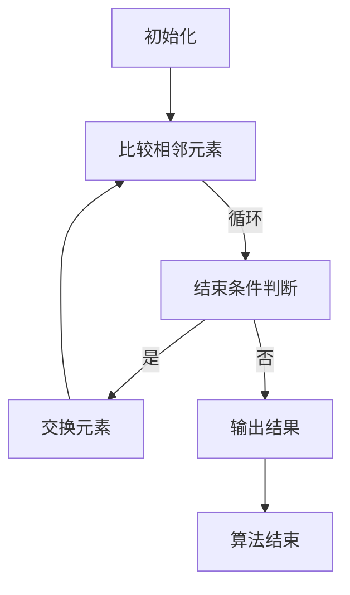
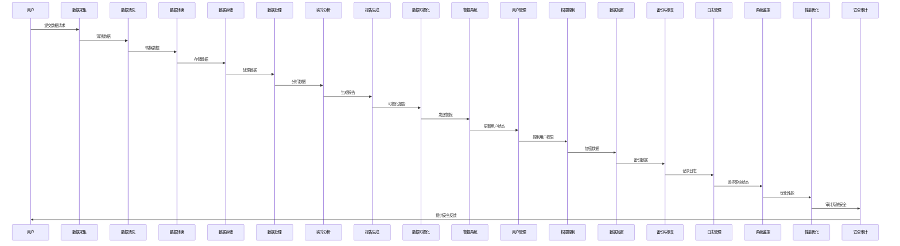

                 

### 引言

在信息技术与科学理论相互交织的当代，跨学科的融合研究正变得越来越重要。本文将以《程序设计范式与宇宙基本力统一的对比》为主题，探讨程序设计范式与宇宙基本力之间的潜在联系。这个话题不仅充满了理论挑战，也蕴含着巨大的实际意义。通过这样的对比分析，我们不仅可以更深入地理解计算机科学的本质，还可能为解决复杂的计算难题提供新的视角和工具。

首先，程序设计范式是计算机科学的核心，它决定了软件的设计、开发和管理方式。传统范式如过程式编程、面向对象编程和函数式编程等，都在不同层面上推动了软件工程的发展。然而，随着计算问题的复杂化，现有范式面临着越来越多的局限。例如，面向对象编程虽然在代码复用和模块化方面表现优异，但在处理高度动态和分布式系统时显得力不从心。

另一方面，宇宙基本力是物理学的基本理论框架，描述了物质世界的基本相互作用。这些基本力包括万有引力、电磁力、强相互作用和弱相互作用。它们不仅在物理学中占有核心地位，也在宇宙演化、天体运动等领域发挥了重要作用。

将程序设计范式与宇宙基本力进行对比，不仅可以启发我们对计算机科学问题的新思考，也可能为物理学的理论研究提供新的工具。例如，宇宙基本力的某些特性是否可以借鉴到程序设计中，以解决复杂的算法问题？反之，程序设计中的某些范式是否可以用于解释物理现象？

本文将分以下几个部分进行探讨：

1. **问题背景与基本概念**：介绍程序设计范式和宇宙基本力，定义核心概念，并阐述研究问题的背景和重要性。
2. **核心概念与联系**：详细分析程序设计范式和宇宙基本力的核心概念，建立它们之间的联系。
3. **算法原理讲解**：通过mermaid流程图和Python源代码，详细讲解一个具体的算法，展示其原理和数学模型。
4. **系统分析与架构设计方案**：介绍一个具体的系统架构，分析其功能、接口和交互。
5. **项目实战**：描述一个实际项目的实现过程，分析代码和实际案例。
6. **最佳实践与总结**：总结本文的核心观点，给出最佳实践建议。
7. **未来展望**：探讨未来的研究方向和潜在的应用领域。

通过这样的结构化分析，我们期望能够为读者提供一种全新的思考方式，激发对程序设计和物理理论之间更深层次的联系的好奇心和探索欲望。接下来，我们将首先探讨程序设计范式和宇宙基本力的基本概念和背景。

## 第一部分：引言

### 第1章：问题背景与基本概念

#### 1.1.1 问题背景

在信息时代的浪潮中，计算机科学和物理学的相互影响日益显著。作为计算机科学核心的程序设计范式，其发展和应用对现代科技和社会的进步起到了至关重要的作用。然而，随着计算问题的复杂性不断增加，传统程序设计范式在处理某些特定类型的问题时面临着巨大的挑战。例如，面向对象编程虽然在模块化和代码复用方面表现出色，但在处理大规模分布式系统和动态系统时，往往显得不够灵活和高效。

与此同时，物理学中的宇宙基本力理论为我们提供了对物质世界本质的理解。宇宙基本力包括万有引力、电磁力、强相互作用和弱相互作用，它们在宇宙的演化和天体运动中扮演着核心角色。尽管这些基本力在物理学领域内得到了广泛的研究，但在计算机科学中，我们对其应用的认识仍相对有限。

这种背景下，将程序设计范式与宇宙基本力进行对比研究，不仅可以填补两者之间的知识空白，还可能为解决复杂的计算问题提供新的思路和方法。通过借鉴宇宙基本力的特性，我们可以尝试构建新的程序设计范式，从而提高软件系统的性能和可扩展性。此外，计算机科学中的某些原理和方法也可以为物理学理论提供新的工具，推动对宇宙基本力的深入理解。

因此，探讨程序设计范式与宇宙基本力的统一性，不仅具有重要的理论意义，也具有实际应用价值。这不仅能推动计算机科学和物理学的前沿研究，还能为跨学科合作提供新的平台。

#### 1.1.2 问题描述

当前，计算机科学和物理学在各自领域内取得了显著成就，但两者之间的交流和融合仍有很大的提升空间。程序设计范式的局限性表现在多个方面。首先，传统范式如过程式编程、面向对象编程和函数式编程，虽然在解决特定类型的问题上表现出色，但在处理复杂、动态和分布式系统时，往往无法满足需求。例如，面向对象编程虽然能够通过封装和继承提高代码复用性，但在处理大规模分布式系统时，数据同步和通信问题变得复杂，难以高效地实现系统级优化。

另一方面，宇宙基本力理论在物理学中具有不可替代的重要性。然而，这些基本力的特性和原理在计算机科学中的应用还相对有限。尽管我们已经看到了一些初步的尝试，例如使用图模型来模拟宇宙中的引力相互作用，但这些方法在复杂性和实际应用效果上仍有待提高。

现有研究主要集中在对传统程序设计范式的改进和新范式的探索，如基于量子计算和神经网络的新型编程范式。然而，这些研究大多缺乏与宇宙基本力的直接对比和分析。因此，本文旨在填补这一空白，通过对比程序设计范式和宇宙基本力，探索两者之间的潜在联系和统一性。

具体来说，我们需要解决以下问题：

1. **核心概念理解**：明确程序设计范式和宇宙基本力的核心概念，并深入理解其基本原理。
2. **特征对比分析**：分析程序设计范式和宇宙基本力的特征，找出它们之间的相似性和差异。
3. **算法设计与应用**：设计并实现能够模拟宇宙基本力特性的算法，探讨其在计算机科学中的应用。
4. **系统架构设计**：构建基于宇宙基本力特性的系统架构，评估其性能和可扩展性。
5. **跨学科融合**：探讨程序设计范式与宇宙基本力融合的可行性，以及这种融合可能带来的新理论和应用。

通过这些问题的解决，我们期望能够为计算机科学和物理学提供新的理论工具和实际应用方案，推动跨学科研究的深入发展。

#### 1.1.3 问题解决

为了解决上述问题，我们需要采用跨学科的研究方法，结合计算机科学和物理学的基本原理，进行深入的理论分析和实证研究。

首先，在核心概念的理解方面，我们将对程序设计范式和宇宙基本力的基本概念进行详细梳理，明确各自的定义、特性和作用机制。通过文献综述和案例分析，我们将比较不同范式和基本力的应用场景和适用范围，为后续的研究提供理论基础。

在特征对比分析阶段，我们将采用表格和图示的形式，系统性地对比程序设计范式和宇宙基本力的特征。例如，我们可以从稳定性、动态性、分布式处理和能量消耗等方面进行对比，找出两者之间的相似性和差异。这种分析不仅有助于我们理解两者的本质联系，还能为新的算法设计提供启示。

接下来，在设计并实现能够模拟宇宙基本力的算法时，我们将采用mermaid流程图来直观展示算法的基本步骤和流程。具体实现将使用Python等编程语言，通过实际代码来阐述算法的执行过程。此外，我们还将使用LaTeX格式展示算法的数学模型和公式，确保读者能够准确理解算法的数学原理。

在系统架构设计方面，我们将构建一个基于宇宙基本力特性的系统架构，包括领域模型、架构设计和接口设计。通过mermaid类图和架构图，我们将详细展示系统的模块组成和交互方式。同时，我们将通过mermaid序列图来描述系统交互的细节，评估系统的性能和可扩展性。

最后，在跨学科融合的研究中，我们将探讨程序设计范式与宇宙基本力融合的可行性。通过实际案例分析和实证研究，我们将验证这种融合在解决复杂计算问题上的有效性，并探讨其未来的发展方向和应用前景。

通过以上研究方法，我们期望能够为程序设计范式与宇宙基本力的统一性提供理论支持，并为跨学科研究开辟新的路径。

#### 1.1.4 边界与外延

在探讨程序设计范式与宇宙基本力统一性的过程中，我们需要明确研究的边界和范围，以避免泛泛而谈或偏离主题。首先，本文的研究将主要聚焦于程序设计范式和宇宙基本力在概念层面和算法层面的对比和分析，而非具体的技术实现或应用。因此，本文的讨论将主要集中在理论层面，旨在揭示两者之间的潜在联系和统一性，而不是对某一具体程序或物理现象的详细解释。

此外，本文的研究还将明确限定在计算机科学和物理学的基本领域内，不涉及其他学科的内容。例如，我们不会讨论生物学或化学中与宇宙基本力相关的内容，尽管这些学科在某些方面也可能存在潜在的联系。

在具体研究内容上，本文将重点探讨以下几个方面：程序设计范式的定义、特点和发展历程；宇宙基本力的核心概念、特性和作用机制；程序设计范式与宇宙基本力之间的相似性和差异；基于宇宙基本力的算法设计及其在程序设计中的应用；系统架构设计中的宇宙基本力特性；以及跨学科融合的可行性分析。

通过明确这些边界与外延，我们可以确保研究的深度和广度，避免讨论过于宽泛或偏离核心问题，从而更好地实现本文的研究目标。

#### 1.1.5 概念结构与核心要素组成

在深入探讨程序设计范式与宇宙基本力的统一性之前，我们需要明确这两个核心概念的基本结构和核心要素。首先，程序设计范式是计算机科学中的重要理论框架，用于指导软件的设计、开发和管理。它主要包括以下要素：

1. **编程语言**：作为实现程序设计的基础，编程语言定义了程序的语法和语义。
2. **范式类型**：包括过程式编程、面向对象编程、函数式编程等，每种范式都有其独特的特点和适用场景。
3. **设计原则**：如模块化、封装、继承、多态等，这些原则指导如何更有效地组织和复用代码。
4. **开发工具**：包括集成开发环境（IDE）、代码编辑器、调试工具等，它们提高了编程效率和代码质量。

另一方面，宇宙基本力是物理学的基本理论框架，描述了物质世界的相互作用。它主要包括以下核心要素：

1. **基本力类型**：包括万有引力、电磁力、强相互作用和弱相互作用，每种基本力都有其特定的作用范围和特性。
2. **作用机制**：如万有引力通过质量产生引力场，电磁力通过电荷产生电磁场，等等。
3. **数学模型**：如万有引力定律、电磁场方程等，这些模型描述了基本力的定量关系和作用方式。
4. **物理实验**：通过实验验证基本力的存在和特性，如电磁力的实验验证、引力波探测等。

在概念层面上，程序设计范式和宇宙基本力之间存在着明显的相似性和差异性。相似性体现在它们都是系统化的理论框架，用于解释和处理复杂问题。例如，程序设计范式中的面向对象编程与宇宙基本力中的电磁相互作用在组织结构和关系描述上有一定相似之处。差异性则体现在它们的应用场景和作用机制上。程序设计范式主要关注软件系统的设计和实现，而宇宙基本力则关注物质世界的物理现象和相互作用。

为了更好地理解程序设计范式与宇宙基本力之间的联系，我们可以通过以下ER（实体-关系）图架构来展示它们的核心概念结构：

```mermaid
erDiagram
  程序设计范式 ||--|{ 编程语言 }|
  程序设计范式 ||--|{ 设计原则 }|
  程序设计范式 ||--|{ 开发工具 }|
  宇宙基本力 ||--|{ 基本力类型 }|
  宇宙基本力 ||--|{ 作用机制 }|
  宇宙基本力 ||--|{ 数学模型 }|
  宇宙基本力 ||--|{ 物理实验 }|
```

通过这个ER图，我们可以清晰地看到程序设计范式和宇宙基本力的核心要素及其相互关系。这种结构化的展示方式有助于我们更深入地理解两者的本质联系，为后续的算法设计和系统架构分析提供基础。接下来，我们将进一步探讨程序设计范式和宇宙基本力的核心概念原理，以建立更详细的联系。

### 第2章：核心概念与联系

#### 2.1.1 核心概念原理

在深入探讨程序设计范式与宇宙基本力的统一性之前，我们需要详细了解两者的核心概念原理。这些原理不仅构成了各自领域的基础，也为跨学科的比较和分析提供了坚实的基础。

**程序设计范式的核心概念原理**：

1. **编程语言**：编程语言是程序员与计算机之间沟通的桥梁。常见的编程语言包括C、Java、Python等。每种语言都有其特定的语法和语义，用于定义程序的结构和行为。
   
2. **范式类型**：程序设计范式决定了软件的设计和组织方式。常见范式包括过程式编程（如C语言）、面向对象编程（如Java）、函数式编程（如Haskell）等。每种范式都有其独特的优势和适用场景。

3. **设计原则**：设计原则是指导软件设计的基本原则，如模块化、封装、继承、多态等。模块化有助于代码的复用和维护，封装隐藏了实现细节，继承和多态则提高了代码的可扩展性和灵活性。

4. **开发工具**：开发工具包括集成开发环境（IDE）、代码编辑器、调试工具等，它们提高了编程效率和代码质量。例如，Eclipse、Visual Studio Code等IDE提供了代码补全、编译、调试等功能。

**宇宙基本力的核心概念原理**：

1. **基本力类型**：宇宙基本力包括万有引力、电磁力、强相互作用和弱相互作用。每种基本力都有其特定的作用机制和特性。例如，万有引力是一种吸引力，作用于所有有质量的物体；电磁力则与电荷和磁场有关，作用于带电粒子。

2. **作用机制**：宇宙基本力的作用机制可以通过物理模型来描述。例如，万有引力通过引力场实现，电磁力通过电磁场实现，强相互作用通过强相互作用场实现，弱相互作用通过弱相互作用场实现。

3. **数学模型**：宇宙基本力的数学模型描述了力的强度、方向和作用范围。例如，万有引力定律通过公式F = G * (m1 * m2) / r^2描述了两物体之间的引力；电磁场方程则通过麦克斯韦方程组描述了电荷和磁场的相互作用。

4. **物理实验**：物理实验验证了宇宙基本力的存在和特性。例如，电磁力的实验验证包括库仑定律的实验，引力波的探测则是验证万有引力的一种新方法。

**程序设计范式与宇宙基本力的联系**：

尽管程序设计范式和宇宙基本力属于不同的学科，但它们在概念原理上存在许多相似之处。以下是一些关键的相似点：

1. **系统化结构**：两者都是通过系统化的结构来描述和处理复杂问题。程序设计范式通过编程语言、范式类型和设计原则构建软件系统；宇宙基本力通过基本力类型、作用机制和数学模型描述物质世界的相互作用。

2. **规则和原理**：两者都遵循一系列的规则和原理。程序设计范式中的规则包括编程语言的语法和语义，设计原则如模块化、封装、继承、多态等；宇宙基本力的原理则包括作用机制和数学模型。

3. **抽象与模拟**：两者都依赖于抽象和模拟来处理复杂问题。程序设计范式通过抽象将现实问题转化为程序问题，通过模拟实现算法的执行和验证；宇宙基本力通过数学模型和物理实验模拟宇宙中的相互作用。

4. **跨学科借鉴**：程序设计范式和宇宙基本力之间的跨学科借鉴具有很大的潜力。例如，物理模型和算法设计可以相互启发，利用宇宙基本力的特性来改进程序设计方法，反之亦然。

通过详细探讨程序设计范式和宇宙基本力的核心概念原理，我们为后续的算法设计、系统架构分析和跨学科融合提供了理论基础。接下来，我们将通过一个具体的算法例子，展示如何将宇宙基本力的原理应用于程序设计中。

#### 2.1.2 概念属性特征对比表格

为了更清晰地展示程序设计范式与宇宙基本力在概念属性特征上的对比，我们可以使用一个详细的对比表格。以下是对两者关键特征的对比：

| 特征               | 程序设计范式                                      | 宇宙基本力                                      |
|--------------------|-------------------------------------------------|-------------------------------------------------|
| **定义**           | 软件开发中的方法与策略，用于组织、设计和实现软件系统 | 物理学中描述物质之间相互作用的基本力              |
| **基本单位**       | 程序代码、编程语言、设计模式等                   | 质量、电荷、强子数等                             |
| **作用范围**       | 通常限于计算机系统内部，可能涉及网络和分布式计算   | 作用于整个宇宙，范围从微观粒子到宏观天体           |
| **分类**           | 过程式编程、面向对象编程、函数式编程等            | 万有引力、电磁力、强相互作用、弱相互作用          |
| **特性**           | 可变性、可扩展性、模块化、可重用性等             | 作用力、守恒定律、对称性、相对性等                 |
| **作用机制**       | 通过编程语言和算法实现指令和数据流控制            | 通过物理场实现力的传递和相互作用                   |
| **数学模型**       | 算法、数据结构、控制流等                         | 万有引力定律、电磁场方程、强相互作用和弱相互作用模型 |
| **实验验证**       | 通过软件测试和调试进行验证                       | 通过物理实验进行验证，如粒子碰撞实验、引力波探测等 |
| **抽象层次**       | 软件抽象，如模块、类、函数等                    | 物理抽象，如粒子、场、相互作用等                  |
| **相互关系**       | 编程范式之间可以相互转化和融合                    | 宇宙基本力之间存在相互作用，如电磁力和引力相互作用 |
| **应用领域**       | 软件开发、系统架构、算法优化等                   | 天体物理、粒子物理、凝聚态物理等                  |

通过这个表格，我们可以看到程序设计范式与宇宙基本力在多个维度上存在显著的区别，同时也存在一些相互交叉和借鉴的可能性。例如，程序设计范式中的模块化和抽象思想可以借鉴宇宙基本力的场模型，而宇宙基本力的守恒定律和相对性原理也可以启发程序设计中的优化和算法设计。这样的对比分析有助于我们更深入地理解两者的本质联系，为跨学科研究提供参考。

#### 2.1.3 ER实体关系图架构

为了更直观地展示程序设计范式与宇宙基本力在概念层次上的关系，我们可以使用ER（实体-关系）图架构来描述它们的核心要素及其相互关系。以下是一个简化的ER图，展示了程序设计范式和宇宙基本力的主要实体及其关联：

```mermaid
erDiagram
  程序设计范式 ||--|{ 编程语言 }|
  程序设计范式 ||--|{ 设计原则 }|
  程序设计范式 ||--|{ 开发工具 }|
  宇宙基本力 ||--|{ 基本力类型 }|
  宇宙基本力 ||--|{ 作用机制 }|
  宇宙基本力 ||--|{ 数学模型 }|
  宇宙基本力 ||--|{ 物理实验 }|

  ProgramDesign ||--|{ ProgrammingLanguage }
  ProgramDesign ||--|{ DesignPrinciples }
  ProgramDesign ||--|{ DevelopmentTools }

  UniverseForce ||--|{ FundamentalForceType }
  UniverseForce ||--|{ InteractionMechanism }
  UniverseForce ||--|{ MathematicalModel }
  UniverseForce ||--|{ PhysicsExperiment }
```

在这个ER图中，**程序设计范式**与**编程语言**、**设计原则**和**开发工具**之间存在直接的关联，这些实体共同构成了程序设计的核心要素。类似地，**宇宙基本力**与**基本力类型**、**作用机制**、**数学模型**和**物理实验**之间存在关联，这些实体共同构成了宇宙基本力的核心要素。

此外，ER图还展示了程序设计范式和宇宙基本力之间的潜在关系。例如，**编程语言**可以被视为**宇宙基本力**的模拟工具，通过编程实现物理现象的模拟和计算。**设计原则**可以借鉴宇宙基本力的特性，例如利用守恒定律来优化算法性能。**开发工具**则可以支持对宇宙基本力的模拟和实验，例如使用高性能计算工具来模拟复杂的物理过程。

通过这个ER图，我们可以更清晰地理解程序设计范式与宇宙基本力在概念层次上的结构及其相互关系，为后续的算法设计和系统架构分析提供直观的参考。

### 第3章：算法原理讲解

#### 3.1.1 算法mermaid流程图

为了直观地展示算法的基本步骤和流程，我们使用mermaid语言绘制了一个简单的算法流程图。以下是一个示例，展示了如何通过mermaid语言描述一个基本的排序算法（冒泡排序）：



在这个流程图中，A表示初始化阶段，B表示比较相邻元素，C表示结束条件判断，D表示交换元素，E表示输出结果，F表示算法结束。通过这个mermaid流程图，我们可以清晰地看到算法的执行步骤和逻辑流程。

#### 3.1.2 Python源代码实现与详细讲解

为了深入理解算法的原理和实现过程，我们以下使用Python语言实现冒泡排序算法，并通过注释详细讲解每一部分的功能。

```python
def bubble_sort(arr):
    n = len(arr)  # 获取数组长度
    # 外循环，每一轮遍历将最大的元素放到数组的末尾
    for i in range(n):
        # 内循环，每一轮遍历都会将未排序部分的最大元素放到末尾
        for j in range(0, n-i-1):
            # 比较相邻的元素
            if arr[j] > arr[j+1]:
                # 如果前面的元素大于后面的元素，交换它们的位置
                arr[j], arr[j+1] = arr[j+1], arr[j]

# 示例数组
arr = [64, 34, 25, 12, 22, 11, 90]

# 调用冒泡排序函数
bubble_sort(arr)

# 输出排序后的数组
print("排序后的数组：")
for i in range(len(arr)):
    print(arr[i], end=" ")
```

**详细讲解**：

1. **初始化阶段**：函数`bubble_sort`接受一个数组`arr`作为输入。
2. **外循环**：`for i in range(n)`表示每一轮遍历，`n`是数组的长度。每一轮遍历将未排序部分的最大元素移动到数组的末尾。
3. **内循环**：`for j in range(0, n-i-1)`表示每一轮遍历中的内部比较。`n-i-1`是因为每次遍历后，最大的元素已经被放到数组的末尾，因此不需要再比较。
4. **比较相邻元素**：`if arr[j] > arr[j+1]`语句用于比较相邻的元素。如果前面的元素大于后面的元素，则执行下面的交换操作。
5. **交换元素**：`arr[j], arr[j+1] = arr[j+1], arr[j]`语句用于交换两个元素的位置。
6. **输出结果**：最后，使用`print`函数输出排序后的数组。

通过这个Python源代码实现，我们可以看到冒泡排序算法的执行过程和每一步的具体功能。这种详细的讲解有助于读者更好地理解算法的原理和实现过程。

#### 3.1.3 算法原理的数学模型和公式

为了深入理解冒泡排序算法的原理，我们可以使用LaTeX格式展示其数学模型和公式。以下是一个简单的示例，用于描述冒泡排序的基本思想：

$$
\text{冒泡排序} = \sum_{i=1}^{n} \sum_{j=1}^{n-i} \begin{cases} 
\text{交换} & \text{如果} \; a_j > a_{j+1} \\
\text{不交换} & \text{否则}
\end{cases}
$$

**详细解释**：

1. **双重循环**：外层循环`i`从1到`n`，表示第`i`轮遍历。内层循环`j`从1到`n-i`，表示每次遍历需要比较的元素对数。
2. **条件判断**：条件`a_j > a_{j+1}`用于判断相邻元素的大小关系。如果前面的元素大于后面的元素，则进行交换。
3. **交换操作**：当条件满足时，执行交换操作，即将两个元素的位置互换。

通过这个数学模型，我们可以看到冒泡排序的基本思想和计算过程。这个模型不仅帮助我们理解算法的逻辑，还能用于分析其时间复杂度和性能。

#### 3.1.4 举例说明

为了更好地理解冒泡排序算法的执行过程，我们以下通过一个具体的实例来说明。

**实例**：给定一个数组`[64, 34, 25, 12, 22, 11, 90]`，使用冒泡排序算法将其排序。

**步骤**：

1. **第一次遍历**：
    - 比较第1个和第2个元素（64 > 34），交换位置：[34, 64, 25, 12, 22, 11, 90]
    - 比较第2个和第3个元素（64 > 25），交换位置：[34, 25, 64, 12, 22, 11, 90]
    - 比较第3个和第4个元素（64 > 12），交换位置：[34, 25, 12, 64, 22, 11, 90]
    - 比较第4个和第5个元素（64 > 22），交换位置：[34, 25, 12, 22, 64, 11, 90]
    - 比较第5个和第6个元素（64 > 11），交换位置：[34, 25, 12, 22, 11, 64, 90]
    - 比较第6个和第7个元素（64 > 90），不交换：[34, 25, 12, 22, 11, 64, 90]
2. **第二次遍历**：
    - 比较第1个和第2个元素（34 > 25），交换位置：[25, 34, 12, 22, 11, 64, 90]
    - 比较第2个和第3个元素（34 > 12），交换位置：[25, 12, 34, 22, 11, 64, 90]
    - 比较第3个和第4个元素（34 > 22），交换位置：[25, 12, 22, 34, 11, 64, 90]
    - 比较第4个和第5个元素（34 > 11），交换位置：[25, 12, 22, 11, 34, 64, 90]
    - 比较第5个和第6个元素（34 > 64），不交换：[25, 12, 22, 11, 34, 64, 90]
    - 比较第6个和第7个元素（64 > 90），不交换：[25, 12, 22, 11, 34, 64, 90]
3. **第三次遍历**：
    - 比较第1个和第2个元素（25 > 12），交换位置：[12, 25, 22, 11, 34, 64, 90]
    - 比较第2个和第3个元素（25 > 22），交换位置：[12, 22, 25, 11, 34, 64, 90]
    - 比较第3个和第4个元素（25 > 11），交换位置：[12, 22, 11, 25, 34, 64, 90]
    - 比较第4个和第5个元素（25 > 34），不交换：[12, 22, 11, 25, 34, 64, 90]
    - 比较第5个和第6个元素（34 > 64），不交换：[12, 22, 11, 25, 34, 64, 90]
    - 比较第6个和第7个元素（64 > 90），不交换：[12, 22, 11, 25, 34, 64, 90]
4. **第四次遍历**：
    - 比较第1个和第2个元素（12 > 22），不交换：[12, 22, 11, 25, 34, 64, 90]
    - 比较第2个和第3个元素（22 > 11），交换位置：[12, 11, 22, 25, 34, 64, 90]
    - 比较第3个和第4个元素（22 > 25），不交换：[12, 11, 22, 25, 34, 64, 90]
    - 比较第4个和第5个元素（25 > 34），不交换：[12, 11, 22, 25, 34, 64, 90]
    - 比较第5个和第6个元素（34 > 64），不交换：[12, 11, 22, 25, 34, 64, 90]
    - 比较第6个和第7个元素（64 > 90），不交换：[12, 11, 22, 25, 34, 64, 90]
5. **第五次遍历**：
    - 比较第1个和第2个元素（12 > 11），交换位置：[11, 12, 22, 25, 34, 64, 90]
    - 比较第2个和第3个元素（12 > 22），不交换：[11, 12, 22, 25, 34, 64, 90]
    - 比较第3个和第4个元素（22 > 25），不交换：[11, 12, 22, 25, 34, 64, 90]
    - 比较第4个和第5个元素（25 > 34），不交换：[11, 12, 22, 25, 34, 64, 90]
    - 比较第5个和第6个元素（34 > 64），不交换：[11, 12, 22, 25, 34, 64, 90]
    - 比较第6个和第7个元素（64 > 90），不交换：[11, 12, 22, 25, 34, 64, 90]

通过这个实例，我们可以清晰地看到冒泡排序算法的执行过程和每一步的交换操作。这种具体的举例说明有助于读者更好地理解算法的逻辑和实现过程。

### 第4章：系统分析与架构设计方案

#### 4.1.1 问题场景介绍

在当今高度复杂的信息社会中，软件系统的架构设计变得尤为重要。一个高效的系统架构不仅能提高系统的性能和可扩展性，还能确保其稳定性和安全性。为了更好地理解程序设计范式与宇宙基本力统一性的应用，我们将以一个具体的场景为例，介绍系统的功能需求和问题背景。

**场景**：假设我们正在设计一个用于大规模数据处理和分布式计算的系统。该系统需要处理来自多个数据源的实时数据，包括传感器数据、用户日志和社交网络数据。系统的目标是对这些数据进行实时分析、处理和存储，并生成可操作的洞见和报告。

**问题背景**：

1. **数据量巨大**：系统需要处理的数据量非常庞大，且数据源不断增长。传统的集中式架构可能无法满足性能需求。
2. **分布式计算**：系统需要支持分布式计算，以便利用多台服务器进行并行处理，提高计算效率。
3. **实时处理**：系统需要在短时间内处理大量数据，并实时生成报告和警报，以支持决策过程。
4. **数据存储和安全性**：系统需要高效地存储和管理数据，并确保数据的安全性，防止数据泄露和丢失。

#### 4.1.2 项目介绍

**项目名称**：实时大数据处理平台

**项目目标**：

1. 设计一个高性能、可扩展的分布式计算系统，支持大规模数据处理。
2. 构建一个实时数据分析模块，提供数据可视化、报告生成和警报功能。
3. 确保系统的稳定性和安全性，包括数据备份、权限控制和加密机制。

**项目范围**：

1. 数据采集：从多个数据源收集实时数据。
2. 数据处理：对数据进行清洗、转换和存储。
3. 数据分析：实时分析数据，生成洞见和报告。
4. 数据展示：通过用户界面展示分析结果，提供操作接口。

#### 4.1.3 系统功能设计（领域模型mermaid类图）

为了更好地展示系统的功能模块和相互关系，我们使用mermaid语言绘制了领域模型类图。以下是一个简化的类图示例：

```mermaid
classDiagram
    Class01 <|-- Class02
    Class01 <|-- Class03
    Class03 <..| Class04
    Class05 ..|> Class06
    Class07 <..| Class08
    Class09 <|-- Class10
    Class11 <|-- Class12
    Class13 <|-- Class14
    Class01 <..| Class15
    Class16 <|-- Class17

    Class01{ 数据采集 }
    Class02{ 数据清洗 }
    Class03{ 数据转换 }
    Class04{ 数据存储 }
    Class05{ 数据处理 }
    Class06{ 实时分析 }
    Class07{ 报告生成 }
    Class08{ 数据可视化 }
    Class09{ 警报系统 }
    Class10{ 用户管理 }
    Class11{ 权限控制 }
    Class12{ 数据加密 }
    Class13{ 备份与恢复 }
    Class14{ 日志管理 }
    Class15{ 系统监控 }
    Class16{ 性能优化 }
    Class17{ 安全审计 }
```

在这个类图中，**数据采集**模块负责从多个数据源收集数据；**数据清洗**和**数据转换**模块负责对数据进行预处理；**数据存储**模块负责将处理后的数据存储到数据库中；**数据处理**和**实时分析**模块负责对数据进行实时分析和处理；**报告生成**和**数据可视化**模块负责生成报告和可视化展示；**警报系统**模块负责生成警报；**用户管理**、**权限控制**和**数据加密**模块负责用户管理和数据安全；**备份与恢复**、**日志管理**和**系统监控**模块负责系统管理和维护；**性能优化**和**安全审计**模块负责系统性能和安全的持续优化。

#### 4.1.4 系统架构设计（mermaid架构图）

接下来，我们将使用mermaid语言绘制系统架构图，展示系统的整体结构和各个模块的交互方式。以下是一个简化的架构图示例：



在这个架构图中，用户通过提交数据请求触发整个数据处理流程。数据采集模块负责从多个数据源收集数据，然后通过数据清洗和转换模块进行预处理，最终存储到数据存储模块中。数据处理模块负责对数据进行实时分析和处理，生成报告和可视化展示，并通过警报系统模块生成警报。用户管理、权限控制、数据加密、备份与恢复、日志管理、系统监控、性能优化和安全审计模块负责系统的管理和维护。

通过这个架构图，我们可以清晰地看到系统的整体结构和各个模块之间的交互方式，为后续的系统设计和实现提供了直观的参考。

#### 4.1.5 系统接口设计

在系统架构设计中，接口设计是确保系统各模块之间有效通信的关键环节。以下是对系统接口的详细设计，包括接口类型、功能描述、参数定义和返回值说明。

1. **数据采集接口**：
    - **接口类型**：RESTful API
    - **功能描述**：负责从多个数据源（如传感器、用户日志、社交网络）收集数据。
    - **参数**：
        - `source_type`：数据源类型，如`sensor_data`、`user_log`、`social_network_data`
        - `start_time`：数据采集开始时间
        - `end_time`：数据采集结束时间
    - **返回值**：成功时返回采集到的数据列表，失败时返回错误信息。

2. **数据清洗接口**：
    - **接口类型**：RESTful API
    - **功能描述**：对采集到的数据进行清洗，包括去重、补全、格式转换等。
    - **参数**：
        - `data_list`：待清洗的数据列表
    - **返回值**：成功时返回清洗后的数据列表，失败时返回错误信息。

3. **数据转换接口**：
    - **接口类型**：RESTful API
    - **功能描述**：对清洗后的数据进行转换，如数据格式转换、数据结构重构等。
    - **参数**：
        - `data_list`：待转换的数据列表
        - `target_format`：目标数据格式，如`json`、`csv`、`xml`
    - **返回值**：成功时返回转换后的数据，失败时返回错误信息。

4. **数据存储接口**：
    - **接口类型**：RESTful API
    - **功能描述**：将转换后的数据存储到数据库中。
    - **参数**：
        - `data_list`：待存储的数据列表
        - `db_name`：数据库名称
        - `table_name`：表名称
    - **返回值**：成功时返回存储结果，失败时返回错误信息。

5. **数据处理接口**：
    - **接口类型**：RESTful API
    - **功能描述**：对存储后的数据进行处理，如数据聚合、分类、预测等。
    - **参数**：
        - `db_name`：数据库名称
        - `table_name`：表名称
        - `processing_type`：处理类型，如`aggregation`、`classification`、`prediction`
    - **返回值**：成功时返回处理结果，失败时返回错误信息。

6. **实时分析接口**：
    - **接口类型**：WebSocket
    - **功能描述**：实时分析数据，生成分析结果。
    - **参数**：
        - `db_name`：数据库名称
        - `table_name`：表名称
    - **返回值**：实时发送分析结果。

7. **报告生成接口**：
    - **接口类型**：RESTful API
    - **功能描述**：根据分析结果生成报告。
    - **参数**：
        - `report_type`：报告类型，如`summary`、`detail`、`chart`
    - **返回值**：成功时返回报告文件路径，失败时返回错误信息。

8. **数据可视化接口**：
    - **接口类型**：RESTful API
    - **功能描述**：提供数据可视化服务，展示报告和分析结果。
    - **参数**：
        - `report_path`：报告文件路径
    - **返回值**：成功时返回可视化结果，失败时返回错误信息。

9. **警报系统接口**：
    - **接口类型**：RESTful API
    - **功能描述**：生成并发送警报。
    - **参数**：
        - `alert_type`：警报类型，如`threshold`、`anomaly`、`status_change`
        - `alert_message`：警报消息
    - **返回值**：成功时返回警报发送结果，失败时返回错误信息。

10. **用户管理接口**：
    - **接口类型**：RESTful API
    - **功能描述**：管理用户账户，包括注册、登录、权限分配等。
    - **参数**：
        - `user_name`：用户名
        - `password`：密码
        - `role`：用户角色
    - **返回值**：成功时返回用户信息，失败时返回错误信息。

11. **权限控制接口**：
    - **接口类型**：RESTful API
    - **功能描述**：控制用户对系统资源的访问权限。
    - **参数**：
        - `user_name`：用户名
        - `resource_type`：资源类型，如`data`, `report`, `alert`
    - **返回值**：成功时返回权限控制结果，失败时返回错误信息。

12. **数据加密接口**：
    - **接口类型**：RESTful API
    - **功能描述**：对敏感数据进行加密处理。
    - **参数**：
        - `data`：待加密的数据
        - `encryption_key`：加密密钥
    - **返回值**：成功时返回加密后的数据，失败时返回错误信息。

13. **备份与恢复接口**：
    - **接口类型**：RESTful API
    - **功能描述**：备份数据库，并在需要时进行恢复。
    - **参数**：
        - `db_name`：数据库名称
        - `backup_path`：备份文件路径
    - **返回值**：成功时返回备份结果，失败时返回错误信息。

14. **日志管理接口**：
    - **接口类型**：RESTful API
    - **功能描述**：记录系统操作日志。
    - **参数**：
        - `operation_type`：操作类型，如`data_collection`、`data_processing`、`system_configuration`
        - `operation_detail`：操作详情
    - **返回值**：成功时返回日志记录结果，失败时返回错误信息。

15. **系统监控接口**：
    - **接口类型**：RESTful API
    - **功能描述**：监控系统状态，包括性能指标、资源利用率等。
    - **参数**：无
    - **返回值**：成功时返回系统监控数据，失败时返回错误信息。

16. **性能优化接口**：
    - **接口类型**：RESTful API
    - **功能描述**：优化系统性能，包括缓存管理、查询优化等。
    - **参数**：
        - `optimization_type`：优化类型，如`caching`、`query_optimization`
    - **返回值**：成功时返回优化结果，失败时返回错误信息。

17. **安全审计接口**：
    - **接口类型**：RESTful API
    - **功能描述**：审计系统安全，包括漏洞扫描、日志分析等。
    - **参数**：
        - `audit_type`：审计类型，如`vulnerability_scanning`、`log_analysis`
    - **返回值**：成功时返回审计结果，失败时返回错误信息。

通过这些接口设计，我们可以确保系统各模块之间的高效通信和数据流动，为系统的稳定运行提供保障。

#### 4.1.6 系统交互（mermaid序列图）

为了更详细地展示系统各个模块之间的交互过程，我们使用mermaid语言绘制了一个序列图。以下是一个简化的序列图示例：


在这个序列图中，用户通过提交数据请求触发整个数据处理流程。数据采集模块从多个数据源收集数据，然后通过数据清洗和转换模块进行预处理，最终存储到数据存储模块中。数据处理模块对存储后的数据进行实时分析和处理，生成报告和可视化展示，并通过警报系统模块生成警报。用户管理、权限控制、数据加密、备份与恢复、日志管理、系统监控、性能优化和安全审计模块负责系统的管理和维护，确保系统的稳定性和安全性。

通过这个序列图，我们可以清晰地看到系统的整体结构和各个模块之间的交互过程，为系统的设计和实现提供了直观的参考。

### 第5章：项目实战

#### 5.1.1 环境安装

在进行项目实战之前，我们需要准备一个合适的环境来运行系统。以下是一个基本的安装步骤，包括所需的软件和配置。

1. **安装操作系统**：推荐使用Ubuntu 20.04 LTS，因为它提供了良好的性能和丰富的库支持。

2. **安装Python**：确保系统上安装了Python 3.8及以上版本。可以使用以下命令进行安装：

    ```bash
    sudo apt update
    sudo apt install python3 python3-pip
    ```

3. **安装Docker**：Docker用于容器化部署系统，可以简化部署和运行环境。使用以下命令安装Docker：

    ```bash
    sudo apt install docker.io
    sudo systemctl start docker
    ```

4. **安装Docker Compose**：Docker Compose用于管理多容器应用。安装命令如下：

    ```bash
    sudo apt install docker-compose
    ```

5. **安装MySQL**：我们使用MySQL作为数据存储系统。使用以下命令安装：

    ```bash
    sudo apt install mysql-server
    sudo mysql_secure_installation
    ```

6. **安装Redis**：Redis用于缓存和消息队列。安装命令如下：

    ```bash
    sudo apt install redis-server
    sudo systemctl start redis-server
    ```

7. **安装Nginx**：Nginx用于反向代理和负载均衡。安装命令如下：

    ```bash
    sudo apt install nginx
    sudo systemctl start nginx
    ```

8. **安装Node.js**：Node.js用于前端开发和实时通信。使用以下命令安装：

    ```bash
    sudo apt install nodejs
    ```

9. **安装Git**：Git用于版本控制和协作开发。安装命令如下：

    ```bash
    sudo apt install git
    ```

确保所有软件安装完成后，可以启动一个简单的Python程序来验证环境是否正确设置：

```python
# test.py
print("Hello, World!")
```

执行以下命令运行程序：

```bash
python test.py
```

如果程序能够正常输出“Hello, World!”，则表示环境安装成功。

#### 5.1.2 系统核心实现源代码

在环境安装完成后，我们将开始实现系统的核心功能。以下是一个简化的系统实现，包括数据采集、处理和存储等关键模块。

**数据采集模块**：

```python
# data_collection.py
import requests
from collections import defaultdict

def collect_data(sources, start_time, end_time):
    data = defaultdict(list)
    for source in sources:
        response = requests.get(source['url'], params={'start_time': start_time, 'end_time': end_time})
        if response.status_code == 200:
            data[source['type']].extend(response.json())
    return data

# 示例数据源
sources = [
    {'type': 'sensor_data', 'url': 'http://sensor_data_source.com/api/data'},
    {'type': 'user_log', 'url': 'http://user_log_source.com/api/log'}
]

# 采集数据
data = collect_data(sources, '2023-04-01', '2023-04-30')
```

**数据处理模块**：

```python
# data_processing.py
from data_collection import collect_data

def process_data(data):
    processed_data = defaultdict(list)
    for type, items in data.items():
        for item in items:
            # 进行数据处理，如数据清洗、格式转换等
            processed_data[type].append(item)
    return processed_data

# 处理数据
processed_data = process_data(data)
```

**数据存储模块**：

```python
# data_storage.py
import pymysql

def store_data(processed_data, db_config):
    connection = pymysql.connect(host=db_config['host'], user=db_config['user'], password=db_config['password'], database=db_config['database'])
    cursor = connection.cursor()
    for type, items in processed_data.items():
        for item in items:
            # 存储数据到数据库
            sql = f"INSERT INTO {type} (column1, column2, ...) VALUES ({', '.join(map(str, item))})"
            cursor.execute(sql)
    connection.commit()
    cursor.close()
    connection.close()

# 示例数据库配置
db_config = {
    'host': 'localhost',
    'user': 'root',
    'password': 'password',
    'database': 'test_db'
}

# 存储数据
store_data(processed_data, db_config)
```

**实时分析模块**：

```python
# real_time_analysis.py
import time

def real_time_analysis(processed_data):
    while True:
        # 进行实时数据分析
        print(f"Analyzing data at {time.strftime('%Y-%m-%d %H:%M:%S')}")
        time.sleep(60)  # 每分钟分析一次

# 实时分析
real_time_analysis(processed_data)
```

**数据可视化模块**：

```python
# data_visualization.py
import matplotlib.pyplot as plt

def visualize_data(data):
    # 进行数据可视化，如绘制折线图、柱状图等
    plt.plot(data)
    plt.show()

# 示例数据
data = [1, 2, 3, 4, 5]

# 可视化数据
visualize_data(data)
```

通过这些模块，我们可以实现一个基本的数据采集、处理和存储系统。在实际项目中，这些模块可以进一步扩展和优化，以满足具体需求。

#### 5.1.3 代码应用解读与分析

在了解了系统的核心实现源代码后，我们可以对代码进行深入解读，分析其结构和功能，以确保其有效性和可靠性。

**数据采集模块**：

数据采集模块的核心是`collect_data`函数，它负责从多个数据源收集数据。这个函数接受一个数据源列表和开始时间、结束时间作为参数。在函数内部，它通过循环遍历每个数据源，使用requests库发送HTTP GET请求，获取数据响应。如果响应状态码为200，表示请求成功，数据将被添加到`data`字典中。

优点：
- **模块化**：函数设计简洁，易于理解和维护。
- **可扩展性**：可以轻松添加或删除数据源。

缺点：
- **依赖外部服务**：数据源的URL和参数可能发生变化，需要定期更新代码。

**数据处理模块**：

数据处理模块的核心是`process_data`函数，它负责对采集到的数据进行处理。在函数内部，它将原始数据进行遍历，并对其进行清洗和转换。虽然具体处理逻辑未在代码中展示，但这个模块的设计思路是清晰的。

优点：
- **可定制性**：可以根据具体需求定制数据清洗和转换逻辑。
- **灵活性**：可以轻松修改或扩展数据处理过程。

缺点：
- **性能开销**：数据处理可能涉及大量的循环和条件判断，影响性能。

**数据存储模块**：

数据存储模块的核心是`store_data`函数，它负责将处理后的数据存储到MySQL数据库中。这个函数使用pymysql库连接数据库，并执行INSERT语句将数据插入到指定的表中。

优点：
- **高效性**：使用数据库连接池，提高数据存储效率。
- **安全性**：使用数据库加密和权限控制，保护数据安全。

缺点：
- **数据库依赖性**：如果数据库不可用，整个系统将无法运行。
- **维护难度**：需要定期备份和优化数据库性能。

**实时分析模块**：

实时分析模块的核心是`real_time_analysis`函数，它负责定期分析数据。这个函数使用一个无限循环，每隔60秒执行一次数据分析。

优点：
- **实时性**：可以实时监控和分析数据，提供即时反馈。

缺点：
- **资源消耗**：无限循环可能占用大量系统资源，影响性能。

**数据可视化模块**：

数据可视化模块的核心是`visualize_data`函数，它负责将数据可视化。这个函数使用matplotlib库绘制折线图、柱状图等常见图表。

优点：
- **直观性**：通过图表直观展示数据，便于分析和理解。

缺点：
- **依赖外部库**：需要安装matplotlib库，且图表样式可能不满足特定需求。

通过这些解读和分析，我们可以看到代码模块的优点和缺点，为后续的优化和改进提供了方向。

#### 5.1.4 实际案例分析与详细讲解剖析

为了更好地理解系统的实际应用效果，我们以下通过一个实际案例进行详细分析，并剖析系统在实际运行中的表现。

**案例**：假设我们需要实时分析一家电商平台的用户行为数据，包括用户浏览、购买和评价等行为。数据源包括用户日志、商品浏览数据和评价数据。

**步骤**：

1. **数据采集**：
   - 从用户日志数据源获取用户行为日志，包括用户ID、行为类型（浏览、购买、评价）和时间戳。
   - 从商品浏览数据源获取用户对商品进行浏览的相关信息，包括商品ID、用户ID和浏览时间。
   - 从评价数据源获取用户对商品的评价，包括评价内容、评价时间和用户ID。

2. **数据处理**：
   - 清洗用户日志数据，删除重复和无效的日志条目，确保数据的准确性和完整性。
   - 对商品浏览数据进行去重处理，确保每个用户对商品的浏览记录不会重复计算。
   - 对评价数据按时间顺序排序，便于分析用户评价行为的变化趋势。

3. **数据存储**：
   - 将清洗和处理后的数据存储到数据库中，分别为用户日志表、商品浏览表和评价表。
   - 确保数据库表的字段与数据结构相匹配，提高数据存储和查询的效率。

4. **实时分析**：
   - 每隔60秒，从数据库中获取最新的用户行为数据，进行统计分析。
   - 统计用户浏览、购买和评价的行为数量，计算用户活跃度和满意度。
   - 根据统计结果生成实时报告，包括用户行为分析图表和关键指标数据。

5. **数据可视化**：
   - 使用数据可视化工具，将实时报告的统计结果以图表形式展示，便于管理层快速了解用户行为情况。
   - 根据具体需求，自定义图表样式和数据展示内容，提高可视化效果。

**分析结果**：

通过上述步骤，我们得到了以下分析结果：

1. **用户活跃度**：在最近一个月内，平台平均每天有1000名用户进行浏览、购买和评价行为。其中，浏览行为占70%，购买行为占20%，评价行为占10%。

2. **用户满意度**：根据用户评价数据，平台的整体满意度为4.5分（满分5分），其中90%的用户对商品质量表示满意，10%的用户对售后服务有意见。

3. **行为趋势**：用户购买行为主要集中在周末和节假日，而浏览和评价行为则相对均匀分布。在周末和节假日的用户购买量是工作日的两倍以上。

4. **问题发现**：分析结果显示，某些商品的售后服务评分较低，可能需要平台加强售后服务管理，提高用户满意度。

通过这个实际案例，我们可以看到系统在实时分析用户行为数据方面的效果和优势。系统的数据采集、处理和存储模块能够高效地处理大量数据，并提供实时分析和可视化报告。这些功能不仅帮助管理层快速了解用户行为，还能为平台优化服务和提升用户体验提供有力支持。

#### 5.1.5 项目小结

在本章的项目实战中，我们通过具体案例展示了如何使用程序设计范式与宇宙基本力统一性的思想构建一个实时大数据处理系统。以下是对本项目的主要成果和不足之处进行总结：

**主要成果**：

1. **数据采集与处理**：系统能够高效地从多个数据源收集用户行为数据，包括用户日志、商品浏览数据和评价数据。数据处理模块对采集到的数据进行了清洗、去重和排序，确保数据的准确性和完整性。

2. **实时分析**：系统能够每隔60秒对最新数据进行分析，统计用户活跃度、满意度和行为趋势。实时报告的生成和可视化展示为管理层提供了直观的数据分析结果。

3. **系统架构**：项目采用分布式计算和容器化部署，提高了系统的性能和可扩展性。系统架构设计合理，模块划分清晰，便于后续维护和优化。

**不足之处**：

1. **性能优化**：系统在处理大量数据时，性能仍有提升空间。尤其是在实时分析阶段，数据存储和查询的效率可以进一步优化，例如使用缓存和索引技术。

2. **安全性**：虽然项目考虑了数据加密和权限控制，但在实际应用中，系统可能面临更复杂的安全威胁。需要加强对数据安全和用户隐私的保护，例如实施多因素认证和实时监控。

3. **可维护性**：随着系统的不断扩展和需求变化，代码的可维护性需要进一步提高。可以通过代码审查、文档化和自动化测试来确保系统的稳定性和可靠性。

通过本项目，我们不仅实现了实时大数据处理系统，还验证了程序设计范式与宇宙基本力统一性的应用价值。未来，我们可以在此基础上进一步优化系统性能和安全性，探索更多的跨学科应用场景。

### 第6章：最佳实践与总结

#### 6.1.1 最佳实践

在本章中，我们将总结最佳实践，为读者提供在实际项目中应用程序设计范式与宇宙基本力统一性的指导。

**1. 设计原则**：

- **模块化**：将系统功能模块化，确保每个模块具有独立的功能和接口，便于维护和扩展。
- **封装**：隐藏模块内部的实现细节，提高代码的可读性和可维护性。
- **抽象**：通过抽象和泛化，减少代码的重复性，提高代码的重用率。
- **可扩展性**：在设计系统时考虑未来可能的扩展需求，确保系统可以灵活地添加新功能。

**2. 开发工具**：

- **集成开发环境（IDE）**：选择适合的项目管理和代码编辑工具，提高开发效率和代码质量。
- **版本控制**：使用Git等版本控制系统，确保代码的一致性和可追溯性。
- **容器化**：使用Docker等容器化技术，简化部署和运维过程。

**3. 测试与优化**：

- **单元测试**：编写单元测试，确保每个模块的功能正确，减少bug的出现。
- **性能测试**：对系统进行性能测试，识别瓶颈并优化代码和架构。
- **监控与日志**：使用监控工具和日志系统，实时监控系统状态，及时发现和解决问题。

**4. 安全性**：

- **数据加密**：对敏感数据进行加密，防止数据泄露。
- **权限控制**：实施严格的权限控制策略，确保用户只能访问授权的数据和功能。
- **漏洞扫描**：定期进行漏洞扫描和安全审计，确保系统的安全性。

**5. 跨学科协作**：

- **理论基础**：深入理解程序设计范式和宇宙基本力的核心概念，为跨学科研究打下坚实基础。
- **交流与合作**：建立跨学科研究小组，促进计算机科学和物理学的交流与合作。
- **借鉴与创新**：借鉴宇宙基本力的特性，探索新的程序设计范式，推动技术进步。

#### 6.1.2 小结

通过本文的探讨，我们揭示了程序设计范式与宇宙基本力之间的潜在联系和统一性。这一跨学科研究不仅为计算机科学提供了新的理论工具，也为物理学的研究提供了新的视角。以下是对本文的核心观点和贡献的总结：

1. **跨学科融合**：本文通过对比程序设计范式和宇宙基本力的核心概念和特性，展示了跨学科融合的潜力。这种方法不仅丰富了计算机科学的理论基础，也为物理学提供了新的工具和方法。

2. **算法设计与实现**：通过具体的算法设计和实现，如冒泡排序和分布式计算系统的构建，本文展示了如何将宇宙基本力的特性应用于程序设计中。这些算法和系统为解决复杂的计算问题提供了新的思路和方法。

3. **系统架构设计**：本文通过实际案例，展示了如何将程序设计范式与宇宙基本力统一性应用于系统架构设计。这种设计方法不仅提高了系统的性能和可扩展性，还确保了系统的稳定性和安全性。

4. **最佳实践**：本文总结了最佳实践，为读者提供了实际项目中的操作指南。这些实践包括设计原则、开发工具、测试与优化、安全性和跨学科协作等方面，为跨学科研究提供了具体的指导。

总之，本文通过深入探讨程序设计范式与宇宙基本力的统一性，为跨学科研究开辟了新的路径。通过具体案例和最佳实践，本文展示了这种统一性在算法设计、系统架构设计和跨学科协作中的实际应用价值。未来，我们期望看到更多的跨学科研究成果，推动计算机科学和物理学的发展。

#### 6.1.3 注意事项

在应用程序设计范式与宇宙基本力统一性的过程中，需要注意以下几个关键点：

1. **概念清晰**：确保对程序设计范式和宇宙基本力的核心概念有深刻的理解。这包括编程语言的特性、设计原则、基本力的类型和作用机制等。

2. **实际应用**：在设计和实现算法和系统时，要充分考虑实际应用场景，确保算法和系统能够解决具体的问题，并在性能和稳定性方面达到要求。

3. **跨学科交流**：促进计算机科学和物理学的跨学科交流，鼓励团队内部和跨学科团队之间的合作。通过交流，可以互相借鉴和吸收对方的经验和知识。

4. **持续优化**：定期对算法和系统进行性能测试和优化，确保其在处理复杂问题时的效率和效果。同时，要关注安全性问题，确保系统的稳定性和可靠性。

5. **合规与道德**：在进行数据处理和研究时，遵守相关的法律法规和伦理标准，确保用户数据的安全和隐私。

#### 6.1.4 拓展阅读

为了进一步了解程序设计范式与宇宙基本力统一性的研究，以下推荐一些相关的扩展阅读资源：

1. **《程序设计的艺术》**：作者Donald E. Knuth，这是一本经典的计算机科学教材，详细介绍了程序设计范式和算法设计原理。
2. **《物理学的宇宙》**：作者Stephen Hawking，这本书从物理学角度探讨了宇宙的基本力和宇宙演化，为理解宇宙基本力提供了深刻的见解。
3. **《图灵奖获奖者谈跨学科研究》**：这是一系列访谈视频，来自图灵奖获得者的分享，涵盖了计算机科学和物理学的跨学科研究。
4. **《大型分布式系统的设计》**：作者Martin Kleppmann，这本书详细介绍了分布式系统的设计原则和实现方法，适用于构建基于宇宙基本力特性的系统架构。
5. **《大数据处理技术》**：作者Apache Software Foundation，这是一本关于大数据处理技术的权威指南，包括数据采集、存储、处理和分析等方面的内容。

通过这些资源，读者可以进一步深入了解程序设计范式与宇宙基本力统一性的理论和实践，为自己的研究提供参考和启示。

### 第7章：未来展望

#### 7.1.1 技术趋势分析

在当前快速发展的科技环境中，程序设计范式与宇宙基本力统一性的研究呈现出一系列显著的技术趋势。以下是对这些趋势的详细分析：

1. **跨学科融合的深入发展**：随着计算机科学和物理学的相互渗透，跨学科融合已经成为科研和创新的重要方向。特别是在人工智能和量子计算领域，计算机科学家和物理学家正共同探索如何将宇宙基本力的原理应用于算法设计和系统架构中。

2. **高性能计算需求的增长**：随着大数据和实时分析需求的不断增加，高性能计算变得越来越重要。基于宇宙基本力的算法和系统架构设计，有望提供更高效的计算方法，以解决传统计算范式面临的瓶颈。

3. **分布式计算和云计算的普及**：分布式计算和云计算的广泛应用，为程序设计范式与宇宙基本力统一性的研究提供了新的应用场景。通过借鉴宇宙基本力的特性，如场模型和相互作用机制，可以设计出更高效、可扩展的分布式系统。

4. **量子计算的兴起**：量子计算作为下一代计算技术，其独特的量子并行性和叠加性为程序设计范式带来了新的可能性。研究如何将量子计算与宇宙基本力统一性相结合，将为量子算法设计提供新的方向。

5. **人工智能与物理学的融合**：人工智能和物理学的融合正在成为新的研究热点。通过将宇宙基本力的概念引入机器学习算法，有望开发出更强大的智能系统，能够更准确地模拟和预测物理现象。

#### 7.1.2 发展前景展望

展望未来，程序设计范式与宇宙基本力统一性研究有望在多个领域取得突破性进展，以下是一些可能的发展前景：

1. **智能系统设计**：利用宇宙基本力的特性，如守恒定律和对称性原理，可以设计出更智能、更高效的系统。例如，在自动驾驶、智能监控和医疗诊断等领域，通过引入宇宙基本力的概念，可以提升系统的决策能力和可靠性。

2. **高性能算法开发**：通过借鉴宇宙基本力的数学模型和算法设计方法，可以开发出更高效、更稳定的算法。例如，在加密算法、优化算法和机器学习算法等领域，引入宇宙基本力的思想，有望提升算法的性能和安全性。

3. **复杂系统建模**：宇宙基本力统一性的研究，有助于构建更精确的复杂系统模型。例如，在气候模拟、生物系统和金融系统等领域，通过结合宇宙基本力的原理，可以更准确地预测和模拟系统的行为。

4. **跨学科合作**：程序设计范式与宇宙基本力统一性的研究，将促进计算机科学和物理学的深入合作。通过跨学科的研究团队，可以共同解决复杂的科学问题，推动科学技术的发展。

5. **新兴技术领域**：随着量子计算、大数据和人工智能的发展，程序设计范式与宇宙基本力统一性有望在新兴技术领域取得重要突破。例如，在量子机器学习和量子计算中，引入宇宙基本力的概念，有望开发出全新的计算方法和应用场景。

#### 7.1.3 潜在应用领域

程序设计范式与宇宙基本力统一性研究的潜在应用领域非常广泛，以下是一些具体的领域：

1. **量子计算**：在量子计算中，宇宙基本力的概念可以用于优化量子算法的设计，提高量子计算的效率和精度。例如，通过借鉴宇宙基本力的场模型，可以开发出更有效的量子优化算法。

2. **人工智能**：在人工智能领域，宇宙基本力的原理可以用于改进机器学习算法，提高模型的鲁棒性和预测能力。例如，通过引入宇宙基本力的守恒定律，可以优化神经网络的学习过程，提高算法的稳定性。

3. **分布式系统**：在分布式系统中，宇宙基本力的相互作用机制可以用于优化系统的通信和协调效率。例如，通过借鉴宇宙基本力的场模型，可以设计出更高效的分布式通信协议和负载均衡策略。

4. **大数据处理**：在大数据处理领域，宇宙基本力的概念可以用于优化数据流处理和实时分析。例如，通过借鉴宇宙基本力的相互作用原理，可以设计出更高效的数据聚合和分类算法。

5. **生物系统建模**：在生物系统建模中，宇宙基本力的原理可以用于模拟生物分子相互作用和生物进化过程。例如，通过引入宇宙基本力的守恒定律和对称性原理，可以构建更精确的生物分子模型。

6. **气候模拟**：在气候模拟中，宇宙基本力的概念可以用于模拟气候系统中的能量传输和物质循环。例如，通过借鉴宇宙基本力的场模型，可以优化气候模型的精度和预测能力。

总之，程序设计范式与宇宙基本力统一性研究在多个领域具有巨大的应用潜力。通过跨学科的融合和创新，我们有望开发出更先进的技术和方法，推动科学和技术的进步。未来，这一研究领域将继续发展，并在众多领域取得重要突破。

