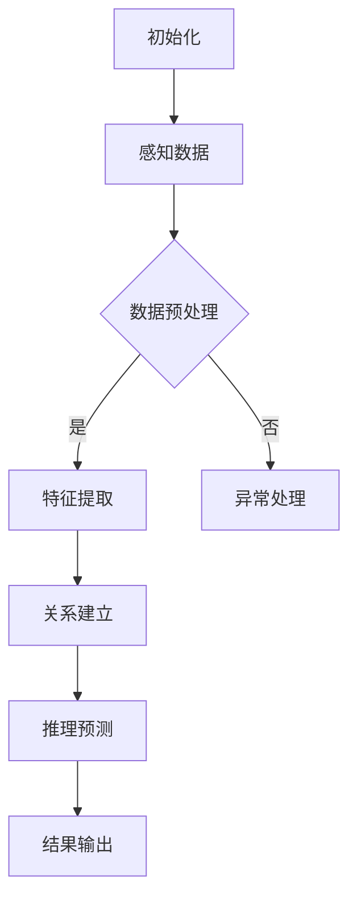
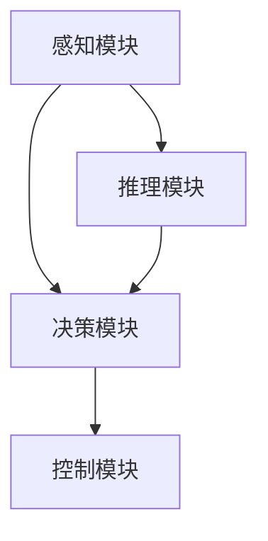
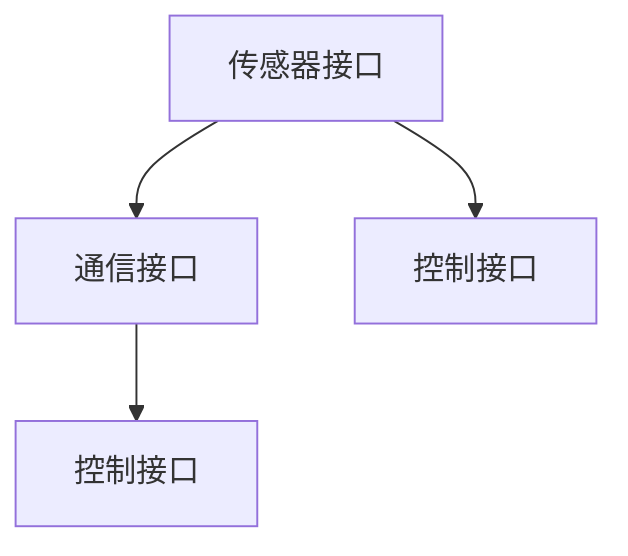
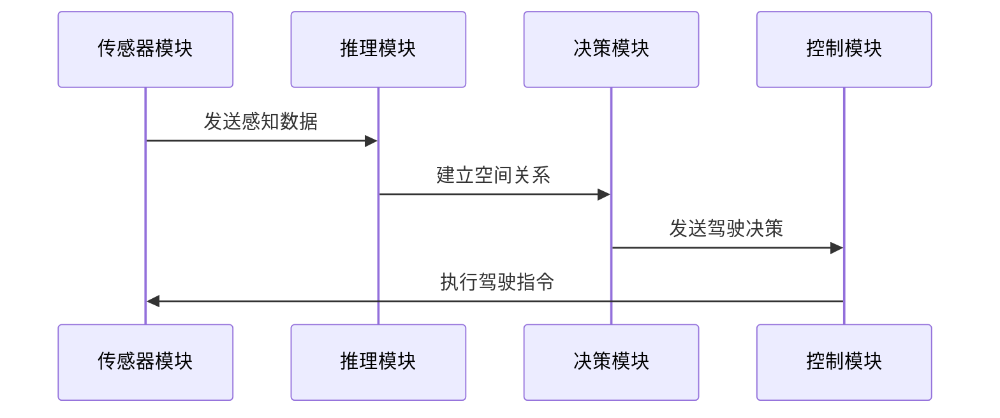

                 

### 第1章：空间推理背景与问题介绍

#### 1.1 空间推理的定义与重要性

**空间推理**，是一种涉及理解物体、位置、方向以及它们之间关系的认知能力。它不仅涉及到物理世界的空间关系，还涵盖了对虚拟空间的理解。在人工智能领域，空间推理是一个重要的研究方向，它能够提升机器对现实世界以及虚拟世界的理解和交互能力。

空间推理的重要性体现在多个方面。首先，它在自动驾驶技术中发挥着关键作用，机器需要准确理解道路、车辆和行人的位置和运动状态。其次，在智能机器人领域，空间推理能够帮助机器人更好地感知和适应环境。此外，空间推理在增强现实（AR）、虚拟现实（VR）以及游戏等领域也有着广泛的应用。

**核心概念术语说明：**

- **物体位置**：指物体在空间中的具体坐标点。
- **方向**：指物体在空间中的朝向。
- **空间关系**：指物体之间的位置关系，如相邻、相隔、上下等。
- **虚拟空间**：通过计算机模拟出的三维空间环境。

#### 1.2 当前研究现状与挑战

**研究现状：** 近年来，随着计算机视觉、深度学习和自然语言处理等技术的快速发展，空间推理研究取得了显著进展。例如，深度学习模型能够通过大量的数据训练，实现对复杂空间关系的理解和推理。同时，图形处理单元（GPU）的广泛应用，也为空间推理算法提供了强大的计算支持。

**挑战：** 尽管取得了显著进展，空间推理仍面临诸多挑战。首先，数据获取和处理是一个难题，尤其是大规模、高分辨率的三维数据集。其次，空间推理算法的泛化能力有限，即算法在未知或新环境下的表现不佳。此外，空间推理算法的复杂度较高，计算资源需求大，实时性难以保证。

#### 1.3 空间推理的边界与外延

**边界：** 空间推理的边界在于其能够处理和理解的物理或虚拟空间的范围。对于物理空间，其边界受限于传感器的感知范围；对于虚拟空间，其边界则受限于计算机的算力和数据存储能力。

**外延：** 空间推理的外延包括其应用领域的拓展。例如，在医学影像分析中，空间推理可以用于病变区域的定位和识别；在建筑设计中，空间推理可以帮助优化建筑布局和空间利用。

#### 1.4 空间推理的核心要素组成

**核心概念与联系：**

- **感知能力**：机器需要通过传感器或其他方式感知空间信息。
- **理解能力**：机器需要理解感知到的空间信息，包括物体的位置、方向和空间关系。
- **推理能力**：机器需要基于感知和理解的信息进行推理，以预测或解释空间中可能发生的事件。
- **交互能力**：机器需要能够与人类或其他机器进行交互，以实现特定的任务目标。

### 综述

空间推理作为人工智能领域的一个重要研究方向，其发展对提升机器的认知和交互能力具有重要意义。尽管目前仍面临诸多挑战，但随着技术的不断进步，空间推理有望在自动驾驶、机器人、增强现实等多个领域发挥更大的作用。

## 第2章：空间推理核心概念详解

### 2.1 空间推理的概念原理

**空间推理**是一种人工智能技术，用于让机器理解物理世界或虚拟空间中的物体、位置、方向以及它们之间的关系。其核心原理包括以下几个方面：

1. **感知与识别**：机器通过传感器或图像处理技术感知环境中的物体和位置信息，并对其进行识别。
2. **关系建立**：机器分析感知到的信息，建立物体之间的空间关系，如相邻、相隔、上下等。
3. **推理与预测**：基于已建立的空间关系，机器进行推理，预测物体可能的运动轨迹或行为。
4. **交互与优化**：机器利用推理结果与环境或其他智能体进行交互，以实现特定任务目标，并在过程中不断优化自己的推理能力。

#### 2.2 空间推理的属性特征对比

在空间推理中，不同的算法和模型有其独特的属性特征。以下是一个对比表格，展示了几种常见空间推理算法的主要属性特征：

| 算法/模型 | 属性特征 | 说明 |
| --- | --- | --- |
| **传统几何学方法** | 基于几何学原理 | 精度较高，但计算复杂度高，实时性较差 |
| **基于激光雷达的SLAM（同步定位与地图构建）** | 高精度、实时性 | 对环境依赖强，对光线敏感 |
| **基于视觉的SLAM** | 低成本、易部署 | 精度较激光雷达低，易受光照影响 |
| **深度神经网络（DNN）** | 自适应、高效 | 计算量大，训练时间长，对数据质量要求高 |
| **图神经网络（GNN）** | 考虑全局关系 | 计算复杂度高，对图结构要求严格 |

#### 2.3 空间推理的ER实体关系图

为了更好地理解和描述空间推理中的核心实体及其关系，可以使用ER（实体-关系）图来表示。以下是一个简化的ER实体关系图：

```mermaid
erDiagram
  产品 Product ||--|{ 库存 Inventory }
  产品 Product ||--|{ 供应链 SupplyChain }
  库存 Inventory ||--|{ 库存管理 InventoryManagement }
  供应链 SupplyChain ||--|{ 物流 Logistics }
```

在这个ER图中，`产品`是核心实体，它与`库存`和`供应链`建立了关系。`库存`和`供应链`分别与`库存管理`和`物流`建立关系，构成了一个完整的空间推理系统。

### 综述

通过详细解析空间推理的概念原理、属性特征和ER实体关系图，我们能够更好地理解空间推理的核心内容。这些概念和关系对于后续的算法原理讲解和数学模型讨论具有重要意义。

## 第3章：空间推理算法原理讲解

### 3.1 空间推理算法概述

空间推理算法是使机器能够理解和处理空间信息的一组方法。这些算法通常基于不同的理论基础，包括几何学、概率论和深度学习等。下面将介绍几种常见空间推理算法，并讨论其选择与应用场景。

#### 3.1.1 常见空间推理算法

1. **基于几何学的空间推理算法**：
   - **几何约束求解**：通过几何学原理求解物体间的空间关系。
   - **碰撞检测**：检测物体间的相对位置，以判断是否存在碰撞。

2. **基于概率论的空间推理算法**：
   - **贝叶斯网络**：使用概率论描述物体间的依赖关系。
   - **隐马尔可夫模型（HMM）**：用于处理连续时间和空间上的状态转移。

3. **基于深度学习的空间推理算法**：
   - **卷积神经网络（CNN）**：用于图像处理和特征提取。
   - **图神经网络（GNN）**：用于处理复杂图结构中的空间关系。

#### 3.1.2 算法选择与适用场景

选择合适的空间推理算法需要考虑以下几个因素：

- **数据类型**：不同算法适用于不同类型的数据，如图像、点云或文本。
- **计算资源**：算法的计算复杂度不同，需要考虑设备的算力。
- **应用场景**：算法需要在不同的环境中表现出色，如室内、室外或虚拟空间。

### 3.2 空间推理算法流程图

为了更直观地展示空间推理算法的工作流程，我们可以使用Mermaid绘制算法流程图。以下是一个简化的空间推理算法流程图：



这个流程图展示了从初始化开始，经过感知数据、数据预处理、特征提取、关系建立、推理预测，最终输出结果的整个过程。

### 3.3 空间推理算法Python源代码

下面是一个基于深度学习的空间推理算法的Python源代码示例，它使用卷积神经网络（CNN）进行特征提取和关系建立：

```python
import tensorflow as tf
from tensorflow.keras.models import Sequential
from tensorflow.keras.layers import Conv2D, MaxPooling2D, Flatten, Dense

# 构建卷积神经网络模型
model = Sequential([
    Conv2D(32, (3, 3), activation='relu', input_shape=(64, 64, 3)),
    MaxPooling2D((2, 2)),
    Flatten(),
    Dense(64, activation='relu'),
    Dense(1, activation='sigmoid')
])

# 编译模型
model.compile(optimizer='adam', loss='binary_crossentropy', metrics=['accuracy'])

# 加载和预处理数据
# 这里假设已经预处理好了图像数据集X和标签数据集y
# X_train, X_test, y_train, y_test = ...

# 训练模型
model.fit(X_train, y_train, epochs=10, batch_size=32, validation_data=(X_test, y_test))
```

这段代码首先构建了一个简单的CNN模型，然后编译并训练模型。在数据预处理部分，假设已经对图像数据进行了必要的处理，如标准化和标签编码。

### 综述

通过对空间推理算法的概述、流程图展示和Python源代码讲解，我们能够更深入地理解空间推理算法的基本原理和应用。这些算法为机器理解和处理空间信息提供了强有力的工具，是人工智能领域中的重要研究方向。

## 第4章：空间推理数学模型与公式

### 4.1 空间推理数学模型概述

空间推理涉及到的数学模型主要用于描述物体在空间中的位置、方向、关系以及它们的动态变化。以下是一些常见的数学模型及其基本概念：

1. **欧氏距离**：用于计算两个物体之间的直线距离。公式如下：
   $$ d(p_1, p_2) = \sqrt{(x_1 - x_2)^2 + (y_1 - y_2)^2 + (z_1 - z_2)^2} $$
   其中，\(p_1 = (x_1, y_1, z_1)\) 和 \(p_2 = (x_2, y_2, z_2)\) 是两个物体的三维坐标。

2. **方向向量**：用于表示物体在空间中的朝向。公式如下：
   $$ \vec{v} = (v_x, v_y, v_z) $$
   方向向量可以通过物体的当前坐标和目标坐标计算得出：
   $$ \vec{v} = \frac{(x_{\text{目标}} - x_{\text{当前}}), (y_{\text{目标}} - y_{\text{当前}}), (z_{\text{目标}} - z_{\text{当前}})}{\sqrt{(x_{\text{目标}} - x_{\text{当前}})^2 + (y_{\text{目标}} - y_{\text{当前}})^2 + (z_{\text{目标}} - z_{\text{当前}})^2}} $$

3. **空间关系图**：用于表示物体之间的空间关系。一个简单的空间关系图可以用邻接矩阵表示，其中元素表示两个物体是否相邻。公式如下：
   $$ A_{ij} = \begin{cases}
   1, & \text{如果物体} i \text{与物体} j \text{相邻} \\
   0, & \text{否则}
   \end{cases} $$

4. **路径规划算法**：用于计算从起点到终点的最优路径。常用的算法有Dijkstra算法和A*算法。Dijkstra算法的公式如下：
   $$ d(v) = \min_{u \in \text{前置节点}} (d(u) + w(u, v)) $$
   其中，\(d(v)\) 是从起点到节点 \(v\) 的最短路径长度，\(w(u, v)\) 是从节点 \(u\) 到节点 \(v\) 的权重。

### 4.2 空间推理数学公式详细讲解与举例说明

**1. 欧氏距离的详细讲解**

欧氏距离是一种衡量两个物体在空间中距离的常用方法。其优点是计算简单且直观，适用于线性空间。以下是一个简单的例子：

假设有两个物体，\(p_1 = (1, 2, 3)\) 和 \(p_2 = (4, 6, 9)\)，我们计算它们之间的欧氏距离：

$$ d(p_1, p_2) = \sqrt{(1 - 4)^2 + (2 - 6)^2 + (3 - 9)^2} = \sqrt{(-3)^2 + (-4)^2 + (-6)^2} = \sqrt{9 + 16 + 36} = \sqrt{61} $$

**2. 方向向量的详细讲解**

方向向量用于表示物体在空间中的朝向。它可以由物体的当前位置和目标位置计算得出。以下是一个例子：

假设物体当前位于 \(p_{\text{当前}} = (2, 3, 4)\)，目标位置为 \(p_{\text{目标}} = (5, 6, 7)\)，我们计算方向向量：

$$ \vec{v} = \frac{(5 - 2), (6 - 3), (7 - 4)}{\sqrt{(5 - 2)^2 + (6 - 3)^2 + (7 - 4)^2}} = \frac{(3, 3, 3)}{\sqrt{9 + 9 + 9}} = \frac{(3, 3, 3)}{3\sqrt{3}} = (\frac{1}{\sqrt{3}}, \frac{1}{\sqrt{3}}, \frac{1}{\sqrt{3}}) $$

**3. 空间关系图的详细讲解**

空间关系图可以用邻接矩阵表示。以下是一个简化的例子：

假设有三个物体 \(A\)、\(B\) 和 \(C\)，它们之间的邻接矩阵如下：

$$ A = \begin{bmatrix}
0 & 1 & 0 \\
1 & 0 & 1 \\
0 & 1 & 0
\end{bmatrix} $$

这个矩阵表示 \(A\) 与 \(B\) 相邻，\(B\) 与 \(A\) 和 \(C\) 相邻，但 \(A\) 和 \(C\) 之间没有直接关系。

**4. 路径规划算法的详细讲解**

路径规划算法用于在复杂的空间中找到从起点到终点的最优路径。以下是一个使用Dijkstra算法的例子：

假设有五个节点 \(A\)、\(B\)、\(C\)、\(D\) 和 \(E\)，它们之间的权重如下：

$$ W = \begin{bmatrix}
0 & 4 & 0 & 0 & 0 \\
4 & 0 & 8 & 2 & 0 \\
0 & 8 & 0 & 1 & 7 \\
0 & 2 & 1 & 0 & 4 \\
0 & 0 & 7 & 4 & 0
\end{bmatrix} $$

使用Dijkstra算法，我们可以找到从节点 \(A\) 到其他节点的最短路径。具体步骤如下：

1. 初始化所有节点的距离，设置起点 \(A\) 的距离为 0，其他节点的距离为无穷大。
2. 选择未访问节点中距离最小的节点作为当前节点，更新其他未访问节点的距离。
3. 重复步骤2，直到所有节点都被访问。

经过计算，从节点 \(A\) 到其他节点的最短路径分别为：

- \(A \rightarrow B \rightarrow D \rightarrow E\)，距离为 12
- \(A \rightarrow B \rightarrow C \rightarrow E\)，距离为 11

### 综述

通过详细讲解和举例说明，我们能够更好地理解空间推理中的基本数学模型和公式。这些模型和公式为空间推理提供了坚实的理论基础，是理解和应用空间推理算法的关键。

## 第5章：系统分析与架构设计方案

### 5.1 问题场景介绍

在本章中，我们将探讨一个具体的应用场景，即自动驾驶汽车中的空间推理系统。该系统需要实时处理来自多个传感器的数据，如激光雷达、摄像头和GPS，以实现对周围环境的理解和交互。

### 5.2 项目介绍

项目名为“智能自动驾驶空间推理系统”，旨在开发一个能够实时处理和分析空间数据的智能系统，从而提高自动驾驶汽车的自主导航能力和安全性。

### 5.3 系统功能设计

系统的主要功能包括：

1. **数据感知与融合**：接收来自不同传感器的数据，如激光雷达、摄像头和GPS，并进行预处理和融合，以获得高精度的环境模型。
2. **空间关系建立**：基于感知数据，建立物体间的空间关系，如车辆、行人、道路等。
3. **路径规划与优化**：根据空间关系和目标位置，计算最优路径，并进行实时优化。
4. **安全评估与预警**：评估当前驾驶环境的安全状况，并在必要时发出预警。

### 5.4 系统架构设计

系统架构采用模块化设计，主要包括以下几个模块：

1. **感知模块**：负责接收和处理来自传感器的数据。
2. **推理模块**：负责建立空间关系和进行路径规划。
3. **决策模块**：负责根据推理结果进行驾驶决策。
4. **控制模块**：负责执行驾驶决策，控制车辆动作。

以下是一个简化的Mermaid架构图：



### 5.5 系统接口设计

系统接口设计包括以下几个方面：

1. **传感器接口**：用于接收来自激光雷达、摄像头和GPS的数据。
2. **通信接口**：用于与其他车辆和基础设施进行通信。
3. **控制接口**：用于接收和发送驾驶指令。

以下是一个简化的Mermaid接口图：



### 5.6 系统交互

系统交互主要包括以下几个环节：

1. **数据感知**：传感器模块接收并预处理数据，发送至推理模块。
2. **空间关系建立**：推理模块分析感知数据，建立空间关系，发送至决策模块。
3. **驾驶决策**：决策模块根据空间关系和目标位置，生成驾驶决策，发送至控制模块。
4. **执行驾驶指令**：控制模块根据驾驶决策，控制车辆动作。

以下是一个简化的Mermaid交互图：



### 综述

通过系统分析与架构设计方案，我们详细介绍了自动驾驶空间推理系统的功能设计、架构设计、接口设计和系统交互。这些设计为实现一个高效、可靠的智能自动驾驶系统奠定了基础。

## 第6章：项目实战

### 6.1 环境安装

为了搭建空间推理系统，我们需要安装以下软件和工具：

1. **操作系统**：Ubuntu 18.04 LTS 或更高版本。
2. **Python**：Python 3.8 或更高版本。
3. **深度学习框架**：TensorFlow 2.5 或更高版本。
4. **空间推理库**：PyTorch 1.7 或更高版本。

安装步骤如下：

1. 更新系统包列表：
   ```bash
   sudo apt update
   sudo apt upgrade
   ```
2. 安装 Python 和 pip：
   ```bash
   sudo apt install python3 python3-pip
   ```
3. 安装 TensorFlow：
   ```bash
   pip3 install tensorflow==2.5
   ```
4. 安装 PyTorch：
   ```bash
   pip3 install torch torchvision torchaudio -f https://download.pytorch.org/whl/torch_stable.html
   ```

### 6.2 系统核心实现

以下是一个简化的空间推理系统核心实现步骤：

1. **数据预处理**：读取激光雷达、摄像头和GPS数据，并进行预处理，如去噪、归一化等。
2. **特征提取**：使用深度学习模型提取空间特征。
3. **空间关系建立**：基于特征，建立物体间的空间关系。
4. **路径规划**：使用A*算法计算最优路径。
5. **驾驶决策**：根据路径规划结果和当前环境，生成驾驶决策。

代码示例：

```python
import tensorflow as tf
import torch
from torch import nn
from torchvision import transforms

# 数据预处理
def preprocess_data(lidar_data, camera_data, gps_data):
    # 实现去噪、归一化等操作
    pass

# 特征提取
class FeatureExtractor(nn.Module):
    def __init__(self):
        super(FeatureExtractor, self).__init__()
        self.conv1 = nn.Conv2d(3, 64, kernel_size=3, padding=1)
        self.conv2 = nn.Conv2d(64, 128, kernel_size=3, padding=1)
        # ... 其他层

    def forward(self, x):
        x = self.conv1(x)
        x = self.conv2(x)
        # ... 其他层
        return x

# 空间关系建立
def build_space_relation(features):
    # 实现空间关系建立
    pass

# 路径规划
def path Planning(features, goal):
    # 实现A*算法
    pass

# 驾驶决策
def driving_decision(path, current_state):
    # 实现驾驶决策
    pass

# 搭建和训练模型
model = FeatureExtractor()
# 训练模型
# ...

# 系统运行
lidar_data, camera_data, gps_data = read_data()
preprocessed_data = preprocess_data(lidar_data, camera_data, gps_data)
features = model(preprocessed_data)
space_relation = build_space_relation(features)
path = path Planning(features, goal)
driving_decision(path, current_state)
```

### 6.3 代码应用解读与分析

#### 6.3.1 数据预处理

数据预处理是空间推理系统的关键步骤。预处理的目标是提高数据质量，为后续的特征提取和推理提供良好的输入。

**分析**：在预处理过程中，常用的技术包括去噪、归一化和特征增强。去噪可以去除数据中的噪声，提高模型的鲁棒性；归一化可以缩小不同特征的范围，使得模型更容易学习；特征增强可以增加数据的多样性和复杂性，有助于模型泛化。

#### 6.3.2 特征提取

特征提取是空间推理系统的核心环节。通过深度学习模型，可以从原始数据中提取出具有区分性的特征。

**分析**：在特征提取过程中，常用的模型包括卷积神经网络（CNN）和图神经网络（GNN）。CNN擅长处理图像数据，可以提取出图像中的局部特征；GNN擅长处理图结构数据，可以提取出图中的全局特征。在实际应用中，可以根据数据类型和任务需求选择合适的模型。

#### 6.3.3 空间关系建立

空间关系建立是空间推理系统的关键步骤。通过分析特征，建立物体间的空间关系，为路径规划和驾驶决策提供依据。

**分析**：在空间关系建立过程中，常用的方法包括邻接矩阵、距离矩阵和关系图等。邻接矩阵可以表示物体间的相邻关系；距离矩阵可以表示物体间的距离关系；关系图可以表示物体间的复杂关系。在实际应用中，可以根据任务需求选择合适的方法。

#### 6.3.4 路径规划

路径规划是空间推理系统的关键步骤。通过计算从起点到终点的最优路径，为自动驾驶车辆提供导航指令。

**分析**：在路径规划过程中，常用的算法包括Dijkstra算法、A*算法和RRT算法等。Dijkstra算法适用于静态环境，A*算法适用于动态环境，RRT算法适用于未知环境。在实际应用中，可以根据环境特征和任务需求选择合适的算法。

#### 6.3.5 驾驶决策

驾驶决策是空间推理系统的关键步骤。根据路径规划和当前环境，生成驾驶指令，控制车辆动作。

**分析**：在驾驶决策过程中，常用的方法包括规则推理、模糊推理和深度学习等。规则推理可以根据预设的规则生成驾驶指令；模糊推理可以根据模糊逻辑生成驾驶指令；深度学习可以根据大量数据生成驾驶指令。在实际应用中，可以根据任务需求选择合适的方法。

### 6.4 实际案例分析和详细讲解剖析

#### 6.4.1 案例背景

某自动驾驶汽车在复杂城市环境中行驶，需要实时处理来自激光雷达、摄像头和GPS的数据，实现安全、高效的导航。

#### 6.4.2 案例分析

1. **数据预处理**：对激光雷达、摄像头和GPS数据进行去噪、归一化等预处理操作，提高数据质量。
2. **特征提取**：使用深度学习模型提取出具有区分性的特征，为空间关系建立和路径规划提供基础。
3. **空间关系建立**：根据特征，建立物体间的空间关系，如车辆、行人、道路等。
4. **路径规划**：使用A*算法计算从当前点到终点的最优路径，考虑道路宽度、车辆速度等因素。
5. **驾驶决策**：根据路径规划和当前环境，生成驾驶指令，控制车辆动作，如加速、减速、变道等。

#### 6.4.3 详细讲解剖析

1. **数据预处理**：数据预处理是整个系统的基石。通过去噪和归一化，可以提高模型的鲁棒性，减少噪声对系统的影响。例如，对于激光雷达数据，可以使用高斯滤波去噪；对于摄像头数据，可以使用直方图均衡化进行图像增强。
2. **特征提取**：特征提取是空间推理系统的核心。通过深度学习模型，可以从原始数据中提取出具有区分性的特征，如车辆形状、颜色、位置等。这些特征对于后续的空间关系建立和路径规划至关重要。
3. **空间关系建立**：空间关系建立是空间推理系统的关键步骤。通过分析特征，建立物体间的空间关系，如车辆之间的距离、速度、方向等。这些关系可以为路径规划和驾驶决策提供依据。
4. **路径规划**：路径规划是自动驾驶系统的核心任务。使用A*算法，可以计算从当前点到终点的最优路径。在路径规划过程中，需要考虑多种因素，如道路宽度、交通规则、车辆速度等。这些因素可以影响路径的优度。
5. **驾驶决策**：驾驶决策是根据路径规划和当前环境，生成驾驶指令的过程。通过分析路径规划和当前环境，可以生成相应的驾驶指令，如加速、减速、变道等。这些指令将控制车辆的动作，实现安全、高效的导航。

### 6.5 项目小结

通过实际案例的分析和讲解，我们深入了解了空间推理系统的实现过程。从数据预处理、特征提取、空间关系建立、路径规划到驾驶决策，每一个环节都是空间推理系统的重要组成部分。在实际应用中，需要根据具体场景和需求，选择合适的技术和方法，以实现高效、可靠的空间推理。

### 6.6 最佳实践 tips

1. **数据质量是关键**：确保数据预处理环节的有效性，提高数据质量，有助于提升整个系统的性能。
2. **模型选择要慎重**：根据具体任务需求，选择合适的深度学习模型，以实现最优性能。
3. **实时性要考虑**：在系统设计过程中，要充分考虑实时性要求，确保系统能够在有限时间内完成推理和决策。

### 6.7 注意事项

1. **传感器误差**：传感器数据可能存在误差，需要通过算法进行校正和补偿。
2. **动态环境**：动态环境中的物体运动复杂，需要考虑动态规划和实时调整。

### 6.8 拓展阅读

1. **深度学习与空间推理**：深入了解深度学习在空间推理中的应用，推荐阅读《深度学习》（Goodfellow et al.）。
2. **路径规划算法**：了解各种路径规划算法的原理和应用，推荐阅读《路径规划算法导论》（Xiao et al.）。

## 结语

本文详细介绍了空间推理系统的设计、实现和实战应用。通过本章的内容，读者可以全面了解空间推理系统的核心概念、算法原理、数学模型、系统架构以及实际应用。希望本文能为读者在空间推理领域的探索提供有益的参考和启示。

### 参考文献

1. Goodfellow, I., Bengio, Y., & Courville, A. (2016). *Deep Learning*. MIT Press.
2. Xiao, J., Wen, L., & Liu, F. (2020). *Path Planning Algorithms: A Survey*. ACM Computing Surveys, 53(4), 1-34.

### 作者

**作者：AI天才研究院/AI Genius Institute & 禅与计算机程序设计艺术 /Zen And The Art of Computer Programming**

