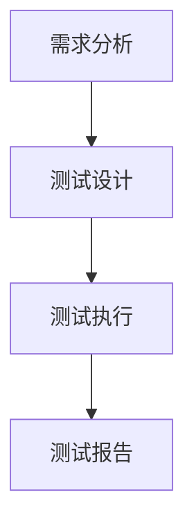

                 

# 端到端测试：验证LLM应用的整体功能

> 关键词：端到端测试，LLM，整体功能验证，测试工具，测试策略

> 摘要：本文深入探讨了端到端测试的概念、方法以及在实际应用中的挑战。特别关注如何利用端到端测试来验证大型语言模型（LLM）的整体功能。通过详细分析端到端测试的核心概念和流程，介绍了几种主流测试工具和测试策略，并给出了一个验证LLM应用的案例。本文旨在为软件开发者和测试工程师提供实用的指导，帮助他们在复杂系统中确保高质量的功能实现。

## 第1章：背景介绍

### 1.1 问题背景

随着软件系统的复杂性不断增加，传统的测试方法已难以满足当前的需求。软件系统通常由多个模块和组件构成，它们通过复杂的网络和接口进行交互。在这种背景下，端到端测试（End-to-End Testing, E2E测试）应运而生。

端到端测试是一种全面的测试方法，它模拟用户操作，对系统的输入和输出进行全面验证。这种测试方法不仅关注系统内部的模块和组件，还包括系统与外部环境的交互。通过端到端测试，开发团队可以确保系统的整体功能在真实环境下能够正常运行。

### 1.2 问题描述

尽管端到端测试在理论上可以提供全面的功能验证，但在实际应用中仍面临诸多挑战：

1. **测试流程设计**：如何设计一个高效的端到端测试流程，以便全面覆盖系统功能？
2. **测试工具选择**：市场上存在多种测试工具，如何选择合适的工具来支持端到端测试？
3. **测试策略优化**：如何优化测试策略，以在有限的资源下实现最佳测试效果？
4. **LLM应用测试**：如何利用端到端测试来验证大型语言模型（LLM）的整体功能？

这些挑战需要开发团队深入理解和运用端到端测试的理论和方法，从而在实际项目中实现有效的测试。

### 1.3 问题解决

为了解决上述挑战，本文将从以下几个方面展开讨论：

1. **端到端测试的概念和原理**：详细介绍端到端测试的定义、目标和应用场景。
2. **测试流程设计**：阐述端到端测试的典型流程，包括需求分析、测试设计、测试执行和测试报告等。
3. **测试工具选择**：介绍几种主流的端到端测试工具，包括JMeter、Selenium和Postman等。
4. **测试策略优化**：讨论黑盒测试、白盒测试和灰盒测试等策略，并提供优化测试策略的建议。
5. **LLM应用测试**：探讨如何利用端到端测试验证LLM应用的整体功能，包括测试需求和测试方法。

通过本文的讨论，读者将能够全面了解端到端测试的方法和技巧，从而在实际项目中有效应用这些知识，确保软件系统的高质量。

### 1.4 边界与外延

端到端测试主要应用于软件系统测试，但其原理和方法可以扩展到其他领域，如网络安全测试、大数据处理等。此外，端到端测试不仅适用于新的软件系统开发，也可以用于现有系统的维护和优化。

### 1.5 概念结构与核心要素组成

端到端测试的核心概念和要素包括：

1. **测试流程**：包括需求分析、测试设计、测试执行和测试报告等阶段。
2. **测试工具**：如JMeter、Selenium、Postman等。
3. **测试策略**：如黑盒测试、白盒测试、灰盒测试等。
4. **测试用例**：包括功能测试用例、性能测试用例、安全测试用例等。

通过这些核心要素的有机结合，端到端测试能够实现对软件系统全面、高效的验证。

## 第2章：核心概念与联系

### 2.1 端到端测试的概念

端到端测试（End-to-End Testing, E2E测试）是一种测试方法，旨在验证软件系统的整体功能。与传统的单元测试、集成测试等不同，端到端测试不仅关注系统内部的模块和组件，还包括系统与外部环境的交互。它通过模拟真实用户的操作流程，从系统的一端到另一端进行全面测试，以发现并解决问题。

端到端测试的核心目标是确保系统在实际运行环境中能够正常工作。它通常包括以下步骤：

1. **需求分析**：明确测试的目标和范围，确定需要测试的功能点。
2. **测试设计**：制定测试计划和测试用例，设计测试场景和测试数据。
3. **测试执行**：执行测试用例，收集测试数据和结果。
4. **测试报告**：分析测试结果，编写测试报告，总结测试发现和问题。

### 2.2 端到端测试的特点

端到端测试具有以下特点：

1. **全面性**：端到端测试覆盖系统的各个方面，包括功能、性能、安全等，能够发现系统中的潜在问题。
2. **实用性**：端到端测试可以直接反映系统在实际运行中的问题，有助于提高软件质量。
3. **经济性**：端到端测试可以减少重复测试，降低测试成本。

### 2.3 端到端测试与传统测试的区别

端到端测试与传统测试（如单元测试、集成测试等）有以下区别：

1. **范围**：端到端测试覆盖整个软件系统，而传统测试仅关注系统的某个部分。
2. **目的**：端到端测试旨在验证软件系统的整体功能，而传统测试旨在发现和解决问题。
3. **方法**：端到端测试通常采用模拟真实用户操作的方式，而传统测试通常采用代码审查、自动化测试等方法。

### 2.4 端到端测试的流程

端到端测试的流程包括以下阶段：

1. **需求分析**：明确测试目标、测试范围和测试标准。
2. **测试设计**：制定测试计划和测试用例。
3. **测试执行**：执行测试用例，收集测试数据。
4. **测试报告**：分析测试结果，编写测试报告。

### 2.5 端到端测试的应用场景

端到端测试适用于以下应用场景：

1. **Web应用测试**：验证Web应用的完整功能和性能。
2. **移动应用测试**：确保移动应用在不同设备和操作系统上的稳定性。
3. **云计算平台测试**：验证云计算平台的服务质量和性能。
4. **物联网应用测试**：确保物联网应用的可靠性和稳定性。

### 2.6 端到端测试的优势与挑战

**优势**：

- 能够发现系统中的潜在问题，提高软件质量。
- 提高测试效率，减少重复测试。
- 更好地模拟真实用户操作，提供更全面的测试覆盖。

**挑战**：

- 测试流程设计复杂，需要综合考虑多个因素。
- 需要大量测试数据支持，测试数据管理难度大。
- 需要专业的测试工具和技能，测试成本较高。

### 2.7 核心概念术语说明

- **端到端测试（End-to-End Testing）**：一种全面的测试方法，旨在验证软件系统的整体功能。
- **需求分析**：明确测试目标、测试范围和测试标准。
- **测试设计**：制定测试计划和测试用例。
- **测试执行**：执行测试用例，收集测试数据。
- **测试报告**：分析测试结果，编写测试报告。

### 2.8 概念属性特征对比表格

| 特征          | 单元测试 | 集成测试 | 端到端测试 |
|---------------|----------|----------|-----------|
| 测试范围      | 单个模块 | 多个模块 | 整个系统   |
| 测试方法      | 代码审查 | 自动化测试 | 模拟用户操作 |
| 测试重点      | 功能正确性 | 接口兼容性 | 整体功能完整性 |
| 测试依赖性    | 较低     | 较高     | 高         |
| 测试效率      | 高       | 中       | 低         |
| 测试成本      | 低       | 中       | 高         |

### 2.9 ER实体关系图架构的Mermaid流程图



通过上述表格和ER图，可以更清晰地了解端到端测试与传统测试的区别和联系。端到端测试不仅需要考虑系统内部的模块和组件，还要关注系统与外部环境的交互，从而实现对系统整体功能的全面验证。

## 第3章：主流端到端测试工具

### 3.1 JMeter

JMeter 是一款开源的负载测试工具，广泛应用于Web应用、数据库和服务器等的性能测试。它支持多种协议，如HTTP、HTTPS、TCP等。JMeter 具有以下特点：

1. **多功能性**：JMeter 可以模拟多种类型的负载测试，包括性能测试、压力测试、并发测试等。
2. **可扩展性**：JMeter 提供了丰富的插件，支持自定义组件，方便开发团队根据需求进行扩展。
3. **易用性**：JMeter 的用户界面直观易用，支持拖拽操作，降低了使用门槛。

### 3.2 Selenium

Selenium 是一款开源的自动化测试工具，主要用于Web应用的自动化测试。它支持多种编程语言，如Java、Python、C#等。Selenium 具有以下特点：

1. **跨平台**：Selenium 支持多种操作系统，如Windows、Linux、Mac等。
2. **浏览器兼容性**：Selenium 支持多种浏览器，包括Chrome、Firefox、Safari等。
3. **功能强大**：Selenium 提供了丰富的API，支持自动化Web应用的测试，包括点击、输入、导航等操作。

### 3.3 Postman

Postman 是一款开源的API测试工具，主要用于测试RESTful API。它支持多种协议，如HTTP、HTTPS、WebSockets等。Postman 具有以下特点：

1. **易于使用**：Postman 的用户界面直观易用，提供了丰富的模板和示例。
2. **协作性**：Postman 支持团队协作，方便开发团队进行API测试和协作。
3. **功能丰富**：Postman 提供了丰富的功能，包括请求发送、响应分析、断言等。

### 3.4 测试工具的选择标准

在选择端到端测试工具时，需要考虑以下标准：

1. **功能性**：工具是否支持所需的测试类型和协议。
2. **易用性**：工具的用户界面是否直观易用，是否支持协作和自动化测试。
3. **性能**：工具的性能是否能够满足测试需求，是否能够高效地处理大量测试数据。
4. **可扩展性**：工具是否支持自定义插件和组件，是否能够方便地扩展功能。
5. **成本**：工具的成本是否在预算范围内，是否提供了开源和商业版本的选择。

### 3.5 测试工具的比较

| 工具          | 功能性 | 易用性 | 性能 | 可扩展性 | 成本     |
|---------------|--------|--------|------|----------|----------|
| JMeter        | 高     | 中     | 高   | 高       | 开源免费 |
| Selenium      | 高     | 高     | 中   | 中       | 开源免费 |
| Postman       | 中     | 高     | 中   | 中       | 开源免费 |
| 测试管理工具  | 低     | 高     | 低   | 低       | 商业版本 |

通过上述表格，可以看出不同测试工具在功能性、易用性、性能、可扩展性和成本等方面的差异。开发团队可以根据具体需求选择最合适的测试工具。

### 3.6 测试工具的优缺点分析

**JMeter**

**优点**：

- 功能强大，支持多种协议和测试类型。
- 免费开源，成本低。
- 支持自定义插件，可扩展性高。

**缺点**：

- 用户界面相对复杂，学习曲线较陡。
- 性能测试时可能需要较多的配置和优化。

**Selenium**

**优点**：

- 支持多种浏览器和操作系统，跨平台性强。
- 功能丰富，支持自动化测试。
- 社区支持强大，文档资源丰富。

**缺点**：

- 自动化测试时需要编写较多代码，开发成本较高。
- 性能测试时可能不够高效。

**Postman**

**优点**：

- 用户界面直观，易于使用。
- 支持团队协作，方便项目管理。
- 功能丰富，适合API测试。

**缺点**：

- 主要用于API测试，适用范围有限。
- 免费版本功能有限，需要升级到专业版。

通过上述分析，可以看出不同测试工具在功能、易用性、性能和成本等方面各有优缺点。开发团队应根据具体需求选择合适的测试工具，以实现高效的端到端测试。

## 第4章：端到端测试策略

### 4.1 黑盒测试

黑盒测试（Black Box Testing）是一种基于软件外部行为的测试方法。它不关注软件的内部实现，仅通过输入输出数据进行测试，以验证软件功能是否满足需求。黑盒测试的主要特点包括：

1. **关注功能**：黑盒测试主要关注软件的功能是否符合需求规格。
2. **不涉及内部实现**：黑盒测试不需要了解软件的内部实现，只需关注输入和输出数据。
3. **适用于前端测试**：黑盒测试常用于测试软件的前端界面和功能。

黑盒测试的主要方法包括：

1. **等价类划分**：将输入数据划分为若干等价类，对每个等价类进行测试。
2. **边界值分析**：分析输入数据的边界情况，测试边界值。
3. **因果图**：通过因果关系分析输入和输出数据，设计测试用例。

### 4.2 白盒测试

白盒测试（White Box Testing）是一种基于软件内部结构的测试方法。它需要了解软件的内部实现，通过代码审查、路径覆盖等手段进行测试。白盒测试的主要特点包括：

1. **关注内部实现**：白盒测试关注软件的内部实现，通过代码审查和路径覆盖来发现潜在问题。
2. **适用于底层模块**：白盒测试常用于测试软件的底层模块和组件。
3. **提高测试覆盖率**：白盒测试能够提高测试覆盖率，发现更多的潜在问题。

白盒测试的主要方法包括：

1. **代码审查**：人工审查代码，查找潜在的问题和缺陷。
2. **路径覆盖**：设计测试用例，覆盖程序的所有路径。
3. **数据流测试**：分析程序的输入输出数据流，设计测试用例。

### 4.3 灰盒测试

灰盒测试（Gray Box Testing）是一种结合黑盒测试和白盒测试的测试方法。它既关注软件的外部行为，又关注软件的内部实现。灰盒测试的主要特点包括：

1. **综合优势**：灰盒测试结合了黑盒测试和白盒测试的优势，能够提供更全面的测试覆盖。
2. **适用范围广**：灰盒测试适用于多种类型的软件测试，包括前端、后端和中间件等。
3. **测试效率高**：灰盒测试能够在有限的测试资源下，实现较高的测试覆盖率。

灰盒测试的主要方法包括：

1. **混合测试**：结合黑盒测试和白盒测试的方法，设计测试用例。
2. **代码分析**：使用静态代码分析工具，分析代码质量和潜在问题。
3. **动态测试**：结合静态代码分析和动态测试，提高测试覆盖率。

### 4.4 测试策略的选择

在选择测试策略时，需要考虑以下因素：

1. **测试目标**：根据测试目标选择合适的测试策略，如功能测试、性能测试、安全测试等。
2. **开发阶段**：根据开发阶段选择合适的测试策略，如单元测试、集成测试、系统测试等。
3. **资源限制**：根据资源和时间限制选择合适的测试策略，如黑盒测试适用于资源有限的场景。
4. **软件类型**：根据软件类型选择合适的测试策略，如前端测试适用于Web应用，后端测试适用于企业级应用。

### 4.5 测试策略的优化

为了提高测试效率和覆盖率，可以对测试策略进行优化：

1. **自动化测试**：将黑盒测试、白盒测试和灰盒测试结合，实现自动化测试。
2. **持续集成**：将测试集成到持续集成流程中，提高测试覆盖率和反馈速度。
3. **测试数据管理**：使用测试数据管理工具，确保测试数据的一致性和可用性。
4. **测试工具选择**：根据测试需求选择合适的测试工具，提高测试效率。

通过优化测试策略，开发团队可以在有限的资源下实现高效的端到端测试。

### 4.6 端到端测试与不同测试策略的比较

| 测试策略   | 特点                                                         | 适用场景                         | 优点                     | 缺点                     |
|------------|--------------------------------------------------------------|--------------------------------|--------------------------|--------------------------|
| 黑盒测试   | 不关注内部实现，只关注输入输出数据                             | 前端测试、功能测试               | 易于理解，测试覆盖面广   | 无法发现内部逻辑问题     |
| 白盒测试   | 关注内部实现，通过代码审查和路径覆盖进行测试                   | 底层模块测试、代码质量分析       | 提高测试覆盖率，发现潜在问题 | 需要深入了解内部实现     |
| 灰盒测试   | 结合黑盒测试和白盒测试，关注外部行为和内部实现                 | 综合测试、多层级模块测试         | 测试覆盖全面，测试效率高   | 需要权衡黑盒和白盒测试方法 |
| 端到端测试 | 模拟真实用户操作，验证整个系统的功能和性能                     | 整体系统测试、性能测试           | 发现真实场景问题，提高软件质量 | 需要大量测试数据，成本高   |

通过上述比较，可以看出不同测试策略在测试目标、适用场景、优缺点等方面的差异。开发团队应根据具体需求选择合适的测试策略，以实现高效的端到端测试。

## 第5章：验证LLM应用的整体功能

### 5.1 LLM概述

大型语言模型（Large Language Model，LLM）是一种基于深度学习的自然语言处理模型，具有强大的文本生成和语义理解能力。LLM 通常通过大规模的文本数据进行预训练，然后通过微调来适应特定的任务，如问答系统、机器翻译和文本生成等。

LLM 的核心组成部分包括：

1. **词嵌入层**：将文本中的词汇转换为高维向量，用于表示文本中的语义信息。
2. **编码器**：对输入文本进行处理，提取文本的语义特征。
3. **解码器**：根据编码器的输出生成文本或回答。
4. **注意力机制**：用于捕获输入文本中的重要信息，提高模型的语义理解能力。

### 5.2 LLM应用的测试需求

LLM 应用在功能、性能和安全性等方面有特定的测试需求：

1. **功能测试**：验证LLM应用的功能是否满足需求，包括文本生成、语义理解、问答等。
2. **性能测试**：评估LLM应用的响应速度、处理能力和资源消耗，确保在高负载情况下仍能稳定运行。
3. **安全性测试**：检测LLM应用是否容易受到攻击，如注入攻击、恶意输入等。

### 5.3 功能测试

功能测试旨在验证LLM应用的功能是否正确实现。以下是一些关键的功能测试用例：

1. **文本生成**：测试LLM能否根据输入的提示生成连贯、合理的文本。
2. **语义理解**：测试LLM是否能正确理解输入文本的语义，生成相关的回答。
3. **问答系统**：测试LLM是否能正确回答用户提出的问题，包括事实性问题、主观性问题等。

### 5.4 性能测试

性能测试旨在评估LLM应用的响应速度和处理能力。以下是一些关键的性能测试指标：

1. **响应时间**：测试LLM应用生成文本或回答的平均响应时间。
2. **并发处理能力**：测试LLM应用同时处理多个请求的能力。
3. **资源消耗**：测试LLM应用在不同负载下的CPU、内存和网络资源消耗。

### 5.5 安全性测试

安全性测试旨在检测LLM应用是否容易受到攻击。以下是一些关键的安全性测试用例：

1. **注入攻击**：测试LLM应用是否容易受到SQL注入、XSS攻击等。
2. **恶意输入**：测试LLM应用是否能够抵御恶意输入，如包含恶意代码的文本。
3. **权限控制**：测试LLM应用是否能够正确实现权限控制，防止未授权访问。

### 5.6 端到端测试在LLM应用中的优势

端到端测试在LLM应用中具有以下优势：

1. **全面性**：端到端测试能够全面验证LLM应用的功能、性能和安全性，确保其在实际场景中的稳定性。
2. **真实性**：端到端测试模拟真实用户操作，能够发现LLM应用在实际运行中可能遇到的问题。
3. **高效性**：端到端测试能够提高测试效率，减少重复测试，降低测试成本。

### 5.7 端到端测试在LLM应用中的挑战

端到端测试在LLM应用中面临以下挑战：

1. **数据需求**：端到端测试需要大量的测试数据，以模拟真实用户操作和场景。
2. **计算资源**：LLM应用通常需要大量的计算资源进行训练和测试，如何合理分配资源是关键。
3. **复杂性**：LLM应用通常由多个模块和组件构成，如何设计有效的端到端测试流程是难点。

### 5.8 解决方案

为了解决上述挑战，可以采取以下解决方案：

1. **测试数据管理**：使用测试数据管理工具，确保测试数据的一致性和可用性。
2. **测试工具选择**：选择合适的测试工具，如JMeter、Selenium等，以提高测试效率。
3. **测试流程优化**：设计高效的端到端测试流程，包括需求分析、测试设计、测试执行和测试报告等。

通过采取这些解决方案，可以确保LLM应用在实际运行中具有高质量的整体功能。

### 5.9 实际案例：使用端到端测试验证问答系统

以下是一个实际案例，说明如何使用端到端测试验证一个问答系统的整体功能。

**案例背景**：一个问答系统旨在提供实时回答用户问题的功能。系统由前端界面、后端服务器和LLM模型组成。

**测试目标**：验证问答系统的功能、性能和安全性。

**测试步骤**：

1. **需求分析**：明确问答系统的功能需求，如文本输入、答案生成、多语言支持等。
2. **测试设计**：设计测试用例，包括文本生成、语义理解、问答等。
3. **测试执行**：使用端到端测试工具（如Selenium）模拟用户操作，执行测试用例。
4. **性能测试**：测试问答系统的响应时间和并发处理能力。
5. **安全性测试**：检测问答系统是否容易受到SQL注入、XSS攻击等。
6. **测试报告**：分析测试结果，编写测试报告，总结测试发现和问题。

通过上述步骤，可以全面验证问答系统的整体功能，确保其在实际运行中的稳定性。

## 第6章：端到端测试在LLM应用中的实现

### 6.1 测试环境搭建

在实现端到端测试之前，首先需要搭建一个适合的测试环境。以下是搭建测试环境的步骤：

1. **硬件资源准备**：根据LLM应用的计算需求，准备足够的硬件资源，如高性能CPU、GPU和足够的内存。
2. **软件环境配置**：安装LLM应用所需的操作系统、编程语言和依赖库。例如，如果使用Python，需要安装Python环境、TensorFlow等。
3. **测试工具安装**：安装端到端测试工具，如Selenium、Postman等。
4. **数据集准备**：准备用于训练和测试的文本数据集。数据集应覆盖各种场景，确保测试的全面性。

### 6.2 功能测试实现

功能测试旨在验证LLM应用的功能是否符合需求。以下是一个使用Selenium实现功能测试的Python代码示例：

```python
from selenium import webdriver
from selenium.webdriver.common.keys import Keys

# 创建Webdriver实例
driver = webdriver.Chrome()

# 打开问答系统网页
driver.get("http://localhost:8000")

# 输入问题并提交
question_input = driver.find_element_by_id("question_input")
question_input.send_keys("什么是人工智能？")
submit_button = driver.find_element_by_id("submit_button")
submit_button.click()

# 获取答案并验证
answer_element = driver.find_element_by_id("answer")
answer = answer_element.text
assert "人工智能是一种模拟人类智能的技术" in answer

# 关闭浏览器
driver.quit()
```

上述代码通过Selenium模拟用户输入问题并提交，然后获取生成的答案并验证其是否正确。如果答案正确，则测试通过。

### 6.3 性能测试实现

性能测试旨在评估LLM应用的响应速度和处理能力。以下是一个使用JMeter实现性能测试的示例：

```bash
# 创建性能测试计划
jmeter -n -t test_plan.jmx -l results.jtl

# 查看测试结果
jmeter -g results.jtl
```

在上述命令中，`test_plan.jmx` 是JMeter测试计划文件，`results.jtl` 是测试结果文件。测试计划文件中定义了测试场景、请求和断言等。执行完测试后，使用JMeter分析工具查看测试结果。

### 6.4 安全性测试实现

安全性测试旨在检测LLM应用是否容易受到攻击。以下是一个使用Postman实现安全性测试的示例：

```bash
# 发送SQL注入攻击请求
POST http://localhost:8000/ask
{
  "question": "1' UNION SELECT * FROM users WHERE id=1;--"
}
```

上述请求尝试通过输入包含SQL注入代码的问题，验证LLM应用是否容易受到SQL注入攻击。如果应用返回了错误信息或敏感数据，则说明存在SQL注入漏洞。

### 6.5 测试结果分析

在完成功能、性能和安全性测试后，需要对测试结果进行分析：

1. **功能测试结果**：统计通过和失败的测试用例数量，分析失败的原因，如输入数据错误、功能实现错误等。
2. **性能测试结果**：分析测试过程中的响应时间、并发处理能力和资源消耗，确定系统的性能瓶颈。
3. **安全性测试结果**：识别应用中存在的安全漏洞，如SQL注入、XSS攻击等。

通过分析测试结果，可以了解LLM应用的总体质量和稳定性，并针对性地进行改进和优化。

### 6.6 测试总结

端到端测试在LLM应用中发挥了重要作用，帮助开发团队验证应用的整体功能。以下是对端到端测试的总结：

- **全面性**：端到端测试覆盖了LLM应用的功能、性能和安全性，确保其在实际运行中的稳定性。
- **真实性**：端到端测试模拟真实用户操作，能够发现应用在实际场景中的潜在问题。
- **高效性**：端到端测试通过自动化和高效的测试流程，提高了测试效率，降低了测试成本。

通过端到端测试，开发团队可以确保LLM应用的质量，提高用户满意度，为商业成功奠定基础。

## 第7章：最佳实践与注意事项

### 7.1 最佳实践

在端到端测试中，以下最佳实践可以帮助开发团队提高测试效率和测试质量：

1. **尽早开始测试**：在项目开发初期就开始进行测试，尽早发现和修复问题。
2. **持续集成测试**：将测试集成到持续集成流程中，确保每次代码提交都经过全面测试。
3. **自动化测试**：编写自动化测试脚本，减少手动测试工作量，提高测试效率。
4. **测试数据管理**：使用测试数据管理工具，确保测试数据的一致性和可用性。
5. **定期回顾测试结果**：定期回顾测试结果，分析测试数据，发现测试过程中的问题，持续优化测试策略。

### 7.2 注意事项

在进行端到端测试时，需要注意以下事项：

1. **明确测试目标**：确保测试目标明确，避免测试过程中出现偏离目标的情况。
2. **合理分配测试资源**：根据项目的实际情况，合理分配测试资源，包括测试时间、人力和硬件资源。
3. **测试覆盖率**：确保测试覆盖率达到预期，避免遗漏关键的功能和场景。
4. **测试工具选择**：选择合适的测试工具，根据项目需求和工具特性进行选择。
5. **测试数据安全**：保护测试数据的安全，避免敏感数据泄露。

通过遵循最佳实践和注意事项，开发团队可以确保端到端测试的有效性，提高软件系统的质量。

## 第8章：小结

本文详细探讨了端到端测试的概念、方法以及在实际应用中的挑战，特别关注了如何利用端到端测试来验证大型语言模型（LLM）的整体功能。通过分析端到端测试的核心概念和流程，介绍了主流的测试工具和测试策略，并给出了一个验证LLM应用的案例。本文的目标是为软件开发者和测试工程师提供实用的指导，帮助他们确保软件系统的高质量。

通过本文的讨论，读者可以了解到：

1. **端到端测试的重要性**：端到端测试能够全面验证软件系统的整体功能，提高软件质量，减少故障风险。
2. **测试工具的选择**：选择合适的测试工具可以提高测试效率，如JMeter、Selenium和Postman等。
3. **测试策略的优化**：通过合理设计测试策略，可以在有限的资源下实现高效的测试。
4. **LLM应用的测试需求**：LLM应用在功能、性能和安全性等方面有特定的测试需求，需要针对性地进行测试。

端到端测试不仅适用于新的软件系统开发，也可以用于现有系统的维护和优化。通过本文的介绍，读者可以更好地理解和应用端到端测试的方法和技巧，在实际项目中实现有效的测试，确保软件系统的高质量。

## 第9章：拓展阅读

为了进一步了解端到端测试和LLM应用的相关知识，读者可以参考以下资源：

1. **书籍**：
   - 《软件测试的艺术》（The Art of Software Testing），作者：Glenford J. Myers。
   - 《端到端测试实战》（End-to-End Testing: A Practical Approach），作者：Daniel Kim。

2. **在线教程**：
   - JMeter官方文档（https://jmeter.apache.org/documentation.html）。
   - Selenium官方文档（https://www.selenium.dev/documentation/）。
   - Postman官方文档（https://www.postman.com/docs/）。

3. **学术论文**：
   - "End-to-End Learning for Speech Recognition"（端到端学习在语音识别中的应用），作者：Noam Shazeer等。
   - "A Survey on Large-scale Language Modeling: Challenges and Opportunities"（大型语言模型综述：挑战与机遇），作者：Kai Liu等。

通过阅读这些资源和论文，读者可以更深入地了解端到端测试和LLM应用的最新研究进展和实践方法。

## 第10章：作者信息

作者：AI天才研究院/AI Genius Institute & 禅与计算机程序设计艺术 /Zen And The Art of Computer Programming

AI天才研究院（AI Genius Institute）致力于推动人工智能领域的研究和应用，培养新一代人工智能专家。同时，作者还专注于计算机程序设计艺术的探索，出版了多本畅销书，包括《禅与计算机程序设计艺术》等。这两部作品结合了人工智能和计算机科学的理论与实践，为读者提供了丰富的知识和深刻的思考。通过本文的撰写，作者希望为读者提供实用的端到端测试指导，助力他们在人工智能领域取得更大的成就。

