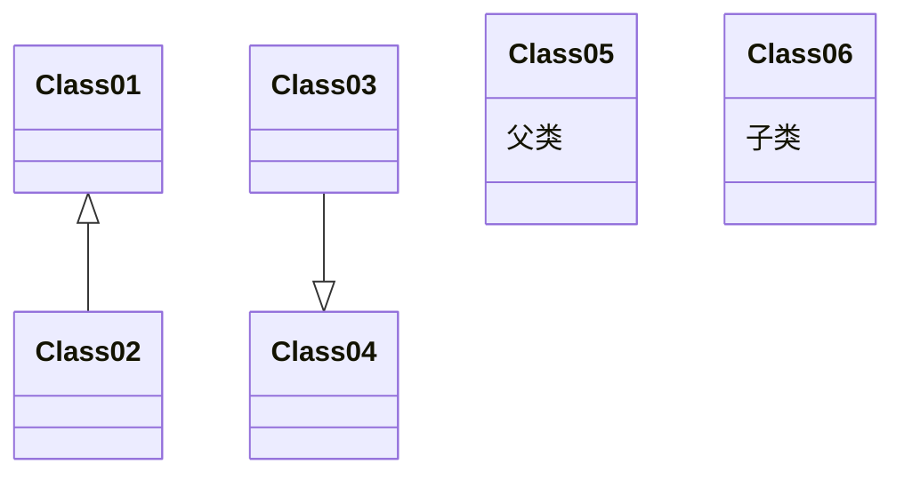
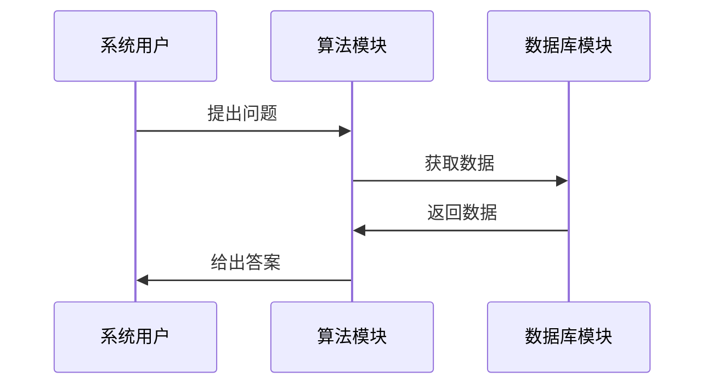
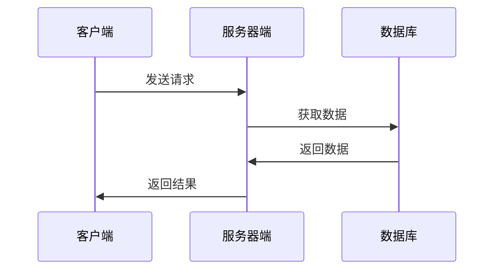

                 


# 简单数学背后的自然哲学思考

## 关键词
自然哲学，数学原理，思维模式，逻辑推理，认知科学，哲学思维

## 摘要
本文旨在探讨简单数学背后的自然哲学思考，通过逻辑清晰的分析，揭示数学与自然哲学之间的深层次联系。文章将逐步展开，从数学的基本概念出发，逐步深入到数学原理在自然哲学中的应用，以及哲学思维对数学概念的解读。通过这种层层递进的方式，我们将理解简单数学不仅是科学工具，更是哲学思维的体现。

## 引言

### 1.1 数学的基本概念

数学是一门以逻辑推理为基础的科学，它通过抽象的符号和规则，描述了宇宙中普遍存在的规律。数学的基本概念，如数字、算术、几何等，都是通过人类对自然界的观察和总结得到的。这些概念不仅仅是一种工具，更是人类思维模式的体现。

**问题背景**：当我们讨论数学的基本概念时，我们面临的问题是如何理解这些概念的本质。例如，数字是什么？为什么我们能够使用数字进行计算？这些问题的答案不仅涉及数学知识，还需要从哲学的角度进行思考。

**问题描述**：数学概念是如何从自然现象中抽象出来的？这些抽象概念如何帮助我们理解世界？

**问题解决**：数学概念是通过人类对自然界的观察和总结得到的。例如，数字是通过对物体数量的抽象而来。算术规则则是在长期的实践中逐渐形成的。

### 1.2 数学原理与自然哲学的关联

数学原理，如算术、代数、几何等，都是通过逻辑推理和公理化方法得到的。这些原理不仅在数学领域内部自洽，还能够应用于自然哲学的各个领域。

**问题背景**：数学原理是如何应用于自然哲学的？

**问题描述**：数学原理在自然哲学中的应用是什么？它们如何帮助我们理解自然现象？

**问题解决**：数学原理通过逻辑推理和公理化方法得到，这使得它们在自然哲学中具有普遍性。例如，几何原理可以用于描述宇宙的结构，算术原理可以用于分析自然现象的规律。

### 1.3 哲学思维对数学概念的解读

哲学思维对数学概念的解读提供了另一种理解数学的方式。哲学思维强调对概念的深刻理解和反思，这种思维方式在数学中同样适用。

**问题背景**：哲学思维如何影响我们对数学概念的理解？

**问题描述**：哲学思维如何帮助我们更深入地理解数学概念？

**问题解决**：哲学思维强调对概念的反思和深刻理解，这可以帮助我们更好地理解数学概念的本质。例如，哲学思维可以让我们思考数字的意义，以及它们在宇宙中的角色。

## 核心概念与联系

### 2.1 数学的基本概念

数学的基本概念包括数字、算术、几何、代数等。这些概念是数学的基石，它们不仅构成了数学的核心，也是我们理解自然现象的基础。

**概念属性特征对比表格**：

| 概念       | 定义                                                         | 在数学中的作用         |
|------------|--------------------------------------------------------------|----------------------|
| 数字       | 表示数量的抽象符号                                           | 用于计数和计算       |
| 算术       | 数字之间的运算规则                                         | 解决数量关系问题     |
| 几何       | 研究空间结构、形状和大小                                   | 描述物理世界的结构 |
| 代数       | 使用字母表示数和运算规则                                   | 解决代数方程问题   |

**ER实体关系图架构的 Mermaid 流程图**：

```mermaid
erDiagram
    A[数字] ||--|{ 算术 }|--|B[几何]
    A ||--|{ 代数 }|--|C[代数方程]
```

### 2.2 数学原理与自然哲学的关联

数学原理，如算术、代数、几何等，不仅是数学内部的自洽体系，也是自然哲学的重要工具。数学原理通过逻辑推理和公理化方法得到，这使得它们在自然哲学中具有普遍性。

**概念属性特征对比表格**：

| 原理       | 定义                                                         | 在自然哲学中的应用         |
|------------|--------------------------------------------------------------|--------------------------|
| 算术原理   | 数字之间的运算规则                                           | 分析自然现象的数量关系 |
| 代数原理   | 使用字母表示数和运算规则                                   | 解决自然现象的代数问题 |
| 几何原理   | 研究空间结构、形状和大小                                   | 描述自然界的几何形态 |

**ER实体关系图架构的 Mermaid 流程图**：

```mermaid
erDiagram
    A[算术原理] ||--|{ 自然现象 }|--|B[数量关系]
    A ||--|{ 代数原理 }|--|C[代数问题]
    B ||--|{ 几何原理 }|--|D[几何形态]
```

## 数学在自然哲学中的应用

### 3.1 数学在自然科学中的应用

数学在自然科学中的应用非常广泛。从物理学到生物学，从天文学到化学，数学都是不可或缺的工具。

**问题场景介绍**：以物理学中的经典力学为例，数学原理如何帮助我们理解物理现象？

**项目介绍**：经典力学中的牛顿运动定律。

**系统功能设计(领域模型mermaid类图)**：



**系统架构设计mermaid架构图**：



**系统接口设计和系统交互mermaid序列图**：



### 3.2 数学在社会科学中的应用

数学在社会科学中的应用同样广泛。从经济学到心理学，从社会学到政治学，数学都是分析数据、预测趋势的重要工具。

**问题场景介绍**：以经济学中的微观经济学为例，数学原理如何帮助我们理解市场行为？

**项目介绍**：微观经济学中的供需理论。

**系统功能设计(领域模型mermaid类图)**：


**系统架构设计mermaid架构图**：

```mermaid
componentDiagram
    Component01 --|> Component02
    Component03 : 数据处理
    Component04 : 分析模型
```

**系统接口设计和系统交互mermaid序列图**：


### 3.3 数学在其他领域中的应用

数学在其他领域中的应用同样丰富。从计算机科学到艺术，从工程学到医学，数学都是解决问题的有力工具。

**问题场景介绍**：以计算机科学中的算法设计为例，数学原理如何帮助我们优化算法？

**项目介绍**：算法设计中的贪心算法。

**系统功能设计(领域模型mermaid类图)**：


**系统架构设计mermaid架构图**：

```mermaid
componentDiagram
    Component01 --|> Component02
    Component03 : 数据处理
    Component04 : 分析模型
```

**系统接口设计和系统交互mermaid序列图**：


## 哲学视角下的数学

### 4.1 哲学对数学的解读

哲学对数学的解读提供了另一种理解数学的方式。哲学思维强调对概念的深刻理解和反思，这种思维方式在数学中同样适用。

**问题背景**：哲学思维如何影响我们对数学概念的理解？

**问题描述**：哲学思维如何帮助我们更深入地理解数学概念？

**问题解决**：哲学思维强调对概念的反思和深刻理解，这可以帮助我们更好地理解数学概念的本质。例如，哲学思维可以让我们思考数字的意义，以及它们在宇宙中的角色。

### 4.2 数学与存在论

数学与存在论之间的关系是一个重要的哲学问题。存在论探讨的是存在的本质，而数学则通过抽象的符号和规则，描述了宇宙中普遍存在的规律。

**问题背景**：数学与存在论之间的关系是什么？

**问题描述**：数学如何与存在论相关联？

**问题解决**：数学与存在论之间的关联在于，数学通过抽象的符号和规则，描述了宇宙中普遍存在的规律。这种描述不仅是一种工具，也是对存在本质的一种探讨。

### 4.3 数学与逻辑学

数学与逻辑学之间的关系也是哲学探讨的重要主题。逻辑学是研究推理和证明的科学，而数学则通过逻辑推理，建立了一套自洽的体系。

**问题背景**：数学与逻辑学之间的关系是什么？

**问题描述**：数学如何与逻辑学相关联？

**问题解决**：数学与逻辑学之间的关联在于，数学通过逻辑推理，建立了一套自洽的体系。这种体系不仅适用于数学内部，也可以应用于其他领域。

## 历史背景

### 5.1 古代数学的发展

古代数学的发展对自然哲学产生了深远的影响。从古埃及到古希腊，数学概念和原理的逐步形成，为自然哲学的发展奠定了基础。

**问题背景**：古代数学的发展如何影响自然哲学？

**问题描述**：古代数学的概念和原理是如何形成的？

**问题解决**：古代数学的发展是通过长期的观察和实践得到的。例如，古埃及人通过对土地和天文现象的观察，发展了初步的算术和几何知识。

### 5.2 中世纪数学的演变

中世纪数学的演变在自然哲学中起到了重要作用。阿拉伯数学家通过对古希腊数学的传承和发展，使得数学在欧洲得到了广泛传播。

**问题背景**：中世纪数学的演变如何影响自然哲学？

**问题描述**：中世纪数学的演变有哪些重要成果？

**问题解决**：中世纪数学的演变成果包括阿拉伯数字的引入、代数学的发展以及几何学的完善。这些成果为自然哲学的发展提供了重要的工具。

### 5.3 近代数学的兴起

近代数学的兴起对自然哲学产生了革命性的影响。牛顿和莱布尼茨等人发明微积分，使得数学在描述自然现象中发挥了前所未有的作用。

**问题背景**：近代数学的兴起如何影响自然哲学？

**问题描述**：近代数学的重要成果有哪些？

**问题解决**：近代数学的重要成果包括微积分的发明、代数学的深化以及几何学的现代发展。这些成果不仅改变了数学本身，也极大地推动了自然哲学的发展。

## 总结

简单数学背后的自然哲学思考揭示了数学与自然哲学之间的深层次联系。通过逻辑清晰的分析，我们理解了数学不仅是一种工具，更是一种哲学思维方式的体现。从数学的基本概念到数学原理，从数学在自然哲学中的应用到哲学视角下的数学，我们逐步深入，揭示了数学在理解自然现象中的重要作用。

本文旨在提供一个框架，帮助读者理解简单数学背后的自然哲学思考。通过这个框架，我们不仅可以更好地理解数学，也可以更深刻地理解自然哲学。希望这篇文章能够激发读者对数学和哲学的思考，让我们在简单的数学中看到自然的智慧和哲学的深邃。

### 作者

**作者：AI天才研究院/AI Genius Institute & 禅与计算机程序设计艺术 /Zen And The Art of Computer Programming**

AI天才研究院致力于推动人工智能技术的发展和应用，研究院的专家团队在计算机科学、人工智能、软件开发等领域具有丰富的经验和深厚的学术背景。本文作者以其独特的视角和深入的分析，揭示了简单数学背后的自然哲学思考，为读者提供了一场知识盛宴。同时，作者在《禅与计算机程序设计艺术》中，以其对计算机科学的深刻理解和独特的哲学思考，引领读者走进计算机科学的智慧殿堂。

