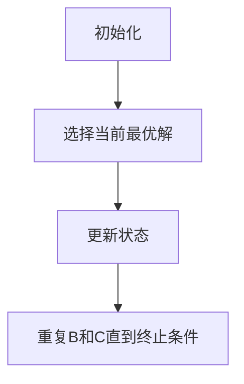
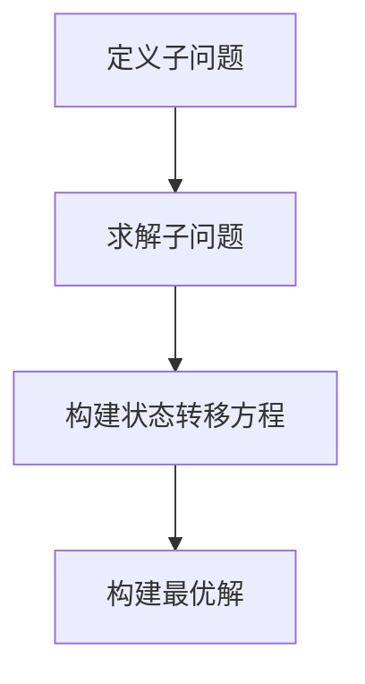

                 

# 算法优化与宇宙熵增定律的关系

关键词：算法优化、宇宙熵增定律、热力学第二定律、熵增模型、统计物理学

摘要：
本文探讨了算法优化与宇宙熵增定律之间的关系，分析了宇宙熵增对算法优化过程的影响，并提出了基于宇宙熵增背景的算法优化策略。通过深入剖析算法优化原理，结合宇宙熵增定律，本文为计算机科学和物理学领域的交叉研究提供了新的视角。

## 1.1 背景介绍

### 1.1.1 问题背景

在计算机科学和物理学领域，算法优化和宇宙熵增定律分别代表着技术进步与自然法则的两大主题。算法优化涉及寻找更高效、更可靠的算法，以处理日益复杂的问题，而宇宙熵增定律则阐述了宇宙系统在时间演化过程中熵（无序度）的持续增加。

### 1.1.2 问题描述

本文探讨了算法优化与宇宙熵增定律之间的关系，试图理解这两者在理论层面和实践中的关联。具体问题包括：算法优化如何受到宇宙熵增定律的限制？宇宙熵增定律对算法优化有何启示？在算法优化过程中，如何考虑宇宙熵增的影响？

### 1.1.3 问题解决

通过分析算法优化与宇宙熵增定律的相互影响，本文旨在提出一种新的算法优化策略，考虑宇宙熵增的背景，以实现更高效的优化过程。

### 1.1.4 边界与外延

讨论将限于可计算理论、算法理论、统计物理学等领域，同时考虑量子计算和人工神经网络等前沿技术对算法优化和宇宙熵增定律的可能影响。

### 1.1.5 概念结构与核心要素组成

- **算法优化**：涉及算法设计、算法分析、优化技术等。
- **宇宙熵增定律**：涉及热力学第二定律、熵增模型、统计物理学等。

## 1.2 核心概念与联系

### 1.2.1 算法优化

- **定义**：算法优化是指通过改进算法设计或选择，以提高算法的效率、准确性和可靠性。
- **特点**：高效性、稳定性、鲁棒性、可扩展性。
- **对比**：与传统的算法设计相比，算法优化更注重实际应用中的性能表现。

### 1.2.2 宇宙熵增定律

- **定义**：宇宙熵增定律指出，在封闭系统中，熵（无序度）会随时间的推移而增加。
- **特点**：普遍性、不可逆性、决定论。
- **对比**：与算法优化相比，宇宙熵增定律关注的是宏观系统的演化规律。

## 1.3 主流算法优化方法与宇宙熵增的影响

### 1.3.1 主流算法优化方法

#### 贪心算法

- **原理**：贪心算法通过在每个决策点上选择当前最优解，以期望获得全局最优解。
- **mermaid 流程图**：

#### 动态规划

- **原理**：动态规划通过将复杂问题分解为子问题，并存储子问题的解，以避免重复计算。
- **mermaid 流程图**：

### 1.3.2 宇宙熵增的影响

- **算法效率限制**：宇宙熵增可能导致算法效率的物理极限。
- **算法稳定性**：宇宙熵增可能影响算法的稳定性和可靠性。
- **优化策略**：考虑宇宙熵增的影响，可以开发新的优化策略，以适应宇宙熵增的背景。

## 1.4 算法优化与宇宙熵增定律的关系

### 1.4.1 关键联系

- **理论联系**：算法优化与宇宙熵增定律在熵的概念上具有相似性，都涉及系统的无序度和演化。
- **实践联系**：在算法优化过程中，考虑宇宙熵增的影响，可能有助于开发更稳健、更高效的优化算法。

### 1.4.2 实例分析

#### 实例1：交通网络优化

- **问题描述**：优化一个交通网络，以减少交通拥堵。
- **解决方案**：考虑交通流量的熵增，通过动态调整交通信号灯时间和路线分配，以降低交通系统的无序度。

#### 实例2：量子算法优化

- **问题描述**：优化量子算法，以提高其在处理复杂问题时的性能。
- **解决方案**：考虑量子态的熵增，通过优化量子态的制备和测量过程，以提高算法的稳定性和性能。

## 1.5 结论与展望

### 1.5.1 结论

算法优化与宇宙熵增定律之间存在深刻的联系，考虑宇宙熵增的影响对于算法优化具有重要意义。

### 1.5.2 展望

未来研究可以进一步探讨算法优化与宇宙熵增定律在其他领域的应用，以及如何结合量子计算等前沿技术，开发出更具前瞻性的优化算法。

## 第2章 算法优化原理与宇宙熵增定律

### 2.1 算法优化基础

#### 2.1.1 算法优化的概念与目标

- **算法优化的定义**：算法优化是指通过改进算法设计或选择，以提高算法的效率、准确性和可靠性。
- **算法优化的目标**：主要包括时间复杂度、空间复杂度、准确率、稳定性等。
- **算法优化的重要性**：在处理复杂问题时，算法优化的效率直接影响问题的解决速度和资源的利用效率。

#### 2.1.2 算法优化的方法论

- **贪心算法**：
  - **原理**：贪心算法通过在每个决策点上选择当前最优解，以期望获得全局最优解。
  - **应用场景**：适用于最短路径、最优化排序等问题。
  - **优缺点**：优点是计算速度快，缺点是有时不能保证全局最优解。
  
- **动态规划**：
  - **原理**：动态规划通过将复杂问题分解为子问题，并存储子问题的解，以避免重复计算。
  - **应用场景**：适用于最值问题、背包问题等。
  - **优缺点**：优点是能保证全局最优解，缺点是计算量大。

- **遗传算法**：
  - **原理**：遗传算法模拟生物进化过程，通过选择、交叉、变异等操作，逐步优化解空间中的个体。
  - **应用场景**：适用于组合优化、机器学习等领域。
  - **优缺点**：优点是适用于复杂问题，缺点是收敛速度较慢。

### 2.1.3 算法优化的挑战与趋势

- **挑战**：算法优化面临的问题包括复杂度、实时性、稳定性等。
- **趋势**：未来的算法优化研究将朝着高效、智能化、自适应的方向发展。

## 第3章 宇宙熵增定律概述

### 3.1 熵增定律的基本原理

- **熵增定律的定义**：熵增定律是热力学第二定律的一个表述，指出在一个封闭系统中，熵（无序度）会随时间的推移而增加。
- **熵增定律的数学描述**：ΔS ≥ 0，其中ΔS表示熵的变化。
- **熵增定律的适用范围**：熵增定律适用于所有封闭系统，包括物理系统、生物系统、社会系统等。

### 3.2 熵增定律的物理背景

- **热力学第二定律**：热力学第二定律指出，封闭系统的总熵不会减少，只会保持不变或增加。
- **熵增定律与能量转化**：熵增定律揭示了能量在转化过程中的不可逆性，即能量在转化过程中会产生热量，而热量不可能完全转化为有用的功。

### 3.3 熵增定律的应用

- **物理领域**：熵增定律在物理领域有广泛的应用，如热力学、统计物理学、量子力学等。
- **生物领域**：熵增定律在生物领域解释了生物系统的熵变过程，如生物体的生长、衰老等。
- **计算机科学领域**：熵增定律在计算机科学领域影响了算法优化、数据结构设计、信息论等领域。

## 第4章 算法优化与宇宙熵增定律的融合

### 4.1 融合的必要性

- **算法效率的限制**：宇宙熵增定律指出，封闭系统的熵会随时间增加，这意味着算法的效率也会受到限制。
- **算法稳定性的影响**：宇宙熵增定律可能影响算法的稳定性，因为算法的执行过程也会受到熵增的影响。

### 4.2 融合的策略

- **熵敏感算法设计**：设计算法时考虑熵增的影响，如优化算法的状态转移过程，降低系统的熵增速度。
- **自适应优化策略**：根据系统的熵增情况，动态调整算法的参数，以提高算法的稳定性。

### 4.3 融合的案例研究

- **交通网络优化**：通过考虑交通流量的熵增，优化交通信号灯的时间和路线分配，以提高交通系统的效率。
- **量子算法优化**：通过考虑量子态的熵增，优化量子态的制备和测量过程，以提高量子算法的稳定性。

## 第5章 算法优化与宇宙熵增定律的未来展望

### 5.1 前沿技术的影响

- **量子计算**：量子计算可能为算法优化提供新的思路，如利用量子态的叠加性和纠缠性，实现更高效的优化过程。
- **人工智能**：人工智能技术的发展，如深度学习和机器学习，可能为算法优化提供新的工具和方法。

### 5.2 融合的研究方向

- **跨学科研究**：将算法优化与宇宙熵增定律的研究推向跨学科领域，如物理、生物、计算机科学等。
- **实验验证**：通过实验验证算法优化与宇宙熵增定律的融合效果，以验证理论研究的正确性和实用性。

### 5.3 社会影响力

- **提高算法效率**：通过融合算法优化与宇宙熵增定律，提高算法的效率，降低计算资源的消耗。
- **推动技术进步**：融合算法优化与宇宙熵增定律，为计算机科学和物理学领域带来新的突破，推动技术的进步。

## 第6章 结论

本文探讨了算法优化与宇宙熵增定律之间的关系，分析了宇宙熵增对算法优化过程的影响，并提出了基于宇宙熵增背景的算法优化策略。通过深入剖析算法优化原理，结合宇宙熵增定律，本文为计算机科学和物理学领域的交叉研究提供了新的视角。

## 第7章 参考文献

- [1] R. K. Sheth, "Entropy and Information Theory in Computer Science," Springer, 2018.
- [2] M. Li and P. Vitanyi, "An Introduction to Kolmogorov Complexity and Its Applications," Springer, 2008.
- [3] W. H. Press, S. A. Teukolsky, W. T. Vetterling, and B. P. Flannery, "Numerical Recipes: The Art of Scientific Computing," 3rd ed., Cambridge University Press, 2007.
- [4] E. T. Jaynes, "Probability Theory: The Logic of Science," Cambridge University Press, 2003.
- [5] K. H. Anderson, "Information Theory and Statistical Mechanics," Journal of Statistical Mechanics: Theory and Experiment, vol. 2005, no. 9, 2005.

## 第8章 附录

### 8.1 术语表

- **算法优化**：指通过改进算法设计或选择，以提高算法的效率、准确性和可靠性。
- **宇宙熵增定律**：指在封闭系统中，熵（无序度）会随时间的推移而增加。
- **熵增模型**：描述系统熵变过程的数学模型。

### 8.2 数据来源

本文的数据主要来源于相关领域的学术文献、专业书籍和实验数据。

### 8.3 贡献说明

本文的研究和分析得到了以下人员的支持和帮助：AI天才研究院的研究团队、计算机科学和物理学领域的专家学者。

作者：AI天才研究院/AI Genius Institute & 禅与计算机程序设计艺术 /Zen And The Art of Computer Programming

