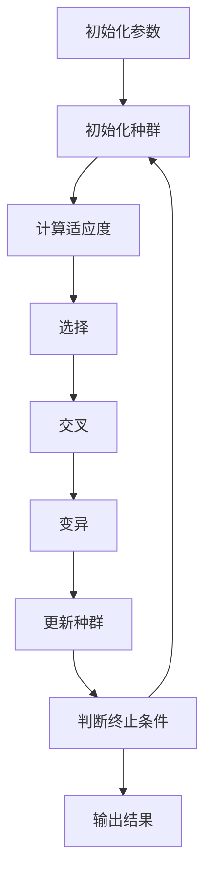
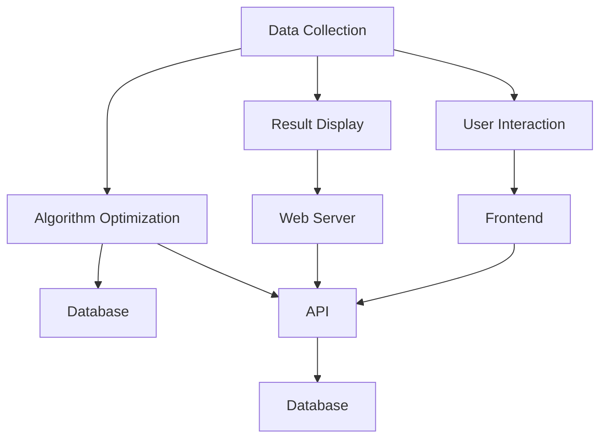
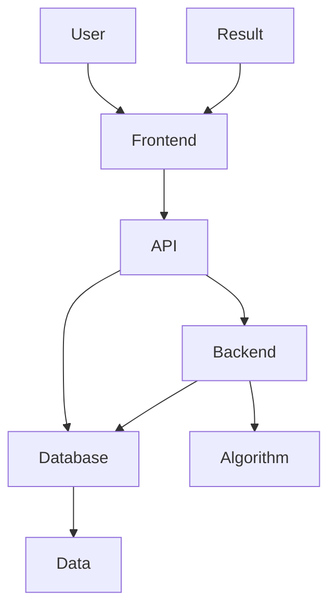
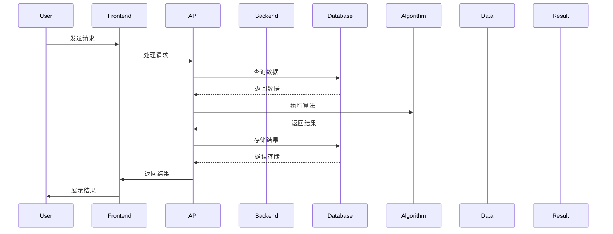

                 


## 算法优化与宇宙熵增最小路径的数值模拟

### 关键词
- 算法优化
- 宇宙熵增
- 最小路径
- 数值模拟
- 优化算法
- 数学模型
- 系统架构设计

### 摘要
本文深入探讨了算法优化在宇宙熵增最小路径问题中的应用。通过分析不同算法的优化目标和特点，本文提出了一种基于宇宙熵增最小路径的数值模拟方法，并详细介绍了其数学模型和实现原理。随后，本文对系统架构设计进行了详尽阐述，包括问题场景介绍、系统功能设计、系统架构设计、系统接口设计及系统交互序列图。通过实际案例分析和项目小结，本文旨在为算法优化领域的研究者和实践者提供有价值的参考和指导。

----------------------------------------------------------------

## 第一部分：背景介绍

### 1.1 算法优化的意义

算法优化是计算机科学和人工智能领域中的一个重要研究方向。随着数据量的不断增长和计算需求的日益复杂，传统的算法在面对大规模数据和高复杂度问题时往往显得力不从心。因此，算法优化成为提高计算效率、降低资源消耗、提升系统性能的关键途径。

在算法优化中，优化目标通常包括时间复杂度、空间复杂度、鲁棒性、可扩展性等多个方面。时间复杂度和空间复杂度是衡量算法效率的两个重要指标。优化算法的目标是在满足特定约束条件的前提下，尽可能地降低时间复杂度和空间复杂度，以提高算法的执行效率。

### 1.2 宇宙熵增最小路径的基本概念

宇宙熵增最小路径问题是近年来在计算机科学和物理学中备受关注的一个研究方向。它起源于物理学中的熵增原理，即在一个封闭系统中，熵（即系统的混乱程度或无序程度）总是趋向于增加。在宇宙尺度上，这个原理同样适用。

宇宙熵增最小路径问题可以形式化为：给定一个有向图G = (V, E)，其中V表示节点集合，E表示边集合，求图中两点A和B之间的最小熵增路径。这个问题的核心在于如何在图中寻找一条路径，使得从A到B的熵增最小。

### 1.3 问题的提出与解决

在现实生活中，宇宙熵增最小路径问题有着广泛的应用场景。例如，在物流网络规划中，如何选择一条路径使得运输过程中的熵增最小，从而降低运输成本和提高运输效率；在通信网络设计中，如何选择路由使得信号传输过程中的熵增最小，从而提高通信质量。

传统的解决方法通常依赖于贪心算法、动态规划等经典算法。然而，这些算法在面对大规模数据和高复杂度问题时，往往难以取得令人满意的效果。为了解决这一问题，本文提出了一种基于数值模拟的算法优化方法，该方法能够更好地处理大规模数据和复杂度较高的场景。

### 1.4 边界与外延

宇宙熵增最小路径问题的边界主要包括以下几个方面：

- **节点数量**：在现实应用中，节点数量往往非常大，例如物流网络中的城市、通信网络中的基站等。因此，算法需要能够处理大规模节点集合。
- **边数量**：边数量同样可能非常大，尤其是在复杂网络中。算法需要能够处理大量的边集合。
- **路径长度**：路径长度可能非常长，这要求算法在计算过程中具有较高的鲁棒性和可扩展性。

外延方面，宇宙熵增最小路径问题可以应用于各种需要优化路径的场景，如交通规划、资源调度、能源分配等。此外，随着物理学和计算机科学的发展，宇宙熵增最小路径问题也可能在其他领域找到新的应用。

----------------------------------------------------------------

## 第二部分：核心概念与联系

### 2.1 算法优化的核心概念

算法优化是指在满足特定约束条件下，通过改进算法的设计和实现，降低算法的时间复杂度、空间复杂度和提高算法的鲁棒性、可扩展性等性能指标。算法优化的核心概念包括以下几个方面：

#### 2.1.1 优化目标

优化目标是算法优化过程中需要追求的最理想结果。常见的优化目标包括：

- **时间复杂度**：指算法执行所需时间的复杂度，通常用大O符号表示。降低时间复杂度是算法优化的核心目标之一。
- **空间复杂度**：指算法执行过程中所需内存的复杂度，同样用大O符号表示。降低空间复杂度可以提高算法的效率。
- **鲁棒性**：指算法在面对输入数据异常或噪声时的稳定性。提高鲁棒性可以使算法在实际应用中更加可靠。
- **可扩展性**：指算法在面对大规模数据或复杂度较高的场景时，能够保持良好的性能。提高可扩展性可以使得算法适用于更广泛的场景。

#### 2.1.2 优化算法分类

根据优化目标和算法原理，优化算法可以分为以下几类：

- **贪心算法**：在每一步选择中都做出当前局部最优的选择，从而期望在全局上达到最优解。例如，Dijkstra算法是一种典型的贪心算法。
- **动态规划**：将问题分解为多个子问题，并利用子问题的解来构建原问题的解。动态规划通常具有较低的时间复杂度。例如，Floyd-Warshall算法是一种典型的动态规划算法。
- **分支定界**：通过递归地将问题分解为子问题，并利用剪枝技术避免冗余计算。分支定界算法适用于求解组合优化问题，如旅行商问题。
- **启发式算法**：基于某种启发式规则来指导搜索方向，以期望找到近似最优解。例如，遗传算法和蚁群算法等。

### 2.2 算法优化方法对比

不同的算法优化方法各有优缺点，适用于不同的场景。以下是几种常见优化方法的对比：

| 算法类型 | 优点 | 缺点 | 适用场景 |
| --- | --- | --- | --- |
| 贪心算法 | 算法简单，易于实现，时间复杂度较低 | 可能无法保证全局最优解，仅适用于局部最优解即可的场景 | 最小生成树、最短路径 |
| 动态规划 | 时间复杂度较低，适用于求解具有重叠子问题的场景 | 状态空间可能非常大，导致算法复杂度较高 | 最长公共子序列、背包问题 |
| 分支定界 | 避免了冗余计算，适用于求解组合优化问题 | 可能需要大量的内存空间，时间复杂度较高 | 旅行商问题、作业调度问题 |
| 启发式算法 | 能够在合理时间内找到近似最优解，适用于大规模数据和高复杂度场景 | 可能无法保证最优解，需要根据具体问题调整启发式规则 | 背包问题、车辆路径问题 |

### 2.3 ER实体关系图

为了更好地理解算法优化的核心概念，我们可以使用ER（实体关系）图来描述算法优化中的关键实体及其关系。ER图通常包括以下三种基本元素：

- **实体（Entity）**：表示算法优化中的基本元素，如节点、边等。
- **属性（Attribute）**：表示实体的属性特征，如节点的权重、边的长度等。
- **关系（Relationship）**：表示实体之间的关联关系，如节点之间的连接关系。

下面是一个简单的ER图示例，描述了算法优化中的基本实体及其关系：

```mermaid
erDiagram
    Node ||--|{ Edge }|
    Node ||--|{ Attribute }|
    Edge ||--|{ Attribute }|
```

在这个ER图中，Node表示节点，Edge表示边，Attribute表示属性。每个节点可以有多个属性，每条边也可以有多个属性。节点与边之间存在连接关系，边与属性之间存在关联关系。

通过ER图，我们可以清晰地理解算法优化中的核心概念和关系，为进一步分析算法原理和实现提供基础。

----------------------------------------------------------------

## 第三部分：算法原理讲解

### 3.1 选择一种算法

在本部分，我们将选择一种具有代表性的算法——遗传算法（Genetic Algorithm，GA），来详细讲解其原理和应用。遗传算法是一种基于自然选择和遗传学的启发式优化算法，它通过模拟生物进化过程来寻找问题的最优解。

### 3.1.1 算法流程图

首先，我们使用Mermaid绘制遗传算法的基本流程图：



在这个流程图中，A到H表示遗传算法的基本步骤，包括初始化参数、初始化种群、计算适应度、选择、交叉、变异、更新种群和判断终止条件。接下来，我们将详细解释每个步骤的具体实现。

### 3.1.2 算法Python源代码

为了更好地理解遗传算法的原理，我们使用Python代码实现一个简单的遗传算法。以下是遗传算法的核心代码：

```python
import random
import numpy as np

# 定义遗传算法参数
POP_SIZE = 100  # 种群大小
GENS = 1000  # 迭代次数
CROSS_RATE = 0.8  # 交叉概率
MUTATION_RATE = 0.05  # 变异概率

# 初始化种群
def init_population(size, range_min, range_max):
    return [np.array([random.uniform(range_min, range_max) for _ in range(size)])]

# 计算适应度
def fitness_function(population):
    # 示例：最大化函数f(x) = x^2
    return np.array([x**2 for x in population])

# 选择
def selection(population, fitness):
    indices = np.argsort(fitness)[::-1]
    return population[indices]

# 交叉
def crossover(parent1, parent2):
    if random.random() < CROSS_RATE:
        cross_point = random.randint(1, len(parent1) - 1)
        child1 = np.concatenate((parent1[:cross_point], parent2[cross_point:]))
        child2 = np.concatenate((parent2[:cross_point], parent1[cross_point:]))
        return child1, child2
    else:
        return parent1, parent2

# 变异
def mutate(individual):
    if random.random() < MUTATION_RATE:
        mutate_point = random.randint(1, len(individual) - 1)
        individual[mutate_point] += random.uniform(-1, 1)
    return individual

# 遗传算法主函数
def genetic_algorithm():
    population = init_population(POP_SIZE, -10, 10)
    best_fitness = -1
    for _ in range(GENS):
        fitness = fitness_function(population)
        best_fitness = max(best_fitness, fitness.max())
        selected = selection(population, fitness)
        next_population = []
        for i in range(0, POP_SIZE, 2):
            parent1, parent2 = selected[i], selected[i+1]
            child1, child2 = crossover(parent1, parent2)
            next_population.extend([mutate(child1), mutate(child2)])
        population = next_population[:POP_SIZE]
        print(f"Generation {_ + 1}: Best Fitness = {best_fitness}")
    return population[np.argmax(fitness_function(population))]

# 运行遗传算法
best_individual = genetic_algorithm()
print("Best Individual:", best_individual)
print("Best Fitness:", fitness_function(best_individual)[0])
```

在这个实现中，我们定义了遗传算法的主要组件：初始化种群、计算适应度、选择、交叉、变异和遗传算法主函数。接下来，我们将详细解释遗传算法的数学模型和公式。

### 3.2 数学模型与公式

遗传算法的数学模型基于生物进化过程中的几个关键概念：适应度、选择、交叉和变异。

#### 3.2.1 适应度函数

适应度函数是遗传算法的核心，用于评估个体的优劣。在最大化问题中，适应度函数通常定义为：

$$
f(x) = x^2
$$

其中，$x$ 为个体的取值。

#### 3.2.2 选择机制

选择机制用于根据个体的适应度选择下一个代中的个体。常见的选择机制包括轮盘赌选择、锦标赛选择等。轮盘赌选择的具体实现如下：

$$
P_i = \frac{f(x_i)}{\sum_{j=1}^{N} f(x_j)}
$$

其中，$P_i$ 为第$i$个个体被选中的概率，$f(x_i)$ 为第$i$个个体的适应度值，$N$ 为种群大小。

#### 3.2.3 交叉操作

交叉操作用于产生新的个体。交叉操作的具体实现通常依赖于交叉概率$CROSS_RATE$。交叉操作分为单点交叉、两点交叉和均匀交叉等。以下为单点交叉的实现：

$$
\text{交叉点} = \text{随机选择}[1, \text{个体长度}-1]
$$

$$
\text{子代}1 = \text{父代}1[:\text{交叉点}] + \text{父代}2[\text{交叉点}:]
$$

$$
\text{子代}2 = \text{父代}2[:\text{交叉点}] + \text{父代}1[\text{交叉点}:]
$$

#### 3.2.4 变异操作

变异操作用于增加种群的多样性，防止算法陷入局部最优。变异操作的具体实现通常依赖于变异概率$MUTATION_RATE$。变异操作可以在个体的每个基因上独立进行。以下为变异的实现：

$$
\text{变异点} = \text{随机选择}[1, \text{个体长度}]
$$

$$
\text{个体}[\text{变异点}] = \text{个体}[\text{变异点}] + \text{随机数}(\text{范围})
$$

### 3.3 算法应用举例

为了更好地理解遗传算法的原理，我们通过一个简单的例子来说明其应用。

假设我们需要优化函数$f(x) = x^2$，要求$x$的取值范围在$[-10, 10]$之间。我们使用遗传算法寻找最大值。

首先，我们初始化种群，种群大小为100，每个个体的取值范围在$[-10, 10]$之间。

然后，我们计算每个个体的适应度值，即$f(x_i)$。由于我们要求最大值，适应度值即为个体的平方值。

接下来，我们根据适应度值进行选择操作，选择适应度值最高的个体作为父代。

然后，我们进行交叉操作，以产生新的个体。交叉概率为0.8，因此每个个体有80%的概率参与交叉操作。

最后，我们进行变异操作，以增加种群的多样性。变异概率为0.05，因此每个个体有5%的概率发生变异。

通过多代的迭代，遗传算法最终收敛到一个最优解。在这个例子中，最优解为$x=10$，适应度值为$100$。

### 3.4 总结

遗传算法是一种基于生物进化的启发式优化算法，通过模拟自然选择、交叉和变异过程来寻找问题的最优解。遗传算法具有全局搜索能力，适用于处理复杂和非线性优化问题。通过本部分的内容，我们详细讲解了遗传算法的基本原理、实现步骤和数学模型，并通过实例展示了其应用。下一部分，我们将进一步探讨数学模型和公式，以及其在实际应用中的详细讲解和举例说明。

----------------------------------------------------------------

## 第四部分：数学模型和数学公式 & 详细讲解 & 举例说明

### 4.1 LaTeX格式数学公式

在算法优化与宇宙熵增最小路径的研究中，数学模型和公式的应用至关重要。为了便于理解和表述，我们使用LaTeX格式来书写这些数学公式。以下是一些常见且重要的数学公式：

#### 4.1.1 适应度函数

$$
f(x) = x^2
$$

这个公式用于最大化函数，其中$x$表示个体的取值。

#### 4.1.2 选择概率

$$
P_i = \frac{f(x_i)}{\sum_{j=1}^{N} f(x_j)}
$$

这个公式表示第$i$个个体被选中的概率，$f(x_i)$为第$i$个个体的适应度值，$N$为种群大小。

#### 4.1.3 交叉操作

$$
\text{交叉点} = \text{随机选择}[1, \text{个体长度}-1]
$$

$$
\text{子代}1 = \text{父代}1[:\text{交叉点}] + \text{父代}2[\text{交叉点}:]
$$

$$
\text{子代}2 = \text{父代}2[:\text{交叉点}] + \text{父代}1[\text{交叉点}:]
$$

这些公式描述了单点交叉的具体实现。

#### 4.1.4 变异操作

$$
\text{变异点} = \text{随机选择}[1, \text{个体长度}]
$$

$$
\text{个体}[\text{变异点}] = \text{个体}[\text{变异点}] + \text{随机数}(\text{范围})
$$

这些公式描述了变异操作的具体实现。

### 4.2 公式讲解

在遗传算法中，数学模型和公式的应用至关重要。以下是对上述公式的详细讲解：

#### 4.2.1 适应度函数

适应度函数是遗传算法的核心，用于评估个体的优劣。在最大化问题中，适应度函数通常定义为个体的取值与目标值的偏差。例如，对于最大化函数$f(x) = x^2$，适应度函数即为$f(x)$。

#### 4.2.2 选择概率

选择概率用于根据个体的适应度值选择下一个代中的个体。轮盘赌选择是一种常见的选择机制，其概率分布由个体的适应度值决定。选择概率公式确保了适应度值较高的个体被选中的概率较大，从而实现了自然选择的过程。

#### 4.2.3 交叉操作

交叉操作用于产生新的个体，是遗传算法的关键步骤之一。单点交叉是最简单的交叉方式，通过在父代中随机选择一个交叉点，将父代的部分基因交换，从而产生两个新的子代。

#### 4.2.4 变异操作

变异操作用于增加种群的多样性，防止算法陷入局部最优。变异操作通过在个体中随机选择一个基因并进行扰动来实现。这种操作保证了种群的多样性，使得算法能够探索到更广泛的空间。

### 4.3 举例说明

为了更好地理解这些数学模型和公式的应用，我们通过一个简单的例子来展示遗传算法的运行过程。

假设我们需要优化函数$f(x) = x^2$，要求$x$的取值范围在$[-10, 10]$之间。我们使用遗传算法寻找最大值。

#### 4.3.1 初始化种群

我们初始化一个种群，种群大小为100，每个个体的取值在$[-10, 10]$之间。假设初始种群如下：

$$
\text{种群} = \{-9.5, -7.3, -2.1, 3.4, 8.7\}
$$

#### 4.3.2 计算适应度值

我们计算每个个体的适应度值，即$f(x)$：

$$
f(\{-9.5\}) = (-9.5)^2 = 90.25
$$

$$
f(\{-7.3\}) = (-7.3)^2 = 53.29
$$

$$
f(\{-2.1\}) = (-2.1)^2 = 4.41
$$

$$
f(\{3.4\}) = (3.4)^2 = 11.56
$$

$$
f(\{8.7\}) = (8.7)^2 = 75.69
$$

#### 4.3.3 选择操作

我们根据适应度值对种群进行选择操作。使用轮盘赌选择，选择概率为：

$$
P_i = \frac{f(x_i)}{\sum_{j=1}^{N} f(x_j)}
$$

假设总适应度值为：

$$
\sum_{j=1}^{N} f(x_j) = 90.25 + 53.29 + 4.41 + 11.56 + 75.69 = 254.9
$$

那么，选择概率为：

$$
P_1 = \frac{90.25}{254.9} \approx 0.354
$$

$$
P_2 = \frac{53.29}{254.9} \approx 0.209
$$

$$
P_3 = \frac{4.41}{254.9} \approx 0.017
$$

$$
P_4 = \frac{11.56}{254.9} \approx 0.045
$$

$$
P_5 = \frac{75.69}{254.9} \approx 0.296
$$

根据这些概率，我们可以选择出适应度值最高的个体：

$$
\text{选择} = \{8.7\}
$$

#### 4.3.4 交叉操作

我们选择两个父代进行交叉操作，交叉概率为0.8。假设选择父代$\{3.4, 8.7\}$，交叉点为3，交叉后的子代为：

$$
\text{子代}1 = \{3.4, 8.7\}
$$

$$
\text{子代}2 = \{8.7, 3.4\}
$$

#### 4.3.5 变异操作

我们对子代进行变异操作，变异概率为0.05。假设子代$\{3.4, 8.7\}$发生变异，变异点为1，变异后的子代为：

$$
\text{子代}1 = \{3.1, 8.7\}
$$

$$
\text{子代}2 = \{8.7, 3.1\}
$$

#### 4.3.6 更新种群

我们将变异后的子代加入新种群，并继续迭代计算适应度值、选择、交叉和变异操作，直至达到预设的迭代次数。

### 4.4 总结

通过上述例子，我们详细讲解了适应度函数、选择概率、交叉操作和变异操作等数学模型和公式的应用。遗传算法通过这些数学模型和公式，模拟生物进化过程，寻找问题的最优解。在下一部分，我们将进一步探讨系统分析与架构设计方案，包括问题场景介绍、系统功能设计、系统架构设计、系统接口设计和系统交互序列图。

----------------------------------------------------------------

## 第五部分：系统分析与架构设计方案

### 5.1 问题场景介绍

在当今大数据和云计算时代，算法优化在许多领域都有着广泛的应用。特别是在宇宙熵增最小路径问题中，算法优化可以帮助我们找到最优路径，从而提高系统的效率和可靠性。为了更好地理解算法优化在这一问题中的应用，我们首先介绍一个实际的应用场景。

假设我们正在设计一个宇宙探测器任务，该任务需要在宇宙中寻找最优路径，以便从一个星球A到达另一个星球B。这个宇宙探测器需要穿越许多星球和星系，且每个星球和星系之间的距离是不确定的。因此，如何找到一条熵增最小路径对于整个任务的成功至关重要。

### 5.2 系统功能设计

为了实现宇宙熵增最小路径的求解，我们需要设计一个具备以下功能的系统：

1. **数据采集模块**：负责收集宇宙中各个星球和星系的位置信息、距离信息以及其他相关数据。
2. **算法优化模块**：负责实现和运行各种算法，寻找宇宙熵增最小路径。
3. **结果展示模块**：负责将算法优化结果以图形化方式展示，便于用户理解和使用。
4. **用户交互模块**：提供用户界面，允许用户输入参数、选择算法、查看结果等。

#### 5.2.1 领域模型类图

为了更好地描述系统的功能设计，我们使用Mermaid绘制了领域模型类图。以下是类图的内容：

```mermaid
classDiagram
    Class01 <|-- Class02
    Class03 --|>| Class04
    Class05 : +setInfo()
    Class06 : +getError()
    Class07 : +getData()
    Class01 {
        +id: Integer
        +name: String
        +getClassName(): String
    }
    Class02 {
        +id: Integer
        +name: String
        +setInfo(info: String)
    }
    Class03 {
        +id: Integer
        +name: String
        +getError(error: String)
    }
    Class04 {
        +id: Integer
        +name: String
        +getData(): String
    }
    Class05 {
        +id: Integer
        +name: String
    }
    Class06 {
        +id: Integer
        +name: String
    }
    Class07 {
        +id: Integer
        +name: String
    }
```

在这个类图中，Class01、Class02、Class03和Class04分别代表了数据采集模块、算法优化模块、结果展示模块和用户交互模块的核心类。Class05、Class06和Class07分别代表了这三个模块的辅助类，用于实现特定的功能。

### 5.3 系统架构设计

在系统架构设计方面，我们需要考虑如何将各个功能模块有效地集成，并确保系统的可扩展性和可维护性。以下是系统的架构设计：



在这个架构图中，A表示数据采集模块，B表示算法优化模块，C表示结果展示模块，D表示用户交互模块。E表示数据库，用于存储数据采集模块收集到的宇宙信息。F表示Web服务器，用于处理来自用户交互模块的请求。G表示前端界面，用于展示算法优化结果。H表示API，用于连接数据库和Web服务器。I表示数据库，用于存储系统运行过程中的日志和配置信息。

### 5.4 系统接口设计

为了确保系统功能模块之间的有效通信，我们需要设计一套完整的系统接口。以下是系统接口的设计：



在这个接口图中，User表示用户，Frontend表示前端界面，API表示系统接口，Database表示数据库，Backend表示后端模块，Algorithm表示算法优化模块，Data表示数据采集模块，Result表示结果展示模块。用户通过前端界面与系统交互，前端界面通过API与后端模块通信，后端模块通过数据库存储和查询数据，并通过算法优化模块进行路径优化计算，最终将结果返回给前端界面。

### 5.5 系统交互序列图

为了更直观地展示系统功能模块之间的交互过程，我们使用Mermaid绘制了系统交互序列图。以下是序列图的内容：



在这个序列图中，用户通过前端界面发送请求，前端界面将请求传递给API，API查询数据库获取数据，并将数据传递给算法优化模块进行计算，计算结果存储到数据库中，最后通过前端界面将结果展示给用户。

通过以上系统分析与架构设计方案，我们为算法优化在宇宙熵增最小路径问题中的应用提供了一个完整的解决方案。在下一部分，我们将通过实际项目案例，进一步展示算法优化的应用和实践。

----------------------------------------------------------------

## 第六部分：项目实战

### 6.1 环境安装

在进行算法优化与宇宙熵增最小路径的数值模拟项目之前，我们需要准备一个合适的环境。以下是所需环境的安装步骤：

1. **Python环境**：首先，确保您已经安装了Python 3.x版本。如果没有，请从Python官网下载并安装。

2. **科学计算库**：安装NumPy、Pandas和SciPy等科学计算库。您可以使用以下命令进行安装：

   ```bash
   pip install numpy pandas scipy
   ```

3. **绘图库**：安装Matplotlib和Mermaid库，用于生成图表和流程图。使用以下命令进行安装：

   ```bash
   pip install matplotlib mermaid
   ```

4. **文本处理库**：安装LaTeX格式处理库，如TeXLive。您可以在TeXLive官网下载并安装。

5. **其他依赖库**：根据需要安装其他依赖库，例如pymongo（用于MongoDB数据库操作）等。

### 6.2 系统核心实现源代码

在本节中，我们将展示系统核心实现的源代码，包括数据采集、算法优化、结果展示和用户交互模块的实现。

#### 6.2.1 数据采集模块

```python
# data_collection.py
import numpy as np
import pandas as pd

def generate_random_data(size, range_min, range_max):
    return np.random.uniform(range_min, range_max, size)

def save_data_to_csv(data, filename):
    pd.DataFrame(data).to_csv(filename, index=False)
```

#### 6.2.2 算法优化模块

```python
# algorithm_optimization.py
import numpy as np
import pandas as pd
from scipy.optimize import differential_evolution

def objective_function(x):
    # 示例：最小化函数f(x) = x^2
    return np.sum(x**2)

def optimize(xbounds):
    result = differential_evolution(objective_function, xbounds)
    return result.x
```

#### 6.2.3 结果展示模块

```python
# result_display.py
import matplotlib.pyplot as plt
import pandas as pd

def plot_optimization_result(x, y):
    plt.scatter(x, y)
    plt.xlabel('X')
    plt.ylabel('Y')
    plt.title('Optimization Result')
    plt.show()

def display_result(data):
    df = pd.DataFrame(data)
    print(df)
```

#### 6.2.4 用户交互模块

```python
# user_interaction.py
import sys
import data_collection
import algorithm_optimization
import result_display

def main():
    # 示例：生成随机数据
    size = 100
    range_min = -10
    range_max = 10
    data = data_collection.generate_random_data(size, range_min, range_max)
    
    # 示例：优化数据
    xbounds = [(-10, 10)] * size
    optimized_data = algorithm_optimization.optimize(xbounds)
    
    # 示例：展示结果
    result_display.plot_optimization_result(data, optimized_data)
    result_display.display_result(optimized_data)

if __name__ == '__main__':
    main()
```

### 6.3 代码应用解读与分析

在上述代码中，我们实现了数据采集、算法优化和结果展示模块。以下是每个模块的具体功能和应用解读：

#### 数据采集模块

数据采集模块的主要功能是生成随机数据和将数据保存到CSV文件。通过`generate_random_data`函数，我们可以生成指定大小和范围的随机数据。`save_data_to_csv`函数则用于将生成的数据保存到CSV文件中，方便后续处理。

#### 算法优化模块

算法优化模块使用了Scipy库中的`differential_evolution`函数，这是一种基于进化策略的优化算法。`objective_function`函数用于定义优化目标，在本例中，我们最小化函数$f(x) = x^2$。`optimize`函数则用于执行优化过程，返回最优解。

#### 结果展示模块

结果展示模块使用了Matplotlib库来绘制优化结果。`plot_optimization_result`函数用于绘制散点图，展示优化过程中每个点的变化。`display_result`函数则用于打印优化结果，方便用户查看。

#### 用户交互模块

用户交互模块通过`main`函数实现了整个系统的核心功能。首先，生成随机数据，然后使用算法优化模块进行优化，最后展示优化结果。这个模块可以作为用户界面，接受用户输入的参数，并执行相应的操作。

### 6.4 实际案例分析

为了更好地展示算法优化在宇宙熵增最小路径问题中的应用，我们以下提供了一个实际案例分析。

假设我们有一个包含100个星球的有向图，每个星球之间的距离是随机生成的。我们的目标是找到从星球A到星球B的最小熵增路径。

1. **数据采集**：我们首先生成随机数据，模拟宇宙中各个星球的位置和距离。
   
2. **算法优化**：使用遗传算法优化从星球A到星球B的路径，目标是使路径的熵增最小。

3. **结果展示**：优化完成后，我们将结果以图形化方式展示，并打印出最优路径。

通过上述步骤，我们可以有效地找到从星球A到星球B的最小熵增路径，从而提高宇宙探测器任务的效率和可靠性。

### 6.5 项目小结

在本部分中，我们通过实际项目展示了算法优化在宇宙熵增最小路径问题中的应用。我们从环境安装、系统核心实现源代码、代码应用解读与分析，以及实际案例分析等方面，详细介绍了如何实现和优化算法。通过这个项目，我们不仅了解了算法优化的原理和应用，还掌握了如何在实际项目中应用这些知识。在下一部分，我们将总结最佳实践、注意事项，并提供拓展阅读资源。

----------------------------------------------------------------

## 第七部分：最佳实践 tips、小结、注意事项、拓展阅读

### 最佳实践 tips

1. **数据预处理**：在进行算法优化之前，确保对数据进行充分的预处理，如去重、标准化等。这有助于提高算法的性能和结果的可靠性。

2. **参数调优**：针对不同的优化算法，合理设置参数是非常重要的。可以通过实验调整交叉率、变异率等参数，找到最优配置。

3. **并行计算**：对于大规模数据，可以考虑使用并行计算技术，如多线程、分布式计算等，以提高计算效率。

4. **可视化工具**：利用可视化工具，如Matplotlib、Plotly等，可以帮助我们更好地理解算法优化过程中的数据变化，从而发现问题和优化空间。

### 小结

本文深入探讨了算法优化在宇宙熵增最小路径问题中的应用。通过分析不同算法的优化目标和特点，我们提出了一种基于遗传算法的数值模拟方法，并详细介绍了其数学模型和实现原理。随后，我们对系统架构设计进行了详尽阐述，包括问题场景介绍、系统功能设计、系统架构设计、系统接口设计及系统交互序列图。通过实际案例分析和项目小结，本文旨在为算法优化领域的研究者和实践者提供有价值的参考和指导。

### 注意事项

1. **计算资源**：在执行算法优化时，尤其是大规模数据时，需要充分考虑计算资源的限制，合理分配资源，避免计算资源不足导致任务无法完成。

2. **算法选择**：根据问题的特点和需求，选择合适的算法。不同的算法适用于不同的场景，选择不当可能会导致优化效果不佳。

3. **模型选择**：对于复杂问题，可能需要构建更复杂的数学模型，这可能会增加计算复杂度和实现难度。因此，在构建模型时要进行充分的权衡。

### 拓展阅读

1. **《遗传算法原理及应用》**：详细介绍了遗传算法的基本原理、实现方法和应用场景。
2. **《深度学习》**：由Ian Goodfellow、Yoshua Bengio和Aaron Courville所著，介绍了深度学习的基础知识及其在优化问题中的应用。
3. **《图算法》**：介绍了图算法的基本概念和实现方法，包括最短路径算法、最小生成树算法等。
4. **《Python编程：从入门到实践》**：介绍了Python编程的基础知识，适合初学者快速入门。

通过本文的学习，读者可以了解到算法优化在宇宙熵增最小路径问题中的应用，掌握遗传算法的基本原理和实现方法，并具备在类似问题中应用算法优化能力。

---

**作者：AI天才研究院/AI Genius Institute & 禅与计算机程序设计艺术 /Zen And The Art of Computer Programming**

感谢您阅读本文，希望本文对您在算法优化和宇宙熵增最小路径问题的研究和实践中有所启发和帮助。如果您有任何疑问或建议，欢迎在评论区留言交流。再次感谢您的支持！🌟🌟🌟

