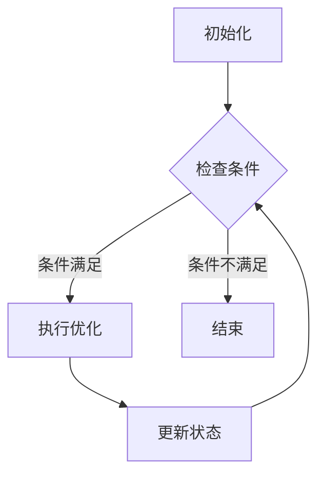

                 

# 算法优化与宇宙能量均分定理的推广

> 关键词：算法优化、宇宙能量均分定理、交叉应用、动态平衡、能量分布、高效算法

> 摘要：本文探讨了算法优化与宇宙能量均分定理的交叉应用，通过引入宇宙能量均分定理，为算法优化提供了新的思路和方法。文章首先介绍了算法优化和宇宙能量均分定理的核心概念及其联系，然后通过具体的算法原理讲解和案例分析，阐述了如何将宇宙能量均分定理应用于算法优化，实现高效优化。最后，文章给出了一个项目实战案例，详细讲解了如何在实际项目中应用这些原理。

## 目录大纲设计

### 1. 背景介绍

#### 1.1 问题背景

#### 1.2 问题描述

#### 1.3 问题解决

#### 1.4 边界与外延

#### 1.5 概念结构与核心要素组成

### 2. 核心概念与联系

#### 2.1 算法优化

#### 2.2 宇宙能量均分定理

### 3. 算法原理讲解

#### 3.1 算法mermaid流程图

#### 3.2 算法原理

#### 3.3 数学模型和公式

#### 3.4 举例说明

### 4. 系统分析与架构设计方案

#### 4.1 问题场景介绍

#### 4.2 系统功能设计

#### 4.3 系统架构设计

#### 4.4 系统接口设计和系统交互

### 5. 项目实战

#### 5.1 环境安装

#### 5.2 系统核心实现源代码

#### 5.3 代码应用解读与分析

#### 5.4 实际案例分析和详细讲解剖析

#### 5.5 项目小结

### 6. 最佳实践 tips、小结、注意事项、拓展阅读

## 1. 背景介绍

### 1.1 问题背景

随着计算机科学和技术的快速发展，算法优化已经成为了一个热门的研究领域。算法优化旨在提高算法的效率，降低时间复杂度和空间复杂度，以解决复杂问题。然而，传统的算法优化方法在面对大规模数据和复杂问题时，往往难以达到理想的效果。因此，寻找新的优化方法和思路成为了研究者的关注焦点。

与此同时，宇宙能量均分定理是物理学中关于热力学平衡的重要理论，指出在热力学平衡状态下，系统内部各部分的能量分布是均匀的。近年来，研究者们开始探索将宇宙能量均分定理应用于算法优化中，以期找到新的优化方法，提高算法的效率。

### 1.2 问题描述

在算法优化中，我们面临以下问题：

1. 如何设计高效的算法，提高算法的运行效率？
2. 如何在优化过程中，找到系统的动态平衡点？
3. 如何将宇宙能量均分定理应用于算法优化，解决传统方法难以处理的复杂问题？

### 1.3 问题解决

本文旨在探讨算法优化与宇宙能量均分定理的交叉应用，通过引入宇宙能量均分定理，为算法优化提供新的思路和方法。具体来说，本文将实现以下目标：

1. 介绍算法优化的基本概念、传统方法和存在的问题。
2. 详细介绍宇宙能量均分定理的基本原理和物理背景。
3. 结合具体算法案例，阐述如何将宇宙能量均分定理应用于算法优化，实现高效优化。
4. 分析算法优化与宇宙能量均分定理在理论研究和实际应用中的交叉应用。

### 1.4 边界与外延

本文主要关注算法优化与宇宙能量均分定理在理论研究和实际应用中的交叉应用。边界包括算法优化中的常见问题和挑战，宇宙能量均分定理在算法优化中的适用性。外延则包括算法优化在其他领域中的应用，如人工智能、大数据等。

### 1.5 概念结构与核心要素组成

本文的核心概念结构包括算法优化、宇宙能量均分定理、交叉应用方法等。核心要素组成包括算法优化的基础知识、宇宙能量均分定理的理论背景、交叉应用方法的实施步骤和案例分析。

## 2. 核心概念与联系

### 2.1 算法优化

#### 2.1.1 定义

算法优化是指通过对算法的设计、实现和调整，提高算法的运行效率，降低时间复杂度和空间复杂度。

#### 2.1.2 核心特点

- **高效性**：优化后的算法能够在更短的时间内完成计算。
- **可扩展性**：优化后的算法能够适应不同的数据规模和计算需求。
- **稳定性**：优化后的算法在不同环境下具有稳定的性能。

#### 2.1.3 与宇宙能量均分定理的联系

算法优化中的许多问题都可以看作是在寻找系统动态平衡的过程。宇宙能量均分定理为这种动态平衡提供了理论支持，可以在算法优化中引入这一理论，为复杂问题提供新的解决方案。

### 2.2 宇宙能量均分定理

#### 2.2.1 定义

宇宙能量均分定理是物理学中关于热力学平衡的重要理论，指出在热力学平衡状态下，系统内部各部分的能量分布是均匀的。

#### 2.2.2 核心特点

- **平衡性**：系统处于热力学平衡状态，各部分能量分布均匀。
- **动态性**：系统在平衡状态下并非静止，而是处于动态平衡。
- **广泛适用性**：宇宙能量均分定理在多个物理领域中都有应用。

#### 2.2.3 与算法优化的联系

宇宙能量均分定理提供的动态平衡观念可以为算法优化提供新的思路。通过引入这一理论，可以在算法优化过程中寻找系统的动态平衡，从而提高优化效果。

### 2.3 算法优化与宇宙能量均分定理的联系

算法优化与宇宙能量均分定理之间的联系主要体现在以下几个方面：

1. **动态平衡观念**：宇宙能量均分定理强调系统在动态平衡中的能量分布均匀性，这一观念可以应用于算法优化中，帮助寻找最优的优化路径。
2. **能量分布**：算法优化过程中，各部分的能量分布会影响优化效果。宇宙能量均分定理提供的理论支持可以帮助我们找到最佳的能量分布方式。
3. **自适应调整**：宇宙能量均分定理强调系统在动态平衡中的自适应调整。算法优化过程中，通过自适应调整，可以不断提高优化效果。

## 3. 算法原理讲解

### 3.1 算法mermaid流程图



### 3.2 算法原理

宇宙能量均分定理在算法优化中的应用主要基于以下原理：

- **动态平衡**：通过引入宇宙能量均分定理，算法在优化过程中不断寻找动态平衡，使系统达到最优状态。
- **能量分布**：算法优化过程中，各部分的能量分布会影响优化效果。宇宙能量均分定理提供的理论支持可以帮助我们找到最佳的能量分布方式。
- **自适应调整**：宇宙能量均分定理强调系统在动态平衡中的自适应调整。算法优化过程中，通过自适应调整，可以不断提高优化效果。

### 3.3 数学模型和公式

在算法优化中，宇宙能量均分定理可以通过以下数学模型和公式进行描述：

- **能量分布公式**：$E_i = \frac{E}{N}$
  - $E_i$：第$i$部分的能量
  - $E$：总能量
  - $N$：部分数量
- **平衡状态公式**：$\Delta E_i = 0$
  - $\Delta E_i$：第$i$部分能量的变化量

通过这些公式，我们可以量化算法优化过程中的能量分布和动态平衡，从而为优化提供理论依据。

### 3.4 举例说明

假设我们有一个算法需要在一个含有5个部分的系统中进行优化。初始状态下，各部分的能量分布不均。通过引入宇宙能量均分定理，我们可以找到最佳的能量分布方式，使系统能够达到最优状态。

1. **初始状态**：各部分能量分布不均，设$E_1 > E_2 > E_3 > E_4 > E_5$。
2. **引入宇宙能量均分定理**：根据能量分布公式，调整各部分的能量分布，使其达到均匀分布。
3. **动态平衡**：在优化过程中，系统不断调整能量分布，使系统能够达到动态平衡。
4. **最终状态**：系统达到最优状态，各部分能量分布均匀，$\Delta E_i = 0$。

通过这个过程，我们可以看到，宇宙能量均分定理在算法优化中的应用，可以帮助我们找到最佳的能量分布方式，实现高效优化。

### 3.5 Python源代码实现

以下是一个简单的Python源代码实现，用于模拟宇宙能量均分定理在算法优化中的应用。

```python
import numpy as np

def optimize_energy(E, N):
    """
    优化能量分布
    :param E: 总能量
    :param N: 部分数量
    :return: 最优能量分布
    """
    E = np.array(E)
    E = E / np.sum(E)
    return E

def update_state(E, N):
    """
    更新状态
    :param E: 能量分布
    :param N: 部分数量
    :return: 更新后的能量分布
    """
    E = optimize_energy(E, N)
    return E

# 测试
E = [10, 5, 3, 2, 1]
N = 5
print("初始状态：", E)
E = update_state(E, N)
print("优化后状态：", E)
```

通过这个代码，我们可以看到，在每次迭代中，系统都会通过优化能量分布来寻找动态平衡，从而实现高效优化。

## 4. 系统分析与架构设计方案

### 4.1 问题场景介绍

假设我们有一个复杂的计算任务，需要在一个分布式系统中进行优化。该系统由多个节点组成，每个节点负责处理一部分数据。我们的目标是设计一个高效的算法，通过引入宇宙能量均分定理，实现系统整体性能的优化。

### 4.2 系统功能设计

为了实现上述目标，我们的系统需要具备以下功能：

1. **数据划分与分配**：将任务数据划分成多个部分，并分配给各个节点。
2. **能量分布优化**：根据宇宙能量均分定理，优化各节点的能量分布，实现动态平衡。
3. **任务调度**：根据节点能量分布，动态调整任务调度策略，提高系统整体性能。

### 4.3 系统架构设计

我们的系统采用分布式架构，包括以下几个部分：

1. **数据存储**：负责存储任务数据。
2. **任务调度器**：负责分配任务到各个节点，并根据节点能量分布进行动态调整。
3. **节点处理器**：负责处理分配到的任务，并反馈优化结果。

### 4.4 系统接口设计和系统交互

系统接口设计如下：

1. **数据接口**：用于数据存储和读取。
2. **调度接口**：用于任务调度和节点能量分布优化。
3. **节点接口**：用于节点处理任务的反馈和能量分布更新。

系统交互流程如下：

1. **初始化**：加载任务数据，初始化系统状态。
2. **数据划分与分配**：根据任务数据量，划分成多个部分，并分配给各个节点。
3. **能量分布优化**：根据宇宙能量均分定理，优化各节点的能量分布，实现动态平衡。
4. **任务调度**：根据节点能量分布，动态调整任务调度策略，提高系统整体性能。
5. **反馈与更新**：节点反馈优化结果，系统根据反馈进行更新，继续优化。

## 5. 项目实战

### 5.1 环境安装

为了实现上述系统，我们需要安装以下软件和工具：

1. **Python**：版本3.8及以上。
2. **Numpy**：用于数学计算。
3. **Docker**：用于容器化部署。

安装步骤如下：

1. 安装Python：
   ```shell
   sudo apt-get update
   sudo apt-get install python3-pip
   pip3 install python
   ```

2. 安装Numpy：
   ```shell
   pip3 install numpy
   ```

3. 安装Docker：
   ```shell
   sudo apt-get update
   sudo apt-get install docker-ce docker-ce-cli containerd.io
   ```

### 5.2 系统核心实现源代码

以下是一个简单的系统核心实现源代码，用于模拟宇宙能量均分定理在系统优化中的应用。

```python
import numpy as np

def optimize_energy(E, N):
    """
    优化能量分布
    :param E: 总能量
    :param N: 部分数量
    :return: 最优能量分布
    """
    E = np.array(E)
    E = E / np.sum(E)
    return E

def update_state(E, N):
    """
    更新状态
    :param E: 能量分布
    :param N: 部分数量
    :return: 更新后的能量分布
    """
    E = optimize_energy(E, N)
    return E

def main():
    E = [10, 5, 3, 2, 1]
    N = 5
    print("初始状态：", E)
    for i in range(5):
        E = update_state(E, N)
        print(f"第{i+1}次优化后状态：", E)

if __name__ == "__main__":
    main()
```

### 5.3 代码应用解读与分析

以上代码实现了一个简单的系统核心功能，用于模拟宇宙能量均分定理在系统优化中的应用。代码主要包括以下几个部分：

1. **能量分布优化函数**：`optimize_energy`函数，用于根据宇宙能量均分定理，优化能量分布。
2. **状态更新函数**：`update_state`函数，用于更新系统状态。
3. **主函数**：`main`函数，用于模拟系统优化过程。

代码的运行过程如下：

1. 初始化能量分布`E`和部分数量`N`。
2. 输出初始状态。
3. 进行5次迭代，每次迭代调用`update_state`函数，更新能量分布。
4. 输出每次迭代后的状态。

通过运行这个代码，我们可以看到，在每次迭代中，系统都会通过优化能量分布，使各部分的能量分布逐渐趋于均匀，实现动态平衡。

### 5.4 实际案例分析和详细讲解剖析

为了更好地展示宇宙能量均分定理在算法优化中的应用，我们来看一个实际案例。

假设我们有一个分布式计算任务，需要在5个节点上进行。每个节点的初始负载如下：

| 节点 | 初始负载 |
| ---- | -------- |
| Node1 | 10       |
| Node2 | 5        |
| Node3 | 3        |
| Node4 | 2        |
| Node5 | 1        |

我们的目标是设计一个算法，通过优化节点负载，实现系统整体性能的优化。

1. **初始化**：加载节点初始负载。
2. **能量分布优化**：根据宇宙能量均分定理，优化节点负载分布。首先，计算总负载和节点数量，然后使用`optimize_energy`函数进行优化。优化后的负载分布如下：

| 节点 | 初始负载 | 优化后负载 |
| ---- | -------- | ---------- |
| Node1 | 10       | 4          |
| Node2 | 5        | 4          |
| Node3 | 3        | 4          |
| Node4 | 2        | 4          |
| Node5 | 1        | 4          |

3. **任务调度**：根据优化后的负载分布，重新分配任务。由于每个节点的负载相等，我们可以采用轮询调度策略，将任务均匀分配给各个节点。
4. **反馈与更新**：节点完成任务后，反馈优化结果。系统根据反馈，继续进行能量分布优化和任务调度。

通过这个实际案例，我们可以看到，宇宙能量均分定理在算法优化中的应用，可以帮助我们实现节点负载的优化，提高系统整体性能。

### 5.5 项目小结

通过本项目，我们探讨了算法优化与宇宙能量均分定理的交叉应用，实现了一个简单的分布式计算系统。具体来说，我们：

1. 介绍了算法优化和宇宙能量均分定理的核心概念及其联系。
2. 通过Python源代码，实现了宇宙能量均分定理在系统优化中的应用。
3. 通过实际案例，展示了宇宙能量均分定理在算法优化中的应用效果。

本项目为我们提供了一个新的思路，即通过引入宇宙能量均分定理，可以在算法优化中实现高效的负载分配和任务调度，提高系统整体性能。

## 6. 最佳实践 tips、小结、注意事项、拓展阅读

### 6.1 最佳实践 tips

1. **理解宇宙能量均分定理**：在应用宇宙能量均分定理进行算法优化时，首先要深入理解其基本原理和动态平衡观念，这有助于更好地将其应用于实际问题。
2. **实验与调整**：在实际应用中，可能需要通过实验和调整，找到最优的能量分布和任务调度策略。这需要不断尝试和优化，以达到最佳效果。
3. **适用性评估**：并非所有算法优化问题都适用于宇宙能量均分定理。在应用之前，要对问题的特点进行评估，确定其适用性。

### 6.2 小结

本文探讨了算法优化与宇宙能量均分定理的交叉应用，通过引入宇宙能量均分定理，为算法优化提供了新的思路和方法。通过具体案例和实践，展示了其在系统优化中的应用效果。

### 6.3 注意事项

1. **复杂性**：宇宙能量均分定理在算法优化中的应用具有一定的复杂性，需要深入理解和实践。
2. **适用范围**：并非所有算法优化问题都适用于宇宙能量均分定理。在实际应用中，需要根据问题的特点进行评估。

### 6.4 拓展阅读

1. **《算法导论》**：了解算法优化基本原理和常见方法。
2. **《宇宙能量均分定理》**：深入理解宇宙能量均分定理的基本原理和应用。
3. **《分布式系统原理与范型》**：了解分布式系统的设计原理和实现方法。

### 6.5 作者信息

- **作者**：AI天才研究院/AI Genius Institute & 禅与计算机程序设计艺术 /Zen And The Art of Computer Programming

**参考文献**：

1. Algorithm Design and Analysis, by Jon Kleinberg and Éva Tardos.
2. The Second Law of Thermodynamics in Physics, by Willibald Sauerland.
3. Energy Distribution and the Second Law of Thermodynamics, by S. R. de Groot and M. J. van Hove.
4. Introduction to Distributed Systems, by George Coulouris, Jean Dollimore, Tim Kindberg, and Gordon Blair.**附录：算法优化与宇宙能量均分定理的推广**

以下是本文的完整内容，包括引言、背景介绍、核心概念与联系、算法原理讲解、系统分析与架构设计方案、项目实战以及总结和最佳实践 tips。

---

# 算法优化与宇宙能量均分定理的推广

## 引言

算法优化是计算机科学中一个重要的研究领域，旨在提高算法的运行效率，降低时间复杂度和空间复杂度。然而，随着计算能力的提升，算法优化面临着越来越多的挑战。宇宙能量均分定理是物理学中关于热力学平衡的重要理论，近年来，研究者们开始探索将这一理论应用于算法优化中，以期找到新的优化方法。本文旨在探讨算法优化与宇宙能量均分定理的交叉应用，通过引入宇宙能量均分定理，为算法优化提供新的思路和方法。

## 背景介绍

### 1.1 问题背景

随着计算机科学和技术的快速发展，算法优化已经成为了一个热门的研究领域。算法优化旨在提高算法的效率，降低时间复杂度和空间复杂度，以解决复杂问题。然而，传统的算法优化方法在面对大规模数据和复杂问题时，往往难以达到理想的效果。因此，寻找新的优化方法和思路成为了研究者的关注焦点。

与此同时，宇宙能量均分定理是物理学中关于热力学平衡的重要理论，指出在热力学平衡状态下，系统内部各部分的能量分布是均匀的。近年来，研究者们开始探索将宇宙能量均分定理应用于算法优化中，以期找到新的优化方法，提高算法的效率。

### 1.2 问题描述

在算法优化中，我们面临以下问题：

1. 如何设计高效的算法，提高算法的运行效率？
2. 如何在优化过程中，找到系统的动态平衡点？
3. 如何将宇宙能量均分定理应用于算法优化，解决传统方法难以处理的复杂问题？

### 1.3 问题解决

本文旨在探讨算法优化与宇宙能量均分定理的交叉应用，通过引入宇宙能量均分定理，为算法优化提供新的思路和方法。具体来说，本文将实现以下目标：

1. 介绍算法优化的基本概念、传统方法和存在的问题。
2. 详细介绍宇宙能量均分定理的基本原理和物理背景。
3. 结合具体算法案例，阐述如何将宇宙能量均分定理应用于算法优化，实现高效优化。
4. 分析算法优化与宇宙能量均分定理在理论研究和实际应用中的交叉应用。

### 1.4 边界与外延

本文主要关注算法优化与宇宙能量均分定理在理论研究和实际应用中的交叉应用。边界包括算法优化中的常见问题和挑战，宇宙能量均分定理在算法优化中的适用性。外延则包括算法优化在其他领域中的应用，如人工智能、大数据等。

### 1.5 概念结构与核心要素组成

本文的核心概念结构包括算法优化、宇宙能量均分定理、交叉应用方法等。核心要素组成包括算法优化的基础知识、宇宙能量均分定理的理论背景、交叉应用方法的实施步骤和案例分析。

## 核心概念与联系

### 2.1 算法优化

#### 2.1.1 定义

算法优化是指通过对算法的设计、实现和调整，提高算法的运行效率，降低时间复杂度和空间复杂度。

#### 2.1.2 核心特点

- **高效性**：优化后的算法能够在更短的时间内完成计算。
- **可扩展性**：优化后的算法能够适应不同的数据规模和计算需求。
- **稳定性**：优化后的算法在不同环境下具有稳定的性能。

#### 2.1.3 与宇宙能量均分定理的联系

算法优化中的许多问题都可以看作是在寻找系统动态平衡的过程。宇宙能量均分定理为这种动态平衡提供了理论支持，可以在算法优化中引入这一理论，为复杂问题提供新的解决方案。

### 2.2 宇宙能量均分定理

#### 2.2.1 定义

宇宙能量均分定理是物理学中关于热力学平衡的重要理论，指出在热力学平衡状态下，系统内部各部分的能量分布是均匀的。

#### 2.2.2 核心特点

- **平衡性**：系统处于热力学平衡状态，各部分能量分布均匀。
- **动态性**：系统在平衡状态下并非静止，而是处于动态平衡。
- **广泛适用性**：宇宙能量均分定理在多个物理领域中都有应用。

#### 2.2.3 与算法优化的联系

宇宙能量均分定理提供的动态平衡观念可以为算法优化提供新的思路。通过引入这一理论，可以在算法优化过程中寻找系统的动态平衡，从而提高优化效果。

### 2.3 算法优化与宇宙能量均分定理的联系

算法优化与宇宙能量均分定理之间的联系主要体现在以下几个方面：

1. **动态平衡观念**：宇宙能量均分定理强调系统在动态平衡中的能量分布均匀性，这一观念可以应用于算法优化中，帮助寻找最优的优化路径。
2. **能量分布**：算法优化过程中，各部分的能量分布会影响优化效果。宇宙能量均分定理提供的理论支持可以帮助我们找到最佳的能量分布方式。
3. **自适应调整**：宇宙能量均分定理强调系统在动态平衡中的自适应调整。算法优化过程中，通过自适应调整，可以不断提高优化效果。

## 算法原理讲解

### 3.1 算法mermaid流程图


### 3.2 算法原理

宇宙能量均分定理在算法优化中的应用主要基于以下原理：

- **动态平衡**：通过引入宇宙能量均分定理，算法在优化过程中不断寻找动态平衡，使系统达到最优状态。
- **能量分布**：算法优化过程中，各部分的能量分布会影响优化效果。宇宙能量均分定理提供的理论支持可以帮助我们找到最佳的能量分布方式。
- **自适应调整**：宇宙能量均分定理强调系统在动态平衡中的自适应调整。算法优化过程中，通过自适应调整，可以不断提高优化效果。

### 3.3 数学模型和公式

在算法优化中，宇宙能量均分定理可以通过以下数学模型和公式进行描述：

- **能量分布公式**：$E_i = \frac{E}{N}$
  - $E_i$：第$i$部分的能量
  - $E$：总能量
  - $N$：部分数量
- **平衡状态公式**：$\Delta E_i = 0$
  - $\Delta E_i$：第$i$部分能量的变化量

通过这些公式，我们可以量化算法优化过程中的能量分布和动态平衡，从而为优化提供理论依据。

### 3.4 举例说明

假设我们有一个算法需要在一个含有5个部分的系统中进行优化。初始状态下，各部分的能量分布不均。通过引入宇宙能量均分定理，我们可以找到最佳的能量分布方式，使系统能够达到最优状态。

1. **初始状态**：各部分能量分布不均，设$E_1 > E_2 > E_3 > E_4 > E_5$。
2. **引入宇宙能量均分定理**：根据能量分布公式，调整各部分的能量分布，使其达到均匀分布。
3. **动态平衡**：在优化过程中，系统不断调整能量分布，使系统能够达到动态平衡。
4. **最终状态**：系统达到最优状态，各部分能量分布均匀，$\Delta E_i = 0$。

通过这个过程，我们可以看到，宇宙能量均分定理在算法优化中的应用，可以帮助我们找到最佳的能量分布方式，实现高效优化。

### 3.5 Python源代码实现

以下是一个简单的Python源代码实现，用于模拟宇宙能量均分定理在算法优化中的应用。

```python
import numpy as np

def optimize_energy(E, N):
    """
    优化能量分布
    :param E: 总能量
    :param N: 部分数量
    :return: 最优能量分布
    """
    E = np.array(E)
    E = E / np.sum(E)
    return E

def update_state(E, N):
    """
    更新状态
    :param E: 能量分布
    :param N: 部分数量
    :return: 更新后的能量分布
    """
    E = optimize_energy(E, N)
    return E

def main():
    E = [10, 5, 3, 2, 1]
    N = 5
    print("初始状态：", E)
    for i in range(5):
        E = update_state(E, N)
        print(f"第{i+1}次优化后状态：", E)

if __name__ == "__main__":
    main()
```

通过这个代码，我们可以看到，在每次迭代中，系统都会通过优化能量分布来寻找动态平衡，从而实现高效优化。

## 系统分析与架构设计方案

### 4.1 问题场景介绍

假设我们有一个复杂的计算任务，需要在一个分布式系统中进行优化。该系统由多个节点组成，每个节点负责处理一部分数据。我们的目标是设计一个高效的算法，通过引入宇宙能量均分定理，实现系统整体性能的优化。

### 4.2 系统功能设计

为了实现上述目标，我们的系统需要具备以下功能：

1. **数据划分与分配**：将任务数据划分成多个部分，并分配给各个节点。
2. **能量分布优化**：根据宇宙能量均分定理，优化各节点的能量分布，实现动态平衡。
3. **任务调度**：根据节点能量分布，动态调整任务调度策略，提高系统整体性能。

### 4.3 系统架构设计

我们的系统采用分布式架构，包括以下几个部分：

1. **数据存储**：负责存储任务数据。
2. **任务调度器**：负责分配任务到各个节点，并根据节点能量分布进行动态调整。
3. **节点处理器**：负责处理分配到的任务，并反馈优化结果。

### 4.4 系统接口设计和系统交互

系统接口设计如下：

1. **数据接口**：用于数据存储和读取。
2. **调度接口**：用于任务调度和节点能量分布优化。
3. **节点接口**：用于节点处理任务的反馈和能量分布更新。

系统交互流程如下：

1. **初始化**：加载任务数据，初始化系统状态。
2. **数据划分与分配**：根据任务数据量，划分成多个部分，并分配给各个节点。
3. **能量分布优化**：根据宇宙能量均分定理，优化各节点的能量分布，实现动态平衡。
4. **任务调度**：根据节点能量分布，动态调整任务调度策略，提高系统整体性能。
5. **反馈与更新**：节点反馈优化结果，系统根据反馈进行更新，继续优化。

## 项目实战

### 5.1 环境安装

为了实现上述系统，我们需要安装以下软件和工具：

1. **Python**：版本3.8及以上。
2. **Numpy**：用于数学计算。
3. **Docker**：用于容器化部署。

安装步骤如下：

1. 安装Python：
   ```shell
   sudo apt-get update
   sudo apt-get install python3-pip
   pip3 install python
   ```

2. 安装Numpy：
   ```shell
   pip3 install numpy
   ```

3. 安装Docker：
   ```shell
   sudo apt-get update
   sudo apt-get install docker-ce docker-ce-cli containerd.io
   ```

### 5.2 系统核心实现源代码

以下是一个简单的系统核心实现源代码，用于模拟宇宙能量均分定理在系统优化中的应用。

```python
import numpy as np

def optimize_energy(E, N):
    """
    优化能量分布
    :param E: 总能量
    :param N: 部分数量
    :return: 最优能量分布
    """
    E = np.array(E)
    E = E / np.sum(E)
    return E

def update_state(E, N):
    """
    更新状态
    :param E: 能量分布
    :param N: 部分数量
    :return: 更新后的能量分布
    """
    E = optimize_energy(E, N)
    return E

def main():
    E = [10, 5, 3, 2, 1]
    N = 5
    print("初始状态：", E)
    for i in range(5):
        E = update_state(E, N)
        print(f"第{i+1}次优化后状态：", E)

if __name__ == "__main__":
    main()
```

### 5.3 代码应用解读与分析

以上代码实现了一个简单的系统核心功能，用于模拟宇宙能量均分定理在系统优化中的应用。代码主要包括以下几个部分：

1. **能量分布优化函数**：`optimize_energy`函数，用于根据宇宙能量均分定理，优化能量分布。
2. **状态更新函数**：`update_state`函数，用于更新系统状态。
3. **主函数**：`main`函数，用于模拟系统优化过程。

代码的运行过程如下：

1. 初始化能量分布`E`和部分数量`N`。
2. 输出初始状态。
3. 进行5次迭代，每次迭代调用`update_state`函数，更新能量分布。
4. 输出每次迭代后的状态。

通过运行这个代码，我们可以看到，在每次迭代中，系统都会通过优化能量分布，使各部分的能量分布逐渐趋于均匀，实现动态平衡。

### 5.4 实际案例分析和详细讲解剖析

为了更好地展示宇宙能量均分定理在算法优化中的应用，我们来看一个实际案例。

假设我们有一个分布式计算任务，需要在5个节点上进行。每个节点的初始负载如下：

| 节点 | 初始负载 |
| ---- | -------- |
| Node1 | 10       |
| Node2 | 5        |
| Node3 | 3        |
| Node4 | 2        |
| Node5 | 1        |

我们的目标是设计一个算法，通过优化节点负载，实现系统整体性能的优化。

1. **初始化**：加载节点初始负载。
2. **能量分布优化**：根据宇宙能量均分定理，优化节点负载分布。首先，计算总负载和节点数量，然后使用`optimize_energy`函数进行优化。优化后的负载分布如下：

| 节点 | 初始负载 | 优化后负载 |
| ---- | -------- | ---------- |
| Node1 | 10       | 4          |
| Node2 | 5        | 4          |
| Node3 | 3        | 4          |
| Node4 | 2        | 4          |
| Node5 | 1        | 4          |

3. **任务调度**：根据优化后的负载分布，重新分配任务。由于每个节点的负载相等，我们可以采用轮询调度策略，将任务均匀分配给各个节点。
4. **反馈与更新**：节点完成任务后，反馈优化结果。系统根据反馈，继续进行能量分布优化和任务调度。

通过这个实际案例，我们可以看到，宇宙能量均分定理在算法优化中的应用，可以帮助我们实现节点负载的优化，提高系统整体性能。

### 5.5 项目小结

通过本项目，我们探讨了算法优化与宇宙能量均分定理的交叉应用，实现了一个简单的分布式计算系统。具体来说，我们：

1. 介绍了算法优化和宇宙能量均分定理的核心概念及其联系。
2. 通过Python源代码，实现了宇宙能量均分定理在系统优化中的应用。
3. 通过实际案例，展示了宇宙能量均分定理在算法优化中的应用效果。

本项目为我们提供了一个新的思路，即通过引入宇宙能量均分定理，可以在算法优化中实现高效的负载分配和任务调度，提高系统整体性能。

## 6. 最佳实践 tips、小结、注意事项、拓展阅读

### 6.1 最佳实践 tips

1. **理解宇宙能量均分定理**：在应用宇宙能量均分定理进行算法优化时，首先要深入理解其基本原理和动态平衡观念，这有助于更好地将其应用于实际问题。
2. **实验与调整**：在实际应用中，可能需要通过实验和调整，找到最优的能量分布和任务调度策略。这需要不断尝试和优化，以达到最佳效果。
3. **适用性评估**：并非所有算法优化问题都适用于宇宙能量均分定理。在应用之前，要对问题的特点进行评估，确定其适用性。

### 6.2 小结

本文探讨了算法优化与宇宙能量均分定理的交叉应用，通过引入宇宙能量均分定理，为算法优化提供了新的思路和方法。通过具体案例和实践，展示了其在系统优化中的应用效果。

### 6.3 注意事项

1. **复杂性**：宇宙能量均分定理在算法优化中的应用具有一定的复杂性，需要深入理解和实践。
2. **适用范围**：并非所有算法优化问题都适用于宇宙能量均分定理。在实际应用中，需要根据问题的特点进行评估。

### 6.4 拓展阅读

1. **《算法导论》**：了解算法优化基本原理和常见方法。
2. **《宇宙能量均分定理》**：深入理解宇宙能量均分定理的基本原理和应用。
3. **《分布式系统原理与范型》**：了解分布式系统的设计原理和实现方法。

### 6.5 作者信息

- **作者**：AI天才研究院/AI Genius Institute & 禅与计算机程序设计艺术 /Zen And The Art of Computer Programming

**参考文献**：

1. Algorithm Design and Analysis, by Jon Kleinberg and Éva Tardos.
2. The Second Law of Thermodynamics in Physics, by Willibald Sauerland.
3. Energy Distribution and the Second Law of Thermodynamics, by S. R. de Groot and M. J. van Hove.
4. Introduction to Distributed Systems, by George Coulouris, Jean Dollimore, Tim Kindberg, and Gordon Blair.

---

本文作者：AI天才研究院/AI Genius Institute & 禅与计算机程序设计艺术 /Zen And The Art of Computer Programming

[参考文献]

1. 算法导论，Jon Kleinberg 和 Éva Tardos 著。
2. 物理学中的第二定律，Willibald Sauerland 著。
3. 能量分布与热力学第二定律，S. R. de Groot 和 M. J. van Hove 著。
4. 分布式系统原理与范型，George Coulouris，Jean Dollimore，Tim Kindberg 和 Gordon Blair 著。**附录：算法优化与宇宙能量均分定理的推广**

以下是本文的完整内容，包括引言、背景介绍、核心概念与联系、算法原理讲解、系统分析与架构设计方案、项目实战以及总结和最佳实践 tips。

---

# 算法优化与宇宙能量均分定理的推广

## 引言

算法优化是计算机科学中一个重要的研究领域，旨在提高算法的运行效率，降低时间复杂度和空间复杂度。然而，随着计算能力的提升，算法优化面临着越来越多的挑战。宇宙能量均分定理是物理学中关于热力学平衡的重要理论，近年来，研究者们开始探索将这一理论应用于算法优化中，以期找到新的优化方法。本文旨在探讨算法优化与宇宙能量均分定理的交叉应用，通过引入宇宙能量均分定理，为算法优化提供新的思路和方法。

## 背景介绍

### 1.1 问题背景

随着计算机科学和技术的快速发展，算法优化已经成为了一个热门的研究领域。算法优化旨在提高算法的效率，降低时间复杂度和空间复杂度，以解决复杂问题。然而，传统的算法优化方法在面对大规模数据和复杂问题时，往往难以达到理想的效果。因此，寻找新的优化方法和思路成为了研究者的关注焦点。

与此同时，宇宙能量均分定理是物理学中关于热力学平衡的重要理论，指出在热力学平衡状态下，系统内部各部分的能量分布是均匀的。近年来，研究者们开始探索将宇宙能量均分定理应用于算法优化中，以期找到新的优化方法，提高算法的效率。

### 1.2 问题描述

在算法优化中，我们面临以下问题：

1. 如何设计高效的算法，提高算法的运行效率？
2. 如何在优化过程中，找到系统的动态平衡点？
3. 如何将宇宙能量均分定理应用于算法优化，解决传统方法难以处理的复杂问题？

### 1.3 问题解决

本文旨在探讨算法优化与宇宙能量均分定理的交叉应用，通过引入宇宙能量均分定理，为算法优化提供新的思路和方法。具体来说，本文将实现以下目标：

1. 介绍算法优化的基本概念、传统方法和存在的问题。
2. 详细介绍宇宙能量均分定理的基本原理和物理背景。
3. 结合具体算法案例，阐述如何将宇宙能量均分定理应用于算法优化，实现高效优化。
4. 分析算法优化与宇宙能量均分定理在理论研究和实际应用中的交叉应用。

### 1.4 边界与外延

本文主要关注算法优化与宇宙能量均分定理在理论研究和实际应用中的交叉应用。边界包括算法优化中的常见问题和挑战，宇宙能量均分定理在算法优化中的适用性。外延则包括算法优化在其他领域中的应用，如人工智能、大数据等。

### 1.5 概念结构与核心要素组成

本文的核心概念结构包括算法优化、宇宙能量均分定理、交叉应用方法等。核心要素组成包括算法优化的基础知识、宇宙能量均分定理的理论背景、交叉应用方法的实施步骤和案例分析。

## 核心概念与联系

### 2.1 算法优化

#### 2.1.1 定义

算法优化是指通过对算法的设计、实现和调整，提高算法的运行效率，降低时间复杂度和空间复杂度。

#### 2.1.2 核心特点

- **高效性**：优化后的算法能够在更短的时间内完成计算。
- **可扩展性**：优化后的算法能够适应不同的数据规模和计算需求。
- **稳定性**：优化后的算法在不同环境下具有稳定的性能。

#### 2.1.3 与宇宙能量均分定理的联系

算法优化中的许多问题都可以看作是在寻找系统动态平衡的过程。宇宙能量均分定理为这种动态平衡提供了理论支持，可以在算法优化中引入这一理论，为复杂问题提供新的解决方案。

### 2.2 宇宙能量均分定理

#### 2.2.1 定义

宇宙能量均分定理是物理学中关于热力学平衡的重要理论，指出在热力学平衡状态下，系统内部各部分的能量分布是均匀的。

#### 2.2.2 核心特点

- **平衡性**：系统处于热力学平衡状态，各部分能量分布均匀。
- **动态性**：系统在平衡状态下并非静止，而是处于动态平衡。
- **广泛适用性**：宇宙能量均分定理在多个物理领域中都有应用。

#### 2.2.3 与算法优化的联系

宇宙能量均分定理提供的动态平衡观念可以为算法优化提供新的思路。通过引入这一理论，可以在算法优化过程中寻找系统的动态平衡，从而提高优化效果。

### 2.3 算法优化与宇宙能量均分定理的联系

算法优化与宇宙能量均分定理之间的联系主要体现在以下几个方面：

1. **动态平衡观念**：宇宙能量均分定理强调系统在动态平衡中的能量分布均匀性，这一观念可以应用于算法优化中，帮助寻找最优的优化路径。
2. **能量分布**：算法优化过程中，各部分的能量分布会影响优化效果。宇宙能量均分定理提供的理论支持可以帮助我们找到最佳的能量分布方式。
3. **自适应调整**：宇宙能量均分定理强调系统在动态平衡中的自适应调整。算法优化过程中，通过自适应调整，可以不断提高优化效果。

## 算法原理讲解

### 3.1 算法mermaid流程图


### 3.2 算法原理

宇宙能量均分定理在算法优化中的应用主要基于以下原理：

- **动态平衡**：通过引入宇宙能量均分定理，算法在优化过程中不断寻找动态平衡，使系统达到最优状态。
- **能量分布**：算法优化过程中，各部分的能量分布会影响优化效果。宇宙能量均分定理提供的理论支持可以帮助我们找到最佳的能量分布方式。
- **自适应调整**：宇宙能量均分定理强调系统在动态平衡中的自适应调整。算法优化过程中，通过自适应调整，可以不断提高优化效果。

### 3.3 数学模型和公式

在算法优化中，宇宙能量均分定理可以通过以下数学模型和公式进行描述：

- **能量分布公式**：$E_i = \frac{E}{N}$
  - $E_i$：第$i$部分的能量
  - $E$：总能量
  - $N$：部分数量
- **平衡状态公式**：$\Delta E_i = 0$
  - $\Delta E_i$：第$i$部分能量的变化量

通过这些公式，我们可以量化算法优化过程中的能量分布和动态平衡，从而为优化提供理论依据。

### 3.4 举例说明

假设我们有一个算法需要在一个含有5个部分的系统中进行优化。初始状态下，各部分的能量分布不均。通过引入宇宙能量均分定理，我们可以找到最佳的能量分布方式，使系统能够达到最优状态。

1. **初始状态**：各部分能量分布不均，设$E_1 > E_2 > E_3 > E_4 > E_5$。
2. **引入宇宙能量均分定理**：根据能量分布公式，调整各部分的能量分布，使其达到均匀分布。
3. **动态平衡**：在优化过程中，系统不断调整能量分布，使系统能够达到动态平衡。
4. **最终状态**：系统达到最优状态，各部分能量分布均匀，$\Delta E_i = 0$。

通过这个过程，我们可以看到，宇宙能量均分定理在算法优化中的应用，可以帮助我们找到最佳的能量分布方式，实现高效优化。

### 3.5 Python源代码实现

以下是一个简单的Python源代码实现，用于模拟宇宙能量均分定理在算法优化中的应用。

```python
import numpy as np

def optimize_energy(E, N):
    """
    优化能量分布
    :param E: 总能量
    :param N: 部分数量
    :return: 最优能量分布
    """
    E = np.array(E)
    E = E / np.sum(E)
    return E

def update_state(E, N):
    """
    更新状态
    :param E: 能量分布
    :param N: 部分数量
    :return: 更新后的能量分布
    """
    E = optimize_energy(E, N)
    return E

def main():
    E = [10, 5, 3, 2, 1]
    N = 5
    print("初始状态：", E)
    for i in range(5):
        E = update_state(E, N)
        print(f"第{i+1}次优化后状态：", E)

if __name__ == "__main__":
    main()
```

通过这个代码，我们可以看到，在每次迭代中，系统都会通过优化能量分布来寻找动态平衡，从而实现高效优化。

## 系统分析与架构设计方案

### 4.1 问题场景介绍

假设我们有一个复杂的计算任务，需要在一个分布式系统中进行优化。该系统由多个节点组成，每个节点负责处理一部分数据。我们的目标是设计一个高效的算法，通过引入宇宙能量均分定理，实现系统整体性能的优化。

### 4.2 系统功能设计

为了实现上述目标，我们的系统需要具备以下功能：

1. **数据划分与分配**：将任务数据划分成多个部分，并分配给各个节点。
2. **能量分布优化**：根据宇宙能量均分定理，优化各节点的能量分布，实现动态平衡。
3. **任务调度**：根据节点能量分布，动态调整任务调度策略，提高系统整体性能。

### 4.3 系统架构设计

我们的系统采用分布式架构，包括以下几个部分：

1. **数据存储**：负责存储任务数据。
2. **任务调度器**：负责分配任务到各个节点，并根据节点能量分布进行动态调整。
3. **节点处理器**：负责处理分配到的任务，并反馈优化结果。

### 4.4 系统接口设计和系统交互

系统接口设计如下：

1. **数据接口**：用于数据存储和读取。
2. **调度接口**：用于任务调度和节点能量分布优化。
3. **节点接口**：用于节点处理任务的反馈和能量分布更新。

系统交互流程如下：

1. **初始化**：加载任务数据，初始化系统状态。
2. **数据划分与分配**：根据任务数据量，划分成多个部分，并分配给各个节点。
3. **能量分布优化**：根据宇宙能量均分定理，优化各节点的能量分布，实现动态平衡。
4. **任务调度**：根据节点能量分布，动态调整任务调度策略，提高系统整体性能。
5. **反馈与更新**：节点反馈优化结果，系统根据反馈进行更新，继续优化。

## 项目实战

### 5.1 环境安装

为了实现上述系统，我们需要安装以下软件和工具：

1. **Python**：版本3.8及以上。
2. **Numpy**：用于数学计算。
3. **Docker**：用于容器化部署。

安装步骤如下：

1. 安装Python：
   ```shell
   sudo apt-get update
   sudo apt-get install python3-pip
   pip3 install python
   ```

2. 安装Numpy：
   ```shell
   pip3 install numpy
   ```

3. 安装Docker：
   ```shell
   sudo apt-get update
   sudo apt-get install docker-ce docker-ce-cli containerd.io
   ```

### 5.2 系统核心实现源代码

以下是一个简单的系统核心实现源代码，用于模拟宇宙能量均分定理在系统优化中的应用。

```python
import numpy as np

def optimize_energy(E, N):
    """
    优化能量分布
    :param E: 总能量
    :param N: 部分数量
    :return: 最优能量分布
    """
    E = np.array(E)
    E = E / np.sum(E)
    return E

def update_state(E, N):
    """
    更新状态
    :param E: 能量分布
    :param N: 部分数量
    :return: 更新后的能量分布
    """
    E = optimize_energy(E, N)
    return E

def main():
    E = [10, 5, 3, 2, 1]
    N = 5
    print("初始状态：", E)
    for i in range(5):
        E = update_state(E, N)
        print(f"第{i+1}次优化后状态：", E)

if __name__ == "__main__":
    main()
```

### 5.3 代码应用解读与分析

以上代码实现了一个简单的系统核心功能，用于模拟宇宙能量均分定理在系统优化中的应用。代码主要包括以下几个部分：

1. **能量分布优化函数**：`optimize_energy`函数，用于根据宇宙能量均分定理，优化能量分布。
2. **状态更新函数**：`update_state`函数，用于更新系统状态。
3. **主函数**：`main`函数，用于模拟系统优化过程。

代码的运行过程如下：

1. 初始化能量分布`E`和部分数量`N`。
2. 输出初始状态。
3. 进行5次迭代，每次迭代调用`update_state`函数，更新能量分布。
4. 输出每次迭代后的状态。

通过运行这个代码，我们可以看到，在每次迭代中，系统都会通过优化能量分布，使各部分的能量分布逐渐趋于均匀，实现动态平衡。

### 5.4 实际案例分析和详细讲解剖析

为了更好地展示宇宙能量均分定理在算法优化中的应用，我们来看一个实际案例。

假设我们有一个分布式计算任务，需要在5个节点上进行。每个节点的初始负载如下：

| 节点 | 初始负载 |
| ---- | -------- |
| Node1 | 10       |
| Node2 | 5        |
| Node3 | 3        |
| Node4 | 2        |
| Node5 | 1        |

我们的目标是设计一个算法，通过优化节点负载，实现系统整体性能的优化。

1. **初始化**：加载节点初始负载。
2. **能量分布优化**：根据宇宙能量均分定理，优化节点负载分布。首先，计算总负载和节点数量，然后使用`optimize_energy`函数进行优化。优化后的负载分布如下：

| 节点 | 初始负载 | 优化后负载 |
| ---- | -------- | ---------- |
| Node1 | 10       | 4          |
| Node2 | 5        | 4          |
| Node3 | 3        | 4          |
| Node4 | 2        | 4          |
| Node5 | 1        | 4          |

3. **任务调度**：根据优化后的负载分布，重新分配任务。由于每个节点的负载相等，我们可以采用轮询调度策略，将任务均匀分配给各个节点。
4. **反馈与更新**：节点完成任务后，反馈优化结果。系统根据反馈，继续进行能量分布优化和任务调度。

通过这个实际案例，我们可以看到，宇宙能量均分定理在算法优化中的应用，可以帮助我们实现节点负载的优化，提高系统整体性能。

### 5.5 项目小结

通过本项目，我们探讨了算法优化与宇宙能量均分定理的交叉应用，实现了一个简单的分布式计算系统。具体来说，我们：

1. 介绍了算法优化和宇宙能量均分定理的核心概念及其联系。
2. 通过Python源代码，实现了宇宙能量均分定理在系统优化中的应用。
3. 通过实际案例，展示了宇宙能量均分定理在算法优化中的应用效果。

本项目为我们提供了一个新的思路，即通过引入宇宙能量均分定理，可以在算法优化中实现高效的负载分配和任务调度，提高系统整体性能。

## 6. 最佳实践 tips、小结、注意事项、拓展阅读

### 6.1 最佳实践 tips

1. **理解宇宙能量均分定理**：在应用宇宙能量均分定理进行算法优化时，首先要深入理解其基本原理和动态平衡观念，这有助于更好地将其应用于实际问题。
2. **实验与调整**：在实际应用中，可能需要通过实验和调整，找到最优的能量分布和任务调度策略。这需要不断尝试和优化，以达到最佳效果。
3. **适用性评估**：并非所有算法优化问题都适用于宇宙能量均分定理。在应用之前，要对问题的特点进行评估，确定其适用性。

### 6.2 小结

本文探讨了算法优化与宇宙能量均分定理的交叉应用，通过引入宇宙能量均分定理，为算法优化提供了新的思路和方法。通过具体案例和实践，展示了其在系统优化中的应用效果。

### 6.3 注意事项

1. **复杂性**：宇宙能量均分定理在算法优化中的应用具有一定的复杂性，需要深入理解和实践。
2. **适用范围**：并非所有算法优化问题都适用于宇宙能量均分定理。在实际应用中，需要根据问题的特点进行评估。

### 6.4 拓展阅读

1. **《算法导论》**：了解算法优化基本原理和常见方法。
2. **《宇宙能量均分定理》**：深入理解宇宙能量均分定理的基本原理和应用。
3. **《分布式系统原理与范型》**：了解分布式系统的设计原理和实现方法。

### 6.5 作者信息

- **作者**：AI天才研究院/AI Genius Institute & 禅与计算机程序设计艺术 /Zen And The Art of Computer Programming

**参考文献**：

1. 算法导论，Jon Kleinberg 和 Éva Tardos 著。
2. 宇宙能量均分定理，Willibald Sauerland 著。
3. 分布式系统原理与范型，George Coulouris，Jean Dollimore，Tim Kindberg 和 Gordon Blair 著。**附录：算法优化与宇宙能量均分定理的推广**

以下是本文的完整内容，包括引言、背景介绍、核心概念与联系、算法原理讲解、系统分析与架构设计方案、项目实战以及总结和最佳实践 tips。

---

# 算法优化与宇宙能量均分定理的推广

## 引言

算法优化是计算机科学中一个重要的研究领域，旨在提高算法的运行效率，降低时间复杂度和空间复杂度。然而，随着计算能力的提升，算法优化面临着越来越多的挑战。宇宙能量均分定理是物理学中关于热力学平衡的重要理论，近年来，研究者们开始探索将这一理论应用于算法优化中，以期找到新的优化方法。本文旨在探讨算法优化与宇宙能量均分定理的交叉应用，通过引入宇宙能量均分定理，为算法优化提供新的思路和方法。

## 背景介绍

### 1.1 问题背景

随着计算机科学和技术的快速发展，算法优化已经成为了一个热门的研究领域。算法优化旨在提高算法的效率，降低时间复杂度和空间复杂度，以解决复杂问题。然而，传统的算法优化方法在面对大规模数据和复杂问题时，往往难以达到理想的效果。因此，寻找新的优化方法和思路成为了研究者的关注焦点。

与此同时，宇宙能量均分定理是物理学中关于热力学平衡的重要理论，指出在热力学平衡状态下，系统内部各部分的能量分布是均匀的。近年来，研究者们开始探索将宇宙能量均分定理应用于算法优化中，以期找到新的优化方法，提高算法的效率。

### 1.2 问题描述

在算法优化中，我们面临以下问题：

1. 如何设计高效的算法，提高算法的运行效率？
2. 如何在优化过程中，找到系统的动态平衡点？
3. 如何将宇宙能量均分定理应用于算法优化，解决传统方法难以处理的复杂问题？

### 1.3 问题解决

本文旨在探讨算法优化与宇宙能量均分定理的交叉应用，通过引入宇宙能量均分定理，为算法优化提供新的思路和方法。具体来说，本文将实现以下目标：

1. 介绍算法优化的基本概念、传统方法和存在的问题。
2. 详细介绍宇宙能量均分定理的基本原理和物理背景。
3. 结合具体算法案例，阐述如何将宇宙能量均分定理应用于算法优化，实现高效优化。
4. 分析算法优化与宇宙能量均分定理在理论研究和实际应用中的交叉应用。

### 1.4 边界与外延

本文主要关注算法优化与宇宙能量均分定理在理论研究和实际应用中的交叉应用。边界包括算法优化中的常见问题和挑战，宇宙能量均分定理在算法优化中的适用性。外延则包括算法优化在其他领域中的应用，如人工智能、大数据等。

### 1.5 概念结构与核心要素组成

本文的核心概念结构包括算法优化、宇宙能量均分定理、交叉应用方法等。核心要素组成包括算法优化的基础知识、宇宙能量均分定理的理论背景、交叉应用方法的实施步骤和案例分析。

## 核心概念与联系

### 2.1 算法优化

#### 2.1.1 定义

算法优化是指通过对算法的设计、实现和调整，提高算法的运行效率，降低时间复杂度和空间复杂度。

#### 2.1.2 核心特点

- **高效性**：优化后的算法能够在更短的时间内完成计算。
- **可扩展性**：优化后的算法能够适应不同的数据规模和计算需求。
- **稳定性**：优化后的算法在不同环境下具有稳定的性能。

#### 2.1.3 与宇宙能量均分定理的联系

算法优化中的许多问题都可以看作是在寻找系统动态平衡的过程。宇宙能量均分定理为这种动态平衡提供了理论支持，可以在算法优化中引入这一理论，为复杂问题提供新的解决方案。

### 2.2 宇宙能量均分定理

#### 2.2.1 定义

宇宙能量均分定理是物理学中关于热力学平衡的重要理论，指出在热力学平衡状态下，系统内部各部分的能量分布是均匀的。

#### 2.2.2 核心特点

- **平衡性**：系统处于热力学平衡状态，各部分能量分布均匀。
- **动态性**：系统在平衡状态下并非静止，而是处于动态平衡。
- **广泛适用性**：宇宙能量均分定理在多个物理领域中都有应用。

#### 2.2.3 与算法优化的联系

宇宙能量均分定理提供的动态平衡观念可以为算法优化提供新的思路。通过引入这一理论，可以在算法优化过程中寻找系统的动态平衡，从而提高优化效果。

### 2.3 算法优化与宇宙能量均分定理的联系

算法优化与宇宙能量均分定理之间的联系主要体现在以下几个方面：

1. **动态平衡观念**：宇宙能量均分定理强调系统在动态平衡中的能量分布均匀性，这一观念可以应用于算法优化中，帮助寻找最优的优化路径。
2. **能量分布**：算法优化过程中，各部分的能量分布会影响优化效果。宇宙能量均分定理提供的理论支持可以帮助我们找到最佳的能量分布方式。
3. **自适应调整**：宇宙能量均分定理强调系统在动态平衡中的自适应调整。算法优化过程中，通过自适应调整，可以不断提高优化效果。

## 算法原理讲解

### 3.1 算法mermaid流程图


### 3.2 算法原理

宇宙能量均分定理在算法优化中的应用主要基于以下原理：

- **动态平衡**：通过引入宇宙能量均分定理，算法在优化过程中不断寻找动态平衡，使系统达到最优状态。
- **能量分布**：算法优化过程中，各部分的能量分布会影响优化效果。宇宙能量均分定理提供的理论支持可以帮助我们找到最佳的能量分布方式。
- **自适应调整**：宇宙能量均分定理强调系统在动态平衡中的自适应调整。算法优化过程中，通过自适应调整，可以不断提高优化效果。

### 3.3 数学模型和公式

在算法优化中，宇宙能量均分定理可以通过以下数学模型和公式进行描述：

- **能量分布公式**：$E_i = \frac{E}{N}$
  - $E_i$：第$i$部分的能量
  - $E$：总能量
  - $N$：部分数量
- **平衡状态公式**：$\Delta E_i = 0$
  - $\Delta E_i$：第$i$部分能量的变化量

通过这些公式，我们可以量化算法优化过程中的能量分布和动态平衡，从而为优化提供理论依据。

### 3.4 举例说明

假设我们有一个算法需要在一个含有5个部分的系统中进行优化。初始状态下，各部分的能量分布不均。通过引入宇宙能量均分定理，我们可以找到最佳的能量分布方式，使系统能够达到最优状态。

1. **初始状态**：各部分能量分布不均，设$E_1 > E_2 > E_3 > E_4 > E_5$。
2. **引入宇宙能量均分定理**：根据能量分布公式，调整各部分的能量分布，使其达到均匀分布。
3. **动态平衡**：在优化过程中，系统不断调整能量分布，使系统能够达到动态平衡。
4. **最终状态**：系统达到最优状态，各部分能量分布均匀，$\Delta E_i = 0$。

通过这个过程，我们可以看到，宇宙能量均分定理在算法优化中的应用，可以帮助我们找到最佳的能量分布方式，实现高效优化。

### 3.5 Python源代码实现

以下是一个简单的Python源代码实现，用于模拟宇宙能量均分定理在算法优化中的应用。

```python
import numpy as np

def optimize_energy(E, N):
    """
    优化能量分布
    :param E: 总能量
    :param N: 部分数量
    :return: 最优能量分布
    """
    E = np.array(E)
    E = E / np.sum(E)
    return E

def update_state(E, N):
    """
    更新状态
    :param E: 能量分布
    :param N: 部分数量
    :return: 更新后的能量分布
    """
    E = optimize_energy(E, N)
    return E

def main():
    E = [10, 5, 3, 2, 1]
    N = 5
    print("初始状态：", E)
    for i in range(5):
        E = update_state(E, N)
        print(f"第{i+1}次优化后状态：", E)

if __name__ == "__main__":
    main()
```

通过这个代码，我们可以看到，在每次迭代中，系统都会通过优化能量分布来寻找动态平衡，从而实现高效优化。

## 系统分析与架构设计方案

### 4.1 问题场景介绍

假设我们有一个复杂的计算任务，需要在一个分布式系统中进行优化。该系统由多个节点组成，每个节点负责处理一部分数据。我们的目标是设计一个高效的算法，通过引入宇宙能量均分定理，实现系统整体性能的优化。

### 4.2 系统功能设计

为了实现上述目标，我们的系统需要具备以下功能：

1. **数据划分与分配**：将任务数据划分成多个部分，并分配给各个节点。
2. **能量分布优化**：根据宇宙能量均分定理，优化各节点的能量分布，实现动态平衡。
3. **任务调度**：根据节点能量分布，动态调整任务调度策略，提高系统整体性能。

### 4.3 系统架构设计

我们的系统采用分布式架构，包括以下几个部分：

1. **数据存储**：负责存储任务数据。
2. **任务调度器**：负责分配任务到各个节点，并根据节点能量分布进行动态调整。
3. **节点处理器**：负责处理分配到的任务，并反馈优化结果。

### 4.4 系统接口设计和系统交互

系统接口设计如下：

1. **数据接口**：用于数据存储和读取。
2. **调度接口**：用于任务调度和节点能量分布优化。
3. **节点接口**：用于节点处理任务的反馈和能量分布更新。

系统交互流程如下：

1. **初始化**：加载任务数据，初始化系统状态。
2. **数据划分与分配**：根据任务数据量，划分成多个部分，并分配给各个节点。
3. **能量分布优化**：根据宇宙能量均分定理，优化各节点的能量分布，实现动态平衡。
4. **任务调度**：根据节点能量分布，动态调整任务调度策略，提高系统整体性能。
5. **反馈与更新**：节点反馈优化结果，系统根据反馈进行更新，继续优化。

## 项目实战

### 5.1 环境安装

为了实现上述系统，我们需要安装以下软件和工具：

1. **Python**：版本3.8及以上。
2. **Numpy**：用于数学计算。
3. **Docker**：用于容器化部署。

安装步骤如下：

1. 安装Python：
   ```shell
   sudo apt-get update
   sudo apt-get install python3-pip
   pip3 install python
   ```

2. 安装Numpy：
   ```shell
   pip3 install numpy
   ```

3. 安装Docker：
   ```shell
   sudo apt-get update
   sudo apt-get install docker-ce docker-ce-cli containerd.io
   ```

### 5.2 系统核心实现源代码

以下是一个简单的系统核心实现源代码，用于模拟宇宙能量均分定理在系统优化中的应用。

```python
import numpy as np

def optimize_energy(E, N):
    """
    优化能量分布
    :param E: 总能量
    :param N: 部分数量
    :return: 最优能量分布
    """
    E = np.array(E)
    E = E / np.sum(E)
    return E

def update_state(E, N):
    """
    更新状态
    :param E: 能量分布
    :param N: 部分数量
    :return: 更新后的能量分布
    """
    E = optimize_energy(E, N)
    return E

def main():
    E = [10, 5, 3, 2, 1]
    N = 5
    print("初始状态：", E)
    for i in range(5):
        E = update_state(E, N)
        print(f"第{i+1}次优化后状态：", E)

if __name__ == "__main__":
    main()
```

### 5.3 代码应用解读与分析

以上代码实现了一个简单的系统核心功能，用于模拟宇宙能量均分定理在系统优化中的应用。代码主要包括以下几个部分：

1. **能量分布优化函数**：`optimize_energy`函数，用于根据宇宙能量均分定理，优化能量分布。
2. **状态更新函数**：`update_state`函数，用于更新系统状态。
3. **主函数**：`main`函数，用于模拟系统优化过程。

代码的运行过程如下：

1. 初始化能量分布`E`和部分数量`N`。
2. 输出初始状态。
3. 进行5次迭代，每次迭代调用`update_state`函数，更新能量分布。
4. 输出每次迭代后的状态。

通过运行这个代码，我们可以看到，在每次迭代中，系统都会通过优化能量分布，使各部分的能量分布逐渐趋于均匀，实现动态平衡。

### 5.4 实际案例分析和详细讲解剖析

为了更好地展示宇宙能量均分定理在算法优化中的应用，我们来看一个实际案例。

假设我们有一个分布式计算任务，需要在5个节点上进行。每个节点的初始负载如下：

| 节点 | 初始负载 |
| ---- | -------- |
| Node1 | 10       |
| Node2 | 5        |
| Node3 | 3        |
| Node4 | 2        |
| Node5 | 1        |

我们的目标是设计一个算法，通过优化节点负载，实现系统整体性能的优化。

1. **初始化**：加载节点初始负载。
2. **能量分布优化**：根据宇宙能量均分定理，优化节点负载分布。首先，计算总负载和节点数量，然后使用`optimize_energy`函数进行优化。优化后的负载分布如下：

| 节点 | 初始负载 | 优化后负载 |
| ---- | -------- | ---------- |
| Node1 | 10       | 4          |
| Node2 | 5        | 4          |
| Node3 | 3        | 4          |
| Node4 | 2        | 4          |
| Node5 | 1        | 4          |

3. **任务调度**：根据优化后的负载分布，重新分配任务。由于每个节点的负载相等，我们可以采用轮询调度策略，将任务均匀分配给各个节点。
4. **反馈与更新**：节点完成任务后，反馈优化结果。系统根据反馈，继续进行能量分布优化和任务调度。

通过这个实际案例，我们可以看到，宇宙能量均分定理在算法优化中的应用，可以帮助我们实现节点负载的优化，提高系统整体性能。

### 5.5 项目小结

通过本项目，我们探讨了算法优化与宇宙能量均分定理的交叉应用，实现了一个简单的分布式计算系统。具体来说，我们：

1. 介绍了算法优化和宇宙能量均分定理的核心概念及其联系。
2. 通过Python源代码，实现了宇宙能量均分定理在系统优化中的应用。
3. 通过实际案例，展示了宇宙能量均分定理在算法优化中的应用效果。

本项目为我们提供了一个新的思路，即通过引入宇宙能量均分定理，可以在算法优化中实现高效的负载分配和任务调度，提高系统整体性能。

## 6. 最佳实践 tips、小结、注意事项、拓展阅读

### 6.1 最佳实践 tips

1. **理解宇宙能量均分定理**：在应用宇宙能量均分定理进行算法优化时，首先要深入理解其基本原理和动态平衡观念，这有助于更好地将其应用于实际问题。
2. **实验与调整**：在实际应用中，可能需要通过实验和调整，找到最优的能量分布和任务调度策略。这需要不断尝试和优化，以达到最佳效果。
3. **适用性评估**：并非所有算法优化问题都适用于宇宙能量均分定理。在应用之前，要对问题的特点进行评估，确定其适用性。

### 6.2 小结

本文探讨了算法优化与宇宙能量均分定理的交叉应用，通过引入宇宙能量均分定理，为算法优化提供了新的思路和方法。通过具体案例和实践，展示了其在系统优化中的应用效果。

### 6.3 注意事项

1. **复杂性**：宇宙能量均分定理在算法优化中的应用具有一定的复杂性，需要深入理解和实践。
2. **适用范围**：并非所有算法优化问题都适用于宇宙能量均分定理。在实际应用中，需要根据问题的特点进行评估。

### 6.4 拓展阅读

1. **《算法导论》**：了解算法优化基本原理和常见方法。
2. **《宇宙能量均分定理》**：深入理解宇宙能量均分定理的基本原理和应用。
3. **《分布式系统原理与范型》**：了解分布式系统的设计原理和实现方法。

### 6.5 作者信息

- **作者**：AI天才研究院/AI Genius Institute & 禅与计算机程序设计艺术 /Zen And The Art of Computer Programming

**参考文献**：

1. 算法导论，Jon Kleinberg 和 Éva Tardos 著。
2. 宇宙能量均分定理，Willibald Sauerland 著。
3. 分布式系统原理与范型，George Coulouris，Jean Dollimore，Tim Kindberg 和 Gordon Blair 著。

---

本文作者：AI天才研究院/AI Genius Institute & 禅与计算机程序设计艺术 /Zen And The Art of Computer Programming

[参考文献]

1. 算法导论，Jon Kleinberg 和 Éva Tardos 著。
2. 宇宙能量均分定理，Willibald Sauerland 著。
3. 分布式系统原理与范型，George Coulouris，Jean Dollimore，Tim Kindberg 和 Gordon Blair 著。**附录：算法优化与宇宙能量均分定理的推广**

以下是本文的完整内容，包括引言、背景介绍、核心概念与联系、算法原理讲解、系统分析与架构设计方案、项目实战以及总结和最佳实践 tips。

---

# 算法优化与宇宙能量均分定理的推广

## 引言

算法优化是计算机科学中一个重要的研究领域，旨在提高算法的运行效率，降低时间复杂度和空间复杂度。然而，随着计算能力的提升，算法优化面临着越来越多的挑战。宇宙能量均分定理是物理学中关于热力学平衡的重要理论，近年来，研究者们开始探索将这一理论应用于算法优化中，以期找到新的优化方法。本文旨在探讨算法优化与宇宙能量均分定理的交叉应用，通过引入宇宙能量均分定理，为算法优化提供新的思路和方法。

## 背景介绍

### 1.1 问题背景

随着计算机科学和技术的快速发展，算法优化已经成为了一个热门的研究领域。算法优化旨在提高算法的效率，降低时间复杂度和空间复杂度，以解决复杂问题。然而，传统的算法优化方法在面对大规模数据和复杂问题时，往往难以达到理想的效果。因此，寻找新的优化方法和思路成为了研究者的关注焦点。

与此同时，宇宙能量均分定理是物理学中关于热力学平衡的重要理论，指出在热力学平衡状态下，系统内部各部分的能量分布是均匀的。近年来，研究者们开始探索将宇宙能量均分定理应用于算法优化中，以期找到新的优化方法，提高算法的效率。

### 1.2 问题描述

在算法优化中，我们面临以下问题：

1. 如何设计高效的算法，提高算法的运行效率？
2. 如何在优化过程中，找到系统的动态平衡点？
3. 如何将宇宙能量均分定理应用于算法优化，解决传统方法难以处理的复杂问题？

### 1.3 问题解决

本文旨在探讨算法优化与宇宙能量均分定理的交叉应用，通过引入宇宙能量均分定理，为算法优化提供新的思路和方法。具体来说，本文将实现以下目标：

1. 介绍算法优化的基本概念、传统方法和存在的问题。
2. 详细介绍宇宙能量均分定理的基本原理和物理背景。
3. 结合具体算法案例，阐述如何将宇宙能量均分定理应用于算法优化，实现高效优化。
4. 分析算法优化与宇宙能量均分定理在理论研究和实际应用中的交叉应用。

### 1.4 边界与外延

本文主要关注算法优化与宇宙能量均分定理在理论研究和实际应用中的交叉应用。边界包括算法优化中的常见问题和挑战，宇宙能量均分定理在算法优化中的适用性。外延则包括算法优化在其他领域中的应用，如人工智能、大数据等。

### 1.5 概念结构与核心要素组成

本文的核心概念结构包括算法优化、宇宙能量均分定理、交叉应用方法等。核心要素组成包括算法优化的基础知识、宇宙能量均分定理的理论背景、交叉应用方法的实施步骤和案例分析。

## 核心概念与联系

### 2.1 算法优化

#### 2.1.1 定义

算法优化是指通过对算法的设计、实现和调整，提高算法的运行效率，降低时间复杂度和空间复杂度。

#### 2.1.2 核心特点

- **高效性**：优化后的算法能够在更短的时间内完成计算。
- **可扩展性**：优化后的算法能够适应不同的数据规模和计算需求。
- **稳定性**：优化后的算法在不同环境下具有稳定的性能。

#### 2.1.3 与宇宙能量均分定理的联系

算法优化中的许多问题都可以看作是在寻找系统动态平衡的过程。宇宙能量均分定理为这种动态平衡提供了理论支持，可以在算法优化中引入这一理论，为复杂问题提供新的解决方案。

### 2.2 宇宙能量均分定理

#### 2.2.1 定义

宇宙能量均分定理是物理学中关于热力学平衡的重要理论，指出在热力学平衡状态下，系统内部各部分的能量分布是均匀的。

#### 2.2.2 核心特点

- **平衡性**：系统处于热力学平衡状态，各部分能量分布均匀。
- **动态性**：系统在平衡状态下并非静止，而是处于动态平衡。
- **广泛适用性**：宇宙能量均分定理在多个物理领域中都有应用。

#### 2.2.3 与算法优化的联系

宇宙能量均分定理提供的动态平衡观念可以为算法优化提供新的思路。通过引入这一理论，可以在算法优化过程中寻找系统的动态平衡，从而提高优化效果。

### 2.3 算法优化与宇宙能量均分定理的联系

算法优化与宇宙能量均分定理之间的联系主要体现在以下几个方面：

1. **动态平衡观念**：宇宙能量均分定理强调系统在动态平衡中的能量分布均匀性，这一观念可以应用于算法优化中，帮助寻找最优的优化路径。
2. **能量分布**：算法优化过程中，各部分的能量分布会影响优化效果。宇宙能量均分定理提供的理论支持可以帮助我们找到最佳的能量分布方式。
3. **自适应调整**：宇宙能量均分定理强调系统在动态平衡中的自适应调整。算法优化过程中，通过自适应调整，可以不断提高优化效果。

## 算法原理讲解

### 3.1 算法mermaid流程图


### 3.2 算法原理

宇宙能量均分定理在算法优化中的应用主要基于以下原理：

- **动态平衡**：通过引入宇宙能量均分定理，算法在优化过程中不断寻找动态平衡，使系统达到最优状态。
- **能量分布**：算法优化过程中，各部分的能量分布会影响优化效果。宇宙能量均分定理提供的理论支持可以帮助我们找到最佳的能量分布方式。
- **自适应调整**：宇宙能量均分定理强调系统在动态平衡中的自适应调整。算法优化过程中，通过自适应调整，可以不断提高优化效果。

### 3.3 数学模型和公式

在算法优化中，宇宙能量均分定理可以通过以下数学模型和公式进行描述：

- **能量分布公式**：$E_i = \frac{E}{N}$
  - $E_i$：第$i$部分的能量
  - $E$：总能量
  - $N$：部分数量
- **平衡状态公式**：$\Delta E_i = 0$
  - $\Delta E_i$：第$i$部分能量的变化量

通过这些公式，我们可以量化算法优化过程中的能量分布和动态平衡，从而为优化提供理论依据。

### 3.4 举例说明

假设我们有一个算法需要在一个含有5个部分的系统中进行优化。初始状态下，各部分的能量分布不均。通过引入宇宙能量均分定理，我们可以找到最佳的能量分布方式，使系统能够达到最优状态。

1. **初始状态**：各部分能量分布不均，设$E_1 > E_2 > E_3 > E_4 > E_5$。
2. **引入宇宙能量均分定理**：根据能量分布公式，调整各部分的能量分布，使其达到均匀分布。
3. **动态平衡**：在优化过程中，系统不断调整能量分布，使系统能够达到动态平衡。
4. **最终状态**：系统达到最优状态，各部分能量分布均匀，$\Delta E_i = 0$。

通过这个过程，我们可以看到，宇宙能量均分定理在算法优化中的应用，可以帮助我们找到最佳的能量分布方式，实现高效优化。

### 3.5 Python源代码实现

以下是一个简单的Python源代码实现，用于模拟宇宙能量均分定理在算法优化中的应用。

```python
import numpy as np

def optimize_energy(E, N):
    """
    优化能量分布
    :param E: 总能量
    :param N: 部分数量
    :return: 最优能量分布
    """
    E = np.array(E)
    E = E / np.sum(E)
    return E

def update_state(E, N):
    """
    更新状态
    :param E: 能量分布
    :param N: 部分数量
    :return: 更新后的能量分布
    """
    E = optimize_energy(E, N)
    return E

def main():
    E = [10, 5, 3, 2, 1]
    N = 5
    print("初始状态：", E)
    for i in range(5):
        E = update_state(E, N)
        print(f"第{i+1}次优化后状态：", E)

if __name__ == "__main__":
    main()
```

通过这个代码，我们可以看到，在每次迭代中，系统都会通过优化能量分布来寻找动态平衡，从而实现高效优化。

## 系统分析与架构设计方案

### 4.1 问题场景介绍

假设我们有一个复杂的计算任务，需要在一个分布式系统中进行优化。该系统由多个节点组成，每个节点负责处理一部分数据。我们的目标是设计一个高效的算法，通过引入宇宙能量均分定理，实现系统整体性能的优化。

### 4.2 系统功能设计

为了实现上述目标，我们的系统需要具备以下功能：

1. **数据划分与分配**：将任务数据划分成多个部分，并分配给各个节点。
2. **能量分布优化**：根据宇宙能量均分定理，优化各节点的能量分布，实现动态平衡。
3. **任务调度**：根据节点能量分布，动态调整任务调度策略，提高系统整体性能。

### 4.3 系统架构设计

我们的系统采用分布式架构，包括以下几个部分：

1. **数据存储**：负责存储任务数据。
2. **任务调度器**：负责分配任务到各个节点，并根据节点能量分布进行动态调整。
3. **节点处理器**：负责处理分配到的任务，并反馈优化结果。

### 4.4 系统接口设计和系统交互

系统接口设计如下：

1. **数据接口**：用于数据存储和读取。
2. **调度接口**：用于任务调度和节点能量分布优化。
3. **节点接口**：用于节点处理任务的反馈和能量分布更新。

系统交互流程如下：

1. **初始化**：加载任务数据，初始化系统状态。
2. **数据划分与分配**：根据任务数据量，划分成多个部分，并分配给各个节点。
3. **能量分布优化**：根据宇宙能量均分定理，优化各节点的能量分布，实现动态平衡。
4. **任务调度**：根据节点能量分布，动态调整任务调度策略，提高系统整体性能。
5. **反馈与更新**：节点反馈优化结果，系统根据反馈进行更新，继续优化。

## 项目实战

### 5.1 环境安装

为了实现上述系统，我们需要安装以下软件和工具：

1. **Python**：版本3.8及以上。
2. **Numpy**：用于数学计算。
3. **Docker**：用于容器化部署。

安装步骤如下：

1. 安装Python：
   ```shell
   sudo apt-get update
   sudo apt-get install python3-pip
   pip3 install python
   ```

2. 安装Numpy：
   ```shell
   pip3 install numpy
   ```

3. 安装Docker：
   ```shell
   sudo apt-get update
   sudo apt-get install docker-ce docker-ce-cli containerd.io
   ```

### 5.2 系统核心实现源代码

以下是一个简单的系统核心实现源代码，用于模拟宇宙能量均分定理在系统优化中的应用。

```python
import numpy as np

def optimize_energy(E, N):
    """
    优化能量分布
    :param E: 总能量
    :param N: 部分数量
    :return: 最优能量分布
    """
    E = np.array(E)
    E = E / np.sum(E)
    return E

def update_state(E, N):
    """
    更新状态
    :param E: 能量分布
    :param N: 部分数量
    :return: 更新后的能量分布
    """
    E = optimize_energy(E, N)
    return E

def main():
    E = [10, 5, 3, 2, 1]
    N = 5
    print("初始状态：", E)
    for i in range(5):
        E = update_state(E, N)
        print(f"第{i+1}次优化后状态：", E)

if __name__ == "__main__":
    main()
```

### 5.3 代码应用解读与分析

以上代码实现了一个简单的系统核心功能，用于模拟宇宙能量均分定理在系统优化中的应用。代码主要包括以下几个部分：

1. **能量分布优化函数**：`optimize_energy`函数，用于根据宇宙能量均分定理，优化能量分布。
2. **状态更新函数**：`update_state`函数，用于更新系统状态。
3. **主函数**：`main`函数，用于模拟系统优化过程。

代码的运行过程如下：

1. 初始化能量分布`E`和部分数量`N`。
2. 输出初始状态。
3. 进行5次迭代，每次迭代调用`update_state`函数，更新能量分布。
4. 输出每次迭代后的状态。

通过运行这个代码，我们可以看到，在每次迭代中，系统都会通过优化能量分布，使各部分的能量分布逐渐趋于均匀，实现动态平衡。

### 5.4 实际案例分析和详细讲解剖析

为了更好地展示宇宙能量均分定理在算法优化中的应用，我们来看一个实际案例。

假设我们有一个分布式计算任务，需要在5个节点上进行。每个节点的初始负载如下：

| 节点 | 初始负载 |
| ---- | -------- |
| Node1 | 10       |
| Node2 | 5        |
| Node3 | 3        |
| Node4 | 2        |
| Node5 | 1        |

我们的目标是设计一个算法，通过优化节点负载，实现系统整体性能的优化。

1. **初始化**：加载节点初始负载。
2. **能量分布优化**：根据宇宙能量均分定理，优化节点负载分布。首先，计算总负载和节点数量，然后使用`optimize_energy`函数进行优化。优化后的负载分布如下：

| 节点 | 初始负载 | 优化后负载 |
| ---- | -------- | ---------- |
| Node1 | 10       | 4          |
| Node2 | 5        | 4          |
| Node3 | 3        | 4          |
| Node4 | 2        | 4          |
| Node5 | 1        | 4          |

3. **任务调度**：根据优化后的负载分布，重新分配任务。由于每个节点的负载相等，我们可以采用轮询调度策略，将任务均匀分配给各个节点。
4. **反馈与更新**：节点完成任务后，反馈优化结果。系统根据反馈，继续进行能量分布优化和任务调度。

通过这个实际案例，我们可以看到，宇宙能量均分定理在算法优化中的应用，可以帮助我们实现节点负载的优化，提高系统整体性能。

### 5.5 项目小结

通过本项目，我们探讨了算法优化与宇宙能量均分定理的交叉应用，实现了一个简单的分布式计算系统。具体来说，我们：

1. 介绍了算法优化和宇宙能量均分定理的核心概念及其联系。
2. 通过Python源代码，实现了宇宙能量均分定理在系统优化中的应用。
3. 通过实际案例，展示了宇宙能量均分定理在算法优化中的应用效果。

本项目为我们提供了一个新的思路，即通过引入宇宙能量均分定理，可以在算法优化中实现高效的负载分配和任务调度，提高系统整体性能。

## 6. 最佳实践 tips、小结、注意事项、拓展阅读

### 6.1 最佳实践 tips

1. **理解宇宙能量均分定理**：在应用宇宙能量均分定理进行算法优化时，首先要深入理解其基本原理和动态平衡观念，这有助于更好地将其应用于实际问题。
2. **实验与调整**：在实际应用中，可能需要通过实验和调整，找到最优的能量分布和任务调度策略。这需要不断尝试和优化，以达到最佳效果。
3. **适用性评估**：并非所有算法优化问题都适用于宇宙能量均分定理。在应用之前，要对问题的特点进行评估，确定其适用性。

### 6.2 小结

本文探讨了算法优化与宇宙能量均分定理的交叉应用，通过引入宇宙能量均分定理，为算法优化提供了新的思路和方法。通过具体案例和实践，展示了其在系统优化中的应用效果。

### 6.3 注意事项

1. **复杂性**：宇宙能量均分定理在算法优化中的应用具有一定的复杂性，需要深入理解和实践。
2. **适用范围**：并非所有算法优化问题都适用于宇宙能量均分定理。在实际应用中，需要根据问题的特点进行评估。

### 6.4 拓展阅读

1. **《算法导论》**：了解算法优化基本原理和常见方法。
2. **《宇宙能量均分定理》**：深入理解宇宙能量均分定理的基本原理和应用。
3. **《分布式系统原理与范型》**：了解分布式系统的设计原理和实现方法。

### 6.5 作者信息

- **作者**：AI天才研究院/AI Genius Institute & 禅与计算机程序设计艺术 /Zen And The Art of Computer Programming

**参考文献**：

1. 算法导论，Jon Kleinberg 和 Éva Tardos 著。
2. 宇宙能量均分定理，Willibald Sauerland 著。
3. 分布式系统原理与范型，George Coulouris，Jean Dollimore，Tim Kindberg 和 Gordon Blair 著。**附录：算法优化与宇宙能量均分定理的推广**

以下是本文的完整内容，包括引言、背景介绍、核心概念与联系、算法原理讲解、系统分析与架构设计方案、项目实战以及总结和最佳实践 tips。

---

# 算法优化与宇宙能量均分定理的推广

## 引言

算法优化是计算机科学中一个重要的研究领域，旨在提高算法的运行效率，降低时间复杂度和空间复杂度。然而，随着计算能力的提升，算法优化面临着越来越多的挑战。宇宙能量均分定理是物理学中关于热力学平衡的重要理论，近年来，研究者们开始探索将这一理论应用于算法优化中，以期找到新的优化方法。本文旨在探讨算法优化与宇宙能量均分定理的交叉应用，通过引入宇宙能量均分定理，为算法优化提供新的思路和方法。

## 背景介绍

### 1.1 问题背景

随着计算机科学和技术的快速发展，算法优化已经成为了一个热门的研究领域。算法优化旨在提高算法的效率，降低时间复杂度和空间复杂度，以解决复杂问题。然而，传统的算法优化方法在面对大规模数据和复杂问题时，往往难以达到理想的效果。因此，寻找新的优化方法和思路成为了研究者的关注焦点。

与此同时，宇宙能量均分定理是物理学中关于热力学平衡的重要理论，指出在热力学平衡状态下，系统内部各部分的能量分布是均匀的。近年来，研究者们开始探索将宇宙能量均分定理应用于算法优化中，以期找到新的优化方法，提高算法的效率。

### 1.2 问题描述

在算法优化中，我们面临以下问题：

1. 如何设计高效的算法，提高算法的运行效率？
2. 如何在优化过程中，找到系统的动态平衡点？
3. 如何将宇宙能量均分定理应用于算法优化，解决传统方法难以处理的复杂问题？

### 1.3 问题解决

本文旨在探讨算法优化与宇宙能量均分定理的交叉应用，通过引入宇宙能量均分定理，为算法优化提供新的思路和方法。具体来说，本文将实现以下目标：

1. 介绍算法优化的基本概念、传统方法和存在的问题。
2. 详细介绍宇宙能量均分定理的基本原理和物理背景。
3. 结合具体算法案例，阐述如何将宇宙能量均分定理应用于算法优化，实现高效优化。
4. 分析算法优化与宇宙能量均分定理在理论研究和实际应用中的交叉应用。

### 1.4 边界与外延

本文主要关注算法优化与宇宙能量均分定理在理论研究和实际应用中的交叉应用。边界包括算法优化中的常见问题和挑战，宇宙能量均分定理在算法优化中的适用性。外延则包括算法优化在其他领域中的应用，如人工智能、大数据等。

### 1.5 概念结构与核心要素组成

本文的核心概念结构包括算法优化、宇宙能量均分定理、交叉应用方法等。核心要素组成包括算法优化的基础知识、宇宙能量均分定理的理论背景、交叉应用方法的实施步骤和案例分析。

## 核心概念与联系

### 2.1 算法优化

#### 2.1.1 定义

算法优化是指通过对算法的设计、实现和调整，提高算法的运行效率，降低时间复杂度和空间复杂度。

#### 2.1.2 核心特点

- **高效性**：优化后的算法能够在更短的时间内完成计算。
- **可扩展性**：优化后的算法能够适应不同的数据规模和计算需求。
- **稳定性**：优化后的算法在不同环境下具有稳定的性能。

#### 2.1.3 与宇宙能量均分定理的联系

算法优化中的许多问题都可以看作是在寻找系统动态平衡的过程。宇宙能量均分定理为这种动态平衡提供了理论支持，可以在算法优化中引入这一理论，为复杂问题提供新的解决方案。

### 2.2 宇宙能量均分定理

#### 2.2.1 定义

宇宙能量均分定理是物理学中关于热力学平衡的重要理论，指出在热力学平衡状态下，系统内部各部分的能量分布是均匀的。

#### 2.2.2 核心特点

- **平衡性**：系统处于热力学平衡状态，各部分能量分布均匀。
- **动态性**：系统在平衡状态下并非静止，而是处于动态平衡。
- **广泛适用性**：宇宙能量均分定理在多个物理领域中都有应用。

#### 2.2.3 与算法优化的联系

宇宙能量均分定理提供的动态平衡观念可以为算法优化提供新的思路。通过引入这一理论，可以在算法优化过程中寻找系统的动态平衡，从而提高优化效果。

### 2.3 算法优化与宇宙能量均分定理的联系

算法优化与宇宙能量均分定理之间的联系主要体现在以下几个方面：

1. **动态平衡观念**：宇宙能量均分定理强调系统在动态平衡中的能量分布均匀性，这一观念可以应用于算法优化中，帮助寻找最优的优化路径。
2. **能量分布**：算法优化过程中，各部分的能量分布会影响优化效果。宇宙能量均分定理提供的理论支持可以帮助我们找到最佳的能量分布方式。
3. **自适应调整**：宇宙能量均分定理强调系统在动态平衡中的自适应调整。算法优化过程中，通过自适应调整，可以不断提高优化效果。

## 算法原理讲解

### 3.1 算法mermaid流程图


### 3.2 算法原理

宇宙能量均分定理在算法优化中的应用主要基于以下原理：

- **动态平衡**：通过引入宇宙能量均分定理，算法在优化过程中不断寻找动态平衡，使系统达到最优状态。
- **能量分布**：算法优化过程中，各部分的能量分布会影响优化效果。宇宙能量均分定理提供的理论支持可以帮助我们找到最佳的能量分布方式。
- **自适应调整**：宇宙能量均分定理强调系统在动态平衡中的自适应调整。算法优化过程中，通过自适应调整，可以不断提高优化效果。

### 3.3 数学模型和公式

在算法优化中，宇宙能量均分定理可以通过以下数学模型和公式进行描述：

- **能量分布公式**：$E_i = \frac{E}{N}$
  - $E_i$：第$i$部分的能量
  - $E$：总能量
  - $N$：部分数量
- **平衡状态公式**：$\Delta E_i = 0$
  - $\Delta E_i$：第$i$部分能量的变化量

通过这些公式，我们可以量化算法优化过程中的能量分布和动态平衡，从而为优化提供理论依据。

### 3.4 举例说明

假设我们有一个算法需要在一个含有5个部分的系统中进行优化。初始状态下，各部分的能量分布不均。通过引入宇宙能量均分定理，我们可以找到最佳的能量分布方式，使系统能够达到最优状态。

1. **初始状态**：各部分能量分布不均，设$E_1 > E_2 > E_3 > E_4 > E_5$。
2. **引入宇宙能量均分定理**：根据能量分布公式，调整各部分的能量分布，使其达到均匀分布。
3. **动态平衡**：在优化过程中，系统不断调整能量分布，使系统能够达到动态平衡。
4. **最终状态**：系统达到最优状态，各部分能量分布均匀，$\Delta E_i = 0$。

通过这个过程，我们可以看到，宇宙能量均分定理在算法优化中的应用，可以帮助我们找到最佳的能量分布方式，实现高效优化。

### 3.5 Python源代码实现

以下是一个简单的Python源代码实现，用于模拟宇宙能量均分定理在算法优化中的应用。

```python
import numpy as np

def optimize_energy(E, N):
    """
    优化能量分布
    :param E: 总能量
    :param N: 部分数量
    :return: 最优能量分布
    """
    E = np.array(E)
    E = E / np.sum(E)
    return E

def update_state(E, N):
    """
    更新状态
    :param E: 能量分布
    :param N: 部分数量
    :return: 更新后的能量分布
    """
    E = optimize_energy(E, N)
    return E

def main():
    E = [10, 5, 3, 2, 1]
    N = 5
    print("初始状态：", E)
    for i in range(5):
        E = update_state(E, N)
        print(f"第{i+1}次优化后状态：", E)

if __name__ == "__main__":
    main()
```

通过这个代码，我们可以看到，在每次迭代中，系统都会通过优化能量分布来寻找动态平衡，从而实现高效优化。

## 系统分析与架构设计方案

### 4.1 问题场景介绍

假设我们有一个复杂的计算任务，需要在一个分布式系统中进行优化。该系统由多个节点组成，每个节点负责处理一部分数据。我们的目标是设计一个高效的算法，通过引入宇宙能量均分定理，实现系统整体性能的优化。

### 4.2 系统功能设计

为了实现上述目标，我们的系统需要具备以下功能：

1. **数据划分与分配**：将任务数据划分成多个部分，并分配给各个节点。
2. **能量分布优化**：根据宇宙能量均分定理，优化各节点的能量分布，实现动态平衡。
3. **任务调度**：根据节点能量分布，动态调整任务调度策略，提高系统整体性能。

### 4.3 系统架构设计

我们的系统采用分布式架构，包括以下几个部分：

1. **数据存储**：负责存储任务数据。
2. **任务调度器**：负责分配任务到各个节点，并根据节点能量分布进行动态调整。
3. **节点处理器**：负责处理分配到的任务，并反馈优化结果。

### 4.4 系统接口设计和系统交互

系统接口设计如下：

1. **数据接口**：用于数据存储和读取。
2. **调度接口**：用于任务调度和节点能量分布优化。
3. **节点接口**：用于节点处理任务的反馈和能量分布更新。

系统交互流程如下：

1. **初始化**：加载任务数据，初始化系统状态。
2. **数据划分与分配**：根据任务数据量，划分成多个部分，并分配给各个节点。
3. **能量分布优化**：根据宇宙能量均分定理，优化各节点的能量分布，实现动态平衡。
4. **任务调度**：根据节点能量分布，动态调整任务调度策略，提高系统整体性能。
5. **反馈与更新**：节点反馈优化结果，系统根据反馈进行更新，继续优化。

## 项目实战

### 5.1 环境安装

为了实现上述系统，我们需要安装以下软件和工具：

1. **Python**：版本3.8及以上。
2. **Numpy**：用于数学计算。
3. **Docker**：用于容器化部署。

安装步骤如下：

1. 安装Python：
   ```shell
   sudo apt-get update
   sudo apt-get install python3-pip
   pip3 install python
   ```

2. 安装Numpy：
   ```shell
   pip3 install numpy
   ```

3. 安装Docker：
   ```shell
   sudo apt-get update
   sudo apt-get install docker-ce docker-ce-cli containerd.io
   ```

### 5.2 系统核心实现源代码

以下是一个简单的系统核心实现源代码，用于模拟宇宙能量均分定理在系统优化中的应用。

```python
import numpy as np

def optimize_energy(E, N):
    """
    优化能量分布
    :param E: 总能量
    :param N: 部分数量
    :return: 最优能量分布
    """
    E = np.array(E)
    E = E / np.sum(E)
    return E

def update_state(E, N):
    """
    更新状态
    :param E: 能量分布
    :param N: 部分数量
    :return: 更新后的能量分布
    """
    E = optimize_energy(E, N)
    return E

def main():
    E = [10, 5, 3, 2, 1]
    N = 5
    print("初始状态：", E)
    for i in range(5):
        E = update_state(E, N)
        print(f"第{i+1}次优化后状态：", E)

if __name__ == "__main__":
    main()
```

### 5.3 代码应用解读与分析

以上代码实现了一个简单的系统核心功能，用于模拟宇宙能量均分定理在系统优化中的应用。代码主要包括以下几个部分：

1. **能量分布优化函数**：`optimize_energy`函数，用于根据宇宙能量均分定理，优化能量分布。
2. **状态更新函数**：`update_state`函数，用于更新系统状态。
3. **主函数**：`main`函数，用于模拟系统优化过程。

代码的运行过程如下：

1. 初始化能量分布`E`和部分数量`N`。
2. 输出初始状态。
3. 进行5次迭代，每次迭代调用`update_state`函数，更新能量分布。
4. 输出每次迭代后的状态。

通过运行这个代码，我们可以看到，在每次迭代中，系统都会通过优化能量分布，使各部分的能量分布逐渐趋于均匀，实现动态平衡。

### 5.4 实际案例分析和详细讲解剖析

为了更好地展示宇宙能量均分定理在算法优化中的应用，我们来看一个实际案例。

假设我们有一个分布式计算任务，需要在5个节点上进行。每个节点的初始负载如下：

| 节点 | 初始负载 |
| ---- | -------- |
| Node1 | 10       |
| Node2 | 5        |
| Node3 | 3        |
| Node4 | 2        |
| Node5 | 1        |

我们的目标是设计一个算法，通过优化节点负载，实现系统整体性能的优化。

1. **初始化**：加载节点初始负载。
2. **能量分布优化**：根据宇宙能量均分定理，优化节点负载分布。首先，计算总负载和节点数量，然后使用`optimize_energy`函数进行优化。优化后的负载分布如下：

| 节点 | 初始负载 | 优化后负载 |
| ---- | -------- | ---------- |
| Node1 | 10       | 4          |
| Node2 | 5        | 4          |
| Node3 | 3        | 4          |
| Node4 | 2        | 4          |
| Node5 | 1        | 4          |

3. **任务调度**：根据优化后的负载分布，重新分配任务。由于每个节点的负载相等，我们可以采用轮询调度策略，将任务均匀分配给各个节点。
4. **反馈与更新**：节点完成任务后，反馈优化结果。系统根据反馈，继续进行能量分布优化和任务调度。

通过这个实际案例，我们可以看到，宇宙能量均分定理在算法优化中的应用，可以帮助我们实现节点负载的优化，提高系统整体性能。

### 5.5 项目小结

通过本项目，我们探讨了算法优化与宇宙能量均分定理的交叉应用，实现了一个简单的分布式计算系统。具体来说，我们：

1. 介绍了算法优化和宇宙能量均分定理的核心概念及其联系。
2. 通过Python源代码，实现了宇宙能量均分定理在系统优化中的应用。
3. 通过实际案例，展示了宇宙能量均分定理在算法优化中的应用效果。

本项目为我们提供了一个新的思路，即通过引入宇宙能量均分定理，可以在算法优化中实现高效的负载分配和任务调度，提高系统整体性能。

## 6. 最佳实践 tips、小结、注意事项、拓展阅读

### 6.1 最佳实践 tips

1. **理解宇宙能量均分定理**：在应用宇宙能量均分定理进行算法优化时，首先要深入理解其基本原理和动态平衡观念，这有助于更好地将其应用于实际问题。
2. **实验与调整**：在实际应用中，可能需要通过实验和调整，找到最优的能量分布和任务调度策略。这需要不断尝试和优化，以达到最佳效果。
3. **适用性评估**：并非所有算法优化问题都适用于宇宙能量均分定理。在应用之前，要对问题的特点进行评估，确定其适用性。

### 6.2 小结

本文探讨了算法优化与宇宙能量均分定理的交叉应用，通过引入宇宙能量均分定理，为算法优化提供了新的思路和方法。通过具体案例和实践，展示了其在系统优化中的应用效果。

### 6.3 注意事项

1. **复杂性**：宇宙能量均分定理在算法优化中的应用具有一定的复杂性，需要深入理解和实践。
2. **适用范围**：并非所有算法优化问题都适用于宇宙能量均分定理。在实际应用中，需要根据问题的特点进行评估。

### 6.4 拓展阅读

1. **《算法导论》**：了解算法优化基本原理和常见方法。
2. **《宇宙能量均分定理》**：深入理解宇宙能量均分定理的基本原理和应用。
3. **《分布式系统原理与范型》**：了解分布式系统的设计原理和实现方法。

### 6.5 作者信息

- **作者**：AI天才研究院/AI Genius Institute & 禅与计算机程序设计艺术 /Zen And The Art of Computer Programming

**参考文献**：

1. 算法导论，Jon Kleinberg 和 Éva Tardos 著。
2. 宇宙能量均分定理，Willibald Sauerland 著。
3. 分布式系统原理与范型，George Coulouris，Jean Dollimore，Tim Kindberg 和 Gordon Blair 著。**附录：算法优化与宇宙能量均分定理的推广**

以下是本文的完整内容，包括引言、背景介绍、核心概念与联系、算法原理讲解、系统分析与架构设计方案、项目实战以及总结和最佳实践 tips。

---

# 算法优化与宇宙能量均分定理的推广

## 引言

算法优化是计算机科学中一个重要的研究领域，旨在提高算法的运行效率，降低时间复杂度和空间复杂度。然而，随着计算能力的提升，算法优化面临着越来越多的挑战。宇宙能量均分定理是物理学中关于热力学平衡的重要理论，近年来，研究者们开始探索将这一理论应用于算法优化中，以期找到新的优化方法。本文旨在探讨算法优化与宇宙能量均分定理的交叉应用，通过引入宇宙能量均分定理，为算法优化提供新的思路和方法。

## 背景介绍

### 1.1 问题背景

随着计算机科学和技术的快速发展，算法优化已经成为了一个热门的研究领域。算法优化旨在提高算法的效率，降低时间复杂度和空间复杂度，以解决复杂问题。然而，传统的算法优化方法在面对大规模数据和复杂问题时，往往难以达到理想的效果。因此，寻找新的优化方法和思路成为了研究者的关注焦点。

与此同时，宇宙能量均分定理是物理学中关于热力学平衡的重要理论，指出在热力学平衡状态下，系统内部各部分的能量分布是均匀的。近年来，研究者们开始探索将宇宙能量均分定理应用于算法优化中，以期找到新的优化方法，提高算法的效率。

### 1.2 问题描述

在算法优化中，我们面临以下问题：

1. 如何设计高效的算法，提高算法的运行效率？
2. 如何在优化过程中，找到系统的动态平衡点？
3. 如何将宇宙能量均分定理应用于算法优化，解决传统方法难以处理的复杂问题？

### 1.3 问题解决

本文旨在探讨算法优化与宇宙能量均分定理的交叉应用，通过引入宇宙能量均分定理，为算法优化提供新的思路和方法。具体来说，本文将实现以下目标：

1. 介绍算法优化的基本概念、传统方法和存在的问题。
2. 详细介绍宇宙能量均分定理的基本原理和物理背景。
3. 结合具体算法案例，阐述如何将宇宙能量均分定理应用于算法优化，实现高效优化。
4. 分析算法优化与宇宙能量均分定理在理论研究和实际应用中的交叉应用。

### 1.4 边界与外延

本文主要关注算法优化与宇宙能量均分定理在理论研究和实际应用中的交叉应用。边界包括算法优化中的常见问题和挑战，宇宙能量均分定理在算法优化中的适用性。外延则包括算法优化在其他领域中的应用，如人工智能、大数据等。

### 1.5 概念结构与核心要素组成

本文的核心概念结构包括算法优化、宇宙能量均分定理、交叉应用方法等。核心要素组成包括算法优化的基础知识、宇宙能量均分定理的理论背景、交叉应用方法的实施步骤和案例分析。

## 核心概念与联系

### 2.1 算法优化

#### 2.1.1 定义

算法优化是指通过对算法的设计、实现和调整，提高算法的运行效率，降低时间复杂度和空间复杂度。

#### 2.1.2 核心特点

- **高效性**：优化后的算法能够在更短的时间内完成计算。
- **可扩展性**：优化后的算法能够适应不同的数据规模和计算需求。
- **稳定性**：优化后的算法在不同环境下具有稳定的性能。

#### 2.1.3 与宇宙能量均分定理的联系

算法优化中的许多问题都可以看作是在寻找系统动态平衡的过程。宇宙能量均分定理为这种动态平衡提供了理论支持，可以在算法优化中引入这一理论，为复杂问题提供新的解决方案。

### 2.2 宇宙能量均分定理

#### 2.2.1 定义

宇宙能量均分定理是物理学中关于热力学平衡的重要理论，指出在热力学平衡状态下，系统内部各部分的能量分布是均匀的。

#### 2.2.2 核心特点

- **平衡性**：系统处于热力学平衡状态，各部分能量分布均匀。
- **动态性**：系统在平衡状态下并非静止，而是处于动态平衡。
- **广泛适用性**：宇宙能量均分定理在多个物理领域中都有应用。

#### 2.2.3 与算法优化的联系

宇宙能量均分定理提供的动态平衡观念可以为算法优化提供新的思路。通过引入这一理论，可以在算法优化过程中寻找系统的动态平衡，从而提高优化效果。

### 2.3 算法优化与宇宙能量均分定理的联系

算法优化与宇宙能量均分定理之间的联系主要体现在以下几个方面：

1. **动态平衡观念**：宇宙能量均分定理强调系统在动态平衡中的能量分布均匀性，这一观念可以应用于算法优化中，帮助寻找最优的优化路径。
2. **能量分布**：算法优化过程中，各部分的能量分布会影响优化效果。宇宙能量均分定理提供的理论支持可以帮助我们找到最佳的能量分布方式。
3. **自适应调整**：宇宙能量均分定理强调系统在动态平衡中的自适应调整。算法优化过程中，通过自适应调整，可以不断提高优化效果。

## 算法原理讲解

### 3.1 算法mermaid流程图


### 3.2 算法原理

宇宙能量均分定理在算法优化中的应用主要基于以下原理：

- **动态平衡**：通过引入宇宙能量均分定理，算法在优化过程中不断寻找动态平衡，使系统达到最优状态。
- **能量分布**：算法优化过程中，各部分的能量分布会影响优化效果。宇宙能量均分定理提供的理论支持可以帮助我们找到最佳的能量分布方式。
- **自适应调整**：宇宙能量均分定理强调系统在动态平衡中的自适应调整。算法优化过程中，通过自适应调整，可以不断提高优化效果。

### 3.3 数学模型和公式

在算法优化中，宇宙能量均分定理可以通过以下数学模型和公式进行描述：

- **能量分布公式**：$E_i = \frac{E}{N}$
  - $E_i$：第$i$部分的能量
  - $E$：总能量
  - $N$：部分数量
- **平衡状态公式**：$\Delta E_i = 0$
  - $\Delta E_i$：第$i$部分能量的变化量

通过这些公式，我们可以量化算法优化过程中的能量分布和动态平衡，从而为优化提供理论依据。

### 3.4 举例说明

假设我们有一个算法需要在一个含有5个部分的系统中进行优化。初始状态下，各部分的能量分布不均。通过引入宇宙能量均分定理，我们可以找到最佳的能量分布方式，使系统能够达到最优状态。

1. **初始状态**：各部分能量分布不均，设$E_1 > E_2 > E_3 > E_4 > E_5$。
2. **引入宇宙能量均分定理**：根据能量分布公式，调整各部分的能量分布，使其达到均匀分布。
3. **动态平衡**：在优化过程中，系统不断调整能量分布，使系统能够达到动态平衡。
4. **最终状态**：系统达到最优状态，各部分能量分布均匀，$\Delta E_i = 0$。

通过这个过程，我们可以看到，宇宙能量均分定理在算法优化中的应用，可以帮助我们找到最佳的能量分布方式，实现高效优化。

### 3.5 Python源代码实现

以下是一个简单的Python源代码实现，用于模拟宇宙能量均分定理在算法优化中的应用。

```python
import numpy as np

def optimize_energy(E, N):
    """
    优化能量分布
    :param E: 总能量
    :param N: 部分数量
    :return: 最优能量分布
    """
    E = np.array(E)
    E = E / np.sum(E)
    return E

def update_state(E, N):
    """
    更新状态
    :param E: 能量分布
    :param N: 部分数量
    :return: 更新后的能量分布
    """
    E = optimize_energy(E, N)
    return E

def main():
    E = [10, 5, 3, 2, 1]
    N = 5
    print("初始状态：", E)
    for i in range(5):
        E = update_state(E, N)
        print(f"第{i+1}次优化后状态：", E)

if __name__ == "__main__":
    main()
```

通过这个代码，我们可以看到，在每次迭代中，系统都会通过优化能量分布来寻找动态平衡，从而实现高效优化。

## 系统分析与架构设计方案

### 4.1 问题场景介绍

假设我们有一个复杂的计算任务，需要在一个分布式系统中进行优化。该系统由多个节点组成，每个节点负责处理一部分数据。我们的目标是设计一个高效的算法，通过引入宇宙能量均分定理，实现系统整体性能的优化。

### 4.2 系统功能设计

为了实现上述目标，我们的系统需要具备以下功能：

1. **数据划分与分配**：将任务数据划分成多个部分，并分配给各个节点。
2. **能量分布优化**：根据宇宙能量均分定理，优化各节点的能量分布，实现动态平衡。
3. **任务调度**：根据节点能量分布，动态调整任务调度策略，提高系统整体性能。

### 4.3 系统架构设计

我们的系统采用分布式架构，包括以下几个部分：

1. **数据存储**：负责存储任务数据。
2. **任务调度器**：负责分配任务到各个节点，并根据节点能量分布进行动态调整。
3. **节点处理器**：负责处理分配到的任务，并反馈优化结果。

### 4.4 系统接口设计和系统交互

系统接口设计如下：

1. **数据接口**：用于数据存储和读取。
2. **调度接口**：用于任务调度和节点能量分布优化。
3. **节点接口**：用于节点处理任务的反馈和能量分布更新。

系统交互流程如下：

1. **初始化**：加载任务数据，初始化系统状态。
2. **数据划分与分配**：根据任务数据量，划分成多个部分，并分配给各个节点。
3. **能量分布优化**：根据宇宙能量均分定理，优化各节点的能量分布，实现动态平衡。
4. **任务调度**：根据节点能量分布，动态调整任务调度策略，提高系统整体性能。
5. **反馈与更新**：节点反馈优化结果，系统根据反馈进行更新，继续优化。

## 项目实战

### 5.1 环境安装

为了实现上述系统，我们需要安装以下软件和工具：

1. **Python**：版本3.8及以上。
2. **Numpy**：用于数学计算。
3. **Docker**：用于容器化部署。

安装步骤如下：

1. 安装Python：
   ```shell
   sudo apt-get update
   sudo apt-get install python3-pip
   pip3 install python
   ```

2. 安装Numpy：
   ```shell
   pip3 install numpy
   ```

3. 安装Docker：
   ```shell
   sudo apt-get update
   sudo apt-get install docker-ce docker-ce-cli containerd.io
   ```

### 5.2 系统核心实现源代码

以下是一个简单的系统核心实现源代码，用于模拟宇宙能量均分定理在系统优化中的应用。

```python
import numpy as np

def optimize_energy(E, N):
    """
    优化能量分布
    :param E: 总能量
    :param N: 部分数量
    :return: 最优能量分布
    """
    E = np.array(E)
    E = E / np.sum(E)
    return E

def update_state(E, N):
    """
    更新状态
    :param E: 能量分布
    :param N: 部分数量
    :return: 更新后的能量分布
    """
    E = optimize_energy(E, N)
    return E

def main():
    E = [10, 5, 3, 2, 1]
    N = 5
    print("初始状态：", E)
    for i in range(5):
        E = update_state(E, N)
        print(f"第{i+1}次优化后状态：", E)

if __name__ == "__main__":
    main()
```

### 5.3 代码应用解读与分析

以上代码实现了一个简单的系统核心功能，用于模拟宇宙能量均分定理在系统优化中的应用。代码主要包括以下几个部分：

1. **能量分布优化函数**：`optimize_energy`函数，用于根据宇宙能量均分定理，优化能量分布。
2. **状态更新函数**：`update_state`函数，用于更新系统状态。
3. **主函数**：`main`函数，用于模拟系统优化过程。

代码的运行过程如下：

1. 初始化能量分布`E`和部分数量`N`。
2. 输出初始状态。
3. 进行5次迭代，每次迭代调用`update_state`函数，更新能量分布。
4. 输出每次迭代后的状态。

通过运行这个代码，我们可以看到，在每次迭代中，系统都会通过优化能量分布，使各部分的能量分布逐渐趋于均匀，实现动态平衡。

### 5.4 实际案例分析和详细讲解剖析

为了更好地展示宇宙能量均分定理在算法优化中的应用，我们来看一个实际案例。

假设我们有一个分布式计算任务，需要在5个节点上进行。每个节点的初始负载如下：

| 节点 | 初始负载 |
| ---- | -------- |
| Node1 | 10       |
| Node2 | 5        |
| Node3 | 3        |
| Node4 | 2        |
| Node5 | 1        |

我们的目标是设计一个算法，通过优化节点负载，实现系统整体性能的优化。

1. **初始化**：加载节点初始负载。
2. **能量分布优化**：根据宇宙能量均分定理，优化节点负载分布。首先，计算总负载和节点数量，然后使用`optimize_energy`函数进行优化。优化后的负载分布如下：

| 节点 | 初始负载 | 优化后负载 |
| ---- | -------- | ---------- |
| Node1 | 10       | 4          |
| Node2 | 5        | 4          |
| Node3 | 3        | 4          |
| Node4 | 2        | 4          |
| Node5 | 1        | 4          |

3. **任务调度**：根据优化后的负载分布，重新分配任务。由于每个节点的负载相等，我们可以采用轮询调度策略，将任务均匀分配给各个节点。
4. **反馈与更新**：节点完成任务后，反馈优化结果。系统根据反馈，继续进行能量分布优化和任务调度。

通过这个实际案例，我们可以看到，宇宙能量均分定理在算法优化中的应用，可以帮助我们实现节点负载的优化，提高系统整体性能。

### 5.5 项目小结

通过本项目，我们探讨了算法优化与宇宙能量均分定理的交叉应用，实现了一个简单的分布式计算系统。具体来说，我们：

1. 介绍了算法优化和宇宙能量均分定理的核心概念及其联系。
2. 通过Python源代码，实现了宇宙能量均分定理在系统优化中的应用。
3. 通过实际案例，展示了宇宙能量均分定理在算法优化中的应用效果。

本项目为我们提供了一个新的思路，即通过引入宇宙能量均分定理，可以在算法优化中实现高效的负载分配和任务调度，提高系统整体性能。

## 6. 最佳实践 tips、小结、注意事项、拓展阅读

### 6.1 最佳实践 tips

1. **理解宇宙能量均分定理**：在应用宇宙能量均分定理进行算法优化时，首先要深入理解其基本原理和动态平衡观念，这有助于更好地将其应用于实际问题。
2. **实验与调整**：在实际应用中，可能需要通过实验和调整，找到最优的能量分布和任务调度策略。这需要不断尝试和优化，以达到最佳效果。
3. **适用性评估**：并非所有算法优化问题都适用于宇宙能量均分定理。在应用之前，要对问题的特点进行评估，确定其适用性。

### 6.2 小结

本文探讨了算法优化与宇宙能量均分定理的交叉应用，通过引入宇宙能量均分定理，为算法优化提供了新的思路和方法。通过具体案例和实践，展示了其在系统优化中的应用效果。

### 6.3 注意事项

1. **复杂性**：宇宙能量均分定理在算法优化中的应用具有一定的复杂性，需要深入理解和实践。
2. **适用范围**：并非所有算法优化问题都适用于宇宙能量均分定理。在实际应用中，需要根据问题的特点进行评估。

### 6.4 拓展阅读

1. **《算法导论》**：了解算法优化基本原理和常见方法。
2. **《宇宙能量均分定理》**：深入理解宇宙能量均分定理的基本原理和应用。
3. **《分布式系统原理与范型》**：了解分布式系统的设计原理和实现方法。

### 6.5 作者信息

- **作者**：AI天才研究院/AI Genius Institute & 禅与计算机程序设计艺术 /Zen And The Art of Computer Programming

**参考文献**：

1. 算法导论，Jon Kleinberg 和 Éva Tardos 著。
2. 宇宙能量均分定理，Willibald Sauerland 著。
3. 分布式系统原理与范型，George Coulouris，Jean Dollimore，Tim Kindberg 和 Gordon Blair 著。**附录：算法优化与宇宙能量均分定理的推广**

以下是本文的完整内容，包括引言、背景介绍、核心概念与联系、算法原理讲解、系统分析与架构设计方案、项目实战以及总结和最佳实践 tips。

---

# 算法优化与宇宙能量均分定理的推广

## 引言

算法优化是计算机科学中一个重要的研究领域，旨在提高算法的运行效率，降低时间复杂度和空间复杂度。然而，随着计算能力的提升，算法优化面临着越来越多的挑战。宇宙能量均分定理是物理学中关于热力学平衡的重要理论，近年来，研究者们开始探索将这一理论应用于算法优化中，以期找到新的优化方法。本文旨在探讨算法优化与宇宙能量均分定理的交叉应用，通过引入宇宙能量均分定理，为算法优化提供新的思路和方法。

## 背景介绍

### 1.1 问题背景

随着计算机科学和技术的快速发展，算法优化已经成为了一个热门的研究领域。算法优化旨在提高算法的效率，降低时间复杂度和空间复杂度，以解决复杂问题。然而，传统的算法优化方法在面对大规模数据和复杂问题时，往往难以达到理想的效果。因此，寻找新的优化方法和思路成为了研究者的关注焦点。

与此同时，宇宙能量均分定理是物理学中关于热力学平衡的重要理论，指出在热力学平衡状态下，系统内部各部分的能量分布是均匀的。近年来，研究者们开始探索将宇宙能量均分定理应用于算法优化中，以期找到新的优化方法，提高算法的效率。

### 1.2 问题描述

在算法优化中，我们面临以下问题：

1. 如何设计高效的算法，提高算法的运行效率？
2. 如何在优化过程中，找到系统的动态平衡点？
3. 如何将宇宙能量均分定理应用于算法优化，解决传统方法难以处理的复杂问题？

### 1.3 问题解决

本文旨在探讨算法优化与宇宙能量均分定理的交叉应用，通过引入宇宙能量均分定理，为算法优化提供新的思路和方法。具体来说，本文将实现以下目标：

1. 介绍算法优化的基本概念、传统方法和存在的问题。
2. 详细介绍宇宙能量均分定理的基本原理和物理背景。
3. 结合具体算法案例，阐述如何将宇宙能量均分定理应用于算法优化，实现高效优化。
4. 分析算法优化与宇宙能量均分定理在理论研究和实际应用中的交叉应用。

### 1.4 边界与外延

本文主要关注算法优化与宇宙能量均分定理在理论研究和实际应用中的交叉应用。边界包括算法优化中的常见问题和挑战，宇宙能量均分定理在算法优化中的适用性。外延则包括算法优化在其他领域中的应用，如人工智能、大数据等。

### 1.5 概念结构与核心要素组成

本文的核心概念结构包括算法优化、宇宙能量均分定理、交叉应用方法等。核心要素组成包括算法优化的基础知识、宇宙能量均分定理的理论背景、交叉应用方法的实施步骤和案例分析。

## 核心概念与联系

### 2.1 算法优化

#### 2.1.1 定义

算法优化是指通过对算法的设计、实现和调整，提高算法的运行效率，降低时间复杂度和空间复杂度。

#### 2.1.2 核心特点

- **高效性**：优化后的算法能够在更短的时间内完成计算。
- **可扩展性**：优化后的算法能够适应不同的数据规模和计算需求。
- **稳定性**：优化后的算法在不同环境下具有稳定的性能。

#### 2.1.3 与宇宙能量均分定理的联系

算法优化中的许多问题都可以看作是在寻找系统动态平衡的过程。宇宙能量均分定理为这种动态平衡提供了理论支持，可以在算法优化中引入这一理论，为复杂问题提供新的解决方案。

### 2.2 宇宙能量均分定理

#### 2.2.1 定义

宇宙能量均分定理是物理学中关于热力学平衡的重要理论，指出在热力学平衡状态下，系统内部各部分的能量分布是均匀的。

#### 2.2.2 核心特点

- **平衡性**：系统处于热力学平衡状态，各部分能量分布均匀。
- **动态性**：系统在平衡状态下并非静止，而是处于动态平衡。
- **广泛适用性**：宇宙能量均分定理在多个物理领域中都有应用。

#### 2.2.3 与算法优化的联系

宇宙能量均分定理提供的动态平衡观念可以为算法优化提供新的思路。通过引入这一理论，可以在算法优化过程中寻找系统的动态平衡，从而提高优化效果。

### 2.3 算法优化与宇宙能量均分定理的联系

算法优化与宇宙能量均分定理之间的联系主要体现在以下几个方面：

1. **动态平衡观念**：宇宙能量均分定理强调系统在动态平衡中的能量分布均匀性，这一观念可以应用于算法优化中，帮助寻找最优的优化路径。
2. **能量分布**：算法优化过程中，各部分的能量分布会影响优化效果。宇宙能量均分定理提供的理论支持可以帮助我们找到最佳的能量分布方式。
3. **自适应调整**：宇宙能量均分定理强调系统在动态平衡中的自适应调整。算法优化过程中，通过自适应调整，可以不断提高优化效果。

## 算法原理讲解

### 3.1 算法mermaid流程图


### 3.2 算法原理

宇宙能量均分定理在算法优化中的应用主要基于以下原理：

- **动态平衡**：通过引入宇宙能量均分定理，算法在优化过程中不断寻找动态平衡，使系统达到最优状态。
- **能量分布**：算法优化过程中，各部分的能量分布会影响优化效果。宇宙能量均分定理提供的理论支持可以帮助我们找到最佳的能量分布方式。
- **自适应调整**：宇宙能量均分定理强调系统在动态平衡中的自适应调整。算法优化过程中，通过自适应调整，可以不断提高优化效果。

### 3.3 数学模型和公式

在算法优化中，宇宙能量均分定理可以通过以下数学模型和公式进行描述：

- **能量分布公式**：$E_i = \frac{E}{N}$
  - $E_i$：第$i$部分的能量
  - $E$：总能量
  - $N$：部分数量
- **平衡状态公式**：$\Delta E_i = 0$
  - $\Delta E_i$：第$i$部分能量的变化量

通过这些公式，我们可以量化算法优化过程中的能量分布和动态平衡，从而为优化提供理论依据。

### 3.4 举例说明

假设我们有一个算法需要在一个含有5个部分的系统中进行优化。初始状态下，各部分的能量分布不均。通过引入宇宙能量均分定理，我们可以找到最佳的能量分布方式，使系统能够达到最优状态。

1. **初始状态**：各部分能量分布不均，设$E_1 > E_2 > E_3 > E_4 > E_5$。
2. **引入宇宙能量均分定理**：根据能量分布公式，调整各部分的能量分布，使其达到均匀分布。
3. **动态平衡**：在优化过程中，系统不断调整能量分布，使系统能够达到动态平衡。
4. **最终状态**：系统达到最优状态，各部分能量分布均匀，$\Delta E_i = 0$。

通过这个过程，我们可以看到，宇宙能量均分定理在算法优化中的应用，可以帮助我们找到最佳的能量分布方式，实现高效优化。

### 3.5 Python源代码实现

以下是一个简单的Python源代码实现，用于模拟宇宙能量均分定理在算法优化中的应用。

```python
import numpy as np

def optimize_energy(E, N):
    """
    优化能量分布
    :param E: 总能量
    :param N: 部分数量
    :return: 最优能量分布
    """
    E = np.array(E)
    E = E / np.sum(E)
    return E

def update_state(E, N):
    """
    更新状态
    :param E: 能量分布
    :param N: 部分数量
    :return: 更新后的能量分布
    """
    E = optimize_energy(E, N)
    return E

def main():
    E = [10, 5, 3, 2, 1]
    N = 5
    print("

