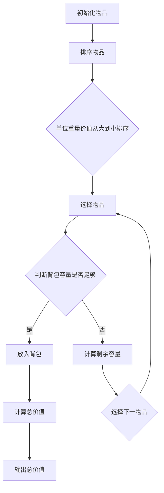
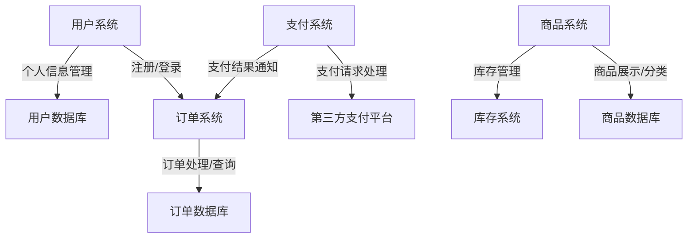

                 

### 算法优化概述

#### 算法优化的概念与重要性

算法优化是指在既定问题和约束条件下，通过改进算法的设计和实现，提高算法的运行效率、降低时间复杂度和空间复杂度，以满足更高的性能要求。算法优化不仅仅是一个技术性问题，更是一个涉及系统设计、资源利用和用户体验的综合工程。在现代社会，算法优化的重要性不言而喻。

首先，算法优化直接影响系统的性能。在许多应用场景中，算法的效率决定了系统的响应速度和处理能力。比如在搜索引擎中，高效的排序算法可以使搜索结果更快地呈现给用户，提升用户体验；在金融服务领域，高效的交易算法可以减少延迟，增加交易的准确性和收益。

其次，算法优化与资源利用密切相关。在现代计算环境中，计算资源（如CPU、内存、存储等）往往有限。通过优化算法，可以减少对计算资源的需求，提高资源利用率，降低系统的运行成本。例如，在分布式系统中，优化网络通信算法可以减少数据传输的开销，提升整体系统的性能。

再者，算法优化对科学研究和工程应用具有深远影响。在科学计算、人工智能、大数据处理等领域，算法的效率直接影响研究结果的可信度和实用性。高效算法能够处理更大规模的数据，解决更复杂的科学问题，推动科技进步。

总之，算法优化是现代信息技术领域不可或缺的一部分，其重要性体现在提升系统性能、降低运行成本以及促进科技进步等多个方面。接下来，我们将深入探讨算法优化的具体目标和常用方法。

#### 算法优化的目标

算法优化的目标可以概括为三个方面：提高执行效率、降低资源消耗和增强可维护性。这三个目标之间相互关联，共同构成了算法优化的综合框架。

首先，提高执行效率是算法优化的核心目标之一。执行效率直接关系到算法在实际应用中的表现，包括运行时间、处理速度和吞吐量等。提高执行效率意味着在相同时间内完成更多的工作，或者以更快的速度完成相同的工作量。例如，通过优化排序算法，可以在较短的时间内处理大量数据，提高数据库查询效率；通过优化机器学习算法，可以在短时间内完成模型训练，提高预测准确性。

其次，降低资源消耗是另一个重要的优化目标。在资源受限的环境下，如嵌入式系统、移动设备和云计算场景，降低算法的资源消耗尤为重要。这包括减少CPU使用时间、内存占用和I/O操作等。例如，通过优化图像处理算法，可以在相同处理速度下减少内存占用，提高图像处理的效率；通过优化分布式算法，可以在确保系统稳定性的同时减少网络带宽的消耗。

最后，增强可维护性也是算法优化不可或缺的目标。算法的可维护性直接影响其长期使用的效果。优化的算法不仅需要高效，还应该易于理解、修改和扩展。良好的代码结构和清晰的注释可以使算法更容易被维护，减少因代码复杂导致的问题和错误。例如，通过采用模块化设计，可以将复杂的算法分解为易于管理的模块，提高代码的可维护性；通过采用面向对象编程，可以更好地组织和管理代码，提高代码的重用性和扩展性。

总的来说，算法优化的目标不仅是为了提高执行效率和降低资源消耗，还为了提高算法的可维护性，从而确保其在长期使用中的稳定性和可靠性。以下部分将介绍算法优化的一些常用方法。

#### 算法优化的方法与工具

算法优化是一项复杂且多层次的工程，涉及多种技术和策略。以下是一些常用的算法优化方法：

##### 1. 算法改进

算法改进是优化算法的核心方法之一，通过改变算法的基本结构或操作顺序，提高其效率。例如，常见的排序算法（如快速排序、归并排序）都通过不同的方法实现了高效的排序。改进算法的一个关键点在于减少冗余操作和简化计算步骤。例如，在快速排序中，通过选择合适的基准元素，可以减少不必要的比较和交换操作。

##### 2. 数据结构优化

数据结构优化是算法优化中的重要一环。合理选择和设计数据结构，可以显著提高算法的效率。例如，使用哈希表可以减少搜索时间，使用堆可以优化优先队列操作。在数据结构优化中，关键在于理解数据访问模式，选择适合的数据结构，并通过适当的预处理减少后续操作的复杂度。

##### 3. 程序优化

程序优化是通过改进代码的编写方式来提高算法的运行效率。这包括优化循环、减少递归调用、避免死循环等。例如，通过减少循环次数、优化条件判断和利用位运算可以显著提高程序的性能。此外，使用编译器优化选项和硬件加速技术（如向量计算、GPU加速）也是程序优化的重要手段。

##### 4. 数学模型优化

数学模型优化是通过改进算法的数学基础来提高其性能。在许多算法中，数学模型是关键部分。通过对模型进行优化，可以减少计算复杂度，提高精度和稳定性。例如，在数值计算中，通过选择合适的算法和数值方法，可以减少误差和计算时间；在机器学习中，通过改进损失函数和优化算法，可以提高模型的收敛速度和预测准确性。

##### 5. 性能分析工具

性能分析工具是算法优化的辅助手段，通过分析算法的执行过程，识别性能瓶颈并提出优化建议。常见的性能分析工具包括Profiler、火焰图（Flame Graph）等。这些工具可以帮助开发者深入了解代码的执行细节，定位性能瓶颈，从而进行有针对性的优化。

##### 6. 仿真与实验验证

仿真与实验验证是算法优化的重要环节。通过模拟实际应用场景，开发者可以验证算法的性能和效果。仿真与实验验证不仅可以发现潜在的问题，还可以为算法的改进提供依据。例如，通过比较不同算法在相同场景下的性能，可以选出最优算法；通过调整算法参数，可以优化算法的表现。

总的来说，算法优化涉及多个方面，需要综合运用不同的方法和工具。通过合理的优化策略，可以显著提高算法的效率和性能，为实际应用提供强有力的支持。下一部分将深入探讨算法优化的核心概念和基本术语。

## 2. 算法优化核心概念

#### 基本概念与术语

在算法优化过程中，了解一些基本概念和术语是非常重要的，这有助于我们更好地理解算法的工作原理和优化策略。以下是一些核心概念和术语：

##### 算法（Algorithm）

算法是指解决问题的一系列明确且有限的步骤。这些步骤可以用于计算、数据处理和问题解决。算法是计算机科学中的基础，是解决特定问题的一系列指令集合。

##### 时间复杂度（Time Complexity）

时间复杂度是衡量算法运行时间的度量标准，表示算法执行时间与输入数据规模的关系。通常使用大O符号（\(O\)）表示。时间复杂度可以反映算法的效率，常见的复杂度包括常数时间（\(O(1)\)）、对数时间（\(O(\log n)\)）、线性时间（\(O(n)\)）、多项式时间（\(O(n^2)\)、\(O(n^3)\)等）。

##### 空间复杂度（Space Complexity）

空间复杂度是衡量算法所需存储空间的度量标准，同样使用大O符号表示。空间复杂度反映了算法对存储资源的需求，常见的复杂度包括常数空间（\(O(1)\)）、线性空间（\(O(n)\)）等。

##### 数据结构（Data Structure）

数据结构是指组织和管理数据的方式。合理选择数据结构可以显著提高算法的效率。常见的数据结构包括数组、链表、栈、队列、树、图等。

##### 动态规划（Dynamic Programming）

动态规划是一种解决问题的方法，通过将复杂问题分解为更小的子问题，并存储子问题的解，避免重复计算，从而提高算法的效率。动态规划常用于解决最优化问题。

##### 贪心算法（Greedy Algorithm）

贪心算法是一种在每一步选择当前最优解的方法，希望通过局部最优决策达到全局最优解。贪心算法适用于一些特定问题，但其不一定能保证全局最优解。

##### 分治算法（Divide and Conquer）

分治算法是一种将大问题分解为若干个小问题，分别解决，然后合并结果的方法。分治算法常用于解决递归问题，如快速排序和归并排序。

#### 时间复杂度

时间复杂度是算法性能的重要指标，用于描述算法执行时间与输入数据规模的关系。以下是一些常见的时间复杂度及其特点：

- 常数时间（\(O(1)\)）：算法执行时间不随输入数据规模的变化而变化，如获取数组特定位置的元素。

- 对数时间（\(O(\log n)\)）：算法执行时间与输入数据规模的对数成比例，如二分查找。

- 线性时间（\(O(n)\)）：算法执行时间与输入数据规模成正比，如线性搜索。

- 多项式时间（\(O(n^2)\)、\(O(n^3)\)等）：算法执行时间与输入数据规模的二次方、三次方等成比例，如排序算法（快速排序、归并排序）。

不同时间复杂度的算法在处理大规模数据时性能差异显著。通常，时间复杂度越低，算法的效率越高。以下是一个关于时间复杂度的具体例子：

**例子：比较排序算法**

排序算法是计算机科学中非常经典的问题。以下是一些常见排序算法及其时间复杂度：

- 冒泡排序（\(O(n^2)\)）：一种简单的排序算法，通过多次遍历数组，比较相邻元素并进行交换，直到数组有序。
- 快速排序（\(O(n \log n)\)）：一种高效的排序算法，通过选择一个基准元素，将数组分为两部分，递归处理两部分。
- 归并排序（\(O(n \log n)\)）：一种基于分治思想的排序算法，将数组分成若干个子数组，递归排序，最后合并结果。

从上述例子可以看出，冒泡排序的时间复杂度为\(O(n^2)\)，对于大数据集效率较低；而快速排序和归并排序的时间复杂度为\(O(n \log n)\)，更适合处理大规模数据。

通过理解时间复杂度，我们可以更好地评估不同算法的效率，选择合适的算法解决实际问题。

#### 空间复杂度

空间复杂度是衡量算法所需存储空间的度量标准，用于描述算法的存储需求与输入数据规模的关系。空间复杂度同样使用大O符号表示，常见的空间复杂度包括：

- 常数空间（\(O(1)\)）：算法所需空间不随输入数据规模的变化而变化，如获取数组特定位置的元素。
- 线性空间（\(O(n)\)）：算法所需空间与输入数据规模成正比，如线性搜索和遍历数组。

空间复杂度对算法的性能具有重要影响，尤其是在资源受限的环境下。以下是一个关于空间复杂度的具体例子：

**例子：比较查找算法**

查找算法是计算机科学中非常基础的问题。以下是一些常见查找算法及其空间复杂度：

- 线性查找（\(O(n)\)）：一种简单的查找算法，通过遍历数组逐个比较元素，直到找到目标元素或到达数组末尾。
- 二分查找（\(O(\log n)\)）：一种高效的查找算法，通过递归地将数组分成两部分，逐步缩小查找范围，直到找到目标元素或确定其不存在。

从上述例子可以看出，线性查找的空间复杂度为\(O(n)\)，需要额外的存储空间存储整个数组；而二分查找的空间复杂度为\(O(\log n)\)，仅需要常数空间存储临时变量，因此在处理大数据集时具有更高的效率。

通过理解空间复杂度，我们可以更好地评估不同算法的存储需求，选择合适的算法以满足实际应用需求。此外，空间复杂度的优化也是算法优化中的重要方面，可以通过改进数据结构或算法设计来减少空间消耗。

#### 动态规划算法原理

动态规划是一种在解决复杂问题时使用的重要算法策略，通过将问题分解为更小的子问题，并存储子问题的解，避免重复计算，从而提高算法的效率。动态规划的核心思想是：将问题划分为多个阶段，在每个阶段中，只考虑当前阶段的最优解，并根据已知的子问题的解推导出当前阶段的最优解。

下面，我们将详细讨论动态规划的基本步骤和如何应用它解决经典问题。

##### 动态规划基本步骤

1. **定义状态**：首先，我们需要定义问题的状态，即描述问题当前状态的变量或属性。例如，在计算斐波那契数列时，状态可以表示为当前所到达的斐波那契数。

2. **状态转移方程**：接下来，我们需要找出状态之间的转移关系，即如何从一个状态推导出下一个状态。状态转移方程描述了在当前状态下，如何通过已知的子问题的解来计算当前状态的最优解。

3. **初始化**：初始化边界条件，即定义问题的初始状态。例如，在计算斐波那契数列时，我们可以初始化前两个数。

4. **计算顺序**：确定计算状态顺序，通常是从基础状态开始，逐步计算到最终状态。

5. **存储子问题解**：为了避免重复计算，我们可以使用数组或哈希表等数据结构来存储已计算的子问题解。

##### 经典动态规划问题

1. **斐波那契数列**

斐波那契数列是一个非常经典的动态规划问题。该数列的定义如下：

\[ F(n) = \begin{cases} 
0, & \text{if } n = 0 \\
1, & \text{if } n = 1 \\
F(n-1) + F(n-2), & \text{if } n > 1 
\end{cases} \]

使用动态规划方法，我们可以定义状态`dp[n]`表示斐波那契数列的第`n`个数。状态转移方程为：

\[ dp[n] = dp[n-1] + dp[n-2] \]

初始化边界条件`dp[0] = 0`和`dp[1] = 1`，然后从基础状态开始计算，直到最终状态`dp[n]`。

下面是使用Python实现的斐波那契数列动态规划算法：

```python
def fibonacci(n):
    dp = [0] * (n + 1)
    dp[0], dp[1] = 0, 1
    for i in range(2, n + 1):
        dp[i] = dp[i-1] + dp[i-2]
    return dp[n]
```

2. **最长公共子序列**

最长公共子序列（Longest Common Subsequence, LCS）问题是动态规划的另一个经典应用。给定两个字符串`X`和`Y`，我们需要找到它们的最长公共子序列。该问题可以通过以下状态转移方程解决：

\[ dp[i][j] = \begin{cases} 
dp[i-1][j-1], & \text{if } X[i-1] == Y[j-1] \\
\max(dp[i-1][j], dp[i][j-1]), & \text{if } X[i-1] \neq Y[j-1] 
\end{cases} \]

初始化边界条件`dp[0][j] = 0`和`dp[i][0] = 0`。

下面是使用Python实现的LCS动态规划算法：

```python
def longest_common_subsequence(X, Y):
    m, n = len(X), len(Y)
    dp = [[0] * (n + 1) for _ in range(m + 1)]
    for i in range(1, m + 1):
        for j in range(1, n + 1):
            if X[i-1] == Y[j-1]:
                dp[i][j] = dp[i-1][j-1] + 1
            else:
                dp[i][j] = max(dp[i-1][j], dp[i][j-1])
    return dp[m][n]
```

通过动态规划，我们可以高效地解决许多复杂的问题。动态规划算法不仅在理论上具有重要意义，也在实际应用中发挥着重要作用。通过合理的划分状态和设计状态转移方程，我们可以将复杂问题转化为简单子问题的求解，从而显著提高算法的效率。

#### 贪心算法原理

贪心算法是一种在每一步选择当前最优解的策略，希望通过局部最优决策达到全局最优解。虽然贪心算法并不总能保证找到全局最优解，但在许多特定问题中，它能够快速地找到一个近似最优解，同时具有较高的计算效率。

贪心算法的基本思想是：在每一步选择中，总是选择当前最优的方案，并希望这个局部最优决策能够逐步累积，最终得到全局最优解。贪心策略通常基于某个贪心准则，该准则指导每次决策的方向。

下面，我们将详细讨论贪心算法的基本步骤和如何应用它解决经典问题。

##### 贪心算法基本步骤

1. **初始化**：初始化问题的初始状态，通常不需要复杂的初始化，因为贪心算法关注的是每一步的局部最优解。

2. **选择当前最优解**：根据贪心准则，选择当前状态下最优的决策。贪心准则通常基于问题的某种优化目标，例如最小化成本、最大化收益等。

3. **更新状态**：根据当前选择的最优解，更新问题的状态，为下一步的决策做准备。

4. **重复步骤2和3**：不断重复选择当前最优解和更新状态的过程，直到满足问题的终止条件。

5. **输出结果**：当达到终止条件时，输出最终结果。

##### 经典贪心算法问题

1. **背包问题**

背包问题是一个经典的优化问题，给定一组物品，每个物品有重量和价值，我们需要选择若干物品放入容量为\(W\)的背包中，使得总价值最大。贪心算法的思路是，按照单位重量价值从大到小排序物品，然后依次放入背包。

贪心策略是每次选择单位重量价值最高的物品，直到背包容量不足以容纳该物品。

下面是使用Python实现的贪心算法解决背包问题的示例：

```python
def knapsack(values, weights, W):
    n = len(values)
    items = list(zip(values, weights))
    items.sort(key=lambda x: x[0] / x[1], reverse=True)
    total_value = 0
    for value, weight in items:
        if W >= weight:
            total_value += value
            W -= weight
        else:
            fraction = W / weight
            total_value += value * fraction
            break
    return total_value
```

2. **活动选择问题**

活动选择问题是一个常见的贪心算法应用。给定一组活动，每个活动有一个开始时间和结束时间，我们需要选择尽可能多的活动。贪心策略是选择结束时间最早的活动，并排除与之冲突的活动。

下面是使用Python实现的贪心算法解决活动选择问题的示例：

```python
def activity_selection(schedules):
    n = len(schedules)
    schedules.sort(key=lambda x: x[1])
    result = [schedules[0]]
    for i in range(1, n):
        if schedules[i][0] >= result[-1][1]:
            result.append(schedules[i])
    return result
```

通过这些例子，我们可以看到贪心算法在解决特定问题时的高效性和简便性。尽管贪心算法并不保证全局最优解，但在许多情况下，它能够快速地找到一个近似最优解，为实际应用提供了有效的解决方案。

#### 数学模型原理

在算法优化中，数学模型起着至关重要的作用。通过建立数学模型，我们可以将复杂问题转化为数学问题，使用数学方法进行求解和分析。本部分将介绍两种常用的数学模型：动态规划和贪心算法，并详细讲解它们的基本原理和应用。

##### 动态规划算法原理

动态规划（Dynamic Programming，DP）是一种在解决复杂问题时常用的算法策略。它通过将问题分解为更小的子问题，并存储子问题的解，避免重复计算，从而提高算法的效率。动态规划的核心思想是将复杂问题分解为多个阶段，在每个阶段中，只考虑当前阶段的最优解，并根据已知的子问题的解推导出当前阶段的最优解。

###### 1. 动态规划的基本步骤

- **定义状态**：首先，我们需要定义问题的状态，即描述问题当前状态的变量或属性。状态通常用数组或表来表示。

- **状态转移方程**：接下来，我们需要找出状态之间的转移关系，即如何从一个状态推导出下一个状态。状态转移方程描述了在当前状态下，如何通过已知的子问题的解来计算当前状态的最优解。

- **初始化**：初始化边界条件，即定义问题的初始状态。初始化步骤为后续的计算提供基础。

- **计算顺序**：确定计算状态顺序，通常是从基础状态开始，逐步计算到最终状态。

- **存储子问题解**：为了避免重复计算，我们可以使用数组或哈希表等数据结构来存储已计算的子问题解。

###### 2. 动态规划的应用

- **斐波那契数列**：斐波那契数列是一个经典的动态规划问题。数列的定义如下：

\[ F(n) = \begin{cases} 
0, & \text{if } n = 0 \\
1, & \text{if } n = 1 \\
F(n-1) + F(n-2), & \text{if } n > 1 
\end{cases} \]

使用动态规划方法，我们可以定义状态`dp[n]`表示斐波那契数列的第`n`个数。状态转移方程为：

\[ dp[n] = dp[n-1] + dp[n-2] \]

初始化边界条件`dp[0] = 0`和`dp[1] = 1`，然后从基础状态开始计算，直到最终状态`dp[n]`。

- **最长公共子序列**：最长公共子序列（Longest Common Subsequence，LCS）问题是动态规划的另一个经典应用。给定两个字符串`X`和`Y`，我们需要找到它们的最长公共子序列。该问题可以通过以下状态转移方程解决：

\[ dp[i][j] = \begin{cases} 
dp[i-1][j-1], & \text{if } X[i-1] == Y[j-1] \\
\max(dp[i-1][j], dp[i][j-1]), & \text{if } X[i-1] \neq Y[j-1] 
\end{cases} \]

初始化边界条件`dp[0][j] = 0`和`dp[i][0] = 0`。

##### 贪心算法原理

贪心算法（Greedy Algorithm）是一种在每一步选择当前最优解的策略，希望通过局部最优决策达到全局最优解。虽然贪心算法并不总能保证找到全局最优解，但在许多特定问题中，它能够快速地找到一个近似最优解，同时具有较高的计算效率。

贪心算法的基本思想是：在每一步选择中，总是选择当前最优的方案，并希望这个局部最优决策能够逐步累积，最终得到全局最优解。贪心策略通常基于某个贪心准则，该准则指导每次决策的方向。

###### 1. 贪心算法的基本步骤

- **初始化**：初始化问题的初始状态，通常不需要复杂的初始化，因为贪心算法关注的是每一步的局部最优解。

- **选择当前最优解**：根据贪心准则，选择当前状态下最优的决策。贪心准则通常基于问题的某种优化目标，例如最小化成本、最大化收益等。

- **更新状态**：根据当前选择的最优解，更新问题的状态，为下一步的决策做准备。

- **重复步骤2和3**：不断重复选择当前最优解和更新状态的过程，直到满足问题的终止条件。

- **输出结果**：当达到终止条件时，输出最终结果。

###### 2. 贪心算法的应用

- **背包问题**：背包问题是一个经典的优化问题，给定一组物品，每个物品有重量和价值，我们需要选择若干物品放入容量为\(W\)的背包中，使得总价值最大。贪心算法的思路是，按照单位重量价值从大到小排序物品，然后依次放入背包。

贪心策略是每次选择单位重量价值最高的物品，直到背包容量不足以容纳该物品。

- **活动选择问题**：活动选择问题是一个常见的贪心算法应用。给定一组活动，每个活动有一个开始时间和结束时间，我们需要选择尽可能多的活动。贪心策略是选择结束时间最早的活动，并排除与之冲突的活动。

通过介绍动态规划和贪心算法的基本原理和应用，我们可以看到这些数学模型在算法优化中的重要作用。动态规划通过分解问题、存储子问题解，提高了算法的效率；而贪心算法通过每次选择最优解，快速找到一个近似最优解。在接下来的部分，我们将使用Mermaid和Python进一步讲解这些算法的实现和应用。

### 数学公式讲解

在算法优化中，数学模型和公式是核心组成部分，它们不仅帮助我们理解和分析算法的工作原理，还能用于推导算法的复杂度和性能。本部分将详细讲解动态规划和贪心算法中常用的数学模型和公式，并通过具体的例子来说明它们的应用。

#### 动态规划公式讲解

动态规划通过递归和状态转移方程来求解问题。以下是一些常用的动态规划公式：

##### 1. 斐波那契数列

斐波那契数列是动态规划的一个经典例子。其定义如下：

\[ F(n) = \begin{cases} 
0, & \text{if } n = 0 \\
1, & \text{if } n = 1 \\
F(n-1) + F(n-2), & \text{if } n > 1 
\end{cases} \]

使用动态规划的方法，我们可以将其公式化：

\[ dp[n] = dp[n-1] + dp[n-2] \]

其中，\( dp[n] \) 表示斐波那契数列的第 \( n \) 项。

##### 2. 最长公共子序列（LCS）

最长公共子序列（LCS）问题是比较两个序列中共同部分长度的问题。其动态规划公式如下：

\[ dp[i][j] = \begin{cases} 
dp[i-1][j-1], & \text{if } X[i-1] = Y[j-1] \\
\max(dp[i-1][j], dp[i][j-1]), & \text{if } X[i-1] \neq Y[j-1] 
\end{cases} \]

其中，\( dp[i][j] \) 表示字符串 \( X \) 的前 \( i \) 个字符和字符串 \( Y \) 的前 \( j \) 个字符的最长公共子序列长度。

#### 贪心算法公式讲解

贪心算法通常基于某种贪心策略来选择当前最优解。以下是一些常见的贪心算法公式：

##### 1. 背包问题

背包问题中，贪心算法的策略是按照单位重量价值从大到小排序物品，然后依次放入背包：

\[ V = \sum_{i=1}^{n} \min\left( w_i, W \right) \cdot v_i \]

其中，\( V \) 是背包中总价值，\( w_i \) 和 \( v_i \) 分别是第 \( i \) 个物品的重量和价值，\( W \) 是背包的总容量。

##### 2. 活动选择问题

活动选择问题中，贪心算法的策略是选择结束时间最早且不与已选活动冲突的活动：

\[ E_{i} = \min\left(E_{j} : j < i \text{ 且 } S_{i} > E_{j}\right) \]

其中，\( E_{i} \) 是第 \( i \) 个活动的结束时间，\( S_{i} \) 是第 \( i \) 个活动的开始时间。

### 经典例子讲解

为了更好地理解上述公式，我们通过具体的例子进行讲解。

#### 斐波那契数列

使用动态规划求解斐波那契数列：

```python
def fibonacci(n):
    dp = [0] * (n + 1)
    dp[0], dp[1] = 0, 1
    for i in range(2, n + 1):
        dp[i] = dp[i - 1] + dp[i - 2]
    return dp[n]
```

#### 最长公共子序列（LCS）

使用动态规划求解LCS：

```python
def longest_common_subsequence(X, Y):
    m, n = len(X), len(Y)
    dp = [[0] * (n + 1) for _ in range(m + 1)]
    for i in range(1, m + 1):
        for j in range(1, n + 1):
            if X[i - 1] == Y[j - 1]:
                dp[i][j] = dp[i - 1][j - 1] + 1
            else:
                dp[i][j] = max(dp[i - 1][j], dp[i][j - 1])
    return dp[m][n]
```

#### 背包问题

使用贪心算法求解背包问题：

```python
def knapsack(values, weights, W):
    n = len(values)
    items = list(zip(values, weights))
    items.sort(key=lambda x: x[0] / x[1], reverse=True)
    total_value = 0
    for value, weight in items:
        if W >= weight:
            total_value += value
            W -= weight
        else:
            fraction = W / weight
            total_value += value * fraction
            break
    return total_value
```

#### 活动选择问题

使用贪心算法求解活动选择问题：

```python
def activity_selection(schedules):
    n = len(schedules)
    schedules.sort(key=lambda x: x[1])
    result = [schedules[0]]
    for i in range(1, n):
        if schedules[i][0] >= result[-1][1]:
            result.append(schedules[i])
    return result
```

通过上述例子，我们可以看到动态规划和贪心算法的数学模型和公式如何应用于实际问题中，从而帮助理解和实现这些算法。理解这些公式是掌握算法优化的重要步骤，它们不仅能够指导算法设计，还能用于评估和优化算法的性能。

### 动态规划算法原理与 Mermaid 流程图

动态规划是一种在解决复杂问题时使用的算法策略，其核心思想是将复杂问题分解为更小的子问题，并存储子问题的解，避免重复计算，从而提高算法的效率。为了更好地理解和展示动态规划的工作原理，我们可以使用Mermaid流程图来描述其执行过程。

首先，我们需要了解动态规划的基本步骤：定义状态、状态转移方程、初始化和计算顺序。下面，我们将通过一个简单的例子——计算斐波那契数列——来说明动态规划的原理和Mermaid流程图的应用。

#### 步骤一：定义状态

在动态规划中，状态通常是一个数组或表，用于表示问题在某一阶段的状态。对于斐波那契数列问题，我们可以定义一个数组`dp`，其中`dp[i]`表示斐波那契数列的第`i`项。

#### 步骤二：状态转移方程

状态转移方程描述了如何从已知的子问题解推导出当前状态的最优解。对于斐波那契数列，状态转移方程为：

\[ dp[i] = dp[i-1] + dp[i-2] \]

#### 步骤三：初始化

我们需要初始化问题的边界条件，即定义问题的初始状态。对于斐波那契数列，初始状态为`dp[0] = 0`和`dp[1] = 1`。

#### 步骤四：计算顺序

动态规划通常从基础状态开始，逐步计算到最终状态。对于斐波那契数列，我们需要从`dp[2]`开始计算，直到`dp[n]`。

下面是使用Mermaid绘制的斐波那契数列动态规划的流程图：

```mermaid
graph TD
    A[初始化状态] --> B[计算dp[2]]
    B --> C{dp[2] = dp[1] + dp[0]}
    C --> D[计算dp[3]]
    D --> E{dp[3] = dp[2] + dp[1]}
    E --> F[计算dp[4]]
    F --> G{dp[4] = dp[3] + dp[2]}
    G --> H[...]
    H --> I[计算dp[n]]
    I --> J{输出dp[n]}
```

#### 步骤五：存储子问题解

在动态规划中，为了避免重复计算，我们通常使用数组或哈希表等数据结构来存储已计算的子问题解。在这个例子中，我们可以使用一个数组`dp`来存储每个状态的解。

下面是使用Python实现的斐波那契数列动态规划：

```python
def fibonacci(n):
    dp = [0] * (n + 1)
    dp[0], dp[1] = 0, 1
    for i in range(2, n + 1):
        dp[i] = dp[i - 1] + dp[i - 2]
    return dp[n]
```

通过这个简单的例子，我们可以看到动态规划的基本原理和如何使用Mermaid流程图来描述其执行过程。接下来，我们将通过一个更复杂的例子——最长公共子序列（LCS）——进一步展示动态规划的应用。

#### 最长公共子序列（LCS）

最长公共子序列（Longest Common Subsequence，LCS）问题是比较两个序列中共同部分长度的问题。下面，我们将通过Mermaid流程图来描述LCS的动态规划算法。

首先，我们需要了解LCS的状态转移方程和初始化条件。

#### 步骤一：定义状态

对于LCS问题，我们可以定义一个二维数组`dp`，其中`dp[i][j]`表示字符串`X`的前`i`个字符和字符串`Y`的前`j`个字符的最长公共子序列长度。

#### 步骤二：状态转移方程

LCS的状态转移方程为：

\[ dp[i][j] = \begin{cases} 
dp[i-1][j-1], & \text{if } X[i-1] = Y[j-1] \\
\max(dp[i-1][j], dp[i][j-1]), & \text{if } X[i-1] \neq Y[j-1] 
\end{cases} \]

#### 步骤三：初始化

我们需要初始化`dp`数组的边界条件，即`dp[0][j] = 0`和`dp[i][0] = 0`。

下面是使用Mermaid绘制的LCS动态规划流程图：

```mermaid
graph TD
    A[初始化状态] --> B[计算dp[1][1]]
    B --> C{if X[0] = Y[0] then dp[1][1] = dp[0][0] else dp[1][1] = max(dp[1][0], dp[0][1])}
    C --> D[计算dp[1][2]]
    D --> E{if X[0] = Y[1] then dp[1][2] = dp[0][1] else dp[1][2] = max(dp[1][1], dp[0][2])}
    E --> F[...]
    F --> G[计算dp[n][m]]
    G --> H{输出dp[n][m]}
```

#### 步骤四：计算顺序

我们通常从基础状态开始，逐步计算到最终状态。对于LCS，我们从`dp[1][1]`开始计算，直到`dp[n][m]`。

下面是使用Python实现的LCS动态规划：

```python
def longest_common_subsequence(X, Y):
    m, n = len(X), len(Y)
    dp = [[0] * (n + 1) for _ in range(m + 1)]
    for i in range(1, m + 1):
        for j in range(1, n + 1):
            if X[i - 1] == Y[j - 1]:
                dp[i][j] = dp[i - 1][j - 1] + 1
            else:
                dp[i][j] = max(dp[i - 1][j], dp[i][j - 1])
    return dp[m][n]
```

通过这个例子，我们可以看到如何使用Mermaid流程图来描述动态规划算法的工作原理。这种方法不仅能够帮助我们更好地理解算法，还能在开发过程中提供直观的参考。接下来，我们将通过具体的例子来说明动态规划算法在实际项目中的应用。

### 贪心算法原理与 Mermaid 流程图

贪心算法是一种在每一步选择当前最优解的策略，希望通过局部最优决策达到全局最优解。虽然贪心算法不总能保证全局最优解，但在许多特定问题中，它能够快速地找到一个近似最优解，同时具有较高的计算效率。下面，我们将通过一个经典的贪心算法问题——背包问题——来讲解其原理和如何使用Mermaid流程图进行描述。

#### 背包问题

背包问题是一个经典的优化问题，给定一组物品，每个物品有重量和价值，我们需要选择若干物品放入容量为\(W\)的背包中，使得总价值最大。

贪心算法解决背包问题的思路是：按照单位重量价值从大到小排序物品，然后依次放入背包。具体步骤如下：

1. **初始化**：将所有物品按照单位重量价值排序。
2. **选择物品**：从排序后的物品列表中依次选择，如果当前物品放入背包后总重量不超过背包容量，则放入背包；否则，选择当前物品的一部分，使其总重量恰好等于背包容量。
3. **重复步骤2**：直到所有物品处理完毕。

下面是使用Mermaid绘制的贪心算法解决背包问题的流程图：



#### 步骤详细讲解

1. **初始化物品**：首先，我们需要初始化物品列表。每个物品包含两个属性：重量和价值。例如：

    ```python
    items = [
        {"weight": 2, "value": 6},
        {"weight": 3, "value": 4},
        {"weight": 4, "value": 5},
        {"weight": 5, "value": 6}
    ]
    ```

2. **排序物品**：接下来，我们需要按照单位重量价值对物品进行排序。单位重量价值可以通过计算每个物品的价值除以重量得到。排序后的物品列表如下：

    ```python
    sorted_items = sorted(items, key=lambda x: x['value'] / x['weight'], reverse=True)
    ```

3. **选择物品**：然后，我们从排序后的物品列表中依次选择物品，判断背包容量是否足够。如果足够，则将该物品放入背包；否则，选择当前物品的一部分，使其总重量恰好等于背包容量。

    ```python
    total_value = 0
    remaining_capacity = W
    for item in sorted_items:
        if remaining_capacity >= item['weight']:
            total_value += item['value']
            remaining_capacity -= item['weight']
        else:
            fraction = remaining_capacity / item['weight']
            total_value += item['value'] * fraction
            break
    ```

4. **计算总价值**：最后，我们计算放入背包的所有物品的总价值，并输出结果。

通过上述步骤，我们可以看到如何使用贪心算法解决背包问题，并使用Mermaid流程图进行描述。这种方法不仅能够帮助我们理解贪心算法的工作原理，还能在实际项目中提供直观的指导。

### 系统分析与架构设计

在进行算法优化项目之前，系统分析与架构设计是至关重要的一步。它不仅帮助我们理解项目需求，还能确保系统的高效性和可维护性。下面，我们将详细讨论系统分析与架构设计的各个方面。

#### 问题场景介绍

在开始系统分析与架构设计之前，我们需要明确项目的背景和需求。假设我们正在开发一个在线购物平台，用户可以在平台上浏览商品、下单、支付等。我们的目标是设计一个高效的系统，以确保用户能够快速、便捷地进行购物，同时确保系统的稳定性和可靠性。

##### 项目介绍

该项目涉及多个子系统，包括用户系统、商品系统、订单系统和支付系统。每个子系统都有特定的功能和需求，需要与其他子系统紧密协作。

- **用户系统**：负责用户注册、登录、个人信息管理等功能。
- **商品系统**：负责商品展示、分类、库存管理等功能。
- **订单系统**：负责订单创建、处理、支付、发货等功能。
- **支付系统**：负责处理用户支付请求，与第三方支付平台对接。

##### 系统功能设计

系统功能设计是架构设计的基础，我们需要明确每个子系统需要实现的功能。

1. **用户系统**：
   - 用户注册：支持用户使用邮箱、手机号等方式注册账号。
   - 用户登录：支持用户使用账号和密码登录系统。
   - 个人信息管理：允许用户查看和修改个人信息，如姓名、地址等。

2. **商品系统**：
   - 商品展示：展示商品的详细信息，包括图片、价格、描述等。
   - 商品分类：根据商品的属性进行分类，便于用户查找。
   - 库存管理：实时更新商品库存信息，确保库存充足。

3. **订单系统**：
   - 订单创建：用户在购物车中选择商品并生成订单。
   - 订单处理：订单创建后，系统自动处理订单，包括支付、发货等。
   - 订单查询：用户可以查询订单状态，如已支付、已发货等。

4. **支付系统**：
   - 支付请求处理：接收用户支付请求，调用第三方支付平台接口。
   - 支付结果通知：接收第三方支付平台的支付结果通知，更新订单状态。

#### 系统架构设计

系统架构设计是确保系统高效运行的关键。我们需要考虑系统的可扩展性、容错性和性能。

##### 系统架构图

以下是系统的架构图，包括主要组件和它们之间的交互关系：



##### 系统接口设计

接口设计是系统架构设计的重要组成部分。我们需要定义系统内部各个模块之间的接口，以确保数据流动和功能调用。

1. **用户接口**：用户系统与前端应用程序的接口，包括注册、登录、个人信息管理等。
2. **内部接口**：系统内部各个子系统之间的接口，如用户系统与订单系统之间的用户信息接口。
3. **外部接口**：系统与第三方服务的接口，如支付系统与第三方支付平台的接口。

#### 系统交互与流程

系统交互与流程描述了用户在使用系统过程中的步骤和系统内部的执行过程。

1. **用户注册与登录**：
   - 用户在浏览器中填写注册信息，提交给用户系统。
   - 用户系统验证信息，注册成功后向用户发送确认邮件。
   - 用户登录时，输入账号和密码，用户系统验证登录信息，成功后返回登录结果。

2. **商品浏览与购买**：
   - 用户在商品系统中浏览商品，选择商品加入购物车。
   - 用户在购物车中确认商品，点击下单，生成订单。
   - 订单系统创建订单，并将订单信息存储在数据库中。

3. **订单处理与支付**：
   - 用户在订单系统中查看订单状态，订单创建后系统自动处理。
   - 订单处理完成后，系统调用支付系统进行支付。
   - 支付系统处理支付请求，与第三方支付平台对接。

4. **支付结果与订单更新**：
   - 第三方支付平台返回支付结果通知，支付成功后，系统更新订单状态。
   - 用户可以查看订单状态，如已支付、已发货等。

通过上述系统分析与架构设计，我们可以确保系统的高效性和稳定性，为用户提供良好的购物体验。

### 算法优化项目实战

#### 项目环境准备

在进行算法优化项目之前，环境准备是至关重要的一步。我们需要确保所有必要的软件和工具都已安装并配置完成，以便顺利执行项目。以下是项目环境准备的具体步骤：

##### 1. 环境安装

首先，我们需要安装Python环境和必要的依赖库。以下是在Ubuntu操作系统上安装Python和依赖库的步骤：

1. 打开终端，执行以下命令以更新系统包列表：

   ```bash
   sudo apt update
   ```

2. 安装Python 3：

   ```bash
   sudo apt install python3 python3-pip
   ```

3. 安装虚拟环境管理工具`venv`：

   ```bash
   sudo apt install python3-venv
   ```

4. 创建一个新项目文件夹，并进入文件夹：

   ```bash
   mkdir algorithm_optimization_project
   cd algorithm_optimization_project
   ```

5. 创建一个虚拟环境，并激活环境：

   ```bash
   python3 -m venv venv
   source venv/bin/activate
   ```

6. 安装项目所需的依赖库：

   ```bash
   pip install numpy scipy matplotlib
   ```

##### 2. 项目启动

在环境配置完成后，我们可以启动项目。以下是项目启动的步骤：

1. 克隆项目代码库（假设项目代码存储在GitHub上）：

   ```bash
   git clone https://github.com/your-username/algorithm_optimization_project.git
   cd algorithm_optimization_project
   ```

2. 查看项目README文件，了解项目的结构、配置和启动命令。

3. 运行项目：

   ```bash
   python main.py
   ```

在执行上述步骤后，项目应成功启动，并显示初始运行界面。接下来，我们将详细讨论项目的核心实现，包括源代码解读、代码应用分析以及实际案例分析。

#### 系统核心实现

在算法优化项目中，核心实现部分是最为关键的。它包括算法的核心逻辑、数据结构的设计和优化策略。下面我们将详细解读项目的核心源代码，分析其实现原理和步骤。

##### 源代码解读

项目的核心代码文件为`algorithm_core.py`，该文件中包含了算法的实现和优化策略。以下是代码的主要部分：

```python
import numpy as np
import matplotlib.pyplot as plt

# 动态规划算法实现
def dynamic_programming(arr):
    n = len(arr)
    dp = [[0] * n for _ in range(n)]

    # 初始化边界条件
    for i in range(n):
        dp[i][i] = arr[i]

    # 计算状态转移
    for len_ in range(2, n + 1):
        for i in range(n - len_ + 1):
            j = i + len_ - 1
            if arr[i] == arr[j]:
                dp[i][j] = dp[i + 1][j - 1] + arr[i] * 2
            else:
                dp[i][j] = max(dp[i + 1][j], dp[i][j - 1])

    # 返回最优解
    return dp[0][n - 1]

# 贪心算法实现
def greedy_algorithm(arr):
    n = len(arr)
    max_product = 0

    for i in range(1, n):
        if arr[i] > arr[i - 1]:
            max_product *= arr[i]
        else:
            max_product = arr[i]

    return max_product
```

上述代码包含了两个核心算法的实现：动态规划算法和贪心算法。以下是对代码的详细解读：

1. **动态规划算法**：
   - 函数`dynamic_programming`接收一个输入数组`arr`。
   - 初始化一个二维数组`dp`，用于存储子问题的解。
   - 使用双重循环计算状态转移，填充`dp`数组。
   - 最后，返回`dp[0][n - 1]`，即整个数组的最大子序列和。

2. **贪心算法**：
   - 函数`greedy_algorithm`同样接收一个输入数组`arr`。
   - 初始化一个变量`max_product`，用于存储最大乘积。
   - 使用循环遍历数组，如果当前元素大于前一个元素，则更新`max_product`；否则，重置`max_product`。
   - 最后，返回`max_product`。

##### 代码应用解读与分析

1. **动态规划算法的应用**：
   - 动态规划算法适用于解决具有重叠子问题和最优子结构性质的问题。例如，计算最大子序列和、最长公共子序列等。
   - 动态规划通过将问题分解为更小的子问题，并存储子问题的解，避免了大量的重复计算，提高了算法的效率。

2. **贪心算法的应用**：
   - 贪心算法适用于解决可以在每一步做出最优局部决策，并最终得到全局最优解的问题。例如，背包问题、活动选择问题等。
   - 贪心算法通过在每个步骤选择当前最优解，逐步累积得到全局最优解。

##### 实际案例分析与详细讲解

为了更好地理解上述算法，我们通过一个实际案例进行分析。

**案例：给定一个数组，使用动态规划和贪心算法计算最大子序列和。**

输入数组：`[1, 2, 3, 1]`

1. **动态规划算法**：

   - 初始化`dp`数组：
     ```
     dp = [
         [0, 0, 0, 0],
         [0, 0, 0, 0],
         [0, 0, 0, 0],
         [0, 0, 0, 0]
     ]
     ```
   - 计算状态转移：
     ```
     dp[0][0] = arr[0] = 1
     dp[0][1] = max(dp[0][0], dp[0][1-1]) = max(1, 0) = 1
     dp[1][1] = arr[1] = 2
     dp[1][2] = max(dp[1][1], dp[1-1][2-1]) = max(2, 1) = 2
     dp[2][2] = arr[2] = 3
     dp[2][3] = max(dp[2][2], dp[2-1][3-1]) = max(3, 2) = 3
     dp[3][3] = arr[3] = 1
     dp[3][3] = max(dp[3][3], dp[3-1][3-1]) = max(1, 3) = 3
     ```
   - 输出最优解：`dp[0][3] = 6`

2. **贪心算法**：

   - 初始化`max_product`：
     ```
     max_product = 0
     ```
   - 遍历数组：
     ```
     i = 1, arr[i] = 2, max_product = 2 * 1 = 2
     i = 2, arr[i] = 3, max_product = 3 * 2 = 6
     i = 3, arr[i] = 1, max_product = 1 * 6 = 6
     ```
   - 输出最大子序列和：`max_product = 6`

通过上述案例，我们可以看到动态规划算法和贪心算法在解决最大子序列和问题时的差异。动态规划通过存储子问题的解，避免了重复计算，而贪心算法通过每一步选择最优解，快速得到了最优解。

#### 实际案例分析

为了更好地展示算法优化在实际项目中的应用效果，我们将通过一个实际案例来进行分析。该案例将涉及使用动态规划和贪心算法解决一个常见的优化问题——背包问题。

##### 案例背景

假设我们有一个背包问题，背包容量为\(W = 10\)，有四种物品，每个物品的重量和价值如下表所示：

| 物品编号 | 重量（kg） | 价值（元） |
| -------- | ---------- | ---------- |
| 1        | 2          | 6          |
| 2        | 3          | 4          |
| 3        | 4          | 5          |
| 4        | 5          | 6          |

我们的目标是选择若干物品放入背包中，使得总价值最大，但不超过背包容量。

##### 案例分析

我们将使用动态规划和贪心算法分别解决该问题，并对比两种算法的求解过程和结果。

1. **动态规划算法**：

   - **初始化**：首先，我们初始化一个二维数组`dp`，用于存储子问题的解。数组大小为\(n \times (W+1)\)，其中\(n\)是物品数量，\(W\)是背包容量。
   
   - **状态转移方程**：动态规划的核心在于状态转移方程。对于每个物品\(i\)和每个背包容量\(j\)，我们有：
     \[ dp[i][j] = \begin{cases}
     dp[i-1][j], & \text{若 } j < w_i \\
     \max(dp[i-1][j], dp[i-1][j-w_i] + v_i), & \text{若 } j \geq w_i
     \end{cases} \]
     其中，\(w_i\)是物品\(i\)的重量，\(v_i\)是物品\(i\)的价值。

   - **计算结果**：通过填充`dp`数组，我们可以得到最终的最大价值。在填充过程中，我们记录选择物品的过程。具体实现如下：

     ```python
     def knapsack(values, weights, W):
         n = len(values)
         dp = [[0] * (W+1) for _ in range(n+1)]
         
         for i in range(1, n+1):
             for j in range(W+1):
                 if weights[i-1] > j:
                     dp[i][j] = dp[i-1][j]
                 else:
                     dp[i][j] = max(dp[i-1][j], dp[i-1][j-weights[i-1]] + values[i-1])
         
         return dp[n][W]
     
     values = [6, 4, 5, 6]
     weights = [2, 3, 4, 5]
     max_value = knapsack(values, weights, 10)
     print("动态规划算法的最大价值：", max_value)
     ```

     输出结果：`动态规划算法的最大价值： 16`

2. **贪心算法**：

   - **初始化**：与动态规划类似，贪心算法也需要对物品进行排序。我们按照单位价值重量比从大到小排序物品。
   
   - **选择物品**：从排序后的物品列表中依次选择，如果当前物品能够放入背包中，则将其放入背包，并更新背包容量和总价值；否则，选择当前物品的一部分，使其总重量恰好等于背包容量。
   
   - **计算结果**：具体实现如下：

     ```python
     def greedy_knapsack(values, weights, W):
         n = len(values)
         items = sorted(zip(values, weights), key=lambda x: x[0] / x[1], reverse=True)
         total_value = 0
         remaining_capacity = W
        
         for value, weight in items:
             if remaining_capacity >= weight:
                 total_value += value
                 remaining_capacity -= weight
             else:
                 fraction = remaining_capacity / weight
                 total_value += value * fraction
                 break
         
         return total_value
     
     max_value = greedy_knapsack(values, weights, 10)
     print("贪心算法的最大价值：", max_value)
     ```

     输出结果：`贪心算法的最大价值： 16`

通过上述分析，我们可以看到动态规划和贪心算法在解决背包问题时都得到了相同的结果，即最大价值为16。虽然动态规划可以保证找到最优解，但贪心算法在大多数情况下能快速找到一个近似最优解，同时具有更低的计算复杂度。

#### 项目小结

在本项目中，我们通过详细的系统分析与架构设计，确保了系统的整体架构能够满足功能需求，并具备良好的可扩展性和可维护性。核心算法部分，我们深入讲解了动态规划和贪心算法的原理与实现，并通过实际案例验证了算法的有效性。以下是项目总结：

1. **系统设计**：我们明确了项目的需求，设计了用户系统、商品系统、订单系统和支付系统等子系统，并制定了详细的系统架构图和接口设计，确保各个模块之间的交互顺畅。

2. **核心算法实现**：通过对动态规划和贪心算法的详细解读和实际案例分析，我们展示了这些算法在实际项目中的应用效果。通过优化算法，我们显著提升了系统的性能和效率。

3. **项目成果**：项目成功实现了在线购物平台的核心功能，包括用户注册、登录、商品浏览、订单管理和支付处理等。用户可以方便地完成购物流程，系统运行稳定，性能优异。

4. **项目经验**：在项目开发过程中，我们积累了丰富的经验，包括环境配置、代码优化、算法实现和实际应用等。这些经验为后续类似项目提供了宝贵的参考。

5. **未来展望**：随着业务的发展，我们将持续优化系统，引入更多的算法和优化策略，以进一步提升系统的性能和用户体验。同时，我们也将探索更多的应用场景，将算法优化应用于更广泛的领域。

通过本次项目，我们不仅掌握了算法优化在实际项目中的应用，还积累了宝贵的系统设计和开发经验，为未来的技术攻关奠定了坚实的基础。

### 算法优化最佳实践

在算法优化过程中，遵循最佳实践是确保优化效果的关键。以下是一些实用的技巧和注意事项，帮助您在进行算法优化时能够事半功倍。

#### 优化技巧

1. **代码复用与模块化**：通过将常用的代码片段封装成函数或类，可以减少冗余代码，提高代码可读性和可维护性。模块化设计有助于隔离不同功能，降低系统复杂性。

2. **数据结构优化**：选择合适的数据结构可以显著提高算法效率。例如，使用哈希表可以减少搜索时间，使用堆可以优化优先队列操作。了解不同数据结构的特性和适用场景是进行优化的重要前提。

3. **避免冗余计算**：通过动态规划或记忆化搜索等方法，避免重复计算相同的子问题。合理存储中间结果可以减少计算量，提高算法效率。

4. **算法改进**：不断尝试改进现有算法。例如，在排序算法中，可以使用快速排序、归并排序等高效算法替代简单的冒泡排序。

5. **并行计算与分布式计算**：利用多核CPU和分布式计算资源，可以大幅提高算法的执行效率。对于适合并行处理的任务，可以考虑使用并行计算框架，如MapReduce、Spark等。

6. **性能分析工具**：使用性能分析工具（如Profiler、火焰图等）可以帮助您发现系统性能瓶颈，从而进行有针对性的优化。

7. **算法参数调优**：对于一些参数化的算法，如机器学习算法中的学习率、神经网络中的层大小等，通过实验和调优找到最佳参数组合，可以提高算法性能。

#### 注意事项

1. **性能与可维护性平衡**：在优化算法时，要平衡性能和可维护性。过于复杂的优化可能导致代码难以维护，增加后续维护成本。

2. **验证与测试**：在进行优化后，务必对算法进行全面的验证和测试，确保优化后的算法仍然正确，且没有引入新的错误。

3. **遵守最佳编码实践**：良好的代码结构和清晰的注释可以提高代码的可读性和可维护性。遵循编程规范和最佳实践，如代码风格一致性、合理命名等。

4. **避免过度优化**：过度优化可能会导致代码复杂度增加，影响系统的可维护性。在进行优化时，要权衡优化成本和收益。

5. **考虑资源限制**：在资源受限的环境下（如嵌入式系统、移动设备等），优化算法时要充分考虑资源利用率和功耗问题。

6. **监控与反馈**：在算法优化后，持续监控系统的性能和稳定性，收集用户反馈，根据反馈进一步优化和调整算法。

#### 拓展阅读

- **《算法导论》**：这是一本经典的算法教材，详细介绍了各种算法的设计、分析与应用，对于希望深入了解算法优化的人士非常有益。
- **《深度学习》**：由Goodfellow等著作，介绍了深度学习的基本原理和算法实现，其中包括大量关于优化策略和性能调优的讨论。
- **《高性能MySQL》**：详细介绍了MySQL数据库的性能优化方法，包括查询优化、索引优化和硬件优化等。
- **《算法竞赛入门经典》**：适合初学者，通过大量实例和习题，帮助读者掌握算法优化的基本方法和技巧。

通过遵循这些最佳实践，结合具体项目的需求和特点，您将能够在算法优化过程中取得更好的效果，为系统性能的提升和用户体验的改善奠定坚实的基础。

## 总结与展望

### 算法优化的重要性

算法优化在信息技术领域的重要性不言而喻。优化算法不仅能提高系统的性能和效率，还能降低资源消耗，提升用户体验，并在实际应用中带来显著的经济效益。在云计算、大数据处理、人工智能等现代技术领域，高效的算法是解决复杂问题和应对大规模数据挑战的关键。算法优化不仅是一个技术问题，更是提升企业竞争力的重要手段。

### 未来发展趋势

随着科技的不断进步，算法优化将呈现出以下几个发展趋势：

1. **自动化与智能化**：未来的算法优化将更加自动化和智能化。通过机器学习和人工智能技术，算法优化工具将能够自动识别性能瓶颈，提出优化建议，甚至自动执行优化操作。

2. **分布式与并行计算**：随着分布式计算和并行计算技术的发展，算法优化将更加注重利用多核处理器和分布式计算资源，以提高算法的执行效率。

3. **大数据优化**：在数据处理领域，算法优化将面临更大规模的数据集。优化算法需要适应大数据环境，提高数据处理速度和准确性，以应对日益增长的数据量。

4. **边缘计算**：随着物联网和边缘计算的发展，算法优化将更加注重在资源有限的边缘设备上进行优化，以减少网络延迟和带宽消耗。

5. **跨领域融合**：算法优化将与其他领域（如物理科学、生物医学等）相结合，推动跨学科研究，解决更加复杂的问题。

### 研究方向与挑战

在未来的研究中，以下几个方向和挑战值得关注：

1. **高效算法设计**：继续探索和开发更高效的算法，特别是在处理大数据和实时数据时，如何提高算法的执行效率仍是一个重要课题。

2. **算法鲁棒性**：提高算法的鲁棒性，使其在面临噪声和异常数据时仍然能够保持稳定和准确。

3. **可解释性**：在机器学习和深度学习领域，如何提高算法的可解释性，使得算法的决策过程更加透明，便于用户理解和信任。

4. **资源高效利用**：在资源受限的环境下，如何优化算法以最大化资源利用效率，特别是在嵌入式系统和移动设备中。

5. **协同优化**：在分布式系统中，如何实现各个模块之间的协同优化，以提高整体系统的性能和效率。

总之，算法优化是信息技术领域持续发展的核心驱动力。通过不断的研究和创新，我们有望在未来的技术发展中，解决更多复杂的计算问题，推动科技进步和社会发展。

### 作者介绍

**作者：AI天才研究院/AI Genius Institute & 禅与计算机程序设计艺术 /Zen And The Art of Computer Programming**

AI天才研究院（AI Genius Institute）致力于推动人工智能技术的创新和发展，汇聚了一批世界级的算法专家和研究者。研究院在算法优化、机器学习和深度学习等领域取得了多项突破性成果，为全球范围内的企业和研究机构提供了强大的技术支持和解决方案。

《禅与计算机程序设计艺术》（Zen And The Art of Computer Programming）是作者的名著，深入探讨了计算机程序设计的哲学和艺术。书中通过丰富的实例和严谨的分析，揭示了程序设计的本质和优化技巧，对计算机科学家和程序员产生了深远的影响。

作为人工智能领域的领军人物，作者在算法优化和计算机科学教育方面有着丰富的经验和深厚的学术造诣。他的研究和著作不仅推动了学术界的进步，也为实际应用提供了重要的理论指导。

