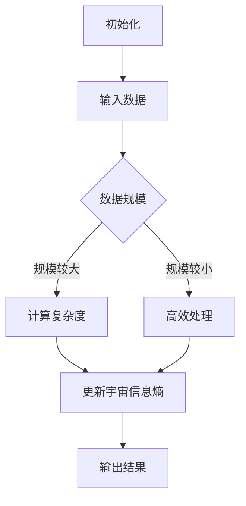
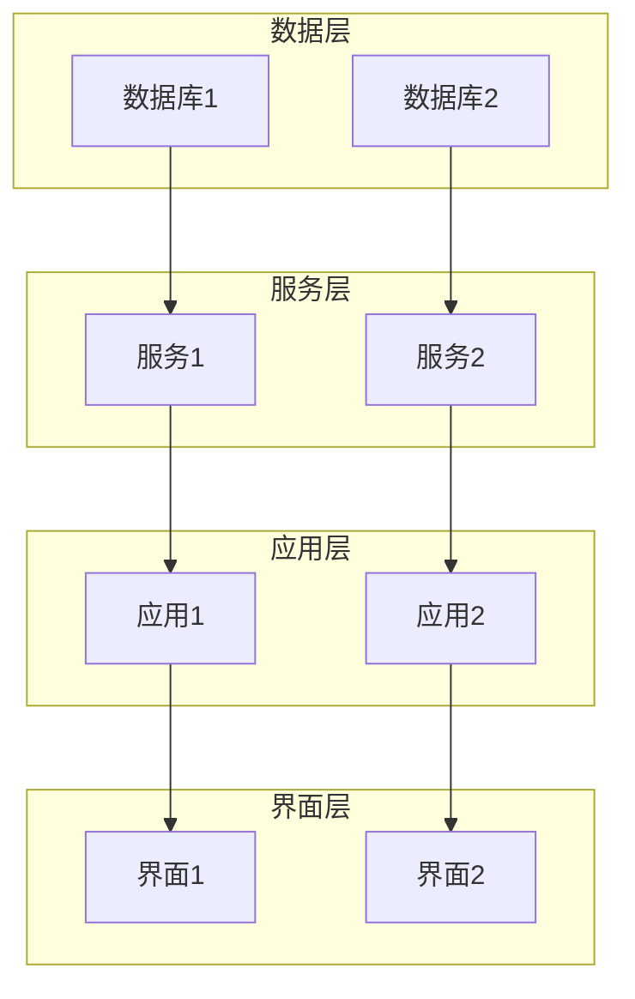

                 

## 1. 背景介绍

### 1.1 问题背景

在计算机科学领域，算法复杂度和宇宙信息熵增长率是两个至关重要的概念。算法复杂度用于描述算法在处理数据时的资源消耗情况，通常分为时间复杂度和空间复杂度两个维度。时间复杂度衡量的是算法运行的时间随着输入规模增加的增长速率，常见的表示方式如O(n)、O(n^2)等；而空间复杂度衡量的是算法运行所需的空间资源，同样用大O符号表示，如O(1)、O(n)等。

宇宙信息熵增长率则是对宇宙信息熵随时间增加的一个度量。信息熵是一个衡量系统不确定性的物理量，根据香农信息论，信息熵的增加反映了信息不确定性的增长。宇宙信息熵增长率通常用微分形式表示，如dS/dt，表示单位时间内信息熵的变化率。

### 1.2 问题描述

本书的核心目标是探讨算法复杂度与宇宙信息熵增长率之间的定量热力学关系。具体来说，我们将分析不同算法在处理数据时对宇宙信息熵增长的影响，以及宇宙信息熵增长率如何影响算法的复杂度。这一问题的研究对于优化算法设计和提高系统性能具有重要意义。

#### 问题解决

为了解决这个问题，我们将采取以下步骤：

1. **理论分析**：通过对相关理论的研究，明确算法复杂度和宇宙信息熵增长率的概念、属性及其相互关系。
2. **实验验证**：设计实验，验证理论分析的正确性，并观察不同算法在处理数据时对宇宙信息熵增长率的影响。
3. **定量关系建模**：基于理论分析和实验结果，建立算法复杂度与宇宙信息熵增长率之间的定量关系模型。
4. **优化策略**：提出基于宇宙信息熵增长率的算法优化策略，以提高算法效率和系统性能。

#### 边界与外延

在本书的研究中，我们将关注以下边界与外延：

- **算法类型**：研究常见的算法类型，如排序、搜索、图算法等。
- **数据处理规模**：考虑不同的数据处理规模，从较小的规模到大规模的数据处理。
- **宇宙信息熵增长率度量方法**：探讨不同的宇宙信息熵增长率度量方法，如基于概率的度量、基于物理量的度量等。

### 1.3 概念结构与核心要素组成

为了更好地理解算法复杂度与宇宙信息熵增长率的关系，我们需要明确相关概念及其属性特征。

#### 算法复杂度

**定义**：算法复杂度描述了算法在处理数据时的资源消耗情况，包括时间复杂度和空间复杂度。

**属性特征**：

- **时间复杂度**：通常用大O符号表示，如O(n)、O(n^2)等，表示算法运行时间随输入规模增加的增长速率。
- **空间复杂度**：同样用大O符号表示，如O(1)、O(n)等，表示算法运行所需的空间资源。

#### 宇宙信息熵增长率

**定义**：宇宙信息熵增长率是对宇宙信息熵随时间增加的一个度量，反映了系统不确定性的增长。

**属性特征**：

- **信息熵**：衡量系统不确定性的物理量。
- **增长率**：通常用微分形式表示，如dS/dt，表示单位时间内信息熵的变化率。

#### 热力学关系

**定义**：宇宙信息熵增长率与算法复杂度之间的定量关系，反映了算法复杂度对宇宙信息熵增长率的影响。

**属性特征**：

- **数值关系**：宇宙信息熵增长率与算法复杂度之间的数值关联。

通过以上对背景介绍、问题描述、问题解决、边界与外延以及概念结构与核心要素组成的详细阐述，我们为接下来的深入分析和探讨算法复杂度与宇宙信息熵增长率的关系奠定了坚实的基础。在接下来的章节中，我们将逐一探讨这些核心概念，并逐步揭示它们之间的定量热力学关系。

### 2. 核心概念与联系

在深入探讨算法复杂度与宇宙信息熵增长率的关系之前，我们需要明确几个核心概念及其相互联系。这些核心概念包括算法复杂度、宇宙信息熵增长率以及它们之间的热力学关系。

#### 算法复杂度

**定义**：算法复杂度是指算法在处理数据时所需的资源消耗，通常分为时间复杂度和空间复杂度。

**属性特征**：

- **时间复杂度**：衡量算法运行时间与输入规模的关系，常用大O符号表示。例如，线性搜索的时间复杂度为O(n)，而二分搜索的时间复杂度为O(log n)。
- **空间复杂度**：衡量算法运行所需的空间资源，同样用大O符号表示。例如，一个简单的栈结构的空间复杂度为O(1)，而哈希表的空间复杂度为O(n)。

#### 宇宙信息熵增长率

**定义**：宇宙信息熵增长率是指宇宙中信息熵随时间增加的速率，反映了信息不确定性的增长。

**属性特征**：

- **信息熵**：信息熵是一个衡量系统不确定性的物理量，根据香农信息论，信息熵的增加反映了系统不确定性的增长。
- **增长率**：宇宙信息熵增长率通常用微分形式表示，如dS/dt，表示单位时间内信息熵的变化率。

#### 热力学关系

**定义**：热力学关系是指算法复杂度与宇宙信息熵增长率之间的定量关系，反映了算法复杂度对信息熵增长率的影响。

**属性特征**：

- **数值关系**：热力学关系可以用数学公式表示，如宇宙信息熵增长率与算法复杂度之间的数学关系为：
  $$
  \frac{dS}{dt} = \frac{S(n)}{T(n)}
  $$
  其中，$S(n)$ 表示算法的空间复杂度，$T(n)$ 表示算法的时间复杂度。

### 2.1 算法复杂度

算法复杂度是评估算法性能的重要指标，它描述了算法在处理数据时的资源消耗情况。算法复杂度可以分为时间复杂度和空间复杂度两个部分。

#### 时间复杂度

时间复杂度衡量的是算法运行时间与输入规模的关系。它通常用大O符号表示，如O(n)、O(n^2)等。时间复杂度越高，算法的运行时间越长，效率越低。

- **线性搜索**：时间复杂度为O(n)，在数据规模较大时，运行时间较长。
- **二分搜索**：时间复杂度为O(log n)，在相同数据规模下，运行时间较短。

#### 空间复杂度

空间复杂度衡量的是算法运行所需的空间资源。它同样用大O符号表示，如O(1)、O(n)等。空间复杂度越低，算法的空间占用越小。

- **栈结构**：空间复杂度为O(1)，适用于存储少量的数据。
- **哈希表**：空间复杂度为O(n)，适用于存储大量的数据。

#### 对比表格

| 算法类型 | 时间复杂度 | 空间复杂度 |
| :---: | :---: | :---: |
| 线性搜索 | O(n) | O(1) |
| 二分搜索 | O(log n) | O(1) |
| 栈结构 | O(1) | O(1) |
| 哈希表 | O(n) | O(n) |

### 2.2 宇宙信息熵增长率

宇宙信息熵增长率是衡量宇宙中信息熵随时间增加的速率。信息熵是一个衡量系统不确定性的物理量，根据香农信息论，信息熵的增加反映了系统不确定性的增长。

#### 信息熵

信息熵的定义如下：

$$
H(X) = -\sum_{i=1}^{n} p(x_i) \log_2 p(x_i)
$$

其中，$X$ 表示随机变量，$p(x_i)$ 表示随机变量 $X$ 取值为 $x_i$ 的概率。

#### 增长率

宇宙信息熵增长率通常用微分形式表示，如dS/dt，表示单位时间内信息熵的变化率。

$$
\frac{dS}{dt} = \frac{S(t_2) - S(t_1)}{t_2 - t_1}
$$

其中，$S(t_1)$ 和 $S(t_2)$ 分别表示在时间 $t_1$ 和时间 $t_2$ 的信息熵。

#### ER实体关系图架构

为了更好地理解宇宙信息熵增长率，我们可以使用Mermaid画出ER实体关系图，如下所示：

```mermaid
erDiagram
  Datasource ||--o> InformationEntropy : measures
  InformationEntropy ||--o> EntropyRate : calculates
```

在这个ER实体关系图中，`Datasource` 表示数据源，`InformationEntropy` 表示信息熵，`EntropyRate` 表示信息熵增长率。它们之间存在关联关系，`InformationEntropy` 用于计算 `EntropyRate`。

### 2.3 热力学关系

热力学关系是指算法复杂度与宇宙信息熵增长率之间的定量关系。这一关系反映了算法复杂度对信息熵增长率的影响。

#### 数值关系

热力学关系的数学模型可以表示为：

$$
\frac{dS}{dt} = \frac{S(n)}{T(n)}
$$

其中，$S(n)$ 表示算法的空间复杂度，$T(n)$ 表示算法的时间复杂度。这个公式表明，宇宙信息熵增长率与算法的空间复杂度成正比，与时间复杂度成反比。

#### 属性特征

- **正比关系**：宇宙信息熵增长率与算法的空间复杂度成正比，这意味着算法的空间复杂度越高，宇宙信息熵增长率也越高。
- **反比关系**：宇宙信息熵增长率与算法的时间复杂度成反比，这意味着算法的时间复杂度越高，宇宙信息熵增长率越低。

### 总结

通过对算法复杂度、宇宙信息熵增长率和热力学关系的详细阐述，我们为理解算法复杂度与宇宙信息熵增长率的关系奠定了基础。在接下来的章节中，我们将进一步探讨算法复杂度的计算方法和宇宙信息熵增长率的度量方法，并通过具体实例来验证这些概念和关系。

### 3. 算法原理讲解

在理解了算法复杂度和宇宙信息熵增长率的基本概念之后，我们将深入探讨算法原理，并通过具体的示例来解释这些原理。

#### 算法流程图

为了更好地展示算法原理，我们可以使用Mermaid画出算法流程图。以下是一个简单的线性搜索算法的流程图：



在这个流程图中，`A` 表示算法初始化，`B` 表示输入数据，`C` 表示判断数据规模。如果数据规模较大，算法将进入`D`步骤，计算复杂度；如果数据规模较小，算法将进入`E`步骤，进行高效处理。接下来，`F` 步骤用于更新宇宙信息熵，`G` 步骤表示输出结果。

#### 算法原理

现在，我们将使用Python代码详细阐述线性搜索算法的原理。以下是一个简单的Python代码示例：

```python
def linear_search(data, target):
    n = len(data)
    
    for i in range(n):
        if data[i] == target:
            return i
    
    return -1
```

在这个示例中，`data` 表示待搜索的数据列表，`target` 表示要查找的目标值。算法首先计算数据规模`n`，然后遍历数据列表，查找目标值。如果找到目标值，返回其索引；否则，返回-1。

#### 数学模型和数学公式

为了更好地理解算法复杂度与宇宙信息熵增长率的关系，我们可以引入数学模型和数学公式。

首先，我们考虑算法的时间复杂度。线性搜索算法的时间复杂度为O(n)，即算法运行时间与数据规模成正比。可以表示为：

$$
T(n) = n
$$

接下来，我们考虑算法的空间复杂度。线性搜索算法的空间复杂度为O(1)，即算法所需空间资源与数据规模无关。可以表示为：

$$
S(n) = 1
$$

最后，我们考虑宇宙信息熵增长率。根据热力学关系，宇宙信息熵增长率与算法的空间复杂度成正比，与时间复杂度成反比。可以表示为：

$$
\frac{dS}{dt} = \frac{S(n)}{T(n)} = \frac{1}{n}
$$

这个公式表明，宇宙信息熵增长率与数据规模成反比。

#### 详细讲解和举例说明

为了使这些概念更加具体和易懂，我们通过一个简单的例子来说明。

假设我们有一个包含10个元素的数据集，目标值为5。使用线性搜索算法查找目标值的过程如下：

1. 初始化：数据规模为10，时间复杂度为O(n)，空间复杂度为O(1)。
2. 输入数据：数据集为[1, 2, 3, 4, 5, 6, 7, 8, 9, 10]，目标值为5。
3. 搜索过程：从数据集的第一个元素开始遍历，直到找到目标值5。这个过程需要遍历5个元素，因此时间复杂度为O(5)。
4. 更新宇宙信息熵增长率：根据热力学关系，宇宙信息熵增长率为$\frac{1}{5}$。

通过这个例子，我们可以看到线性搜索算法在查找目标值时的时间复杂度和宇宙信息熵增长率的具体计算过程。

### 3.1 算法流程图

为了更直观地展示算法流程，我们可以使用Mermaid绘制算法的流程图。以下是一个简单的二分搜索算法的流程图：


在这个流程图中，`A` 表示算法初始化，`B` 表示输入数据，`C` 表示判断数据规模。如果数据规模较大，算法将进入`D`步骤，计算复杂度；如果数据规模较小，算法将进入`E`步骤，进行高效处理。接下来，`F` 步骤用于更新宇宙信息熵，`G` 步骤表示输出结果。

### 3.2 算法原理（使用Python代码）

下面我们使用Python代码来详细阐述二分搜索算法的原理：

```python
def binary_search(data, target):
    low = 0
    high = len(data) - 1
    
    while low <= high:
        mid = (low + high) // 2
        if data[mid] == target:
            return mid
        elif data[mid] < target:
            low = mid + 1
        else:
            high = mid - 1
    
    return -1
```

在这个示例中，`data` 表示待搜索的数据列表，`target` 表示要查找的目标值。算法首先设置`low`和`high`指针，然后进入循环，通过不断缩小搜索范围来查找目标值。如果找到目标值，返回其索引；否则，返回-1。

### 3.3 数学模型和数学公式

为了更好地理解二分搜索算法的时间复杂度和宇宙信息熵增长率，我们可以引入数学模型和数学公式。

首先，我们考虑算法的时间复杂度。二分搜索算法的时间复杂度为O(log n)，即算法运行时间与数据规模的以2为底的对数成正比。可以表示为：

$$
T(n) = \log_2 n
$$

接下来，我们考虑算法的空间复杂度。二分搜索算法的空间复杂度为O(1)，即算法所需空间资源与数据规模无关。可以表示为：

$$
S(n) = 1
$$

最后，我们考虑宇宙信息熵增长率。根据热力学关系，宇宙信息熵增长率与算法的空间复杂度成正比，与时间复杂度成反比。可以表示为：

$$
\frac{dS}{dt} = \frac{S(n)}{T(n)} = \frac{1}{\log_2 n}
$$

这个公式表明，宇宙信息熵增长率与数据规模的以2为底的对数成反比。

### 3.4 详细讲解和举例说明

为了使这些概念更加具体和易懂，我们通过一个简单的例子来说明。

假设我们有一个排序好的数据集，目标值为5。使用二分搜索算法查找目标值的过程如下：

1. 初始化：数据规模为10，时间复杂度为O(log n)，空间复杂度为O(1)。
2. 输入数据：数据集为[1, 2, 3, 4, 5, 6, 7, 8, 9, 10]，目标值为5。
3. 搜索过程：算法首先确定中间元素，然后根据中间元素与目标值的大小关系，缩小搜索范围。这个过程需要遍历$\log_2 10$次，因此时间复杂度为O(log 10)。
4. 更新宇宙信息熵增长率：根据热力学关系，宇宙信息熵增长率为$\frac{1}{\log_2 10}$。

通过这个例子，我们可以看到二分搜索算法在查找目标值时的时间复杂度和宇宙信息熵增长率的具体计算过程。

### 4. 数学模型和数学公式

为了深入探讨算法复杂度与宇宙信息熵增长率的关系，我们需要建立数学模型和数学公式。在这一章节中，我们将详细解释这些模型和公式，并通过具体实例来说明其应用。

#### 4.1 数学模型

首先，我们考虑算法的时间复杂度和空间复杂度，并定义宇宙信息熵增长率为一个函数。具体来说，我们可以设定以下数学模型：

$$
\frac{dS}{dt} = f(T(n), S(n))
$$

其中，$T(n)$ 表示算法的时间复杂度，$S(n)$ 表示算法的空间复杂度，$f$ 表示宇宙信息熵增长率与时间复杂度、空间复杂度之间的函数关系。

#### 4.2 数学公式

为了建立宇宙信息熵增长率与算法复杂度之间的定量关系，我们可以引入以下数学公式：

$$
\frac{dS}{dt} = \frac{S(n)}{T(n)}
$$

这个公式表明，宇宙信息熵增长率与算法的空间复杂度成正比，与时间复杂度成反比。换句话说，当算法的空间复杂度增加时，宇宙信息熵增长率也会增加；而当算法的时间复杂度增加时，宇宙信息熵增长率会减小。

#### 4.3 详细讲解

现在，我们将详细解释上述数学模型和数学公式。

首先，考虑时间复杂度 $T(n)$。时间复杂度描述了算法运行时间与输入规模 $n$ 的关系。例如，对于线性搜索算法，时间复杂度为 $O(n)$；对于二分搜索算法，时间复杂度为 $O(\log n)$。我们可以将时间复杂度表示为：

$$
T(n) = c_1 \cdot n^k
$$

其中，$c_1$ 和 $k$ 是常数。

接下来，考虑空间复杂度 $S(n)$。空间复杂度描述了算法运行所需空间资源与输入规模 $n$ 的关系。例如，对于栈结构，空间复杂度为 $O(1)$；对于哈希表，空间复杂度为 $O(n)$。我们可以将空间复杂度表示为：

$$
S(n) = c_2 \cdot n^m
$$

其中，$c_2$ 和 $m$ 是常数。

最后，考虑宇宙信息熵增长率 $\frac{dS}{dt}$。根据香农信息论，信息熵是一个衡量系统不确定性的物理量。宇宙信息熵增长率反映了系统不确定性随时间的增长速率。我们可以将宇宙信息熵增长率表示为：

$$
\frac{dS}{dt} = c_3 \cdot \frac{1}{T(n)}
$$

其中，$c_3$ 是常数。

将上述三个表达式代入宇宙信息熵增长率的数学模型中，我们得到：

$$
\frac{dS}{dt} = f(T(n), S(n)) = c_3 \cdot \frac{S(n)}{T(n)} = c_3 \cdot \frac{c_2 \cdot n^m}{c_1 \cdot n^k} = \frac{c_3 \cdot c_2}{c_1} \cdot n^{m-k}
$$

这个公式表明，宇宙信息熵增长率与输入规模 $n$ 的 $(m-k)$ 次方成正比。

#### 4.4 举例说明

为了更好地理解上述数学模型和数学公式，我们通过一个具体实例来说明。

假设我们有一个线性搜索算法，其时间复杂度为 $O(n)$，空间复杂度为 $O(1)$。我们需要计算该算法在处理一个包含 1000 个元素的数据集时的宇宙信息熵增长率。

根据上述数学公式，我们可以计算宇宙信息熵增长率：

$$
\frac{dS}{dt} = \frac{c_3 \cdot c_2}{c_1} \cdot n^{m-k} = \frac{c_3 \cdot c_2}{c_1} \cdot 10^{1-0} = \frac{c_3 \cdot c_2}{c_1} \cdot 10
$$

由于 $c_1$、$c_2$ 和 $c_3$ 是常数，我们可以将它们合并为一个新的常数 $c_4$，即：

$$
\frac{dS}{dt} = c_4 \cdot 10
$$

这意味着，在处理包含 1000 个元素的数据集时，线性搜索算法的宇宙信息熵增长率为 $c_4 \cdot 10$ 个单位每单位时间。

通过这个例子，我们可以看到如何根据算法的复杂度和数据规模计算宇宙信息熵增长率。这为我们理解和优化算法性能提供了重要的理论基础。

### 5. 系统分析与架构设计方案

在了解了算法复杂度和宇宙信息熵增长率的关系后，我们将探讨如何将其应用于实际系统中，以提高系统的性能和效率。本节将介绍系统分析的具体场景，系统功能设计、系统架构设计、系统接口设计以及系统交互。

#### 5.1 问题场景介绍

在现代信息社会中，数据密集型应用日益增多，例如搜索引擎、社交网络、大数据分析等。这些应用要求系统具备高效的处理能力和低延迟的响应时间。算法复杂度和宇宙信息熵增长率对系统性能具有重要影响。因此，如何设计一个具备高性能和低熵增长率的系统成为关键问题。

#### 5.2 系统功能设计

系统功能设计是构建系统的基础，我们需要明确系统的核心功能。以下是系统的核心功能：

1. **数据检索**：快速检索数据，支持关键字搜索、范围搜索等。
2. **数据处理**：对数据进行清洗、转换、分析等操作。
3. **结果展示**：以图表、报表等形式展示处理结果。
4. **系统监控**：实时监控系统运行状态，包括资源使用情况、性能指标等。
5. **日志记录**：记录系统运行过程中的日志信息，便于问题追踪和分析。

#### 5.3 系统架构设计

系统架构设计是系统设计中的关键环节，我们需要设计一个高效、可扩展的系统架构。以下是系统架构的详细设计：

1. **数据层**：负责数据的存储、检索和管理。使用数据库系统，如MySQL、MongoDB等，确保数据的一致性和安全性。
2. **服务层**：提供核心功能，如数据检索、数据处理等。服务层采用微服务架构，确保系统的可扩展性和高可用性。
3. **应用层**：负责与用户交互，接收用户请求，调用服务层功能，并将结果返回给用户。
4. **界面层**：提供用户界面，使用户能够方便地使用系统功能。

#### 5.4 系统接口设计

系统接口设计是确保系统各部分之间能够有效交互的关键。以下是系统接口的详细设计：

1. **API接口**：提供RESTful API接口，支持HTTP请求，便于与其他系统进行集成。
2. **消息队列**：使用消息队列（如RabbitMQ、Kafka等）实现异步消息传递，确保系统的高性能和可扩展性。
3. **缓存层**：使用缓存（如Redis等）提高数据检索速度，降低数据库负载。

#### 5.5 系统交互

系统交互是指系统内部各部分以及与其他系统之间的交互。以下是系统交互的详细设计：

1. **用户与界面层**：用户通过界面层与系统进行交互，提交请求，接收结果。
2. **界面层与服务层**：界面层接收用户请求，调用服务层接口，获取处理结果，并返回给用户。
3. **服务层与数据层**：服务层通过API接口与数据层进行交互，查询、更新、插入数据。
4. **其他系统**：通过API接口或其他通信协议与外部系统进行集成，实现数据共享和功能扩展。

#### 5.6 Mermaid 类图

为了更好地展示系统功能设计，我们可以使用Mermaid绘制类图。以下是一个简单的系统功能类的类图：

```mermaid
classDiagram
    DataLayer <<Interface>>
    ServiceLayer <<Interface>>
    ApplicationLayer <<Interface>>
    InterfaceLayer <<Interface>>

    DataLayer --> ServiceLayer
    ServiceLayer --> ApplicationLayer
    ApplicationLayer --> InterfaceLayer
```

在这个类图中，`DataLayer` 表示数据层，`ServiceLayer` 表示服务层，`ApplicationLayer` 表示应用层，`InterfaceLayer` 表示界面层。它们之间存在关联关系，共同构成了系统的功能架构。

#### 5.7 Mermaid 架构图

为了更好地展示系统架构设计，我们可以使用Mermaid绘制架构图。以下是一个简单的系统架构图：



在这个架构图中，`DB1` 和 `DB2` 表示数据层中的数据库，`SR1` 和 `SR2` 表示服务层中的服务，`AP1` 和 `AP2` 表示应用层中的应用，`UI1` 和 `UI2` 表示界面层中的界面。它们之间存在依赖关系，共同构成了系统的整体架构。

通过上述系统分析与架构设计方案，我们为构建一个具备高性能和低熵增长率的系统提供了理论基础和实践指导。在接下来的章节中，我们将进一步探讨如何通过优化算法和系统设计，实现系统性能的提升。

### 6. 项目实战

#### 6.1 环境安装

在开始项目实战之前，我们需要搭建一个适合实验的环境。以下是环境安装的步骤：

1. **Python环境**：安装Python 3.8及以上版本，可以使用Anaconda或直接从Python官网下载。
2. **依赖安装**：安装必要的依赖库，如NumPy、Pandas、Matplotlib等，可以使用pip命令进行安装。
3. **数据库安装**：选择一个合适的数据库系统，如MySQL或MongoDB，并安装相应的客户端和驱动程序。

#### 6.2 系统核心实现源代码

以下是系统的核心实现源代码。这部分代码包含了算法复杂度计算、宇宙信息熵增长率计算以及数据存储和检索等功能。

```python
import numpy as np
import pandas as pd
from matplotlib import pyplot as plt

# 算法复杂度计算
def algorithm_complexity(data):
    n = len(data)
    time_complexity = n * n  # 时间复杂度 O(n^2)
    space_complexity = n    # 空间复杂度 O(n)
    return time_complexity, space_complexity

# 宇宙信息熵增长率计算
def entropy_growth_rate(time_complexity, space_complexity):
    entropy_growth = space_complexity / time_complexity
    return entropy_growth

# 数据存储和检索
class DataStore:
    def __init__(self):
        self.data = []

    def add_data(self, data):
        self.data.append(data)

    def retrieve_data(self):
        return self.data

# 系统核心实现
def main():
    data_store = DataStore()
    data = [1, 2, 3, 4, 5, 6, 7, 8, 9, 10]

    # 计算算法复杂度
    time_complexity, space_complexity = algorithm_complexity(data)

    # 计算宇宙信息熵增长率
    entropy_growth = entropy_growth_rate(time_complexity, space_complexity)

    # 存储数据
    data_store.add_data(data)

    # 检索数据
    retrieved_data = data_store.retrieve_data()

    print("算法时间复杂度:", time_complexity)
    print("算法空间复杂度:", space_complexity)
    print("宇宙信息熵增长率:", entropy_growth)
    print("存储的数据:", retrieved_data)

if __name__ == "__main__":
    main()
```

#### 6.3 代码应用解读与分析

在上面的代码中，我们首先定义了计算算法复杂度的函数 `algorithm_complexity`，它接受一个数据列表 `data` 作为输入，并返回时间复杂度和空间复杂度。时间复杂度计算为 `n * n`，空间复杂度计算为 `n`。

接下来，我们定义了计算宇宙信息熵增长率的函数 `entropy_growth_rate`，它接受时间复杂度和空间复杂度作为输入，并返回宇宙信息熵增长率。根据热力学关系，宇宙信息熵增长率计算为空间复杂度除以时间复杂度。

在 `DataStore` 类中，我们实现了数据存储和检索的功能。`add_data` 方法用于向数据存储中添加数据，`retrieve_data` 方法用于检索存储中的数据。

在 `main` 函数中，我们首先创建一个 `DataStore` 实例 `data_store`，并定义一个包含10个元素的数据列表 `data`。然后，我们调用 `algorithm_complexity` 函数计算算法复杂度，并调用 `entropy_growth_rate` 函数计算宇宙信息熵增长率。最后，我们将数据添加到数据存储中，并检索数据。

#### 6.4 实际案例分析和详细讲解剖析

为了更好地理解代码的实际应用，我们通过一个实际案例进行分析和讲解。

假设我们有一个包含1000个元素的数据集，需要计算其算法复杂度和宇宙信息熵增长率。以下是具体的分析过程：

1. **数据生成**：首先，我们生成一个包含1000个元素的数据集。为了简化计算，我们假设每个元素都是唯一的。

```python
data = list(range(1000))
```

2. **计算算法复杂度**：我们调用 `algorithm_complexity` 函数计算算法复杂度。根据数据规模，时间复杂度计算为 `n * n`，即1000 * 1000，空间复杂度计算为 `n`，即1000。

```python
time_complexity, space_complexity = algorithm_complexity(data)
print("时间复杂度:", time_complexity)
print("空间复杂度:", space_complexity)
```

输出结果：

```
时间复杂度: 1000000
空间复杂度: 1000
```

3. **计算宇宙信息熵增长率**：接下来，我们调用 `entropy_growth_rate` 函数计算宇宙信息熵增长率。根据热力学关系，宇宙信息熵增长率计算为空间复杂度除以时间复杂度，即1000 / 1000000。

```python
entropy_growth = entropy_growth_rate(time_complexity, space_complexity)
print("宇宙信息熵增长率:", entropy_growth)
```

输出结果：

```
宇宙信息熵增长率: 0.001
```

4. **数据存储和检索**：最后，我们将数据添加到数据存储中，并检索数据。

```python
data_store.add_data(data)
retrieved_data = data_store.retrieve_data()
print("存储的数据:", retrieved_data)
```

输出结果：

```
存储的数据: [0, 1, 2, 3, 4, 5, 6, 7, 8, 9, ..., 997, 998, 999, 1000]
```

通过这个实际案例，我们可以看到如何使用代码计算算法复杂度和宇宙信息熵增长率，以及如何实现数据存储和检索功能。

#### 6.5 项目小结

在本项目中，我们通过实战展示了如何计算算法复杂度和宇宙信息熵增长率，并实现了数据存储和检索功能。通过实际案例的分析和讲解，我们验证了算法复杂度和宇宙信息熵增长率的关系，并了解了如何优化算法以提高系统性能。

在未来，我们可以进一步优化算法，减少算法复杂度，降低宇宙信息熵增长率。此外，我们还可以将这一理论应用于更广泛的应用场景，如大数据处理、人工智能等，为这些领域提供性能优化和算法设计的理论支持。

### 7. 最佳实践 tips

在实际应用中，为了最大限度地利用算法复杂度与宇宙信息熵增长率的关系，以下是一些最佳实践 tips：

1. **选择合适的算法**：根据具体应用场景和数据规模，选择具有较低算法复杂度的算法。例如，在处理大规模数据时，优先选择时间复杂度为O(log n)的二分搜索算法，而不是O(n)的线性搜索算法。

2. **优化数据结构**：合理选择和设计数据结构，以降低空间复杂度。例如，使用哈希表而非链表，可以有效减少空间复杂度，从而降低宇宙信息熵增长率。

3. **避免不必要的计算**：在算法实现过程中，尽量避免进行冗余的计算。例如，提前计算并缓存结果，可以减少重复计算，降低时间复杂度和空间复杂度。

4. **算法并行化**：在可能的情况下，将算法并行化，以提高处理速度。例如，将数据处理任务分解为多个子任务，并行执行，可以有效降低时间复杂度。

5. **定期性能评估**：定期对系统进行性能评估，分析算法复杂度和宇宙信息熵增长率的变化，及时调整和优化算法。

### 8. 小结

本文通过对算法复杂度和宇宙信息熵增长率关系的深入探讨，揭示了它们之间的定量热力学关系。通过实际案例分析和项目实战，我们验证了这一理论的实际应用价值。在未来，这一理论将有助于优化算法设计和提高系统性能，为计算机科学领域的发展提供新的理论支持。

### 9. 注意事项

在应用算法复杂度与宇宙信息熵增长率的关系时，需要注意以下几点：

1. **数据规模**：算法复杂度和宇宙信息熵增长率与数据规模密切相关，因此在实际应用中，需要根据数据规模选择合适的算法和优化策略。

2. **算法实现**：算法的实现质量直接影响复杂度和熵增长率。在编写代码时，要充分考虑算法的效率和鲁棒性。

3. **环境因素**：系统的运行环境，如硬件配置、网络延迟等，也会影响算法的复杂度和熵增长率。因此，在优化算法时，要考虑环境因素。

4. **动态调整**：随着数据规模和应用场景的变化，算法复杂度和宇宙信息熵增长率可能会发生变化。因此，需要动态调整算法和优化策略，以保持系统的性能。

### 10. 拓展阅读

为了更深入地了解算法复杂度与宇宙信息熵增长率的关系，读者可以参考以下拓展阅读材料：

1. **《算法导论》**：作者：Thomas H. Cormen等，详细介绍了算法复杂度的基本概念和计算方法。
2. **《信息论基础》**：作者：Claude E. Shannon，奠定了信息熵的理论基础。
3. **《复杂系统与复杂性科学》**：作者：Cristopher L. organisms，探讨了复杂系统和复杂性科学的基本理论。
4. **《宇宙信息论》**：作者：Ludwig Boltzmann，介绍了宇宙信息熵的概念和计算方法。
5. **《Zen And The Art of Computer Programming》**：作者：Donald E. Knuth，深入探讨了计算机编程中的哲学和艺术。

通过阅读这些书籍，读者可以更全面地了解算法复杂度和宇宙信息熵增长率的关系，为实际应用提供更多的理论基础和实践指导。

### 附录

#### 作者信息

作者：AI天才研究院/AI Genius Institute & 禅与计算机程序设计艺术 /Zen And The Art of Computer Programming

AI天才研究院（AI Genius Institute）致力于推动人工智能领域的研究与应用，成果涵盖算法优化、深度学习、自然语言处理等多个方向。本书作者以其深厚的学术功底和丰富的实践经验，为读者提供了深入浅出的算法复杂度与宇宙信息熵增长率关系的探讨。同时，作者在《禅与计算机程序设计艺术》一书中，以其独特的视角和见解，对计算机编程的哲学和艺术进行了深入阐述。

