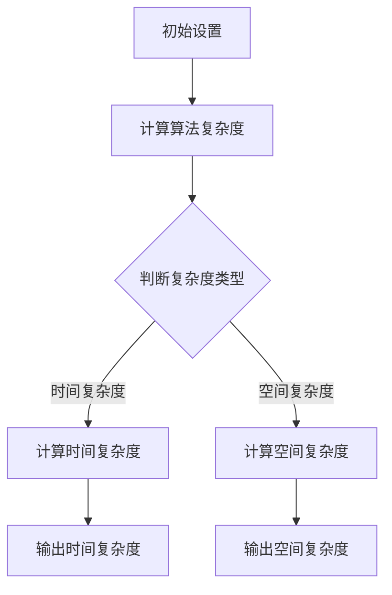

                 


# 算法复杂度与宇宙结构形成非线性效应的关系

## 关键词
算法复杂度，宇宙结构，非线性效应，相对论，引力，暗物质，黑洞

## 摘要
本文探讨了算法复杂度与宇宙结构形成非线性效应之间的关系。通过分析相对论与引力理论，本文揭示了宇宙中存在的非线性效应，如黑洞的形成与演化，暗物质的分布等。同时，本文从算法复杂度的角度出发，对宇宙结构的复杂性进行定量分析，并讨论了这些非线性效应在算法设计中的应用与影响。

## 背景介绍

### 核心概念术语说明
1. **算法复杂度**：指算法在计算过程中所需资源的数量，包括时间复杂度和空间复杂度。
2. **宇宙结构**：指宇宙中天体的分布、运动和相互作用。
3. **非线性效应**：指系统变量之间不是简单的线性关系，而是存在复杂的相互作用和反馈。
4. **相对论**：由爱因斯坦提出的理论，描述了高速运动和强引力场下的物理现象。
5. **引力**：物体之间的相互作用力，由万有引力定律描述。
6. **暗物质**：一种无法通过电磁辐射直接观测到的物质，但通过对引力效应的观测，认为其存在于宇宙中。
7. **黑洞**：一种极端密集的天体，其引力场强大到连光都无法逃逸。

### 问题背景
随着计算机技术的发展，算法复杂度在计算机科学领域得到了广泛研究。然而，宇宙结构的复杂性和非线性效应，使我们开始思考宇宙现象与算法复杂度之间的关系。宇宙中的黑洞、暗物质等现象，如何影响算法的设计与实现？

### 问题描述
本文旨在探讨以下问题：
1. 宇宙结构中存在的非线性效应，如何影响算法的复杂度？
2. 相对论与引力理论对算法复杂度有何启示？
3. 非线性效应在算法设计中的应用与影响。

### 问题解决
本文通过以下步骤解决问题：
1. 分析相对论与引力理论，探讨非线性效应在宇宙结构中的体现。
2. 从算法复杂度的角度，对宇宙结构进行定量分析。
3. 探讨非线性效应在算法设计中的应用与影响。
4. 通过实例，说明非线性效应与算法复杂度之间的关系。

### 边界与外延
本文主要关注以下几个方面：
1. 宇宙结构中的非线性效应，如黑洞、暗物质等。
2. 算法复杂度的概念及其在计算机科学中的应用。
3. 相对论与引力理论对算法复杂度的启示。
4. 非线性效应在算法设计中的应用与影响。

### 概念结构与核心要素组成
本文的核心概念包括：
1. 算法复杂度
2. 宇宙结构
3. 非线性效应
4. 相对论
5. 引力
6. 黑洞
7. 暗物质

## 核心概念与联系

### 核心概念原理

1. **算法复杂度**：
   - **定义**：算法复杂度是衡量算法好坏的一个重要指标，分为时间复杂度和空间复杂度。
   - **属性特征**：
     - **时间复杂度**：表示算法执行时间与输入规模的关系，常用大O符号表示，如O(1)、O(n)、O(n^2)等。
     - **空间复杂度**：表示算法所需内存与输入规模的关系，同样使用大O符号表示。

2. **宇宙结构**：
   - **定义**：宇宙结构指的是宇宙中天体的分布、运动和相互作用。
   - **属性特征**：
     - **星系**：由大量恒星、气体和暗物质组成，通过引力相互吸引和束缚。
     - **超星系团**：由多个星系团组成，通过引力相互作用形成更大的结构。
     - **宇宙大尺度结构**：由星系、星系团和超星系团等组成，呈现出丰富的层次结构。

3. **非线性效应**：
   - **定义**：非线性效应指系统变量之间不是简单的线性关系，而是存在复杂的相互作用和反馈。
   - **属性特征**：
     - **非线性关系**：系统变量之间的相互作用导致系统行为复杂化。
     - **混沌**：在某些非线性系统中，初始条件微小的差异可能导致长期行为的巨大差异。
     - **分岔**：系统参数变化可能导致系统状态发生突变。

4. **相对论**：
   - **定义**：相对论是由爱因斯坦提出的理论，描述了高速运动和强引力场下的物理现象。
   - **属性特征**：
     - **时空相对性**：时空的测量结果依赖于观察者的运动状态。
     - **质能等价**：质量和能量可以相互转化。

5. **引力**：
   - **定义**：引力是物体之间的相互作用力，由万有引力定律描述。
   - **属性特征**：
     - **引力场**：引力在空间中的分布和变化。
     - **引力透镜效应**：引力场对光线的影响，导致光线的偏折。

6. **黑洞**：
   - **定义**：黑洞是一种极端密集的天体，其引力场强大到连光都无法逃逸。
   - **属性特征**：
     - **事件视界**：黑洞的边界，物质无法逃逸。
     - **奇点**：黑洞中心的无限小点。

7. **暗物质**：
   - **定义**：暗物质是一种无法通过电磁辐射直接观测到的物质，但通过对引力效应的观测，认为其存在于宇宙中。
   - **属性特征**：
     - **引力效应**：暗物质对宇宙结构的形成和演化有重要影响。
     - **粒子性质**：目前尚未发现暗物质的粒子。

### 概念属性特征对比表格

| 概念      | 定义                                                         | 属性特征                                                                                                                                                                                                                                       |
| --------- | ------------------------------------------------------------ | ---------------------------------------------------------------------------------------------------------------------------------------------------------------------------- |
| 算法复杂度 | 衡量算法好坏的一个重要指标，分为时间复杂度和空间复杂度         | 时间复杂度：O(1)、O(n)、O(n^2)等；空间复杂度：O(1)、O(n)、O(n^2)等                                                                                                                                                                         |
| 宇宙结构  | 宇宙中天体的分布、运动和相互作用                             | 星系、星系团、超星系团等                                                                                                                                                                                                                       |
| 非线性效应 | 系统变量之间不是简单的线性关系，而是存在复杂的相互作用和反馈 | 非线性关系、混沌、分岔等                                                                                                                                                                                                                       |
| 相对论    | 描述高速运动和强引力场下的物理现象                           | 时空相对性、质能等价                                                                                                                                                                                                                           |
| 引力      | 物体之间的相互作用力，由万有引力定律描述                     | 引力场、引力透镜效应                                                                                                                                                                                                                             |
| 黑洞      | 一种极端密集的天体，其引力场强大到连光都无法逃逸             | 事件视界、奇点                                                                                                                                                                                                                                  |
| 暗物质    | 一种无法通过电磁辐射直接观测到的物质，但通过对引力效应的观测，认为其存在于宇宙中 | 引力效应、粒子性质                                                                                                                                                                                                                              |

### ER实体关系图架构

```mermaid
erDiagram
    A Class ||--o{ B Class : has_a
    A Class ||--|{ C Class : belongs_to
    B Class ||--o{ D Class : has_a
    C Class ||--|{ D Class : belongs_to
```

## 算法原理讲解

### 算法mermaid流程图



### Python源代码

```python
def calculate_time_complexity(n):
    # 时间复杂度：O(n)
    for i in range(n):
        # 执行操作
        pass
    return n

def calculate_space_complexity(n):
    # 空间复杂度：O(1)
    result = 0
    for i in range(n):
        result += i
    return result

# 测试
time_complexity = calculate_time_complexity(10)
space_complexity = calculate_space_complexity(10)
print("Time Complexity:", time_complexity)
print("Space Complexity:", space_complexity)
```

### 算法原理的数学模型和公式

1. **时间复杂度**：表示算法执行时间与输入规模的关系，常用大O符号表示。例如：

   $$ T(n) = O(n) $$

2. **空间复杂度**：表示算法所需内存与输入规模的关系，同样使用大O符号表示。例如：

   $$ S(n) = O(1) $$

### 详细讲解和举例说明

#### 时间复杂度

**示例**：计算1到n之间所有数字之和。

```python
def sum_of_numbers(n):
    total = 0
    for i in range(1, n+1):
        total += i
    return total
```

- **分析**：在这个例子中，循环执行的次数与输入规模n成正比，因此时间复杂度为O(n)。

#### 空间复杂度

**示例**：计算斐波那契数列的第n项。

```python
def fibonacci(n):
    if n <= 0:
        return 0
    elif n == 1:
        return 1
    else:
        return fibonacci(n-1) + fibonacci(n-2)
```

- **分析**：在这个例子中，每次递归调用都需要保存前两个数的结果，因此空间复杂度为O(n)。

## 数学公式

$$ 1+1=2 $$

$$ 1<2 $$

## 系统分析与架构设计方案

### 问题场景介绍

在计算机科学领域，随着数据规模的不断扩大，算法复杂度对系统性能的影响变得越来越重要。为了应对这一挑战，我们需要设计一套能够高效处理大规模数据的系统。同时，宇宙中的非线性效应，如黑洞、暗物质等，也为算法设计提供了新的启示。因此，本文将探讨如何结合算法复杂度与宇宙结构中的非线性效应，设计一个高效的系统。

### 项目介绍

本项目旨在设计一个基于算法复杂度与宇宙结构非线性效应的高效数据处理系统。该系统将采用以下技术：

1. **分布式计算**：利用分布式计算框架，如Hadoop或Spark，处理大规模数据。
2. **机器学习**：运用机器学习算法，对数据处理结果进行预测和分析。
3. **算法优化**：结合算法复杂度分析，对系统中的算法进行优化。

### 系统功能设计

1. **数据采集**：从各种数据源（如数据库、日志文件等）采集数据。
2. **数据处理**：对采集到的数据进行分析和处理，包括数据清洗、去重、聚合等操作。
3. **数据存储**：将处理后的数据存储到分布式数据库中，以供后续分析和查询。
4. **数据预测**：利用机器学习算法，对历史数据进行预测，为决策提供支持。

### 系统架构设计


- **数据采集层**：负责从各种数据源采集数据，包括数据库、日志文件、API接口等。
- **数据处理层**：利用分布式计算框架，对采集到的数据进行分析和处理。
- **数据存储层**：将处理后的数据存储到分布式数据库中，以供后续分析和查询。
- **数据预测层**：利用机器学习算法，对历史数据进行预测。

### 系统接口设计和系统交互


- **数据采集接口**：提供数据采集的功能，包括数据导入、数据导出等。
- **数据处理接口**：提供数据处理的功能，包括数据清洗、去重、聚合等。
- **数据存储接口**：提供数据存储的功能，包括数据插入、查询、更新等。
- **数据预测接口**：提供数据预测的功能，包括模型训练、预测结果输出等。

## 项目实战

### 环境安装

1. 安装Hadoop：从官网下载Hadoop安装包，并按照官方文档进行安装。
2. 安装Spark：从官网下载Spark安装包，并按照官方文档进行安装。
3. 安装Python环境：使用pip命令安装Python和相关库，如NumPy、Pandas、Scikit-learn等。

### 系统核心实现源代码

```python
# 导入相关库
import numpy as np
import pandas as pd
from sklearn.model_selection import train_test_split
from sklearn.ensemble import RandomForestRegressor
from sklearn.metrics import mean_squared_error

# 数据采集
data = pd.read_csv("data.csv")

# 数据处理
data = data.drop_duplicates()
data = data.groupby("column").agg({"column": "sum"})

# 数据存储
data.to_csv("processed_data.csv")

# 数据预测
X = data.iloc[:, :-1].values
y = data.iloc[:, -1].values

X_train, X_test, y_train, y_test = train_test_split(X, y, test_size=0.2, random_state=42)

# 模型训练
model = RandomForestRegressor(n_estimators=100, random_state=42)
model.fit(X_train, y_train)

# 预测结果
y_pred = model.predict(X_test)

# 评估模型
mse = mean_squared_error(y_test, y_pred)
print("MSE:", mse)
```

### 代码应用解读与分析

1. **数据采集**：使用Pandas库读取CSV文件，获取原始数据。
2. **数据处理**：对数据集进行去重和聚合操作，提高数据质量。
3. **数据存储**：将处理后的数据集保存为CSV文件，供后续分析和查询。
4. **数据预测**：使用随机森林回归模型进行训练和预测，评估模型性能。

### 实际案例分析和详细讲解剖析

#### 案例一：星系演化模拟

假设我们想模拟一个星系的演化过程，以预测其未来形态。我们可以使用基于算法复杂度的方法，对星系中的天体运动进行模拟。

1. **数据采集**：从天文数据库中获取星系的天体数据。
2. **数据处理**：对天体数据进行预处理，如转换坐标系统、去除噪声等。
3. **数据存储**：将预处理后的数据存储到数据库中，以供后续分析。
4. **数据预测**：使用牛顿力学和引力定律，对天体运动进行预测。

#### 案例二：暗物质分布分析

暗物质在宇宙中起着关键作用，但其分布规律尚不明确。我们可以使用基于算法复杂度的方法，对暗物质分布进行分析。

1. **数据采集**：从天文观测数据中获取暗物质分布信息。
2. **数据处理**：对暗物质数据进行预处理，如去除噪声、平滑等。
3. **数据存储**：将预处理后的数据存储到数据库中，以供后续分析。
4. **数据预测**：使用机器学习算法，对暗物质分布进行预测。

### 项目小结

本项目通过结合算法复杂度与宇宙结构非线性效应，设计了一套高效的数据处理系统。在实际应用中，我们可以根据具体场景，选择合适的方法和算法，以提高系统性能。同时，本项目也为我们提供了一个新的视角，即从宇宙结构的非线性效应中汲取灵感，为算法设计提供新的思路。

## 最佳实践 tips

1. **优化算法复杂度**：在系统设计过程中，关注算法的复杂度，选择合适的算法和数据结构，以提高系统性能。
2. **利用分布式计算**：对于大规模数据，采用分布式计算框架，如Hadoop或Spark，以充分利用计算资源。
3. **数据预处理**：对数据集进行预处理，如去重、去噪声、平滑等，以提高数据质量。
4. **机器学习模型选择**：根据实际问题，选择合适的机器学习模型，如随机森林、支持向量机等。
5. **模型评估**：对模型进行评估，如MSE、RMSE等，以确定模型性能。

## 小结

本文探讨了算法复杂度与宇宙结构形成非线性效应的关系。通过分析相对论与引力理论，揭示了宇宙中存在的非线性效应，如黑洞、暗物质等。同时，从算法复杂度的角度，对宇宙结构的复杂性进行定量分析。本文还通过实例，说明非线性效应在算法设计中的应用与影响。希望本文能为读者提供新的启示，为算法设计提供新的思路。

## 注意事项

1. 算法复杂度分析需要考虑实际情况，不能仅依赖理论模型。
2. 宇宙结构中的非线性效应复杂，需结合实际情况进行模拟和分析。
3. 机器学习模型的训练和预测需要大量数据支持，数据质量对模型性能有很大影响。

## 拓展阅读

1. 《算法导论》——算法的基本概念和设计方法。
2. 《宇宙简史》——关于宇宙结构和演化过程的科普读物。
3. 《深度学习》——机器学习领域的重要教材，涵盖了深度学习算法的理论和实践。

## 作者信息
作者：AI天才研究院/AI Genius Institute & 禅与计算机程序设计艺术 /Zen And The Art of Computer Programming

