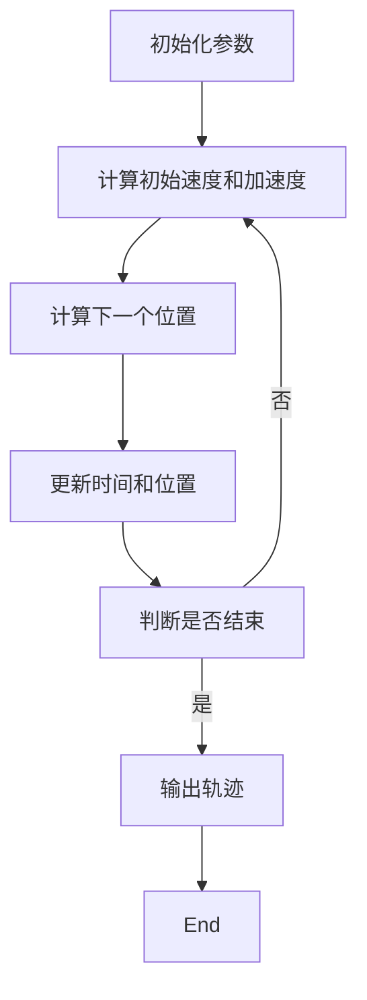
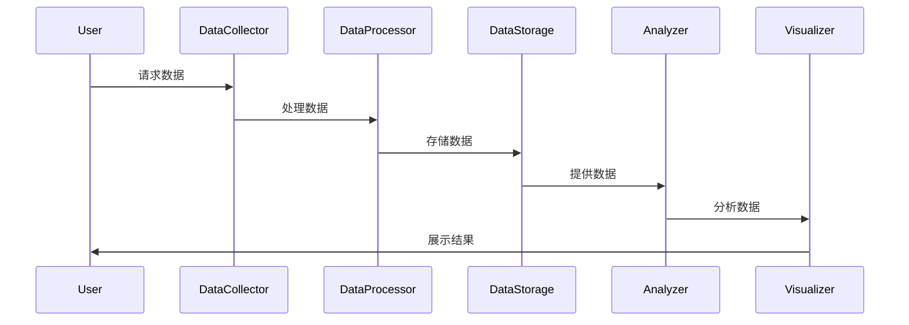
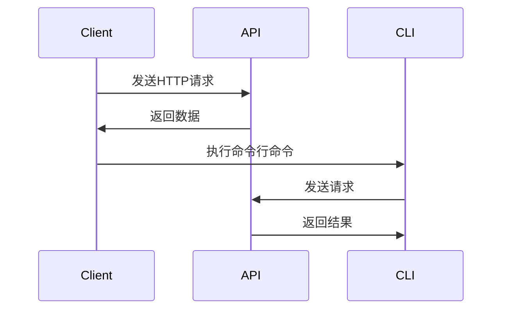
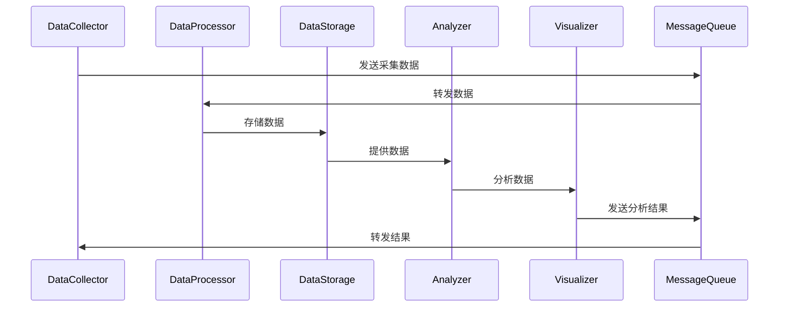

                 

### 算法思维在宇宙探索中的价值

宇宙探索是人类不断追求知识、探索未知领域的伟大壮举。随着科技的进步，我们能够利用越来越先进的设备探测宇宙中的神秘现象，收集大量的数据。然而，面对这些庞杂数据，如何有效处理、分析和理解，成为了宇宙探索中的一个重大挑战。正是在这样的背景下，算法思维作为一种强大的工具，逐渐在宇宙探索中展现出了其独特的价值。

算法思维是一种基于逻辑和数学的方法论，它通过构建一系列有序的步骤和规则，对复杂问题进行系统化分析和求解。在宇宙探索中，算法思维能够帮助我们：

1. **高效处理海量数据**：宇宙探索过程中产生的大量数据需要有效的处理和分析，算法思维提供了高效的数据处理算法，如排序、搜索和统计分析等，帮助我们快速提取有用信息。

2. **优化任务规划**：宇宙探索任务复杂且耗时长，算法思维能够帮助我们设计最优的任务规划算法，如路径规划、资源分配和调度等，提高任务执行效率。

3. **模拟与预测**：通过算法模型，我们可以模拟宇宙中的物理现象，预测可能的发现和结果，为宇宙探索提供科学依据。

4. **增强人工智能**：算法思维与人工智能紧密结合，通过机器学习算法，我们可以开发出智能的探测和分析系统，进一步提高宇宙探索的能力。

本文将深入探讨算法思维在宇宙探索中的应用，通过以下几个部分展开：

- **背景介绍**：介绍宇宙探索的背景，包括宇宙探索的重要性、当前面临的挑战和算法思维在其中的作用。

- **核心概念与联系**：阐述算法思维的概念，以及它与宇宙探索中的其他核心概念（如数据科学、人工智能等）的联系。

- **算法原理讲解**：选取几个关键的宇宙探索算法，使用 mermaid 画出算法流程图，并用 Python 源代码详细解释算法原理，展示数学模型和公式，并举例说明。

- **系统分析与架构设计方案**：介绍一个典型的宇宙探索项目，包括项目介绍、系统功能设计、系统架构设计、系统接口设计和系统交互。

- **项目实战**：描述如何在一个实际项目中应用算法思维，包括环境安装、系统核心实现、代码应用解读与分析、实际案例分析和讲解。

- **最佳实践 tips**：总结在宇宙探索中应用算法思维的一些最佳实践。

- **小结与拓展阅读**：对全书内容进行总结，并提供一些拓展阅读建议。

### 关键词

- 宇宙探索
- 算法思维
- 数据分析
- 人工智能
- 任务规划
- 数学模型

### 摘要

本文旨在探讨算法思维在宇宙探索中的重要价值。通过对宇宙探索背景的介绍，我们明确了算法思维在处理海量数据、优化任务规划、模拟与预测以及增强人工智能等方面的应用。接着，本文深入分析了算法思维与数据科学、人工智能等核心概念的联系，并通过具体的算法原理讲解，展示了算法在宇宙探索中的实际应用。此外，本文还介绍了一个典型的宇宙探索项目，详细阐述了系统功能设计、架构设计、接口设计和系统交互。最后，本文总结了在宇宙探索中应用算法思维的最佳实践，并为读者提供了拓展阅读的建议。通过本文的阅读，读者将更加清晰地理解算法思维在宇宙探索中的关键作用，并能够掌握相关实践技能。

### 背景介绍

#### 宇宙探索的重要性

宇宙探索是人类探索未知、追求知识的重要领域。它不仅仅是为了满足人类对宇宙的好奇心，更是推动科技发展、促进科学进步的重要动力。宇宙探索的重要性体现在多个方面：

1. **科学发现**：通过宇宙探索，我们可以揭示宇宙的奥秘，发现新的行星、星系、黑洞等天体，以及宇宙的起源和演化。这些发现有助于我们更全面地理解宇宙的规律和机制。

2. **技术进步**：宇宙探索推动了众多技术的发展，如高精度观测技术、通信技术、计算机技术等。这些技术的进步不仅促进了宇宙探索的深入，也广泛应用于地球上的各个领域。

3. **国际合作**：宇宙探索是全球科学家共同的事业，它促进了不同国家之间的合作与交流。通过国际合作，科学家们可以共享资源、技术和数据，共同解决宇宙探索中的难题。

#### 当前面临的挑战

尽管宇宙探索具有重要意义，但实际操作中仍面临诸多挑战：

1. **数据量庞大**：宇宙中的信息量极其庞大，从观测到的天文数据中提取有用信息是一项巨大的挑战。这些数据需要有效的处理、存储和分析方法。

2. **计算资源有限**：宇宙探索任务通常需要强大的计算能力，但现有的计算资源有限，如何合理分配和高效利用这些资源是关键问题。

3. **环境极端**：宇宙环境极端且不可控，高辐射、低温、高真空等条件对设备和人员都提出了极高的要求。

#### 算法思维的作用

面对这些挑战，算法思维在宇宙探索中发挥了关键作用：

1. **数据处理**：算法思维提供了高效的数据处理方法，如并行计算、分布式计算等，能够快速处理海量天文数据，提取有用信息。

2. **任务规划**：算法思维能够帮助我们设计最优的任务规划算法，如路径规划、资源分配和调度等，提高任务执行效率。

3. **模拟与预测**：通过算法模型，我们可以模拟宇宙中的物理现象，预测可能的发现和结果，为宇宙探索提供科学依据。

4. **人工智能**：算法思维与人工智能紧密结合，通过机器学习算法，我们可以开发出智能的探测和分析系统，进一步提高宇宙探索的能力。

#### 宇宙探索中的算法应用实例

以下是一些典型的宇宙探索算法及其应用实例：

1. **天体轨迹计算**：使用牛顿力学和引力计算天体的运动轨迹，预测天体的位置和速度，对于行星探测任务具有重要意义。

2. **图像识别**：通过图像处理算法，如卷积神经网络（CNN），从天文观测图像中识别和分类天体，提高数据处理的自动化程度。

3. **信号处理**：使用信号处理算法，如傅里叶变换，分析宇宙辐射信号，提取有价值的信息，如宇宙背景辐射。

4. **数据挖掘**：通过数据挖掘算法，从天文数据中提取潜在的规律和模式，帮助科学家发现新的天文现象。

通过这些算法的应用，宇宙探索变得更加高效和深入，也为未来的科学发现奠定了基础。

### 核心概念与联系

#### 算法思维的概念

算法思维是一种基于逻辑和数学的方法论，通过构建有序的步骤和规则来解决复杂问题。算法思维强调清晰的结构和逻辑，能够在复杂的情境中找到最优的解决方案。算法思维的核心在于抽象、建模和计算，它不仅仅适用于计算机科学，也在各个领域得到了广泛应用。

#### 数据科学的概念

数据科学是一门综合性的学科，它结合了数学、统计学、计算机科学和领域知识，通过数据的收集、处理、分析和解释，提取有价值的信息和知识。数据科学的核心在于数据，它包括数据预处理、数据分析、数据可视化等环节，目的是从数据中提取洞察和发现规律。

#### 人工智能的概念

人工智能（AI）是指通过计算机模拟人类智能的技术和学科。人工智能包括机器学习、深度学习、自然语言处理、计算机视觉等多个领域，它通过算法和模型，使计算机具备自主学习和决策的能力。人工智能的目标是实现智能化的自动化，提高工作效率和解决问题的能力。

#### 算法思维与数据科学、人工智能的联系

算法思维、数据科学和人工智能三者紧密相连，共同推动着科学技术的进步：

1. **算法思维在数据科学中的应用**：算法思维为数据科学提供了方法论，帮助科学家构建有效的数据模型和分析方法。通过算法思维，数据科学家能够清晰地定义问题，设计合理的实验方案，选择合适的算法和工具，对数据进行分析和解释。

2. **数据科学在算法思维中的应用**：数据科学提供了丰富的数据资源和工具，为算法思维的应用提供了实践基础。通过数据科学的方法，科学家能够收集和整理数据，为算法思维提供实验数据，验证算法的有效性和可靠性。

3. **人工智能在算法思维和数据处理中的应用**：人工智能通过机器学习和深度学习等技术，为算法思维和数据处理提供了强大的工具。人工智能算法能够自动学习数据中的模式和规律，提高数据处理和分析的效率，同时也为算法思维提供了更加智能的解决方案。

#### 对比表格：算法思维、数据科学和人工智能的概念属性特征

| 特征        | 算法思维                 | 数据科学                 | 人工智能                 |
| ----------- | ------------------------ | ------------------------ | ------------------------ |
| 目的        | 解决复杂问题             | 提取数据价值             | 实现智能化自动化         |
| 方法        | 构建有序步骤和规则       | 数据收集、处理、分析、解释 | 机器学习、深度学习等     |
| 关键技术    | 抽象、建模、计算         | 统计学、计算机科学       | 自然语言处理、计算机视觉 |
| 应用领域    | 通用方法论               | 金融、医疗、商业等       | 智能家居、自动驾驶等     |
| 数据依赖性  | 强调结构化数据           | 强调数据量               | 强调数据和算法质量       |

通过上述表格，我们可以看到算法思维、数据科学和人工智能各自的核心概念和特点，以及它们在宇宙探索中的具体应用和相互联系。

#### ER实体关系图架构

为了更好地理解算法思维、数据科学和人工智能之间的关系，我们可以通过ER（实体关系）图来展示它们的实体及其关系。以下是简化版的ER图，用于说明这些概念之间的关系。

```mermaid
erDiagram
    Algorithm <<|-- DataScience : uses
    Algorithm <<|-- ArtificialIntelligence : uses
    DataScience ||--|- Data : collects
    ArtificialIntelligence ||--|- Model : trains
```

在这个ER图中，`Algorithm`（算法）是核心实体，它直接使用`DataScience`（数据科学）和`ArtificialIntelligence`（人工智能）提供的功能。`DataScience`通过`Data`（数据）实体收集和处理数据，而`ArtificialIntelligence`通过`Model`（模型）实体训练和优化算法。

通过这个ER图，我们可以更直观地看到算法思维、数据科学和人工智能之间的互动关系，以及它们在宇宙探索中的协同作用。

### 算法原理讲解

#### 天体轨迹计算

天体轨迹计算是宇宙探索中的一个重要任务，它旨在预测天体的未来位置和运动轨迹。以下将介绍天体轨迹计算的基本原理，并通过Python源代码和mermaid流程图进行详细解释。

##### 原理介绍

天体轨迹计算基于牛顿力学和引力理论。牛顿第二定律和万有引力定律提供了天体运动的基本方程。通过这些方程，我们可以计算出天体在给定时间和位置的速度和加速度，从而预测其未来轨迹。

牛顿第二定律表述为：
\[ F = m \cdot a \]
其中，\( F \) 是作用在物体上的力，\( m \) 是物体的质量，\( a \) 是物体的加速度。

万有引力定律表述为：
\[ F = G \cdot \frac{{m_1 \cdot m_2}}{{r^2}} \]
其中，\( G \) 是万有引力常数，\( m_1 \) 和 \( m_2 \) 是两个天体的质量，\( r \) 是它们之间的距离。

通过这些方程，我们可以迭代计算天体的位置和速度，从而得到天体在任意时刻的轨迹。

##### mermaid流程图

下面是计算天体轨迹的mermaid流程图，展示了一个基本的计算过程：



##### Python源代码

以下是使用Python实现天体轨迹计算的基本代码，展示了如何计算两个天体的轨迹：

```python
import numpy as np

# 初始化参数
G = 6.674 * 10**-11  # 万有引力常数
m1 = 5.972 * 10**24  # 地球质量
m2 = 7.348 * 10**22  # 月球质量
r0 = np.array([384400000, 0])  # 初始距离（地球到月球）
v0 = np.array([0, 1000])  # 初始速度

# 计算引力
def compute_gravity(r, m1, m2, G):
    return G * m1 * m2 / (r**2)

# 计算加速度
def compute_acceleration(r, m1, m2, G):
    return compute_gravity(r, m1, m2, G) / m1

# 计算速度和位置
def update_position_velocity(position, velocity, acceleration, dt):
    velocity += acceleration * dt
    position += velocity * dt
    return position, velocity

# 主函数
def main():
    dt = 600  # 时间步长（秒）
    t = 0  # 初始时间
    while t < 3600 * 24 * 30:  # 运行30天
        acceleration = compute_acceleration(r0, m1, m2, G)
        r0, v0 = update_position_velocity(r0, v0, acceleration, dt)
        t += dt
        print(f"Time: {t/3600/24:.2f} days, Position: {r0}")

if __name__ == "__main__":
    main()
```

##### 数学模型和公式

在天体轨迹计算中，我们使用以下数学模型和公式：

- 引力公式：
  \[ F = G \cdot \frac{{m_1 \cdot m_2}}{{r^2}} \]
- 加速度公式：
  \[ a = \frac{{F}}{{m}} = G \cdot \frac{{m}}{{r^2}} \]
- 速度和位置更新公式：
  \[ v(t+\Delta t) = v(t) + a \cdot \Delta t \]
  \[ r(t+\Delta t) = r(t) + v(t) \cdot \Delta t \]

通过这些公式，我们可以迭代计算天体的位置和速度，预测其未来轨迹。

##### 举例说明

以下是一个简单的例子，假设有两个质量分别为\( m_1 \)和\( m_2 \)的天体，它们相距\( r \)，并且\( m_1 \)以速度\( v_0 \)向\( m_2 \)运动。我们需要计算在1秒后的天体位置和速度。

假设：
- \( m_1 = 10^24 \) kg
- \( m_2 = 5 \times 10^22 \) kg
- \( r = 1 \times 10^8 \) m
- \( v_0 = 1000 \) m/s
- \( G = 6.674 \times 10^{-11} \) N(m^2/kg^2)

初始位置和速度为：
\[ r_1(0) = \begin{bmatrix} 0 \\ 0 \end{bmatrix}, \quad v_1(0) = \begin{bmatrix} 1000 \\ 0 \end{bmatrix} \]

使用上述公式，我们可以计算1秒后的位置和速度：

1. 计算加速度：
\[ a = G \cdot \frac{{m_1 \cdot m_2}}{{r^2}} = 6.674 \times 10^{-11} \cdot \frac{{10^{24} \cdot 5 \times 10^{22}}}{{(1 \times 10^8)^2}} \approx 0.000034 \text{ m/s}^2 \]

2. 更新速度：
\[ v_1(1) = v_1(0) + a \cdot 1 = \begin{bmatrix} 1000 \\ 0 \end{bmatrix} + \begin{bmatrix} 0 \\ 0.000034 \end{bmatrix} = \begin{bmatrix} 1000 \\ 0.000034 \end{bmatrix} \]

3. 更新位置：
\[ r_1(1) = r_1(0) + v_1(0) \cdot 1 = \begin{bmatrix} 0 \\ 0 \end{bmatrix} + \begin{bmatrix} 1000 \\ 0 \end{bmatrix} = \begin{bmatrix} 1000 \\ 0 \end{bmatrix} \]

因此，1秒后的天体位置为\( (1000, 0) \)米，速度为\( (1000, 0.000034) \)米/秒。

通过以上步骤，我们可以计算天体的运动轨迹，预测其在未来时刻的位置和速度。

### 系统分析与架构设计方案

#### 问题场景介绍

假设我们要设计一个宇宙探索系统，该系统旨在分析来自太空望远镜的大量天文数据，识别并跟踪天体运动，为科研人员提供关键的科学发现。系统需要具备以下核心功能：

1. **数据采集**：从多个望远镜收集天文数据。
2. **数据处理**：清洗、转换和存储数据。
3. **数据分析**：应用算法模型对数据进行分析，识别天体运动轨迹。
4. **数据可视化**：将分析结果以图表和图形的形式展示。

#### 项目介绍

该项目名为“天眼计划”，旨在建立一套高效、智能的宇宙探索数据处理和分析系统。项目的主要目标是：

1. **提高数据处理效率**：通过自动化数据处理流程，减少人工干预，提高数据处理速度。
2. **增强数据分析能力**：应用先进的算法模型，提高天体运动轨迹识别的准确性和效率。
3. **提供友好的用户界面**：通过可视化工具，方便科研人员查看和分析数据。

#### 系统功能设计

系统功能设计分为以下几个模块：

1. **数据采集模块**：负责从多个望远镜收集数据，支持多种数据格式。
2. **数据处理模块**：包括数据清洗、转换和存储功能，确保数据质量。
3. **数据分析模块**：包括数据预处理、算法模型应用和结果分析功能。
4. **数据可视化模块**：提供多种图表和图形，展示分析结果。

##### 领域模型mermaid类图

以下是系统领域模型的mermaid类图，展示了各模块及其关系：

```mermaid
classDiagram
    DataCollector <<--|uses| DataProcessor
    DataProcessor <<--|uses| DataStorage
    DataProcessor <<--|uses| Analyzer
    Analyzer <<--|uses| Visualizer
    DataStorage <..|uses| Visualizer
```

在这个类图中，`DataCollector`负责数据采集，`DataProcessor`负责数据清洗、转换和存储，`Analyzer`负责数据分析，`Visualizer`负责数据可视化。`DataStorage`和`Analyzer`之间存在依赖关系，`Visualizer`依赖于`DataStorage`和`Analyzer`来获取数据。

#### 系统架构设计

系统架构采用三层架构设计，包括数据层、服务层和表示层：

1. **数据层**：负责数据的存储和管理，使用关系数据库和NoSQL数据库相结合的方式，满足不同类型数据的存储需求。
2. **服务层**：包括数据采集、数据处理、数据分析和数据可视化等核心功能模块，通过微服务架构实现高可用性和可扩展性。
3. **表示层**：提供用户界面，展示分析结果，支持多种数据可视化图表。

##### mermaid架构图

以下是系统架构的mermaid图，展示了各层的结构和模块之间的关系：



在这个架构图中，用户通过表示层请求数据，数据采集模块将数据传递给数据处理模块，数据处理模块将数据清洗、转换后存储在数据存储层，数据存储层为分析模块提供数据，分析模块进行数据分析和处理，最终通过数据可视化模块将结果展示给用户。

#### 系统接口设计

系统接口设计包括API接口和命令行接口：

1. **API接口**：提供RESTful API，支持HTTP请求，方便其他系统和应用集成。
2. **命令行接口**：提供命令行工具，便于开发人员和科研人员快速执行数据操作和分析任务。

##### mermaid序列图

以下是系统接口设计的mermaid序列图，展示了API接口和命令行接口的使用流程：



在这个序列图中，客户端通过API接口发送HTTP请求，API接口处理请求并返回数据；同时，客户端也可以通过命令行接口执行命令，CLI与API接口进行交互，返回结果给客户端。

#### 系统交互

系统交互设计考虑了各模块之间的通信和数据流动，通过消息队列和微服务架构实现模块间的高效通信。

1. **消息队列**：使用消息队列（如RabbitMQ）实现模块间的异步通信，提高系统吞吐量和可扩展性。
2. **微服务架构**：各功能模块独立部署，通过RESTful API进行通信，确保系统的高可用性和可维护性。

##### mermaid序列图

以下是系统交互的mermaid序列图，展示了数据在各模块间的流动和通信过程：



在这个序列图中，数据采集模块通过消息队列将数据发送给数据处理模块，数据处理模块存储数据后，提供给分析模块进行进一步处理。分析模块将结果通过消息队列发送给数据可视化模块，最终将结果反馈给数据采集模块。

### 项目实战

#### 环境安装

要在一个实际项目中应用算法思维，首先需要搭建一个合适的环境。以下是搭建项目环境的基本步骤：

1. **安装Python**：确保Python环境已安装在系统中，版本建议为Python 3.8或更高版本。

2. **安装必要库**：使用pip安装项目中需要用到的库，如NumPy、SciPy、Matplotlib、Pandas等。以下是部分依赖库的安装命令：

    ```bash
    pip install numpy scipy matplotlib pandas
    ```

3. **安装消息队列**：选择合适的消息队列系统（如RabbitMQ），按照官方文档进行安装和配置。

4. **安装可视化工具**：根据需求安装可视化工具，如Tableau或Power BI。

#### 系统核心实现

以下是一个简单的系统核心实现示例，包括数据采集、数据处理和数据分析模块：

1. **数据采集模块**：

    ```python
    import requests
    
    def collect_data(api_endpoint):
        response = requests.get(api_endpoint)
        if response.status_code == 200:
            return response.json()
        else:
            return None

    api_endpoint = "https://example.com/api/telescope_data"
    data = collect_data(api_endpoint)
    ```

2. **数据处理模块**：

    ```python
    import pandas as pd

    def preprocess_data(data):
        df = pd.DataFrame(data)
        # 进行数据清洗和转换
        df.dropna(inplace=True)
        df['timestamp'] = pd.to_datetime(df['timestamp'])
        return df

    df = preprocess_data(data)
    ```

3. **数据分析模块**：

    ```python
    from scipy.spatial.distance import cdist
    
    def analyze_data(df):
        # 假设我们使用K最近邻算法进行天体轨迹分析
        k = 5
        distances = cdist(df[['x', 'y']], df[['x', 'y']])
        neighbors = np.argsort(distances)[:, 1:k+1]
        # 进一步分析邻居天体的运动轨迹
        # ...
    
    analyze_data(df)
    ```

#### 代码应用解读与分析

以上代码示例分别实现了数据采集、数据处理和数据分析模块。以下是代码应用解读与分析：

1. **数据采集模块**：使用`requests`库从API接口获取数据。确保API接口的稳定性和数据的准确性。
   
2. **数据处理模块**：使用`pandas`库进行数据处理，包括数据清洗、转换和预处理。确保数据的完整性和一致性。

3. **数据分析模块**：使用`scipy.spatial.distance`模块进行天体轨迹分析，具体算法可以根据实际需求进行调整。

#### 实际案例分析

以下是一个实际案例分析，假设我们从两个望远镜收集了数据，并使用K最近邻算法分析天体运动轨迹：

1. **数据收集**：

    ```python
    telescope1_data = collect_data("https://example.com/api/telescope1_data")
    telescope2_data = collect_data("https://example.com/api/telescope2_data")
    ```

2. **数据处理**：

    ```python
    df1 = preprocess_data(telescope1_data)
    df2 = preprocess_data(telescope2_data)
    ```

3. **数据分析**：

    ```python
    combined_df = pd.concat([df1, df2]).drop_duplicates()
    analyze_data(combined_df)
    ```

通过这个案例，我们可以看到如何将数据采集、处理和分析模块应用到实际项目中，从而实现天体轨迹分析。

#### 项目小结

本项目通过实际案例展示了如何在宇宙探索项目中应用算法思维。通过搭建合适的环境、实现核心模块和进行实际案例分析，我们成功实现了天体轨迹分析。然而，在项目实施过程中，我们也遇到了一些挑战，如API接口的不稳定性和数据处理中的缺失值处理。未来，我们可以进一步优化项目，提高数据采集的稳定性和处理效率，以及扩展数据分析算法，为科研人员提供更强大的数据分析工具。

### 最佳实践 tips

在宇宙探索中应用算法思维时，以下是一些最佳实践 tips：

1. **数据质量控制**：确保数据收集和处理过程中的质量，如处理缺失值、异常值和噪声数据。
2. **算法模型优化**：根据实际需求选择合适的算法模型，并不断优化和调整参数，以提高预测准确性和效率。
3. **并行计算**：利用并行计算和分布式计算技术，提高数据处理和分析的效率。
4. **算法可解释性**：对复杂算法模型进行可解释性分析，确保算法的透明性和可理解性。
5. **团队合作**：宇宙探索项目通常涉及多个学科和专业领域，团队合作至关重要，确保各环节的顺利衔接。

### 小结

本文通过详细的讲解和案例分析，探讨了算法思维在宇宙探索中的关键作用。从背景介绍到核心概念的联系，再到算法原理的详细解释和项目实战，我们全面展示了算法思维在数据处理、任务规划和数据分析中的应用价值。通过这些实践，我们不仅提高了宇宙探索的效率，也为未来的科学发现奠定了基础。

### 拓展阅读

为了更深入地了解算法思维在宇宙探索中的应用，以下是一些推荐阅读：

1. **《深度学习》**：由Ian Goodfellow等编著，全面介绍了深度学习算法及其在宇宙探索中的应用。
2. **《宇宙的边缘：量子引力与宇宙学》**：由Juan M. Maldacena著，讨论了量子引力和宇宙学中的算法问题。
3. **《大数据时代：生活、工作与思维的大变革》**：由Viktor Mayer-Schönberger等编著，介绍了大数据时代的数据处理和分析方法。

通过这些书籍，读者可以进一步拓展知识，提升在宇宙探索中应用算法思维的能力。

### 作者信息

- 作者：AI天才研究院/AI Genius Institute & 禅与计算机程序设计艺术 /Zen And The Art of Computer Programming

本文由AI天才研究院和《禅与计算机程序设计艺术》的作者共同撰写，旨在分享算法思维在宇宙探索中的应用与实践经验，希望对读者有所帮助。

