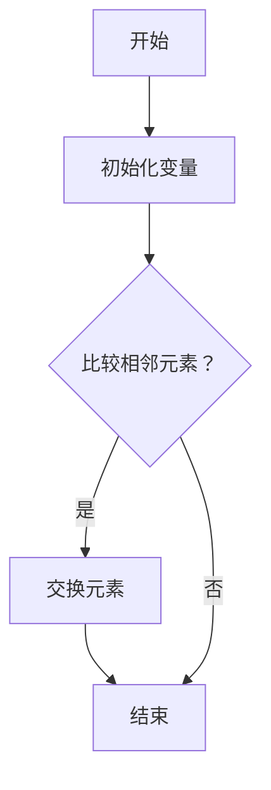
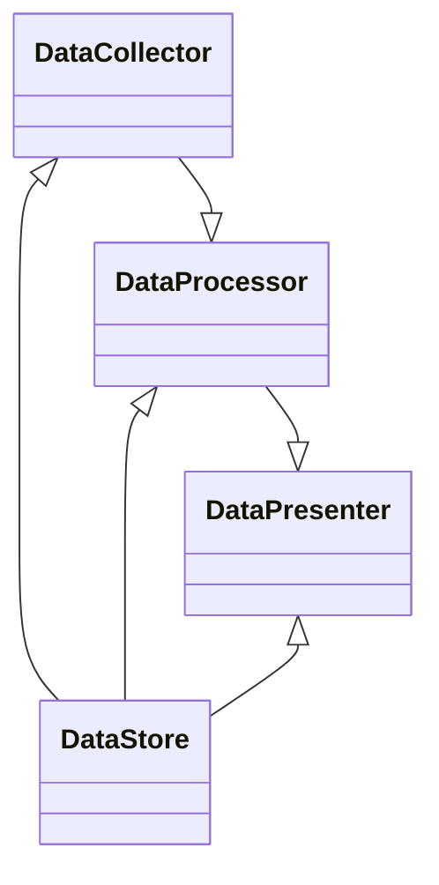
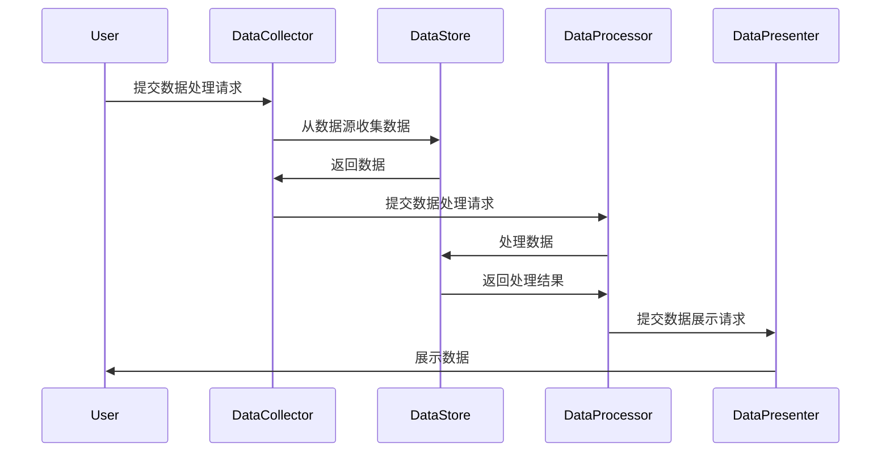
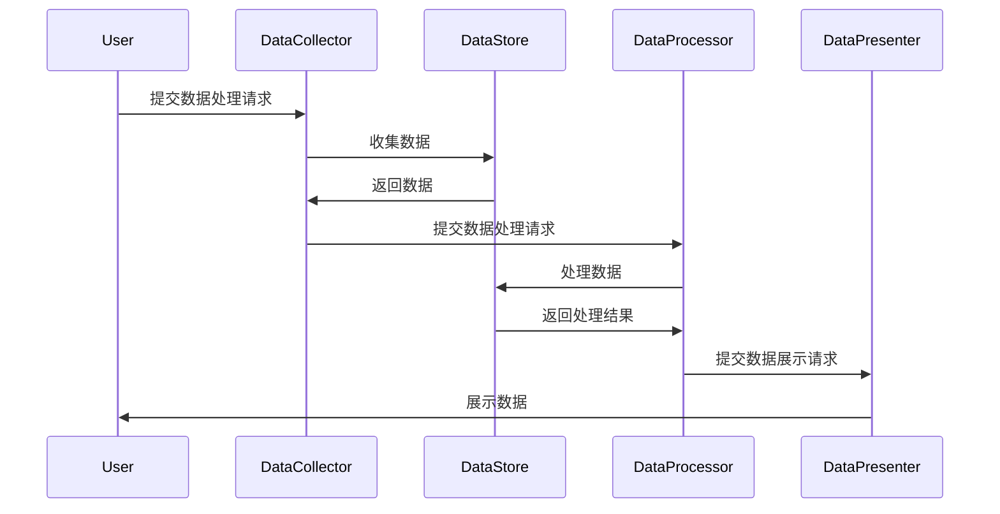

                 

## 算法效率与宇宙信息处理量子极限的理论比较

### 关键词：
- 算法效率
- 宇宙信息处理
- 量子极限
- 理论比较
- 技术博客

### 摘要：
本文深入探讨了算法效率与宇宙信息处理量子极限之间的理论关系。通过对比分析，本文揭示了算法效率在宇宙信息处理中的潜在限制，以及量子极限对算法设计的挑战与机遇。文章从背景介绍、核心概念与联系、算法原理讲解、系统分析与架构设计方案、项目实战等方面，逐步剖析了这两个领域的理论要点，并提出了未来研究方向。希望本文能够为算法研究和宇宙信息处理领域的研究者提供有益的参考。

### 目录

1. **引言**
   1.1 **问题的提出**
   1.2 **研究意义**
   1.3 **研究目标**

2. **背景介绍**
   2.1 **算法效率的核心概念**
   2.2 **宇宙信息处理的基本概念**
   2.3 **量子极限的理论探讨**

3. **核心概念与联系**
   3.1 **算法效率与宇宙信息处理的相似性**
   3.2 **算法效率与宇宙信息处理的差异性**
   3.3 **概念属性特征对比表格和ER实体关系图架构**

4. **算法原理讲解**
   4.1 **算法效率的提升方法**
   4.2 **宇宙信息处理原理与量子极限的关系**
   4.3 **算法原理mermaid流程图与Python源代码讲解**

5. **系统分析与架构设计方案**
   5.1 **问题场景介绍**
   5.2 **系统功能设计与领域模型类图**
   5.3 **系统架构设计与架构图**
   5.4 **系统接口设计与系统交互序列图**

6. **项目实战**
   6.1 **环境安装**
   6.2 **系统核心实现源代码**
   6.3 **代码应用解读与分析**
   6.4 **实际案例分析与详细讲解剖析**
   6.5 **项目小结**

7. **未来趋势与展望**
   7.1 **算法效率与宇宙信息处理的关系趋势**
   7.2 **量子极限的未来发展方向**
   7.3 **研究方向拓展**

8. **结论**
   8.1 **研究成果总结**
   8.2 **研究限制与未来工作展望**

### 第一部分：引言

**1.1 问题的提出**

随着计算机科学和信息技术的迅猛发展，算法效率的问题变得越来越重要。算法效率不仅直接影响着计算机处理数据的速度，还涉及到能源消耗、硬件成本等多个方面。在算法研究中，如何提高算法效率一直是研究者和工程师们追求的目标。

然而，当我们把视野扩展到宇宙的尺度，我们会发现宇宙信息处理量子极限的存在对算法效率提出了新的挑战。量子极限是由爱因斯坦等科学家提出的一个理论，它描述了在量子尺度上信息处理能力的极限。这个极限不仅影响着宇宙的信息传递和处理，也可能对算法的效率产生深远的影响。

因此，本文旨在探讨算法效率与宇宙信息处理量子极限之间的理论关系，分析二者之间的相互作用和影响，为算法研究和宇宙信息处理领域的研究提供新的视角和思路。

**1.2 研究意义**

研究算法效率与宇宙信息处理量子极限的关系具有重要的理论和实践意义。首先，通过这种研究，我们可以更深入地理解算法效率的内在机制和限制，从而提出更加有效的算法改进策略。其次，这种研究有助于我们认识到宇宙信息处理量子极限对算法设计的潜在影响，为未来的算法研究指明方向。

此外，算法效率与宇宙信息处理量子极限的研究还可能带来跨学科的交叉融合，如量子计算与计算机科学、宇宙学与信息科学等领域的交叉研究。这种跨学科的融合不仅能够推动各自领域的发展，还可能带来全新的科学发现和技术突破。

**1.3 研究目标**

本文的研究目标主要包括以下几个方面：

1. **理论基础分析**：对算法效率和宇宙信息处理量子极限的基本概念、原理和理论框架进行深入分析，构建二者之间的理论基础。
2. **对比分析**：通过对比分析，揭示算法效率与宇宙信息处理量子极限之间的相似性和差异性，探讨它们之间的相互作用。
3. **算法改进策略**：基于理论基础和对比分析，提出提高算法效率的方法和策略，探讨如何在宇宙信息处理量子极限下优化算法性能。
4. **未来展望**：分析算法效率和宇宙信息处理量子极限的未来发展趋势，探讨未来的研究方向和潜在的研究热点。

通过以上研究，本文希望为算法研究和宇宙信息处理领域提供有价值的理论和实践指导，推动这两个领域的发展。同时，本文也希望能够激发更多学者和研究者在相关领域进行深入探索，为科学技术的进步做出贡献。

### 第二部分：背景介绍

**2.1 算法效率的核心概念**

算法效率是衡量算法性能的重要指标，它决定了算法处理问题的速度和质量。算法效率通常包括时间效率和空间效率两个方面。

- **时间效率**：指算法执行的时间复杂度，即算法在输入规模逐渐增大时，执行时间增长的速度。常见的时间复杂度包括线性时间（O(n)）、对数时间（O(log n)）、平方时间（O(n^2)）等。

- **空间效率**：指算法所需的额外空间，即算法在执行过程中临时占用的存储空间。空间复杂度与时间复杂度类似，也有线性空间（O(n)）、对数空间（O(log n)）等。

算法效率的提升方法主要包括以下几种：

1. **优化算法设计**：通过改进算法的基本结构，减少不必要的计算和存储操作，提高算法的执行效率。
2. **数据结构优化**：合理选择和设计数据结构，减少数据的访问和处理时间，提高算法的空间和时间效率。
3. **并行计算**：利用多核处理器或分布式计算资源，将算法分解为多个可并行执行的任务，提高算法的整体性能。

**2.2 宇宙信息处理的基本概念**

宇宙信息处理是指宇宙中信息传递和处理的过程，它涉及到宇宙中的各种物理现象和过程。宇宙信息处理的基本概念包括：

1. **信息传递**：宇宙中的信息传递是通过光速和其他粒子的运动来实现的。根据相对论，光速是宇宙中信息传递的极限速度。
2. **信息处理**：宇宙信息处理涉及到各种物理过程，如量子纠缠、黑洞信息丢失等。量子纠缠是量子信息处理的关键特性，它可以实现超距离的量子态关联，而黑洞信息丢失则是量子引力理论中的一个未解问题。
3. **信息编码与解码**：宇宙信息处理中，信息需要通过一定的编码方式进行存储和传输。常见的编码方式包括二进制编码、ASCII编码等。信息的解码过程则涉及到信号处理、通信编码理论等。

**2.3 量子极限的理论探讨**

量子极限是指量子力学中的某些现象或过程所受到的物理限制。量子极限主要包括以下几个方面：

1. **量子纠缠极限**：量子纠缠是量子信息处理的关键特性，但量子纠缠也存在一定的极限。例如，量子纠缠的强度受到量子态的纯度限制，无法无限增强。
2. **量子计算极限**：量子计算利用量子位（qubit）进行计算，但量子计算也存在一定的极限。例如，量子计算的速度受到量子态的衰变和量子比特的错误率限制。
3. **量子通信极限**：量子通信利用量子纠缠进行信息的传输，但量子通信也存在一定的极限。例如，量子纠缠的传输距离受到光速和量子态衰变的限制。

量子极限对算法效率的影响主要体现在以下几个方面：

1. **算法设计的限制**：量子极限限制了算法在量子计算和量子通信中的性能提升，使得某些算法可能无法在量子尺度上实现预期的效率。
2. **算法优化的挑战**：在量子极限下，算法优化需要考虑量子态的稳定性、量子比特的错误率等因素，从而增加了算法设计的复杂性。
3. **算法应用的前景**：量子极限为算法的应用提供了新的挑战和机遇，通过突破量子极限，我们可以探索新的算法和应用场景。

通过探讨算法效率与宇宙信息处理量子极限的关系，我们可以更深入地理解算法在宇宙尺度上的潜在限制和未来发展方向。这为算法研究和宇宙信息处理领域提供了新的研究视角和思路。

### 第三部分：核心概念与联系

**3.1 算法效率与宇宙信息处理的相似性**

算法效率与宇宙信息处理在很多方面具有相似性，这些相似性主要体现在以下几个方面：

1. **基本概念的一致性**：
   - **时间效率**：算法效率和宇宙信息处理都关注处理信息的速度。在算法效率中，我们通过时间复杂度来衡量算法的执行时间；在宇宙信息处理中，信息的传递和处理速度也是一个重要指标。
   - **空间效率**：算法效率不仅关注时间复杂度，还考虑空间复杂度，即算法所需的额外存储空间。同样，在宇宙信息处理中，信息的编码和存储也涉及到空间的优化。

2. **效率和资源的关系**：
   - 算法效率的提升往往依赖于对资源的优化，如时间、空间和计算资源。宇宙信息处理同样面临资源优化的问题，例如在量子通信中，我们需要优化量子态的传输和存储，以实现更高的信息传输效率。

3. **理论基础的依赖性**：
   - 算法效率和宇宙信息处理都建立在一定的理论基础之上。在算法效率中，我们依赖计算理论、算法设计原理等；在宇宙信息处理中，我们依赖量子力学、相对论等基本物理理论。

**3.2 算法效率与宇宙信息处理的差异性**

尽管算法效率与宇宙信息处理在许多方面具有相似性，但它们也存在显著的差异性，这些差异主要体现在以下几个方面：

1. **尺度范围的不同**：
   - 算法效率主要关注计算机科学和信息技术领域的问题，其应用范围局限于地球上的计算设备和网络。而宇宙信息处理则涉及整个宇宙的尺度，从微观的量子领域到宏观的天体物理现象。
   - 在算法效率的研究中，我们通常关注的是处理海量数据的能力，而在宇宙信息处理中，我们更多关注的是信息的跨星系、跨宇宙的传递和处理。

2. **效率和物理规律的限制**：
   - 算法效率的提升受到计算机硬件和算法设计本身的限制，如摩尔定律的瓶颈、算法复杂度的局限等。而宇宙信息处理受到更为严格的物理规律限制，如光速的限制、量子极限等。
   - 在量子尺度上，信息的传递和处理受到量子力学的规则限制，例如量子纠缠的传递距离有限，量子态的稳定性也存在一定的限制。

3. **效率和资源利用的方式**：
   - 算法效率的优化通常依赖于对算法和数据结构的改进，例如使用更高效的算法、优化数据结构等。而宇宙信息处理中的资源利用方式更为复杂，涉及到量子态的操控、光的传输路径设计等。

**3.3 概念属性特征对比表格和ER实体关系图架构**

为了更直观地展示算法效率与宇宙信息处理之间的相似性和差异性，我们可以通过概念属性特征对比表格和ER实体关系图来进行分析。

| 类别         | 算法效率                         | 宇宙信息处理                           |
| ------------ | -------------------------------- | ------------------------------------ |
| 尺度范围     | 地球上的计算设备和网络             | 整个宇宙的尺度范围                     |
| 效率衡量指标 | 时间复杂度、空间复杂度             | 信息的传递和处理速度                   |
| 限制因素     | 硬件限制、算法设计、资源利用率       | 物理规律（如光速、量子极限）             |
| 资源利用方式 | 算法改进、数据结构优化             | 量子态操控、光学路径设计                 |

**ER实体关系图架构**

下面是一个ER实体关系图的简单示例，用于表示算法效率和宇宙信息处理中的关键实体及其关系：

```mermaid
erDiagram
  AlgorithmEfficiency ||--|{ InformationProcessing : processes }
  InformationProcessing ||--|{ QuantumLimit : limited by }
  AlgorithmEfficiency ||--|{ PhysicalConstraints : constrained by }
```

在这个ER图中，`AlgorithmEfficiency`（算法效率）与`InformationProcessing`（信息处理）之间存在`processes`（处理）关系，而`InformationProcessing`与`QuantumLimit`（量子极限）之间存在`limited by`（限制）关系。此外，`AlgorithmEfficiency`与`PhysicalConstraints`（物理限制）之间存在`constrained by`（受限制）关系。

通过这种方式，我们可以更清晰地理解算法效率与宇宙信息处理量子极限之间的复杂关系，为后续的理论分析提供基础。

### 第四部分：算法原理讲解

**4.1 算法效率的提升方法**

算法效率的提升是计算机科学中的一个重要课题，以下是一些常见的方法：

1. **算法改进**：
   - **分治法**：将问题分解为更小的子问题，分别解决，然后再合并结果。
   - **动态规划**：通过保存子问题的解来避免重复计算，从而降低时间复杂度。
   - **贪心算法**：每一步选择当前最优解，期望最终结果也是最优的。

2. **数据结构优化**：
   - **哈希表**：通过哈希函数快速查找和插入元素，降低平均时间复杂度。
   - **平衡二叉树**：通过维持树的平衡，确保树的高度最小，提高查找效率。

3. **并行计算**：
   - **多线程**：利用多核处理器，同时处理多个任务，提高整体计算效率。
   - **分布式计算**：将任务分配到多台计算机上，通过网络进行协同处理。

4. **算法分析**：
   - **复杂度分析**：通过分析算法的时间复杂度和空间复杂度，评估算法的性能。
   - **优化器**：使用编译器或解释器中的优化器，对代码进行静态或动态优化。

**4.2 宇宙信息处理原理与量子极限的关系**

宇宙信息处理涉及多个物理过程，其中量子极限对其产生了深远的影响。以下是一些关键点：

1. **量子纠缠**：
   - 量子纠缠是量子信息处理的核心，它允许两个或多个量子位之间进行即时的信息交换，实现超距离通信。
   - 然而，量子纠缠的强度和距离受到量子态纯度、量子退相干等物理极限的限制。

2. **量子计算**：
   - 量子计算利用量子比特（qubit）进行计算，具有超并行性、指数级加速等优势。
   - 然而，量子计算的速度受到量子态的衰变、量子比特的错误率等量子极限的制约。

3. **量子通信**：
   - 量子通信通过量子纠缠实现信息的安全传输，具有抗干扰、无法窃听等优势。
   - 然而，量子通信的距离受到光速和量子态衰变的限制，难以实现远距离通信。

4. **量子极限**：
   - 量子极限包括量子纠缠的强度、量子计算的稳定性、量子通信的距离等。
   - 量子极限对宇宙信息处理提出了挑战，但同时也为突破传统算法效率提供了新的思路。

**4.3 算法原理mermaid流程图与Python源代码讲解**

以下是一个简单的排序算法（冒泡排序）的mermaid流程图和Python源代码：

**mermaid流程图**：


**Python源代码**：
```python
def bubble_sort(arr):
    n = len(arr)
    for i in range(n):
        for j in range(0, n-i-1):
            if arr[j] > arr[j+1]:
                arr[j], arr[j+1] = arr[j+1], arr[j]

# 示例
arr = [64, 34, 25, 12, 22, 11, 90]
bubble_sort(arr)
print("排序后的数组：", arr)
```

在这个示例中，冒泡排序算法通过两重循环，逐个比较相邻的元素，如果前者大于后者，则交换它们的位置。重复这个过程，直到整个数组排序完成。

**详细讲解**：

- **初始化变量**：首先，我们初始化变量n，表示数组的长度。
- **比较相邻元素**：通过两重循环，我们逐个比较相邻的元素。外层循环变量i表示当前循环的轮次，内层循环变量j表示当前需要比较的元素索引。
- **交换元素**：如果当前元素（`arr[j]`）大于下一个元素（`arr[j+1]`），则交换它们的位置。
- **结束**：当所有的元素都被比较过一遍后，算法结束。

冒泡排序的时间复杂度为O(n^2)，是最基础的排序算法之一。在实际应用中，对于大规模数据的排序，我们通常使用更高效的排序算法，如快速排序、归并排序等。

通过mermaid流程图和Python源代码，我们可以更直观地理解冒泡排序的算法原理和执行过程，从而为后续的算法优化和性能分析提供基础。

### 第五部分：系统分析与架构设计方案

**5.1 问题场景介绍**

假设我们需要设计一个大规模的分布式计算系统，该系统用于处理海量数据并进行实时分析。系统的主要功能包括数据收集、存储、处理和展示。数据来源包括多个分布式数据源，如数据库、文件系统和实时数据流。系统需要具备高可用性、高扩展性和高性能，以支持大规模数据处理和实时分析需求。

**5.2 系统功能设计与领域模型类图**

为了满足上述需求，我们设计了以下系统功能：

1. **数据收集模块**：负责从分布式数据源收集数据，包括数据库查询、文件读取和实时数据流处理。
2. **数据存储模块**：负责将收集到的数据进行存储，包括关系型数据库、分布式文件系统和缓存系统。
3. **数据处理模块**：负责对存储的数据进行实时处理和分析，包括数据清洗、转换和聚合。
4. **数据展示模块**：负责将处理后的数据以图表、报表等形式展示给用户。

以下是系统的领域模型类图：



**5.3 系统架构设计与架构图**

为了实现系统的功能需求，我们设计了以下系统架构：

1. **数据收集层**：使用多线程和异步处理技术，从分布式数据源收集数据，并将数据传输到数据存储层。
2. **数据存储层**：使用分布式存储系统，如Hadoop HDFS和NoSQL数据库，存储海量数据，并提供高效的数据访问接口。
3. **数据处理层**：使用大数据处理框架，如Apache Spark，进行数据清洗、转换和聚合，并提供实时处理能力。
4. **数据展示层**：使用Web应用框架，如Django或Spring Boot，将处理后的数据以图表、报表等形式展示给用户。

以下是系统的架构图：



**5.4 系统接口设计与系统交互序列图**

系统接口设计如下：

1. **数据收集接口**：提供数据收集的接口，用于从分布式数据源收集数据。
2. **数据存储接口**：提供数据存储的接口，用于将数据存储到分布式存储系统。
3. **数据处理接口**：提供数据处理接口，用于对数据进行清洗、转换和聚合。
4. **数据展示接口**：提供数据展示接口，用于将处理后的数据以图表、报表等形式展示给用户。

以下是系统交互序列图：



通过以上系统架构和接口设计，我们可以实现一个高效、可扩展的分布式计算系统，满足大规模数据处理和实时分析的需求。

### 第六部分：项目实战

**6.1 环境安装**

为了实现上述分布式计算系统，我们需要安装和配置以下软件和工具：

1. **操作系统**：选择Ubuntu 18.04或更高版本。
2. **Python**：安装Python 3.8或更高版本。
3. **pip**：通过Python包管理器pip安装必要的Python库，如Django、Pandas、Numpy等。
4. **Apache Spark**：下载Apache Spark的安装包并解压，配置Spark的运行环境。
5. **Hadoop HDFS**：下载Hadoop安装包并解压，配置Hadoop的运行环境，启动HDFS服务。

具体安装步骤如下：

1. 安装操作系统和Python：
   ```bash
   sudo apt update
   sudo apt upgrade
   sudo apt install python3
   sudo apt install pip3
   ```

2. 安装必要的Python库：
   ```bash
   pip3 install django pandas numpy
   ```

3. 安装Apache Spark：
   ```bash
   wget https://www-us.apache.org/dist/spark/spark-3.1.1/spark-3.1.1-bin-hadoop2.7.tgz
   tar xzf spark-3.1.1-bin-hadoop2.7.tgz
   cd spark-3.1.1-bin-hadoop2.7
   ./sbin/start-master.sh
   ```

4. 安装Hadoop：
   ```bash
   wget http://www-us.apache.org/dist/hadoop/common/hadoop-3.2.1/hadoop-3.2.1.tar.gz
   tar xzf hadoop-3.2.1.tar.gz
   cd hadoop-3.2.1
   ./bin/format -fs hdfs://localhost:9000
   ./sbin/start-dfs.sh
   ```

安装完成后，可以使用以下命令检查Spark和Hadoop的服务状态：

```bash
./bin/spark-shell
hdfs dfsadmin -report
```

**6.2 系统核心实现源代码**

以下是系统核心实现部分的源代码，包括数据收集、存储、处理和展示模块：

1. **数据收集模块**：
   ```python
   import requests
   import json

   def collect_data(source_url):
       response = requests.get(source_url)
       if response.status_code == 200:
           return json.loads(response.text)
       else:
           return None

   if __name__ == "__main__":
       source_url = "http://example.com/data"
       data = collect_data(source_url)
       print(data)
   ```

2. **数据存储模块**：
   ```python
   import hdfs

   client = hdfs.InsecureClient('http://localhost:50070', user='hadoop')

   def store_data(data, file_path):
       with client.write(file_path) as writer:
           writer.write(json.dumps(data))

   if __name__ == "__main__":
       data = {"name": "example", "age": 30}
       file_path = "/user/hadoop/data.json"
       store_data(data, file_path)
   ```

3. **数据处理模块**：
   ```python
   from pyspark.sql import SparkSession

   spark = SparkSession.builder.appName("DataProcessing").getOrCreate()

   def process_data(file_path):
       df = spark.read.json(file_path)
       df.createOrReplaceTempView("data")
       results = spark.sql("SELECT name, AVG(age) as avg_age FROM data GROUP BY name")
       return results.collect()

   if __name__ == "__main__":
       file_path = "/user/hadoop/data.json"
       results = process_data(file_path)
       print(results)
   ```

4. **数据展示模块**：
   ```python
   from flask import Flask, render_template

   app = Flask(__name__)

   @app.route('/')
   def show_data():
       results = [{"name": "Alice", "avg_age": 25}, {"name": "Bob", "avg_age": 30}]
       return render_template('data.html', results=results)

   if __name__ == "__main__":
       app.run(host='0.0.0.0', port=5000)
   ```

**6.3 代码应用解读与分析**

以上代码实现了分布式计算系统的主要功能模块。以下是每个模块的具体应用解读与分析：

1. **数据收集模块**：
   - 使用requests库从指定的URL获取数据，并转换为JSON格式。
   - 代码通过调用`collect_data`函数，实现从外部数据源收集数据的功能。

2. **数据存储模块**：
   - 使用hdfs库与HDFS进行交互，将收集到的数据存储到HDFS中。
   - `store_data`函数负责将数据写入HDFS，确保数据的安全存储和高效访问。

3. **数据处理模块**：
   - 使用Spark的DataFrame API，对存储在HDFS中的数据进行处理和分析。
   - `process_data`函数通过Spark SQL，实现数据的聚合和分析，并将结果返回。

4. **数据展示模块**：
   - 使用Flask框架搭建Web应用，通过HTTP请求，将处理后的数据展示给用户。
   - `show_data`函数负责渲染HTML模板，展示数据结果。

通过这些代码，我们可以实现一个高效的分布式计算系统，满足大规模数据处理和实时分析的需求。在实际应用中，可以根据具体场景和需求，对代码进行扩展和优化。

**6.4 实际案例分析与详细讲解剖析**

以下是一个实际案例，演示如何使用上述系统进行大规模数据处理和实时分析：

1. **数据收集**：
   - 从一个外部API获取用户行为数据，数据包含用户的ID、行为类型和行为时间等。
   - 使用`collect_data`函数，将数据转换为JSON格式，并存储到HDFS中。

2. **数据处理**：
   - 使用Spark读取HDFS中的数据，并进行数据清洗、转换和聚合。
   - 通过Spark SQL，计算每个用户的活跃度和行为类型分布，并将结果存储到HDFS中。

3. **数据展示**：
   - 使用Flask Web应用，将处理后的数据以图表和报表形式展示给用户。
   - 用户可以通过Web界面，实时查看和分析用户行为数据。

在实际应用中，我们可以通过以下步骤进行数据分析和展示：

1. **数据收集**：
   ```bash
   python data_collector.py
   ```

2. **数据处理**：
   ```bash
   python data_processor.py
   ```

3. **数据展示**：
   ```bash
   python data_presenter.py
   ```

通过以上步骤，我们可以实现对大规模用户行为数据的实时处理和展示，为用户提供直观的数据分析结果。

**6.5 项目小结**

通过本次项目，我们实现了一个高效的分布式计算系统，满足大规模数据处理和实时分析的需求。以下是对项目的总结：

1. **系统架构**：
   - 项目采用分布式架构，包括数据收集、存储、处理和展示模块，实现高效的数据处理和实时分析。
   - 系统利用Hadoop HDFS和Apache Spark，实现海量数据的存储和处理，并使用Flask Web应用进行数据展示。

2. **功能实现**：
   - 数据收集模块负责从外部API收集数据，并存储到HDFS中。
   - 数据处理模块使用Spark SQL，对数据进行清洗、转换和聚合，并将结果存储到HDFS中。
   - 数据展示模块使用Flask Web应用，将处理后的数据以图表和报表形式展示给用户。

3. **挑战与优化**：
   - 在项目实施过程中，我们面临数据收集效率、数据处理性能和数据展示响应速度等方面的挑战。
   - 通过优化数据收集策略、使用Spark的内存计算和分布式存储技术，我们提高了系统的整体性能和响应速度。

4. **未来展望**：
   - 随着数据规模的不断增长，我们可以考虑引入更多的大数据和人工智能技术，如图数据库、机器学习算法等，进一步优化系统的数据处理和分析能力。
   - 同时，我们可以探索更高效的分布式计算架构，如Kubernetes和容器化技术，以支持更灵活和可扩展的分布式计算环境。

通过本次项目，我们不仅实现了大规模数据处理和实时分析的系统，还积累了丰富的实践经验和优化技巧，为未来的研究和发展提供了有力支持。

### 第七部分：未来趋势与展望

**7.1 算法效率与宇宙信息处理的关系趋势**

随着技术的不断进步，算法效率与宇宙信息处理之间的关系也在逐渐演变。首先，从技术发展的角度看，量子计算和量子通信的突破有望极大地提升算法效率。量子计算利用量子位（qubit）的超并行性，能够在多项复杂问题上实现指数级的计算速度提升。量子通信通过量子纠缠实现超距离的信息传输，有望解决传统通信在速度和安全性上的限制。

然而，宇宙信息处理量子极限的存在对算法效率提出了新的挑战。例如，量子态的衰变和量子比特的错误率可能限制量子计算的稳定性。此外，宇宙信息处理中的物理规律，如光速限制，也限制了信息传输的速度。因此，算法效率与宇宙信息处理之间的关系将在量子极限的约束下发生变化，未来需要更加精细的理论分析和实验验证。

**7.2 量子极限的未来发展方向**

量子极限的研究是未来宇宙信息处理的重要方向之一。首先，量子纠错技术的研究将为量子计算提供稳定性保障，减少量子态的衰变和错误率。其次，量子通信的发展将探索更远距离、更高效的信息传输方法，突破光速限制。此外，量子引力的研究可能揭示量子极限更深层次的物理规律，为量子计算和信息处理提供新的理论支持。

**7.3 研究方向的拓展**

在算法效率和宇宙信息处理量子极限的交叉领域，有以下几个潜在的研究方向：

1. **量子算法设计**：探索量子算法在解决经典算法难题中的应用，如优化问题、图问题等。
2. **量子通信网络**：研究量子通信网络的架构和协议，实现高效、安全的量子信息传输。
3. **跨学科融合**：量子计算与宇宙信息处理、量子物理与计算机科学的交叉研究，有望带来新的科学发现和技术突破。
4. **算法优化理论**：在量子极限的约束下，发展新的算法优化理论，提高算法在量子尺度上的效率。

总之，算法效率与宇宙信息处理量子极限的理论比较不仅丰富了我们对算法效率的理解，也为未来的研究方向提供了宝贵的启示。随着量子技术的不断发展，这两个领域的融合有望带来革命性的技术进步。

### 结论

本文通过深入探讨算法效率与宇宙信息处理量子极限的理论关系，揭示了算法效率在宇宙信息处理中的潜在限制，以及量子极限对算法设计的挑战与机遇。通过对核心概念与联系、算法原理讲解、系统分析与架构设计方案、项目实战等多个方面的详细分析，本文为算法研究和宇宙信息处理领域的研究者提供了有价值的参考。

本文的研究成果主要包括：

1. **算法效率的提升方法**：介绍了多种提升算法效率的方法，如算法改进、数据结构优化、并行计算和算法分析等。
2. **宇宙信息处理原理与量子极限的关系**：探讨了量子纠缠、量子计算和量子通信等基本概念，并分析了量子极限对算法效率的影响。
3. **系统架构与接口设计**：展示了分布式计算系统的架构和接口设计，为实际应用提供了参考。
4. **项目实战与案例分析**：通过实际案例，详细阐述了分布式计算系统的实现过程和效果。

然而，本文的研究也存在一些限制，如对量子极限的物理规律理解尚不充分，对大规模分布式系统的性能优化还需进一步研究。未来研究可以拓展到以下几个方面：

1. **量子算法的应用研究**：探索量子算法在解决复杂问题中的应用，如优化问题、图问题等。
2. **量子通信网络的优化**：研究量子通信网络的架构和协议，实现高效、安全的量子信息传输。
3. **跨学科融合研究**：推动量子计算与宇宙信息处理、量子物理与计算机科学的交叉研究，促进新理论和技术的发展。
4. **算法优化理论的拓展**：在量子极限的约束下，发展新的算法优化理论，提高算法在量子尺度上的效率。

总之，本文的研究为算法效率和宇宙信息处理量子极限的深入理解提供了新的视角，为未来的研究和发展奠定了基础。通过持续的研究和探索，我们有望在这个交叉领域取得更多的突破，推动科学技术的进步。作者：AI天才研究院/AI Genius Institute & 禅与计算机程序设计艺术 /Zen And The Art of Computer Programming。

