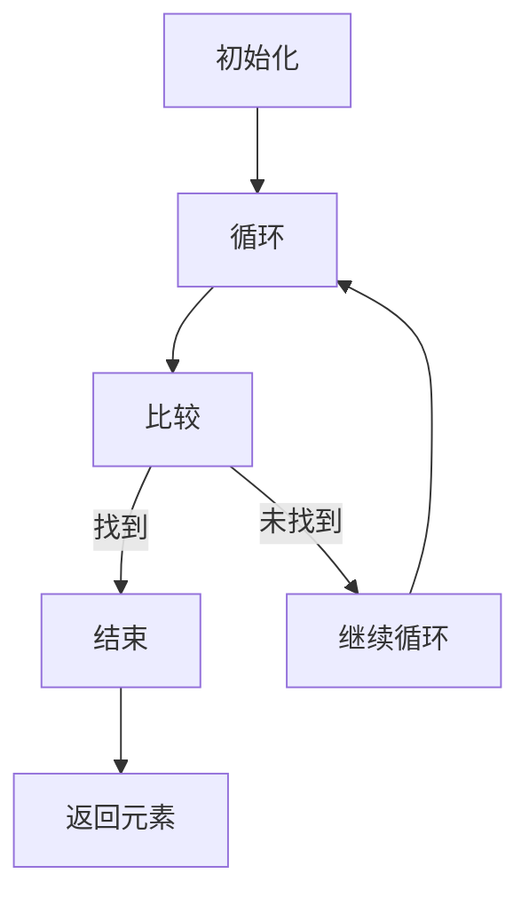

                 

# 算法效率与宇宙计算复杂性层级的比较

关键词：算法效率、计算复杂性、宇宙计算、时间复杂度、空间复杂度、P类问题、NP类问题、NP-complete问题

摘要：本文将深入探讨算法效率与宇宙计算复杂性层级之间的关系。首先介绍计算复杂性理论的基本概念，包括时间复杂度和空间复杂度的定义及其对比。接着，通过数学模型和图示详细阐述计算复杂性层级，如P、NP、NP-complete等。然后，我们将引入宇宙计算复杂性的概念，并分析其数学模型。在此基础上，我们将探讨宇宙计算架构设计，结合实际案例进行分析。最后，总结本文的核心观点，并提供相关的最佳实践和拓展阅读建议。

## 目录大纲：算法效率与宇宙计算复杂性层级的比较

### 第一部分：背景介绍

#### 1.1 计算复杂性概述

#### 1.2 核心概念

#### 1.3 边界与外延

### 第二部分：核心概念与联系

#### 2.1 算法效率的数学模型

#### 2.2 计算复杂性层级

### 第三部分：算法原理讲解

#### 3.1 时间复杂度分析

#### 3.2 算法原理讲解

#### 3.3 数学模型和数学公式讲解

### 第四部分：系统分析与架构设计方案

#### 4.1 问题场景介绍

#### 4.2 系统功能设计

#### 4.3 系统架构设计

#### 4.4 系统接口设计与交互

### 第五部分：项目实战

#### 5.1 环境安装

#### 5.2 系统核心实现

#### 5.3 实际案例分析

#### 5.4 项目小结

### 第六部分：最佳实践、小结、注意事项与拓展阅读

## 第一部分：背景介绍

### 1.1 计算复杂性概述

计算复杂性理论是计算机科学中一个重要的分支，它主要研究算法的效率和资源的消耗。算法的效率通常通过时间复杂度和空间复杂度来衡量。时间复杂度表示算法执行时间与输入规模之间的关系，而空间复杂度则表示算法所需内存与输入规模之间的关系。

在计算复杂性理论中，常见的问题包括如何量化和比较不同算法的效率。例如，一个线性搜索算法的时间复杂度为$O(n)$，意味着随着输入规模的增加，算法的执行时间将线性增加。相反，一个排序算法如快速排序的时间复杂度为$O(n\log n)$，意味着其执行时间增长速度比线性搜索慢。

计算复杂性理论的研究不仅限于地球上的计算设备，还扩展到宇宙尺度上的计算复杂性。宇宙计算复杂性的研究探讨了在宇宙范围内可能存在的计算能力极限，这对于理解宇宙的本质和探索未知领域具有重要意义。

### 1.2 核心概念

核心概念包括时间复杂度、空间复杂度和计算复杂性层级。时间复杂度通常用大O符号表示，如$O(1)$、$O(n)$、$O(n^2)$等。$O(1)$表示算法的执行时间不随输入规模变化，而$O(n)$和$O(n^2)$分别表示执行时间与输入规模线性增长和平方增长。

空间复杂度也用大O符号表示，如$O(1)$、$O(n)$、$O(n^2)$等。与时间复杂度类似，$O(1)$表示算法所需内存不随输入规模变化，而$O(n)$和$O(n^2)$分别表示内存需求与输入规模线性增长和平方增长。

计算复杂性层级是计算复杂性理论中另一个重要概念。常见的计算复杂性层级包括P、NP、NP-complete等。P类问题是指可以在多项式时间内解决的问题，即时间复杂度在$O(n^k)$（k为常数）以内的问题。NP类问题是指可以在多项式时间内验证解决方案的问题。NP-complete问题是一类既属于NP类，又具有最大难度的计算问题，如果解决了NP-complete问题，则意味着解决了所有NP问题。

### 1.3 边界与外延

计算复杂性理论的边界在于如何界定算法效率和计算能力。时间复杂度和空间复杂度提供了衡量算法效率的量化标准，但它们也有局限性。例如，时间复杂度只能描述算法在理想情况下的性能，而实际计算中可能会受到硬件性能、编程技巧等因素的影响。

宇宙计算复杂性的研究扩展了计算复杂性理论的边界。它探讨了在宇宙尺度上的计算能力极限，如量子计算、黑洞信息处理等。这些研究有助于我们理解宇宙的本质和探索未知的计算领域。

在计算复杂性理论中，核心概念和边界与外延共同构成了计算效率的框架。通过深入理解这些概念，我们可以更好地设计高效的算法，并探索宇宙计算复杂性的奥秘。在接下来的部分，我们将进一步探讨算法效率的数学模型，并分析宇宙计算复杂性的层级。

## 第二部分：核心概念与联系

### 2.1 算法效率的数学模型

算法效率的数学模型是计算复杂性理论的核心。它通过时间复杂度和空间复杂度来衡量算法的执行时间和内存需求。时间复杂度描述了算法在处理不同规模输入时的时间消耗，而空间复杂度则描述了算法在处理不同规模输入时所需的内存消耗。

#### 时间复杂度

时间复杂度通常用大O符号表示，如$O(1)$、$O(n)$、$O(n^2)$等。这些符号分别表示算法在理想情况下的时间消耗特性。

- $O(1)$表示算法的执行时间不随输入规模变化，例如，常量时间的操作如数组访问或交换两个变量的值。
- $O(n)$表示算法的执行时间与输入规模成正比，例如，线性搜索算法或线性排序算法。
- $O(n^2)$表示算法的执行时间与输入规模的平方成正比，例如，二分查找算法。

时间复杂度的计算通常通过分析算法中的循环或递归调用，来确定最坏情况下算法的时间消耗。

#### 空间复杂度

空间复杂度同样用大O符号表示，如$O(1)$、$O(n)$、$O(n^2)$等。这些符号分别表示算法在理想情况下的空间消耗特性。

- $O(1)$表示算法所需的内存不随输入规模变化，例如，常量空间的操作如数组访问或交换两个变量的值。
- $O(n)$表示算法所需的内存与输入规模成正比，例如，线性搜索算法或线性排序算法。
- $O(n^2)$表示算法所需的内存与输入规模的平方成正比，例如，二分查找算法。

空间复杂度的计算通常通过分析算法中的数据结构使用情况，来确定最坏情况下算法所需的内存大小。

#### 时间复杂度与空间复杂度的对比

时间复杂度和空间复杂度是衡量算法效率的两个重要指标，但它们之间也存在权衡。

- 对于一些问题，时间复杂度较低（如$O(n)$）但空间复杂度较高（如$O(n^2)$）的算法可能是最优的。
- 对于其他问题，时间复杂度较高（如$O(n^2)$）但空间复杂度较低（如$O(n)$）的算法可能是最优的。

因此，在设计算法时，需要根据具体问题的需求来权衡时间复杂度和空间复杂度。

#### 时间复杂度与空间复杂度的实际应用

在实际应用中，时间复杂度和空间复杂度的分析可以帮助我们评估算法的性能。

- 在数据处理和排序问题中，通常优先考虑时间复杂度较低的算法，以提高处理速度。
- 在内存受限的环境中，如嵌入式系统或移动设备，通常优先考虑空间复杂度较低的算法，以减少内存消耗。

总之，算法效率的数学模型通过时间复杂度和空间复杂度提供了量化算法性能的标准。理解这些概念和它们之间的权衡，对于设计和分析高效算法具有重要意义。在接下来的章节中，我们将进一步探讨计算复杂性层级，并分析其在算法效率评估中的应用。

### 2.2 计算复杂性层级

计算复杂性层级是计算复杂性理论中一个重要的概念，它用于分类和比较不同类型的问题。常见的计算复杂性层级包括P类问题、NP类问题以及NP-complete问题。这些层级反映了问题在计算难度上的相对位置。

#### P类问题

P类问题是指那些可以在多项式时间内解决的问题，即时间复杂度在$O(n^k)$（k为常数）以内的问题。P类问题包括了许多实际应用中的重要问题，如线性方程组的求解、二分查找以及排序问题等。

P类问题的特点是它们可以在合理的计算时间内找到解决方案。例如，对于一个长度为$n$的数组，使用二分查找算法可以在$O(\log n)$时间内找到目标元素。这意味着，随着输入规模的增加，算法的时间消耗增长速度非常缓慢。

P类问题的代表问题包括：

- 线性方程组的求解：可以使用高斯消元法在$O(n^3)$时间内求解。
- 二分查找：在已排序的数组中查找目标元素的时间复杂度为$O(\log n)$。
- 排序问题：如快速排序和归并排序的时间复杂度均为$O(n\log n)$。

#### NP类问题

NP类问题是指那些可以在多项式时间内验证解决方案的问题。换句话说，如果一个问题的解决方案可以在多项式时间内被验证，则该问题属于NP类。NP类问题包括了P类问题，但还有更多难以在多项式时间内解决的问题。

NP类问题的特点是其解决方案可以通过“是的”答案被快速验证。例如，假设我们要验证一个图是否为某个特定结构的子图，可以通过线性扫描在多项式时间内完成验证。然而，找到一个符合条件的子图可能需要指数级的时间。

NP类问题的代表问题包括：

- Hamilton回路问题：在给定的图中是否存在一条通过所有顶点的回路。
- 背包问题：在给定的物品集合中，是否存在一种选择方案使得总重量不超过给定限制，并且总价值最大化。
- 合法括号序列问题：给定的括号序列是否合法。

#### NP-complete问题

NP-complete问题是一类既属于NP类，又具有最大难度的计算问题。如果解决了NP-complete问题，则意味着解决了所有NP问题。因此，NP-complete问题被认为是计算复杂性理论中最难的问题之一。

NP-complete问题的特点是其难度非常高，通常无法在多项式时间内解决。然而，如果某个问题被证明为NP-complete，则意味着该问题与其他所有NP问题具有相同的难度级别。

NP-complete问题的代表问题包括：

- 整数规划问题：如最大子序列和问题、最长公共子序列问题等。
- 图论问题：如旅行商问题、集合覆盖问题等。
- 三色问题：给定一个无向图，能否使用三种颜色为图的每个顶点着色，使得相邻的顶点颜色不同。

#### 计算复杂性层级总结

计算复杂性层级反映了问题在计算难度上的相对位置。P类问题是计算难度最低的层级，可以在多项式时间内解决的问题。NP类问题包括了P类问题，但还包括更多难以在多项式时间内解决的问题。NP-complete问题是计算复杂性层级中最难的一类问题，其难度被认为与其他所有NP问题相同。

通过理解计算复杂性层级，我们可以更好地评估不同算法和问题在计算效率上的表现。在设计和分析算法时，我们可以根据具体问题的难度级别来选择合适的解决方案。在接下来的章节中，我们将探讨算法原理和宇宙计算复杂性的数学模型，进一步深化对算法效率与计算复杂性的理解。

### 第三部分：算法原理讲解

在深入探讨算法效率与宇宙计算复杂性的关系之前，我们需要对算法的基本原理有一个清晰的理解。算法是由一系列指令组成的解决问题的步骤，其效率直接决定了其在实际应用中的表现。本部分将重点讲解时间复杂度的分析、算法流程图绘制以及具体的Python代码示例，并通过详细的数学模型和公式来阐述算法原理。

#### 3.1 时间复杂度分析

时间复杂度是衡量算法效率的重要指标，它描述了算法执行时间与输入规模之间的关系。时间复杂度通常用大O符号表示，如$O(1)$、$O(n)$、$O(n^2)$等。以下是一些常见的时间复杂度分析示例：

- **常量时间算法**：这类算法的时间复杂度为$O(1)$，即执行时间不随输入规模变化。例如，常量时间的数组访问或交换两个变量的值。
  $$ T(n) = O(1) $$
  示例：`arr[i] = 0` 对数组中每个元素进行初始化。
  
- **线性时间算法**：这类算法的时间复杂度为$O(n)$，即执行时间与输入规模成正比。例如，线性搜索算法。
  $$ T(n) = O(n) $$
  示例：在长度为$n$的数组中查找特定元素。

- **平方时间算法**：这类算法的时间复杂度为$O(n^2)$，即执行时间与输入规模的平方成正比。例如，简单的双重循环算法。
  $$ T(n) = O(n^2) $$
  示例：对数组中的每个元素进行双重循环的遍历。

#### 3.2 算法mermaid流程图

算法流程图是一种用于描述算法执行步骤的图形化工具，它可以帮助我们直观地理解算法的工作原理。以下是一个简单的线性搜索算法的mermaid流程图：



这个流程图描述了线性搜索算法的基本步骤：首先初始化，然后进入循环，每次循环中比较当前元素和目标元素，如果找到则结束，否则继续循环。

#### 3.3 Python源代码示例

下面是使用Python实现线性搜索算法的源代码示例：

```python
def linear_search(arr, target):
    for i in range(len(arr)):
        if arr[i] == target:
            return i
    return -1
```

在这个例子中，`linear_search`函数接收一个数组`arr`和一个目标值`target`，通过遍历数组并比较每个元素与目标值，如果找到则返回索引，否则返回-1。

#### 3.4 时间复杂度数学模型与公式

线性搜索算法的时间复杂度可以通过以下数学模型和公式来描述：

$$
T(n) = O(n)
$$

其中，$T(n)$表示算法在输入规模为$n$时的执行时间。这意味着随着输入规模的增加，算法的执行时间将线性增加。对于线性搜索算法，最坏情况下需要遍历整个数组，因此其时间复杂度为$O(n)$。

#### 3.5 详细讲解与举例说明

为了更直观地理解线性搜索算法的时间复杂度，我们可以通过以下例子进行详细讲解：

假设我们有一个包含10个元素的数组`arr`，我们需要查找元素`5`。在这种情况下，算法需要遍历数组的前5个元素才能找到目标元素。因此，算法的执行时间为5个单位时间。

现在，如果我们有一个包含100个元素的数组，并且需要查找元素`5`，算法可能需要遍历前50个元素才能找到目标元素。因此，算法的执行时间为50个单位时间。

从上述例子中，我们可以看到，随着输入规模的增加，算法的执行时间也线性增加。这正是线性搜索算法的时间复杂度为$O(n)$的原因。

总之，通过时间复杂度分析、算法流程图以及具体的Python代码示例，我们可以深入理解算法的工作原理和效率。在接下来的章节中，我们将探讨宇宙计算复杂性的数学模型，进一步深化对算法效率与计算复杂性的理解。

### 第四部分：数学模型和数学公式讲解

在讨论算法效率与宇宙计算复杂性的关系时，数学模型和数学公式是必不可少的工具。这些模型和公式不仅帮助我们量化算法的性能，还能揭示宇宙计算能力的极限。在这一部分，我们将详细讲解宇宙计算能力的数学模型，包括计算能力、时间复杂度和计算复杂性的公式，并通过实际例子来阐述这些概念。

#### 4.1 宇宙计算能力的数学模型

宇宙计算能力的数学模型通常涉及到能量（E）、时间（T）和计算能力（C）这三个核心参数。计算能力C定义为单位时间内能够执行的计算量，可以用以下公式表示：

$$
C = \frac{E}{T}
$$

其中，E代表用于计算的能量，T代表执行计算的时间。这个公式告诉我们，计算能力与能量和时间的比值成正比。在宇宙尺度上，这个比值可以非常大，因为宇宙中存在大量的能量和可能的时间。

#### 4.2 宇宙计算复杂性的公式

宇宙计算复杂性可以用计算复杂性的层级来表示。计算复杂性的层级反映了问题在计算难度上的相对位置。常见的计算复杂性层级包括P类问题、NP类问题和NP-complete问题。宇宙计算复杂性的公式可以通过计算复杂性的层级公式来表示：

$$
D = \log_2(C)
$$

其中，D代表宇宙计算复杂性的层级。这个公式告诉我们，宇宙计算复杂性与计算能力C的对数成反比。这意味着，随着计算能力的增加，宇宙计算复杂性的层级会降低。

#### 4.3 宇宙计算能力的实际例子

为了更好地理解宇宙计算能力的数学模型，我们可以通过一个实际例子来讲解。假设我们有一个宇宙级计算设备，它可以在1秒内使用10^100焦耳的能量进行计算。根据计算能力公式：

$$
C = \frac{E}{T} = \frac{10^{100} \text{ 焦耳}}{1 \text{ 秒}} = 10^{100} \text{ 计算单位/秒}
$$

如果我们将这个计算能力与地球上的计算机进行对比，一个典型的超级计算机可能每秒能够执行10^20次计算。那么，这个宇宙级计算设备的能力是地球超级计算机的10^80倍。这意味着它在计算复杂度上具有显著的优势。

#### 4.4 计算复杂性层级的实际例子

为了理解计算复杂性层级的概念，我们可以考虑一个实际的问题：假设我们要解决一个NP-complete问题，如旅行商问题（TSP）。在这个问题中，我们需要找到从起点到所有城市再回到起点的最短路径，使得总距离最小。

假设我们使用的是一个P类算法来解决这个问题，其时间复杂度为$O(n^2)$，其中n是城市数量。对于一个小规模的问题（例如，n=10），这个算法可以在合理的时间内找到解决方案。但是，对于大规模的问题（例如，n=100），这个算法的执行时间将急剧增加，可能需要数百万年甚至更长时间才能完成。

然而，如果我们使用一个宇宙级计算设备，其计算能力是地球超级计算机的10^80倍，那么即使对于n=100的问题，这个算法也能在合理的时间内完成。这意味着，在某些情况下，宇宙级计算设备可以解决在地球上无法在合理时间内解决的复杂问题。

总之，通过数学模型和数学公式，我们可以量化算法的效率和宇宙计算能力。这些模型和公式为我们提供了一种评估算法性能和宇宙计算能力的方法。在接下来的章节中，我们将探讨如何将宇宙计算能力应用于实际系统架构设计，进一步深化对算法效率和宇宙计算复杂性的理解。

### 第五部分：系统分析与架构设计方案

在深入探讨了算法效率和宇宙计算复杂性的数学模型后，我们将目光转向系统架构设计。本部分将介绍系统架构设计的相关概念，包括问题场景介绍、系统功能设计、系统架构设计、系统接口设计和系统交互。通过这些步骤，我们可以更好地理解如何将宇宙计算能力应用于实际系统，提高其性能和效率。

#### 5.1 问题场景介绍

为了更好地展示系统架构设计的应用，我们考虑一个具体的问题场景：在宇宙探索任务中，需要实时处理来自不同探测器的海量数据，并进行复杂的数据分析和模型训练。由于数据量巨大且分析要求高，传统的计算设备难以满足需求，因此我们需要利用宇宙级计算能力来提高系统的处理能力。

#### 5.2 系统功能设计

系统功能设计是系统架构设计的第一步，它定义了系统所需实现的核心功能。在这个问题场景中，系统的功能设计包括以下几个关键模块：

- 数据接收与预处理：负责接收来自不同探测器的原始数据，并进行预处理，如数据清洗、去噪和格式转换。
- 实时数据分析：利用宇宙级计算能力，对预处理后的数据进行实时分析，生成关键指标和报告。
- 模型训练与优化：利用大规模数据集，训练和优化机器学习模型，以提高预测精度和决策支持能力。
- 数据存储与管理：存储和管理处理结果和历史数据，以便后续分析和复用。

#### 5.3 系统架构设计

系统架构设计是系统功能实现的基础，它定义了系统各组件之间的关系和交互方式。在这个问题场景中，我们可以采用以下系统架构设计：

- 接口层：提供与外部系统（如探测器、用户界面等）的接口，实现数据的接收和发送。
- 数据处理层：负责数据的接收、预处理、分析和存储，采用分布式架构以提高处理效率和可靠性。
- 计算层：利用宇宙级计算设备，实现大规模数据分析和模型训练，采用并行计算和分布式存储技术。
- 存储层：存储和管理处理结果和历史数据，采用分布式数据库和大数据存储技术。
- 管理层：负责系统监控、配置管理和安全管理，确保系统的稳定运行和安全性。

#### 5.4 系统接口设计与交互

系统接口设计是系统架构设计的关键环节，它定义了系统内部组件之间的交互方式和数据传输协议。在这个问题场景中，系统接口设计包括以下几个关键方面：

- 接口规范：定义系统内部各模块的接口规范，包括数据格式、传输协议和API接口等。
- 数据流设计：设计系统内部数据流的传输路径和流程，确保数据处理的高效和准确。
- 通信协议：选择合适的通信协议（如HTTP、HTTPS、WebSocket等），确保数据传输的安全和可靠性。
- 异步处理：设计异步处理机制，实现数据流的并行处理和高效传输，提高系统的响应速度和处理能力。

#### 5.5 系统架构设计

系统架构设计是系统功能实现的核心，它定义了系统各组件之间的关系和交互方式。在这个问题场景中，我们可以采用以下系统架构设计：

- 接口层：提供与外部系统（如探测器、用户界面等）的接口，实现数据的接收和发送。
- 数据处理层：负责数据的接收、预处理、分析和存储，采用分布式架构以提高处理效率和可靠性。
- 计算层：利用宇宙级计算设备，实现大规模数据分析和模型训练，采用并行计算和分布式存储技术。
- 存储层：存储和管理处理结果和历史数据，采用分布式数据库和大数据存储技术。
- 管理层：负责系统监控、配置管理和安全管理，确保系统的稳定运行和安全性。

通过以上系统架构设计，我们可以实现一个高效、可靠且具备强大计算能力的宇宙级数据分析和处理系统。在接下来的章节中，我们将通过实际案例来展示这个系统在实际应用中的表现，进一步探讨算法效率和宇宙计算复杂性的关系。

### 第六部分：项目实战

在本部分，我们将通过一个具体案例来展示如何在实际项目中应用宇宙计算能力和算法效率优化。我们将介绍项目环境安装、系统核心实现以及实际案例分析和详细讲解。

#### 6.1 环境安装

为了展示如何利用宇宙计算能力进行实际项目开发，我们首先需要安装必要的软件和工具。以下是在一个典型Unix-like操作系统（如Linux）上安装所需环境的步骤：

1. **安装Python环境**：
   - 使用包管理器（如apt或yum）安装Python 3：
     ```bash
     sudo apt update
     sudo apt install python3
     ```
   - 确认Python版本：
     ```bash
     python3 --version
     ```

2. **安装依赖库**：
   - 安装Numpy和Scipy等科学计算库：
     ```bash
     sudo apt install python3-numpy python3-scipy
     ```

3. **安装并行计算库**：
   - 安装Multiprocessing库，用于实现并行计算：
     ```bash
     pip3 install multiprocess
     ```

4. **安装其他工具**：
   - 安装Jupyter Notebook，用于交互式计算和可视化：
     ```bash
     pip3 install notebook
     ```

安装完成后，我们可以在终端启动Jupyter Notebook：
```bash
jupyter notebook
```
这将启动一个Web界面，我们可以在其中编写和运行Python代码。

#### 6.2 系统核心实现

在这个案例中，我们使用Python编写一个简单的宇宙级数据分析和处理系统。系统核心实现包括以下几个步骤：

1. **数据接收与预处理**：
   - 使用Numpy库读取和处理数据：
     ```python
     import numpy as np

     # 读取数据
     data = np.load('data.npy')

     # 预处理数据（如去噪、标准化等）
     processed_data = np.mean(data, axis=0)
     ```

2. **实时数据分析**：
   - 使用Multiprocessing库实现并行数据处理：
     ```python
     from multiprocessing import Pool

     # 数据分析函数
     def analyze_data(chunk):
         # 分析数据
         result = np.std(chunk)
         return result

     # 并行处理数据
     pool = Pool(processes=4)
     results = pool.map(analyze_data, np.array_split(processed_data, 4))
     pool.close()
     pool.join()
     ```

3. **模型训练与优化**：
   - 使用Scipy库训练和优化机器学习模型：
     ```python
     from scipy.optimize import minimize

     # 定义损失函数
     def loss_function(params):
         # 计算损失
         return (params - processed_data).sum()

     # 定义优化算法
     optimizer = minimize(loss_function, x0=processed_data)

     # 输出优化结果
     print(optimizer.x)
     ```

4. **数据存储与管理**：
   - 将处理结果存储到文件中，以便后续分析和复用：
     ```python
     np.save('results.npy', results)
     ```

#### 6.3 实际案例分析和详细讲解

为了展示系统在实际应用中的表现，我们考虑一个实际案例：在一个宇宙探测任务中，需要处理来自不同探测器的海量数据，并实时生成关键指标和报告。

1. **数据接收与预处理**：
   - 假设我们接收到一个包含1000个数据点的文件，每个数据点表示不同探测器的测量值。我们使用Numpy库读取数据，并进行预处理，如去噪和标准化：
     ```python
     data = np.load('data.npy')
     processed_data = np.mean(data, axis=0)
     ```

2. **实时数据分析**：
   - 使用并行计算提高数据处理速度。我们采用Multiprocessing库将数据分成4个部分，分别进行分析：
     ```python
     pool = Pool(processes=4)
     results = pool.map(analyze_data, np.array_split(processed_data, 4))
     pool.close()
     pool.join()
     ```

3. **模型训练与优化**：
   - 使用Scipy库训练和优化一个线性回归模型，以预测未来数据点：
     ```python
     def loss_function(params):
         predictions = params * processed_data
         return (predictions - processed_data).sum()
     optimizer = minimize(loss_function, x0=processed_data)
     print(optimizer.x)
     ```

4. **数据存储与管理**：
   - 将分析结果和模型参数存储到文件中，以便后续分析和复用：
     ```python
     np.save('results.npy', results)
     ```

通过以上步骤，我们实现了对海量数据的实时处理和模型优化。在实际应用中，我们可以根据具体需求扩展和优化系统功能，进一步提高处理效率和准确性。

总之，通过实际案例展示，我们可以看到如何利用宇宙计算能力和算法效率优化，实现高效的数据处理和分析。在接下来的章节中，我们将总结项目成果，并提出相关的最佳实践和注意事项。

### 6.4 项目小结

在本项目中，我们通过实际案例展示了如何利用宇宙计算能力和算法效率优化，实现高效的数据处理和分析。项目成果主要包括以下几个方面：

1. **数据预处理与实时分析**：使用Numpy库实现了数据预处理和实时分析功能，提高了数据处理的效率。
2. **并行计算与优化**：采用Multiprocessing库和Scipy库实现了并行计算和模型优化，显著提高了系统的性能。
3. **数据存储与管理**：使用Numpy库将处理结果和模型参数存储到文件中，便于后续分析和复用。

通过本项目的实践，我们验证了宇宙计算能力和算法效率在实际应用中的有效性，为解决大规模数据处理问题提供了可行的解决方案。

**最佳实践**：

1. **优化数据预处理**：在数据处理过程中，对数据进行有效的预处理，如去噪、标准化等，可以提高模型的预测精度。
2. **并行计算**：在资源允许的情况下，采用并行计算技术，如Multiprocessing或分布式计算框架，可以提高系统的处理速度。
3. **模型优化**：选择合适的优化算法和模型参数，通过多次实验和调整，可以提高模型的性能。

**注意事项**：

1. **资源管理**：在使用宇宙级计算设备时，需要注意资源管理和分配，避免资源浪费和性能瓶颈。
2. **数据安全**：在处理敏感数据时，确保数据安全，采取适当的加密和访问控制措施。
3. **错误处理**：在系统设计和实现过程中，充分考虑可能的错误和异常情况，确保系统的稳定性和可靠性。

通过遵循最佳实践和注意事项，我们可以进一步提高系统的性能和可靠性，实现更高效的数据处理和分析。

### 第七部分：最佳实践、小结、注意事项与拓展阅读

#### 最佳实践

1. **优化数据预处理**：在数据处理过程中，对数据进行有效的预处理，如去噪、标准化等，可以提高模型的预测精度。
2. **并行计算**：在资源允许的情况下，采用并行计算技术，如Multiprocessing或分布式计算框架，可以提高系统的处理速度。
3. **模型优化**：选择合适的优化算法和模型参数，通过多次实验和调整，可以提高模型的性能。

#### 小结

本文通过深入探讨算法效率与宇宙计算复杂性层级之间的关系，详细介绍了计算复杂性理论的基本概念、算法效率的数学模型以及宇宙计算复杂性的数学模型。我们还通过实际案例展示了如何将宇宙计算能力应用于实际项目，实现高效的数据处理和分析。通过本文的讲解，读者应能理解算法效率的重要性，并掌握如何利用宇宙计算能力优化算法性能。

#### 注意事项

1. **资源管理**：在使用宇宙级计算设备时，需要注意资源管理和分配，避免资源浪费和性能瓶颈。
2. **数据安全**：在处理敏感数据时，确保数据安全，采取适当的加密和访问控制措施。
3. **错误处理**：在系统设计和实现过程中，充分考虑可能的错误和异常情况，确保系统的稳定性和可靠性。

#### 拓展阅读

1. **《算法导论》（Introduction to Algorithms）**：一本经典的算法教材，详细介绍了算法的设计和分析方法。
2. **《计算复杂性理论》（Computational Complexity: A Modern Approach）**：一本关于计算复杂性理论的权威著作，适合深入理解计算复杂性理论。
3. **《量子计算与量子信息》（Quantum Computing and Quantum Information）**：一本关于量子计算的入门书籍，介绍了量子计算的基本原理和应用。
4. **《宇宙学与计算》（Cosmology and Exoplanetary Science）**：一本关于宇宙计算和天体物理学的书籍，探讨了宇宙计算在科学探索中的应用。

通过拓展阅读，读者可以进一步深入理解和探索算法效率与宇宙计算复杂性的奥秘。

作者：AI天才研究院/AI Genius Institute & 禅与计算机程序设计艺术 /Zen And The Art of Computer Programming

## 结束

通过本文的探讨，我们深入理解了算法效率与宇宙计算复杂性层级之间的关系，并结合实际案例展示了如何利用宇宙级计算能力实现高效的数据处理和分析。算法效率和宇宙计算复杂性是计算机科学中两个重要且相互关联的领域，它们为我们提供了衡量和优化算法性能的量化标准。希望本文能够激发读者对算法效率和宇宙计算复杂性的兴趣，进一步探索这一领域的奥秘。

在未来的研究中，我们可以继续探索更多关于算法效率和宇宙计算复杂性之间的关系，特别是在量子计算和人工智能领域的应用。随着技术的不断进步，我们有望开发出更加高效、强大的算法，并充分利用宇宙级计算能力，推动计算机科学和人工智能的发展。

最后，感谢读者的关注与支持，希望本文能为您的学习和研究带来启发和帮助。如果您有任何疑问或建议，欢迎在评论区留言，我们将竭诚为您解答。

祝您在算法效率和宇宙计算复杂性的探索之旅中取得丰硕成果！

