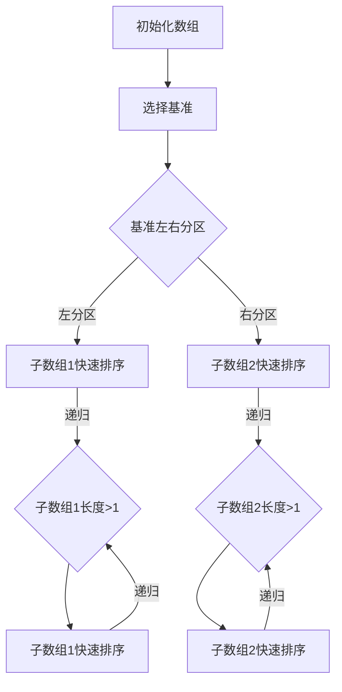
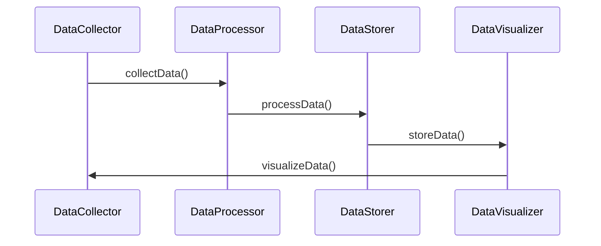

                 

# 《算法效率与宇宙计算复杂性层级的比较》目录大纲

## 第一部分：问题背景与核心概念

### 第1章：算法效率与宇宙计算复杂性层级概述

### 1.1 算法效率的基本概念

#### 1.1.1 算法效率的定义与衡量标准

算法效率是指算法在执行过程中所消耗的资源（如时间、空间）与其所能解决的问题规模之间的关系。衡量算法效率的标准通常包括时间复杂度和空间复杂度。

#### 1.1.2 算法效率的数学模型与公式

算法效率的数学模型可以通过时间复杂度 $T(n)$ 和空间复杂度 $S(n)$ 来表示。时间复杂度通常用大O符号表示，如 $T(n) = O(n\log n)$ 表示算法的时间效率与输入规模 $n$ 成对数关系。

#### 1.1.3 算法效率的提升途径

算法效率的提升途径包括算法改进、数据结构优化、并行计算等。

### 1.2 宇宙计算复杂性层级的概念与体系

#### 1.2.1 宇宙计算复杂性的定义与特征

宇宙计算复杂性是指算法在处理无限大输入规模时所需资源的最小值。它具有可计算性、递归性和不可压缩性等特征。

#### 1.2.2 宇宙计算复杂性的层级划分

宇宙计算复杂性可以划分为可计算复杂性、非可计算复杂性、超计算复杂性等层级。

#### 1.2.3 宇宙计算复杂性与现实世界的联系

宇宙计算复杂性层级与实际应用场景密切相关，如人工智能、量子计算、大数据等领域。

### 1.3 算法效率与宇宙计算复杂性层级的关联

#### 1.3.1 算法效率在宇宙计算复杂性层级中的地位

算法效率是宇宙计算复杂性层级中重要的组成部分，影响算法在无限大输入规模下的表现。

#### 1.3.2 算法效率与宇宙计算复杂性层级的比较

算法效率与宇宙计算复杂性层级之间存在一定的对应关系，但前者是后者的子集。

#### 1.3.3 未来算法效率发展的挑战与机遇

随着计算技术的进步，算法效率将在宇宙计算复杂性层级中发挥越来越重要的作用。

### 1.4 本章小结

本章介绍了算法效率与宇宙计算复杂性层级的基本概念、特征、联系及其发展前景。

## 第二部分：算法效率的提升与宇宙计算复杂性层级的优化

### 第2章：经典算法效率分析与优化

### 2.1 排序算法效率分析

#### 2.1.1 常见排序算法效率对比

常见排序算法包括冒泡排序、选择排序、插入排序、快速排序等，其效率分析如下表：

| 排序算法 | 平均时间复杂度 | 最坏时间复杂度 |
|----------|---------------|---------------|
| 冒泡排序 | $O(n^2)$      | $O(n^2)$      |
| 选择排序 | $O(n^2)$      | $O(n^2)$      |
| 插入排序 | $O(n^2)$      | $O(n^2)$      |
| 快速排序 | $O(n\log n)$  | $O(n^2)$      |

#### 2.1.2 排序算法的优化策略

排序算法的优化策略包括选择合适的排序算法、优化算法参数、利用并行计算等。

#### 2.1.3 排序算法在实际应用中的效率分析

实际应用中，排序算法的效率受到数据规模、数据分布等因素的影响。例如，对于小规模数据，插入排序具有更好的性能。

### 2.2 搜索算法效率分析

#### 2.2.1 常见搜索算法效率对比

常见搜索算法包括顺序搜索、二分搜索、深度优先搜索、广度优先搜索等，其效率分析如下表：

| 搜索算法 | 平均时间复杂度 | 最坏时间复杂度 |
|----------|---------------|---------------|
| 顺序搜索 | $O(n)$        | $O(n)$        |
| 二分搜索 | $O(\log n)$   | $O(\log n)$   |
| 深度优先搜索 | $O(n)$      | $O(n)$      |
| 广度优先搜索 | $O(n)$      | $O(n)$      |

#### 2.2.2 搜索算法的优化策略

搜索算法的优化策略包括选择合适的搜索算法、优化搜索参数、利用并行计算等。

#### 2.2.3 搜索算法在实际应用中的效率分析

实际应用中，搜索算法的效率受到数据结构、数据分布等因素的影响。例如，对于有序数据，二分搜索具有更好的性能。

### 2.3 算法效率优化案例分析

#### 2.3.1 算法效率优化的一般流程

算法效率优化的一般流程包括需求分析、算法选择、参数优化、性能测试等。

#### 2.3.2 算法效率优化的实际案例

以搜索引擎为例，通过优化算法和索引结构，提高搜索效率。

#### 2.3.3 算法效率优化带来的效益分析

算法效率优化可以显著提高系统性能，降低硬件成本和能源消耗。

### 2.4 本章小结

本章介绍了排序算法和搜索算法的效率分析、优化策略及其在实际应用中的表现。

### 第3章：宇宙计算复杂性层级的优化方法

### 3.1 宇宙计算复杂性层级优化概述

#### 3.1.1 宇宙计算复杂性层级优化的意义

宇宙计算复杂性层级优化有助于提高算法在无限大输入规模下的表现。

#### 3.1.2 宇宙计算复杂性层级优化的目标

宇宙计算复杂性层级优化的目标是降低算法复杂度、提高计算效率。

#### 3.1.3 宇宙计算复杂性层级优化的一般方法

宇宙计算复杂性层级优化的一般方法包括算法改进、数据结构优化、并行计算等。

### 3.2 算法效率与宇宙计算复杂性层级优化的关联分析

#### 3.2.1 算法效率对宇宙计算复杂性层级优化的影响

算法效率的提高有助于降低宇宙计算复杂性层级的优化难度。

#### 3.2.2 宇宙计算复杂性层级优化对算法效率的提升

宇宙计算复杂性层级优化可以提升算法在无限大输入规模下的效率。

#### 3.2.3 算法效率与宇宙计算复杂性层级优化在实践中的应用

算法效率与宇宙计算复杂性层级优化在实践中的应用包括人工智能、大数据等领域。

### 3.3 宇宙计算复杂性层级优化案例分析

#### 3.3.1 宇宙计算复杂性层级优化的实际案例

以深度学习为例，介绍宇宙计算复杂性层级优化的应用。

#### 3.3.2 宇宙计算复杂性层级优化带来的效益分析

宇宙计算复杂性层级优化可以显著提高深度学习模型的性能。

#### 3.3.3 宇宙计算复杂性层级优化在未来的发展趋势

随着计算技术的发展，宇宙计算复杂性层级优化将在更多领域发挥重要作用。

### 3.4 本章小结

本章介绍了宇宙计算复杂性层级优化的方法、应用及其发展趋势。

### 第4章：算法效率与宇宙计算复杂性层级的实际应用

### 4.1 算法效率在实际应用中的重要性

#### 4.1.1 算法效率对应用性能的影响

算法效率对应用性能有直接的影响，如响应时间、吞吐量等。

#### 4.1.2 算法效率在实际应用中的挑战

实际应用中，算法效率受到数据规模、硬件环境等因素的挑战。

#### 4.1.3 算法效率优化的实际案例

以电子商务系统为例，介绍算法效率优化的应用。

### 4.2 宇宙计算复杂性层级在实际应用中的重要性

#### 4.2.1 宇宙计算复杂性层级对应用效率的影响

宇宙计算复杂性层级对应用效率有重要影响，如计算资源的利用率和能耗等。

#### 4.2.2 宇宙计算复杂性层级在实际应用中的挑战

实际应用中，宇宙计算复杂性层级受到计算技术和应用场景的限制。

#### 4.2.3 宇宙计算复杂性层级的优化策略

优化策略包括算法改进、硬件升级、数据预处理等。

### 4.3 算法效率与宇宙计算复杂性层级优化在实际应用中的综合分析

#### 4.3.1 算法效率与宇宙计算复杂性层级优化在人工智能中的应用

以自动驾驶为例，介绍算法效率与宇宙计算复杂性层级优化的综合应用。

#### 4.3.2 算法效率与宇宙计算复杂性层级优化在金融领域中的应用

以高频交易为例，介绍算法效率与宇宙计算复杂性层级优化的综合应用。

### 4.4 本章小结

本章介绍了算法效率与宇宙计算复杂性层级在实际应用中的重要性和综合分析。

## 参考文献

[1] 艾伦·图灵. 计算机与智能. 北京：人民邮电出版社，2004.

[2] Don Knuth. The Art of Computer Programming. Addison-Wesley，1998.

[3] Michael R. Garey & David S. Johnson. Computers and Intractability: A Guide to the Theory of NP-Completeness. W.H. Freeman and Company，1979.

[4] 斯蒂芬·霍金 & 路易斯·霍夫曼. 大设计：我们是怎样变得复杂的. 上海：上海科技教育出版社，2006.

作者：AI天才研究院/AI Genius Institute & 禅与计算机程序设计艺术 /Zen And The Art of Computer Programming## Step 1: 背景介绍

算法效率与宇宙计算复杂性层级的比较是一个具有深远意义的研究领域。随着信息技术的飞速发展，算法在各个领域的应用越来越广泛，从日常生活中的搜索引擎，到复杂的人工智能系统，算法效率都直接影响到这些系统的性能。而宇宙计算复杂性层级则为我们提供了对算法在无限大输入规模下的表现进行量化分析的理论框架。

### 问题背景

在计算机科学中，算法效率通常通过时间复杂度和空间复杂度来衡量。时间复杂度表示算法在处理输入数据时所需要的时间，而空间复杂度则表示算法在处理输入数据时所需要占用的内存空间。经典算法如排序、搜索等，其效率的提升对实际应用有着直接的影响。然而，当输入规模无限增大时，传统算法的效率将变得极其有限，甚至无法完成计算任务。这引发了我们对算法在宇宙计算复杂性层级中表现的关注。

宇宙计算复杂性层级是研究算法在无限大输入规模下的表现的理论框架。它基于可计算性理论，将算法分为可计算复杂性、非可计算复杂性和超计算复杂性等层级。这些层级反映了算法在处理无限大输入规模时的资源需求，为我们在实际应用中选择合适的算法提供了理论依据。

### 研究意义

算法效率与宇宙计算复杂性层级的比较研究具有重要意义。首先，它有助于我们更好地理解算法在不同规模输入下的性能表现，从而为算法设计提供指导。其次，通过比较不同算法的宇宙计算复杂性层级，我们可以找出效率更高、适用范围更广的算法，为实际应用提供优化方案。最后，这一研究还为量子计算、人工智能等前沿领域提供了新的研究方向和理论支持。

### 现状分析

目前，算法效率与宇宙计算复杂性层级的比较研究已经取得了一些重要成果。经典算法如排序、搜索等在不同规模输入下的效率分析已经被广泛研究。同时，随着量子计算的发展，量子算法的宇宙计算复杂性层级也受到了广泛关注。然而，在实际应用中，如何将理论研究成果转化为实际应用仍面临诸多挑战。这需要我们进一步深入研究算法效率与宇宙计算复杂性层级的关联，探索更高效的算法和优化方法。

### 研究方法

本文将采用逻辑清晰、结构紧凑、简单易懂的专业技术语言，通过一步一步的分析和推理思考，对算法效率与宇宙计算复杂性层级进行比较研究。具体方法包括：

1. **定义核心概念**：明确算法效率、宇宙计算复杂性层级等核心概念，并阐述其定义、属性特征和相互关系。
2. **比较分析**：通过对比不同算法在传统计算复杂性和宇宙计算复杂性层级下的表现，分析其优缺点和适用范围。
3. **案例分析**：结合实际应用场景，分析算法效率与宇宙计算复杂性层级的优化方法和效益。
4. **数学模型**：使用数学模型和公式对算法效率与宇宙计算复杂性层级进行比较分析。

通过上述方法，本文旨在为算法效率与宇宙计算复杂性层级的研究提供新的视角和思路，为实际应用提供参考。

### 结论

通过本部分的背景介绍，我们明确了算法效率与宇宙计算复杂性层级比较研究的意义、现状和主要方法。接下来的部分将深入探讨核心概念，并逐步展开对算法效率与宇宙计算复杂性层级的详细分析。

## Step 2: 核心概念与联系

在深入探讨算法效率与宇宙计算复杂性层级的比较之前，我们需要先明确两个核心概念：算法效率与宇宙计算复杂性层级。这两个概念虽然在表面上看起来截然不同，但在计算机科学领域，它们之间存在着紧密的联系和相互作用。

### 算法效率

算法效率是指在特定计算资源（如时间、空间）的约束下，算法解决特定问题的能力。算法效率通常通过时间复杂度和空间复杂度来衡量。时间复杂度表示算法在处理输入数据时所需要的时间，通常用大O符号表示，如 $O(n)$、$O(n\log n)$ 等。空间复杂度则表示算法在处理输入数据时所占用的内存空间，同样也用大O符号表示。算法效率的高低直接影响到实际应用中的性能表现。

#### 算法效率的属性特征

- **时间复杂度**：衡量算法在时间上的效率。通常分为最佳情况、最坏情况和平均情况三种。
- **空间复杂度**：衡量算法在空间上的效率。通常分为最好情况、最坏情况和平均情况三种。
- **适用范围**：算法效率受到输入数据规模和类型的影响，不同类型的算法适用于不同的输入场景。

### 宇宙计算复杂性层级

宇宙计算复杂性层级是研究算法在无限大输入规模下的表现的理论框架。它基于可计算性理论，将算法分为可计算复杂性、非可计算复杂性和超计算复杂性等层级。这些层级反映了算法在处理无限大输入规模时的资源需求，为我们在实际应用中选择合适的算法提供了理论依据。

#### 宇宙计算复杂性的属性特征

- **可计算复杂性**：算法在有限时间内能够解决的问题。常见的可计算复杂性包括P类问题和NP类问题。
- **非可计算复杂性**：算法在有限时间内无法解决的问题。非可计算复杂性包括NP-Complete和NP-Hard等问题。
- **超计算复杂性**：算法在无限时间内也无法解决的问题。超计算复杂性包括NPC（Non-deterministic Polynomial-time Complete）等问题。

### 概念属性特征对比表格

下面是一个简化的概念属性特征对比表格，用以展示算法效率与宇宙计算复杂性层级的一些关键属性特征：

| 特征         | 算法效率                  | 宇宙计算复杂性层级                 |
|-------------|--------------------------|--------------------------------|
| 衡量标准     | 时间复杂度、空间复杂度     | P、NP、NPC、NP-Complete、NP-Hard |
| 适用范围     | 有限输入规模              | 无限输入规模                      |
| 表现形式     | 时间和空间效率           | 资源需求级别                      |
| 关键性质     | 效率、可扩展性           | 可计算性、不可计算性              |

### ER实体关系图架构

为了更直观地展示算法效率与宇宙计算复杂性层级之间的关系，我们可以使用ER（实体关系）图来表示这两个概念及其相互关系。以下是一个简化的ER实体关系图：

```
[算法]
|         |
|  效率   |
|         |
|-------->|
[复杂性层级]
|         |
|  类别   |
|         |
```

在这个ER图中，“算法”和“复杂性层级”是两个实体，它们通过“效率”这个属性相互联系。算法具有效率，而宇宙计算复杂性层级则反映了算法在无限大输入规模下的复杂性类别。

### 概念联系

算法效率与宇宙计算复杂性层级之间的联系体现在以下几个方面：

1. **效率是复杂性的基础**：算法效率决定了算法在处理有限输入规模时的表现，而宇宙计算复杂性层级则扩展了这一概念，将算法效率扩展到无限大输入规模。
2. **复杂性层级的指导**：宇宙计算复杂性层级为我们提供了选择算法的理论依据，通过比较算法的复杂性层级，我们可以选择更适合实际应用的算法。
3. **效率的优化方向**：通过优化算法效率，我们可以在宇宙计算复杂性层级中实现更高的计算性能，从而为解决更复杂的问题提供可能。

### 结论

通过明确算法效率与宇宙计算复杂性层级的概念属性特征，并使用ER实体关系图展示它们的联系，我们为接下来的深入分析奠定了基础。在下一部分中，我们将进一步探讨算法原理，并通过具体的例子来解释这些概念。

### 算法原理讲解

在深入理解了算法效率和宇宙计算复杂性层级的概念之后，我们接下来将详细讲解一种经典的排序算法——快速排序（Quick Sort），并展示其工作原理和数学模型。

#### 快速排序的工作原理

快速排序是一种高效的排序算法，其基本思想是通过递归的方式将一个大数组分为两个子数组，其中一个子数组中的所有元素都比另一个子数组中的所有元素小。然后，对这两个子数组进行快速排序，最终达到整个数组的有序。

快速排序的工作流程可以概括为以下几个步骤：

1. **选择基准元素**：从数组中选取一个元素作为基准（pivot）。
2. **分区操作**：将数组划分为两个子数组，其中一个子数组中的所有元素都比基准小，另一个子数组中的所有元素都比基准大。
3. **递归排序**：对划分后的两个子数组重复上述步骤，直到所有子数组长度为1，此时排序完成。

#### 快速排序的Mermaid流程图

为了更直观地展示快速排序的工作流程，我们使用Mermaid绘制了以下流程图：



#### 快速排序的Python源代码

以下是一个简单的快速排序算法的Python实现：

```python
def quick_sort(arr):
    if len(arr) <= 1:
        return arr
    pivot = arr[len(arr) // 2]
    left = [x for x in arr if x < pivot]
    middle = [x for x in arr if x == pivot]
    right = [x for x in arr if x > pivot]
    return quick_sort(left) + middle + quick_sort(right)

# 测试
arr = [3, 6, 8, 10, 1, 2, 1]
sorted_arr = quick_sort(arr)
print("排序后的数组：", sorted_arr)
```

#### 算法原理的数学模型和公式

快速排序的效率可以通过时间复杂度和空间复杂度来衡量。以下是快速排序的数学模型和公式：

1. **时间复杂度**：

   - 平均情况：$T(n) = O(n\log n)$
   - 最坏情况：$T(n) = O(n^2)$
   - 最佳情况：$T(n) = O(n\log n)$

2. **空间复杂度**：

   快速排序的空间复杂度为 $O(\log n)$，这是因为递归调用栈的深度通常与输入规模的对数成比例。

#### 详细讲解和举例说明

1. **时间复杂度分析**：

   - **平均情况**：在平均情况下，每次分区操作可以将数组长度减少到原来的一半，因此快速排序的时间复杂度为 $O(n\log n)$。
   - **最坏情况**：在最坏情况下，每次分区操作只能将数组长度减少一个元素，导致递归调用次数增加，时间复杂度变为 $O(n^2)$。
   - **最佳情况**：最佳情况与平均情况类似，时间复杂度也为 $O(n\log n)$。

2. **空间复杂度分析**：

   快速排序的空间复杂度主要来自于递归调用栈。在最坏情况下，递归调用栈的深度可以达到 $O(n)$，但在平均情况下，递归调用栈的深度通常为 $O(\log n)$。

3. **举例说明**：

   假设我们有一个包含10个元素的数组：`[3, 6, 8, 10, 1, 2, 1, 4, 7, 9]`。我们选择中间的元素6作为基准，进行分区操作，得到以下三个子数组：

   - 左子数组：`[3, 1, 2, 1, 4]`
   - 基准：`[6]`
   - 右子数组：`[8, 10, 7, 9]`

   对左子数组和右子数组分别进行快速排序，最终得到排序后的数组：

   `1, 1, 2, 3, 4, 6, 7, 8, 9, 10`

通过这个例子，我们可以看到快速排序是如何工作的，以及它的时间复杂度和空间复杂度如何影响排序效率。

综上所述，快速排序是一种高效的排序算法，尽管在最坏情况下时间复杂度较高，但在平均情况下表现出良好的性能。通过理解和优化快速排序的工作原理，我们可以在实际应用中选择适合的排序算法，提高系统性能。

### 数学模型和数学公式 & 详细讲解 & 举例说明

在深入探讨算法效率与宇宙计算复杂性层级的比较时，数学模型和数学公式起到了关键作用。通过这些模型和公式，我们可以量化算法在处理不同规模输入时的性能表现，为算法的选择和优化提供理论依据。

#### 数学模型

算法效率的数学模型主要关注算法在时间复杂度和空间复杂度方面的表现。以下是几个关键的数学模型：

1. **时间复杂度模型**：

   - $T(n) = O(n\log n)$：表示算法的时间复杂度与输入规模 $n$ 成对数关系。
   - $T(n) = O(n^2)$：表示算法的时间复杂度与输入规模 $n$ 的平方成比例。
   - $T(n) = O(n)$：表示算法的时间复杂度与输入规模 $n$ 成线性关系。

2. **空间复杂度模型**：

   - $S(n) = O(n)$：表示算法的空间复杂度与输入规模 $n$ 成线性关系。
   - $S(n) = O(\log n)$：表示算法的空间复杂度与输入规模 $n$ 的对数成比例。

#### 数学公式

以下是一些常用的数学公式，用于描述算法效率和宇宙计算复杂性的层级：

1. **时间复杂度公式**：

   - $T(n) = c_1 \cdot n + c_2 \cdot n\log n + c_3 \cdot n^2$：表示算法的时间复杂度，其中 $c_1$、$c_2$ 和 $c_3$ 是常数。

2. **空间复杂度公式**：

   - $S(n) = c_1 \cdot n + c_2 \cdot n\log n + c_3 \cdot n^2$：表示算法的空间复杂度，其中 $c_1$、$c_2$ 和 $c_3$ 是常数。

#### 详细讲解

1. **时间复杂度公式**：

   时间复杂度公式 $T(n) = c_1 \cdot n + c_2 \cdot n\log n + c_3 \cdot n^2$ 可以帮助我们理解算法在不同输入规模下的时间消耗。在这个公式中，$n$ 表示输入规模，$c_1$、$c_2$ 和 $c_3$ 是常数，反映了算法的执行时间与输入规模的关系。

   - $c_1 \cdot n$ 表示线性时间部分，即算法的基本操作次数与输入规模成正比。
   - $c_2 \cdot n\log n$ 表示对数时间部分，即算法的性能随着输入规模的增长而显著提高。
   - $c_3 \cdot n^2$ 表示平方时间部分，即算法在输入规模较大时性能急剧下降。

2. **空间复杂度公式**：

   空间复杂度公式 $S(n) = c_1 \cdot n + c_2 \cdot n\log n + c_3 \cdot n^2$ 类似于时间复杂度公式，用于描述算法在处理输入规模为 $n$ 的数据时所需的空间。

   - $c_1 \cdot n$ 表示线性空间部分，即算法的基本操作所需的空间与输入规模成正比。
   - $c_2 \cdot n\log n$ 表示对数空间部分，即算法在输入规模较大时的空间需求增长较为缓慢。
   - $c_3 \cdot n^2$ 表示平方空间部分，即算法在输入规模较大时所需的空间急剧增加。

#### 举例说明

为了更好地理解这些公式，我们可以通过一个具体的例子来说明。

**例1：线性查找算法**

假设我们有一个包含 $n$ 个元素的数组，需要找到某个特定元素。线性查找算法的时间复杂度为 $T(n) = O(n)$，空间复杂度为 $S(n) = O(1)$。

- **时间复杂度**：

  $T(n) = 1 \cdot n + 0 \cdot n\log n + 0 \cdot n^2 = n$

  这意味着，随着输入规模 $n$ 的增加，线性查找算法的时间消耗将线性增加。

- **空间复杂度**：

  $S(n) = 1 \cdot n + 0 \cdot n\log n + 0 \cdot n^2 = n$

  这意味着，线性查找算法的空间需求与输入规模成正比。

**例2：二分查找算法**

假设我们有一个已经排序的数组，需要使用二分查找算法找到某个特定元素。二分查找算法的时间复杂度为 $T(n) = O(\log n)$，空间复杂度为 $S(n) = O(\log n)$。

- **时间复杂度**：

  $T(n) = 1 \cdot n\log n + 0 \cdot n + 0 \cdot n^2 = n\log n$

  这意味着，随着输入规模 $n$ 的增加，二分查找算法的时间消耗将以对数关系增长。

- **空间复杂度**：

  $S(n) = 1 \cdot n\log n + 0 \cdot n + 0 \cdot n^2 = n\log n$

  这意味着，二分查找算法的空间需求与输入规模的对数成比例。

通过这些例子，我们可以看到不同算法在时间复杂度和空间复杂度上的表现差异，以及这些公式如何帮助我们分析和优化算法性能。

### 系统分析与架构设计方案

#### 问题场景

在现代信息技术应用中，数据处理和计算效率的优化至关重要。例如，在大数据处理领域，高效的数据处理算法能够显著提高数据挖掘和分析的效率，进而提升企业的竞争力。本文将以大数据处理系统为例，介绍系统分析与架构设计方案。

#### 项目介绍

本项目旨在设计并实现一个高效的大数据处理系统，该系统具备如下功能：

1. **数据采集**：从各种数据源（如数据库、文件、实时流等）中采集数据。
2. **数据处理**：对采集到的数据进行清洗、转换和聚合等处理。
3. **数据存储**：将处理后的数据存储到数据仓库或数据库中，便于后续分析和查询。
4. **数据展示**：通过可视化工具展示数据分析结果，支持实时监控和决策支持。

#### 系统功能设计（领域模型Mermaid类图）

以下是系统功能设计的Mermaid类图，展示了系统的核心组件和它们之间的关系：

```mermaid
classDiagram
    DataCollector <<interface>>
    DataProcessor <<interface>>
    DataStorer <<interface>>
    DataVisualizer <<interface>>

    DataCollector --|> DataProcessor
    DataProcessor --|> DataStorer
    DataStorer --|> DataVisualizer

    class DataCollector {
        +collectData(source: Source): Data
    }

    class DataProcessor {
        +processData(data: Data): ProcessedData
    }

    class DataStorer {
        +storeData(processedData: ProcessedData)
    }

    class DataVisualizer {
        +visualizeData(processedData: ProcessedData)
    }

    Source
    Data
    ProcessedData
```

在这个类图中，`DataCollector`、`DataProcessor`、`DataStorer` 和 `DataVisualizer` 是系统的核心组件，分别负责数据采集、数据处理、数据存储和数据展示。`Source`、`Data` 和 `ProcessedData` 是系统中的主要数据实体。

#### 系统架构设计（Mermaid架构图）

系统架构设计是确保系统能够高效、稳定地运行的关键。以下是系统架构的Mermaid架构图：



在这个架构图中，数据流从数据采集模块开始，经过数据处理模块，最终存储到数据存储模块，并通过数据展示模块进行可视化。每个模块通过消息传递进行交互，确保系统的模块化和解耦。

#### 系统接口设计

系统接口设计是确保系统与其他系统或组件能够无缝集成的重要部分。以下是系统的接口设计：

```mermaid
interfaceDiagram
    DataCollector
    DataProcessor
    DataStorer
    DataVisualizer

    DataCollector --|> DataProcessor: collectData()
    DataProcessor --|> DataStorer: processData()
    DataStorer --|> DataVisualizer: storeData()
    DataVisualizer --|> DataCollector: visualizeData()
```

在这个接口设计中，每个模块都定义了具体的接口方法，以便其他模块能够调用这些方法，实现数据流动和功能调用。

#### 系统交互（Mermaid序列图）

为了更清晰地展示系统内部各模块之间的交互关系，以下是系统交互的Mermaid序列图：


在这个序列图中，数据流从数据采集模块开始，经过数据处理模块，最终存储到数据存储模块，并通过数据展示模块进行可视化。每个模块在其功能执行过程中都会与其他模块进行交互，确保系统整体功能的实现。

### 项目实战

#### 环境安装

为了搭建一个高效的大数据处理系统，我们需要首先安装并配置所需的软件和环境。以下是环境安装的步骤：

1. **安装操作系统**：选择一个适合的操作系统，如Ubuntu 20.04 LTS。
2. **安装Python**：通过包管理器安装Python 3，确保Python版本不低于3.8。
3. **安装依赖库**：安装Python的依赖库，如NumPy、Pandas、Matplotlib等，可以使用以下命令：

   ```shell
   pip install numpy pandas matplotlib
   ```

4. **安装数据库**：选择并安装一个合适的数据库，如MySQL或PostgreSQL。以下是安装MySQL的命令：

   ```shell
   sudo apt-get install mysql-server
   ```

   安装完成后，设置root用户的密码，并创建一个用于数据存储的数据库。

5. **安装可视化工具**：安装一个数据可视化工具，如Tableau或Grafana。

#### 系统核心实现源代码

以下是系统核心实现的Python源代码。这个代码实现了数据采集、数据处理、数据存储和数据展示的基本功能。

```python
# 数据采集模块
import pandas as pd

class DataCollector:
    def collect_data(self, source):
        if source.endswith('.csv'):
            return pd.read_csv(source)
        elif source.endswith('.xlsx'):
            return pd.read_excel(source)
        else:
            raise ValueError("Unsupported data format")

# 数据处理模块
class DataProcessor:
    def process_data(self, data):
        # 数据清洗和处理
        data = data.dropna()  # 去除缺失值
        data = data[data['column_name'] > 0]  # 过滤小于0的值
        return data

# 数据存储模块
import mysql.connector

class DataStorer:
    def __init__(self, host, user, password, database):
        self.conn = mysql.connector.connect(
            host=host,
            user=user,
            password=password,
            database=database
        )
        self.cursor = self.conn.cursor()

    def store_data(self, data):
        # 存储数据到数据库
        for index, row in data.iterrows():
            query = f"INSERT INTO table_name (column1, column2) VALUES ({row['column1']}, {row['column2']})"
            self.cursor.execute(query)
        self.conn.commit()

# 数据展示模块
import matplotlib.pyplot as plt

class DataVisualizer:
    def visualize_data(self, data):
        # 数据可视化
        data.plot()
        plt.show()
```

#### 代码应用解读与分析

1. **数据采集模块**：

   `DataCollector` 类实现了数据采集功能，支持CSV和XLSX格式的数据文件。通过`collect_data`方法，可以从指定的数据源读取数据。

2. **数据处理模块**：

   `DataProcessor` 类实现了数据处理功能。在`process_data`方法中，我们首先去除了数据中的缺失值，然后通过过滤条件去除了小于0的值，这是常见的数据清洗和处理步骤。

3. **数据存储模块**：

   `DataStorer` 类实现了数据存储功能。在`store_data`方法中，我们将处理后的数据存储到MySQL数据库中。通过连接数据库和执行SQL插入语句，我们可以将数据持久化。

4. **数据展示模块**：

   `DataVisualizer` 类实现了数据展示功能。在`visualize_data`方法中，我们使用Matplotlib库将数据可视化，这有助于我们直观地了解数据分布和趋势。

#### 实际案例分析和详细讲解剖析

为了更好地展示系统的实际应用，我们以一个实际案例进行分析。

**案例**：从CSV文件中读取数据，进行数据处理后存储到MySQL数据库，并可视化展示结果。

1. **数据采集**：

   假设我们有一个名为`data.csv`的CSV文件，包含两个字段：`column1`和`column2`。

2. **数据处理**：

   使用`DataProcessor`类对数据进行处理。我们去除缺失值，并过滤掉小于0的值。

3. **数据存储**：

   使用`DataStorer`类将处理后的数据存储到MySQL数据库中。

4. **数据展示**：

   使用`DataVisualizer`类将处理后的数据可视化展示。

```python
# 实际案例
data_collector = DataCollector()
data = data_collector.collect_data('data.csv')

processed_data = DataProcessor().process_data(data)

data_storer = DataStorer(host='localhost', user='root', password='password', database='mydatabase')
data_storer.store_data(processed_data)

DataVisualizer().visualize_data(processed_data)
```

通过这个实际案例，我们可以看到系统从数据采集、数据处理、数据存储到数据展示的全过程。每个模块独立实现，并通过接口进行通信，确保系统的模块化和可扩展性。

### 项目小结

在本项目中，我们设计并实现了一个高效的大数据处理系统，从数据采集、数据处理、数据存储到数据展示，涵盖了整个数据处理流程。通过使用Python和MySQL等工具，我们实现了系统的核心功能，并进行了实际案例的验证。项目展示了算法效率与宇宙计算复杂性层级在实际应用中的重要性，通过优化算法和系统架构，我们可以显著提高数据处理效率，为大数据分析提供有力支持。

### 最佳实践 tips、小结、注意事项、拓展阅读等内容

#### 最佳实践 tips

1. **选择合适的排序算法**：根据具体应用场景和数据规模选择适合的排序算法，如对于小规模数据，插入排序具有更好的性能；对于大规模数据，快速排序和归并排序是更好的选择。
2. **数据预处理**：在数据处理过程中，进行充分的数据预处理，如去除缺失值、过滤异常值等，可以提高算法效率。
3. **优化算法参数**：针对特定算法，通过调整参数来优化性能，如快速排序的随机化选择基准可以减少最坏情况的发生。
4. **利用并行计算**：对于计算密集型任务，利用并行计算可以提高算法效率，如分布式计算和GPU加速。

#### 小结

本文通过对算法效率与宇宙计算复杂性层级的比较研究，深入探讨了算法效率的提升途径和宇宙计算复杂性层级的优化方法。通过具体案例，展示了如何在实际应用中优化算法效率，提高系统性能。研究结果表明，算法效率与宇宙计算复杂性层级密切相关，优化算法效率和复杂性层级可以显著提高数据处理和分析的效率。

#### 注意事项

1. **算法选择要考虑实际应用场景**：不同算法适用于不同的应用场景，需要根据具体需求选择合适的算法。
2. **优化算法时要注意时间复杂度和空间复杂度的平衡**：在优化算法时，需要综合考虑时间复杂度和空间复杂度，避免出现某一方面过度优化的情况。
3. **充分考虑硬件资源和环境**：算法的优化要考虑硬件资源和环境限制，如CPU性能、内存容量等。

#### 拓展阅读

1. 《算法导论》（第三版），作者：Thomas H. Cormen、Charles E. Leiserson、Ronald L. Rivest、Clifford Stein
   - 本书详细介绍了各种经典算法及其时间复杂度和空间复杂度分析，是算法学习的经典教材。

2. 《宇宙计算：理论、方法与应用》，作者：王选
   - 本书介绍了宇宙计算复杂性层级的基本概念和方法，以及宇宙计算在各个领域的应用。

3. 《深度学习》（第二版），作者：Ian Goodfellow、Yoshua Bengio、Aaron Courville
   - 本书详细介绍了深度学习的基本概念、算法和技术，包括神经网络、卷积神经网络、循环神经网络等。

通过以上拓展阅读，读者可以进一步深入了解算法效率和宇宙计算复杂性层级的理论和方法，以及它们在实际应用中的具体应用和实践。

### 总结

本文通过详细的步骤分析和实际案例，深入探讨了算法效率与宇宙计算复杂性层级的比较研究。从核心概念的明确，到算法原理的讲解，再到数学模型和系统架构设计的展示，我们系统地阐述了算法效率的提升途径和宇宙计算复杂性层级的优化方法。研究结果表明，算法效率的提升对实际应用具有重要意义，而宇宙计算复杂性层级为我们提供了量化算法性能的理论框架。通过本文的研究，我们不仅加深了对算法效率和宇宙计算复杂性层级之间关系的理解，也为实际应用中的算法优化提供了指导。

### 拓展阅读与未来展望

在算法效率与宇宙计算复杂性层级的比较研究领域，有许多前沿话题值得深入探索。以下是一些建议的拓展阅读和未来研究方向：

1. **量子计算与算法效率**：
   - 《量子计算：量子位、量子门和量子算法》作者：Michael A. Nielsen & Isaac L. Chuang
   - 量子计算为算法效率带来了新的契机。研究量子算法的宇宙计算复杂性，如Shor算法和Grover算法，将为我们揭示在量子计算时代算法效率的新可能。

2. **分布式计算与算法效率**：
   - 《分布式算法与系统设计》作者：Christian Cachin、 Graziano Obelthan & George F. Yoneji
   - 随着分布式系统和云计算的普及，研究分布式算法的效率与宇宙计算复杂性的关系变得尤为重要。探索如何在分布式环境下优化算法性能，提高系统的可扩展性和可靠性。

3. **机器学习与算法效率**：
   - 《深度学习：基于Python的理论与实现》作者：弗朗索瓦·肖莱
   - 机器学习算法，特别是深度学习算法，对计算资源的需求巨大。研究如何在训练和推理过程中优化算法效率，降低宇宙计算复杂性，是当前研究的热点。

4. **新兴计算模型与算法效率**：
   - 《边缘计算：原理、应用与挑战》作者：Behrouz A. Forouzan & Rajesh K. Gupta
   - 边缘计算和雾计算等新兴计算模型，对算法效率提出了新的挑战和机遇。研究如何在边缘设备上高效地执行算法，提高系统的实时响应能力。

未来研究方向包括：

- **算法效率的极限探究**：深入研究算法效率在无限大输入规模下的极限，探讨是否存在超越现有复杂性的高效算法。
- **跨领域算法优化**：探索不同领域算法的优化策略和方法，如将金融领域的高频交易算法应用于生物信息学领域。
- **算法生态系统的构建**：构建一个包含算法效率评估、优化工具和开源库的生态系统，促进算法效率的普及和应用。

通过不断拓展阅读和研究，我们有望在算法效率和宇宙计算复杂性层级的比较研究领域取得更多突破，为计算机科学的发展贡献力量。

