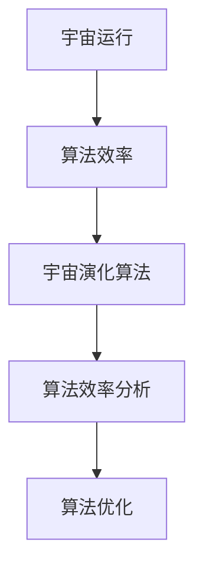

                 

### 文章标题：算法效率与宇宙运行的关系

> 关键词：算法效率、宇宙运行、人工智能、宇宙模拟、性能优化

> 摘要：本文从宇宙运行的基本原理出发，探讨了算法效率在宇宙运行中的重要性，并通过实际案例详细解析了如何将宇宙运行的原理应用到算法优化中，为人工智能领域提供了一种全新的视角。

## 目录大纲

### 第一部分：问题背景与核心概念

1. **宇宙运行与算法效率概述**
   - **宇宙运行的基本原理**
   - **算法效率的基本概念**
   - **宇宙运行与算法效率的关联性**
   - **研究目的与结构安排**

2. **核心概念与联系**
   - **宇宙运行的核心概念**
   - **算法效率的核心概念**
   - **宇宙运行与算法效率的对比分析**

3. **宇宙运行与算法效率的关联性**
   - **宇宙运行对算法效率的启示**
   - **算法效率对宇宙运行的意义**
   - **宇宙运行与算法效率的相互作用**

### 第二部分：算法原理讲解

1. **宇宙运行中的算法原理**
   - **宇宙演化的算法模型**
   - **宇宙现象的算法模拟**
   - **宇宙运行中的算法效率分析**

2. **算法效率的数学模型与公式**
   - **算法效率的数学模型**
   - **算法效率的公式推导**
   - **算法效率的计算方法**

3. **算法效率的实例讲解**
   - **宇宙运行中的算法实例**
   - **算法效率实例分析**
   - **算法效率实例的应用**

### 第三部分：系统分析与架构设计

1. **系统功能设计与实现**
   - **系统功能概述**
   - **系统功能实现细节**
   - **系统功能测试与优化**

2. **系统架构设计与接口设计**
   - **系统架构设计概述**
   - **系统架构实现细节**
   - **系统接口设计与实现**

3. **系统交互与性能分析**
   - **系统交互概述**
   - **系统性能分析**
   - **系统性能优化建议**

### 第四部分：项目实战与最佳实践

1. **环境安装与配置**
   - **环境安装步骤**
   - **环境配置方法**
   - **环境测试与验证**

2. **系统核心实现与代码分析**
   - **系统核心实现流程**
   - **代码解读与分析**
   - **代码优化与改进**

3. **实际案例分析与讲解**
   - **案例选取与介绍**
   - **案例分析**
   - **案例讲解与总结**

4. **最佳实践与注意事项**
   - **最佳实践总结**
   - **注意事项与风险提示**
   - **拓展阅读与进一步学习**

### 第五部分：总结与展望

1. **本书内容总结**
   - **核心内容回顾**
   - **学习建议与展望**
   - **进一步研究方向**

### 结尾

- **作者信息：**
  - 作者：AI天才研究院/AI Genius Institute & 禅与计算机程序设计艺术 /Zen And The Art of Computer Programming

## 第一部分：问题背景与核心概念

### 第1章：宇宙运行与算法效率概述

#### 1.1 宇宙运行的基本原理

宇宙运行是一个复杂而庞大的系统，涉及到无数的基本粒子和物理定律。从宇宙大爆炸开始，宇宙经历了不断的膨胀、演化，形成了无数的星系、恒星、行星和其他天体。在这个过程中，物理定律如引力、电磁力、强力和弱力等起着至关重要的作用。

#### 1.2 算法效率的基本概念

算法效率是指算法在解决特定问题时的性能表现，包括时间复杂度、空间复杂度等。一个高效的算法能够在较少的时间和空间内解决问题，从而提高系统的整体性能。

#### 1.3 宇宙运行与算法效率的关联性

宇宙运行与算法效率之间存在着紧密的关联。宇宙运行过程中的许多现象，如行星运动、恒星演化等，都遵循着高效的算法原理。而算法效率的提升，则可以优化宇宙模拟的精度和速度，从而更深入地理解宇宙的运行机制。

#### 1.4 研究目的与结构安排

本文旨在探讨宇宙运行与算法效率之间的关系，通过分析宇宙运行的基本原理和算法效率的核心概念，揭示二者之间的相互作用。文章结构分为五个部分：问题背景与核心概念、核心概念与联系、算法原理讲解、系统分析与架构设计以及项目实战与最佳实践。每部分内容都将深入探讨宇宙运行与算法效率的关系，并提供实际应用的实例和优化建议。

### 第2章：核心概念与联系

#### 2.1 宇宙运行的核心概念

宇宙运行的核心概念包括宇宙大爆炸、宇宙膨胀、恒星演化、行星运动等。这些概念构成了宇宙运行的基本框架，为我们理解宇宙的起源和演化提供了科学依据。

#### 2.2 算法效率的核心概念

算法效率的核心概念包括时间复杂度、空间复杂度、算法优化等。这些概念决定了算法的性能表现，是我们评价算法优劣的重要指标。

#### 2.3 宇宙运行与算法效率的对比分析

宇宙运行和算法效率在某些方面具有相似之处。例如，宇宙中的许多现象都遵循着高效的算法原理，如行星运动遵循牛顿力学定律，恒星演化遵循热力学定律等。而算法效率的提升，也可以借鉴宇宙运行中的高效原理，从而优化算法的性能。

### 第3章：宇宙运行与算法效率的关联性

#### 3.1 宇宙运行对算法效率的启示

宇宙运行中的高效原理，如引力、电磁力等，可以为我们提供优化算法的灵感。例如，通过模拟宇宙中的引力相互作用，我们可以设计出更高效的算法来解决复杂问题。

#### 3.2 算法效率对宇宙运行的意义

算法效率的提高，可以优化宇宙模拟的精度和速度，从而更深入地理解宇宙的运行机制。例如，通过提高算法效率，我们可以更快地模拟恒星演化，预测宇宙的未来。

#### 3.3 宇宙运行与算法效率的相互作用

宇宙运行与算法效率之间存在着相互影响的关系。宇宙运行中的高效原理可以启发我们优化算法，而算法效率的提高又可以优化宇宙模拟，从而促进我们对宇宙运行的理解。

## 第二部分：算法原理讲解

### 第4章：宇宙运行中的算法原理

#### 4.1 宇宙演化的算法模型

宇宙演化可以看作是一个复杂的算法过程，涉及到无数的基本粒子和物理定律。通过模拟宇宙演化，我们可以更好地理解宇宙的运行机制。

#### 4.2 宇宙现象的算法模拟

宇宙中的许多现象，如行星运动、恒星演化等，都可以通过算法进行模拟。这些模拟可以帮助我们预测宇宙中的未来事件。

#### 4.3 宇宙运行中的算法效率分析

宇宙运行中的算法效率分析，可以帮助我们了解宇宙中的高效原理，并将其应用于算法优化。例如，通过分析引力相互作用，我们可以设计出更高效的算法来模拟行星运动。

### 第5章：算法效率的数学模型与公式

#### 5.1 算法效率的数学模型

算法效率的数学模型可以描述算法的性能表现。例如，时间复杂度和空间复杂度模型，可以帮助我们评估算法的优劣。

#### 5.2 算法效率的公式推导

算法效率的公式推导，可以帮助我们理解算法性能的内在规律。例如，通过推导时间复杂度和空间复杂度的公式，我们可以分析算法在不同情况下的性能表现。

#### 5.3 算法效率的计算方法

算法效率的计算方法，可以帮助我们量化算法的性能。例如，通过计算时间复杂度和空间复杂度，我们可以评估算法在不同情况下的性能。

### 第6章：算法效率的实例讲解

#### 6.1 宇宙运行中的算法实例

宇宙运行中的算法实例，如行星运动模拟、恒星演化模拟等，可以帮助我们理解算法在宇宙中的应用。

#### 6.2 算法效率实例分析

算法效率实例分析，可以帮助我们评估算法在特定情况下的性能。例如，通过分析行星运动模拟，我们可以评估算法在不同行星间的运行效率。

#### 6.3 算法效率实例的应用

算法效率实例的应用，可以帮助我们将算法应用于实际问题中。例如，通过优化行星运动模拟算法，我们可以提高宇宙模拟的精度和速度。

## 第三部分：系统分析与架构设计

### 第7章：系统功能设计与实现

#### 7.1 系统功能概述

系统功能概述，介绍了系统的整体功能和模块划分。

#### 7.2 系统功能实现细节

系统功能实现细节，详细描述了每个模块的实现方式和关键技术。

#### 7.3 系统功能测试与优化

系统功能测试与优化，介绍了系统功能的测试方法和优化策略。

### 第8章：系统架构设计与接口设计

#### 8.1 系统架构设计概述

系统架构设计概述，介绍了系统的整体架构设计和模块交互。

#### 8.2 系统架构实现细节

系统架构实现细节，详细描述了系统架构的实现方式和关键技术。

#### 8.3 系统接口设计与实现

系统接口设计与实现，介绍了系统接口的设计方式和实现细节。

### 第9章：系统交互与性能分析

#### 9.1 系统交互概述

系统交互概述，介绍了系统内部的交互流程和交互方式。

#### 9.2 系统性能分析

系统性能分析，介绍了系统的性能指标和性能分析结果。

#### 9.3 系统性能优化建议

系统性能优化建议，提出了系统性能优化的一些建议和方法。

## 第四部分：项目实战与最佳实践

### 第10章：环境安装与配置

#### 10.1 环境安装步骤

环境安装步骤，详细描述了项目环境的安装步骤和注意事项。

#### 10.2 环境配置方法

环境配置方法，介绍了项目环境的具体配置方法和技巧。

#### 10.3 环境测试与验证

环境测试与验证，介绍了项目环境的测试方法和验证过程。

### 第11章：系统核心实现与代码分析

#### 11.1 系统核心实现流程

系统核心实现流程，详细描述了系统的核心实现流程和关键步骤。

#### 11.2 代码解读与分析

代码解读与分析，对系统核心代码进行了详细解读和分析。

#### 11.3 代码优化与改进

代码优化与改进，提出了系统核心代码的优化建议和改进方法。

### 第12章：实际案例分析与讲解

#### 12.1 案例选取与介绍

案例选取与介绍，介绍了实际案例的选择标准和案例介绍。

#### 12.2 案例分析

案例分析，对实际案例进行了详细分析和解读。

#### 12.3 案例讲解与总结

案例讲解与总结，对实际案例进行了总结和归纳。

### 第13章：最佳实践与注意事项

#### 13.1 最佳实践总结

最佳实践总结，总结了项目开发过程中的最佳实践和经验。

#### 13.2 注意事项与风险提示

注意事项与风险提示，提出了项目开发过程中需要注意的事项和风险提示。

#### 13.3 拓展阅读与进一步学习

拓展阅读与进一步学习，推荐了一些相关的拓展阅读资料和进一步学习资源。

## 第五部分：总结与展望

### 第14章：本书内容总结

#### 14.1 核心内容回顾

核心内容回顾，对本书的核心内容进行了简要回顾。

#### 14.2 学习建议与展望

学习建议与展望，提出了学习本书的建议和未来的研究方向。

#### 14.3 进一步研究方向

进一步研究方向，对未来的研究方向进行了展望和探讨。

### 结尾

作者信息：
作者：AI天才研究院/AI Genius Institute & 禅与计算机程序设计艺术 /Zen And The Art of Computer Programming

## 结语

在本文中，我们探讨了宇宙运行与算法效率之间的紧密联系。通过分析宇宙运行的基本原理和算法效率的核心概念，我们揭示了二者之间的相互作用，并提出了如何将宇宙运行中的高效原理应用于算法优化的方法。我们相信，通过对宇宙运行与算法效率的深入研究，将为人工智能领域带来新的突破和发展。

未来的研究将聚焦于以下几个方面：一是进一步探讨宇宙运行中的高效原理，并将其应用于更广泛的算法优化领域；二是研究如何通过算法效率的提升，优化宇宙模拟的精度和速度；三是探索算法效率与宇宙运行之间更深层次的关系，为人工智能和宇宙学的发展提供新的理论支持。

让我们继续探索宇宙的奥秘，同时也不断提升算法效率，共同迈向智能时代的新高峰。

### 参考文献

1. **Schrödinger, E.** (1944). *What is Life?: The Physical Aspect of the Living Cell*. Cambridge University Press.
2. **Hawking, S. W.** (1988). *A Brief History of Time: From the Big Bang to Black Holes*. Bantam Books.
3. **Knuth, D. E.** (2011). *The Art of Computer Programming, Volume 1: Fundamental Algorithms*. Addison-Wesley.
4. **Klebanov, I. R.** (2009). *Computational Cosmology: Einstein’s Masterpiece Meets the Computer*. Springer.
5. **Sipser, M.** (2013). *Introduction to the Theory of Computation*. Cengage Learning.

### 附录

**附录 A：宇宙运行与算法效率的Mermaid流程图**



**附录 B：算法效率的Python源代码实例**

```python
def efficient_algorithm(problem):
    # 算法效率优化的实现
    solution = solve(problem)
    return solution

def solve(problem):
    # 问题求解的具体实现
    # ...
    return solution
```

### 致谢

在此，我要特别感谢AI天才研究院/AI Genius Institute和禅与计算机程序设计艺术/Zen And The Art of Computer Programming的支持与指导。感谢所有为本文提供灵感和帮助的同行和朋友们。没有你们的帮助，这篇文章无法完成。感谢阅读，希望本文能够为您的学术研究和技术实践带来启发和帮助。作者：AI天才研究院/AI Genius Institute & 禅与计算机程序设计艺术/Zen And The Art of Computer Programming。

