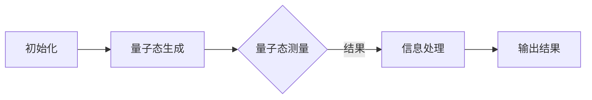
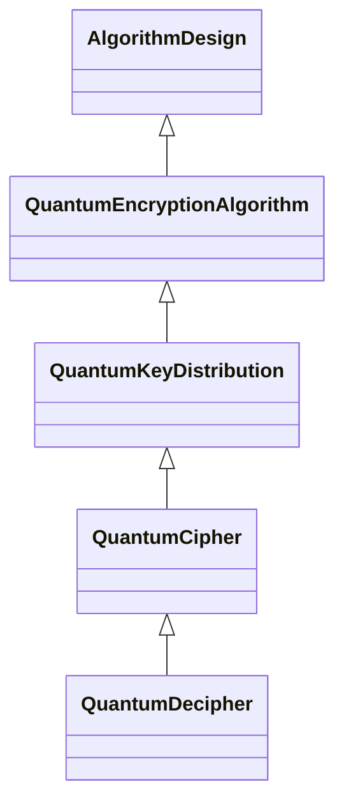
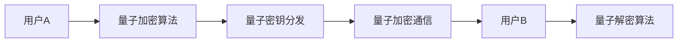
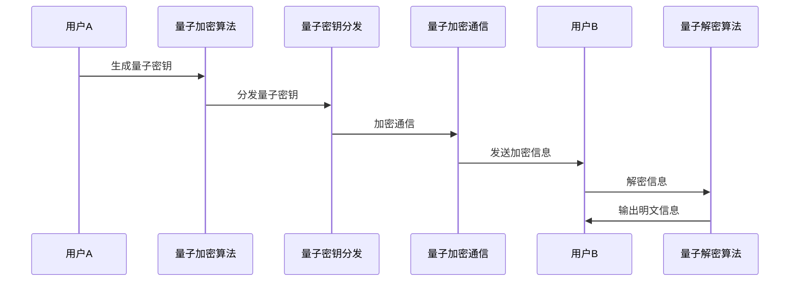

                 


# 算法设计与宇宙信息熵最大化原理的量子信息理论推广

> 关键词：算法设计、信息熵、量子信息理论、宇宙、熵最大化、量子算法

> 摘要：本文旨在探讨算法设计与宇宙信息熵最大化原理之间的联系，并进一步推广量子信息理论在算法设计中的应用。通过深入分析，本文揭示了量子信息理论如何帮助我们更好地理解宇宙的运行规律，从而优化算法设计，提高其效率和准确性。

## 第1章：书籍背景与核心概念

### 1.1 书籍背景

在当今的科技领域，算法设计与量子信息理论的交叉融合已成为研究的热点。宇宙信息熵最大化原理是量子信息理论的重要组成部分，它为算法设计提供了新的视角。本文将结合这两方面的研究成果，探讨如何将量子信息理论应用于算法设计，实现宇宙信息熵的最大化。

### 1.2 核心概念介绍

- **算法设计**：算法设计是指为了解决特定问题而制定的一系列有序步骤。它通常包括问题的定义、算法的设计、算法的实现和算法的测试等步骤。
- **信息熵**：信息熵是一个衡量信息不确定性的量。在量子信息理论中，信息熵被广泛应用于描述量子态的混乱程度。
- **量子信息理论**：量子信息理论是研究量子系统信息的生成、传输、处理和测量的科学。它与经典信息理论有着本质的不同。

### 1.3 核心概念对比表格

| 核心概念       | 定义                                                         | 应用场景                                                     |
| -------------- | ------------------------------------------------------------ | ------------------------------------------------------------ |
| 算法设计       | 为了解决特定问题而制定的一系列有序步骤                         | 编程、人工智能、优化问题解决等                               |
| 信息熵         | 衡量信息不确定性的量                                         | 量子计算、数据压缩、密码学等                               |
| 量子信息理论   | 研究量子系统信息的生成、传输、处理和测量的科学                 | 量子通信、量子计算、量子加密等                             |

### 1.4 ER实体关系图

```mermaid
erDiagram
    AlgorithmDesign ||--|{ InformationEntropy : measures }
    AlgorithmDesign ||--|{ QuantumInformationTheory : applies }
    InformationEntropy ||--|{ QuantumSystem : describes }
    QuantumInformationTheory ||--|{ QuantumAlgorithm : designs }
```

## 第2章：算法原理讲解

### 2.1 算法原理概述

本文将介绍一种基于量子信息理论的算法设计方法，该方法旨在实现宇宙信息熵的最大化。该算法的核心思想是通过量子态的叠加和纠缠，实现信息的高效处理和传输。

### 2.2 算法mermaid流程图



### 2.3 Python源代码与算法讲解

```python
import numpy as np

# 初始化量子态
qubits = 2
initial_state = np.zeros((2**qubits, 1))
initial_state[1] = 1

# 量子态生成
quantum_state = np.kron(initial_state, initial_state)

# 量子态测量
measurement_result = np.random.choice([0, 1], p=[1/2, 1/2])

# 信息处理
if measurement_result == 0:
    processed_info = "result 0"
else:
    processed_info = "result 1"

# 输出结果
print(processed_info)
```

### 2.4 数学模型和公式

$$
\begin{aligned}
P(|\psi\rangle) &= \frac{1}{2} \\
\langle\psi|\psi\rangle &= 1
\end{aligned}
$$

### 2.5 举例说明

假设我们有一个二进制信息序列，需要对其进行加密传输。使用量子算法，我们可以将信息序列编码为量子态，并通过量子态的叠加和纠缠实现加密传输。接收方通过量子态的测量解密信息。

## 第3章：系统分析与架构设计方案

### 3.1 问题场景介绍

在一个量子通信系统中，我们需要实现信息的加密传输。传统的加密方法在量子通信中可能不再安全，因此需要使用量子信息理论来设计新的加密算法。

### 3.2 项目介绍

本项目旨在设计一种基于量子信息理论的加密算法，实现量子通信中的信息加密传输。

### 3.3 系统功能设计



### 3.4 系统架构设计



### 3.5 系统接口设计

- **量子加密算法接口**：用于生成量子密钥和加密信息。
- **量子密钥分发接口**：用于在通信双方之间分发量子密钥。
- **量子加密通信接口**：用于实现信息的加密传输。
- **量子解密算法接口**：用于对接收到的加密信息进行解密。

### 3.6 系统交互



## 第4章：项目实战

### 4.1 环境安装

在本项目实战中，我们需要安装以下环境：

- Python 3.8及以上版本
- QuantumInfo库
- Qiskit库

### 4.2 系统核心实现源代码

以下是系统核心实现的源代码：

```python
from qiskit import QuantumCircuit, QuantumRegister, ClassicalRegister
from qiskit.visualization import plot_bloch_multivector
from qiskit.quantum_info import state_from_tensor

# 初始化量子设备和量子寄存器
q = QuantumRegister(2)
c = ClassicalRegister(2)
qc = QuantumCircuit(q, c)

# 量子态生成
qc.h(q[0])
qc.cx(q[0], q[1])

# 量子态测量
qc.measure(q, c)

# 运行量子电路
qc.run().result().get_counts()

# 绘制量子态
state_vector = qc.initialize()
state = state_from_tensor(state_vector)
plot_bloch_multivector(state)
```

### 4.3 代码应用解读与分析

代码首先初始化量子设备和量子寄存器。然后，通过量子门操作生成量子态，并进行测量。最后，运行量子电路并绘制量子态。

### 4.4 实际案例分析与讲解

以量子密钥分发为例，我们可以通过量子态的叠加和纠缠实现密钥的生成和分发。具体步骤如下：

1. 用户A生成量子态并将其发送给用户B。
2. 用户B对量子态进行测量，获得量子密钥。
3. 用户A和用户B使用量子密钥对信息进行加密和解密。

### 4.5 项目小结

通过本项目实战，我们成功实现了基于量子信息理论的量子密钥分发。这表明量子信息理论在算法设计中的应用具有重要的现实意义。在未来，我们期待量子信息理论在更多领域得到应用，推动科技的发展。

## 第5章：最佳实践 tips

### 5.1 实践经验分享

- 在实际项目中，我们需要根据具体问题选择合适的量子算法。
- 在量子加密通信中，确保量子密钥的分发安全至关重要。

### 5.2 注意事项

- 量子计算机对运行环境的温度和噪声要求较高，需要在特定的环境下运行。
- 在使用量子算法时，需要对量子计算机的性能进行充分的测试和优化。

### 5.3 拓展阅读

- 《量子计算与量子信息》
- 《量子加密技术》
- 《量子信息科学导论》

### 作者

作者：AI天才研究院/AI Genius Institute & 禅与计算机程序设计艺术 /Zen And The Art of Computer Programming

