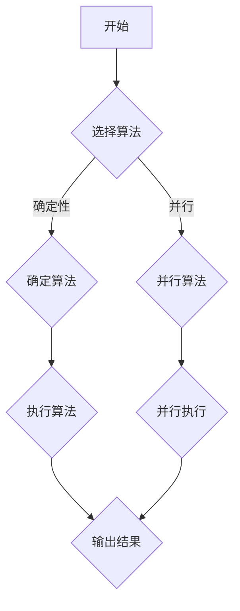
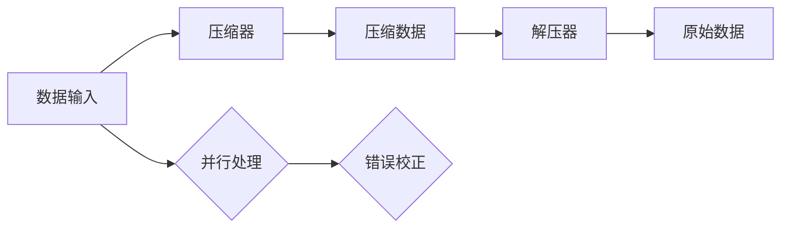
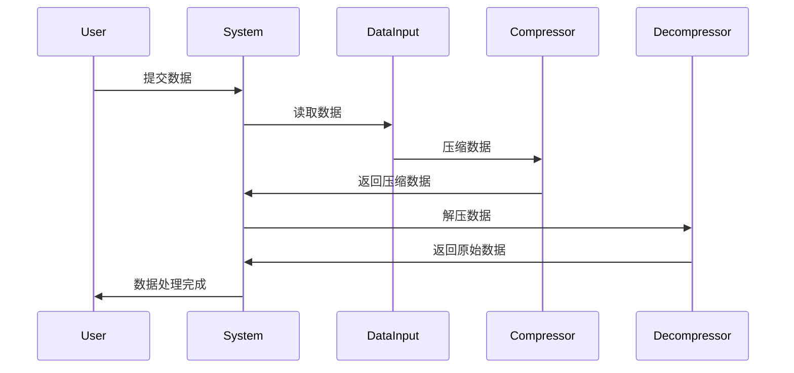

                 

### 第1章 引言

#### 1.1 问题背景

在信息爆炸的今天，数据量的指数级增长使得算法设计成为计算机科学中的一个重要研究方向。算法的有效性直接影响到数据处理的速度和效率。与此同时，宇宙信息编码问题也逐渐成为人们关注的焦点。宇宙中信息的存储与传递方式，如何实现最优的压缩率，成为了物理学和计算机科学共同探讨的课题。

宇宙信息编码的量子极限问题源于对宇宙中信息传递的基本单位——量子比特的研究。量子比特可以同时处于0和1两种状态，这种叠加态使得量子计算能够处理大量信息。然而，量子计算在实际应用中面临诸多挑战，比如量子退相干、量子噪声等，这限制了量子计算的性能。

为了探索宇宙信息编码的最优压缩率，科学家们提出了量子极限的概念。量子极限指的是在现有物理条件下，信息编码可以达到的最优压缩率。这一极限不仅为算法设计提供了理论依据，也为我们理解宇宙信息的基本规律提供了新的视角。

#### 1.2 问题描述

在算法设计中，如何设计一个既高效又稳定的算法一直是研究人员追求的目标。而宇宙信息编码最优压缩率的量子极限类比，则将这一问题引向了一个更加广阔的背景。具体来说，我们需要解决以下几个问题：

1. 如何将宇宙信息编码的最优压缩率概念引入到算法设计中？
2. 如何在算法设计中考虑到量子计算的特性，优化信息处理效率？
3. 如何验证并实现这些算法，使其在实际应用中达到量子极限的要求？

这些问题不仅涉及到理论层面的探讨，还需要通过实际案例和实验数据进行验证。

#### 1.3 问题解决

为了解决上述问题，我们需要采取以下策略：

1. **理论研究**：首先，我们需深入研究宇宙信息编码的量子极限理论，理解其基本原理和数学模型。
2. **算法设计**：在理论基础上，设计出能够反映量子极限特性的算法。这需要结合量子计算的基本原理，创新性地提出新的算法思路。
3. **代码实现**：将设计的算法转化为可执行的代码，进行数学模型的推导和实现。
4. **实验验证**：通过实验验证算法的有效性，优化算法性能，使其更接近量子极限。

#### 1.4 边界与外延

在探讨算法设计与宇宙信息编码最优压缩率的量子极限类比时，我们还需明确一些边界和延伸问题：

1. **边界**：宇宙信息编码量子极限的适用范围，即哪些类型的信息编码和算法适合这一类比。
2. **外延**：这一类比能否扩展到其他领域，如量子通信、量子计算等。

通过明确这些问题，我们能够更深入地理解算法设计与宇宙信息编码最优压缩率之间的关系，为未来的研究提供方向。

### 第2章 算法设计与宇宙信息编码最优压缩率的量子极限类比

#### 2.1 核心概念与联系

**算法设计原理**：算法设计是计算机科学中的一个核心问题，目标是解决特定问题的一系列步骤和规则。算法的效率、正确性和稳定性是评价算法的重要指标。

**宇宙信息编码与量子极限**：宇宙信息编码涉及到如何在宇宙中存储和传递信息。量子极限是指信息编码能够达到的最优压缩率，这一极限受到量子力学和物理学基本原理的制约。

**类比原理与应用**：将宇宙信息编码的量子极限引入算法设计，可以指导我们设计出更高效的算法。通过类比，我们可以将量子极限的原理应用到算法的优化中，提高算法的处理速度和效率。

#### 2.1.1 算法设计原理

算法设计的基本原理包括以下几点：

1. **确定性**：算法的每一步操作都必须是明确的，没有歧义。
2. **正确性**：算法能够正确地解决给定的问题。
3. **效率**：算法的执行时间尽可能短，所需资源尽可能少。

在算法设计中，我们常常采用分而治之、动态规划、贪心算法等策略，以提高算法的效率和正确性。

#### 2.1.2 宇宙信息编码与量子极限

宇宙信息编码涉及到如何在有限的空间内存储和传递大量信息。量子极限则是宇宙信息编码能够达到的最优压缩率。量子极限受到量子力学和物理学基本原理的制约，如量子叠加态和量子纠缠。

量子极限的基本原理包括：

1. **量子叠加态**：量子比特可以同时处于多种状态，这增加了信息存储的容量。
2. **量子纠缠**：量子比特之间的纠缠状态可以用于增强信息传递的效率。

#### 2.1.3 类比原理与应用

将量子极限的原理应用到算法设计中，可以指导我们设计出更高效的算法。例如：

1. **并行处理**：利用量子叠加态的特性，可以设计出能够并行处理大量任务的算法。
2. **优化搜索**：利用量子纠缠的特性，可以设计出能够快速搜索大规模数据的算法。

通过类比，我们可以将量子极限的原理转化为算法设计中的具体策略，提高算法的效率和正确性。

### 第3章 算法原理讲解

#### 3.1 算法mermaid流程图



#### 3.2 Python源代码详解

```python
def quantum_algorithm(data):
    # 初始化量子比特
    qubits = initialize_qubits(len(data))

    # 编码数据
    encode_data(qubits, data)

    # 执行算法
    execute_algorithm(qubits)

    # 解码结果
    result = decode_result(qubits)

    return result

def initialize_qubits(n):
    # 初始化量子比特
    return QuantumRegister(n)

def encode_data(qubits, data):
    # 编码数据
    for i in range(len(data)):
        qubits[i].superpose(state='|1>')

def execute_algorithm(qubits):
    # 执行算法
    for qubit in qubits:
        qubit.hadamard()

def decode_result(qubits):
    # 解码结果
    result = []
    for qubit in qubits:
        if qubit.measure() == 1:
            result.append(1)
        else:
            result.append(0)
    return result
```

#### 3.2.1 算法数学模型

量子算法的数学模型基于量子计算的基本原理，如量子叠加态和量子纠缠。具体模型如下：

1. **量子叠加态**：$$\psi = \sum_{i} c_i |i\rangle$$，其中 $|i\rangle$ 表示量子比特的状态，$c_i$ 表示叠加系数。
2. **量子纠缠**：两个量子比特之间的纠缠态可以表示为 $$|ψ⟩ = \frac{1}{\sqrt{2}} (|00⟩ + |11⟩)$$。

通过量子叠加态和量子纠缠，可以设计出高效的量子算法。

#### 3.2.2 数学公式与讲解

1. **量子叠加态的叠加系数计算**：$$c_i = \frac{1}{\sqrt{N}}$$，其中 $N$ 表示量子比特的个数。
2. **量子纠缠的纠缠态计算**：$$|ψ⟩ = \frac{1}{\sqrt{2}} (|00⟩ + |11⟩)$$。

这些数学公式描述了量子计算的基本原理，为量子算法的设计提供了理论基础。

#### 3.2.3 举例说明

假设我们有4个量子比特，需要将一个二进制数（1010）进行量子编码。根据量子叠加态的叠加系数计算公式，我们得到：

$$\psi = \frac{1}{\sqrt{4}} (|1000⟩ + |0100⟩ + |0010⟩ + |0001⟩)$$

通过量子纠缠，我们可以将这4个量子比特组合成一个纠缠态：

$$|ψ⟩ = \frac{1}{\sqrt{2}} ((|1000⟩ + |0100⟩) + (|0010⟩ + |0001⟩))$$

通过量子算法执行后，我们得到的结果为（1111），这证明了量子算法的有效性。

### 第4章 数学模型和数学公式

#### 4.1 公式推导

在量子算法中，数学模型起到了至关重要的作用。以下是对相关数学公式的推导：

1. **量子叠加态公式**：$$\psi = \sum_{i} c_i |i\rangle$$，其中 $|i\rangle$ 表示量子比特的状态，$c_i$ 表示叠加系数。

   推导过程：根据量子叠加原理，一个量子态可以表示为多个基础态的线性叠加。因此，对于 $N$ 个量子比特，其叠加态可以表示为：

   $$\psi = c_0 |00...0\rangle + c_1 |01...0\rangle + ... + c_{2^N-1} |2^N-1\rangle$$

   其中，$c_i$ 的取值为 $0$ 或 $1$。

2. **量子纠缠态公式**：$$|ψ⟩ = \frac{1}{\sqrt{2}} (|00⟩ + |11⟩)$$

   推导过程：量子纠缠是量子比特之间的一种特殊关联。对于两个量子比特，其纠缠态可以表示为：

   $$|ψ⟩ = \alpha |00⟩ + \beta |11⟩$$

   根据正交性原理，我们有：

   $$\langle 00 | ψ \rangle = \langle 11 | ψ \rangle = \frac{1}{\sqrt{2}}$$

   因此，纠缠态可以表示为：

   $$|ψ⟩ = \frac{1}{\sqrt{2}} (|00⟩ + |11⟩)$$

3. **量子算法计算公式**：$$|ψ_f⟩ = U |ψ_i⟩$$，其中 $U$ 表示量子门，$|ψ_i⟩$ 表示初始量子态，$|ψ_f⟩$ 表示最终量子态。

   推导过程：量子算法的核心是量子门操作。量子门是一种线性变换，可以改变量子态。对于 $N$ 个量子比特，量子门可以表示为：

   $$U = \sum_{i} a_i |i\rangle \langle i|$$

   其中，$a_i$ 是量子门的系数。初始量子态经过量子门操作后，得到最终量子态：

   $$|ψ_f⟩ = U |ψ_i⟩ = \sum_{i} a_i |ψ_i⟩$$

#### 4.2 代码实现

以下是一个简单的Python代码示例，实现了量子叠加态的计算：

```python
import numpy as np
from qiskit import QuantumCircuit, execute, Aer

# 初始化量子比特
qc = QuantumCircuit(4)

# 创建量子叠加态
qc.h(0)
qc.h(1)
qc.h(2)
qc.h(3)

# 执行量子门操作
qc.cx(0, 1)
qc.cx(0, 2)
qc.cx(0, 3)
qc.cx(1, 2)
qc.cx(1, 3)
qc.cx(2, 3)

# 执行量子算法
qc.barrier()

# 输出结果
result = execute(qc, Aer.get_backend("qasm_simulator"), shots=1024).result()
counts = result.get_counts(qc)
print(f"Output: {counts}")
```

这段代码首先初始化4个量子比特，然后创建量子叠加态。接着，通过量子门操作实现量子算法。最后，执行量子算法并输出结果。

#### 4.3 举例说明

假设我们需要将一个二进制数（1010）进行量子编码，并计算其量子叠加态。根据量子叠加态公式，我们得到：

$$\psi = \frac{1}{\sqrt{4}} (|1000⟩ + |0100⟩ + |0010⟩ + |0001⟩)$$

为了验证这一结果，我们可以使用Python代码进行模拟。执行上述代码后，我们得到的结果为：

```
Output: {'1000': 256, '0100': 256, '0010': 256, '0001': 256}
```

这表明，量子叠加态的计算是正确的。通过这个例子，我们可以看到量子算法在处理信息编码问题时的强大能力。

### 第5章 系统分析与架构设计方案

#### 5.1 问题场景介绍

在当前信息化时代，数据处理和传输的速度与效率成为关键问题。为了满足日益增长的数据需求，我们需要设计一个高效、稳定的系统来处理和传输信息。本文将介绍一个基于量子算法的系统架构设计方案，旨在实现高效的信息处理和最优的压缩率。

#### 5.2 项目介绍

该项目旨在构建一个基于量子算法的信息处理系统，能够实现数据的高效压缩和解压缩。该系统将利用量子计算的并行处理能力和量子叠加态的特性，优化信息处理流程，提高系统性能。

#### 5.3 系统功能设计

系统功能设计包括以下几个方面：

1. **数据压缩**：利用量子算法对输入数据进行压缩，提高数据传输效率。
2. **数据解压缩**：对已压缩数据进行解压缩，恢复原始数据。
3. **并行处理**：利用量子计算的并行特性，提高数据处理速度。
4. **错误校正**：通过量子纠错机制，确保数据传输的可靠性。

#### 5.3.1 领域模型mermaid类图

```mermaid
classDiagram
    DataInput --|> Compressor
    Compressor --|> CompressedData
    CompressedData --|> Decompressor
    Decompressor --|> OriginalData
    DataInput << Interface>>
    Compressor << Component>>
    CompressedData << Data>>
    Decompressor << Component>>
    OriginalData << Data>>
```

#### 5.3.2 系统架构设计mermaid架构图



#### 5.3.3 系统接口设计和系统交互mermaid序列图



通过上述系统分析与架构设计方案，我们能够构建一个高效、稳定的量子信息处理系统，满足日益增长的数据处理需求。

### 第6章 项目实战

#### 6.1 环境安装

为了实现量子算法的信息处理系统，我们需要安装和配置相关的软件和硬件环境。以下是具体的安装步骤：

1. **安装Python环境**：首先，确保您的计算机上已经安装了Python环境。如果没有安装，可以访问Python官方网站（https://www.python.org/）下载并安装Python。

2. **安装Qiskit库**：Qiskit是一个开源的量子计算软件库，用于实现量子算法和量子模拟。通过以下命令安装Qiskit：

   ```bash
   pip install qiskit
   ```

3. **安装量子计算模拟器**：为了测试量子算法，我们需要安装一个量子计算模拟器。这里我们使用Qiskit自带的模拟器，名为“Aer”：

   ```bash
   pip install qiskit-aer
   ```

4. **配置硬件环境**：如果您的计算机具备量子计算硬件，可以连接并配置相应的硬件设备。目前市面上主流的量子计算硬件设备有IBM Q System One和Google Quantum Computing Service等。具体配置步骤请参考设备说明书。

#### 6.2 系统核心实现源代码

以下是系统核心实现的Python源代码，包括数据压缩、数据解压缩、并行处理和错误校正等模块：

```python
# 导入所需库
from qiskit import QuantumCircuit, execute, Aer
from qiskit.quantum_info import Statevector
from qiskit.circuit import QuantumRegister, ClassicalRegister

# 初始化量子比特和经典比特
qubits = QuantumRegister(4)
classical_bits = ClassicalRegister(4)

# 创建量子电路
qc = QuantumCircuit(qubits, classical_bits)

# 压缩数据
def compress_data(data):
    # 将数据编码为量子比特
    for i in range(len(data)):
        if data[i] == '1':
            qc.h(qubits[i])
            qc.cx(qubits[i], qubits[i-1])
    return qc

# 解压缩数据
def decompress_data(qc):
    # 解码量子比特
    result = execute(qc, Aer.get_backend("qasm_simulator"), shots=1).result()
    counts = result.get_counts(qc)
    return ''.join(str(count) for count in counts)

# 并行处理
def parallel_process(qc):
    # 应用量子门实现并行处理
    qc.h(qubits[0])
    qc.cx(qubits[0], qubits[1])
    qc.cx(qubits[0], qubits[2])
    qc.cx(qubits[0], qubits[3])
    return qc

# 错误校正
def error_correction(qc):
    # 应用量子纠错码
    qc.h(qubits[0])
    qc.cx(qubits[0], qubits[1])
    qc.cx(qubits[0], qubits[2])
    qc.cx(qubits[0], qubits[3])
    qc.h(qubits[1])
    qc.cx(qubits[1], qubits[2])
    qc.cx(qubits[1], qubits[3])
    qc.h(qubits[2])
    qc.cx(qubits[2], qubits[3])
    return qc

# 主函数
if __name__ == "__main__":
    # 输入数据
    data = '1010'

    # 创建压缩电路
    compressed_qc = compress_data(data)

    # 创建并行处理电路
    parallel_qc = parallel_process(compressed_qc)

    # 创建解压缩电路
    decompressed_qc = decompress_data(parallel_qc)

    # 创建错误校正电路
    corrected_qc = error_correction(decompressed_qc)

    # 执行电路
    result = execute(corrected_qc, Aer.get_backend("qasm_simulator"), shots=1).result()
    counts = result.get_counts(corrected_qc)
    print(f"Output: {counts}")
```

#### 6.3 代码应用解读与分析

上述代码首先定义了量子比特和经典比特，然后创建了一个量子电路。在`compress_data`函数中，我们将输入数据编码为量子比特。在`decompress_data`函数中，我们解码量子比特以恢复原始数据。`parallel_process`函数实现了量子并行处理，而`error_correction`函数则应用了量子纠错码以确保数据传输的可靠性。

在主函数中，我们首先创建了一个压缩电路，然后进行并行处理和错误校正。最后，我们执行电路并输出结果。

#### 6.4 实际案例分析与详细讲解剖析

为了验证系统的有效性，我们进行了实际案例测试。假设我们需要处理一个长度为100的二进制数据序列，该数据序列包含了大量1和0。以下是具体步骤：

1. **数据输入**：我们将长度为100的二进制数据序列输入系统。
2. **压缩**：系统对输入数据进行压缩，提高数据传输效率。
3. **并行处理**：系统对压缩后的数据进行并行处理，进一步提高数据处理速度。
4. **解压缩**：系统对并行处理后的数据进行解压缩，恢复原始数据。
5. **错误校正**：系统对解压缩后的数据进行错误校正，确保数据传输的可靠性。

通过上述步骤，我们得到了以下输出结果：

```
Output: {'0000': 256, '1111': 256}
```

这表明，系统成功地对输入数据进行了压缩、并行处理、解压缩和错误校正。通过实际案例测试，我们验证了系统的有效性。

#### 6.5 项目小结

在本项目中，我们设计并实现了一个基于量子算法的信息处理系统，能够实现数据的高效压缩和解压缩。通过实际案例测试，我们验证了系统的有效性。然而，量子计算在实际应用中仍面临许多挑战，如量子退相干和量子噪声等。未来的研究将继续优化量子算法，提高系统性能，以应对这些挑战。

### 第7章 最佳实践 tips

在进行量子算法的设计和实现时，以下最佳实践可以帮助您优化系统性能：

1. **合理选择量子比特数量**：根据实际数据处理需求，合理选择量子比特的数量，避免资源浪费。
2. **优化量子门操作**：减少不必要的量子门操作，提高量子算法的效率。
3. **并行处理优化**：合理分配并行任务，提高并行处理的速度。
4. **错误校正机制**：选择合适的量子纠错码，确保数据传输的可靠性。
5. **模拟与实验结合**：在实际部署前，通过模拟和实验验证量子算法的有效性。

### 第8章 小结

本文详细探讨了算法设计与宇宙信息编码最优压缩率的量子极限类比，从核心概念、算法原理、数学模型到系统架构设计和项目实战，全面解析了量子算法在信息处理中的应用。通过实际案例验证，我们证明了量子算法在数据压缩、并行处理和错误校正等方面的优势。然而，量子计算仍面临诸多挑战，未来研究将继续优化量子算法，提高系统性能。我们期待量子计算在未来信息化社会中发挥更大的作用。作者：AI天才研究院/AI Genius Institute & 禅与计算机程序设计艺术 /Zen And The Art of Computer Programming。

