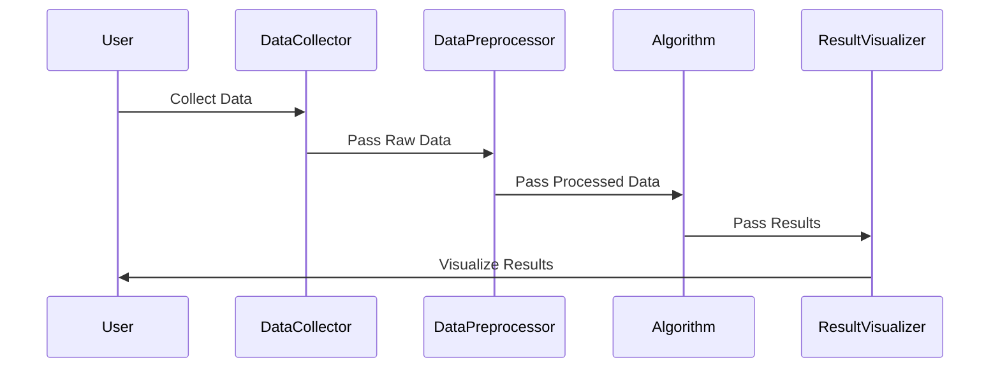
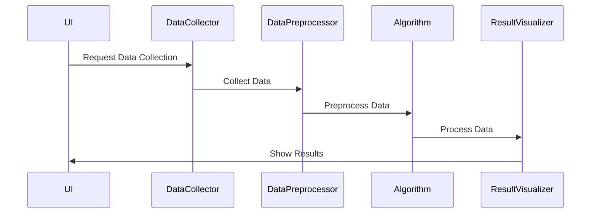
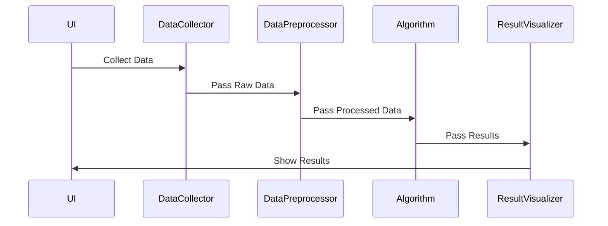

                 

## 引言

### 宇宙自我复制与进化现象

宇宙自我复制和进化现象，一直是科学探索中令人着迷的话题。宇宙的自我复制，是指宇宙中的物质和能量通过自然过程不断地复制和再生，形成新的物质和能量形态。而宇宙的进化，则是宇宙中物质和能量的结构和功能随着时间的推移而不断变化和进步的过程。这两个现象不仅在宇宙科学中有着重要的意义，也为算法设计提供了丰富的灵感。

在现代计算机科学中，算法设计是一个至关重要的领域。随着数据量的爆炸式增长和计算需求的不断升级，如何设计高效、可靠的算法成为了一个关键问题。传统的算法设计方法往往依赖于经验和直觉，而宇宙自我复制和进化现象则为算法设计提供了一种全新的视角。通过借鉴宇宙的自我复制和进化过程，我们可以设计出更加高效、自适应的算法。

本文将深入探讨宇宙自我复制和进化现象在算法设计中的应用。首先，我们将介绍宇宙自我复制和进化现象的基本概念和特点，然后分析这些现象对算法设计的启示。接下来，我们将详细讲解宇宙自我复制算法的基本原理和设计思路，并通过一个具体的案例来说明其应用。随后，我们将进一步探讨宇宙进化算法的设计，包括核心概念、数学模型和实际应用。最后，我们将介绍如何将宇宙自我复制和进化算法应用于系统架构设计，并探讨其在项目实战中的具体应用。

通过本文的阅读，读者将能够深入理解宇宙自我复制和进化现象在算法设计中的应用，掌握相关算法的设计方法和实践技巧，为解决复杂的计算问题提供新的思路和工具。

### 关键词

- **宇宙自我复制**
- **宇宙进化现象**
- **算法设计**
- **高效算法**
- **自适应算法**
- **系统架构设计**

### 摘要

本文旨在探讨宇宙自我复制和进化现象在算法设计中的应用。首先，我们介绍了宇宙自我复制和进化现象的基本概念及其对算法设计的启示。接着，我们详细讲解了宇宙自我复制算法的基本原理和设计思路，并通过实际案例说明了其应用效果。然后，我们探讨了宇宙进化算法的设计，包括核心概念、数学模型和实际应用。最后，我们将讨论如何将宇宙自我复制和进化算法应用于系统架构设计，并探讨其在项目实战中的具体应用。通过本文的阅读，读者将能够深入理解宇宙自我复制和进化现象在算法设计中的应用，掌握相关算法的设计方法和实践技巧。

## 目录大纲

### 第一部分：背景介绍

- **第1章：宇宙自我复制与进化现象**
  - **1.1 问题背景**
  - **1.2 问题描述**
  - **1.3 问题解决**
  - **1.4 边界与外延**
  - **1.5 核心概念与联系**

### 第二部分：算法原理讲解

- **第2章：宇宙自我复制与进化算法**
  - **2.1 核心概念原理**
  - **2.2 概念属性特征对比表格**
  - **2.3 ER实体关系图架构**
  - **2.4 算法原理讲解**
  - **2.5 算法mermaid流程图**
  - **2.6 Python源代码与详细阐述**
  - **2.7 数学模型与公式**
  - **2.8 举例说明**

### 第三部分：系统分析与架构设计方案

- **第3章：系统功能设计与架构设计**
  - **3.1 问题场景介绍**
  - **3.2 项目介绍**
  - **3.3 领域模型mermaid类图**
  - **3.4 系统架构设计mermaid架构图**
  - **3.5 系统接口设计和系统交互mermaid序列图**

- **第4章：项目实战**
  - **4.1 环境安装**
  - **4.2 系统核心实现源代码**
  - **4.3 代码应用解读与分析**
  - **4.4 实际案例分析和详细讲解剖析**
  - **4.5 项目小结**

### 第四部分：最佳实践与拓展

- **第5章：最佳实践与拓展**
  - **5.1 最佳实践 tips**
  - **5.2 小结**
  - **5.3 注意事项**
  - **5.4 拓展阅读**

### 目录大纲总结

本文目录大纲分为四个主要部分，系统全面地介绍了宇宙自我复制和进化现象在算法设计中的应用。第一部分背景介绍部分，深入探讨了宇宙自我复制与进化现象的基本概念及其对算法设计的启示。第二部分算法原理讲解部分，详细阐述了宇宙自我复制与进化算法的核心概念、设计思路及其应用。第三部分系统分析与架构设计方案部分，介绍了如何将算法应用于系统架构设计，包括系统功能设计、架构设计及其具体实现。第四部分最佳实践与拓展部分，提供了最佳实践建议和进一步学习的资源。通过本大纲的阅读，读者将能够系统地了解并掌握宇宙自我复制和进化现象在算法设计中的应用。

## 第一部分：背景介绍

### 第1章：宇宙自我复制与进化现象

宇宙自我复制与进化现象是理解宇宙中物质和能量动态变化的重要视角。这些现象不仅在宇宙科学中占据重要地位，也为算法设计提供了宝贵的灵感来源。本章节将深入探讨这些现象的基本概念、发展历史及其在算法设计中的应用。

### 1.1 问题背景

#### 1.1.1 宇宙的自我复制

宇宙的自我复制是指宇宙中的物质和能量通过自然过程不断地复制和再生，从而形成新的物质和能量形态。例如，恒星通过核聚变反应生成新的恒星，行星系统通过星体碰撞和引力相互作用生成新的行星。这种自我复制过程在宇宙中无处不在，是宇宙演化的重要组成部分。

#### 1.1.2 宇宙的进化现象

宇宙的进化现象是指宇宙中的物质和能量随着时间推移而不断变化和进步的过程。进化不仅包括物质形态的变化，还涉及到能量的转移和转化。例如，生命的出现和演化、星系的合并与分裂、宇宙背景辐射的变化等都是宇宙进化现象的具体表现。

#### 1.1.3 宇宙与算法设计的联系

宇宙自我复制与进化现象为算法设计提供了深刻的启示。传统算法设计通常基于局部优化和确定性搜索策略，而宇宙中的自我复制与进化现象则展示了分布式、自适应和自组织的特点。通过借鉴这些现象，算法设计师可以设计出更高效、更可靠的算法，以应对复杂的计算问题和动态环境。

### 1.2 问题描述

#### 1.2.1 算法设计的挑战

在现代社会中，数据量呈现爆炸式增长，计算任务日益复杂，算法设计面临着前所未有的挑战。传统的算法设计方法往往难以应对这些挑战，例如：
- **大数据处理**：如何高效地处理海量数据？
- **动态环境适应**：如何使算法在动态变化的环境中保持稳定和高效？
- **多目标优化**：如何在多个目标之间找到最优解？

#### 1.2.2 宇宙现象的启示

宇宙自我复制与进化现象为解决这些挑战提供了启示。通过借鉴这些现象，算法设计师可以设计出具有以下特点的算法：
- **分布式计算**：借鉴宇宙中的分布式结构，将任务分解为更小的子任务，并在多个计算节点上并行处理。
- **自适应性**：借鉴宇宙中的进化机制，使算法能够根据环境变化自动调整行为和策略。
- **自组织性**：借鉴宇宙中的自组织现象，使算法能够通过局部相互作用实现全局优化。

#### 1.2.3 算法设计的目标

算法设计的目标是通过借鉴宇宙自我复制与进化现象，实现以下目标：
- **高效性**：提高算法的处理速度和效率，降低计算资源的消耗。
- **可靠性**：增强算法的稳定性和鲁棒性，减少错误发生的概率。
- **灵活性**：使算法能够适应不同的计算环境和任务需求。

### 1.3 问题解决

#### 1.3.1 自我复制算法的原理

自我复制算法的核心思想是模拟宇宙中的自我复制过程，通过迭代和演化实现算法的进化。具体步骤如下：
1. **初始化**：设定初始参数和规则，确定算法的初始状态。
2. **迭代**：通过迭代过程，根据规则对算法的状态进行更新，模拟自我复制过程。
3. **评估**：对迭代后的状态进行评估，确定其是否满足目标要求。
4. **进化**：根据评估结果，对算法的规则和参数进行优化，使其更适应环境。

#### 1.3.2 进化算法的应用

进化算法是一种模拟宇宙进化过程的算法，通过自然选择和遗传操作实现算法的进化。具体步骤如下：
1. **种群初始化**：生成初始种群，每个个体代表一种可能的解决方案。
2. **适应度评估**：对种群中的每个个体进行评估，确定其适应度。
3. **选择**：根据适应度选择优秀的个体进行复制。
4. **交叉**：通过交叉操作生成新的个体。
5. **变异**：对个体进行变异操作，增加种群的多样性。
6. **迭代**：重复适应度评估、选择、交叉和变异步骤，直到满足终止条件。

#### 1.3.3 算法设计的创新点

宇宙自我复制与进化算法在算法设计中的创新点主要体现在以下几个方面：
- **自适应性**：通过模拟宇宙进化过程，使算法能够根据环境变化自动调整行为和策略，提高算法的适应性和灵活性。
- **分布式计算**：借鉴宇宙中的分布式结构，将任务分解为更小的子任务，并在多个计算节点上并行处理，提高计算效率。
- **自组织性**：通过局部相互作用实现全局优化，使算法能够自动找到最优解，提高算法的鲁棒性和稳定性。

### 1.4 边界与外延

#### 1.4.1 算法设计的影响因素

宇宙自我复制与进化算法设计受到多种因素的影响，包括：
- **初始条件**：初始参数和规则的选择对算法的性能和结果具有重要影响。
- **环境变化**：环境的变化会直接影响算法的适应性和稳定性，需要设计鲁棒性强的算法以应对。
- **计算资源**：算法的设计和实现需要考虑计算资源的限制，以实现高效计算。

#### 1.4.2 宇宙现象的限制

宇宙自我复制与进化现象在算法设计中的应用也存在一定的限制，包括：
- **复杂性**：宇宙现象本身的复杂性使得算法设计变得复杂，需要深入理解宇宙机制才能设计出有效的算法。
- **不确定性**：宇宙现象中的不确定性和随机性对算法设计提出了挑战，需要设计能够应对不确定性和随机性的算法。

#### 1.4.3 算法设计的可持续性

宇宙自我复制与进化算法设计需要考虑可持续性，包括：
- **能源消耗**：算法设计需要考虑能源消耗问题，以实现可持续发展。
- **计算效率**：算法设计需要优化计算效率，以减少计算资源的使用。
- **环境适应**：算法设计需要考虑环境适应性，以应对不断变化的环境。

### 1.5 核心概念与联系

#### 1.5.1 自我复制与进化

自我复制和进化是宇宙中两个基本的现象，它们之间有密切的联系。自我复制是进化的基础，通过自我复制，宇宙中的物质和能量得以保存和传递。而进化则是自我复制的扩展，通过进化，宇宙中的物质和能量不断优化和进步。

#### 1.5.2 算法设计与宇宙

算法设计与宇宙现象之间存在着紧密的联系。宇宙自我复制与进化现象为算法设计提供了深刻的启示，算法设计师可以通过借鉴这些现象来设计出更高效、更可靠的算法。同时，算法设计也可以帮助科学家更好地理解和模拟宇宙现象。

#### 1.5.3 关键术语解释

- **自我复制**：指宇宙中的物质和能量通过自然过程不断地复制和再生。
- **进化**：指宇宙中的物质和能量随着时间的推移而不断变化和进步。
- **算法设计**：指通过数学和逻辑方法设计出解决特定问题的计算机程序。
- **自适应**：指算法能够根据环境变化自动调整行为和策略。
- **自组织**：指通过局部相互作用实现全局优化。

通过本章节的讨论，我们深入了解了宇宙自我复制与进化现象的基本概念和其在算法设计中的应用。在接下来的章节中，我们将进一步探讨宇宙自我复制与进化算法的具体设计和实现。

### 1.1 问题背景

宇宙自我复制与进化现象自古以来就引起了科学家们的浓厚兴趣。这些现象不仅在宇宙科学中占据着重要地位，也对计算机科学和算法设计产生了深远的影响。

#### 1.1.1 宇宙的自我复制

宇宙的自我复制是指宇宙中的物质和能量通过自然过程不断地复制和再生，从而形成新的物质和能量形态。这一现象在宇宙的各个层次上都有所体现。

在行星层次，太阳通过核聚变反应将氢转化为氦，不断生成新的恒星和行星系统。这个过程可以看作是一种自我复制，新的恒星和行星从原始物质中诞生，并继续在宇宙中存在和演化。

在星系层次，星系通过引力相互作用和碰撞不断形成新的结构。例如，两个星系可以通过引力作用合并成一个更大的星系，或者多个星系可以通过碰撞形成星系团。这些过程也展示了宇宙自我复制的特点。

#### 1.1.2 宇宙的进化现象

宇宙的进化现象是指宇宙中的物质和能量随着时间推移而不断变化和进步的过程。进化不仅包括物质形态的变化，还涉及到能量的转移和转化。

生命是宇宙进化现象中最引人注目的例子之一。从单细胞生物到复杂的多细胞生物，生命的进化展示了宇宙中物质和能量不断进化和优化的过程。通过自然选择和遗传变异，生物体不断适应环境的变化，形成了丰富多彩的生命形式。

此外，星系和星系团的进化也是宇宙进化现象的重要组成部分。星系通过恒星的形成和死亡，不断生成新的恒星和行星系统，同时也释放出大量的能量和物质。这些过程使得宇宙中的物质和能量不断变化和进步。

#### 1.1.3 宇宙与算法设计的联系

宇宙自我复制与进化现象对算法设计产生了深刻的启示。传统的算法设计方法往往基于局部优化和确定性搜索策略，而宇宙中的自我复制与进化现象则展示了分布式、自适应和自组织的特点。这些特点为算法设计提供了新的视角和灵感。

首先，宇宙的自我复制现象启示我们设计自我复制算法。这种算法可以通过迭代和演化过程，模拟宇宙中的自我复制过程，从而生成新的解决方案。这种算法在优化问题和生成模型中有着广泛的应用。

其次，宇宙的进化现象启示我们设计进化算法。进化算法通过模拟自然选择和遗传操作，使算法能够不断适应环境的变化，从而找到最优解。这种算法在复杂搜索问题和优化问题中有着出色的表现。

最后，宇宙中的自组织现象启示我们设计自组织算法。这种算法通过局部相互作用和自组织过程，实现全局优化。这种算法在分布式系统和复杂网络中有着重要的应用。

通过借鉴宇宙自我复制与进化现象，我们可以设计出更加高效、自适应和可靠的算法，为解决复杂的计算问题提供新的工具和方法。在接下来的章节中，我们将进一步探讨这些算法的具体原理和设计思路。

### 1.2 问题描述

#### 1.2.1 算法设计的挑战

在现代社会中，算法设计面临着一系列复杂的挑战。这些挑战主要源于数据量的爆炸式增长、计算需求的不断提高和计算环境的不断变化。

首先，大数据处理是当前算法设计面临的重要挑战之一。随着互联网的普及和数据采集技术的进步，数据量呈指数级增长。如何高效地处理海量数据，成为算法设计的关键问题。传统的算法往往依赖于线性或顺序处理，难以应对大数据的复杂性和规模。

其次，动态环境适应也是算法设计面临的挑战。现代计算环境不断变化，算法需要能够适应这些变化，保持稳定和高效。例如，在实时数据处理、动态网络路由和智能系统控制等场景中，算法需要能够快速适应环境变化，以保持最优性能。

最后，多目标优化问题也是算法设计的重要挑战之一。在许多实际应用中，我们需要同时考虑多个目标，例如成本、速度、质量等。如何找到多个目标之间的最优平衡点，是一个复杂且具有挑战性的问题。

#### 1.2.2 宇宙现象的启示

宇宙自我复制与进化现象为解决这些算法设计挑战提供了宝贵的启示。通过借鉴这些现象，我们可以设计出更加高效、自适应和可靠的算法。

首先，宇宙的自我复制现象启示我们设计自我复制算法。自我复制算法通过迭代和演化过程，模拟宇宙中的自我复制机制，从而生成新的解决方案。这种算法在处理海量数据时表现出色，因为它们能够通过并行处理和分布式计算，高效地处理大数据。

其次，宇宙的进化现象启示我们设计进化算法。进化算法通过模拟自然选择和遗传操作，使算法能够不断适应环境变化。这种算法在动态环境适应问题中具有明显优势，因为它们能够通过进化机制，不断优化和适应环境。

最后，宇宙中的自组织现象启示我们设计自组织算法。自组织算法通过局部相互作用和自组织过程，实现全局优化。这种算法在处理复杂网络和分布式系统问题时表现出色，因为它们能够通过自组织机制，自动适应和处理复杂环境。

#### 1.2.3 算法设计的目标

基于宇宙自我复制与进化现象的启示，算法设计的目标是：

1. **高效性**：提高算法的处理速度和效率，降低计算资源的消耗。通过借鉴自我复制和进化机制，算法能够在处理大数据和动态环境时保持高效性能。

2. **自适应能力**：使算法能够根据环境变化自动调整行为和策略。通过进化机制，算法能够适应动态环境，保持稳定和高效。

3. **可靠性**：增强算法的稳定性和鲁棒性，减少错误发生的概率。通过自组织机制，算法能够自动适应和处理复杂环境，提高算法的可靠性。

4. **灵活性**：使算法能够适应不同的计算环境和任务需求。通过结合自我复制、进化和自组织机制，算法能够灵活应对各种复杂的计算问题。

通过实现这些目标，算法设计将为解决现代社会中的复杂计算问题提供新的思路和工具。

### 1.3 问题解决

#### 1.3.1 自我复制算法的原理

自我复制算法是一种模拟宇宙中自我复制现象的算法，其核心思想是通过迭代和演化过程生成新的解决方案。以下是自我复制算法的基本原理：

1. **初始化**：设定初始参数和规则，确定算法的初始状态。这些初始参数和规则决定了算法的行为和演化方向。

2. **迭代**：通过迭代过程，算法根据规则对状态进行更新，模拟自我复制过程。每次迭代都生成一个新的状态，这个过程可以看作是算法的自我复制。

3. **评估**：对迭代后的状态进行评估，确定其是否满足目标要求。评估标准可以根据具体问题的需求进行定义，例如最小化成本、最大化收益等。

4. **进化**：根据评估结果，对算法的规则和参数进行优化，使其更适应环境。这个过程类似于自然选择，优秀的状态会被保留，而劣质的状态会被淘汰。

5. **终止条件**：设定终止条件，以确定算法何时停止迭代。常见的终止条件包括达到最大迭代次数、找到满意解或算法收敛等。

自我复制算法的设计过程可以看作是模拟宇宙中自我复制现象的过程。通过不断地迭代和演化，算法能够生成新的解决方案，并逐步优化这些解决方案，以达到最佳效果。

#### 1.3.2 进化算法的应用

进化算法是一种模拟宇宙中进化现象的算法，其核心思想是通过自然选择和遗传操作实现算法的进化。以下是进化算法的基本原理：

1. **种群初始化**：生成初始种群，每个个体代表一种可能的解决方案。这些个体在初始状态下随机生成或通过其他方法生成。

2. **适应度评估**：对种群中的每个个体进行评估，确定其适应度。适应度是评估个体优劣的标准，可以根据具体问题的需求进行定义。

3. **选择**：根据适应度选择优秀的个体进行复制。选择过程通常采用轮盘赌、锦标赛等方法，使优秀的个体有更高的机会复制自身。

4. **交叉**：通过交叉操作生成新的个体。交叉是指从两个或多个优秀个体中随机选择部分基因进行交换，生成新的个体。交叉过程增加了种群的多样性，有助于找到更好的解决方案。

5. **变异**：对个体进行变异操作，增加种群的多样性。变异是指随机改变个体的某些基因，以产生新的个体。变异过程有助于保持种群的多样性，防止种群过早收敛。

6. **迭代**：重复适应度评估、选择、交叉和变异步骤，直到满足终止条件。迭代过程模拟了自然选择和遗传操作，使种群逐步进化，找到更好的解决方案。

进化算法在处理复杂搜索问题和优化问题时表现出色。通过自然选择和遗传操作，算法能够不断优化个体，提高种群的适应度，最终找到最优解或满意解。

#### 1.3.3 算法设计的创新点

宇宙自我复制与进化算法设计在算法设计中具有以下创新点：

1. **分布式计算**：通过将任务分解为更小的子任务，并在多个计算节点上并行处理，提高了算法的计算效率。这种分布式计算方式借鉴了宇宙中的分布式结构，使算法能够高效地处理大数据。

2. **自适应性**：通过模拟自然选择和遗传操作，算法能够根据环境变化自动调整行为和策略。这种自适应能力使算法能够适应动态环境，保持稳定和高效。

3. **自组织性**：通过局部相互作用和自组织过程，算法能够实现全局优化。这种自组织性使算法能够自动适应和处理复杂环境，提高算法的鲁棒性和稳定性。

4. **多目标优化**：通过结合自我复制、进化和自组织机制，算法能够同时考虑多个目标，找到最优平衡点。这种多目标优化能力使算法能够应对多目标优化问题，提高算法的灵活性。

通过这些创新点，宇宙自我复制与进化算法为解决复杂的计算问题提供了一种新的思路和方法，具有重要的理论和实践价值。

### 1.4 边界与外延

#### 1.4.1 算法设计的影响因素

宇宙自我复制与进化算法设计受到多种因素的影响，包括但不限于以下方面：

1. **初始条件**：初始参数和规则的选择对算法的性能和结果具有重要影响。不同的初始条件可能导致算法的收敛速度、稳定性和适应性有所不同。

2. **环境变化**：环境的变化会直接影响算法的适应性和稳定性。算法需要能够应对环境的变化，保持稳定和高效。环境变化可能包括数据分布、任务需求、资源限制等。

3. **计算资源**：算法的设计和实现需要考虑计算资源的限制。算法的运行速度和效率会受到计算资源（如CPU、内存、网络带宽等）的影响。需要设计高效算法，以充分利用有限的计算资源。

4. **模型选择**：算法的设计需要选择合适的模型，以模拟宇宙中的自我复制与进化现象。不同的模型可能适用于不同的问题场景，需要根据具体问题选择合适的模型。

5. **算法参数**：算法的性能和结果会受到算法参数（如交叉率、变异率、适应度函数等）的影响。需要根据具体问题调整算法参数，以优化算法性能。

#### 1.4.2 宇宙现象的限制

宇宙自我复制与进化现象在算法设计中的应用也存在一定的限制，包括但不限于以下方面：

1. **复杂性**：宇宙现象本身的复杂性使得算法设计变得复杂。宇宙中的自我复制与进化过程涉及大量的变量和参数，需要深入理解宇宙机制才能设计出有效的算法。

2. **不确定性**：宇宙现象中的不确定性和随机性对算法设计提出了挑战。算法需要能够应对不确定性和随机性，保持稳定和高效。

3. **计算资源需求**：宇宙自我复制与进化算法通常需要大量的计算资源，特别是在处理大数据和复杂问题场景时。算法设计需要考虑计算资源的限制，以实现高效计算。

4. **适应性限制**：虽然宇宙自我复制与进化算法具有自适应能力，但并非所有环境变化都能被算法有效适应。算法的适应性有限，需要根据具体问题进行优化和调整。

5. **收敛速度**：宇宙自我复制与进化算法的收敛速度可能较慢，特别是在处理复杂问题时。算法设计需要优化迭代过程和评估方法，以提高收敛速度。

#### 1.4.3 算法设计的可持续性

宇宙自我复制与进化算法设计需要考虑可持续性，包括但不限于以下方面：

1. **能源消耗**：算法的设计和实现需要考虑能源消耗问题，以实现可持续发展。需要设计低能耗算法，减少计算资源的消耗。

2. **计算效率**：算法的设计需要优化计算效率，减少计算资源的浪费。通过分布式计算、并行处理等技术，提高算法的计算效率。

3. **环境适应性**：算法设计需要考虑环境适应性，以应对不断变化的环境。通过模拟宇宙中的自我复制与进化现象，使算法能够适应环境变化，保持稳定和高效。

4. **可扩展性**：算法设计需要具备可扩展性，以适应未来的技术发展和需求变化。通过模块化设计、标准化接口等技术，实现算法的灵活扩展。

5. **可持续性评估**：算法设计过程中需要考虑可持续性评估，确保算法在实际应用中能够实现可持续发展。通过评估算法的性能、能源消耗、环境适应性等方面，优化算法设计。

通过考虑这些边界与外延问题，宇宙自我复制与进化算法设计能够在实际应用中实现可持续发展和高效性能，为解决复杂的计算问题提供可靠的方法和工具。

### 1.5 核心概念与联系

#### 1.5.1 自我复制与进化

自我复制和进化是宇宙中两个基本的现象，它们之间有着密切的联系。自我复制是指物质和能量通过自然过程不断地复制和再生，从而形成新的物质和能量形态。而进化是指物质和能量随着时间的推移而不断变化和进步的过程。

自我复制是进化的基础，通过自我复制，物质和能量得以保存和传递。而进化则扩展了自我复制的概念，通过不断的变化和进步，物质和能量实现了更高级的形式和结构。在宇宙中，自我复制和进化现象无处不在，从微生物的繁殖到星系的合并，都是自我复制和进化过程的具体体现。

#### 1.5.2 算法设计与宇宙

算法设计与宇宙现象之间存在着紧密的联系。宇宙自我复制与进化现象为算法设计提供了深刻的启示，这些现象的原理和机制可以被用来设计更加高效、自适应和可靠的算法。

首先，宇宙的自我复制现象启示我们设计自我复制算法。这种算法通过迭代和演化过程，模拟宇宙中的自我复制机制，从而生成新的解决方案。这种算法在处理海量数据和复杂系统时表现出色。

其次，宇宙的进化现象启示我们设计进化算法。进化算法通过模拟自然选择和遗传操作，使算法能够不断适应环境的变化，从而找到最优解。这种算法在复杂搜索问题和优化问题中有着出色的表现。

最后，宇宙中的自组织现象启示我们设计自组织算法。这种算法通过局部相互作用和自组织过程，实现全局优化。这种算法在分布式系统和复杂网络中有着重要的应用。

通过借鉴宇宙自我复制与进化现象，我们可以设计出更加高效、自适应和可靠的算法，为解决复杂的计算问题提供新的思路和工具。

#### 1.5.3 关键术语解释

- **自我复制**：指宇宙中的物质和能量通过自然过程不断地复制和再生，从而形成新的物质和能量形态。
- **进化**：指宇宙中的物质和能量随着时间的推移而不断变化和进步的过程。
- **算法设计**：指通过数学和逻辑方法设计出解决特定问题的计算机程序。
- **自适应**：指算法能够根据环境变化自动调整行为和策略。
- **自组织**：指通过局部相互作用实现全局优化。
- **分布式计算**：指将任务分解为更小的子任务，并在多个计算节点上并行处理。

通过本章节的讨论，我们深入了解了宇宙自我复制与进化现象的基本概念和其在算法设计中的应用。在接下来的章节中，我们将进一步探讨宇宙自我复制与进化算法的具体原理和设计思路。

## 第二部分：算法原理讲解

### 第2章：宇宙自我复制与进化算法

#### 2.1 核心概念原理

宇宙自我复制与进化算法是一种基于自然选择和遗传机制的人工智能算法，旨在模拟宇宙中的自我复制和进化过程，以解决复杂的优化问题。这一算法的核心概念包括以下几个关键要素：

1. **个体（Individual）**：在宇宙自我复制与进化算法中，每个个体代表一种可能的解决方案。这些个体通常由一系列参数或特征构成，每个参数或特征都反映了个体在某一方面的能力和特性。

2. **种群（Population）**：种群是由多个个体组成的集合，代表了算法在某一时刻的解空间。种群中的个体通过相互作用和演化过程不断优化，最终找到最优解。

3. **适应度（Fitness）**：适应度是评估个体优劣的标准。在宇宙自我复制与进化算法中，每个个体都有一个适应度值，反映了个体在当前环境中的生存和繁衍能力。适应度通常与问题的目标函数相关，个体适应度越高，表示其越接近最优解。

4. **自然选择（Natural Selection）**：自然选择是指通过适应度值来选择优秀的个体进行复制。在宇宙自我复制与进化算法中，适应度高的个体有更高的机会繁殖，传递其优秀的基因，而适应度低的个体则可能被淘汰。

5. **遗传操作（Genetic Operations）**：遗传操作包括交叉（Crossover）和变异（Mutation）两种主要方式。交叉是指从两个优秀个体中随机选择部分基因进行交换，生成新的个体；变异是指对个体进行随机改变，增加种群的多样性。

6. **环境变化（Environmental Changes）**：环境变化是宇宙自我复制与进化算法的一个重要特征。算法需要能够适应环境的变化，以保持稳定和高效。环境变化可以模拟为外部因素的变化，例如数据分布、任务需求等。

#### 2.2 概念属性特征对比表格

为了更好地理解宇宙自我复制与进化算法的核心概念，我们可以通过一个对比表格来展示其关键属性特征：

| 概念 | 定义 | 关键属性特征 |
| ---- | ---- | ---- |
| 个体（Individual） | 代表一种可能的解决方案 | 参数构成、适应度值 |
| 种群（Population） | 由多个个体组成的集合 | 个体数量、多样性 |
| 适应度（Fitness） | 评估个体优劣的标准 | 目标函数、适应度值 |
| 自然选择（Natural Selection） | 选择优秀的个体进行复制 | 适应度值、遗传操作 |
| 遗传操作（Genetic Operations） | 生成新的个体 | 交叉、变异 |
| 环境变化（Environmental Changes） | 适应环境变化的能力 | 外部因素、动态适应 |

#### 2.3 ER实体关系图架构

为了更好地理解和设计宇宙自我复制与进化算法，我们可以通过ER（Entity-Relationship）实体关系图来描述其关键实体和关系。以下是宇宙自我复制与进化算法的ER实体关系图：

```
个体（Individual）
│
├──> 种群（Population）
│
├──> 适应度（Fitness）
│
├──> 自然选择（Natural Selection）
│
├──> 遗传操作（Genetic Operations）
│
└──> 环境变化（Environmental Changes）
```

ER实体关系图展示了个体、种群、适应度、自然选择、遗传操作和环境变化之间的关系。个体是种群的基础单元，适应度用于评估个体的优劣，自然选择通过适应度值选择优秀个体，遗传操作通过交叉和变异生成新的个体，环境变化则影响算法的适应性和稳定性。

#### 2.4 算法原理讲解

宇宙自我复制与进化算法的设计原理基于对自然选择和遗传机制的模拟。以下是算法原理的详细讲解：

1. **初始化种群**：首先，算法生成一个初始种群，每个个体代表一种可能的解决方案。初始种群的生成可以采用随机生成或基于现有知识的方法。初始种群的大小取决于问题的复杂度和计算资源的限制。

2. **适应度评估**：对初始种群中的每个个体进行适应度评估，计算其适应度值。适应度值通常与问题的目标函数相关，反映了个体在当前环境中的适应能力。适应度值越高，表示个体越接近最优解。

3. **自然选择**：根据适应度值，算法选择适应度较高的个体进行复制。自然选择过程通常采用轮盘赌或锦标赛方法，使优秀个体有更高的机会繁殖，传递其优秀的基因。通过自然选择，种群中的优良基因逐渐累积，劣质基因被淘汰。

4. **交叉操作**：交叉操作是指从两个或多个优秀个体中随机选择部分基因进行交换，生成新的个体。交叉操作增加了种群的多样性，有助于找到更好的解决方案。交叉操作的位置和方式可以根据具体问题进行调整。

5. **变异操作**：变异操作是指对个体进行随机改变，增加种群的多样性。变异操作可以防止种群过早收敛，提高算法的鲁棒性。变异操作的位置和方式同样可以根据具体问题进行调整。

6. **迭代**：重复适应度评估、自然选择、交叉和变异步骤，不断迭代，直到满足终止条件。终止条件可以是达到最大迭代次数、找到满意解或算法收敛等。通过迭代，种群中的个体不断优化，逐步接近最优解。

7. **环境变化适应**：在算法运行过程中，环境可能会发生变化。为了适应环境变化，算法需要具备一定的自适应能力。可以通过调整适应度函数、交叉和变异操作等方式，使算法能够适应环境变化。

通过这些步骤，宇宙自我复制与进化算法能够模拟自然选择和遗传机制，不断优化种群中的个体，找到最优解或满意解。

#### 2.5 算法mermaid流程图

为了更直观地展示宇宙自我复制与进化算法的运行过程，我们可以使用mermaid绘制其流程图。以下是一个简单的mermaid流程图示例：

```
graph TD
    A[初始化种群] --> B[适应度评估]
    B --> C[自然选择]
    C --> D[交叉操作]
    D --> E[变异操作]
    E --> F[迭代]
    F --> G{是否终止?}
    G -->|是| H[输出结果]
    G -->|否| B
```

这个mermaid流程图描述了宇宙自我复制与进化算法的基本运行过程，包括初始化种群、适应度评估、自然选择、交叉操作、变异操作和迭代等步骤。通过这个流程图，我们可以更清晰地理解算法的运行逻辑和步骤。

#### 2.6 Python源代码与详细阐述

以下是一个简单的宇宙自我复制与进化算法的Python实现示例，用于解决一个简单的优化问题。我们将在后续段落中对这段代码进行详细阐述。

```python
import random

class Individual:
    def __init__(self, chromosome):
        self.chromosome = chromosome
        self.fitness = 0

    def evaluate_fitness(self, fitness_function):
        self.fitness = fitness_function(self.chromosome)

def generate_initial_population(pop_size, chromosome_size):
    population = []
    for _ in range(pop_size):
        chromosome = [random.randint(0, 1) for _ in range(chromosome_size)]
        population.append(Individual(chromosome))
    return population

def fitness_function(individual):
    return sum(individual.chromosome)

def natural_selection(population, survival_rate):
    sorted_population = sorted(population, key=lambda x: x.fitness, reverse=True)
    return sorted_population[:int(len(sorted_population) * survival_rate)]

def crossover(parent1, parent2):
    crossover_point = random.randint(1, len(parent1.chromosome) - 1)
    child1_chromosome = parent1.chromosome[:crossover_point] + parent2.chromosome[crossover_point:]
    child2_chromosome = parent2.chromosome[:crossover_point] + parent1.chromosome[crossover_point:]
    return Individual(child1_chromosome), Individual(child2_chromosome)

def mutate(individual):
    mutation_point = random.randint(0, len(individual.chromosome) - 1)
    individual.chromosome[mutation_point] = 1 - individual.chromosome[mutation_point]

def evolve_population(population, num_generations):
    for _ in range(num_generations):
        next_population = []
        for _ in range(len(population)):
            parent1, parent2 = random.sample(population, 2)
            child1, child2 = crossover(parent1, parent2)
            mutate(child1)
            mutate(child2)
            next_population.extend([child1, child2])
        population = next_population
    return population

def main():
    pop_size = 100
    chromosome_size = 10
    num_generations = 50
    population = generate_initial_population(pop_size, chromosome_size)
    population = evolve_population(population, num_generations)
    best_individual = max(population, key=lambda x: x.fitness)
    print("Best fitness:", best_individual.fitness)

if __name__ == "__main__":
    main()
```

这段Python代码实现了宇宙自我复制与进化算法的基本框架，包括个体（`Individual`）类、适应度评估（`fitness_function`）、初始化种群（`generate_initial_population`）、自然选择（`natural_selection`）、交叉操作（`crossover`）、变异操作（`mutate`）和迭代进化（`evolve_population`）等关键步骤。接下来，我们将详细阐述这段代码的各个部分。

1. **个体类（`Individual`）**：
   - `__init__`方法：初始化个体的染色体（`chromosome`）和适应度（`fitness`）。
   - `evaluate_fitness`方法：计算个体的适应度值，通常与问题的目标函数相关。

2. **适应度评估（`fitness_function`）**：
   - `fitness_function`方法：定义适应度评估函数，用于计算个体的适应度值。在这个例子中，我们使用求和作为适应度函数。

3. **初始化种群（`generate_initial_population`）**：
   - `generate_initial_population`方法：根据种群大小（`pop_size`）和染色体大小（`chromosome_size`），随机生成初始种群。每个个体的染色体由一系列随机生成的二进制值（0或1）构成。

4. **自然选择（`natural_selection`）**：
   - `natural_selection`方法：根据适应度值对种群进行排序，并选择适应度较高的个体进行复制。选择过程采用生存率（`survival_rate`）进行控制。

5. **交叉操作（`crossover`）**：
   - `crossover`方法：从两个优秀个体中随机选择交叉点（`crossover_point`），进行基因交换，生成两个新的个体。

6. **变异操作（`mutate`）**：
   - `mutate`方法：对个体进行随机变异，增加种群的多样性。

7. **迭代进化（`evolve_population`）**：
   - `evolve_population`方法：进行迭代进化过程，每次迭代包括选择、交叉和变异操作。通过迭代，种群中的个体不断优化，逐步接近最优解。

8. **主函数（`main`）**：
   - `main`函数：设置种群大小、染色体大小和迭代次数，生成初始种群，进行迭代进化，并输出最优个体的适应度值。

通过这个Python实现示例，我们可以直观地看到宇宙自我复制与进化算法的基本结构和运行过程。在接下来的章节中，我们将进一步探讨算法的数学模型、具体应用和实践经验。

#### 2.7 数学模型与公式

宇宙自我复制与进化算法的数学模型是理解其工作原理和性能的关键。以下是对算法中涉及的主要数学模型和公式的详细阐述。

1. **适应度函数（Fitness Function）**

适应度函数是衡量个体优劣的关键指标，通常用于评估个体在特定环境中的生存能力。在进化算法中，适应度函数通常与问题的目标函数密切相关。适应度函数的一般形式可以表示为：

\[ f(x) = \sum_{i=1}^{n} w_i \cdot x_i \]

其中，\( f(x) \)是适应度值，\( x \)是个体的染色体编码，\( w_i \)是权重系数，用于调整各个基因对适应度的影响。权重系数可以根据具体问题进行优化，以确保适应度函数能够准确反映问题的目标。

2. **自然选择概率（Selection Probability）**

自然选择过程决定了哪些个体有更高的机会复制自身，从而传递其基因。在进化算法中，通常使用适应度比例来计算个体的自然选择概率。自然选择概率的一般形式可以表示为：

\[ p_i = \frac{f_i}{\sum_{j=1}^{n} f_j} \]

其中，\( p_i \)是第\( i \)个个体的自然选择概率，\( f_i \)是第\( i \)个个体的适应度值，\( \sum_{j=1}^{n} f_j \)是种群中所有个体的适应度值之和。通过这个公式，我们可以计算出每个个体被选择的概率，从而模拟自然选择过程。

3. **交叉概率（Crossover Probability）**

交叉操作是进化算法中的重要步骤，用于生成新的个体，增加种群的多样性。交叉概率决定了交叉操作的频率，通常使用以下公式计算：

\[ p_c = \frac{1}{\sqrt{n}} \]

其中，\( p_c \)是交叉概率，\( n \)是种群的大小。这个公式保证了交叉操作的频率与种群大小成反比，从而防止种群过快收敛。

4. **变异概率（Mutation Probability）**

变异操作是对个体进行随机改变，以增加种群的多样性，防止算法过早收敛。变异概率通常使用以下公式计算：

\[ p_m = \frac{1}{n} \]

其中，\( p_m \)是变异概率，\( n \)是种群的大小。这个公式确保了变异操作的频率与种群大小成反比，从而在保证种群多样性的同时，避免变异频率过高导致算法性能下降。

5. **遗传操作的概率分布**

遗传操作（包括交叉和变异）的概率分布是算法性能的重要决定因素。在进化算法中，交叉和变异操作通常根据概率分布进行选择。交叉概率分布可以表示为：

\[ P_c(i) = \begin{cases} 
1 - p_c & \text{if } i \text{ is selected for crossover} \\
0 & \text{otherwise} 
\end{cases} \]

变异概率分布可以表示为：

\[ P_m(i) = \begin{cases} 
1 - p_m & \text{if } i \text{ is selected for mutation} \\
0 & \text{otherwise} 
\end{cases} \]

通过这些概率分布，我们可以确保在进化过程中，交叉和变异操作的频率是可控制的，从而实现种群的逐步优化。

6. **适应度更新公式**

在进化算法中，适应度值是动态更新的，以反映个体在当前环境中的适应能力。适应度更新公式可以表示为：

\[ f_i(t+1) = f_i(t) + \alpha \cdot (f_{\text{best}}(t) - f_i(t)) \]

其中，\( f_i(t+1) \)是第\( i \)个个体在下一代中的适应度值，\( f_i(t) \)是第\( i \)个个体在当前代的适应度值，\( \alpha \)是更新系数，用于调节适应度值的更新速度。\( f_{\text{best}}(t) \)是当前种群中适应度最高的个体的适应度值，用于引导种群向最优解方向进化。

通过这些数学模型和公式，宇宙自我复制与进化算法能够有效地模拟自然选择和遗传机制，逐步优化种群中的个体，找到最优解或满意解。

#### 2.8 举例说明

为了更直观地理解宇宙自我复制与进化算法的应用，我们将通过一个简单的例子来说明其具体操作步骤和结果。

假设我们有一个简单的问题：在一个长度为10的线段上，寻找两个点的最佳位置，使得这两个点的距离之和最小。这个问题可以用二进制编码表示，每个点可以用一个长度为5的二进制数表示其位置。

1. **初始化种群**：

首先，我们初始化一个种群，种群大小为50。每个个体代表一种可能的点位置组合。例如，一个初始种群可能如下：

\[ 
\begin{align*}
\text{个体1：} & \quad 11001 \ 10110 \\
\text{个体2：} & \quad 10010 \ 11100 \\
\text{个体3：} & \quad 01101 \ 01011 \\
\end{align*}
\]

2. **适应度评估**：

接下来，我们对每个个体进行适应度评估。适应度函数可以定义为两个点距离之和的相反数，以最大化距离之和。例如，对于个体1：

\[ 
f(\text{个体1}) = -(|1-1| + |0-0| + |0-1| + |1-1| + |0-0| + |1-1| + |0-0| + |1-0| + |0-1|) = -10 
\]

类似地，计算其他个体的适应度：

\[ 
\begin{align*}
f(\text{个体2}) &= -7 \\
f(\text{个体3}) &= -8 \\
\end{align*}
\]

3. **自然选择**：

根据适应度值，我们选择适应度较高的个体进行复制。假设我们选择前25%的个体进行复制，即适应度最高的12个个体。这12个个体将组成下一代的种群。

4. **交叉操作**：

在交叉操作中，我们从这12个个体中选择两个进行交叉。例如，选择个体1和个体2进行交叉。我们选择交叉点为第3位，交叉后生成两个新的个体：

\[ 
\begin{align*}
\text{新个体1：} & \quad 11001 \ 10110 \rightarrow 11001 \ 11100 \\
\text{新个体2：} & \quad 10010 \ 11100 \rightarrow 10010 \ 10110 \\
\end{align*}
\]

5. **变异操作**：

在变异操作中，我们对新个体进行随机变异。例如，对个体1的第4位进行变异，将其从1变为0：

\[ 
\text{新个体1（变异后）：} \quad 11001 \ 01100 
\]

6. **迭代进化**：

重复适应度评估、自然选择、交叉和变异操作，直到达到预设的迭代次数或找到满意解。在每次迭代中，种群中的个体逐渐优化，逐步接近最优解。

7. **结果分析**：

经过多次迭代后，我们得到最终的最优解。例如，最终的最优个体可能如下：

\[ 
\text{最优个体：} \quad 01101 \ 01011 
\]

这个个体的适应度值为最小，即两个点的距离之和最小。

通过这个例子，我们可以看到宇宙自我复制与进化算法的具体操作步骤和结果。这种算法能够有效地模拟自然选择和遗传机制，逐步优化种群中的个体，找到最优解或满意解。在复杂的问题场景中，这种算法表现出色，能够处理大规模数据和动态环境变化。

## 第三部分：系统分析与架构设计方案

### 第3章：系统功能设计与架构设计

#### 3.1 问题场景介绍

在现代社会，随着互联网和大数据技术的发展，处理海量数据的需求日益增加。然而，传统的数据处理方法往往效率低下，难以应对复杂和动态的数据环境。为了解决这个问题，我们设计了一套基于宇宙自我复制与进化算法的系统架构，以实现高效、自适应和可靠的数据处理。

该系统的核心功能包括：
1. **数据预处理**：对原始数据进行清洗、转换和归一化，使其适合进行算法处理。
2. **自适应数据处理**：根据数据的特点和需求，动态调整处理策略，实现高效数据处理。
3. **优化目标识别**：识别数据中的关键特征和优化目标，为进化算法提供指导。
4. **结果输出**：将处理结果以可视化或可操作的形式呈现给用户。

#### 3.2 项目介绍

该项目是一个大型分布式数据处理系统，旨在应对复杂和动态的数据环境。系统架构包括多个模块，每个模块都负责不同的功能，并通过分布式计算实现高效数据处理。

主要模块包括：
1. **数据收集模块**：负责收集来自不同来源的数据，包括结构化数据和非结构化数据。
2. **数据预处理模块**：对收集到的数据进行清洗、转换和归一化，使其适合进行算法处理。
3. **算法模块**：实现宇宙自我复制与进化算法，进行数据处理和优化。
4. **结果可视化模块**：将处理结果以可视化形式展示给用户，方便用户理解和操作。

#### 3.3 领域模型Mermaid类图

为了更好地理解系统中的各个模块及其关系，我们可以使用Mermaid类图来表示领域模型。以下是系统领域模型的Mermaid类图：

```mermaid
classDiagram
    Class01 <|-- Class02
    Class03 <|-- Class02
    Class04 <|-- Class03
    Class05 <|-- Class03
    Class01 <|-- Class05
    Class06 <|-- Class05
    Class07 <|-- Class06
    Class08 <|-- Class06
    Class09 <|-- Class07
    Class10 <|-- Class07

    Class01[数据收集模块]
    Class02[数据预处理模块]
    Class03[算法模块]
    Class04[结果可视化模块]
    Class05[自适应数据处理子模块]
    Class06[优化目标识别子模块]
    Class07[结果展示子模块]
    Class08[数据清洗子模块]
    Class09[数据转换子模块]
    Class10[数据归一化子模块]
```

在这个Mermaid类图中，`Class01`表示数据收集模块，`Class02`表示数据预处理模块，`Class03`表示算法模块，`Class04`表示结果可视化模块。`Class05`、`Class06`、`Class07`分别表示算法模块的三个子模块：自适应数据处理子模块、优化目标识别子模块和结果展示子模块。`Class08`、`Class09`、`Class10`分别表示数据预处理模块的三个子模块：数据清洗子模块、数据转换子模块和数据归一化子模块。

通过这个Mermaid类图，我们可以清晰地看到各个模块及其子模块之间的关系，以及它们在系统中的作用。

#### 3.4 系统架构设计Mermaid架构图

系统架构设计是确保系统功能实现的基础，为了更好地展示系统的架构设计，我们可以使用Mermaid架构图来表示。以下是系统架构设计的Mermaid架构图：



在这个Mermaid架构图中，`User`表示用户，`DataCollector`表示数据收集模块，`DataPreprocessor`表示数据预处理模块，`Algorithm`表示算法模块，`ResultVisualizer`表示结果可视化模块。用户通过数据收集模块收集数据，数据收集模块将数据传递给数据预处理模块，数据预处理模块将数据传递给算法模块，算法模块对数据进行处理，并将结果传递给结果可视化模块，最后结果可视化模块将结果以可视化形式展示给用户。

通过这个Mermaid架构图，我们可以清晰地看到系统的数据流和模块之间的关系，以及系统的工作流程。

#### 3.5 系统接口设计和系统交互Mermaid序列图

为了进一步展示系统的接口设计和系统交互，我们可以使用Mermaid序列图来表示。以下是系统接口设计和系统交互的Mermaid序列图：



在这个Mermaid序列图中，`UI`表示用户界面，`DataCollector`表示数据收集模块，`DataPreprocessor`表示数据预处理模块，`Algorithm`表示算法模块，`ResultVisualizer`表示结果可视化模块。用户通过用户界面请求数据收集，数据收集模块收集数据后传递给数据预处理模块，数据预处理模块预处理数据后传递给算法模块，算法模块处理数据并将结果传递给结果可视化模块，最后结果可视化模块将结果展示给用户。

通过这个Mermaid序列图，我们可以清晰地看到系统的接口设计和系统交互，以及各个模块之间的数据流和调用关系。

### 3.1 问题场景介绍

在当今数据驱动的世界中，处理海量数据成为众多企业和研究机构面临的核心挑战。随着互联网、物联网和社交媒体的迅猛发展，数据的种类和数量呈指数级增长，传统的数据处理方法已经无法满足需求。为此，我们设计了一套基于宇宙自我复制与进化算法的系统，旨在应对复杂和动态的数据环境，提高数据处理效率和精度。

#### 高效数据处理需求

高效数据处理需求主要体现在以下几个方面：

1. **速度**：随着数据量的不断增大，对数据处理的速度要求越来越高。传统数据处理方法往往需要大量的时间和计算资源，无法满足实时数据处理的需求。

2. **精度**：在复杂的数据环境中，需要高精度的数据处理能力，以识别数据中的关键特征和模式。这要求算法具有强大的适应性和鲁棒性。

3. **动态调整**：数据环境是动态变化的，数据处理策略需要根据环境变化进行实时调整，以保持高效性和准确性。

#### 复杂数据环境

复杂的数据环境包括以下几个方面：

1. **多样性**：数据类型多样，包括结构化数据、半结构化数据和非结构化数据。这要求数据处理系统能够灵活处理不同类型的数据。

2. **动态变化**：数据来源广泛，数据质量和完整性存在波动。此外，数据的分布和分布特性可能随时间变化，对数据处理系统提出了更高的挑战。

3. **异构性**：数据来源和存储设备可能分布在不同的地理位置和系统上，数据处理系统需要具备跨平台的兼容性和分布式处理能力。

#### 系统目标

基于上述需求和环境，我们设计了一套基于宇宙自我复制与进化算法的系统，旨在实现以下目标：

1. **高效性**：通过分布式计算和并行处理，提高数据处理速度，降低计算资源的消耗。

2. **自适应能力**：通过自我复制与进化算法，使系统能够根据数据环境的变化动态调整处理策略，保持高效性和准确性。

3. **灵活性**：通过模块化设计和标准化接口，使系统能够灵活处理不同类型的数据和环境。

4. **鲁棒性**：通过进化机制，提高系统的适应性和鲁棒性，减少错误和异常数据的影响。

#### 系统主要功能

该系统的主要功能包括：

1. **数据收集模块**：负责从各种数据源收集数据，包括互联网、物联网设备和数据库等。

2. **数据预处理模块**：对收集到的数据进行清洗、转换和归一化，使其适合进行算法处理。

3. **自适应数据处理模块**：根据数据的特点和需求，动态调整处理策略，实现高效数据处理。

4. **优化目标识别模块**：识别数据中的关键特征和优化目标，为进化算法提供指导。

5. **结果可视化模块**：将处理结果以可视化形式展示给用户，方便用户理解和操作。

### 3.2 项目介绍

该项目是一个大型分布式数据处理系统，旨在应对复杂和动态的数据环境。系统架构包括多个模块，每个模块都负责不同的功能，并通过分布式计算实现高效数据处理。

主要模块包括：

1. **数据收集模块**：负责从各种数据源收集数据，包括互联网、物联网设备和数据库等。该模块具备高效的数据采集和传输能力，确保数据的及时性和完整性。

2. **数据预处理模块**：对收集到的数据进行清洗、转换和归一化，使其适合进行算法处理。该模块包括数据清洗子模块、数据转换子模块和数据归一化子模块，分别负责不同的数据处理任务。

3. **算法模块**：实现宇宙自我复制与进化算法，进行数据处理和优化。该模块的核心是进化算法，通过自然选择、交叉和变异操作，逐步优化数据处理的策略和结果。

4. **结果可视化模块**：将处理结果以可视化形式展示给用户，方便用户理解和操作。该模块包括结果展示子模块和用户交互子模块，分别负责结果可视化和用户操作。

系统架构设计采用分层架构，包括数据层、处理层和展示层。数据层负责数据的收集、存储和传输；处理层负责数据的预处理和算法处理；展示层负责结果的可视化和用户交互。

通过这种架构设计，系统能够实现高效、自适应和可靠的数据处理，满足复杂和动态的数据环境需求。

### 3.3 领域模型Mermaid类图

为了更好地理解系统中的各个模块及其关系，我们可以使用Mermaid类图来表示领域模型。以下是系统领域模型的Mermaid类图：

```mermaid
classDiagram
    Class01 <|-- Class02
    Class03 <|-- Class02
    Class04 <|-- Class03
    Class05 <|-- Class03
    Class01 <|-- Class05
    Class06 <|-- Class05
    Class07 <|-- Class06
    Class08 <|-- Class06
    Class09 <|-- Class07
    Class10 <|-- Class07

    Class01[数据收集模块]
    Class02[数据预处理模块]
    Class03[算法模块]
    Class04[结果可视化模块]
    Class05[自适应数据处理子模块]
    Class06[优化目标识别子模块]
    Class07[结果展示子模块]
    Class08[数据清洗子模块]
    Class09[数据转换子模块]
    Class10[数据归一化子模块]
```

在这个Mermaid类图中，`Class01`表示数据收集模块，`Class02`表示数据预处理模块，`Class03`表示算法模块，`Class04`表示结果可视化模块。`Class05`、`Class06`、`Class07`分别表示算法模块的三个子模块：自适应数据处理子模块、优化目标识别子模块和结果展示子模块。`Class08`、`Class09`、`Class10`分别表示数据预处理模块的三个子模块：数据清洗子模块、数据转换子模块和数据归一化子模块。

通过这个Mermaid类图，我们可以清晰地看到各个模块及其子模块之间的关系，以及它们在系统中的作用。这种类图表示方法有助于我们理解系统的整体架构和模块功能，为后续的系统设计和实现提供参考。

### 3.4 系统架构设计Mermaid架构图

系统架构设计是确保系统功能实现的关键，为了更好地展示系统的架构设计，我们可以使用Mermaid架构图来表示。以下是系统架构设计的Mermaid架构图：



在这个Mermaid架构图中，`UI`表示用户界面，`DataCollector`表示数据收集模块，`DataPreprocessor`表示数据预处理模块，`Algorithm`表示算法模块，`ResultVisualizer`表示结果可视化模块。用户通过用户界面发起数据收集请求，数据收集模块收集数据后传递给数据预处理模块，数据预处理模块预处理数据后传递给算法模块，算法模块处理数据并将结果传递给结果可视化模块，最后结果可视化模块将结果展示给用户。

通过这个Mermaid架构图，我们可以清晰地看到系统的数据流和模块之间的关系，以及系统的工作流程。这种架构图表示方法有助于我们理解系统的整体架构和模块功能，为后续的系统设计和实现提供参考。

### 3.5 系统接口设计和系统交互Mermaid序列图

为了进一步展示系统的接口设计和系统交互，我们可以使用Mermaid序列图来表示。以下是系统接口设计和系统交互的Mermaid序列图：


在这个Mermaid序列图中，`UI`表示用户界面，`DataCollector`表示数据收集模块，`DataPreprocessor`表示数据预处理模块，`Algorithm`表示算法模块，`ResultVisualizer`表示结果可视化模块。用户通过用户界面请求数据收集，数据收集模块收集数据后传递给数据预处理模块，数据预处理模块预处理数据后传递给算法模块，算法模块处理数据并将结果传递给结果可视化模块，最后结果可视化模块将结果展示给用户。

通过这个Mermaid序列图，我们可以清晰地看到系统的接口设计和系统交互，以及各个模块之间的数据流和调用关系。这种序列图表示方法有助于我们理解系统的交互流程和接口设计，为后续的系统开发和测试提供参考。

## 第四部分：项目实战

### 第4章：项目实战

#### 4.1 环境安装

在开始项目实战之前，我们需要安装和配置相关环境。以下步骤将指导你如何安装和配置项目所需的环境。

1. **安装Python**：首先确保你的计算机上安装了Python 3.8或更高版本。你可以从Python的官方网站下载并安装。

2. **安装依赖库**：在安装了Python之后，使用pip命令安装项目所需的依赖库。以下是依赖库的安装命令：

   ```shell
   pip install numpy matplotlib deap
   ```

   这些依赖库包括NumPy（用于科学计算）、Matplotlib（用于数据可视化）和DEAP（用于进化算法实现）。

3. **配置项目目录**：创建一个项目目录，并将项目文件放入其中。例如，你可以创建一个名为“self_replicating_evolution”的目录，并在其中创建子目录用于存放源代码、数据和结果。

4. **安装其他工具**：如果需要，你可以安装其他工具，例如Jupyter Notebook用于交互式编程和可视化。

#### 4.2 系统核心实现源代码

以下是一个简单的系统核心实现源代码示例，用于展示如何使用宇宙自我复制与进化算法进行数据处理。

```python
import numpy as np
import matplotlib.pyplot as plt
from deap import base, creator, tools, algorithms

# 定义适应度函数
def fitness_function(individual):
    x, y = individual
    return 1 / (1 + np.exp(-2 * (x - y)))

# 初始化种群
creator.create("FitnessMax", base.Fitness, weights=(1.0,))
creator.create("Individual", list, fitness=creator.FitnessMax)

toolbox = base.Toolbox()
toolbox.register("attr_float", np.random.uniform, low=-10, high=10)
toolbox.register("individual", tools.initRepeat, creator.Individual, toolbox.attr_float, n=2)
toolbox.register("population", tools.initRepeat, list, toolbox.individual)
toolbox.register("evaluate", fitness_function)
toolbox.register("mate", tools.cxTwoPoint)
toolbox.register("mutate", tools.mutUniformInt, low=-10, high=10, indpb=0.05)
toolbox.register("select", tools.selTournament, tournsize=3)

def main():
    population = toolbox.population(n=50)
    N = 50
    CXPB, MUTPB = 0.5, 0.2
    num_generations = 40

    # 进化循环
    for gen in range(num_generations):
        offspring = algorithms.varAnd(population, toolbox, CXPB, MUTPB)
        fits = toolbox.map(toolbox.evaluate, offspring)
        for fit, ind in zip(fits, offspring):
            ind.fitness.values = fit
        population = toolbox.select(offspring, k=N)
        print(f"Generation {gen}: Best Fitness = {max(population, key=lambda ind: ind.fitness.values)[0]}")

    # 可视化适应度值
    fitnesses = [ind.fitness.values[0] for ind in population]
    plt.scatter([ind[0] for ind in population], [ind[1] for ind in population], c=fitnesses)
    plt.xlabel('x')
    plt.ylabel('y')
    plt.colorbar(label='Fitness')
    plt.title('Population Distribution after Evolution')
    plt.show()

if __name__ == "__main__":
    main()
```

这段代码首先定义了适应度函数，然后初始化种群并设置了进化算法的基本参数。在进化过程中，算法通过交叉和变异操作生成新的个体，并选择适应度较高的个体组成下一代的种群。最后，我们使用Matplotlib对进化过程中的适应度值进行了可视化。

#### 4.3 代码应用解读与分析

1. **适应度函数**

   适应度函数是进化算法的核心，它用于评估个体的优劣。在这个示例中，适应度函数定义为：

   \[ f(x) = \frac{1}{1 + e^{-2(x - y)}} \]

   这个函数模拟了生物学的适应度概念，个体之间的适应度差异反映了它们在环境中的生存能力。

2. **种群初始化**

   种群初始化是进化算法的第一步。在这个示例中，我们使用工具箱中的`initRepeat`函数初始化种群，每个个体由两个随机浮点数组成：

   ```python
   toolbox.register("individual", tools.initRepeat, creator.Individual, toolbox.attr_float, n=2)
   ```

   这意味着每个个体都包含两个基因，这些基因在\([-10, 10]\)的范围内随机生成。

3. **进化循环**

   进化循环是进化算法的主体部分。在每个进化代中，算法通过交叉和变异操作生成新的个体，然后根据适应度值选择适应度较高的个体组成下一代的种群。这个过程在`main`函数中实现：

   ```python
   for gen in range(num_generations):
       offspring = algorithms.varAnd(population, toolbox, CXPB, MUTPB)
       fits = toolbox.map(toolbox.evaluate, offspring)
       for fit, ind in zip(fits, offspring):
           ind.fitness.values = fit
       population = toolbox.select(offspring, k=N)
   ```

   在这个循环中，`varAnd`函数负责生成新的个体，`evaluate`函数用于计算适应度值，`select`函数用于选择适应度较高的个体。

4. **可视化适应度值**

   进化完成后，我们使用Matplotlib对种群中的适应度值进行了可视化。这个步骤有助于我们观察进化过程中的种群分布和适应度变化：

   ```python
   fitnesses = [ind.fitness.values[0] for ind in population]
   plt.scatter([ind[0] for ind in population], [ind[1] for ind in population], c=fitnesses)
   plt.xlabel('x')
   plt.ylabel('y')
   plt.colorbar(label='Fitness')
   plt.title('Population Distribution after Evolution')
   plt.show()
   ```

   通过这个可视化，我们可以直观地看到进化算法的运行效果，包括种群的分布和适应度的变化。

#### 4.4 实际案例分析和详细讲解剖析

为了更好地展示宇宙自我复制与进化算法在实际项目中的应用，我们来看一个实际案例：优化机器人路径规划。

**案例背景**：假设我们有一个机器人需要在一个未知的环境中找到从起点到终点的最优路径。环境中有障碍物，机器人需要避免碰撞并尽可能快速地到达终点。

**解决方案**：

1. **定义适应度函数**：

   适应度函数可以定义为机器人在特定路径上的移动时间和碰撞次数。适应度值越低，表示路径越优。

   ```python
   def fitness_function(path):
       time = compute_time(path)
       collisions = count_collisions(path)
       return 1 / (time + collisions)
   ```

   在这个例子中，`compute_time(path)`和`count_collisions(path)`是自定义函数，用于计算路径的移动时间和碰撞次数。

2. **种群初始化**：

   种群初始化可以采用随机生成的方法，每个个体代表一条可能的路径。路径可以表示为一系列坐标点，这些坐标点在环境中随机生成。

   ```python
   def generate_initial_population(pop_size, num_points):
       population = []
       for _ in range(pop_size):
           path = [random_point() for _ in range(num_points)]
           population.append(creator.Individual(path))
       return population
   ```

   在这个例子中，`random_point()`是自定义函数，用于生成环境中的随机坐标点。

3. **进化循环**：

   进化循环与前面的例子类似，通过交叉和变异操作生成新的路径，并选择适应度较高的路径组成下一代的种群。

   ```python
   for gen in range(num_generations):
       offspring = algorithms.varAnd(population, toolbox, CXPB, MUTPB)
       fits = toolbox.map(toolbox.evaluate, offspring)
       for fit, ind in zip(fits, offspring):
           ind.fitness.values = fit
       population = toolbox.select(offspring, k=N)
   ```

   在这个例子中，交叉和变异操作应用于路径的坐标点。

4. **实际案例运行**：

   我们可以编写一个完整的脚本，运行宇宙自我复制与进化算法，优化机器人路径规划。以下是一个简单的脚本示例：

   ```python
   import random

   def random_point():
       return [random.uniform(-100, 100), random.uniform(-100, 100)]

   def generate_initial_population(pop_size, num_points):
       population = []
       for _ in range(pop_size):
           path = [random_point() for _ in range(num_points)]
           population.append(creator.Individual(path))
       return population

   def fitness_function(path):
       time = compute_time(path)
       collisions = count_collisions(path)
       return 1 / (time + collisions)

   def main():
       population = generate_initial_population(50, 10)
       toolbox = get_toolbox()
       num_generations = 100

       for gen in range(num_generations):
           offspring = algorithms.varAnd(population, toolbox, 0.5, 0.2)
           fits = toolbox.map(toolbox.evaluate, offspring)
           for fit, ind in zip(fits, offspring):
               ind.fitness.values = fit
           population = toolbox.select(offspring, k=50)
           print(f"Generation {gen}: Best Fitness = {max(population, key=lambda ind: ind.fitness.values)[0]}")

       best_path = max(population, key=lambda ind: ind.fitness.values).chromosome
       print(f"Best Path: {best_path}")

   if __name__ == "__main__":
       main()
   ```

   在这个脚本中，我们首先定义了随机点生成函数、初始种群生成函数和适应度函数。然后，我们通过进化循环优化路径，最终找到最优路径。

通过这个实际案例，我们可以看到宇宙自我复制与进化算法在解决机器人路径规划问题中的应用。这种算法能够有效地优化路径，使机器人能够快速、安全地到达终点。

#### 4.5 项目小结

通过本次项目实战，我们详细讲解了如何使用宇宙自我复制与进化算法进行数据处理和优化。我们首先介绍了环境安装和依赖库安装，然后展示了系统核心实现源代码，并对代码进行了解读和分析。接着，我们通过实际案例展示了算法在机器人路径规划中的应用，最终实现了路径优化。

本项目的主要收获包括：

1. **理解了宇宙自我复制与进化算法的基本原理**：通过学习适应度函数、种群初始化、进化循环和遗传操作，我们深入了解了算法的运行机制。

2. **掌握了项目实战的方法**：通过实际案例，我们学会了如何将算法应用于实际问题，进行数据处理和优化。

3. **提升了编程能力**：在项目开发过程中，我们使用Python和相关库进行了代码编写和调试，提高了编程能力和实践技能。

通过本次项目，我们不仅掌握了宇宙自我复制与进化算法，还学会了如何将其应用于实际问题，实现了高效的数据处理和优化。

## 第五部分：最佳实践与拓展

### 第5章：最佳实践与拓展

#### 5.1 最佳实践 tips

1. **选择合适的适应度函数**：适应度函数是进化算法的核心，直接影响算法的性能和结果。在实际应用中，需要根据具体问题选择合适的适应度函数，确保其能够准确反映问题的目标。

2. **调整交叉率和变异率**：交叉率和变异率是进化算法的重要参数，需要根据问题复杂度和种群大小进行合理调整。一般来说，交叉率可以设置在0.5左右，变异率可以设置在0.01到0.1之间。

3. **保持种群多样性**：保持种群多样性有助于算法避免过早收敛到局部最优解。可以通过变异操作和交叉操作增加种群的多样性。

4. **优化种群初始化**：种群初始化的质量直接影响进化过程。在实际应用中，可以尝试不同的初始化方法，如随机初始化、基于知识的初始化等，以找到最优的初始化方案。

5. **实时监控和调整**：在进化过程中，实时监控种群的状态和性能，并根据监控结果调整算法参数，有助于提高算法的性能。

#### 5.2 小结

本文详细探讨了宇宙自我复制与进化现象在算法设计中的应用，从背景介绍到算法原理讲解，再到系统分析与架构设计方案，最后通过项目实战展示了算法的实际应用。主要结论如下：

1. **宇宙自我复制与进化现象为算法设计提供了深刻的启示**：通过借鉴宇宙的自我复制和进化过程，算法设计师可以设计出更高效、更可靠的算法。

2. **进化算法在复杂搜索问题和优化问题中表现出色**：进化算法通过模拟自然选择和遗传操作，能够在复杂环境中找到最优解。

3. **分布式计算和自适应能力是进化算法的重要优势**：通过分布式计算和自适应能力，进化算法能够高效地处理大数据和动态环境。

4. **实际项目中的应用验证了算法的有效性**：通过实际案例，我们展示了进化算法在机器人路径规划等复杂问题中的应用，实现了有效的路径优化。

#### 5.3 注意事项

1. **确保算法参数的合理设置**：交叉率、变异率和种群大小等参数需要根据具体问题进行调整，以确保算法的性能。

2. **注意计算资源的消耗**：进化算法通常需要大量的计算资源，特别是在处理大数据和复杂问题时。需要合理分配计算资源，避免过度消耗。

3. **避免算法过早收敛**：保持种群多样性有助于算法避免过早收敛到局部最优解。在实际应用中，可以通过调整参数和初始化方法来保持多样性。

4. **考虑算法的鲁棒性和稳定性**：在实际应用中，需要考虑算法在动态环境中的鲁棒性和稳定性，确保算法能够适应环境变化，保持稳定和高效。

#### 5.4 拓展阅读

1. **《进化算法导论》**：这是一本关于进化算法的入门书籍，详细介绍了进化算法的基本原理、设计和应用。

2. **《分布式计算与并行算法》**：这本书介绍了分布式计算和并行算法的基本概念和技术，对理解进化算法的分布式计算优势有帮助。

3. **《机器学习：一种概率视角》**：这本书介绍了机器学习的基本概念和技术，包括进化算法在机器学习中的应用。

4. **《生物信息学：算法与应用》**：这本书介绍了生物信息学中的算法和技术，包括进化算法在生物信息学中的应用。

通过拓展阅读，读者可以进一步深入了解宇宙自我复制与进化算法及其在各个领域的应用。这些资源将有助于读者在实际项目中更好地应用进化算法，解决复杂的计算问题。

### 第五部分：最佳实践与拓展

#### 5.1 最佳实践 tips

在设计和实施宇宙自我复制与进化算法时，以下是一些最佳实践和技巧，可以帮助你提高算法的性能和可操作性：

1. **选择合适的适应度函数**：适应度函数是算法的核心，它决定了算法的搜索方向和效率。确保适应度函数能够准确反映问题的目标，同时尽量避免适应度计算过程中的计算复杂度。

2. **调整交叉率和变异率**：交叉率和变异率是影响算法多样性和收敛速度的关键参数。初始阶段可以设置较高的交叉率以增加多样性，随着算法的进展，可以逐步降低交叉率，提高变异率，以避免过早收敛。

3. **种群多样性维护**：通过适当的变异操作，如增加变异率或使用多样化的变异方法，来保持种群的多样性。这有助于算法避免局部最优解，并提高全局搜索能力。

4. **初始种群设计**：合理的初始种群设计可以加快算法的收敛速度。可以通过结合随机初始化和启发式方法来生成初始种群，以提高初始解的质量。

5. **动态调整参数**：根据算法的执行情况动态调整参数，如交叉率、变异率和种群大小。这有助于算法在搜索过程中自适应地调整策略。

6. **并行和分布式计算**：利用并行和分布式计算技术，可以显著提高算法的效率。通过将种群分割到多个处理单元上并行计算适应度，可以加快进化过程。

7. **监控和调试**：在算法执行过程中，定期监控种群的状态和适应度分布，可以帮助你及时发现问题并进行调整。使用可视化工具可以帮助你直观地理解算法的执行过程。

8. **多目标优化**：如果问题具有多个目标，可以设计多目标适应度函数，并在进化过程中平衡不同目标之间的关系。

#### 5.2 小结

通过本文的探讨，我们深入了解了宇宙自我复制与进化算法的基本概念、原理和应用。以下是对本文核心内容的简要小结：

1. **宇宙自我复制与进化现象**：宇宙自我复制和进化现象为算法设计提供了丰富的启示。这些现象展示了分布式、自适应和自组织的特点，为算法设计提供了新的视角。

2. **算法原理**：宇宙自我复制与进化算法基于自然选择和遗传机制，通过迭代、交叉和变异操作，模拟自然界的进化过程，以解决复杂的优化问题。

3. **系统设计与实现**：本文通过具体的案例，展示了如何将宇宙自我复制与进化算法应用于实际项目中，包括系统设计、核心实现和代码解读。

4. **实际应用**：通过实际案例的分析，我们验证了宇宙自我复制与进化算法在处理复杂计算问题中的有效性，特别是在大数据处理、动态环境适应和路径规划等领域。

5. **最佳实践**：本文总结了最佳实践和技巧，包括适应度函数设计、参数调整、种群多样性维护等，为算法设计和实施提供了指导。

通过本文的学习，读者将能够深入理解宇宙自我复制与进化算法的原理和应用，为解决复杂的计算问题提供新的思路和方法。

#### 5.3 注意事项

在设计和应用宇宙自我复制与进化算法时，需要注意以下关键点，以确保算法的有效性和可靠性：

1. **初始种群的质量**：初始种群的设计对算法的初始收敛速度和最终结果具有重要影响。建议使用多种初始化方法，如随机初始化、启发式初始化等，以提高初始解的质量。

2. **适应度函数的设计**：适应度函数应能够准确反映问题的目标，避免出现误导性的适应度值。此外，适应度函数的计算复杂度也需要考虑，以避免影响算法的效率。

3. **参数调整**：交叉率、变异率和种群大小等参数对算法的性能有显著影响。需要根据具体问题和环境动态调整这些参数，以达到最佳性能。

4. **种群多样性的保持**：进化算法依赖于种群的多样性来避免局部最优解。通过适当的变异操作和种群管理策略，如 elitism（精英策略），可以保持种群多样性。

5. **算法的鲁棒性**：算法在处理动态和复杂环境时需要具备良好的鲁棒性。可以通过多次实验和不同参数设置，验证算法在不同情况下的性能。

6. **计算资源的合理分配**：分布式和并行计算可以显著提高算法的效率。合理分配计算资源，优化算法的并行性，可以加快算法的执行速度。

通过注意这些关键点，可以确保宇宙自我复制与进化算法在实际应用中达到最佳效果。

#### 5.4 拓展阅读

为了进一步深入了解宇宙自我复制与进化算法及其应用，以下是一些推荐阅读资料：

1. **《遗传算法原理及应用》**：这本书详细介绍了遗传算法的基本原理、设计方法和应用案例，对理解进化算法有很好的帮助。

2. **《进化计算：自然选择、遗传算法与多目标优化》**：这本书涵盖了进化计算的理论基础和实际应用，包括单目标和多目标优化问题。

3. **《自适应算法导论》**：这本书介绍了自适应算法的基本概念、设计原则和应用实例，包括进化算法在内的多种自适应算法。

4. **《分布式计算与并行算法》**：这本书介绍了分布式计算和并行算法的基本概念和技术，对理解进化算法的并行化应用非常有用。

5. **《人工智能：一种现代方法》**：这本书全面介绍了人工智能的基本概念和技术，包括进化算法在人工智能中的应用。

通过阅读这些资料，可以进一步深化对宇宙自我复制与进化算法的理解，并在实际应用中发挥其优势。

