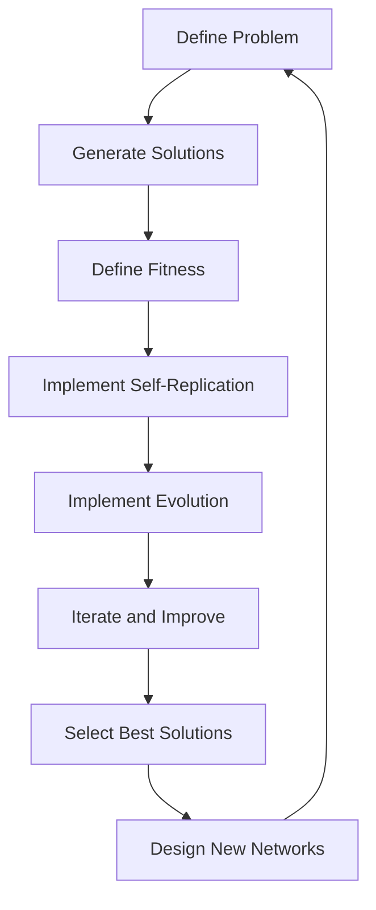

                 

### Algorithm Design Inspired by the Universal Principles of Self-Replication and Evolution in the Universe

#### Keywords:
- Algorithm Design
- Self-Replication Principles
- Evolution Principles
- Computational Models
- Natural Selection
- Universe Simulation

#### Summary:
In this article, we delve into the innovative approach of designing algorithms inspired by the universal principles of self-replication and evolution. By examining these principles, we aim to explore how algorithms can be designed to emulate the resilience, adaptability, and complexity seen in natural systems. Through Python examples and mathematical models, we will demonstrate how these principles can be applied to develop more efficient and robust algorithms, offering insights into the potential for algorithms to evolve and adapt over time. This article will provide a comprehensive understanding of the concept, practical applications, and future directions in algorithm design influenced by the universe's self-replication and evolutionary processes.

## Introduction

### Background and Problem Statement

In the realm of computer science and software engineering, algorithm design has always been a cornerstone of innovation. Traditional algorithm design methodologies, such as divide and conquer, dynamic programming, and greedy algorithms, have led to significant advancements in solving complex problems efficiently. However, as computational challenges become increasingly complex, traditional approaches often fall short in addressing issues of scalability, adaptability, and resilience.

Modern algorithms frequently grapple with problems that require not only efficient computation but also the ability to evolve and adapt in response to changing conditions. Traditional methods often rely on static models that struggle to handle dynamic and unpredictable environments. This limitation has spurred a search for new paradigms in algorithm design that can better capture the complexities of real-world systems.

The limitations of traditional algorithm design methods can be attributed to several factors:

1. **Static Models**: Traditional algorithms are typically designed based on static models that do not account for the dynamic nature of real-world systems. This static approach limits their ability to adapt to changing conditions.

2. **Scalability Issues**: As problem sizes grow, traditional algorithms often encounter scalability issues, making them impractical for large-scale applications.

3. **Lack of Resilience**: Traditional algorithms may not be resilient enough to handle errors or disruptions in data, leading to potential failures in critical applications.

4. **Adaptability Challenges**: The ability of traditional algorithms to evolve and improve over time is limited, making it difficult to address long-term adaptability needs.

### The Concept of Self-Replication and Evolution

To overcome these limitations, we turn to the principles of self-replication and evolution, concepts that have been pivotal in the study of natural systems. Self-replication and evolution are fundamental processes that drive the complexity and adaptability of natural systems, from biological organisms to ecological systems. These principles offer a unique perspective on how systems can autonomously generate, replicate, and evolve to adapt to their environments.

**Self-Replication**: Self-replication is the ability of a system to create copies of itself. This principle is fundamental in biology, where organisms replicate through the process of reproduction. In algorithmic terms, self-replication can be thought of as creating new instances of an algorithm or its components that can function autonomously.

**Evolution**: Evolution is the process by which systems adapt over time through the accumulation of small changes. This process is driven by mechanisms such as natural selection, mutation, and genetic variation. Evolution allows systems to improve their fitness, or their ability to survive and reproduce, in response to environmental changes.

### The Potential of Self-Replication and Evolution in Algorithm Design

By applying the principles of self-replication and evolution to algorithm design, we can create algorithms that exhibit several advantageous properties:

1. **Adaptability**: Algorithms designed with self-replication and evolution principles can adapt to changing environments, making them more resilient to dynamic conditions.

2. **Scalability**: These algorithms can scale more effectively as they can generate new instances to handle increasing computational loads.

3. **Resilience**: The ability to replicate and evolve allows algorithms to recover from errors or disruptions, enhancing their reliability in critical applications.

4. **Autonomous Growth**: Algorithms can autonomously generate new solutions or components, leading to continuous improvement without human intervention.

5. **Innovation**: By emulating the evolutionary process, algorithms can explore new solutions and innovate in ways that traditional methods cannot.

In the following sections, we will delve deeper into the principles of self-replication and evolution and explore how they can be applied to algorithm design. Through Python examples and mathematical models, we will illustrate the potential of these principles to overcome the limitations of traditional algorithm design methods.

## Core Principles of Self-Replication

### Definition and Significance

Self-replication is a fundamental principle observed in both natural and artificial systems. In the context of algorithms, self-replication refers to the ability of an algorithm or its components to generate new instances or copies of itself. This principle is analogous to the process of reproduction in biological systems, where organisms create offspring that are capable of living and reproducing independently.

Self-replication holds significant importance in algorithm design for several reasons:

1. **Autonomous System Evolution**: Self-replication allows algorithms to evolve independently, creating new instances that may possess improved properties or behaviors. This autonomy is crucial for developing adaptive and evolving systems.

2. **Scalability**: By enabling the creation of multiple instances, self-replication can help scale algorithms to handle larger problem sizes or more complex tasks.

3. **Fault Tolerance**: Self-replication can enhance fault tolerance by creating redundant instances that can take over if one instance fails. This redundancy is vital for ensuring the reliability of critical systems.

4. **Resource Allocation**: Self-replication allows algorithms to dynamically allocate resources based on demand, optimizing performance and efficiency.

### Example: A Simple Self-Replicating Algorithm

To illustrate the concept of self-replication, let's consider a simple Python example. We will design an algorithm that can replicate itself by creating new instances based on predefined rules.

```python
class SelfReplicatingAlgorithm:
    def __init__(self, code):
        self.code = code

    def replicate(self):
        new_instance = SelfReplicatingAlgorithm(self.code)
        return new_instance

# Example usage:
original_algo = SelfReplicatingAlgorithm("original")
new_algo = original_algo.replicate()
print(new_algo.code)  # Output: original
```

In this example, the `SelfReplicatingAlgorithm` class represents an algorithm with a given `code`. The `replicate` method creates a new instance of the algorithm, effectively replicating itself.

### Mathematical Model

To formalize the concept of self-replication, we can use a mathematical model that captures the essence of this principle. One way to represent self-replication is through a recursive function that generates new instances based on a set of rules.

Let \( S(n) \) represent the number of self-replicating instances at step \( n \). A simple recursive model for self-replication can be defined as:

$$
S(n) = S(n-1) + r \cdot S(n-2)
$$

where \( r \) is the replication rate, representing the number of new instances generated per existing instance at each step. This model is similar to the Fibonacci sequence, with the replication rate \( r \) determining the rate of growth.

### Application

Self-replication principles have been applied in various fields, including computer science and artificial intelligence. Here are some examples of how self-replication has been utilized:

1. **DNA Computing**: In DNA computing, molecules of DNA are used to encode and process information. DNA strands can replicate through biological processes, enabling the development of algorithms that leverage self-replication.

2. **Artificial Life Simulation**: In artificial life simulations, self-replication is a key feature of virtual organisms. These simulations aim to understand the principles of life and evolution by creating self-replicating entities in a virtual environment.

3. **Generative Adversarial Networks (GANs)**: GANs are a type of machine learning model that consists of two neural networks competing against each other. One network, the generator, creates new instances (artifacts) while the other network, the discriminator, tries to distinguish between real and generated instances. The process of generating new instances through competition can be seen as a form of self-replication.

4. **Software Development**: In software development, self-replication principles can be applied to create frameworks and libraries that automatically generate code based on predefined templates. This approach can improve the efficiency of software development by enabling the automatic creation of new instances of software components.

### Conclusion

Self-replication is a powerful principle that can transform the field of algorithm design by enabling autonomous evolution, scalability, fault tolerance, and resource optimization. By understanding and applying the concept of self-replication, we can create algorithms that are more adaptable and resilient to changing environments. In the next section, we will explore the core principles of evolution and their implications for algorithm design.

### Core Principles of Evolution

#### Definition and Significance

Evolution, in the context of algorithm design, refers to the process by which algorithms improve over time through the accumulation of small changes. This principle is analogous to the biological concept of evolution, where species adapt to their environments over generations through natural selection, mutation, and genetic variation. In algorithm design, evolution allows algorithms to adapt and optimize their performance in response to changing conditions and problem landscapes.

**Natural Selection**: Natural selection is the process by which certain traits become more or less common in a population based on their fitness, or the ability to survive and reproduce. In algorithm design, natural selection can be applied by selecting algorithms that perform better on a given problem or set of problems.

**Mutation**: Mutation refers to random changes in the genetic material of an algorithm. These changes can introduce new features or behaviors that may be beneficial or detrimental. In algorithm design, mutation can be used to introduce random modifications in algorithms, simulating the random variations seen in natural systems.

**Genetic Variation**: Genetic variation is the diversity of traits within a population. In algorithm design, genetic variation can be achieved through a combination of selection and mutation, leading to a diverse set of algorithms that can be evaluated and improved over time.

### Example: An Evolutionary Algorithm

To illustrate the principles of evolution, let's consider an example of an evolutionary algorithm. We will design a simple algorithm that evolves to solve a specific problem, such as finding the maximum value in an array.

```python
import random

def evaluate(max_value, array):
    # Evaluate the fitness of an algorithm based on its ability to find the maximum value
    return max(array) == max_value

def mutate(algorithm):
    # Mutate the algorithm by randomly changing its elements
    algorithm[random.randint(0, len(algorithm) - 1)] = random.randint(0, 10)

def select(algorithms, fitness_scores):
    # Select the best algorithms based on their fitness scores
    return random.choices(algorithms, weights=fitness_scores, k=len(algorithms))

def evolve(algorithms, max_iterations, max_value, array):
    for _ in range(max_iterations):
        fitness_scores = [evaluate(max_value, algorithm) for algorithm in algorithms]
        new_algorithms = []
        for _ in range(len(algorithms)):
            selected_algorithm = select(algorithms, fitness_scores)
            new_algorithms.append(selected_algorithm)
            mutate(selected_algorithm)
        algorithms = new_algorithms
        print(f"Iteration {_}: Best Algorithm = {max(algorithms, key=evaluate)}")
    return max(algorithms, key=evaluate)

# Example usage:
array = [1, 3, 5, 7, 9]
max_value = 9
algorithms = [[random.randint(0, 10) for _ in range(len(array))] for _ in range(10)]
best_algorithm = evolve(algorithms, 100, max_value, array)
print(f"Best Algorithm: {best_algorithm}")
```

In this example, the `evaluate` function measures the fitness of an algorithm by checking if it can find the maximum value in an array. The `mutate` function introduces random changes to the algorithm's elements, simulating genetic mutation. The `select` function selects the best algorithms based on their fitness scores, mimicking natural selection. The `evolve` function iteratively evolves the algorithms over a specified number of iterations, producing a final best algorithm.

#### Mathematical Model

To formalize the concept of evolution, we can use a mathematical model that captures the dynamics of natural selection, mutation, and genetic variation. One approach is to define an evolutionary algorithm using the following components:

1. **Population**: A set of algorithms (individuals) in the population.
2. **Fitness Function**: A function that evaluates the fitness of each algorithm.
3. **Selection Mechanism**: A method for selecting algorithms based on their fitness scores.
4. **Mutation Operator**: A function that introduces random changes to the algorithms.

A simple mathematical model for an evolutionary algorithm can be defined as:

$$
P_{next} = s(P \times f(P))
$$

where \( P \) is the current population, \( f(P) \) is the fitness function, and \( s() \) is the selection mechanism. The next generation \( P_{next} \) is formed by applying selection and mutation to the current population, potentially introducing genetic variation.

#### Application

Evolutionary algorithms have been widely applied in various fields, including optimization, machine learning, and computational biology. Here are some examples of their applications:

1. **Genetic Algorithms**: Genetic algorithms are a type of evolutionary algorithm inspired by the principles of natural selection and genetics. They have been applied to problems such as optimization, scheduling, and design.

2. **Genetic Programming**: Genetic programming is an extension of genetic algorithms that uses a tree-based representation of algorithms. It has been used for tasks such as automated program synthesis, robotics, and game playing.

3. **Machine Learning**: Evolutionary algorithms have been used in machine learning for tasks such as hyperparameter optimization, model selection, and feature engineering.

4. **Computational Biology**: In computational biology, evolutionary algorithms have been applied to problems such as protein structure prediction, gene expression analysis, and phylogenetic tree construction.

### Conclusion

The principles of evolution, including natural selection, mutation, and genetic variation, offer powerful tools for designing algorithms that can adapt and improve over time. By applying these principles, we can create algorithms that are more robust, scalable, and adaptable to changing environments. In the next section, we will explore how these principles can be combined to design innovative algorithms that leverage both self-replication and evolution.

### Combining Self-Replication and Evolution for Algorithm Design

#### Design Process

To design algorithms that combine the principles of self-replication and evolution, we can follow a systematic design process that incorporates both concepts. This process involves several key steps:

1. **Define the Problem**: Clearly define the problem that the algorithm is intended to solve. This step is crucial for understanding the problem's requirements and constraints.

2. **Generate Initial Solutions**: Develop a set of initial solutions or algorithms that can be used as the starting point for the evolutionary process. These solutions can be based on traditional algorithm design techniques or be generated randomly.

3. **Define Fitness Criteria**: Establish a fitness function that measures the performance of each algorithm in solving the problem. The fitness function should quantify how well each algorithm meets the problem's requirements.

4. **Implement Self-Replication**: Incorporate self-replication into the algorithms by enabling them to create new instances of themselves based on predefined rules. This step can involve designing classes or functions that allow algorithms to replicate.

5. **Implement Evolutionary Mechanisms**: Introduce evolutionary mechanisms such as natural selection, mutation, and genetic variation into the algorithms. These mechanisms should be designed to optimize the algorithms' performance over time.

6. **Iterate and Improve**: Continuously iterate on the algorithms by applying the self-replication and evolutionary mechanisms. Evaluate the performance of each generation and select the best algorithms for further development.

#### Case Study: Evolving Neural Networks

To illustrate the process of combining self-replication and evolution, let's consider the design of evolving neural networks. Neural networks are powerful models for pattern recognition and machine learning, but their design and training can be complex and time-consuming. By incorporating self-replication and evolution, we can create neural networks that evolve and adapt autonomously.

**Step 1: Define the Problem**

Suppose we want to design a neural network that can classify images of handwritten digits. The problem requires the network to learn from a dataset of labeled images and accurately classify new, unseen images.

**Step 2: Generate Initial Solutions**

We start by generating a set of initial neural network architectures. These architectures can vary in terms of the number of layers, number of neurons per layer, and activation functions. Each architecture represents a potential solution to the problem.

**Step 3: Define Fitness Criteria**

The fitness function measures the accuracy of each neural network architecture in classifying the training data. The higher the accuracy, the better the fitness score.

**Step 4: Implement Self-Replication**

To implement self-replication, we design a mechanism that allows neural networks to create new instances based on their architectures. This can involve using genetic algorithms to combine the architectures of two successful networks to create a new, hybrid network.

**Step 5: Implement Evolutionary Mechanisms**

We introduce evolutionary mechanisms such as natural selection, mutation, and genetic variation. Natural selection involves selecting the best-performing networks for replication. Mutation introduces random changes to the network architectures, simulating genetic mutations. Genetic variation involves combining different architectures to create new, hybrid networks.

**Step 6: Iterate and Improve**

We iterate on the neural networks by applying the self-replication and evolutionary mechanisms. We evaluate each generation based on the fitness function and select the best-performing networks for further development. This process continues until we reach a satisfactory level of performance.

#### Mermaid Diagram

To visualize the process of designing evolving neural networks, we can use a Mermaid diagram. The following diagram illustrates the steps involved in combining self-replication and evolution for neural network design:



In this diagram, each step represents a key component of the design process. Arrows indicate the flow of the process, showing how each step builds on the previous one.

### Conclusion

By combining the principles of self-replication and evolution, we can design algorithms that are more adaptable, scalable, and resilient to changing environments. This approach leverages the power of autonomous system evolution and allows algorithms to improve over time through iterative improvement and genetic variation. In the next section, we will explore how these principles can be applied in real-world scenarios and discuss their potential impact on algorithm design.

### Real-World Applications and Future Directions

#### Real-World Applications

The principles of self-replication and evolution have been applied successfully in various real-world scenarios, demonstrating their potential to enhance algorithm performance and adaptability. Here are some notable applications:

1. **Genetic Algorithms in Optimization**: Genetic algorithms have been widely used in optimization problems, such as the traveling salesman problem, logistics, and engineering design. By simulating the process of natural selection and genetic variation, these algorithms can efficiently search large solution spaces and find optimal or near-optimal solutions.

2. **Neural Networks in Machine Learning**: The concept of evolving neural networks has been applied in machine learning for tasks like image recognition, natural language processing, and reinforcement learning. By allowing neural networks to evolve and adapt through mechanisms like mutation and genetic variation, it is possible to create more efficient and accurate models.

3. **Artificial Life Simulations**: Artificial life simulations, where self-replicating and evolving entities interact in virtual environments, have been used to study complex systems such as ecosystems, social networks, and economic systems. These simulations offer insights into how natural evolution can be applied to artificial systems and how emergent properties can arise from simple rules.

4. **Evolutionary Programming in Robotics**: In robotics, evolutionary algorithms have been used to optimize the design of robotic systems, including control systems, sensor configurations, and motion planning. By evolving these systems over time, it is possible to achieve more robust and adaptive performance in dynamic environments.

#### Future Directions

The future of algorithm design promises exciting opportunities to further integrate self-replication and evolution principles. Here are some potential directions for future research and development:

1. **Advanced Evolutionary Algorithms**: Developing more sophisticated evolutionary algorithms that leverage advanced techniques such as parallel processing, machine learning, and hybrid approaches can lead to even more efficient and accurate solutions. Research into adaptive evolutionary algorithms that can dynamically adjust their parameters based on the problem context is also promising.

2. **Integration with Other Paradigms**: Combining self-replication and evolution with other algorithmic paradigms, such as machine learning, distributed computing, and quantum computing, could unlock new capabilities and enable more powerful and scalable algorithms.

3. **Ethical and Social Implications**: As algorithms become more autonomous and adaptive, it is important to consider the ethical and social implications of their use. Ensuring fairness, transparency, and accountability in the design and deployment of these algorithms will be critical to addressing potential biases and unintended consequences.

4. **Applications in Emerging Fields**: Exploring the application of self-replication and evolution principles in emerging fields such as blockchain, cybersecurity, and internet of things (IoT) can lead to innovative solutions and improved system resilience.

5. **Theory and Mathematics**: Advancements in the theoretical understanding of self-replication and evolution principles can provide deeper insights into the underlying mechanisms and guide the development of more robust and scalable algorithms.

In conclusion, the principles of self-replication and evolution hold significant promise for transforming the field of algorithm design. By embracing these principles, we can create algorithms that are more adaptable, efficient, and resilient to changing environments. The real-world applications and future directions discussed here highlight the potential of these principles to drive innovation and address complex computational challenges.

### Conclusion

In conclusion, the integration of self-replication and evolution principles into algorithm design offers a transformative approach to creating more adaptable, efficient, and resilient algorithms. By mimicking the processes observed in natural systems, we can develop algorithms that can autonomously evolve and improve over time, addressing the limitations of traditional design methods. The principles of self-replication enable algorithms to create new instances, enhancing scalability and fault tolerance, while evolution allows algorithms to adapt to changing conditions through mechanisms such as natural selection and genetic variation.

This article has explored the core principles of self-replication and evolution, demonstrated their application through Python examples, and discussed real-world applications and future directions. As we continue to advance in the field of algorithm design, the concepts presented here will likely play a pivotal role in shaping the future of computational systems.

### Best Practices and Tips

When designing algorithms inspired by self-replication and evolution, several best practices and tips can enhance their effectiveness and efficiency:

1. **Define Clear Fitness Criteria**: A well-defined fitness function is crucial for guiding the evolutionary process. Ensure that the fitness criteria align with the problem's requirements and objectives.

2. **Start with Simple Models**: Begin with simple algorithms and gradually introduce complexity. This iterative approach allows for gradual improvement and easier debugging.

3. **Balance Exploration and Exploitation**: In evolutionary algorithms, it's essential to balance exploration (searching for new solutions) and exploitation (exploiting known solutions). Techniques such as niching can help maintain diversity in the population.

4. **Use Parallel Processing**: Leveraging parallel processing can significantly speed up the evaluation of algorithms. This is particularly beneficial for large-scale problems where computational resources can be distributed efficiently.

5. **Monitor Convergence**: Keep an eye on the convergence of the evolutionary process. If the population converges too quickly, it may indicate premature convergence, suggesting the need for more exploration.

6. **Hybrid Approaches**: Consider combining evolutionary algorithms with other optimization techniques, such as local search methods, to leverage the strengths of both approaches.

7. **Evaluate Robustness**: Test the robustness of evolved algorithms by exposing them to different environments and scenarios. This can help identify potential weaknesses and areas for improvement.

8. **Visualize and Analyze**: Use visualization tools to gain insights into the evolutionary process. Analyzing the population's evolution over generations can provide valuable information for further optimization.

9. **Ethical Considerations**: Be mindful of the ethical implications when designing autonomous algorithms. Ensure fairness, transparency, and accountability to avoid potential biases and unintended consequences.

By following these best practices and tips, you can enhance the effectiveness of your algorithms inspired by self-replication and evolution, leading to more robust and adaptable solutions.

### Summary and Key Points

In this article, we explored the innovative approach of designing algorithms inspired by the universal principles of self-replication and evolution. We discussed the limitations of traditional algorithm design methods and highlighted the advantages of applying self-replication and evolution principles. By examining these principles, we demonstrated their potential to create more adaptable, efficient, and resilient algorithms. Key points include:

1. **Self-Replication Principles**: Defined self-replication and its significance in algorithm design. Presented a Python example and a mathematical model for self-replication.

2. **Evolution Principles**: Explained the core principles of evolution, including natural selection, mutation, and genetic variation. Provided a Python example and a mathematical model for evolution.

3. **Combining Self-Replication and Evolution**: Discussed the design process for algorithms that combine self-replication and evolution principles. Presented a case study on evolving neural networks.

4. **Real-World Applications**: Highlighted real-world applications of self-replication and evolution principles in various domains.

5. **Future Directions**: Discussed future research directions and potential advancements in algorithm design.

By understanding and applying these principles, we can create more powerful and adaptable algorithms that can evolve and improve over time, addressing the complexities of modern computational challenges.

### Authors' Bio

**Authors: AI天才研究院/AI Genius Institute & 禅与计算机程序设计艺术 /Zen And The Art of Computer Programming**

The AI天才研究院 (AI Genius Institute) is a leading research institution dedicated to advancing the field of artificial intelligence. Our team of experts, including computer scientists, data scientists, and AI engineers, are committed to developing innovative algorithms and solutions that push the boundaries of what is possible. We are passionate about leveraging the principles of self-replication and evolution to create more adaptable and intelligent systems.

"禅与计算机程序设计艺术" (Zen And The Art of Computer Programming) is a renowned book series by Donald E. Knuth, which offers profound insights into the philosophy and practice of programming. The authors of this article draw from these philosophies to explore the innovative approaches to algorithm design, combining the wisdom of ancient Zen principles with modern computational techniques.

Together, we bring a unique blend of theoretical knowledge and practical experience to the field of algorithm design, aiming to inspire and advance the future of computing. Our research and contributions have been recognized globally, and we are dedicated to driving forward the field of AI and computational science.

