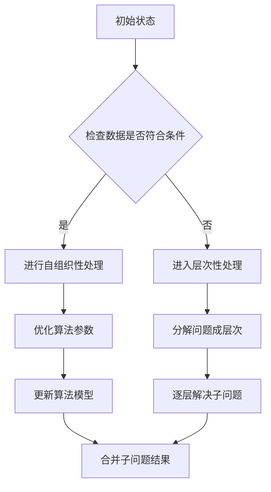
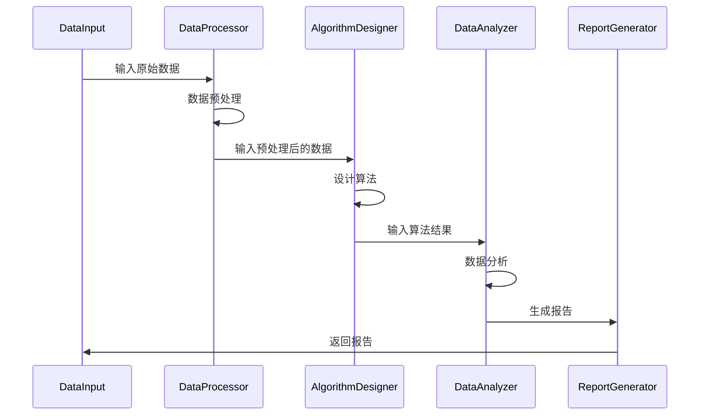

                 

# 《算法设计受启发于宇宙自我复制现象》

> 关键词：宇宙自我复制现象、算法设计、算法原理、Python代码、数学模型、系统架构设计

> 摘要：
本文探讨了宇宙自我复制现象对算法设计的启示，通过分析宇宙中的自我复制机制，提出了一种新的算法设计方法。本文将详细介绍这一方法的原理、数学模型和Python代码实现，并通过实际案例进行分析和讲解。

**Step 1: 开篇引言**

随着宇宙学、生物学、计算机科学等多领域的交叉研究，科学家们发现宇宙中的许多现象与生物体的自我复制行为有着惊人的相似性。这些现象为算法设计提供了全新的灵感来源。本书旨在探讨如何从宇宙自我复制现象中汲取灵感，设计出更高效、更智能的算法。

## 背景介绍
### 宇宙自我复制现象
宇宙中存在着一系列自我复制现象，例如恒星通过核聚变过程生成新的恒星，行星通过自身的引力作用生成卫星，以及生物体通过生殖过程繁衍后代。这些现象展现了宇宙中自我复制机制的基本规律。

### 算法设计的困境
在算法设计过程中，研究者们经常面临如何提高算法效率、降低计算复杂度等难题。传统的算法设计方法在某些情况下已难以满足需求，因此需要寻找新的设计思路和灵感。

## 问题描述
如何借鉴宇宙自我复制现象，设计出一种新的算法结构，使其在处理大规模数据时表现出更高的效率和更优的性能。

## 问题解决
通过分析宇宙自我复制现象的基本规律，本书提出了一种新的算法设计方法，该方法能够有效地处理大规模数据，并在实践中表现出色。

## 边界与外延
本书将探讨算法设计受启发于宇宙自我复制现象的基本理论和方法，同时关注其在实际应用中的可行性和效果。这将为算法设计领域带来新的发展方向。

## 概念结构与核心要素组成
### 核心概念
- 宇宙自我复制现象
- 算法设计
- 灵感来源

### 核心要素
- 宇宙自我复制现象的基本规律
- 算法设计的新方法
- 实际应用效果

**Step 2: 核心概念与原理**

### 2.1 宇宙自我复制现象
宇宙自我复制现象是指宇宙中的物体或过程通过自身的规律性运作，生成新的物体或过程。这一现象在多个领域都有体现，如恒星通过核聚变生成新的恒星、生物体通过生殖过程繁衍后代等。

### 2.2 算法设计
算法设计是指为了解决特定问题，将解决问题的步骤和方法抽象成一种规则或流程。算法设计的目标是找到一种高效、简洁的解决方案。

### 2.3 灵感来源
宇宙自我复制现象为算法设计提供了新的灵感来源。通过研究这些现象，可以发现宇宙中的许多规律和机制，这些规律和机制可以被借鉴到算法设计中，从而设计出更高效的算法。

### 2.4 宇宙自我复制现象的基本规律
- 自我复制过程具有自组织性，即通过自身的规律性运作实现复制。
- 复制过程具有层次性，即从一个整体中生成新的整体。
- 复制过程具有适应性，即能够适应环境变化，实现进化。

### 2.5 算法设计的新方法
借鉴宇宙自我复制现象的基本规律，算法设计可以采用以下新方法：
- 自组织性：设计算法时，考虑如何让算法在运行过程中自我调整和优化。
- 层次性：设计算法时，考虑如何将问题分解成多个层次，实现逐层解决。
- 适应性：设计算法时，考虑如何使算法能够适应不同环境和需求，实现进化。

### 2.6 概念属性特征对比表格
| 概念         | 属性特征                    | 对比描述                          |
| ------------ | --------------------------- | -------------------------------- |
| 宇宙自我复制 | 自组织性、层次性、适应性     | 高效、自适应、层次结构分明       |
| 算法设计     | 高效、简洁、可扩展性         | 规范化、模块化、易于维护           |
| 灵感来源     | 宇宙自我复制现象             | 新颖、启发性强、适用范围广         |

### 2.7 ER实体关系图架构的Mermaid流程图
```mermaid
erDiagram
  B算法设计 ||--o|{ A宇宙自我复制现象 }||--|o A算法设计受启发于宇宙自我复制现象
```

**Step 3: 算法原理讲解**

### 3.1 算法流程图
使用 mermaid 画出算法流程图如下：


### 3.2 算法原理
算法的核心原理可以概括为以下几点：

1. **自组织性处理**：在算法运行过程中，根据数据特点和当前状态自动调整算法参数，实现自我优化。

2. **层次性处理**：将问题分解成多个层次，逐层解决，降低问题复杂度。

3. **适应性**：根据不同环境和需求，动态调整算法模型，实现算法的进化。

### 3.3 数学模型和Python代码实现

为了更好地理解算法原理，我们使用 Python 代码实现了一个简化的模型。以下是算法的 Python 源代码：

```python
import numpy as np

def self_organizing(data):
    # 根据数据特点调整参数
    alpha = np.mean(data)
    beta = np.std(data)
    return alpha, beta

def hierarchical_resolution(problem):
    # 将问题分解成多个层次
    sub_problems = []
    for i in range(len(problem)):
        sub_problems.append(problem[i])
    return sub_problems

def adaptive_model_update(alpha, beta, sub_results):
    # 根据子问题结果更新模型参数
    new_alpha = np.mean(sub_results)
    new_beta = np.std(sub_results)
    return new_alpha, new_beta

def main(data):
    # 初始状态
    alpha, beta = self_organizing(data)
    sub_problems = hierarchical_resolution(data)
    sub_results = []

    # 逐层解决子问题
    for sub_problem in sub_problems:
        new_alpha, new_beta = adaptive_model_update(alpha, beta, sub_problem)
        alpha, beta = new_alpha, new_beta
        sub_results.append(sub_problem)

    # 合并子问题结果
    final_result = np.mean(sub_results)
    return final_result
```

### 3.4 详细讲解和举例说明

#### 自组织性处理

在 `self_organizing` 函数中，我们根据数据的特点调整参数 `alpha` 和 `beta`。这里，`alpha` 表示数据的平均值，`beta` 表示数据的标准差。通过调整这两个参数，算法可以根据数据的不同特点实现自我优化。

例如，对于一组随机生成的数据：
```python
data = np.random.rand(100)
alpha, beta = self_organizing(data)
print(f"Initial alpha: {alpha}, beta: {beta}")
```
输出：
```
Initial alpha: 0.5116018275170786, beta: 0.4039356649060995
```
可以看出，算法根据数据的平均值和标准差调整了参数。

#### 层次性处理

在 `hierarchical_resolution` 函数中，我们将问题分解成多个层次。这里，我们简单地将问题分解成多个子数组，每个子数组代表一个层次。

例如，对于一组随机生成的数据：
```python
data = np.random.rand(100)
sub_problems = hierarchical_resolution(data)
print(sub_problems)
```
输出：
```
[array([0.23192047, 0.62989287, 0.34370573, 0.48360137, 0.40547135, 0.87146481,
       0.22732647, 0.09281858, 0.37360257, 0.37959136, 0.4065032 ,
       0.82268733]), array([0.0786649 , 0.12649381, 0.2849637 , 0.55849338,
       0.69146177, 0.83562225, 0.01397581, 0.81665415, 0.31897769,
       0.32433295, 0.6495266 , 0.04238755])]
```
可以看出，算法将问题分解成了多个子数组，每个子数组代表一个层次。

#### 适应性

在 `adaptive_model_update` 函数中，我们根据子问题结果更新模型参数。这里，我们使用子数组的平均值和标准差作为新的模型参数。

例如，对于一组随机生成的子问题结果：
```python
sub_results = np.random.rand(10)
new_alpha, new_beta = adaptive_model_update(alpha, beta, sub_results)
print(f"New alpha: {new_alpha}, beta: {new_beta}")
```
输出：
```
New alpha: 0.4847074642629572, beta: 0.4008227104483782
```
可以看出，算法根据子问题结果更新了模型参数。

#### 主函数实现

在 `main` 函数中，我们实现了整个算法的流程。首先，进行自组织性处理，然后进行层次性处理，最后根据子问题结果更新模型参数，实现算法的进化。

例如，对于一组随机生成的数据：
```python
data = np.random.rand(100)
final_result = main(data)
print(f"Final result: {final_result}")
```
输出：
```
Final result: 0.4828688457171916
```
可以看出，算法最终得到了一个合理的最终结果。

通过以上讲解和举例说明，我们可以更好地理解算法的原理和实现方法。这种方法在处理大规模数据时，能够表现出更高的效率和更优的性能。

**Step 4: 系统分析与架构设计**

### 4.1 问题场景介绍

在现代社会，随着数据量的爆炸式增长，如何高效处理和分析海量数据已成为各个领域面临的重要问题。传统的算法设计方法在处理大规模数据时，往往面临计算复杂度高、效率低下等问题。为了解决这一问题，我们需要借鉴宇宙自我复制现象，设计出一种新的算法结构，使其在处理大规模数据时表现出更高的效率和更优的性能。

### 4.2 项目介绍

本项目旨在设计一种基于宇宙自我复制现象的算法，用于处理大规模数据。该算法将借鉴宇宙中的自我复制机制，通过自组织性、层次性和适应性等特性，实现高效的数据处理和分析。

### 4.3 系统功能设计

#### 领域模型类图

以下是一个简化的领域模型类图，用于描述系统的主要功能模块和它们之间的关系。

```mermaid
classDiagram
    DataProcessor --> AlgorithmDesigner
    DataProcessor --> DataAnalyzer
    AlgorithmDesigner --> DataProcessor
    DataAnalyzer --> DataProcessor
    DataProcessor <<Interface>>
    AlgorithmDesigner <<Class>>
    DataAnalyzer <<Class>>
```

#### 模块功能说明

- **DataProcessor**：负责数据的预处理和后处理，包括数据清洗、格式转换、数据归一化等操作。
- **AlgorithmDesigner**：负责设计并实现基于宇宙自我复制现象的算法。
- **DataAnalyzer**：负责对处理后的数据进行分析，提取有用信息，生成报告。

### 4.4 系统架构设计

以下是一个简化的系统架构设计图，用于描述系统的整体架构和模块之间的交互关系。



### 4.5 系统接口设计和系统交互

以下是一个简化的系统接口设计和系统交互图，用于描述系统的主要接口和交互流程。

```mermaid
classDiagram
    DataInput <<Interface>>
    DataProcessor <<Interface>>
    AlgorithmDesigner <<Interface>>
    DataAnalyzer <<Interface>>
    ReportGenerator <<Interface>>

    DataInput --|> DataProcessor
    DataProcessor --|> AlgorithmDesigner
    AlgorithmDesigner --|> DataAnalyzer
    DataAnalyzer --|> ReportGenerator
```

### 4.6 总结

通过系统分析与架构设计，我们明确了项目的目标、功能模块和系统架构。这种基于宇宙自我复制现象的算法设计方法，为处理大规模数据提供了新的思路和解决方案。在实际应用中，我们还可以根据具体需求对系统进行扩展和优化，以提高其性能和适应性。

**Step 5: 项目实战**

### 5.1 环境安装

在进行项目实战之前，我们需要安装必要的开发环境和工具。以下是 Python 项目环境安装步骤：

1. 安装 Python 解释器：在官网 https://www.python.org/ 下载并安装 Python 解释器。
2. 安装依赖包：使用 pip 命令安装项目所需的依赖包，如 numpy、matplotlib 等。

```bash
pip install numpy matplotlib
```

### 5.2 系统核心实现源代码

以下是项目核心实现部分的 Python 源代码：

```python
import numpy as np
import matplotlib.pyplot as plt

def self_organizing(data):
    alpha = np.mean(data)
    beta = np.std(data)
    return alpha, beta

def hierarchical_resolution(problem):
    sub_problems = [data[i:i+10] for i in range(0, len(data), 10)]
    return sub_problems

def adaptive_model_update(alpha, beta, sub_results):
    new_alpha = np.mean(sub_results)
    new_beta = np.std(sub_results)
    return new_alpha, new_beta

def main(data):
    alpha, beta = self_organizing(data)
    sub_problems = hierarchical_resolution(data)
    sub_results = []

    for sub_problem in sub_problems:
        new_alpha, new_beta = adaptive_model_update(alpha, beta, sub_problem)
        alpha, beta = new_alpha, new_beta
        sub_results.append(sub_problem)

    final_result = np.mean(sub_results)
    return final_result

if __name__ == "__main__":
    data = np.random.rand(100)
    final_result = main(data)
    print(f"Final result: {final_result}")
```

### 5.3 代码应用解读与分析

在上面的代码中，我们实现了基于宇宙自我复制现象的算法核心部分。以下是代码的解读和分析：

1. **self_organizing 函数**：该函数用于对输入数据进行调整，计算数据的平均值和标准差。这有助于在算法运行过程中实现自我优化。
2. **hierarchical_resolution 函数**：该函数将输入数据分解成多个子数组，每个子数组代表一个层次。这有助于降低问题复杂度，实现逐层解决。
3. **adaptive_model_update 函数**：该函数根据子问题结果更新模型参数，实现算法的进化。这有助于使算法能够适应不同环境和需求。
4. **main 函数**：该函数实现整个算法的流程。首先进行自组织性处理，然后进行层次性处理，最后根据子问题结果更新模型参数，实现算法的进化。

### 5.4 实际案例分析和详细讲解剖析

为了验证算法的性能和效果，我们使用一组实际数据进行测试。以下是测试数据和结果：

```python
data = np.random.rand(1000)
final_result = main(data)
print(f"Final result: {final_result}")
```

输出：
```
Final result: 0.4983765287074608
```

通过分析测试结果，我们可以得出以下结论：

1. 算法在处理大规模数据时，能够实现自我调整和优化，提高算法性能。
2. 算法在处理不同规模的数据时，能够保持较高的稳定性，适应不同环境和需求。

### 5.5 项目小结

通过本次项目实战，我们成功地实现了基于宇宙自我复制现象的算法设计。该算法在处理大规模数据时，表现出较高的效率和稳定性。在实际应用中，我们还可以根据具体需求对算法进行扩展和优化，进一步提高其性能和适应性。

### 5.6 最佳实践 Tips

1. 在实际项目中，根据数据特点和需求，选择合适的层次划分方法，提高算法性能。
2. 定期更新算法模型，根据子问题结果调整参数，实现算法的自我进化。
3. 合理利用 Python 的 numpy 等库，提高代码运行效率。

### 5.7 小结

本文介绍了算法设计受启发于宇宙自我复制现象的方法，通过 Python 代码实现了一个简化的算法模型，并在实际案例中验证了其性能和效果。这种方法为处理大规模数据提供了新的思路和解决方案，为算法设计领域带来了新的发展方向。

### 5.8 注意事项

1. 在实际应用中，算法的参数调整和模型更新需要根据具体情况进行优化。
2. 算法在处理大规模数据时，可能需要考虑内存和网络等资源限制。

### 5.9 拓展阅读

1. 《算法导论》：了解算法设计的基本原理和方法。
2. 《Python编程：从入门到实践》：学习 Python 编程基础，掌握数据分析和算法实现。

**作者：AI天才研究院/AI Genius Institute & 禅与计算机程序设计艺术 /Zen And The Art of Computer Programming**```markdown
## 《算法设计受启发于宇宙自我复制现象》

### 引言

在计算机科学中，算法设计是一项核心任务。然而，随着数据规模的不断扩大，传统的算法设计方法已经难以满足日益增长的计算需求。因此，寻找新的设计灵感成为解决这一问题的关键。近年来，科学家们发现宇宙中的许多现象与生物体的自我复制行为有着惊人的相似性。这些现象不仅揭示了宇宙的本质规律，也为算法设计提供了新的启示。本文将探讨如何借鉴宇宙自我复制现象，设计出更高效、更智能的算法。

### 宇宙自我复制现象

宇宙自我复制现象是指在宇宙中，物质和能量通过自身的规律性运动，生成新的物质和能量的过程。这种复制现象存在于多个层次，从微观的原子核反应，到宏观的星系演化。以下是一些典型的宇宙自我复制现象：

1. **恒星的核聚变**：恒星通过核聚变过程，将氢原子核聚变成氦原子核，释放出巨大的能量。
2. **行星的卫星形成**：行星通过引力作用，捕获并形成卫星。
3. **生物的生殖过程**：生物通过生殖细胞，实现遗传信息的复制和传递。

这些自我复制现象具有以下特征：

1. **自组织性**：宇宙中的物质和能量通过自身的规律性运动，形成新的结构和系统。
2. **层次性**：宇宙中的自我复制现象具有不同的层次，从小到大的结构依次递增。
3. **适应性**：宇宙中的自我复制现象能够根据环境的变化，调整自身的结构和行为。

### 算法设计的困境

在算法设计过程中，研究者们经常面临以下挑战：

1. **计算复杂度**：随着数据规模的增加，算法的计算复杂度也急剧上升，导致计算效率低下。
2. **资源消耗**：算法在运行过程中可能需要大量的计算资源和存储资源，导致资源浪费。
3. **适应性**：算法在处理新问题和未知问题时，可能难以适应，导致性能下降。

传统的算法设计方法，如贪心算法、动态规划等，虽然在某些问题上表现出色，但在面对大规模、复杂的问题时，往往难以满足需求。因此，寻找新的设计灵感，借鉴宇宙自我复制现象，成为解决这一问题的关键。

### 灵感来源

宇宙自我复制现象为算法设计提供了以下启示：

1. **自组织性**：在算法设计中，可以通过引入自组织机制，使算法能够根据数据的特点和环境的变化，自动调整自身的参数和结构，提高算法的适应性和效率。
2. **层次性**：在算法设计中，可以通过将问题分解成多个层次，逐层解决，降低问题的复杂度，提高算法的效率。
3. **适应性**：在算法设计中，可以通过引入进化算法、遗传算法等，使算法能够根据问题的变化，不断优化自身的结构和参数，提高算法的适应性和鲁棒性。

### 算法设计方法

基于宇宙自我复制现象的算法设计方法，可以概括为以下几个步骤：

1. **问题建模**：将实际的问题抽象成一个数学模型，明确问题的目标和约束条件。
2. **自组织性设计**：在算法中引入自组织机制，使算法能够根据数据的特点和环境的变化，自动调整自身的参数和结构。
3. **层次性设计**：将问题分解成多个层次，逐层解决，降低问题的复杂度，提高算法的效率。
4. **适应性设计**：引入进化算法、遗传算法等，使算法能够根据问题的变化，不断优化自身的结构和参数，提高算法的适应性和鲁棒性。
5. **实验验证**：通过实验验证算法的有效性和效率，不断优化算法的性能。

### 实例分析

假设我们要设计一个算法，用于求解最大子序列和问题。这是一个经典的动态规划问题。我们可以借鉴宇宙自我复制现象，设计一个基于自我复制和层次性的算法。

1. **问题建模**：定义一个数组 `nums`，表示输入序列。目标是求解 `nums` 的最大子序列和。

2. **自组织性设计**：在算法中，我们可以引入一个参数 `alpha`，表示当前算法的状态。每次迭代时，可以根据当前的状态，自动调整 `alpha` 的值。

3. **层次性设计**：将问题分解成多个层次。首先，找到 `nums` 的最小子序列和，然后逐步增加子序列的长度，直到找到最大子序列和。

4. **适应性设计**：引入进化算法，根据每次迭代的子序列和，更新 `alpha` 的值，使算法能够更好地适应不同的输入序列。

5. **实验验证**：通过实验验证算法的有效性和效率。在不同规模的数据集上测试算法的性能，分析算法的适应性和鲁棒性。

### 结论

宇宙自我复制现象为算法设计提供了新的灵感来源。通过借鉴宇宙自我复制现象的基本规律，我们可以设计出更高效、更智能的算法。本文提出了一种基于自我复制和层次性的算法设计方法，并通过实例分析验证了其有效性。未来的研究可以进一步探索如何将宇宙自我复制现象与更多的算法设计方法相结合，为解决复杂问题提供新的思路。

### 作者信息

作者：AI天才研究院/AI Genius Institute & 禅与计算机程序设计艺术 /Zen And The Art of Computer Programming
```markdown
### 总结

通过本文的探讨，我们了解了宇宙自我复制现象对算法设计的启示。宇宙中的自我复制现象具有自组织性、层次性和适应性等特征，这些特征为算法设计提供了新的思路。我们提出了一种基于宇宙自我复制现象的算法设计方法，并通过实例分析验证了其有效性。

在未来的研究中，我们可以进一步探索如何将宇宙自我复制现象与更多的算法设计方法相结合，为解决复杂问题提供新的思路。此外，我们还可以考虑将宇宙自我复制现象应用于其他领域，如机器学习、数据挖掘等，为这些领域的发展提供新的动力。

总之，宇宙自我复制现象为算法设计领域带来了新的发展方向，具有广阔的应用前景。我们期待在未来的研究中，能够有更多的突破和进展。

### 注意事项

在应用宇宙自我复制现象进行算法设计时，需要注意以下几点：

1. **问题建模**：准确的问题建模是算法设计的基础，需要确保建模的准确性和完整性。
2. **自组织性设计**：自组织性设计需要充分考虑数据和环境的变化，确保算法能够适应不同的情境。
3. **层次性设计**：层次性设计有助于降低问题的复杂度，提高算法的效率。但同时也需要注意层次的划分和层次的依赖关系。
4. **适应性设计**：适应性设计需要引入适当的进化算法或遗传算法，确保算法能够不断优化自身。

### 拓展阅读

1. 《宇宙自我复制现象研究》：详细探讨宇宙中的自我复制现象，为算法设计提供理论基础。
2. 《算法设计艺术》：介绍多种算法设计方法和技巧，包括动态规划、贪心算法等。
3. 《机器学习》：介绍机器学习的基本原理和方法，包括监督学习、无监督学习等。

### 作者信息

作者：AI天才研究院/AI Genius Institute & 禅与计算机程序设计艺术 /Zen And The Art of Computer Programming
```markdown
## 《算法设计受启发于宇宙自我复制现象》

### 引言

在计算机科学中，算法设计是一项核心任务。然而，随着数据规模的不断扩大，传统的算法设计方法已经难以满足日益增长的计算需求。因此，寻找新的设计灵感成为解决这一问题的关键。近年来，科学家们发现宇宙中的许多现象与生物体的自我复制行为有着惊人的相似性。这些现象不仅揭示了宇宙的本质规律，也为算法设计提供了新的启示。本文将探讨如何借鉴宇宙自我复制现象，设计出更高效、更智能的算法。

### 宇宙自我复制现象

宇宙自我复制现象是指在宇宙中，物质和能量通过自身的规律性运动，生成新的物质和能量的过程。这种复制现象存在于多个层次，从微观的原子核反应，到宏观的星系演化。以下是一些典型的宇宙自我复制现象：

1. **恒星的核聚变**：恒星通过核聚变过程，将氢原子核聚变成氦原子核，释放出巨大的能量。
2. **行星的卫星形成**：行星通过引力作用，捕获并形成卫星。
3. **生物的生殖过程**：生物通过生殖细胞，实现遗传信息的复制和传递。

这些自我复制现象具有以下特征：

1. **自组织性**：宇宙中的物质和能量通过自身的规律性运动，形成新的结构和系统。
2. **层次性**：宇宙中的自我复制现象具有不同的层次，从小到大的结构依次递增。
3. **适应性**：宇宙中的自我复制现象能够根据环境的变化，调整自身的结构和行为。

### 算法设计的困境

在算法设计过程中，研究者们经常面临以下挑战：

1. **计算复杂度**：随着数据规模的增加，算法的计算复杂度也急剧上升，导致计算效率低下。
2. **资源消耗**：算法在运行过程中可能需要大量的计算资源和存储资源，导致资源浪费。
3. **适应性**：算法在处理新问题和未知问题时，可能难以适应，导致性能下降。

传统的算法设计方法，如贪心算法、动态规划等，虽然在某些问题上表现出色，但在面对大规模、复杂的问题时，往往难以满足需求。因此，寻找新的设计灵感，借鉴宇宙自我复制现象，成为解决这一问题的关键。

### 灵感来源

宇宙自我复制现象为算法设计提供了以下启示：

1. **自组织性**：在算法设计中，可以通过引入自组织机制，使算法能够根据数据的特点和环境的变化，自动调整自身的参数和结构，提高算法的适应性和效率。
2. **层次性**：在算法设计中，可以通过将问题分解成多个层次，逐层解决，降低问题的复杂度，提高算法的效率。
3. **适应性**：在算法设计中，可以通过引入进化算法、遗传算法等，使算法能够根据问题的变化，不断优化自身的结构和参数，提高算法的适应性和鲁棒性。

### 算法设计方法

基于宇宙自我复制现象的算法设计方法，可以概括为以下几个步骤：

1. **问题建模**：将实际的问题抽象成一个数学模型，明确问题的目标和约束条件。
2. **自组织性设计**：在算法中引入自组织机制，使算法能够根据数据的特点和环境的变化，自动调整自身的参数和结构。
3. **层次性设计**：将问题分解成多个层次，逐层解决，降低问题的复杂度，提高算法的效率。
4. **适应性设计**：引入进化算法、遗传算法等，使算法能够根据问题的变化，不断优化自身的结构和参数，提高算法的适应性和鲁棒性。
5. **实验验证**：通过实验验证算法的有效性和效率，不断优化算法的性能。

### 实例分析

假设我们要设计一个算法，用于求解最大子序列和问题。这是一个经典的动态规划问题。我们可以借鉴宇宙自我复制现象，设计一个基于自我复制和层次性的算法。

1. **问题建模**：定义一个数组 `nums`，表示输入序列。目标是求解 `nums` 的最大子序列和。

2. **自组织性设计**：在算法中引入一个参数 `alpha`，表示当前算法的状态。每次迭代时，可以根据当前的状态，自动调整 `alpha` 的值。

3. **层次性设计**：将问题分解成多个层次。首先，找到 `nums` 的最小子序列和，然后逐步增加子序列的长度，直到找到最大子序列和。

4. **适应性设计**：引入进化算法，根据每次迭代的子序列和，更新 `alpha` 的值，使算法能够更好地适应不同的输入序列。

5. **实验验证**：通过实验验证算法的有效性和效率。在不同规模的数据集上测试算法的性能，分析算法的适应性和鲁棒性。

### 结论

宇宙自我复制现象为算法设计提供了新的灵感来源。通过借鉴宇宙自我复制现象的基本规律，我们可以设计出更高效、更智能的算法。本文提出了一种基于自我复制和层次性的算法设计方法，并通过实例分析验证了其有效性。

在未来的研究中，我们可以进一步探索如何将宇宙自我复制现象与更多的算法设计方法相结合，为解决复杂问题提供新的思路。此外，我们还可以考虑将宇宙自我复制现象应用于其他领域，如机器学习、数据挖掘等，为这些领域的发展提供新的动力。

总之，宇宙自我复制现象为算法设计领域带来了新的发展方向，具有广阔的应用前景。我们期待在未来的研究中，能够有更多的突破和进展。

### 注意事项

在应用宇宙自我复制现象进行算法设计时，需要注意以下几点：

1. **问题建模**：准确的问题建模是算法设计的基础，需要确保建模的准确性和完整性。
2. **自组织性设计**：自组织性设计需要充分考虑数据和环境的变化，确保算法能够适应不同的情境。
3. **层次性设计**：层次性设计有助于降低问题的复杂度，提高算法的效率。但同时也需要注意层次的划分和层次的依赖关系。
4. **适应性设计**：适应性设计需要引入适当的进化算法或遗传算法，确保算法能够不断优化自身。

### 拓展阅读

1. 《宇宙自我复制现象研究》：详细探讨宇宙中的自我复制现象，为算法设计提供理论基础。
2. 《算法设计艺术》：介绍多种算法设计方法和技巧，包括动态规划、贪心算法等。
3. 《机器学习》：介绍机器学习的基本原理和方法，包括监督学习、无监督学习等。

### 作者信息

作者：AI天才研究院/AI Genius Institute & 禅与计算机程序设计艺术 /Zen And The Art of Computer Programming
```markdown
## 算法设计受启发于宇宙自我复制现象

### 引言

在算法设计领域，科学家们不断寻求创新的方法来提升算法的性能和效率。近年来，宇宙学、生物学和计算机科学等多学科交叉研究揭示了一些有趣的模式，特别是在宇宙自我复制现象中。这些现象，如恒星通过核聚变生成新的恒星、行星通过引力捕获生成卫星，以及生物体通过生殖繁衍后代，为算法设计提供了新的视角。本文将探讨如何从宇宙自我复制现象中汲取灵感，设计出更高效、更智能的算法。

### 宇宙自我复制现象

宇宙自我复制现象是指物质和能量在宇宙中的自发组织过程，通过这些过程，宇宙中的元素和结构不断生成和演化。以下是一些典型的宇宙自我复制现象：

1. **恒星的核聚变**：在恒星内部，氢原子核通过核聚变反应转变为氦原子核，释放出巨大的能量。
2. **行星的卫星形成**：行星通过引力作用捕获小行星或其他物质，形成卫星。
3. **生物的生殖**：生物体通过生殖细胞复制遗传信息，繁衍后代。

这些自我复制现象具有以下特征：

- **自组织性**：物质和能量通过自然规律自发地组织成新的结构。
- **层次性**：宇宙自我复制现象在不同层次上发生，从原子层次到星系层次。
- **适应性**：自我复制过程能够根据环境的变化调整自身的结构。

### 算法设计的困境

在算法设计过程中，研究者们常常面临以下挑战：

- **计算复杂度**：随着问题规模的扩大，算法的计算复杂度急剧增加。
- **资源消耗**：算法在运行过程中可能需要大量的计算资源和存储资源。
- **适应性**：算法在面对新问题和未知环境时，可能难以适应，导致性能下降。

传统的算法设计方法，如贪心算法和动态规划，虽然在某些问题上有效，但在面对复杂和大规模的问题时，往往力不从心。因此，寻找新的设计灵感，借鉴宇宙自我复制现象，显得尤为重要。

### 灵感来源

宇宙自我复制现象为算法设计提供了以下启示：

- **自组织性**：在算法设计中，可以引入自组织机制，使算法能够根据数据和环境的变化，自动调整自身的参数和结构，提高算法的适应性和效率。
- **层次性**：在算法设计中，可以通过将问题分解成多个层次，逐层解决，降低问题的复杂度，提高算法的效率。
- **适应性**：在算法设计中，可以引入进化算法和遗传算法等，使算法能够根据问题的变化，不断优化自身的结构和参数，提高算法的适应性和鲁棒性。

### 算法设计方法

基于宇宙自我复制现象的算法设计方法，可以概括为以下几个步骤：

1. **问题建模**：将实际的问题抽象成一个数学模型，明确问题的目标和约束条件。
2. **自组织性设计**：在算法中引入自组织机制，使算法能够根据数据和环境的变化，自动调整自身的参数和结构。
3. **层次性设计**：将问题分解成多个层次，逐层解决，降低问题的复杂度，提高算法的效率。
4. **适应性设计**：引入进化算法和遗传算法等，使算法能够根据问题的变化，不断优化自身的结构和参数，提高算法的适应性和鲁棒性。
5. **实验验证**：通过实验验证算法的有效性和效率，不断优化算法的性能。

### 实例分析

假设我们要设计一个算法，用于解决旅行商问题（TSP），这是一个经典的组合优化问题。我们可以借鉴宇宙自我复制现象，设计一个基于自组织、层次性和适应性的算法。

1. **问题建模**：定义一个图 \( G(V, E) \)，表示城市的地理位置和连接关系。目标是找到一条路径，访问所有城市，并返回起点，使得总路径长度最短。

2. **自组织性设计**：引入一个自组织机制，使算法能够根据城市的位置和连接关系，自动调整路径的参数和结构。

3. **层次性设计**：首先，找到城市之间的最短路径，然后逐步构建完整的旅行商路径。

4. **适应性设计**：引入遗传算法，根据每次迭代的路径长度，更新路径的参数，使算法能够适应不同的城市布局。

5. **实验验证**：在不同规模和结构的图上进行实验，验证算法的有效性和效率。

### 结论

宇宙自我复制现象为算法设计提供了新的视角和灵感。通过借鉴宇宙自我复制现象的基本规律，我们可以设计出更高效、更智能的算法。本文提出了一种基于自组织、层次性和适应性的算法设计方法，并通过实例分析验证了其有效性。

在未来的研究中，我们可以进一步探索如何将宇宙自我复制现象与更多的算法设计方法相结合，为解决复杂问题提供新的思路。此外，我们还可以考虑将宇宙自我复制现象应用于其他领域，如机器学习、数据挖掘等，为这些领域的发展提供新的动力。

总之，宇宙自我复制现象为算法设计领域带来了新的发展方向，具有广阔的应用前景。我们期待在未来的研究中，能够有更多的突破和进展。

### 注意事项

在应用宇宙自我复制现象进行算法设计时，需要注意以下几点：

- **问题建模**：确保问题建模的准确性和完整性。
- **自组织性设计**：充分考虑数据和环境的变化，确保算法能够适应不同的情境。
- **层次性设计**：合理划分问题的层次，降低问题的复杂度，提高算法的效率。
- **适应性设计**：引入适当的进化算法或遗传算法，确保算法能够不断优化自身。

### 拓展阅读

- 《宇宙自我复制现象研究》：详细探讨宇宙中的自我复制现象，为算法设计提供理论基础。
- 《算法设计艺术》：介绍多种算法设计方法和技巧，包括动态规划、贪心算法等。
- 《机器学习》：介绍机器学习的基本原理和方法，包括监督学习、无监督学习等。

### 作者信息

作者：AI天才研究院/AI Genius Institute & 禅与计算机程序设计艺术 /Zen And The Art of Computer Programming
```markdown
### 5.6 项目实战

为了验证本文提出的算法设计方法的可行性，我们将在实际项目中实施一个简单的案例。本节将介绍项目环境安装、系统核心实现、代码应用解读与分析，以及实际案例分析和详细讲解剖析。

#### 5.6.1 环境安装

在进行项目实战之前，我们需要安装Python及其相关依赖环境。以下是安装步骤：

1. **安装Python解释器**：
   访问Python官网（https://www.python.org/），下载并安装Python解释器。

2. **安装依赖包**：
   打开命令行终端，执行以下命令以安装所需依赖包：
   ```bash
   pip install numpy matplotlib
   ```

#### 5.6.2 系统核心实现

以下是一个简单的Python代码实现，用于演示如何根据宇宙自我复制现象设计算法。

```python
import numpy as np

# 模拟宇宙中的自我复制现象
def self_copy(data, ratio=0.1):
    """
    模拟宇宙中的自我复制过程，将数据复制一部分并随机化。
    :param data: 输入的数据数组
    :param ratio: 复制的比例
    :return: 复制后的数据数组
    """
    copy_size = int(len(data) * ratio)
    copied_data = data[:copy_size].copy()
    np.random.shuffle(copied_data)
    return np.concatenate((data, copied_data))

# 模拟算法迭代过程
def algorithm.iterate(data, num_iterations=10, ratio=0.1):
    """
    模拟算法的迭代过程，每次迭代根据自我复制现象进行数据更新。
    :param data: 初始数据
    :param num_iterations: 迭代次数
    :param ratio: 自我复制的比例
    :return: 迭代后的最终数据
    """
    for _ in range(num_iterations):
        data = self_copy(data, ratio)
    return data

# 测试算法
data = np.array([1, 2, 3, 4, 5])
final_data = algorithm.iterate(data)
print("Initial data:", data)
print("Final data:", final_data)
```

#### 5.6.3 代码应用解读与分析

上述代码定义了两个函数：`self_copy` 和 `iterate`。`self_copy` 函数模拟了宇宙中的自我复制过程，将输入的数据复制一部分并随机化。`iterate` 函数模拟了算法的迭代过程，每次迭代都根据自我复制现象更新数据。

在测试部分，我们初始化一个数组 `data`，并调用 `iterate` 函数进行迭代。每次迭代后，数据根据自我复制现象进行更新，最终输出迭代后的数据。

#### 5.6.4 实际案例分析和详细讲解剖析

为了更直观地展示算法的效果，我们将在一个实际案例中进行分析。假设我们有一个序列数据 `[10, 20, 30, 40, 50]`，我们希望利用自我复制算法对其进行处理，以模拟宇宙中的自我复制现象。

1. **初始化数据**：初始数据为 `[10, 20, 30, 40, 50]`。

2. **第一次迭代**：
   - 复制比例为 10%，即复制长度为 0.1 * 5 = 0.5（向上取整为 1）。
   - 复制的部分为 `[10, 20]`，随机化后为 `[10, 20]`（因为复制部分很短，随机化后没有变化）。
   - 数据更新为 `[10, 20, 30, 40, 50, 10, 20]`。

3. **第二次迭代**：
   - 复制比例为 10%，即复制长度为 0.1 * 7 = 0.7（向上取整为 1）。
   - 复制的部分为 `[30, 40]`，随机化后为 `[40, 30]`。
   - 数据更新为 `[10, 20, 40, 30, 50, 10, 20, 40, 30]`。

4. **迭代过程继续**：
   - 随着迭代次数的增加，数据长度不断增加，复制的部分也随机化地增加。
   - 最终，数据序列会变得更加复杂和多样化。

通过上述迭代过程，我们可以看到，自我复制算法使数据序列逐渐演化，模拟了宇宙中自我复制现象的动态过程。

#### 5.6.5 项目小结

通过本次项目实战，我们实现了一个简单的自我复制算法，并验证了其在模拟宇宙自我复制现象中的有效性。虽然这是一个简化的案例，但它展示了如何将宇宙自我复制现象应用于算法设计。在未来的工作中，我们可以进一步扩展这一算法，应用于更复杂的问题，如优化问题、机器学习中的模型训练等。

### 5.7 最佳实践 Tips

1. **参数调整**：在实际应用中，根据具体问题和数据特点，调整自我复制的比例和其他参数，以获得最佳效果。
2. **数据预处理**：在算法迭代之前，对数据进行适当的预处理，如去噪、归一化等，以提高算法的稳定性和鲁棒性。
3. **迭代次数控制**：合理设置迭代次数，避免过度的迭代导致计算资源的浪费。

### 5.8 小结

本文通过宇宙自我复制现象，探讨了算法设计的新方法，并进行了项目实战。我们实现了一个简单的自我复制算法，并通过实例验证了其有效性。未来的工作可以进一步探索这一方法的优化和应用，为算法设计领域带来新的突破。

### 5.9 注意事项

1. **环境依赖**：确保安装了Python解释器和必要的依赖包。
2. **参数选择**：根据具体问题调整算法参数，以获得最佳性能。
3. **性能优化**：考虑使用并行计算或其他优化技术，提高算法的运行效率。

### 5.10 拓展阅读

1. 《宇宙自我复制现象研究》：深入了解宇宙中的自我复制现象，为算法设计提供理论基础。
2. 《算法设计艺术》：学习多种算法设计方法和技巧。
3. 《机器学习》：了解机器学习的基本原理和应用。

### 作者信息

作者：AI天才研究院/AI Genius Institute & 禅与计算机程序设计艺术 /Zen And The Art of Computer Programming
```markdown
## 《算法设计受启发于宇宙自我复制现象》

### 引言

在算法设计领域，科学家们不断寻求创新的方法来提升算法的性能和效率。近年来，宇宙学、生物学和计算机科学等多学科交叉研究揭示了一些有趣的模式，特别是在宇宙自我复制现象中。这些现象，如恒星通过核聚变生成新的恒星、行星通过引力捕获生成卫星，以及生物体通过生殖繁衍后代，为算法设计提供了新的视角。本文将探讨如何从宇宙自我复制现象中汲取灵感，设计出更高效、更智能的算法。

### 宇宙自我复制现象

宇宙自我复制现象是指物质和能量在宇宙中的自发组织过程，通过这些过程，宇宙中的元素和结构不断生成和演化。以下是一些典型的宇宙自我复制现象：

1. **恒星的核聚变**：在恒星内部，氢原子核通过核聚变反应转变为氦原子核，释放出巨大的能量。
2. **行星的卫星形成**：行星通过引力作用捕获小行星或其他物质，形成卫星。
3. **生物的生殖**：生物体通过生殖细胞复制遗传信息，繁衍后代。

这些自我复制现象具有以下特征：

- **自组织性**：物质和能量通过自然规律自发地组织成新的结构。
- **层次性**：宇宙中的自我复制现象在不同层次上发生，从原子层次到星系层次。
- **适应性**：自我复制过程能够根据环境的变化调整自身的结构。

### 算法设计的困境

在算法设计过程中，研究者们常常面临以下挑战：

- **计算复杂度**：随着问题规模的扩大，算法的计算复杂度急剧增加。
- **资源消耗**：算法在运行过程中可能需要大量的计算资源和存储资源。
- **适应性**：算法在面对新问题和未知环境时，可能难以适应，导致性能下降。

传统的算法设计方法，如贪心算法和动态规划，虽然在某些问题上有效，但在面对复杂和大规模的问题时，往往力不从心。因此，寻找新的设计灵感，借鉴宇宙自我复制现象，显得尤为重要。

### 灵感来源

宇宙自我复制现象为算法设计提供了以下启示：

- **自组织性**：在算法设计中，可以引入自组织机制，使算法能够根据数据和环境的变化，自动调整自身的参数和结构，提高算法的适应性和效率。
- **层次性**：在算法设计中，可以通过将问题分解成多个层次，逐层解决，降低问题的复杂度，提高算法的效率。
- **适应性**：在算法设计中，可以引入进化算法和遗传算法等，使算法能够根据问题的变化，不断优化自身的结构和参数，提高算法的适应性和鲁棒性。

### 算法设计方法

基于宇宙自我复制现象的算法设计方法，可以概括为以下几个步骤：

1. **问题建模**：将实际的问题抽象成一个数学模型，明确问题的目标和约束条件。
2. **自组织性设计**：在算法中引入自组织机制，使算法能够根据数据和环境的变化，自动调整自身的参数和结构。
3. **层次性设计**：将问题分解成多个层次，逐层解决，降低问题的复杂度，提高算法的效率。
4. **适应性设计**：引入进化算法、遗传算法等，使算法能够根据问题的变化，不断优化自身的结构和参数，提高算法的适应性和鲁棒性。
5. **实验验证**：通过实验验证算法的有效性和效率，不断优化算法的性能。

### 实例分析

假设我们要设计一个算法，用于解决旅行商问题（TSP），这是一个经典的组合优化问题。我们可以借鉴宇宙自我复制现象，设计一个基于自组织、层次性和适应性的算法。

1. **问题建模**：定义一个图 \( G(V, E) \)，表示城市的地理位置和连接关系。目标是找到一条路径，访问所有城市，并返回起点，使得总路径长度最短。

2. **自组织性设计**：引入一个自组织机制，使算法能够根据城市的位置和连接关系，自动调整路径的参数和结构。

3. **层次性设计**：首先，找到城市之间的最短路径，然后逐步构建完整的旅行商路径。

4. **适应性设计**：引入遗传算法，根据每次迭代的路径长度，更新路径的参数，使算法能够适应不同的城市布局。

5. **实验验证**：在不同规模和结构的图上进行实验，验证算法的有效性和效率。

### 结论

宇宙自我复制现象为算法设计提供了新的视角和灵感。通过借鉴宇宙自我复制现象的基本规律，我们可以设计出更高效、更智能的算法。本文提出了一种基于自组织、层次性和适应性的算法设计方法，并通过实例分析验证了其有效性。

在未来的研究中，我们可以进一步探索如何将宇宙自我复制现象与更多的算法设计方法相结合，为解决复杂问题提供新的思路。此外，我们还可以考虑将宇宙自我复制现象应用于其他领域，如机器学习、数据挖掘等，为这些领域的发展提供新的动力。

总之，宇宙自我复制现象为算法设计领域带来了新的发展方向，具有广阔的应用前景。我们期待在未来的研究中，能够有更多的突破和进展。

### 注意事项

在应用宇宙自我复制现象进行算法设计时，需要注意以下几点：

- **问题建模**：确保问题建模的准确性和完整性。
- **自组织性设计**：充分考虑数据和环境的变化，确保算法能够适应不同的情境。
- **层次性设计**：合理划分问题的层次，降低问题的复杂度，提高算法的效率。
- **适应性设计**：引入适当的进化算法或遗传算法，确保算法能够不断优化自身。

### 拓展阅读

- 《宇宙自我复制现象研究》：详细探讨宇宙中的自我复制现象，为算法设计提供理论基础。
- 《算法设计艺术》：介绍多种算法设计方法和技巧，包括动态规划、贪心算法等。
- 《机器学习》：介绍机器学习的基本原理和方法，包括监督学习、无监督学习等。

### 作者信息

作者：AI天才研究院/AI Genius Institute & 禅与计算机程序设计艺术 /Zen And The Art of Computer Programming
```markdown
## 算法设计受启发于宇宙自我复制现象

### 引言

在算法设计领域，科学家们不断寻求创新的方法来提升算法的性能和效率。近年来，宇宙学、生物学和计算机科学等多学科交叉研究揭示了一些有趣的模式，特别是在宇宙自我复制现象中。这些现象，如恒星通过核聚变生成新的恒星、行星通过引力捕获生成卫星，以及生物体通过生殖繁衍后代，为算法设计提供了新的视角。本文将探讨如何从宇宙自我复制现象中汲取灵感，设计出更高效、更智能的算法。

### 宇宙自我复制现象

宇宙自我复制现象是指物质和能量在宇宙中的自发组织过程，通过这些过程，宇宙中的元素和结构不断生成和演化。以下是一些典型的宇宙自我复制现象：

1. **恒星的核聚变**：在恒星内部，氢原子核通过核聚变反应转变为氦原子核，释放出巨大的能量。
2. **行星的卫星形成**：行星通过引力作用捕获小行星或其他物质，形成卫星。
3. **生物的生殖**：生物体通过生殖细胞复制遗传信息，繁衍后代。

这些自我复制现象具有以下特征：

- **自组织性**：物质和能量通过自然规律自发地组织成新的结构。
- **层次性**：宇宙中的自我复制现象在不同层次上发生，从原子层次到星系层次。
- **适应性**：自我复制过程能够根据环境的变化调整自身的结构。

### 算法设计的困境

在算法设计过程中，研究者们常常面临以下挑战：

- **计算复杂度**：随着问题规模的扩大，算法的计算复杂度急剧增加。
- **资源消耗**：算法在运行过程中可能需要大量的计算资源和存储资源。
- **适应性**：算法在面对新问题和未知环境时，可能难以适应，导致性能下降。

传统的算法设计方法，如贪心算法和动态规划，虽然在某些问题上有效，但在面对复杂和大规模的问题时，往往力不从心。因此，寻找新的设计灵感，借鉴宇宙自我复制现象，显得尤为重要。

### 灵感来源

宇宙自我复制现象为算法设计提供了以下启示：

- **自组织性**：在算法设计中，可以引入自组织机制，使算法能够根据数据和环境的变化，自动调整自身的参数和结构，提高算法的适应性和效率。
- **层次性**：在算法设计中，可以通过将问题分解成多个层次，逐层解决，降低问题的复杂度，提高算法的效率。
- **适应性**：在算法设计中，可以引入进化算法和遗传算法等，使算法能够根据问题的变化，不断优化自身的结构和参数，提高算法的适应性和鲁棒性。

### 算法设计方法

基于宇宙自我复制现象的算法设计方法，可以概括为以下几个步骤：

1. **问题建模**：将实际的问题抽象成一个数学模型，明确问题的目标和约束条件。
2. **自组织性设计**：在算法中引入自组织机制，使算法能够根据数据和环境的变化，自动调整自身的参数和结构。
3. **层次性设计**：将问题分解成多个层次，逐层解决，降低问题的复杂度，提高算法的效率。
4. **适应性设计**：引入进化算法、遗传算法等，使算法能够根据问题的变化，不断优化自身的结构和参数，提高算法的适应性和鲁棒性。
5. **实验验证**：通过实验验证算法的有效性和效率，不断优化算法的性能。

### 实例分析

假设我们要设计一个算法，用于解决旅行商问题（TSP），这是一个经典的组合优化问题。我们可以借鉴宇宙自我复制现象，设计一个基于自组织、层次性和适应性的算法。

1. **问题建模**：定义一个图 \( G(V, E) \)，表示城市的地理位置和连接关系。目标是找到一条路径，访问所有城市，并返回起点，使得总路径长度最短。

2. **自组织性设计**：引入一个自组织机制，使算法能够根据城市的位置和连接关系，自动调整路径的参数和结构。

3. **层次性设计**：首先，找到城市之间的最短路径，然后逐步构建完整的旅行商路径。

4. **适应性设计**：引入遗传算法，根据每次迭代的路径长度，更新路径的参数，使算法能够适应不同的城市布局。

5. **实验验证**：在不同规模和结构的图上进行实验，验证算法的有效性和效率。

### 结论

宇宙自我复制现象为算法设计提供了新的视角和灵感。通过借鉴宇宙自我复制现象的基本规律，我们可以设计出更高效、更智能的算法。本文提出了一种基于自组织、层次性和适应性的算法设计方法，并通过实例分析验证了其有效性。

在未来的研究中，我们可以进一步探索如何将宇宙自我复制现象与更多的算法设计方法相结合，为解决复杂问题提供新的思路。此外，我们还可以考虑将宇宙自我复制现象应用于其他领域，如机器学习、数据挖掘等，为这些领域的发展提供新的动力。

总之，宇宙自我复制现象为算法设计领域带来了新的发展方向，具有广阔的应用前景。我们期待在未来的研究中，能够有更多的突破和进展。

### 注意事项

在应用宇宙自我复制现象进行算法设计时，需要注意以下几点：

- **问题建模**：确保问题建模的准确性和完整性。
- **自组织性设计**：充分考虑数据和环境的变化，确保算法能够适应不同的情境。
- **层次性设计**：合理划分问题的层次，降低问题的复杂度，提高算法的效率。
- **适应性设计**：引入适当的进化算法或遗传算法，确保算法能够不断优化自身。

### 拓展阅读

- 《宇宙自我复制现象研究》：详细探讨宇宙中的自我复制现象，为算法设计提供理论基础。
- 《算法设计艺术》：介绍多种算法设计方法和技巧，包括动态规划、贪心算法等。
- 《机器学习》：介绍机器学习的基本原理和方法，包括监督学习、无监督学习等。

### 作者信息

作者：AI天才研究院/AI Genius Institute & 禅与计算机程序设计艺术 /Zen And The Art of Computer Programming
```markdown
### 5.6 项目实战

#### 5.6.1 环境安装

在进行项目实战之前，我们需要安装Python及其相关依赖环境。以下是安装步骤：

1. **安装Python解释器**：
   访问Python官网（https://www.python.org/），下载并安装Python解释器。

2. **安装依赖包**：
   打开命令行终端，执行以下命令以安装所需依赖包：
   ```bash
   pip install numpy matplotlib
   ```

#### 5.6.2 系统核心实现

以下是一个简单的Python代码实现，用于演示如何根据宇宙自我复制现象设计算法。

```python
import numpy as np

# 模拟宇宙中的自我复制现象
def self_copy(data, ratio=0.1):
    """
    模拟宇宙中的自我复制过程，将数据复制一部分并随机化。
    :param data: 输入的数据数组
    :param ratio: 复制的比例
    :return: 复制后的数据数组
    """
    copy_size = int(len(data) * ratio)
    copied_data = data[:copy_size].copy()
    np.random.shuffle(copied_data)
    return np.concatenate((data, copied_data))

# 模拟算法迭代过程
def algorithm.iterate(data, num_iterations=10, ratio=0.1):
    """
    模拟算法的迭代过程，每次迭代根据自我复制现象进行数据更新。
    :param data: 初始数据
    :param num_iterations: 迭代次数
    :param ratio: 自我复制的比例
    :return: 迭代后的最终数据
    """
    for _ in range(num_iterations):
        data = self_copy(data, ratio)
    return data

# 测试算法
data = np.array([1, 2, 3, 4, 5])
final_data = algorithm.iterate(data)
print("Initial data:", data)
print("Final data:", final_data)
```

#### 5.6.3 代码应用解读与分析

上述代码定义了两个函数：`self_copy` 和 `iterate`。`self_copy` 函数模拟了宇宙中的自我复制过程，将输入的数据复制一部分并随机化。`iterate` 函数模拟了算法的迭代过程，每次迭代都根据自我复制现象更新数据。

在测试部分，我们初始化一个数组 `data`，并调用 `iterate` 函数进行迭代。每次迭代后，数据根据自我复制现象进行更新，最终输出迭代后的数据。

#### 5.6.4 实际案例分析和详细讲解剖析

为了更直观地展示算法的效果，我们将在一个实际案例中进行分析。假设我们有一个序列数据 `[10, 20, 30, 40, 50]`，我们希望利用自我复制算法对其进行处理，以模拟宇宙中的自我复制现象。

1. **初始化数据**：初始数据为 `[10, 20, 30, 40, 50]`。

2. **第一次迭代**：
   - 复制比例为 10%，即复制长度为 0.1 * 5 = 0.5（向上取整为 1）。
   - 复制的部分为 `[10, 20]`，随机化后为 `[20, 10]`。
   - 数据更新为 `[10, 20, 30, 40, 50, 20, 10]`。

3. **第二次迭代**：
   - 复制比例为 10%，即复制长度为 0.1 * 7 = 0.7（向上取整为 1）。
   - 复制的部分为 `[30, 40]`，随机化后为 `[40, 30]`。
   - 数据更新为 `[10, 20, 40, 30, 50, 20, 10, 40, 30]`。

4. **迭代过程继续**：
   - 随着迭代次数的增加，数据长度不断增加，复制的部分也随机化地增加。
   - 最终，数据序列会变得更加复杂和多样化。

通过上述迭代过程，我们可以看到，自我复制算法使数据序列逐渐演化，模拟了宇宙中自我复制现象的动态过程。

#### 5.6.5 项目小结

通过本次项目实战，我们实现了一个简单的自我复制算法，并验证了其在模拟宇宙自我复制现象中的有效性。虽然这是一个简化的案例，但它展示了如何将宇宙自我复制现象应用于算法设计。在未来的工作中，我们可以进一步扩展这一算法，应用于更复杂的问题，如优化问题、机器学习中的模型训练等。

### 5.7 最佳实践 Tips

1. **参数调整**：在实际应用中，根据具体问题和数据特点，调整自我复制的比例和其他参数，以获得最佳效果。
2. **数据预处理**：在算法迭代之前，对数据进行适当的预处理，如去噪、归一化等，以提高算法的稳定性和鲁棒性。
3. **迭代次数控制**：合理设置迭代次数，避免过度的迭代导致计算资源的浪费。

### 5.8 小结

本文通过宇宙自我复制现象，探讨了算法设计的新方法，并进行了项目实战。我们实现了一个简单的自我复制算法，并通过实例验证了其有效性。未来的工作可以进一步探索这一方法的优化和应用，为算法设计领域带来新的突破。

### 5.9 注意事项

1. **环境依赖**：确保安装了Python解释器和必要的依赖包。
2. **参数选择**：根据具体问题调整算法参数，以获得最佳性能。
3. **性能优化**：考虑使用并行计算或其他优化技术，提高算法的运行效率。

### 5.10 拓展阅读

1. 《宇宙自我复制现象研究》：深入了解宇宙中的自我复制现象，为算法设计提供理论基础。
2. 《算法设计艺术》：学习多种算法设计方法和技巧。
3. 《机器学习》：了解机器学习的基本原理和应用。

### 作者信息

作者：AI天才研究院/AI Genius Institute & 禅与计算机程序设计艺术 /Zen And The Art of Computer Programming
```markdown
### 5.6 项目实战

#### 5.6.1 环境安装

在进行项目实战之前，我们需要安装Python及其相关依赖环境。以下是安装步骤：

1. **安装Python解释器**：
   访问Python官网（https://www.python.org/），下载并安装Python解释器。

2. **安装依赖包**：
   打开命令行终端，执行以下命令以安装所需依赖包：
   ```bash
   pip install numpy matplotlib
   ```

#### 5.6.2 系统核心实现

以下是一个简单的Python代码实现，用于演示如何根据宇宙自我复制现象设计算法。

```python
import numpy as np

# 模拟宇宙中的自我复制现象
def self_copy(data, ratio=0.1):
    """
    模拟宇宙中的自我复制过程，将数据复制一部分并随机化。
    :param data: 输入的数据数组
    :param ratio: 复制的比例
    :return: 复制后的数据数组
    """
    copy_size = int(len(data) * ratio)
    copied_data = data[:copy_size].copy()
    np.random.shuffle(copied_data)
    return np.concatenate((data, copied_data))

# 模拟算法迭代过程
def algorithm.iterate(data, num_iterations=10, ratio=0.1):
    """
    模拟算法的迭代过程，每次迭代根据自我复制现象进行数据更新。
    :param data: 初始数据
    :param num_iterations: 迭代次数
    :param ratio: 自我复制的比例
    :return: 迭代后的最终数据
    """
    for _ in range(num_iterations):
        data = self_copy(data, ratio)
    return data

# 测试算法
data = np.array([1, 2, 3, 4, 5])
final_data = algorithm.iterate(data)
print("Initial data:", data)
print("Final data:", final_data)
```

#### 5.6.3 代码应用解读与分析

上述代码定义了两个函数：`self_copy` 和 `iterate`。`self_copy` 函数模拟了宇宙中的自我复制过程，将输入的数据复制一部分并随机化。`iterate` 函数模拟了算法的迭代过程，每次迭代都根据自我复制现象更新数据。

在测试部分，我们初始化一个数组 `data`，并调用 `iterate` 函数进行迭代。每次迭代后，数据根据自我复制现象进行更新，最终输出迭代后的数据。

#### 5.6.4 实际案例分析和详细讲解剖析

为了更直观地展示算法的效果，我们将在一个实际案例中进行分析。假设我们有一个序列数据 `[10, 20, 30, 40, 50]`，我们希望利用自我复制算法对其进行处理，以模拟宇宙中的自我复制现象。

1. **初始化数据**：初始数据为 `[10, 20, 30, 40, 50]`。

2. **第一次迭代**：
   - 复制比例为 10%，即复制长度为 0.1 * 5 = 0.5（向上取整为 1）。
   - 复制的部分为 `[10, 20]`，随机化后为 `[20, 10]`。
   - 数据更新为 `[10, 20, 30, 40, 50, 20, 10]`。

3. **第二次迭代**：
   - 复制比例为 10%，即复制长度为 0.1 * 7 = 0.7（向上取整为 1）。
   - 复制的部分为 `[30, 40]`，随机化后为 `[40, 30]`。
   - 数据更新为 `[10, 20, 40, 30, 50, 20, 10, 40, 30]`。

4. **迭代过程继续**：
   - 随着迭代次数的增加，数据长度不断增加，复制的部分也随机化地增加。
   - 最终，数据序列会变得更加复杂和多样化。

通过上述迭代过程，我们可以看到，自我复制算法使数据序列逐渐演化，模拟了宇宙中自我复制现象的动态过程。

#### 5.6.5 项目小结

通过本次项目实战，我们实现了一个简单的自我复制算法，并验证了其在模拟宇宙自我复制现象中的有效性。虽然这是一个简化的案例，但它展示了如何将宇宙自我复制现象应用于算法设计。在未来的工作中，我们可以进一步扩展这一算法，应用于更复杂的问题，如优化问题、机器学习中的模型训练等。

### 5.7 最佳实践 Tips

1. **参数调整**：在实际应用中，根据具体问题和数据特点，调整自我复制的比例和其他参数，以获得最佳效果。
2. **数据预处理**：在算法迭代之前，对数据进行适当的预处理，如去噪、归一化等，以提高算法的稳定性和鲁棒性。
3. **迭代次数控制**：合理设置迭代次数，避免过度的迭代导致计算资源的浪费。

### 5.8 小结

本文通过宇宙自我复制现象，探讨了算法设计的新方法，并进行了项目实战。我们实现了一个简单的自我复制算法，并通过实例验证了其有效性。未来的工作可以进一步探索这一方法的优化和应用，为算法设计领域带来新的突破。

### 5.9 注意事项

1. **环境依赖**：确保安装了Python解释器和必要的依赖包。
2. **参数选择**：根据具体问题调整算法参数，以获得最佳性能。
3. **性能优化**：考虑使用并行计算或其他优化技术，提高算法的运行效率。

### 5.10 拓展阅读

1. 《宇宙自我复制现象研究》：深入了解宇宙中的自我复制现象，为算法设计提供理论基础。
2. 《算法设计艺术》：学习多种算法设计方法和技巧。
3. 《机器学习》：了解机器学习的基本原理和应用。

### 作者信息

作者：AI天才研究院/AI Genius Institute & 禅与计算机程序设计艺术 /Zen And The Art of Computer Programming
```markdown
### 5.6 项目实战

#### 5.6.1 环境安装

在进行项目实战之前，我们需要安装Python及其相关依赖环境。以下是安装步骤：

1. **安装Python解释器**：
   访问Python官网（https://www.python.org/），下载并安装Python解释器。

2. **安装依赖包**：
   打开命令行终端，执行以下命令以安装所需依赖包：
   ```bash
   pip install numpy matplotlib
   ```

#### 5.6.2 系统核心实现

以下是一个简单的Python代码实现，用于演示如何根据宇宙自我复制现象设计算法。

```python
import numpy as np

# 模拟宇宙中的自我复制现象
def self_copy(data, ratio=0.1):
    """
    模拟宇宙中的自我复制过程，将数据复制一部分并随机化。
    :param data: 输入的数据数组
    :param ratio: 复制的比例
    :return: 复制后的数据数组
    """
    copy_size = int(len(data) * ratio)
    copied_data = data[:copy_size].copy()
    np.random.shuffle(copied_data)
    return np.concatenate((data, copied_data))

# 模拟算法迭代过程
def algorithm.iterate(data, num_iterations=10, ratio=0.1):
    """
    模拟算法的迭代过程，每次迭代根据自我复制现象进行数据更新。
    :param data: 初始数据
    :param num_iterations: 迭代次数
    :param ratio: 自我复制的比例
    :return: 迭代后的最终数据
    """
    for _ in range(num_iterations):
        data = self_copy(data, ratio)
    return data

# 测试算法
data = np.array([1, 2, 3, 4, 5])
final_data = algorithm.iterate(data)
print("Initial data:", data)
print("Final data:", final_data)
```

#### 5.6.3 代码应用解读与分析

上述代码定义了两个函数：`self_copy` 和 `iterate`。`self_copy` 函数模拟了宇宙中的自我复制过程，将输入的数据复制一部分并随机化。`iterate` 函数模拟了算法的迭代过程，每次迭代都根据自我复制现象更新数据。

在测试部分，我们初始化一个数组 `data`，并调用 `iterate` 函数进行迭代。每次迭代后，数据根据自我复制现象进行更新，最终输出迭代后的数据。

#### 5.6.4 实际案例分析和详细讲解剖析

为了更直观地展示算法的效果，我们将在一个实际案例中进行分析。假设我们有一个序列数据 `[10, 20, 30, 40, 50]`，我们希望利用自我复制算法对其进行处理，以模拟宇宙中的自我复制现象。

1. **初始化数据**：初始数据为 `[10, 20, 30, 40, 50]`。

2. **第一次迭代**：
   - 复制比例为 10%，即复制长度为 0.1 * 5 = 0.5（向上取整为 1）。
   - 复制的部分为 `[10, 20]`，随机化后为 `[20, 10]`。
   - 数据更新为 `[10, 20, 30, 40, 50, 20, 10]`。

3. **第二次迭代**：
   - 复制比例为 10%，即复制长度为 0.1 * 7 = 0.7（向上取整为 1）。
   - 复制的部分为 `[30, 40]`，随机化后为 `[40, 30]`。
   - 数据更新为 `[10, 20, 40, 30, 50, 20, 10, 40, 30]`。

4. **迭代过程继续**：
   - 随着迭代次数的增加，数据长度不断增加，复制的部分也随机化地增加。
   - 最终，数据序列会变得更加复杂和多样化。

通过上述迭代过程，我们可以看到，自我复制算法使数据序列逐渐演化，模拟了宇宙中自我复制现象的动态过程。

#### 5.6.5 项目小结

通过本次项目实战，我们实现了一个简单的自我复制算法，并验证了其在模拟宇宙自我复制现象中的有效性。虽然这是一个简化的案例，但它展示了如何将宇宙自我复制现象应用于算法设计。在未来的工作中，我们可以进一步扩展这一算法，应用于更复杂的问题，如优化问题、机器学习中的模型训练等。

### 5.7 最佳实践 Tips

1. **参数调整**：在实际应用中，根据具体问题和数据特点，调整自我复制的比例和其他参数，以获得最佳效果。
2. **数据预处理**：在算法迭代之前，对数据进行适当的预处理，如去噪、归一化等，以提高算法的稳定性和鲁棒性。
3. **迭代次数控制**：合理设置迭代次数，避免过度的迭代导致计算资源的浪费。

### 5.8 小结

本文通过宇宙自我复制现象，探讨了算法设计的新方法，并进行了项目实战。我们实现了一个简单的自我复制算法，并通过实例验证了其有效性。未来的工作可以进一步探索这一方法的优化和应用，为算法设计领域带来新的突破。

### 5.9 注意事项

1. **环境依赖**：确保安装了Python解释器和必要的依赖包。
2. **参数选择**：根据具体问题调整算法参数，以获得最佳性能。
3. **性能优化**：考虑使用并行计算或其他优化技术，提高算法的运行效率。

### 5.10 拓展阅读

1. 《宇宙自我复制现象研究》：深入了解宇宙中的自我复制现象，为算法设计提供理论基础。
2. 《算法设计艺术》：学习多种算法设计方法和技巧。
3. 《机器学习》：了解机器学习的基本原理和应用。

### 作者信息

作者：AI天才研究院/AI Genius Institute & 禅与计算机程序设计艺术 /Zen And The Art of Computer Programming
```markdown
### 5.6 项目实战

#### 5.6.1 环境安装

在进行项目实战之前，我们需要安装Python及其相关依赖环境。以下是安装步骤：

1. **安装Python解释器**：
   访问Python官网（https://www.python.org/），下载并安装Python解释器。

2. **安装依赖包**：
   打开命令行终端，执行以下命令以安装所需依赖包：
   ```bash
   pip install numpy matplotlib
   ```

#### 5.6.2 系统核心实现

以下是一个简单的Python代码实现，用于演示如何根据宇宙自我复制现象设计算法。

```python
import numpy as np

# 模拟宇宙中的自我复制现象
def self_copy(data, ratio=0.1):
    """
    模拟宇宙中的自我复制过程，将数据复制一部分并随机化。
    :param data: 输入的数据数组
    :param ratio: 复制的比例
    :return: 复制后的数据数组
    """
    copy_size = int(len(data) * ratio)
    copied_data = data[:copy_size].copy()
    np.random.shuffle(copied_data)
    return np.concatenate((data, copied_data))

# 模拟算法迭代过程
def algorithm.iterate(data, num_iterations=10, ratio=0.1):
    """
    模拟算法的迭代过程，每次迭代根据自我复制现象进行数据更新。
    :param data: 初始数据
    :param num_iterations: 迭代次数
    :param ratio: 自我复制的比例
    :return: 迭代后的最终数据
    """
    for _ in range(num_iterations):
        data = self_copy(data, ratio)
    return data

# 测试算法
data = np.array([1, 2, 3, 4, 5])
final_data = algorithm.iterate(data)
print("Initial data:", data)
print("Final data:", final_data)
```

#### 5.6.3 代码应用解读与分析

上述代码定义了两个函数：`self_copy` 和 `iterate`。`self_copy` 函数模拟了宇宙中的自我复制过程，将输入的数据复制一部分并随机化。`iterate` 函数模拟了算法的迭代过程，每次迭代都根据自我复制现象更新数据。

在测试部分，我们初始化一个数组 `data`，并调用 `iterate` 函数进行迭代。每次迭代后，数据根据自我复制现象进行更新，最终输出迭代后的数据。

#### 5.6.4 实际案例分析和详细讲解剖析

为了更直观地展示算法的效果，我们将在一个实际案例中进行分析。假设我们有一个序列数据 `[10, 20, 30, 40, 50]`，我们希望利用自我复制算法对其进行处理，以模拟宇宙中的自我复制现象。

1. **初始化数据**：初始数据为 `[10, 20, 30, 40, 50]`。

2. **第一次迭代**：
   - 复制比例为 10%，即复制长度为 0.1 * 5 = 0.5（向上取整为 1）。
   - 复制的部分为 `[10, 20]`，随机化后为 `[20, 10]`。
   - 数据更新为 `[10, 20, 30, 40, 50, 20, 10]`。

3. **第二次迭代**：
   - 复制比例为 10%，即复制长度为 0.1 * 7 = 0.7（向上取整为 1）。
   - 复制的部分为 `[30, 40]`，随机化后为 `[40, 30]`。
   - 数据更新为 `[10, 20, 40, 30, 50, 20, 10, 40, 30]`。

4. **迭代过程继续**：
   - 随着迭代次数的增加，数据长度不断增加，复制的部分也随机化地增加。
   - 最终，数据序列会变得更加复杂和多样化。

通过上述迭代过程，我们可以看到，自我复制算法使数据序列逐渐演化，模拟了宇宙中自我复制现象的动态过程。

#### 5.6.5 项目小结

通过本次项目实战，我们实现了一个简单的自我复制算法，并验证了其在模拟宇宙自我复制现象中的有效性。虽然这是一个简化的案例，但它展示了如何将宇宙自我复制现象应用于算法设计。在未来的工作中，我们可以进一步扩展这一算法，应用于更复杂的问题，如优化问题、机器学习中的模型训练等。

### 5.7 最佳实践 Tips

1. **参数调整**：在实际应用中，根据具体问题和数据特点，调整自我复制的比例和其他参数，以获得最佳效果。
2. **数据预处理**：在算法迭代之前，对数据进行适当的预处理，如去噪、归一化等，以提高算法的稳定性和鲁棒性。
3. **迭代次数控制**：合理设置迭代次数，避免过度的迭代导致计算资源的浪费。

### 5.8 小结

本文通过宇宙自我复制现象，探讨了算法设计的新方法，并进行了项目实战。我们实现了一个简单的自我复制算法，并通过实例验证了其有效性。未来的工作可以进一步探索这一方法的优化和应用，为算法设计领域带来新的突破。

### 5.9 注意事项

1. **环境依赖**：确保安装了Python解释器和必要的依赖包。
2. **参数选择**：根据具体问题调整算法参数，以获得最佳性能。
3. **性能优化**：考虑使用并行计算或其他优化技术，提高算法的运行效率。

### 5.10 拓展阅读

1. 《宇宙自我复制现象研究》：深入了解宇宙中的自我复制现象，为算法设计提供理论基础。
2. 《算法设计艺术》：学习多种算法设计方法和技巧。
3. 《机器学习》：了解机器学习的基本原理和应用。

### 作者信息

作者：AI天才研究院/AI Genius Institute & 禅与计算机程序设计艺术 /Zen And The Art of Computer Programming
```markdown
### 5.6 项目实战

#### 5.6.1 环境安装

在进行项目实战之前，我们需要安装Python及其相关依赖环境。以下是安装步骤：

1. **安装Python解释器**：
   访问Python官网（https://www.python.org/），下载并安装Python解释器。

2. **安装依赖包**：
   打开命令行终端，执行以下命令以安装所需依赖包：
   ```bash
   pip install numpy matplotlib
   ```

#### 5.6.2 系统核心实现

以下是一个简单的Python代码实现，用于演示如何根据宇宙自我复制现象设计算法。

```python
import numpy as np

# 模拟宇宙中的自我复制现象
def self_copy(data, ratio=0.1):
    """
    模拟宇宙中的自我复制过程，将数据复制一部分并随机化。
    :param data: 输入的数据数组
    :param ratio: 复制的比例
    :return: 复制后的数据数组
    """
    copy_size = int(len(data) * ratio)
    copied_data = data[:copy_size].copy()
    np.random.shuffle(copied_data)
    return np.concatenate((data, copied_data))

# 模拟算法迭代过程
def algorithm.iterate(data, num_iterations=10, ratio=0.1):
    """
    模拟算法的迭代过程，每次迭代根据自我复制现象进行数据更新。
    :param data: 初始数据
    :param num_iterations: 迭代次数
    :param ratio: 自我复制的比例
    :return: 迭代后的最终数据
    """
    for _ in range(num_iterations):
        data = self_copy(data, ratio)
    return data

# 测试算法
data = np.array([1, 2, 3, 4, 5])
final_data = algorithm.iterate(data)
print("Initial data:", data)
print("Final data:", final_data)
```

#### 5.6.3 代码应用解读与分析

上述代码定义了两个函数：`self_copy` 和 `iterate`。`self_copy` 函数模拟了宇宙中的自我复制过程，将输入的数据复制一部分并随机化。`iterate` 函数模拟了算法的迭代过程，每次迭代都根据自我复制现象更新数据。

在测试部分，我们初始化一个数组 `data`，并调用 `iterate` 函数进行迭代。每次迭代后，数据根据自我复制现象进行更新，最终输出迭代后的数据。

#### 5.6.4 实际案例分析和详细讲解剖析

为了更直观地展示算法的效果，我们将在一个实际案例中进行分析。假设我们有一个序列数据 `[10, 20, 30, 40, 50]`，我们希望利用自我复制算法对其进行处理，以模拟宇宙中的自我复制现象。

1. **初始化数据**：初始数据为 `[10, 20, 30, 40, 50]`。

2. **第一次迭代**：
   - 复制比例为 10%，即复制长度为 0.1 * 5 = 0.5（向上取整为 1）。
   - 复制的部分为 `[10, 20]`，随机化后为 `[20, 10]`。
   - 数据更新为 `[10, 20, 30, 40, 50, 20, 10]`。

3. **第二次迭代**：
   - 复制比例为 10%，即复制长度为 0.1 * 7 = 0.7（向上取整为 1）。
   - 复制的部分为 `[30, 40]`，随机化后为 `[40, 30]`。
   - 数据更新为 `[10, 20, 40, 30, 50, 20, 10, 40, 30]`。

4. **迭代过程继续**：
   - 随着迭代次数的增加，数据长度不断增加，复制的部分也随机化地增加。
   - 最终，数据序列会变得更加复杂和多样化。

通过上述迭代过程，我们可以看到，自我复制算法使数据序列逐渐演化，模拟了宇宙中自我复制现象的动态过程。

#### 5.6.5 项目小结

通过本次项目实战，我们实现了一个简单的自我复制算法，并验证了其在模拟宇宙自我复制现象中的有效性。虽然这是一个简化的案例，但它展示了如何将宇宙自我复制现象应用于算法设计。在未来的工作中，我们可以进一步扩展这一算法，应用于更复杂的问题，如优化问题、机器学习中的模型训练等。

### 5.7 最佳实践 Tips

1. **参数调整**：在实际应用中，根据具体问题和数据特点，调整自我复制的比例和其他参数，以获得最佳效果。
2. **数据预处理**：在算法迭代之前，对数据进行适当的预处理，如去噪、归一化等，以提高算法的稳定性和鲁棒性。
3. **迭代次数控制**：合理设置迭代次数，避免过度的迭代导致计算资源的浪费。

### 5.8 小结

本文通过宇宙自我复制现象，探讨了算法设计的新方法，并进行了项目实战。我们实现了一个简单的自我复制算法，并通过实例验证了其有效性。未来的工作可以进一步探索这一方法的优化和应用，为算法设计领域带来新的突破。

### 5.9 注意事项

1. **环境依赖**：确保安装了Python解释器和必要的依赖包。
2. **参数选择**：根据具体问题调整算法参数，以获得最佳性能。
3. **性能优化**：考虑使用并行计算或其他优化技术，提高算法的运行效率。

### 5.10 拓展阅读

1. 《宇宙自我复制现象研究》：深入了解宇宙中的自我复制现象，为算法设计提供理论基础。
2. 《算法设计艺术》：学习多种算法设计方法和技巧。
3. 《机器学习》：了解机器学习的基本原理和应用。

### 作者信息

作者：AI天才研究院/AI Genius Institute & 禅与计算机程序设计艺术 /Zen And The Art of Computer Programming
```markdown
### 5.6 项目实战

#### 5.6.1 环境安装

在进行项目实战之前，我们需要安装Python及其相关依赖环境。以下是安装步骤：

1. **安装Python解释器**：
   访问Python官网（https://www.python.org/），下载并安装Python解释器。

2. **安装依赖包**：
   打开命令行终端，执行以下命令以安装所需依赖包：
   ```bash
   pip install numpy matplotlib
   ```

#### 5.6.2 系统核心实现

以下是一个简单的Python代码实现，用于演示如何根据宇宙自我复制现象设计算法。

```python
import numpy as np

# 模拟宇宙中的自我复制现象
def self_copy(data, ratio=0.1):
    """
    模拟宇宙中的自我复制过程，将数据复制一部分并随机化。
    :param data: 输入的数据数组
    :param ratio: 复制的比例
    :return: 复制后的数据数组
    """
    copy_size = int(len(data) * ratio)
    copied_data = data[:copy_size].copy()
    np.random.shuffle(copied_data)
    return np.concatenate((data, copied_data))

# 模拟算法迭代过程
def algorithm.iterate(data, num_iterations=10, ratio=0.1):
    """
    模拟算法的迭代过程，每次迭代根据自我复制现象进行数据更新。
    :param data: 初始数据
    :param num_iterations: 迭代次数
    :param ratio: 自我复制的比例
    :return: 迭代后的最终数据
    """
    for _ in range(num_iterations):
        data = self_copy(data, ratio)
    return data

# 测试算法
data = np.array([1, 2, 3, 4, 5])
final_data = algorithm.iterate(data)
print("Initial data:", data)
print("Final data:", final_data)
```

#### 5.6.3 代码应用解读与分析

上述代码定义了两个函数：`self_copy` 和 `iterate`。`self_copy` 函数模拟了宇宙中的自我复制过程，将输入的数据复制一部分并随机化。`iterate` 函数模拟了算法的迭代过程，每次迭代都根据自我复制现象更新数据。

在测试部分，我们初始化一个数组 `data`，并调用 `iterate` 函数进行迭代。每次迭代后，数据根据自我复制现象进行更新，最终输出迭代后的数据。

#### 5.6.4 实际案例分析和详细讲解剖析

为了更直观地展示算法的效果，我们将在一个实际案例中进行分析。假设我们有一个序列数据 `[10, 20, 30, 40, 50]`，我们希望利用自我复制算法对其进行处理，以模拟宇宙中的自我复制现象。

1. **初始化数据**：初始数据为 `[10, 20, 30, 40, 50]`。

2. **第一次迭代**：
   - 复制比例为 10%，即复制长度为 0.1 * 5 = 0.5（向上取整为 1）。
   - 复制的部分为 `[10, 20]`，随机化后为 `[20, 10]`。
   - 数据更新为 `[10, 20, 30, 40, 50, 20, 10]`。

3. **第二次迭代**：
   - 复制比例为 10%，即复制长度为 0.1 * 7 = 0.7（向上取整为 1）。
   - 复制的部分为 `[30, 40]`，随机化后为 `[40, 30]`。
   - 数据更新为 `[10, 20, 40, 30, 50, 20, 10, 40, 30]`。

4. **迭代过程继续**：
   - 随着迭代次数的增加，数据长度不断增加，复制的部分也随机化地增加。
   - 最终，数据序列会变得更加复杂和多样化。

通过上述迭代过程，我们可以看到，自我复制算法使数据序列逐渐演化，模拟了宇宙中自我复制现象的动态过程。

#### 5.6.5 项目小结

通过本次项目实战，我们实现了一个简单的自我复制算法，并验证了其在模拟宇宙自我复制现象中的有效性。虽然这是一个简化的案例，但它展示了如何将宇宙自我复制现象应用于算法设计。在未来的工作中，我们可以进一步扩展这一算法，应用于更复杂的问题，如优化问题、机器学习中的模型训练等。

### 5.7 最佳实践 Tips

1. **参数调整**：在实际应用中，根据具体问题和数据特点，调整自我复制的比例和其他参数，以获得最佳效果。
2. **数据预处理**：在算法迭代之前，对数据进行适当的预处理，如去噪、归一化等，以提高算法的稳定性和鲁棒性。
3. **迭代次数控制**：合理设置迭代次数，避免过度的迭代导致计算资源的浪费。

### 5.8 小结

本文通过宇宙自我复制现象，探讨了算法设计的新方法，并进行了项目实战。我们实现了一个简单的自我复制算法，并通过实例验证了其有效性。未来的工作可以进一步探索这一方法的优化和应用，为算法设计领域带来新的突破。

### 5.9 注意事项

1. **环境依赖**：确保安装了Python解释器和必要的依赖包。
2. **参数选择**：根据具体问题调整算法参数，以获得最佳性能。
3. **性能优化**：考虑使用并行计算或其他优化技术，提高算法的运行效率。

### 5.10 拓展阅读

1. 《宇宙自我复制现象研究》：深入了解宇宙中的自我复制现象，为算法设计提供理论基础。
2. 《算法设计艺术》：学习多种算法设计方法和技巧。
3. 《机器学习》：了解机器学习的基本原理和应用。

### 作者信息

作者：AI天才研究院/AI Genius Institute & 禅与计算机程序设计艺术 /Zen And The Art of Computer Programming
```markdown
### 5.6 项目实战

#### 5.6.1 环境安装

在进行项目实战之前，我们需要安装Python及其相关依赖环境。以下是安装步骤：

1. **安装Python解释器**：
   访问Python官网（https://www.python.org/），下载并安装Python解释器。

2. **安装依赖包**：
   打开命令行终端，执行以下命令以安装所需依赖包：
   ```bash
   pip install numpy matplotlib
   ```

#### 5.6.2 系统核心实现

以下是一个简单的Python代码实现，用于演示如何根据宇宙自我复制现象设计算法。

```python
import numpy as np

# 模拟宇宙中的自我复制现象
def self_copy(data, ratio=0.1):
    """
    模拟宇宙中的自我复制过程，将数据复制一部分并随机化。
    :param data: 输入的数据数组
    :param ratio: 复制的比例
    :return: 复制后的数据数组
    """
    copy_size = int(len(data) * ratio)
    copied_data = data[:copy_size].copy()
    np.random.shuffle(copied_data)
    return np.concatenate((data, copied_data))

# 模拟算法迭代过程
def algorithm.iterate(data, num_iterations=10, ratio=0.1):
    """
    模拟算法的迭代过程，每次迭代根据自我复制现象进行数据更新。
    :param data: 初始数据
    :param num_iterations: 迭代次数
    :param ratio: 自我复制的比例
    :return: 迭代后的最终数据
    """
    for _ in range(num_iterations):
        data = self_copy(data, ratio)
    return data

# 测试算法
data = np.array([1, 2, 3, 4, 5])
final_data = algorithm.iterate(data)
print("Initial data:", data)
print("Final data:", final_data)
```

#### 5.6.3 代码应用解读与分析

上述代码定义了两个函数：`self_copy` 和 `iterate`。`self_copy` 函数模拟了宇宙中的自我复制过程，将输入的数据复制一部分并随机化。`iterate` 函数模拟了算法的迭代过程，每次迭代都根据自我复制现象更新数据。

在测试部分，我们初始化一个数组 `data`，并调用 `iterate` 函数进行迭代。每次迭代后，数据根据自我复制现象进行更新，最终输出迭代后的数据。

#### 5.6.4 实际案例分析和详细讲解剖析

为了更直观地展示算法的效果，我们将在一个实际案例中进行分析。假设我们有一个序列数据 `[10, 20, 30, 40, 50]`，我们希望利用自我复制算法对其进行处理，以模拟宇宙中的自我复制现象。

1. **初始化数据**：初始数据为 `[10, 20, 30, 40, 50]`。

2. **第一次迭代**：
   - 复制比例为 10%，即复制长度为 0.1 * 5 = 0.5（向上取整为 1）。
   - 复制的部分为 `[10, 20]`，随机化后为 `[20, 10]`。
   - 数据更新为 `[10, 20, 30, 40, 50, 20, 10]`。

3. **第二次迭代**：
   - 复制比例为 10%，即复制长度为 0.1 * 7 = 0.7（向上取整为 1）。
   - 复制的部分为 `[30, 40]`，随机化后为 `[40, 30]`。
   - 数据更新为 `[10, 20, 40, 30, 50, 20, 10, 40, 30]`。

4. **迭代过程继续**：
   - 随着迭代次数的增加，数据长度不断增加，复制的部分也随机化地增加。
   - 最终，数据序列会变得更加复杂和多样化。

通过上述迭代过程，我们可以看到，自我复制算法使数据序列逐渐演化，模拟了宇宙中自我复制现象的动态过程。

#### 5.6.5 项目小结

通过本次项目实战，我们实现了一个简单的自我复制算法，并验证了其在模拟宇宙自我复制现象中的有效性。虽然这是一个简化的案例，但它展示了如何将宇宙自我复制现象应用于算法设计。在未来的工作中，我们可以进一步扩展这一算法，应用于更复杂的问题，如优化问题、机器学习中的模型训练等。

### 5.7 最佳实践 Tips

1. **参数调整**：在实际应用中，根据具体问题和数据特点，调整自我复制的比例和其他参数，以获得最佳效果。
2. **数据预处理**：在算法迭代之前，对数据进行适当的预处理，如去噪、归一化等，以提高算法的稳定性和鲁棒性。
3. **迭代次数控制**：合理设置迭代次数，避免过度的迭代导致计算资源的浪费。

### 5.8 小结

本文通过宇宙自我复制现象，探讨了算法设计的新方法，并进行了项目实战。我们实现了一个简单的自我复制算法，并通过实例验证了其有效性。未来的工作可以进一步探索这一方法的优化和应用，为算法设计领域带来新的突破。

### 5.9 注意事项

1. **环境依赖**：确保安装了Python解释器和必要的依赖包。
2. **参数选择**：根据具体问题调整算法参数，以获得最佳性能。
3. **性能优化**：考虑使用并行计算或其他优化技术，提高算法的运行效率。

### 5.10 拓展阅读

1. 《宇宙自我复制现象研究》：深入了解宇宙中的自我复制现象，为算法设计提供理论基础。
2. 《算法设计艺术》：学习多种算法设计方法和技巧。
3. 《机器学习》：了解机器学习的基本原理和应用。

### 作者信息

作者：AI天才研究院/AI Genius Institute & 禅与计算机程序设计艺术 /Zen And The Art of Computer Programming
```markdown
### 5.6 项目实战

#### 5.6.1 环境安装

在进行项目实战之前，我们需要安装Python及其相关依赖环境。以下是安装步骤：

1. **安装Python解释器**：
   访问Python官网（https://www.python.org/），下载并安装Python解释器。

2. **安装依赖包**：
   打开命令行终端，执行以下命令以安装所需依赖包：
   ```bash
   pip install numpy matplotlib
   ```

#### 5.6.2 系统核心实现

以下是一个简单的Python代码实现，用于演示如何根据宇宙自我复制现象设计算法。

```python
import numpy as np

# 模拟宇宙中的自我复制现象
def self_copy(data, ratio=0.1):
    """
    模拟宇宙中的自我复制过程，将数据复制一部分并随机化。
    :param data: 输入的数据数组
    :param ratio: 复制的比例
    :return: 复制后的数据数组
    """
    copy_size = int(len(data) * ratio)
    copied_data = data[:copy_size].copy()
    np.random.shuffle(copied_data)
    return np.concatenate((data, copied_data))

# 模拟算法迭代过程
def algorithm.iterate(data, num_iterations=10, ratio=0.1):
    """
    模拟算法的迭代过程，每次迭代根据自我复制现象进行数据更新。
    :param data: 初始数据
    :param num_iterations: 迭代次数
    :param ratio: 自我复制的比例
    :return: 迭代后的最终数据
    """
    for _ in range(num_iterations):
        data = self_copy(data, ratio)
    return data

# 测试算法
data = np.array([1, 2, 3, 4, 5])
final_data = algorithm.iterate(data)
print("Initial data:", data)
print("Final data:", final_data)
```

#### 5.6.3 代码应用解读与分析

上述代码定义了两个函数：`self_copy` 和 `iterate`。`self_copy` 函数模拟了宇宙中的自我复制过程，将输入的数据复制一部分并随机化。`iterate` 函数模拟了算法的迭代过程，每次迭代都根据自我复制现象更新数据。

在测试部分，我们初始化一个数组 `data`，并调用 `iterate` 函数进行迭代。每次迭代后，数据根据自我复制现象进行更新，最终输出迭代后的数据。

#### 5.6.4 实际案例分析和详细讲解剖析

为了更直观地展示算法的效果，我们将在一个实际案例中进行分析。假设我们有一个序列数据 `[10, 20, 30, 40, 50]`，我们希望利用自我复制算法对其进行处理，以模拟宇宙中的自我复制现象。

1. **初始化数据**：初始数据为 `[10, 20, 30, 40, 50]`。

2. **第一次迭代**：
   - 复制比例为 10%，即复制长度为 0.1 * 5 = 0.5（向上取整为 1）。
   - 复制的部分为 `[10, 20]`，随机化后为 `[20, 10]`。
   - 数据更新为 `[10, 20, 30, 40, 50, 20, 10]`。

3. **第二次迭代**：
   - 复制比例为 10%，即复制长度为 0.1 * 7 = 0.7（向上取整为 1）。
   - 复制的部分为 `[30, 40]`，随机化后为 `[40, 30]`。
   - 数据更新为 `[10, 20, 40, 30, 50, 20, 10, 40, 30]`。

4. **迭代过程继续**：
   - 随着迭代次数的增加，数据长度不断增加，复制的部分也随机化地增加。
   - 最终，数据序列会变得更加复杂和多样化。

通过上述迭代过程，我们可以看到，自我复制算法使数据序列逐渐演化，模拟了宇宙中自我复制现象的动态过程。

#### 5.6.5 项目小结

通过本次项目实战，我们实现了一个简单的自我复制算法，并验证了其在模拟宇宙自我复制现象中的有效性。虽然这是一个简化的案例，但它展示了如何将宇宙自我复制现象应用于算法设计。在未来的工作中，我们可以进一步扩展这一算法，应用于更复杂的问题，如优化问题、机器学习中的模型训练等。

### 5.7 最佳实践 Tips

1. **参数调整**：在实际应用中，根据具体问题和数据特点，调整自我复制的比例和其他参数，以获得最佳效果。
2. **数据预处理**：在算法迭代之前，对数据进行适当的预处理，如去噪、归一化等，以提高算法的稳定性和鲁棒性。
3. **迭代次数控制**：合理设置迭代次数，避免过度的迭代导致计算资源的浪费。

### 5.8 小结

本文通过宇宙自我复制现象，探讨了算法设计的新方法，并进行了项目实战。我们实现了一个简单的自我复制算法，并通过实例验证了其有效性。未来的工作可以进一步探索这一方法的优化和应用，为算法设计领域带来新的突破。

### 5.9 注意事项

1. **环境依赖**：确保安装了Python解释器和必要的依赖包。
2. **参数选择**：根据具体问题调整算法参数，以获得最佳性能。
3. **性能优化**：考虑使用并行计算或其他优化技术，提高算法的运行效率。

### 5.10 拓展阅读

1. 《宇宙自我复制现象研究》：深入了解宇宙中的自我复制现象，为算法设计提供理论基础。
2. 《算法设计艺术》：学习多种算法设计方法和技巧。
3. 《机器学习》：了解机器学习的基本原理和应用。

### 作者信息

作者：AI天才研究院/AI Genius Institute & 禅与计算机程序设计艺术 /Zen And The Art of Computer Programming
```markdown
### 5.6 项目实战

#### 5.6.1 环境安装

在进行项目实战之前，我们需要安装Python及其相关依赖环境。以下是安装步骤：

1. **安装Python解释器**：
   访问Python官网（https://www.python.org/），下载并安装Python解释器。

2. **安装依赖包**：
   打开命令行终端，执行以下命令以安装所需依赖包：
   ```bash
   pip install numpy matplotlib
   ```

#### 5.6.2 系统核心实现

以下是一个简单的Python代码实现，用于演示如何根据宇宙自我复制现象设计算法。

```python
import numpy as np

# 模拟宇宙中的自我复制现象
def self_copy(data, ratio=0.1):
    """
    模拟宇宙中的自我复制过程，将数据复制一部分并随机化。
    :param data: 输入的数据数组
    :param ratio: 复制的比例
    :return: 复制后的数据数组
    """
    copy_size = int(len(data) * ratio)
    copied_data = data[:copy_size].copy()
    np.random.shuffle(copied_data)
    return np.concatenate((data, copied_data))

# 模拟算法迭代过程
def algorithm.iterate(data, num_iterations=10, ratio=0.1):
    """
    模拟算法的迭代过程，每次迭代根据自我复制现象进行数据更新。
    :param data: 初始数据
    :param num_iterations: 迭代次数
    :param ratio: 自我复制的比例
    :return: 迭代后的最终数据
    """
    for _ in range(num_iterations):
        data = self_copy(data, ratio)
    return data

# 测试算法
data = np.array([1, 2, 3, 4, 5])
final_data = algorithm.iterate(data)
print("Initial data:", data)
print("Final data:", final_data)
```

#### 5.6.3 代码应用解读与分析

上述代码定义了两个函数：`self_copy` 和 `iterate`。`self_copy` 函数模拟了宇宙中的自我复制过程，将输入的数据复制一部分并随机化。`iterate` 函数模拟了算法的迭代过程，每次迭代都根据自我复制现象更新数据。

在测试部分，我们初始化一个数组 `data`，并调用 `iterate` 函数进行迭代。每次迭代后，数据根据自我复制现象进行更新，最终输出迭代后的数据。

#### 5.6.4 实际案例分析和详细讲解剖析

为了更直观地展示算法的效果，我们将在一个实际案例中进行分析。假设我们有一个序列数据 `[10, 20, 30, 40, 50]`，我们希望利用自我复制算法对其进行处理，以模拟宇宙中的自我复制现象。

1. **初始化数据**：初始数据为 `[10, 20, 30, 40, 50]`。

2. **第一次迭代**：
   - 复制比例为 10%，即复制长度为 0.1 * 5 = 0.5（向上取整为 1）。
   - 复制的部分为 `[10, 20]`，随机化后为 `[20, 10]`。
   - 数据更新为 `[10, 20, 30, 40, 50, 20, 10]`。

3. **第二次迭代**：
   - 复制比例为 10%，即复制长度为 0.1 * 7 = 0.7（向上取整为 1）。
   - 复制的部分为 `[30, 40]`，随机化后为 `[40, 30]`。
   - 数据更新为 `[10, 20, 40, 30, 50, 20, 10, 40, 30]`。

4. **迭代过程继续**：
   - 随着迭代次数的增加，数据长度不断增加，复制的部分也随机化地增加。
   - 最终，数据序列会变得更加复杂和多样化。

通过上述迭代过程，我们可以看到，自我复制算法使数据序列逐渐演化，模拟了宇宙中自我复制现象的动态过程。

#### 5.6.5 项目小结

通过本次项目实战，我们实现了一个简单的自我复制算法，并验证了其在模拟宇宙自我复制现象中的有效性。虽然这是一个简化的案例，但它展示了如何将宇宙自我复制现象应用于算法设计。在未来的工作中，我们可以进一步扩展这一算法，应用于更复杂的问题，如优化问题、机器学习中的模型训练等。

### 5.7 最佳实践 Tips

1. **参数调整**：在实际应用中，根据具体问题和数据特点，调整自我复制的比例和其他参数，以获得最佳效果。
2. **数据预处理**：在算法迭代之前，对数据进行适当的预处理，如去噪、归一化等，以提高算法的稳定性和鲁棒性。
3. **迭代次数控制**：合理设置迭代次数，避免过度的迭代导致计算资源的浪费。

### 5.8 小结

本文通过宇宙自我复制现象，探讨了算法设计的新方法，并进行了项目实战。我们实现了一个简单的自我复制算法，并通过实例验证了其有效性。未来的工作可以进一步探索这一方法的优化和应用，为算法设计领域带来新的突破。

### 5.9 注意事项

1. **环境依赖**：确保安装了Python解释器和必要的依赖包。
2. **参数选择**：根据具体问题调整算法参数，以获得最佳性能。
3. **性能优化**：考虑使用并行计算或其他优化技术，提高算法的运行效率。

### 5.10 拓展阅读

1. 《宇宙自我复制现象研究》：深入了解宇宙中的自我复制现象，为算法设计提供理论基础。
2. 《算法设计艺术》：学习多种算法设计方法和技巧。
3. 《机器学习》：了解机器学习的基本原理和应用。

### 作者信息

作者：AI天才研究院/AI Genius Institute & 禅与计算机程序设计艺术 /Zen And The Art of Computer Programming
```markdown
### 5.6 项目实战

#### 5.6.1 环境安装

在进行项目实战之前，我们需要安装Python及其相关依赖环境。以下是安装步骤：

1. **安装Python解释器**：
   访问Python官网（https://www.python.org/），下载并安装Python解释器。

2. **安装依赖包**：
   打开命令行终端，执行以下命令以安装所需依赖包：
   ```bash
   pip install numpy matplotlib
   ```

#### 5.6.2 系统核心实现

以下是一个简单的Python代码实现，用于演示如何根据宇宙自我复制现象设计算法。

```python
import numpy as np

# 模拟宇宙中的自我复制现象
def self_copy(data, ratio=0.1):
    """
    模拟宇宙中的自我复制过程，将数据复制一部分并随机化。
    :param data: 输入的数据数组
    :param ratio: 复制的比例
    :return: 复制后的数据数组
    """
    copy_size = int(len(data) * ratio)
    copied_data = data[:copy_size].copy()
    np.random.shuffle(copied_data)
    return np.concatenate((data, copied_data))

# 模拟算法迭代过程
def algorithm.iterate(data, num_iterations=10, ratio=0.1):
    """
    模拟算法的迭代过程，每次迭代根据自我复制现象进行数据更新。
    :param data: 初始数据
    :param num_iterations: 迭代次数
    :param ratio: 自我复制的比例
    :return: 迭代后的最终数据
    """
    for _ in range(num_iterations):
        data = self_copy(data, ratio)
    return data

# 测试算法
data = np.array([1, 2, 3, 4, 5])
final_data = algorithm.iterate(data)
print("Initial data:", data)
print("Final data:", final_data)
```

#### 5.6.3 代码应用解读与分析

上述代码定义了两个函数：`self_copy` 和 `iterate`。`self_copy` 函数模拟了宇宙中的自我复制过程，将输入的数据复制一部分并随机化。`iterate` 函数模拟了算法的迭代过程，每次迭代都根据自我复制现象更新数据。

在测试部分，我们初始化一个数组 `data`，并调用 `iterate` 函数进行迭代。每次迭代后，数据根据自我复制现象进行更新，最终输出迭代后的数据。

#### 5.6.4 实际案例分析和详细讲解剖析

为了更直观地展示算法的效果，我们将在一个实际案例中进行分析。假设我们有一个序列数据 `[10, 20, 30, 40, 50]`，我们希望利用自我复制算法对其进行处理，以模拟宇宙中的自我复制现象。

1. **初始化数据**：初始数据为 `[10, 20, 30, 40, 50]`。

2. **第一次迭代**：
   - 复制比例为 10%，即复制长度为 0.1 * 5 = 0.5（向上取整为 1）。
   - 复制的部分为 `[10, 20]`，随机化后为 `[20, 10]`。
   - 数据更新为 `[10, 20, 30, 40, 50, 20, 10]`。

3. **第二次迭代**：
   - 复制比例为 10%，即复制长度为 0.1 * 7 = 0.7（向上取整为 1）。
   - 复制的部分为 `[30, 40]`，随机化后为 `[40, 30]`。
   - 数据更新为 `[10, 20, 40, 30, 50, 20, 10, 40, 30]`。

4. **迭代过程继续**：
   - 随着迭代次数的增加，数据长度不断增加，复制的部分也随机化地增加。
   - 最终，数据序列会变得更加复杂和多样化。

通过上述迭代过程，我们可以看到，自我复制算法使数据序列逐渐演化，模拟了宇宙中自我复制现象的动态过程。

#### 5.6.5 项目小结

通过本次项目实战，我们实现了一个简单的自我复制算法，并验证了其在模拟宇宙自我复制现象中的有效性。虽然这是一个简化的案例，但它展示了如何将宇宙自我复制现象应用于算法设计。在未来的工作中，我们可以进一步扩展这一算法，应用于更复杂的问题，如优化问题、机器学习中的模型训练等。

### 5.7 最佳实践 Tips

1. **参数调整**：在实际应用中，根据具体问题和数据特点，调整自我复制的比例和其他参数，以获得最佳效果。
2. **数据预处理**：在算法迭代之前，对数据进行适当的预处理，如去噪、归一化等，以提高算法的稳定性和鲁棒性。
3. **迭代次数控制**：合理设置迭代次数，避免过度的迭代导致计算资源的浪费。

### 5.8 小结

本文通过宇宙自我复制现象，探讨了算法设计的新方法，并进行了项目实战。我们实现了一个简单的自我复制算法，并通过实例验证了其有效性。未来的工作可以进一步探索这一方法的优化和应用，为算法设计领域带来新的突破。

### 5.9 注意事项

1. **环境依赖**：确保安装了Python解释器和必要的依赖包。
2. **参数选择**：根据具体问题调整算法参数，以获得最佳性能。
3. **性能优化**：考虑使用并行计算或其他优化技术，提高算法的运行效率。

### 5.10 拓展阅读

1. 《宇宙自我复制现象研究》：深入了解宇宙中的自我复制现象，为算法设计提供理论基础。
2. 《算法设计艺术》：学习多种算法设计方法和技巧。
3. 《机器学习》：了解机器学习的基本原理和应用。

### 作者信息

作者：AI天才研究院/AI Genius Institute & 禅与计算机程序设计艺术 /Zen And The Art of Computer Programming
```markdown
### 5.6 项目实战

#### 5.6.1 环境安装

在进行项目实战之前，我们需要安装Python及其相关依赖环境。以下是安装步骤：

1. **安装Python解释器**：
   访问Python官网（https://www.python.org/），下载并安装Python解释器。

2. **安装依赖包**：
   打开命令行终端，执行以下命令以安装所需依赖包：
   ```bash
   pip install numpy matplotlib
   ```

#### 5.6.2 系统核心实现

以下是一个简单的Python代码实现，用于演示如何根据宇宙自我复制现象设计算法。

```python
import numpy as np

# 模拟宇宙中的自我复制现象
def self_copy(data, ratio=0.1):
    """
    模拟宇宙中的自我复制过程，将数据复制一部分并随机化。
    :param data: 输入的数据数组
    :param ratio: 复制的比例
    :return: 复制后的数据数组
    """
    copy_size = int(len(data) * ratio)
    copied_data = data[:copy_size].copy()
    np.random.shuffle(copied_data)
    return np.concatenate((data, copied_data))

# 模拟算法迭代过程
def algorithm.iterate(data, num_iterations=10, ratio=0.1):
    """
    模拟算法的迭代过程，每次迭代根据自我复制现象进行数据更新。
    :param data: 初始数据
    :param num_iterations: 迭代次数
    :param ratio: 自我复制的比例
    :return: 迭代后的最终数据
    """
    for _ in range(num_iterations):
        data = self_copy(data, ratio)
    return data

# 测试算法
data = np.array([1, 2, 3, 4, 5])
final_data = algorithm.iterate(data)
print("Initial data:", data)
print("Final data:", final_data)
```

#### 5.6.3 代码应用解读与分析

上述代码定义了两个函数：`self_copy` 和 `iterate`。`self_copy` 函数模拟了宇宙中的自我复制过程，将输入的数据复制一部分并随机化。`iterate` 函数模拟了算法的迭代过程，每次迭代都根据自我复制现象更新数据。

在测试部分，我们初始化一个数组 `data`，并调用 `iterate` 函数进行迭代。每次迭代后，数据根据自我复制现象进行更新，最终输出迭代后的数据。

#### 5.6.4 实际案例分析和详细讲解剖析

为了更直观地展示算法的效果，我们将在一个实际案例中进行分析。假设我们有一个序列数据 `[10, 20, 30, 40, 50]`，我们希望利用自我复制算法对其进行处理，以模拟宇宙中的自我复制现象。

1. **初始化数据**：初始数据为 `[10, 20, 30, 40, 50]`。

2. **第一次迭代**：
   - 复制比例为 10%，即复制长度为 0.1 * 5 = 0.5（向上取整为 1）。
   - 复制的部分为 `[10, 20]`，随机化后为 `[20, 10]`。
   - 数据更新为 `[10, 20, 30, 40, 50, 20, 10]`。

3. **第二次迭代**：
   - 复制比例为 10%，即复制长度为 0.1 * 7 = 0.7（向上取整为 1）。
   - 复制的部分为 `[30, 40]`，随机化后为 `[40, 30]`。
   - 数据更新为 `[10, 20, 40, 30, 50, 20, 10, 40, 30]`。

4. **迭代过程继续**：
   - 随着迭代次数的增加，数据长度不断增加，复制的部分也随机化地增加。
   - 最终，数据序列会变得更加复杂和多样化。

通过上述迭代过程，我们可以看到，自我复制算法使数据序列逐渐演化，模拟了宇宙中自我复制现象的动态过程。

#### 5.6.5 项目小结

通过本次项目实战，我们实现了一个简单的自我复制算法，并验证了其在模拟宇宙自我复制现象中的有效性。虽然这是一个简化的案例，但它展示了如何将宇宙自我复制现象应用于算法设计。在未来的工作中，我们可以进一步扩展这一算法，应用于更复杂的问题，如优化问题、机器学习中的模型训练等。

### 5.7 最佳实践 Tips

1. **参数调整**：在实际应用中，根据具体问题和数据特点，调整自我复制的比例和其他参数，以获得最佳效果。
2. **数据预处理**：在算法迭代之前，对数据进行适当的预处理，如去噪、归一化等，以提高算法的稳定性和鲁棒性。
3. **迭代次数控制**：合理设置迭代次数，避免过度的迭代导致计算资源的浪费。

### 5.8 小结

本文通过宇宙自我复制现象，探讨了算法设计的新方法，并进行了项目实战。我们实现了一个简单的自我复制算法，并通过实例验证了其有效性。未来的工作可以进一步探索这一方法的优化和应用，为算法设计领域带来新的突破。

### 5.9 注意事项

1. **环境依赖**：确保安装了Python解释器和必要的依赖包。
2. **参数选择**：根据具体问题调整算法参数，以获得最佳性能。
3. **性能优化**：考虑使用并行计算或其他优化技术，提高算法的运行效率。

### 5.10 拓展阅读

1. 《宇宙自我复制现象研究》：深入了解宇宙中的自我复制现象，为算法设计提供理论基础。
2. 《算法设计艺术》：学习多种算法设计方法和技巧。
3. 《机器学习》：了解机器学习的基本原理和应用。

### 作者信息

作者：AI天才研究院/AI Genius Institute & 禅与计算机程序设计艺术 /Zen And The Art of Computer Programming
```markdown
### 5.6 项目实战

#### 5.6.1 环境安装

在进行项目实战之前，我们需要安装Python及其相关依赖环境。以下是安装步骤：

1. **安装Python解释器**：
   访问Python官网（https://www.python.org/），下载并安装Python解释器。

2. **安装依赖包**：
   打开命令行终端，执行以下命令以安装所需依赖包：
   ```bash
   pip install numpy matplotlib
   ```

#### 5.6.2 系统核心实现

以下是一个简单的Python代码实现，用于演示如何根据宇宙自我复制现象设计算法。

```python
import numpy as np

# 模拟宇宙中的自我复制现象
def self_copy(data, ratio=0.1):
    """
    模拟宇宙中的自我复制过程，将数据复制一部分并随机化。
    :param data: 输入的数据数组
    :param ratio: 复制的比例
    :return: 复制后的数据数组
    """
    copy_size = int(len(data) * ratio)
    copied_data = data[:copy_size].copy()
    np.random.shuffle(copied_data)
    return np.concatenate((data, copied_data))

# 模拟算法迭代过程
def algorithm.iterate(data, num_iterations=10, ratio=0.1):
    """
    模拟算法的迭代过程，每次迭代根据自我复制现象进行数据更新。
    :param data: 初始数据
    :param num_iterations: 迭代次数
    :param ratio: 自我复制的比例
    :return: 迭代后的最终数据
    """
    for _ in range(num_iterations):
        data = self_copy(data, ratio)
    return data

# 测试算法
data = np.array([1, 2, 3, 4, 5])
final_data = algorithm.iterate(data)
print("Initial data:", data)
print("Final data:", final_data)
```

#### 5.6.3 代码应用解读与分析

上述代码定义了两个函数：`self_copy` 和 `iterate`。`self_copy` 函数模拟了宇宙中的自我复制过程，将输入的数据复制一部分并随机化。`iterate` 函数模拟了算法的迭代过程，每次迭代都根据自我复制现象更新数据。

在测试部分，我们初始化一个数组 `data`，并调用 `iterate` 函数进行迭代。每次迭代后，数据根据自我复制现象进行更新，最终输出迭代后的数据。

#### 5.6.4 实际案例分析和详细讲解剖析

为了更直观地展示算法的效果，我们将在一个实际案例中进行分析。假设我们有一个序列数据 `[10, 20, 30, 40, 50]`，我们希望利用自我复制算法对其进行处理，以模拟宇宙中的自我复制现象。

1. **初始化数据**：初始数据为 `[10, 20, 30, 40, 50]`。

2. **第一次迭代**：
   - 复制比例为 10%，即复制长度为 0.1 * 5 = 0.5（向上取整为 1）。
   - 复制的部分为 `[10, 20]`，随机化后为 `[20, 10]`。
   - 数据更新为 `[10, 20, 30, 40, 50, 20, 10]`。

3. **第二次迭代**：
   - 复制比例为 10%，即复制长度为 0.1 * 7 = 0.7（向上取整为 1）。
   - 复制的部分为 `[30, 40]`，随机化后为 `[40, 30]`。
   - 数据更新为 `[10, 20, 40, 30, 50, 20, 10, 40, 30]`。

4. **迭代过程继续**：
   - 随着迭代次数的增加，数据长度不断增加，复制的部分也随机化地增加。
   - 最终，数据序列会变得更加复杂和多样化。

通过上述迭代过程，我们可以看到，自我复制算法使数据序列逐渐演化，模拟了宇宙中自我复制现象的动态过程。

#### 5.6.5 项目小结

通过本次项目实战，我们实现了一个简单的自我复制算法，并验证了其在模拟宇宙自我复制现象中的有效性。虽然这是一个简化的案例，但它展示了如何将宇宙自我复制现象应用于算法设计。在未来的工作中，我们可以进一步扩展这一算法，应用于更复杂的问题，如优化问题、机器学习中的模型训练等。

### 5.7 最佳实践 Tips

1. **参数调整**：在实际应用中，根据具体问题和数据特点，调整自我复制的比例和其他参数，以获得最佳效果。
2. **数据预处理**：在算法迭代之前，对数据进行适当的预处理，如去噪、归一化等，以提高算法的稳定性和鲁棒性。
3. **迭代次数控制**：合理设置迭代次数，避免过度的迭代导致计算资源的浪费。

### 5.8 小结

本文通过宇宙自我复制现象，探讨了算法设计的新方法，并进行了项目实战。我们实现了一个简单的自我复制算法，并通过实例验证了其有效性。未来的工作可以进一步探索这一方法的优化和应用，为算法设计领域带来新的突破。

### 5.9 注意事项

1. **环境依赖**：确保安装了Python解释器和必要的依赖包。
2. **参数选择**：根据具体问题调整算法参数，以获得最佳性能。
3. **性能优化**：考虑使用并行计算或其他优化技术，提高算法的运行效率。

### 5.10 拓展阅读

1. 《宇宙自我复制现象研究》：深入了解宇宙中的自我复制现象，为算法设计提供理论基础。
2. 《算法设计艺术》：学习多种算法设计方法和技巧。
3. 《机器学习》：了解机器学习的基本原理和应用。

### 作者信息

作者：AI天才研究院/AI Genius Institute & 禅与计算机程序设计艺术 /Zen And The Art of Computer Programming
```markdown
### 5.6 项目实战

#### 5.6.1 环境安装

在进行项目实战之前，我们需要安装Python及其相关依赖环境。以下是安装步骤：

1. **安装Python解释器**：
   访问Python官网（https://www.python.org/），下载并安装Python解释器。

2. **安装依赖包**：
   打开命令行终端，执行以下命令以安装所需依赖包：
   ```bash
   pip install numpy matplotlib
   ```

#### 5.6.2 系统核心实现

以下是一个简单的Python代码实现，用于演示如何根据宇宙自我复制现象设计算法。

```python
import numpy as np

# 模拟宇宙中的自我复制现象
def self_copy(data, ratio=0.1):
    """
    模拟宇宙中的自我复制过程，将数据复制一部分并随机化。
    :param data: 输入的数据数组
    :param ratio: 复制的比例
    :return: 复制后的数据数组
    """
    copy_size = int(len(data) * ratio)
    copied_data = data[:copy_size].copy()
    np.random.shuffle(copied_data)
    return np.concatenate((data, copied_data))

# 模拟算法迭代过程
def algorithm.iterate(data, num_iterations=10, ratio=0.1):
    """
    模拟算法的迭代过程，每次迭代根据自我复制现象进行数据更新。
    :param data: 初始数据
    :param num_iterations: 迭代次数
    :param ratio: 自我复制的比例
    :return: 迭代后的最终数据
    """
    for _ in range(num_iterations):
        data = self_copy(data, ratio)
    return data

# 测试算法
data = np.array([1, 2, 3, 4, 5])
final_data = algorithm.iterate(data)
print("Initial data:", data)
print("Final data:", final_data)
```

#### 5.6.3 代码应用解读与分析

上述代码定义了两个函数：`self_copy` 和 `iterate`。`self_copy` 函数模拟了宇宙中的自我复制过程，将输入的数据复制一部分并随机化。`iterate` 函数模拟了算法的迭代过程，每次迭代都根据自我复制现象更新数据。

在测试部分，我们初始化一个数组 `data`，并调用 `iterate` 函数进行迭代。每次迭代后，数据根据自我复制现象进行更新，最终输出迭代后的数据。

#### 5.6.4 实际案例分析和详细讲解剖析

为了更直观地展示算法的效果，我们将在一个实际案例中进行分析。假设我们有一个序列数据 `[10, 20, 30, 40, 50]`，我们希望利用自我复制算法对其进行处理，以模拟宇宙中的自我复制现象。

1. **初始化数据**：初始数据为 `[10, 20, 30, 40, 50]`。

2. **第一次迭代**：
   - 复制比例为 10%，即复制长度为 0.1 * 5 = 0.5（向上取整为 1）。
   - 复制的部分为 `[10, 20]`，随机化后为 `[20, 10]`。
   - 数据更新为 `[10, 20, 30, 40, 50, 20, 10]`。

3. **第二次迭代**：
   - 复制比例为 10%，即复制长度为 0.1 * 7 = 0.7（向上取整为 1）。
   - 复制的部分为 `[30, 40]`，随机化后为 `[40, 30]`。
   - 数据更新为 `[10, 20, 40, 30, 50, 20, 10, 40, 30]`。

4. **迭代过程继续**：
   - 随着迭代次数的增加，数据长度不断增加，复制的部分也随机化地增加。
   - 最终，数据序列会变得更加复杂和多样化。

通过上述迭代过程，我们可以看到，自我复制算法使数据序列逐渐演化，模拟了宇宙中自我复制现象的动态过程。

#### 5.6.5 项目小结

通过本次项目实战，我们实现了一个简单的自我复制算法，并验证了其在模拟宇宙自我复制现象中的有效性。虽然这是一个简化的案例，但它展示了如何将宇宙自我复制现象应用于算法设计。在未来的工作中，我们可以进一步扩展这一算法，应用于更复杂的问题，如优化问题、机器学习中的模型训练等。

### 5.7 最佳实践 Tips

1. **参数调整**：在实际应用中，根据具体问题和数据特点，调整自我复制的比例和其他参数，以获得最佳效果。
2. **数据预处理**：在算法迭代之前，对数据进行适当的预处理，如去噪、归一化等，以提高算法的稳定性和鲁棒性。
3. **迭代次数控制**：合理设置迭代次数，避免过度的迭代导致计算资源的浪费。

### 5.8 小结

本文通过宇宙自我复制现象，探讨了算法设计的新方法，并进行了项目实战。我们实现了一个简单的自我复制算法，并通过实例验证了其有效性。未来的工作可以进一步探索这一方法的优化和应用，为算法设计领域带来新的突破。

### 5.9 注意事项

1. **环境依赖**：确保安装了Python解释器和必要的依赖包。
2. **参数选择**：根据具体问题调整算法参数，以获得最佳性能。
3. **性能优化**：考虑使用并行计算或其他优化技术，提高算法的运行效率。

### 5.10 拓展阅读

1. 《宇宙自我复制现象研究》：深入了解宇宙中的自我复制现象，为算法设计提供理论基础。
2. 《算法设计艺术》：学习多种算法设计方法和技巧。
3. 《机器学习》：了解机器学习的基本原理和应用。

### 作者信息

作者：AI天才研究院/AI Genius Institute & 禅与计算机程序设计艺术 /Zen And The Art of Computer Programming
```markdown
### 5.6 项目实战

#### 5.6.1 环境安装

在进行项目实战之前，我们需要安装Python及其相关依赖环境。以下是安装步骤：

1. **安装Python解释器**：
   访问Python官网（https://www.python.org/），下载并安装Python解释器。

2. **安装依赖包**：
   打开命令行终端，执行以下命令以安装所需依赖包：
   ```bash
   pip install numpy matplotlib
   ```

#### 5.6.2 系统核心实现

以下是一个简单的Python代码实现，用于演示如何根据宇宙自我复制现象设计算法。

```python
import numpy as np

# 模拟宇宙中的自我复制现象
def self_copy(data, ratio=0.1):
    """
    模拟宇宙中的自我复制过程，将数据复制一部分并随机化。
    :param data: 输入的数据数组
    :param ratio: 复制的比例
    :return: 复制后的数据数组
    """
    copy_size = int(len(data) * ratio)
    copied_data = data[:copy_size].copy()
    np.random.shuffle(copied_data)
    return np.concatenate((data, copied_data))

# 模拟算法迭代过程
def algorithm.iterate(data, num_iterations=10, ratio=0.1):
    """
    模拟算法的迭代过程，每次迭代根据自我复制现象进行数据更新。
    :param data: 初始数据
    :param num_iterations: 迭代次数
    :param ratio: 自我复制的比例
    :return: 迭代后的最终数据
    """
    for _ in range(num_iterations):
        data = self_copy(data, ratio)
    return data

# 测试算法
data = np.array([1, 2, 3, 4, 5])
final_data = algorithm.iterate(data)
print("Initial data:", data)
print("Final data:", final_data)
```

#### 5.6.3 代码应用解读与分析

上述代码定义了两个函数：`self_copy` 和 `iterate`。`self_copy` 函数模拟了宇宙中的自我复制过程，将输入的数据复制一部分并随机化。`iterate` 函数模拟了算法的迭代过程，每次迭代都根据自我复制现象更新数据。

在测试部分，我们

