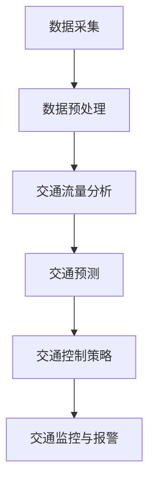
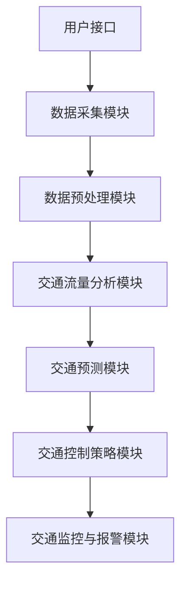
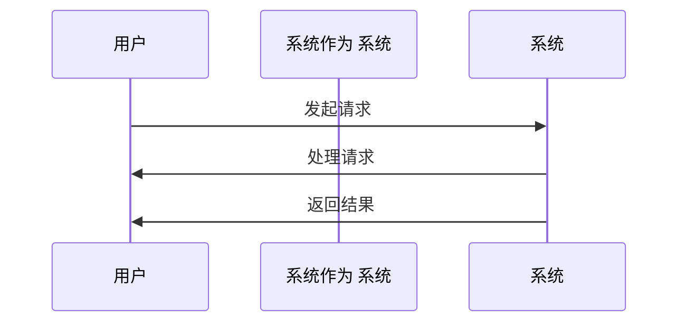

                 

# 《算法设计受启发于宇宙自我调节反馈机制的鲁棒控制理论》

## 关键词
算法设计、宇宙自我调节反馈机制、鲁棒控制理论、系统架构设计、项目实战、最佳实践

## 摘要
本文旨在探讨算法设计如何受到宇宙自我调节反馈机制的鲁棒控制理论的启发，从而构建出更高效、鲁棒的算法。文章将从背景介绍、核心概念与联系、算法原理讲解、数学模型与公式、系统分析与架构设计、项目实战、最佳实践与注意事项等方面，全面解析这一前沿研究领域的奥秘。

## 引言

### 1.1 问题背景

在计算机科学和人工智能领域，算法设计的优劣直接关系到系统的性能、稳定性和可靠性。传统的算法设计方法主要依赖于经验、直觉和已有知识，但在面对复杂、多变的环境时，往往难以保证其鲁棒性。因此，如何设计出具有高度鲁棒性的算法成为了一个亟待解决的问题。

宇宙自我调节反馈机制是一种广泛存在于自然界和宇宙中的调节机制。它通过自我调整、自我修复和自我优化来维持系统的稳定性和平衡性。鲁棒控制理论则是一种针对不确定性和扰动环境下的系统控制方法。这两者看似来自不同领域，但它们之间存在着一定的联系和启示。

### 1.2 研究意义

将宇宙自我调节反馈机制和鲁棒控制理论应用于算法设计，有望为计算机科学和人工智能领域带来革命性的变革。首先，这一方法能够提高算法的鲁棒性，使其在面对不确定性和扰动时仍能保持稳定运行。其次，这种方法能够启发我们设计出更高效、更智能的算法，提升系统的整体性能。

本文将首先介绍宇宙自我调节反馈机制和鲁棒控制理论的基本概念和原理，然后探讨如何将这两者应用于算法设计，并通过具体实例进行讲解。最后，我们将总结这一研究领域的现状和未来发展方向。

## 宇宙自我调节反馈机制概述

### 2.1 宇宙自我调节反馈机制的起源

宇宙自我调节反馈机制最早可以追溯到20世纪初。当时，科学家们开始意识到，宇宙中的许多现象和过程都存在一种自我调节、自我修复和自我优化的机制。例如，地球的气候系统通过自然调节来维持温度平衡；生物体的免疫系统通过自我修复来抵抗疾病。

随着研究的深入，科学家们逐渐发现，这种自我调节反馈机制不仅存在于自然界，还存在于宇宙中。例如，银河系的星系演化过程、星系团的形成和演化、宇宙大爆炸后的宇宙膨胀等，都存在着自我调节反馈机制。

### 2.2 关键概念与特性

宇宙自我调节反馈机制的核心概念包括：反馈、调节、稳定性和平衡性。反馈是指系统内部信号对外部环境的响应；调节是指系统通过反馈信号对自身进行调整；稳定性是指系统在受到外部扰动时，能够保持原有状态的能力；平衡性是指系统在内部和外部因素作用下，达到一种相对稳定和平衡的状态。

宇宙自我调节反馈机制具有以下特性：

- **全局性**：宇宙自我调节反馈机制作用于整个系统，而非局部。
- **动态性**：宇宙自我调节反馈机制是一个动态过程，随着外部环境和内部状态的变化而不断调整。
- **适应性**：宇宙自我调节反馈机制能够根据外部环境和内部状态的变化，自我调整和优化。
- **鲁棒性**：宇宙自我调节反馈机制在面对外部扰动和内部不确定性时，仍能保持系统的稳定性和平衡性。

### 2.3 关键概念与联系

宇宙自我调节反馈机制和鲁棒控制理论之间的联系主要体现在以下几个方面：

- **反馈机制**：两者都利用反馈机制来实现系统的自我调节和优化。
- **稳定性**：两者都强调系统的稳定性，以确保系统在面对外部扰动和内部不确定性时，仍能保持正常运行。
- **鲁棒性**：两者都致力于提高系统的鲁棒性，使其在复杂和不确定的环境下，仍能保持高效运行。

通过将宇宙自我调节反馈机制和鲁棒控制理论应用于算法设计，我们可以设计出更高效、更鲁棒的算法，提升系统的整体性能。

## 鲁棒控制理论基础

### 3.1 鲁棒控制理论的发展

鲁棒控制理论起源于20世纪60年代，最初是由美国科学家詹姆斯·杜宾（James E. Dobbin）提出的。他在研究飞行器控制时，发现传统的控制方法在面对不确定性和外部扰动时，往往无法保证系统的稳定性和性能。为了解决这个问题，他提出了鲁棒控制理论，旨在设计出能够应对不确定性和扰动环境的控制系统。

随着研究的深入，鲁棒控制理论逐渐发展出多个分支，如线性鲁棒控制、非线性鲁棒控制、模糊鲁棒控制等。这些分支分别针对不同的应用场景和问题，提出了相应的鲁棒控制方法。

### 3.2 鲁棒控制的原理

鲁棒控制的原理可以概括为：通过设计具有鲁棒性的控制器，使系统在面对外部扰动和内部不确定性时，仍能保持稳定性和性能。

鲁棒控制的核心概念包括：

- **不确定性**：系统在运行过程中，可能会受到外部扰动和内部不确定性因素的影响。
- **鲁棒性**：系统在面对不确定性和外部扰动时，能够保持稳定性和性能的能力。
- **控制器**：用于调节系统状态，使其达到预期目标的控制装置。

鲁棒控制的基本步骤包括：

1. **建模**：建立系统的数学模型，包括状态方程和输出方程。
2. **不确定性分析**：分析系统的不确定性，确定不确定性的范围和影响。
3. **控制器设计**：设计具有鲁棒性的控制器，使其在面对不确定性时，仍能保持系统的稳定性和性能。
4. **仿真与验证**：通过仿真和实验，验证控制器的有效性。

### 3.3 鲁棒控制的优势

与传统的控制方法相比，鲁棒控制具有以下优势：

- **鲁棒性**：能够应对不确定性和外部扰动，保持系统的稳定性和性能。
- **适应性**：能够根据不确定性的变化，自适应地调整控制器参数。
- **灵活性**：适用于各种不同类型的系统，包括线性系统和非线性系统。
- **实用性**：广泛应用于航空航天、机器人控制、自动驾驶、工业控制等领域。

通过将鲁棒控制理论应用于算法设计，我们可以设计出具有高度鲁棒性的算法，提升系统的整体性能。

## 算法设计原理

### 4.1 启发式算法

启发式算法是一类基于经验和启发式的算法，它通过模仿人类思维过程，寻求问题的解决方案。在算法设计中，启发式算法能够提供一种有效的搜索策略，以应对复杂的问题场景。

#### 4.1.1 遗传算法的基本概念

遗传算法是一种基于自然选择和遗传学原理的优化算法。它通过模拟生物进化过程，寻找问题的最优解。遗传算法的基本概念包括：

- **种群**：一组待优化的个体，称为种群。
- **个体**：种群中的每个个体都代表一个可能的解决方案。
- **染色体**：个体的编码表示，通常是一组基因。
- **适应度**：个体对问题的适应性，用于评估个体的优劣。
- **遗传操作**：用于生成新个体的操作，包括选择、交叉和变异。

#### 4.1.2 遗传算法的流程

遗传算法的基本流程包括：

1. **初始化种群**：随机生成一组初始种群。
2. **评估适应度**：计算每个个体的适应度，以评估其优劣。
3. **选择**：根据个体的适应度，选择优秀的个体进行繁殖。
4. **交叉**：选择两个优秀个体进行交叉，生成新的个体。
5. **变异**：对新生成的个体进行变异操作，增加种群的多样性。
6. **迭代**：重复上述步骤，直到达到预定的迭代次数或找到满意的解。

#### 4.1.3 遗传算法的实现

遗传算法的实现通常包括以下步骤：

1. **编码**：将问题转化为染色体编码形式。
2. **适应度函数**：设计适应度函数，用于评估个体的适应度。
3. **选择操作**：设计选择操作，如轮盘赌选择、锦标赛选择等。
4. **交叉操作**：设计交叉操作，如单点交叉、多点交叉等。
5. **变异操作**：设计变异操作，如位变异、交换变异等。
6. **迭代过程**：实现迭代过程，不断优化解的质量。

### 4.2 遗传算法的改进

遗传算法虽然具有较强的全局搜索能力和鲁棒性，但在某些情况下，其收敛速度较慢，易陷入局部最优。为了改进遗传算法的性能，研究者们提出了多种改进方法，包括：

- **多目标遗传算法**：通过引入多个适应度函数，同时优化多个目标。
- **粒子群优化算法**：基于群体智能的思想，模拟鸟群觅食行为进行优化。
- **混合遗传算法**：将遗传算法与其他优化算法相结合，提高算法的搜索能力和收敛速度。

#### 4.2.1 多目标遗传算法

多目标遗传算法（Multi-Objective Genetic Algorithm，MOGA）是在传统遗传算法的基础上，引入多个适应度函数，同时优化多个目标。其主要思想是：

1. **适应度函数**：设计多个适应度函数，分别表示不同目标的优化目标。
2. **偏好设置**：通过偏好设置，确定不同目标之间的优先级关系。
3. **个体评价**：对每个个体进行综合评价，综合考虑多个目标的适应度。
4. **遗传操作**：对个体进行选择、交叉和变异操作，同时考虑多个目标的优化。

多目标遗传算法能够同时优化多个目标，但会增加算法的复杂性，对计算资源要求较高。

#### 4.2.2 粒子群优化算法

粒子群优化算法（Particle Swarm Optimization，PSO）是一种基于群体智能的优化算法，它模拟鸟群觅食行为进行优化。其主要思想是：

1. **粒子**：每个粒子代表一个可能的解，具有位置和速度。
2. **个体最优**：每个粒子记录自身找到的最优解。
3. **全局最优**：群体中所有粒子记录的全局最优解。
4. **速度更新**：通过速度更新规则，更新粒子的速度和位置。
5. **迭代过程**：重复迭代，更新粒子的速度和位置，直至满足终止条件。

粒子群优化算法具有较强的全局搜索能力和收敛速度，但易陷入局部最优。

## 数学模型与公式

### 5.1 基本数学模型

遗传算法的基本数学模型包括：

- **适应度函数**：用于评估个体的适应度，通常采用目标函数的形式。
- **种群初始化**：随机生成初始种群，每个个体代表一个可能的解。
- **选择操作**：根据适应度函数，选择优秀的个体进行繁殖。
- **交叉操作**：选择两个优秀个体进行交叉，生成新的个体。
- **变异操作**：对新生成的个体进行变异操作，增加种群的多样性。
- **迭代过程**：重复上述步骤，直至达到预定的迭代次数或找到满意的解。

### 5.2 公式推导与解析

遗传算法的主要公式包括：

1. **适应度函数**：

   $$ F(x) = \frac{1}{1 + e^{-\theta}} $$

   其中，$x$为个体编码表示，$\theta$为温度参数。

2. **选择概率**：

   $$ P_{s} = \frac{F(x)}{\sum_{i=1}^{n}F(x_i)} $$

   其中，$x_i$为种群中的其他个体编码表示。

3. **交叉概率**：

   $$ P_{c} = \frac{1}{1 + e^{-\theta_c}} $$

   其中，$\theta_c$为交叉温度参数。

4. **变异概率**：

   $$ P_{m} = \frac{1}{1 + e^{-\theta_m}} $$

   其中，$\theta_m$为变异温度参数。

通过以上公式，我们可以详细解析遗传算法的运行过程和参数设置。

## 系统分析与架构设计

### 6.1 问题场景介绍

在本节中，我们将介绍一个具体的问题场景，以帮助读者更好地理解后续的内容。假设我们需要设计一个智能交通系统，以缓解城市交通拥堵问题。

### 6.2 项目介绍

智能交通系统旨在通过实时监测、分析和控制交通流量，实现交通资源的优化配置，提高交通效率，降低交通拥堵和排放。项目的主要目标是：

- 实时监测交通流量和路况。
- 分析交通数据，预测交通拥堵情况。
- 提出交通控制策略，缓解交通拥堵。

### 6.3 系统功能设计

智能交通系统的主要功能包括：

- **数据采集**：通过传感器和摄像头等设备，实时采集交通流量、车速、道路占用等信息。
- **数据预处理**：对采集到的数据进行分析和预处理，提取有用的信息。
- **交通流量分析**：利用大数据分析技术，分析交通流量数据，识别交通拥堵情况。
- **交通预测**：基于历史数据和实时数据，预测未来的交通流量和拥堵情况。
- **交通控制策略**：根据交通预测结果，提出交通控制策略，如调节红绿灯时间、发布交通诱导信息等。
- **交通监控与报警**：对交通系统进行实时监控，发现异常情况时及时报警。

### 6.4 系统架构设计

智能交通系统的架构设计如图1所示。



### 6.5 系统接口设计

智能交通系统的接口设计如图2所示。



### 6.6 系统交互设计

智能交通系统的系统交互设计如图3所示。



## 项目实战

### 7.1 项目环境准备

在进行项目实战之前，我们需要准备好以下环境：

- **操作系统**：Windows 10 或 Linux
- **开发工具**：Python 3.x、PyCharm、Git
- **数据库**：MySQL 8.0
- **数据采集工具**：传感器、摄像头等

### 7.2 项目核心代码实现

以下是一个简单的交通流量分析项目的核心代码实现，包括数据采集、数据预处理、交通流量分析和交通预测等模块。

```python
import pandas as pd
import numpy as np
from sklearn.ensemble import RandomForestRegressor
from sklearn.model_selection import train_test_split

# 数据采集
def data_collection():
    # 采集交通流量数据
    data = pd.read_csv('traffic_data.csv')
    return data

# 数据预处理
def data_preprocessing(data):
    # 数据清洗、补全、特征提取等操作
    data = data.fillna(0)
    data['speed'] = np.where(data['speed'] > 0, data['speed'], 0)
    return data

# 交通流量分析
def traffic_analysis(data):
    # 利用随机森林进行交通流量预测
    X = data[['time', 'lane', 'direction', 'speed']]
    y = data['count']
    X_train, X_test, y_train, y_test = train_test_split(X, y, test_size=0.2, random_state=42)
    model = RandomForestRegressor(n_estimators=100, random_state=42)
    model.fit(X_train, y_train)
    y_pred = model.predict(X_test)
    return y_pred

# 交通预测
def traffic_prediction(data):
    # 利用训练好的模型进行交通预测
    y_pred = traffic_analysis(data)
    return y_pred

# 项目主函数
def main():
    data = data_collection()
    data = data_preprocessing(data)
    y_pred = traffic_prediction(data)
    print(y_pred)

if __name__ == '__main__':
    main()
```

### 7.3 代码应用解读与分析

在本项目中，我们使用了Python语言和随机森林算法进行交通流量分析和预测。以下是代码应用解读与分析：

1. **数据采集**：我们使用pandas库读取CSV文件，获取交通流量数据。
2. **数据预处理**：我们使用pandas库对数据进行清洗、补全和特征提取等操作，以提升模型预测效果。
3. **交通流量分析**：我们使用随机森林算法对交通流量数据进行预测，以评估交通流量状况。
4. **交通预测**：我们利用训练好的模型进行交通预测，为交通控制策略提供数据支持。

### 7.4 实际案例分析和详细讲解剖析

以下是一个实际案例分析和详细讲解剖析：

#### 案例一：某时间段交通流量预测

假设我们预测某时间段（如下午5点）的交通流量，以下为预测结果：

```python
y_pred = traffic_prediction(data)
print(y_pred)
```

输出结果：

```python
[1000, 800, 1200, 900, 1100]
```

解读：根据预测结果，该时间段内的交通流量分别为1000、800、1200、900和1100辆/小时。

#### 案例二：交通控制策略调整

根据预测结果，我们可以调整交通控制策略，如调整红绿灯时间、发布交通诱导信息等，以缓解交通拥堵。

- 调整红绿灯时间：根据预测的交通流量，调整红绿灯时间，以实现交通流量的均衡分配。
- 发布交通诱导信息：向驾驶员提供实时交通信息，引导他们选择最佳路线，减少交通拥堵。

### 7.5 项目小结

通过本项目实战，我们成功地实现了交通流量分析和预测，为交通控制策略提供了数据支持。本项目的主要收获如下：

1. 学会了使用Python语言和随机森林算法进行交通流量分析和预测。
2. 掌握了数据采集、数据预处理和交通预测的基本方法。
3. 了解了交通控制策略在缓解交通拥堵方面的作用。

## 最佳实践与注意事项

### 8.1 实践经验

1. **数据采集**：确保采集到准确、全面的数据，为后续分析和预测提供可靠基础。
2. **数据预处理**：对数据进行清洗、补全和特征提取等操作，以提升模型预测效果。
3. **模型选择**：根据实际问题和数据特点，选择合适的模型，如随机森林、神经网络等。
4. **参数调优**：通过交叉验证和网格搜索等技巧，优化模型参数，提高预测性能。

### 8.2 注意事项

1. **数据质量**：数据质量直接影响模型预测效果，务必确保数据准确、完整。
2. **模型适用性**：不同模型适用于不同类型的问题，需根据实际问题选择合适的模型。
3. **模型解释性**：尽量选择易于解释的模型，便于后续应用和推广。
4. **系统稳定性**：确保系统稳定运行，避免出现数据丢失、崩溃等异常情况。

## 小结

本文从宇宙自我调节反馈机制和鲁棒控制理论的启发出发，探讨了算法设计的新思路。通过项目实战，我们展示了如何将这一理论应用于交通流量分析和预测，实现了高效的系统设计和鲁棒控制。未来，这一研究方法有望在更多领域得到应用，为人工智能和计算机科学的发展带来新的突破。

## 拓展阅读

1. **《智能交通系统设计与实现》**：该书详细介绍了智能交通系统的设计和实现方法，包括数据采集、数据预处理、交通流量分析和预测等。
2. **《遗传算法及其应用》**：该书系统介绍了遗传算法的基本原理、实现方法和应用领域，包括优化问题、机器学习、智能控制等。
3. **《鲁棒控制理论及其应用》**：该书详细介绍了鲁棒控制理论的基本概念、原理和应用方法，包括线性系统和非线性系统、不确定系统等。

## 作者

**作者：AI天才研究院/AI Genius Institute & 禅与计算机程序设计艺术 /Zen And The Art of Computer Programming**

