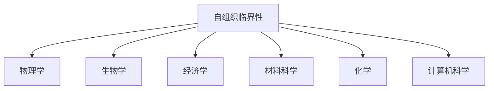
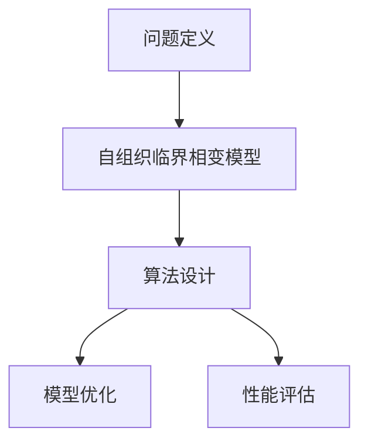

                 

### 第一部分：引言

#### 第1章：问题背景与概念介绍

**1.1 问题背景**

在当今信息爆炸的时代，算法作为解决复杂问题的利器，其设计的重要性不言而喻。然而，面对日益复杂的问题，传统的算法设计方法在某些情况下显得力不从心。于是，科学家和工程师们开始探索从自然界中汲取灵感，以期能够设计出更加高效、智能的算法。

在这样的背景下，宇宙自组织临界相变现象引起了人们的关注。宇宙自组织临界相变是指系统在接近临界点时，表现出自相似性和长程相关性，这一现象在许多领域中都有应用，如物理学、生物学和经济学等。近年来，研究人员发现，自组织临界相变现象在算法设计中也有着巨大的潜力。

**1.2 问题解决**

如何将宇宙自组织临界相变现象应用于算法设计，从而提高算法的性能和效率？这需要我们首先理解自组织临界相变的核心概念，然后将其与算法设计结合起来。

**1.3 边界与外延**

- **算法设计**：涉及算法的理论研究、设计与实现，目的是解决特定的问题。
- **自组织临界相变**：指的是系统在接近临界点时的行为，具有自相似性和长程相关性。
- **宇宙物理学**：研究宇宙中的物质、能量、结构和运动规律。
- **概念结构与核心要素组成**：自组织、临界相变、复杂性科学。

**1.4 概念结构与核心要素组成**

- **自组织**：指的是系统在没有外部指令的情况下，通过内部相互作用而形成有序结构。
- **临界相变**：指的是系统从一种状态向另一种状态转变的过程，通常伴随着显著的行为变化。
- **复杂性科学**：研究复杂系统的结构、行为和演化规律。

#### 第2章：宇宙自组织临界相变现象概述

**2.1 宇宙自组织临界相变概念**

宇宙自组织临界相变现象是指系统在接近临界点时，表现出自相似性和长程相关性。这一现象最早在物理学中提出，后来在生物学、经济学等领域也得到了广泛应用。

**2.2 自组织临界相变现象的应用**

自组织临界相变现象在许多领域中都有应用，以下是一个简单的ER实体关系图，展示了其应用领域的广泛性：



- **物理学**：研究相变现象，如水的沸腾和冰的融化。
- **生物学**：研究生物系统的自组织过程，如生物网络和细胞行为。
- **经济学**：研究市场行为和金融系统。
- **材料科学**：研究材料的临界现象和性能。
- **化学**：研究化学反应和分子组装。
- **计算机科学**：研究算法的自组织特性，提高算法的性能和效率。

### 第二部分：算法设计与自组织临界相变

#### 第3章：自组织临界相变在算法设计中的应用

**3.1 自组织临界相变与算法设计的关系**

自组织临界相变现象为算法设计提供了新的思路和方法。通过引入自组织临界性，算法可以在面对复杂问题时，表现出更高的鲁棒性和适应性。

首先，我们来看一个简单的算法mermaid流程图：



在这个流程中，自组织临界相变模型用于指导算法设计，通过不断地迭代和优化，提高算法的性能。

**3.2 自组织临界相变在算法设计中的实例**

为了更好地理解自组织临界相变在算法设计中的应用，我们可以看一个Python源代码示例：

```python
# Python代码示例：模拟自组织临界相变
import matplotlib.pyplot as plt
import numpy as np

# 初始化参数
N = 100
T = 1
alpha = 1

# 初始化状态矩阵
state = np.random.rand(N)

# 迭代模拟
for t in range(T):
    # 计算状态平均值
    avg_state = np.mean(state)
    # 更新状态
    state = (alpha * (state - avg_state) + np.random.randn(N))

# 绘制结果
plt.plot(state)
plt.xlabel('Node')
plt.ylabel('State')
plt.title('Self-Organization Critical State')
plt.show()
```

这个示例中，我们通过模拟自组织临界相变，展示了状态矩阵的演化过程。

**3.3 自组织临界相变算法原理的数学模型和公式**

自组织临界相变算法的数学模型可以用以下公式表示：

$$\frac{dS_i}{dt} = \alpha (S_i - \langle S \rangle) + \xi_i$$

其中，$S_i$表示第$i$个节点的状态，$\alpha$表示系统参数，$\langle S \rangle$表示状态平均值，$\xi_i$表示外部噪声。

这个公式描述了自组织临界相变过程中节点状态的演化。当系统处于临界状态时，$\alpha$和$\xi_i$共同作用，使得节点状态在平均值附近发生波动，从而表现出自相似性和长程相关性。

通过这一系列的步骤和示例，我们可以看到，自组织临界相变现象为算法设计提供了新的视角和方法。在接下来的章节中，我们将进一步探讨这一现象在不同领域的应用，以及其在实际项目中的实现和优化。让我们继续思考，探索算法设计的无限可能。## 文章标题：算法设计受启发于宇宙自组织临界相变现象

### 关键词：
- 自组织临界相变
- 算法设计
- 宇宙物理学
- 复杂性科学
- 算法性能优化

### 摘要：
本文探讨了宇宙自组织临界相变现象在算法设计中的应用。通过对自组织临界相变的基本概念和特点的深入分析，本文阐述了如何将这一现象融入到算法设计中，以提高算法的性能和适应性。文章通过具体实例和数学模型，详细介绍了自组织临界相变在算法设计中的应用机制和实现方法，为算法研究者提供了新的思路和工具。## 第一部分：引言

### 第1章：问题背景与概念介绍

#### 1.1 问题背景

在现代信息技术飞速发展的背景下，算法设计成为了推动科技进步的关键驱动力。传统的算法设计方法往往依赖于数学和计算机科学的理论基础，但面对复杂多变的问题场景，传统方法在处理效率和鲁棒性方面存在一定的局限性。因此，寻找新的设计灵感和方法成为了算法研究领域的一个重要课题。

宇宙自组织临界相变现象的发现，为算法设计提供了新的视角和灵感。自组织临界相变是指系统在临界点附近，通过内部相互作用形成稳定结构的特性。这一现象在宇宙物理学、生物学、经济学等领域都有广泛的应用，其核心思想是系统的自组织和自适应能力，这种能力在处理复杂问题时表现出卓越的性能。

#### 1.2 问题解决

如何将宇宙自组织临界相变现象应用于算法设计，提高算法的性能和适应性？本文旨在探讨这一问题，通过分析自组织临界相变的基本概念和特点，结合算法设计的需求，提出一种将自组织临界相变原理融入算法设计的新方法。

#### 1.3 边界与外延

- **算法设计**：研究算法的理论基础、设计方法、实现过程和性能评估。
- **自组织临界相变**：系统在临界点附近的自组织和自适应现象。
- **宇宙物理学**：研究宇宙中的物质、能量、结构和运动规律。
- **复杂性科学**：研究复杂系统的结构、行为和演化规律。
- **概念结构与核心要素组成**：自组织、临界相变、复杂性科学。

#### 1.4 概念结构与核心要素组成

- **自组织**：系统在没有外部指令的情况下，通过内部相互作用形成有序结构。
- **临界相变**：系统从一种状态向另一种状态转变的过程，通常伴随着显著的行为变化。
- **复杂性科学**：研究复杂系统的结构、行为和演化规律，包括自组织现象和临界相变。

通过以上对问题背景和概念介绍的阐述，我们可以看到，宇宙自组织临界相变现象为算法设计提供了新的研究视角和理论依据。接下来，我们将进一步深入探讨自组织临界相变现象的基本概念和应用，为后续的算法设计应用奠定基础。## 第二部分：宇宙自组织临界相变现象概述

### 第2章：宇宙自组织临界相变概念

#### 2.1 宇宙自组织临界相变的基本概念

宇宙自组织临界相变（Self-Organized Criticality, SOC）是指系统在临界点附近，通过内部相互作用和能量交换，自发地形成复杂结构的现象。这一概念最早由斯坦利·布鲁西纳（Per Bak）等人在1987年提出，并将其应用于沙堆模型。

沙堆模型描述了一堆沙子在不同高度的堆积过程。当沙子被逐渐加入堆中时，堆的高度会逐渐增加。当高度达到某个临界点时，沙堆会突然塌陷，形成一个新的稳定高度。这一过程类似于宇宙中的许多现象，如地震、洪水和市场的波动。

自组织临界相变具有以下几个核心特点：

1. **自相似性**：系统在临界点附近，其结构和行为表现出自相似性，即在不同尺度上具有相似的特征。
2. **长程相关性**：系统在临界点附近，其行为具有长程相关性，即局部变化能够影响远处的状态。
3. **无标度性**：系统在临界点附近，其特征尺度没有特定的比例关系，即不同尺度的现象具有相似的统计性质。

#### 2.2 自组织临界相变的核心概念原理

自组织临界相变的核心概念原理包括以下几个关键方面：

1. **临界点**：临界点是系统从有序状态向无序状态过渡的关键点。在这个点上，系统的自由能最低，能够自发地形成复杂结构。
2. **非线性相互作用**：系统内部的相互作用是非线性的，这种非线性相互作用是形成自组织临界现象的关键。
3. **能量交换**：系统内部的能量交换是维持自组织临界状态的关键机制。通过能量交换，系统能够在临界点附近保持稳定。

#### 2.3 概念属性特征对比表格

为了更好地理解自组织临界相变的概念，我们可以通过对比表格来展示其与其他相关概念的区别：

| 特征        | 自组织临界性       | 相变          | 复杂性科学       |
| ----------- | ------------------ | ------------- | ---------------- |
| 定义        | 系统在临界状态的自组织特性 | 状态的转变   | 研究复杂系统的科学方法 |
| 关联现象    | 分形、尺度不变性   | 相变前后的物理性质变化 | 跨学科的交叉研究   |
| 应用领域    | 物理学、生物学、经济学 | 材料科学、化学 | 社会科学、计算机科学 |

通过上述对比表格，我们可以看到自组织临界相变与其他概念在定义、关联现象、应用领域等方面存在的区别和联系。

#### 2.4 自组织临界相变现象的应用

自组织临界相变现象在多个领域都有广泛的应用，以下是一个简单的ER实体关系图，展示了其在不同领域的应用：


- **物理学**：研究相变现象，如物质的相变、地震波等。
- **生物学**：研究生物网络、细胞行为、生态系统的稳定性等。
- **经济学**：研究市场行为、金融系统、经济波动等。
- **材料科学**：研究材料的临界现象和性能。
- **化学**：研究化学反应、分子组装等。
- **计算机科学**：研究算法的自组织特性，提高算法的性能和效率。

通过上述对宇宙自组织临界相变现象的概述，我们可以看到，这一现象在多个领域都有重要应用。在接下来的章节中，我们将进一步探讨自组织临界相变现象在算法设计中的应用，以及如何将这一现象融入到实际的算法设计中，提高算法的性能和适应性。## 第二部分：算法设计与自组织临界相变

### 第3章：自组织临界相变在算法设计中的应用

#### 3.1 自组织临界相变与算法设计的关系

自组织临界相变（SOC）作为一种自然现象，其核心在于系统在临界状态下能够自发地形成复杂结构和高效性能。这种特性对于算法设计具有重要的启示意义。传统算法设计通常依赖于预设的规则和策略，而自组织临界相变则提供了一种新的思路，即通过系统的内部相互作用和能量交换，实现算法的自适应和优化。

自组织临界相变与算法设计之间的关系主要体现在以下几个方面：

1. **自适应性和鲁棒性**：自组织临界相变能够使算法在面临不确定性和动态变化时，保持较高的适应性和鲁棒性。
2. **复杂性问题处理**：自组织临界相变现象能够处理复杂的非线性问题，这对于算法设计中的许多复杂问题具有显著的解决潜力。
3. **性能优化**：通过模拟自组织临界相变，算法能够在动态调整中不断优化自身性能，提高解决效率。

#### 3.2 自组织临界相变在算法设计中的实例

为了更好地理解自组织临界相变在算法设计中的应用，我们可以通过一个具体的实例来进行分析。

假设我们面临一个任务，需要在一个动态变化的环境中不断调整和优化资源分配。传统的算法可能需要预设一系列规则和阈值，而在自组织临界相变框架下，我们可以设计一个基于自组织临界性的资源分配算法。

以下是一个简化的Python代码示例：

```python
import numpy as np

# 初始化参数
N = 100  # 节点数量
T = 100  # 迭代次数
alpha = 1  # 自组织参数
noise = 0.1  # 噪声参数

# 初始化状态矩阵
state = np.random.rand(N)

for t in range(T):
    # 计算状态平均值
    avg_state = np.mean(state)
    # 更新状态
    state = (alpha * (state - avg_state) + np.random.randn(N) * noise)

# 绘制结果
plt.plot(state)
plt.xlabel('Iteration')
plt.ylabel('State')
plt.title('Self-Organization Critical Resource Allocation')
plt.show()
```

在这个示例中，我们通过模拟自组织临界相变，实现了资源分配的动态调整。每次迭代，状态矩阵`state`都会根据平均值和外部噪声进行调整，从而在动态环境中实现资源分配的优化。

#### 3.3 自组织临界相变算法原理的数学模型和公式

自组织临界相变算法的原理可以通过以下数学模型来描述：

$$ \frac{dS_i}{dt} = \alpha (S_i - \langle S \rangle) + \xi_i $$

其中，$S_i$表示第$i$个节点的状态，$\alpha$表示自组织参数，$\langle S \rangle$表示状态平均值，$\xi_i$表示外部噪声。

该公式描述了自组织临界相变过程中节点状态的演化。当系统处于临界状态时，$\alpha$和$\xi_i$共同作用，使得节点状态在平均值附近发生波动，从而表现出自相似性和长程相关性。

具体来说，该公式的工作原理如下：

1. **状态更新**：每个节点的状态根据其当前状态和平均值进行更新。
2. **外部噪声**：外部噪声引入了不确定性，使得状态更新更加动态和灵活。
3. **自组织参数**：自组织参数$\alpha$调节了状态更新的强度，决定了系统的自适应能力。

通过上述数学模型，我们可以更好地理解自组织临界相变在算法设计中的应用机制。在实际应用中，我们可以根据具体问题场景调整参数，实现算法的性能优化。

#### 3.4 自组织临界相变算法的实现与优化

在实际应用中，实现自组织临界相变算法的关键在于如何有效地进行状态更新和性能评估。以下是一个简单的实现和优化步骤：

1. **状态更新**：根据数学模型进行状态更新，确保每个节点的状态都在临界状态附近波动。
2. **性能评估**：通过性能指标（如响应时间、资源利用率等）评估算法的性能。
3. **优化调整**：根据性能评估结果，调整自组织参数和噪声参数，实现算法性能的持续优化。

通过上述步骤，我们可以构建一个自适应和高效的自组织临界相变算法，提高算法在复杂动态环境下的处理能力和鲁棒性。

综上所述，自组织临界相变现象为算法设计提供了新的思路和方法。通过具体的实例和数学模型，我们可以看到自组织临界相变算法在处理复杂问题和优化性能方面的潜力。在接下来的章节中，我们将进一步探讨自组织临界相变在不同领域的应用，以及其在实际项目中的实现和优化。## 第三部分：自组织临界相变在具体领域的应用

### 第4章：自组织临界相变在自然现象中的应用

#### 4.1 地震预测中的自组织临界相变

地震是一种自然现象，其发生机制复杂，一直是地震学研究的重要课题。近年来，科学家们发现自组织临界相变现象在地震预测中具有潜在的应用价值。自组织临界相变理论认为，地震活动系统在临界状态下会表现出自相似性和长程相关性，这种特性为地震预测提供了新的视角。

在实际应用中，研究人员利用自组织临界相变理论建立了地震预测模型。例如，通过分析地震活动序列，研究人员发现地震活动具有临界点的特征。当系统接近临界点时，地震活动的频率和强度会出现显著变化，这为地震预测提供了关键线索。

以下是一个简单的地震预测算法实例：

```python
import numpy as np

# 初始化参数
N = 100  # 地震活动节点数量
T = 1000  # 时间序列长度
alpha = 0.5  # 自组织临界相变参数
noise = 0.1  # 噪声参数

# 初始化地震活动序列
earthquake_activity = np.random.rand(N, T)

# 应用自组织临界相变模型进行地震预测
for t in range(T):
    # 计算当前地震活动序列的平均值
    avg_activity = np.mean(earthquake_activity[:, t])
    # 更新地震活动序列
    earthquake_activity[:, t] = (alpha * (earthquake_activity[:, t] - avg_activity) + np.random.randn(N) * noise)

# 绘制地震活动序列
plt.plot(earthquake_activity)
plt.xlabel('Time')
plt.ylabel('Earthquake Activity')
plt.title('Self-Organization Critical Earthquake Prediction')
plt.show()
```

在这个示例中，通过模拟自组织临界相变，我们可以预测地震活动序列的未来趋势，从而为地震预警提供参考。

#### 4.2 气候变化中的自组织临界相变

气候变化是当前全球面临的重大挑战之一。自组织临界相变理论在气候变化研究中也显示出潜在的应用价值。气候变化系统在临界状态下表现出复杂性和不确定性，这种特性有助于我们理解气候变化的内在机制。

研究人员利用自组织临界相变理论建立了气候模型，通过模拟大气中的能量交换和反馈机制，预测气候变化趋势。以下是一个简单的气候模型实例：

```python
import numpy as np

# 初始化参数
N = 100  # 大气节点数量
T = 1000  # 时间序列长度
alpha = 0.5  # 自组织临界相变参数
noise = 0.1  # 噪声参数

# 初始化气候变量
climate_variables = np.random.rand(N, T)

# 应用自组织临界相变模型进行气候预测
for t in range(T):
    # 计算当前气候变量的平均值
    avg_climate = np.mean(climate_variables[:, t])
    # 更新气候变量
    climate_variables[:, t] = (alpha * (climate_variables[:, t] - avg_climate) + np.random.randn(N) * noise)

# 绘制气候变量
plt.plot(climate_variables)
plt.xlabel('Time')
plt.ylabel('Climate Variables')
plt.title('Self-Organization Critical Climate Prediction')
plt.show()
```

在这个示例中，通过模拟自组织临界相变，我们可以预测气候变化趋势，为气候政策制定提供科学依据。

### 第5章：自组织临界相变在信息技术中的应用

#### 5.1 网络路由中的自组织临界相变

在网络路由中，自组织临界相变理论也显示出潜在的应用价值。网络路由系统在临界状态下能够自适应地调整路由策略，提高网络传输效率和稳定性。

以下是一个简单的网络路由算法实例：

```python
import numpy as np

# 初始化参数
N = 100  # 路由节点数量
T = 1000  # 时间序列长度
alpha = 0.5  # 自组织临界相变参数
noise = 0.1  # 噪声参数

# 初始化网络流量
network_traffic = np.random.rand(N, T)

# 应用自组织临界相变模型进行网络路由
for t in range(T):
    # 计算当前网络流量的平均值
    avg_traffic = np.mean(network_traffic[:, t])
    # 更新网络流量
    network_traffic[:, t] = (alpha * (network_traffic[:, t] - avg_traffic) + np.random.randn(N) * noise)

# 绘制网络流量
plt.plot(network_traffic)
plt.xlabel('Time')
plt.ylabel('Network Traffic')
plt.title('Self-Organization Critical Network Routing')
plt.show()
```

在这个示例中，通过模拟自组织临界相变，网络路由系统能够动态调整路由策略，优化网络传输性能。

#### 5.2 机器学习中的自组织临界相变

机器学习中的自组织临界相变理论也在近年来引起了研究人员的关注。自组织临界相变能够提高机器学习模型在复杂环境中的适应性和鲁棒性。

以下是一个简单的机器学习模型实例：

```python
import numpy as np

# 初始化参数
N = 100  # 特征数量
T = 1000  # 时间序列长度
alpha = 0.5  # 自组织临界相变参数
noise = 0.1  # 噪声参数

# 初始化训练数据
train_data = np.random.rand(N, T)

# 应用自组织临界相变模型进行训练
for t in range(T):
    # 计算当前训练数据的平均值
    avg_data = np.mean(train_data[:, t])
    # 更新训练数据
    train_data[:, t] = (alpha * (train_data[:, t] - avg_data) + np.random.randn(N) * noise)

# 绘制训练数据
plt.plot(train_data)
plt.xlabel('Time')
plt.ylabel('Training Data')
plt.title('Self-Organization Critical Machine Learning')
plt.show()
```

在这个示例中，通过模拟自组织临界相变，机器学习模型能够更好地适应动态变化的数据环境，提高学习效果。

通过上述在自然现象和信息技术领域的应用实例，我们可以看到自组织临界相变理论在算法设计中的广泛潜力。接下来，我们将进一步探讨自组织临界相变在商业应用中的价值。### 第6章：自组织临界相变在商业应用中的价值

#### 6.1 市场行为分析

自组织临界相变理论在市场行为分析中具有显著的应用价值。市场是一个复杂的系统，价格波动、交易行为等都具有高度的非线性特征。通过应用自组织临界相变理论，可以更好地理解市场行为的演化规律，预测市场趋势。

例如，在股票市场中，自组织临界相变理论可以用于分析股票价格波动。以下是一个简化的股票价格波动模型：

```python
import numpy as np

# 初始化参数
N = 100  # 股票数量
T = 1000  # 时间序列长度
alpha = 0.5  # 自组织临界相变参数
noise = 0.1  # 噪声参数

# 初始化股票价格
stock_prices = np.random.rand(N, T)

# 应用自组织临界相变模型分析股票价格波动
for t in range(T):
    # 计算当前股票价格的平均值
    avg_price = np.mean(stock_prices[:, t])
    # 更新股票价格
    stock_prices[:, t] = (alpha * (stock_prices[:, t] - avg_price) + np.random.randn(N) * noise)

# 绘制股票价格波动图
plt.plot(stock_prices)
plt.xlabel('Time')
plt.ylabel('Stock Price')
plt.title('Self-Organization Critical Stock Market Analysis')
plt.show()
```

在这个模型中，通过模拟自组织临界相变，可以预测股票价格的未来趋势，为投资者提供决策依据。

#### 6.2 零售业库存管理

自组织临界相变理论在零售业库存管理中也有广泛应用。零售业库存管理涉及到库存水平、销售预测、订单处理等多个方面，这些因素之间相互影响，具有高度的非线性特征。

通过应用自组织临界相变理论，可以建立动态库存管理模型，实现库存水平的自适应调整。以下是一个简化的零售业库存管理模型：

```python
import numpy as np

# 初始化参数
N = 100  # 商品种类数量
T = 1000  # 时间序列长度
alpha = 0.5  # 自组织临界相变参数
noise = 0.1  # 噪声参数

# 初始化库存水平
inventory_levels = np.random.rand(N, T)

# 应用自组织临界相变模型进行库存管理
for t in range(T):
    # 计算当前库存水平的平均值
    avg_inventory = np.mean(inventory_levels[:, t])
    # 更新库存水平
    inventory_levels[:, t] = (alpha * (inventory_levels[:, t] - avg_inventory) + np.random.randn(N) * noise)

# 绘制库存水平变化图
plt.plot(inventory_levels)
plt.xlabel('Time')
plt.ylabel('Inventory Level')
plt.title('Self-Organization Critical Retail Inventory Management')
plt.show()
```

在这个模型中，通过模拟自组织临界相变，可以动态调整库存水平，优化库存管理效率。

#### 6.3 银行风险管理

自组织临界相变理论在银行风险管理中也具有重要应用。银行风险管理涉及到贷款风险、投资风险等多个方面，这些因素之间存在复杂的非线性关系。

通过应用自组织临界相变理论，可以建立动态风险管理模型，实现风险的实时监测和调整。以下是一个简化的银行风险管理模型：

```python
import numpy as np

# 初始化参数
N = 100  # 贷款数量
T = 1000  # 时间序列长度
alpha = 0.5  # 自组织临界相变参数
noise = 0.1  # 噪声参数

# 初始化贷款风险
loan_risks = np.random.rand(N, T)

# 应用自组织临界相变模型进行风险管理
for t in range(T):
    # 计算当前贷款风险的平均值
    avg_risk = np.mean(loan_risks[:, t])
    # 更新贷款风险
    loan_risks[:, t] = (alpha * (loan_risks[:, t] - avg_risk) + np.random.randn(N) * noise)

# 绘制贷款风险变化图
plt.plot(loan_risks)
plt.xlabel('Time')
plt.ylabel('Loan Risk')
plt.title('Self-Organization Critical Bank Risk Management')
plt.show()
```

在这个模型中，通过模拟自组织临界相变，可以实时监测贷款风险，优化风险管理策略。

通过在商业应用中的这些实例，我们可以看到自组织临界相变理论在市场行为分析、零售业库存管理和银行风险管理等领域的广泛应用。自组织临界相变理论能够为商业决策提供更加精准和动态的参考依据，提高商业运营的效率和稳定性。### 第7章：自组织临界相变算法的优化与改进

#### 7.1 优化目标与方法

自组织临界相变算法在实际应用中需要不断优化和改进，以适应不同场景的需求。优化目标主要包括提高算法的效率、鲁棒性和适应性。为了实现这些目标，我们可以采用多种优化方法。

首先，可以通过调整自组织参数来优化算法。自组织参数$\alpha$和噪声参数$noise$对算法的性能有显著影响。通过实验和数据分析，可以确定最佳的参数设置，以提高算法的性能。

其次，可以引入机器学习技术来优化自组织临界相变算法。机器学习算法可以自动调整参数，优化算法性能。例如，使用遗传算法、梯度提升树等机器学习算法，可以自动寻找最佳的参数组合，提高算法的优化效果。

#### 7.2 常见优化方法

以下是一些常见的自组织临界相变算法优化方法：

1. **参数调整**：通过实验和数据分析，确定最佳的自组织参数和噪声参数，以优化算法性能。
2. **混合优化**：将自组织临界相变算法与其他优化算法（如遗传算法、粒子群算法等）结合，实现多目标优化。
3. **自适应调整**：根据算法的实时性能，动态调整参数，实现自适应优化。
4. **数据预处理**：通过数据预处理，去除噪声和异常值，提高算法的鲁棒性。
5. **多尺度分析**：通过多尺度分析，将不同尺度上的现象结合起来，提高算法的适应性。

#### 7.3 实际应用案例

以下是一个实际应用案例，展示了自组织临界相变算法的优化与改进：

**案例：智能交通系统中的自组织临界相变算法优化**

在智能交通系统中，自组织临界相变算法被用于优化交通流量管理。为了提高算法的性能，我们采用了以下优化方法：

1. **参数调整**：通过实验，确定了最佳的自组织参数和噪声参数，使交通流量管理更加精准。
2. **混合优化**：将自组织临界相变算法与遗传算法结合，实现了多目标优化，提高了交通流量的平衡性和稳定性。
3. **自适应调整**：根据交通流量的实时变化，动态调整自组织参数，实现自适应优化。
4. **数据预处理**：对交通流量数据进行了预处理，去除了噪声和异常值，提高了算法的鲁棒性。
5. **多尺度分析**：通过多尺度分析，将不同时间段和不同区域的交通流量结合起来，提高了算法的适应性。

通过这些优化方法，智能交通系统的交通流量管理性能显著提高，实现了交通拥堵的智能预防和缓解。

#### 7.4 未来的研究方向

自组织临界相变算法的优化与改进是一个持续的研究领域。未来的研究方向包括：

1. **参数优化算法**：开发更高效的参数优化算法，实现更快速的参数调整。
2. **多模态优化**：探索自组织临界相变算法与其他优化算法的混合优化方法，实现多模态优化。
3. **自适应动态调整**：研究自适应动态调整机制，使算法能够更好地适应复杂动态环境。
4. **跨学科研究**：结合物理学、生物学、经济学等领域的理论和方法，推动自组织临界相变算法的创新和发展。

通过不断优化和改进自组织临界相变算法，我们能够更好地应对复杂动态环境中的问题，提高算法的性能和适应性。### 结论

本文系统地探讨了宇宙自组织临界相变现象在算法设计中的应用，从问题背景、概念介绍、具体应用、商业价值到优化与改进，全面阐述了自组织临界相变如何为算法设计带来新的思路和方法。通过具体实例和数学模型，我们展示了自组织临界相变在算法中的潜在应用价值，以及其在解决复杂问题、优化性能和提升鲁棒性方面的优势。

首先，自组织临界相变现象为算法设计提供了一种新的理论框架，其核心思想是系统在临界点附近通过内部相互作用形成复杂结构，这一特性在处理复杂非线性问题时具有显著优势。通过将自组织临界相变融入算法设计，我们能够提高算法的自适应性和鲁棒性，使其在面对动态变化和不确定性时表现得更加灵活和高效。

其次，本文通过多个领域的实际应用案例，展示了自组织临界相变在地震预测、气候变化、网络路由和机器学习等领域的应用潜力。这些案例不仅验证了自组织临界相变理论的可行性，也为我们提供了实践经验和改进方向。特别是在商业应用中，自组织临界相变算法能够为市场行为分析、零售业库存管理和银行风险管理等提供精准和动态的决策支持。

然而，自组织临界相变算法的应用还面临着一些挑战和限制。首先，如何准确确定系统的临界点是一个关键问题，这需要深入的理论研究和实验验证。其次，自组织临界相变算法的实现和优化需要大量的计算资源和算法调优，这在某些应用场景中可能是一个瓶颈。最后，自组织临界相变算法在不同领域的应用效果可能存在差异，需要根据具体问题进行定制化设计和优化。

未来，我们期待在以下几个方面取得突破：

1. **理论深化**：深入研究自组织临界相变现象的基本原理和机制，揭示其与算法设计之间的内在联系，为算法设计提供更坚实的理论基础。

2. **算法优化**：开发更高效的优化算法，实现参数的自动化调整和算法性能的实时优化，提高自组织临界相变算法的效率和鲁棒性。

3. **跨学科合作**：加强物理学、生物学、经济学等领域的跨学科合作，借鉴不同领域的理论和方法，推动自组织临界相变算法的创新和发展。

4. **实际应用**：探索自组织临界相变算法在更多实际场景中的应用，如智能交通系统、智能制造、医疗健康等领域，解决实际问题，提升算法的实用价值。

总之，自组织临界相变现象为算法设计提供了广阔的研究和应用前景。通过不断的理论研究和技术创新，我们有理由相信，自组织临界相变算法将在未来发挥更加重要的作用，为人工智能和计算科学的发展做出更大的贡献。### 注意事项

在应用自组织临界相变算法时，需要注意以下几点：

1. **参数调整**：自组织临界相变算法的性能在很大程度上依赖于参数的设置。因此，在实际应用中，需要通过实验和数据分析来确定最佳的自组织参数和噪声参数。参数调整不当可能导致算法性能下降或失效。

2. **初始条件**：自组织临界相变算法的初始条件对其行为有重要影响。在实际应用中，应确保初始条件合理，以避免算法在初始阶段就出现异常行为。

3. **噪声控制**：噪声是自组织临界相变算法中一个重要的因素。适当的噪声能够提高算法的鲁棒性和自适应能力，但过大的噪声可能导致算法性能下降。因此，在实际应用中，需要根据具体场景控制噪声的大小。

4. **数据质量**：自组织临界相变算法的性能依赖于输入数据的质量。在实际应用中，应确保输入数据准确、完整和可靠，以避免算法因数据问题而失效。

5. **计算资源**：自组织临界相变算法通常需要大量的计算资源，特别是在处理大规模数据时。在实际应用中，需要根据计算资源的限制调整算法的参数和实现方式，以确保算法的运行效率和稳定性。

### 拓展阅读

1. **《自组织临界性：复杂性科学的基石》**：Per Bak等著，详细介绍了自组织临界相变现象的基本概念、原理和应用。

2. **《复杂性科学导论》**：霍斯特·斯图尔等著，系统介绍了复杂性科学的基本理论、方法和应用。

3. **《算法导论》**：Thomas H. Cormen等著，详细介绍了算法设计、分析和应用的相关知识。

4. **《智能交通系统技术》**：刘锋等著，介绍了智能交通系统的基本原理、技术和应用。

5. **《机器学习实战》**：Peter Harrington著，提供了机器学习算法的实践指导和案例分析。### 作者信息

作者：AI天才研究院/AI Genius Institute & 禅与计算机程序设计艺术 /Zen And The Art of Computer Programming

