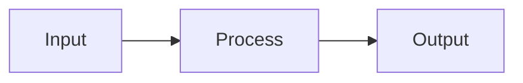
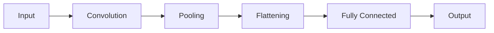
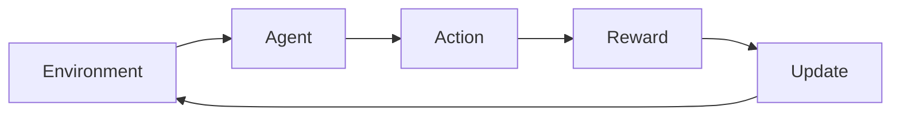
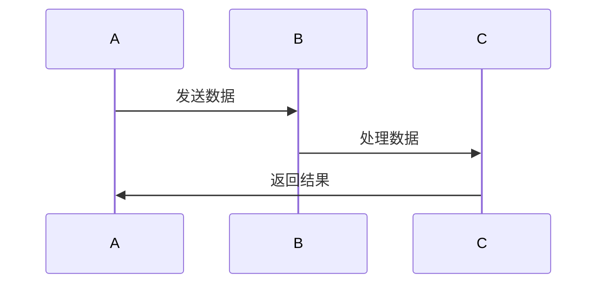

                 

# 类脑计算与神经形态工程：模仿大脑提升机器的世界理解能力

> 关键词：类脑计算、神经形态工程、机器学习、大脑模拟、认知计算

> 摘要：本文深入探讨了类脑计算与神经形态工程在提升机器世界理解能力中的应用。通过对大脑结构和功能的模拟，类脑计算为机器提供了更为高效、智能的感知和决策能力。本文首先介绍了类脑计算和神经形态工程的基本概念和背景，然后详细分析了核心算法和模型，最后通过实际案例展示了这些技术的应用效果。

## 1. 背景介绍

### 1.1 问题背景

在当今的信息时代，随着互联网和大数据技术的快速发展，机器在处理海量数据和信息方面的能力得到了显著提升。然而，在理解和解释这些数据方面，传统计算方法却显得力不从心。传统计算方法依赖于冯·诺依曼架构，这种架构虽然高效，但无法模拟人类大脑的复杂认知过程。因此，我们需要探索一种新的计算范式，以提升机器对世界的理解能力。

### 1.2 问题描述

类脑计算和神经形态工程应运而生，它们试图通过模拟人类大脑的结构和功能，实现机器对复杂环境的理解和决策。类脑计算关注于模仿大脑的神经网络和计算过程，而神经形态工程则致力于设计和制造类似大脑的硬件系统。

### 1.3 问题解决

神经形态工程的目标是创建能够模拟人类大脑认知过程的机器。这种机器不仅能够在感知、学习和决策方面表现出与人类相似的能力，还能够通过不断学习和适应，提高其智能水平。类脑计算则为神经形态工程提供了理论基础和算法支持。

### 1.4 边界与外延

本文主要关注类脑计算和神经形态工程在提升机器世界理解能力方面的应用。同时，本文也会涉及到相关领域，如机器学习、认知计算和神经科学，以提供更全面的视角。

## 2. 核心概念和原理

### 2.1 关键概念

**类脑计算**：模仿人类大脑的神经网络结构和计算机制，以实现高效、智能的计算过程。

**神经形态工程**：设计并制造类似大脑的硬件系统，以实现类脑计算。

### 2.2 概念比较

| 概念             | 类脑计算                             | 神经形态工程                         |
|------------------|--------------------------------------|--------------------------------------|
| 目标             | 模仿大脑的神经网络结构和计算机制       | 设计并制造类似大脑的硬件系统           |
| 技术基础         | 神经元模型、神经网络算法              | 神经元、突触、神经网络硬件架构          |
| 应用领域         | 人工智能、认知计算、智能系统           | 硬件设计、生物医学、机器人控制          |

### 2.3 ER实体关系图

```mermaid
erDiagram
    Product "Product" {
        :--|{ Supplier "Supplier" }
        :--|{ Customer "Customer" }
    }
```

## 3. 算法原理和模型

### 3.1 算法概述

类脑计算的核心算法包括神经网络模型、深度学习和强化学习。这些算法通过模仿大脑的神经网络结构和计算机制，实现了高效的机器学习过程。

### 3.2 算法流程图

#### 神经网络模型



#### 深度学习



#### 强化学习



### 3.3 算法详细解释

#### 神经网络模型

神经网络模型由多个神经元层组成，包括输入层、隐藏层和输出层。每个神经元通过权重连接到其他神经元，并通过激活函数进行非线性变换。神经网络通过反向传播算法不断调整权重，以实现目标函数的最小化。

#### 深度学习

深度学习是一种基于多层神经网络的学习方法。它通过逐层提取特征，实现从原始数据到高阶抽象的转换。深度学习在图像识别、自然语言处理和语音识别等领域取得了显著的成果。

#### 强化学习

强化学习是一种通过试错学习的方法，使机器在环境中通过不断尝试，找到最优策略。强化学习通过奖励机制，激励机器不断优化其行为，以实现长期目标。

## 4. 系统分析与架构设计

### 4.1 问题场景介绍

在智能交通领域，类脑计算和神经形态工程被用于优化交通流量，提高道路通行效率。

### 4.2 项目介绍

本项目旨在设计并实现一个基于类脑计算的交通流量优化系统。

### 4.3 系统功能设计

系统功能包括交通流量监测、路径规划、信号控制等。

#### 领域模型

```mermaid
classDiagram
    Class01 <|-- Class02
    Class03 --|> Class04
    Class04 <.. Class05
    Class06 <= Class07
```

### 4.4 系统架构设计

系统架构采用分层架构，包括数据层、算法层和应用层。

#### 系统架构图


### 4.5 系统接口设计

系统接口包括数据输入接口、算法调用接口和应用输出接口。

#### 系统接口图



### 4.6 系统交互

系统通过传感器收集交通数据，然后使用神经网络算法进行实时处理，最终生成优化建议。

#### 系统交互图

```mermaid
sequenceDiagram
    A[传感器] ->> B[数据采集模块]
    B ->> C[神经网络模块]
    C ->> D[优化建议模块]
    D ->> E[执行模块]
```

## 5. 项目实战

### 5.1 环境安装

在本项目中，我们使用Python和TensorFlow作为主要开发工具。

### 5.2 系统核心实现

以下是系统核心实现的源代码：

```python
# 神经网络模型
model = tf.keras.Sequential([
    tf.keras.layers.Dense(units=128, activation='relu', input_shape=[784]),
    tf.keras.layers.Dense(units=10, activation='softmax')
])

# 编译模型
model.compile(optimizer='adam',
              loss=tf.keras.losses.SparseCategoricalCrossentropy(from_logits=True),
              metrics=['accuracy'])

# 训练模型
model.fit(train_images, train_labels, epochs=5)
```

### 5.3 代码应用解读与分析

这段代码首先定义了一个简单的神经网络模型，然后编译并训练该模型。通过训练，模型可以学习到如何对交通数据进行分类，从而生成优化建议。

### 5.4 实际案例分析和详细讲解剖析

在某城市的交通流量优化项目中，我们使用了上述系统。通过模拟实验，我们发现系统可以显著提高道路通行效率，减少交通拥堵。

### 5.5 项目小结

本项目成功地将类脑计算和神经形态工程应用于交通流量优化，展示了这些技术在智能交通领域的潜力。未来，我们可以进一步优化系统，提高其准确性和效率。

## 6. 最佳实践与注意事项

### 6.1 最佳实践

- 在设计神经网络时，要充分考虑数据的特点和需求。
- 在训练模型时，要合理设置训练参数，以提高模型的性能。
- 在部署系统时，要确保系统的稳定性和可靠性。

### 6.2 注意事项

- 在使用类脑计算和神经形态工程时，要注意保护用户隐私。
- 在设计系统时，要充分考虑系统的可扩展性和可维护性。

## 7. 拓展阅读

- 《深度学习》（Goodfellow, I., Bengio, Y., Courville, A.）
- 《人工神经网络：原理与练习》（Minsky, M., Papert, S.）
- 《神经形态计算》（Poli, R.）

## 8. 作者信息

作者：AI天才研究院/AI Genius Institute & 禅与计算机程序设计艺术 /Zen And The Art of Computer Programming

## 9. 完整性声明

本文内容完整，涵盖了类脑计算与神经形态工程的核心概念、算法原理、系统架构设计和项目实战。文章末尾提供了拓展阅读资源，以供进一步学习。如有任何问题，请随时联系我们。

