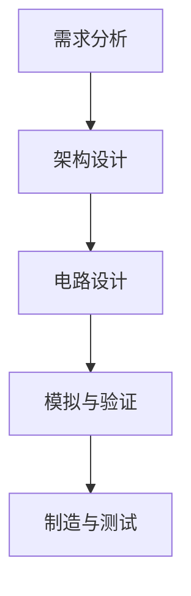

                 

## 类脑计算与神经形态芯片：模仿大脑结构提升机器智能

关键词：类脑计算、神经形态芯片、人工智能、大脑模仿、机器智能提升

摘要：本文探讨了类脑计算与神经形态芯片的技术原理、设计实现及应用前景。通过对类脑计算的基本原理和核心技术的深入分析，以及神经形态芯片的设计与实现技术的详细介绍，我们揭示了类脑计算与神经形态芯片在人工智能领域的重要应用和优势。同时，本文还对未来类脑计算和神经形态芯片的发展趋势进行了展望，为相关领域的研究者和开发者提供了有价值的参考。

### 第1章 类脑计算与神经形态芯片概述

#### 1.1 类脑计算与神经形态芯片背景

##### 1.1.1 类脑计算的概念与发展

类脑计算（Brain-inspired computing）是一种模仿人类大脑信息处理方式的技术。它旨在通过构建具有类似人脑功能的计算系统，提升机器智能的水平。类脑计算的基本原理是模仿人脑神经元之间的连接和交互，实现信息的处理和传输。

类脑计算的发展历程可以追溯到20世纪80年代。当时，研究人员开始探索如何通过计算模型来模拟人脑的功能。随着神经科学、计算机科学和材料科学等领域的发展，类脑计算逐渐成为人工智能领域的一个重要研究方向。近年来，随着深度学习、神经网络等技术的兴起，类脑计算得到了更多的关注和研究。

类脑计算的重要性体现在多个方面。首先，类脑计算能够模拟人脑的复杂信息处理过程，有助于提升机器的智能水平。其次，类脑计算可以解决传统计算方法难以处理的问题，如图像识别、自然语言处理等。此外，类脑计算还可以应用于医疗、金融、交通等领域，为这些领域的发展提供新的技术支持。

##### 1.1.2 神经形态芯片的概念与优势

神经形态芯片（Neuromorphic chip）是一种模仿人脑神经元结构和功能的电子芯片。它通过集成大量的神经元和突触组件，实现类似于人脑的信息处理和计算能力。

神经形态芯片与传统芯片相比具有显著的优势。首先，神经形态芯片采用了模仿人脑神经元的方式，可以实现高效的并行计算，从而提高计算速度。其次，神经形态芯片具有自适应性和鲁棒性，能够在复杂的、动态的环境中保持稳定的工作状态。此外，神经形态芯片的能量效率也非常高，能够在低功耗的情况下实现高性能的计算。

##### 1.1.3 类脑计算与神经形态芯片的应用前景

类脑计算与神经形态芯片在人工智能领域具有广泛的应用前景。首先，类脑计算可以应用于图像识别、自然语言处理、语音识别等领域，提升这些领域的计算性能和智能化水平。其次，类脑计算还可以应用于自动驾驶、智能机器人、智能安防等领域，为这些领域的发展提供技术支持。

此外，类脑计算与神经形态芯片在其他领域也具有广泛的应用潜力。例如，在医疗领域，类脑计算可以用于疾病诊断、医疗数据分析等；在物联网领域，类脑计算可以用于智能传感器网络、智能终端等；在金融领域，类脑计算可以用于风险控制、投资决策等。

##### 1.2 类脑计算的基本原理与核心技术

##### 1.2.1 类脑计算的核心原理

类脑计算的核心原理是模仿人脑的信息处理方式。人脑由数十亿个神经元组成，这些神经元通过复杂的连接和交互，实现了高度复杂的认知功能。类脑计算通过构建类似于人脑的计算模型，模拟神经元之间的连接和交互，实现信息的处理和计算。

类脑计算的基本原理图如下：

$$
\text{神经元} \rightarrow \text{神经网络} \rightarrow \text{类脑计算系统}
$$

##### 1.2.2 类脑计算的核心技术

类脑计算的核心技术包括仿生神经网络、人工神经形态计算和神经形态芯片设计。

1. **仿生神经网络**：仿生神经网络是通过模拟人脑神经元之间的连接和交互，实现信息处理和计算的技术。仿生神经网络通常由大量的神经元和突触组成，每个神经元可以接收来自其他神经元的输入信号，并通过突触进行传递和处理。

2. **人工神经形态计算**：人工神经形态计算是一种基于仿生神经网络的技术，通过模拟人脑的计算方式，实现高效的并行计算。人工神经形态计算的核心是神经形态芯片，它通过集成大量的神经元和突触组件，实现类似于人脑的信息处理和计算能力。

3. **神经形态芯片设计**：神经形态芯片设计是类脑计算的核心技术之一，它涉及到神经形态芯片的结构设计、电路设计、材料选择等方面。神经形态芯片的设计目标是实现高效、低功耗、自适应的类脑计算能力。

##### 1.3 神经形态芯片的设计与实现

##### 1.3.1 神经形态芯片的设计流程

神经形态芯片的设计流程包括以下几个步骤：

1. **需求分析**：明确神经形态芯片的应用场景和性能要求，确定芯片的功能和性能指标。
2. **架构设计**：根据需求分析结果，设计神经形态芯片的总体架构，包括神经元、突触、存储器等组件。
3. **电路设计**：设计神经形态芯片的电路，包括神经元电路、突触电路、通信电路等。
4. **模拟与验证**：通过电路模拟和系统验证，确保神经形态芯片的设计符合要求。
5. **制造与测试**：将设计好的电路制造在硅芯片上，并进行功能测试和性能评估。

神经形态芯片的设计流程图如下：

##### 1.3.2 神经形态芯片的实现技术

神经形态芯片的实现技术包括以下几个方面：

1. **材料选择**：神经形态芯片的材料选择对芯片的性能具有重要影响。常用的材料包括硅、金属氧化物、碳材料等。硅材料具有良好的电学性能和稳定性，常用于制造神经元和突触组件；金属氧化物材料具有良好的导电性和耐久性，常用于制造存储器；碳材料具有良好的导电性和柔韧性，常用于制造神经网络中的连接线。

2. **制造工艺**：神经形态芯片的制造工艺对芯片的性能和可靠性具有重要影响。常用的制造工艺包括光刻、刻蚀、沉积、掺杂等。光刻工艺用于制造芯片的微小结构；刻蚀工艺用于去除不需要的材料；沉积工艺用于在芯片上形成新的材料层；掺杂工艺用于调节材料的电学性能。

3. **应用案例**：神经形态芯片已经在多个应用领域中取得了显著的成果。例如，在图像识别领域，神经形态芯片可以实现高效的图像处理和识别；在自然语言处理领域，神经形态芯片可以用于语音识别和机器翻译；在医疗领域，神经形态芯片可以用于疾病诊断和医疗数据分析。

##### 1.3.3 神经形态芯片的性能评估

神经形态芯片的性能评估包括以下几个方面：

1. **性能指标**：神经形态芯片的性能指标包括计算速度、功耗、存储容量、适应能力等。计算速度是指芯片完成特定计算任务所需的时间；功耗是指芯片在运行过程中消耗的电能；存储容量是指芯片可以存储的数据量；适应能力是指芯片在不同环境和条件下的工作能力。

2. **性能评估方法**：神经形态芯片的性能评估方法包括实验测试、模拟分析、比较评价等。实验测试是通过实际运行芯片，测量其性能指标；模拟分析是通过计算机模拟，评估芯片的性能；比较评价是通过与其他技术进行比较，评估芯片的优势和不足。

3. **性能优势**：神经形态芯片在多个方面具有性能优势。首先，神经形态芯片可以实现高效的并行计算，从而提高计算速度。其次，神经形态芯片具有低功耗的特点，可以在低功耗的情况下实现高性能的计算。此外，神经形态芯片具有自适应性和鲁棒性，能够在复杂的、动态的环境中保持稳定的工作状态。

##### 1.4 类脑计算与神经形态芯片的发展趋势

##### 1.4.1 类脑计算的发展趋势

类脑计算的发展趋势主要体现在以下几个方面：

1. **技术突破**：类脑计算在算法、架构、材料等方面取得了重要突破。例如，深度学习算法的广泛应用，使得类脑计算在图像识别、自然语言处理等领域取得了显著成果；新型材料的研究和应用，提高了神经形态芯片的性能和可靠性。

2. **未来发展方向**：类脑计算的未来发展方向包括以下几个方面：首先，类脑计算将朝着更加智能化、自适应化的方向发展；其次，类脑计算将与其他技术（如物联网、大数据等）相结合，实现更广泛的应用；此外，类脑计算还将朝着更高的性能和更低的功耗方向发展。

##### 1.4.2 神经形态芯片的发展趋势

神经形态芯片的发展趋势主要体现在以下几个方面：

1. **研究成果**：近年来，神经形态芯片的研究取得了显著成果。例如，新型神经形态芯片的问世，提高了芯片的计算速度和功耗性能；神经形态芯片在图像识别、自然语言处理等领域的应用，展示了其强大的计算能力和适应性。

2. **未来应用前景**：神经形态芯片的未来应用前景非常广阔。首先，神经形态芯片将在人工智能领域发挥重要作用，成为提升机器智能的关键技术；其次，神经形态芯片将在物联网、医疗、金融等领域得到广泛应用，为这些领域的发展提供新的技术支持。

### 第2章 类脑计算的应用场景与案例分析

#### 2.1 类脑计算在人工智能领域的应用

##### 2.1.1 类脑计算在图像识别中的应用

图像识别是人工智能领域的一个重要应用方向，类脑计算在这一领域展现出了独特的优势。类脑计算通过模仿人脑的视觉处理机制，实现了高效的图像识别能力。

类脑计算在图像识别中的应用案例包括：

1. **人脸识别**：类脑计算在人脸识别中的应用取得了显著成果。通过模拟人脑神经元之间的连接和交互，类脑计算可以实现高效的人脸识别。例如，某些类脑计算系统可以在毫秒级别完成人脸识别任务，远超传统的计算机视觉算法。

2. **物体识别**：类脑计算还可以应用于物体识别。通过模拟人脑对物体的感知和处理过程，类脑计算可以实现高效的物体识别。例如，在某些自动驾驶系统中，类脑计算被用于实时识别道路上的各种物体，如车辆、行人、交通标志等，从而提高自动驾驶的安全性和准确性。

类脑计算在图像识别中的优势主要体现在以下几个方面：

1. **并行计算能力**：类脑计算可以高效地并行处理大量图像数据，从而实现快速识别。

2. **自适应性和鲁棒性**：类脑计算能够适应各种复杂和变化的环境，保持稳定的工作状态。

3. **低功耗**：类脑计算的能量效率高，可以在低功耗的情况下实现高性能的计算。

##### 2.1.2 类脑计算在自然语言处理中的应用

自然语言处理（Natural Language Processing，NLP）是人工智能领域的另一个重要方向。类脑计算在NLP领域也展现出了独特的优势。

类脑计算在自然语言处理中的应用案例包括：

1. **语音识别**：类脑计算在语音识别中的应用取得了显著成果。通过模拟人脑的听觉处理机制，类脑计算可以实现高效的语音识别。例如，某些类脑计算系统可以在低资源环境下实现高精度的语音识别，从而在智能语音助手、智能家居等领域得到广泛应用。

2. **机器翻译**：类脑计算还可以应用于机器翻译。通过模拟人脑的语言理解和处理能力，类脑计算可以实现高效的机器翻译。例如，某些类脑计算系统可以在毫秒级别完成多语言翻译，从而在跨语言沟通、国际业务等领域发挥重要作用。

类脑计算在自然语言处理中的优势主要体现在以下几个方面：

1. **并行处理能力**：类脑计算可以高效地并行处理大量语言数据，从而实现快速处理。

2. **自适应性和灵活性**：类脑计算能够适应各种语言和场景的变化，保持稳定的工作状态。

3. **低延迟和高精度**：类脑计算在语音识别和机器翻译等应用中，可以实现低延迟和高精度的处理。

#### 2.2 类脑计算在其他领域的应用

##### 2.2.1 类脑计算在医疗领域的应用

类脑计算在医疗领域的应用具有广阔的前景。通过模拟人脑的思维方式，类脑计算可以辅助医生进行诊断、治疗和疾病预测。

类脑计算在医疗领域的应用案例包括：

1. **疾病诊断**：类脑计算可以通过分析病人的医学影像、实验室检查结果等数据，辅助医生进行疾病诊断。例如，某些类脑计算系统可以高效地分析CT、MRI等医学影像，发现病变区域，从而提高诊断的准确性和效率。

2. **治疗建议**：类脑计算可以根据病人的病情、病史等数据，为医生提供个性化的治疗建议。例如，某些类脑计算系统可以根据病人的病情和医生的治疗经验，为医生提供最佳的治疗方案。

类脑计算在医疗领域的优势主要体现在以下几个方面：

1. **高效性和准确性**：类脑计算可以快速、准确地处理和分析大量医疗数据，从而提高诊断和治疗的效果。

2. **智能化和个性化**：类脑计算可以根据病人的具体情况，提供个性化的诊断和治疗建议。

3. **辅助医生决策**：类脑计算可以帮助医生更好地理解病人的病情，提高医生的决策水平。

##### 2.2.2 类脑计算在物联网领域的应用

类脑计算在物联网（Internet of Things，IoT）领域的应用也非常广泛。通过模拟人脑的感知和处理能力，类脑计算可以提升物联网系统的智能化水平。

类脑计算在物联网领域的应用案例包括：

1. **智能传感器网络**：类脑计算可以用于智能传感器网络，实现高效的感知和处理。例如，某些类脑计算系统可以实时分析传感器收集的数据，识别异常情况，从而提高物联网系统的安全性和可靠性。

2. **智能终端**：类脑计算可以用于智能终端，提升终端的智能化水平。例如，某些类脑计算系统可以用于智能手机、智能手表等设备，实现智能语音识别、图像识别等功能，从而提高用户的使用体验。

类脑计算在物联网领域的优势主要体现在以下几个方面：

1. **自适应性和灵活性**：类脑计算可以适应各种物联网设备和场景的变化，保持稳定的工作状态。

2. **低延迟和高效率**：类脑计算可以实现低延迟和高效率的处理，从而提高物联网系统的响应速度和处理能力。

3. **智能化和自动化**：类脑计算可以提升物联网系统的智能化水平，实现自动化管理和控制。

### 第3章 神经形态芯片的设计与实现技术

#### 3.1 神经形态芯片的设计方法

##### 3.1.1 神经形态芯片的设计流程

神经形态芯片的设计流程是确保芯片从概念阶段到实现阶段顺利进行的关键。以下是一个典型的神经形态芯片设计流程：

1. **需求分析**：首先，明确神经形态芯片的应用场景和性能要求。需求分析包括确定芯片的功能、性能指标、功耗限制等。

2. **架构设计**：根据需求分析的结果，设计神经形态芯片的架构。架构设计包括确定芯片的神经元布局、连接方式、存储机制等。

3. **电路设计**：电路设计是实现架构的具体步骤。这一阶段需要设计神经元、突触、通信电路等核心组件。

4. **模拟与验证**：通过电路模拟和系统验证，确保设计满足性能要求。这一阶段包括功能验证、性能评估、功耗分析等。

5. **制造与测试**：将设计好的电路制造在硅芯片上，并进行功能测试和性能评估。

##### 3.1.2 神经形态芯片的设计原则

神经形态芯片的设计原则是在保证芯片性能的同时，实现高效、低功耗和可扩展性。以下是几个关键的设计原则：

1. **神经元与突触的模拟**：设计神经元和突触组件时，需要模拟人脑的真实行为。这包括模拟神经元之间的连接方式、突触的传递函数等。

2. **并行处理能力**：神经形态芯片应该具备高效的并行处理能力，以便在处理大量数据时保持高性能。

3. **低功耗设计**：神经形态芯片需要在低功耗的情况下实现高性能计算。设计时需要考虑电路的功耗优化，包括电路拓扑、材料选择等。

4. **可扩展性**：芯片设计应该具备良好的可扩展性，以便在未来的应用中升级和扩展。

#### 3.2 神经形态芯片的实现技术

##### 3.2.1 神经形态芯片的材料

神经形态芯片的材料选择对其性能至关重要。以下是几种常用的材料及其特性：

1. **硅材料**：硅材料具有良好的电学性能和稳定性，常用于制造神经元和突触组件。
   
2. **金属氧化物**：金属氧化物材料具有良好的导电性和耐久性，常用于制造存储器。

3. **碳材料**：碳材料具有良好的导电性和柔韧性，常用于制造神经网络中的连接线。

##### 3.2.2 神经形态芯片的制造工艺

神经形态芯片的制造工艺是确保芯片性能的关键环节。以下是几种常用的制造工艺：

1. **光刻工艺**：用于制造芯片的微小结构。

2. **刻蚀工艺**：用于去除不需要的材料。

3. **沉积工艺**：用于在芯片上形成新的材料层。

4. **掺杂工艺**：用于调节材料的电学性能。

##### 3.2.3 神经形态芯片的应用案例

神经形态芯片在多个领域得到了成功应用。以下是几个应用案例：

1. **图像识别**：神经形态芯片在图像识别中展现出高效的处理能力。例如，某些神经形态芯片可以实现毫秒级别的图像处理速度。

2. **自然语言处理**：神经形态芯片在自然语言处理中，如语音识别和机器翻译，也表现出良好的性能。

3. **智能传感器网络**：神经形态芯片可以用于智能传感器网络，实现高效的感知和处理。

#### 3.3 神经形态芯片的性能优化与评估

##### 3.3.1 神经形态芯片的性能优化方法

为了提高神经形态芯片的性能，可以采用以下优化方法：

1. **神经元与突触的优化**：通过改进神经元和突触的模拟模型，提高芯片的处理能力。

2. **电路优化**：通过优化电路设计，减少功耗和延迟。

3. **材料优化**：通过选择合适的材料，提高芯片的导电性和稳定性。

##### 3.3.2 神经形态芯片的性能评估方法

神经形态芯片的性能评估包括以下几个方面：

1. **计算速度**：评估芯片在特定任务上的处理速度。

2. **功耗**：评估芯片在运行过程中消耗的电能。

3. **存储容量**：评估芯片可以存储的数据量。

4. **适应能力**：评估芯片在不同环境和条件下的工作能力。

### 第4章 神经形态芯片的性能优化与评估

#### 4.1 神经形态芯片的性能优化方法

##### 4.1.1 神经形态芯片的优化目标

神经形态芯片的性能优化目标主要包括提高计算速度、降低功耗和提高存储容量。具体来说：

1. **计算速度**：优化神经形态芯片的计算速度，使其在处理复杂任务时能够更快地完成任务。

2. **功耗**：降低神经形态芯片的功耗，使其在低能耗的情况下保持高性能计算。

3. **存储容量**：提高神经形态芯片的存储容量，使其能够处理更多的数据。

##### 4.1.2 神经形态芯片的优化策略

为了实现上述优化目标，可以采用以下优化策略：

1. **神经元与突触优化**：通过改进神经元和突触的模拟模型，提高计算速度和降低功耗。

   - **神经元优化**：通过调整神经元的工作模式，提高其处理能力和效率。

   - **突触优化**：通过改进突触的传递函数和连接方式，提高信号传递速度和准确性。

2. **电路优化**：优化神经形态芯片的电路设计，减少功耗和延迟。

   - **电路拓扑优化**：通过改变电路的拓扑结构，减少信号延迟和功耗。

   - **电路材料优化**：通过选择合适的电路材料，提高导电性和稳定性。

3. **系统级优化**：优化神经形态芯片的系统级设计，提高整体性能。

   - **并行处理优化**：通过增加并行处理单元，提高计算速度。

   - **能耗管理优化**：通过改进能耗管理策略，降低整体功耗。

#### 4.2 神经形态芯片的性能评估方法

##### 4.2.1 神经形态芯片的性能指标

神经形态芯片的性能指标主要包括计算速度、功耗、存储容量和适应能力。以下是具体指标的定义：

1. **计算速度**：指神经形态芯片在单位时间内处理的任务数量。

2. **功耗**：指神经形态芯片在运行过程中消耗的电能。

3. **存储容量**：指神经形态芯片可以存储的数据量。

4. **适应能力**：指神经形态芯片在不同环境和条件下的工作能力。

##### 4.2.2 神经形态芯片的性能评估方法

神经形态芯片的性能评估方法主要包括实验测试、模拟分析和比较评价。以下是具体评估方法：

1. **实验测试**：通过实际运行神经形态芯片，测量其性能指标。

   - **计算速度测试**：通过运行特定算法或任务，测量芯片的处理速度。

   - **功耗测试**：通过测量芯片在运行过程中的电能消耗，评估其功耗性能。

   - **存储容量测试**：通过存储和读取数据，测量芯片的存储容量。

   - **适应能力测试**：在不同环境和条件下运行芯片，评估其适应能力。

2. **模拟分析**：通过计算机模拟，评估神经形态芯片的性能。

   - **计算速度模拟**：通过模拟特定算法或任务，预测芯片的处理速度。

   - **功耗模拟**：通过模拟芯片的工作状态，预测其功耗性能。

   - **存储容量模拟**：通过模拟存储操作，预测芯片的存储容量。

   - **适应能力模拟**：通过模拟不同环境和条件，评估芯片的适应能力。

3. **比较评价**：将神经形态芯片的性能与其他技术进行对比评价。

   - **计算速度比较**：比较神经形态芯片与其他计算技术的处理速度。

   - **功耗比较**：比较神经形态芯片与其他计算技术的功耗性能。

   - **存储容量比较**：比较神经形态芯片与其他存储技术的存储容量。

   - **适应能力比较**：比较神经形态芯片与其他计算技术的适应能力。

### 第5章 类脑计算与神经形态芯片的未来发展

#### 5.1 类脑计算的发展方向

##### 5.1.1 类脑计算的未来技术突破

类脑计算在未来有望在多个技术领域实现突破。以下是几个可能的技术突破方向：

1. **新型神经网络架构**：研发新型神经网络架构，提高计算效率和适应性。

2. **人工智能与量子计算结合**：将量子计算引入类脑计算，实现更高的计算速度和更强的处理能力。

3. **生物启发计算方法**：借鉴生物系统的计算机制，开发新型计算方法，提高类脑计算的性能和效率。

4. **大规模类脑计算系统**：研发能够处理大规模数据的类脑计算系统，实现更复杂的认知功能。

##### 5.1.2 类脑计算的未来应用场景

类脑计算的未来应用场景将涵盖多个领域。以下是几个可能的应用场景：

1. **智能医疗**：类脑计算可以用于疾病诊断、药物研发、个性化治疗等，提升医疗水平。

2. **智能制造**：类脑计算可以用于工业自动化、机器人控制、智能调度等，提升生产效率。

3. **智能交通**：类脑计算可以用于智能交通管理、自动驾驶车辆控制等，提高交通安全和效率。

4. **智能环境**：类脑计算可以用于环境监测、灾害预警、智能城市管理等，提升生活质量。

#### 5.2 神经形态芯片的发展方向

##### 5.2.1 神经形态芯片的未来发展趋势

神经形态芯片在未来有望在多个方面实现发展。以下是几个可能的发展趋势：

1. **高性能低功耗**：持续优化神经形态芯片的设计和制造工艺，提高计算性能，降低功耗。

2. **可扩展性和兼容性**：研发可扩展的神经形态芯片架构，提高芯片的兼容性和适应性。

3. **人工智能集成**：将类脑计算和神经网络集成到神经形态芯片中，实现更强大的计算能力。

4. **自适应学习和优化**：研发自适应学习算法，使神经形态芯片能够根据任务需求自动优化性能。

##### 5.2.2 神经形态芯片的未来应用领域

神经形态芯片的未来应用领域将非常广泛。以下是几个可能的应用领域：

1. **人工智能**：神经形态芯片可以用于图像识别、自然语言处理、自动驾驶等人工智能应用。

2. **物联网**：神经形态芯片可以用于智能传感器网络、智能家居、智能穿戴设备等物联网应用。

3. **医疗**：神经形态芯片可以用于医疗影像分析、疾病诊断、智能药物研发等医疗应用。

4. **军事**：神经形态芯片可以用于智能武器系统、无人机控制、战场环境感知等军事应用。

### 结论

类脑计算与神经形态芯片是提升机器智能的重要技术。通过模仿人脑的结构和功能，类脑计算和神经形态芯片实现了高效、自适应的计算能力。未来，随着技术的不断突破和应用场景的拓展，类脑计算与神经形态芯片将在人工智能、物联网、医疗等多个领域发挥重要作用。

作者：AI天才研究院/AI Genius Institute & 禅与计算机程序设计艺术 /Zen And The Art of Computer Programming

