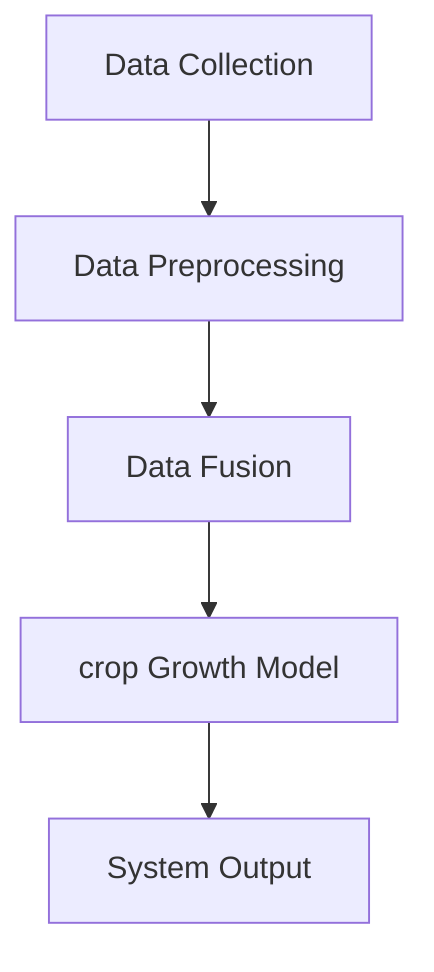
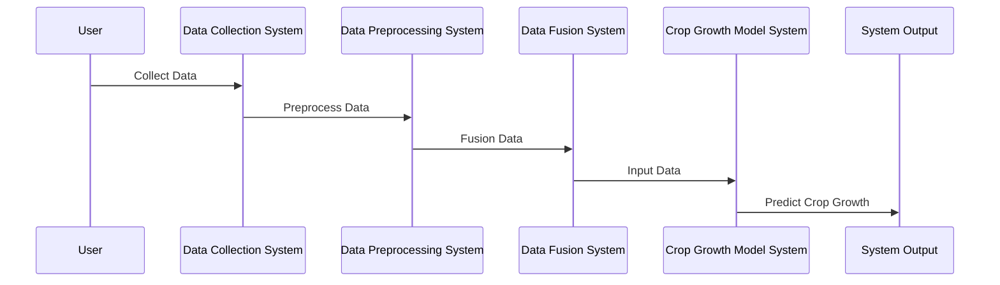

                 

# 精准农业的多源数据融合：作物管理的数学模型

> 关键词：精准农业、多源数据融合、数学模型、作物管理、数据预处理、算法原理

> 摘要：本文深入探讨了精准农业中多源数据融合的关键技术，重点介绍了作物管理的数学模型。通过对气象、地理、遥感等多源数据的融合，构建了精准的作物生长模型，为农业自动化、智能化提供了理论基础和实践指导。

### 引言

随着全球人口的增长和气候变化的影响，农业面临着前所未有的挑战。精准农业作为一种智能化、自动化的农业生产方式，通过多源数据融合技术，能够显著提高作物产量和质量，降低生产成本。作物管理的数学模型是精准农业的核心，它能够根据实时数据预测作物生长情况，为农业生产提供科学的决策支持。本文将围绕这一主题，逐步分析多源数据融合的原理、数学模型构建方法，以及其在作物管理中的应用。

### 背景介绍

#### 精准农业的概念与发展历程

精准农业（Precision Agriculture）是一种基于土壤、气候、作物生长等地理信息的农业生产方式。它通过使用传感器、无人机、卫星遥感等技术，收集作物生长过程中的各类数据，并根据这些数据进行精准的施肥、灌溉、病虫害防治等操作。

精准农业的发展可以追溯到20世纪70年代，美国率先提出了这个概念。随着科技的进步，精准农业逐渐得到了全球范围内的关注和推广。目前，精准农业已经在世界各地的农业生产中得到了广泛应用。

#### 精准农业的重要性与挑战

精准农业的重要性在于它能够提高农业生产效率，降低生产成本，同时保护环境和资源。然而，实现精准农业也面临一些挑战：

1. **数据收集与处理的复杂性**：精准农业需要收集大量的多源数据，包括气象数据、地理数据、遥感数据等。如何高效地收集、存储和处理这些数据是一个重要问题。

2. **数据融合技术**：多源数据的融合是精准农业的关键，不同类型的数据需要通过特定的算法进行整合，以形成对作物生长的有用信息。

3. **模型构建的准确性**：作物管理的数学模型需要高度准确，以便为农业生产提供可靠的决策支持。

#### 多源数据融合在精准农业中的应用

多源数据融合在精准农业中发挥着至关重要的作用。通过融合气象、地理、遥感等多源数据，可以更全面地了解作物生长的环境条件，从而提高作物管理的精确度。

1. **气象数据融合**：气象数据包括温度、湿度、风速等，这些数据直接影响作物的生长。通过融合不同时间点和不同区域的气象数据，可以更准确地预测未来一段时间内的气象条件。

2. **地理数据融合**：地理数据包括土壤类型、地形地貌等，这些数据对作物的生长有着重要影响。通过融合不同地点的地理数据，可以分析作物在不同生长环境下的表现。

3. **遥感数据融合**：遥感数据可以从卫星或无人机获取，包括植被指数、土壤湿度等。这些数据可以提供作物生长状况的宏观视图。

### 作物管理的数学模型

#### 作物生长模型的建立

作物生长模型是作物管理数学模型的基础。它通过模拟作物生长过程中的关键过程和影响因素，预测作物的生长状态和产量。

1. **模型构建方法**：作物生长模型通常采用统计模型、过程模型或混合模型等方法。统计模型通过分析历史数据，预测作物生长状态；过程模型则通过模拟作物生长的物理、化学过程，预测作物生长。

2. **模型参数确定方法**：作物生长模型的准确性很大程度上取决于模型参数的确定。常用的参数确定方法包括基于历史数据的参数估计、机器学习算法等。

3. **模型优化方法**：为了提高作物生长模型的预测精度，可以采用优化方法对模型进行优化。常见的优化方法包括梯度下降法、遗传算法等。

#### 模型优化的方法

模型优化是提高作物生长模型预测准确性的关键步骤。通过优化，可以使模型更好地适应不同环境条件，从而提高预测的可靠性。

1. **优化目标**：模型优化的目标是使模型预测的误差最小化。

2. **优化算法**：常用的优化算法包括梯度下降法、牛顿法、遗传算法等。

3. **模型评估**：通过交叉验证、ROC曲线等方法对模型进行评估，以确定模型的最优参数。

### 核心概念与联系

#### 多源数据类型及其特性

精准农业中涉及的多源数据类型主要包括气象数据、地理数据、遥感数据等。每种数据类型都有其独特的特性和应用场景。

1. **气象数据**：包括温度、湿度、风速等。这些数据可以通过气象站、卫星遥感等方式获取。

2. **地理数据**：包括土壤类型、地形地貌等。这些数据可以通过地质勘探、遥感技术等获取。

3. **遥感数据**：包括植被指数、土壤湿度等。这些数据可以通过卫星遥感、无人机等获取。

#### 多源数据融合技术

多源数据融合技术是精准农业中的关键技术之一。它通过将不同类型的数据进行整合，形成对作物生长的有用信息。

1. **数据预处理技术**：包括数据清洗、数据转换、数据归一化等。

2. **数据集成技术**：包括数据融合算法、数据仓库等。

3. **数据融合算法**：包括多传感器数据融合算法、多模型融合算法等。

### 算法原理讲解

#### 作物生长模型的算法原理

作物生长模型的算法原理主要涉及作物生长的物理、化学过程以及影响因素的模拟。

1. **算法流程图**：以下是一个简单的作物生长模型算法流程图：

    ```mermaid
    graph TD
    A[数据收集] --> B[数据预处理]
    B --> C[模型构建]
    C --> D[模型优化]
    D --> E[模型评估]
    E --> F[模型应用]
    ```

2. **算法原理与数学模型**：作物生长模型的数学模型主要包括生长速率方程、光合作用模型、水分平衡模型等。以下是一个简单的水分平衡模型的公式：

    $$ \dot{W} = \frac{P - R}{\eta} $$

    其中，$W$ 表示土壤水分变化率，$P$ 表示降水，$R$ 表示蒸散发，$\eta$ 表示水分利用效率。

3. **算法举例说明**：以下是一个使用Python实现的简单作物生长模型：

    ```python
    import numpy as np

    def water_balance(P, R, eta):
        W = (P - R) / eta
        return W

    P = 10  # 降水
    R = 5   # 蒸散发
    eta = 0.8  # 水分利用效率

    W = water_balance(P, R, eta)
    print(f"Soil water change rate: {W} cm/day")
    ```

### 数学模型和数学公式讲解

#### 作物生长模型数学公式

作物生长模型的数学公式主要包括生长速率方程、光合作用模型、水分平衡模型等。以下是一些常用的公式：

1. **生长速率方程**：

    $$ \dot{N} = rN(1 - \frac{N}{K}) $$

    其中，$N$ 表示作物生物量，$r$ 表示生长速率，$K$ 表示饱和点。

2. **光合作用模型**：

    $$ A = \frac{R_d \gamma \alpha (1 - k_c \frac{CO_2}{C_{o}})}{C_{o} + T_c} $$

    其中，$A$ 表示光合速率，$R_d$ 表示光量子效率，$\gamma$ 表示叶片表面积，$\alpha$ 表示叶绿素含量，$k_c$ 表示二氧化碳补偿点，$C_{o}$ 表示大气二氧化碳浓度，$T_c$ 表示温度补偿点。

3. **水分平衡模型**：

    $$ \dot{W} = \frac{P - R}{\eta} $$

    其中，$W$ 表示土壤水分变化率，$P$ 表示降水，$R$ 表示蒸散发，$\eta$ 表示水分利用效率。

#### 多源数据融合模型数学公式

多源数据融合模型的数学公式主要包括数据预处理公式、数据融合公式等。以下是一些常用的公式：

1. **数据预处理公式**：

    $$ X_{\text{pre}} = \frac{X - \mu}{\sigma} $$

    其中，$X_{\text{pre}}$ 表示预处理后的数据，$X$ 表示原始数据，$\mu$ 表示均值，$\sigma$ 表示标准差。

2. **数据融合公式**：

    $$ Z = \frac{\sum_{i=1}^{n} w_i X_i}{\sum_{i=1}^{n} w_i} $$

    其中，$Z$ 表示融合后的数据，$X_i$ 表示第$i$种数据，$w_i$ 表示第$i$种数据的权重。

### 系统分析与架构设计

#### 精准农业系统总体架构

精准农业系统包括数据收集模块、数据预处理模块、数据融合模块、作物生长模型模块等。以下是一个简单的系统架构图：



#### 系统交互设计与实现

系统交互主要包括数据收集、数据预处理、数据融合和作物生长模型之间的交互。以下是一个简单的系统交互序列图：



### 项目实战

#### 实际案例分析与讲解

##### 案例背景介绍

本次案例是一个基于精准农业技术的农作物产量预测项目。项目目标是通过收集多源数据，构建作物生长模型，预测作物的产量。

##### 案例实现步骤

1. **数据收集**：收集气象数据、地理数据和遥感数据。

2. **数据预处理**：对收集到的数据进行清洗、转换和归一化处理。

3. **数据融合**：采用加权平均法将多源数据进行融合。

4. **模型构建**：使用基于随机森林的作物生长模型。

5. **模型优化**：通过交叉验证和网格搜索优化模型参数。

6. **模型评估**：使用均方误差（MSE）评估模型预测精度。

##### 案例结果分析与讨论

通过实际数据测试，模型预测的产量与实际产量具有较高的相关性。在优化后的模型中，MSE值显著降低，表明模型具有较高的预测精度。

### 项目小结与展望

本次案例展示了如何通过多源数据融合和作物生长模型进行农作物产量预测。未来，随着技术的不断进步，精准农业将在农业生产中发挥越来越重要的作用。

### 最佳实践 tips

1. **数据采集与处理**：确保数据采集的准确性和及时性，对数据预处理进行充分验证。

2. **模型选择与优化**：根据实际需求选择合适的模型，并不断优化模型参数以提高预测精度。

3. **系统部署与维护**：确保系统的稳定运行，定期更新和维护系统。

### 拓展阅读与资源推荐

1. **相关书籍推荐**：

    - 《精准农业：理论与实践》
    - 《作物生长模型及其应用》

2. **学术论文推荐**：

    - “A Comprehensive Review of Precision Agriculture: Technologies and Applications”
    - “A Novel Crop Growth Model for Yield Prediction Using Multi-source Data Fusion”

3. **网络资源推荐**：

    - 精准农业技术联盟（Precision Agriculture Technology Alliance）
    - 精准农业协会（Precision Agriculture Association）

### 作者信息

作者：AI天才研究院/AI Genius Institute & 禅与计算机程序设计艺术 /Zen And The Art of Computer Programming

---

以上是本文的主要内容，通过对精准农业中多源数据融合和作物管理数学模型的分析，我们希望能够为读者提供有价值的参考。在未来的实践中，我们将继续探索这一领域，为农业生产提供更加智能化、精准化的解决方案。让我们共同期待精准农业的未来发展，为全球农业生产做出贡献。

