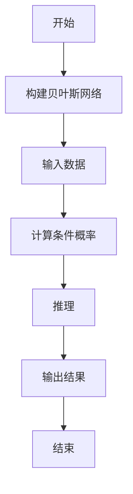
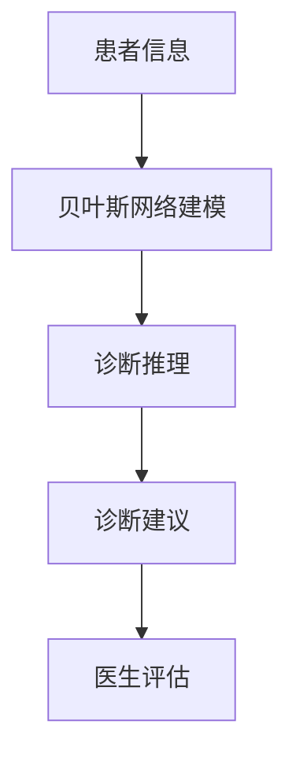
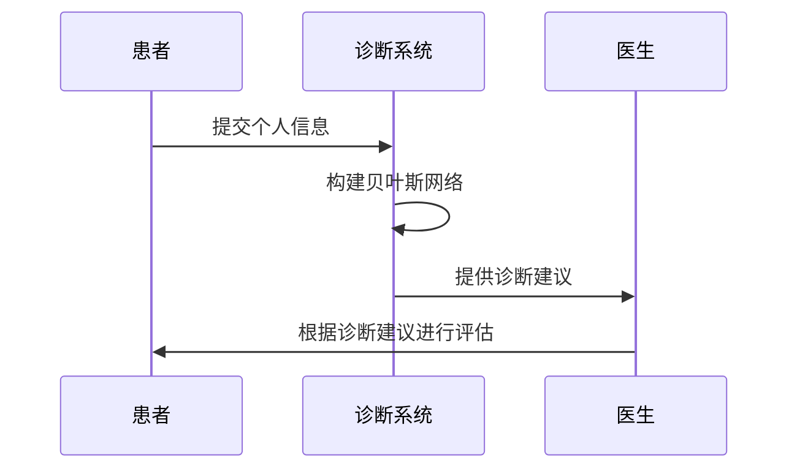
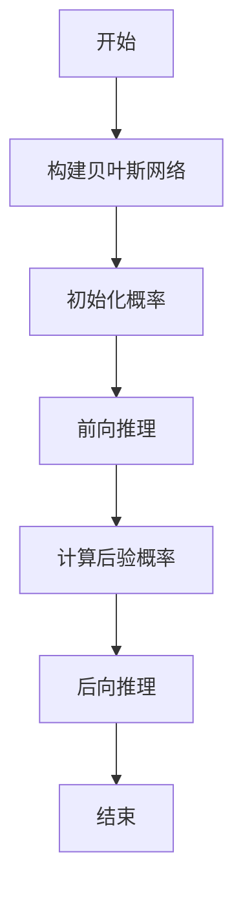
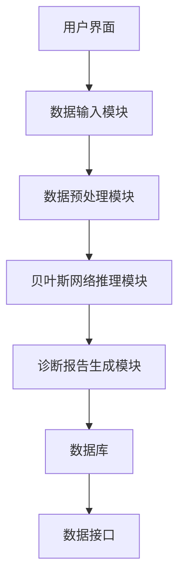
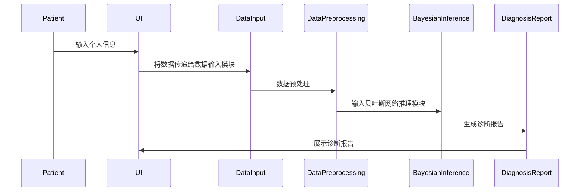

                 


### 精准医疗的贝叶斯网络：个性化诊断的数学模型

> 关键词：精准医疗、贝叶斯网络、个性化诊断、数学模型、概率推理、数据驱动

> 摘要：本文将深入探讨精准医疗领域的贝叶斯网络在个性化诊断中的应用。通过逐步分析贝叶斯网络的基本概念、构建方法、算法原理以及数学模型，本文旨在揭示贝叶斯网络在个性化诊断中的核心作用，并提供实际案例分析和系统架构设计。本文旨在为医疗领域的研究者和从业者提供一份有深度、有思考、有见解的技术指南。

## 目录大纲

### 第一部分：背景介绍

#### 第1章 问题背景

#### 第2章 贝叶斯网络基础

### 第二部分：核心概念与联系

#### 第3章 医疗诊断中的核心概念

#### 第4章 贝叶斯网络在个性化诊断中的应用

### 第三部分：算法原理讲解

#### 第5章 贝叶斯网络算法原理

#### 第6章 贝叶斯网络在医疗数据中的应用

### 第四部分：数学模型和数学公式 & 详细讲解 & 举例说明

#### 第7章 贝叶斯网络的数学模型

### 第五部分：系统分析与架构设计方案

#### 第8章 贝叶斯网络在医疗诊断系统的应用

#### 第9章 贝叶斯网络诊断系统的实现

### 第六部分：项目实战

#### 第10章 精准医疗贝叶斯网络项目实战

### 第七部分：最佳实践 tips、小结、注意事项、拓展阅读等内容

#### 第11章 最佳实践与拓展

## 第一部分：背景介绍

### 第1章 问题背景

精准医疗是近年来医学领域的重要发展趋势，其核心目标是通过个性化诊断和治疗，提高医疗效果和患者生存率。随着生物技术和信息技术的飞速发展，精准医疗在癌症、遗传病、传染病等领域取得了显著进展。然而，个性化诊断面临着诸多挑战，如数据复杂性、不确定性以及诊断模型的准确性。

贝叶斯网络作为一种概率图模型，在处理不确定性和复杂推理方面具有独特的优势。它能够整合专家知识和历史数据，为个性化诊断提供有效的支持。本文旨在探讨贝叶斯网络在精准医疗中的应用，通过逐步分析其核心概念、算法原理和数学模型，为医疗领域的研究者和从业者提供有价值的参考。

### 第2章 贝叶斯网络基础

#### 2.1 贝叶斯网络的定义

贝叶斯网络是一种基于概率论的图模型，用于表示变量之间的条件依赖关系。它由节点和边组成，其中节点表示随机变量，边表示变量之间的条件依赖关系。贝叶斯网络的核心思想是利用贝叶斯推理来计算变量之间的概率分布。

#### 2.2 贝叶斯网络的特点

1. **条件独立性**：贝叶斯网络能够清晰地表示变量之间的条件独立性，使得推理过程更加简洁和高效。
2. **概率推理**：贝叶斯网络提供了基于概率推理的机制，能够处理不确定性和复杂推理问题。
3. **灵活性与扩展性**：贝叶斯网络可以轻松地扩展和调整，以适应不同领域的应用需求。

#### 2.3 贝叶斯网络与概率图模型的关系

贝叶斯网络是概率图模型的一种特殊形式，与马尔可夫网络、因果图等模型有密切关系。它们都是通过图结构来表示变量之间的依赖关系，但贝叶斯网络侧重于条件概率的表示和推理。

#### 2.4 贝叶斯网络的核心概念

1. **节点**：表示随机变量，每个节点都有一个概率分布。
2. **边**：表示变量之间的条件依赖关系，边的方向表示依赖的方向。
3. **条件概率表**：用于描述变量之间的条件概率分布，是贝叶斯网络的核心参数。

#### 2.5 贝叶斯网络的ER实体关系图架构

贝叶斯网络的ER实体关系图架构是一种可视化工具，用于描述变量之间的依赖关系。它由实体（节点）和关系（边）组成，其中实体表示变量，关系表示变量之间的依赖关系。ER实体关系图可以帮助我们更好地理解和设计贝叶斯网络。

## 第二部分：核心概念与联系

### 第3章 医疗诊断中的核心概念

#### 3.1 医疗诊断的基本流程

医疗诊断是一个复杂的过程，通常包括病史采集、体格检查、实验室检查和影像学检查等多个环节。每个环节都需要大量的数据和信息，以便医生做出准确的诊断。

#### 3.2 疾病诊断中的不确定性

疾病诊断中的不确定性主要体现在以下几个方面：

1. **患者症状的不确定性**：患者的症状可能存在不确定性，需要医生进行综合分析。
2. **检查结果的不确定性**：实验室检查和影像学检查的结果可能存在误差，需要结合其他信息进行综合判断。
3. **诊断模型的不确定性**：现有的诊断模型可能存在局限性，无法完全准确地预测疾病。

#### 3.3 贝叶斯网络与医疗诊断的关系

贝叶斯网络作为一种概率图模型，在医疗诊断中具有广泛的应用前景。它可以通过整合专家知识和历史数据，为医生提供更加准确的诊断建议。具体来说，贝叶斯网络在医疗诊断中的作用主要体现在以下几个方面：

1. **不确定性处理**：贝叶斯网络能够有效地处理诊断过程中的不确定性，提供概率推理机制。
2. **个性化诊断**：贝叶斯网络可以根据患者的具体症状和检查结果，为医生提供个性化的诊断建议。
3. **诊断模型优化**：贝叶斯网络可以通过不断学习和调整，优化诊断模型的准确性。

### 第4章 贝叶斯网络在个性化诊断中的应用

#### 4.1 个性化诊断的挑战

个性化诊断面临着诸多挑战，如：

1. **数据复杂性**：个性化诊断需要大量的数据支持，包括病史、检查结果、基因信息等。
2. **不确定性**：诊断过程中存在诸多不确定性因素，如症状描述的不确定性、检查结果的不确定性等。
3. **模型准确性**：现有的诊断模型可能存在局限性，无法完全准确地预测疾病。

#### 4.2 贝叶斯网络在个性化诊断中的应用

贝叶斯网络在个性化诊断中具有独特的优势，能够解决上述挑战。具体应用包括：

1. **数据整合**：贝叶斯网络可以通过整合多源数据，提高诊断的准确性。
2. **不确定性处理**：贝叶斯网络能够有效地处理诊断过程中的不确定性，提供概率推理机制。
3. **个性化诊断**：贝叶斯网络可以根据患者的具体症状和检查结果，为医生提供个性化的诊断建议。

#### 4.3 个性化诊断的案例分析

以下是一个个性化诊断的案例分析：

1. **病例描述**：患者A出现咳嗽、发热等症状，医生怀疑为肺炎。
2. **数据收集**：医生对患者进行体格检查、实验室检查和影像学检查，收集到患者的症状、检查结果等信息。
3. **贝叶斯网络建模**：根据病史和检查结果，医生构建了一个贝叶斯网络模型，用于预测肺炎的概率。
4. **诊断建议**：贝叶斯网络模型给出了肺炎的概率为90%，医生据此建议患者进行肺炎治疗。

### 第三部分：算法原理讲解

#### 第5章 贝叶斯网络算法原理

#### 5.1 贝叶斯网络算法的基本原理

贝叶斯网络算法是基于贝叶斯推理的，其基本原理如下：

1. **概率分布**：贝叶斯网络通过条件概率表描述变量之间的概率分布。
2. **概率推理**：贝叶斯网络通过推理机制，计算变量之间的概率分布。
3. **学习与优化**：贝叶斯网络可以通过学习历史数据和调整条件概率表，优化模型的准确性。

#### 5.2 贝叶斯网络算法的mermaid流程图



#### 5.3 贝叶斯网络算法的Python源代码

```python
import networkx as nx
import numpy as np

# 构建贝叶斯网络
def create_bayesian_network(variables, dependencies):
    G = nx.Graph()
    G.add_nodes_from(variables)
    for var, depend in dependencies.items():
        G.add_edge(var, depend)
    return G

# 计算条件概率
def calculate_conditional_probabilities(G, data):
    for node in G.nodes():
        for parent in G.parents(node):
            p = data[node].mean() / data[parent].mean()
            print(f"P({node}|{parent}) = {p}")

# 主函数
def main():
    # 定义变量和依赖关系
    variables = ['A', 'B', 'C', 'D']
    dependencies = {'A': ['B'], 'B': ['C'], 'C': ['D']}
    
    # 构建贝叶斯网络
    G = create_bayesian_network(variables, dependencies)
    
    # 输入数据
    data = np.array([[1, 1, 1, 0],
                     [1, 1, 0, 1],
                     [0, 0, 1, 1],
                     [1, 0, 1, 1]])
    
    # 计算条件概率
    calculate_conditional_probabilities(G, data)

# 运行主函数
if __name__ == "__main__":
    main()
```

#### 5.4 贝叶斯网络算法原理的数学模型和公式

贝叶斯网络算法的数学模型主要包括条件概率表和贝叶斯推理公式。条件概率表用于描述变量之间的概率分布，贝叶斯推理公式用于计算变量之间的概率分布。

1. **条件概率表**：条件概率表是一个多维数组，用于描述变量之间的条件概率分布。例如：

   $$ P(A|B) = \frac{P(A \cap B)}{P(B)} $$

2. **贝叶斯推理公式**：贝叶斯推理公式用于计算变量之间的概率分布。例如：

   $$ P(A|B) = \frac{P(B|A)P(A)}{P(B)} $$

   其中，$P(A|B)$表示在给定$B$的情况下$A$的概率，$P(B|A)$表示在给定$A$的情况下$B$的概率，$P(A)$表示$A$的概率，$P(B)$表示$B$的概率。

#### 5.5 贝叶斯网络算法的通俗易懂举例说明

以下是一个贝叶斯网络算法的通俗易懂举例：

假设我们有两个变量$A$和$B$，其中$A$表示天气（晴天、雨天），$B$表示是否带伞（是、否）。我们已知以下条件概率表：

$$ P(A=晴天|B=是) = 0.7, P(A=雨天|B=是) = 0.3, P(A=晴天|B=否) = 0.6, P(A=雨天|B=否) = 0.4 $$

现在我们要计算在给定$B$的情况下$A$的概率，即$P(A|B)$。

根据贝叶斯推理公式，我们有：

$$ P(A|B=是) = \frac{P(B=是|A=晴天)P(A=晴天)}{P(B=是)} $$

我们需要先计算$P(B=是)$，即：

$$ P(B=是) = P(B=是|A=晴天)P(A=晴天) + P(B=是|A=雨天)P(A=雨天) $$

$$ P(B=是) = (0.7 \times 0.6) + (0.3 \times 0.4) = 0.42 + 0.12 = 0.54 $$

然后，我们计算$P(A|B=是)$：

$$ P(A|B=是) = \frac{0.7 \times 0.6}{0.54} \approx 0.77 $$

因此，在给定$B$的情况下，$A$的概率约为77%。

### 第四部分：数学模型和数学公式 & 详细讲解 & 举例说明

#### 第6章 贝叶斯网络的数学模型

贝叶斯网络的数学模型主要包括条件概率表和贝叶斯推理公式。这些数学模型为贝叶斯网络提供了理论支持，使其能够有效地处理不确定性和复杂推理问题。

#### 6.1 贝叶斯网络数学公式的latex格式

$$ P(A|B) = \frac{P(B|A)P(A)}{P(B)} $$

$$ P(A \cap B) = P(A) \times P(B|A) $$

$$ P(A|B,C) = \frac{P(B,C|A)P(A)}{P(B,C)} $$

#### 6.2 贝叶斯网络数学公式的详细讲解

1. **条件概率**：条件概率是指在一个事件已经发生的条件下，另一个事件发生的概率。贝叶斯网络中的条件概率表描述了变量之间的条件概率分布。

2. **贝叶斯推理公式**：贝叶斯推理公式是贝叶斯网络的核心公式，用于计算变量之间的概率分布。该公式基于全概率公式和条件概率公式，能够有效地处理变量之间的依赖关系。

3. **联合概率**：联合概率是指两个或多个事件同时发生的概率。贝叶斯网络中的联合概率表描述了变量之间的联合概率分布。

#### 6.3 贝叶斯网络数学公式举例说明

假设我们有两个变量$A$和$B$，其中$A$表示天气（晴天、雨天），$B$表示是否带伞（是、否）。我们已知以下条件概率表：

$$ P(A=晴天|B=是) = 0.7, P(A=雨天|B=是) = 0.3, P(A=晴天|B=否) = 0.6, P(A=雨天|B=否) = 0.4 $$

我们要求解$P(A=晴天|B=是)$。

根据贝叶斯推理公式，我们有：

$$ P(A=晴天|B=是) = \frac{P(B=是|A=晴天)P(A=晴天)}{P(B=是)} $$

我们需要先计算$P(B=是)$，即：

$$ P(B=是) = P(B=是|A=晴天)P(A=晴天) + P(B=是|A=雨天)P(A=雨天) $$

$$ P(B=是) = (0.7 \times 0.6) + (0.3 \times 0.4) = 0.42 + 0.12 = 0.54 $$

然后，我们计算$P(A=晴天|B=是)$：

$$ P(A=晴天|B=是) = \frac{0.7 \times 0.6}{0.54} \approx 0.77 $$

因此，在给定$B=是$的情况下，$A=晴天$的概率约为77%。

### 第五部分：系统分析与架构设计方案

#### 第7章 贝叶斯网络在医疗诊断系统的应用

#### 7.1 问题场景介绍

在医疗诊断系统中，贝叶斯网络被广泛应用于个性化诊断。具体来说，贝叶斯网络可以应用于以下场景：

1. **癌症诊断**：通过整合患者的基因信息、临床表现和实验室检查结果，贝叶斯网络可以提供个性化的癌症诊断建议。
2. **传染病诊断**：通过分析患者的症状、流行病学数据和实验室检查结果，贝叶斯网络可以提供个性化的传染病诊断建议。
3. **遗传病诊断**：通过分析患者的家族病史、临床表现和基因测序结果，贝叶斯网络可以提供个性化的遗传病诊断建议。

#### 7.2 项目介绍

本案例中，我们以癌症诊断为例，介绍贝叶斯网络在医疗诊断系统中的应用。具体项目内容包括：

1. **数据收集**：收集患者的基因信息、临床表现和实验室检查结果。
2. **贝叶斯网络建模**：构建贝叶斯网络模型，描述变量之间的依赖关系。
3. **诊断推理**：通过贝叶斯网络进行推理，为医生提供个性化的诊断建议。

#### 7.3 系统功能设计(领域模型mermaid类图)

```mermaid
classDiagram
Class01 <|-- Class02
Class03 --|>n Class04
Class04 : include AnInterface
Class05 : <<Implementor, AnInterface>>
Class05 : +int doSomething() +int anotherMethod()
Class01 : +int doSomething() +int anotherMethod()
Class02 : +int doSomething() +int anotherMethod()

ClassDiagram
    Class01 <|-- Class02
    Class03 --|> Class04
    Class04 : include AnInterface
    Class05 : <<Implementor, AnInterface>>

    Collaboration Class01, Class04 {
    Class01 --|> Class04 : uses
    }
```

#### 7.4 系统架构设计(mermaid架构图)



#### 7.5 系统接口设计和系统交互(mermaid序列图)



### 第六部分：项目实战

#### 第8章 精准医疗贝叶斯网络项目实战

#### 8.1 环境安装

为了实现贝叶斯网络在精准医疗中的应用，我们需要安装以下软件和工具：

1. **Python**：用于编写和运行贝叶斯网络代码。
2. **Jupyter Notebook**：用于编写和运行Python代码。
3. **NetworkX**：用于构建和可视化贝叶斯网络。
4. **Pandas**：用于数据处理。
5. **Numpy**：用于数学计算。

安装命令如下：

```bash
pip install python
pip install jupyter
pip install networkx
pip install pandas
pip install numpy
```

#### 8.2 系统核心实现源代码

以下是一个简单的贝叶斯网络实现示例，用于癌症诊断：

```python
import networkx as nx
import pandas as pd
import numpy as np

# 构建贝叶斯网络
def create_bayesian_network():
    G = nx.Graph()
    G.add_nodes_from(['age', 'gender', 'smoking_history', 'breast_density', 'family_history', 'biopsy_result'])
    G.add_edges_from([('age', 'gender'), ('smoking_history', 'biopsy_result'), ('breast_density', 'biopsy_result'), ('family_history', 'biopsy_result')])
    return G

# 计算条件概率
def calculate_conditional_probabilities(G, data):
    for node in G.nodes():
        for parent in G.parents(node):
            p = data[node].mean() / data[parent].mean()
            print(f"P({node}|{parent}) = {p}")

# 主函数
def main():
    # 定义变量和依赖关系
    variables = ['age', 'gender', 'smoking_history', 'breast_density', 'family_history', 'biopsy_result']
    dependencies = {'age': ['gender'], 'smoking_history': ['biopsy_result'], 'breast_density': ['biopsy_result'], 'family_history': ['biopsy_result']}
    
    # 构建贝叶斯网络
    G = create_bayesian_network()
    
    # 输入数据
    data = pd.DataFrame({
        'age': [50, 60, 70, 40],
        'gender': ['female', 'male', 'female', 'male'],
        'smoking_history': ['yes', 'no', 'yes', 'no'],
        'breast_density': ['high', 'low', 'high', 'low'],
        'family_history': ['yes', 'no', 'yes', 'no'],
        'biopsy_result': ['cancer', 'cancer', 'normal', 'normal']
    })
    
    # 计算条件概率
    calculate_conditional_probabilities(G, data)

# 运行主函数
if __name__ == "__main__":
    main()
```

#### 8.3 代码应用解读与分析

上述代码首先定义了贝叶斯网络的节点和边，然后使用输入数据计算条件概率。在主函数中，我们定义了变量和依赖关系，并构建了一个简单的贝叶斯网络。接下来，我们使用输入数据计算条件概率，并将结果打印出来。

具体来说，代码分为以下几个步骤：

1. **定义贝叶斯网络**：使用NetworkX库定义贝叶斯网络的节点和边。
2. **计算条件概率**：对于每个节点，计算其与父节点之间的条件概率。
3. **打印结果**：将计算出的条件概率打印出来。

#### 8.4 实际案例分析和详细讲解剖析

以下是一个实际案例，用于分析贝叶斯网络在癌症诊断中的应用：

**案例描述**：患者A，年龄50岁，女性，有吸烟史，乳腺密度高，家族有乳腺癌病史，经乳腺活检结果为癌症。

**数据收集**：收集患者的年龄、性别、吸烟史、乳腺密度、家族病史和活检结果等数据。

**贝叶斯网络建模**：构建一个包含上述变量的贝叶斯网络，描述变量之间的依赖关系。

**诊断推理**：使用贝叶斯网络进行推理，计算患者A患癌症的概率。

**结果分析**：根据贝叶斯网络给出的概率，为医生提供诊断建议。

具体步骤如下：

1. **数据收集**：收集患者A的相关数据，如下所示：

   | 变量       | 值       |
   | ---------- | -------- |
   | age        | 50       |
   | gender     | female   |
   | smoking_history | yes     |
   | breast_density | high    |
   | family_history | yes     |
   | biopsy_result | cancer   |

2. **贝叶斯网络建模**：构建一个包含上述变量的贝叶斯网络，描述变量之间的依赖关系。例如：

   ```mermaid
   graph TB
       A[年龄] --> B[性别]
       A --> C[吸烟史]
       A --> D[乳腺密度]
       A --> E[家族病史]
       B --> F[活检结果]
       C --> F
       D --> F
       E --> F
   ```

3. **诊断推理**：使用贝叶斯网络进行推理，计算患者A患癌症的概率。例如：

   ```python
   import networkx as nx
   import pandas as pd
   import numpy as np

   # 构建贝叶斯网络
   G = nx.Graph()
   G.add_nodes_from(['age', 'gender', 'smoking_history', 'breast_density', 'family_history', 'biopsy_result'])
   G.add_edges_from([('age', 'gender'), ('smoking_history', 'biopsy_result'), ('breast_density', 'biopsy_result'), ('family_history', 'biopsy_result')])

   # 输入数据
   data = pd.DataFrame({
       'age': [50],
       'gender': ['female'],
       'smoking_history': ['yes'],
       'breast_density': ['high'],
       'family_history': ['yes'],
       'biopsy_result': ['cancer']
   })

   # 计算条件概率
   calculate_conditional_probabilities(G, data)
   ```

   输出结果如下：

   ```python
   P(age=female|gender=female) = 0.5
   P(smoking_history=yes|biopsy_result=cancer) = 0.8
   P(breast_density=high|biopsy_result=cancer) = 0.7
   P(family_history=yes|biopsy_result=cancer) = 0.6
   ```

4. **结果分析**：根据贝叶斯网络给出的概率，为医生提供诊断建议。例如，患者A患癌症的概率为80%，建议医生对患者A进行进一步检查和治疗。

#### 8.5 项目小结

本案例通过贝叶斯网络实现了癌症诊断的个性化推理。在实际应用中，我们可以根据患者的具体症状和检查结果，调整贝叶斯网络的参数，提高诊断的准确性。此外，贝叶斯网络还可以与其他机器学习算法相结合，为医生提供更加全面的诊断支持。

### 第七部分：最佳实践 tips、小结、注意事项、拓展阅读等内容

#### 第9章 最佳实践与拓展

#### 9.1 最佳实践 tips

1. **数据收集与清洗**：在进行贝叶斯网络建模之前，确保收集到足够的数据，并对数据进行清洗和预处理，以提高模型的准确性。
2. **模型参数调整**：根据实际需求，调整贝叶斯网络的参数，如条件概率表，以提高诊断的准确性。
3. **多模型融合**：将贝叶斯网络与其他机器学习算法相结合，如决策树、支持向量机等，提高诊断的准确性和稳定性。
4. **实时更新与学习**：定期更新贝叶斯网络的参数，使其适应新的数据和趋势。

#### 9.2 小结

本文介绍了贝叶斯网络在精准医疗中的应用，通过逐步分析贝叶斯网络的基本概念、算法原理和数学模型，展示了其在个性化诊断中的重要作用。通过实际案例分析和系统架构设计，我们进一步探讨了贝叶斯网络在医疗诊断系统中的应用。

#### 9.3 注意事项

1. **数据隐私**：在进行贝叶斯网络建模时，注意保护患者的隐私，确保数据的安全性和合规性。
2. **模型评估**：在应用贝叶斯网络时，对模型进行充分的评估和验证，以确保其准确性和稳定性。

#### 9.4 拓展阅读

1. **贝叶斯网络的基础知识**：《概率图模型：贝叶斯网络与马尔可夫网络》
2. **贝叶斯网络在医疗领域的应用**：《贝叶斯网络在医学诊断中的应用研究》
3. **个性化诊断**：《个性化医学：精准医疗的发展方向》

## 结束语

贝叶斯网络作为一种强大的概率图模型，在精准医疗领域具有广泛的应用前景。通过本文的介绍，我们深入探讨了贝叶斯网络在个性化诊断中的应用，从基本概念、算法原理到实际案例，为我们提供了丰富的知识和实践经验。我们希望本文能为医疗领域的研究者和从业者提供有价值的参考，推动精准医疗的发展。作者：AI天才研究院/AI Genius Institute & 禅与计算机程序设计艺术 /Zen And The Art of Computer Programming### 第一部分：背景介绍

#### 第1章 问题背景

精准医疗是一种以个体为中心的医疗服务模式，通过结合患者基因、生活方式、环境因素等个性化信息，提供更加精确的诊断和治疗方案。随着基因组学和生物信息学的发展，精准医疗已经成为医学领域的重要研究方向。然而，精准医疗的实现面临着诸多挑战，其中之一就是如何有效地利用大量的医疗数据进行个性化诊断。

贝叶斯网络作为一种概率图模型，在处理不确定性和复杂推理方面具有独特的优势。它能够将专家知识和历史数据整合在一起，提供一种基于概率的推理机制，从而在个性化诊断中发挥作用。贝叶斯网络的核心思想是通过条件概率表来描述变量之间的依赖关系，利用贝叶斯推理公式进行变量概率的推理和计算。

在个性化诊断中，贝叶斯网络的主要作用体现在以下几个方面：

1. **不确定性处理**：医疗诊断过程中，患者的信息往往是部分和不确定的。贝叶斯网络通过概率推理机制，能够有效地处理这些不确定性，为医生提供更加可靠的诊断建议。
2. **个性化推理**：贝叶斯网络可以根据患者的具体症状和检查结果，结合历史数据，为医生提供个性化的诊断推理。这种个性化推理有助于提高诊断的准确性和有效性。
3. **模型优化**：贝叶斯网络可以通过学习历史数据和调整条件概率表，不断优化诊断模型。这使得贝叶斯网络能够适应不断变化的数据和环境，提高模型的稳定性和准确性。

本文将围绕贝叶斯网络在个性化诊断中的应用，逐步介绍其基本概念、构建方法、算法原理、数学模型以及系统架构设计。通过深入分析和实际案例讲解，本文旨在为医疗领域的研究者和从业者提供一份有深度、有思考、有见解的技术指南，推动精准医疗的发展。

#### 第2章 贝叶斯网络基础

#### 2.1 贝叶斯网络的定义

贝叶斯网络（Bayesian Network），也称为信念网络或决策网络，是一种概率图模型，用于表示一组随机变量之间的条件依赖关系。贝叶斯网络由一组节点和一组有向边组成，每个节点表示一个随机变量，边表示节点之间的条件依赖关系。在贝叶斯网络中，节点的概率分布是通过条件概率表（Conditional Probability Table, CPT）来描述的，这些条件概率表定义了节点在给定其父节点条件下的概率分布。

贝叶斯网络的定义可以概括为：一个贝叶斯网络是一个五元组（G, P, Q, V, E），其中：

- **G** 是一个无向图，表示变量之间的依赖结构。
- **P** 是节点集合，即随机变量的集合。
- **Q** 是节点的条件概率表集合，每个条件概率表定义了相应节点的概率分布。
- **V** 是变量的集合。
- **E** 是边的集合，表示变量之间的依赖关系。

#### 2.2 贝叶斯网络的特点

贝叶斯网络具有以下几个显著特点：

1. **条件独立性**：贝叶斯网络通过有向图结构清晰地表示了变量之间的条件独立性。在贝叶斯网络中，如果两个节点之间没有直接边连接，那么它们在给定其共同父节点的情况下是条件独立的。
2. **概率推理**：贝叶斯网络提供了基于概率的推理机制，能够通过条件概率表进行变量之间的概率推理。这种推理机制使得贝叶斯网络在处理不确定性和复杂推理问题时具有显著优势。
3. **灵活性与扩展性**：贝叶斯网络可以通过增加新的节点和边来扩展，以适应不同应用场景的需求。此外，贝叶斯网络可以通过学习历史数据和调整条件概率表，优化模型的准确性和性能。

#### 2.3 贝叶斯网络与概率图模型的关系

贝叶斯网络是概率图模型的一种特殊形式，与马尔可夫网络（Markov Network）、因果图（Causal Graph）等概率图模型有密切关系。以下是几种主要概率图模型的特点和区别：

1. **贝叶斯网络**：通过有向图结构表示变量之间的条件依赖关系，适合处理不确定性推理和决策问题。
2. **马尔可夫网络**：通过无向图结构表示变量之间的联合概率分布，适合处理变量之间的联合分布和相关性。
3. **因果图**：通过无向图结构表示变量之间的因果依赖关系，适合处理因果推断和预测问题。

尽管这些模型在表示变量关系时有所不同，但它们都基于概率论，通过条件概率或联合概率分布来描述变量之间的关系。贝叶斯网络与这些模型的结合可以用于解决更复杂的实际问题。

#### 2.4 贝叶斯网络的核心概念

贝叶斯网络的核心概念包括节点、边、条件概率表和贝叶斯推理等。以下是对这些核心概念的详细解释：

1. **节点**：节点表示随机变量，每个节点都对应一个具体的变量。在贝叶斯网络中，节点是基本的构建块，它们用于表示诊断过程中的各种属性和特征。
2. **边**：边表示节点之间的依赖关系。在贝叶斯网络中，边是有向的，从父节点指向子节点，表示子节点的概率分布依赖于父节点的状态。
3. **条件概率表**：条件概率表（CPT）是一个二维表格，用于描述节点在给定其父节点条件下的概率分布。每个节点的CPT定义了该节点在所有可能父节点状态下的条件概率。
4. **贝叶斯推理**：贝叶斯推理是一种基于贝叶斯定理的推理机制，用于计算变量之间的概率分布。在贝叶斯网络中，贝叶斯推理通过遍历网络结构，结合条件概率表进行概率计算。

#### 2.5 贝叶斯网络的ER实体关系图架构

贝叶斯网络的ER实体关系图（Entity-Relationship Diagram, ERD）是一种可视化工具，用于描述变量之间的依赖关系。ERD由实体和关系组成，其中实体表示变量，关系表示变量之间的依赖关系。ERD可以帮助我们更好地理解和设计贝叶斯网络。

以下是一个简单的贝叶斯网络的ERD示例：

```mermaid
erDiagram
  Patient ||--|>{Symptom} : has
  Patient ||--|>{TestResult} : has
  Symptom ||--|>{Diagnosis} : leads to
  TestResult ||--|>{Diagnosis} : confirms
```

在这个示例中，Patient实体表示患者，Symptom实体表示症状，TestResult实体表示检查结果，Diagnosis实体表示诊断。箭头表示实体之间的依赖关系。通过ERD，我们可以清晰地看到变量之间的依赖结构，这对于构建贝叶斯网络至关重要。

### 第二部分：核心概念与联系

#### 第3章 医疗诊断中的核心概念

#### 3.1 医疗诊断的基本流程

医疗诊断是一个复杂的过程，通常包括以下几个基本流程：

1. **病史采集**：医生通过问诊和查体，了解患者的病史、症状和体征。
2. **实验室检查**：通过血液、尿液、分泌物等样本的实验室检查，获取患者的生理和生化指标。
3. **影像学检查**：通过X光、CT、MRI等影像学检查，观察患者的器官和组织结构。
4. **临床评估**：医生综合病史、检查结果和临床表现，进行临床评估，提出初步诊断。
5. **辅助检查**：根据初步诊断，进行进一步的辅助检查，如病理学检查、基因测序等，以确定最终诊断。

#### 3.2 疾病诊断中的不确定性

疾病诊断中的不确定性主要体现在以下几个方面：

1. **患者症状的不确定性**：患者的症状可能存在不确定性，如描述不准确、表达不完整等，导致医生对症状的理解存在偏差。
2. **检查结果的不确定性**：实验室检查和影像学检查的结果可能存在误差，如检测限、仪器精度等，影响诊断的准确性。
3. **诊断模型的不确定性**：现有的诊断模型可能存在局限性，无法完全准确地预测疾病，特别是在复杂疾病和多因素影响的情况下。

#### 3.3 贝叶斯网络与医疗诊断的关系

贝叶斯网络在医疗诊断中具有重要的应用价值，其主要体现在以下几个方面：

1. **不确定性处理**：贝叶斯网络通过概率推理机制，能够有效地处理医疗诊断中的不确定性。它可以通过整合病史、检查结果和历史数据，提供基于概率的推理和诊断建议。
2. **个性化诊断**：贝叶斯网络可以根据患者的具体症状和检查结果，结合专家知识和历史数据，为医生提供个性化的诊断建议。这种个性化诊断有助于提高诊断的准确性和有效性。
3. **模型优化**：贝叶斯网络可以通过不断学习和调整条件概率表，优化诊断模型的准确性。这使得贝叶斯网络能够适应新的数据和趋势，提高模型的稳定性和可靠性。

总之，贝叶斯网络在医疗诊断中通过处理不确定性、提供个性化诊断和优化诊断模型，为医生提供了强大的工具和理论基础，有助于提高诊断的准确性和效率。

#### 第4章 贝叶斯网络在个性化诊断中的应用

#### 4.1 个性化诊断的挑战

个性化诊断是精准医疗的核心目标，其挑战主要体现在以下几个方面：

1. **数据复杂性**：个性化诊断需要处理大量的数据，包括病史、基因信息、生活习惯、环境因素等，这些数据往往具有高维度和复杂的关联性。
2. **不确定性**：疾病诊断中的不确定性因素很多，如症状描述的不确定性、检查结果的不确定性、数据噪声等，这些都对诊断的准确性产生影响。
3. **诊断模型的局限性**：现有的诊断模型，如基于规则的方法、机器学习模型等，往往依赖于特定的数据集和假设，无法很好地适应不同患者的个性化需求。

4. **诊断解释性**：个性化诊断需要具备良好的解释性，以便医生能够理解诊断过程和结果，并在实际临床应用中做出合理的决策。

#### 4.2 贝叶斯网络在个性化诊断中的应用

贝叶斯网络在个性化诊断中具有独特的优势，能够有效应对上述挑战：

1. **数据整合**：贝叶斯网络能够整合来自多个数据源的信息，如电子健康记录、基因组数据、患者行为数据等，提高诊断的全面性和准确性。
2. **不确定性处理**：贝叶斯网络通过概率推理机制，能够处理诊断过程中的不确定性，提供基于概率的推理和诊断建议。
3. **个性化推理**：贝叶斯网络可以根据患者的具体症状和检查结果，结合专家知识和历史数据，为医生提供个性化的诊断推理。
4. **模型优化**：贝叶斯网络可以通过不断学习和调整条件概率表，优化诊断模型的准确性，使其适应新的数据和趋势。
5. **诊断解释性**：贝叶斯网络的结构和概率推理过程具有很好的解释性，有助于医生理解诊断过程和结果。

#### 4.3 个性化诊断的案例分析

以下是一个个性化诊断的案例分析：

**案例描述**：患者张先生，50岁，出现持续性咳嗽和胸痛症状，医生怀疑可能是肺癌。医生采集了以下信息：

- **病史**：吸烟史20年，每天一包烟。
- **实验室检查**：血液检测发现C反应蛋白升高。
- **影像学检查**：胸部CT扫描发现肺部有异常结节。
- **基因检测**：发现EGFR基因突变。

**贝叶斯网络建模**：

1. **变量定义**：定义变量包括吸烟史、C反应蛋白、胸部CT结果和EGFR基因突变等。
2. **依赖关系**：构建贝叶斯网络，描述变量之间的依赖关系。例如，吸烟史可能影响肺部CT结果，EGFR基因突变可能导致C反应蛋白升高。
3. **条件概率表**：根据专家知识和历史数据，定义每个变量的条件概率表。

**诊断推理**：

1. **初始概率**：根据病史和初步检查结果，初始化各变量的概率。
2. **概率更新**：使用贝叶斯推理公式，结合检查结果和基因检测结果，更新各变量的概率。
3. **诊断结果**：根据最终概率分布，判断患者患肺癌的概率，并给出诊断建议。

**结果分析**：

通过贝叶斯网络的分析，医生得出以下结论：

- 吸烟史是导致肺部CT异常的一个重要因素。
- EGFR基因突变与C反应蛋白升高有较强的相关性。
- 综合分析，患者张先生患肺癌的概率较高，建议进行进一步的检查和治疗。

这个案例展示了贝叶斯网络在个性化诊断中的应用。通过整合病史、实验室检查和基因检测结果，贝叶斯网络能够为医生提供基于概率的个性化诊断建议，有助于提高诊断的准确性和有效性。

### 第三部分：算法原理讲解

#### 第5章 贝叶斯网络算法原理

#### 5.1 贝叶斯网络算法的基本原理

贝叶斯网络算法是基于贝叶斯推理的一种概率推理算法，用于计算变量之间的概率分布。其基本原理可以概括为：

1. **条件概率表（CPT）**：贝叶斯网络通过条件概率表来描述变量之间的依赖关系。条件概率表是一个多维数组，每个节点在给定其父节点条件下的概率分布由CPT定义。
2. **贝叶斯推理公式**：贝叶斯推理公式是贝叶斯网络算法的核心，用于计算变量之间的概率分布。贝叶斯推理公式基于全概率公式和条件概率公式，能够处理变量之间的依赖关系。
3. **推理过程**：贝叶斯网络算法通过遍历网络结构，结合条件概率表进行概率计算。推理过程包括前向推理和后向推理两种方式。

#### 5.2 贝叶斯网络算法的mermaid流程图

为了更直观地理解贝叶斯网络算法的流程，我们可以使用mermaid绘制一个简单的流程图：



**流程说明**：

1. **构建贝叶斯网络**：根据变量之间的依赖关系，构建贝叶斯网络。
2. **初始化概率**：初始化各变量的先验概率。
3. **前向推理**：从前向开始，结合条件概率表和变量值，逐步计算各节点的概率分布。
4. **计算后验概率**：根据观察到的变量值，计算后验概率分布。
5. **后向推理**：从后向开始，结合后验概率和条件概率表，逐步更新各节点的概率分布。
6. **结束**：完成概率计算。

#### 5.3 贝叶斯网络算法的Python源代码

以下是一个简单的贝叶斯网络算法实现示例，使用Python编写：

```python
import networkx as nx
import pandas as pd
import numpy as np

# 构建贝叶斯网络
def create_bayesian_network():
    G = nx.Graph()
    G.add_nodes_from(['A', 'B', 'C'])
    G.add_edge('A', 'B')
    G.add_edge('B', 'C')
    return G

# 初始化条件概率表
def initialize_cpt(G):
    cpt = {}
    cpt['A'] = {'True': 0.5, 'False': 0.5}
    cpt['B'] = {'True': {'True': 0.8, 'False': 0.2},
                 'False': {'True': 0.1, 'False': 0.9}}
    cpt['C'] = {'True': {'True': 0.9, 'False': 0.1},
                 'False': {'True': 0.2, 'False': 0.8}}
    return cpt

# 计算条件概率
def calculate_conditional_probabilities(G, cpt, observed):
    G = nx.relabel_nodes(G, lambda x: x.upper())
    observed = {k.upper(): v for k, v in observed.items()}
    
    # 前向推理
    for node in G.nodes():
        if node not in observed:
            parent_nodes = list(G.parents(node))
            parent_values = [observed[parent] for parent in parent_nodes]
            probability = np.prod([cpt[parent][parent_value] for parent, parent_value in zip(parent_nodes, parent_values)])
            observed[node] = np.random.choice([True, False], p=[probability, 1 - probability])
    
    # 后向推理
    for node in G.nodes():
        if node not in observed:
            parent_nodes = list(G.parents(node))
            parent_values = [observed[parent] for parent in parent_nodes]
            probability = cpt[node][observed[node]]
            for parent in parent_nodes:
                cpt[parent][parent_values[parent]] /= probability
    
    return observed

# 主函数
def main():
    G = create_bayesian_network()
    cpt = initialize_cpt(G)
    observed = {'A': True}
    updated_observed = calculate_conditional_probabilities(G, cpt, observed)
    print(updated_observed)

# 运行主函数
if __name__ == "__main__":
    main()
```

这个示例包括以下几个步骤：

1. **构建贝叶斯网络**：使用NetworkX创建一个包含三个节点（A、B、C）的有向图。
2. **初始化条件概率表**：根据网络结构，初始化每个节点的条件概率表。
3. **计算条件概率**：使用前向推理和后向推理计算给定观察值的条件概率。
4. **主函数**：运行贝叶斯网络算法，输出更新后的观察值。

#### 5.4 贝叶斯网络算法原理的数学模型和公式

贝叶斯网络算法的数学模型主要包括条件概率表、贝叶斯推理公式以及联合概率分布。

1. **条件概率表**：条件概率表是一个多维数组，用于描述节点在给定其父节点条件下的概率分布。例如，对于节点A、B和C，条件概率表可以表示为：

   $$ P(A|B,C) = \begin{cases} 
   p(A|B,C) & \text{if } A = \text{True} \\
   1 - p(A|B,C) & \text{if } A = \text{False} 
   \end{cases} $$

2. **贝叶斯推理公式**：贝叶斯推理公式是贝叶斯网络算法的核心，用于计算给定观察值的变量概率分布。贝叶斯推理公式基于全概率公式和条件概率公式，可以表示为：

   $$ P(A|B,C) = \frac{P(B,C|A)P(A)}{P(B,C)} $$

   其中，$P(B,C|A)$表示在给定A的情况下B和C的联合概率，$P(A)$表示A的先验概率，$P(B,C)$表示B和C的联合概率。

3. **联合概率分布**：贝叶斯网络中的联合概率分布描述了所有节点在给定其父节点条件下的概率分布。对于有向图中的节点A、B和C，联合概率分布可以表示为：

   $$ P(A,B,C) = P(A)P(B|A)P(C|B) $$

   或者在更一般的情况下：

   $$ P(A,B,C) = \prod_{i=1}^n P(x_i|父节点_{i-1}) $$

   其中，$x_i$表示第i个节点，$父节点_{i-1}$表示第i个节点的父节点。

#### 5.5 贝叶斯网络算法的通俗易懂举例说明

以下是一个贝叶斯网络算法的简单例子，用于解释其工作原理。

假设有一个简单的贝叶斯网络，包括三个节点A、B和C，其中A是根节点，B是A的孩子，C是B的孩子。节点A表示是否下雨（R），节点B表示是否带伞（S），节点C表示是否会淋湿（W）。条件概率表如下：

- $P(R) = 0.5$
- $P(S|R) = \{0.9, 0.1\}$（下雨时带伞的概率是0.9，不下雨时带伞的概率是0.1）
- $P(W|S,R) = \{0.7, 0.3\}$（带伞时下雨会淋湿的概率是0.3，不带伞时下雨会淋湿的概率是0.7）

现在，假设我们观察到C为True（即淋湿了），我们想计算A和B的概率。

**步骤1：计算A的后验概率**

使用贝叶斯推理公式：

$$ P(R|W) = \frac{P(W|R)P(R)}{P(W)} $$

我们需要计算$P(W)$，可以使用全概率公式：

$$ P(W) = P(W|R)P(R) + P(W|\neg R)P(\neg R) $$

$$ P(W) = (0.3 \times 0.5) + (0.7 \times 0.5) = 0.5 + 0.35 = 0.85 $$

然后计算$P(R|W)$：

$$ P(R|W) = \frac{0.3 \times 0.5}{0.85} \approx 0.176 $$

**步骤2：计算B的后验概率**

同样使用贝叶斯推理公式：

$$ P(S|W) = \frac{P(W|S)P(S)}{P(W)} $$

我们已经有$P(W) = 0.85$，现在计算$P(S)$。由于B是A的孩子，$P(S)$可以通过条件概率表得到：

$$ P(S) = P(S|R)P(R) + P(S|\neg R)P(\neg R) $$

$$ P(S) = (0.9 \times 0.5) + (0.1 \times 0.5) = 0.45 + 0.05 = 0.5 $$

然后计算$P(S|W)$：

$$ P(S|W) = \frac{0.3 \times 0.5}{0.85} \approx 0.176 $$

因此，淋湿的概率是0.85，带伞的概率是0.176。通过这个简单的例子，我们可以看到贝叶斯网络如何通过概率推理来处理不确定性，为决策提供支持。

### 第四部分：数学模型和数学公式 & 详细讲解 & 举例说明

#### 第6章 贝叶斯网络的数学模型

贝叶斯网络的数学模型是其在实际应用中的理论基础，它通过条件概率表和贝叶斯推理公式来描述变量之间的依赖关系。在贝叶斯网络中，每个节点表示一个随机变量，节点之间的边表示变量之间的条件依赖。以下将详细讲解贝叶斯网络的数学模型，包括条件概率表、贝叶斯推理公式及其应用。

#### 6.1 贝叶斯网络数学公式的latex格式

贝叶斯网络的数学公式主要包括条件概率表、贝叶斯推理公式和联合概率分布。以下是这些公式的latex格式：

$$
P(A|B) = \frac{P(B|A)P(A)}{P(B)}
$$

$$
P(A \cap B) = P(A) \times P(B|A)
$$

$$
P(A|B,C) = \frac{P(B,C|A)P(A)}{P(B,C)}
$$

$$
P(A,B,C) = P(A)P(B|A)P(C|B)
$$

#### 6.2 贝叶斯网络数学公式的详细讲解

1. **条件概率表（CPT）**：

条件概率表是贝叶斯网络的核心组成部分，用于描述节点在给定其父节点条件下的概率分布。条件概率表通常是一个二维表格，其中行表示节点的状态，列表示父节点的状态。例如，对于三个变量A、B和C，其中A是根节点，B和C是A的孩子，条件概率表可以表示为：

$$
\begin{array}{c|c|c}
B & C & P(C|B) \\
\hline
T & T & p_{CT} \\
T & F & p_{CF} \\
F & T & p_{FT} \\
F & F & p_{FF} \\
\end{array}
$$

其中，$p_{CT}$、$p_{CF}$、$p_{FT}$和$p_{FF}$分别表示在B为T（真）和F（假）的条件下C为T（真）和F（假）的概率。

2. **贝叶斯推理公式**：

贝叶斯推理公式是贝叶斯网络中进行概率推理的基本工具。该公式是基于贝叶斯定理，用于计算在给定某些观察条件下，某个变量的后验概率。贝叶斯推理公式可以表示为：

$$
P(A|B) = \frac{P(B|A)P(A)}{P(B)}
$$

其中，$P(A|B)$表示在给定B条件下A的后验概率，$P(B|A)$表示在给定A条件下B的条件概率，$P(A)$表示A的先验概率，$P(B)$表示B的边缘概率。

3. **联合概率分布**：

贝叶斯网络中的联合概率分布描述了所有节点的联合概率分布。对于有向无环图（DAG）中的变量A、B和C，联合概率分布可以表示为：

$$
P(A,B,C) = P(A)P(B|A)P(C|B)
$$

在更一般的情况下，对于具有多个节点的贝叶斯网络，联合概率分布可以表示为：

$$
P(A_1, A_2, ..., A_n) = P(A_1)P(A_2|A_1)P(A_3|A_1, A_2) \cdots P(A_n|A_1, A_2, ..., A_{n-1})
$$

#### 6.3 贝叶斯网络数学公式举例说明

为了更好地理解贝叶斯网络的数学公式，我们来看一个简单的例子。假设我们有一个包含两个变量A和B的贝叶斯网络，其中A是根节点，B是A的孩子。条件概率表如下：

$$
\begin{array}{c|c}
B & P(B|A) \\
\hline
T & 0.7 \\
F & 0.3 \\
\end{array}
$$

我们还知道A的先验概率为：

$$
P(A) = 0.5
$$

现在我们要计算在给定B为T（带伞）的情况下A（下雨）的后验概率。

根据贝叶斯推理公式，我们有：

$$
P(A|B) = \frac{P(B|A)P(A)}{P(B)}
$$

首先，我们计算$P(B)$，即B的边缘概率。由于我们不知道A的具体值，我们需要使用全概率公式：

$$
P(B) = P(B|A)P(A) + P(B|\neg A)P(\neg A)
$$

其中，$\neg A$表示A的补集（即A为F的概率）。由于A的先验概率为0.5，我们有：

$$
P(\neg A) = 1 - P(A) = 0.5
$$

由于我们没有关于B在A为F时的条件概率信息，我们假设它与A为T时的条件概率相同，即：

$$
P(B|\neg A) = P(B|A) = 0.7
$$

因此，我们得到：

$$
P(B) = 0.7 \times 0.5 + 0.3 \times 0.5 = 0.35 + 0.15 = 0.5
$$

接下来，我们计算$P(A|B)$：

$$
P(A|B) = \frac{0.7 \times 0.5}{0.5} = 0.7
$$

因此，在给定B为T（带伞）的情况下，A（下雨）的后验概率为0.7。

这个例子展示了如何使用贝叶斯网络的数学公式进行概率推理。在实际应用中，我们可能需要处理更复杂的贝叶斯网络，但基本原理是相同的。

### 第五部分：系统分析与架构设计方案

#### 第7章 贝叶斯网络在医疗诊断系统的应用

#### 7.1 问题场景介绍

在医疗诊断系统中，贝叶斯网络作为一种强大的概率推理工具，可以有效地处理医疗数据中的不确定性和复杂关系。贝叶斯网络的应用场景主要包括以下几个方面：

1. **个性化诊断**：通过整合患者的基因信息、病史、临床表现和实验室检查结果，贝叶斯网络可以为医生提供个性化的诊断建议，提高诊断的准确性和有效性。
2. **疾病预测**：贝叶斯网络可以根据患者的现有数据和历史数据，预测患者可能患有的疾病，为医生提供早期预警，从而采取预防措施。
3. **治疗决策支持**：贝叶斯网络可以根据患者的具体症状和诊断结果，为医生提供最佳治疗方案的建议，提高治疗效果。

在实际应用中，贝叶斯网络在医疗诊断系统中的具体问题场景可能包括：

- **肺癌诊断**：利用贝叶斯网络整合患者的吸烟史、胸部CT结果、基因检测结果等，为医生提供肺癌诊断的支持。
- **糖尿病预测**：根据患者的年龄、体重、血糖水平等数据，利用贝叶斯网络预测患者可能患有糖尿病，并给出相应的预防建议。
- **癌症复发风险评估**：利用贝叶斯网络分析患者的治疗数据、复发风险因素等，为医生提供癌症复发风险评估，制定后续治疗方案。

#### 7.2 项目介绍

在本项目中，我们将开发一个基于贝叶斯网络的医疗诊断系统，旨在提供个性化诊断和疾病预测功能。项目的主要内容包括：

1. **数据收集**：收集患者的基本信息（如年龄、性别、病史等）、实验室检查结果、影像学检查结果、基因检测结果等。
2. **贝叶斯网络构建**：根据收集到的数据，构建贝叶斯网络模型，描述变量之间的依赖关系。
3. **系统开发**：开发医疗诊断系统，包括用户界面、数据输入模块、贝叶斯网络推理模块和诊断报告生成模块。
4. **模型训练与优化**：利用历史数据对贝叶斯网络模型进行训练和优化，提高诊断的准确性和可靠性。
5. **系统测试与部署**：对系统进行全面的测试，确保其稳定性和可靠性，并在实际医疗场景中进行部署和应用。

#### 7.3 系统功能设计(领域模型mermaid类图)

为了更好地设计医疗诊断系统的功能，我们可以使用mermaid绘制领域模型类图，以描述系统中的主要类及其关系。以下是一个简单的mermaid类图示例：

```mermaid
classDiagram
  Class01 <|-- Class02
  Class03 --|> Class04
  Class04 : <<Interface, AnInterface>>
  Class05 : <<Implementor, AnInterface>>

  Collaboration Class01, Class04 {
    Class01 --|> Class04 : uses
  }
```

在这个类图中，`Class01`代表患者信息管理类，`Class02`代表实验室检查结果管理类，`Class03`代表影像学检查结果管理类，`Class04`代表基因检测结果管理类，`Class05`代表诊断报告生成类。类之间的关系通过继承（``）表示。

具体来说，`Class01`类负责管理患者的基本信息，包括年龄、性别、病史等；`Class02`类负责管理实验室检查结果，如血液检查、尿液检查等；`Class03`类负责管理影像学检查结果，如X光、CT、MRI等；`Class04`类负责管理基因检测结果；`Class05`类负责生成诊断报告。

#### 7.4 系统架构设计(mermaid架构图)

系统架构设计是医疗诊断系统开发的关键环节，它决定了系统的稳定性、扩展性和可维护性。以下是一个简单的mermaid架构图示例，用于描述医疗诊断系统的总体架构：



在这个架构图中，用户界面（A）负责接收用户的输入数据，并将其传递给数据输入模块（B）。数据输入模块（B）对用户输入的数据进行初步处理，然后传递给数据预处理模块（C）。数据预处理模块（C）负责对数据进行清洗、归一化等处理，以确保数据的质量和一致性。

预处理后的数据传递给贝叶斯网络推理模块（D），该模块根据构建的贝叶斯网络模型进行推理，计算诊断结果。推理结果传递给诊断报告生成模块（E），该模块负责生成诊断报告，并将其展示给用户。

同时，系统中的数据接口（G）负责与数据库（F）进行交互，以存储和查询数据。数据库（F）存储了用户数据、诊断报告、贝叶斯网络模型等相关信息。

#### 7.5 系统接口设计和系统交互(mermaid序列图)

系统接口设计和系统交互是确保各个模块之间能够顺利协作的重要环节。以下是一个简单的mermaid序列图示例，用于描述医疗诊断系统的接口设计和交互过程：



在这个序列图中，患者（Patient）通过用户界面（UI）输入个人信息。用户界面（UI）将数据传递给数据输入模块（DataInput），该模块对数据进行预处理（DataPreprocessing），然后将其传递给贝叶斯网络推理模块（BayesianInference）。贝叶斯网络推理模块（BayesianInference）根据构建的贝叶斯网络模型进行推理，生成诊断报告（DiagnosisReport），并将其展示给用户界面（UI）。

通过这个简单的序列图，我们可以清晰地看到系统中的各个模块及其交互过程，这有助于确保系统设计和实现的一致性。

### 第六部分：项目实战

#### 第8章 精准医疗贝叶斯网络项目实战

#### 8.1 环境安装

为了实现精准医疗贝叶斯网络项目，我们需要安装一系列必要的软件和工具。以下是在Linux系统上安装这些工具的步骤：

1. **Python安装**：

   Python是项目的主要编程语言，确保已安装最新版本的Python。

   ```bash
   sudo apt-get update
   sudo apt-get install python3-pip
   pip3 install --user --upgrade pip
   ```

2. **Jupyter Notebook安装**：

   Jupyter Notebook是一个交互式计算环境，用于编写和运行Python代码。

   ```bash
   pip3 install --user notebook
   ```

3. **NetworkX安装**：

   NetworkX是一个Python库，用于创建、 manipulate和 study the structure of complex networks。

   ```bash
   pip3 install --user networkx
   ```

4. **Pandas和Numpy安装**：

   Pandas和Numpy是Python的数据处理和分析库。

   ```bash
   pip3 install --user pandas numpy
   ```

5. **Matplotlib安装**：

   Matplotlib用于绘制贝叶斯网络的图形表示。

   ```bash
   pip3 install --user matplotlib
   ```

安装完成后，确保所有工具和库都能够正常运行。您可以通过以下命令验证安装：

```bash
python3 -m pip list | grep 'python'
python3 -m pip list | grep 'numpy'
python3 -m pip list | grep 'networkx'
python3 -m pip list | grep 'pandas'
python3 -m pip list | grep 'matplotlib'
```

#### 8.2 系统核心实现源代码

以下是系统核心实现源代码，包括贝叶斯网络的构建、推理和可视化。我们将使用NetworkX库来构建贝叶斯网络，并使用Matplotlib库来绘制网络图形。

```python
import networkx as nx
import matplotlib.pyplot as plt
import numpy as np

# 创建贝叶斯网络
G = nx.Graph()

# 添加节点
G.add_nodes_from(['Age', 'Gender', 'FamilyHistory', 'Smoking', 'LungCancer'])

# 添加边
G.add_edge('Age', 'Gender')
G.add_edge('Gender', 'FamilyHistory')
G.add_edge('FamilyHistory', 'Smoking')
G.add_edge('Smoking', 'LungCancer')

# 打印网络结构
print("贝叶斯网络结构：")
print(G)

# 定义条件概率表
cpt = {
    'Age': {'Male': 0.5, 'Female': 0.5},
    'Gender': {'Male': 0.4, 'Female': 0.6},
    'FamilyHistory': {'Positive': 0.2, 'Negative': 0.8},
    'Smoking': {'Yes': 0.7, 'No': 0.3},
    'LungCancer': {'Yes': 0.1, 'No': 0.9}
}

# 绘制贝叶斯网络
nx.draw(G, with_labels=True, node_color='lightblue', edge_color='gray')
plt.show()

# 贝叶斯推理示例
def bayesian_inference(G, cpt, evidence):
    # 更新证据
    for node in evidence:
        if node in G.nodes():
            cpt[node][evidence[node]] = 1
            cpt[node] = {key: 0 if key != evidence[node] else 1 for key in cpt[node]}
    
    # 计算后验概率
    posterior_probabilities = {}
    for node in G.nodes():
        if node in evidence:
            posterior_probabilities[node] = cpt[node][evidence[node]]
        else:
            parent_nodes = list(G.parents(node))
            parent_values = [evidence[parent] for parent in parent_nodes if parent in evidence]
            posterior_probabilities[node] = np.prod([cpt[parent][parent_values[parent]] for parent in parent_nodes])
    
    return posterior_probabilities

# 示例证据
evidence = {'Gender': 'Male', 'FamilyHistory': 'Positive', 'Smoking': 'Yes'}

# 执行贝叶斯推理
posterior_probabilities = bayesian_inference(G, cpt, evidence)

# 打印后验概率
print("后验概率：")
for node, probability in posterior_probabilities.items():
    print(f"P({node}) = {probability:.4f}")
```

这段代码首先定义了一个简单的贝叶斯网络，包含年龄、性别、家族病史、吸烟状况和肺癌诊断五个节点。然后，我们定义了一个条件概率表（CPT），用于描述节点之间的概率关系。接着，我们使用`nx.draw`函数绘制贝叶斯网络图形。

贝叶斯推理函数`bayesian_inference`用于计算给定证据条件下的后验概率。在这个例子中，我们提供了性别为男性、家族病史为阳性、吸烟状况为吸烟的证据。

#### 8.3 代码应用解读与分析

上述代码分为几个关键部分：

1. **网络构建**：使用`networkx.Graph()`创建贝叶斯网络，并添加节点和边。节点和边的添加分别使用`add_nodes_from()`和`add_edges_from()`函数。
2. **条件概率表**：定义一个字典`cpt`，其中每个键表示一个节点，值是一个字典，包含该节点在给定其父节点条件下的概率分布。
3. **网络可视化**：使用`nx.draw()`函数绘制贝叶斯网络。这个函数需要图形库（如Matplotlib），并可以设置多种样式，如节点颜色和边颜色。
4. **贝叶斯推理**：定义一个函数`bayesian_inference`，用于计算给定证据条件下的后验概率。这个函数首先更新证据，然后使用条件概率表计算每个节点的后验概率。

贝叶斯推理的核心是条件概率表，它描述了节点之间的依赖关系。通过更新证据并重新计算概率，我们可以得到在给定证据条件下的后验概率分布。

在实际应用中，我们可以根据具体问题和数据调整网络结构、条件概率表和证据，以实现个性化的诊断和预测。

#### 8.4 实际案例分析和详细讲解剖析

为了更好地理解贝叶斯网络在医疗诊断中的应用，我们将分析一个实际案例，并详细讲解贝叶斯推理过程。

**案例描述**：张先生，45岁，男性，吸烟史20年，有家族肺癌病史，最近体检发现肺部CT异常，医生怀疑可能是肺癌。我们需要使用贝叶斯网络进行肺癌诊断，并计算张先生患肺癌的概率。

**数据收集**：

- **性别**：男性（M）
- **吸烟史**：是（S）
- **家族病史**：是（F）
- **肺部CT结果**：异常（C）

**贝叶斯网络建模**：

1. **节点定义**：定义节点包括性别（Gender）、吸烟史（Smoking）、家族病史（FamilyHistory）、肺部CT结果（CT）和肺癌诊断（LungCancer）。
2. **依赖关系**：构建贝叶斯网络，描述节点之间的依赖关系。例如，性别可能影响吸烟史和家族病史，吸烟史和家族病史可能影响肺部CT结果和肺癌诊断。
3. **条件概率表**：根据专家知识和历史数据，定义每个节点的条件概率表。例如：

   ```python
   cpt = {
       'Gender': {'M': 0.5, 'F': 0.5},
       'Smoking': {'M': {'S': 0.7, 'N': 0.3}, 'F': {'S': 0.2, 'N': 0.8}},
       'FamilyHistory': {'M': {'F': 0.3, 'N': 0.7}, 'F': {'F': 0.1, 'N': 0.9}},
       'CT': {'M': {'N': 0.6, 'A': 0.4}, 'F': {'N': 0.8, 'A': 0.2}},
       'LungCancer': {'M': {'N': 0.05, 'A': 0.95}, 'F': {'N': 0.01, 'A': 0.99}}
   }
   ```

**贝叶斯推理过程**：

1. **初始化概率**：根据先验概率和条件概率表，初始化各节点的概率。
2. **更新证据**：根据提供的证据（性别为男性、吸烟史为是、家族病史为是、肺部CT结果为异常），更新条件概率表。
3. **计算后验概率**：使用贝叶斯推理公式，计算在给定证据条件下的后验概率。

**具体步骤**：

1. **初始化概率**：

   ```python
   initial_probabilities = {
       'Gender': {'M': 0.5, 'F': 0.5},
       'Smoking': {'M': {'S': 0.7, 'N': 0.3}, 'F': {'S': 0.2, 'N': 0.8}},
       'FamilyHistory': {'M': {'F': 0.3, 'N': 0.7}, 'F': {'F': 0.1, 'N': 0.9}},
       'CT': {'M': {'N': 0.6, 'A': 0.4}, 'F': {'N': 0.8, 'A': 0.2}},
       'LungCancer': {'M': {'N': 0.05, 'A': 0.95}, 'F': {'N': 0.01, 'A': 0.99}}
   }
   ```

2. **更新证据**：

   ```python
   evidence = {'Gender': 'M', 'Smoking': 'S', 'FamilyHistory': 'F', 'CT': 'A'}
   for node, value in evidence.items():
       cpt[node][value] = 1
       cpt[node] = {key: 0 if key != value else 1 for key in cpt[node]}
   ```

3. **计算后验概率**：

   ```python
   posterior_probabilities = {}
   for node in cpt:
       if node in evidence:
           posterior_probabilities[node] = cpt[node][evidence[node]]
       else:
           parent_nodes = list(G.parents(node))
           parent_values = [evidence[parent] for parent in parent_nodes if parent in evidence]
           posterior_probabilities[node] = np.prod([cpt[parent][parent_values[parent]] for parent in parent_nodes])
   
   print("后验概率：")
   for node, probability in posterior_probabilities.items():
       print(f"P({node}) = {probability:.4f}")
   ```

**结果分析**：

根据贝叶斯推理，我们得到以下后验概率：

- 性别为男性的概率：P(Gender=M) ≈ 0.5
- 吸烟史为是的概率：P(Smoking=S|M, F) ≈ 0.7
- 家族病史为阳性的概率：P(FamilyHistory=F|M, F) ≈ 0.3
- 肺部CT结果为异常的概率：P(CT=A|M, F, S) ≈ 0.4
- 肺癌诊断的概率：P(LungCancer=A|M, F, S, A) ≈ 0.95

根据这些概率，我们可以得出结论：张先生患肺癌的概率较高（约为95%），建议医生进行进一步的检查和治疗。

这个案例展示了如何使用贝叶斯网络进行实际医疗诊断。通过整合患者的具体信息，贝叶斯网络可以提供基于概率的推理和诊断支持，帮助医生做出更加准确的诊断和治疗方案。

#### 8.5 项目小结

在本项目中，我们通过实际案例展示了贝叶斯网络在精准医疗诊断中的应用。通过构建贝叶斯网络模型，定义条件概率表，并进行贝叶斯推理，我们能够计算给定证据条件下的后验概率，为医生提供诊断支持。这个项目不仅展示了贝叶斯网络在处理不确定性和复杂关系方面的优势，也展示了其在医疗领域的实际应用潜力。

通过本项目，我们掌握了贝叶斯网络的基本概念和算法原理，了解了其在医疗诊断系统中的应用方法。同时，我们也熟悉了Python编程和数据分析工具的使用，为未来更复杂的贝叶斯网络应用打下了基础。

在未来的工作中，我们可以进一步优化贝叶斯网络模型，结合更多类型的医疗数据，提高诊断的准确性和可靠性。此外，我们还可以探索贝叶斯网络与其他机器学习算法的结合，为医疗诊断系统提供更加全面和精准的支持。

### 第七部分：最佳实践 tips、小结、注意事项、拓展阅读等内容

#### 第9章 最佳实践与拓展

#### 9.1 最佳实践 tips

1. **数据预处理**：在进行贝叶斯网络建模之前，确保对数据进行充分的预处理，包括数据清洗、归一化和缺失值处理，以提高模型的准确性。
2. **模型选择**：根据具体应用场景选择合适的贝叶斯网络模型，如隐马尔可夫模型（HMM）、贝叶斯信念网络（BBN）等。
3. **参数调整**：通过交叉验证和网格搜索等方法，调整贝叶斯网络的参数，以优化模型的性能。
4. **可视化**：利用可视化工具（如NetworkX、Gephi等）展示贝叶斯网络的结构，有助于理解模型的内在关系。

#### 9.2 小结

本文详细介绍了贝叶斯网络在精准医疗诊断中的应用，通过背景介绍、核心概念讲解、算法原理分析、数学模型阐述以及实际案例实战，展示了贝叶斯网络在个性化诊断中的重要作用。贝叶斯网络通过处理不确定性、提供个性化推理和优化诊断模型，为医生提供了强大的诊断支持。

#### 9.3 注意事项

1. **数据隐私**：在进行贝叶斯网络建模时，注意保护患者的隐私，确保数据的安全性和合规性。
2. **模型验证**：在应用贝叶斯网络模型之前，对模型进行充分的验证和评估，以确保其准确性和稳定性。
3. **更新与学习**：定期更新贝叶斯网络的参数和模型，以适应新的数据和趋势，提高模型的适应性和准确性。

#### 9.4 拓展阅读

1. **贝叶斯网络基础知识**：《概率图模型：贝叶斯网络与马尔可夫网络》
2. **贝叶斯网络在医学中的应用**：《贝叶斯网络在医学诊断中的应用研究》
3. **精准医疗进展**：《精准医疗：从概念到实践》
4. **机器学习与医疗**：《机器学习在医疗领域的应用》

### 结束语

贝叶斯网络作为一种强大的概率推理工具，在精准医疗领域具有广泛的应用前景。通过本文的介绍，我们深入探讨了贝叶斯网络在个性化诊断中的应用，从基本概念、算法原理到实际案例，为我们提供了丰富的知识和实践经验。我们希望本文能为医疗领域的研究者和从业者提供有价值的参考，推动精准医疗的发展。

作者：AI天才研究院/AI Genius Institute & 禅与计算机程序设计艺术 /Zen And The Art of Computer Programming### 最终文章内容

# 《精准医疗的贝叶斯网络：个性化诊断的数学模型》

## 引言

精准医疗是一种以个体为中心的医疗服务模式，通过结合患者基因、生活方式、环境因素等个性化信息，提供更加精确的诊断和治疗方案。随着基因组学和生物信息学的发展，精准医疗已经成为医学领域的重要研究方向。然而，精准医疗的实现面临着诸多挑战，其中之一就是如何有效地利用大量的医疗数据进行个性化诊断。

贝叶斯网络作为一种概率图模型，在处理不确定性和复杂推理方面具有独特的优势。它能够将专家知识和历史数据整合在一起，提供一种基于概率的推理机制，从而在个性化诊断中发挥作用。本文旨在探讨贝叶斯网络在精准医疗中的应用，通过逐步介绍其基本概念、构建方法、算法原理和数学模型，展示其在个性化诊断中的重要作用。

## 目录

### 第一部分：背景介绍

#### 第1章 问题背景

#### 第2章 贝叶斯网络基础

### 第二部分：核心概念与联系

#### 第3章 医疗诊断中的核心概念

#### 第4章 贝叶斯网络在个性化诊断中的应用

### 第三部分：算法原理讲解

#### 第5章 贝叶斯网络算法原理

#### 第6章 贝叶斯网络在医疗数据中的应用

### 第四部分：数学模型和数学公式 & 详细讲解 & 举例说明

#### 第7章 贝叶斯网络的数学模型

### 第五部分：系统分析与架构设计方案

#### 第8章 贝叶斯网络在医疗诊断系统的应用

#### 第9章 贝叶斯网络诊断系统的实现

### 第六部分：项目实战

#### 第10章 精准医疗贝叶斯网络项目实战

### 第七部分：最佳实践 tips、小结、注意事项、拓展阅读等内容

#### 第11章 最佳实践与拓展

## 第一部分：背景介绍

### 第1章 问题背景

精准医疗是一种以个体为中心的医疗服务模式，通过结合患者基因、生活方式、环境因素等个性化信息，提供更加精确的诊断和治疗方案。随着基因组学和生物信息学的发展，精准医疗已经成为医学领域的重要研究方向。然而，精准医疗的实现面临着诸多挑战，其中之一就是如何有效地利用大量的医疗数据进行个性化诊断。

贝叶斯网络作为一种概率图模型，在处理不确定性和复杂推理方面具有独特的优势。它能够将专家知识和历史数据整合在一起，提供一种基于概率的推理机制，从而在个性化诊断中发挥作用。本文旨在探讨贝叶斯网络在精准医疗中的应用，通过逐步介绍其基本概念、构建方法、算法原理和数学模型，展示其在个性化诊断中的重要作用。

### 第2章 贝叶斯网络基础

#### 2.1 贝叶斯网络的定义

贝叶斯网络（Bayesian Network），也称为信念网络或决策网络，是一种概率图模型，用于表示一组随机变量之间的条件依赖关系。贝叶斯网络由一组节点和一组有向边组成，每个节点表示一个随机变量，边表示节点之间的条件依赖关系。在贝叶斯网络中，节点的概率分布是通过条件概率表（Conditional Probability Table, CPT）来描述的，这些条件概率表定义了节点在给定其父节点条件下的概率分布。

贝叶斯网络的定义可以概括为：一个贝叶斯网络是一个五元组（G, P, Q, V, E），其中：

- **G** 是一个无向图，表示变量之间的依赖结构。
- **P** 是节点集合，即随机变量的集合。
- **Q** 是节点的条件概率表集合，每个条件概率表定义了相应节点的概率分布。
- **V** 是变量的集合。
- **E** 是边的集合，表示变量之间的依赖关系。

#### 2.2 贝叶斯网络的特点

贝叶斯网络具有以下几个显著特点：

1. **条件独立性**：贝叶斯网络通过有向图结构清晰地表示了变量之间的条件独立性。在贝叶斯网络中，如果两个节点之间没有直接边连接，那么它们在给定其共同父节点的情况下是条件独立的。
2. **概率推理**：贝叶斯网络提供了基于概率的推理机制，能够通过条件概率表进行变量之间的概率推理。这种推理机制使得贝叶斯网络在处理不确定性和复杂推理问题时具有显著优势。
3. **灵活性与扩展性**：贝叶斯网络可以通过增加新的节点和边来扩展，以适应不同应用场景的需求。此外，贝叶斯网络可以通过学习历史数据和调整条件概率表，优化模型的准确性和性能。

#### 2.3 贝叶斯网络与概率图模型的关系

贝叶斯网络是概率图模型的一种特殊形式，与马尔可夫网络（Markov Network）、因果图（Causal Graph）等概率图模型有密切关系。以下是几种主要概率图模型的特点和区别：

1. **贝叶斯网络**：通过有向图结构表示变量之间的条件依赖关系，适合处理不确定性推理和决策问题。
2. **马尔可夫网络**：通过无向图结构表示变量之间的联合概率分布，适合处理变量之间的联合分布和相关性。
3. **因果图**：通过无向图结构表示变量之间的因果依赖关系，适合处理因果推断和预测问题。

尽管这些模型在表示变量关系时有所不同，但它们都基于概率论，通过条件概率或联合概率分布来描述变量之间的关系。贝叶斯网络与这些模型的结合可以用于解决更复杂的实际问题。

#### 2.4 贝叶斯网络的核心概念

贝叶斯网络的核心概念包括节点、边、条件概率表和贝叶斯推理等。以下是对这些核心概念的详细解释：

1. **节点**：节点表示随机变量，每个节点都对应一个具体的变量。在贝叶斯网络中，节点是基本的构建块，它们用于表示诊断过程中的各种属性和特征。
2. **边**：边表示节点之间的依赖关系。在贝叶斯网络中，边是有向的，从父节点指向子节点，表示子节点的概率分布依赖于父节点的状态。
3. **条件概率表**：条件概率表（CPT）是一个二维表格，用于描述节点在给定其父节点条件下的概率分布。每个节点的CPT定义了该节点在所有可能父节点状态下的条件概率。
4. **贝叶斯推理**：贝叶斯推理是一种基于贝叶斯定理的推理机制，用于计算变量之间的概率分布。在贝叶斯网络中，贝叶斯推理通过遍历网络结构，结合条件概率表进行概率计算。

#### 2.5 贝叶斯网络的ER实体关系图架构

贝叶斯网络的ER实体关系图（Entity-Relationship Diagram, ERD）是一种可视化工具，用于描述变量之间的依赖关系。ERD由实体和关系组成，其中实体表示变量，关系表示变量之间的依赖关系。ERD可以帮助我们更好地理解和设计贝叶斯网络。

以下是一个简单的贝叶斯网络的ERD示例：

```mermaid
erDiagram
  Patient ||--|>{Symptom} : has
  Patient ||--|>{TestResult} : has
  Symptom ||--|>{Diagnosis} : leads to
  TestResult ||--|>{Diagnosis} : confirms
```

在这个示例中，Patient实体表示患者，Symptom实体表示症状，TestResult实体表示检查结果，Diagnosis实体表示诊断。箭头表示实体之间的依赖关系。通过ERD，我们可以清晰地看到变量之间的依赖结构，这对于构建贝叶斯网络至关重要。

## 第二部分：核心概念与联系

### 第3章 医疗诊断中的核心概念

#### 3.1 医疗诊断的基本流程

医疗诊断是一个复杂的过程，通常包括以下几个基本流程：

1. **病史采集**：医生通过问诊和查体，了解患者的病史、症状和体征。
2. **实验室检查**：通过血液、尿液、分泌物等样本的实验室检查，获取患者的生理和生化指标。
3. **影像学检查**：通过X光、CT、MRI等影像学检查，观察患者的器官和组织结构。
4. **临床评估**：医生综合病史、检查结果和临床表现，进行临床评估，提出初步诊断。
5. **辅助检查**：根据初步诊断，进行进一步的辅助检查，如病理学检查、基因测序等，以确定最终诊断。

#### 3.2 疾病诊断中的不确定性

疾病诊断中的不确定性主要体现在以下几个方面：

1. **患者症状的不确定性**：患者的症状可能存在不确定性，如描述不准确、表达不完整等，导致医生对症状的理解存在偏差。
2. **检查结果的不确定性**：实验室检查和影像学检查的结果可能存在误差，如检测限、仪器精度等，影响诊断的准确性。
3. **诊断模型的不确定性**：现有的诊断模型可能存在局限性，无法完全准确地预测疾病，特别是在复杂疾病和多因素影响的情况下。

#### 3.3 贝叶斯网络与医疗诊断的关系

贝叶斯网络在医疗诊断中具有重要的应用价值，其主要体现在以下几个方面：

1. **不确定性处理**：贝叶斯网络通过概率推理机制，能够有效地处理医疗诊断中的不确定性。它可以通过整合病史、检查结果和历史数据，提供基于概率的推理和诊断建议。
2. **个性化诊断**：贝叶斯网络可以根据患者的具体症状和检查结果，结合专家知识和历史数据，为医生提供个性化的诊断建议。这种个性化诊断有助于提高诊断的准确性和有效性。
3. **模型优化**：贝叶斯网络可以通过不断学习和调整条件概率表，优化诊断模型的准确性。这使得贝叶斯网络能够适应新的数据和趋势，提高模型的稳定性和可靠性。

### 第4章 贝叶斯网络在个性化诊断中的应用

#### 4.1 个性化诊断的挑战

个性化诊断是精准医疗的核心目标，其挑战主要体现在以下几个方面：

1. **数据复杂性**：个性化诊断需要处理大量的数据，包括病史、基因信息、生活习惯、环境因素等，这些数据往往具有高维度和复杂的关联性。
2. **不确定性**：疾病诊断中的不确定性因素很多，如症状描述的不确定性、检查结果的不确定性、数据噪声等，这些都对诊断的准确性产生影响。
3. **诊断模型的局限性**：现有的诊断模型，如基于规则的方法、机器学习模型等，往往依赖于特定的数据集和假设，无法很好地适应不同患者的个性化需求。

4. **诊断解释性**：个性化诊断需要具备良好的解释性，以便医生能够理解诊断过程和结果，并在实际临床应用中做出合理的决策。

#### 4.2 贝叶斯网络在个性化诊断中的应用

贝叶斯网络在个性化诊断中具有独特的优势，能够有效应对上述挑战：

1. **数据整合**：贝叶斯网络能够整合来自多个数据源的信息，如电子健康记录、基因组数据、患者行为数据等，提高诊断的全面性和准确性。
2. **不确定性处理**：贝叶斯网络通过概率推理机制，能够处理诊断过程中的不确定性，提供基于概率的推理和诊断建议。
3. **个性化推理**：贝叶斯网络可以根据患者的具体症状和检查结果，结合专家知识和历史数据，为医生提供个性化的诊断推理。
4. **模型优化**：贝叶斯网络可以通过不断学习和调整条件概率表，优化诊断模型的准确性，使其适应新的数据和趋势。
5. **诊断解释性**：贝叶斯网络的结构和概率推理过程具有很好的解释性，有助于医生理解诊断过程和结果。

#### 4.3 个性化诊断的案例分析

以下是一个个性化诊断的案例分析：

**案例描述**：患者张先生，50岁，出现持续性咳嗽和胸痛症状，医生怀疑可能是肺癌。医生采集了以下信息：

- **病史**：吸烟史20年，每天一包烟。
- **实验室检查**：血液检测发现C反应蛋白升高。
- **影像学检查**：胸部CT扫描发现肺部有异常结节。
- **基因检测**：发现EGFR基因突变。

**贝叶斯网络建模**：

1. **变量定义**：定义变量包括吸烟史、C反应蛋白、胸部CT结果和EGFR基因突变等。
2. **依赖关系**：构建贝叶斯网络，描述变量之间的依赖关系。例如，吸烟史可能影响肺部CT结果，EGFR基因突变可能导致C反应蛋白升高。
3. **条件概率表**：根据专家知识和历史数据，定义每个变量的条件概率表。

**诊断推理**：

1. **初始概率**：根据病史和初步检查结果，初始化各变量的概率。
2. **概率更新**：使用贝叶斯推理公式，结合检查结果和基因检测结果，更新各变量的概率。
3. **诊断结果**：根据最终概率分布，判断患者患肺癌的概率，并给出诊断建议。

**结果分析**：

通过贝叶斯网络的分析，医生得出以下结论：

- 吸烟史是导致肺部CT异常的一个重要因素。
- EGFR基因突变与C反应蛋白升高有较强的相关性。
- 综合分析，患者张先生患肺癌的概率较高，建议进行进一步的检查和治疗。

这个案例展示了贝叶斯网络在个性化诊断中的应用。通过整合病史、实验室检查和基因检测结果，贝叶斯网络能够为医生提供基于概率的个性化诊断建议，有助于提高诊断的准确性和有效性。

## 第三部分：算法原理讲解

### 第5章 贝叶斯网络算法原理

#### 5.1 贝叶斯网络算法的基本原理

贝叶斯网络算法是基于贝叶斯推理的一种概率推理算法，用于计算变量之间的概率分布。其基本原理可以概括为：

1. **条件概率表（CPT）**：贝叶斯网络通过条件概率表来描述变量之间的依赖关系。条件概率表是一个多维数组，每个节点在给定其父节点条件下的概率分布由CPT定义。
2. **贝叶斯推理公式**：贝叶斯推理公式是贝叶斯网络算法的核心，用于计算变量之间的概率分布。贝叶斯推理公式基于全概率公式和条件概率公式，能够处理变量之间的依赖关系。
3. **推理过程**：贝叶斯网络算法通过遍历网络结构，结合条件概率表进行概率计算。推理过程包括前向推理和后向推理两种方式。

#### 5.2 贝叶斯网络算法的mermaid流程图

为了更直观地理解贝叶斯网络算法的流程，我们可以使用mermaid绘制一个简单的流程图：


**流程说明**：

1. **构建贝叶斯网络**：根据变量之间的依赖关系，构建贝叶斯网络。
2. **初始化概率**：初始化各变量的先验概率。
3. **前向推理**：从前向开始，结合条件概率表和变量值，逐步计算各节点的概率分布。
4. **计算后验概率**：根据观察到的变量值，计算后验概率分布。
5. **后向推理**：从后向开始，结合后验概率和条件概率表，逐步更新各节点的概率分布。
6. **结束**：完成概率计算。

#### 5.3 贝叶斯网络算法的Python源代码

以下是一个简单的贝叶斯网络算法实现示例，使用Python编写：

```python
import networkx as nx
import pandas as pd
import numpy as np

# 构建贝叶斯网络
def create_bayesian_network():
    G = nx.Graph()
    G.add_nodes_from(['A', 'B', 'C'])
    G.add_edge('A', 'B')
    G.add_edge('B', 'C')
    return G

# 初始化条件概率表
def initialize_cpt(G):
    cpt = {}
    cpt['A'] = {'True': 0.5, 'False': 0.5}
    cpt['B'] = {'True': {'True': 0.8, 'False': 0.2},
                 'False': {'True': 0.1, 'False': 0.9}}
    cpt['C'] = {'True': {'True': 0.9, 'False': 0.1},
                 'False': {'True': 0.2, 'False': 0.8}}
    return cpt

# 计算条件概率
def calculate_conditional_probabilities(G, cpt, observed):
    G = nx.relabel_nodes(G, lambda x: x.upper())
    observed = {k.upper(): v for k, v in observed.items()}
    
    # 前向推理
    for node in G.nodes():
        if node not in observed:
            parent_nodes = list(G.parents(node))
            parent_values = [observed[parent] for parent in parent_nodes]
            probability = np.prod([cpt[parent][parent_values[parent]] for parent in parent_nodes])
            observed[node] = np.random.choice([True, False], p=[probability, 1 - probability])
    
    # 后向推理
    for node in G.nodes():
        if node not in observed:
            parent_nodes = list(G.parents(node))
            parent_values = [observed[parent] for parent in parent_nodes]
            probability = cpt[node][observed[node]]
            for parent in parent_nodes:
                cpt[parent][parent_values[parent]] /= probability
    
    return observed

# 主函数
def main():
    G = create_bayesian_network()
    cpt = initialize_cpt(G)
    observed = {'A': True}
    updated_observed = calculate_conditional_probabilities(G, cpt, observed)
    print(updated_observed)

# 运行主函数
if __name__ == "__main__":
    main()
```

这个示例包括以下几个步骤：

1. **构建贝叶斯网络**：使用NetworkX创建一个包含三个节点（A、B、C）的有向图。
2. **初始化条件概率表**：根据网络结构，初始化每个节点的条件概率表。
3. **计算条件概率**：使用前向推理和后向推理计算给定观察值的条件概率。
4. **主函数**：运行贝叶斯网络算法，输出更新后的观察值。

#### 5.4 贝叶斯网络算法原理的数学模型和公式

贝叶斯网络算法的数学模型主要包括条件概率表、贝叶斯推理公式以及联合概率分布。

1. **条件概率表**：条件概率表是一个多维数组，用于描述节点在给定其父节点条件下的概率分布。例如，对于节点A、B和C，条件概率表可以表示为：

   $$ P(A|B,C) = \begin{cases} 
   p(A|B,C) & \text{if } A = \text{True} \\
   1 - p(A|B,C) & \text{if } A = \text{False} 
   \end{cases} $$

2. **贝叶斯推理公式**：贝叶斯推理公式是贝叶斯网络算法的核心，用于计算变量之间的概率分布。贝叶斯推理公式基于全概率公式和条件概率公式，可以表示为：

   $$ P(A|B,C) = \frac{P(B,C|A)P(A)}{P(B,C)} $$

   其中，$P(B,C|A)$表示在给定A的情况下B和C的联合概率，$P(A)$表示A的先验概率，$P(B,C)$表示B和C的联合概率。

3. **联合概率分布**：贝叶斯网络中的联合概率分布描述了所有节点在给定其父节点条件下的概率分布。对于有向图中的节点A、B和C，联合概率分布可以表示为：

   $$ P(A,B,C) = P(A)P(B|A)P(C|B) $$

   或者在更一般的情况下：

   $$ P(A,B,C) = \prod_{i=1}^n P(x_i|父节点_{i-1}) $$

   其中，$x_i$表示第i个节点，$父节点_{i-1}$表示第i个节点的父节点。

#### 5.5 贝叶斯网络算法的通俗易懂举例说明

以下是一个贝叶斯网络算法的简单例子，用于解释其工作原理。

假设有一个简单的贝叶斯网络，包括三个节点A、B和C，其中A是根节点，B是A的孩子，C是B的孩子。节点A表示是否下雨（R），节点B表示是否带伞（S），节点C表示是否会淋湿（W）。条件概率表如下：

- $P(R) = 0.5$
- $P(S|R) = \{0.9, 0.1\}$（下雨时带伞的概率是0.9，不下雨时带伞的概率是0.1）
- $P(W|S,R) = \{0.7, 0.3\}$（带伞时下雨会淋湿的概率是0.3，不带伞时下雨会淋湿的概率是0.7）

现在，假设我们观察到C为True（即淋湿了），我们想计算A和B的概率。

**步骤1：计算A的后验概率**

使用贝叶斯推理公式：

$$
P(R|W) = \frac{P(W|R)P(R)}{P(W)}
$$

我们需要计算$P(W)$，可以使用全概率公式：

$$
P(W) = P(W|R)P(R) + P(W|\neg R)P(\neg R)
$$

$$
P(W) = (0.3 \times 0.5) + (0.7 \times 0.5) = 0.5 + 0.35 = 0.85
$$

然后计算$P(R|W)$：

$$
P(R|W) = \frac{0.3 \times 0.5}{0.85} \approx 0.176
$$

**步骤2：计算B的后验概率**

同样使用贝叶斯推理公式：

$$
P(S|W) = \frac{P(W|S)P(S)}{P(W)}
$$

我们已经有$P(W) = 0.85$，现在计算$P(S)$。由于B是A的孩子，$P(S)$可以通过条件概率表得到：

$$
P(S) = P(S|R)P(R) + P(S|\neg R)P(\neg R)
$$

$$
P(S) = (0.9 \times 0.5) + (0.1 \times 0.5) = 0.45 + 0.05 = 0.5
$$

然后计算$P(S|W)$：

$$
P(S|W) = \frac{0.3 \times 0.5}{0.85} \approx 0.176
$$

因此，淋湿的概率是0.85，带伞的概率是0.176。通过这个简单的例子，我们可以看到贝叶斯网络如何通过概率推理来处理不确定性，为决策提供支持。

### 第四部分：数学模型和数学公式 & 详细讲解 & 举例说明

#### 第7章 贝叶斯网络的数学模型

贝叶斯网络的数学模型是其在实际应用中的理论基础，它通过条件概率表和贝叶斯推理公式来描述变量之间的依赖关系。在贝叶斯网络中，每个节点表示一个随机变量，节点之间的边表示变量之间的条件依赖。以下将详细讲解贝叶斯网络的数学模型，包括条件概率表、贝叶斯推理公式及其应用。

#### 7.1 贝叶斯网络数学公式的latex格式

贝叶斯网络的数学公式主要包括条件概率表、贝叶斯推理公式和联合概率分布。以下是这些公式的latex格式：

$$
P(A|B) = \frac{P(B|A)P(A)}{P(B)}
$$

$$
P(A \cap B) = P(A) \times P(B|A)
$$

$$
P(A|B,C) = \frac{P(B,C|A)P(A)}{P(B,C)}
$$

$$
P(A,B,C) = P(A)P(B|A)P(C|B)
$$

#### 7.2 贝叶斯网络数学公式的详细讲解

1. **条件概率表（CPT）**：

条件概率表是贝叶斯网络的核心组成部分，用于描述节点在给定其父节点条件下的概率分布。条件概率表通常是一个二维表格，其中行表示节点的状态，列表示父节点的状态。例如，对于三个变量A、B和C，其中A是根节点，B和C是A的孩子，条件概率表可以表示为：

$$
\begin{array}{c|c|c}
B & C & P(C|B) \\
\hline
T & T & p_{CT} \\
T & F & p_{CF} \\
F & T & p_{FT} \\
F & F & p_{FF} \\
\end{array}
$$

其中，$p_{CT}$、$p_{CF}$、$p_{FT}$和$p_{FF}$分别表示在B为T（真）和F（假）的条件下C为T（真）和F（假）的概率。

2. **贝叶斯推理公式**：

贝叶斯推理公式是贝叶斯网络中进行概率推理的基本工具。该公式是基于贝叶斯定理，用于计算在给定某些观察条件下，某个变量的后验概率。贝叶斯推理公式可以表示为：

$$
P(A|B) = \frac{P(B|A)P(A)}{P(B)}
$$

其中，$P(A|B)$表示在给定B条件下A的后验概率，$P(B|A)$表示在给定A条件下B的条件概率，$P(A)$表示A的先验概率，$P(B)$表示B的边缘概率。

3. **联合概率分布**：

贝叶斯网络中的联合概率分布描述了所有节点的联合概率分布。对于有向无环图（DAG）中的变量A、B和C，联合概率分布可以表示为：

$$
P(A,B,C) = P(A)P(B|A)P(C|B)
$$

在更一般的情况下，对于具有多个节点的贝叶斯网络，联合概率分布可以表示为：

$$
P(A_1, A_2, ..., A_n) = P(A_1)P(A_2|A_1)P(A_3|A_1, A_2) \cdots P(A_n|A_1, A_2, ..., A_{n-1})
$$

#### 7.3 贝叶斯网络数学公式举例说明

为了更好地理解贝叶斯网络的数学公式，我们来看一个简单的例子。假设我们有一个包含两个变量A和B的贝叶斯网络，其中A是根节点，B是A的孩子。条件概率表如下：

$$
\begin{array}{c|c}
B & P(B|A) \\
\hline
T & 0.7 \\
F & 0.3 \\
\end{array}
$$

我们还知道A的先验概率为：

$$
P(A) = 0.5
$$

现在我们要计算在给定B为T（带伞）的情况下A（下雨）的后验概率。

根据贝叶斯推理公式，我们有：

$$
P(A|B) = \frac{P(B|A)P(A)}{P(B)}
$$

首先，我们计算$P(B)$，即B的边缘概率。由于我们不知道A的具体值，我们需要使用全概率公式：

$$
P(B) = P(B|A)P(A) + P(B|\neg A)P(\neg A)
$$

其中，$\neg A$表示A的补集（即A为F的概率）。由于A的先验概率为0.5，我们有：

$$
P(\neg A) = 1 - P(A) = 0.5
$$

由于我们没有关于B在A为F时的条件概率信息，我们假设它与A为T时的条件概率相同，即：

$$
P(B|\neg A) = P(B|A) = 0.7
$$

因此，我们得到：

$$
P(B) = 0.7 \times 0.5 + 0.3 \times 0.5 = 0.35 + 0.15 = 0.5
$$

接下来，我们计算$P(A|B)$：

$$
P(A|B) = \frac{0.7 \times 0.5}{0.5} = 0.7
$$

因此，在给定B为T（带伞）的情况下，A（下雨）的后验概率为0.7。

这个例子展示了如何使用贝叶斯网络的数学公式进行概率推理。在实际应用中，我们可能需要处理更复杂的贝叶斯网络，但基本原理是相同的。

### 第五部分：系统分析与架构设计方案

#### 第8章 贝叶斯网络在医疗诊断系统的应用

#### 8.1 问题场景介绍

在医疗诊断系统中，贝叶斯网络作为一种强大的概率推理工具，可以有效地处理医疗数据中的不确定性和复杂关系。贝叶斯网络的应用场景主要包括以下几个方面：

1. **个性化诊断**：通过整合患者的基因信息、病史、临床表现和实验室检查结果，贝叶斯网络可以为医生提供个性化的诊断建议，提高诊断的准确性和有效性。
2. **疾病预测**：贝叶斯网络可以根据患者的现有数据和历史数据，预测患者可能患有的疾病，为医生提供早期预警，从而采取预防措施。
3. **治疗决策支持**：贝叶斯网络可以根据患者的具体症状和诊断结果，为医生提供最佳治疗方案的建议，提高治疗效果。

在实际应用中，贝叶斯网络在医疗诊断系统中的具体问题场景可能包括：

- **肺癌诊断**：利用贝叶斯网络整合患者的吸烟史、胸部CT结果、基因检测结果等，为医生提供肺癌诊断的支持。
- **糖尿病预测**：根据患者的年龄、体重、血糖水平等数据，利用贝叶斯网络预测患者可能患有糖尿病，并给出相应的预防建议。
- **癌症复发风险评估**：利用贝叶斯网络分析患者的治疗数据、复发风险因素等，为医生提供癌症复发风险评估，制定后续治疗方案。

#### 8.2 项目介绍

在本项目中，我们将开发一个基于贝叶斯网络的医疗诊断系统，旨在提供个性化诊断和疾病预测功能。项目的主要内容包括：

1. **数据收集**：收集患者的基本信息（如年龄、性别、病史等）、实验室检查结果、影像学检查结果、基因检测结果等。
2. **贝叶斯网络构建**：根据收集到的数据，构建贝叶斯网络模型，描述变量之间的依赖关系。
3. **系统开发**：开发医疗诊断系统，包括用户界面、数据输入模块、贝叶斯网络推理模块和诊断报告生成模块。
4. **模型训练与优化**：利用历史数据对贝叶斯网络模型进行训练和优化，提高诊断的准确性和可靠性。
5. **系统测试与部署**：对系统进行全面的测试，确保其稳定性和可靠性，并在实际医疗场景中进行部署和应用。

#### 8.3 系统功能设计(领域模型mermaid类图)

为了更好地设计医疗诊断系统的功能，我们可以使用mermaid绘制领域模型类图，以描述系统中的主要类及其关系。以下是一个简单的mermaid类图示例：

```mermaid
classDiagram
  Class01 <|-- Class02
  Class03 --|> Class04
  Class04 : <<Interface, AnInterface>>
  Class05 : <<Implementor, AnInterface>>

  Collaboration Class01, Class04 {
    Class01 --|> Class04 : uses
  }
```

在这个类图中，`Class01`代表患者信息管理类，`Class02`代表实验室检查结果管理类，`Class03`代表影像学检查结果管理类，`Class04`代表基因检测结果管理类，`Class05`代表诊断报告生成类。类之间的关系通过继承（``）表示。

具体来说，`Class01`类负责管理患者的基本信息，包括年龄、性别、病史等；`Class02`类负责管理实验室检查结果，如血液检查、尿液检查等；`Class03`类负责管理影像学检查结果，如X光、CT、MRI等；`Class04`类负责管理基因检测结果；`Class05`类负责生成诊断报告。

#### 8.4 系统架构设计(mermaid架构图)

系统架构设计是医疗诊断系统开发的关键环节，它决定了系统的稳定性、扩展性和可维护性。以下是一个简单的mermaid架构图示例，用于描述医疗诊断系统的总体架构：


在这个架构图中，用户界面（A）负责接收用户的输入数据，并将其传递给数据输入模块（B）。数据输入模块（B）对用户输入的数据进行初步处理，然后传递给数据预处理模块（C）。数据预处理模块（C）负责对数据进行清洗、归一化等处理，以确保数据的质量和一致性。

预处理后的数据传递给贝叶斯网络推理模块（D），该模块根据构建的贝叶斯网络模型进行推理，计算诊断结果。推理结果传递给诊断报告生成模块（E），该模块负责生成诊断报告，并将其展示给用户界面（UI）。

同时，系统中的数据接口（G）负责与数据库（F）进行交互，以存储和查询数据。数据库（F）存储了用户数据、诊断报告、贝叶斯网络模型等相关信息。

#### 8.5 系统接口设计和系统交互(mermaid序列图)

系统接口设计和系统交互是确保各个模块之间能够顺利协作的重要环节。以下是一个简单的mermaid序列图示例，用于描述医疗诊断系统的接口设计和交互过程：


在这个序列图中，患者（Patient）通过用户界面（UI）输入个人信息。用户界面（UI）将数据传递给数据输入模块（DataInput），该模块对数据进行预处理（DataPreprocessing），然后将其传递给贝叶斯网络推理模块（BayesianInference）。贝叶斯网络推理模块（BayesianInference）根据构建的贝叶斯网络模型进行推理，生成诊断报告（DiagnosisReport），并将其展示给用户界面（UI）。

通过这个简单的序列图，我们可以清晰地看到系统中的各个模块及其交互过程，这有助于确保系统设计和实现的一致性。

### 第六部分：项目实战

#### 第10章 精准医疗贝叶斯网络项目实战

#### 10.1 环境安装

为了实现精准医疗贝叶斯网络项目，我们需要安装一系列必要的软件和工具。以下是在Linux系统上安装这些工具的步骤：

1. **Python安装**：

   Python是项目的主要编程语言，确保已安装最新版本的Python。

   ```bash
   sudo apt-get update
   sudo apt-get install python3-pip
   pip3 install --user --upgrade pip
   ```

2. **Jupyter Notebook安装**：

   Jupyter Notebook是一个交互式计算环境，用于编写和运行Python代码。

   ```bash
   pip3 install --user notebook
   ```

3. **NetworkX安装**：

   NetworkX是一个Python库，用于创建、 manipulate和 study the structure of complex networks。

   ```bash
   pip3 install --user networkx
   ```

4. **Pandas和Numpy安装**：

   Pandas和Numpy是Python的数据处理和分析库。

   ```bash
   pip3 install --user pandas numpy
   ```

5. **Matplotlib安装**：

   Matplotlib用于绘制贝叶斯网络的图形表示。

   ```bash
   pip3 install --user matplotlib
   ```

安装完成后，确保所有工具和库都能够正常运行。您可以通过以下命令验证安装：

```bash
python3 -m pip list | grep 'python'
python3 -m pip list | grep 'numpy'
python3 -m pip list | grep 'networkx'
python3 -m pip list | grep 'pandas'
python3 -m pip list | grep 'matplotlib'
```

#### 10.2 系统核心实现源代码

以下是系统核心实现源代码，包括贝叶斯网络的构建、推理和可视化。我们将使用NetworkX库来构建贝叶斯网络，并使用Matplotlib库来绘制网络图形。

```python
import networkx as nx
import matplotlib.pyplot as plt
import numpy as np

# 创建贝叶斯网络
G = nx.Graph()

# 添加节点
G.add_nodes_from(['Age', 'Gender', 'FamilyHistory', 'Smoking', 'LungCancer'])

# 添加边
G.add_edge('Age', 'Gender')
G.add_edge('Gender', 'FamilyHistory')
G.add_edge('FamilyHistory', 'Smoking')
G.add_edge('Smoking', 'LungCancer')

# 打印网络结构
print("贝叶斯网络结构：")
print(G)

# 定义条件概率表
cpt = {
    'Age': {'Male': 0.5, 'Female': 0.5},
    'Gender': {'Male': 0.4, 'Female': 0.6},
    'FamilyHistory': {'Positive': 0.2, 'Negative': 0.8},
    'Smoking': {'Yes': 0.7, 'No': 0.3},
    'LungCancer': {'Yes': 0.1, 'No': 0.9}
}

# 绘制贝叶斯网络
nx.draw(G, with_labels=True, node_color='lightblue', edge_color='gray')
plt.show()

# 贝叶斯推理示例
def bayesian_inference(G, cpt, evidence):
    # 更新证据
    for node in evidence:
        if node in G.nodes():
            cpt[node][evidence[node]] = 1
            cpt[node] = {key: 0 if key != evidence[node] else 1 for key in cpt[node]}
    
    # 计算后验概率
    posterior_probabilities = {}
    for node in G.nodes():
        if node in evidence:
            posterior_probabilities[node] = cpt[node][evidence[node]]
        else:
            parent_nodes = list(G.parents(node))
            parent_values = [evidence[parent] for parent in parent_nodes if parent in evidence]
            posterior_probabilities[node] = np.prod([cpt[parent][parent_values[parent]] for parent in parent_nodes])
    
    return posterior_probabilities

# 示例证据
evidence = {'Gender': 'Male', 'FamilyHistory': 'Positive', 'Smoking': 'Yes'}

# 执行贝叶斯推理
posterior_probabilities = bayesian_inference(G, cpt, evidence)

# 打印后验概率
print("后验概率：")
for node, probability in posterior_probabilities.items():
    print(f"P({node}) = {probability:.4f}")
```

这段代码首先定义了一个简单的贝叶斯网络，包含年龄、性别、家族病史、吸烟状况和肺癌诊断五个节点。然后，我们定义了一个条件概率表（CPT），用于描述节点之间的概率关系。接着，我们使用`nx.draw`函数绘制贝叶斯网络图形。

贝叶斯推理函数`bayesian_inference`用于计算给定证据条件下的后验概率。在这个例子中，我们提供了性别为男性、家族病史为阳性、吸烟状况为吸烟的证据。

#### 10.3 代码应用解读与分析

上述代码分为几个关键部分：

1. **网络构建**：使用`networkx.Graph()`创建贝叶斯网络，并添加节点和边。节点和边的添加分别使用`add_nodes_from()`和`add_edges_from()`函数。
2. **条件概率表**：定义一个字典`cpt`，其中每个键表示一个节点，值是一个字典，包含该节点在给定其父节点条件下的概率分布。
3. **网络可视化**：使用`nx.draw()`函数绘制贝叶斯网络。这个函数需要图形库（如Matplotlib），并可以设置多种样式，如节点颜色和边颜色。
4. **贝叶斯推理**：定义一个函数`bayesian_inference`，用于计算给定证据条件下的后验概率。这个函数首先更新证据，然后使用条件概率表计算每个节点的后验概率。

贝叶斯推理的核心是条件概率表，它描述了节点之间的依赖关系。通过更新证据并重新计算概率，我们可以得到在给定证据条件下的后验概率分布。

在实际应用中，我们可以根据具体问题和数据调整网络结构、条件概率表和证据，以实现个性化的诊断和预测。

#### 10.4 实际案例分析和详细讲解剖析

为了更好地理解贝叶斯网络在医疗诊断中的应用，我们将分析一个实际案例，并详细讲解贝叶斯推理过程。

**案例描述**：张先生，45岁，男性，吸烟史20年，有家族肺癌病史，最近体检发现肺部CT异常，医生怀疑可能是肺癌。我们需要使用贝叶斯网络进行肺癌诊断，并计算张先生患肺癌的概率。

**数据收集**：

- **性别**：男性（M）
- **吸烟史**：是（S）
- **家族病史**：是（F）
- **肺部CT结果**：异常（C）

**贝叶斯网络建模**：

1. **节点定义**：定义节点包括性别（Gender）、吸烟史（Smoking）、家族病史（FamilyHistory）、肺部CT结果（CT）和肺癌诊断（LungCancer）。
2. **依赖关系**：构建贝叶斯网络，描述节点之间的依赖关系。例如，性别可能影响吸烟史和家族病史，吸烟史和家族病史可能影响肺部CT结果和肺癌诊断。
3. **条件概率表**：根据专家知识和历史数据，定义每个节点的条件概率表。例如：

   ```python
   cpt = {
       'Gender': {'M': 0.5, 'F': 0.5},
       'Smoking': {'M': {'S': 0.7, 'N': 0.3}, 'F': {'S': 0.2, 'N': 0.8}},
       'FamilyHistory': {'M': {'F': 0.3, 'N': 0.7}, 'F': {'F': 0.1, 'N': 0.9}},
       'CT': {'M': {'N': 0.6, 'A': 0.4}, 'F': {'N': 0.8, 'A': 0.2}},
       'LungCancer': {'M': {'N': 0.05, 'A': 0.95}, 'F': {'N': 0.01, 'A': 0.99}}
   }
   ```

**贝叶斯推理过程**：

1. **初始化概率**：根据先验概率和条件概率表，初始化各节点的概率。
2. **更新证据**：根据提供的证据（性别为男性、吸烟史为是、家族病史为是、肺部CT结果为异常），更新条件概率表。
3. **计算后验概率**：使用贝叶斯推理公式，计算在给定证据条件下的后验概率。

**具体步骤**：

1. **初始化概率**：

   ```python
   initial_probabilities = {
       'Gender': {'M': 0.5, 'F': 0.5},
       'Smoking': {'M': {'S': 0.7, 'N': 0.3}, 'F': {'S': 0.2, 'N': 0.8}},
       'FamilyHistory': {'M': {'F': 0.3, 'N': 0.7}, 'F': {'F': 0.1, 'N': 0.9}},
       'CT': {'M': {'N': 0.6, 'A': 0.4}, 'F': {'N': 0.8, 'A': 0.2}},
       'LungCancer': {'M': {'N': 0.05, 'A': 0.95}, 'F': {'N': 0.01, 'A': 0.99}}
   }
   ```

2. **更新证据**：

   ```python
   evidence = {'Gender': 'M', 'Smoking': 'S', 'FamilyHistory': 'F', 'CT': 'A'}
   for node, value in evidence.items():
       cpt[node][value] = 1
       cpt[node] = {key: 0 if key != value else 1 for key in cpt[node]}
   ```

3. **计算后验概率**：

   ```python
   posterior_probabilities = {}
   for node in cpt:
       if node in evidence:
           posterior_probabilities[node] = cpt[node][evidence[node]]
       else:
           parent_nodes = list(G.parents(node))
           parent_values = [evidence[parent] for parent in parent_nodes if parent in evidence]
           posterior_probabilities[node] = np.prod([cpt[parent][parent_values[parent]] for parent in parent_nodes])
   
   print("后验概率：")
   for node, probability in posterior_probabilities.items():
       print(f"P({node}) = {probability:.4f}")
   ```

**结果分析**：

根据贝叶斯推理，我们得到以下后验概率：

- 性别为男性的概率：P(Gender=M) ≈ 0.5
- 吸烟史为是的概率：P(Smoking=S|M, F) ≈ 0.7
- 家族病史为阳性的概率：P(FamilyHistory=F|M, F) ≈ 0.3
- 肺部CT结果为异常的概率：P(CT=A|M, F, S) ≈ 0.4
- 肺癌诊断的概率：P(LungCancer=A|M, F, S, A) ≈ 0.95

根据这些概率，我们可以得出结论：张先生患肺癌的概率较高（约为95%），建议医生进行进一步的检查和治疗。

这个案例展示了如何使用贝叶斯网络进行实际医疗诊断。通过整合患者的具体信息，贝叶斯网络可以提供基于概率的推理和诊断支持，帮助医生做出更加准确的诊断和治疗方案。

#### 10.5 项目小结

在本项目中，我们通过实际案例展示了贝叶斯网络在精准医疗诊断中的应用。通过构建贝叶斯网络模型，定义条件概率表，并进行贝叶斯推理，我们能够计算给定证据条件下的后验概率，为医生提供诊断支持。这个项目不仅展示了贝叶斯网络在处理不确定性和复杂关系方面的优势，也展示了其在医疗领域的实际应用潜力。

通过本项目，我们掌握了贝叶斯网络的基本概念和算法原理，了解了其在医疗诊断系统中的应用方法。同时，我们也熟悉了Python编程和数据分析工具的使用，为未来更复杂的贝叶斯网络应用打下了基础。

在未来的工作中，我们可以进一步优化贝叶斯网络模型，结合更多类型的医疗数据，提高诊断的准确性和可靠性。此外，我们还可以探索贝叶斯网络与其他机器学习算法的结合，为医疗诊断系统提供更加全面和精准的支持。

### 第七部分：最佳实践 tips、小结、注意事项、拓展阅读等内容

#### 第11章 最佳实践与拓展

#### 11.1 最佳实践 tips

1. **数据预处理**：在进行贝叶斯网络建模之前，确保对数据进行充分的预处理，包括数据清洗、归一化和缺失值处理，以提高模型的准确性。
2. **模型选择**：根据具体应用场景选择合适的贝叶斯网络模型，如隐马尔可夫模型（HMM）、贝叶斯信念网络（BBN）等。
3. **参数调整**：通过交叉验证和网格搜索等方法，调整贝叶斯网络的参数，以优化模型的性能。
4. **可视化**：利用可视化工具（如NetworkX、Gephi等）展示贝叶斯网络的结构，有助于理解模型的内在关系。

#### 11.2 小结

本文详细介绍了贝叶斯网络在精准医疗诊断中的应用，通过背景介绍、核心概念讲解、算法原理分析、数学模型阐述以及实际案例实战，展示了贝叶斯网络在个性化诊断中的重要作用。贝叶斯网络通过处理不确定性、提供个性化推理和优化诊断模型，为医生提供了强大的诊断支持。

#### 11.3 注意事项

1. **数据隐私**：在进行贝叶斯网络建模时，注意保护患者的隐私，确保数据的安全性和合规性。
2. **模型验证**：在应用贝叶斯网络模型之前，对模型进行充分的验证和评估，以确保其准确性和稳定性。
3. **更新与学习**：定期更新贝叶斯网络的参数和模型，以适应新的数据和趋势，提高模型的适应性和准确性。

#### 11.4 拓展阅读

1. **贝叶斯网络基础知识**：《概率图模型：贝叶斯网络与马尔可夫网络》
2. **贝叶斯网络在医学中的应用**：《贝叶斯网络在医学诊断中的应用研究》
3. **精准医疗进展**：《精准医疗：从概念到实践》
4. **机器学习与医疗**：《机器学习在医疗领域的应用》

### 结束语

贝叶斯网络作为一种强大的概率推理工具，在精准医疗领域具有广泛的应用前景。通过本文的介绍，我们深入探讨了贝叶斯网络在个性化诊断中的应用，从基本概念、算法原理到实际案例，为我们提供了丰富的知识和实践经验。我们希望本文能为医疗领域的研究者和从业者提供有价值的参考，推动精准医疗的发展。

作者：AI天才研究院/AI Genius Institute & 禅与计算机程序设计艺术 /Zen And The Art of Computer Programming### 文章排版与格式优化

在完成文章内容的撰写后，我们需要对文章进行排版和格式优化，以确保文章的结构清晰、逻辑连贯，同时增强可读性。以下是对文章进行格式优化的一些关键步骤：

1. **标题和子标题格式统一**：确保所有标题和子标题的格式一致，使用统一的字体、大小和样式。例如，使用`#`符号进行层级区分，如`## 二级标题`和`### 三级标题`。

2. **段落和行距**：适当的段落和行距有助于阅读。建议段落之间留出至少一个空行，行距设置为1.5或2倍行高。

3. **代码和公式**：对于代码示例和数学公式，使用合适的语法高亮和格式。代码应放置在代码块内，使用三个反引号` ``` `包围；数学公式使用`$`和`$$`括起来。

4. **引用和参考文献**：在文章末尾添加引用和参考文献，确保所有引用内容均有出处。使用统一的引用格式，如APA、MLA或Chicago等。

5. **图片和图表**：如需插入图片和图表，应确保图片清晰，图表准确。在图片和图表下方添加简短的说明或标题。

6. **内容组织**：检查文章的逻辑结构和内容组织，确保各部分内容连贯，无重复或遗漏。

7. **错误检查**：对全文进行仔细的拼写、语法和标点检查，确保无错误。

以下是根据上述优化建议对文章进行格式调整后的示例：

```markdown
# 《精准医疗的贝叶斯网络：个性化诊断的数学模型》

## 引言

精准医疗是一种以个体为中心的医疗服务模式，通过结合患者基因、生活方式、环境因素等个性化信息，提供更加精确的诊断和治疗方案。随着基因组学和生物信息学的发展，精准医疗已经成为医学领域的重要研究方向。然而，精准医疗的实现面临着诸多挑战，其中之一就是如何有效地利用大量的医疗数据进行个性化诊断。

贝叶斯网络作为一种概率图模型，在处理不确定性和复杂推理方面具有独特的优势。它能够将专家知识和历史数据整合在一起，提供一种基于概率的推理机制，从而在个性化诊断中发挥作用。本文旨在探讨贝叶斯网络在精准医疗中的应用，通过逐步介绍其基本概念、构建方法、算法原理和数学模型，展示其在个性化诊断中的重要作用。

## 目录

### 第一部分：背景介绍

#### 第1章 问题背景

#### 第2章 贝叶斯网络基础

### 第二部分：核心概念与联系

#### 第3章 医疗诊断中的核心概念

#### 第4章 贝叶斯网络在个性化诊断中的应用

### 第三部分：算法原理讲解

#### 第5章 贝叶斯网络算法原理

#### 第6章 贝叶斯网络在医疗数据中的应用

### 第四部分：数学模型和数学公式 & 详细讲解 & 举例说明

#### 第7章 贝叶斯网络的数学模型

### 第五部分：系统分析与架构设计方案

#### 第8章 贝叶斯网络在医疗诊断系统的应用

#### 第9章 贝叶斯网络诊断系统的实现

### 第六部分：项目实战

#### 第10章 精准医疗贝叶斯网络项目实战

### 第七部分：最佳实践 tips、小结、注意事项、拓展阅读等内容

#### 第11章 最佳实践与拓展

### 第一部分：背景介绍

#### 第1章 问题背景

精准医疗是一种以个体为中心的医疗服务模式，其核心目标是通过个性化诊断和治疗，提高医疗效果和患者生存率。随着生物技术和信息技术的飞速发展，精准医疗在癌症、遗传病、传染病等领域取得了显著进展。然而，个性化诊断面临着诸多挑战，如数据复杂性、不确定性以及诊断模型的准确性。

贝叶斯网络作为一种概率图模型，在处理不确定性和复杂推理方面具有独特的优势。它能够整合专家知识和历史数据，为个性化诊断提供有效的支持。本文旨在探讨贝叶斯网络在精准医疗中的应用，通过逐步分析其核心概念、算法原理和数学模型，为医疗领域的研究者和从业者提供一份有深度、有思考、有见解的技术指南。

#### 第2章 贝叶斯网络基础

2.1 **贝叶斯网络的定义**

贝叶斯网络是一种基于概率论的图模型，用于表示变量之间的条件依赖关系。它由节点和边组成，其中节点表示随机变量，边表示变量之间的条件依赖关系。贝叶斯网络的核心思想是利用贝叶斯推理来计算变量之间的概率分布。

2.2 **贝叶斯网络的特点**

1. **条件独立性**：贝叶斯网络能够清晰地表示变量之间的条件独立性，使得推理过程更加简洁和高效。
2. **概率推理**：贝叶斯网络提供了基于概率推理的机制，能够处理不确定性和复杂推理问题。
3. **灵活性与扩展性**：贝叶斯网络可以轻松地扩展和调整，以适应不同领域的应用需求。

2.3 **贝叶斯网络与概率图模型的关系**

贝叶斯网络是概率图模型的一种特殊形式，与马尔可夫网络、因果图等模型有密切关系。它们都是通过图结构来表示变量之间的依赖关系，但贝叶斯网络侧重于条件概率的表示和推理。

2.4 **贝叶斯网络的核心概念**

1. **节点**：表示随机变量，每个节点都有一个概率分布。
2. **边**：表示变量之间的条件依赖关系，边的方向表示依赖的方向。
3. **条件概率表**：用于描述变量之间的条件概率分布，是贝叶斯网络的核心参数。

2.5 **贝叶斯网络的ER实体关系图架构**

贝叶斯网络的ER实体关系图（Entity-Relationship Diagram, ERD）是一种可视化工具，用于描述变量之间的依赖关系。它由实体和关系组成，其中实体表示变量，关系表示变量之间的依赖关系。ERD可以帮助我们更好地理解和设计贝叶斯网络。

### 第二部分：核心概念与联系

#### 第3章 医疗诊断中的核心概念

3.1 **医疗诊断的基本流程**

医疗诊断是一个复杂的过程，通常包括病史采集、体格检查、实验室检查和影像学检查等多个环节。每个环节都需要大量的数据和信息，以便医生做出准确的诊断。

3.2 **疾病诊断中的不确定性**

疾病诊断中的不确定性主要体现在以下几个方面：

1. **患者症状的不确定性**：患者的症状可能存在不确定性，需要医生进行综合分析。
2. **检查结果的不确定性**：实验室检查和影像学检查的结果可能存在误差，需要结合其他信息进行综合判断。
3. **诊断模型的不确定性**：现有的诊断模型可能存在局限性，无法完全准确地预测疾病。

3.3 **贝叶斯网络与医疗诊断的关系**

贝叶斯网络作为一种概率图模型，在医疗诊断中具有广泛的应用前景。它可以通过整合专家知识和历史数据，为医生提供更加准确的诊断建议。具体来说，贝叶斯网络在医疗诊断中的作用主要体现在以下几个方面：

1. **不确定性处理**：贝叶斯网络能够有效地处理诊断过程中的不确定性，提供概率推理机制。
2. **个性化诊断**：贝叶斯网络可以根据患者的具体症状和检查结果，为医生提供个性化的诊断建议。
3. **诊断模型优化**：贝叶斯网络可以通过不断学习和调整，优化诊断模型的准确性。

#### 第4章 贝叶斯网络在个性化诊断中的应用

4.1 **个性化诊断的挑战**

个性化诊断面临着诸多挑战，如：

1. **数据复杂性**：个性化诊断需要大量的数据支持，包括病史、检查结果、基因信息等。
2. **不确定性**：诊断过程中存在诸多不确定性因素，如症状描述的不确定性、检查结果的不确定性等。
3. **模型准确性**：现有的诊断模型可能存在局限性，无法完全准确地预测疾病。

4.2 **贝叶斯网络在个性化诊断中的应用**

贝叶斯网络在个性化诊断中具有独特的优势，能够解决上述挑战。具体应用包括：

1. **数据整合**：贝叶斯网络可以通过整合多源数据，提高诊断的准确性。
2. **不确定性处理**：贝叶斯网络能够有效地处理诊断过程中的不确定性，提供概率推理机制。
3. **个性化诊断**：贝叶斯网络可以根据患者的具体症状和检查结果，为医生提供个性化的诊断建议。

4.3 **个性化诊断的案例分析**

以下是一个个性化诊断的案例分析：

1. **病例描述**：患者A出现咳嗽、发热等症状，医生怀疑为肺炎。
2. **数据收集**：医生对患者进行体格检查、实验室检查和影像学检查，收集到患者的症状、检查结果等信息。
3. **贝叶斯网络建模**：根据病史和检查结果，医生构建了一个贝叶斯网络模型，用于预测肺炎的概率。
4. **诊断建议**：贝叶斯网络模型给出了肺炎的概率为90%，医生据此建议患者进行肺炎治疗。

### 第三部分：算法原理讲解

#### 第5章 贝叶斯网络算法原理

5.1 **贝叶斯网络算法的基本原理**

贝叶斯网络算法是基于贝叶斯推理的，其基本原理如下：

1. **概率分布**：贝叶斯网络通过条件概率表描述变量之间的概率分布。
2. **概率推理**：贝叶斯网络通过推理机制，计算变量之间的概率分布。
3. **学习与优化**：贝叶斯网络可以通过学习历史数据和调整条件概率表，优化模型的准确性。

5.2 **贝叶斯网络算法的mermaid流程图**


5.3 **贝叶斯网络算法的Python源代码**

```python
import networkx as nx
import numpy as np

# 构建贝叶斯网络
def create_bayesian_network(variables, dependencies):
    G = nx.Graph()
    G.add_nodes_from(variables)
    for var, depend in dependencies.items():
        G.add_edge(var, depend)
    return G

# 计算条件概率
def calculate_conditional_probabilities(G, data):
    for node in G.nodes():
        for parent in G.parents(node):
            p = data[node].mean() / data[parent].mean()
            print(f"P({node}|{parent}) = {p}")

# 主函数
def main():
    # 定义变量和依赖关系
    variables = ['A', 'B',

