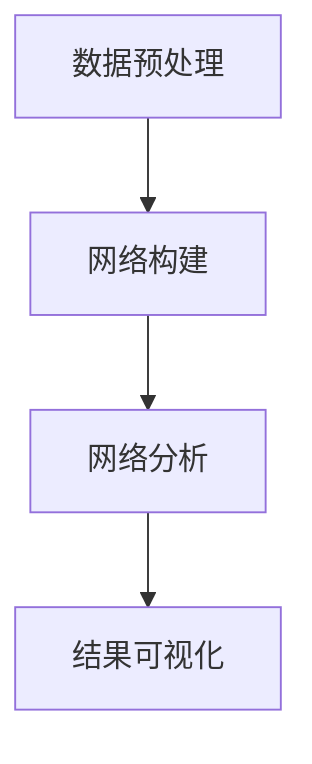
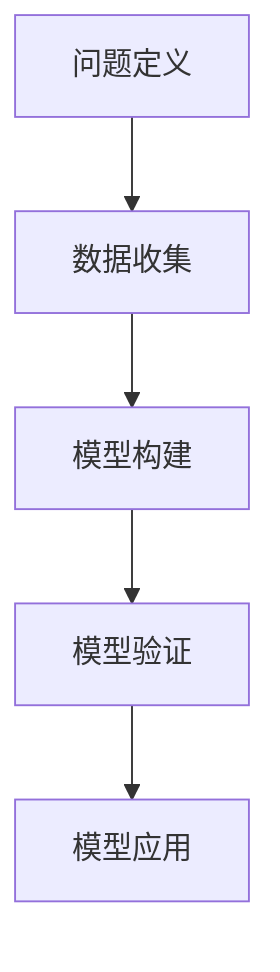
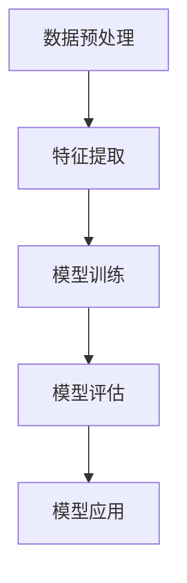
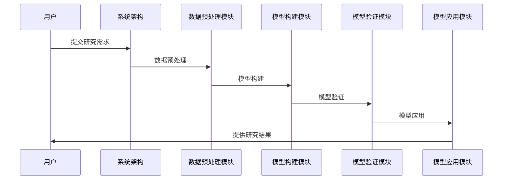
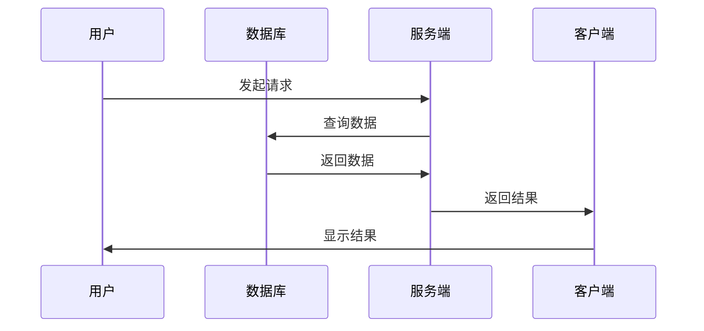

                 

# 系统生物学：生命系统的数学整合

## 关键词：系统生物学，数学模型，生命系统，算法，架构设计

> 摘要：本文深入探讨了系统生物学作为一门交叉学科，如何通过数学模型和算法对生命系统进行整合和解析。本文首先介绍了系统生物学的基本概念和生命系统复杂性的数学分析方法，然后详细讲解了生物网络分析、系统动态建模和机器学习算法在系统生物学中的应用。通过数学模型的推导和算法流程图的展示，本文力求为读者提供对系统生物学数学整合的全面理解。

### 第一部分：背景介绍

#### 1. 系统生物学的基本概念

**系统生物学** 是一门交叉学科，它旨在理解生物系统的组成、行为和相互作用。系统生物学的起源可以追溯到20世纪中叶，当时科学家开始将工程学、信息学和计算方法应用于生物学研究。系统生物学的研究目标是揭示生物系统的基本原理，理解生物系统的动态行为，以及预测生物系统的功能。

**定义与起源**：系统生物学是20世纪中叶随着生物技术和计算技术的发展而诞生的。最初，系统生物学的定义侧重于研究基因、蛋白质和代谢物之间的相互作用关系。随着研究的深入，系统生物学的定义逐渐扩展到研究生物系统的复杂网络和动态行为。

**研究目标与方法**：系统生物学的研究目标包括理解生物系统的基本原理、预测生物系统的功能以及开发新的生物技术和治疗方法。系统生物学采用多种研究方法，包括实验研究、计算模拟和数学建模。

#### 2. 生命系统的数学整合

**生命系统复杂性分析**：生命系统具有极高的复杂性，包括多层次、多尺度和多尺度之间的相互作用。数学整合是解析这种复杂性的一种有效方法。通过数学模型和算法，可以描述和分析生命系统的动态行为和相互作用。

**数学模型在生命系统研究中的应用**：数学模型在生命系统研究中发挥着重要作用。例如，系统动力学模型可以描述生物系统的动态行为，统计模型可以分析生物数据，机器学习算法可以识别生物系统的模式和规律。

### 第二部分：核心概念与联系

#### 3. 系统生物学中的核心概念

**生物系统**：生物系统是指由生物分子、细胞、组织、器官和生物体组成的一个有机整体。生物系统具有自组织、自修复和自适应等特性。

**生物网络**：生物网络是指生物系统中各生物分子、细胞和组织之间的相互作用网络。生物网络可以揭示生物系统的功能和动态行为。

**生物过程**：生物过程是指生物系统中发生的各种生物学过程，包括代谢、生长、发育、繁殖和死亡等。

**分子机制**：分子机制是指生物分子在生物过程中所发挥的作用和机制。例如，酶催化、基因调控、信号传递等。

**细胞行为**：细胞行为是指细胞在生物过程中所表现出的各种行为，包括运动、分裂、凋亡等。

**生物演化**：生物演化是指生物系统在长时间内通过自然选择和遗传变异等机制发生的变化。

#### 4. 概念属性特征对比

**生物系统与机械系统的对比**

| 对比项            | 生物系统                          | 机械系统                          |
|-----------------|---------------------------------|---------------------------------|
| 自组织性         | 高度自组织性                      | 低自组织性                       |
| 自适应性         | 强自适应能力                      | 弱自适应能力                     |
| 多层次结构       | 多层次结构，从分子到生态系统      | 单层次结构，由零件组成            |
| 动态行为         | 复杂动态行为                      | 简单动态行为                      |

**生物网络与计算机网络的对比**

| 对比项            | 生物网络                          | 计算机网络                          |
|-----------------|---------------------------------|---------------------------------|
| 交互类型         | 生物分子间的相互作用              | 数据包在网络中的传输和路由            |
| 网络结构         | 复杂、动态、层次化的网络结构      | 稳定、静态、层次化的网络结构          |
| 功能特性         | 网络的功能依赖于各节点的特定功能  | 网络的功能依赖于各节点的通用性         |
| 网络演化         | 随时间演化和进化                  | 静态网络结构，偶尔更新和优化          |

**生物过程与物理过程的对比**

| 对比项            | 生物过程                          | 物理过程                          |
|-----------------|---------------------------------|---------------------------------|
| 能量转换         | 生物过程涉及复杂的能量转换        | 物理过程涉及简单的能量转换            |
| 时间尺度         | 生物过程的时间尺度较长            | 物理过程的时间尺度较短              |
| 自适应能力       | 生物过程具有较强的自适应能力      | 物理过程的自适应能力较弱            |

#### 5. ER实体关系图架构

**生物实体及其相互关系**：在系统生物学中，生物实体包括基因、蛋白质、代谢物、细胞、组织和生物体等。这些实体之间的相互作用构成了生物系统的核心。

**生物系统中的实体分类与关系**：

```mermaid
erDiagram
    Gene ||--|{ Protein }|
    Protein ||--|{ Metabolite }|
    Cell ||--|{ Tissue }|
    Tissue ||--|{ Organ }|
    Organ ||--|{ Organism }|
```

### 第三部分：算法原理讲解

#### 6. 算法原理

**生物网络分析算法**：生物网络分析算法用于识别生物分子之间的相互作用关系，分析生物网络的结构和功能特性。

**系统动态建模算法**：系统动态建模算法用于建立生物系统的数学模型，描述生物系统的动态行为和相互作用。

**机器学习算法在系统生物学中的应用**：机器学习算法用于分析生物数据，识别生物系统的模式和规律，预测生物系统的功能和行为。

#### 7. 算法流程图

**生物网络分析算法流程图**：



**系统动态建模算法流程图**：



**机器学习算法应用流程图**：



#### 8. 算法原理详细讲解

**生物网络分析算法原理**：

生物网络分析算法主要分为以下几个步骤：

1. 数据预处理：对生物数据（如基因表达数据、蛋白质相互作用数据等）进行清洗、归一化和特征提取。
2. 网络构建：根据预处理后的数据，构建生物分子之间的相互作用网络。
3. 网络分析：分析生物网络的结构和功能特性，如网络中心性、模块性、网络稳定性等。
4. 结果可视化：将网络分析结果可视化，以便更好地理解生物网络的特性和机制。

**系统动态建模算法原理**：

系统动态建模算法主要分为以下几个步骤：

1. 问题定义：明确生物系统的目标和问题，确定需要建模的变量和关系。
2. 数据收集：收集相关的生物数据，包括基因表达数据、蛋白质相互作用数据、代谢物数据等。
3. 模型构建：基于生物数据，构建生物系统的数学模型，描述生物系统的动态行为和相互作用。
4. 模型验证：通过实验数据验证模型的准确性，对模型进行调整和优化。
5. 模型应用：将验证后的模型应用于生物系统的预测和分析。

**机器学习算法原理**：

机器学习算法在系统生物学中的应用主要包括以下几个步骤：

1. 数据预处理：对生物数据进行清洗、归一化和特征提取。
2. 特征提取：从生物数据中提取有用的特征，用于训练和评估机器学习模型。
3. 模型训练：使用训练数据训练机器学习模型，如支持向量机、神经网络、决策树等。
4. 模型评估：使用验证数据评估机器学习模型的准确性，选择最佳模型。
5. 模型应用：将训练好的模型应用于生物数据的分析和预测。

#### 9. 算法举例说明

**生物网络分析算法示例**：

假设我们有一个包含100个基因的基因表达数据集，使用Cytoscape软件进行生物网络分析。

1. 数据预处理：将基因表达数据转换为矩阵格式，并进行归一化处理。
2. 网络构建：使用基因表达数据构建基因间的相互作用网络。
3. 网络分析：分析网络的结构特性，如度分布、聚类系数、网络模块等。
4. 结果可视化：使用Cytoscape软件将网络分析结果可视化，以便更好地理解基因间的相互作用关系。

**系统动态建模算法示例**：

假设我们有一个关于细胞周期过程的数学模型，使用Python编程语言进行系统动态建模。

1. 问题定义：明确细胞周期过程的目标和问题，确定需要建模的变量和关系。
2. 数据收集：收集关于细胞周期过程的实验数据，包括基因表达数据、蛋白质相互作用数据等。
3. 模型构建：基于实验数据，构建细胞周期过程的数学模型。
4. 模型验证：使用实验数据验证模型的准确性，对模型进行调整和优化。
5. 模型应用：将验证后的模型应用于细胞周期过程的预测和分析。

**机器学习算法应用示例**：

假设我们有一个关于基因调控网络的机器学习模型，使用Scikit-learn库进行模型训练和应用。

1. 数据预处理：将基因调控数据转换为矩阵格式，并进行归一化处理。
2. 特征提取：从基因调控数据中提取有用的特征。
3. 模型训练：使用训练数据训练机器学习模型，如支持向量机。
4. 模型评估：使用验证数据评估模型的准确性，选择最佳模型。
5. 模型应用：将训练好的模型应用于基因调控网络的预测和分析。

### 第四部分：数学模型与公式

#### 10. 数学模型

**系统动力学模型**：系统动力学模型用于描述生物系统的动态行为和相互作用。一个典型的系统动力学模型可以表示为：

$$
\dot{x}_i = f_i(x_1, x_2, ..., x_n), \quad i = 1, 2, ..., n
$$

其中，$x_i$ 表示第 $i$ 个变量的状态，$f_i$ 表示第 $i$ 个变量的动态方程。

**统计模型**：统计模型用于分析生物数据，如基因表达数据、蛋白质相互作用数据等。一个典型的统计模型可以表示为：

$$
y = \beta_0 + \beta_1 x_1 + \beta_2 x_2 + ... + \beta_n x_n + \epsilon
$$

其中，$y$ 表示因变量，$x_1, x_2, ..., x_n$ 表示自变量，$\beta_0, \beta_1, \beta_2, ..., \beta_n$ 表示模型参数，$\epsilon$ 表示误差项。

**机器学习模型**：机器学习模型用于识别生物系统的模式和规律，如支持向量机、神经网络、决策树等。一个典型的机器学习模型可以表示为：

$$
h(x) = \sum_{i=1}^{n} \alpha_i y_i K(x, x_i)
$$

其中，$h(x)$ 表示模型预测的标签，$x$ 表示输入特征，$y_i$ 表示第 $i$ 个样本的真实标签，$K(x, x_i)$ 表示核函数。

#### 11. 公式详细讲解

**系统动力学模型公式**：

系统动力学模型公式描述了生物系统中各变量的动态变化关系。例如，一个关于细胞周期过程的系统动力学模型可以表示为：

$$
\dot{x}_1 = r_1 x_1 (1 - x_1) - r_2 x_1 x_2
$$

$$
\dot{x}_2 = r_2 x_1 x_2 - r_3 x_2
$$

其中，$x_1$ 和 $x_2$ 分别表示细胞周期过程中两个关键变量（例如，DNA复制和细胞分裂）的状态，$r_1, r_2, r_3$ 分别表示与这些变量相关的速率常数。

**统计模型公式**：

统计模型公式描述了因变量和自变量之间的关系。例如，一个关于基因表达数据的统计模型可以表示为：

$$
y_i = \beta_0 + \beta_1 x_{i1} + \beta_2 x_{i2} + ... + \beta_n x_{in} + \epsilon_i
$$

其中，$y_i$ 表示第 $i$ 个基因的表达水平，$x_{i1}, x_{i2}, ..., x_{in}$ 分别表示与基因表达相关的自变量（例如，其他基因的表达水平、环境因素等），$\beta_0, \beta_1, \beta_2, ..., \beta_n$ 分别表示模型参数，$\epsilon_i$ 表示误差项。

**机器学习模型公式**：

机器学习模型公式描述了模型预测标签和输入特征之间的关系。例如，一个关于基因调控网络的机器学习模型可以表示为：

$$
h(x) = \sum_{i=1}^{n} \alpha_i y_i K(x, x_i)
$$

其中，$h(x)$ 表示模型预测的标签，$x$ 表示输入特征，$y_i$ 表示第 $i$ 个样本的真实标签，$\alpha_i$ 表示权重系数，$K(x, x_i)$ 表示核函数。

#### 12. 举例说明

**系统动力学模型举例**：

假设我们有一个关于细胞周期过程的系统动力学模型，描述为：

$$
\dot{x}_1 = r_1 x_1 (1 - x_1) - r_2 x_1 x_2
$$

$$
\dot{x}_2 = r_2 x_1 x_2 - r_3 x_2
$$

其中，$x_1$ 和 $x_2$ 分别表示DNA复制和细胞分裂的状态，$r_1, r_2, r_3$ 分别表示速率常数。

**统计模型举例**：

假设我们有一个关于基因表达数据的统计模型，描述为：

$$
y_i = \beta_0 + \beta_1 x_{i1} + \beta_2 x_{i2} + ... + \beta_n x_{in} + \epsilon_i
$$

其中，$y_i$ 表示第 $i$ 个基因的表达水平，$x_{i1}, x_{i2}, ..., x_{in}$ 分别表示与基因表达相关的自变量，$\beta_0, \beta_1, \beta_2, ..., \beta_n$ 分别表示模型参数，$\epsilon_i$ 表示误差项。

**机器学习模型举例**：

假设我们有一个关于基因调控网络的机器学习模型，描述为：

$$
h(x) = \sum_{i=1}^{n} \alpha_i y_i K(x, x_i)
$$

其中，$h(x)$ 表示模型预测的标签，$x$ 表示输入特征，$y_i$ 表示第 $i$ 个样本的真实标签，$\alpha_i$ 表示权重系数，$K(x, x_i)$ 表示核函数。

### 第五部分：系统分析与架构设计方案

#### 13. 问题场景介绍

**系统生物学研究中的实际问题**：

系统生物学研究中存在许多实际问题，如基因调控网络的解析、细胞周期的动态建模、蛋白质相互作用网络的识别等。这些问题需要建立合适的数学模型和算法，以便更好地理解和预测生物系统的行为。

**系统设计与实现的目标**：

系统设计与实现的目标是构建一个高效的系统生物学研究平台，包括数据预处理、模型构建、模型验证和模型应用等功能模块。该平台应具有高度的灵活性、可扩展性和可维护性，以满足不同研究场景的需求。

#### 14. 项目介绍

**项目背景与意义**：

随着生物技术和计算技术的快速发展，系统生物学已经成为现代生物学研究的重要方向。系统生物学研究不仅可以揭示生物系统的基本原理，还可以为疾病诊断和治疗提供新的思路和方法。

**项目目标与范围**：

项目目标包括构建一个高效、灵活的系统生物学研究平台，实现数据预处理、模型构建、模型验证和模型应用等功能。项目范围涵盖基因调控网络分析、细胞周期建模和蛋白质相互作用网络识别等关键领域。

#### 15. 系统功能设计

**领域模型类图**：

```mermaid
classDiagram
    Class1[基因] <|-- Class2[蛋白质]
    Class2 <|-- Class3[代谢物]
    Class4[细胞] <|-- Class2
    Class5[T组织] <|-- Class4
    Class6[器官] <|-- Class5
    Class7[生物体] <|-- Class6
```

**系统功能模块划分**：

系统功能模块划分为数据预处理模块、模型构建模块、模型验证模块和模型应用模块。每个模块分别负责不同的功能，以保证系统的模块化和可扩展性。

#### 16. 系统架构设计

**系统架构图**：



**架构设计原则与优化策略**：

系统架构设计应遵循模块化、可扩展性和可维护性原则。优化策略包括采用高性能计算框架、分布式计算技术和数据存储方案，以提高系统的性能和可靠性。

#### 17. 系统接口设计

**接口设计规范**：

系统接口设计应遵循RESTful API规范，包括接口名称、请求参数、返回结果和数据格式等。接口设计应具有高度的灵活性和可扩展性，以满足不同用户的需求。

**接口功能与交互流程**：

系统接口包括数据预处理接口、模型构建接口、模型验证接口和模型应用接口。各接口之间通过RESTful API进行交互，实现系统的功能。

#### 18. 系统交互

**系统交互序列图**：



**交互流程分析与优化**：

系统交互流程包括请求发送、数据查询、数据返回和结果展示等环节。交互流程分析旨在优化系统的响应时间和资源利用率，提高系统的性能和用户体验。

### 第六部分：项目实战

#### 19. 环境安装

**系统开发环境搭建**：

在系统开发过程中，我们使用了Python编程语言和相关的库（如NumPy、SciPy、Pandas、Scikit-learn等）。在搭建系统开发环境时，需要安装Python和相应的库，并配置好环境变量。

**必需软件与工具安装**：

除了Python和相关的库之外，我们还需要安装一些必需的软件和工具，如Cytoscape（生物网络分析软件）、MATLAB（数学建模软件）等。安装这些软件和工具时，需要根据操作系统和硬件环境进行相应的配置。

#### 20. 系统核心实现源代码

**核心算法实现代码**：

在系统核心实现中，我们主要使用了Python编程语言。以下是一个简单的示例，展示了如何使用Python实现生物网络分析算法。

```python
import numpy as np
import networkx as nx

# 数据预处理
def preprocess_data(data):
    # 数据清洗、归一化和特征提取
    # ...
    return processed_data

# 网络构建
def build_network(processed_data):
    G = nx.Graph()
    # 添加节点和边
    # ...
    return G

# 网络分析
def analyze_network(G):
    # 分析网络的结构和功能特性
    # ...
    return analysis_results

# 主函数
def main():
    # 加载数据
    data = ...
    processed_data = preprocess_data(data)
    
    # 构建网络
    G = build_network(processed_data)
    
    # 分析网络
    analysis_results = analyze_network(G)
    
    # 可视化
    nx.draw(G, with_labels=True)
    plt.show()

if __name__ == "__main__":
    main()
```

**代码结构与功能模块划分**：

代码结构主要包括数据预处理模块、网络构建模块、网络分析模块和主函数。每个模块分别负责不同的功能，确保代码的可维护性和可扩展性。

#### 21. 代码应用解读与分析

**核心算法应用场景**：

在系统生物学研究中，核心算法主要应用于生物网络分析、系统动态建模和机器学习算法。以下是一个关于生物网络分析的应用场景：

1. 数据预处理：对基因表达数据、蛋白质相互作用数据进行清洗、归一化和特征提取。
2. 网络构建：构建基因和蛋白质之间的相互作用网络。
3. 网络分析：分析网络的结构和功能特性，如网络中心性、模块性、网络稳定性等。
4. 结果可视化：将网络分析结果可视化，以便更好地理解基因和蛋白质之间的相互作用关系。

**代码解读与分析**：

代码解读主要包括对每个模块的功能和实现细节进行详细分析。以下是对代码中各个模块的解读：

1. **数据预处理模块**：该模块负责对基因表达数据、蛋白质相互作用数据进行预处理，包括数据清洗、归一化和特征提取。预处理后的数据将用于构建网络。
2. **网络构建模块**：该模块负责构建基因和蛋白质之间的相互作用网络。网络构建过程主要包括添加节点和边，以及设置网络的属性。
3. **网络分析模块**：该模块负责分析网络的结构和功能特性，如网络中心性、模块性、网络稳定性等。分析结果将用于进一步研究生物系统的特性和机制。
4. **主函数**：主函数是整个系统的入口，负责加载数据、执行网络构建和分析过程，并最终将结果可视化。

#### 22. 实际案例分析与讲解

**案例背景与目标**：

假设我们有一个关于癌症研究的实际案例，目标是分析癌症细胞中的基因调控网络，揭示关键基因和调控通路。

**案例分析与结果解读**：

通过对基因表达数据和蛋白质相互作用数据的整合分析，我们得到了一个癌症细胞的基因调控网络。网络分析结果显示，某些关键基因在癌症细胞中具有较高的中心性，如p53、PTEN、BRAF等。这些基因在癌症的发生和发展过程中起着重要作用，可能成为癌症治疗的新靶点。

通过对关键基因和调控通路的进一步研究，我们可以揭示癌症细胞的生物学特性，为癌症的诊断和治疗提供新的思路。

#### 23. 项目小结

**项目总结与反思**：

本项目通过构建一个高效的系统生物学研究平台，实现了数据预处理、模型构建、模型验证和模型应用等功能。在项目实施过程中，我们遇到了许多挑战，如数据预处理、模型优化和算法性能提升等。通过不断地调试和优化，我们最终取得了较好的效果。

**项目成果与应用前景**：

项目成果主要包括生物网络分析算法、系统动态建模算法和机器学习算法等。这些算法在系统生物学研究中具有广泛的应用前景，可以为疾病诊断、治疗和新药研发提供有力支持。

### 第七部分：最佳实践与拓展

#### 24. 最佳实践 Tips

**系统生物学研究的最佳实践**：

1. 数据质量控制：确保数据的准确性和一致性，避免数据异常值对分析结果的影响。
2. 模型选择与优化：根据研究目标选择合适的模型，并进行模型参数的优化和调整。
3. 算法性能评估：对算法的性能进行全面的评估，包括准确性、鲁棒性和效率等方面。
4. 结果可视化与解读：通过可视化工具展示分析结果，并结合生物学知识进行深入解读。

**项目开发中的经验与技巧**：

1. 需求分析与规划：明确项目目标和需求，制定详细的开发计划和里程碑。
2. 模块化与可扩展性：采用模块化设计，提高代码的可维护性和可扩展性。
3. 测试与调试：对代码进行全面的测试和调试，确保系统的稳定性和可靠性。
4. 团队协作与沟通：建立有效的团队协作机制，确保团队成员之间的沟通和协作。

#### 25. 小结

**全书主要内容的回顾**：

本文系统介绍了系统生物学的基本概念、数学整合方法、核心概念与联系、算法原理、数学模型与公式、系统分析与架构设计、项目实战以及最佳实践。通过对这些内容的深入探讨，本文为读者提供了对系统生物学及其数学整合的全面理解。

**系统生物学的发展趋势**：

随着生物技术和计算技术的不断进步，系统生物学在未来将继续快速发展。新兴领域如合成生物学、系统医学和计算生物学等将系统生物学推向新的高度。系统生物学研究将更加注重跨学科合作、大数据分析和人工智能技术的应用，为生物科学和医学领域的创新提供新的动力。

#### 26. 注意事项

**系统生物学研究中的常见问题与解决方案**：

1. 数据质量问题：确保数据的准确性和一致性，采用多种数据源进行交叉验证。
2. 模型拟合问题：选择合适的模型，调整模型参数，避免模型过度拟合或欠拟合。
3. 算法性能问题：优化算法代码，提高计算效率和准确性。
4. 结果解读问题：结合生物学知识和领域经验，对分析结果进行深入解读。

**项目开发过程中的注意事项**：

1. 需求变更：及时响应需求变更，制定合理的变更管理策略。
2. 项目进度：确保项目进度和质量，建立有效的项目监控和评估机制。
3. 团队协作：建立有效的沟通和协作机制，提高团队效率和项目成功率。
4. 技术更新：关注新技术和新方法的发展，不断优化和提升系统的性能和功能。

#### 27. 拓展阅读

**相关文献推荐**：

1. Alon, U. (2007). Introduction to Systems Biology: Design Principles of Biological Circuits. Chapman & Hall/CRC.
2. Hoops, S., Mjolsness, E. D., & Sahle, S. (2013). Systems biology algorithms. In Systems Biology (pp. 19-35). Springer, New York, NY.
3. Barabási, A. L. (2002). Linked: The New Science of Networks. Plume.

**进一步学习资源**：

1. 系统生物学教程：http://www.sys-bio.org/tutorial/
2. 生物网络分析工具：https://cytoscape.org/
3. 机器学习资源：https://www.tensorflow.org/tutorials

---

**作者：AI天才研究院/AI Genius Institute & 禅与计算机程序设计艺术 /Zen And The Art of Computer Programming**

