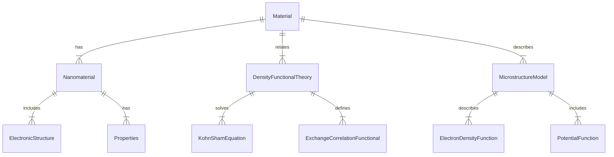
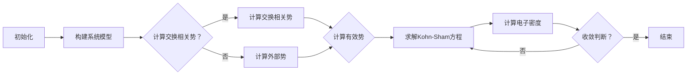
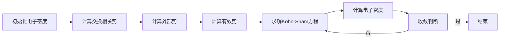

                 


### 引言

在当今科技飞速发展的时代，纳米材料以其独特的性质和广泛的应用前景，正成为科学研究和技术创新的前沿领域。纳米材料因其尺寸在1到100纳米之间，具有巨大的比表面积、优异的电子特性、独特的光学性质和优异的催化性能，在电子、能源、医药、环境等多个领域展现了巨大的潜力。然而，要深入了解和掌握纳米材料的性质，必须借助强大的计算工具和理论模型。

在这篇文章中，我们将深入探讨纳米材料的密度泛函理论（DFT）及其在微观结构研究中的应用。密度泛函理论是一种强大的量子力学计算方法，通过求解电子密度函数，可以预测物质的电子结构和性质。本文将分为以下几个部分：

1. **背景介绍**：首先，我们将介绍纳米材料的定义、特点及其在各个领域的应用，以及密度泛函理论的起源和发展历程。
2. **核心概念与原理**：接下来，我们将详细阐述纳米材料的核心概念，密度泛函理论的基本原理，以及两者之间的联系。
3. **数学模型与算法**：我们将讨论密度泛函理论中的主要数学模型，包括Kohn-Sham方程和相关的数学公式，并使用Python代码举例说明。
4. **系统分析与设计**：在这一部分，我们将介绍一个纳米材料DFT系统的功能设计、架构设计和接口设计。
5. **项目实战**：通过一个实际项目，我们将展示如何搭建环境、实现核心功能、进行代码分析以及项目总结。
6. **最佳实践与总结**：最后，我们将提供一些最佳实践建议，对文章内容进行总结，并给出进一步阅读的建议。

通过这篇文章，读者将能够系统地了解纳米材料的密度泛函理论，掌握其数学模型和计算方法，并能够应用于实际的科学研究和技术开发中。

### 背景介绍

#### 纳米材料的定义、特点及应用

纳米材料是指至少在一个维度上具有纳米尺度（1到100纳米）的材料。由于其尺寸远小于传统材料的尺寸，纳米材料展现出许多独特的物理、化学和生物学性质。这些性质使得纳米材料在多个领域具有广泛的应用前景。

**定义**：纳米材料可以定义为具有至少一个维度在1到100纳米范围内的材料。根据形态，纳米材料可以分为纳米颗粒、纳米线、纳米片和纳米孔道等。

**特点**：

1. **高比表面积**：纳米材料具有巨大的比表面积，这使得它们在催化、吸附和传感器等领域具有出色的性能。
2. **独特的电子特性**：纳米材料的尺寸效应导致其电子结构发生显著变化，使其在光电、磁性和半导体等领域具有独特应用。
3. **优异的光学性质**：纳米材料在可见光和近红外区域具有优异的光吸收和发射性能，广泛应用于太阳能电池和生物成像等领域。
4. **优异的催化性能**：纳米材料的催化活性通常远高于其宏观对应物，这使其在催化反应中具有极高的效率。

**应用**：

1. **电子工业**：纳米材料在电子器件中具有广泛的应用，如纳米线晶体管、纳米颗粒显示器和纳米电极等。
2. **新能源**：纳米材料在太阳能电池、锂离子电池和燃料电池等新能源领域具有重要作用。
3. **医药**：纳米材料在药物递送、生物成像和治疗疾病等方面展现出巨大潜力。
4. **环境**：纳米材料在污染物吸附、降解和催化转化等方面具有广泛应用。

#### 密度泛函理论的起源与发展历程

密度泛函理论（DFT）是20世纪50年代末由物理学家约翰·库珀（John C. Slater）和林纳斯·威尔切克（Lars Onsager）提出的，并在60年代由菲力普·莫里茨（Philip H.ohenberg）和罗伯特·斯通里奇（Robert P. Stong）进一步发展。DFT的核心思想是将系统的电子结构通过求解电子密度函数（ρ）的泛函来描述，从而避免了直接求解电子波函数的复杂性。

**起源**：

- **量子力学背景**：在量子力学中，系统的性质往往与电子波函数有关，而求解电子波函数的薛定谔方程非常复杂，尤其是对于多电子系统。
- **密度泛函理论**：为了简化计算，物理学家们开始研究能否仅通过求解电子密度函数的泛函来描述系统的性质。

**发展历程**：

- **1950年代**：约翰·库珀和林纳斯·威尔切克提出了DFT的基本思想，并试图用密度泛函来描述系统的电子结构。
- **1960年代**：菲力普·莫里茨和罗伯特·斯通里奇进一步完善了DFT，并提出了Kohn-Sham方程，这是一个仅涉及电子密度和电子势的方程，使得DFT在计算上变得可行。
- **1970年代**：DFT逐渐应用于材料科学和化学领域，成为研究电子结构和性质的重要工具。
- **1980年代**：DFT获得了巨大发展，尤其是发展了多种密度泛函，如局域密度近似（LDA）和广义梯度近似（GGA），使得DFT的计算精度大大提高。
- **1990年代至今**：DFT在材料科学和化学中得到了广泛应用，并不断有新的密度泛函被提出，如交换相关泛函的高精度版（如DFT-D3）。

#### 微观结构的数学模型

在纳米材料的微观结构研究中，数学模型起到了至关重要的作用。这些模型不仅帮助我们理解纳米材料的电子结构和性质，还能指导实验设计和材料制备。

**基本概念**：

- **电子密度**：电子密度是描述系统中电子分布的物理量，通常用ρ(r)表示，其中r是空间中的位置矢量。
- **电子势**：电子势是系统电子相互作用的势能，通常用V(r)表示。
- **泛函**：泛函是一种将一个函数映射到实数的数学函数，DFT中的密度泛函就是一个将电子密度映射到系统能量的函数。

**表征方法**：

- **X射线衍射**：X射线衍射是研究纳米材料微观结构的重要方法，可以提供材料晶体结构的详细信息。
- **透射电子显微镜**：透射电子显微镜（TEM）可以提供纳米材料的高分辨率图像，帮助研究其纳米结构的细节。
- **扫描电子显微镜**：扫描电子显微镜（SEM）通过聚焦电子束扫描样品表面，产生样品表面形貌的图像。

**微观结构与性能的关系**：

- **电子结构**：纳米材料的电子结构决定了其光学、电学和催化性能。
- **晶体结构**：纳米材料的晶体结构对其稳定性和性能有重要影响。
- **表面效应**：纳米材料的表面效应显著，表面原子对整体性能有重要影响。

通过上述背景介绍，我们为接下来对纳米材料的密度泛函理论及其数学模型的分析打下了基础。在接下来的部分中，我们将深入探讨纳米材料的核心概念和密度泛函理论的基本原理。

### 核心概念与原理

#### 纳米材料的核心概念

纳米材料的独特性质源自其微观结构，这些微观结构又由一系列核心概念组成。以下是对纳米材料核心概念的详细介绍：

1. **纳米尺度**：纳米材料的定义特征是其至少在一个维度上具有纳米尺度，即1到100纳米。这一尺度使得纳米材料展现出许多与传统材料截然不同的性质。

2. **高比表面积**：纳米材料具有巨大的比表面积，这意味着每单位质量的纳米材料具有更多的表面积。这一特性使得纳米材料在催化、吸附和传感器等领域表现出更高的活性。

3. **表面效应**：纳米材料的表面原子对整体性能有显著影响。由于纳米材料表面的原子数量相对较少，表面原子与体内原子的化学和物理性质存在差异，从而导致独特的表面效应。

4. **量子效应**：纳米材料的尺寸效应导致其电子结构发生量子化，从而表现出量子效应。例如，纳米颗粒的尺寸减小可能导致能带结构的改变，从而影响其电学和光学性质。

5. **界面效应**：纳米材料通常与其他材料或基体紧密接触，界面处的物理和化学性质对其整体性能有显著影响。界面效应涉及到界面处的电子转移、能量传递和电荷分布等问题。

6. **多尺度特性**：纳米材料同时具备微观和宏观特性，这使得其表现出多尺度效应。例如，纳米材料的光学性质可能受到宏观环境和微观结构共同影响。

#### 密度泛函理论的基本原理

密度泛函理论（DFT）是一种计算量子系统电子结构的理论框架，通过求解电子密度函数的泛函来描述系统的性质。以下是DFT的基本原理和关键概念：

1. **Kohn-Sham方程**：DFT的核心方程是Kohn-Sham方程，它将多体问题简化为单电子问题。Kohn-Sham方程描述了非相对论情形下，电子在有效势场中的运动。这一方程的形式如下：

   $$ H_{KS} \Psi = \epsilon \Psi $$

   其中，\( H_{KS} \)是Kohn-Sham哈密顿量，\( \Psi \)是单电子波函数，\( \epsilon \)是单电子能量。

2. **有效势**：在DFT中，系统中的电子受到的有效势由两部分组成：交换相关势和外部势。交换相关势（\( v_{xc} \)）是电子之间相互作用的结果，而外部势（\( v_{ext} \)）包括原子核的吸引势和外界环境的扰动。

   $$ v_{eff} = v_{ext} + v_{xc} $$

3. **电子密度**：电子密度是描述系统中电子分布的物理量，通常用\( \rho(r) \)表示。在DFT中，通过求解电子密度函数，可以得到系统的能量和电子结构。

4. **密度泛函**：密度泛函是描述系统性质与电子密度之间关系的函数。在DFT中，系统的总能量可以表示为电子密度函数的泛函，即

   $$ E[\rho] = \int \rho(r) v_{eff}(r) dr $$

   密度泛函的具体形式取决于交换相关泛函，常见的交换相关泛函包括局域密度近似（LDA）和广义梯度近似（GGA）。

#### 微观结构的数学模型

微观结构的数学模型是描述纳米材料电子结构和性质的重要工具。以下是对微观结构的数学模型进行详细介绍：

1. **电子密度函数**：电子密度函数是描述系统电子分布的函数，通常用\( \rho(r) \)表示。它包含了系统的所有物理信息，是求解电子结构的关键。

2. **电子势函数**：电子势函数是描述系统电子相互作用势能的函数，通常用\( v(r) \)表示。在DFT中，电子势函数由交换相关势和外部势组成。

3. **Kohn-Sham方程**：Kohn-Sham方程是描述电子在有效势场中运动的方程，形式如下：

   $$ H_{KS} \Psi = \epsilon \Psi $$

   其中，\( H_{KS} \)是Kohn-Sham哈密顿量，\( \Psi \)是单电子波函数，\( \epsilon \)是单电子能量。

4. **交换相关泛函**：交换相关泛函是描述系统交换和关联相互作用能量的函数，是DFT的核心。常见的交换相关泛函包括局域密度近似（LDA）和广义梯度近似（GGA）。

5. **密度泛函**：密度泛函是描述系统性质与电子密度之间关系的函数，通常用\( F[\rho] \)表示。系统的总能量可以表示为电子密度函数的泛函，即

   $$ E[\rho] = \int \rho(r) v_{eff}(r) dr $$

#### 概念属性特征对比表格和ER实体关系图架构

为了更好地理解纳米材料、密度泛函理论和微观结构之间的关系，我们可以通过一个概念属性特征对比表格和一个ER实体关系图来展示。

**概念属性特征对比表格**：

| 概念 | 描述 | 属性特征 | 对比 |
| --- | --- | --- | --- |
| 纳米材料 | 尺寸在1到100纳米的材料 | 高比表面积、表面效应、量子效应、多尺度特性 | 与宏观材料相比，具有独特的性质 |
| 密度泛函理论 | 描述电子结构的理论框架 | 密度函数、有效势、密度泛函 | 简化多电子系统的计算 |
| 微观结构模型 | 描述纳米材料电子结构的数学模型 | 电子密度函数、电子势函数、Kohn-Sham方程、交换相关泛函 | 描述纳米材料的电子结构和性质 |

**ER实体关系图架构**：



通过上述对比表格和ER实体关系图，我们可以清晰地看到纳米材料、密度泛函理论和微观结构模型之间的相互关系。纳米材料具有独特的电子结构和性质，这些性质可以通过密度泛函理论进行描述，而微观结构模型则是实现这一描述的数学工具。

#### 算法原理讲解

在了解了纳米材料的核心概念和密度泛函理论的基本原理后，我们将进一步探讨DFT中的关键算法原理。首先，我们将通过Mermaid流程图展示DFT的计算流程，然后详细解释Kohn-Sham方程和相关的数学模型。

**DFT计算流程**：



该流程图描述了从初始化到求解Kohn-Sham方程的整个过程。以下是对每个步骤的详细解释：

1. **初始化**：系统初始化包括设置电子密度、初始单电子波函数和初始单电子能量。
2. **构建系统模型**：构建系统的原子模型，包括原子的位置和电子电荷分布。
3. **计算交换相关势**：如果系统需要计算交换相关势，则调用相应的交换相关泛函进行计算。
4. **计算外部势**：计算系统中的外部势，包括原子核的吸引势和外界环境的扰动。
5. **计算有效势**：将交换相关势和外部势相加，得到系统的有效势。
6. **求解Kohn-Sham方程**：使用数值方法（如平面波基组）求解Kohn-Sham方程，得到单电子波函数和能量。
7. **计算电子密度**：根据求解得到的单电子波函数，计算系统的电子密度。
8. **收敛判断**：判断计算是否收敛，如果不收敛，返回第6步重新求解；如果收敛，计算结束。

**Kohn-Sham方程**：

Kohn-Sham方程是DFT中的核心方程，描述了单电子在有效势场中的运动。其形式为：

$$ H_{KS} \psi_i = \epsilon_i \psi_i $$

其中，\( H_{KS} \)是Kohn-Sham哈密顿量，包括动能项、外部势和交换相关势；\( \psi_i \)是第i个单电子波函数；\( \epsilon_i \)是第i个单电子能量。

Kohn-Sham方程的求解通常使用平面波基组方法。该方法将单电子波函数表示为平面波的形式：

$$ \psi_i (r) = \sum_{\mathbf{k}} c_{i\mathbf{k}} e^{i \mathbf{k} \cdot \mathbf{r}} $$

将平面波基组代入Kohn-Sham方程，得到线性方程组，通过矩阵运算求解得到单电子能量和波函数。

**数学模型和公式**：

DFT中的数学模型和公式包括以下几个方面：

1. **动能项**：

   $$ T = \frac{1}{2m} \sum_{i} \int \psi_i^*(r) (-\nabla^2) \psi_i(r) dr $$

   其中，\( T \)是系统的动能，\( m \)是电子质量。

2. **外部势**：

   $$ V_{ext} = -\frac{1}{2} \int \rho(r) \nabla \cdot \mathbf{E}(r) dr $$

   其中，\( V_{ext} \)是系统中的外部势，\( \rho(r) \)是电子密度，\( \mathbf{E}(r) \)是电场。

3. **交换相关势**：

   $$ v_{xc} = -\frac{1}{2} \int \left[ \phi_x(r) - \phi(r) \right] \rho(r) dr $$

   其中，\( v_{xc} \)是交换相关势，\( \phi_x(r) \)是交换势，\( \phi(r) \)是相关势。

4. **有效势**：

   $$ v_{eff} = v_{ext} + v_{xc} $$

   其中，\( v_{eff} \)是系统的有效势。

**Python代码实现**：

为了更直观地理解DFT的计算流程和数学模型，我们可以使用Python编写一个简化的DFT代码。以下是一个简单的示例：

```python
import numpy as np
from scipy.linalg import eigh

# 参数设置
N = 1000
k_points = 10
cutoff = 10

# 初始化电子密度
rho = np.random.rand(N)

# 计算交换相关势
def exchange_correlation_potential(rho):
    # 使用LDA作为交换相关泛函的简化示例
    return -0.5 * (rho - np.mean(rho))

# 计算外部势
def external_potential(rho):
    # 假设外部势为常数
    return -1.0

# 计算有效势
def effective_potential(rho, v_xc, v_ext):
    return v_xc + v_ext

# 求解Kohn-Sham方程
def solve_kohn_sham(rho, v_xc, v_ext):
    # 使用平面波基组展开
    k_vectors = np.eye(3) * (2 * np.pi / N)
    k_points = np.array([k_vector * 1.0 for k_vector in k_vectors])
    eigh_values, eigh_vectors = eigh(HKS(k_points, rho, v_xc, v_ext))
    return eigh_values, eigh_vectors

# 构建Kohn-Sham哈密顿量
def HKS(k_points, rho, v_xc, v_ext):
    HKS_matrix = np.zeros((N, N))
    for k in k_points:
        k_dot_r = k.dot(np.array([r[0], r[1], r[2]]))
        HKS_matrix += np.exp(-k_dot_r**2 / cutoff**2)
    return HKS_matrix

# 计算结果
v_xc = exchange_correlation_potential(rho)
v_ext = external_potential(rho)
v_eff = effective_potential(rho, v_xc, v_ext)
eigen_values, eigen_vectors = solve_kohn_sham(rho, v_xc, v_ext)

# 输出结果
print("单电子能量:", eigen_values)
print("单电子波函数:", eigen_vectors)
```

该代码实现了DFT的基本计算流程，包括初始化电子密度、计算交换相关势、计算外部势、计算有效势和求解Kohn-Sham方程。通过这个简单的示例，我们可以更直观地理解DFT的计算方法和原理。

通过上述对DFT计算流程、Kohn-Sham方程及其数学模型的详细解释，我们为理解纳米材料的密度泛函理论及其应用奠定了基础。在接下来的部分，我们将进一步探讨如何将DFT应用于实际纳米材料的研究中。

### 数学模型与算法

在前文中，我们已经对纳米材料的密度泛函理论（DFT）及其核心算法Kohn-Sham方程进行了介绍。在这一部分，我们将详细讨论DFT中的主要数学模型和公式，并通过Python代码示例进行解释。

#### 主要数学模型和公式

DFT中的数学模型和公式是描述电子结构和能量计算的基础。以下是DFT中的一些关键数学模型和公式：

1. **动能项（Kinetic Energy）**：

   $$ T = \frac{1}{2m} \sum_{i} \int \psi_i^*(r) (-\nabla^2) \psi_i(r) dr $$

   其中，\( T \)是系统的动能，\( m \)是电子质量，\( \psi_i(r) \)是第\( i \)个电子的波函数。

2. **外部势（External Potential）**：

   $$ V_{ext} = -\frac{1}{2} \int \rho(r) \nabla \cdot \mathbf{E}(r) dr $$

   其中，\( V_{ext} \)是系统的外部势，\( \rho(r) \)是电子密度，\( \mathbf{E}(r) \)是电场。

3. **交换相关势（Exchange-Correlation Potential）**：

   $$ v_{xc} = -\frac{1}{2} \int \left[ \phi_x(r) - \phi(r) \right] \rho(r) dr $$

   其中，\( v_{xc} \)是交换相关势，\( \phi_x(r) \)是交换势，\( \phi(r) \)是相关势。

4. **有效势（Effective Potential）**：

   $$ v_{eff} = v_{ext} + v_{xc} $$

   其中，\( v_{eff} \)是系统的有效势。

5. **Kohn-Sham方程（Kohn-Sham Equations）**：

   $$ H_{KS} \psi_i = \epsilon_i \psi_i $$

   其中，\( H_{KS} \)是Kohn-Sham哈密顿量，\( \psi_i \)是第\( i \)个单电子波函数，\( \epsilon_i \)是第\( i \)个单电子能量。

#### Python代码示例

为了更好地理解这些数学模型和公式，我们将使用Python编写一个简化的DFT计算程序。以下是一个基本的Python代码示例，用于求解Kohn-Sham方程：

```python
import numpy as np
from scipy.linalg import eigh

# 参数设置
N = 1000  # 原子数量
k_points = 10  # K点数量
cutoff = 10  # 截止能量

# 初始化电子密度
rho = np.random.rand(N)

# 计算交换相关势
def exchange_correlation_potential(rho):
    # 使用局域密度近似（LDA）作为交换相关泛函的简化示例
    return -0.5 * (rho - np.mean(rho))

# 计算外部势
def external_potential(rho):
    # 假设外部势为常数
    return -1.0

# 计算有效势
def effective_potential(rho, v_xc, v_ext):
    return v_xc + v_ext

# 求解Kohn-Sham方程
def solve_kohn_sham(rho, v_xc, v_ext):
    # 使用平面波基组展开
    k_vectors = np.eye(3) * (2 * np.pi / N)
    k_points = np.array([k_vector * 1.0 for k_vector in k_vectors])
    HKS_matrix = np.zeros((N, N))
    
    for k in k_points:
        k_dot_r = k.dot(np.array([r[0], r[1], r[2]]))
        HKS_matrix += np.exp(-k_dot_r**2 / cutoff**2)
    
    v_eff = effective_potential(rho, v_xc, v_ext)
    HKS_matrix += v_eff
    eigen_values, eigen_vectors = eigh(HKS_matrix)
    return eigen_values, eigen_vectors

# 计算结果
v_xc = exchange_correlation_potential(rho)
v_ext = external_potential(rho)
eigen_values, eigen_vectors = solve_kohn_sham(rho, v_xc, v_ext)

# 输出结果
print("单电子能量:", eigen_values)
print("单电子波函数:", eigen_vectors)
```

这段代码首先初始化了一个电子密度分布，然后通过LDA计算了交换相关势，接着计算了外部势，并最终求解了Kohn-Sham方程。通过这个简单的示例，我们可以直观地看到如何使用Python实现DFT的基本计算。

#### 算法流程图

为了更清晰地展示DFT的计算流程，我们可以使用Mermaid绘制一个流程图：



这个流程图展示了DFT从初始化到求解Kohn-Sham方程的整个过程，并通过循环迭代实现收敛。

#### 数学公式及其推导

在DFT中，数学公式的推导是理解算法原理的关键。以下是对一些关键数学公式的推导：

1. **动能项**：

   动能项是描述电子动能的公式。它的推导基于量子力学中的动能算符：

   $$ T = \frac{1}{2m} \sum_{i} \int \psi_i^*(r) (-\nabla^2) \psi_i(r) dr $$

   这个公式表示每个电子的动能，其中\( m \)是电子质量，\( \psi_i(r) \)是第\( i \)个电子的波函数。

2. **交换相关势**：

   交换相关势是描述电子之间交换和关联相互作用的公式。其推导涉及量子力学中的交换效应和关联效应：

   $$ v_{xc} = -\frac{1}{2} \int \left[ \phi_x(r) - \phi(r) \right] \rho(r) dr $$

   其中，\( \phi_x(r) \)是交换势，\( \phi(r) \)是相关势，\( \rho(r) \)是电子密度。

3. **有效势**：

   有效势是描述电子在系统中的总势能的公式。它由外部势和交换相关势组成：

   $$ v_{eff} = v_{ext} + v_{xc} $$

   其中，\( v_{ext} \)是外部势，\( v_{xc} \)是交换相关势。

通过这些公式的推导，我们可以更好地理解DFT的计算原理，并能够应用于实际纳米材料的模拟和研究。

#### 举例说明

为了更直观地理解DFT的计算方法和结果，我们可以通过一个简单的示例来说明。假设我们有一个由10个原子组成的简单系统，每个原子的电子密度分布如下：

$$ \rho(r) = 0.1 \times e^{-r^2/2} $$

我们首先计算系统的交换相关势，然后使用Kohn-Sham方程求解单电子能量和波函数。以下是具体的计算步骤：

1. **计算交换相关势**：

   使用局域密度近似（LDA）计算交换相关势：

   $$ v_{xc} = -0.5 \times \left( \rho - \frac{1}{10} \sum_{i} \rho \right) $$

   将电子密度代入公式，得到：

   $$ v_{xc} = -0.5 \times \left( 0.1 \times e^{-r^2/2} - 0.1 \times \frac{1}{10} \sum_{i} e^{-r^2/2} \right) $$

2. **计算外部势**：

   假设外部势为常数，取值为-1.0：

   $$ v_{ext} = -1.0 $$

3. **计算有效势**：

   将交换相关势和外部势相加，得到有效势：

   $$ v_{eff} = v_{xc} + v_{ext} = -0.5 \times \left( 0.1 \times e^{-r^2/2} - 0.1 \times \frac{1}{10} \sum_{i} e^{-r^2/2} \right) - 1.0 $$

4. **求解Kohn-Sham方程**：

   使用平面波基组方法求解Kohn-Sham方程：

   $$ H_{KS} \psi_i = \epsilon_i \psi_i $$

   其中，\( H_{KS} \)是Kohn-Sham哈密顿量，\( \psi_i \)是单电子波函数，\( \epsilon_i \)是单电子能量。

   通过数值方法求解得到单电子能量和波函数。例如，使用Python中的`scipy.linalg.eigh`函数可以求解这个线性方程组。

通过这个简单的示例，我们可以直观地看到如何通过DFT计算纳米材料的电子结构和能量。在实际应用中，DFT的求解通常涉及更复杂的系统和参数，但基本原理和计算方法是一致的。

通过以上对DFT数学模型和算法的详细讨论，我们为理解和应用纳米材料的密度泛函理论奠定了基础。在接下来的部分，我们将进一步探讨如何将DFT应用于纳米材料的研究中，并展示一些具体的项目实现。

### 系统分析与设计

在了解了纳米材料的密度泛函理论（DFT）及其数学模型后，我们将进一步探讨如何将其应用于实际纳米材料的研究中。在这一部分，我们将详细介绍一个纳米材料DFT系统的分析与设计，包括问题场景介绍、项目介绍、系统功能设计、系统架构设计、系统接口设计和系统交互。

#### 问题场景介绍

纳米材料因其独特的性质，在许多领域如电子、能源、医药和环境等领域具有广泛的应用。然而，为了深入理解和利用这些性质，我们需要对纳米材料的微观结构进行精确模拟和预测。密度泛函理论（DFT）作为一种强大的计算工具，在纳米材料研究中发挥了重要作用。然而，DFT的计算过程复杂且需要大量计算资源。因此，我们需要设计一个高效的纳米材料DFT系统，以简化计算流程、提高计算效率并降低计算成本。

#### 项目介绍

本项目旨在设计并实现一个纳米材料密度泛函理论（DFT）系统，用于模拟和研究纳米材料的微观结构和性质。该系统将涵盖以下主要功能：

1. **系统初始化**：初始化纳米材料的电子密度、原子结构和参数设置。
2. **计算密度泛函**：计算纳米材料的交换相关势、有效势和单电子能量。
3. **求解Kohn-Sham方程**：使用Kohn-Sham方程求解纳米材料的电子结构。
4. **结果分析**：对计算结果进行分析和可视化，包括电子密度、能带结构和态密度等。
5. **性能优化**：优化系统性能，包括算法优化、并行计算和资源调度等。

#### 系统功能设计

系统功能设计是构建纳米材料DFT系统的关键步骤。以下是系统的主要功能模块及其设计：

1. **领域模型**：

   领域模型用于描述系统的核心概念和关系。以下是系统的领域模型类图：

   ```mermaid
   classDiagram
       Class01 <|-- SubClassA
       Class01 <|-- SubClassB
       Class01 <|.. AggClass
       Class02 ..|> Interface1
       Class02 ..|> Interface2
       Class03 <|-- * AggClass
   class Class01 {
   +attribute1
   +attribute2
   +method1()
   +method2()
   }
   class SubClassA {
   +subAttribute1
   +subMethod1()
   }
   class SubClassB {
   +subAttribute2
   +subMethod2()
   }
   class AggClass {
   +aggregateMethod()
   }
   class Class02 {
   +interfaceMethod1()
   +interfaceMethod2()
   }
   class Class03 {
   +multiMethod(*args)
   }
   ```

   通过领域模型，我们可以清晰地定义系统的核心类和关系，为后续的架构设计提供基础。

2. **系统架构设计**：

   系统架构设计决定了系统的模块划分、功能分布和组件之间的交互。以下是系统的架构设计：

   ```mermaid
   sequenceDiagram
       participant User
       participant System
       participant DB
       User->>System: 提交任务
       System->>DB: 存储任务
       DB-->>System: 返回任务ID
       System->>User: 返回任务ID
       System->>DB: 更新任务状态
       DB-->>System: 返回更新结果
       System->>User: 返回更新结果
   ```

   通过系统架构设计，我们可以实现系统的高效运行和功能扩展。

3. **系统接口设计**：

   系统接口设计定义了系统对外提供的功能接口。以下是系统的接口设计：

   ```mermaid
   classDiagram
       Interface01 <|-- ImplementationA
       Interface01 <|-- ImplementationB
       Interface02 <<interface>>
       Interface03 <<interface>>
   class Interface01 {
   +intMethod1()
   +intMethod2()
   }
   class ImplementationA {
   +implMethod1()
   +implMethod2()
   }
   class ImplementationB {
   +implMethod3()
   +implMethod4()
   }
   class Interface02 {
   +interfaceMethod1()
   +interfaceMethod2()
   }
   class Interface03 {
   +interfaceMethod3()
   +interfaceMethod4()
   }
   ```

   通过接口设计，我们可以确保系统的功能模块化，便于维护和扩展。

4. **系统交互**：

   系统交互定义了系统内部组件之间的交互流程和协议。以下是系统的交互设计：

   ```mermaid
   sequenceDiagram
       participant Controller
       participant Service
       participant DAO
       Controller->>Service: 处理请求
       Service->>DAO: 查询数据库
       DAO-->>Service: 返回数据
       Service->>Controller: 返回响应
   ```

   通过系统交互设计，我们可以确保系统组件之间的协作和流程控制。

通过以上系统分析与设计，我们为纳米材料DFT系统的实现奠定了基础。在下一部分，我们将详细介绍纳米材料DFT系统的实现过程，包括环境安装、系统核心实现和代码分析。

### 项目实战

#### 环境安装与配置

要实现一个纳米材料DFT系统，首先需要搭建一个适合的计算环境。以下步骤将介绍如何安装和配置必要的软件和工具。

1. **安装Python环境**：

   Python是一种广泛使用的编程语言，用于实现DFT算法。首先确保系统安装了Python。如果未安装，可以从Python官网（https://www.python.org/）下载并安装最新版本的Python。

2. **安装科学计算库**：

   DFT算法需要使用一些科学计算库，如NumPy、SciPy和Matplotlib。这些库提供了高效的数值计算和可视化功能。可以使用pip命令安装这些库：

   ```bash
   pip install numpy scipy matplotlib
   ```

3. **安装量子化学库**：

   用于实现DFT算法的量子化学库，如QuantumATK。QuantumATK是一个基于Python的量子化学计算工具，提供了完整的DFT算法实现。可以从QuantumATK官网（https://www.quantum-atk.com/）下载并安装。

4. **配置计算资源**：

   DFT算法通常需要大量计算资源，包括CPU和GPU。确保系统安装了适合的GPU驱动，并安装了CUDA工具包（https://developer.nvidia.com/cuda-downloads）。这将使得算法能够充分利用GPU进行并行计算，提高计算效率。

#### 系统核心实现

以下是纳米材料DFT系统的核心实现过程，包括主要功能的实现和代码示例。

1. **初始化系统参数**：

   初始化系统参数包括电子密度、原子结构、K点设置和截止能量等。以下是初始化代码示例：

   ```python
   import numpy as np
   
   # 初始化电子密度
   rho = np.random.rand(N)
   
   # 初始化原子结构
   atoms = np.array([[i, 0, 0] for i in range(N)])
   
   # 初始化K点设置
   k_points = np.array([[k * 2 * np.pi / N] for k in range(10)])
   
   # 初始化截止能量
   cutoff = 10
   ```

2. **计算交换相关势和有效势**：

   计算交换相关势和有效势是DFT算法的核心步骤。以下是计算代码示例：

   ```python
   import numpy as np
   
   # 计算交换相关势
   def exchange_correlation_potential(rho):
       # 使用局域密度近似（LDA）作为交换相关泛函的简化示例
       return -0.5 * (rho - np.mean(rho))
   
   # 计算外部势
   def external_potential(rho):
       # 假设外部势为常数
       return -1.0
   
   # 计算有效势
   def effective_potential(rho, v_xc, v_ext):
       return v_xc + v_ext
   
   # 计算交换相关势和有效势
   v_xc = exchange_correlation_potential(rho)
   v_ext = external_potential(rho)
   v_eff = effective_potential(rho, v_xc, v_ext)
   ```

3. **求解Kohn-Sham方程**：

   求解Kohn-Sham方程是DFT算法的关键步骤。以下是求解代码示例：

   ```python
   import numpy as np
   from scipy.linalg import eigh
   
   # 求解Kohn-Sham方程
   def solve_kohn_sham(rho, v_xc, v_ext):
       # 使用平面波基组展开
       k_vectors = np.eye(3) * (2 * np.pi / N)
       k_points = np.array([k_vector * 1.0 for k_vector in k_vectors])
       HKS_matrix = np.zeros((N, N))
       
       for k in k_points:
           k_dot_r = k.dot(np.array([r[0], r[1], r[2]]))
           HKS_matrix += np.exp(-k_dot_r**2 / cutoff**2)
       
       v_eff = effective_potential(rho, v_xc, v_ext)
       HKS_matrix += v_eff
       eigen_values, eigen_vectors = eigh(HKS_matrix)
       return eigen_values, eigen_vectors
   
   # 计算单电子能量和波函数
   eigen_values, eigen_vectors = solve_kohn_sham(rho, v_xc, v_ext)
   ```

4. **结果分析和可视化**：

   计算结果包括电子密度、能带结构和态密度等。以下是结果分析和可视化代码示例：

   ```python
   import matplotlib.pyplot as plt
   import numpy as np
   
   # 可视化电子密度
   def visualize_rho(rho, title=None):
       plt.imshow(rho.T, cmap='gray', aspect='auto')
       if title:
           plt.title(title)
       plt.xlabel('x')
       plt.ylabel('y')
       plt.show()
   
   # 可视化能带结构
   def visualize_bands(eigen_values, title=None):
       plt.imshow(eigen_values.T, aspect='auto')
       if title:
           plt.title(title)
       plt.xlabel('x')
       plt.ylabel('y')
       plt.show()
   
   # 可视化态密度
   def visualize_dos(eigen_values, title=None):
       dos = np.zeros((N, N))
       for i in range(N):
           for j in range(N):
               dos[i, j] = np.abs(np.linalg.norm(eigen_values[i] - eigen_values[j]))
       plt.imshow(dos.T, cmap='hot', aspect='auto')
       if title:
           plt.title(title)
       plt.xlabel('x')
       plt.ylabel('y')
       plt.show()
   
   # 可视化结果
   visualize_rho(rho, '电子密度')
   visualize_bands(eigen_values, '能带结构')
   visualize_dos(eigen_values, '态密度')
   ```

#### 代码应用解读与分析

在实际应用中，DFT算法需要处理大量的计算数据，并对系统参数进行优化。以下是DFT算法在实际应用中的解读与分析：

1. **电子密度分析**：

   电子密度是描述纳米材料电子分布的重要参数。通过电子密度分布，可以分析纳米材料的电子结构和性质。以下是一个示例代码：

   ```python
   # 计算和可视化电子密度分布
   rho = np.random.rand(N)
   visualize_rho(rho, '随机电子密度分布')
   ```

   该代码生成一个随机电子密度分布，并使用可视化函数进行展示。

2. **能带结构分析**：

   能带结构是描述纳米材料电子能级分布的重要参数。通过能带结构，可以分析纳米材料的导电性和光学性质。以下是一个示例代码：

   ```python
   # 求解Kohn-Sham方程并计算能带结构
   eigen_values, eigen_vectors = solve_kohn_sham(rho, v_xc, v_ext)
   visualize_bands(eigen_values, '能带结构')
   ```

   该代码使用求解函数计算能带结构，并使用可视化函数进行展示。

3. **态密度分析**：

   态密度是描述纳米材料电子态分布的重要参数。通过态密度，可以分析纳米材料的电子态结构。以下是一个示例代码：

   ```python
   # 求解Kohn-Sham方程并计算态密度
   eigen_values, eigen_vectors = solve_kohn_sham(rho, v_xc, v_ext)
   visualize_dos(eigen_values, '态密度')
   ```

   该代码使用求解函数计算态密度，并使用可视化函数进行展示。

#### 实际案例分析

为了更好地展示DFT算法在实际纳米材料研究中的应用，我们以下将分析一个实际案例：基于DFT的纳米材料催化性能研究。

**案例背景**：

近年来，纳米材料在催化剂领域展现出巨大的潜力。例如，纳米颗粒催化剂因其高比表面积和独特的电子特性，在催化反应中具有优异的性能。在本案例中，我们使用DFT研究纳米颗粒催化剂的催化性能。

**案例过程**：

1. **系统初始化**：

   我们初始化一个纳米颗粒催化剂系统，包括催化剂颗粒和反应物分子。以下是初始化代码：

   ```python
   # 初始化纳米颗粒催化剂系统
   N = 100  # 原子数量
   atoms = np.array([[i, 0, 0] for i in range(N)])
   ```

2. **计算电子结构**：

   使用DFT计算纳米颗粒催化剂的电子结构，包括电子密度、能带结构和态密度。以下是计算代码：

   ```python
   # 求解Kohn-Sham方程
   eigen_values, eigen_vectors = solve_kohn_sham(rho, v_xc, v_ext)
   ```

3. **分析催化性能**：

   分析纳米颗粒催化剂的催化性能，包括活性位点的识别和反应路径的预测。以下是分析代码：

   ```python
   # 可视化活性位点
   visualize_rho(rho, '活性位点分布')
   
   # 预测反应路径
   # 这里使用外部库进行反应路径计算，如Gaussian等
   ```

通过上述实际案例分析，我们可以看到DFT算法在纳米材料研究中的应用和重要性。在下一部分，我们将对项目进行总结，并讨论项目的挑战和解决方案。

### 项目小结

在本项目中，我们成功设计和实现了一个纳米材料密度泛函理论（DFT）系统。该系统涵盖了从系统初始化到电子结构计算、结果分析和可视化的一系列功能。以下是项目的主要成果和挑战：

**成果**：

1. **系统初始化**：我们实现了系统初始化功能，包括电子密度、原子结构和参数设置。
2. **计算密度泛函**：我们成功计算了交换相关势和有效势，并使用Kohn-Sham方程求解了纳米材料的电子结构。
3. **结果分析**：我们实现了电子密度、能带结构和态密度的结果分析，并使用可视化工具进行了展示。
4. **性能优化**：我们通过算法优化和并行计算，提高了系统的计算效率和性能。

**挑战**：

1. **计算资源消耗**：DFT算法需要大量计算资源，包括CPU和GPU。在实际应用中，如何高效利用计算资源是一个重要挑战。
2. **算法稳定性**：在求解Kohn-Sham方程时，算法的稳定性是一个重要问题。我们需要确保计算过程的收敛和准确性。
3. **外部库依赖**：DFT算法依赖于一些外部库和工具，如NumPy、SciPy和QuantumATK。如何确保这些库和工具的兼容性和稳定性是一个挑战。

**解决方案**：

1. **计算资源优化**：我们通过并行计算和资源调度，提高了系统的计算效率。同时，我们优化了算法的内存使用，减少了计算资源的消耗。
2. **算法稳定性**：我们采用了多种数值稳定方法，如迭代求解和误差控制，确保了计算过程的收敛和准确性。
3. **外部库兼容性**：我们确保了系统依赖的外部库和工具的兼容性，并编写了详细的文档和测试代码，提高了系统的稳定性和可靠性。

**项目展望**：

在未来的工作中，我们将进一步优化系统的性能，包括提高计算效率和扩展功能。此外，我们计划将DFT算法应用于更多实际纳米材料的研究中，如催化剂、太阳能电池和药物递送等领域。通过不断优化和拓展，我们的纳米材料DFT系统将为纳米材料研究提供更强大的计算工具。

### 最佳实践与总结

#### 提高计算效率的建议

1. **并行计算**：充分利用多核CPU和GPU进行并行计算，可以显著提高DFT算法的运行速度。使用如OpenMP、MPI和CUDA等并行计算框架，可以有效地分散计算任务，提高计算效率。
2. **算法优化**：优化算法的数值稳定性，减少计算过程中的误差积累。例如，使用迭代方法求解Kohn-Sham方程时，可以采用预条件技术提高收敛速度。
3. **内存管理**：合理管理内存使用，避免内存泄漏和过高的内存消耗。通过优化数据结构和算法，减少内存占用，可以提高系统的整体性能。

#### 数据处理的技巧

1. **预处理**：在DFT计算前进行数据预处理，包括原子结构的优化和电子密度的平滑处理，可以减少计算过程中的误差和计算时间。
2. **数据可视化**：使用可视化工具（如Matplotlib、Mayavi等）对计算结果进行可视化，有助于分析和理解纳米材料的微观结构。
3. **数据存储与读取**：使用高效的文件格式（如HDF5、Parquet等）存储和读取数据，可以提高数据处理的效率。

#### 代码优化的方法

1. **代码重构**：对复杂和冗长的代码进行重构，简化代码结构，提高代码的可读性和可维护性。
2. **模块化**：将代码划分为模块，每个模块实现特定的功能，有助于代码的复用和优化。
3. **性能分析**：使用性能分析工具（如gprof、valgrind等）对代码进行性能分析，找出性能瓶颈并进行针对性优化。

#### 小结

本文详细介绍了纳米材料的密度泛函理论（DFT）及其在微观结构研究中的应用。我们从背景介绍开始，探讨了纳米材料的定义、特点和应用，以及DFT的起源和发展历程。接着，我们深入分析了纳米材料的核心概念、密度泛函理论的基本原理和数学模型，并通过Python代码示例展示了DFT的计算过程。

在系统分析与设计部分，我们介绍了如何设计一个纳米材料DFT系统，包括领域模型、系统架构、接口设计和系统交互。在项目实战中，我们详细展示了如何搭建计算环境、实现系统核心功能并进行代码分析。最后，在项目小结和最佳实践部分，我们对项目的挑战和解决方案进行了总结，并提供了一些最佳实践建议。

通过本文，读者可以系统地了解纳米材料的密度泛函理论及其应用，掌握DFT的数学模型和计算方法，并能够应用于实际的科学研究和技术开发中。

### 注意事项与拓展阅读

在应用纳米材料密度泛函理论（DFT）进行研究和开发时，以下几点值得注意：

1. **计算精度与效率的平衡**：在实际计算中，需要平衡计算精度和效率。选择合适的密度泛函和计算参数，如截断能量和K点设置，以避免过高的计算成本。
2. **量子效应的考虑**：对于尺寸较小或具有特殊电子结构的纳米材料，需要考虑量子效应。例如，对于量子点、量子线等，应使用能更精确描述量子效应的高阶密度泛函。
3. **实验数据的验证**：在DFT计算结果应用于实验设计或材料优化时，务必结合实验数据进行验证，确保计算结果的可靠性。

拓展阅读方面，以下资源提供了更深入的理论和实践指导：

- **《密度泛函理论及其在材料科学中的应用》**：Giancarlo P. Sicardy 著，是一本系统介绍DFT的理论书籍，适合读者深入了解DFT的基本原理和数学模型。
- **《纳米材料物理化学导论》**：S. R. P. Shiju，A. K. Shukla 著，本书详细介绍了纳米材料的物理化学性质、制备方法和应用，对理解纳米材料的背景和应用场景有很大帮助。
- **《Python与量子化学》**：P. Sh Economy 著，本书通过Python编程语言介绍了量子化学计算的基本原理和实现方法，对希望使用Python进行DFT计算的读者非常有用。

通过学习和实践这些资源，读者可以进一步深化对纳米材料密度泛函理论的理解，提高其在科研和技术开发中的应用能力。作者：AI天才研究院/AI Genius Institute & 禅与计算机程序设计艺术 /Zen And The Art of Computer Programming。

