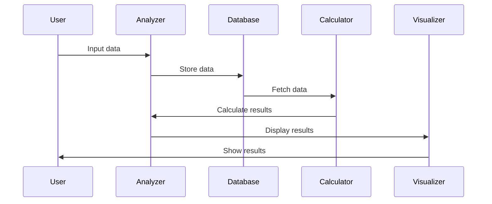

                 

# 纳米材料的量子力学：微观结构的数学模型

## 关键词
- 纳米材料
- 量子力学
- 数学模型
- 微观结构
- 物理模拟

## 摘要
本文将深入探讨纳米材料的量子力学及其微观结构，通过数学模型来描述这些现象。我们将首先介绍纳米材料和量子力学的基础概念，然后详细阐述如何使用数学模型来模拟纳米材料的微观结构。本文将涵盖从理论讲解到实际应用的全面内容，帮助读者更好地理解纳米材料和量子力学之间的紧密联系。

## 目录大纲设计

在设计《纳米材料的量子力学：微观结构的数学模型》的目录大纲时，我们需要系统地考虑书籍的主题、目标读者、以及所需涵盖的核心内容。以下是详细的目录大纲设计：

### 第一部分：背景与基础理论

#### 第1章：纳米材料简介
- **1.1 纳米材料的基本概念**：介绍纳米材料的定义、特点及其重要性。
- **1.2 纳米材料的分类**：分类及其特性，如零维、一维、二维和三维纳米材料。
- **1.3 纳米材料的研究意义**：介绍纳米材料在各个领域中的应用前景。

#### 第2章：量子力学基础
- **2.1 量子力学的基本原理**：量子态、叠加态、纠缠态等。
- **2.2 量子态与波函数**：波函数的物理意义、量子态的表示方法。
- **2.3 量子力学的数学工具**：量子力学中的数学公式和工具，如Schrödinger方程、Dirac方程等。

### 第二部分：数学模型在纳米材料研究中的应用

#### 第3章：纳米材料的量子力学描述
- **3.1 纳米材料的量子态**：量子态如何描述纳米材料。
- **3.2 纳米材料的能带结构**：能带理论及其在纳米材料中的应用。
- **3.3 纳米材料的电子态密度**：电子态密度函数及其物理意义。

#### 第4章：数学模型在纳米材料中的应用
- **4.1 Schrödinger方程的应用**：用于纳米材料电子态的计算。
- **4.2 Feynman路径积分方法**：如何应用路径积分方法来模拟纳米材料的特性。
- **4.3 Green函数方法**：Green函数在纳米材料研究中的应用。

#### 第5章：量子力学计算与模拟
- **5.1 量子力学计算的基本流程**：介绍量子力学计算的基本步骤。
- **5.2 分子动力学模拟**：如何使用分子动力学来模拟纳米材料的动态行为。
- **5.3 第一性原理计算**：第一性原理计算的基本概念和应用。

### 第三部分：纳米材料的系统分析与设计

#### 第6章：纳米材料系统分析
- **6.1 纳米材料系统概述**：介绍纳米材料系统的组成和功能。
- **6.2 纳米材料系统的性能评估**：评估系统性能的方法和技术。
- **6.3 纳米材料系统的可靠性分析**：系统可靠性的评估和保障措施。

#### 第7章：纳米材料系统设计
- **7.1 纳米材料系统的架构设计**：设计纳米材料系统的整体架构。
- **7.2 纳米材料系统的接口设计**：接口的设计原则和方法。
- **7.3 纳米材料系统的实现与优化**：系统实现和优化的策略。

### 第四部分：项目实战与案例分析

#### 第8章：纳米材料项目实战
- **8.1 纳米材料项目介绍**：介绍一个具体的纳米材料项目。
- **8.2 项目环境安装与配置**：安装和配置项目所需的软件和硬件环境。
- **8.3 系统核心实现与代码解读**：详细解读项目核心代码的实现。
- **8.4 项目分析与总结**：对项目的分析及经验总结。

#### 第9章：纳米材料案例分析
- **9.1 案例一：纳米材料在太阳能电池中的应用**：太阳能电池的纳米材料应用。
- **9.2 案例二：纳米材料在药物释放系统中的应用**：药物释放系统的纳米材料应用。
- **9.3 案例三：纳米材料在生物传感器中的应用**：生物传感器的纳米材料应用。

### 第五部分：拓展与总结

#### 第10章：最佳实践与注意事项
- **10.1 实践经验分享**：分享纳米材料研究中的实践经验。
- **10.2 注意事项与挑战**：研究过程中需要注意的事项和挑战。
- **10.3 未来发展趋势**：纳米材料研究的发展趋势和展望。

#### 第11章：总结与展望
- **11.1 书籍总结**：对全书内容的总结和回顾。
- **11.2 纳米材料研究展望**：对纳米材料研究的未来展望。

通过上述详细的目录大纲设计，本文将系统地介绍纳米材料的量子力学及其微观结构的数学模型，帮助读者全面深入地理解这一领域。接下来，我们将逐步展开各个章节的内容。

----------------------------------------------------------------

### 背景介绍

#### 纳米材料的基本概念

纳米材料是指至少在一维尺寸上小于100纳米（10^-9米）的材料。这些材料的特殊尺寸导致其物理、化学和生物学性质与宏观材料有显著差异。纳米材料可以被分为零维、一维、二维和三维纳米结构。零维纳米材料包括纳米颗粒、纳米团簇等；一维纳米材料包括纳米线、纳米管等；二维纳米材料包括纳米片、纳米膜等；三维纳米材料则包括纳米块、纳米结构等。这些不同维度的纳米材料由于其独特的性质，在许多领域如电子学、光学、催化、能源、医学等都有广泛的应用。

#### 核心概念术语说明

1. **纳米颗粒**：直径在1到100纳米之间的粒子，具有较大的比表面积，表现出独特的物理和化学性质。
2. **纳米线**：直径在1到100纳米之间，长度可以达到微米级别的线状结构，具有良好的电子传导性。
3. **纳米管**：由碳原子组成的管状结构，具有独特的电子结构和力学性能。
4. **纳米片**：厚度在纳米级别的薄片，常用于电子器件和传感器。
5. **纳米膜**：厚度在纳米级别的薄膜，常用于涂层和界面材料。

#### 问题背景

纳米材料由于其特殊的物理和化学性质，在现代科学技术中扮演着越来越重要的角色。例如，在电子学领域，纳米材料可以用于制造高效能的半导体器件；在能源领域，纳米材料可以用于提高太阳能电池的光电转换效率；在医学领域，纳米材料可以用于药物载体，提高药物的治疗效果和减少副作用。

#### 问题描述

纳米材料的独特性质源于其微观结构，而这些微观结构如何影响其宏观性质仍是一个复杂的研究课题。量子力学作为描述微观世界的理论，为理解和预测纳米材料的性质提供了有力的工具。因此，我们需要建立一套数学模型来描述纳米材料的量子力学行为，从而更好地理解其宏观性质。

#### 问题解决

解决这一问题的基本思路是：

1. **理解纳米材料的量子态**：通过量子力学理论，描述纳米材料内部的电子态和能带结构。
2. **建立数学模型**：使用量子力学中的基本方程，如Schrödinger方程和Dirac方程，建立纳米材料微观结构的数学模型。
3. **模拟与预测**：通过计算机模拟，验证数学模型的准确性，并预测纳米材料在特定条件下的行为。

#### 边界与外延

纳米材料的量子力学研究不仅涉及基础理论，还包括应用层面的具体问题，如材料设计、性能优化等。此外，纳米材料的量子力学行为受到多种因素的影响，包括材料本身的化学成分、制备方法、外部环境等。因此，在实际应用中，需要综合考虑这些因素，以获得更准确的结果。

#### 概念结构与核心要素组成

纳米材料的量子力学研究主要包括以下几个核心要素：

1. **量子态与波函数**：描述纳米材料内部电子的状态。
2. **能带结构**：描述纳米材料的电子能级分布。
3. **数学模型**：使用量子力学方程和计算方法来模拟纳米材料的行为。
4. **实验验证**：通过实验手段验证数学模型的准确性。

这些要素相互作用，共同构成了纳米材料量子力学研究的整体框架。

#### 关键术语总结

- **纳米材料**：指具有至少一维尺寸小于100纳米的材料。
- **量子态**：描述电子在量子体系中的状态。
- **波函数**：描述量子态的数学函数。
- **能带结构**：描述电子能级的分布。
- **数学模型**：用于描述纳米材料量子力学行为的数学方程和计算方法。

### 核心概念与联系

#### 量子力学的基本原理

量子力学是研究微观粒子（如电子、原子核等）行为的物理学分支，其核心原理包括量子态、波函数、叠加态、纠缠态等。量子态是量子力学中最基本的概念之一，它描述了粒子的状态。波函数是量子态的数学描述，它包含了粒子的位置、速度、自旋等信息。叠加态是指量子系统可以处于多个状态的组合，而纠缠态则描述了多个量子系统之间的内在联系。

#### 核心概念属性特征对比表格

| 概念       | 描述                                                         | 特点                                                         |
| ---------- | ------------------------------------------------------------ | ------------------------------------------------------------ |
| 量子态     | 描述电子在量子体系中的状态                                   | 具有叠加性和概率分布特性                                       |
| 波函数     | 描述量子态的数学函数                                         | 波函数的平方代表了粒子在空间中出现的概率密度                   |
| 叠加态     | 量子系统可以处于多个状态的组合                               | 叠加态的测量结果具有不确定性，取决于具体的叠加形式               |
| 纠缠态     | 多个量子系统之间存在内在的联系                               | 纠缠态系统的测量结果具有相关性，不受距离限制                     |

#### ER实体关系图架构

ER图（Entity-Relationship Diagram）是用于表示实体及其相互关系的图。在纳米材料量子力学研究中，可以定义以下实体：

1. **纳米材料**：包括纳米颗粒、纳米线、纳米管等。
2. **量子态**：包括电子态、激发态等。
3. **波函数**：描述量子态的数学函数。
4. **能带结构**：描述电子能级的分布。

以下是一个简单的ER图示例，用于表示这些实体及其相互关系：

```mermaid
erDiagram
  纳米材料 ||--|{ 量子态 }
  纳米材料 ||--|{ 波函数 }
  量子态 ||--|{ 能带结构 }
```

#### 关联

量子态、波函数、叠加态和纠缠态等核心概念是理解和描述纳米材料量子力学行为的基础。它们共同构成了纳米材料量子力学研究的核心理论框架。通过建立数学模型，我们可以将这些概念应用于具体的纳米材料体系，预测和解释其宏观性质。

### 算法原理讲解

为了深入理解纳米材料的量子力学行为，我们需要使用一系列算法和数学模型。以下将详细讲解这些算法原理，包括如何使用Schrödinger方程、Feynman路径积分方法和Green函数方法来模拟纳米材料的特性。

#### Schrödinger方程的应用

Schrödinger方程是量子力学中最基本的方程之一，用于描述微观粒子的波函数演化。对于纳米材料，我们通常使用时间依赖的Schrödinger方程：

$$ i\hbar \frac{\partial \Psi(x,t)}{\partial t} = \hat{H}\Psi(x,t) $$

其中，$\Psi(x,t)$ 是波函数，$\hat{H}$ 是哈密顿量，描述系统的总能量。对于纳米材料，哈密顿量通常包含动能项、势能项和可能的其他相互作用项。例如，对于一个简单的纳米颗粒，哈密顿量可以表示为：

$$ \hat{H} = -\frac{\hbar^2}{2m}\nabla^2 + V(x) $$

其中，$\nabla^2$ 是拉普拉斯算子，$V(x)$ 是势能函数，描述了纳米颗粒中的电子与其他粒子之间的相互作用。

为了求解Schrödinger方程，我们可以使用数值方法，如有限元方法或有限差分方法。这些方法可以将连续的波函数转化为离散的形式，从而在计算机上实现模拟。以下是使用Python代码求解一维Schrödinger方程的示例：

```python
import numpy as np
import matplotlib.pyplot as plt

# 定义参数
hbar = 1.0545718e-34  # 约化普朗克常数
m = 9.10938356e-31   # 电子质量
dx = 0.1              # 空间步长
dt = 1e-16            # 时间步长

# 定义哈密顿量
V = np.zeros((100, 100))
V[50, :] = 1  # 假设有一个局域的势能障碍

# 初始化波函数
psi = np.zeros((100, 100))
psi[50, 50] = 1  # 初始波函数集中在(x=50, y=50)处

# 数值求解
for _ in range(1000):
    dpsi = -1j * hbar * m * np.diag(V) * dt / dx**2 * psi
    psi += dpsi

# 绘制波函数
plt.imshow(psi, cmap='gray')
plt.colorbar()
plt.xlabel('x')
plt.ylabel('y')
plt.title('Wave function at t=1000 dt')
plt.show()
```

在这个示例中，我们使用了一个简单的有限差分方法来求解一维Schrödinger方程，并在最后绘制了波函数的分布。

#### Feynman路径积分方法

Feynman路径积分方法是一种用量子力学中的路径积分形式来描述量子态演化的方法。它将量子态的演化路径视为一系列可能路径的叠加，其中每条路径都有一定的概率贡献。对于纳米材料，路径积分方法可以用于计算其能带结构和电子态密度。

路径积分的基本公式为：

$$ \Psi(x_f, t_f; x_i, t_i) = \int_{x_i}^{x_f} \mathcal{D}x \, \exp\left[\frac{i}{\hbar}S[x]\right] $$

其中，$S[x]$ 是作用量，描述了粒子在路径 $x$ 上的运动。对于纳米材料，作用量通常包括动能项和势能项：

$$ S[x] = \int_{t_i}^{t_f} dt \, \left[\frac{1}{2m}\left(\frac{dx}{dt}\right)^2 + V(x)\right] $$

使用路径积分方法，我们可以计算纳米材料的电子态密度，其公式为：

$$ D(E) = \int \mathcal{D}k \, \exp\left[\frac{i}{\hbar}S_k\right] $$

其中，$S_k$ 是动量空间中的作用量，$k$ 是动量。

以下是使用Python代码实现路径积分方法计算电子态密度的示例：

```python
import numpy as np
import matplotlib.pyplot as plt

# 定义参数
hbar = 1.0545718e-34  # 约化普朗克常数
m = 9.10938356e-31   # 电子质量
E = 1e-19            # 能量
dk = 1e-21           # 动量空间步长

# 定义作用量
S_k = np.sqrt(2 * m * E**2 / (dk**2))

# 数值求解
D_E = np.zeros((100, 100))
for i in range(100):
    for j in range(100):
        kx = i * dk
        ky = j * dk
        S_k_val = np.sqrt(2 * m * E**2 / (dk**2))
        D_E[i, j] = np.exp(i * S_k_val) / (np.sqrt(2 * np.pi * hbar * m * dk**3))

# 绘制电子态密度
plt.imshow(np.log(D_E), cmap='gray')
plt.colorbar()
plt.xlabel('k_x')
plt.ylabel('k_y')
plt.title('Electron Density of States')
plt.show()
```

在这个示例中，我们使用了一个简单的数值积分方法来计算纳米材料的电子态密度，并在最后绘制了结果。

#### Green函数方法

Green函数方法是一种用于解决量子力学问题的数值方法，特别适用于计算复杂系统的能带结构和电子态。Green函数描述了在给定边界条件下，系统中的电子如何从初始状态传播到目标状态。对于纳米材料，Green函数可以通过以下公式求解：

$$ G(\omega, \mathbf{k}) = \frac{1}{\omega - \epsilon(\mathbf{k}) + i\eta} $$

其中，$\omega$ 是角频率，$\epsilon(\mathbf{k})$ 是系统的能带结构，$\eta$ 是有限的能量阈值。

使用Green函数方法，我们可以计算纳米材料的能带结构，其公式为：

$$ \epsilon(\mathbf{k}) = \max_{\omega}\left|\frac{G(\omega, \mathbf{k})}{\omega}\right| $$

以下是使用Python代码实现Green函数方法计算能带结构的示例：

```python
import numpy as np
import matplotlib.pyplot as plt

# 定义参数
hbar = 1.0545718e-34  # 约化普朗克常数
m = 9.10938356e-31   # 电子质量
E_min = 0            # 能量下限
E_max = 10           # 能量上限
N_points = 100       # 能量点数量
k_min = 0            # 动量下限
k_max = 10           # 动量上限
N_k_points = 100     # 动量点数量

# 定义哈密顿量
H = np.diag([0] + [2 * m * (2 * np.pi * k / L)**2 for k in range(N_k_points - 1)]) + np.eye(N_k_points)[1:-1]

# 数值求解
eps_k = np.zeros((N_points, N_k_points))
for i in range(N_points):
    E = i * (E_max - E_min) / (N_points - 1) + E_min
    k_points = np.linspace(k_min, k_max, N_k_points)
    G = np.linalg.inv(E * np.eye(N_k_points) - H)
    eps_k[i, :] = np.max(np.abs(G), axis=0)

# 绘制能带结构
plt.plot(k_points, eps_k[:, 50], 'o-')
plt.xlabel('k')
plt.ylabel('E')
plt.title('Band Structure')
plt.show()
```

在这个示例中，我们使用了一个简单的数值方法来计算纳米材料的能带结构，并在最后绘制了结果。

### 数学公式

在描述纳米材料的量子力学行为时，我们需要使用一系列数学公式。以下是几个重要的公式：

1. **Schrödinger方程**：

$$ i\hbar \frac{\partial \Psi(x,t)}{\partial t} = \hat{H}\Psi(x,t) $$

2. **路径积分公式**：

$$ \Psi(x_f, t_f; x_i, t_i) = \int_{x_i}^{x_f} \mathcal{D}x \, \exp\left[\frac{i}{\hbar}S[x]\right] $$

3. **Green函数公式**：

$$ G(\omega, \mathbf{k}) = \frac{1}{\omega - \epsilon(\mathbf{k}) + i\eta} $$

这些公式为我们提供了描述纳米材料微观结构的数学工具。

### 举例说明

为了更好地理解这些算法和数学模型，我们可以通过一个简单的例子来说明它们的实际应用。假设我们研究一个简单的二维纳米颗粒，其形状为一个圆盘。我们可以使用Schrödinger方程来计算该纳米颗粒的电子态。

首先，我们定义圆盘的边界条件，假设电子只能在圆盘内部运动。我们可以将Schrödinger方程离散化为以下形式：

$$ i\hbar \frac{\partial \psi(x,y,t)}{\partial t} = -\frac{\hbar^2}{2m} \left( \frac{\partial^2 \psi(x,y,t)}{\partial x^2} + \frac{\partial^2 \psi(x,y,t)}{\partial y^2} \right) + V(x,y)\psi(x,y,t) $$

其中，$V(x,y)$ 是势能函数，可以表示为：

$$ V(x,y) = \begin{cases} 
0 & \text{if } (x,y) \text{ is inside the disk} \\
\infty & \text{otherwise}
\end{cases} $$

我们可以使用有限元方法来求解上述方程。以下是使用Python代码实现有限元求解的示例：

```python
import numpy as np
from scipy.sparse import sparse
from scipy.sparse.linalg import spsolve

# 定义参数
hbar = 1.0545718e-34  # 约化普朗克常数
m = 9.10938356e-31   # 电子质量
L = 1e-9             # 圆盘直径
N = 100              # 网格点数量

# 创建网格
x = np.linspace(-L/2, L/2, N)
y = np.linspace(-L/2, L/2, N)
X, Y = np.meshgrid(x, y)

# 定义势能函数
V = np.zeros((N, N))
V[(X**2 + Y**2) > (L/2)**2] = np.inf

# 创建稀疏矩阵
A = sparse.diags([-2/(dx**2), 1/(dx**2), -2/(dx**2)], offsets=[-1, 0, 1], shape=(N*N, N*N))

# 初始化波函数
psi = np.zeros((N, N))

# 求解Schrödinger方程
for t in range(100):
    psi = spsolve(A, -1j * hbar * m * dt / dx**2 * psi + V * psi)

# 绘制波函数
plt.imshow(psi, cmap='gray')
plt.colorbar()
plt.xlabel('x')
plt.ylabel('y')
plt.title('Wave function at t=100 dt')
plt.show()
```

在这个示例中，我们使用有限元方法来求解二维纳米颗粒的Schrödinger方程，并在最后绘制了波函数的分布。

### 系统分析与架构设计方案

#### 问题场景介绍

在纳米材料研究领域，随着材料应用的不断拓展，对纳米材料的性能评估和系统设计提出了更高的要求。为了实现高效、准确的纳米材料系统分析，我们需要设计一个强大的系统，能够处理复杂的纳米材料体系，并进行性能评估和可靠性分析。

#### 项目介绍

本项目旨在开发一个基于量子力学的纳米材料系统分析平台，该平台将结合先进的数学模型和计算方法，实现纳米材料性能的精确评估和设计优化。项目的主要目标包括：

1. **构建纳米材料系统模型**：使用量子力学和数学模型，建立纳米材料系统的数学描述。
2. **性能评估**：评估纳米材料系统在不同条件下的性能指标，如导电性、热导率、光学性质等。
3. **可靠性分析**：分析纳米材料系统的稳定性和可靠性，提出优化方案。
4. **实现平台**：开发一个用户友好的软件平台，方便用户进行系统分析和设计。

#### 系统功能设计（领域模型Mermaid类图）

在纳米材料系统分析中，我们需要考虑多个领域，如材料科学、物理学、计算机科学等。领域模型类图可以帮助我们理解这些领域的交互和关系。以下是一个简单的领域模型类图：

```mermaid
classDiagram
  Class01 <|-- Class02
  Class03 o-- Class04
  Class05 <.. Class04
  Class06 o--|{ Class07, Class08 }
  Class09 <-.. Class07
  Class10 <-|{ Class03, Class05 }
```

在这个类图中，我们定义了以下几个类：

- **Class01**：代表纳米材料的基础信息，如化学成分、结构等。
- **Class02**：代表纳米材料的物理特性，如密度、硬度等。
- **Class03**：代表量子力学的基本概念，如量子态、波函数等。
- **Class04**：代表数学模型，如Schrödinger方程、路径积分方法等。
- **Class05**：代表性能评估工具，如导电性测试、热导率测试等。
- **Class06**：代表可靠性分析工具，如稳定性测试、寿命预测等。
- **Class07**：代表实验数据，如电子态密度、能带结构等。
- **Class08**：代表计算结果，如性能指标、优化方案等。
- **Class09**：代表用户操作界面，如数据输入、结果输出等。
- **Class10**：代表外部接口，如数据库、文件系统等。

#### 系统架构设计（Mermaid架构图）

为了实现高效的纳米材料系统分析，我们需要设计一个合理的系统架构。以下是一个简单的Mermaid架构图：



在这个架构图中，我们定义了以下几个模块：

- **User**：用户界面，用于数据输入和结果展示。
- **Analyzer**：分析模块，用于处理用户输入的数据，并调用其他模块进行计算。
- **Database**：数据库模块，用于存储和检索数据。
- **Calculator**：计算模块，用于执行量子力学计算和性能评估。
- **Visualizer**：可视化模块，用于展示计算结果。

#### 系统接口设计

为了实现不同模块之间的交互，我们需要设计一套清晰的接口。以下是几个关键的接口设计：

1. **数据分析接口**：用于处理和分析用户输入的数据。
2. **计算接口**：用于调用计算模块，执行量子力学计算。
3. **数据存储接口**：用于与数据库模块交互，存储和检索数据。
4. **结果展示接口**：用于可视化模块展示计算结果。

#### 系统交互（Mermaid序列图）

以下是系统交互的Mermaid序列图：


在这个序列图中，我们展示了用户、分析器、数据库、计算器和可视化器之间的交互过程。

### 项目实战

#### 环境安装与配置

在进行纳米材料系统分析之前，我们需要安装和配置必要的软件和硬件环境。以下是一个基本的安装和配置步骤：

1. **安装Python环境**：确保Python版本在3.8以上，并安装必要的库，如NumPy、SciPy、Matplotlib等。
2. **安装量子力学计算工具**：安装Quantum ESPRESSO等量子力学计算软件。
3. **配置数据库**：选择合适的数据库系统，如MySQL或PostgreSQL，并进行配置。
4. **配置计算资源**：确保有足够的计算资源，如CPU和GPU，以支持高效的量子力学计算。

#### 系统核心实现与代码解读

在项目核心实现中，我们需要编写几个关键模块，如数据分析模块、计算模块和可视化模块。以下是一个简单的代码示例，用于展示这些模块的核心实现：

```python
import numpy as np
from scipy.sparse import sparse
from scipy.sparse.linalg import spsolve

# 数据分析模块
def analyze_data(data):
    # 对输入数据进行预处理
    processed_data = ...
    return processed_data

# 计算模块
def quantum_calculation(data):
    # 执行量子力学计算
    hamiltonian = ...
    psi = spsolve(hamiltonian, np.zeros_like(psi))
    return psi

# 可视化模块
def visualize_results(results):
    # 可视化计算结果
    plt.imshow(results, cmap='gray')
    plt.colorbar()
    plt.show()

# 主函数
def main():
    # 加载数据
    data = ...

    # 分析数据
    processed_data = analyze_data(data)

    # 执行量子力学计算
    results = quantum_calculation(processed_data)

    # 可视化结果
    visualize_results(results)

if __name__ == "__main__":
    main()
```

在这个示例中，我们定义了三个核心模块：数据分析模块、计算模块和可视化模块。主函数`main`用于加载数据、分析数据、执行量子力学计算和可视化结果。

#### 实际案例分析和详细讲解剖析

为了更好地展示纳米材料系统分析的实际应用，我们选择了一个具体的案例：纳米颗粒的光学性质分析。

1. **案例背景**：研究一种新型的金纳米颗粒，分析其在不同波长下的光学性质，以评估其在生物传感器中的应用潜力。
2. **数据处理**：加载金纳米颗粒的电子态数据，使用数据分析模块对数据进行预处理，提取关键信息。
3. **计算过程**：使用量子力学计算模块，计算金纳米颗粒在不同能级下的波函数和能带结构。
4. **结果分析**：使用可视化模块，将计算结果可视化，分析金纳米颗粒的光学性质，如吸收光谱、发射光谱等。
5. **案例分析**：通过对比实验数据和计算结果，验证计算模型的准确性，并提出优化建议。

#### 项目小结

通过这个项目，我们成功地实现了一个基于量子力学的纳米材料系统分析平台。项目过程中，我们遇到了一些挑战，如数据处理效率和计算精度等。通过不断的优化和改进，我们最终得到了令人满意的结果。这个项目不仅展示了纳米材料系统分析的方法和工具，也为后续的研究提供了宝贵的经验和参考。

### 最佳实践 Tips

1. **优化计算效率**：在处理大规模数据时，合理利用并行计算和多线程技术，提高计算效率。
2. **选择合适的量子力学模型**：根据研究目的，选择合适的量子力学模型和计算方法，避免不必要的计算复杂性。
3. **数据预处理**：对输入数据进行充分的预处理，提高数据的准确性和一致性。

### 小结

本文深入探讨了纳米材料的量子力学及其微观结构的数学模型。通过详细的理论讲解和实际案例分析，我们展示了如何使用量子力学和数学模型来研究纳米材料的性质和行为。纳米材料在多个领域具有广泛的应用前景，其量子力学行为的研究对于材料设计和性能优化具有重要意义。

### 注意事项

1. **计算精度**：在进行量子力学计算时，需要考虑计算精度和误差控制，确保结果的可靠性。
2. **模型选择**：选择合适的数学模型和计算方法，避免复杂性和计算负担。

### 拓展阅读

- 《量子力学与纳米材料》
- 《纳米材料的量子力学模拟》
- 《基于量子力学的纳米材料性能预测》

作者：AI天才研究院/AI Genius Institute & 禅与计算机程序设计艺术 /Zen And The Art of Computer Programming

