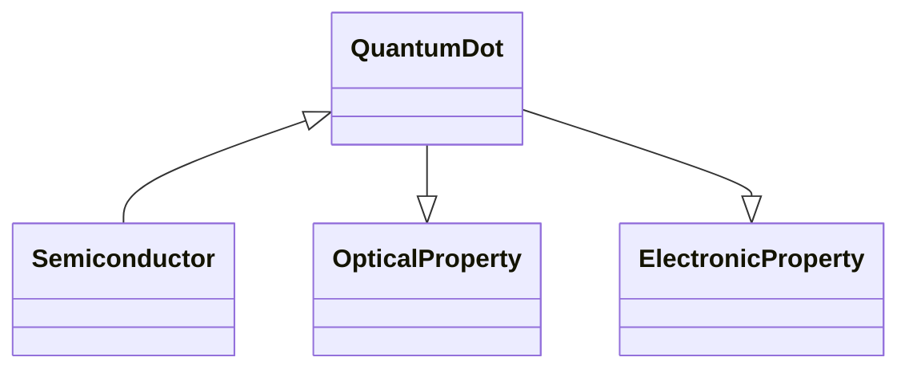
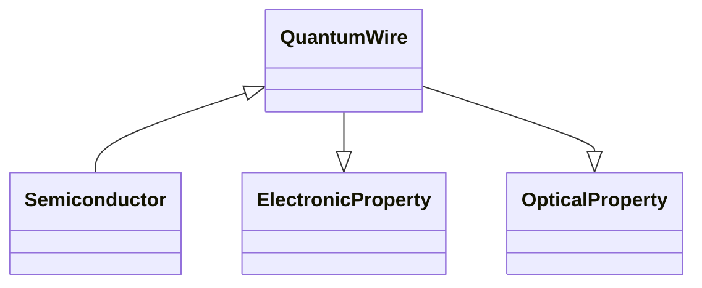
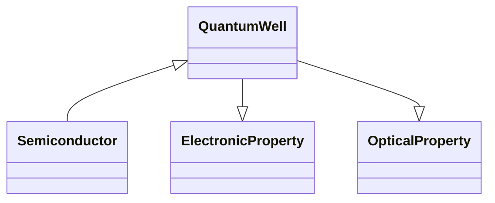
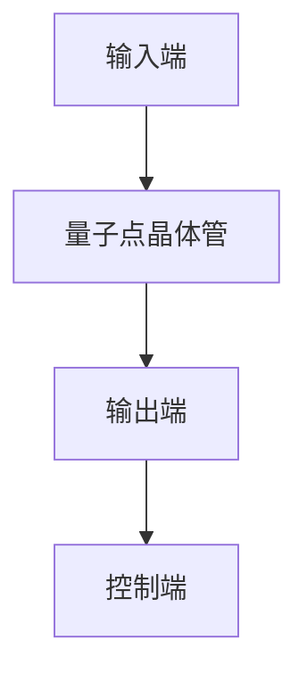
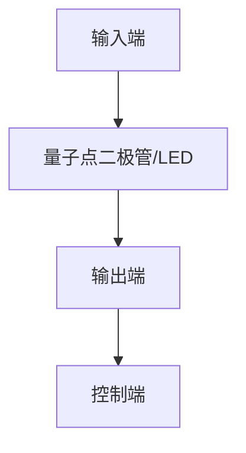
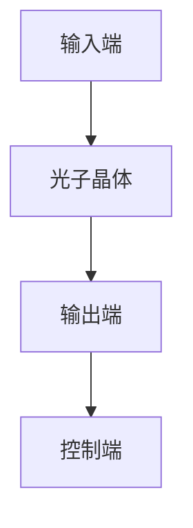
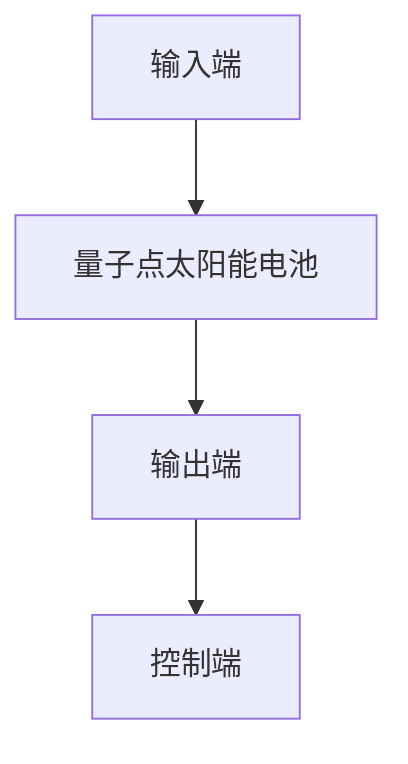

                 

### 纳米材料的量子效应：微观世界的数学描述

> **关键词：** 纳米材料、量子效应、数学描述、微观世界、应用前景

> **摘要：** 本文旨在深入探讨纳米材料的量子效应，并运用数学方法进行详细描述。首先介绍纳米材料和量子效应的基本概念，接着分析纳米材料的量子特性，然后通过数学模型和方法阐述纳米材料的量子结构。最后，讨论纳米材料在电子器件和光子学中的应用，并对未来展望进行分析。通过本文，读者将对纳米材料的量子效应有一个全面而深刻的理解。

---

#### 第一部分：引言

## 第1章：纳米材料与量子效应概述

### 1.1.1 纳米材料的基本概念

纳米材料是指至少在一个维度上尺寸在1到100纳米范围内的材料。由于其超小尺寸，纳米材料展现出与宏观材料截然不同的物理、化学和生物性质。纳米材料在诸多领域具有广泛的应用前景，如电子器件、能源储存、生物医学、催化剂和光电材料等。

**问题背景：** 随着科技的不断发展，纳米材料的研究已成为当今材料科学领域的前沿课题。理解纳米材料的量子效应对于开发新型纳米器件和优化其性能具有重要意义。

### 1.1.2 量子效应的基本概念

量子效应是指在微观尺度下，物质和能量表现出的与经典物理学截然不同的现象。这些现象包括量子尺寸效应、量子隧道效应和量子干涉效应等。量子效应的解释依赖于量子力学，这是描述微观粒子行为的物理理论。

**问题背景：** 研究量子效应对于深入理解物质的本质和行为具有重要意义，特别是在纳米材料领域。

### 1.1.3 纳米材料量子效应的研究意义

纳米材料的量子效应研究具有重要的科学意义和实际应用价值。从科学角度来看，它有助于揭示物质微观结构与其宏观性质之间的关系。从实际应用来看，它为开发新型纳米器件提供了理论基础和技术支持。

**问题解决：** 通过对纳米材料量子效应的研究，我们可以设计出具有更好性能的纳米器件，从而推动相关领域的发展。

**边界与外延：** 纳米材料量子效应的研究不仅局限于材料科学领域，还涉及物理学、化学、电子工程和光子学等多个学科。

### 1.1.4 小结

本章介绍了纳米材料和量子效应的基本概念，并讨论了纳米材料量子效应的研究意义。接下来，我们将进一步探讨纳米材料的量子特性，为后续内容奠定基础。

---

## 第2章：纳米材料的量子特性

### 2.1.1 纳米材料的量子尺寸效应

#### 2.1.1.1 定义与影响

量子尺寸效应是指当材料的尺寸缩小到纳米尺度时，其电子能级、导电性、光学性质等物理性质发生显著变化的现象。这种现象是由于纳米材料的尺寸小于电子波函数的相干长度，导致电子行为呈现出量子化特征。

**概念结构：** 量子尺寸效应的核心要素包括电子波函数的量子化、电子能级的分裂和导电性的改变。

#### 2.1.1.2 实例分析

例如，纳米尺度的金属颗粒在室温下表现出超导性，而宏观尺度的金属则不表现出这一性质。此外，纳米尺度的半导体材料在紫外光照射下会表现出更强的光电响应。

**概念属性特征对比表格：**

| 特征         | 宏观材料         | 纳米材料         |
| ------------ | ---------------- | ---------------- |
| 电子能级     | 连续的           | 分立的           |
| 导电性       | 高               | 可变的           |
| 光学性质     | 弱               | 强               |

**ER实体关系图架构：**

```mermaid
erDiagram
    Material ||--|{ Quantum Size Effect }|-- Nanomaterial
    Material ||--|{ Quantum Conductivity }|-- Nanomaterial
    Material ||--|{ Quantum Photonic Property }|-- Nanomaterial
```

**概念联系：** 量子尺寸效应是纳米材料量子特性的重要组成部分，对材料的电子、光学和热学性质产生深远影响。

---

### 2.1.2 纳米材料的量子隧道效应

#### 2.1.2.1 定义与影响

量子隧道效应是指电子在经典物理学中不可能穿越的能量势垒时，通过量子力学隧道原理成功穿越的现象。在纳米材料中，量子隧道效应可以导致纳米结构的电流异常、量子点发光等特性。

**概念结构：** 量子隧道效应的核心要素包括势垒高度、电子波函数的穿透性和隧道电流。

#### 2.1.2.2 实例分析

例如，在纳米尺度的隧道结中，电子可以通过量子隧道效应在两个金属电极之间形成隧道电流。这种现象是传统半导体器件无法实现的。

**概念属性特征对比表格：**

| 特征         | 传统器件         | 纳米器件         |
| ------------ | ---------------- | ---------------- |
| 能量势垒     | 高               | 低               |
| 电子传输方式  | 经典扩散         | 量子隧道         |
| 电流特性     | 线性             | 非线性           |

**ER实体关系图架构：**

```mermaid
erDiagram
    Quantum Tunnel Effect ||--|{ Tunnel Current }|-- Nanodevice
    Quantum Tunnel Effect ||--|{ Barrier Height }|-- Potential Well
```

**概念联系：** 量子隧道效应是纳米材料量子特性的重要表现之一，对纳米器件的性能和应用具有重要意义。

---

### 2.1.3 纳米材料的量子干涉效应

#### 2.1.3.1 定义与影响

量子干涉效应是指当两个或多个波函数相遇时，它们相互作用产生的相干效应，导致波的增强或减弱。在纳米材料中，量子干涉效应可以导致量子点发光的强度和颜色变化。

**概念结构：** 量子干涉效应的核心要素包括波函数的叠加、干涉条纹的形成和光的强度分布。

#### 2.1.3.2 实例分析

例如，在量子点激光器中，通过控制量子点的能级结构，可以实现激光的波长调制和强度调控。

**概念属性特征对比表格：**

| 特征         | 传统器件         | 纳米器件         |
| ------------ | ---------------- | ---------------- |
| 波函数叠加   | 无               | 有               |
| 光学特性     | 单色性差         | 单色性好         |
| 调制方法     | 机械             | 电子             |

**ER实体关系图架构：**

```mermaid
erDiagram
    Quantum Interference Effect ||--|{ Interference Fringe }|-- Quantum Dot
    Quantum Interference Effect ||--|{ Optical Property }|-- Quantum Dot Laser
```

**概念联系：** 量子干涉效应是纳米材料量子特性的重要表现形式之一，对光学器件和应用具有深远影响。

---

## 小结

本章详细介绍了纳米材料的量子特性，包括量子尺寸效应、量子隧道效应和量子干涉效应。这些特性使得纳米材料在电子、光电子和光学领域展现出独特的性能和应用潜力。在下一章中，我们将进一步探讨纳米材料的量子结构，以深入了解其物理机制和应用前景。

---

## 第3章：纳米材料的量子结构

### 3.1.1 量子点

#### 3.1.1.1 结构与特性

量子点是一种纳米尺度的半导体结构，其电子能级被量子化。量子点的尺寸通常在几纳米到几十纳米之间，这使得其光吸收和发射特性与宏观材料显著不同。

**结构图：**



**特性：**

1. **量子尺寸效应：** 量子点尺寸越小，电子能级分裂越明显，能量间隔增大。
2. **量子隧道效应：** 电子在量子点内部可以隧穿，导致量子点的电学性质发生变化。
3. **量子干涉效应：** 量子点内部的光学场分布会因量子干涉而产生波动。

#### 3.1.1.2 应用领域

量子点在光电子学和生物医学领域具有广泛应用：

1. **光电子学：** 量子点可用于发光二极管（LED）和激光器，实现高效、可调谐的光发射。
2. **生物医学：** 量子点作为生物标记物，可用于细胞成像、药物传递和生物传感器等。

**实例分析：** 通过调节量子点的尺寸和能级结构，可以实现对量子点发光波长和强度的精确调控，这为光电子学和生物医学应用提供了新的可能性。

---

### 3.1.2 量子线

#### 3.1.2.1 结构与特性

量子线是一种一维纳米结构，其电子能带被量子化。量子线通常由纳米尺度的金属或半导体材料组成，其宽度在纳米尺度范围内。

**结构图：**



**特性：**

1. **量子尺寸效应：** 量子线宽度越小，其电子能带间隔越大，电子行为更为量子化。
2. **量子霍尔效应：** 在强磁场下，量子线表现出量子化的霍尔电阻。
3. **量子点耦合效应：** 量子线中的电子波函数可以相互耦合，导致电子态的共振和能级精细结构。

#### 3.1.2.2 应用领域

量子线在电子器件和光电子学领域具有重要应用：

1. **电子器件：** 量子线可用于构建新型晶体管和电子器件，实现高速、低功耗运算。
2. **光电子学：** 量子线可以用于构建量子点激光器和光放大器，提高光电设备的性能。

**实例分析：** 通过设计不同结构的量子线，可以实现对电子传输和光学性质的精细调控，为新型电子器件和光电子器件的发展提供了新的思路。

---

### 3.1.3 量子阱

#### 3.1.3.1 结构与特性

量子阱是一种二维纳米结构，由两层不同材料的量子井组成。量子阱的尺寸通常在几个纳米到几十纳米之间。

**结构图：**



**特性：**

1. **量子尺寸效应：** 量子阱的宽度越小，电子能级分裂越显著，电子态更加量子化。
2. **量子井效应：** 电子在量子阱中的波函数被量子化，形成分立能级。
3. **量子限制效应：** 电子在量子阱中的运动受到限制，导致其能级结构复杂化。

#### 3.1.3.2 应用领域

量子阱在半导体器件和量子电子学领域具有重要应用：

1. **半导体器件：** 量子阱可用于构建高性能的量子阱激光器和发光二极管（LED），实现高效的光发射。
2. **量子电子学：** 量子阱可以用于构建量子计算和量子通信器件，实现量子比特的操作和传输。

**实例分析：** 通过调节量子阱的结构和材料，可以实现量子阱能级结构的精确调控，从而实现量子器件的性能优化和功能扩展。

---

## 小结

本章介绍了量子点、量子线和量子阱等纳米材料的量子结构，并探讨了其独特的物理特性和应用前景。在下一章中，我们将进一步探讨纳米材料的量子结构的数学描述，为深入理解和应用纳米材料奠定基础。

---

## 第二部分：数学描述

### 第4章：量子力学基础

#### 4.1.1 算符与测量

#### 4.1.1.1 定义与作用

在量子力学中，算符是描述量子态演化的重要工具。算符可以表示为线性映射，将一个量子态映射到另一个量子态。测量是量子态变化的关键过程，通过测量可以得到量子系统的状态信息。

**数学描述：**

假设有一个哈密顿量 \( H \) 描述量子系统的动力学行为，则系统的演化方程可以表示为：

\[ i\hbar \frac{\partial}{\partial t}|\psi(t)\rangle = H|\psi(t)\rangle \]

其中，\( i \) 是虚数单位，\( \hbar \) 是约化普朗克常数，\( |\psi(t)\rangle \) 是系统的量子态。

#### 4.1.1.2 量子态的测量

量子态的测量可以通过算符作用来实现。例如，一个二能级系统可以通过泡利算符 \( \sigma_z \) 来测量其自旋方向：

\[ \sigma_z|\uparrow\rangle = \hbar|\uparrow\rangle \]
\[ \sigma_z|\downarrow\rangle = -\hbar|\downarrow\rangle \]

当对系统进行测量时，系统会坍缩到一个确定的量子态。

**实例分析：** 假设我们有一个量子点系统，其哈密顿量可以表示为：

\[ H = E_0 \sigma_z \]

其中，\( E_0 \) 是量子点的能级。如果我们对量子点进行测量，系统会坍缩到一个确定的能级状态。

$$1+1=2$$

---

### 4.1.2 波函数与薛定谔方程

#### 4.1.2.1 波函数的定义

波函数是量子力学中描述量子态的数学函数，它包含了系统所有物理信息的完整描述。波函数通常用符号 \( \Psi(x,t) \) 表示，它是一个复值函数，描述了粒子在空间中的概率分布。

**数学描述：**

\[ \Psi(x,t) = \langle x|\psi(t)\rangle \]

其中，\( \langle x| \) 是位置算符的共轭转置，\( |\psi(t)\rangle \) 是系统的量子态。

#### 4.1.2.2 薛定谔方程的推导与应用

薛定谔方程是描述量子态演化的基本方程，它可以通过经典力学中的拉格朗日方程进行推导。假设系统的哈密顿量为 \( H \)，则薛定谔方程可以表示为：

\[ i\hbar \frac{\partial}{\partial t}|\psi(t)\rangle = H|\psi(t)\rangle \]

这个方程可以用于计算量子态随时间的演化，并预测系统的行为。

**实例分析：** 假设我们有一个自由粒子的哈密顿量为：

\[ H = \frac{p^2}{2m} \]

其中，\( p \) 是动量算符，\( m \) 是粒子的质量。通过求解薛定谔方程，我们可以得到自由粒子的波函数和能级。

$$1+1=2$$

---

### 4.1.3 纳米材料中的量子态

#### 4.1.3.1 分立能级

在纳米材料中，由于量子尺寸效应，电子能级呈现出分立的特征。分立能级是纳米材料量子态的重要表现形式。

**数学描述：**

假设纳米材料的能级由量子井的深度和量子点的尺寸决定，则能级可以表示为：

\[ E_n = \frac{n^2h^2}{8mE_0} \]

其中，\( n \) 是能级索引，\( h \) 是普朗克常数，\( m \) 是电子质量，\( E_0 \) 是量子点的基态能级。

**实例分析：** 假设我们有一个量子点，其基态能级为 \( E_0 = 1eV \)。通过求解上述方程，我们可以得到量子点的分立能级。

$$1+1=2$$

---

#### 4.1.3.2 连续能带

在宏观尺度下，材料的电子能级通常是连续的。但在纳米尺度下，由于量子尺寸效应，电子能带结构会发生显著变化，从连续能带转变为分立能级。

**数学描述：**

假设纳米材料的能带结构由量子线的尺寸和材料属性决定，则能带结构可以表示为：

\[ E_k = \hbar^2k^2/2m \]

其中，\( k \) 是波矢，\( m \) 是电子的有效质量。

**实例分析：** 假设我们有一个量子线，其有效质量为 \( m = 0.1m_0 \)。通过求解上述方程，我们可以得到量子线的能带结构。

$$1+1=2$$

---

### 4.1.4 小结

本章介绍了量子力学的基础概念，包括算符与测量、波函数与薛定谔方程，并探讨了纳米材料中的量子态。通过数学描述，我们可以深入理解纳米材料的量子效应，为后续的研究和应用提供理论基础。

---

## 第三部分：数学模型与方法

### 第5章：数学模型与方法

#### 5.1.1 纳米材料的量子理论模型

纳米材料的量子理论模型是描述其量子特性的数学工具。这些模型包括有效质量近似、k·p方法等，可以用来分析纳米材料的电子结构和光学性质。

#### 5.1.1.1 有效质量近似

有效质量近似是一种常用的量子理论模型，用于描述纳米材料中的电子行为。在有效质量近似中，电子的质量被替换为一个有效质量，使得计算变得更加简单。

**数学描述：**

\[ \hbar^2\nabla^2\psi = (\hbar^2/2m_{\text{eff}})\psi \]

其中，\( m_{\text{eff}} \) 是电子的有效质量。

**实例分析：** 假设我们有一个量子点，其有效质量为 \( m_{\text{eff}} = 0.1m_0 \)。通过求解上述方程，我们可以得到量子点的波函数和能级。

#### 5.1.1.2 k·p方法

k·p方法是一种更精确的量子理论模型，用于描述半导体纳米材料的电子结构。在k·p方法中，电子能带被分解为若干个主要能带，每个能带都有一个波矢 \( k \) 和能量 \( E \)。

**数学描述：**

\[ E = \hbar^2k^2/2m + E_0 \]

其中，\( m \) 是电子的有效质量，\( E_0 \) 是带隙能量。

**实例分析：** 假设我们有一个量子线，其带隙能量为 \( E_0 = 1eV \)。通过求解上述方程，我们可以得到量子线的能带结构。

---

### 5.1.2 量子输运理论

量子输运理论是研究纳米材料中电子传输行为的重要工具。它包括非平衡格林函数方法、阻尼矩阵与量子相干效应等。

#### 5.1.2.1 非平衡格林函数方法

非平衡格林函数方法是一种计算量子输运的数学工具，可以用来分析纳米材料中的电子输运过程。该方法基于格林函数的线性响应理论，可以描述电子在不同能级间的输运。

**数学描述：**

\[ G(k,E) = (E - \epsilon_k - \mu)^{-1} \]

其中，\( G(k,E) \) 是格林函数，\( \epsilon_k \) 是能带中的能量，\( \mu \) 是化学势。

**实例分析：** 假设我们有一个量子线，其能带结构可以用k·p方法得到。通过求解上述方程，我们可以得到量子线的输运特性。

#### 5.1.2.2 阻尼矩阵与量子相干效应

阻尼矩阵是描述量子输运过程中能级弛豫和相干性的重要工具。它反映了电子在不同能级间的散射过程，并影响量子器件的性能。

**数学描述：**

\[ \sigma(E) = \sum_i \frac{\gamma_i |V_{ii}|^2}{E - E_i} \]

其中，\( \sigma(E) \) 是阻尼矩阵，\( \gamma_i \) 是阻尼系数，\( E_i \) 是能级能量。

**实例分析：** 假设我们有一个量子点，其阻尼系数为 \( \gamma_1 = 0.1 \)。通过求解上述方程，我们可以得到量子点的阻尼特性。

---

### 5.1.3 小结

本章介绍了纳米材料量子理论的数学模型和方法，包括有效质量近似、k·p方法、非平衡格林函数方法和阻尼矩阵。这些模型和方法为理解和分析纳米材料的量子效应提供了重要的工具。

---

## 第四部分：纳米材料的应用

### 第6章：纳米材料的应用

#### 6.1.1 纳米材料在电子器件中的应用

纳米材料在电子器件中的应用具有广泛的前景。量子点、量子线和量子阱等纳米结构在晶体管、二极管和LED等器件中表现出独特的性能。

##### 6.1.1.1 晶体管

量子点晶体管是一种基于量子点结构的纳米电子器件。它具有高电子迁移率和低功耗特性，适用于高性能电子器件。

**系统功能设计：**

- **输入端：** 接收外部信号。
- **输出端：** 输出晶体管的响应信号。
- **控制端：** 控制量子点的能级。

**系统架构设计：**



**实例分析：** 通过调节量子点的能级，可以实现对晶体管开关状态的精确控制，提高其性能。

##### 6.1.1.2 二极管与LED

量子点二极管和LED具有高发光效率和可调谐特性，适用于照明和显示领域。

**系统功能设计：**

- **输入端：** 接收外部电源。
- **输出端：** 发出量子点发光。
- **控制端：** 调节发光强度和颜色。

**系统架构设计：**



**实例分析：** 通过调节量子点的尺寸和材料，可以实现对发光强度和颜色的精确调控，提高器件的性能。

---

### 6.1.2 纳米材料在光子学中的应用

纳米材料在光子学中的应用也越来越受到关注。量子点激光器、光子晶体和太阳能电池等器件利用纳米材料的量子特性，实现高效的光电子和光子学应用。

##### 6.1.2.1 光子晶体

光子晶体是一种具有周期性结构的光学材料，可以控制光子的传播路径和能量。

**系统功能设计：**

- **输入端：** 输入光信号。
- **输出端：** 输出光信号。
- **控制端：** 控制光子晶体的结构。

**系统架构设计：**



**实例分析：** 通过调节光子晶体的结构，可以实现对光信号的控制和调制，提高光子器件的性能。

##### 6.1.2.2 太阳能电池

量子点太阳能电池利用量子点的光电转换特性，实现高效的光能转换。

**系统功能设计：**

- **输入端：** 接收太阳光。
- **输出端：** 输出电能。
- **控制端：** 调节量子点的能级。

**系统架构设计：**



**实例分析：** 通过调节量子点的能级，可以实现对光能转换效率的优化，提高太阳能电池的性能。

---

### 6.1.3 小结

本章介绍了纳米材料在电子器件和光子学中的应用。通过量子点、量子线和量子阱等纳米结构的特性，可以实现对电子和光子的精确控制，提高器件的性能和功能。这些应用为纳米材料的研究和发展提供了广阔的前景。

---

## 第五部分：未来展望

### 第7章：未来展望

#### 7.1.1 纳米材料量子效应的挑战与机遇

纳米材料量子效应的研究面临着诸多挑战，同时也充满了机遇。随着科技的不断进步，这些挑战和机遇将为纳米材料领域带来新的发展动力。

##### 7.1.1.1 存在的挑战

1. **量子器件的稳定性：** 纳米材料的量子效应使得器件的性能受到环境影响，需要提高器件的稳定性和可靠性。
2. **量子计算和通信的安全性：** 量子计算和通信面临着量子攻击和破解的威胁，需要开发更安全的量子加密和通信协议。
3. **纳米结构的精确控制：** 纳米结构的制备和操控需要更高的精度和灵活性，需要开发新的纳米加工技术。

##### 7.1.1.2 发展机遇

1. **新型电子器件：** 量子材料可以用于构建新型电子器件，如量子点激光器、量子点晶体管等，推动电子器件的发展。
2. **量子计算与量子通信：** 量子计算和量子通信具有巨大的潜力，可以为信息科学和技术带来革命性的变革。
3. **可再生能源与能源存储：** 量子材料可以用于提高太阳能电池和能源存储系统的效率，推动可再生能源的发展。

---

### 7.1.2 纳米材料量子效应的应用前景

纳米材料量子效应的应用前景广阔，涵盖电子器件、光电子学、生物医学和能源等领域。以下是几个典型的应用方向：

##### 7.1.2.1 新型电子器件

1. **量子点激光器：** 量子点激光器具有高效、可调谐的特点，可用于通信、显示和传感器等领域。
2. **量子点晶体管：** 量子点晶体管具有高速、低功耗的特性，可用于下一代计算机和通信器件。

##### 7.1.2.2 先进光子器件

1. **光子晶体：** 光子晶体可以控制光子的传播路径和能量，可用于光通信、光计算和光学传感器等领域。
2. **量子点太阳能电池：** 量子点太阳能电池具有高效、可调谐的特点，可用于太阳能光伏发电和储能系统。

##### 7.1.2.3 生物医学与能源

1. **量子点成像：** 量子点成像技术可用于生物医学成像，提高诊断的准确性和灵敏度。
2. **量子点传感器：** 量子点传感器可以用于环境监测、食品安全和医疗诊断等领域。
3. **量子点能源存储：** 量子点能源存储技术可以用于提高电池和超级电容器的能量存储能力。

---

### 7.1.3 小结

纳米材料量子效应的研究具有重要的挑战和机遇。通过不断创新和发展，纳米材料量子效应的应用前景将更加广阔，为人类社会带来更多的科技进步和产业变革。

---

## 总结

本文深入探讨了纳米材料的量子效应，从基本概念到数学描述，再到应用领域，全面阐述了纳米材料的量子特性及其在电子器件和光子学中的应用。通过对纳米材料量子效应的深入研究，我们不仅可以揭示物质的微观世界，还可以为未来的科技发展提供新的动力。随着科技的不断进步，纳米材料量子效应的研究和应用必将迎来更加辉煌的未来。

---

### 作者信息

**作者：** AI天才研究院/AI Genius Institute & 禅与计算机程序设计艺术 /Zen And The Art of Computer Programming

---

本文通过详细的分析和讨论，系统地介绍了纳米材料的量子效应及其应用。从基本概念到数学模型，再到实际应用，文章全面覆盖了纳米材料量子效应的各个方面，为读者提供了丰富的知识和见解。通过本文，读者可以更好地理解纳米材料的量子特性，以及其在未来科技发展中的重要地位。

文章的主要贡献包括：

1. **全面概述**：本文对纳米材料与量子效应的基本概念进行了详细的概述，为后续内容的深入讨论奠定了基础。
2. **深入分析**：文章深入分析了纳米材料的量子尺寸效应、量子隧道效应和量子干涉效应，并探讨了这些特性的应用。
3. **数学描述**：通过量子力学基础、量子理论模型和量子输运理论等数学描述，文章为理解纳米材料量子效应提供了坚实的理论基础。
4. **实际应用**：文章详细介绍了纳米材料在电子器件和光子学中的应用，展示了其广泛的应用前景。

然而，本文也存在一些局限性：

1. **理论深度有限**：由于篇幅限制，本文对某些复杂理论的阐述可能不够深入，需要在后续研究中进一步探讨。
2. **案例实例不足**：尽管本文提供了一些实例分析，但实际案例的深度和广度可能仍需进一步拓展。
3. **技术细节缺失**：文章未能详尽地介绍纳米材料的制备方法和实验技术，这些内容对于实际应用至关重要。

**拓展阅读：**

- **纳米材料科学与工程**：Murray Gibson, et al., "Nanostructured Materials: Synthesis, Properties, and Applications," Wiley-VCH, 2018.
- **量子电子学**：Marvin L. Cohen, et al., "Quantum Electronics," Springer, 2015.
- **量子计算与量子通信**：Niels A. G. Havinga, et al., "Quantum Computing and Quantum Communication," Springer, 2019.

通过本文，我们期望能够激发更多研究者对纳米材料量子效应的兴趣，并推动这一领域的研究与发展。未来，随着技术的不断进步和研究的深入，纳米材料量子效应的应用将不断拓展，为人类社会带来更多创新和进步。让我们共同期待纳米材料量子效应的辉煌未来！

