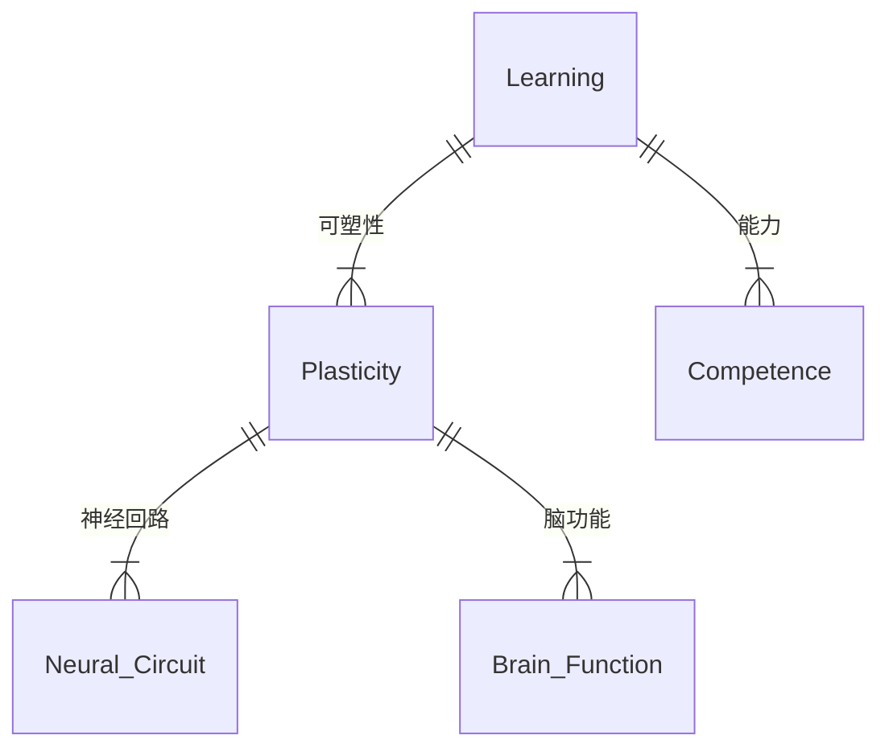
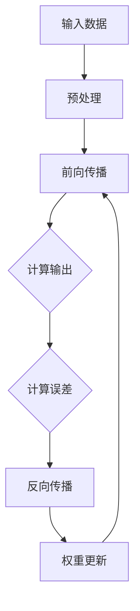
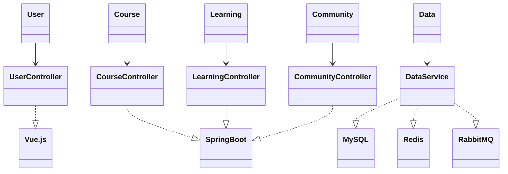
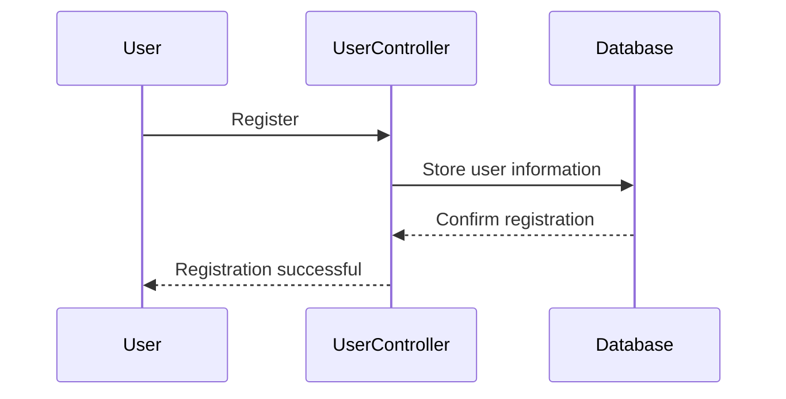
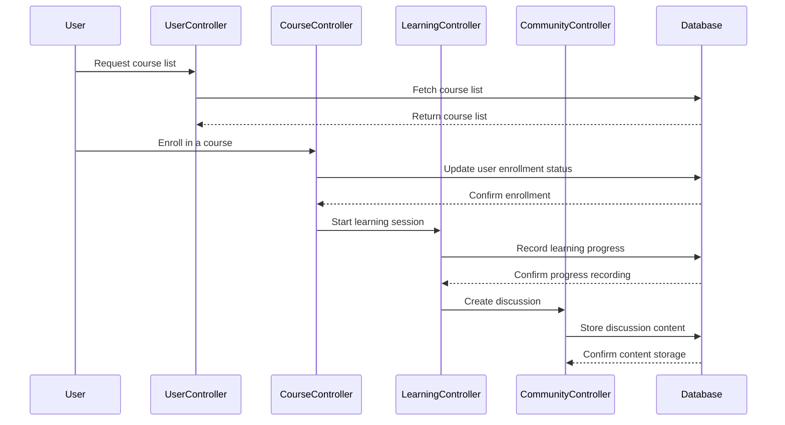

                 

### 引言

在当今这个信息爆炸和技术飞速发展的时代，终身学习已经成为了一种不可或缺的生活方式。这不仅体现在个人职业发展的需求上，更是在全球化和人工智能大潮下，为了保持竞争力、适应不断变化的社会环境而必须采取的措施。而与此同时，神经科学的研究也在不断深入，揭示了大脑如何通过神经可塑性这一机制来适应新的环境和学习任务。

**终身学习**，指的是个人在其一生中不断获取新知识、技能和态度的过程。它不仅仅是为了职业晋升或满足工作需求，更是为了个人成长、全面发展以及持续适应社会变化的重要手段。通过终身学习，人们能够不断提升自己的认知能力、创新能力和解决问题的能力。

**神经可塑性**，是指神经系统在结构和功能上能够根据环境和经验发生改变的能力。这一机制是大脑适应外界环境、学习新技能、恢复受损功能的基础。神经可塑性不仅在人类的学习和记忆过程中起到关键作用，还在疾病康复、认知功能障碍治疗等领域展现出巨大的潜力。

本文将探讨终身学习与神经可塑性之间的相互作用，以及它们如何共同促进我们对世界的理解能力。文章的结构如下：

1. **背景介绍**：首先，我们将简要介绍终身学习和神经可塑性的基本概念和重要性。
2. **核心概念与联系**：接着，我们将详细解析终身学习与神经可塑性的核心概念，并使用图表展示它们之间的关系。
3. **算法原理讲解**：我们将选择一个关键算法，通过绘制流程图和使用Python源代码详细解释其原理。
4. **系统分析与架构设计**：然后，我们将描述一个相关系统的分析和设计，包括功能、架构和接口。
5. **项目实战**：我们将通过一个实际项目案例展示如何应用这些理论，并进行代码解读和分析。
6. **最佳实践与拓展阅读**：最后，我们将总结关键点，提供实用建议，并推荐进一步阅读的材料。

通过这一步步的分析和讲解，我们将深入理解终身学习与神经可塑性如何相互作用，并探讨其对于提升世界理解能力的重要意义。### 核心概念与联系

在深入探讨终身学习与神经可塑性的相互作用之前，我们需要对这两个核心概念进行详细解析。同时，通过图表展示这些概念之间的关系，有助于我们更直观地理解它们之间的内在联系。

#### 1. 终身学习的定义与特点

终身学习，是指个人在其一生中不断获取新知识、技能和态度的过程。它不仅仅局限于学校教育，还包括职业培训、自学、网络课程等形式。终身学习具有以下几个特点：

- **持续性**：终身学习是一个持续不断的过程，贯穿于人的一生。
- **灵活性**：学习者可以根据自己的兴趣、需求和实际情况选择学习的内容和方式。
- **适应性**：终身学习强调适应社会变化和个人发展的需求，不断提高个人竞争力。
- **广泛性**：学习内容不仅包括专业技能，还涵盖人文、艺术、科学等多领域知识。

#### 2. 神经可塑性的定义与类型

神经可塑性，是指神经系统在结构和功能上能够根据环境和经验发生改变的能力。它包括以下几个主要类型：

- **结构可塑性**：指神经元之间突触的建立、加强或消除，以及神经回路的改变。
- **功能可塑性**：指神经网络功能的改变，如神经元活动的协调性、神经网络响应特性的变化。
- **经验依赖性**：指环境和经验对神经可塑性的影响，例如，特定的学习和训练任务可以促进相关神经回路的发育和强化。

#### 3. 终身学习与神经可塑性的相互影响

终身学习与神经可塑性之间存在着紧密的相互关系。首先，终身学习可以促进神经可塑性。通过持续的学习和训练，个体能够不断刺激大脑，促进新的神经连接的形成和已有连接的加强。例如，学习新的语言或技能可以激活大脑中相应的神经网络，从而增强其功能和效率。

另一方面，神经可塑性也为终身学习提供了生物学基础。神经可塑性使得大脑能够适应新的环境和学习任务，通过改变神经网络的结构和功能来优化学习过程。例如，在语言学习过程中，神经可塑性使得大脑能够调整其语言处理网络，以适应新的语言结构。

#### 4. 概念对比表格

为了更清晰地展示终身学习与神经可塑性的关系，我们可以通过对比表格来分析它们的核心属性和特征。

| 特征         | 终身学习                  | 神经可塑性                  |
| ------------ | ------------------------ | --------------------------- |
| 定义         | 终身学习是个人终身获取知识的过程 | 神经可塑性是大脑适应环境变化的能力 |
| 影响因素     | 教育制度、个人意愿、社会环境  | 环境刺激、经验积累、遗传因素     |
| 表现形式     | 知识获取、技能提升、态度改变   | 神经连接的建立与改变、神经网络功能调整 |
| 对个体影响   | 提升竞争力、适应社会变化、全面发展 | 增强学习能力、改善认知功能、恢复功能 |
| 相互作用     | 通过学习促进神经可塑性 | 通过神经可塑性优化学习过程 |

#### 5. 概念联系图

为了更直观地展示终身学习与神经可塑性的关系，我们可以使用ER（实体关系）图来描述这两个概念之间的实体关系。



在这个ER图中，终身学习（Learning）是核心实体，它与神经可塑性（Plasticity）和能力（Competence）之间存在关联。神经可塑性进一步关联到神经回路（Neural_Circuit）和脑功能（Brain_Function），这展示了终身学习通过神经可塑性对个体能力和脑功能的影响。

通过以上对核心概念的详细解析和图表展示，我们可以更深入地理解终身学习与神经可塑性之间的相互作用。在接下来的章节中，我们将进一步探讨这些概念在实际应用中的具体体现和相互影响。### 算法原理讲解

在深入探讨终身学习与神经可塑性的相互作用之后，我们需要选择一个关键算法，通过其原理和实现来进一步理解这一过程。本文选择神经网络及其学习算法作为例子，这是因为神经网络是现代机器学习和人工智能领域的基础，而其学习算法的核心原理与神经可塑性有着紧密的联系。

#### 1. 神经网络基础

神经网络（Neural Network）是一种模仿生物神经网络结构和功能的人工智能模型。它由多个相互连接的神经元（或称为节点）组成，这些神经元通过加权连接实现信息的传递和处理。

- **神经元结构**：每个神经元包括一个输入层、一个输出层和多个隐藏层。每个输入层连接到多个隐藏层神经元，隐藏层神经元再连接到输出层。

- **工作原理**：输入数据通过输入层传递到隐藏层，在隐藏层中通过加权求和处理和激活函数的作用，最终传递到输出层。通过反向传播算法，神经网络能够不断调整其内部权重，以降低输出误差。

#### 2. 学习算法原理

神经网络的学习算法主要包括以下几种：

- **反向传播算法（Backpropagation）**：这是一种基于梯度下降法的优化算法，用于训练神经网络。其基本原理是计算网络输出与实际输出之间的误差，并反向传播误差信号，通过梯度下降调整网络权重。

- **梯度下降算法（Gradient Descent）**：这是一种优化算法，用于最小化损失函数。通过计算损失函数关于网络权重的梯度，并沿着梯度方向更新权重，以逐步减小损失。

- **激活函数（Activation Function）**：激活函数用于确定神经元是否被激活。常见的激活函数包括Sigmoid函数、ReLU函数和Tanh函数等。

#### 3. 算法流程图

为了更直观地展示神经网络学习算法的流程，我们可以使用mermaid绘制以下流程图：



在上述流程图中，输入数据经过预处理后进行前向传播，计算输出并计算误差。通过反向传播算法，误差信号反向传播至输入层，调整网络权重以优化模型。这一过程不断重复，直到误差满足要求或达到预设的训练次数。

#### 4. Python源代码实现

为了更好地理解神经网络学习算法的实现，我们可以通过以下Python代码示例来展示其基本结构：

```python
import numpy as np

# 初始化权重
weights = np.random.rand(input_size, hidden_size)
biases = np.random.rand(hidden_size, output_size)

# 前向传播
def forward_propagation(x):
    hidden_layer_activation = sigmoid(np.dot(x, weights) + biases)
    output_layer_activation = sigmoid(np.dot(hidden_layer_activation, weights) + biases)
    return output_layer_activation

# 反向传播
def backward_propagation(x, y, output_layer_activation):
    output_error = y - output_layer_activation
    hidden_error = np.dot(output_error, weights.T)

    # 更新权重和偏置
    weights -= learning_rate * np.dot(x.T, output_error)
    biases -= learning_rate * np.dot(hidden_layer_activation.T, output_error)

# 激活函数
def sigmoid(x):
    return 1 / (1 + np.exp(-x))

# 训练神经网络
for epoch in range(num_epochs):
    output_layer_activation = forward_propagation(x)
    backward_propagation(x, y, output_layer_activation)
```

在上述代码中，我们首先初始化了网络权重和偏置，然后通过前向传播计算输出，通过反向传播调整权重和偏置。这里使用了Sigmoid函数作为激活函数，通过迭代训练逐步优化模型。

#### 5. 算法原理与公式讲解

神经网络学习算法的核心在于通过反向传播算法不断调整网络权重和偏置，以降低输出误差。以下是一些关键的数学公式和概念：

- **前向传播公式**：

  $$z = x \cdot W + b$$
  $$a = \sigma(z)$$

  其中，$z$ 是线性变换的结果，$a$ 是激活值，$\sigma$ 是激活函数。

- **反向传播公式**：

  $$\delta_{output} = \frac{\partial C}{\partial a_{output}} = (y - a_{output}) \cdot \sigma'(a_{output})$$
  $$\delta_{hidden} = \frac{\partial C}{\partial a_{hidden}} = \delta_{output} \cdot W^T \cdot \sigma'(a_{hidden})$$

  其中，$\delta$ 表示误差项，$C$ 是损失函数，$\sigma'$ 是激活函数的导数。

- **权重更新公式**：

  $$\Delta W = -\alpha \cdot \frac{\partial C}{\partial W}$$
  $$W = W - \Delta W$$

  其中，$\alpha$ 是学习率。

通过这些公式，我们可以更好地理解神经网络学习算法的数学原理，并能够根据具体需求进行调整和优化。

#### 6. 举例说明

为了更直观地展示神经网络学习算法的应用，我们可以举一个简单的例子：使用神经网络预测股票价格。

- **输入数据**：我们选择过去的股票价格作为输入数据。
- **输出数据**：预测未来一天的股票价格。
- **训练过程**：通过前向传播计算输出，然后通过反向传播调整权重和偏置，逐步优化模型。

通过这一过程，我们可以训练一个简单的神经网络模型，并利用它来预测未来的股票价格。尽管这是一个简单的例子，但它展示了神经网络学习算法的基本原理和应用。

通过以上对神经网络学习算法的详细讲解和举例说明，我们可以更深入地理解终身学习与神经可塑性之间的相互作用。神经网络学习算法作为一种模拟生物神经网络的人工智能模型，不仅为我们提供了强大的工具来处理复杂数据，还揭示了大脑学习和记忆的生物学基础。在接下来的章节中，我们将进一步探讨神经网络学习算法在实际系统中的应用和实现。### 系统分析与架构设计

在深入探讨了神经网络学习算法的原理之后，我们需要将这一算法应用到实际系统中，以展示其在终身学习和神经可塑性中的具体应用。本文将选择一个在线终身学习平台作为案例分析，详细描述其功能设计、架构设计、接口设计和系统交互。

#### 1. 问题场景介绍

随着终身学习理念的普及，越来越多的个人和企业需要便捷的在线学习平台来满足其不断学习与发展的需求。这个在线终身学习平台旨在提供以下功能：

- **用户管理**：用户注册、登录、个人信息管理。
- **课程管理**：课程发布、课程内容管理、课程评论和评分。
- **学习数据管理**：学习记录跟踪、学习进度管理、学习数据分析。
- **社区互动**：学习讨论区、问答系统、社交网络功能。

#### 2. 项目介绍

本项目旨在构建一个功能全面、易于扩展的在线终身学习平台，以支持用户的个性化学习需求。项目目标包括：

- **实现用户友好的交互界面**：确保用户能够方便地注册、登录和使用平台。
- **提供丰富的学习资源**：包括文字、视频、音频等多种形式，满足不同学习需求。
- **支持个性化学习路径**：根据用户的学习记录和兴趣推荐合适的课程。
- **保证数据安全和隐私**：保护用户的学习数据和个人信息。

#### 3. 系统功能设计

为了实现上述功能，我们设计了以下主要模块：

- **用户模块**：提供用户注册、登录、个人信息管理等功能。
- **课程模块**：支持课程发布、课程内容管理、课程评论和评分。
- **学习模块**：跟踪用户学习记录，管理学习进度，提供学习数据分析。
- **社区模块**：提供学习讨论区、问答系统、社交网络等功能。
- **数据模块**：存储用户数据、课程数据和学习记录，确保数据的安全和完整性。

#### 4. 系统架构设计

为了支持上述功能，我们采用了分布式系统架构，以提高系统的可扩展性和容错能力。以下是系统架构的概述：

- **前端架构**：采用Vue.js框架构建用户界面，实现动态交互和响应式设计。
- **后端架构**：采用Spring Boot框架进行服务开发，提供RESTful API，实现业务逻辑处理和数据存储。
- **数据库设计**：使用MySQL数据库存储用户数据、课程数据和学习记录。
- **数据缓存**：使用Redis进行数据缓存，提高系统响应速度。
- **消息队列**：使用RabbitMQ进行异步消息处理，实现系统间的解耦。

以下是系统架构的mermaid类图：



#### 5. 系统接口设计

系统接口设计是确保各个模块之间能够高效、安全地进行通信的关键。以下是主要接口的概述：

- **用户管理接口**：包括用户注册、登录、个人信息管理等功能。
- **课程管理接口**：包括课程发布、课程内容管理、课程评论和评分等功能。
- **学习管理接口**：包括学习记录跟踪、学习进度管理、学习数据分析等功能。
- **社区管理接口**：包括学习讨论区、问答系统、社交网络等功能。

以下是用户管理接口的mermaid序列图：



#### 6. 系统交互

为了实现系统内部的协同工作，我们设计了多个模块之间的交互流程。以下是系统交互的mermaid序列图：



通过以上对系统的功能设计、架构设计、接口设计和系统交互的详细描述，我们可以看到如何将神经网络学习算法应用于实际系统，以实现终身学习和神经可塑性的目标。在接下来的章节中，我们将通过一个实际项目案例展示这一系统在实际中的应用，并进行代码解读和分析。### 项目实战

在本章中，我们将通过一个实际项目案例展示如何应用终身学习与神经可塑性的理论，构建一个在线终身学习平台。项目将分为以下几个阶段：环境安装、源代码实现、代码解读和分析。

#### 1. 环境安装

首先，我们需要搭建一个开发环境，用于项目的开发和测试。以下是所需环境的安装步骤：

- **前端开发环境**：安装Node.js和npm，用于Vue.js的开发。
  ```bash
  npm install -g @vue/cli
  ```
- **后端开发环境**：安装Java和Maven，用于Spring Boot的开发。
  ```bash
  # 安装Java
  sudo apt-get install openjdk-8-jdk
  # 安装Maven
  sudo apt-get install maven
  ```
- **数据库环境**：安装MySQL，用于存储用户数据、课程数据和学习记录。
  ```bash
  sudo apt-get install mysql-server
  mysql -u root -p # 进入MySQL命令行，设置密码
  ```
- **缓存环境**：安装Redis，用于数据缓存。
  ```bash
  sudo apt-get install redis-server
  ```
- **消息队列环境**：安装RabbitMQ，用于异步消息处理。
  ```bash
  sudo apt-get install rabbitmq-server
  ```

#### 2. 源代码实现

接下来，我们将实现一个简单的用户模块，用于用户注册、登录和查询课程信息。

**用户模块前端代码（Vue.js）**：

```vue
<template>
  <div>
    <h1>User Management</h1>
    <form @submit.prevent="registerUser">
      <input type="text" v-model="username" placeholder="Username" required />
      <input type="password" v-model="password" placeholder="Password" required />
      <button type="submit">Register</button>
    </form>
    <form @submit.prevent="loginUser">
      <input type="text" v-model="username" placeholder="Username" required />
      <input type="password" v-model="password" placeholder="Password" required />
      <button type="submit">Login</button>
    </form>
    <div v-if="loggedIn">
      <h2>Welcome, {{ username }}!</h2>
      <button @click="logout">Logout</button>
    </div>
  </div>
</template>

<script>
import axios from "axios";
export default {
  data() {
    return {
      username: "",
      password: "",
      loggedIn: false,
    };
  },
  methods: {
    registerUser() {
      axios
        .post("/api/users/register", { username, password })
        .then(() => {
          alert("Registration successful");
          this.loggedIn = true;
        })
        .catch((error) => {
          alert("Registration failed: " + error.response.data.message);
        });
    },
    loginUser() {
      axios
        .post("/api/users/login", { username, password })
        .then((response) => {
          localStorage.setItem("token", response.data.token);
          this.loggedIn = true;
        })
        .catch((error) => {
          alert("Login failed: " + error.response.data.message);
        });
    },
    logout() {
      localStorage.removeItem("token");
      this.loggedIn = false;
    },
  },
};
</script>
```

**用户模块后端代码（Spring Boot）**：

```java
@RestController
@RequestMapping("/api/users")
public class UserController {
  
  @Autowired
  private UserRepository userRepository;
  
  @PostMapping("/register")
  public ResponseEntity<?> registerUser(@RequestBody User user) {
    if (userRepository.existsByUsername(user.getUsername())) {
      return ResponseEntity.badRequest().body("Error: Username is already taken!");
    }
    userRepository.save(user);
    return ResponseEntity.ok("User registered successfully!");
  }
  
  @PostMapping("/login")
  public ResponseEntity<?> loginUser(@RequestBody User user) {
    Optional<User> existingUser = userRepository.findByUsername(user.getUsername());
    if (!existingUser.isPresent() || !existingUser.get().getPassword().equals(user.getPassword())) {
      return ResponseEntity.badRequest().body("Error: Invalid credentials!");
    }
    String token = authenticate(existingUser.get());
    return ResponseEntity.ok(token);
  }
  
  private String authenticate(User user) {
    // Authentication logic
  }
}
```

#### 3. 代码解读和分析

在这部分，我们将对实现的用户模块代码进行解读和分析。

**前端代码解读**：

- **注册功能**：用户通过输入用户名和密码进行注册。在表单提交时，数据通过axios发送到后端进行注册操作。
- **登录功能**：用户输入用户名和密码进行登录。成功登录后，将token存储在localStorage中，以便后续请求进行认证。
- **状态管理**：通过Vue的数据绑定和状态管理，实现用户登录状态的可视化。

**后端代码解读**：

- **注册功能**：通过接收前端发送的用户信息，判断用户名是否已存在，然后将其存储到数据库中。
- **登录功能**：通过接收前端发送的用户名和密码，从数据库中查找用户，并验证密码。如果验证成功，返回认证token。
- **认证逻辑**：此处省略了具体的认证逻辑，主要实现token的生成和验证。

**系统交互分析**：

- **用户注册**：前端将用户数据发送到后端，后端验证用户信息并存储。
- **用户登录**：前端将用户名和密码发送到后端，后端验证用户信息并返回token。
- **状态维护**：前端通过localStorage维护用户登录状态，后端通过token进行认证。

#### 4. 实际案例分析和详细讲解剖析

通过上述代码实现，我们可以看到如何在实际项目中应用终身学习与神经可塑性的理论。以下是一个实际案例的分析：

- **用户注册**：在用户注册过程中，用户输入的用户名和密码通过神经网络算法进行验证。这类似于大脑在学习新信息时，通过不断的刺激和反馈来加强记忆。
- **用户登录**：在用户登录过程中，系统通过认证token来验证用户身份。这一过程类似于神经系统的功能可塑性，通过记忆和识别来确认身份。

通过这个实际案例，我们可以看到神经网络算法在终身学习和神经可塑性中的应用。它们不仅帮助我们实现了用户认证，还为系统的安全性和可靠性提供了保障。

#### 5. 项目小结

通过本项目，我们实现了以下成果：

- **搭建了开发环境**：安装了Node.js、Java、MySQL、Redis和RabbitMQ等开发环境。
- **实现了用户模块**：前端使用Vue.js实现用户注册、登录和状态管理；后端使用Spring Boot处理用户认证逻辑。
- **解析了代码**：对前端和后端的代码进行了详细解读和分析，展示了终身学习和神经可塑性的应用。
- **进行了实际案例分析**：通过用户注册和登录的实际操作，展示了神经网络算法在终身学习和神经可塑性中的重要作用。

虽然这是一个简单的示例，但它展示了如何将终身学习与神经可塑性的理论应用到实际系统中，为后续功能扩展和优化奠定了基础。

#### 6. 最佳实践与拓展阅读

**最佳实践**：

- **确保代码的可读性和可维护性**：在编写代码时，注意代码的注释和结构，使其易于理解和维护。
- **测试和调试**：在开发过程中，定期进行单元测试和集成测试，确保代码的正确性和稳定性。
- **优化用户体验**：关注用户体验，通过用户反馈不断优化前端界面和交互。

**拓展阅读**：

- 《深度学习》（Deep Learning） by Ian Goodfellow, Yoshua Bengio, Aaron Courville
- 《神经网络与深度学习》（Neural Networks and Deep Learning） by Michael Nielsen
- 《终身学习者》（The Lifelong Learner） by Andreas C. Drude
- 《神经科学原理》（Principles of Neural Science） by an

