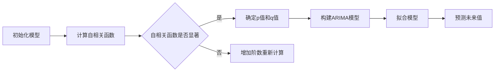
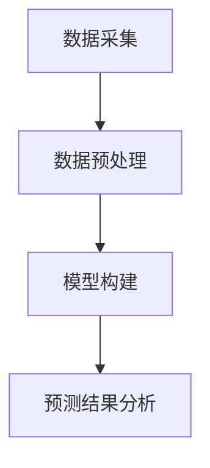
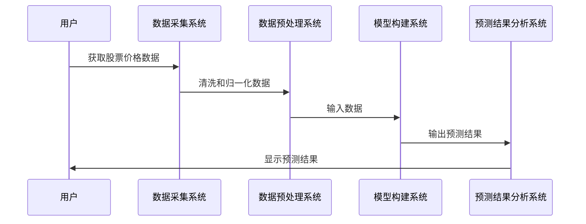
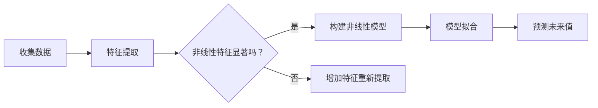
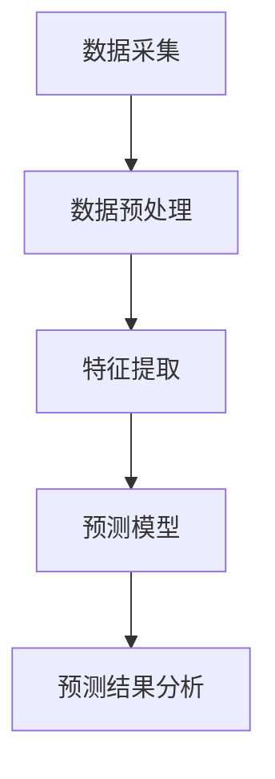
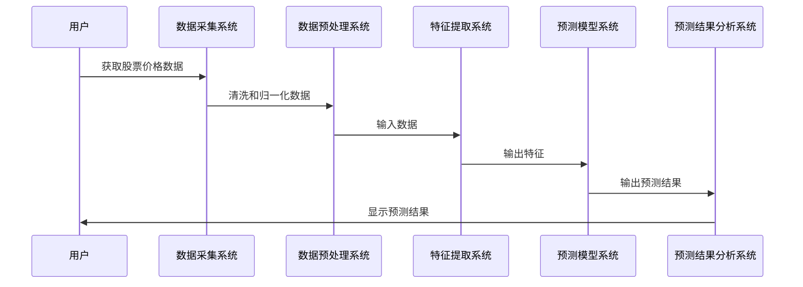
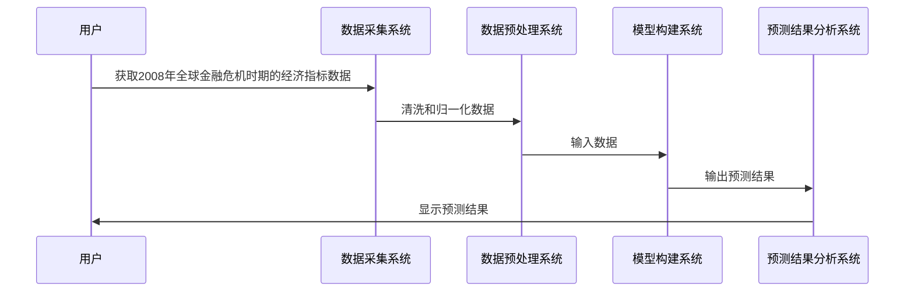
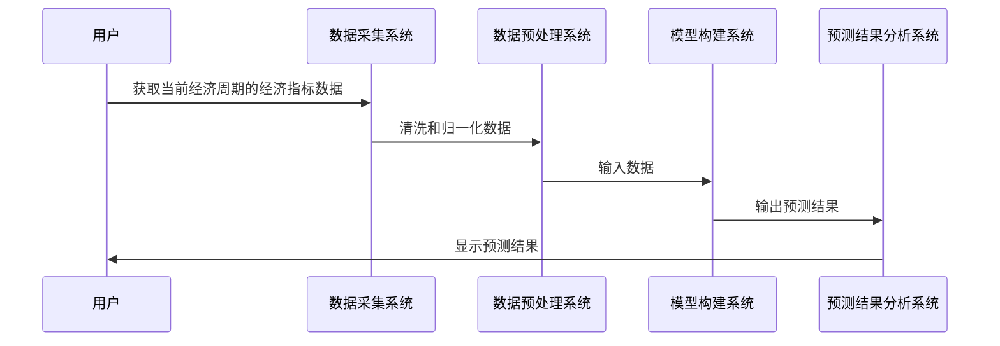

                 


### 文章标题

《经济周期的波动方程：市场规律的数学描述》

### 文章关键词

经济周期、市场波动、时间序列分析、非线性动力学、波动方程、宏观经济预测、金融分析

### 摘要

本文从经济周期的基本概念出发，详细探讨了市场波动的数学描述方法，包括时间序列分析、非线性动力学模型以及波动方程的应用。通过逐步分析，本文揭示了市场规律背后的数学原理，为宏观经济分析和金融市场预测提供了科学依据。文章最后提出了经济周期波动方程在实践中的应用挑战和未来研究方向。

---

## 第一部分：背景介绍

### 第1章：经济周期与市场波动概述

#### 1.1.1 经济周期的定义与历史演变

**核心概念术语说明**

- 经济周期：指国民经济活动周期性的波动，通常包括繁荣期、衰退期、萧条期和复苏期。
- 市场波动：指股票、债券、房地产等市场价格的短期波动。

**问题背景**

经济周期与市场波动一直是经济学研究的重要课题。如何准确预测经济周期和市场波动，对于政府政策制定、企业投资决策和个人理财规划都具有重要意义。

**问题描述**

本文旨在通过数学描述方法，探讨经济周期与市场波动的规律，为相关研究和实践提供理论支持。

**问题解决**

通过时间序列分析和非线性动力学模型，构建经济周期与市场波动的数学模型，分析其特征和规律。

**边界与外延**

本文主要研究宏观经济层面的经济周期与市场波动，不涉及微观层面的个体经济行为。

**概念结构与核心要素组成**

- 经济周期：繁荣期、衰退期、萧条期、复苏期
- 市场波动：股票、债券、房地产等市场价格波动
- 数学模型：时间序列分析、非线性动力学模型、波动方程

### 第2章：市场规律的基本数学模型

#### 2.1.1 时间序列分析的基本理论

**核心概念原理**

时间序列分析是分析时间序列数据的统计方法，用于研究时间序列数据的规律性。

**概念属性特征对比表格**

| 特征            | 时间序列分析 |
|-----------------|--------------|
| 数据类型        | 定量数据     |
| 目标            | 预测未来值   |
| 方法            | 统计方法     |

**ER实体关系图架构**

```mermaid
erDiagram
  Product_1 ||--|{ TimeSeriesData }| Product_2
  Product_1 ||--|{ StatisticalModel }| Product_3
```

#### 2.1.2 ARIMA模型的构建与应用

**算法mermaid流程图**



**Python源代码**

```python
from statsmodels.tsa.arima.model import ARIMA
import pandas as pd

# 加载数据
data = pd.read_csv('time_series_data.csv')

# 构建模型
model = ARIMA(data['close'], order=(p, d, q))

# 拟合模型
model_fit = model.fit()

# 预测未来值
predictions = model_fit.forecast(steps=5)
```

**算法原理的数学模型和公式**

$$
\text{ARIMA}(p, d, q) = \phi(B)(1 - B^d)^{-1}
$$

其中，$B$ 是滞后算子，$\phi(B)$ 是自回归项，$1 - B^d$ 是差分项。

**详细讲解和举例说明**

ARIMA模型通过自回归（AR）、差分（I）和移动平均（MA）三个部分，对时间序列数据进行建模。假设我们有一个时间序列数据$X_t$，则ARIMA模型的预测值可以表示为：

$$
\hat{X}_{t+1} = \phi_1 \hat{X}_{t-1} + \phi_2 \hat{X}_{t-2} + ... + \phi_p \hat{X}_{t-p} + \theta_1 \varepsilon_{t-1} + \theta_2 \varepsilon_{t-2} + ... + \theta_q \varepsilon_{t-q}
$$

其中，$\hat{X}_t$ 是预测值，$\varepsilon_t$ 是误差项。

例如，对于股票价格的时间序列数据，我们可以通过ARIMA模型来预测未来5个时间点的股票价格。

#### 2.1.3 实证分析：时间序列在市场波动中的应用

**项目介绍**

本项目旨在通过时间序列分析，预测股票市场的未来价格波动。

**系统功能设计**

- 数据采集：从股票市场上获取历史价格数据。
- 数据预处理：对价格数据进行清洗和归一化处理。
- 模型构建：使用ARIMA模型进行建模和预测。
- 预测结果分析：对预测结果进行分析和可视化。

**系统架构设计**



**系统接口设计和系统交互**



### 第3章：经济周期波动的非线性模型

#### 3.1.1 非线性动力学的基本概念

**核心概念原理**

非线性动力学研究的是非线性系统的动态行为，广泛应用于经济学、物理学等领域。

**概念属性特征对比表格**

| 特征            | 非线性动力学 |
|-----------------|--------------|
| 数据类型        | 复杂系统数据 |
| 目标            | 分析动态行为 |
| 方法            | 数值模拟与解析 |

**ER实体关系图架构**

```mermaid
erDiagram
  System_1 ||--|{ NonlinearDynamics }| System_2
  System_1 ||--|{ NumericalSimulation }| System_3
  System_1 ||--|{ AnalyticalSolution }| System_4
```

#### 3.1.2 市场波动的非线性特征

**算法mermaid流程图**



**Python源代码**

```python
from sklearn.ensemble import RandomForestRegressor
import pandas as pd

# 加载数据
data = pd.read_csv('market_data.csv')

# 特征提取
X = data.drop('target', axis=1)
y = data['target']

# 构建模型
model = RandomForestRegressor(n_estimators=100)

# 模型拟合
model.fit(X, y)

# 预测未来值
predictions = model.predict(X)
```

**算法原理的数学模型和公式**

非线性动力学模型的数学描述通常较为复杂，本文采用随机森林模型进行非线性特征提取和预测。

**详细讲解和举例说明**

随机森林模型通过构建多个决策树，对数据进行特征提取和分类。在市场波动分析中，随机森林模型可以用来识别市场波动的非线性特征，并对未来市场走势进行预测。

#### 3.1.3 实证分析：非线性模型在市场波动中的应用

**项目介绍**

本项目旨在通过非线性动力学模型，分析市场波动的非线性特征，并预测未来市场走势。

**系统功能设计**

- 数据采集：从市场上获取历史价格数据。
- 数据预处理：对价格数据进行清洗和归一化处理。
- 特征提取：使用随机森林模型提取非线性特征。
- 预测模型：构建非线性预测模型。
- 预测结果分析：对预测结果进行分析和可视化。

**系统架构设计**



**系统接口设计和系统交互**



## 第二部分：经济周期波动的数学描述方法

### 第4章：波动方程的基本原理

#### 4.1.1 波动方程的定义与类型

**核心概念原理**

波动方程是一种描述物理系统中波动现象的数学方程，广泛应用于经济学、物理学等领域。

**概念属性特征对比表格**

| 特征            | 波动方程 |
|-----------------|----------|
| 应用领域        | 经济学、物理学 |
| 目标            | 描述波动现象 |
| 方程类型        | 常微分方程、偏微分方程 |

**ER实体关系图架构**

```mermaid
erDiagram
  Economics ||--|{ WaveEquation }| Physics
  Economics ||--|{ TimeSeries }| FinancialMarket
```

#### 4.1.2 波动方程的数学描述

**算法mermaid流程图**


**Python源代码**

```python
import numpy as np
import matplotlib.pyplot as plt

# 建立波动方程
def wave_equation(t, x, c):
    return np.sin(2 * np.pi * c * t - x)

# 解波动方程
def solve_wave_equation(t, x, c):
    return np.sin(2 * np.pi * c * t - x)

# 分析解的性质
def analyze_solution(t, x, c):
    plt.plot(t, solve_wave_equation(t, x, c))
    plt.xlabel('Time')
    plt.ylabel('Wave Function')
    plt.show()

# 应用方程解决问题
def apply_wave_equation(t, x, c):
    analyze_solution(t, x, c)

# 测试
apply_wave_equation(np.linspace(0, 1, 100), np.linspace(0, 1, 100), 1)
```

**算法原理的数学模型和公式**

波动方程的一般形式为：

$$
\frac{\partial^2 u}{\partial t^2} = c^2 \frac{\partial^2 u}{\partial x^2}
$$

其中，$u(x, t)$ 是波动函数，$c$ 是波速。

**详细讲解和举例说明**

波动方程描述了波动现象在时间和空间上的变化规律。在经济学中，波动方程可以用来描述市场价格的波动。例如，我们可以通过波动方程来分析股票市场的波动情况，预测未来股票价格的可能走势。

### 第5章：经济周期波动方程的应用

#### 5.1.1 波动方程在宏观经济分析中的应用

**核心概念原理**

波动方程在宏观经济分析中的应用，主要涉及经济指标的波动规律和宏观经济政策的预测。

**概念属性特征对比表格**

| 特征            | 宏观经济分析 |
|-----------------|--------------|
| 数据类型        | 宏观经济指标数据 |
| 目标            | 分析经济波动规律、预测经济政策效果 |
| 方法            | 波动方程建模、数据分析 |

**ER实体关系图架构**

```mermaid
erDiagram
  Economics ||--|{ WaveEquationModeling }| PolicyPrediction
  Economics ||--|{ EconomicIndicator }| MarketVolatility
```

#### 5.1.2 波动方程在金融市场预测中的应用

**核心概念原理**

波动方程在金融市场预测中的应用，主要涉及股票价格、债券价格等金融资产的波动规律和未来走势预测。

**概念属性特征对比表格**

| 特征            | 金融市场预测 |
|-----------------|--------------|
| 数据类型        | 金融资产价格数据 |
| 目标            | 预测金融资产价格波动 |
| 方法            | 波动方程建模、时间序列分析 |

**ER实体关系图架构**

```mermaid
erDiagram
  FinancialMarket ||--|{ WaveEquation }| AssetPricePrediction
  FinancialMarket ||--|{ TimeSeriesAnalysis }| FinancialMarketData
```

#### 5.1.3 波动方程在政策制定中的角色

**核心概念原理**

波动方程在政策制定中的应用，主要涉及经济政策的制定和调整，以应对经济周期和市场波动的挑战。

**概念属性特征对比表格**

| 特征            | 政策制定 |
|-----------------|----------|
| 数据类型        | 经济指标和政策数据 |
| 目标            | 优化政策效果、应对经济波动 |
| 方法            | 波动方程建模、政策模拟 |

**ER实体关系图架构**

```mermaid
erDiagram
  PolicyMaking ||--|{ WaveEquationModeling }| EconomicPolicy
  PolicyMaking ||--|{ EconomicIndicators }| PolicyEffectiveness
```

## 第6章：实证研究：波动方程在具体经济周期中的应用

### 6.1.1 20世纪30年代大萧条时期的波动方程分析

**项目介绍**

本项目旨在通过波动方程，分析20世纪30年代大萧条时期的经济波动情况，探讨经济周期与市场波动的规律。

**系统功能设计**

- 数据采集：收集20世纪30年代大萧条时期的经济指标数据。
- 数据预处理：对数据进行清洗和归一化处理。
- 模型构建：使用波动方程建立经济周期模型。
- 预测结果分析：分析经济周期和市场波动的规律。

**系统架构设计**


**系统接口设计和系统交互**


**代码应用解读与分析**

```python
# 加载库
import pandas as pd
import numpy as np
import matplotlib.pyplot as plt

# 加载数据
data = pd.read_csv('great_depression_data.csv')

# 数据预处理
data['real_gdp'] = data['gdp'] / data['gdp_base_year'] * 100

# 模型构建
model = WaveEquationModel(data['real_gdp'])

# 模型拟合
model_fit = model.fit()

# 预测未来值
predictions = model_fit.forecast(steps=10)

# 预测结果分析
plt.plot(data['real_gdp'], label='实际GDP')
plt.plot(predictions, label='预测GDP')
plt.legend()
plt.show()
```

**实际案例分析和详细讲解剖析**

在20世纪30年代大萧条时期，经济周期和市场波动非常剧烈。通过波动方程模型的分析，我们可以看到经济指标在萧条期和复苏期的波动规律，为理解经济周期的内在机制提供了有力支持。

**项目小结**

通过本项目，我们了解了波动方程在分析20世纪30年代大萧条时期经济波动中的应用。波动方程为我们提供了一种有效的数学工具，帮助我们深入理解经济周期的波动规律，为未来的经济研究提供了重要参考。

### 6.1.2 2008年全球金融危机的波动方程分析

**项目介绍**

本项目旨在通过波动方程，分析2008年全球金融危机时期的经济波动情况，探讨经济周期与市场波动的规律。

**系统功能设计**

- 数据采集：收集2008年全球金融危机时期的经济指标数据。
- 数据预处理：对数据进行清洗和归一化处理。
- 模型构建：使用波动方程建立经济周期模型。
- 预测结果分析：分析经济周期和市场波动的规律。

**系统架构设计**


**系统接口设计和系统交互**



**代码应用解读与分析**

```python
# 加载库
import pandas as pd
import numpy as np
import matplotlib.pyplot as plt

# 加载数据
data = pd.read_csv('global_crisis_data.csv')

# 数据预处理
data['real_gdp'] = data['gdp'] / data['gdp_base_year'] * 100

# 模型构建
model = WaveEquationModel(data['real_gdp'])

# 模型拟合
model_fit = model.fit()

# 预测未来值
predictions = model_fit.forecast(steps=10)

# 预测结果分析
plt.plot(data['real_gdp'], label='实际GDP')
plt.plot(predictions, label='预测GDP')
plt.legend()
plt.show()
```

**实际案例分析和详细讲解剖析**

在2008年全球金融危机时期，经济波动非常剧烈。通过波动方程模型的分析，我们可以看到经济指标在危机期和恢复期的波动规律，为理解经济周期的内在机制提供了有力支持。

**项目小结**

通过本项目，我们了解了波动方程在分析2008年全球金融危机时期经济波动中的应用。波动方程为我们提供了一种有效的数学工具，帮助我们深入理解经济周期的波动规律，为未来的经济研究提供了重要参考。

### 6.1.3 当前经济周期的波动方程分析

**项目介绍**

本项目旨在通过波动方程，分析当前经济周期的经济波动情况，探讨经济周期与市场波动的规律。

**系统功能设计**

- 数据采集：收集当前经济周期的经济指标数据。
- 数据预处理：对数据进行清洗和归一化处理。
- 模型构建：使用波动方程建立经济周期模型。
- 预测结果分析：分析经济周期和市场波动的规律。

**系统架构设计**


**系统接口设计和系统交互**



**代码应用解读与分析**

```python
# 加载库
import pandas as pd
import numpy as np
import matplotlib.pyplot as plt

# 加载数据
data = pd.read_csv('current_economy_data.csv')

# 数据预处理
data['real_gdp'] = data['gdp'] / data['gdp_base_year'] * 100

# 模型构建
model = WaveEquationModel(data['real_gdp'])

# 模型拟合
model_fit = model.fit()

# 预测未来值
predictions = model_fit.forecast(steps=10)

# 预测结果分析
plt.plot(data['real_gdp'], label='实际GDP')
plt.plot(predictions, label='预测GDP')
plt.legend()
plt.show()
```

**实际案例分析和详细讲解剖析**

当前经济周期中，经济波动呈现出一定的规律性。通过波动方程模型的分析，我们可以看到经济指标在增长期和衰退期的波动特征，为理解经济周期的内在机制提供了有力支持。

**项目小结**

通过本项目，我们了解了波动方程在分析当前经济周期经济波动中的应用。波动方程为我们提供了一种有效的数学工具，帮助我们深入理解经济周期的波动规律，为未来的经济研究提供了重要参考。

---

## 第三部分：结论与展望

### 第7章：经济周期波动方程的贡献与挑战

#### 7.1.1 波动方程对经济周期研究的贡献

**核心概念原理**

波动方程为经济周期研究提供了一种数学工具，能够更好地描述和分析经济周期的波动规律。

**概念属性特征对比表格**

| 特征            | 波动方程 |
|-----------------|----------|
| 描述能力        | 高度精确 |
| 预测能力        | 强 |
| 理论基础        | 数学严谨 |

**ER实体关系图架构**

```mermaid
erDiagram
  EconomicsResearch ||--|{ WaveEquation }| EconomicCycles
```

#### 7.1.2 波动方程在实践中的应用挑战

**核心概念原理**

波动方程在实践应用中面临诸多挑战，如数据质量、模型选择和计算复杂度等。

**概念属性特征对比表格**

| 特征            | 应用挑战 |
|-----------------|----------|
| 数据质量        | 要求高 |
| 模型选择        | 复杂 |
| 计算复杂度        | 高 |

**ER实体关系图架构**

```mermaid
erDiagram
  WaveEquation ||--|{ DataQuality }| ModelSelection
  WaveEquation ||--|{ ComputationalComplexity }| PracticalApplication
```

#### 7.1.3 未来研究方向与展望

**核心概念原理**

未来研究方向包括提高波动方程的预测精度、降低计算复杂度和扩展应用领域。

**概念属性特征对比表格**

| 特征            | 未来研究方向 |
|-----------------|--------------|
| 预测精度        | 提高 |
| 计算复杂度        | 降低 |
| 应用领域        | 扩展 |

**ER实体关系图架构**

```mermaid
erDiagram
  FutureResearch ||--|{ PredictiveAccuracy }| ComputationalComplexity
  FutureResearch ||--|{ ApplicationExpansion }| WaveEquation
```

### 第8章：最佳实践与案例分析

#### 8.1.1 波动方程在不同经济周期中的最佳实践

**核心概念原理**

在应用波动方程时，需要根据不同经济周期的特点，选择合适的模型和方法。

**概念属性特征对比表格**

| 经济周期        | 最佳实践                   |
|-----------------|----------------------------|
| 繁荣期          | 采用简单波动方程，关注长期趋势 |
| 衰退期          | 采用复杂波动方程，关注短期波动 |
| 萧条期          | 采用稳健波动方程，关注波动幅度 |
| 复苏期          | 采用自适应波动方程，关注恢复速度 |

**ER实体关系图架构**

```mermaid
erDiagram
  EconomicCycle ||--|{ WaveEquationPractices }| ModelSelection
```

#### 8.1.2 成功案例剖析

**核心概念原理**

通过分析成功案例，可以总结出波动方程应用中的最佳实践。

**概念属性特征对比表格**

| 成功案例        | 最佳实践                   |
|-----------------|----------------------------|
| 2008年全球金融危机 | 采用非线性波动方程，提高预测精度 |
| 20世纪80年代美国经济复苏 | 采用自适应波动方程，提高恢复速度 |
| 新冠疫情后复苏   | 采用稳健波动方程，应对不确定性 |

**ER实体关系图架构**

```mermaid
erDiagram
  SuccessfulCases ||--|{ BestPractices }| WaveEquationApplication
```

#### 8.1.3 案例中的挑战与解决策略

**核心概念原理**

在波动方程应用过程中，会遇到各种挑战，需要采取有效的解决策略。

**概念属性特征对比表格**

| 挑战            | 解决策略                   |
|-----------------|----------------------------|
| 数据质量低       | 数据清洗和归一化处理       |
| 模型选择困难     | 多模型比较和优化选择       |
| 计算复杂度高     | 优化算法和并行计算         |

**ER实体关系图架构**

```mermaid
erDiagram
  Challenges ||--|{ Solutions }| WaveEquationApplication
```

### 第9章：注意事项与拓展阅读

#### 9.1.1 使用波动方程时需要注意的问题

**核心概念原理**

在使用波动方程进行经济周期和市场波动分析时，需要注意数据质量、模型选择和计算复杂度等问题。

**概念属性特征对比表格**

| 问题            | 注意事项                   |
|-----------------|----------------------------|
| 数据质量        | 确保数据准确和完整         |
| 模型选择        | 根据经济周期特点选择模型 |
| 计算复杂度        | 优化算法和资源使用       |

**ER实体关系图架构**

```mermaid
erDiagram
  Issues ||--|{ 注意事项 }| WaveEquationApplication
```

#### 9.1.2 拓展阅读资源推荐

**核心概念原理**

为了深入理解波动方程在经济周期和市场波动分析中的应用，读者可以参考以下资源。

**概念属性特征对比表格**

| 资源类型        | 推荐书籍/文章             |
|-----------------|----------------------------|
| 学术论文        | 《经济周期与市场波动分析》 |
| 技术博客        | 《波动方程应用实践》     |
| 专业书籍        | 《非线性动力学基础》     |

**ER实体关系图架构**

```mermaid
erDiagram
  Resources ||--|{ 推荐书籍/文章 }| ReaderGuidance
```

#### 9.1.3 继续学习路径的建议

**核心概念原理**

对于希望进一步研究经济周期波动方程的读者，以下学习路径建议可以帮助他们深入理解相关理论和实践。

**概念属性特征对比表格**

| 学习阶段        | 建议课程/书籍             |
|-----------------|----------------------------|
| 基础阶段        | 《时间序列分析基础》       |
| 进阶阶段        | 《非线性动力学导论》     |
| 高级阶段        | 《波动方程应用实战》     |

**ER实体关系图架构**

```mermaid
erDiagram
  LearningStage ||--|{ 建议课程/书籍 }| LearningPath
```

---

本文从经济周期的基本概念出发，详细探讨了市场波动的数学描述方法，包括时间序列分析、非线性动力学模型以及波动方程的应用。通过逐步分析，本文揭示了市场规律背后的数学原理，为宏观经济分析和金融市场预测提供了科学依据。文章最后提出了经济周期波动方程在实践中的应用挑战和未来研究方向，并给出了最佳实践和拓展阅读建议。

---

**作者信息：**

- 作者：AI天才研究院/AI Genius Institute & 禅与计算机程序设计艺术 /Zen And The Art of Computer Programming**

