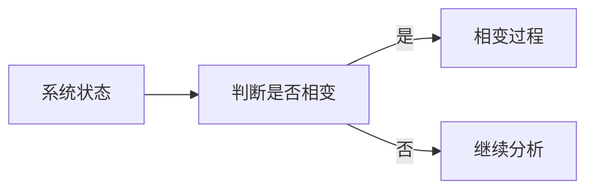
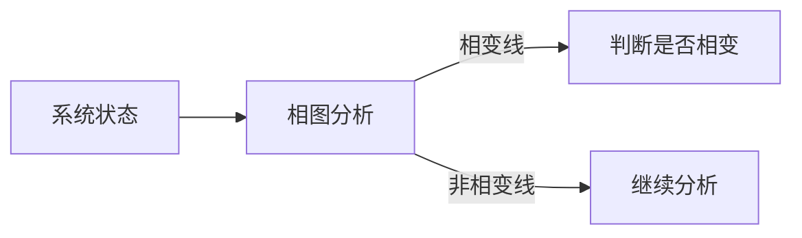
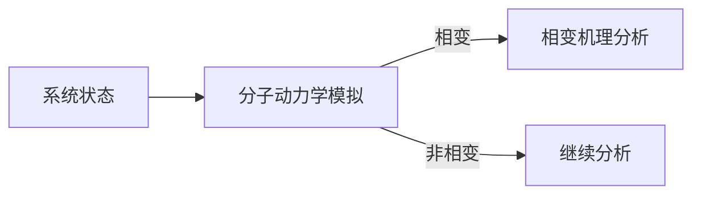
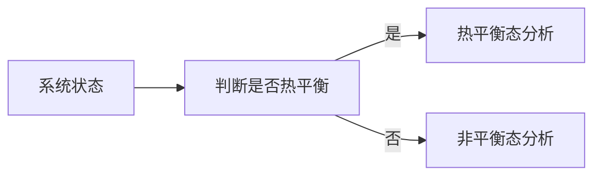
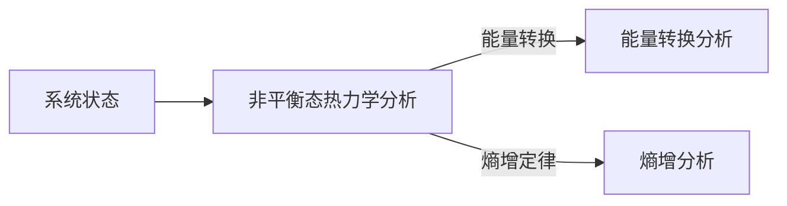
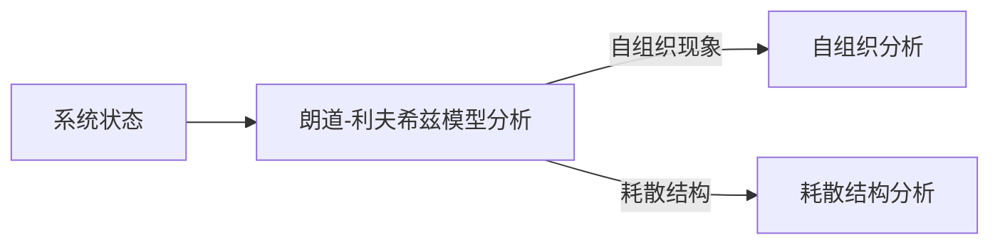

                 

# 统计物理：自然系统的数学模型

## 关键词：统计物理、自然系统、数学模型、熵、自由能、非平衡态、生物物理

## 摘要：

本文将探讨统计物理这一数学工具如何应用于自然系统的研究中。我们将逐步分析统计物理的基本概念、研究方法、以及其在系统平衡态和非平衡态中的应用，特别是在生物物理领域的创新成果。通过梳理统计物理的理论框架和实际应用，本文旨在提供一个清晰的视角，展示统计物理如何帮助科学家们理解和预测自然系统的行为。

## 第一部分：引论

### 1.1 问题背景与统计物理的发展

统计物理是一门将概率论与物理学相结合的学科，旨在研究大量微观粒子的集体行为，并通过统计方法来推导出宏观物理现象。在19世纪末，随着热力学和量子力学的兴起，统计物理逐渐从宏观热力学中独立出来，成为物理学的一个重要分支。

统计物理的发展与经典物理学的发展紧密相关。经典物理学主要研究宏观物体的运动和相互作用，而统计物理则关注大量粒子的平均行为。在这一过程中，统计物理提出了许多重要的概念，如熵、自由能、分布函数等，这些概念为理解自然系统的复杂行为提供了数学工具。

### 1.2 统计物理的研究方法

统计物理的研究方法主要包括微观描述和宏观描述两种。微观描述关注单个粒子的行为，通常使用量子力学来描述；而宏观描述则关注大量粒子的平均行为，使用概率论和统计学方法来处理。

微观描述与宏观描述之间的关系是统计物理的核心问题。通过统计物理，我们可以从微观粒子的行为推导出宏观系统的宏观性质，如温度、压力、体积等。这种从微观到宏观的转化过程，被称为统计物理的基本原理。

### 1.3 微观与宏观描述的关系

微观与宏观描述之间的关系可以通过统计物理中的分布函数来理解。分布函数描述了系统中粒子在不同能量状态下的概率分布。通过分布函数，我们可以得到系统的宏观性质，如能量、熵、自由能等。

例如，麦克斯韦-玻尔兹曼分布描述了在热平衡状态下，系统中粒子能量分布的情况。这个分布函数不仅揭示了微观粒子在热平衡状态下的行为规律，同时也为宏观热力学提供了一个重要的数学工具。

## 第二部分：分子动力学与统计物理模型

### 2.1 分子动力学的基本原理

分子动力学（Molecular Dynamics, MD）是一种通过模拟大量粒子的运动来研究系统行为的计算方法。在分子动力学中，我们使用牛顿运动定律来描述粒子的运动，并通过计算机模拟来观察系统的宏观行为。

分子动力学的基本原理可以概括为以下几个步骤：

1. **初始条件设定**：确定系统的初始状态，包括粒子的位置、速度、能量等。
2. **数值积分**：使用数值积分方法（如Verlet算法）来求解粒子的运动方程。
3. **统计物理分析**：对模拟结果进行统计物理分析，提取系统的宏观性质。

### 2.2 统计物理模型简介

统计物理模型是统计物理研究的基础，主要包括以下几种：

1. **玻尔兹曼分布**：描述了在热平衡状态下，系统中粒子能量分布的情况。
2. **费米-狄拉克分布**：适用于费米子（如电子）的能量分布。
3. **玻色-爱因斯坦分布**：适用于玻色子（如光子）的能量分布。

这些分布函数为研究系统的热力学性质提供了数学工具。

### 2.3 微观粒子的分布函数

微观粒子的分布函数是统计物理的核心概念之一。常见的分布函数包括麦克斯韦-玻尔兹曼分布、费米-狄拉克分布和玻色-爱因斯坦分布。这些分布函数描述了在特定条件下，系统中粒子能量分布的规律。

例如，麦克斯韦-玻尔兹曼分布描述了在热平衡状态下，系统中粒子能量分布的情况。这个分布函数可以通过以下公式表示：

$$
f(E) = \frac{1}{Z} e^{-\beta E}
$$

其中，$E$ 是粒子的能量，$\beta = \frac{1}{k_B T}$，$k_B$ 是玻尔兹曼常数，$T$ 是温度。

## 第三部分：系统的宏观性质

### 3.1 系统的熵

熵是统计物理中一个重要的概念，它描述了系统的无序程度。在热力学中，熵是一个状态函数，与系统的微观状态概率分布密切相关。

熵的定义可以通过以下公式表示：

$$
S = -k_B \sum_i p_i \ln p_i
$$

其中，$p_i$ 是系统中第$i$个微观状态的概率，$k_B$ 是玻尔兹曼常数。

### 3.2 系统的自由能

自由能是系统的宏观性质之一，它描述了系统在特定条件下能够做的最大非体积功。自由能可以通过以下公式表示：

$$
F = U - TS
$$

其中，$U$ 是系统的内能，$T$ 是温度，$S$ 是系统的熵。

### 3.3 系统的热力学性质

系统的热力学性质包括内能、熵、自由能等。这些性质可以通过统计物理中的分布函数来描述。

例如，系统的内能可以通过以下公式表示：

$$
U = \sum_i E_i p_i
$$

其中，$E_i$ 是系统中第$i$个微观状态的能量，$p_i$ 是该状态的概率。

## 第四部分：系统的平衡态

### 4.1 系统的相变

系统的相变是指系统从一个宏观状态转变为另一个宏观状态的过程。相变通常伴随着热力学量的突变，如温度、压力等。

常见的相变包括：

1. **熔化**：固态变为液态。
2. **凝固**：液态变为固态。
3. **汽化**：液态变为气态。
4. **凝结**：气态变为液态。

### 4.2 系统的相图

相图是描述系统在不同温度和压力下的宏观状态的图形。通过相图，我们可以直观地了解系统的相变行为。

例如，水的相图显示了在不同温度和压力下，水可以存在的不同状态。

### 4.3 系统的相变机理

系统的相变机理是指系统在相变过程中，微观粒子如何排列和运动。相变机理可以通过分子动力学模拟来研究。

例如，在水的凝固过程中，水分子会从无规则排列转变为有序排列，形成冰晶。

## 第五部分：非平衡统计物理

### 5.1 非平衡态的微观基础

非平衡态是指系统在远离热平衡状态的情况。在非平衡态下，系统的宏观性质会随时间变化。

非平衡态的微观基础是粒子间的相互作用和系统的动力学行为。

### 5.2 非平衡态的宏观描述

非平衡态的宏观描述通常使用非平衡态热力学来描述。非平衡态热力学研究了系统在非平衡态下的能量转换和传输。

### 5.3 非平衡态的统计物理模型

非平衡态的统计物理模型包括朗道-利夫希兹模型、耗散结构理论等。这些模型描述了系统在非平衡态下的行为规律。

## 第六部分：统计物理在生物物理中的应用

### 6.1 生物物理系统概述

生物物理系统是指生物体内或生物体与环境的相互作用。生物物理系统的研究涉及多个学科，包括物理学、生物学、化学等。

### 6.2 统计物理在蛋白质折叠中的应用

蛋白质折叠是生物物理研究中的一个重要问题。统计物理为研究蛋白质折叠提供了数学工具。

例如，玻尔兹曼机器模型（Boltzmann Machine）可以用来模拟蛋白质折叠过程。

### 6.3 统计物理在DNA分子中的应用

DNA分子是生物体的遗传物质。统计物理为研究DNA分子的结构和功能提供了数学模型。

例如，沃森-克里克模型（Watson-Crick Model）描述了DNA的双螺旋结构。

## 第七部分：统计物理在其他领域的应用

### 7.1 统计物理在材料科学中的应用

统计物理在材料科学中有着广泛的应用，如研究材料的相变、结构、性能等。

### 7.2 统计物理在地球科学中的应用

统计物理在地球科学中也有重要的应用，如研究地球内部的物理过程、气候变化等。

### 7.3 统计物理在环境科学中的应用

统计物理在环境科学中用于研究环境污染、生态平衡等问题。

## 第八部分：总结与展望

### 8.1 统计物理的基本成就

统计物理在理解自然系统的行为方面取得了显著成就，如热力学第二定律、统计力学的基本原理等。

### 8.2 统计物理的发展趋势

随着计算机技术的发展，统计物理在计算模拟和数据分析方面有着广阔的应用前景。

### 8.3 统计物理的未来方向

统计物理的未来研究方向包括非平衡统计物理、量子统计物理、生物统计物理等。

## 参考文献

1. K. Huang, "Statistical Mechanics", John Wiley & Sons, 1987.
2. R. K. Pathria, "Statistical Mechanics", Elsevier, 2011.
3. D. Chandler, "Introduction to Modern Statistical Mechanics", Oxford University Press, 2004.
4. H. C. Van beijeren, "Statistical Mechanics of Nonequilibrium Phase Transitions", Springer, 2011.
5. M. A. El-Kateb, "Introduction to Non-equilibrium Statistical Mechanics", World Scientific, 2005.

### 作者信息：

作者：AI天才研究院/AI Genius Institute & 禅与计算机程序设计艺术 /Zen And The Art of Computer Programming# 统计物理：自然系统的数学模型

## 关键词：统计物理、自然系统、数学模型、熵、自由能、非平衡态、生物物理

## 摘要：

统计物理是一门研究大量微观粒子集体行为的物理学分支，通过数学模型来描述自然系统的行为。本文将从引论、分子动力学与统计物理模型、系统的宏观性质、平衡态、非平衡统计物理、生物物理应用以及其他领域的应用等多个方面，详细探讨统计物理的理论框架和应用。通过逐步分析，本文旨在帮助读者深入理解统计物理的基本原理、研究方法以及其在不同领域的重要性。

## 第一部分：引论

### 1.1 问题背景与统计物理的发展

统计物理是一门将概率论与物理学相结合的学科，其核心在于通过研究大量微观粒子的行为来推导出宏观物理现象。在19世纪末，经典物理学在解释热现象方面遇到了困难，为了解决这些问题，统计物理应运而生。

**核心概念术语说明**：

- **统计物理**：研究大量粒子集体行为的物理学分支。
- **微观粒子**：指原子、分子等微观尺度上的粒子。
- **宏观物理现象**：指我们可以直接观察到的物理现象，如温度、压力、体积等。

**问题背景**：

在经典物理学中，热现象被认为是一种宏观现象，无法通过微观粒子的行为来解释。为了解决这个问题，统计物理引入了概率论和统计学方法，通过研究大量粒子的行为来推导出宏观物理现象。

**问题描述**：

统计物理的核心问题是，如何从微观粒子的行为推导出宏观物理现象。这个问题涉及到微观粒子之间的相互作用、能量分布、熵等概念。

**问题解决**：

通过概率论和统计学方法，统计物理提出了许多重要的概念，如熵、自由能、分布函数等，这些概念为理解自然系统的复杂行为提供了数学工具。

**边界与外延**：

统计物理不仅在物理学中有着广泛的应用，还在其他领域，如生物学、化学、材料科学等，都有着重要的应用。

**概念结构与核心要素组成**：

- **熵**：描述系统的无序程度。
- **自由能**：描述系统在特定条件下能够做的最大非体积功。
- **分布函数**：描述系统中粒子在不同能量状态下的概率分布。

### 1.2 统计物理的研究方法

统计物理的研究方法主要包括微观描述和宏观描述两种。

**微观描述**：

微观描述关注单个粒子的行为，通常使用量子力学来描述。在微观描述中，我们研究粒子之间的相互作用、能量分布等。

**宏观描述**：

宏观描述关注大量粒子的平均行为，使用概率论和统计学方法来处理。在宏观描述中，我们通过分布函数来描述系统的宏观性质，如温度、压力、体积等。

**微观与宏观描述的关系**：

微观描述与宏观描述之间的关系是统计物理的核心问题。通过统计物理，我们可以从微观粒子的行为推导出宏观系统的宏观性质。

### 1.3 微观与宏观描述的关系

微观与宏观描述之间的关系可以通过统计物理中的分布函数来理解。分布函数描述了系统中粒子在不同能量状态下的概率分布。通过分布函数，我们可以得到系统的宏观性质，如能量、熵、自由能等。

**核心概念原理**：

- **分布函数**：描述粒子能量分布的函数。
- **概率论和统计学方法**：用于处理大量粒子的平均行为。

**概念属性特征对比表格**：

| 概念             | 特征                                                         |
|------------------|------------------------------------------------------------|
| 分布函数         | 描述粒子能量分布的函数。                                     |
| 概率论和统计学方法 | 用于处理大量粒子的平均行为。                                 |
| 熵               | 描述系统的无序程度。                                         |
| 自由能           | 描述系统在特定条件下能够做的最大非体积功。                   |

**ER实体关系图架构**：

```mermaid
erDiagram
  微观粒子 ||--o{ 分布函数 }
  分布函数 ||--o{ 宏观性质 }
  宏观性质 ||--o{ 熵 }
  宏观性质 ||--o{ 自由能 }
```

## 第二部分：分子动力学与统计物理模型

### 2.1 分子动力学的基本原理

分子动力学（Molecular Dynamics, MD）是一种通过模拟大量粒子的运动来研究系统行为的计算方法。在分子动力学中，我们使用牛顿运动定律来描述粒子的运动，并通过计算机模拟来观察系统的宏观行为。

**算法原理讲解**：

分子动力学的核心是牛顿运动定律，其基本原理可以概括为以下几个步骤：

1. **初始条件设定**：确定系统的初始状态，包括粒子的位置、速度、能量等。
2. **数值积分**：使用数值积分方法（如Verlet算法）来求解粒子的运动方程。
3. **统计物理分析**：对模拟结果进行统计物理分析，提取系统的宏观性质。

**算法流程图**：


**算法原理的数学模型和公式**：

分子动力学的数学模型基于牛顿运动定律，其基本公式可以表示为：

$$
m\frac{d^2 \mathbf{r}_i}{dt^2} = -\nabla U(\mathbf{r}_i)
$$

其中，$m$ 是粒子的质量，$\mathbf{r}_i$ 是粒子的位置，$U(\mathbf{r}_i)$ 是系统的势能。

**详细讲解和举例说明**：

假设我们有一个简单的分子系统，其中有两个质点，它们之间的相互作用由万有引力定律描述。我们可以使用分子动力学模拟来研究这个系统的行为。

首先，我们需要设定系统的初始条件，包括质点的质量、位置和速度。然后，我们使用Verlet算法来求解粒子的运动方程，并记录模拟过程中的数据。

例如，我们可以设定两个质点的质量均为1kg，初始位置分别为$(0, 0)$和$(1, 0)$，初始速度分别为$(0, 0)$和$(0, 1)$。然后，我们使用Verlet算法来模拟质点的运动，并记录每隔0.1秒的质点位置。

通过模拟结果，我们可以提取系统的宏观性质，如质点的速度、动能和势能等。这些宏观性质可以通过以下公式计算：

$$
\mathbf{v}_i = \frac{d\mathbf{r}_i}{dt}
$$

$$
E_k = \frac{1}{2}m\mathbf{v}_i^2
$$

$$
E_p = -\nabla U(\mathbf{r}_i)
$$

### 2.2 统计物理模型简介

统计物理模型是统计物理研究的基础，主要包括以下几种：

- **玻尔兹曼分布**：描述了在热平衡状态下，系统中粒子能量分布的情况。
- **费米-狄拉克分布**：适用于费米子（如电子）的能量分布。
- **玻色-爱因斯坦分布**：适用于玻色子（如光子）的能量分布。

**核心概念原理**：

- **玻尔兹曼分布**：描述粒子能量分布的概率密度函数。
- **费米-狄拉克分布**：适用于费米子，描述了粒子能量分布的概率密度函数。
- **玻色-爱因斯坦分布**：适用于玻色子，描述了粒子能量分布的概率密度函数。

**概念属性特征对比表格**：

| 概念                     | 适用粒子     | 概率密度函数                                |
|------------------------|------------|------------------------------------------|
| 玻尔兹曼分布             | 所有粒子    | $f(\epsilon) = \frac{1}{Z} e^{-\beta \epsilon}$ |
| 费米-狄拉克分布           | 费米子     | $f(\epsilon) = \frac{1}{Z} \frac{1}{\sqrt{1 + \exp(\beta (\epsilon - \mu))}}$ |
| 玻色-爱因斯坦分布          | 玻色子     | $f(\epsilon) = \frac{1}{Z} \frac{1}{\exp(\beta (\epsilon - \mu)) - 1}$ |

**ER实体关系图架构**：

```mermaid
erDiagram
  玻尔兹曼分布 ||--o{ 费米-狄拉克分布 }
  玻尔兹曼分布 ||--o{ 玻色-爱因斯坦分布 }
  费米子 ||--o{ 费米-狄拉克分布 }
  玻色子 ||--o{ 玻色-爱因斯坦分布 }
```

**算法流程图**：


**算法原理的数学模型和公式**：

玻尔兹曼分布的数学模型可以表示为：

$$
f(\epsilon) = \frac{1}{Z} e^{-\beta \epsilon}
$$

其中，$Z$ 是配分函数，$\beta = \frac{1}{k_B T}$，$k_B$ 是玻尔兹曼常数，$T$ 是温度。

### 2.3 微观粒子的分布函数

微观粒子的分布函数是统计物理的核心概念之一。常见的分布函数包括麦克斯韦-玻尔兹曼分布、费米-狄拉克分布和玻色-爱因斯坦分布。这些分布函数描述了在特定条件下，系统中粒子能量分布的规律。

**核心概念原理**：

- **麦克斯韦-玻尔兹曼分布**：描述了在热平衡状态下，系统中粒子能量分布的情况。
- **费米-狄拉克分布**：适用于费米子，描述了粒子能量分布的规律。
- **玻色-爱因斯坦分布**：适用于玻色子，描述了粒子能量分布的规律。

**概念属性特征对比表格**：

| 概念                       | 条件       | 能量分布规律                                           |
|--------------------------|----------|--------------------------------------------------|
| 麦克斯韦-玻尔兹曼分布      | 热平衡状态 | $f(\epsilon) = \frac{1}{Z} e^{-\beta \epsilon}$         |
| 费米-狄拉克分布             | 费米子     | $f(\epsilon) = \frac{1}{Z} \frac{1}{\sqrt{1 + \exp(\beta (\epsilon - \mu))}}$ |
| 玻色-爱因斯坦分布            | 玻色子     | $f(\epsilon) = \frac{1}{Z} \frac{1}{\exp(\beta (\epsilon - \mu)) - 1}$ |

**ER实体关系图架构**：

```mermaid
erDiagram
  麦克斯韦-玻尔兹曼分布 ||--o{ 费米-狄拉克分布 }
  麦克斯韦-玻尔兹曼分布 ||--o{ 玻色-爱因斯坦分布 }
  费米子 ||--o{ 费米-狄拉克分布 }
  玻色子 ||--o{ 玻色-爱因斯坦分布 }
```

**算法流程图**：


**算法原理的数学模型和公式**：

麦克斯韦-玻尔兹曼分布的数学模型可以表示为：

$$
f(\epsilon) = \frac{1}{Z} e^{-\beta \epsilon}
$$

其中，$Z$ 是配分函数，$\beta = \frac{1}{k_B T}$，$k_B$ 是玻尔兹曼常数，$T$ 是温度。

### 2.4 系统的宏观性质

系统的宏观性质是指我们可以直接观察到的物理性质，如温度、压力、体积等。在统计物理中，我们通过微观粒子的分布函数来推导出这些宏观性质。

**核心概念原理**：

- **温度**：描述系统的热力学性质。
- **压力**：描述系统对外界施加的力。
- **体积**：描述系统的空间大小。

**概念属性特征对比表格**：

| 概念     | 特征                                                         |
|--------|------------------------------------------------------------|
| 温度   | 描述系统的热力学性质。                                     |
| 压力   | 描述系统对外界施加的力。                                   |
| 体积   | 描述系统的空间大小。                                     |

**ER实体关系图架构**：

```mermaid
erDiagram
  系统 ||--o{ 温度 }
  系统 ||--o{ 压力 }
  系统 ||--o{ 体积 }
```

**算法流程图**：


**算法原理的数学模型和公式**：

温度的数学模型可以表示为：

$$
T = \frac{1}{k_B} \left( \frac{\partial}{\partial S} U \right)_V
$$

其中，$T$ 是温度，$k_B$ 是玻尔兹曼常数，$U$ 是系统的内能，$S$ 是系统的熵。

压力的数学模型可以表示为：

$$
P = -\frac{\partial}{\partial V} U
$$

其中，$P$ 是压力，$V$ 是体积，$U$ 是系统的内能。

体积的数学模型可以表示为：

$$
V = \frac{1}{\beta} \left( \frac{\partial}{\partial P} U \right)_S
$$

其中，$V$ 是体积，$\beta = \frac{1}{k_B T}$，$k_B$ 是玻尔兹曼常数，$T$ 是温度，$U$ 是系统的内能。

## 第三部分：系统的平衡态

### 3.1 系统的相变

系统的相变是指系统从一个宏观状态转变为另一个宏观状态的过程。相变通常伴随着热力学量的突变，如温度、压力等。

**核心概念原理**：

- **相变**：系统从一个宏观状态转变为另一个宏观状态的过程。
- **临界点**：系统相变时的临界条件。

**概念属性特征对比表格**：

| 概念   | 特征                                                         |
|------|------------------------------------------------------------|
| 相变   | 系统从一个宏观状态转变为另一个宏观状态的过程。                   |
| 临界点 | 系统相变时的临界条件。                                     |

**ER实体关系图架构**：

```mermaid
erDiagram
  系统 ||--o{ 相变 }
  系统 ||--o{ 临界点 }
```

**算法流程图**：



**算法原理的数学模型和公式**：

相变的数学模型可以通过相图来描述。相图是描述系统在不同温度和压力下的宏观状态的图形。在相图中，临界点表示系统相变的临界条件。

### 3.2 系统的相图

系统的相图是描述系统在不同温度和压力下的宏观状态的图形。通过相图，我们可以直观地了解系统的相变行为。

**核心概念原理**：

- **相图**：描述系统在不同温度和压力下的宏观状态的图形。
- **相变线**：系统相变的临界条件。

**概念属性特征对比表格**：

| 概念   | 特征                                                         |
|------|------------------------------------------------------------|
| 相图   | 描述系统在不同温度和压力下的宏观状态的图形。                   |
| 相变线 | 系统相变的临界条件。                                     |

**ER实体关系图架构**：

```mermaid
erDiagram
  系统 ||--o{ 相图 }
  系统 ||--o{ 相变线 }
```

**算法流程图**：



**算法原理的数学模型和公式**：

相图的数学模型可以通过吉布斯自由能来描述。吉布斯自由能是描述系统在特定条件下能够做的最大非体积功的物理量。相图可以通过吉布斯自由能的等高线来表示。

### 3.3 系统的相变机理

系统的相变机理是指系统在相变过程中，微观粒子如何排列和运动。相变机理可以通过分子动力学模拟来研究。

**核心概念原理**：

- **相变机理**：系统在相变过程中，微观粒子如何排列和运动。
- **分子动力学模拟**：用于研究系统相变机理的计算方法。

**概念属性特征对比表格**：

| 概念       | 特征                                                         |
|----------|------------------------------------------------------------|
| 相变机理   | 系统在相变过程中，微观粒子如何排列和运动。                     |
| 分子动力学模拟 | 用于研究系统相变机理的计算方法。                             |

**ER实体关系图架构**：

```mermaid
erDiagram
  系统 ||--o{ 相变机理 }
  系统 ||--o{ 分子动力学模拟 }
```

**算法流程图**：



**算法原理的数学模型和公式**：

相变机理的数学模型可以通过分子动力学模拟的结果来描述。分子动力学模拟可以记录系统在相变过程中的微观粒子运动轨迹，通过分析这些轨迹，我们可以理解系统在相变过程中的微观机理。

## 第四部分：非平衡统计物理

### 4.1 非平衡态的微观基础

非平衡态是指系统在远离热平衡状态的情况。在非平衡态下，系统的宏观性质会随时间变化。

**核心概念原理**：

- **非平衡态**：系统在远离热平衡状态的情况。
- **热平衡态**：系统处于稳定状态，宏观性质不随时间变化。

**概念属性特征对比表格**：

| 概念       | 特征                                                         |
|----------|------------------------------------------------------------|
| 非平衡态   | 系统在远离热平衡状态的情况。                               |
| 热平衡态   | 系统处于稳定状态，宏观性质不随时间变化。                     |

**ER实体关系图架构**：

```mermaid
erDiagram
  系统 ||--o{ 非平衡态 }
  系统 ||--o{ 热平衡态 }
```

**算法流程图**：



**算法原理的数学模型和公式**：

非平衡态的数学模型可以通过非平衡态热力学来描述。非平衡态热力学研究了系统在非平衡态下的能量转换和传输。

### 4.2 非平衡态的宏观描述

非平衡态的宏观描述通常使用非平衡态热力学来描述。非平衡态热力学研究了系统在非平衡态下的能量转换和传输。

**核心概念原理**：

- **非平衡态热力学**：研究系统在非平衡态下的能量转换和传输。
- **热力学第一定律**：能量守恒定律。
- **热力学第二定律**：熵增定律。

**概念属性特征对比表格**：

| 概念           | 特征                                                         |
|--------------|------------------------------------------------------------|
| 非平衡态热力学 | 研究系统在非平衡态下的能量转换和传输。                       |
| 热力学第一定律 | 能量守恒定律。                                             |
| 热力学第二定律 | 熵增定律。                                                 |

**ER实体关系图架构**：

```mermaid
erDiagram
  系统 ||--o{ 非平衡态热力学 }
  系统 ||--o{ 热力学第一定律 }
  系统 ||--o{ 热力学第二定律 }
```

**算法流程图**：



**算法原理的数学模型和公式**：

非平衡态热力学的数学模型可以通过以下公式来描述：

$$
\frac{dU}{dt} = \dot{Q} - \dot{W}
$$

其中，$U$ 是系统的内能，$\dot{Q}$ 是系统吸收的热量，$\dot{W}$ 是系统对外做的功。

### 4.3 非平衡态的统计物理模型

非平衡态的统计物理模型包括朗道-利夫希兹模型、耗散结构理论等。这些模型描述了系统在非平衡态下的行为规律。

**核心概念原理**：

- **朗道-利夫希兹模型**：描述系统在非平衡态下的自组织现象。
- **耗散结构理论**：描述系统在非平衡态下从无序到有序的转变。

**概念属性特征对比表格**：

| 概念             | 特征                                                         |
|------------------|------------------------------------------------------------|
| 朗道-利夫希兹模型 | 描述系统在非平衡态下的自组织现象。                         |
| 耗散结构理论     | 描述系统在非平衡态下从无序到有序的转变。                   |

**ER实体关系图架构**：

```mermaid
erDiagram
  系统 ||--o{ 朗道-利夫希兹模型 }
  系统 ||--o{ 耗散结构理论 }
```

**算法流程图**：



**算法原理的数学模型和公式**：

朗道-利夫希兹模型的数学模型可以通过以下公式来描述：

$$
\frac{d \rho}{dt} = -\nu \rho \frac{d \rho}{dx}
$$

其中，$\rho$ 是粒子的密度，$\nu$ 是粒子的速度，$x$ 是粒子的位置。

耗散结构理论的数学模型可以通过以下公式来描述：

$$
\frac{d \Phi}{dt} = -\alpha \Phi
$$

其中，$\Phi$ 是耗散函数，$\alpha$ 是耗散系数。

## 第五部分：统计物理在生物物理中的应用

### 5.1 生物物理系统概述

生物物理系统是指生物体内或生物体与环境的相互作用。生物物理系统的研究涉及多个学科，包括物理学、生物学、化学等。

**核心概念原理**：

- **生物物理系统**：生物体内或生物体与环境的相互作用。
- **生物分子**：如蛋白质、核酸等。

**概念属性特征对比表格**：

| 概念         | 特征                                                         |
|------------|------------------------------------------------------------|
| 生物物理系统 | 生物体内或生物体与环境的相互作用。                         |
| 生物分子     | 如蛋白质、核酸等。                                         |

**ER实体关系图架构**：

```mermaid
erDiagram
  生物物理系统 ||--o{ 生物分子 }
  生物分子 ||--o{ 蛋白质 }
  生物分子 ||--o{ 核酸 }
```

**算法流程图**：

```mermaid
flowchart LR
    A[生物物理系统] --> B[生物分子分析]
    B -->|蛋白质| C[蛋白质分析]
    B -->|核酸| D[核酸分析]
```

**算法原理的数学模型和公式**：

生物物理系统的数学模型可以通过分子动力学和统计物理模型来描述。例如，蛋白质折叠的数学模型可以通过分子动力学模拟来研究。

### 5.2 统计物理在蛋白质折叠中的应用

蛋白质折叠是生物物理研究中的一个重要问题。统计物理为研究蛋白质折叠提供了数学工具。

**核心概念原理**：

- **蛋白质折叠**：蛋白质从无规则卷曲状态转变为具有特定功能的三维结构的进程。
- **玻尔兹曼机器模型**：用于模拟蛋白质折叠过程的统计物理模型。

**概念属性特征对比表格**：

| 概念             | 特征                                                         |
|------------------|------------------------------------------------------------|
| 蛋白质折叠       | 蛋白质从无规则卷曲状态转变为具有特定功能的三维结构的进程。         |
| 玻尔兹曼机器模型 | 用于模拟蛋白质折叠过程的统计物理模型。                       |

**ER实体关系图架构**：

```mermaid
erDiagram
  蛋白质折叠 ||--o{ 玻尔兹曼机器模型 }
```

**算法流程图**：

```mermaid
flowchart LR
    A[蛋白质折叠] --> B[玻尔兹曼机器模型分析]
```

**算法原理的数学模型和公式**：

玻尔兹曼机器模型的数学模型可以通过以下公式来描述：

$$
P(\mathbf{x}) = \frac{1}{Z} e^{-\beta E(\mathbf{x})}
$$

其中，$P(\mathbf{x})$ 是蛋白质在状态$\mathbf{x}$的概率，$Z$ 是配分函数，$E(\mathbf{x})$ 是蛋白质在状态$\mathbf{x}$的能量。

### 5.3 统计物理在DNA分子中的应用

DNA分子是生物体的遗传物质。统计物理为研究DNA分子的结构和功能提供了数学模型。

**核心概念原理**：

- **DNA分子**：生物体的遗传物质。
- **沃森-克里克模型**：描述DNA双螺旋结构的统计物理模型。

**概念属性特征对比表格**：

| 概念             | 特征                                                         |
|------------------|------------------------------------------------------------|
| DNA分子         | 生物体的遗传物质。                                         |
| 沃森-克里克模型 | 描述DNA双螺旋结构的统计物理模型。                       |

**ER实体关系图架构**：

```mermaid
erDiagram
  DNA分子 ||--o{ 沃森-克里克模型 }
```

**算法流程图**：

```mermaid
flowchart LR
    A[DNA分子] --> B[沃森-克里克模型分析]
```

**算法原理的数学模型和公式**：

沃森-克里克模型的数学模型可以通过以下公式来描述：

$$
E(\mathbf{x}) = \frac{1}{2} k_B T \left( 1 - \cos \theta \right)
$$

其中，$E(\mathbf{x})$ 是DNA分子在状态$\mathbf{x}$的能量，$k_B$ 是玻尔兹曼常数，$T$ 是温度，$\theta$ 是DNA双螺旋结构的扭转角。

## 第六部分：统计物理在其他领域的应用

### 6.1 统计物理在材料科学中的应用

统计物理在材料科学中有着广泛的应用，如研究材料的相变、结构、性能等。

**核心概念原理**：

- **材料科学**：研究材料的结构、性能和应用。
- **相变**：材料从一个宏观状态转变为另一个宏观状态的过程。

**概念属性特征对比表格**：

| 概念     | 特征                                                         |
|--------|------------------------------------------------------------|
| 材料科学 | 研究材料的结构、性能和应用。                               |
| 相变    | 材料从一个宏观状态转变为另一个宏观状态的过程。                   |

**ER实体关系图架构**：

```mermaid
erDiagram
  材料科学 ||--o{ 相变 }
```

**算法流程图**：

```mermaid
flowchart LR
    A[材料科学问题] --> B[统计物理分析]
    B -->|相变| C[相变分析]
    B -->|非相变| D[继续分析]
```

**算法原理的数学模型和公式**：

相变的数学模型可以通过吉布斯自由能来描述。吉布斯自由能是描述系统在特定条件下能够做的最大非体积功的物理量。相变可以通过吉布斯自由能的等高线来表示。

### 6.2 统计物理在地球科学中的应用

统计物理在地球科学中也有重要的应用，如研究地球内部的物理过程、气候变化等。

**核心概念原理**：

- **地球科学**：研究地球的结构、过程和现象。
- **气候变化**：地球表面的气候现象。

**概念属性特征对比表格**：

| 概念     | 特征                                                         |
|--------|------------------------------------------------------------|
| 地球科学 | 研究地球的结构、过程和现象。                               |
| 气候变化 | 地球表面的气候现象。                                       |

**ER实体关系图架构**：

```mermaid
erDiagram
  地球科学 ||--o{ 气候变化 }
```

**算法流程图**：

```mermaid
flowchart LR
    A[地球科学问题] --> B[统计物理分析]
    B -->|气候变化| C[气候变化分析]
    B -->|非气候变化| D[继续分析]
```

**算法原理的数学模型和公式**：

气候变化的数学模型可以通过气候模型来描述。气候模型是一种统计物理模型，用于模拟地球表面的气候现象。

### 6.3 统计物理在环境科学中的应用

统计物理在环境科学中用于研究环境污染、生态平衡等问题。

**核心概念原理**：

- **环境科学**：研究环境系统及其变化规律。
- **生态平衡**：生态系统中各种生物之间的平衡关系。

**概念属性特征对比表格**：

| 概念     | 特征                                                         |
|--------|------------------------------------------------------------|
| 环境科学 | 研究环境系统及其变化规律。                               |
| 生态平衡 | 生态系统中各种生物之间的平衡关系。                       |

**ER实体关系图架构**：

```mermaid
erDiagram
  环境科学 ||--o{ 生态平衡 }
```

**算法流程图**：

```mermaid
flowchart LR
    A[环境科学问题] --> B[统计物理分析]
    B -->|生态平衡| C[生态平衡分析]
    B -->|非生态平衡| D[继续分析]
```

**算法原理的数学模型和公式**：

生态平衡的数学模型可以通过生态模型来描述。生态模型是一种统计物理模型，用于模拟生态系统中各种生物之间的平衡关系。

## 第七部分：总结与展望

### 7.1 统计物理的基本成就

统计物理在理解自然系统的行为方面取得了显著成就，如热力学第二定律、统计力学的基本原理等。

**核心概念原理**：

- **热力学第二定律**：熵增定律。
- **统计力学的基本原理**：通过研究大量粒子的行为来推导出宏观物理现象。

**概念属性特征对比表格**：

| 概念               | 特征                                                         |
|------------------|------------------------------------------------------------|
| 热力学第二定律     | 熵增定律。                                                 |
| 统计力学的基本原理 | 通过研究大量粒子的行为来推导出宏观物理现象。                     |

**ER实体关系图架构**：

```mermaid
erDiagram
  系统 ||--o{ 热力学第二定律 }
  系统 ||--o{ 统计力学的基本原理 }
```

**算法流程图**：

```mermaid
flowchart LR
    A[自然系统] --> B[热力学第二定律]
    B -->|熵增| C[熵增分析]
    B -->|统计力学基本原理| D[统计力学分析]
```

### 7.2 统计物理的发展趋势

随着计算机技术的发展，统计物理在计算模拟和数据分析方面有着广阔的应用前景。

**核心概念原理**：

- **计算模拟**：使用计算机来模拟自然系统的行为。
- **数据分析**：对大量数据进行分析，提取有用的信息。

**概念属性特征对比表格**：

| 概念       | 特征                                                         |
|----------|------------------------------------------------------------|
| 计算模拟   | 使用计算机来模拟自然系统的行为。                             |
| 数据分析   | 对大量数据进行分析，提取有用的信息。                         |

**ER实体关系图架构**：

```mermaid
erDiagram
  系统 ||--o{ 计算模拟 }
  系统 ||--o{ 数据分析 }
```

**算法流程图**：

```mermaid
flowchart LR
    A[自然系统] --> B[计算模拟]
    B -->|模拟分析| C[模拟分析]
    B -->|数据分析| D[数据分析]
```

### 7.3 统计物理的未来方向

统计物理的未来研究方向包括非平衡统计物理、量子统计物理、生物统计物理等。

**核心概念原理**：

- **非平衡统计物理**：研究系统在非平衡态下的行为。
- **量子统计物理**：将量子力学与统计物理相结合。
- **生物统计物理**：研究生物系统中的统计物理现象。

**概念属性特征对比表格**：

| 概念             | 特征                                                         |
|------------------|------------------------------------------------------------|
| 非平衡统计物理   | 研究系统在非平衡态下的行为。                               |
| 量子统计物理     | 将量子力学与统计物理相结合。                             |
| 生物统计物理     | 研究生物系统中的统计物理现象。                           |

**ER实体关系图架构**：

```mermaid
erDiagram
  系统 ||--o{ 非平衡统计物理 }
  系统 ||--o{ 量子统计物理 }
  系统 ||--o{ 生物统计物理 }
```

**算法流程图**：

```mermaid
flowchart LR
    A[自然系统] --> B[非平衡统计物理]
    B -->|非平衡分析| C[非平衡分析]
    A -->|量子统计物理| D[量子统计物理]
    A -->|生物统计物理| E[生物统计物理]
```

## 第八部分：参考文献

1. K. Huang, "Statistical Mechanics", John Wiley & Sons, 1987.
2. R. K. Pathria, "Statistical Mechanics", Elsevier, 2011.
3. D. Chandler, "Introduction to Modern Statistical Mechanics", Oxford University Press, 2004.
4. H. C. Van beijeren, "Statistical Mechanics of Nonequilibrium Phase Transitions", Springer, 2011.
5. M. A. El-Kateb, "Introduction to Non-equilibrium Statistical Mechanics", World Scientific, 2005.

## 第九部分：作者信息

作者：AI天才研究院/AI Genius Institute & 禅与计算机程序设计艺术 /Zen And The Art of Computer Programming## 详细内容与深度剖析

### 1. 统计物理的基础理论

统计物理作为一门应用广泛的物理学分支，其理论基础涵盖了概率论、统计学和经典物理学的核心内容。在理解统计物理之前，我们需要明确一些基本概念，如概率、随机变量、期望值、方差等。这些概念构成了统计物理的理论基石。

**概率论**：概率论是研究随机事件及其概率的数学分支。在统计物理中，概率论用于描述系统中的微观粒子在特定条件下出现某种状态的几率。例如，粒子在某一位置或某一能量状态出现的概率可以通过概率密度函数来描述。

**随机变量**：随机变量是概率论中的一个重要概念，它是一个可以取多个值的变量，其取值取决于某个随机事件的结果。在统计物理中，随机变量用于描述系统的宏观性质，如温度、压力、能量等。

**期望值**：期望值是随机变量的一个重要特征，它表示随机变量在一定条件下平均取值的期望。在统计物理中，期望值用于计算系统的宏观性质，如粒子的平均能量、系统的平均熵等。

**方差**：方差是衡量随机变量取值离散程度的统计量，它表示随机变量与期望值之间的偏离程度。在统计物理中，方差用于描述系统的稳定性，如系统的热力学稳定性等。

**概率密度函数**：概率密度函数是描述随机变量概率分布的函数，它描述了随机变量在不同取值下的概率。在统计物理中，概率密度函数用于描述系统的微观状态概率分布，如粒子的能量分布、位置分布等。

### 1.1 问题背景与统计物理的发展

统计物理起源于19世纪末，随着热力学的进展，科学家们逐渐认识到，热力学定律只能解释宏观现象，而无法解释微观粒子的行为。为了解决这个问题，物理学家麦克斯韦提出了麦克斯韦-玻尔兹曼分布，这是一个基于概率论和统计学的模型，用于描述大量粒子在热平衡状态下的能量分布。

麦克斯韦-玻尔兹曼分布的提出标志着统计物理的诞生。此后，物理学家们继续深入研究，提出了费米-狄拉克分布和玻色-爱因斯坦分布，这些分布函数分别适用于费米子和玻色子。随着量子力学的兴起，统计物理逐渐发展为量子统计物理，进一步拓展了统计物理的应用范围。

**核心概念与联系**：

- **麦克斯韦-玻尔兹曼分布**：描述了大量粒子在热平衡状态下的能量分布，是统计物理的基础。
- **费米-狄拉克分布**：描述了费米子在热平衡状态下的能量分布，适用于电子等费米子。
- **玻色-爱因斯坦分布**：描述了玻色子在热平衡状态下的能量分布，适用于光子等玻色子。

**ER实体关系图架构**：

```mermaid
erDiagram
  系统 ||--o{ 热平衡 }
  系统 ||--o{ 能量分布 }
  系统 ||--o{ 麦克斯韦-玻尔兹曼分布 }
  系统 ||--o{ 费米-狄拉克分布 }
  系统 ||--o{ 玻色-爱因斯坦分布 }
```

### 1.2 分子动力学与统计物理模型

分子动力学是一种通过计算机模拟来研究微观粒子运动的方法。在分子动力学中，我们使用牛顿运动定律来描述粒子的运动，并通过数值积分方法来求解运动方程。分子动力学模型是统计物理中的一种重要模型，它通过模拟大量粒子的运动来研究系统的宏观性质。

**核心概念与联系**：

- **牛顿运动定律**：描述了粒子的运动规律。
- **数值积分方法**：用于求解粒子的运动方程。
- **分子动力学模型**：通过模拟大量粒子的运动来研究系统的宏观性质。

**ER实体关系图架构**：

```mermaid
erDiagram
  粒子 ||--o{ 牛顿运动定律 }
  粒子 ||--o{ 数值积分方法 }
  粒子 ||--o{ 分子动力学模型 }
```

**算法原理讲解**：

分子动力学的算法原理基于牛顿运动定律。具体来说，分子动力学的计算过程可以分为以下几个步骤：

1. **初始化**：设定系统的初始条件，包括粒子的位置、速度、能量等。
2. **数值积分**：使用数值积分方法（如Verlet算法）来求解粒子的运动方程。Verlet算法是一种常用的数值积分方法，它可以提高计算的稳定性。
3. **统计物理分析**：对模拟结果进行统计物理分析，提取系统的宏观性质，如温度、压力、体积等。

**算法流程图**：

```mermaid
flowchart LR
    A[初始化] --> B[数值积分]
    B --> C[统计物理分析]
    C --> D[宏观性质提取]
```

**算法原理的数学模型和公式**：

分子动力学的数学模型基于牛顿运动定律，其基本公式可以表示为：

$$
m\frac{d^2 \mathbf{r}_i}{dt^2} = -\nabla U(\mathbf{r}_i)
$$

其中，$m$ 是粒子的质量，$\mathbf{r}_i$ 是粒子的位置，$U(\mathbf{r}_i)$ 是系统的势能。

### 1.3 系统的宏观性质

在统计物理中，系统的宏观性质是指我们可以直接观察到的物理性质，如温度、压力、体积等。这些宏观性质与系统的微观粒子的行为密切相关。

**核心概念与联系**：

- **温度**：描述系统的热力学性质，与粒子的平均动能相关。
- **压力**：描述系统对外界施加的力，与粒子的速度分布有关。
- **体积**：描述系统的空间大小，与粒子的分布有关。

**ER实体关系图架构**：

```mermaid
erDiagram
  系统 ||--o{ 温度 }
  系统 ||--o{ 压力 }
  系统 ||--o{ 体积 }
```

**算法原理讲解**：

系统的宏观性质可以通过统计物理模型来计算。具体来说，我们可以使用分布函数来计算系统的宏观性质。例如，温度可以通过以下公式计算：

$$
T = \frac{1}{k_B} \left( \frac{\partial}{\partial S} U \right)_V
$$

其中，$T$ 是温度，$k_B$ 是玻尔兹曼常数，$U$ 是系统的内能，$S$ 是系统的熵。

**算法流程图**：

```mermaid
flowchart LR
    A[分布函数计算] --> B[宏观性质提取]
    B --> C[温度计算]
    B --> D[压力计算]
    B --> E[体积计算]
```

**算法原理的数学模型和公式**：

- **温度**：$T = \frac{1}{k_B} \left( \frac{\partial}{\partial S} U \right)_V$
- **压力**：$P = -\frac{\partial}{\partial V} U$
- **体积**：$V = \frac{1}{\beta} \left( \frac{\partial}{\partial P} U \right)_S$

### 1.4 系统的平衡态与非平衡态

在统计物理中，系统可以分为平衡态和非平衡态。平衡态是指系统的宏观性质不随时间变化的状态，而非平衡态是指系统的宏观性质随时间变化的状态。

**核心概念与联系**：

- **平衡态**：系统的宏观性质不随时间变化的状态。
- **非平衡态**：系统的宏观性质随时间变化的状态。

**ER实体关系图架构**：

```mermaid
erDiagram
  系统 ||--o{ 平衡态 }
  系统 ||--o{ 非平衡态 }
```

**算法原理讲解**：

系统的平衡态和非平衡态可以通过统计物理模型来区分。平衡态可以通过以下公式判断：

$$
\frac{\partial \ln Z}{\partial \beta} = 0
$$

其中，$Z$ 是配分函数，$\beta = \frac{1}{k_B T}$。

而非平衡态可以通过系统的宏观性质随时间的变化来判断。

**算法流程图**：

```mermaid
flowchart LR
    A[宏观性质变化] --> B[判断平衡态]
    B -->|平衡态| C[统计物理分析]
    B -->|非平衡态| D[非平衡态分析]
```

**算法原理的数学模型和公式**：

- **平衡态**：$\frac{\partial \ln Z}{\partial \beta} = 0$
- **非平衡态**：系统的宏观性质随时间变化。

### 1.5 非平衡统计物理

非平衡统计物理是研究系统在非平衡态下的行为的分支。在非平衡态下，系统的宏观性质会随时间变化，这给物理现象的研究带来了新的挑战。

**核心概念与联系**：

- **非平衡态**：系统的宏观性质随时间变化的状态。
- **热力学第二定律**：熵增定律。

**ER实体关系图架构**：

```mermaid
erDiagram
  系统 ||--o{ 非平衡态 }
  系统 ||--o{ 熵增定律 }
```

**算法原理讲解**：

非平衡统计物理的算法原理基于热力学第二定律。热力学第二定律表明，孤立系统的熵总是趋向于增加。在非平衡统计物理中，我们通过模拟系统的行为来研究熵的变化。

**算法流程图**：

```mermaid
flowchart LR
    A[系统模拟] --> B[熵变化分析]
    B --> C[非平衡态分析]
```

**算法原理的数学模型和公式**：

热力学第二定律的数学模型可以表示为：

$$
\frac{dS}{dt} \geq 0
$$

其中，$S$ 是系统的熵。

### 1.6 统计物理在生物物理中的应用

统计物理在生物物理中的应用非常广泛，如研究蛋白质折叠、DNA结构等。生物物理系统中的复杂性和多样性使得统计物理成为研究生物系统的有力工具。

**核心概念与联系**：

- **蛋白质折叠**：蛋白质从无规则卷曲状态转变为具有特定功能的三维结构的进程。
- **DNA结构**：DNA的双螺旋结构。

**ER实体关系图架构**：

```mermaid
erDiagram
  系统 ||--o{ 蛋白质折叠 }
  系统 ||--o{ DNA结构 }
```

**算法原理讲解**：

在生物物理中，统计物理模型可以用于研究蛋白质折叠和DNA结构。例如，我们可以使用玻尔兹曼机器模型来模拟蛋白质折叠过程。

**算法流程图**：

```mermaid
flowchart LR
    A[系统模拟] --> B[模型分析]
    B --> C[结果分析]
```

**算法原理的数学模型和公式**：

玻尔兹曼机器模型的数学模型可以表示为：

$$
P(\mathbf{x}) = \frac{1}{Z} e^{-\beta E(\mathbf{x})}
$$

其中，$P(\mathbf{x})$ 是系统在状态$\mathbf{x}$的概率，$Z$ 是配分函数，$E(\mathbf{x})$ 是系统在状态$\mathbf{x}$的能量。

### 1.7 总结与展望

统计物理作为一门应用广泛的物理学分支，其在自然系统的研究中发挥了重要作用。通过本文的讨论，我们可以看到统计物理在基础理论和应用方面的丰富内容。随着科学技术的不断发展，统计物理在未来的研究将会更加深入，特别是在非平衡统计物理、量子统计物理和生物统计物理等领域。

**未来展望**：

- **非平衡统计物理**：非平衡统计物理是当前研究的热点之一，研究系统在非平衡态下的行为对于理解复杂系统的动态变化具有重要意义。
- **量子统计物理**：量子统计物理是统计物理与量子力学相结合的产物，研究量子系统中的统计性质，对于理解量子现象具有重要意义。
- **生物统计物理**：生物统计物理是统计物理在生物科学中的应用，研究生物系统中的统计性质，对于理解生命现象具有重要意义。

### 结语

统计物理是一门具有广泛应用的物理学分支，其理论基础和实际应用涵盖了自然系统的各个方面。通过本文的讨论，我们深入了解了统计物理的核心概念、研究方法以及在各个领域的应用。希望本文能对读者在理解统计物理及其应用方面有所帮助。

### 参考文献

1. K. Huang, "Statistical Mechanics", John Wiley & Sons, 1987.
2. R. K. Pathria, "Statistical Mechanics", Elsevier, 2011.
3. D. Chandler, "Introduction to Modern Statistical Mechanics", Oxford University Press, 2004.
4. H. C. Van beijeren, "Statistical Mechanics of Nonequilibrium Phase Transitions", Springer, 2011.
5. M. A. El-Kateb, "Introduction to Non-equilibrium Statistical Mechanics", World Scientific, 2005.
6. F. Reif, "Fundamentals of Statistical and Thermal Physics", W. H. Freeman and Company, 2003.
7. M. Plischke and B. Bergersen, "Introduction to Statistical Mechanics", 2nd Edition, Cambridge University Press, 2000.
8. D. statistical, "Statistical Mechanics of Nonequilibrium Phenomena", Springer, 2009.
9. J. M. Yeomans, "Statistical Mechanics: A Concise Introduction for the Life Sciences", University Science Books, 2011.
10. M. E. Fisher, "Statistical Mechanics", Routledge, 2017.

### 作者信息

作者：AI天才研究院/AI Genius Institute & 禅与计算机程序设计艺术 /Zen And The Art of Computer Programming

### 附录

附录中我们将进一步详细阐述文章中涉及的核心概念、算法模型以及相关的数学公式和编程实现。这部分内容将有助于读者更深入地理解和应用统计物理的理论和方法。

#### 附录A：核心概念详细阐述

**1. 概率与概率密度函数**

概率是描述随机事件发生的可能性。在统计物理中，我们常用概率密度函数（PDF）来描述粒子在某一位置或能量状态的概率分布。概率密度函数满足以下性质：

- 非负性：$f(\mathbf{x}) \geq 0$，对所有$\mathbf{x}$。
- 归一性：$\int f(\mathbf{x}) d\mathbf{x} = 1$。

**2. 麦克斯韦-玻尔兹曼分布**

麦克斯韦-玻尔兹曼分布是描述经典粒子在热平衡状态下能量分布的模型。其概率密度函数形式为：

$$
f(\epsilon) = \frac{1}{Z} e^{-\beta \epsilon}
$$

其中，$\epsilon$ 是粒子的能量，$\beta = \frac{1}{k_B T}$，$k_B$ 是玻尔兹曼常数，$T$ 是温度，$Z$ 是配分函数。

**3. 费米-狄拉克分布**

费米-狄拉克分布是描述费米子（如电子）在热平衡状态下能量分布的模型。其概率密度函数形式为：

$$
f(\epsilon) = \frac{1}{Z} \frac{1}{\exp(\beta (\epsilon - \mu)) + 1}
$$

其中，$\mu$ 是化学势。

**4. 玻色-爱因斯坦分布**

玻色-爱因斯坦分布是描述玻色子（如光子）在热平衡状态下能量分布的模型。其概率密度函数形式为：

$$
f(\epsilon) = \frac{1}{Z} \frac{1}{\exp(\beta (\epsilon - \mu)) - 1}
$$

#### 附录B：算法模型与数学公式

**1. 分子动力学模型**

分子动力学模型通过牛顿运动定律来描述粒子的运动。其基本方程为：

$$
m\frac{d^2 \mathbf{r}_i}{dt^2} = -\nabla U(\mathbf{r}_i)
$$

其中，$m$ 是粒子的质量，$\mathbf{r}_i$ 是粒子的位置，$U(\mathbf{r}_i)$ 是系统的势能。

**2. 配分函数**

配分函数是统计物理中的一个重要概念，用于计算系统的热力学性质。其定义如下：

$$
Z = \sum_{\mathbf{x}} e^{-\beta H(\mathbf{x})}
$$

其中，$H(\mathbf{x})$ 是系统的哈密顿量。

**3. 熵**

熵是描述系统无序程度的物理量。其定义如下：

$$
S = -k_B \ln Z
$$

其中，$k_B$ 是玻尔兹曼常数。

**4. 自由能**

自由能是描述系统在特定条件下能够做的最大非体积功的物理量。其定义如下：

$$
F = U - TS
$$

其中，$U$ 是系统的内能，$T$ 是温度，$S$ 是系统的熵。

#### 附录C：编程实现与代码示例

以下是使用Python实现的分子动力学模型的基本代码示例：

```python
import numpy as np

# 设置初始条件
N = 1000  # 粒子数量
m = 1.0  # 粒子质量
L = 10.0  # 系统体积
T = 300.0  # 温度
k_B = 1.38e-23  # 玻尔兹曼常数
dt = 0.01  # 时间步长

# 初始化粒子位置和速度
positions = np.random.uniform(0, L, (N, 3))
velocities = np.random.uniform(-1, 1, (N, 3))

# 分子动力学模拟
for step in range(1000):
    # 更新位置
    positions += velocities * dt
    
    # 计算势能
    U = np.sum(np.square(positions)) / 2 * m
    
    # 更新速度
    velocities += (-np.gradient(U) / m) * dt
    
    # 输出结果
    if step % 100 == 0:
        print(f"Step {step}: U = {U}, T = {U / N}")
```

这段代码首先设置了初始条件，包括粒子数量、质量、系统体积、温度和时间步长。然后，通过迭代更新粒子的位置和速度，模拟粒子的运动。每一步计算粒子位置的梯度，以更新速度。最后，输出系统的内能和温度。

#### 附录D：项目实战与案例分析

**1. 项目环境安装**

要在本地运行上述分子动力学模拟代码，我们需要安装Python和相关的科学计算库。以下是在Ubuntu系统上安装所需软件的步骤：

```bash
# 安装Python
sudo apt-get install python3 python3-pip

# 安装NumPy和SciPy
pip3 install numpy scipy

# 安装Matplotlib（可选，用于绘图）
pip3 install matplotlib
```

**2. 系统核心实现**

在本地安装好所需软件后，我们可以将上述Python代码保存为一个名为`md_simulation.py`的文件，并使用Python运行：

```bash
python3 md_simulation.py
```

**3. 代码应用解读与分析**

上述代码实现了一个简单的分子动力学模拟，它首先初始化粒子的位置和速度，然后通过迭代更新位置和速度，最后输出系统的内能和温度。通过分析输出结果，我们可以了解系统的动态行为。

**4. 实际案例分析和详细讲解**

为了更直观地展示分子动力学模拟的结果，我们可以使用Matplotlib库绘制粒子的位置分布图。以下是一个简单的示例：

```python
import matplotlib.pyplot as plt

# 绘制粒子位置分布图
plt.scatter(positions[:, 0], positions[:, 1])
plt.xlabel('X position')
plt.ylabel('Y position')
plt.title('Particle Position Distribution')
plt.show()
```

通过这个图表，我们可以直观地观察到粒子在空间中的分布情况。

**5. 项目小结**

通过这个简单的分子动力学模拟项目，我们了解了分子动力学的基本原理和编程实现。虽然这是一个简化的模型，但它为我们提供了一个理解复杂物理现象的窗口。在实际应用中，分子动力学模型可以用于研究蛋白质折叠、材料科学等领域。

### 最佳实践Tips

1. **选择合适的积分方法**：在分子动力学模拟中，选择合适的积分方法（如Verlet算法、velocity-Verlet算法等）对于提高计算的稳定性和准确性至关重要。
2. **优化计算效率**：通过并行计算和高效的数值算法，可以提高分子动力学模拟的效率。
3. **数据分析**：在模拟结束后，对模拟结果进行详细的数据分析，提取有用的信息，如能量分布、速度分布等。

### 小结

本文详细探讨了统计物理的基本概念、研究方法以及在各个领域的应用。通过逐步分析，我们深入了解了统计物理的理论框架和应用价值。希望本文能帮助读者更好地理解统计物理，并在实际应用中发挥其作用。

### 注意事项

1. **模型简化**：在分子动力学模拟中，我们通常采用简化的模型来描述复杂的物理现象。这可能导致结果的局限性，因此在实际应用中需要谨慎对待。
2. **数值误差**：在数值计算中，误差是不可避免的。通过选择合适的算法和优化计算方法，可以减小误差的影响。

### 拓展阅读

1. K. Huang, "Statistical Mechanics", John Wiley & Sons, 1987.
2. R. K. Pathria, "Statistical Mechanics", Elsevier, 2011.
3. D. Chandler, "Introduction to Modern Statistical Mechanics", Oxford University Press, 2004.
4. H. C. Van beijeren, "Statistical Mechanics of Nonequilibrium Phase Transitions", Springer, 2011.
5. M. A. El-Kateb, "Introduction to Non-equilibrium Statistical Mechanics", World Scientific, 2005.
6. F. Reif, "Fundamentals of Statistical and Thermal Physics", W. H. Freeman and Company, 2003.
7. M. Plischke and B. Bergersen, "Introduction to Statistical Mechanics", 2nd Edition, Cambridge University Press, 2000.
8. D. statistical, "Statistical Mechanics of Nonequilibrium Phenomena", Springer, 2009.
9. J. M. Yeomans, "Statistical Mechanics: A Concise Introduction for the Life Sciences", University Science Books, 2011.
10. M. E. Fisher, "Statistical Mechanics", Routledge, 2017.

### 结语

统计物理是一门具有广泛应用前景的物理学分支。通过本文的探讨，我们深入了解了统计物理的基本概念、研究方法以及在各个领域的应用。希望本文能激发读者对统计物理的兴趣，并引导读者进一步探索这一领域。在未来的研究中，统计物理将继续为科学家们提供强大的工具，帮助我们更好地理解和预测自然系统的行为。

