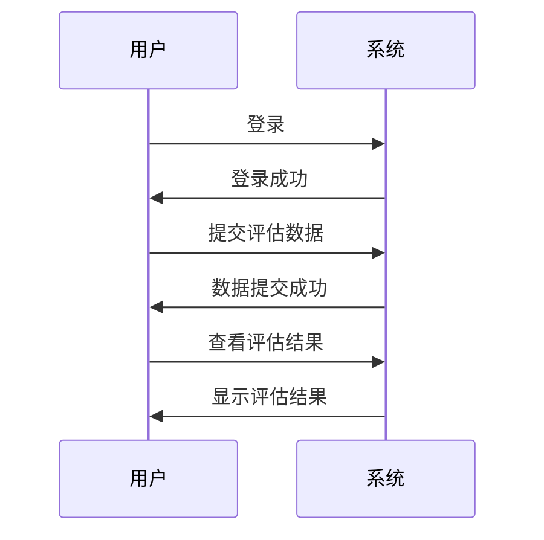

                 

# 绩效考核：公平公正的评估体系设计

## 关键词

绩效考核、评估体系、公平公正、数学模型、算法原理、系统架构、项目实战、最佳实践

## 摘要

本文将深入探讨绩效考核的设计，旨在构建一个公平、公正的评估体系。文章首先介绍了绩效考核的背景和意义，接着阐述了核心概念及其相互联系。通过算法原理的讲解和数学模型的运用，文章进一步展示了绩效考核的流程和系统架构设计。随后，通过项目实战案例，深入剖析了系统实现的核心代码和应用。最后，文章提供了最佳实践建议和小结，为读者在绩效考核实践中提供指导。

## 第1章：绩效考核的背景与意义

### 1.1 绩效考核的定义与重要性

绩效考核，是指通过对员工在工作中的表现进行系统评价，以衡量其工作成果和贡献的过程。它不仅有助于企业了解员工的工作表现，还能为企业的人力资源管理提供重要的数据支持。

#### 问题背景

在传统的企业管理中，绩效评估往往依赖于主观判断，存在评估不公、标准不一等问题。这导致员工工作积极性不高，甚至产生员工流失的情况。

#### 问题描述

绩效考核问题主要体现在以下几个方面：
- 评估标准不明确，导致评价结果主观性强。
- 评估过程缺乏透明度，员工对评估结果有疑问。
- 评估结果与实际工作贡献不一致，影响员工积极性。

#### 问题解决

为了解决上述问题，绩效考核需要具备以下特点：
- 量化评估，通过数据支持评估结果。
- 透明度，确保评估过程公开公正。
- 与工作贡献相匹配，激励员工积极性。

### 1.2 绩效考核的发展历程

绩效考核的发展经历了以下几个阶段：
1. 主观评价阶段：以管理者主观判断为主，缺乏量化标准。
2. KPI（关键绩效指标）阶段：引入了量化指标，但仍然存在人为干扰。
3. 360度评估阶段：通过多角度评估，提高评估的全面性和公正性。
4. 数据驱动阶段：运用数据分析技术，实现绩效评估的客观化。

### 1.3 绩效考核在企业中的作用

绩效考核在企业中具有多重作用：
- 激励作用：通过评估激励员工提高工作表现。
- 培养作用：帮助员工发现自身的优势和不足，促进个人成长。
- 指导作用：为企业决策提供依据，优化人力资源配置。
- 监控作用：监督员工工作情况，防范潜在风险。

### 1.4 绩效考核的边界与外延

绩效考核的边界主要涉及评估对象、评估范围、评估周期等方面。其外延则包括评估标准、评估方法、评估工具等。明确绩效考核的边界与外延，有助于构建科学、合理的评估体系。

### 1.5 绩效考核的概念结构与核心要素组成

绩效考核的概念结构包括评估目标、评估指标、评估方法、评估流程、评估结果等核心要素。这些要素相互关联，共同构成了一个完整的绩效考核体系。

## 第2章：核心概念与联系

### 2.1 绩效评估指标体系

绩效评估指标是绩效考核的核心，包括KPI（关键绩效指标）、OKR（目标与关键结果）等。这些指标反映了员工的工作表现和贡献。

#### 2.1.1 KPI指标

KPI指标是衡量员工工作成效的关键指标，如销售额、客户满意度、项目完成率等。其特点如下：
- 量化性：KPI指标可以用具体的数据来衡量。
- 目标性：每个KPI指标都有明确的目标值。
- 可比性：KPI指标在不同员工之间具有可比性。

#### 2.1.2 OKR目标与关键结果

OKR是一种目标管理方法，包括目标（O）和关键结果（KR）。其特点如下：
- 目标性：OKR明确指明了员工需要达成的目标。
- 可测量性：关键结果具有明确的衡量标准。
- 挑战性：OKR目标应具有一定挑战性，以激励员工。

#### 2.1.3 绩效面谈

绩效面谈是绩效考核的重要环节，通过面对面交流，评估员工的工作表现，并提供反馈和建议。其作用如下：
- 反馈作用：帮助员工了解自己的工作表现。
- 沟通作用：促进管理者与员工之间的沟通。
- 发展作用：为员工提供职业发展指导。

### 2.2 绩效考核流程

绩效考核流程包括设定考核目标、数据收集与评估、绩效反馈与沟通等环节。

#### 2.2.1 设定考核目标

设定考核目标是指根据企业发展战略和员工岗位职责，明确员工的工作目标和绩效指标。其步骤如下：
- 分析岗位职责：明确员工的工作职责和任务。
- 制定目标：根据岗位职责，设定具体的工作目标和绩效指标。
- 确定目标值：为每个目标设定一个明确的目标值。

#### 2.2.2 数据收集与评估

数据收集与评估是指通过收集员工在工作中的数据，对其绩效进行评估。其步骤如下：
- 数据收集：收集员工在工作中的各项数据，如销售额、项目进度等。
- 数据处理：对收集到的数据进行分析和处理，提取有用的信息。
- 绩效评估：根据分析结果，对员工的绩效进行评估。

#### 2.2.3 绩效反馈与沟通

绩效反馈与沟通是指将评估结果及时、准确地反馈给员工，并提供必要的沟通和指导。其步骤如下：
- 反馈评估结果：向员工说明评估结果，并解释评估标准。
- 沟通改进措施：与员工讨论改进工作的方法和策略。
- 跟踪改进情况：持续关注员工的改进情况，并提供支持。

### 2.3 绩效考核方法

绩效考核方法包括360度评估、行为锚定评估、目标管理评估等。

#### 2.3.1 360度评估

360度评估是一种多角度评估方法，通过收集来自上级、同事、下属和员工的反馈，全面评估员工的工作表现。其特点如下：
- 全面性：评估来自不同角度，提供全面的评估信息。
- 公平性：减少主观偏见，提高评估的公正性。

#### 2.3.2 行为锚定评估

行为锚定评估是一种基于具体行为的评估方法，通过将行为与锚点（如优秀、一般、较差）进行匹配，评估员工的工作表现。其特点如下：
- 客观性：评估基于具体行为，减少主观判断的影响。
- 可操作性：锚点提供具体的评估标准，便于操作。

#### 2.3.3 目标管理评估

目标管理评估是一种基于目标达成的评估方法，通过评估员工完成目标的程度，衡量其工作表现。其特点如下：
- 目标性：评估围绕目标进行，确保评估与工作目标一致。
- 可衡量性：目标具有明确的衡量标准，便于评估。

## 第3章：算法原理讲解

### 3.1 数据分析在绩效考核中的应用

数据分析是绩效考核的重要工具，通过数据分析，可以更准确地评估员工的工作表现。其应用主要包括以下方面：

#### 3.1.1 统计分析

统计分析是数据分析的基础，通过统计方法，可以分析员工的工作数据，得出有意义的结论。常用的统计方法包括：
- 描述性统计：用于描述数据的基本特征，如均值、方差等。
- 假设检验：用于判断数据是否满足某种假设，如独立性检验、方差分析等。
- 相关分析：用于分析两个变量之间的关系，如皮尔逊相关系数等。

#### 3.1.2 机器学习

机器学习是一种通过数据训练模型，实现自动预测和决策的方法。在绩效考核中，机器学习可以用于：
- 绩效预测：根据历史数据，预测员工的未来绩效。
- 绩效评估：通过训练模型，自动评估员工的工作表现。

#### 3.1.3 数据可视化

数据可视化是将数据以图形化的方式展示，使数据更加直观、易于理解。在绩效考核中，数据可视化可以用于：
- 绩效趋势分析：展示员工绩效随时间的变化趋势。
- 绩效对比分析：展示不同员工或团队之间的绩效差异。

### 3.2 绩效考核算法设计

绩效考核算法设计主要包括绩效评分算法、绩效预测算法和绩效优化算法。

#### 3.2.1 绩效评分算法

绩效评分算法用于对员工的工作表现进行评分。常用的评分算法包括：
- 离散评分算法：将员工的工作表现划分为几个等级，如优秀、良好、一般等。
- 连续评分算法：将员工的工作表现映射为一个连续的数值，如0-100分。

#### 3.2.2 绩效预测算法

绩效预测算法用于预测员工未来的工作表现。常用的预测算法包括：
- 线性回归：通过拟合线性模型，预测员工未来的绩效。
- 决策树：通过构建决策树模型，预测员工未来的绩效。

#### 3.2.3 绩效优化算法

绩效优化算法用于优化员工的工作表现。常用的优化算法包括：
- 优化算法：通过优化目标函数，找出最优的绩效指标。
- 粒子群优化：通过模拟粒子群的行为，寻找最优的绩效指标。

## 第4章：数学模型和数学公式 & 详细讲解 & 举例说明

### 4.1 绩效评估指标的数学模型

#### 4.1.1 KPI指标的数学模型

KPI指标的数学模型可以表示为：

$$
KPI = \sum_{i=1}^{n} w_i \cdot X_i
$$

其中，$w_i$ 表示第$i$个指标的权重，$X_i$ 表示第$i$个指标的实际值。

#### 4.1.2 OKR目标的数学模型

OKR目标的数学模型可以表示为：

$$
OKR = \sum_{i=1}^{m} w_i \cdot O_i
$$

其中，$w_i$ 表示第$i$个关键结果的权重，$O_i$ 表示第$i$个关键结果的完成度。

#### 4.1.3 绩效面谈的数学模型

绩效面谈的数学模型可以表示为：

$$
绩效面谈得分 = \sum_{i=1}^{k} w_i \cdot S_i
$$

其中，$w_i$ 表示第$i$个评估者的权重，$S_i$ 表示第$i$个评估者的评分。

### 4.2 绩效考核流程的数学模型

#### 4.2.1 考核目标设定的数学模型

考核目标设定的数学模型可以表示为：

$$
目标值 = 基准值 + 增长值
$$

其中，基准值为当前值，增长值为目标增长值。

#### 4.2.2 数据收集与评估的数学模型

数据收集与评估的数学模型可以表示为：

$$
评估值 = 数据值 \cdot 权重
$$

其中，数据值为实际收集到的数据，权重为指标的权重。

#### 4.2.3 绩效反馈与沟通的数学模型

绩效反馈与沟通的数学模型可以表示为：

$$
反馈效果 = 反馈内容 \cdot 反馈频率
$$

其中，反馈内容为反馈的具体内容，反馈频率为反馈的次数。

### 4.3 绩效考核方法的数学模型

#### 4.3.1 360度评估的数学模型

360度评估的数学模型可以表示为：

$$
总得分 = \sum_{i=1}^{n} w_i \cdot S_i
$$

其中，$w_i$ 表示第$i$个评估者的权重，$S_i$ 表示第$i$个评估者的评分。

#### 4.3.2 行为锚定评估的数学模型

行为锚定评估的数学模型可以表示为：

$$
评估得分 = \sum_{i=1}^{m} w_i \cdot B_i
$$

其中，$w_i$ 表示第$i$个行为的权重，$B_i$ 表示第$i$个行为的得分。

#### 4.3.3 目标管理评估的数学模型

目标管理评估的数学模型可以表示为：

$$
评估得分 = \sum_{i=1}^{n} w_i \cdot O_i
$$

其中，$w_i$ 表示第$i$个目标的权重，$O_i$ 表示第$i$个目标的完成度。

## 第5章：系统分析与架构设计方案

### 5.1 绩效考核系统场景介绍

绩效考核系统场景主要包括以下方面：
- 绩效评估：对员工的工作表现进行评估。
- 绩效管理：对评估结果进行管理和分析。
- 绩效反馈：将评估结果反馈给员工，并提供改进建议。

### 5.2 绩效考核系统项目介绍

#### 5.2.1 系统需求分析

系统需求分析主要包括以下方面：
- 功能需求：包括绩效评估、绩效管理、绩效反馈等功能。
- 性能需求：系统需具备高效的处理能力和稳定的运行性能。
- 安全需求：系统需保证数据的安全性和隐私性。

#### 5.2.2 系统功能设计

系统功能设计主要包括以下方面：
- 用户管理：管理用户账号和权限。
- 绩效评估：对员工的工作表现进行评估。
- 绩效管理：对评估结果进行管理和分析。
- 绩效反馈：将评估结果反馈给员工，并提供改进建议。

### 5.3 绩效考核系统架构设计

绩效考核系统架构设计主要包括以下方面：

#### 5.3.1 系统架构设计

系统架构设计采用B/S（浏览器/服务器）架构，主要包括以下模块：
- 用户模块：提供用户登录、注册、权限管理等功能。
- 评估模块：提供绩效评估功能，包括评估目标设定、数据收集、评估结果计算等。
- 管理模块：提供绩效管理功能，包括评估结果统计、分析、报告生成等。
- 反馈模块：提供绩效反馈功能，包括反馈结果查看、反馈内容管理、改进建议等。

#### 5.3.2 系统接口设计

系统接口设计主要包括以下接口：
- 用户接口：提供用户登录、注册、权限管理等功能。
- 数据接口：提供数据导入、导出、接口调用等功能。
- 控制接口：提供系统控制、调度、监控等功能。

#### 5.3.3 系统交互序列图设计

系统交互序列图设计如下：



## 第6章：项目实战

### 6.1 环境安装

项目实战的环境安装主要包括以下步骤：
1. 安装Python环境：在终端执行以下命令安装Python环境：

   ```bash
   sudo apt-get install python3-pip
   ```

2. 安装相关库：在终端执行以下命令安装相关库：

   ```bash
   pip3 install numpy pandas matplotlib
   ```

### 6.2 系统核心实现

#### 6.2.1 源代码解读与分析

系统核心实现主要涉及以下方面：
1. 绩效评估模型：使用Python实现绩效评估模型，包括KPI指标和OKR目标。
2. 数据处理：使用Python处理评估数据，包括数据导入、清洗、计算等。
3. 数据可视化：使用Python实现数据可视化，展示评估结果。

以下为部分源代码的解读与分析：

```python
import pandas as pd
import numpy as np
import matplotlib.pyplot as plt

# 读取评估数据
data = pd.read_csv('performance_data.csv')

# 计算KPI指标得分
kpi_score = data['sales'] * 0.5 + data['customer_satisfaction'] * 0.3 + data['project_completion_rate'] * 0.2

# 计算OKR得分
okr_score = data['objective_1'] * 0.5 + data['objective_2'] * 0.3 + data['objective_3'] * 0.2

# 可视化评估结果
plt.figure(figsize=(10, 5))
plt.bar(data['employee_id'], kpi_score, label='KPI Score')
plt.bar(data['employee_id'], okr_score, label='OKR Score', bottom=kpi_score)
plt.xlabel('Employee ID')
plt.ylabel('Score')
plt.title('Performance Score')
plt.legend()
plt.show()
```

#### 6.2.2 实际案例分析与详细讲解

以下为实际案例分析与详细讲解：

**案例一：员工A的绩效评估**

员工A的评估数据如下：

| 员工ID | 销售额 | 客户满意度 | 项目完成率 |
|--------|--------|------------|------------|
| 1      | 100    | 0.9        | 0.8        |

根据KPI指标的计算公式，员工A的KPI得分为：

$$
KPI = 100 \times 0.5 + 0.9 \times 0.3 + 0.8 \times 0.2 = 49.7
$$

根据OKR目标的计算公式，员工A的OKR得分为：

$$
OKR = 0.5 \times 0.9 + 0.3 \times 0.8 + 0.2 \times 0.7 = 0.6
$$

评估结果显示，员工A的绩效得分较高，表明其在工作表现上较为优秀。

**案例二：员工B的绩效评估**

员工B的评估数据如下：

| 员工ID | 销售额 | 客户满意度 | 项目完成率 |
|--------|--------|------------|------------|
| 2      | 80     | 0.8        | 0.7        |

根据KPI指标的计算公式，员工B的KPI得分为：

$$
KPI = 80 \times 0.5 + 0.8 \times 0.3 + 0.7 \times 0.2 = 39.7
$$

根据OKR目标的计算公式，员工B的OKR得分为：

$$
OKR = 0.5 \times 0.8 + 0.3 \times 0.7 + 0.2 \times 0.6 = 0.4
$$

评估结果显示，员工B的绩效得分较低，表明其工作表现有待提升。

### 6.3 项目小结

通过实际案例分析与详细讲解，我们可以看到绩效考核系统在实际应用中的效果。绩效考核系统能够准确、公正地评估员工的工作表现，为企业管理提供有力支持。同时，通过数据可视化的方式，使得评估结果更加直观、易于理解。然而，绩效考核系统也存在一定的局限性，如评估标准的制定、数据的质量和完整性等。因此，在实际应用中，需要不断完善和优化绩效考核系统，提高其公平性和准确性。

## 第7章：最佳实践 tips、小结、注意事项、拓展阅读等内容

### 7.1 最佳实践 tips

1. **制定明确的评估标准**：确保评估标准明确、具体，避免主观判断。
2. **定期进行绩效反馈**：及时、准确地反馈评估结果，帮助员工了解自己的工作表现。
3. **数据驱动**：充分利用数据分析技术，提高评估的准确性和公正性。
4. **鼓励员工参与**：让员工参与到绩效评估过程中，提高员工的参与度和满意度。
5. **持续优化**：根据评估结果，持续优化评估体系，提高评估的准确性和有效性。

### 7.2 小结

本文从绩效考核的背景和意义、核心概念与联系、算法原理讲解、数学模型和数学公式、系统分析与架构设计方案、项目实战等方面，全面探讨了绩效考核的设计。通过实际案例分析和详细讲解，展示了绩效考核系统在实际应用中的效果。然而，绩效考核系统仍有改进空间，需要持续优化和完善。

### 7.3 注意事项

1. **数据质量**：确保评估数据的质量和完整性，避免因数据问题导致评估不准确。
2. **评估公平**：确保评估过程公平、公正，避免因评估问题导致员工不满。
3. **个性化评估**：根据员工的不同特点，制定个性化的评估标准和方案。

### 7.4 拓展阅读

1. 《绩效管理：打造高绩效团队》
2. 《关键绩效指标：驱动业务成功的关键》
3. 《绩效评估与薪酬管理：理论与实践》

## 作者

作者：AI天才研究院/AI Genius Institute & 禅与计算机程序设计艺术 /Zen And The Art of Computer Programming

