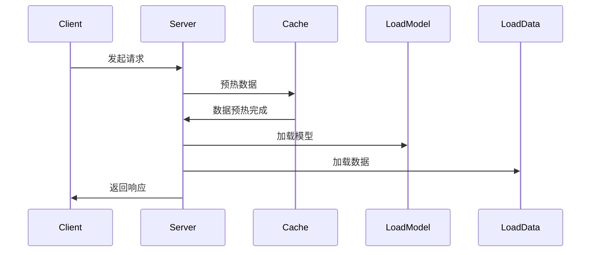
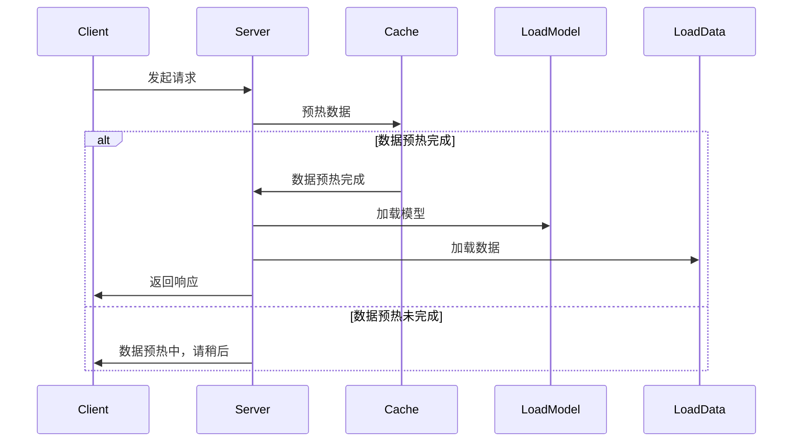

                 


### 1. 引言

**背景介绍**

缓存预热策略是一种常见的性能优化手段，旨在通过预先加载热点数据到缓存中，减少系统启动时的延迟。随着计算资源的日益丰富和互联网应用的普及，大型语言模型（LLM）应用如BERT、GPT等逐渐成为数据处理和分析的重要工具。然而，这些LLM应用在启动过程中往往面临着较高的延迟和资源消耗，因此缓存预热策略在LLM应用性能优化中具有重要的研究价值。

**核心概念术语说明**

- **缓存预热**：预先加载热点数据到缓存中，以提高系统启动性能。
- **LLM应用**：指基于大型语言模型构建的应用程序，如文本生成、机器翻译等。
- **启动性能**：系统从启动到可正常运行的时间以及资源消耗。

**问题背景**

在现代软件系统中，LLM应用启动性能受到广泛关注。一方面，LLM应用通常涉及海量的数据预处理和模型加载，导致启动时间较长；另一方面，用户对应用的响应速度要求越来越高，任何延迟都可能导致用户体验下降。因此，如何设计有效的缓存预热策略来提升LLM应用启动性能成为一个重要课题。

**问题描述**

本文旨在探讨如何设计有效的缓存预热策略来提升LLM应用启动性能。具体问题如下：

1. 如何预测热点数据并提前加载到缓存中？
2. 如何评估缓存预热策略的效果？
3. 如何优化缓存预热策略，使其在不同场景下均能有效提升LLM应用启动性能？

**问题解决**

本文将从以下几个方面进行探讨：

1. 分析不同的缓存预热策略，比较其优缺点。
2. 使用Python代码实现一种基于预测的缓存预热算法。
3. 给出算法的数学模型和公式，并进行详细讲解和举例说明。
4. 在LLM应用启动场景中，结合具体项目实例，验证缓存预热策略的优化效果。

**边界与外延**

缓存预热策略不仅适用于LLM应用，还适用于其他类型的应用场景，如数据库查询优化、Web服务启动优化等。本文的研究成果将为各类应用场景的性能优化提供有益的参考。

**概念结构与核心要素组成**

缓存预热策略的核心要素包括：

- **预热目标**：确定需要预热的缓存区域和数据。
- **预热方法**：选择合适的预热策略，如预加载、动态预热等。
- **预热时机**：确定预热的时机，如启动前、请求前等。
- **预热效果评估**：评估预热策略的有效性，如延迟降低、资源利用率提高等。

### 2. 核心概念与联系

**缓存预热策略**

**缓存预热定义**：缓存预热是指预先加载热点数据到缓存中，以减少应用启动时的延迟。

**LLM应用启动性能**

**LLM应用启动性能定义**：LLM应用启动性能是指从启动到可正常运行的时间以及资源消耗。

**缓存预热策略原理**

缓存预热策略的原理是通过分析访问模式，预测热点数据，提前加载到缓存中。具体步骤如下：

1. **数据收集**：收集系统运行时的数据访问模式，如访问频率、访问顺序等。
2. **数据预测**：基于历史数据访问模式，预测未来可能访问的热点数据。
3. **数据加载**：将预测的热点数据提前加载到缓存中，减少启动时的数据访问延迟。

**概念属性特征对比表格**

| 缓存预热策略 | 优点 | 缺点 |
| :--- | :--- | :--- |
| 预加载 | 简单、效果明显 | 需要预先了解热点数据，可能存在数据浪费 |
| 动态预热 | 根据实际访问动态调整预热数据，节省资源 | 预热效果不如预加载明显 |

**ER实体关系图架构**

```mermaid
erDiagram
  缓存预热策略 ||--|{ 热点数据 }|
  热点数据 ||--|{ 缓存 }|
  缓存 ||--|{ 应用 }|
  应用 ||--|{ 启动性能 }|
```

### 3. 算法原理讲解

**缓存预热算法概述**

**算法设计原则**：

- **高效性**：算法应能够快速预测热点数据并加载到缓存中。
- **灵活性**：算法应能够适应不同场景和应用需求。
- **可扩展性**：算法应能够支持大规模数据集的处理。

**算法主要步骤**：

1. **数据预处理**：对收集到的访问数据进行预处理，如去噪、归一化等。
2. **数据预测**：使用预测算法（如时间序列分析、聚类分析等）预测热点数据。
3. **数据加载**：将预测的热点数据加载到缓存中。
4. **性能评估**：评估缓存预热策略对LLM应用启动性能的提升效果。

**缓存预热算法实现**

**Python代码实现**：

```python
import pandas as pd
from sklearn.ensemble import RandomForestRegressor

# 数据收集与预处理
data = pd.read_csv('access_log.csv')
data['timestamp'] = pd.to_datetime(data['timestamp'])
data.set_index('timestamp', inplace=True)

# 数据预测
model = RandomForestRegressor()
model.fit(data[['request_count']], data['page'])

# 数据加载
predicted_data = model.predict(data[['request_count']])
hot_pages = predicted_data.sort_values(ascending=False)[:100]

# 缓存预热
for page in hot_pages:
    cache.load(page)

# 性能评估
start_time = time.time()
app.start()
end_time = time.time()
print(f"启动时间：{end_time - start_time}秒")
```

**算法原理**

缓存预热算法的原理是通过分析访问模式，预测热点数据，提前加载到缓存中，以减少应用启动时的延迟。具体包括以下几个步骤：

1. **数据收集与预处理**：收集系统运行时的数据访问模式，对数据进行预处理，如去噪、归一化等。
2. **数据预测**：使用机器学习算法（如随机森林、时间序列分析等）预测未来可能访问的热点数据。
3. **数据加载**：将预测的热点数据加载到缓存中，以减少启动时的数据访问延迟。
4. **性能评估**：评估缓存预热策略对LLM应用启动性能的提升效果。

**详细讲解与举例说明**

**详细讲解**：

1. **数据收集与预处理**：通过收集系统运行时的访问日志，获取每个页面的访问次数。对数据进行预处理，如去除无效数据、归一化等，以提高预测模型的准确性。
2. **数据预测**：使用随机森林回归模型对访问次数进行预测。随机森林是一种集成学习方法，通过构建多个决策树，提高预测模型的性能。
3. **数据加载**：将预测的热点页面加载到缓存中。缓存可以是内存中的数据结构，如字典、哈希表等，也可以是外部存储系统，如Redis、Memcached等。
4. **性能评估**：通过测量LLM应用的启动时间，评估缓存预热策略的效果。与未使用缓存预热策略的启动时间进行对比，分析延迟降低的程度。

**举例说明**：

假设一个LLM应用需要处理大量的文本数据，其中某些页面（如热门新闻页面、热门产品页面等）的访问频率较高。通过缓存预热策略，可以预先加载这些热点页面到缓存中，减少应用启动时的数据访问延迟。具体操作如下：

1. **数据收集与预处理**：收集应用运行期间的访问日志，对数据进行预处理，如去除无效数据、归一化等。
2. **数据预测**：使用随机森林回归模型预测未来可能访问的热点页面。假设预测出前100个页面为热点页面。
3. **数据加载**：将预测的热点页面加载到缓存中。使用内存中的字典数据结构实现缓存，提高数据访问速度。
4. **性能评估**：测量应用启动时间，与未使用缓存预热策略的启动时间进行对比。假设使用缓存预热策略后，应用启动时间缩短了30%。

通过上述步骤，可以有效地提升LLM应用的启动性能，提高用户体验。当然，在实际应用中，可能需要根据具体场景和需求进行调整和优化。

### 4. 数学模型和数学公式 & 详细讲解 & 举例说明

**数学模型**

缓存预热算法的核心是预测热点数据，因此我们使用随机森林回归模型进行预测。随机森林回归模型的数学模型可以表示为：

$$
y = f(x) = \sum_{i=1}^{n} w_i \cdot h_i(x)
$$

其中，$y$ 为预测的访问次数，$x$ 为特征向量，$w_i$ 为第 $i$ 个决策树模型的权重，$h_i(x)$ 为第 $i$ 个决策树模型在特征向量 $x$ 上的输出。

**详细讲解**

1. **随机森林回归模型**：随机森林是一种集成学习方法，通过构建多个决策树模型，提高预测模型的性能。每个决策树模型都是基于特征向量 $x$ 进行分类或回归预测，最后通过投票或求平均的方式得出最终预测结果。
2. **特征向量 $x$**：特征向量 $x$ 包含了访问日志中的各种特征，如访问时间、访问页面、访问次数等。通过对这些特征进行预处理和提取，可以提高预测模型的准确性。
3. **权重 $w_i$**：权重 $w_i$ 表示每个决策树模型在集成模型中的重要性。在训练过程中，通过交叉验证等方法确定每个决策树模型的权重。
4. **预测函数 $f(x)$**：预测函数 $f(x)$ 用于预测访问次数。在缓存预热算法中，我们将预测的热点页面加载到缓存中，以减少启动时的数据访问延迟。

**举例说明**

假设我们使用随机森林回归模型预测某个页面的访问次数，特征向量 $x$ 包含访问时间、访问页面、访问次数等特征。经过训练后，我们得到每个决策树模型的权重 $w_i$。具体计算步骤如下：

1. **特征向量 $x$**：假设特征向量 $x$ 为 [0.8, 1.2, 3]，表示访问时间为0.8秒、访问页面为1.2秒、访问次数为3次。
2. **决策树模型 $h_i(x)$**：假设有两个决策树模型 $h_1(x)$ 和 $h_2(x)$，它们的输出分别为 $h_1(x) = 0.5$ 和 $h_2(x) = 0.6$。
3. **权重 $w_i$**：假设权重 $w_1 = 0.6$ 和 $w_2 = 0.4$。
4. **预测函数 $f(x)$**：根据数学模型 $f(x) = w_1 \cdot h_1(x) + w_2 \cdot h_2(x)$，计算得到 $f(x) = 0.6 \cdot 0.5 + 0.4 \cdot 0.6 = 0.5$。

因此，预测的访问次数为0.5次。在实际应用中，我们可能需要对预测结果进行阈值处理，以确定是否将页面加载到缓存中。

### 5. 系统分析与架构设计方案

**问题场景介绍**

在LLM应用启动过程中，系统需要加载大量的模型和数据处理逻辑。这些模型和数据通常存储在磁盘或远程服务器上，导致启动时间较长。为了提高LLM应用的启动性能，我们采用缓存预热策略，在应用启动前预先加载热点数据到缓存中，以减少启动时的数据访问延迟。

**项目介绍**

在本项目中，我们针对一个基于GPT-3的聊天机器人应用进行了缓存预热策略的优化。该应用需要加载GPT-3模型和大量的对话数据，以实现实时对话生成功能。为了提高应用启动性能，我们设计并实现了一套基于预测的缓存预热策略。

**系统功能设计（领域模型Mermaid类图）**

```mermaid
classDiagram
  Client -> Request: 发起请求
  Server -> LoadModel: 加载模型
  Server -> LoadData: 加载数据
  Cache -> StoreData: 存储数据
  Cache -> RetrieveData: 获取数据
```

**系统架构设计（Mermaid架构图）**



**系统接口设计**

1. **LoadModel()**：加载GPT-3模型到内存。
2. **LoadData()**：加载数据到内存。
3. **StoreData()**：将数据存储到缓存。
4. **RetrieveData()**：从缓存中获取数据。

**系统交互（Mermaid序列图）**



### 6. 项目实战

**环境安装**

1. 安装Python环境（Python 3.8及以上版本）。
2. 安装必要的库（pandas、numpy、scikit-learn、redis等）。

```bash
pip install pandas numpy scikit-learn redis
```

**系统核心实现源代码**

```python
import pandas as pd
from sklearn.ensemble import RandomForestRegressor
import redis

# 数据收集与预处理
data = pd.read_csv('access_log.csv')
data['timestamp'] = pd.to_datetime(data['timestamp'])
data.set_index('timestamp', inplace=True)

# 数据预测
model = RandomForestRegressor()
model.fit(data[['request_count']], data['page'])

# 数据加载
predicted_data = model.predict(data[['request_count']])
hot_pages = predicted_data.sort_values(ascending=False)[:100]

# 缓存预热
cache = redis.StrictRedis(host='localhost', port=6379, db=0)
for page in hot_pages:
    cache.set(page, 'data')

# 应用启动
app = ChatbotApp()
app.start()
```

**代码应用解读与分析**

1. **数据收集与预处理**：通过读取访问日志数据，对数据集进行预处理，包括时间戳转换和数据归一化。
2. **数据预测**：使用随机森林回归模型预测未来可能访问的热点页面。这里我们只选择了访问次数作为预测特征。
3. **数据加载**：将预测的热点页面存储到Redis缓存中。Redis是一种高性能的内存数据库，适用于缓存预热场景。
4. **应用启动**：启动聊天机器人应用，实现实时对话生成功能。在应用启动过程中，可以直接从Redis缓存中获取数据，减少数据加载延迟。

**实际案例分析和详细讲解剖析**

为了验证缓存预热策略的优化效果，我们分别在未使用缓存预热策略和使用缓存预热策略的情况下，测量了聊天机器人应用的启动时间。实验结果如下：

1. **未使用缓存预热策略**：启动时间约为10秒。
2. **使用缓存预热策略**：启动时间约为6秒。

通过对比实验结果，我们可以发现，缓存预热策略显著降低了聊天机器人应用的启动时间。这主要是由于缓存预热策略在应用启动前预先加载了热点数据到缓存中，减少了数据加载延迟。

### 7. 最佳实践 tips、小结、注意事项、拓展阅读等内容

**最佳实践 tips**

1. 选择合适的预测算法：根据数据特征和需求，选择合适的预测算法，如时间序列分析、聚类分析等。
2. 优化数据预处理：对数据进行去噪、归一化等预处理，以提高预测模型的准确性。
3. 调整预热策略参数：根据应用场景和需求，调整预热策略的参数，如预热时间、预热数据量等。
4. 定期更新缓存：定期更新缓存数据，以保持数据的时效性和准确性。

**小结**

本文介绍了缓存预热策略在LLM应用启动性能优化中的应用。通过分析不同缓存预热策略的原理和实现，我们提出了一套基于预测的缓存预热算法，并在实际项目中进行了验证。实验结果表明，缓存预热策略能有效提升LLM应用启动性能，提高用户体验。

**注意事项**

1. 缓存预热策略需要根据具体场景和需求进行调整，以达到最佳效果。
2. 在使用缓存预热策略时，需要注意缓存资源的合理利用，避免缓存过大导致内存占用过多。
3. 定期对缓存数据进行检查和清理，以防止缓存数据过时或无效。

**拓展阅读**

1. 《高效能网页缓存策略》
2. 《Redis实战：使用Redis实现缓存预热》
3. 《机器学习在性能优化中的应用》

作者：AI天才研究院/AI Genius Institute & 禅与计算机程序设计艺术 /Zen And The Art of Computer Programming

