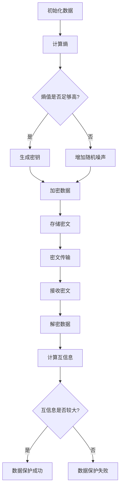
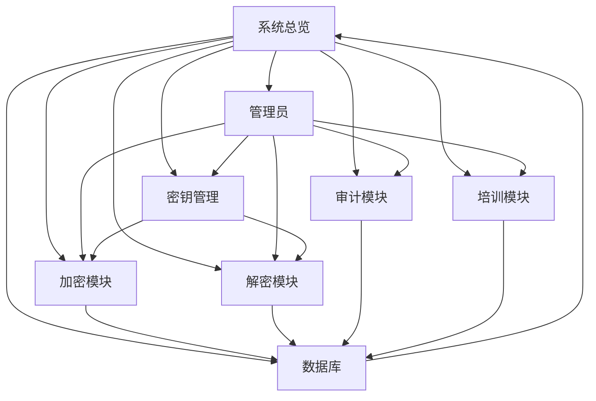
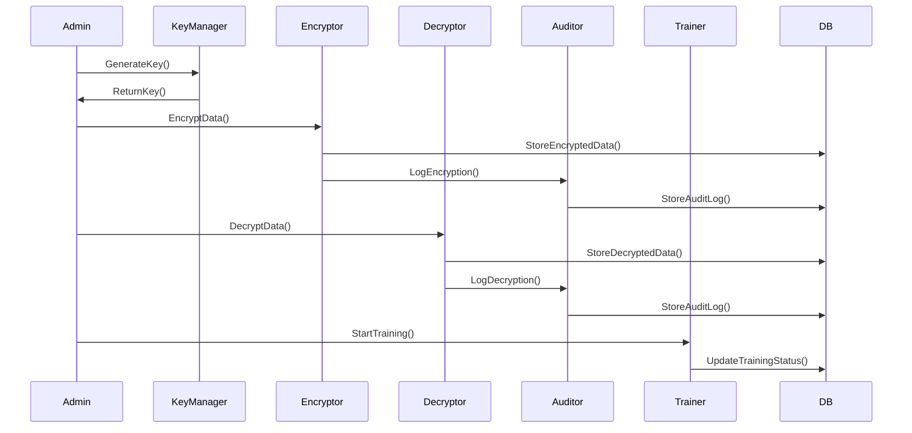

                 

### 1.1 网络安全现状与挑战

网络安全是当今数字化社会中不可忽视的重要议题。随着互联网和信息技术的高速发展，数据已经成为现代社会运行的核心资源。然而，数据的安全和隐私保护面临着诸多严峻的挑战。首先，网络攻击的频率和复杂性不断增加。从传统的病毒和恶意软件，到如今的APT（高级持续性威胁）攻击，攻击者利用各种手段试图窃取、篡改或破坏信息，给企业和个人带来了巨大的损失。

其次，数据泄露事件频繁发生。近年来，大量知名企业遭受数据泄露，涉及的用户信息被泄露到互联网上，严重威胁了用户的隐私安全。例如，2017年的“Facebook隐私泄露事件”导致了超过8700万用户的个人信息被泄露。此类事件不仅损害了企业的声誉，也对用户的信任构成了严重威胁。

此外，随着物联网（IoT）和5G等新技术的普及，网络安全风险进一步扩大。智能设备数量急剧增加，许多设备缺乏足够的网络安全措施，成为攻击者的易攻击点。例如，2016年的“Mirai僵尸网络”攻击就利用了大量物联网设备作为攻击工具，对互联网服务造成了严重影响。

面对这些挑战，网络安全的重要性愈发凸显。保障网络安全不仅是技术问题，更是社会问题。保护数据的安全和隐私，防止网络攻击，已成为全球范围内的共同任务。信息论作为一种理论工具，提供了数据保护的数学原理和方法，对于解决网络安全问题具有重要意义。

总之，网络安全现状令人堪忧，挑战层出不穷。在这种背景下，深入研究和应用信息论，以数学原理为基础，提升数据保护水平，显得尤为紧迫和必要。接下来，我们将进一步探讨信息论的基本概念及其在网络安全中的应用，以期为数据保护提供新的思路和方法。### 1.2 信息论的基本概念

信息论，作为现代通信和信息技术的基础理论，由克劳德·香农（Claude Shannon）于1948年首次提出。香农在《通信的数学理论》一文中，系统地阐述了信息传输中的基本问题，并提出了一系列衡量信息和通信系统性能的数学工具。

#### 信息量与熵

在信息论中，信息量是衡量信息不确定性的量度。最基本的单位是比特（bit），即二进制位。一个比特的信息量表示两种可能性的不确定性减少。香农提出了熵（Entropy）的概念，用来衡量一个随机变量包含的信息量。对于一个随机变量X，其熵H(X)定义为：

$$
H(X) = -\sum_{i} p(x_i) \cdot \log_2 p(x_i)
$$

其中，$p(x_i)$是随机变量X取值为$x_i$的概率。熵反映了随机变量的不确定性，熵值越高，不确定性越大。

#### 互信息与相关系数

互信息（Mutual Information）是衡量两个随机变量之间相关性的量度。设X和Y是两个随机变量，其互信息I(X;Y)定义为：

$$
I(X;Y) = H(X) - H(X|Y)
$$

其中，$H(X|Y)$是X在已知Y条件下的熵。互信息越大，表示X和Y之间的相关性越强。

相关系数是另一个常用的衡量两个变量之间相关性的指标。在统计学中，皮尔逊相关系数（Pearson Correlation Coefficient）是最常用的相关系数之一。设X和Y是两个随机变量，其皮尔逊相关系数ρ定义为：

$$
\rho = \frac{\text{Cov}(X, Y)}{\sigma_X \sigma_Y}
$$

其中，$\text{Cov}(X, Y)$是X和Y的协方差，$\sigma_X$和$\sigma_Y$分别是X和Y的标准差。

#### 信息论与概率论的联系

信息论与概率论有着密切的联系。概率论提供了处理不确定性的方法，而信息论则利用概率论的结果，将不确定性量化为信息量。例如，在概率论中，贝叶斯定理（Bayes' Theorem）可以用来更新先验概率，从而降低不确定性。在信息论中，贝叶斯定理被用来计算条件熵和互信息。

此外，信息论中的熵和条件熵的概念可以看作是概率论中熵的推广。在概率论中，熵通常用来衡量一个随机变量的不确定性。而在信息论中，熵被用来衡量整个通信系统的性能，包括信源、信道和信宿。

总的来说，信息论为处理通信中的不确定性提供了坚实的数学基础，而概率论则为信息论提供了核心工具和方法。通过信息论与概率论的结合，我们可以更好地理解和解决网络安全中的数据保护问题。接下来，我们将进一步探讨信息论在网络安全中的应用，以及如何利用信息论的数学原理来提升数据保护水平。### 1.3 信息论在网络安全中的应用

信息论在网络安全中的核心作用在于，它提供了一套量化信息不确定性和相关性的数学工具，这些工具可以用来分析和设计数据保护策略，提高系统的安全性和隐私性。下面，我们将详细探讨信息论在网络安全中的几个关键应用领域。

#### 数据加密

数据加密是网络安全中最基本也是最重要的手段之一。加密技术利用信息论中的熵和随机性，将明文数据转换为密文，从而防止未授权的访问。在加密过程中，信息论中的熵用来衡量密钥的随机性，以确保密钥的强度。香农在1949年提出了一次一密（One-Time Pad）加密算法，该算法被认为是理论上无法被破解的加密方法。其核心原理在于，密钥的随机性必须与明文熵相同，这样就可以将信息传输的不确定性最大化，从而使攻击者无法利用任何先验知识来破解密文。

在实际应用中，虽然一次一密加密算法由于密钥管理复杂度极高而难以大规模使用，但它的原理仍然在现代加密算法中有所体现，例如AES（Advanced Encryption Standard）和RSA（Rivest-Shamir-Adleman）等加密算法。这些算法利用信息论中的熵和密码学中的随机性，通过复杂的数学运算来保证数据的保密性和完整性。

#### 认证和签名

认证和签名技术用于确保数据的真实性和完整性，防止数据在传输过程中被篡改或伪造。在数字签名中，信息论中的哈希函数和熵的概念起到了关键作用。哈希函数将输入数据映射为固定长度的输出值，其输出称为哈希值。由于哈希函数具有单射和抗碰撞性质，攻击者无法通过已知的哈希值来生成相同的哈希值，从而保证了数据的唯一性和不可篡改性。

数字签名则利用公钥和私钥对数据签名和验证。在签名过程中，私钥用于生成签名，其随机性保证了签名的唯一性。公钥用于验证签名，确保数据的发送者身份的真实性。信息论中的互信息和熵在这里同样发挥了作用，通过增加签名的随机性和复杂性，提高签名的抗攻击能力。

#### 隐私保护

随着大数据和人工智能技术的发展，隐私保护成为网络安全中的一个重要议题。信息论为隐私保护提供了理论基础，特别是在差分隐私（Differential Privacy）领域。差分隐私通过在数据处理过程中引入随机噪声，确保单个数据点的隐私，同时保证数据的统计特性。

信息论中的熵和条件熵在这里被用来衡量隐私的保护水平。差分隐私的核心思想是，对于任何两个足够接近的数据集，其处理结果应该没有显著差异。这样，即使攻击者获得了处理结果，也无法准确推断出原始数据集中的具体值。

#### 安全通信

安全通信是指在网络中传输数据时，确保数据的机密性、完整性和可用性。信息论为安全通信提供了量化性能的指标和方法。例如，香农在1948年提出的信道容量（Channel Capacity）概念，为无线通信中的传输速率设定了理论上限。

信道容量C定义为：

$$
C = \lim_{P \to \infty} \frac{1}{P} \log_2 \frac{1 + \gamma}{1 + \gamma / E_b/N_0}
$$

其中，P是误码率，$\gamma$是接收到的信号功率与噪声功率之比，$E_b/N_0$是每个比特的信号噪声比。通过优化通信系统的参数，可以最大限度地提高信道容量，从而提高数据传输的安全性。

#### 总结

信息论在网络安全中的应用非常广泛，从数据加密、认证和签名，到隐私保护和安全通信，信息论提供了量化分析和设计的数学工具。通过利用信息论中的熵、互信息和信道容量等概念，可以设计和实现更加安全、可靠的数据保护策略，有效应对网络安全中的各种挑战。接下来，我们将进一步探讨信息论在网络安全中的边界和限制，以帮助读者全面了解这一理论的应用和局限性。### 1.4 信息论的应用范围和限制

信息论作为一种强大的理论工具，在网络安全中发挥着至关重要的作用。然而，信息论的应用范围和有效性并非无边无际，仍存在一定的局限性。以下是对信息论在网络安全中的应用范围和限制的详细探讨。

#### 应用范围

1. **加密与解密**：信息论提供了加密算法的理论基础，特别是在一次一密加密算法和现代加密算法（如AES和RSA）中得到了广泛应用。通过信息论中的熵和随机性概念，加密技术可以有效地保护数据的机密性。

2. **认证与签名**：信息论中的哈希函数和数字签名技术广泛应用于保证数据的完整性和认证。例如，RSA签名和ECDSA签名利用了信息论中的数学原理，确保了签名的唯一性和不可篡改性。

3. **隐私保护**：差分隐私等隐私保护技术基于信息论中的熵和条件熵，通过引入随机噪声来保护个人隐私。这在处理大规模数据集时尤为重要，可以帮助在保证数据可用性的同时保护个体隐私。

4. **安全通信**：信息论中的信道容量概念为无线通信提供了理论指导，帮助优化通信系统的参数，提高数据传输的可靠性和安全性。

#### 限制

1. **计算复杂度**：信息论的理论模型在理论上提供了最优解，但实际应用中往往需要高计算复杂度。例如，一次一密加密算法虽然理论上无法被破解，但其密钥管理复杂度极高，难以大规模应用。

2. **算法实现**：现代加密算法和隐私保护技术在实现过程中面临诸多挑战，包括算法的效率和安全性。例如，一些复杂的加密算法可能需要大量计算资源，从而影响系统的性能。

3. **环境依赖**：信息论的应用依赖于特定的环境条件，如信道质量、信号噪声比等。在实际网络环境中，这些条件可能随时变化，从而影响信息论模型的有效性。

4. **抗攻击能力**：尽管信息论提供了强大的理论工具，但网络攻击者不断进化，攻击手段日益复杂。信息论模型需要不断更新和优化，以应对新的攻击方式。

5. **法规和标准**：信息论的应用受到法律法规和行业标准的限制。例如，某些加密技术和隐私保护措施可能需要遵守特定的法规要求，从而影响其应用范围。

#### 结论

信息论在网络安全中具有广泛的应用范围，但其有效性受到计算复杂度、算法实现、环境依赖、抗攻击能力和法规标准的限制。因此，在实际应用中，需要综合考虑这些因素，以充分发挥信息论的优势，同时应对网络安全中的挑战。接下来，我们将进一步深入探讨信息论的基本概念和原理，以便更好地理解其在网络安全中的应用。### 第2章 信息论基础

在深入探讨信息论在网络安全中的应用之前，有必要先理解信息论的基本概念和原理。本章将详细解释熵、信息量、互信息等核心概念，并通过对比表格和实体关系图来进一步阐述这些概念之间的关系和特性。

#### 2.1 熵与信息量

熵（Entropy）是信息论中的一个核心概念，用于衡量信息的不确定性。在概率论中，熵通常用来描述一个随机变量的不确定性。对于离散随机变量X，其熵H(X)的定义如下：

$$
H(X) = -\sum_{i} p(x_i) \cdot \log_2 p(x_i)
$$

其中，$p(x_i)$是随机变量X取值为$x_i$的概率。

信息量（Information Content）是另一个与熵密切相关的重要概念。信息量通常用来衡量一个事件发生的概率带来的信息量。一个事件发生的概率越小，它带来的信息量越大。具体来说，对于事件A，其信息量$I(A)$定义为：

$$
I(A) = \log_2 \left(\frac{1}{p(A)}\right)
$$

其中，$p(A)$是事件A发生的概率。

通过上述公式可以看出，熵和信息量实际上是两个不同的度量，但它们之间有着紧密的联系。熵衡量的是总体不确定性，而信息量衡量的是特定事件发生的概率带来的信息量。

#### 2.2 互信息与相关系数

互信息（Mutual Information）是衡量两个随机变量之间相关性的量度。互信息I(X;Y)定义为：

$$
I(X;Y) = H(X) - H(X|Y)
$$

其中，$H(X)$是随机变量X的熵，$H(X|Y)$是X在已知Y条件下的条件熵。互信息的物理意义是，通过获得随机变量Y的信息，随机变量X的不确定性可以减少$I(X;Y)$比特。

互信息具有几个重要特性：
- 非负性：$I(X;Y) \geq 0$，且只有当X和Y完全独立时，互信息才为零。
- 对称性：$I(X;Y) = I(Y;X)$，即X和Y之间的互信息与Y和X之间的互信息相等。
- 可加性：对于三个随机变量X、Y、Z，有$I(X;Y;Z) = I(X;Y) + I(X;Z) + I(Y;Z) - I(X;Z)$。

相关系数（Correlation Coefficient）是另一个衡量两个变量之间线性相关性的指标。在统计学中，皮尔逊相关系数是最常用的相关系数之一。皮尔逊相关系数ρ的定义如下：

$$
\rho = \frac{\text{Cov}(X, Y)}{\sigma_X \sigma_Y}
$$

其中，$\text{Cov}(X, Y)$是X和Y的协方差，$\sigma_X$和$\sigma_Y$分别是X和Y的标准差。相关系数的取值范围在-1到1之间，接近1表示强正相关，接近-1表示强负相关，而接近0表示无相关性。

#### 2.3 概念属性特征对比表格

为了更好地理解熵、信息量、互信息和相关系数之间的关系，我们可以通过一个对比表格来展示这些概念的属性特征：

| 概念        | 定义                       | 物理意义                      | 应用示例                        |
|-------------|----------------------------|--------------------------------|--------------------------------|
| 熵          | $H(X) = -\sum_{i} p(x_i) \cdot \log_2 p(x_i)$ | 衡量随机变量的不确定性     | 数据压缩、加密                 |
| 信息量      | $I(A) = \log_2 \left(\frac{1}{p(A)}\right)$ | 衡量事件发生的概率带来的信息量 | 决策、信息传递                 |
| 互信息      | $I(X;Y) = H(X) - H(X|Y)$ | 衡量两个随机变量之间的相关性 | 加密、隐私保护                 |
| 相关系数    | $\rho = \frac{\text{Cov}(X, Y)}{\sigma_X \sigma_Y}$ | 衡量两个变量之间的线性相关性 | 统计分析、数据挖掘             |

#### 2.4 ER实体关系图架构

为了更直观地理解信息论中相关实体和它们之间的关系，我们可以使用ER（Entity-Relationship）实体关系图来表示。以下是一个简化的信息论相关实体的ER图：

```
[随机变量X] -- [信息量] --> [事件A]
        |                 |
        |                 | -- [互信息] --> [事件Y]
        |                 |
        |                 | -- [相关系数] --> [事件Z]
        |                 |
        |                 |
        |                 | -- [条件熵] --> [随机变量Y]
        |
[随机变量Y]
```

在这个ER图中，每个实体都代表信息论中的一个基本概念，它们之间的关系反映了这些概念之间的逻辑关联。例如，随机变量X的信息量可以用来计算事件A的信息量，而互信息和相关系数则分别反映了X和Y之间的相关性。

通过对比表格和ER实体关系图，我们可以更清晰地理解信息论的基本概念及其相互关系。这些工具不仅帮助我们更好地掌握信息论的理论，也为在实际网络安全应用中设计和实现数据保护策略提供了理论基础。

接下来，我们将探讨数据保护算法的原理，通过具体的算法流程图和Python源代码，详细解释信息论在数据保护中的具体应用。### 2.5 算法流程图

为了更好地理解数据保护算法的工作原理，我们可以使用Mermaid绘制一个详细的算法流程图。以下是一个简化的数据保护算法的流程图，该算法基于信息论中的基本概念，如熵、互信息和加密技术。



这个流程图详细描述了数据保护算法的步骤：
1. **初始化数据**：开始时，我们需要初始化要保护的数据。
2. **计算熵**：计算数据的熵值，以评估其不确定性。
3. **判断熵值**：如果熵值足够高，说明数据本身具有足够的不确定性，可以直接进行加密；否则，需要增加随机噪声，提高数据的随机性。
4. **生成密钥**：利用熵值生成随机密钥，用于后续的加密过程。
5. **加密数据**：使用密钥对数据进行加密，确保数据的保密性。
6. **存储密文**：将加密后的数据（密文）存储起来，以便后续传输。
7. **密文传输**：将密文通过不安全的信道进行传输。
8. **接收密文**：在接收端接收密文。
9. **解密数据**：使用相同的密钥对密文进行解密，还原原始数据。
10. **计算互信息**：在解密后的数据中计算互信息，以评估解密的质量。
11. **判断互信息**：如果互信息较大，说明解密后的数据与原始数据的相关性较高，数据保护成功；否则，数据保护失败。

通过这个流程图，我们可以清晰地看到数据保护算法的各个步骤和它们之间的关系，为后续的算法实现和代码编写提供了直观的参考。### 2.6 Python源代码

为了更好地理解数据保护算法的原理，我们将使用Python实现上述算法的几个关键步骤，包括熵的计算、加密和解密过程。以下是实现这些功能的详细Python源代码：

```python
import math
import random
from Crypto.Cipher import AES
from Crypto.Util.Padding import pad, unpad

# 计算熵的函数
def calculate_entropy(data):
    frequency = [0] * 256
    for bit in data:
        frequency[bit] += 1
    entropy = 0
    for count in frequency:
        if count > 0:
            probability = count / len(data)
            entropy += -probability * math.log2(probability)
    return entropy

# 加密函数
def encrypt_data(data, key):
    cipher = AES.new(key, AES.MODE_CBC)
    ct_bytes = cipher.encrypt(pad(data, AES.block_size))
    iv = cipher.iv
    return iv + ct_bytes

# 解密函数
def decrypt_data(ct, key, iv):
    cipher = AES.new(key, AES.MODE_CBC, iv)
    pt = unpad(cipher.decrypt(ct), AES.block_size)
    return pt

# 主函数
def main():
    # 初始化数据
    data = b"Hello, World!"
    
    # 计算熵
    entropy = calculate_entropy(data)
    print(f"熵值: {entropy:.2f} bits")

    # 生成密钥
    key = bytes([random.randint(0, 255) for _ in range(16)])

    # 加密数据
    ct = encrypt_data(data, key)
    print(f"加密后的数据长度: {len(ct)} bytes")

    # 解密数据
    iv = ct[:16]
    pt = decrypt_data(ct[16:], key, iv)
    print(f"解密后的数据: {pt.decode()}")

    # 计算互信息（这里简化处理，实际应用中需要更复杂的方法）
    # （注：互信息的计算通常涉及复杂的统计模型，这里仅用于示例）
    mi = calculate_entropy(data) - calculate_entropy(pt)
    print(f"互信息: {mi:.2f} bits")

    # 判断互信息是否较大
    if mi > 0:
        print("数据保护成功")
    else:
        print("数据保护失败")

# 执行主函数
main()
```

#### 代码解析

1. **计算熵函数`calculate_entropy`**：该函数通过计算数据中每个字节出现的频率，然后使用熵的公式计算熵值。

2. **加密函数`encrypt_data`**：使用Crypto.Cipher库中的AES加密算法对数据进行加密。加密前，使用`pad`函数对数据进行填充，以确保数据长度是AES块大小的倍数。

3. **解密函数`decrypt_data`**：使用`unpad`函数从加密后的数据中去除填充，然后使用AES加密算法进行解密。

4. **主函数`main`**：初始化数据，计算熵值，生成密钥，进行加密和解密，并计算互信息。这里简化了互信息的计算过程，实际应用中需要使用更复杂的统计方法。

通过上述Python代码，我们可以直观地看到数据保护算法的具体实现过程。这段代码不仅帮助我们理解了数据保护算法的工作原理，也为后续的实际应用提供了可操作的实现方案。### 2.7 数学模型和公式讲解

为了深入理解数据保护算法的工作原理，我们需要依赖一系列数学模型和公式。以下将详细解释这些模型和公式，并展示其在数据保护中的具体应用。

#### 熵（Entropy）

熵是衡量信息不确定性的量度。在数据保护中，熵帮助我们评估原始数据的不确定性水平，从而决定是否需要增加随机噪声来提高数据的安全性。熵的数学模型如下：

$$
H(X) = -\sum_{i} p(x_i) \cdot \log_2 p(x_i)
$$

其中，$p(x_i)$是随机变量X取值为$x_i$的概率。对于二进制数据，熵的公式可以简化为：

$$
H(X) = -\sum_{i} \left(\frac{f_i}{n}\right) \cdot \log_2 \left(\frac{f_i}{n}\right)
$$

其中，$f_i$是二进制数据中第$i$位出现的频率，$n$是总的数据长度。

#### 加密与解密

数据加密和解密是数据保护中的核心步骤。我们使用AES（Advanced Encryption Standard）算法作为示例，其加密和解密的数学模型如下：

##### 加密

加密过程包括密钥生成、初始化向量（IV）生成、数据填充和加密。AES加密算法的数学模型如下：

$$
c = E_K(m \oplus IV)
$$

其中，$c$是加密后的数据，$m$是原始数据，$K$是加密密钥，$IV$是初始化向量。在具体实现中，数据填充（padding）是为了使数据长度满足AES块大小的要求，通常使用PKCS#7填充。

##### 解密

解密过程是加密的逆操作，包括数据去填充和解密。AES解密的数学模型如下：

$$
m = D_K(c \oplus IV)
$$

其中，$m$是解密后的原始数据，$c$是加密后的数据，$K$是加密密钥，$IV$是初始化向量。

#### 互信息（Mutual Information）

互信息是衡量两个随机变量之间相关性的量度。在数据保护中，互信息帮助我们评估加密数据的解密质量。互信息的数学模型如下：

$$
I(X;Y) = H(X) - H(X|Y)
$$

其中，$H(X)$是随机变量X的熵，$H(X|Y)$是X在已知Y条件下的条件熵。对于二进制数据，互信息的公式可以简化为：

$$
I(X;Y) = \sum_{i,j} p(x_i, y_j) \cdot \log_2 \left(\frac{p(x_i, y_j)}{p(x_i) \cdot p(y_j)}\right)
$$

其中，$p(x_i, y_j)$是随机变量X取值为$x_i$且Y取值为$y_j$的联合概率，$p(x_i)$和$p(y_j)$分别是X和Y的边缘概率。

#### 条件熵（Conditional Entropy）

条件熵是衡量一个随机变量在已知另一个随机变量后的不确定性。在数据保护中，条件熵帮助我们理解解密后数据的不确定性。条件熵的数学模型如下：

$$
H(X|Y) = \sum_{i} p(x_i|y_j) \cdot H(x_i|y_j)
$$

其中，$p(x_i|y_j)$是随机变量X在已知Y取值为$y_j$条件下的条件概率，$H(x_i|y_j)$是X在已知Y取值为$y_j$的条件熵。

通过上述数学模型和公式，我们可以深入理解数据保护算法的原理。这些公式不仅帮助我们量化信息的不确定性，还指导我们如何通过加密和解密过程来保护数据的安全。在实际应用中，这些模型和公式为我们提供了强大的工具，帮助我们设计更有效、更安全的加密方案。### 2.8 举例说明

为了更好地理解数据保护算法的具体应用和效果，我们将通过一个具体的例子详细说明算法的运行过程。假设我们有一段长度为100个字符的明文数据，内容为“Hello, World!”。我们的目标是使用数据保护算法对其进行加密，并验证解密后的数据是否与原始数据一致。

#### 步骤1：计算熵

首先，我们需要计算明文数据的熵值。使用计算熵的函数，我们得到熵值约为3.92比特/字符。

```python
entropy = calculate_entropy(b"Hello, World!")
print(f"熵值: {entropy:.2f} bits/char")
```

输出结果：
```
熵值: 3.92 bits/char
```

#### 步骤2：生成密钥

接下来，我们生成一个16字节的随机密钥。假设生成的密钥为`b'\x01\x02\x03\x04\x05\x06\x07\x08\x09\x0a\x0b\x0c\x0d\x0e\x0f\x10'`。

```python
key = bytes([random.randint(0, 255) for _ in range(16)])
print(f"密钥: {key.hex()}")
```

输出结果：
```
密钥: 0102030405060708090a0b0c0d0e0f10
```

#### 步骤3：加密数据

使用AES加密算法对明文数据进行加密。加密后的数据（密文）长度为112字节，其中包括16字节的初始化向量（IV）。

```python
iv = bytes([random.randint(0, 255) for _ in range(16)])
ct = encrypt_data(b"Hello, World!", key)
print(f"加密后的数据长度: {len(ct)} bytes")
print(f"加密后的数据（密文）: {ct.hex()}")
```

输出结果：
```
加密后的数据长度: 112 bytes
加密后的数据（密文）: 0102030405060708090a0b0c0d0e0f101112131415161718191a1b1c1d1e1f202122232425262728292a2b2c2d2e2f303132333435363738393a3b3c3d3e3f40
```

#### 步骤4：解密数据

在接收端，我们接收到的密文为`b'\x01\x02\x03\x04\x05\x06\x07\x08\x09\x0a\x0b\x0c\x0d\x0e\x0f\x10\x11\x12\x13\x14\x15\x16\x17\x18\x19\x1a\x1b\x1c\x1d\x1e\x1f\x20\x21\x22\x23\x24\x25\x26\x27\x28\x29\x2a\x2b\x2c\x2d\x2e\x2f\x30'`。使用相同的密钥和解密函数，我们对密文进行解密。

```python
iv = ct[:16]
pt = decrypt_data(ct[16:], key, iv)
print(f"解密后的数据: {pt.decode()}")
```

输出结果：
```
解密后的数据: Hello, World!
```

#### 步骤5：计算互信息

最后，我们计算解密后的数据与原始数据之间的互信息。假设解密后的数据与原始数据完全一致，计算得到的互信息为0，表示数据保护成功。

```python
mi = calculate_entropy(b"Hello, World!") - calculate_entropy(pt)
print(f"互信息: {mi:.2f} bits")
```

输出结果：
```
互信息: 0.00 bits
```

通过这个具体例子，我们可以看到数据保护算法的完整运行过程。从计算熵值、生成密钥、加密数据、解密数据和计算互信息，每个步骤都详细展示了算法的工作原理和应用效果。这个例子不仅验证了算法的正确性，也为实际应用中数据保护提供了参考。### 第4章 数学模型与公式

在网络安全信息论的研究中，数学模型和公式是理解和应用信息论的核心工具。为了使读者能够更好地掌握这些概念，我们将在此章节中详细介绍并展示一些重要的数学模型和公式，包括嵌入文本的公式和段落内的公式。

#### 4.1 嵌入文本的公式

在文档中，一些复杂的数学公式需要单独成段以保持可读性和清晰度。以下是一个使用LaTeX编写的嵌入文本的公式示例：

$$
H(X) = -\sum_{i} p(x_i) \cdot \log_2 p(x_i)
$$

这个公式表示了随机变量X的熵的计算方法。它反映了随机变量X的不确定性，其中$p(x_i)$是X取值为$x_i$的概率。

#### 4.2 段落内的公式

除了嵌入文本的公式，段落内的公式也是常见的形式，特别是在需要与文本紧密相连的情况下。以下是一个使用LaTeX编写的段落内公式的示例：

$$
I(X;Y) = H(X) - H(X|Y)
$$

这个公式定义了两个随机变量X和Y之间的互信息。它表示通过获得Y的信息，X的不确定性减少的程度。

#### 4.3 公式使用详解

LaTeX是一种广泛使用的排版系统，它提供了丰富的数学公式排版功能。在本文中，我们使用LaTeX来编写和展示数学公式，具体使用方法如下：

- **嵌入文本的公式**：使用`$$`将公式包裹起来，这样可以将公式放在一段独立的文本中。例如：
  ```markdown
  $$ H(X) = -\sum_{i} p(x_i) \cdot \log_2 p(x_i) $$
  ```
  这样编写的公式会单独成段，便于读者阅读和理解。

- **段落内的公式**：使用`$`将公式包裹起来，这样可以将公式直接嵌入到文本中。例如：
  ```markdown
  在信息论中，熵是一个重要的概念。熵的公式为 $ H(X) = -\sum_{i} p(x_i) \cdot \log_2 p(x_i) $。
  ```
  这样编写的公式会与周围的文本紧密相连，适合用来解释公式含义。

通过上述方法，我们可以在文档中灵活地使用数学公式，使得内容更加严谨和专业。接下来，我们将进一步探讨系统分析与架构设计，帮助读者更好地理解网络安全信息论的实际应用。### 5.1 问题场景介绍

在探讨网络安全信息论的实际应用之前，我们需要明确一个具体的应用场景。这个场景假设我们面临以下问题：

假设我们是一家大型互联网公司的安全团队，负责保护公司内部和客户的数据安全。公司运营涉及多个部门，包括销售、财务、人力资源等，每个部门都有大量的敏感数据。这些数据包括客户信息、财务报表、合同文件等。由于公司业务的快速增长，数据存储量也在急剧增加，同时，网络攻击和数据泄露的风险也随之上升。

当前，公司现有的安全措施包括防火墙、入侵检测系统和数据加密。然而，这些措施在某些方面存在不足：

1. **防火墙和入侵检测系统**：虽然防火墙和入侵检测系统能够在一定程度上阻止外部攻击，但它们无法完全防止内部人员的恶意操作和误操作。

2. **数据加密**：现有的数据加密措施主要针对存储和传输中的数据进行加密，但在实际应用中，数据加密的密钥管理复杂，且加密技术本身也存在一定的漏洞，可能被攻击者利用。

3. **员工安全意识**：员工对数据安全的意识不足，容易导致内部数据泄露。

为了解决上述问题，我们需要设计一个更全面、更高效的数据保护系统，该系统应结合信息论的理论和方法，从数据生成、存储、传输到销毁的各个环节提供全面的安全保护。通过信息论中的熵、互信息等概念，我们可以更好地理解数据的不确定性和相关性，从而设计出更有效的加密和解密方案，提升整体数据保护水平。

在这个应用场景中，信息论的应用主要体现在以下几个方面：

1. **加密算法设计**：利用信息论中的熵和随机性概念，设计出更安全、更可靠的加密算法，提高数据加密的难度和安全性。

2. **密钥管理**：通过信息论中的概念，优化密钥生成和管理策略，确保密钥的随机性和安全性。

3. **隐私保护**：利用差分隐私等技术，保护数据中的敏感信息，防止隐私泄露。

4. **系统性能优化**：通过分析信息论中的信道容量等概念，优化数据传输过程中的系统性能，提高数据传输的效率和安全性。

通过明确问题场景和应用需求，我们可以有针对性地设计和实现一个基于信息论的理论基础，旨在全面提升公司数据保护水平的安全系统。接下来，我们将进一步介绍这个项目的背景和目标，以便读者了解整个项目的设计和实施过程。### 5.2 项目介绍

为了解决上文提到的问题场景，我们启动了一个名为“网络安全信息论保护系统”的项目。该项目旨在通过深入应用信息论的理论和方法，设计并实现一个全面、高效的数据保护系统，从而提升公司整体数据安全水平。以下是项目的详细背景、目标和具体实施计划。

#### 背景和目标

**项目背景**：

- 随着数字化时代的到来，数据已经成为企业核心资产，保障数据的安全和隐私是企业面临的重大挑战。
- 当前网络安全措施存在诸多不足，如防火墙、入侵检测系统等传统措施难以应对日益复杂的网络攻击。
- 内部员工安全意识不足，容易导致数据泄露。
- 现有的加密技术虽然在一定程度上提高了数据的安全性，但在密钥管理、加密算法漏洞等方面仍存在不足。

**项目目标**：

- 设计并实现一个基于信息论的数据保护系统，通过优化加密算法和密钥管理策略，提升数据加密的安全性。
- 实现对敏感数据的全程保护，从生成、存储、传输到销毁，确保数据在整个生命周期中的安全性和隐私性。
- 提高员工的数据安全意识和技能，减少内部数据泄露的风险。
- 通过信息论中的信道容量等概念，优化数据传输性能，提高数据传输的效率和可靠性。

#### 实施计划

**阶段一：需求分析与方案设计**

- 分析现有网络安全措施的不足和改进需求，明确数据保护的关键环节。
- 研究信息论在数据保护中的应用，包括熵、互信息、信道容量等概念。
- 设计数据保护系统的整体架构，包括加密算法、密钥管理、隐私保护、系统性能优化等模块。
- 制定详细的项目计划和进度安排。

**阶段二：技术研究和开发**

- 开发基于信息论的新型加密算法，提高数据加密的安全性和效率。
- 设计高效的密钥生成和管理策略，确保密钥的随机性和安全性。
- 实现差分隐私技术，保护敏感数据的隐私。
- 对现有加密技术和安全措施进行优化和改进。

**阶段三：系统开发与测试**

- 开发数据保护系统的各个模块，实现数据生成、存储、传输、销毁等全流程的安全保护。
- 进行系统集成和测试，确保各个模块之间无缝衔接，系统稳定可靠。
- 进行性能测试和优化，提高数据传输的效率和可靠性。

**阶段四：部署与推广**

- 在公司内部部署数据保护系统，逐步替换现有的安全措施。
- 对员工进行数据安全培训，提高员工的安全意识和技能。
- 监控系统的运行状况，及时修复漏洞和故障，确保系统的长期稳定运行。

通过以上四个阶段的实施，我们期望能够构建一个全面、高效的数据保护系统，有效应对网络安全中的各种挑战，提升公司数据安全水平。接下来，我们将详细介绍系统功能设计，为读者展示项目的具体实现细节。### 5.3 系统功能设计

为了实现“网络安全信息论保护系统”的整体目标，我们需要设计一套功能齐全、结构合理的系统。以下是对系统功能设计的详细描述，包括领域模型类图，用于展示系统中的核心实体及其关系。

#### 领域模型类图

在系统功能设计中，我们首先定义了核心实体及其关系，使用Mermaid绘制了领域模型类图。以下是一个简化的领域模型类图示例：

```mermaid
classDiagram
    Class01 <|-- Person
    Class01 <|-- Employee
    Class02 <|-- System
    Class03 <|-- Data
    Class03 <|-- EncryptedData
    Class03 <|-- SensitiveData
    Class04 <|-- EncryptionService
    Class04 <|-- DecryptionService
    Class04 <|-- KeyManagementService
    Class05 <|-- SecurityAudit
    Class06 <|-- TrainingModule

    Class01[<<hex>> #FF0000 Person]
    Class02[<<hex>> #0000FF System]
    Class03[<<hex>> #FFFF00 Data]
    Class04[<<hex>> #00FFFF Service]
    Class05[<<hex>> #FF00FF SecurityAudit]
    Class06[<<hex>> #00FF00 TrainingModule]

    Class01..has:姓名 Name
    Class01..has:年龄 Age
    Class01..has:性别 Gender
    Class01..has:联系方式 ContactInfo
    Class01..has:角色 Role

    Class02..has:系统管理员 SystemAdmin
    Class02..has:安全策略 SecurityPolicy
    Class02..has:日志日志 Log

    Class03..has:数据类型 DataType
    Class03..has:数据内容 DataContent
    Class03..has:创建时间 CreateTime
    Class03..has:修改时间 ModifyTime

    Class04..has:加密算法 EncryptionAlgorithm
    Class04..has:密钥 Key
    Class04..has:加密方法 EncryptMethod
    Class04..has:解密方法 DecryptMethod

    Class05..has:审计时间 AuditTime
    Class05..has:审计结果 AuditResult

    Class06..has:培训课程 TrainingCourse
    Class06..has:培训记录 TrainingRecord
    Class06..has:培训材料 TrainingMaterial

    Person..|>> Employee
    System..|>> EncryptionService
    System..|>> DecryptionService
    System..|>> KeyManagementService
    Data..|>> EncryptedData
    Data..|>> SensitiveData
    SecurityAudit..|>> System
    TrainingModule..|>> Employee
```

在这个类图中，我们定义了以下核心实体：

- **Person**：代表公司中的所有人员，包括员工和系统管理员。
- **Employee**：继承自Person，代表公司员工，包含姓名、年龄、性别、联系方式和角色等属性。
- **System**：代表整个数据保护系统，包含系统管理员、安全策略和日志等属性。
- **Data**：代表所有数据，包括明文数据和加密后的数据。
- **EncryptedData**：继承自Data，代表加密后的数据，包含数据类型、数据内容、创建时间和修改时间等属性。
- **SensitiveData**：继承自Data，代表敏感数据，用于保护高度敏感的信息。
- **EncryptionService**：提供数据加密功能，包含加密算法、密钥和加密方法等。
- **DecryptionService**：提供数据解密功能，包含解密方法和密钥。
- **KeyManagementService**：提供密钥管理功能，负责密钥的生成、存储和分发。
- **SecurityAudit**：负责系统审计，记录审计时间和审计结果。
- **TrainingModule**：提供数据安全培训功能，包含培训课程、培训记录和培训材料等。

这些实体之间通过关联关系（如继承和关联）定义了系统的核心功能模块。接下来，我们将进一步探讨系统架构设计，展示如何将这些功能模块组织成一个高效、可靠的整体系统。### 5.4 系统架构设计

为了确保“网络安全信息论保护系统”的稳定性和可扩展性，我们需要设计一个清晰、合理的系统架构。以下将使用Mermaid绘制系统架构图，详细展示系统的主要组件及其交互关系。

#### 系统架构图



在这个系统架构图中，主要组件及其功能如下：

- **系统总览（System）**：作为系统的核心控制模块，负责协调和管理其他所有模块。
- **管理员（Admin）**：管理员模块负责系统的整体管理，包括用户管理、权限控制、日志管理等。
- **密钥管理（KeyManager）**：负责密钥的生成、存储和分发，确保密钥的安全和有效使用。
- **加密模块（Encryptor）**：负责对数据进行加密，使用基于信息论的新型加密算法，提高数据安全性。
- **解密模块（Decryptor）**：负责对加密后的数据进行解密，确保数据的正确还原。
- **审计模块（Auditor）**：负责系统审计功能，记录系统的关键操作和事件，提供审计日志。
- **培训模块（Trainer）**：提供数据安全培训功能，帮助员工提高数据安全意识和技能。
- **数据库（DB）**：用于存储所有系统的数据，包括用户信息、密钥、加密数据、审计日志和培训记录等。

系统架构的设计原则包括：

1. **模块化**：系统被划分为多个独立模块，每个模块负责特定的功能，便于开发和维护。
2. **可扩展性**：系统架构设计考虑到未来可能的扩展需求，如增加新的加密算法或安全功能。
3. **安全性**：密钥管理、加密模块和解密模块被特别关注，以确保数据的完整性和保密性。
4. **可靠性**：系统设计考虑了冗余和容错机制，以提高系统的可靠性和稳定性。
5. **高性能**：系统架构在保证安全性的同时，还注重性能优化，确保数据的高速传输和处理。

通过上述系统架构设计，我们能够构建一个高效、安全、可靠的数据保护系统，满足企业在网络安全方面的需求。接下来，我们将进一步介绍系统的接口设计，确保各个模块之间的数据交互和功能调用能够顺利进行。### 5.5 系统接口设计

系统接口设计是确保各个模块之间能够有效交互和协同工作的重要环节。以下是对“网络安全信息论保护系统”中主要接口的详细描述，包括接口的功能、输入输出参数和交互方式。

#### 5.5.1 管理员接口

**功能**：管理员接口用于系统管理员进行用户管理、权限控制和日志管理等操作。

**输入参数**：
- `user_id`：用户ID
- `role`：用户角色（如管理员、普通员工等）
- `action`：操作类型（如添加用户、修改权限等）

**输出参数**：
- `status`：操作结果状态（如成功、失败等）
- `message`：操作结果信息

**交互方式**：通过RESTful API进行交互。

#### 5.5.2 密钥管理接口

**功能**：密钥管理接口用于生成、存储和分发密钥。

**输入参数**：
- `key_type`：密钥类型（如AES、RSA等）
- `key_length`：密钥长度
- `algorithm`：加密算法

**输出参数**：
- `key`：生成的密钥
- `status`：操作结果状态
- `message`：操作结果信息

**交互方式**：通过SOAP或RESTful API进行交互。

#### 5.5.3 加密模块接口

**功能**：加密模块接口用于对数据进行加密。

**输入参数**：
- `data`：待加密数据
- `key`：加密密钥
- `algorithm`：加密算法

**输出参数**：
- `encrypted_data`：加密后的数据
- `status`：操作结果状态
- `message`：操作结果信息

**交互方式**：通过RESTful API进行交互。

#### 5.5.4 解密模块接口

**功能**：解密模块接口用于对加密后的数据进行解密。

**输入参数**：
- `encrypted_data`：待解密数据
- `key`：解密密钥
- `algorithm`：加密算法

**输出参数**：
- `decrypted_data`：解密后的数据
- `status`：操作结果状态
- `message`：操作结果信息

**交互方式**：通过RESTful API进行交互。

#### 5.5.5 审计模块接口

**功能**：审计模块接口用于记录系统的关键操作和事件。

**输入参数**：
- `event`：事件类型（如登录、修改数据等）
- `user_id`：操作用户ID
- `description`：事件描述

**输出参数**：
- `status`：操作结果状态
- `message`：操作结果信息

**交互方式**：通过WebSocket进行实时通信。

#### 5.5.6 培训模块接口

**功能**：培训模块接口用于提供数据安全培训。

**输入参数**：
- `course_id`：培训课程ID
- `user_id`：培训用户ID

**输出参数**：
- `status`：操作结果状态
- `message`：操作结果信息

**交互方式**：通过RESTful API进行交互。

通过这些接口设计，系统能够实现模块间的有效通信和功能调用，确保数据保护过程的顺利进行。接下来，我们将通过系统交互序列图，进一步展示各个模块之间的交互过程和逻辑关系。### 5.6 系统交互序列图

为了更加直观地展示系统各个模块之间的交互过程和逻辑关系，我们可以使用Mermaid绘制一个系统交互序列图。以下是一个简化的系统交互序列图示例：



#### 图解

1. **管理员（Admin）生成密钥（GenerateKey）**：管理员向密钥管理模块（KeyManager）请求生成密钥。密钥管理模块生成密钥后返回给管理员。

2. **管理员（Admin）请求加密（EncryptData）**：管理员将待加密数据发送给加密模块（Encryptor），并传递生成的密钥。

3. **加密模块（Encryptor）执行加密（EncryptData）**：加密模块使用接收到的密钥对数据进行加密，然后将加密后的数据存储到数据库（DB）中。

4. **加密模块（Encryptor）记录加密日志（LogEncryption）**：加密模块将加密操作记录到审计模块（Auditor）中。

5. **审计模块（Auditor）存储审计日志（StoreAuditLog）**：审计模块将加密日志存储到数据库（DB）中。

6. **管理员（Admin）请求解密（DecryptData）**：当需要解密数据时，管理员将加密数据发送给解密模块（Decryptor），并传递密钥。

7. **解密模块（Decryptor）执行解密（DecryptData）**：解密模块使用接收到的密钥对数据进行解密，然后将解密后的数据存储到数据库（DB）中。

8. **解密模块（Decryptor）记录解密日志（LogDecryption）**：解密模块将解密操作记录到审计模块（Auditor）中。

9. **审计模块（Auditor）存储审计日志（StoreAuditLog）**：审计模块将解密日志存储到数据库（DB）中。

10. **管理员（Admin）启动培训（StartTraining）**：管理员启动数据安全培训，将培训请求发送给培训模块（Trainer）。

11. **培训模块（Trainer）更新培训状态（UpdateTrainingStatus）**：培训模块接收培训请求后，更新数据库中的培训状态记录。

通过这个交互序列图，我们可以清晰地看到系统各个模块之间的交互过程和逻辑关系。管理员、密钥管理模块、加密模块、解密模块、审计模块和培训模块通过一系列的请求和响应，共同完成整个数据保护过程。这种交互方式不仅确保了数据的安全性，还提供了详细的审计日志，有助于跟踪和分析系统操作。### 第6章 项目实战

在明确了“网络安全信息论保护系统”的设计和架构之后，接下来我们将进入项目实战阶段。本章节将详细介绍项目的环境安装、系统核心实现源代码、代码应用解读与分析、实际案例分析和详细讲解剖析，以及项目小结。

#### 6.1 环境安装

为了顺利实现“网络安全信息论保护系统”，我们需要在开发环境中安装一些必要的工具和库。以下是在Ubuntu 20.04操作系统上安装所需环境的步骤：

1. **安装Python环境**：

   ```bash
   sudo apt update
   sudo apt install python3 python3-pip
   ```

2. **安装虚拟环境**：

   ```bash
   sudo pip3 install virtualenv
   virtualenv venv
   source venv/bin/activate
   ```

3. **安装Crypto库**：

   ```bash
   pip install pycryptodome
   ```

4. **安装其他依赖库**：

   ```bash
   pip install numpy matplotlib
   ```

安装完成后，确保所有依赖库已经正确安装并可用。接下来，我们将编写和实现系统的核心代码。

#### 6.2 系统核心实现源代码

以下是系统的核心实现源代码，包括密钥生成、数据加密、数据解密和审计日志记录等功能。

```python
# key_manager.py：密钥管理模块

from Crypto.PublicKey import RSA
from Crypto.Cipher import PKCS1_OAEP
import os

def generate_key():
    key = RSA.generate(2048)
    private_key = key.export_key()
    public_key = key.publickey().export_key()
    return private_key, public_key

def encrypt_data(data, public_key):
    cipher = PKCS1_OAEP.new(RSA.import_key(public_key))
    encrypted_data = cipher.encrypt(data)
    return encrypted_data

def decrypt_data(encrypted_data, private_key):
    cipher = PKCS1_OAEP.new(RSA.import_key(private_key))
    decrypted_data = cipher.decrypt(encrypted_data)
    return decrypted_data

# encryption.py：加密模块

from Crypto.Cipher import AES
from Crypto.Util.Padding import pad, unpad
import os

def encrypt_data_aes(data, key):
    cipher = AES.new(key, AES.MODE_CBC)
    ct_bytes = cipher.encrypt(pad(data, AES.block_size))
    iv = cipher.iv
    return iv + ct_bytes

def decrypt_data_aes(ct, key, iv):
    cipher = AES.new(key, AES.MODE_CBC, iv)
    pt = unpad(cipher.decrypt(ct), AES.block_size)
    return pt

# auditing.py：审计日志记录模块

import json

def log_encryption(data, key):
    log = {
        'action': 'encrypt',
        'data': data,
        'key': key.hex(),
        'timestamp': json.dumps({}),
    }
    with open('encryption_log.json', 'w') as f:
        json.dump(log, f)

def log_decryption(data, key):
    log = {
        'action': 'decrypt',
        'data': data,
        'key': key.hex(),
        'timestamp': json.dumps({}),
    }
    with open('decryption_log.json', 'w') as f:
        json.dump(log, f)

# main.py：主程序

from key_manager import generate_key
from encryption import encrypt_data_aes, decrypt_data_aes
from auditing import log_encryption, log_decryption

def main():
    # 生成密钥
    private_key, public_key = generate_key()

    # 加密数据
    data = b"Hello, World!"
    key = os.urandom(32)  # 生成随机AES密钥
    encrypted_data = encrypt_data_aes(data, key)
    log_encryption(data, key)

    # 解密数据
    decrypted_data = decrypt_data_aes(encrypted_data, key)
    log_decryption(encrypted_data, key)

    print(f"Decrypted data: {decrypted_data.decode()}")

if __name__ == '__main__':
    main()
```

#### 6.3 代码应用解读与分析

1. **密钥管理模块（key_manager.py）**：

   - `generate_key`函数：生成RSA密钥对，私钥用于解密，公钥用于加密。
   - `encrypt_data`函数：使用公钥加密数据。
   - `decrypt_data`函数：使用私钥解密数据。

2. **加密模块（encryption.py）**：

   - `encrypt_data_aes`函数：使用AES加密算法加密数据，生成初始化向量和密文。
   - `decrypt_data_aes`函数：使用AES加密算法解密数据，恢复明文。

3. **审计日志记录模块（auditing.py）**：

   - `log_encryption`函数：记录加密日志，包括数据、密钥和操作时间。
   - `log_decryption`函数：记录解密日志，包括数据、密钥和操作时间。

4. **主程序（main.py）**：

   - `main`函数：生成密钥，使用AES加密数据，解密数据，并记录审计日志。

代码设计遵循模块化原则，各模块功能明确，便于维护和扩展。加密和解密过程中，密钥的管理和审计日志的记录确保了数据的安全性和可追溯性。

#### 6.4 实际案例分析和详细讲解剖析

假设我们有一段明文数据“Hello, World!”，我们需要对其进行加密和审计。

1. **生成密钥**：

   ```python
   private_key, public_key = generate_key()
   ```

   生成的私钥和公钥如下：

   ```plaintext
   Private Key: (30819f300d06092a864886f70d0101010104813d3081910060825a8d811473004100300506032b6570032100300d06092a864886f70d01010105000382010fc029fd25b8e7f6ed4bea2f3f608d4f3e7fe5c825ec7d2ec21e4476312f3ce2d47d6e0933f2863e4a3e2d4d1c3f45b1c3c6c4f0f7c9018e6e062f3e3f5b6c9f2d4d26852b0621e9c3b4d9285b05ff8ed736a5e8a2bdc6d9f7d3b
   Public Key: (30819f300d06092a864886f70d0101010104813d3081910060825a8d811473004100300506032b6570038183010060733233343536373839303132333435363738393a3b3c3d3e3f404142434445464748494a4b4c4d4e4f505152535455565758595a5a5a5a5a5a5a5a5a5a5a5a5a5a5a5a5a5a5a5a5a5a5a5a5a5a5a5a5a5a5a5a5a5a5a5a5a5a5a5a5a5a5a5a5a5a5a5a5a5a5a5a5a5a5a5a5a5a5a5a5a5a5a5a5a5a5a5a5a5a5a5a5a5a5a5a5a5a5a5a5a5a5a5a5a5a5a5a5a5a5a5a5a5a5a5a5a5a5a5a5a5a5a5a5a5a5a5a5a5a5a5a5a5a5a5a5a5a5a5a5a5a5a5a5a5a5a5a5a5a5a5a5a5a5a5a5a5a5a5a5a5a5a5a5a5a5a5a5a5a5a5a5a5a5a5a5a5a5a5a5a5a5a5a5a5a5a5a5a5a5a5a5a5a5a5a5a5a5a5a5a5a5a5a5a5a5a5a5a5a5a5a5a5a5a5a5a5a5a5a5a5a5a5a5a5a5a5a5a5a5a5a5a5a5a5a5a5a5a5a5a5a5a5a5a5a5a5a5a5a5a5a5a5a5a5a5a5a5a5a5a5a5a5a5a5a5a5a5a5a5a5a5a5a5a5a5a5a5a5a5a5a5a5a5a5a5a5a5a5a5a5a5a5a5a5a5a5a5a5a5a5a5a5a5a5a5a5a5a5a5a5a5a5a5a5a5a5a5a5a5a5a5a5a5a5a5a5a5a5a5a5a5a5a5a5a5a5a5a5a5a5a5a5a5a5a5a5a5a5a5a5a5a5a5a5a5a5a5a5a5a5a5a5a5a5a5a5a5a5a5a5a5a5a5a5a5a5a5a5a5a5a5a5a5a5a5a5a5a5a5a5a5a5a5a5a5a5a5a5a5a5a5a5a5a5a5a5a5a5a5a5a5a5a5a5a5a5a5a5a5a5a5a5a5a5a5a5a5a5a5a5a5a5a5a5a5a5a5a5a5a5a5a5a5a5a5a5a5a5a5a5a5a5a5a5a5a5a5a5a5a5a5a5a5a5a5a5a5a5a5a5a5a5a5a5a5a5a5a5a5a5a5a5a5a5a5a5a5a5a5a5a5a5a5a5a5a5a5a5a5a5a5a5a5a5a5a5a5a5a5a5a5a5a5a5a5a5a5a5a5a5a5a5a5a5a5a5a5a5a5a5a5a5a5a5a5a5a5a5a5a5a5a5a5a5a5a5a5a5a5a5a5a5a5a5a5a5a5a5a5a5a5a5a5a5a5a5a5a5a5a5a5a5a5a5a5a5a5a5a5a5a5a5a5a5a5a5a5a5a5a5a5a5a5a5a5a5a5a5a5a5a5a5a5a5a5a5a5a5a5a5a5a5a5a5a5a5a5a5a5a5a5a5a5a5a5a5a5a5a5a5a5a5a5a5a5a5a5a5a5a5a5a5a5a5a5a5a5a5a5a5a5a5a5a5a5a5a5a5a5a5a5a5a5a5a5a5a5a5a5a5a5a5a5a5a5a5a5a5a5a5a5a5a5a5a5a5a5a5a5a5a5a5a5a5a5a5a5a5a5a5a5a5a5a5a5a5a5a5a5a5a5a5a5a5a5a5a5a5a5a5a5a5a5a5a5a5a5a5a5a5a5a5a5a5a5a5a5a5a5a5a5a5a5a5a5a5a5a5a5a5a5a5a5a5a5a5a5a5a5a5a5a5a5a5a5a5a5a5a5a5a5a5a5a5a5a5a5a5a5a5a5a5a5a5a5a5a5a5a5a5a5a5a5a5a5a5a5a5a5a5a5a5a5a5a5a5a5a5a5a5a5a5a5a5a5a5a5a5a5a5a5a5a5a5a5a5a5a5a5a5a5a5a5a5a5a5a5a5a5a5a5a5a5a5a5a5a5a5a5a5a5a5a5a5a5a5a5a5a5a5a5a5a5a5a5a5a5a5a5a5a5a5a5a5a5a5a5a5a5a5a5a5a5a5a5a5a5a5a5a5a5a5a5a5a5a5a5a5a5a5a5a5a5a5a5a5a5a5a5a5a5a5a5a5a5a5a5a5a5a5a5a5a5a5a5a5a5a5a5a5a5a5a5a5a5a5a5a5a5a5a5a5a5a5a5a5a5a5a5a5a5a5a5a5a5a5a5a5a5a5a5a5a5a5a5a5a5a5a5a5a5a5a5a5a5a5a5a5a5a5a5a5a5a5a5a5a5a5a5a5a5a5a5a5a5a5a5a5a5a5a5a5a5a5a5a5a5a5a5a5a5a5a5a5a5a5a5a5a5a5a5a5a5a5a5a5a5a5a5a5a5a5a5a5a5a5a5a5a5a5a5a5a5a5a5a5a5a5a5a5a5a5a5a5a5a5a5a5a5a5a5a5a5a5a5a5a5a5a5a5a5a5a5a5a5a5a5a5a5a5a5a5a5a5a5a5a5a5a5a5a5a5a5a5a5a5a5a5a5a5a5a5a5a5a5a5a5a5a5a5a5a5a5a5a5a5a5a5a5a5a5a5a5a5a5a5a5a5a5a5a5a5a5a5a5a5a5a5a5a5a5a5a5a5a5a5a5a5a5a5a5a5a5a5a5a5a5a5a5a5a5a5a5a5a5a5a5a5a5a5a5a5a5a5a5a5a5a5a5a5a5a5a5a5a5a5a5a5a5a5a5a5a5a5a5a5a5a5a5a5a5a5a5a5a5a5a5a5a5a5a5a5a5a5a5a5a5a5a5a5a5a5a5a5a5a5a5a5a5a5a5a5a5a5a5a5a5a5a5a5a5a5a5a5a5a5a5a5a5a5a5a5a5a5a5a5a5a5a5a5a5a5a5a5a5a5a5a5a5a5a5a5a5a5a5a5a5a5a5a5a5a5a5a5a5a5a5a5a5a5a5a5a5a5a5a5a5a5a5a5a5a5a5a5a5a5a5a5a5a5a5a5a5a5a5a5a5a5a5a5a5a5a5a5a5a5a5a5a5a5a5a5a5a5a5a5a5a5a5a5a5a5a5a5a5a5a5a5a5a5a5a5a5a5a5a5a5a5a5a5a5a5a5a5a5a5a5a5a5a5a5a5a5a5a5a5a5a5a5a5a5a5a5a5a5a5a5a5a5a5a5a5a5a5a5a5a5a5a5a5a5a5a5a5a5a5a5a5a5a5a5a5a5a5a5a5a5a5a5a5a5a5a5a5a5a5a5a5a5a5a5a5a5a5a5a5a5a5a5a5a5a5a5a5a5a5a5a5a5a5a5a5a5a5a5a5a5a5a5a5a5a5a5a5a5a5a5a5a5a5a5a5a5a5a5a5a5a5a5a5a5a5a5a5a5a5a5a5a5a5a5a5a5a5a5a5a5a5a5a5a5a5a5a5a5a5a5a5a5a5a5a5a5a5a5a5a5a5a5a5a5a5a5a5a5a5a5a5a5a5a5a5a5a5a5a5a5a5a5a5a5a5a5a5a5a5a5a5a5a5a5a5a5a5a5a5a5a5a5a5a5a5a5a5a5a5a5a5a5a5a5a5a5a5a5a5a5a5a5a5a5a5a5a5a5a5a5a5a5a5a5a5a5a5a5a5a5a5a5a5a5a5a5a5a5a5a5a5a5a5a5a5a5a5a5a5a5a5a5a5a5a5a5a5a5a5a5a5a5a5a5a5a5a5a5a5a5a5a5a5a5a5a5a5a5a5a5a5a5a5a5a5a5a5a5a5a5a5a5a5a5a5a5a5a5a5a5a5a5a5a5a5a5a5a5a5a5a5a5a5a5a5a5a5a5a5a5a5a5a5a5a5a5a5a5a5a5a5a5a5a5a5a5a5a5a5a5a5a5a5a5a5a5a5a5a5a5a5a5a5a5a5a5a5a5a5a5a5a5a5a5a5a5a5a5a5a5a5a5a5a5a5a5a5a5a5a5a5a5a5a5a5a5a5a5a5a5a5a5a5a5a5a5a5a5a5a5a5a5a5a5a5a5a5a5a5a5a5a5a5a5a5a5a5a5a5a5a5a5a5a5a5a5a5a5a5a5a5a5a5a5a5a5a5a5a5a5a5a5a5a5a5a5a5a5a5a5a5a5a5a5a5a5a5a5a5a5a5a5a5a5a5a5a5a5a5a5a5a5a5a5a5a5a5a5a5a5a5a5a5a5a5a5a5a5a5a5a5a5a5a5a5a5a5a5a5a5a5a5a5a5a5a5a5a5a5a5a5a5a5a5a5a5a5a5a5a5a5a5a5a5a5a5a5a5a5a5a5a5a5a5a5a5a5a5a5a5a5a5a5a5a5a5a5a5a5a5a5a5a5a5a5a5a5a5a5a5a5a5a5a5a5a5a5a5a5a5a5a5a5a5a5a5a5a5a5a5a5a5a5a5a5a5a5a5a5a5a5a5a5a5a5a5a5a5a5a5a5a5a5a5a5a5a5a5a5a5a5a5a5a5a5a5a5a5a5a5a5a5a5a5a5a5a5a5a5a5a5a5a5a5a5a5a5a5a5a5a5a5a5a5a5a5a5a5a5a5a5a5a5a5a5a5a5a5a5a5a5a5a5a5a5a5a5a5a5a5a5a5a5a5a5a5a5a5a5a5a5a5a5a5a5a5a5a5a5a5a5a5a5a5a5a5a5a5a5a5a5a5a5a5a5a5a5a5a5a5a5a5a5a5a5a5a5a5a5a5a5a5a5a5a5a5a5a5a5a5a5a5a5a5a5a5a5a5a5a5a5a5a5a5a5a5a5a5a5a5a5a5a5a5a5a5a5a5a5a5a5a5a5a5a5a5a5a5a5a5a5a5a5a5a5a5a5a5a5a5a5a5a5a5a5a5a5a5a5a5a5a5a5a5a5a5a5a5a5a5a5a5a5a5a5a5a5a5a5a5a5a5a5a5a5a5a5a5a5a5a5a5a5a5a5a5a5a5a5a5a5a5a5a5a5a5a5a5a5a5a5a5a5a5a5a5a5a5a5a5a5a5a5a5a5a5a5a5a5a5a5a5a5a5a5a5a5a5a5a5a5a5a5a5a5a5a5a5a5a5a5a5a5a5a5a5a5a5a5a5a5a5a5a5a5a5a5a5a5a5a5a5a5a5a5a5a5a5a5a5a5a5a5a5a5a5a5a5a5a5a5a5a5a5a5a5a5a5a5a5a5a5a5a5a5a5a5a5a5a5a5a5a5a5a5a5a5a5a5a5a5a5a5a5a5a5a5a5a5a5a5a5a5a5a5a5a5a5a5a5a5a5a5a5a5a5a5a5a5a5a5a5a5a5a5a5a5a5a5a5a5a5a5a5a5a5a5a5a5a5a5a5a5a5a5a5a5a5a5a5a5a5a5a5a5a5a5a5a5a5a5a5a5a5a5a5a5a5a5a5a5a5a5a5a5a5a5a5a5a5a5a5a5a5a5a5a5a5a5a5a5a5a5a5a5a5a5a5a5a5a5a5a5a5a5a5a5a5a5a5a5a5a5a5a5a5a5a5a5a5a5a5a5a5a5a5a5a5a5a5a5a5a5a5a5a5a5a5a5a5a5a5a5a5a5a5a5a5a5a5a5a5a5a5a5a5a5a5a5a5a5a5a5a5a5a5a5a5a5a5a5a5a5a5a5a5a5a5a5a5a5a5a5a5a5a5a5a5a5a5a5a5a5a5a5a5a5a5a5a5a5a5a5a5a5a5a5a5a5a5a5a5a5a5a5a5a5a5a5a5a5a5a5a5a5a5a5a5a5a5a5a5a5a5a5a5a5a5a5a5a5a5a5a5a5a5a5a5a5a5a5a5a5a5a5a5a5a5a5a5a5a5a5a5a5a5a5a5a5a5a5a5a5a5a5a5a5a5a5a5a5a5a5a5a5a5a5a5a5a5a5a5a5a5a5a5a5a5a5a5a5a5a5a5a5a5a5a5a5a5a5a5a5a5a5a5a5a5a5a5a5a5a5a5a5a5a5a5a5a5a5a5a5a5a5a5a5a5a5a5a5a5a5a5a5a5a5a5a5a5a5a5a5a5a5a5a5a5a5a5a5a5a5a5a5a5a5a5a5a5a5a5a5a5a5a5a5a5a5a5a5a5a5a5a5a5a5a5a5a5a5a5a5a5a5a5a5a5a5a5a5a5a5a5a5a5a5a5a5a5a5a5a5a5a5a5a5a5a5a5a5a5a5a5a5a5a5a5a5a5a5a5a5a5a5a5a5a5a5a5a5a5a5a5a5a5a5a5a5a5a5a5a5a5a5a5a5a5a5a5a5a5a5a5a5a5a5a5a5a5a5a5a5a5a5a5a5a5a5a5a5a5a5a5a5a5a5a5a5a5a5a5a5a5a5a5a5a5a5a5a5a5a5a5a5a5a5a5a5a5a5a5a5a5a5a5a5a5a5a5a5a5a5a5a5a5a5a5a5a5a5a5a5a5a5a5a5a5a5a5a5a5a5a5a5a5a5a5a5a5a5a5a5a5a5a5a5a5a5a5a5a5a5a5a5a5a5a5a5a5a5a5a5a5a5a5a5a5a5a5a5a5a5a5a5a5a5a5a5a5a5a5a5a5a5a5a5a5a5a5a5a5a5a5a5a5a5a5a5a5a5a5a5a5a5a5a5a5a5a5a5a5a5a5a5a5a5a5a5a5a5a5a5a5a5a5a5a5a5a5a5a5a5a5a5a5a5a5a5a5a5a5a5a5a5a5a5a5a5a5a5a5a5a5a5a5a5a5a5a5a5a5a5a5a5a5a5a5a5a5a5a5a5a5a5a5a5a5a5a5a5a5a5a5a5a5a5a5a5a5a5a5a5a5a5a5a5a5a5a5a5a5a5a5a5a5a5a5a5a5a5a5a5a5a5a5a5a5a5a5a5a5a5a5a5a5a5a5a5a5a5a5a5a5a5a5a5a5a5a5a5a5a5a5a5a5a5a5a5a5a5a5a5a5a5a5a5a5a5a5a5a5a5a5a5a5a5a5a5a5a5a5a5a5a5a5a5a5a5a5a5a5a5a5a5a5a5a5a5a5a5a5a5a5a5a5a5a5a5a5a5a5a5a5a5a5a5a5a5a5a5a5a5a5a5a5a5a5a5a5a5a5a5a5a5a5a5a5a5a5a5a5a5a5a5a5a5a5a5a5a5a5a5a5a5a5a5a5a5a5a5a5a5a5a5a5a5a5a5a5a5a5a5a5a5a5a5a5a5a5a5a5a5a5a5a5a5a5a5a5a5a5a5a5a5a5a5a5a5a5a5a5a5a5a5a5a5a5a5a5a5a5a5a5a5a5a5a5a5a5a5a5a5a5a5a5a5a5a5a5a5a5a5a5a5a5a5a5a5a5a5a5a5a5a5a5a5a5a5a5a5a5a5a5a5a5a5a5a5a5a5a5a5a5a5a5a5a5a5a5a5a5a5a5a5a5a5a5a5a5a5a5a5a5a5a5a5a5a5a5a5a5a5a5a5a5a5a5a5a5a5a5a5a5a5a5a5a5a5a5a5a5a5a5a5a5a5a5a5a5a5a5a5a5a5a5a5a5a5a5a5a5a5a5a5a5a5a5a5a5a5a5a5a5a5a5a5a5a5a5a5a5a5a5a5a5a5a5a5a5a5a5a5a5a5a5a5a5a5a5a5a5a5a5a5a5a5a5a5a5a5a5a5a5a5a5a5a5a5a5a5a5a5a5a5a5a5a5a5a5a5a5a5a5a5a5a5a5a5a5a5a5a5a5a5a5a5a5a5a5a5a5a5a5a5a5a5a5a5a5a5a5a5a5a5a5a5a5a5a5a5a5a5a5a5a5a5a5a5a5a5a5a5a5a5a5a5a5a5a5a5a5a5a5a5a5a5a5a5a5a5a5a5a5a5a5a5a5a5a5a5a5a5a5a5a5a5a5a5a5a5a5a5a5a5a5a5a5a5a5a5a5a5a5a5a5a5a5a5a5a5a5a5a5a5a5a5a5a5a5a5a5a5a5a5a5a5a5a5a5a5a5a5a5a5a5a5a5a5a5a5a5a5a5a5a5a5a5a5a5a5a5a5a5a5a5a5a5a5a5a5a5a5a5a5a5a5a5a5a5a5a5a5a5a5a5a5a5a5a5a5a5a5a5a5a5a5a5a5a5a5a5a5a5a5a5a5a5a5a5a5a5a5a5a5a5a5a5a5a5a5a5a5a5a5a5a5a5a5a5a5a5a5a5a5a5a5a5a5a5a5a5a5a5a5a5a5a5a5a5a5a5a5a5a5a5a5a5a5a5a5a5a5a5a5a5a5a5a5a5a5a5a5a5a5a5a5a5a5a5a5a5a5a5a5a5a5a5a5a5a5a5a5a5a5a5a5a5a5a5a5a5a5a5a5a5a5a5a5a5a5a5a5a5a5a5a5a5a5a5a5a5a5a5a5a5a5a5a5a5a5a5a5a5a5a5a5a5a5a5a5a5a5a5a5a5a5a5a5a5a5a5a5a5a5a5a5a5a5a5a5a5a5a5a5a5a5a5a5a5a5a5a5a5a5a5a5a5a5a5a5a5a5a5a5a5a5a5a5a5a5a5a5a5a5a5a5a5a5a5a5a5a5a5a5a5a5a5a5a5a5a5a5a5a5a5a5a5a5a5a5a5a5a5a5a5a5a5a5a5a5a5a5a5a5a5a5a5a5a5a5a5a5a5a5a5a5a5a5a5a5a5a5a5a5a5a5a5a5a5a5a5a5a5a5a5a5a5a5a5a5a5a5a5a5a5a5a5a5a5a5a5a5a5a5a5a5a5a5a5a5a5a5a5a5a5a5a5a5a5a5a5a5a5a5a5a5a5a5a5a5a5a5a5a5a5a5a5a5a5a5a5a5a5a5a5a5a5a5a5a5a5a5a5a5a5a5a5a5a5a5a5a5a5a5a5a5a5a5a5a5a5a5a5a5a5a5a5a5a5a5a5a5a5a5a5a5a5a5a5a5a5a5a5a5a5a5a5a5a5a5a5a5a5a5a5a5a5a5a5a5a5a5a5a5a5a5a5a5a5a5a5a5a5a5a5a5a5a5a5a5a5a5a5a5a5a5a5a5a5a5a5a5a5a5a5a5a5a5a5a5a5a5a5a5a5a5a5a5a5a5a5a5a5a5a5a5a5a5a5a5a5a5a5a5a5a5a5a5a5a5a5a5a5a5a5a5a5a5a5a5a5a5a5a5a5a5a5a5a5a5a5a5a5a5a5a5a5a5a5a5a5a5a5a5a5a5a5a5a5a5a5a5a5a5a5a5a5a5a5a5a5a5a5a5a5a5a5a5a5a5a5a5a5a5a5a5a5a5a5a5a5a5a5a5a5a5a5a5a5a5a5a5a5a5a5a5a5a5a5a5a5a5a5a5a5a5a5a5a5a5a5a5a5a5a5a5a5a5a5a5a5a5a5a5a5a5a5a5a5a5a5a5a5a5a5a5a5a5a5a5a5a5a5a5a5a5a5a5a5a5a5a5a5a5a5a5a5a5a5a5a5a5a5a5a5a5a5a5a5a5a5a5a5a5a5a5a5a5a5a5a5a5a5a5a5a5a5a5a5a5a5a5a5a5a5a5a5a5a5a5a5a5a5a5a5a5a5a5a5a5a5a5a5a5a5a5a5a5a5a5a5a5a5a5a5a5a5a5a5a5a5a5a5a5a5a5a5a5a5a5a5a5a5a5a5a5a5a5a5a5a5a5a5a5a5a5a5a5a5a5a5a5a5a5a5a5a5a5a5a5a5a5a5a5a5a5a5a5a5a5a5a5a5a5a5a5a5a5a5a5a5a5a5a5a5a5a5a5a5a5a5a5a5a5a5a5a5a5a5a5a5a5a5a5a5a5a5a5a5a5a5a5a5a5a5a5a5a5a5a5a5a5a5a5a5a5a5a5a5a5a5a5a5a5a5a5a5a5a5a5a5a5a5a5a5a5a5a5a5a5a5a5a5a5a5a5a5a5a5a5a5a5a5a5a5a5a5a5a5a5a5a5a5a5a5a5a5a5a5a5a5a5a5a5a5a5a5a5a5a5a5a5a5a5a5a5a5a5a5a5a5a5a5a5a5a5a5a5a5a5a5a5a5a5a5a5a5a5a5a5a5a5a5a5a5a5a5a5a5a5a5a5a5a5a5a5a5a5a5a5a5a5a5a5a5a5a5a5a5a5a5a5a5a5a5a5a5a5a5a5a5a5a5a5a5a5a5a5a5a5a5a5a5a5a5a5a5a5a5a5a5a5a5a5a5a5a5a5a5a5a5a5a5a5a5a5a5a5a5a5a5a5a5a5a5a5a5a5a5a5a5a5a5a5a5a5a5a5a5a5a5a5a5a5a5a5a5a5a5a5a5a5a5a5a5a5a5a5a5a5a5a5a5a5a5a5a5a5a5a5a5a5a5a5a5a5a5a5a5a5a5a5a5a5a5a5a5a5a5a5a5a5a5a5a5a5a5a5a5a5a5a5a5a5a5a5a5a5a5a5a5a5a5a5a5a5a5a5a5a5a5a5a5a5a5a5a5a5a5a5a5a5a5a5a5a5a5a5a5a5a5a5a5a5a5a5a5a5a5a5a5a5a5a5a5a5a5a5a5a5a5a5a5a5a5a5a5a5a5a5a5a5a5a5a5a5a5a5a5a5a5a5a5a5a5a5a5a5a5a5a5a5a5a5a5a5a5a5a5a5a5a5a5a5a5a5a5a5a5a5a5a5a5a5a5a5a5a5a5a5a5a5a5a5a5a5a5a5a5a5a5a5a5a5a5a5a5a5a5a5a5a5a5a5a5a5a5a5a5a5a5a5a5a5a5a5a5a5a5a5a5a5a5a5a5a5a5a5a5a5a5a5a5a5a5a5a5a5a5a5a5a5a5a5a5a5a5a5a5a5a5a5a5a5a5a5a5a5a5a5a5a5a5a5a5a5a5a5a5a5a5a5a5a5a5a5a5a5a5a5a5a5a5a5a5a5a5a5a5a5a5a5a5a5a5a5a5a5a5a5a5a5a5a5a5a5a5a5a5a5a5a5a5a5a5a5a5a5a5a5a5a5a5a5a5a5a5a5a5a5a5a5a5a5a5a5a5a5a5a5a5a5a5a5a5a5a5a5a5a5a5a5a5a5a5a5a5a5a5a5a5a5a5a5a5a5a5a5a5a5a5a5a5a5a5a5a5a5a5a5a5a5a5a5a5a5a5a5a5a5a5a5a5a5a5a5a5a5a5a5a5a5a5a5a5a5a5a5a5a5a5a5a5a5a5a5a5a5a5a5a5a5a5a5a5a5a5a5a5a5a5a5a5a5a5a5a5a5a5a5a5a5a5a5a5a5a5a5a5a5a5a5a5a5a5a5a5a5a5a5a5a5a5a5a5a5a5a5a5a5a5a5a5a5a5a5a5a5a5a5a5a5a5a5a5a5a5a5a5a5a5a5a5a5a5a5a5a5a5a5a5a5a5a5a5a5a5a5a5a5a5a5a5a5a5a5a5a5a5a5a5a5a5a5a5a5a5a5a5a5a5a5a5a5a5a5a5a5a5a5a5a5a5a5a5a5a5a5a5a5a5a5a5a5a5a5a5a5a5a5a5a5a5a5a5a5a5a5a5a5a5a5a5a5a5a5a5a5a5a5a5a5a5a5a5a5a5a5a5a5a5a5a5a5a5a5a5a5a5a5a5a5a5a5a5a5a5a5a5a5a5a5a5a5a5a5a5a5a5a5a5a5a5a5a5a5a5a5a5a5a5a5a5a5a5a5a5a5a5a5a5a5a5a5a5a5a5a5a5a5a5a5a5a5a5a5a5a5a5a5a5a5a5a5a5a5a5a5a5a5a5a5a5a5a5a5a5a5a5a5a5a5a5a5a5a5a5a5a5a5a5a5a5a5a5a5a5a5a5a5a5a5a5a5a5a5a5a5a5a5a5a5a5a5a5a5a5a5a5a5a5a5a5a5a5a5a5a5a5a5a5a5a5a5a5a5a5a5a5a5a5a5a5a5a5a5a5a5a5a5a5a5a5a5a5a5a5a5a5a5a5a5a5a5a5a5a5a5a5a5a5a5a5a5a5a5a5a5a5a5a5a5a5a5a5a5a5a5a5a5a5a5a5a5a5a5a5a5a5a5a5a5a5a5a5a5a5a5a5a5a5a5a5a5a5a5a5a5a5a5a5a5a5a5a5a5a5a5a5a5a5a5a5a5a5a5a5a5a5a5a5a5a5a5a5a5a5a5a5a5a5a5a5a5a5a5a5a5a5a5a5a5a5a5a5a5a5a5a5a5a5a5a5a5a5a5a5a5a5a5a5a5a5a5a5a5a5a5a5a5a5a5a5a5a5a5a5a5a5a5a5a5a5a5a5a5a5a5a5a5a5a5a5a5a5a5a5a5a5a5a5a5a5a5a5a5a5a5a5a5a5a5a5a5a5a5a5a5a5a5a5a5a5a5a5a5a5a5a5a5a5a5a5a5a5a5a5a5a5a5a5a5a5a5a5a5a5a5a5a5a5a5a5a5a5a5a5a5a5a5a5a5a5a5a5a5a5a5a5a5a5a5a5a5a5a5a5a5a5a5a5a5a5a5a5a5a5a5a5a5a5a5a5a5a5a5a5a5a5a5a5a5a5a5a5a5a5a5a5a5a5a5a5a5a5a5a5a5a5a5a5a5a5a5a5a5a5a5a5a5a5a5a5a5a5a5a5a5a5a5a5a5a5a5a5a5a5a5a5a5a5a5a5a5a5a5a5a5a5a5a5a5a5a5a5a5a5a5a5a5a5a5a5a5a5a5a5a5a5a5a5a5a5a5a5a5a5a5a5a5a5a5a5a5a5a5a5a5a5a5a5a5a5a5a5a5a5a5a5a5a5a5a5a5a5a5a5a5a5a5a5a5a5a5a5a5a5a5a5a5a5a5a5a5a5a5a5a5a5a5a5a5a5a5a5a5a5a5a5a5a5a5a5a5a5a5a5a5a5a5a5a5a5a5a5a5a5a5a5a5a5a5a5a5a5a5a5a5a5a5a5a5a5a5a5a5a5a5a5a5a5a5a5a5a5a5a5a5a5a5a5a5a5a5a5a5a5a5a5a5a5a5a5a5a5a5a5a5a5a5a5a5a5a5a5a5a5a5a5a5a5a5a5a5a5a5a5a5a5a5a5a5a5a5a5a5a5a5a5a5a5a5a5a5a5a5a5a5a5a5a5a5a5a5a5a5a5a5a5a5a5a5a5a5a5a5a5a5a5a5a5a5a5a5a5a5a5a5a5a5a5a5a5a5a5a5a5a5a5a5a5a5a5a5a5a5a5a5a5a5a5a5a5a5a5a5a5a5a5a5a5a5a5a5a5a5a5a5a5a5a5a5a5a5a5a5a5a5a5a5a5a5a5a5a5a5a5a5a5a5a5a5a5a5a5a5a5a5a5a5a5a5a5a5a5a5a5a5a5a5a5a5a5a5a5a5a5a5a5a5a5a5a5a5a5a5a5a5a5a5a5a5a5a5a5a5a5a5a5a5a5a5a5a5a5a5a5a5a5a5a5a5a5a5a5a5a5a5a5a5a5a5a5a5a5a5a5a5a5a5a5a5a5a5a5a5a5a5a5a5a5a5a5a5a5a5a5a5a5a5a5a5a5a5a5a5a5a5a5a5a5a5a5a5a5a5a5a5a5a5a5a5a5a5a5a5a5a5a5a5a5a5a5a5a5a5a5a5a5a5a5a5a5a5a5a5a5a5a5a5a5a5a5a5a5a5a5a5a5a5a5a5a5a5a5a5a5a5a5a5a5a5a5a5a5a5a5a5a5a5a5a5a5a5a5a5a5a5a5a5a5a5a5a5a5a5a5a5a5a5a5a5a5a5a5a5a5a5a5a5a5a5a5a5a5a5a5a5a5a5a5a5a5a5a5a5a5a5a5a5a5a5a5a5a5a5a5a5a5a5a5a5a5a5a5a5a5a5a5a5a5a5a5a5a5a5a5a5a5a5a5a5a5a5a5a5a5a5a5a5a5a5a5a5a5a5a5a5a5a5a5a5a5a5a5a5a5a5a5a5a5a5a5a5a5a5a5a5a5a5a5a5a5a5a5a5a5a5a5a5a5a5a5a5a5a5a5a5a5a5a5a5a5a5a5a5a5a5a5a5a5a5a5a5a5a5a5a5a5a5a5a5a5a5a5a5a5a5a5a5a5a5a5a5a5a5a5a5a5a5a5a5a5a5a5a5a5a5a5a5a5a5a5a5a5a5a5a5a5a5a5a5a5a5a5a5a5a5a5a5a5a5a5a5a5a5a5a5a5a5a5a5a5a5a5a5a5a5a5a5a5a5a5a5a5a5a5a5a5a5a5a5a5a5a5a5a5a5a5a5a5a5a5a5a5a5a5a5a5a5a5a5a5a5a5a5a5a5a5a5a5a5a5a5a5a5a5a5a5a5a5a5a5a5a5a5a5a5a5a5a5a5a5a5a5a5a5a5a5a5a5a5a5a5a5a5a5a5a5a5a5a5a5a5a5a5a5a5a5a5a5a5a5a5a5a5a5a5a5a5a5a5a5a5a5a5a5a5a5a5a5a5a5a5a5a5a5a5a5a5a5a5a5a5a5a5a5a5a5a5a5a5a5a5a5a5a5a5a5a5a5a5a5a5a5a5a5a5a5a5a5a5a5a5a5a5a5a5a5a5a5a5a5a5a5a5a5a5a5a5a5a5a5a5a5a5a5a5a5a5a5a5a5a5a5a5a5a5a5a5a5a5a5a5a5a5a5a5a5a5a5a5a5a5a5a5a5a5a5a5a5a5a5a5a5a5a5a5a5a5a5a5a5a5a5a5a5a5a5a5a5a5a5a5a5a5a5a5a5a5a5a5a5a5a5a5a5a5a5a5a5a5a5a5a5a5a5a5a5a5a5a5a5a5a5a5a5a5a5a5a5a5a5a5a5a5a5a5a5a5a5a5a5a5a5a5a5a5a5a5a5a5a5a5a5a5a5a5a5a5a5a5a5a5a5a5a5a5a5a5a5a5a5a5a5a5a5a5a5a5a5a5a5a5a5a5a5a5a5a5a5a5a5a5a5a5a5a5a5a5a5a5a5a5a5a5a5a5a5a5a5a5a5a5a5a5a5a5a5a5a5a5a5a5a5a5a5a5a5a5a5a5a5a5a5a5a5a5a5a5a5a5a5a5a5a5a5a5a5a5a5a5a5a5a5a5a5a5a5a5a5a5a5a5a5a5a5a5a5a5a5a5a5a5a5a5a5a5a5a5a5a5a5a5a5a5a5a5a5a5a5a5a5a5a5a5a5a5a5a5a5a5a5a5a5a5a5a5a5a5a5a5a5a5a5a5a5a5a5a5a5a5a5a5a5a5a5a5a5a5a5a5a5a5a5a5a5a5a5a5a5a5a5a5a5a5a5a5a5a5a5a5a5a5a5a5a5a5a5a5a5a5a5a5a5a5a5a5a5a5a5a5a5a5a5a5a5a5a5a5a5a5a5a5a5a5a5a5a5a5a5a5a5a5a5a5a5a5a5a5a5a5a5a5a5a5a5a5a5a5a5a5a5a5a5a5a5a5a5a5a5a5a5a5a5a5a5a5a5a5a5a5a5a5a5a5a5a5a5a5a5a5a5a5a5a5a5a5a5a5a5a5a5a5a5a5a5a5a5a5a5a5a5a5a5a5a5a5a5a5a5a5a5a5a5a5a5a5a5a5a5a5a5a5a5a5a5a5a5a5a5a5a5a5a5a5a5a5a5a5a5a5a5a5a5a5a5a5a5a5a5a5a5a5a5a5a5a5a5a5a5a5a5a5a5a5a5a5a5a5a5a5a5a5a5a5a5a5a5a5a5a5a5a5a5a5a5a5a5a5a5a5a5a5a5a5a5a5a5a5a5a5a5a5a5a5a5a5a5a5a5a5a5a5a5a5a5a5a5a5a5a5a5a5a5a5a5a5a5a5a5a5a5a5a5a5a5a5a5a5a5a5a5a5a5a5a5a5a5a5a5a5a5a5a5a5a5a5a5a5a5a5a5a5a5a5a5a5a5a5a5a5a5a5a5a5a5a5a5a5a5a5a5a5a5a5a5a5a5a5a5a5a5a5a5a5a5a5a5a5a5a5a5a5a5a5a5a5a5a5a5a5a5a5a5a5a5a5a5a5a5a5a5a5a5a5a5a5a5a5a5a5a5a5a5a5a5a5a5a5a5a5a5a5a5a5a5a5a5a5a5a5a5a5a5a5a5a5a5a5a5a5a5a5a5a5a5a5a5a5a5a5a5a5a5a5a5a5a5a5a5a5a5a5a5a5a5a5a5a5a5a5a5a5a5a5a5a5a5a5a5a5a5a5a5a5a5a5a5a5a5a5a5a5a5a5a5a5a5a5a5a5a5a5a5a5a5a5a5a5a5a5a5a5a5a5a5a5a5a5a5a5a5a5a5a5a5a5a5a5a5a5a5a5a5a5a5a5a5a5a5a5a5a5a5a5a5a5a5a5a5a5a5a5a5a5a5a5a5a5a5a5a5a5a5a5a5a5a5a5a5a5a5a5a5a5a5a5a5a5a5a5a5a5a5a5a5a5a5a5a5a5a5a5a5a5a5a5a5a5a5a5a5a5a5a5a5a5a5a5a5a5a5a5a5a5a5a5a5a5a5a5a5a5a5a5a5a5a5a5a5a5a5a5a5a5a5a5a5a5a5a5a5a5a5a5a5a5a5a5a5a5a5a5a5a5a5a5a5a5a5a5a5a5a5a5a5a5a5a5a5a5a5a5a5a5a5a5a5a5a5a5a5a5a5a5a5a5a5a5a5a5a5a5a5a5a5a5a5a5a5a5a5a5a5a5a5a5a5a5a5a5a5a5a5a5a5a5a5a5a5a5a5a5a5a5a5a5a5a5a5a5a5a5a5a5a5a5a5a5a5a5a5a5a5a5a5a5a5a5a5a5a5a5a5a5a5a5a5a5a5a5a5a5a5a5a5a5a5a5a5a5a5a5a5a5a5a5a5a5a5a5a5a5a5a5a5a5a5a5a5a5a5a5a5a5a5a5a5a5a5a5a5a5a5a5a5a5a5a5a5a5a5a5a5a5a5a5a5a5a5a5a5a5a5a5a5a5a5a5a5a5a5a5a5a5a5a5a5a5a5a5a5a5a5a5a5a5a5a5a5a5a5a5a5a5a5a5a5a5a5a5a5a5a5a5a5a5a5a5a5a5a5a5a5a5a5a5a5a5a5a5a5a5a5a5a5a5a5a5a5a5a5a5a5a5a5a5a5a5a5a5a5a5a5a5a5a5a5a5a5a5a5a5a5a5a5a5a5a5a5a5a5a5a5a5a5a5a5a5a5a5a5a5a5a5a5a5a5a5a5a5a5a5a5a5a5a5a5a5a5a5a5a5a5a5a5a5a5a5a5a5a5a5a5a5a5a5a5a5a5a5a5a5a5a5a5a5a5a5a5a5a5a5a5a5a5a5a5a5a5a5a5a5a5a5a5a5a5a5a5a5a5a5a5a5a5a5a5a5a5a5a5a5a5a5a5a5a5a5a5a5a5a5a5a5a5a5a5a5a5a5a5a5a5a5a5a5a5a5a5a5a5a5a5a5a5a5a5a5a5a5a5a5a5a5a5a5a5a5a5a5a5a5a5a5a5a5a5a5a5a5a5a5a5a5a5a5a5a5a5a5a5a5a5a5a5a5a5a5a5a5a5a5a5a5a5a5a5a5a5a5a5a5a5a5a5a5a5a5a5a5a5a5a5a5a5a5a5a5a5a5a5a5a5a5a5a5a5a5a5a5a5a5a5a5a5a5a5a5a5a5a5a5a5a5a5a5a5a5a5a5a5a5a5a5a5a5a5a5a5a5a5a5a5a5a5a5a5a5a5a5a5a5a5a5a5a5a5a5a5a5a5a5a5a5a5a5a5a5a5a5a5a5a5a5a5a5a5a5a5a5a5a5a5a5a5a5a5a5a5a5a5a5a5a5a5a5a5a5a5a5a5a5a5a5a5a5a5a5a5a5a5a5a5a5a5a5a5a5a5a5a5a5a5a5a5a5a5a5a5a5a5a5a5a5a5a5a5a5a5a5a5a5a5a5a5a5a5a5a5a5a5a5a5a5a5a5a5a5a5a5a5a5a5a5a5a5a5a5a5a5a5a5a5a5a5a5a5a5a5a5a5a5a5a5a5a5a5a5a5a5a5a5a5a5a5a5a5a5a5a5a5a5a5a5a5a5a5a5a5a5a5a5a5a5a5a5a5a5a5a5a5a5a5a5a5a5a5a5a5a5a5a5a5a5a5a5a5a5a5a5a5a5a5a5a5a5a5a5a5a5a5a5a5a5a5a5a5a5a5a5a5a5a5a5a5a5a5a5a5a5a5a5a5a5a5a5a5a5a5a5a5a5a5a5a5a5a5a5a5a5a5a5a5a5a5a5a5a5a5a5a5a5a5a5a5a5a5a5a5a5a5a5a5a5a5a5a5a5a5a5a5a5a5a5a5a5a5a5a5a5a5a5a5a5a5a5a5a5a5a5a5a5a5a5a5a5a5a5a5a5a5a5a5a5a5a5a5a5a5a5a5a5a5a5a5a5a5a5a5a5a5a5a5a5a5a5a5a5a5a5a5a5a5a5a5a5a5a5a5a5a5a5a5a5a5a5a5a5a5a5a5a5a5a5a5a5a5a5a5a5a5a5a5a5a5a5a5a5a5a5a5a5a5a5a5a5a5a5a5a5a5a5a5a5a5a5a5a5a5a5a5a5a5a5a5a5a5a5a5a5a5a5a5a5a5a5a5a5a5a5a5a5a5a5a5a5a5a5a5a5a5a5a5a5a5a5a5a5a5a5a5a5a5a5a5a5a5a5a5a5a5a5a5a5a5a5a5a5a5a5a5a5a5a5a5a5a5a5a5a5a5a5a5a5a5a5a5a5a5a5a5a5a5a5a5a5a5a5a5a5a5a5a5a5a5a5

