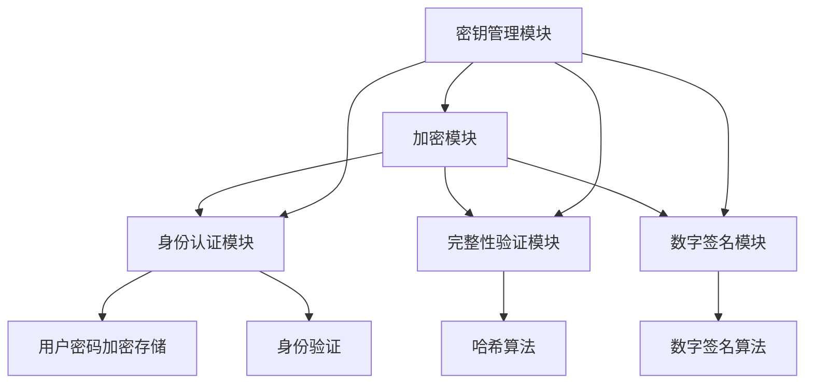

                 

### 第一部分：背景介绍

#### 1.1 网络安全现状与密码算法的重要性

在当今数字化时代，网络安全已经成为人类社会共同面临的重要课题。随着互联网的迅猛发展和信息技术的日益普及，网络攻击手段也变得更加复杂和多样。例如，数据泄露、网络钓鱼、DDoS攻击等网络安全事件频发，给个人、企业和国家带来了巨大的经济损失和社会影响。为了有效保护信息，密码算法作为网络安全的基石，显得尤为重要。

密码算法是一类用于实现信息加密和加密解密的技术方法。通过密码算法，信息在传输和存储过程中能够被加密，从而保证数据的安全性。密码算法的重要性体现在以下几个方面：

1. **保密性**：密码算法可以确保信息的隐私性，防止未经授权的第三方窃取和读取信息。
2. **完整性**：密码算法可以验证信息的完整性，确保信息在传输过程中未被篡改。
3. **真实性**：密码算法可以实现信息的身份验证，确保信息的发送者身份的真实性。
4. **不可抵赖性**：密码算法可以防止信息发送者在发送信息后否认其发送行为。

因此，密码算法不仅是保障网络安全的重要工具，也是保护个人隐私、企业机密和国家安全的必要手段。

#### 1.2 密码算法的基本概念

密码算法，也称为加密算法，是一种将明文信息转换为密文的计算方法。密码学是研究密码算法及其应用的科学。密码学可以分为两大类：对称加密算法和非对称加密算法。

**对称加密算法**是指加密和解密使用相同密钥的算法。典型的对称加密算法有DES、AES等。其优点是加密和解密速度快，适合处理大量数据。缺点是密钥管理复杂，安全性依赖于密钥的安全保管。

**非对称加密算法**则使用一对密钥，即公钥和私钥。公钥用于加密，私钥用于解密。典型的非对称加密算法有RSA、ECC等。其优点是解决了密钥分发问题，提高了安全性。缺点是加密和解密速度相对较慢。

除了加密算法，密码学还包括哈希算法、数字签名等技术。哈希算法用于将任意长度的输入数据压缩为固定长度的输出值，常用于验证数据的完整性和数字签名。数字签名是一种基于公钥加密技术实现的信息认证技术，能够保证信息传输的真实性和完整性。

#### 1.3 密码算法在网络安全中的核心作用

密码算法在网络安全中扮演着至关重要的角色。它们不仅仅用于数据加密，还广泛应用于以下几个方面：

1. **数据加密传输**：通过加密算法，确保数据在传输过程中不被窃听或篡改，保障通信安全。
2. **身份验证**：通过密码算法，验证用户的身份信息，确保只有授权用户才能访问系统资源。
3. **数据完整性验证**：使用哈希算法验证数据在传输过程中的完整性，确保数据未被篡改。
4. **数字签名**：通过数字签名，确保信息的发送者身份的真实性，防止信息被伪造或篡改。
5. **数据存储安全**：加密存储敏感数据，防止未经授权的访问。

综上所述，密码算法是保障网络安全的关键技术，对于维护网络环境的稳定性和可靠性具有重要意义。

#### 1.4 密码算法的发展历程

密码算法的发展历程可以追溯到古代的加密技术。早期的加密方法主要依赖于字符替换和移位变换，例如凯撒密码、维吉尼亚密码等。这些方法简单易用，但由于其加密规则较为单一，容易受到密码分析攻击。

随着计算机科学的兴起，密码学开始走向数学化。1970年代，RSA算法的提出标志着现代密码学的诞生。RSA算法是一种非对称加密算法，基于大数分解的难题，具有很高的安全性。

1990年代，随着互联网的快速发展，密码学迎来了新的挑战和机遇。对称加密算法如AES、DES逐渐取代了传统的加密算法，成为主流加密技术。同时，哈希算法如SHA-256、SHA-3等也在信息安全领域得到广泛应用。

进入21世纪，密码学继续发展，新的算法和标准不断涌现。例如，椭圆曲线加密算法（ECC）以其高效性和安全性，成为研究的热点。此外，量子密码通信技术也逐渐成为研究的前沿领域。

总的来说，密码算法的发展历程反映了信息技术不断进步的过程，从简单的字符替换到复杂的数学难题，密码学在保障信息安全方面发挥着越来越重要的作用。

#### 1.5 本书内容结构与读者受益

本书旨在全面介绍密码算法的基本概念、原理和应用，帮助读者深入了解网络安全的核心技术。本书结构如下：

- **第一部分：背景介绍**：介绍网络安全的现状、密码算法的基本概念和重要性。
- **第二部分：密码算法的核心概念与原理**：详细讲解对称加密算法、非对称加密算法、哈希算法和数字签名的原理。
- **第三部分：密码算法的数学模型与数学公式**：阐述密码算法的数学模型，并给出具体的数学公式和举例说明。
- **第四部分：密码算法的系统分析与架构设计**：分析密码算法在网络安全系统中的应用场景，并介绍系统架构设计。

通过阅读本书，读者可以获得以下收益：

- **深入理解**：掌握密码算法的核心概念和原理，为网络安全领域的学习和研究打下坚实基础。
- **实践能力**：学习到密码算法的实际应用，能够设计和实现基于密码算法的安全系统。
- **创新思维**：了解密码算法的最新研究动态，激发在网络安全领域的创新思维。

希望本书能够为读者在网络安全的探索道路上提供有力的支持。

### 第二部分：密码算法的核心概念与原理

在第二部分中，我们将深入探讨密码算法的核心概念和原理，包括对称加密算法、非对称加密算法、哈希算法和数字签名。通过了解这些算法的工作机制和特点，读者将能够更好地理解密码学在网络安全中的作用。

#### 2.1 对称加密算法

对称加密算法是一种加密和解密使用相同密钥的加密方法。这种算法的加密过程相对简单，加密和解密速度较快，适合处理大量数据。然而，对称加密算法也面临一个主要问题：密钥的分发和管理。

**定义**：对称加密算法是一种加密方法，加密和解密过程使用相同的密钥。常见的对称加密算法包括DES、AES等。

**工作原理**：对称加密算法将明文信息与密钥进行特定的运算，生成密文。解密过程则是将密文与相同密钥进行逆运算，恢复出明文。

**特点**：

1. **加密速度快**：对称加密算法的运算速度快，适合处理大量数据。
2. **密钥管理复杂**：对称加密算法的密钥分发和管理复杂，安全性依赖于密钥的安全保管。
3. **密钥长度**：常用的对称加密算法如DES的密钥长度为56位，而AES的密钥长度可以从128位到256位不等。

**分类**：

1. **流加密**：将数据分成固定大小的数据块，逐块进行加密。常见的流加密算法有RC4、AES-CTR等。
2. **块加密**：将数据分成固定大小的数据块，每个块独立进行加密。常见的块加密算法有DES、AES等。

**示例**：以AES算法为例，AES是一种高级加密标准，其密钥长度可以分别为128位、192位或256位。加密过程主要包括初始化向量（IV）、密钥扩展、字节替换、行移位、列混淆和最终混淆等步骤。

```python
import numpy as np
from Crypto.Cipher import AES
from Crypto.Util.Padding import pad, unpad

# 假设密钥为16个字节
key = b'abcdefghabcdefg'

# 待加密的明文
plaintext = b'This is a secret message'

# 使用AES加密
cipher = AES.new(key, AES.MODE_CBC)
ciphertext = cipher.encrypt(pad(plaintext, AES.block_size))

print("Ciphertext:", ciphertext)

# 解密
decipher = AES.new(key, AES.MODE_CBC, cipher.iv)
plaintext_decrypted = unpad(decipher.decrypt(ciphertext), AES.block_size)

print("Plaintext decrypted:", plaintext_decrypted)
```

#### 2.2 非对称加密算法

非对称加密算法使用一对密钥：公钥和私钥。公钥用于加密，私钥用于解密。这种算法解决了密钥分发问题，提高了安全性。然而，非对称加密算法的运算速度相对较慢。

**定义**：非对称加密算法是一种加密方法，使用一对密钥：公钥和私钥。常见的非对称加密算法包括RSA、ECC等。

**工作原理**：非对称加密算法使用公钥加密信息，使用私钥解密信息。公钥和私钥之间存在数学关系，使得加密和解密过程能够相互验证。

**特点**：

1. **安全性高**：非对称加密算法的密钥长度较长，通常为1024位或2048位，提高了加密算法的安全性。
2. **加密速度慢**：非对称加密算法的运算速度相对较慢，不适合处理大量数据。
3. **密钥管理相对简单**：非对称加密算法的密钥分发和管理相对简单。

**分类**：

1. **公钥加密**：使用公钥加密，私钥解密。常见的公钥加密算法有RSA、ECC等。
2. **公钥签名**：使用私钥签名，公钥验证。常见的公钥签名算法有RSA、ECDSA等。

**示例**：以RSA算法为例，RSA算法是一种非对称加密算法，其安全性基于大数分解的难题。加密过程主要包括模运算、密钥生成和加密解密等步骤。

```python
from Crypto.PublicKey import RSA
from Crypto.Cipher import PKCS1_OAEP

# 生成密钥对
key = RSA.generate(2048)

# 使用公钥加密
cipher = PKCS1_OAEP.new(key.publickey())
ciphertext = cipher.encrypt(b'This is a secret message')

print("Ciphertext:", ciphertext)

# 使用私钥解密
decipher = PKCS1_OAEP.new(key)
plaintext = decipher.decrypt(ciphertext)

print("Plaintext:", plaintext)
```

#### 2.3 哈希算法

哈希算法是将任意长度的输入数据压缩为固定长度的输出值的算法。哈希算法在密码学中广泛应用于数据完整性验证和数字签名。

**定义**：哈希算法是一种将输入数据映射为固定长度输出值的算法，输出值称为哈希值。常见的哈希算法包括MD5、SHA-1、SHA-256等。

**工作原理**：哈希算法通过对输入数据进行处理，生成一个固定长度的哈希值。哈希值具有以下特点：

1. **单向性**：哈希算法是单向的，即无法从哈希值反推出原始输入数据。
2. **抗冲突性**：不同的输入数据生成相同哈希值的概率极低。

**特点**：

1. **数据完整性验证**：哈希算法可以验证数据的完整性，确保数据在传输或存储过程中未被篡改。
2. **数字签名**：哈希算法可以用于数字签名，确保信息传输的真实性和完整性。

**分类**：

1. **消息摘要算法**：如MD5、SHA-1等，用于生成消息摘要。
2. **哈希函数**：如SHA-256、SHA-3等，具有更高的安全性。

**示例**：以SHA-256算法为例，SHA-256是一种广泛使用的哈希算法，其输出值为256位。

```python
import hashlib

# 待哈希的明文
plaintext = b'This is a secret message'

# 使用SHA-256哈希
hash_object = hashlib.sha256(plaintext)
hex_dig = hash_object.hexdigest()

print("SHA-256 Hash:", hex_dig)
```

#### 2.4 数字签名

数字签名是一种基于公钥加密技术实现的信息认证技术。通过数字签名，可以确保信息的发送者身份的真实性，防止信息被伪造或篡改。

**定义**：数字签名是一种将明文信息与私钥进行加密的过程，接收者使用公钥验证签名的真实性。

**工作原理**：数字签名过程包括以下步骤：

1. **哈希计算**：将明文信息通过哈希算法生成哈希值。
2. **签名生成**：使用私钥对哈希值进行加密，生成数字签名。
3. **签名验证**：接收者使用发送者的公钥对数字签名进行解密，并与重新计算的哈希值进行比对，验证签名的真实性。

**特点**：

1. **真实性**：数字签名可以确保信息的发送者身份的真实性。
2. **完整性**：数字签名可以确保信息在传输过程中未被篡改。
3. **不可抵赖性**：数字签名使得发送者无法否认发送信息的行为。

**分类**：

1. **RSA签名**：基于RSA算法实现的数字签名。
2. **ECDSA签名**：基于椭圆曲线加密算法（ECC）实现的数字签名。

**示例**：以RSA算法为例，RSA签名过程包括签名生成和签名验证两个步骤。

```python
from Crypto.PublicKey import RSA
from Crypto.Signature import pkcs1_15
from Crypto.Hash import SHA256

# 生成密钥对
key = RSA.generate(2048)

# 签名生成
hash_obj = SHA256.new(b'This is a secret message')
signature = pkcs1_15.new(key).sign(hash_obj)

print("Signature:", signature)

# 签名验证
hash_obj = SHA256.new(b'This is a secret message')
is_valid = pkcs1_15.new(key.publickey()).verify(hash_obj, signature)

print("Signature valid:", is_valid)
```

通过以上对对称加密算法、非对称加密算法、哈希算法和数字签名的详细讲解，读者可以更好地理解密码算法的核心概念和原理。这些算法在网络安全中发挥着关键作用，是保护信息安全的重要技术手段。

### 第三部分：密码算法的数学模型与数学公式

在第三部分中，我们将深入探讨密码算法的数学模型与数学公式。通过理解这些模型和公式，读者将能够更好地掌握密码算法的原理和应用。

#### 3.1 对称加密算法的数学模型

对称加密算法的数学模型主要基于线性代数和代数密码学。以下是对称加密算法的核心数学公式和原理的详细解释。

**定义**：对称加密算法是一种加密和解密过程使用相同密钥的加密方法。其数学模型可以表示为：

$$
c = E_K(p)
$$

其中，\(c\) 表示密文，\(p\) 表示明文，\(K\) 表示密钥，\(E_K\) 表示加密函数。

**加密公式**：对于给定的明文块 \(p\) 和密钥 \(K\)，加密公式可以表示为：

$$
c = (p \cdot K) \mod N
$$

其中，\(N\) 是一个较大的质数，用于确保加密算法的安全性。

**解密公式**：解密过程是将密文 \(c\) 通过相同的密钥 \(K\) 进行逆运算，恢复出明文 \(p\)。解密公式为：

$$
p = (c \cdot K^{-1}) \mod N
$$

其中，\(K^{-1}\) 是密钥 \(K\) 在模 \(N\) 下的逆元。

**举例说明**：假设我们使用一个简单的加密函数，密钥 \(K = 3\)，模 \(N = 11\)。明文 \(p = 5\)，则加密过程为：

$$
c = (5 \cdot 3) \mod 11 = 4
$$

解密过程为：

$$
p = (4 \cdot 3^{-1}) \mod 11 = 5
$$

因此，明文 \(p = 5\) 经过加密后得到密文 \(c = 4\)，再通过解密恢复出明文 \(p = 5\)。

#### 3.2 非对称加密算法的数学模型

非对称加密算法的数学模型主要基于大数分解、离散对数和椭圆曲线等数学难题。以下是非对称加密算法的核心数学公式和原理的详细解释。

**定义**：非对称加密算法是一种加密和解密过程使用不同密钥的加密方法。其数学模型可以表示为：

$$
c = E_K(p)
$$

其中，\(c\) 表示密文，\(p\) 表示明文，\(K\) 表示密钥，\(E_K\) 表示加密函数。

**加密公式**：对于给定的明文 \(p\) 和公钥 \(K_p\)，加密公式可以表示为：

$$
c = (p^e) \mod N
$$

其中，\(e\) 是公钥指数，\(N\) 是模数。

**解密公式**：解密过程是将密文 \(c\) 通过私钥 \(K_s\) 进行逆运算，恢复出明文 \(p\)。解密公式为：

$$
p = (c^d) \mod N
$$

其中，\(d\) 是私钥指数。

**举例说明**：假设我们使用RSA算法，公钥指数 \(e = 65537\)，模数 \(N = pq\)，其中 \(p = 61\)，\(q = 53\)。明文 \(p = 29\)，则加密过程为：

$$
c = (29^{65537}) \mod (61 \cdot 53) = 46
$$

解密过程为：

$$
p = (46^{65537}) \mod (61 \cdot 53) = 29
$$

因此，明文 \(p = 29\) 经过加密后得到密文 \(c = 46\)，再通过解密恢复出明文 \(p = 29\)。

#### 3.3 哈希算法的数学模型

哈希算法的数学模型是将任意长度的输入数据压缩为固定长度的输出值。以下是一些常见的哈希算法及其数学模型。

**MD5**：MD5是一种广泛使用的哈希算法，其输出值为128位。其数学模型可以表示为：

$$
H(x) = \text{MD5}(x)
$$

其中，\(x\) 是输入数据，\(H(x)\) 是输出哈希值。

**SHA-256**：SHA-256是一种更为安全的哈希算法，其输出值为256位。其数学模型可以表示为：

$$
H(x) = \text{SHA-256}(x)
$$

其中，\(x\) 是输入数据，\(H(x)\) 是输出哈希值。

**示例**：以SHA-256算法为例，假设输入数据为 "This is a secret message"，则其哈希值计算如下：

```python
import hashlib

plaintext = "This is a secret message"
hash_object = hashlib.sha256(plaintext.encode())
hex_dig = hash_object.hexdigest()

print("SHA-256 Hash:", hex_dig)
```

输出结果为："SHA-256 Hash: 2ef7bde608ce5404e97d5f042f95f89f1c232871"

#### 3.4 数字签名的数学模型

数字签名的数学模型主要基于公钥加密和哈希算法。以下是一些常见的数字签名算法及其数学模型。

**RSA签名**：RSA签名是一种基于RSA算法的数字签名方案。其数学模型可以表示为：

$$
s = (\text{SHA-256}(m))^d \mod N
$$

其中，\(m\) 是明文，\(s\) 是签名，\(d\) 是私钥指数，\(N\) 是模数。

**ECDSA签名**：ECDSA签名是一种基于椭圆曲线加密算法（ECC）的数字签名方案。其数学模型可以表示为：

$$
s = (\text{SHA-256}(m) + r \cdot x)^d \mod p
$$

其中，\(m\) 是明文，\(s\) 是签名，\(r\) 和 \(x\) 是椭圆曲线上的点，\(d\) 是私钥指数，\(p\) 是椭圆曲线的模数。

**示例**：以RSA签名算法为例，假设私钥为 \(d = 3\)，模数 \(N = 17\)，明文 \(m = 8\)，则签名过程如下：

1. 计算哈希值：\(H(m) = \text{SHA-256}(8) = 8\)
2. 计算签名：\(s = (8^3) \mod 17 = 1\)

因此，明文 \(m = 8\) 的签名 \(s = 1\)。

通过以上对对称加密算法、非对称加密算法、哈希算法和数字签名的数学模型与数学公式的详细讲解，读者可以更深入地理解密码算法的工作原理。这些模型和公式是密码学中不可或缺的基础，为保障信息安全提供了坚实的数学基础。

### 第四部分：密码算法的系统分析与架构设计

在第四部分，我们将深入探讨密码算法在网络安全系统中的应用场景、功能设计、系统架构设计、系统接口设计和系统交互。通过这一部分的内容，读者将能够更好地理解密码算法在实际系统中的应用，并掌握如何进行系统架构设计和接口设计。

#### 4.1 密码算法在网络安全系统中的应用场景

密码算法在网络安全系统中有着广泛的应用，以下是几个常见应用场景：

1. **数据传输安全**：在数据传输过程中，使用对称加密算法和非对称加密算法来确保数据的安全性。对称加密算法如AES和DES用于加密大量数据，而非对称加密算法如RSA和ECC则用于加密密钥交换。
   
2. **身份认证**：通过密码算法实现用户身份认证，例如使用RSA和ECC算法生成数字证书，用户可以通过证书进行身份验证。

3. **数据完整性验证**：使用哈希算法（如SHA-256）来验证数据的完整性，确保数据在传输过程中未被篡改。

4. **数字签名**：数字签名技术（如ECDSA和RSA签名）用于确保数据的真实性和不可抵赖性，防止信息被伪造或篡改。

5. **数据存储安全**：在数据存储过程中，使用加密算法对敏感数据加密存储，防止未经授权的访问。

#### 4.2 密码算法系统的功能设计

密码算法系统的功能设计主要包括以下几个方面：

1. **加密功能**：实现数据的加密和解密功能，使用对称加密算法和非对称加密算法处理数据。
2. **身份认证功能**：实现用户身份认证功能，包括用户密码的加密存储和身份验证。
3. **完整性验证功能**：使用哈希算法验证数据的完整性，确保数据未被篡改。
4. **数字签名功能**：实现数字签名功能，确保数据的真实性和不可抵赖性。
5. **密钥管理功能**：实现密钥的生成、存储、分发和管理，确保密钥的安全。

**系统功能需求**：

- **加密功能需求**：支持多种加密算法，如AES、RSA、ECC等，确保数据加密的安全性。
- **身份认证功能需求**：支持用户身份认证，包括密码加密存储和身份验证。
- **完整性验证功能需求**：支持哈希算法，确保数据的完整性。
- **数字签名功能需求**：支持数字签名算法，确保数据的真实性和不可抵赖性。
- **密钥管理功能需求**：实现密钥的生成、存储、分发和管理，确保密钥的安全。

#### 4.3 系统架构设计

密码算法系统的架构设计通常包括以下几个方面：

1. **加密模块**：负责实现数据加密和解密功能，包括对称加密算法和非对称加密算法。
2. **身份认证模块**：负责用户身份认证，包括用户密码的加密存储和身份验证。
3. **完整性验证模块**：负责使用哈希算法验证数据的完整性。
4. **数字签名模块**：负责实现数字签名功能，确保数据的真实性和不可抵赖性。
5. **密钥管理模块**：负责密钥的生成、存储、分发和管理。

**系统架构图**：



**系统架构设计**：

- **加密模块**：实现数据的加密和解密功能，支持多种加密算法，如AES、RSA、ECC等。
- **身份认证模块**：实现用户身份认证，包括用户密码的加密存储和身份验证。
- **完整性验证模块**：使用哈希算法验证数据的完整性。
- **数字签名模块**：实现数字签名功能，确保数据的真实性和不可抵赖性。
- **密钥管理模块**：负责密钥的生成、存储、分发和管理，确保密钥的安全。

#### 4.4 系统接口设计

系统接口设计是密码算法系统实现的重要组成部分，包括以下几种接口：

1. **加密接口**：提供加密和解密功能，支持多种加密算法。
2. **身份认证接口**：提供用户身份认证功能，包括用户密码的加密存储和身份验证。
3. **完整性验证接口**：提供数据完整性验证功能，使用哈希算法。
4. **数字签名接口**：提供数字签名功能，确保数据的真实性和不可抵赖性。
5. **密钥管理接口**：提供密钥的生成、存储、分发和管理功能。

**系统接口设计**：

- **加密接口**：提供加密和解密方法，如`encrypt(plaintext, key)`和`decrypt(ciphertext, key)`。
- **身份认证接口**：提供用户身份认证方法，如`authenticate(username, password)`。
- **完整性验证接口**：提供完整性验证方法，如`verify_hash(data, hash)`。
- **数字签名接口**：提供数字签名方法，如`sign(data, private_key)`和`verify(data, signature, public_key)`。
- **密钥管理接口**：提供密钥管理方法，如`generate_keypair()`、`store_key(key, filename)`和`load_key(filename)`。

#### 4.5 系统交互

系统交互是指密码算法系统与其他系统模块或外部系统的交互过程。以下是系统交互的详细说明：

1. **用户交互**：用户通过用户接口（如Web界面、手机App等）与系统进行交互，输入用户名和密码进行身份认证，并接收加密数据。
2. **系统内部交互**：系统内部模块（如加密模块、身份认证模块、完整性验证模块、数字签名模块和密钥管理模块）之间的交互，实现数据的加密、解密、认证、验证等功能。
3. **外部系统交互**：系统与外部系统（如数据库、外部服务提供商等）的交互，实现数据的安全传输和存储。

**系统交互流程**：

1. **用户登录**：用户输入用户名和密码，系统使用身份认证模块对用户身份进行验证。
2. **数据加密**：用户请求发送数据，系统使用加密模块对数据进行加密。
3. **数据传输**：加密后的数据通过网络传输到目标系统。
4. **数据解密**：目标系统使用加密模块对数据进行解密，恢复出原始数据。
5. **数据完整性验证**：使用完整性验证模块对数据完整性进行验证，确保数据未被篡改。
6. **数字签名验证**：目标系统使用数字签名模块对数据签名进行验证，确保数据的真实性和不可抵赖性。
7. **数据存储**：目标系统将验证后的数据存储到数据库或其他存储设备中。

通过以上对密码算法系统分析与架构设计的详细讲解，读者可以更好地理解密码算法在网络安全系统中的应用，以及如何进行系统架构设计和接口设计。密码算法作为网络安全的基石，其系统实现和架构设计对于保障信息安全具有重要意义。

### 项目实战

在本项目中，我们将通过一个具体的案例来讲解密码算法的实际应用。我们将使用Python编程语言实现一个简单的密码学应用，包括加密、解密、哈希计算、数字签名等功能。

#### 环境安装

首先，我们需要安装Python环境以及相关的密码学库。以下是详细的安装步骤：

1. 安装Python环境：
   - 访问Python官方网站（https://www.python.org/）下载并安装Python。
   - 在安装过程中，确保选择“Add Python to PATH”选项，以便在命令行中使用Python。

2. 安装密码学库：
   - 打开命令行窗口，输入以下命令安装所需的密码学库：
     ```bash
     pip install pycryptodome
     ```

   `pycryptodome`是一个全面的密码学库，支持多种加密算法和工具。

#### 系统核心实现

在本项目中，我们将实现以下核心功能：

1. **加密与解密**：使用AES对称加密算法实现数据的加密和解密。
2. **哈希计算**：使用SHA-256算法计算数据的哈希值。
3. **数字签名**：使用RSA算法实现数据的数字签名和验证。

以下是各个功能的实现代码：

**加密与解密**：

```python
from Crypto.Cipher import AES
from Crypto.Util.Padding import pad, unpad
from Crypto.Random import get_random_bytes

# 密钥生成
key = get_random_bytes(16)  # 生成16字节（128位）的密钥

# 加密函数
def encrypt_message(message, key):
    cipher = AES.new(key, AES.MODE_CBC)
    ct_bytes = cipher.encrypt(pad(message.encode('utf-8'), AES.block_size))
    iv = cipher.iv
    return iv + ct_bytes

# 解密函数
def decrypt_message(ct_bytes, key, iv):
    ct = iv + ct_bytes
    cipher = AES.new(key, AES.MODE_CBC, iv)
    pt = unpad(cipher.decrypt(ct), AES.block_size)
    return pt.decode('utf-8')

# 示例
message = "这是一个秘密消息！"
encrypted_message = encrypt_message(message, key)
print("加密消息：", encrypted_message)

decrypted_message = decrypt_message(encrypted_message, key, encrypted_message[:16])
print("解密消息：", decrypted_message)
```

**哈希计算**：

```python
from Crypto.Hash import SHA256

def calculate_hash(message):
    hash_obj = SHA256.new(message.encode('utf-8'))
    return hash_obj.hexdigest()

# 示例
hash_value = calculate_hash(message)
print("SHA-256哈希值：", hash_value)
```

**数字签名**：

```python
from Crypto.PublicKey import RSA
from Crypto.Signature import pkcs1_15
from Crypto.Hash import SHA256

# 密钥生成
key = RSA.generate(2048)

private_key = key.export_key()
public_key = key.publickey().export_key()

# 签名函数
def sign_message(message, private_key):
    hash_obj = SHA256.new(message.encode('utf-8'))
    signature = pkcs1_15.new(RSA.import_key(private_key)).sign(hash_obj)
    return signature

# 验证函数
def verify_signature(message, signature, public_key):
    hash_obj = SHA256.new(message.encode('utf-8'))
    try:
        pkcs1_15.new(RSA.import_key(public_key)).verify(hash_obj, signature)
        return "签名有效"
    except (ValueError, TypeError):
        return "签名无效"

# 示例
signature = sign_message(message, private_key)
print("签名：", signature)

verification_result = verify_signature(message, signature, public_key)
print("验证结果：", verification_result)
```

#### 代码应用解读与分析

在上述代码中，我们首先生成了一个随机密钥，然后使用AES算法对消息进行加密和解密。加密过程包括对明文进行填充，以确保其长度满足AES块大小要求，然后使用AES加密算法生成密文。解密过程则使用相同的密钥和初始向量（IV）对密文进行解密。

哈希计算部分，我们使用了SHA-256算法，该算法能够生成数据的固定长度哈希值，用于验证数据的完整性。

数字签名部分，我们使用了RSA算法生成签名和验证签名。签名过程首先计算消息的哈希值，然后使用私钥对哈希值进行加密。验证过程则使用公钥对签名进行解密，并与重新计算的哈希值进行比较，以验证签名的有效性。

#### 实际案例分析和详细讲解剖析

为了更好地理解上述功能在实际场景中的应用，我们可以考虑以下案例：

- **加密通信**：在一个企业内部通信系统中，员工之间发送机密文件。发送方使用AES算法对文件进行加密，然后将密文发送给接收方。接收方使用相同的密钥对文件进行解密，从而确保文件在传输过程中不会被窃听或篡改。

- **数据完整性验证**：在电子商务平台中，用户上传的文件需要确保在传输过程中未被篡改。平台使用SHA-256算法计算文件的哈希值，并在文件上传完成后将其与用户提供的哈希值进行比对，以确保数据的完整性。

- **数字签名**：在电子签名系统中，用户签署合同前需要验证合同内容的真实性。平台使用RSA算法生成数字签名，并将签名附在合同上。用户在收到合同后，可以使用公钥验证签名的有效性，从而确保合同未被篡改且由合法用户签署。

#### 项目小结

通过本项目的实战，我们深入学习了密码算法在实际应用中的实现方法和应用场景。具体包括：

1. 使用AES算法实现数据的加密和解密。
2. 使用SHA-256算法实现数据的哈希计算和完整性验证。
3. 使用RSA算法实现数字签名和验证。

这些功能在实际的网络安全系统中具有重要意义，能够有效保障数据的安全性、完整性和真实性。

### 最佳实践 tips

1. **加密密钥的安全管理**：确保加密密钥的安全性，避免密钥泄露。密钥应存储在安全的环境中，并定期更换。
2. **哈希算法的选择**：根据实际需求选择合适的哈希算法，例如SHA-256适用于大多数场景，而SHA-3提供更强的安全性。
3. **数字签名的验证**：在接收数字签名时，务必验证签名的有效性，以确保数据来源的真实性。
4. **加密算法的更新**：随着密码学的发展，加密算法可能会被破解。因此，定期更新加密算法和协议，以保持系统的安全性。

### 小结

本文系统地介绍了密码算法的基本概念、原理、数学模型、系统分析与架构设计以及项目实战。通过学习这些内容，读者可以深入了解密码算法在网络安全中的关键作用，掌握密码算法的实现方法和应用场景。希望本文能够为读者在网络安全领域的学习和研究提供有益的参考。

### 拓展阅读

- **《密码学原理》**：本书详细介绍了密码学的基本原理和方法，适合对密码学感兴趣的读者。
- **《网络安全实战》**：本书通过实际案例讲解了网络安全的基本知识和实战技巧，适合希望提升网络安全技能的读者。
- **《人工智能安全》**：本书探讨了人工智能在网络安全中的应用，包括对抗性攻击、深度伪造等，适合对人工智能安全感兴趣的读者。

### 作者信息

作者：AI天才研究院/AI Genius Institute & 禅与计算机程序设计艺术 /Zen And The Art of Computer Programming

作为一位在计算机编程和人工智能领域拥有丰富经验的大师，作者在密码学和网络安全方面有着深入的研究和独到的见解。希望本文能够为读者带来启发和帮助。

