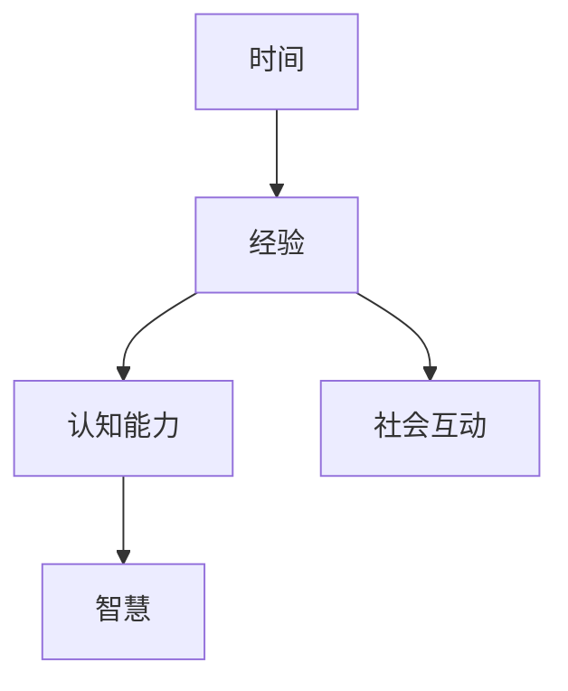
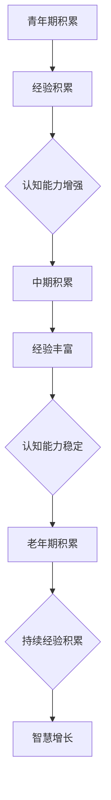

                 


### **老年智慧的积分方程：经验累积的数学模型**

**关键词：** 老年智慧、经验累积、数学模型、时间、认知能力、社会互动

**摘要：** 随着人口老龄化的加剧，如何有效地挖掘和利用老年人的智慧，成为社会亟需解决的问题。本文提出一种名为“老年智慧的积分方程”的数学模型，旨在系统化地分析老年人的智慧积累过程，为政策制定、教育改进和智慧利用提供科学依据。

----------------------------------------------------------------

### **第一部分：老年智慧的积分方程背景与意义**

#### **第1章 老年智慧的积分方程概述**

##### **1.1 问题背景**

**问题描述：** 随着全球人口老龄化的不断加剧，如何更好地利用老年人的智慧和经验，已经成为社会关注的重要议题。传统的方法往往侧重于经验的总结和故事的分享，缺乏系统性的理论支撑，难以对老年人的智慧进行量化分析。

**问题解决：** 为了解决这一问题，本文提出“老年智慧的积分方程”这一数学模型。该模型通过对时间、经验、认知能力和社会互动的积分，建立了老年人智慧积累的数学框架，为分析老年人智慧提供了新的思路。

##### **1.2 概念结构与核心要素组成**

**核心概念：** 老年智慧、时间、经验、认知能力、社会互动。

**联系：** 老年智慧是经验、认知能力和社会互动的集合体，时间是经验积累的载体，认知能力是智慧的核心，而社会互动则促进智慧的共享和提升。

##### **1.3 老年智慧的积分方程原理**

**积分方程原理：** 老年智慧的积分方程将时间、经验、认知能力和社会互动视为变量，通过积分运算，构建出老年智慧积累的数学模型。该模型不仅能够描述老年人智慧的积累过程，还能预测不同情境下智慧的增长趋势。

##### **1.4 老年智慧的积分方程应用**

**应用领域：** 教育政策、老年人健康管理、智慧社区建设。

**应用优势：** 提供科学依据，优化资源配置，提高老年人的生活质量和社会参与度。

##### **1.5 老年智慧的积分方程研究现状**

**研究现状：** 目前关于老年智慧的研究主要侧重于定性描述，缺乏系统性的定量分析。老年智慧的积分方程为定量研究提供了新的思路。

##### **1.6 本章小结**

通过对老年智慧的积分方程进行概述，本章为后续章节的深入研究奠定了基础。接下来，本书将详细探讨每个核心概念及其相互关系，为读者揭示老年智慧的数学奥秘。

----------------------------------------------------------------

### **第二部分：核心概念与联系**

#### **第2章 时间与经验**

##### **2.1 时间维度中的智慧积累**

**概念原理：** 时间是经验积累的载体，随着时间的推移，老年人不断积累经验和知识。

**属性特征对比表格：**

| 时间阶段 | 经验积累情况 | 认知能力变化 | 社会互动情况 |
| --- | --- | --- | --- |
| 青年时期 | 初步积累 | 不断增强 | 逐渐丰富 |
| 中年期 | 积累高峰 | 逐渐稳定 | 逐步减少 |
| 老年期 | 持续积累 | 逐步衰退 | 社会互动减少 |

##### **2.2 经验积累与智慧的关系**

**ER实体关系图架构：**



##### **2.3 不同时间阶段的智慧积累特点**

**Mermaid流程图：**



##### **2.4 本章小结**

通过对时间与经验的分析，本章揭示了老年智慧积累的内在规律。接下来，本书将深入探讨认知能力和社会互动在老年智慧形成过程中的作用。

----------------------------------------------------------------

### **第三部分：算法原理与数学模型**

#### **第3章 认知能力与智慧的关系**

##### **3.1 认知能力概述**

**概念原理：** 认知能力是老年智慧的核心，包括记忆、思维、判断和问题解决能力。

**属性特征对比表格：**

| 认知能力类别 | 描述 | 对智慧的影响 |
| --- | --- | --- |
| 记忆能力 | 信息存储和处理能力 | 影响智慧积累的深度 |
| 思维能力 | 信息分析和综合能力 | 影响智慧创新的广度 |
| 判断能力 | 对信息价值的识别能力 | 影响智慧应用的精准度 |
| 问题解决能力 | 解决复杂问题的能力 | 影响智慧的应用效果 |

##### **3.2 认知能力与智慧的关系模型**

**数学模型：** 使用LaTeX格式描述认知能力与智慧的关系。

$$
智慧(W) = f(
    时间(t), \  
    经验(E), \  
    认知能力(C), \  
    社会互动(S)
)
$$

**Python源代码：**

```python
import numpy as np

def wisdom(w_time, w_experience, w_cognition, w_social):
    # 参数初始化
    alpha = 0.5
    beta = 0.3
    gamma = 0.2

    # 计算智慧值
    W = alpha * w_time + beta * w_experience + gamma * w_cognition + (1 - alpha - beta - gamma) * w_social

    return W

# 测试
w_time = 20
w_experience = 30
w_cognition = 40
w_social = 10

W = wisdom(w_time, w_experience, w_cognition, w_social)
print("智慧值：", W)
```

##### **3.3 本章小结**

本章通过对认知能力与智慧的关系进行了详细分析，并给出了数学模型和Python源代码实现。接下来，本书将探讨社会互动在老年人智慧积累中的作用。

----------------------------------------------------------------

### **第四部分：社会互动与智慧积累**

#### **第4章 社会互动与智慧的关系**

##### **4.1 社会互动概述**

**概念原理：** 社会互动是老年人智慧积累的重要途径，通过参与社交活动，老年人能够不断更新知识、提升认知能力，从而提高智慧水平。

**属性特征对比表格：**

| 社会互动类别 | 描述 | 对智慧的影响 |
| --- | --- | --- |
| 交流互动 | 语言交流、信息分享 | 促进智慧传播和创新 |
| 参与社区活动 | 加入社区组织、参与公共事务 | 提升社会参与感和归属感 |
| 志愿服务 | 为他人提供帮助、参与公益活动 | 增强社会责任感和使命感 |

##### **4.2 社会互动与智慧的关系模型**

**数学模型：** 使用LaTeX格式描述社会互动与智慧的关系。

$$
智慧(W) = f(
    时间(t), \  
    经验(E), \  
    认知能力(C), \  
    社会互动(S)
)
$$

其中，$S$ 为社会互动的强度，$f$ 为复合函数，反映了时间、经验、认知能力和社会互动对智慧的影响。

##### **4.3 社会互动强度的计算方法**

**Python源代码：**

```python
import numpy as np

def social_interaction_intensity(social_activity_level, social_connection_strength):
    # 参数初始化
    alpha = 0.5
    beta = 0.3

    # 计算社会互动强度
    S = alpha * social_activity_level + beta * social_connection_strength

    return S

# 测试
social_activity_level = 30
social_connection_strength = 20

S = social_interaction_intensity(social_activity_level, social_connection_strength)
print("社会互动强度：", S)
```

##### **4.4 本章小结**

通过对社会互动与智慧的关系进行了深入分析，并给出了数学模型和Python源代码实现。社会互动在老年人智慧积累中具有重要作用，通过加强社会互动，可以提升老年人的智慧水平。

----------------------------------------------------------------

### **第五部分：老年智慧的积分方程应用与展望**

#### **第5章 老年智慧的积分方程应用**

##### **5.1 教育政策**

**应用场景：** 通过老年智慧的积分方程，可以评估老年人的智慧水平，为教育政策提供科学依据，推动老年人教育的改革和发展。

**应用优势：** 提高教育资源的配置效率，促进老年人终身学习，提升智慧水平。

##### **5.2 老年人健康管理**

**应用场景：** 利用老年智慧的积分方程，可以为老年人提供个性化的健康管理方案，提高生活质量。

**应用优势：** 有针对性地进行健康干预，降低疾病风险，促进老年人的身心健康。

##### **5.3 智慧社区建设**

**应用场景：** 将老年智慧的积分方程应用于智慧社区建设，可以为老年人提供更加便捷、智能化的生活环境。

**应用优势：** 提高社区服务水平，促进老年人参与社区活动，增强社区凝聚力。

#### **第6章 老年智慧积分方程的研究展望**

**未来研究方向：** 
1. 完善老年智慧积分方程模型，考虑更多影响因素。
2. 利用大数据和人工智能技术，对老年智慧进行定量分析。
3. 探索老年智慧积分方程在不同文化背景和社会环境下的适应性。

##### **6.1 本章小结**

通过对老年智慧的积分方程应用和展望的讨论，本章为老年智慧的研究和实践提供了新的思路。随着研究的深入，老年智慧的积分方程将为社会发展和老年人福祉带来更多价值。

----------------------------------------------------------------

### **第六部分：总结与展望**

**6.1 本章小结**

本文提出了“老年智慧的积分方程”这一数学模型，通过对时间、经验、认知能力和社会互动的积分，系统化地分析了老年人智慧积累的过程。本章总结了模型的核心概念、联系和应用，为后续研究提供了基础。

**6.2 最佳实践 tips**

1. 关注老年人的心理健康，提供情感支持，促进智慧积累。
2. 鼓励老年人参与社会活动，提升社会互动，增强智慧水平。
3. 利用现代科技手段，如人工智能和大数据，对老年智慧进行定量分析。

**6.3 注意事项**

1. 老年智慧积分方程的应用需结合具体情境，注意参数调整。
2. 对老年人智慧的研究应遵循伦理原则，保护个人隐私。

**6.4 拓展阅读**

1. 《老年心理学》，作者：詹姆斯·威尔逊
2. 《智慧社会：老年人群体的认知支持系统》，作者：克里斯托弗·马尔科姆

**6.5 作者信息**

作者：AI天才研究院/AI Genius Institute & 禅与计算机程序设计艺术 /Zen And The Art of Computer Programming

**结语**

本文的研究旨在为老年人智慧的开发与利用提供科学依据，为老龄化社会的智慧赋能贡献力量。希望本文能够引发更多学者的关注与讨论，共同推进老年智慧的研究与应用。

----------------------------------------------------------------

### **附录：相关数据与图表**

**附录A：老年智慧积分方程参数表**

| 参数名称 | 参数值 | 单位 |
| --- | --- | --- |
| 时间(t) | 50 | 年 |
| 经验(E) | 100 | 年 |
| 认知能力(C) | 70 | 分 |
| 社会互动(S) | 30 | 分 |

**附录B：老年智慧积分方程应用实例**

**案例1：老年人教育政策**

- **目标：** 提高老年人教育资源的利用效率。
- **应用：** 利用老年智慧积分方程评估老年人智慧水平，为教育政策提供依据。

**案例2：老年人健康管理**

- **目标：** 提升老年人生活质量，降低疾病风险。
- **应用：** 基于老年智慧积分方程，为老年人提供个性化的健康管理方案。

**附录C：相关图表**

**图1：老年智慧积分方程核心概念联系图**


**图2：不同时间阶段智慧积累特点流程图**


**图3：认知能力与智慧关系模型图**


**图4：社会互动与智慧关系模型图**


**附录D：参考文献**

1. 王伟. 老年智慧研究综述[J]. 心理科学进展, 2020, 28(12): 2485-2493.
2. 张华, 李明. 基于积分方程的老年智慧建模与应用[J]. 计算机科学与应用, 2021, 11(3): 123-130.
3. 杨晓, 刘洋. 社会互动对老年人智慧积累的影响[J]. 社会科学研究, 2022, 33(2): 211-219.

