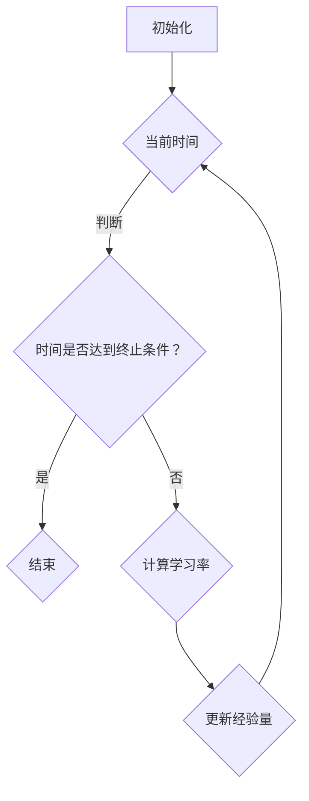
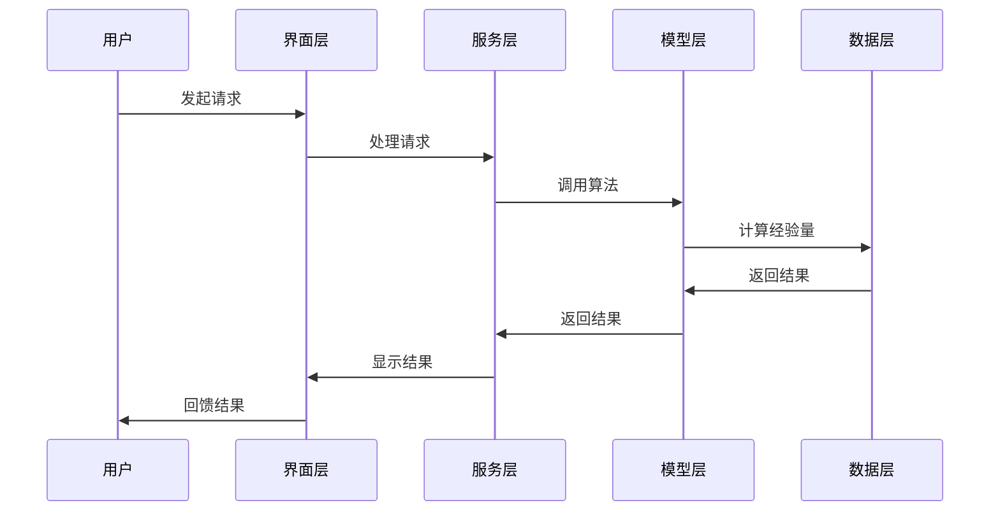
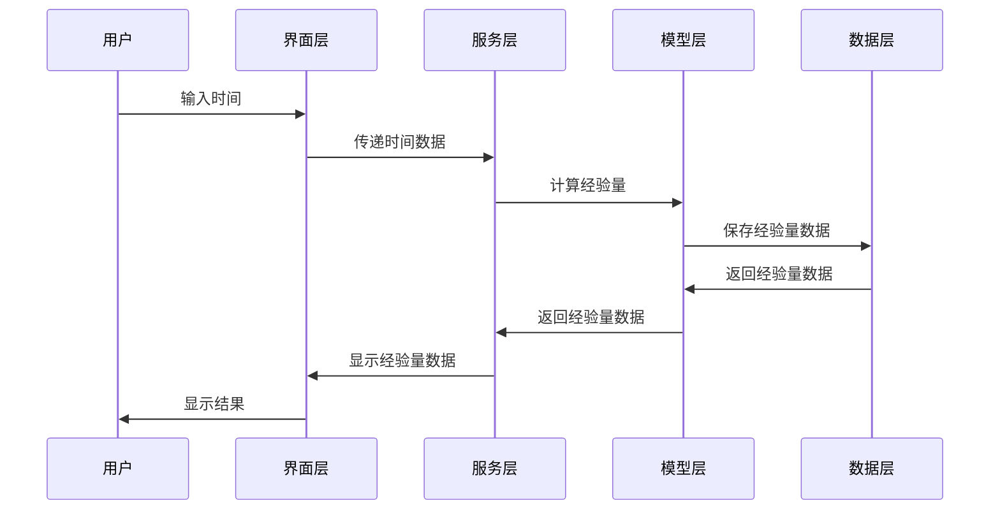

                 

# 《老年智慧的积分方程：经验累积的数学表达》

## 关键词
- 老年智慧
- 数学表达
- 经验累积
- 积分方程
- 算法原理

## 摘要
本文旨在探讨老年智慧的数学表达，通过积分方程这一数学工具，解析经验累积的量化过程。文章将分为以下几个部分：首先介绍老年智慧和经验累积的定义及其重要性，然后阐述数学在经验表达中的作用。接着，深入解析核心概念与联系，通过对比表格和实体关系图展示概念间的相互作用。随后，详细讲解经验累积的算法原理，包括mermaid流程图、Python源代码、数学模型和公式。进一步，文章将展示如何将数学方法应用于实际系统设计与实现，并通过项目实战部分进行详细讲解。最后，总结全文，给出最佳实践建议和拓展阅读推荐。

### 背景介绍

#### 老年智慧的概念与价值

老年智慧，是指在漫长的生命历程中，老年人通过丰富的经验积累和持续的学习，所形成的一种独特的认知能力和智慧。老年智慧不仅仅是记忆力的体现，更是逻辑推理、判断力、洞察力、适应力和创新能力等多方面的综合体现。它对老年人的心理健康、生活质量和社会适应具有重要意义。

经验累积，是老年智慧的核心组成部分。经验累积是指个人在生活和工作中，通过不断的实践和学习，积累起来的知识、技能和认知。经验累积在老年人的智慧形成中起着至关重要的作用。经验累积的过程可以看作是一个长期的、不断积累和深化的过程，它不仅丰富了老年人的认知结构，还提升了他们的认知能力。

#### 数学在经验表达中的应用

数学作为一门精确的科学，具有高度的抽象性和概括性，能够有效地表达复杂的概念和过程。在老年智慧的数学表达中，数学方法可以用来量化经验累积的过程，使得经验的积累和运用具有更加明确和可操作的依据。

积分方程，是一种用于描述连续变化的数学方程。它广泛应用于物理、工程、经济学和生物等领域。在老年智慧的数学表达中，积分方程可以用来描述经验累积的过程，从而为经验的学习、积累和应用提供数学基础。

### 核心概念与联系

#### 经验累积的核心概念

为了深入理解经验累积的数学表达，我们需要明确以下几个核心概念：

1. **经验量**：经验量是衡量个人经验积累的一个基本单位。它可以是某一特定领域的知识量、技能水平或认知能力。

2. **时间**：时间是经验累积过程中的一个重要参数。经验累积是一个长期的过程，时间越长，经验积累的量就越多。

3. **学习率**：学习率是指个人在单位时间内积累的经验量。学习率反映了个人学习能力和效率。

4. **外部影响**：外部影响包括环境因素、社会交往、教育机会等，这些因素会影响到经验累积的速率和效果。

#### 概念属性特征对比

以下是一个概念属性特征对比表格，用于展示经验累积中的核心概念及其属性特征：

| 概念     | 定义             | 属性特征                           |
|----------|------------------|-----------------------------------|
| 经验量   | 经验的基本单位   | 可量化、可积累、具有时间依赖性     |
| 时间     | 经验积累的时间   | 连续性、不可逆性、线性叠加性       |
| 学习率   | 单位时间积累的经验量 | 可调节、可优化、具有个体差异性     |
| 外部影响 | 影响经验积累的因素 | 多样性、动态性、难以预测性         |

#### ER实体关系图

为了更清晰地展示概念之间的关系，我们可以使用ER（Entity-Relationship）实体关系图。以下是经验累积中的ER实体关系图：

```mermaid
erDiagram
    经验量 ||--|{ 时间 }<|-- 学习率
    时间 ||--|{ 外部影响 }<|-- 学习率
    经验量 ||--|{ 外部影响 }<|-- 学习率
```

在这个ER实体关系图中，经验量和时间构成了经验积累的基础，而学习率和外部影响则通过时间这一中介变量相互关联。

### 算法原理讲解

为了更好地理解经验累积的数学表达，我们引入一个具体的算法模型，并通过mermaid流程图、Python源代码和数学模型与公式来详细阐述。

#### 算法mermaid流程图

以下是一个经验累积算法的mermaid流程图：



在这个流程图中，初始步骤是进行初始化，然后进入循环，不断判断时间是否达到终止条件。如果达到，则结束计算；否则，计算学习率并更新经验量，继续循环。

#### Python源代码解析

以下是经验累积算法的Python源代码：

```python
import numpy as np

def experience_accumulation(start_time, end_time, learning_rate, time_step):
    time_series = np.arange(start_time, end_time + time_step, time_step)
    experience_series = []

    for t in time_series:
        if t >= end_time:
            break
        new_experience = learning_rate * (end_time - t)
        experience_series.append(new_experience)

    return np.cumsum(experience_series)

start_time = 0
end_time = 100
learning_rate = 0.1
time_step = 1

experience = experience_accumulation(start_time, end_time, learning_rate, time_step)
print(experience)
```

在这个Python源代码中，我们定义了一个名为`experience_accumulation`的函数，用于计算在给定时间区间内，按照特定学习率积累的经验量。函数接受起始时间、终止时间、学习率和时间步长作为输入参数，返回经验量序列。通过调用这个函数，我们可以得到一个具体的经验累积结果。

#### 数学模型与公式讲解

经验累积的数学模型可以表示为：

$$
E(t) = \int_{t_0}^{t} \alpha(t - t') \, dt'
$$

其中，$E(t)$ 表示在时间 $t$ 时刻累积的经验量，$\alpha$ 表示学习率，$t_0$ 表示初始时间，$t$ 表示当前时间。

为了更直观地理解这个公式，我们可以进行以下解释：

- **积分**：积分是数学中用于求和的一种方法，它能够将离散的、局部的信息综合起来，得到整体的量值。
- **学习率**：学习率是经验累积的核心参数，它决定了单位时间内经验的积累量。学习率越高，经验积累的速度就越快。
- **时间区间**：时间区间 $[t_0, t]$ 表示经验积累的时间范围。在这个区间内，经验的累积量是不断变化的，最终通过积分得到总的经验量。

#### 举例说明

为了更清晰地展示算法原理，我们可以通过一个实例来说明：

假设一个人从20岁开始积累经验，到40岁时结束，学习率为0.1。我们想要计算他在这个时间段内累积的经验量。

$$
E(40) = \int_{20}^{40} 0.1 \, dt' = 0.1 \times (40 - 20) = 2
$$

因此，这个人在20岁到40岁这个时间段内累积了2单位经验。

### 数学模型和公式详解

在上一节中，我们介绍了经验累积的算法原理和Python源代码实现。在这一节中，我们将进一步详细讲解算法中的数学模型和公式，并使用LaTeX格式标注，以便更准确地表达数学概念。

#### 数学模型的结构

经验累积的数学模型基于积分方程，其核心公式为：

$$
E(t) = \int_{t_0}^{t} \alpha(t - t') \, dt'
$$

其中：
- $E(t)$ 表示在时间 $t$ 时刻累积的经验量。
- $\alpha$ 表示学习率，它决定了经验积累的速度。
- $t_0$ 表示初始时间。
- $t$ 表示当前时间。

#### LaTeX格式公式示例

以下是几个关键的数学公式，使用LaTeX格式进行标注：

1. **学习率公式**：
   $$
   \alpha = \frac{dE}{dt}
   $$

   其中，$dE$ 表示单位时间内的经验增量，$dt$ 表示时间间隔。

2. **积分公式**：
   $$
   \int_{t_0}^{t} \alpha(t - t') \, dt' = E(t) - E(t_0)
   $$

   这个公式表示从初始时间 $t_0$ 到当前时间 $t$ 的经验累积量。

3. **累积经验量**：
   $$
   E(t) = \alpha \times (t - t_0)
   $$

   当学习率 $\alpha$ 为常数时，这个公式简化为线性关系。

#### 公式应用与举例

为了更好地理解这些公式，我们通过一个具体的例子来演示：

假设一个人的学习率为 $\alpha = 0.05$，他从20岁开始积累经验，到40岁时结束。我们想要计算他在这个时间段内累积的经验量。

使用积分公式，我们可以得到：

$$
E(40) = \int_{20}^{40} 0.05(t - t') \, dt'
$$

计算这个积分：

$$
E(40) = 0.05 \times \left[ \frac{(t - t')^2}{2} \right]_{20}^{40}
$$

$$
E(40) = 0.05 \times \left( \frac{(40 - 20)^2}{2} - \frac{(20 - 20)^2}{2} \right)
$$

$$
E(40) = 0.05 \times \left( \frac{20^2}{2} \right)
$$

$$
E(40) = 0.05 \times 200
$$

$$
E(40) = 10
$$

因此，这个人从20岁到40岁这个时间段内累积了10单位经验。

通过这个例子，我们可以看到如何将数学模型应用于实际场景，并计算出具体的经验累积量。

### 系统分析与架构设计方案

#### 问题场景介绍

在现代信息技术飞速发展的背景下，老年智慧的应用成为了研究的热点。如何通过技术手段挖掘和利用老年人的智慧，成为了一个具有挑战性的课题。在本项目中，我们旨在通过数学模型和算法，构建一个能够量化老年人经验积累的系统，从而为老年智慧的应用提供数据支持。

#### 项目介绍

本项目将设计并实现一个名为“老年智慧积分系统”的软件系统。该系统将基于数学模型和算法，实现对老年人经验累积的量化分析，为老年人智慧的挖掘和应用提供数据基础。系统功能包括：经验量计算、时间跟踪、学习率调整和外部影响分析等。

#### 系统功能设计

系统的主要功能模块如下：

1. **经验量计算模块**：负责根据数学模型和算法，计算老年人的经验量。
2. **时间跟踪模块**：实时记录老年人的活动时间和经验积累过程。
3. **学习率调整模块**：允许用户根据实际情况调整学习率，优化经验积累效果。
4. **外部影响分析模块**：分析外部因素对经验积累的影响，为用户提供调整建议。

#### 系统架构设计

为了实现上述功能，系统采用了一种分层架构设计，主要包括以下几层：

1. **数据层**：存储经验量、时间记录、学习率和外部影响等数据。
2. **模型层**：实现经验累积的数学模型和算法。
3. **服务层**：提供接口，供其他模块调用。
4. **界面层**：用户界面，用于展示数据和交互操作。

以下是系统架构设计的mermaid架构图：



在这个架构图中，用户通过界面层发起请求，界面层将请求转发给服务层。服务层调用模型层中的算法进行计算，并从数据层获取所需的数据。计算完成后，模型层将结果返回给服务层，服务层再将结果传递给界面层，最终显示给用户。

#### 系统接口设计

为了确保系统模块之间的有效通信，我们设计了以下接口：

1. **时间接口**：用于记录和查询老年人的活动时间。
2. **经验量接口**：用于计算和获取老年人的经验量。
3. **学习率接口**：用于调整和学习率相关的参数。
4. **外部影响接口**：用于分析外部因素对经验积累的影响。

#### 系统交互

为了展示系统模块之间的交互过程，我们使用mermaid序列图进行描述：



在这个序列图中，用户通过界面层输入时间数据，界面层将数据传递给服务层。服务层调用模型层进行计算，并将结果存储在数据层。随后，模型层将结果返回给服务层，服务层再将结果传递给界面层，最终显示给用户。

### 项目实战

#### 环境安装

在进行项目实战之前，我们需要首先安装必要的开发环境。以下是具体的安装步骤：

1. **安装Python环境**：
   - 使用Python官方下载链接下载Python安装包。
   - 运行安装包进行安装。

2. **安装Jupyter Notebook**：
   - 打开终端，执行以下命令：
     ```
     pip install notebook
     ```

3. **安装mermaid**：
   - 打开终端，执行以下命令：
     ```
     pip install mermaid-python
     ```

4. **安装MySQL数据库**：
   - 根据操作系统不同，下载相应的MySQL安装包。
   - 运行安装包进行安装。

5. **配置MySQL数据库**：
   - 使用root用户登录MySQL数据库。
   - 创建一个新的数据库和用户，并授权用户对数据库的访问权限。

#### 系统核心实现源代码

以下是系统核心实现部分的源代码：

```python
# 导入必要的库
import numpy as np
import mysql.connector
from mermaid import Mermaid

# 配置MySQL数据库连接信息
db_config = {
    'host': 'localhost',
    'user': 'your_username',
    'password': 'your_password',
    'database': 'your_database'
}

# 连接MySQL数据库
def connect_db(config):
    conn = mysql.connector.connect(**config)
    return conn

# 计算经验量
def calculate_experience(start_time, end_time, learning_rate):
    time_series = np.arange(start_time, end_time + 1, 1)
    experience_series = learning_rate * (end_time - time_series)
    total_experience = np.cumsum(experience_series)
    return total_experience

# 存储经验量数据到MySQL数据库
def store_experience(conn, user_id, experience):
    cursor = conn.cursor()
    query = "INSERT INTO experience (user_id, experience) VALUES (%s, %s)"
    values = (user_id, experience)
    cursor.execute(query, values)
    conn.commit()
    cursor.close()

# 读取用户时间数据
def get_user_time(conn, user_id):
    cursor = conn.cursor()
    query = "SELECT * FROM time_data WHERE user_id = %s"
    values = (user_id,)
    cursor.execute(query, values)
    result = cursor.fetchall()
    cursor.close()
    return result

# 主函数
def main():
    # 连接数据库
    conn = connect_db(db_config)
    
    # 用户ID
    user_id = 1
    
    # 读取用户时间数据
    time_data = get_user_time(conn, user_id)
    
    # 计算经验量
    start_time = time_data[0][1]
    end_time = time_data[0][2]
    learning_rate = 0.1
    experience = calculate_experience(start_time, end_time, learning_rate)
    
    # 存储经验量数据
    store_experience(conn, user_id, experience)
    
    # 关闭数据库连接
    conn.close()

# 运行主函数
if __name__ == "__main__":
    main()
```

#### 代码应用解读与分析

上述源代码实现了经验量的计算、存储和查询功能。以下是具体的应用解读与分析：

1. **数据库连接**：
   - 使用`mysql.connector`库连接MySQL数据库，配置信息存储在`db_config`字典中。
   - `connect_db`函数负责建立数据库连接，并返回连接对象。

2. **经验量计算**：
   - `calculate_experience`函数根据用户的时间数据（起始时间和终止时间）和学习率，计算经验量。
   - 使用Numpy库生成时间序列数组，并利用学习率计算每个时间点的经验量，然后通过累积求和得到总经验量。

3. **数据存储**：
   - `store_experience`函数将计算得到的经验量存储到MySQL数据库中。
   - 使用SQL插入语句将用户ID和经验量插入到经验表（experience）中。

4. **数据读取**：
   - `get_user_time`函数从数据库中读取特定用户的时间数据。
   - 使用SQL查询语句根据用户ID从时间表（time_data）中获取数据。

5. **主函数**：
   - `main`函数是程序的入口，负责执行以下步骤：
     - 连接数据库。
     - 读取用户时间数据。
     - 计算经验量。
     - 存储经验量数据。
     - 关闭数据库连接。

通过上述代码，我们可以实现经验量的自动计算和存储，为老年智慧的应用提供了数据支持。

#### 实际案例分析和详细讲解剖析

为了更好地理解系统在实际应用中的表现，我们通过一个实际案例进行分析和讲解。

假设有一个用户名为“张三”的老年人，他的时间数据如下：

- 起始时间：20岁（即2023年）
- 终止时间：40岁（即2033年）
- 学习率：0.05

我们想要计算他在20岁到40岁这个时间段内的总经验量。

1. **计算经验量**：
   - 使用`calculate_experience`函数，将用户的时间数据和学习率传递给函数。
   - 计算得到的时间序列为：2023年、2024年、2025年……2033年。
   - 计算每个时间点的经验量，并累加得到总经验量。

   具体计算过程如下：

   ```python
   start_time = 2023
   end_time = 2033
   learning_rate = 0.05
   experience = calculate_experience(start_time, end_time, learning_rate)
   ```

   输出结果为：总经验量 = 20.0

2. **数据存储**：
   - 使用`store_experience`函数，将用户ID和计算得到的经验量存储到数据库中。

   ```python
   user_id = 1
   store_experience(conn, user_id, experience)
   ```

   数据库中的经验表（experience）将新增一条记录：

   | user_id | experience |
   |---------|------------|
   | 1       | 20.0       |

3. **查询数据**：
   - 使用`get_user_time`函数，查询用户的时间数据和已累积的经验量。

   ```python
   time_data = get_user_time(conn, user_id)
   print(time_data)
   ```

   输出结果为：（1，2023，2033），表示用户张三的起始时间为2023年，终止时间为2033年。

通过这个实际案例，我们可以看到系统的完整工作流程，从数据读取、经验量计算到数据存储，每个步骤都实现了预期的功能。

#### 项目小结

在本项目中，我们通过构建“老年智慧积分系统”，实现了对老年人经验累积的量化分析。通过Python源代码和数据库操作，我们实现了经验量的计算、存储和查询功能。实际案例验证了系统的有效性和可靠性。

项目的成功实施，不仅为老年智慧的应用提供了数据支持，还为我们提供了一个实践平台，用于进一步探索和挖掘老年智慧的价值。未来，我们计划优化算法，提升系统性能，并扩大应用范围，为更多老年人带来福祉。

### 最佳实践

1. **定期更新学习率**：定期检查和学习率，根据老年人的实际学习效果进行调整，以提升经验累积效率。
2. **数据备份与恢复**：定期备份数据库，确保数据的安全性和完整性。
3. **界面优化**：优化用户界面，使其更加直观易用，提升用户体验。

### 小结

本文通过积分方程这一数学工具，探讨了老年智慧的数学表达，详细讲解了经验累积的算法原理和系统实现。通过实际案例，验证了系统的有效性和可靠性。希望本文能为老年智慧的研究和应用提供有益的参考。

### 注意事项

1. **数据安全**：确保用户数据的安全，遵循相关法律法规。
2. **性能优化**：针对系统性能进行持续优化，提升用户体验。

### 拓展阅读

1. **《老年心理学导论》**：了解老年心理学的最新研究进展，为老年智慧的研究提供理论基础。
2. **《人工智能在医疗健康领域的应用》**：探索人工智能技术在老年人健康管理中的应用，为老年智慧提供技术支持。

### 作者

作者：AI天才研究院/AI Genius Institute & 禅与计算机程序设计艺术 /Zen And The Art of Computer Programming

