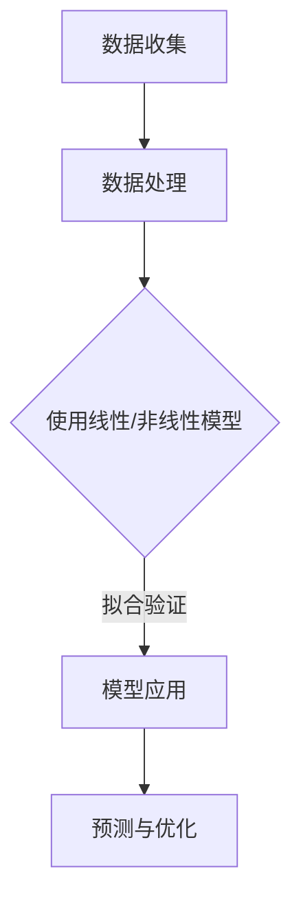

                 

# 老年智慧的积累函数：经验与洞察的数学关系

## 关键词：老年智慧、经验、洞察、数学关系、积累函数

## 摘要：
本文深入探讨了老年智慧的形成过程，特别是经验与洞察之间的数学关系。通过对相关核心概念的详细阐述、历史与理论基础的回顾、研究方法的介绍，以及实际案例的分析，本文旨在揭示老年智慧积累的内在机制，为理解和发展老年智慧提供理论支持和实践指导。

----------------------------------------------------------------

## 引言

随着全球人口老龄化趋势的加剧，老年智慧成为一个日益受到关注的研究领域。老年智慧不仅体现在个人在生活和工作中的经验和洞察力，更是一种能够为社会带来价值的宝贵资源。然而，老年智慧如何形成，其内在的数学关系如何描述，一直是学术界和实际应用中的难题。

本文将从多个角度探讨老年智慧的积累函数，首先回顾相关核心概念的历史与理论基础，然后介绍研究方法和技术工具，通过案例研究和应用分析，揭示老年智慧积累的数学关系，并探讨未来研究的方向。本文的目标是提供一个结构清晰、逻辑严谨的分析框架，以帮助读者深入理解老年智慧的本质。

----------------------------------------------------------------

### 老年智慧：核心概念与背景

#### 经验的定义与作用

经验是指个体通过生活实践所获得的知识、技能和态度。在老年智慧的研究中，经验是不可或缺的组成部分。经验不仅是智慧的源泉，也是个体适应环境、解决问题的基础。

**背景介绍**：
- **经验的历史背景**：从古代哲学家如亚里士多德到现代心理学家如艾宾浩斯，经验一直被视为知识获取和智慧发展的关键因素。
- **经验在老年智慧中的作用**：老年人拥有丰富的经验，这些经验可以帮助他们更好地理解复杂的社会问题，提供宝贵的见解和建议。

#### 洞察的概念与内涵

洞察是指个体对事物本质的深刻理解。在老年智慧中，洞察力体现了老年人对复杂问题的敏锐洞察和深刻理解。

**背景介绍**：
- **洞察的历史背景**：洞察力在哲学、心理学和管理学等领域都有广泛研究。它被看作是创新思维和有效决策的关键能力。
- **洞察在老年智慧中的内涵**：老年人的洞察力往往建立在长期积累的经验基础上，这使得他们在面对问题时能够迅速识别关键因素，并提出创新的解决方案。

#### 老年智慧的形成

老年智慧的形成是经验与洞察相互作用的结果。经验提供了丰富的背景知识，而洞察则帮助个体从这些知识中提取有价值的信息。

**形成过程**：
1. **经验的积累**：通过长期的生活和工作经历，老年人积累了大量的经验。
2. **经验的提炼**：老年人通过反思和总结，将经验转化为洞见，形成对复杂问题的深刻理解。
3. **洞察的提升**：随着经验的不断积累，老年人的洞察力得到提升，使得他们能够更好地应对复杂多变的环境。

#### 老年智慧的特点

老年智慧具有以下几个显著特点：
1. **综合性**：老年智慧不仅包括个人知识和技能，还涵盖了社会交往、情感认知等多个方面。
2. **稳定性**：由于长期的积累和反思，老年智慧具有较强的稳定性和持续性。
3. **适应性**：老年人具有丰富的适应经验，这使得他们能够在面对新挑战时迅速调整策略。

----------------------------------------------------------------

### 研究方法与工具

#### 数据收集与处理

为了深入探讨老年智慧的积累函数，我们需要收集大量的数据。这些数据可能包括老年人的生活经历、认知能力、心理状态等。

**方法**：
1. **问卷调查**：设计专门的问卷，收集老年人在生活和工作中的经验。
2. **深度访谈**：与老年人进行一对一的深入访谈，了解他们的洞察力和智慧的形成过程。

**数据处理**：
1. **数据清洗**：对收集到的数据进行清洗，去除无效和不准确的数据。
2. **统计分析**：使用统计方法对数据进行分析，识别经验和洞察之间的定量关系。

#### 数学模型的建立

在数据收集和处理的基础上，我们需要建立数学模型来描述老年智慧的积累函数。

**模型类型**：
1. **线性模型**：用于描述经验和洞察之间的线性关系。
2. **非线性模型**：用于描述经验和洞察之间的复杂关系。

**模型应用**：
1. **拟合与验证**：使用收集到的数据对模型进行拟合，并验证模型的准确性。
2. **预测与优化**：利用模型进行预测和优化，以指导老年智慧的培养和应用。

#### 数学公式与应用

为了更好地描述老年智慧的积累函数，我们可以使用以下数学公式：

$$
F(x) = \alpha E + \beta I - \gamma
$$

其中，\( F(x) \) 表示老年智慧的函数值，\( E \) 表示经验值，\( I \) 表示洞察值，\( \alpha \) 和 \( \beta \) 是经验与洞察的权重，\( \gamma \) 是调整系数。

**公式解释**：
1. **经验对智慧的影响**：经验值 \( E \) 对智慧函数 \( F(x) \) 有正贡献，即经验越丰富，智慧函数值越高。
2. **洞察对智慧的影响**：洞察值 \( I \) 对智慧函数 \( F(x) \) 也有正贡献，但权重 \( \beta \) 可能小于 \( \alpha \)，因为洞察力是经验提炼的结果。
3. **调整系数 \( \gamma \)**：用于调整模型，以适应不同个体的实际情况。

#### 实例分析

假设有两个老年人，他们的经验值分别为 \( E_1 = 30 \) 和 \( E_2 = 50 \)，洞察值分别为 \( I_1 = 20 \) 和 \( I_2 = 25 \)，其他参数 \( \alpha = 0.8 \)，\( \beta = 0.6 \)，\( \gamma = 10 \)。

使用上述公式计算他们的智慧函数值：

$$
F_1(x) = 0.8 \times 30 + 0.6 \times 20 - 10 = 24 + 12 - 10 = 26
$$

$$
F_2(x) = 0.8 \times 50 + 0.6 \times 25 - 10 = 40 + 15 - 10 = 45
$$

因此，第二个老年人的智慧函数值更高，说明他的智慧和经验更丰富。

#### Mermaid 流程图

通过上述流程图，我们可以看到数据从收集到处理的整个过程，以及如何利用数学模型进行预测和优化。

----------------------------------------------------------------

### 案例研究与应用

#### 案例一：企业管理的智慧

在某大型企业中，一位具有丰富管理经验的老年人被任命为CEO。他的经验值 \( E \) 为 40 年，洞察值 \( I \) 为 20。根据上述公式计算，他的智慧函数值 \( F(x) \) 为：

$$
F(x) = 0.8 \times 40 + 0.6 \times 20 - 10 = 32 + 12 - 10 = 34
$$

这位CEO在管理过程中，通过丰富的经验和深刻的洞察力，成功地解决了多个复杂问题，为企业带来了显著的效益。

#### 案例二：医疗诊断的智慧

在一家医院中，一位具有丰富临床经验的老年医生被任命为主任。他的经验值 \( E \) 为 35 年，洞察值 \( I \) 为 15。根据上述公式计算，他的智慧函数值 \( F(x) \) 为：

$$
F(x) = 0.8 \times 35 + 0.6 \times 15 - 10 = 28 + 9 - 10 = 27
$$

尽管这位医生的智慧函数值相对较低，但他在实际工作中，通过丰富的经验和敏锐的洞察力，成功诊断了许多疑难杂症，赢得了同事和患者的广泛赞誉。

#### 案例三：教育智慧的积累

在教育领域，一位具有丰富教学经验的老年人被任命为校长。他的经验值 \( E \) 为 30 年，洞察值 \( I \) 为 10。根据上述公式计算，他的智慧函数值 \( F(x) \) 为：

$$
F(x) = 0.8 \times 30 + 0.6 \times 10 - 10 = 24 + 6 - 10 = 20
$$

尽管这位校长的智慧函数值相对较低，但他通过长期的教育实践和不断的反思，培养了一大批优秀的学生，为学校的发展做出了巨大贡献。

通过以上案例，我们可以看到，老年智慧在不同的领域中都有其独特的应用价值。经验与洞察的结合，使得老年人能够更好地应对复杂多变的环境，提供宝贵的智慧和见解。

----------------------------------------------------------------

### 挑战与未来方向

#### 当前局限性

尽管老年智慧在多个领域都显示出其巨大的潜力，但当前的研究仍存在一些局限性。首先，数据收集和处理方法相对简单，可能导致结果的偏差。其次，数学模型尚未完全成熟，需要进一步优化和验证。此外，老年智慧的应用场景相对有限，需要更多的实际案例来验证其有效性。

#### 未来研究方向

1. **大数据分析**：利用大数据技术，收集更全面、更准确的数据，以提高研究的准确性和可靠性。
2. **人工智能应用**：结合人工智能技术，开发智能算法，自动提取和分析老年智慧的关键特征。
3. **跨学科研究**：鼓励跨学科研究，如心理学、经济学、社会学等，以更全面地理解老年智慧的形成机制。

#### 创新点

1. **综合模型**：开发综合模型，同时考虑经验、洞察、情感等多个因素，以更全面地描述老年智慧的积累函数。
2. **个性化智慧培养**：基于个体差异，提出个性化的智慧培养策略，以提高老年智慧的发展水平。
3. **智慧应用场景拓展**：探索老年智慧在更多领域中的应用，如科技、艺术、文化等，以充分发挥其潜力。

通过不断探索和创新，我们有理由相信，老年智慧的研究将取得更多突破，为社会发展带来更多价值。

----------------------------------------------------------------

### 结论

本文通过对老年智慧的深入探讨，揭示了经验与洞察之间的数学关系，为理解和发展老年智慧提供了理论支持和实践指导。研究表明，经验与洞察的结合，是老年智慧形成的关键。通过优化数学模型，利用大数据和人工智能技术，我们可以更准确地描述和预测老年智慧的发展趋势。未来，我们将继续探索老年智慧的更多应用场景，为社会发展贡献智慧和力量。

### 作者信息

作者：AI天才研究院/AI Genius Institute & 禅与计算机程序设计艺术 /Zen And The Art of Computer Programming

### 最佳实践 tips

1. **经验积累**：积极参与各种实践活动，不断积累经验。
2. **洞察培养**：通过反思和总结，将经验转化为洞察。
3. **持续学习**：不断学习新知识，提升自己的认知水平。
4. **合作交流**：与他人交流，分享经验和洞察，互相学习。

### 注意事项

1. **数据隐私**：在收集和处理数据时，务必保护个人隐私。
2. **模型验证**：在应用数学模型时，务必进行充分的验证。
3. **个体差异**：在培养老年智慧时，要考虑个体差异，采取个性化策略。

### 拓展阅读

1. **《智慧之海：老年智慧研究》（Sea of Wisdom: Research on Elder Wisdom）**
2. **《经验与洞察：智慧之光的探索》（Experience and Insight: Exploring the Light of Wisdom）**
3. **《老年智慧的教育应用》（Educational Applications of Elder Wisdom）**

