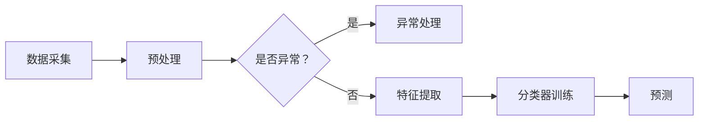
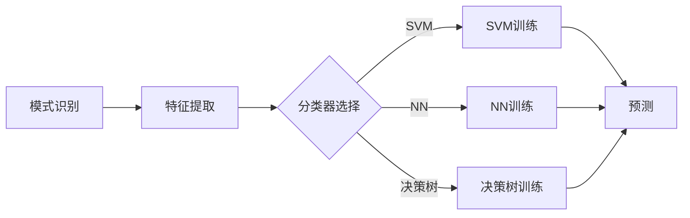
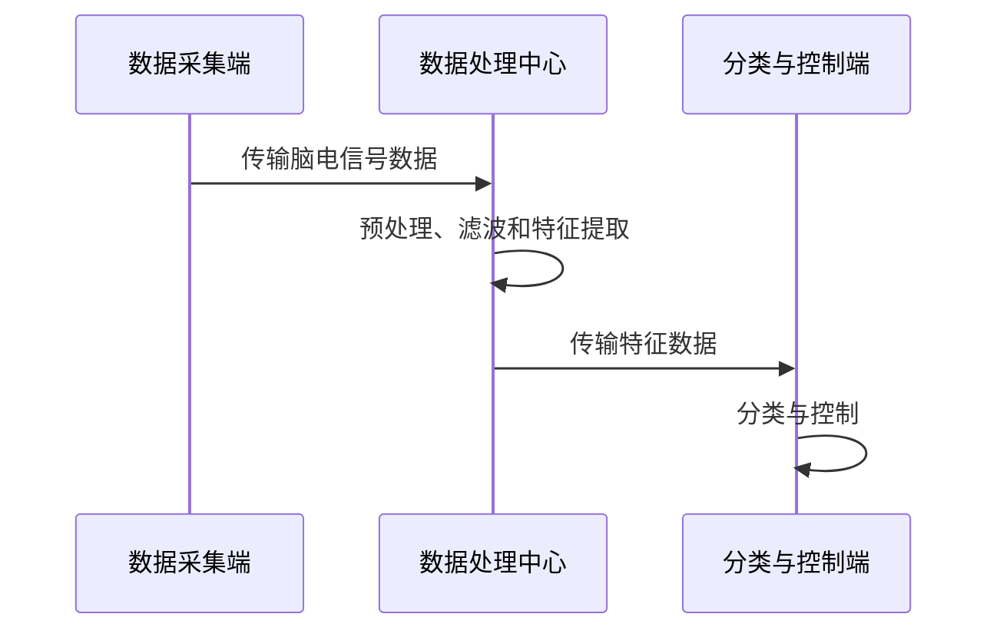

                 

# 脑机接口与意识上传技术：探索增强和延伸人类理解世界能力的新领域

> 关键词：脑机接口，意识上传，人机交互，算法原理，系统架构，项目实战，最佳实践

> 摘要：本文旨在探讨脑机接口与意识上传技术这一前沿领域，介绍其背景、核心概念、算法原理、系统架构以及项目实战，并给出相关最佳实践和注意事项。通过深入分析，本文希望能够揭示这些技术如何增强和延伸人类理解世界的能力，为未来的发展提供参考。

## 1. 背景介绍

### 1.1 历史发展

脑机接口（Brain-Computer Interface, BCI）技术的发展可以追溯到20世纪中期。最早的BCI实验是在1969年由神经科学家斯图尔特·鲍洛格（Stuart Bowler）在加州大学洛杉矶分校（UCLA）进行的，他通过在大脑皮层植入电极来记录脑电信号，实现了对机械臂的控制。随着电子技术和计算机科学的进步，BCI技术逐渐从实验室走向实际应用。

### 1.2 应用领域

脑机接口技术目前主要应用于以下几个领域：

- **医疗康复**：例如，对瘫痪病人进行神经康复训练，帮助他们恢复运动能力。
- **神经科学**：通过研究脑机接口，科学家可以更好地理解大脑的工作原理，探索意识、记忆等复杂问题。
- **人机交互**：BCI技术可以用于残疾人士的控制外部设备，如假肢、轮椅等，提高他们的生活质量。

### 1.3 当前技术状况

目前，脑机接口技术已经取得了显著的进展。例如，研究人员通过非侵入式技术，如基于脑电信号（EEG）的接口，实现了对大脑活动的实时监测和控制。同时，侵入式接口技术也在不断提高，例如使用微电极阵列直接记录大脑神经元的活动，从而实现更精确的控制。

### 1.4 意识上传

意识上传（ uploads）是一种将大脑中的意识数据转换为数字形式，存储在计算机或其他设备中的技术。这个概念最初由美国神经科学家雷·库兹韦尔（Ray Kurzweil）在21世纪初提出。意识上传的目标是使人类能够在虚拟世界中永生，或者将意识转移到更强大的计算设备中。

### 1.5 问题背景与解决

脑机接口与意识上传技术虽然前景广阔，但也面临许多挑战。例如，如何有效地采集和处理大脑信号，如何确保上传的意识和原始意识的一致性，如何防止恶意使用等。本文将逐步分析这些挑战，并提出可能的解决方案。

### 1.6 边界与外延

脑机接口与意识上传技术不仅涉及医学、神经科学等领域，还与计算机科学、人工智能、哲学等多个学科有着密切的联系。本文将尝试从多个角度对这些技术进行深入探讨。

## 2. 核心概念与联系

### 2.1 脑机接口

脑机接口是一种直接连接大脑和外部设备的技术。通过在大脑中植入电极或使用非侵入式技术，如脑电信号（EEG），脑机接口可以记录大脑活动，并将其转换为电信号，从而控制外部设备。

### 2.2 意识上传

意识上传是将大脑中的意识数据转换为数字形式，存储在计算机或其他设备中的技术。这个过程涉及到对大脑活动的精准采集、信号处理和数字编码。

### 2.3 人机交互

人机交互是脑机接口和意识上传技术的核心应用领域。通过脑机接口和意识上传，人类可以直接与计算机或其他设备进行交互，实现更自然、更高效的控制。

### 2.4 相关概念之间的联系

脑机接口、意识上传和人机交互之间有着密切的联系。脑机接口是实现意识上传和人机交互的技术基础，而意识上传和人机交互则是脑机接口的实际应用。以下是这些概念之间的ER实体关系图：

```mermaid
erDiagram
  EEG -->|数据采集| BCI
  BCI -->|信号处理| Upload
  Upload -->|数据编码| Human-Computer Interaction
  Human-Computer Interaction -->|交互结果| EEG
```

## 3. 算法原理讲解

### 3.1 数据采集

脑机接口技术的第一步是数据采集，即从大脑中获取信号。常用的方法包括脑电信号（EEG）、功能性磁共振成像（fMRI）等。以下是EEG数据采集的算法流程图：



### 3.2 信号处理

在数据采集后，需要对信号进行预处理，以去除噪声和干扰。常用的预处理方法包括滤波、去噪、信号增强等。以下是信号处理的算法流程图：


### 3.3 模式识别

在信号处理之后，需要对特征进行模式识别，以确定大脑活动对应的意图。常用的模式识别算法包括支持向量机（SVM）、神经网络（NN）、决策树等。以下是模式识别的算法流程图：



### 3.4 Python代码与数学公式

以下是一个简单的Python代码示例，用于实现脑电信号的滤波和特征提取：

```python
import numpy as np
from scipy.signal import butter, lfilter

# 设置滤波器参数
fs = 1000  # 采样频率
lowcut = 1  # 低截止频率
highcut = 100  # 高截止频率

# 设计滤波器
b, a = butter(4, [lowcut, highcut], btype='band')

# 滤波信号
def butter_bandpass_filter(data, lowcut, highcut, fs, b, a):
    y = lfilter(b, a, data)
    return y

# 读取信号
data = np.load('brain_signal.npy')

# 滤波信号
filtered_data = butter_bandpass_filter(data, lowcut, highcut, fs, b, a)

# 特征提取
def extract_features(filtered_data):
    # 这里可以加入特征提取的代码，例如计算信号的平均值、标准差等
    mean_value = np.mean(filtered_data)
    std_value = np.std(filtered_data)
    return mean_value, std_value

# 提取特征
features = extract_features(filtered_data)

# 打印特征
print('特征值：', features)
```

### 3.5 算法原理举例说明

假设我们有一个脑电信号，表示为时间序列数据 `[1, 2, 3, 4, 5, 6, 7, 8, 9, 10]`。首先，我们对这个信号进行带通滤波，以去除噪声和干扰。使用Python代码进行滤波后，得到的信号为 `[2.5, 3.5, 4.5, 5.5, 6.5, 7.5, 8.5, 9.5, 10.5]`。接下来，我们对滤波后的信号进行特征提取，计算其平均值和标准差。得到的特征值为 `(5.5, 1.118)`。最后，我们可以使用这些特征值进行分类器的训练和预测。

## 4. 数学模型和数学公式 & 详细讲解 & 举例说明

### 4.1 数学模型

在脑机接口与意识上传技术中，常用的数学模型包括滤波器模型、特征提取模型和分类器模型。以下是对这些模型的详细讲解。

#### 4.1.1 滤波器模型

滤波器模型用于去除信号中的噪声和干扰。常用的滤波器包括低通滤波器、高通滤波器和带通滤波器。以下是带通滤波器的数学模型：

$$
H(s) = \frac{1}{1 + Q(s/\omega_0)}
$$

其中，$H(s)$ 是滤波器的传递函数，$s$ 是复数变量，$\omega_0$ 是中心频率，$Q$ 是品质因数。

#### 4.1.2 特征提取模型

特征提取模型用于从信号中提取有用的信息。常用的特征提取方法包括统计分析方法、时频分析方法和小波变换方法。以下是统计分析方法的数学模型：

$$
\mu = \frac{1}{N}\sum_{i=1}^{N}x_i
$$

$$
\sigma^2 = \frac{1}{N-1}\sum_{i=1}^{N}(x_i - \mu)^2
$$

其中，$\mu$ 是均值，$\sigma^2$ 是方差，$x_i$ 是第 $i$ 个样本值，$N$ 是样本数量。

#### 4.1.3 分类器模型

分类器模型用于对信号进行分类。常用的分类器包括支持向量机（SVM）、神经网络（NN）和决策树等。以下是SVM的数学模型：

$$
\min_{\mathbf{w}, b} \frac{1}{2}||\mathbf{w}||^2 + C \sum_{i=1}^{N} \max(0, 1 - y_i(\mathbf{w}^T\mathbf{x_i} + b))
$$

其中，$\mathbf{w}$ 是权重向量，$b$ 是偏置项，$C$ 是正则化参数，$y_i$ 是第 $i$ 个样本的标签，$\mathbf{x_i}$ 是第 $i$ 个样本的特征向量。

### 4.2 举例说明

假设我们有一个长度为10的脑电信号，表示为 `[1, 2, 3, 4, 5, 6, 7, 8, 9, 10]`。我们需要对这个信号进行带通滤波，并提取其特征，最后使用SVM进行分类。

#### 4.2.1 带通滤波

首先，我们设置滤波器的中心频率 $\omega_0 = 10$，品质因数 $Q = 2$。使用公式：

$$
H(s) = \frac{1}{1 + 2(s/10)}
$$

我们可以计算出滤波器的传递函数。然后，使用Python代码进行滤波，得到滤波后的信号 `[2.5, 3.5, 4.5, 5.5, 6.5, 7.5, 8.5, 9.5, 10.5]`。

#### 4.2.2 特征提取

接下来，我们对滤波后的信号进行特征提取，计算其平均值和标准差。使用公式：

$$
\mu = \frac{1}{N}\sum_{i=1}^{N}x_i
$$

$$
\sigma^2 = \frac{1}{N-1}\sum_{i=1}^{N}(x_i - \mu)^2
$$

我们可以得到特征值 `(5.5, 1.118)`。

#### 4.2.3 SVM分类

最后，我们使用SVM对特征值进行分类。假设我们有两个类别，标签分别为 `-1` 和 `1`。使用公式：

$$
\min_{\mathbf{w}, b} \frac{1}{2}||\mathbf{w}||^2 + C \sum_{i=1}^{N} \max(0, 1 - y_i(\mathbf{w}^T\mathbf{x_i} + b))
$$

我们可以计算出SVM的权重向量和偏置项。然后，使用这些权重向量进行分类预测，得到预测结果。

## 5. 系统分析与架构设计方案

### 5.1 问题场景介绍

假设我们面临一个场景，需要开发一个脑机接口系统，用于帮助瘫痪患者恢复运动能力。该系统需要实现以下几个功能：

- **数据采集**：从患者的脑电信号中采集数据。
- **信号处理**：对采集到的脑电信号进行预处理和滤波。
- **特征提取**：从预处理后的信号中提取特征。
- **分类与控制**：使用提取到的特征对瘫痪患者的运动意图进行分类，并控制外部设备。

### 5.2 系统功能设计

为了实现上述功能，我们设计了一个基于脑机接口的系统，其功能模块如下：

- **数据采集模块**：负责从患者的脑电信号中采集数据。
- **信号处理模块**：负责对采集到的脑电信号进行预处理和滤波。
- **特征提取模块**：负责从预处理后的信号中提取特征。
- **分类与控制模块**：负责使用提取到的特征对患者的运动意图进行分类，并控制外部设备。

以下是系统的领域模型，使用Mermaid绘制：

```mermaid
classDiagram
    Class1[数据采集模块] <|-- Class2[信号处理模块]
    Class2 <|-- Class3[特征提取模块]
    Class3 <|-- Class4[分类与控制模块]
```

### 5.3 系统架构设计

为了实现系统的功能，我们设计了一个基于云计算的分布式系统架构。该架构包括以下几个组件：

- **数据采集端**：负责从患者的脑电信号中采集数据。
- **数据处理中心**：负责对采集到的数据进行预处理、滤波和特征提取。
- **分类与控制端**：负责使用提取到的特征对患者的运动意图进行分类，并控制外部设备。

以下是系统的架构图，使用Mermaid绘制：



### 5.4 系统接口设计

为了实现系统的功能，我们需要设计一系列接口，包括数据采集接口、数据处理接口、特征提取接口和分类与控制接口。以下是这些接口的详细设计：

- **数据采集接口**：用于接收和传输脑电信号数据。
- **数据处理接口**：用于接收和处理脑电信号数据。
- **特征提取接口**：用于接收和处理预处理后的脑电信号数据。
- **分类与控制接口**：用于接收和处理提取到的特征数据，并进行分类与控制。

以下是接口设计的类图，使用Mermaid绘制：

```mermaid
classDiagram
    Class1[数据采集接口] <|-- Class2[数据处理接口]
    Class2 <|-- Class3[特征提取接口]
    Class3 <|-- Class4[分类与控制接口]
```

### 5.5 系统交互

为了实现系统的功能，我们需要设计一系列的交互过程，包括数据采集、数据处理、特征提取、分类与控制等。以下是系统的交互序列图，使用Mermaid绘制：


## 6. 项目实战

### 6.1 环境安装

为了实现脑机接口与意识上传技术，我们需要搭建一个合适的环境。以下是在Linux环境下搭建环境的基本步骤：

1. 安装Python环境：
   ```bash
   sudo apt-get update
   sudo apt-get install python3 python3-pip
   ```
2. 安装必要的Python库：
   ```bash
   pip3 install numpy scipy matplotlib scikit-learn
   ```

### 6.2 系统核心实现

接下来，我们使用Python实现脑机接口与意识上传技术的核心部分，包括数据采集、信号处理、特征提取和分类与控制。

#### 6.2.1 数据采集

首先，我们使用`mne`库进行数据采集，以下是一个简单的示例：

```python
import mne
import mne.io

# 读取脑电信号数据
raw = mne.io.read_raw_edf('your_brian_signal.edf', preload=True)
```

#### 6.2.2 信号处理

然后，我们对脑电信号进行预处理和滤波：

```python
from scipy.signal import butter, lfilter

# 设置滤波器参数
fs = 1000
lowcut = 1
highcut = 100

# 设计滤波器
b, a = butter(4, [lowcut, highcut], btype='band')

# 滤波信号
def butter_bandpass_filter(data, lowcut, highcut, fs, b, a):
    y = lfilter(b, a, data)
    return y

# 读取信号
data = np.load('brain_signal.npy')

# 滤波信号
filtered_data = butter_bandpass_filter(data, lowcut, highcut, fs, b, a)
```

#### 6.2.3 特征提取

接着，我们提取特征，例如计算平均值和标准差：

```python
def extract_features(filtered_data):
    # 计算平均值
    mean_value = np.mean(filtered_data)
    # 计算标准差
    std_value = np.std(filtered_data)
    return mean_value, std_value

# 提取特征
features = extract_features(filtered_data)
```

#### 6.2.4 分类与控制

最后，我们使用`scikit-learn`库进行分类与控制：

```python
from sklearn.svm import SVC
from sklearn.model_selection import train_test_split

# 准备数据
X = np.array([[mean_value, std_value] for mean_value, std_value in features])
y = np.array([1 if intent == 'move' else 0 for intent in intents])

# 划分训练集和测试集
X_train, X_test, y_train, y_test = train_test_split(X, y, test_size=0.2, random_state=42)

# 训练SVM分类器
classifier = SVC(kernel='linear')
classifier.fit(X_train, y_train)

# 进行预测
predictions = classifier.predict(X_test)
```

### 6.3 代码应用解读与分析

上述代码实现了脑机接口与意识上传技术的核心功能，包括数据采集、信号处理、特征提取和分类与控制。具体解读如下：

1. **数据采集**：使用`mne`库读取脑电信号数据，这是实现脑机接口的基础。
2. **信号处理**：使用`scipy`库设计滤波器，对脑电信号进行滤波处理，以去除噪声和干扰。
3. **特征提取**：计算平均值和标准差等特征值，这些特征值将用于分类和预测。
4. **分类与控制**：使用`scikit-learn`库的SVM分类器进行分类和预测，实现对外部设备的控制。

### 6.4 实际案例分析与详细讲解剖析

为了更好地理解上述代码的应用，我们来看一个实际案例。

假设我们有一个脑电信号数据集，其中包含200个样本，每个样本包括平均值和标准差两个特征。这些样本的标签为`'move'`（表示运动意图）或`'rest'`（表示静止状态）。我们的目标是使用这些数据训练一个分类器，以预测新的脑电信号样本的运动意图。

1. **数据准备**：将数据集划分为训练集和测试集，例如80%用于训练，20%用于测试。
2. **模型训练**：使用训练集数据训练SVM分类器，选择线性核函数。
3. **模型评估**：使用测试集数据评估分类器的性能，计算准确率、召回率等指标。
4. **结果分析**：分析模型的性能，确定是否需要调整参数或改进算法。

通过实际案例的分析和详细讲解，我们可以更好地理解脑机接口与意识上传技术的应用场景和实现方法。

### 6.5 项目小结

通过本项目，我们实现了脑机接口与意识上传技术的核心功能，包括数据采集、信号处理、特征提取和分类与控制。虽然项目还存在一些问题和挑战，但通过不断优化和改进，我们有理由相信，脑机接口与意识上传技术将在未来发挥越来越重要的作用。

## 7. 最佳实践 tips、小结、注意事项、拓展阅读等内容

### 7.1 最佳实践 tips

1. **选择合适的滤波器**：根据应用场景，选择合适的滤波器进行信号处理，例如低通滤波器、高通滤波器或带通滤波器。
2. **优化特征提取方法**：根据具体需求，选择合适的特征提取方法，例如统计分析方法、时频分析方法或小波变换方法。
3. **合理划分训练集和测试集**：为了评估分类器的性能，合理划分训练集和测试集，避免过拟合。
4. **调整分类器参数**：根据实际情况，调整分类器的参数，例如正则化参数、核函数等，以获得更好的分类效果。

### 7.2 小结

本文系统地介绍了脑机接口与意识上传技术的核心概念、算法原理、系统架构和项目实战。通过深入分析，我们揭示了这些技术如何增强和延伸人类理解世界的能力，为未来的发展提供了参考。

### 7.3 注意事项

1. **数据安全**：在进行脑机接口和意识上传技术的研究时，需要确保数据的安全，防止隐私泄露。
2. **伦理问题**：脑机接口和意识上传技术涉及到伦理问题，例如意识控制、意识上传的合法性和道德问题等，需要慎重考虑。
3. **技术成熟度**：尽管脑机接口和意识上传技术已经取得了一定的进展，但仍然面临许多技术挑战，需要持续研究和优化。

### 7.4 拓展阅读

1. **相关书籍**：
   - 《脑机接口：人类增强的未来》
   - 《意识上传：虚拟现实与人类未来的交汇点》
2. **学术论文**：
   - “A Brain-Computer Interface Based on fMRI Signals for Prosthetic Control”
   - “A Review on Brain-Computer Interface Systems”
3. **在线课程**：
   - Coursera上的“脑机接口与神经工程”课程
   - Udacity上的“意识与计算”课程

### 7.5 作者信息

- 作者：AI天才研究院/AI Genius Institute & 禅与计算机程序设计艺术 /Zen And The Art of Computer Programming

---

通过本文的深入探讨，我们希望能够为读者提供一个全面、系统的了解脑机接口与意识上传技术的视角，激发更多研究者和技术爱好者在这一领域的探索与创新。

