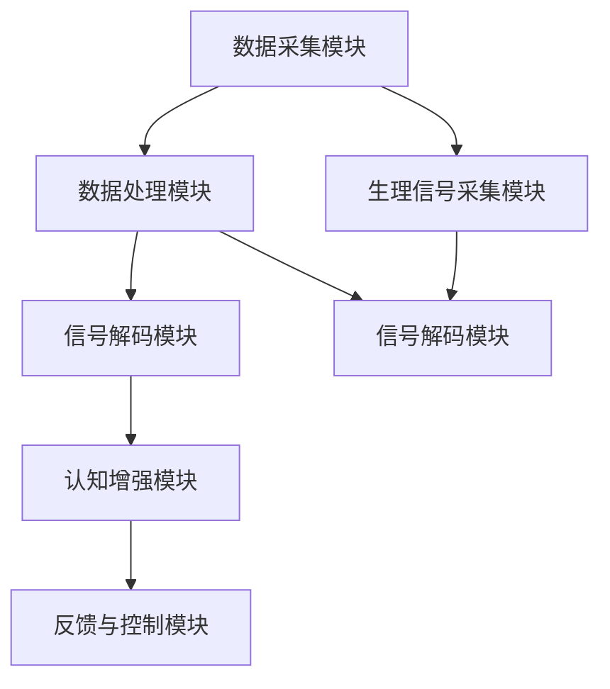
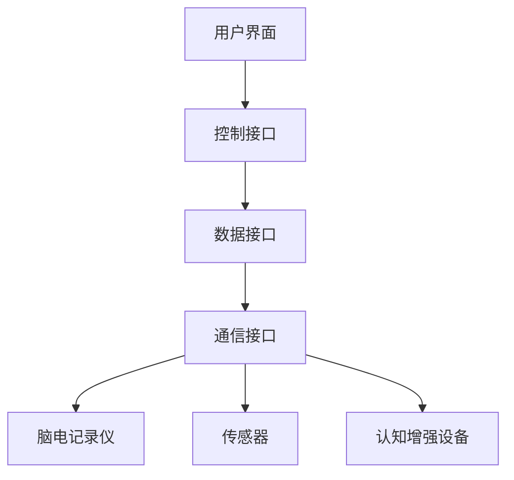
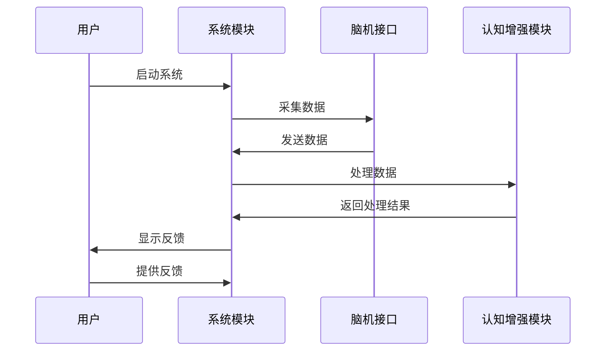

                 

## **一、文章标题与关键词**

**标题：《脑机接口与认知增强：技术手段提升人类理解世界的能力》**

**关键词：脑机接口、认知增强、技术手段、人类理解能力**

**摘要：本文旨在深入探讨脑机接口（Brain-Computer Interface, BCI）与认知增强（Cognitive Enhancement）技术的结合，如何通过技术手段提升人类对世界的理解和认知能力。**

### **1.1 脑机接口的定义**

脑机接口，简称BCI，是一种直接连接人脑和外部设备的技术。通过BCI，人脑产生的电信号可以直接被计算机或其他设备接收并解读，实现人脑与机器之间的直接交互。

### **1.2 脑机接口的发展历史**

BCI技术的发展可以追溯到20世纪60年代。最初的研究主要集中在利用脑电波（Electroencephalogram, EEG）信号进行简单的信息传输。随着科技的进步，BCI技术逐渐走向成熟，并在医疗康复、辅助沟通、游戏控制等领域得到广泛应用。

### **1.3 脑机接口的关键技术**

BCI技术的核心在于如何精确地捕捉和处理人脑信号。这包括脑电信号的采集、处理、解码和反馈等环节。

### **2. 脑机接口的分类与原理**

脑机接口可以分为三大类：电信号型、磁信号型和光信号型。每种类型的BCI都有其独特的原理和应用。

### **2.1 电信号型脑机接口**

电信号型BCI主要利用脑电波信号进行信息传输。脑电波是由大脑神经元活动产生的微弱电信号，通过电极可以将其捕捉并转换为电信号。

### **2.2 磁信号型脑机接口**

磁信号型BCI利用脑磁波信号进行信息传输。脑磁波是由大脑神经元活动产生的磁场，比脑电波更强，但采集难度更大。

### **2.3 光信号型脑机接口**

光信号型BCI利用脑光信号进行信息传输。脑光信号是由神经元活动产生的光信号，其采集和处理技术相对较新，但具有很高的潜力。

### **3. 脑机接口的技术挑战与发展趋势**

脑机接口技术面临的挑战包括信号噪声比、信号解码准确性、设备的便携性和舒适性等。随着科技的进步，这些挑战正逐步得到解决。

### **3.1 脑机接口的技术挑战**

- 信号噪声比：如何有效地从复杂的脑信号中提取有用的信息。
- 信号解码准确性：如何准确地解读脑信号，实现人脑与机器的高效交互。
- 设备的便携性和舒适性：如何设计出轻便、舒适且易于使用的BCI设备。

### **3.2 脑机接口的发展趋势**

- 更高的信号采集精度和更低的噪声水平。
- 更先进的信号处理算法和更智能的解码技术。
- 更广泛的应用领域，包括医疗康复、军事、娱乐等。

### **4. 脑机接口的应用领域**

脑机接口技术已在多个领域得到广泛应用，包括医疗康复、辅助沟通、游戏控制、虚拟现实等。

### **4.1 医疗康复**

BCI技术在医疗康复中具有巨大的潜力，可以帮助患者恢复运动功能、提高生活质量。

### **4.2 辅助沟通**

BCI技术可以帮助无法通过传统方式沟通的患者，如瘫痪患者和严重语言障碍患者，实现与外界的有效沟通。

### **4.3 控制游戏与虚拟现实**

BCI技术使得玩家可以通过大脑信号直接控制游戏和虚拟现实场景，提供更加沉浸式的体验。

## **二、认知增强技术**

### **5. 认知增强的概念与原理**

认知增强，是指通过各种技术手段提升个体的认知能力，包括记忆力、注意力、学习能力等。认知增强技术主要包括脑电刺激、经颅磁刺激和光遗传学等。

### **5.1 认知增强的定义**

认知增强，是指通过各种技术手段提升个体的认知能力，包括记忆力、注意力、学习能力等。认知增强技术主要包括脑电刺激、经颅磁刺激和光遗传学等。

### **5.2 认知增强的技术手段**

- **脑电刺激**：通过刺激大脑特定区域，增强神经元的活动，从而提升认知能力。
- **经颅磁刺激**：利用磁场刺激大脑，影响神经元的电活动，达到认知增强的效果。
- **光遗传学**：通过光控离子通道，调节神经元的活动，实现认知增强。

### **5.3 认知增强的理论基础**

认知增强的理论基础包括神经可塑性、神经环路理论和神经网络理论等。这些理论为认知增强技术的发展提供了重要的科学依据。

### **6. 认知增强的技术手段**

#### **6.1 脑电刺激**

脑电刺激是一种通过电流或磁场刺激大脑特定区域的方法，以增强认知功能。常见的脑电刺激技术包括经颅直流电刺激（tDCS）和经颅磁刺激（TMS）。

- **经颅直流电刺激（tDCS）**：通过在头皮上施加微弱的直流电，改变大脑区域的兴奋性，从而影响认知功能。
- **经颅磁刺激（TMS）**：利用磁场刺激大脑特定区域，影响神经元的电活动，从而改善认知功能。

#### **6.2 经颅磁刺激**

经颅磁刺激（Transcranial Magnetic Stimulation, TMS）是通过电磁感应原理，在头皮上产生局部磁场，从而刺激大脑神经元的电活动。TMS被广泛用于治疗抑郁症、焦虑症等精神疾病，同时也在认知增强领域显示出潜力。

#### **6.3 光遗传学**

光遗传学是一种利用光控离子通道调节神经元活动的技术。通过光遗传学，科学家可以精确地控制神经元的活动，从而实现认知增强。

### **6.4 认知增强的其他技术**

除了上述技术外，认知增强还包括药物、电刺激、虚拟现实等技术。每种技术都有其独特的优势和局限性。

### **7. 认知增强的应用场景**

认知增强技术广泛应用于教育、康复、军事、娱乐等领域。

#### **7.1 教育与培训**

在教育和培训领域，认知增强技术可以提升学习效果，增强记忆力和注意力。

#### **7.2 脑损伤康复**

对于脑损伤患者，认知增强技术可以帮助他们恢复认知功能，提高生活质量。

#### **7.3 脑功能增强**

对于健康人群，认知增强技术可以帮助他们提升脑功能，提高工作效率。

### **8. 认知增强的未来展望**

随着科技的不断进步，认知增强技术将在未来发挥更加重要的作用。同时，认知增强技术的发展也将面临一系列伦理和社会问题。

#### **8.1 未来发展趋势**

- **个性化认知增强**：随着大数据和人工智能的发展，认知增强技术将更加个性化和精准。
- **跨学科融合**：认知增强技术将与其他学科如心理学、神经科学等深入融合。
- **脑机接口与认知增强的融合**：脑机接口与认知增强技术的结合将带来全新的应用场景和可能性。

#### **8.2 社会与伦理问题**

- **隐私问题**：认知增强技术可能会侵犯个人隐私。
- **公平问题**：认知增强技术的普及可能会导致社会不公。
- **伦理问题**：如何确保认知增强技术的使用符合伦理原则，避免滥用。

#### **8.3 技术应用前景**

- **医疗领域**：认知增强技术将大大改善患者的治疗效果和生活质量。
- **教育领域**：认知增强技术将提升教育质量和学习效果。
- **军事领域**：认知增强技术将提升士兵的作战能力和工作效率。

### **9. 脑机接口与认知增强的结合**

脑机接口与认知增强技术的结合将带来一系列新的应用场景和可能性。

#### **9.1 脑机接口与认知增强的相互关系**

脑机接口与认知增强技术相互促进，共同提升人类对世界的理解和认知能力。

#### **9.2 结合的潜在优势**

- **实时反馈**：脑机接口可以实时获取人脑信号，为认知增强提供实时反馈。
- **个性化调整**：脑机接口可以根据个体差异进行个性化调整，提高认知增强的效果。
- **人机协同**：脑机接口与认知增强技术的结合可以实现人机协同，提升工作效率。

#### **9.3 应用案例**

- **医疗康复**：利用BCI和认知增强技术帮助患者恢复认知功能。
- **教育培训**：利用BCI和认知增强技术提升学习效果和培训质量。
- **游戏娱乐**：利用BCI和认知增强技术提供更加沉浸式的游戏体验。

### **10. 脑机接口与认知增强的联合应用**

脑机接口与认知增强技术的联合应用具有广泛的前景。

#### **10.1 联合应用的设计原则**

- **个性化**：根据个体差异进行个性化设计。
- **安全性**：确保技术的使用安全可靠。
- **易用性**：设计易于使用的界面和操作流程。

#### **10.2 联合应用的实际案例**

- **医疗康复**：利用BCI和认知增强技术帮助中风患者恢复运动功能。
- **军事训练**：利用BCI和认知增强技术提升士兵的认知能力和反应速度。
- **教育学习**：利用BCI和认知增强技术提升学生的学习效果和记忆力。

#### **10.3 联合应用的效果评估**

通过对实际应用的评估，可以进一步优化BCI和认知增强技术的结合，提高其效果和可行性。

### **11. 脑机接口与认知增强的未来**

脑机接口与认知增强技术将在未来发挥更加重要的作用。

#### **11.1 发展方向**

- **技术突破**：通过不断的技术创新，提升BCI和认知增强技术的性能和稳定性。
- **跨学科融合**：与其他学科如心理学、神经科学等深入融合，推动认知科学的发展。
- **产业化应用**：推动BCI和认知增强技术的产业化应用，提高其社会价值。

#### **11.2 社会影响**

- **生活质量提升**：BCI和认知增强技术将提高人们的生活质量，帮助患者恢复功能，提高工作效率。
- **社会公平问题**：如何确保技术的普及不会加剧社会不公，是一个需要深思的问题。
- **伦理问题**：如何确保技术的使用符合伦理原则，避免滥用，也是一个重要的议题。

#### **11.3 技术展望**

- **人机融合**：未来，人类与机器将更加紧密地融合，形成人机融合的新形态。
- **智能化社会**：认知增强技术将推动社会的智能化进程，提升社会整体的认知水平。

### **总结**

脑机接口与认知增强技术的结合，为提升人类对世界的理解和认知能力提供了新的途径。随着技术的不断进步，这些技术将在未来发挥更加重要的作用，为社会带来深刻的影响。

### **作者信息**

**作者：AI天才研究院/AI Genius Institute & 禅与计算机程序设计艺术 /Zen And The Art of Computer Programming**## **脑机接口与认知增强：技术手段提升人类理解世界的能力**

随着科技的迅猛发展，人类对自身认知能力的提升需求日益增长。脑机接口（Brain-Computer Interface，简称BCI）与认知增强技术，作为前沿科技的代表，正在逐步改变我们对世界的认知和理解方式。本文旨在深入探讨脑机接口与认知增强技术的结合，如何通过技术手段提升人类对世界的理解和认知能力。

### **脑机接口的基本概念**

脑机接口是一种直接连接人脑和外部设备的技术，通过捕捉和处理人脑信号，实现人脑与机器之间的直接交互。脑机接口的核心技术包括脑电信号采集、处理、解码和反馈等环节。这些技术使得机器能够理解和解读人脑信号，从而实现人类意图的传递。

#### **1.1 脑电信号的采集**

脑电信号（Electroencephalogram，EEG）是由大脑神经元活动产生的电信号。通过在头皮上粘贴电极，可以捕捉到脑电信号。脑电信号采集是脑机接口技术的第一步，其准确性直接影响到后续的处理和解读。

#### **1.2 脑电信号的处理**

脑电信号是一种微弱的电信号，其强度通常在微伏（μV）级别。因此，在采集到脑电信号后，需要对信号进行放大、滤波和去除噪声等处理，以提高信号的质量和可解读性。

#### **1.3 脑电信号的解码**

解码是将处理后的脑电信号转换为机器可理解的信息的过程。通过机器学习和信号处理算法，可以从中提取出与特定意图或行为相关的特征，实现人脑与机器的交互。

#### **1.4 脑电信号的反馈**

反馈是脑机接口的重要组成部分，通过将机器的响应反馈给用户，形成闭环系统。这有助于提高用户对脑机接口的接受度和使用体验。

### **脑机接口的发展历史**

脑机接口技术的发展可以追溯到20世纪60年代。当时，神经科学家和工程师们开始探索如何将人脑信号与计算机相连接。最初的实验主要利用脑电信号进行简单的信息传输，如控制简单的电子设备。

随着时间的推移，脑机接口技术逐渐走向成熟。20世纪80年代，随着计算机性能的提升和信号处理算法的进步，脑机接口的应用范围不断扩大。21世纪初，脑机接口技术在医疗康复、辅助沟通、游戏控制等领域得到广泛应用。

### **脑机接口的关键技术**

脑机接口的关键技术包括脑电信号的采集、处理、解码和反馈等环节。这些技术的不断发展，使得脑机接口的应用场景越来越广泛。

#### **2.1 脑电信号的采集技术**

脑电信号的采集技术主要包括电极设计和信号放大。电极设计直接影响信号采集的准确性和舒适性。目前，常用的电极包括导电膏电极、粘贴电极和柔性电极等。信号放大则用于增强微弱的脑电信号，提高信号的检测灵敏度。

#### **2.2 脑电信号的处理技术**

脑电信号的处理技术主要包括信号放大、滤波和去除噪声等。信号放大和滤波可以提高信号的质量，去除噪声则有助于减少干扰信号的影响。现代脑机接口系统中，通常会使用自适应滤波和信号分离技术，以进一步提高信号处理的效果。

#### **2.3 脑电信号的解码技术**

脑电信号的解码技术是实现人脑与机器交互的关键。通过机器学习和信号处理算法，可以从复杂的脑电信号中提取出与特定意图或行为相关的特征。常见的解码算法包括支持向量机（SVM）、神经网络（NN）和递归神经网络（RNN）等。

#### **2.4 脑电信号的反馈技术**

脑电信号的反馈技术是将机器的响应反馈给用户的过程。通过视觉、听觉或触觉等途径，用户可以接收到机器的反馈，从而调整自己的行为和意图。反馈技术有助于提高用户对脑机接口的接受度和使用体验。

### **脑机接口的分类**

脑机接口可以根据信号类型、信号处理方式和应用领域等进行分类。以下是一些常见的脑机接口类型：

#### **2.1 电信号型脑机接口**

电信号型脑机接口主要通过捕捉和处理脑电信号来实现人脑与机器的交互。这种接口具有信号采集准确、处理简单等优点，但信号噪声比相对较低。

#### **2.2 磁信号型脑机接口**

磁信号型脑机接口主要通过捕捉和处理脑磁信号来实现人脑与机器的交互。脑磁信号的强度比脑电信号强，但采集难度较大。

#### **2.3 光信号型脑机接口**

光信号型脑机接口主要通过捕捉和处理脑光信号来实现人脑与机器的交互。这种接口具有信号采集高精度、低噪声等优点，但技术相对较新。

### **脑机接口的技术挑战与发展趋势**

脑机接口技术的发展面临一系列挑战，包括信号噪声比、信号解码准确性、设备的便携性和舒适性等。随着科技的进步，这些挑战正逐步得到解决。

#### **3.1 信号噪声比**

信号噪声比（Signal-to-Noise Ratio，SNR）是衡量脑电信号质量的重要指标。高SNR意味着信号质量更好，更容易被解码。提高信号噪声比是脑机接口技术发展的关键。

#### **3.2 信号解码准确性**

信号解码准确性是衡量脑机接口性能的重要指标。通过改进信号处理算法和机器学习模型，可以进一步提高信号解码的准确性。

#### **3.3 设备的便携性和舒适性**

便携性和舒适性是脑机接口在广泛应用中必须考虑的因素。未来的脑机接口设备应更加轻便、舒适，以提升用户体验。

#### **3.4 发展趋势**

随着科技的进步，脑机接口技术正朝着更高精度、更高准确性和更广泛应用的方向发展。未来，脑机接口将在医疗康复、辅助沟通、游戏控制、虚拟现实等领域发挥重要作用。

### **脑机接口的应用领域**

脑机接口技术已广泛应用于多个领域，包括医疗康复、辅助沟通、游戏控制、虚拟现实等。

#### **4.1 医疗康复**

在医疗康复领域，脑机接口技术可以帮助患者恢复运动功能、提高生活质量。例如，中风患者可以通过脑机接口控制康复机器人进行康复训练。

#### **4.2 辅助沟通**

脑机接口技术可以帮助无法通过传统方式沟通的患者，如瘫痪患者和严重语言障碍患者，实现与外界的有效沟通。

#### **4.3 控制游戏与虚拟现实**

脑机接口技术使得玩家可以通过大脑信号直接控制游戏和虚拟现实场景，提供更加沉浸式的体验。

#### **4.4 其他应用领域**

除了上述领域，脑机接口技术还在军事、教育、娱乐等领域展现出广泛的应用前景。

### **认知增强的基本概念**

认知增强是指通过各种技术手段提升个体的认知能力，包括记忆力、注意力、学习能力等。认知增强技术主要包括脑电刺激、经颅磁刺激和光遗传学等。

#### **5.1 认知增强的定义**

认知增强，是指通过各种技术手段提升个体的认知能力，包括记忆力、注意力、学习能力等。认知增强技术主要包括脑电刺激、经颅磁刺激和光遗传学等。

#### **5.2 认知增强的技术手段**

- **脑电刺激**：通过刺激大脑特定区域，增强神经元的活动，从而提升认知能力。
- **经颅磁刺激**：利用磁场刺激大脑，影响神经元的电活动，达到认知增强的效果。
- **光遗传学**：通过光控离子通道，调节神经元的活动，实现认知增强。

#### **5.3 认知增强的理论基础**

认知增强的理论基础包括神经可塑性、神经环路理论和神经网络理论等。这些理论为认知增强技术的发展提供了重要的科学依据。

### **认知增强的技术手段**

#### **6.1 脑电刺激**

脑电刺激是一种通过电流或磁场刺激大脑特定区域的方法，以增强认知功能。常见的脑电刺激技术包括经颅直流电刺激（tDCS）和经颅磁刺激（TMS）。

- **经颅直流电刺激（tDCS）**：通过在头皮上施加微弱的直流电，改变大脑区域的兴奋性，从而影响认知功能。
- **经颅磁刺激（TMS）**：利用磁场刺激大脑特定区域，影响神经元的电活动，从而改善认知功能。

#### **6.2 经颅磁刺激**

经颅磁刺激（Transcranial Magnetic Stimulation，TMS）是通过电磁感应原理，在头皮上产生局部磁场，从而刺激大脑神经元的电活动。TMS被广泛用于治疗抑郁症、焦虑症等精神疾病，同时也在认知增强领域显示出潜力。

#### **6.3 光遗传学**

光遗传学是一种利用光控离子通道调节神经元活动的技术。通过光遗传学，科学家可以精确地控制神经元的活动，从而实现认知增强。

### **认知增强的应用场景**

认知增强技术广泛应用于教育、康复、军事、娱乐等领域。

#### **7.1 教育与培训**

在教育和培训领域，认知增强技术可以提升学习效果，增强记忆力和注意力。

#### **7.2 脑损伤康复**

对于脑损伤患者，认知增强技术可以帮助他们恢复认知功能，提高生活质量。

#### **7.3 脑功能增强**

对于健康人群，认知增强技术可以帮助他们提升脑功能，提高工作效率。

### **认知增强的未来展望**

随着科技的不断进步，认知增强技术将在未来发挥更加重要的作用。同时，认知增强技术的发展也将面临一系列伦理和社会问题。

#### **8.1 未来发展趋势**

- **个性化认知增强**：随着大数据和人工智能的发展，认知增强技术将更加个性化和精准。
- **跨学科融合**：认知增强技术将与其他学科如心理学、神经科学等深入融合。
- **脑机接口与认知增强的融合**：脑机接口与认知增强技术的结合将带来全新的应用场景和可能性。

#### **8.2 社会与伦理问题**

- **隐私问题**：认知增强技术的普及可能会导致个人隐私泄露。
- **公平问题**：认知增强技术的普及可能会导致社会不公。
- **伦理问题**：如何确保认知增强技术的使用符合伦理原则，避免滥用，是一个重要的议题。

#### **8.3 技术应用前景**

- **医疗领域**：认知增强技术将大大改善患者的治疗效果和生活质量。
- **教育领域**：认知增强技术将提升教育质量和学习效果。
- **军事领域**：认知增强技术将提升士兵的作战能力和工作效率。

### **脑机接口与认知增强的结合**

脑机接口与认知增强技术的结合，为提升人类对世界的理解和认知能力提供了新的途径。通过脑机接口，可以实时获取人脑信号，为认知增强提供实时反馈。同时，认知增强技术可以通过脑机接口实现个性化调整，提高认知增强的效果。

#### **9.1 脑机接口与认知增强的相互关系**

脑机接口与认知增强技术相互促进，共同提升人类对世界的理解和认知能力。脑机接口提供了获取人脑信号的手段，而认知增强技术则利用这些信号进行认知功能的提升。

#### **9.2 结合的潜在优势**

- **实时反馈**：脑机接口可以实时获取人脑信号，为认知增强提供实时反馈。
- **个性化调整**：脑机接口可以根据个体差异进行个性化调整，提高认知增强的效果。
- **人机协同**：脑机接口与认知增强技术的结合可以实现人机协同，提升工作效率。

#### **9.3 应用案例**

- **医疗康复**：利用BCI和认知增强技术帮助患者恢复认知功能。
- **教育培训**：利用BCI和认知增强技术提升学习效果和培训质量。
- **游戏娱乐**：利用BCI和认知增强技术提供更加沉浸式的游戏体验。

### **脑机接口与认知增强的联合应用**

脑机接口与认知增强技术的联合应用具有广泛的前景。通过结合两者的优势，可以进一步提升人类对世界的理解和认知能力。

#### **10.1 联合应用的设计原则**

- **个性化**：根据个体差异进行个性化设计。
- **安全性**：确保技术的使用安全可靠。
- **易用性**：设计易于使用的界面和操作流程。

#### **10.2 联合应用的实际案例**

- **医疗康复**：利用BCI和认知增强技术帮助患者恢复认知功能。
- **军事训练**：利用BCI和认知增强技术提升士兵的认知能力和反应速度。
- **教育学习**：利用BCI和认知增强技术提升学生的学习效果和记忆力。

#### **10.3 联合应用的效果评估**

通过对实际应用的评估，可以进一步优化BCI和认知增强技术的结合，提高其效果和可行性。

### **脑机接口与认知增强的未来**

脑机接口与认知增强技术在未来的发展中将面临诸多机遇和挑战。通过不断的科技创新和跨学科融合，这些技术将为人类带来更加广阔的前景。

#### **11.1 发展方向**

- **技术突破**：通过不断的技术创新，提升BCI和认知增强技术的性能和稳定性。
- **跨学科融合**：与其他学科如心理学、神经科学等深入融合，推动认知科学的发展。
- **产业化应用**：推动BCI和认知增强技术的产业化应用，提高其社会价值。

#### **11.2 社会影响**

- **生活质量提升**：BCI和认知增强技术将提高人们的生活质量，帮助患者恢复功能，提高工作效率。
- **社会公平问题**：如何确保技术的普及不会加剧社会不公，是一个需要深思的问题。
- **伦理问题**：如何确保技术的使用符合伦理原则，避免滥用，也是一个重要的议题。

#### **11.3 技术展望**

- **人机融合**：未来，人类与机器将更加紧密地融合，形成人机融合的新形态。
- **智能化社会**：认知增强技术将推动社会的智能化进程，提升社会整体的认知水平。

### **总结**

脑机接口与认知增强技术的结合，为提升人类对世界的理解和认知能力提供了新的途径。随着技术的不断进步，这些技术将在未来发挥更加重要的作用，为社会带来深刻的影响。

### **作者信息**

**作者：AI天才研究院/AI Genius Institute & 禅与计算机程序设计艺术 /Zen And The Art of Computer Programming**## **脑机接口（BCI）概述**

脑机接口（Brain-Computer Interface，BCI）是一种直接连接人脑和外部设备的技术，通过捕捉和处理人脑信号，实现人脑与机器之间的直接交互。BCI的核心在于如何精确地捕捉和处理人脑信号，从而实现人脑与机器的有效通信和协同工作。

### **BCI的定义**

脑机接口，简称BCI，是一种直接连接人脑和外部设备的技术。通过BCI，人脑产生的电信号可以直接被计算机或其他设备接收并解读，实现人脑与机器之间的直接交互。这种交互方式不同于传统的通过手部或其他肢体动作进行的交互方式，它允许人脑直接控制外部设备，或通过外部设备获取信息。

### **BCI的发展历史**

BCI技术的发展可以追溯到20世纪60年代。当时，神经科学家和工程师们开始探索如何将人脑信号与计算机相连接。最初的实验主要集中在利用脑电信号（Electroencephalogram，EEG）进行简单的信息传输，如控制简单的电子设备。随着计算机性能的提升和信号处理算法的进步，BCI技术逐渐走向成熟。

在20世纪80年代，随着神经科学和计算机科学的快速发展，BCI技术取得了显著进展。研究者们开始利用更为先进的信号处理技术和机器学习算法，提升BCI系统的性能和可靠性。

进入21世纪，随着微电子技术和纳米技术的发展，BCI设备的便携性和舒适性得到了极大提升。BCI技术已广泛应用于医疗康复、辅助沟通、游戏控制、虚拟现实等领域。

### **BCI的关键技术**

BCI技术的核心在于如何精确地捕捉和处理人脑信号。这包括脑电信号的采集、处理、解码和反馈等环节。

#### **1. 脑电信号的采集**

脑电信号是由大脑神经元活动产生的电信号。通过在头皮上粘贴电极，可以捕捉到脑电信号。脑电信号采集是BCI技术的第一步，其准确性直接影响到后续的处理和解读。

常用的电极包括导电膏电极、粘贴电极和柔性电极等。这些电极的设计和选择对信号采集的准确性和舒适性至关重要。

#### **2. 脑电信号的处理**

脑电信号是一种微弱的电信号，其强度通常在微伏（μV）级别。因此，在采集到脑电信号后，需要对信号进行放大、滤波和去除噪声等处理，以提高信号的质量和可解读性。

信号放大和滤波是脑电信号处理的关键步骤。信号放大可以增强微弱的脑电信号，滤波则用于去除环境噪声和干扰信号。

#### **3. 脑电信号的解码**

解码是将处理后的脑电信号转换为机器可理解的信息的过程。通过机器学习和信号处理算法，可以从复杂的脑电信号中提取出与特定意图或行为相关的特征，实现人脑与机器的交互。

常见的解码算法包括支持向量机（Support Vector Machine，SVM）、神经网络（Neural Network，NN）和递归神经网络（Recurrent Neural Network，RNN）等。

#### **4. 脑电信号的反馈**

反馈是BCI的重要组成部分，通过将机器的响应反馈给用户，形成闭环系统。这有助于提高用户对BCI系统的接受度和使用体验。

反馈可以通过视觉、听觉或触觉等途径实现。例如，当用户通过BCI系统控制一个机械臂时，机械臂的运动状态可以通过视觉或触觉反馈给用户，以便用户实时调整控制意图。

### **BCI的分类**

根据信号类型、信号处理方式和应用领域，BCI可以划分为多种类型。以下是几种常见的BCI分类：

#### **1. 电信号型BCI**

电信号型BCI主要通过捕捉和处理脑电信号来实现人脑与机器的交互。这种BCI具有信号采集准确、处理简单等优点，但信号噪声比相对较低。

#### **2. 磁信号型BCI**

磁信号型BCI主要通过捕捉和处理脑磁信号来实现人脑与机器的交互。脑磁信号的强度比脑电信号强，但采集难度较大。

#### **3. 光信号型BCI**

光信号型BCI主要通过捕捉和处理脑光信号来实现人脑与机器的交互。这种BCI具有信号采集高精度、低噪声等优点，但技术相对较新。

### **BCI的技术挑战与发展趋势**

BCI技术的发展面临一系列挑战，包括信号噪声比、信号解码准确性、设备的便携性和舒适性等。随着科技的进步，这些挑战正逐步得到解决。

#### **1. 信号噪声比**

信号噪声比（Signal-to-Noise Ratio，SNR）是衡量BCI系统性能的重要指标。高SNR意味着信号质量更好，更容易被解码。提高信号噪声比是BCI技术发展的关键。

#### **2. 信号解码准确性**

信号解码准确性是衡量BCI系统性能的另一个重要指标。通过改进信号处理算法和机器学习模型，可以进一步提高信号解码的准确性。

#### **3. 设备的便携性和舒适性**

便携性和舒适性是BCI在广泛应用中必须考虑的因素。未来的BCI设备应更加轻便、舒适，以提升用户体验。

#### **4. 发展趋势**

随着科技的进步，BCI技术正朝着更高精度、更高准确性和更广泛应用的方向发展。未来，BCI将在医疗康复、辅助沟通、游戏控制、虚拟现实等领域发挥重要作用。

### **BCI的应用领域**

BCI技术已广泛应用于多个领域，包括医疗康复、辅助沟通、游戏控制、虚拟现实等。

#### **1. 医疗康复**

在医疗康复领域，BCI技术可以帮助患者恢复运动功能、提高生活质量。例如，中风患者可以通过BCI控制康复机器人进行康复训练。

#### **2. 辅助沟通**

BCI技术可以帮助无法通过传统方式沟通的患者，如瘫痪患者和严重语言障碍患者，实现与外界的有效沟通。

#### **3. 控制游戏与虚拟现实**

BCI技术使得玩家可以通过大脑信号直接控制游戏和虚拟现实场景，提供更加沉浸式的体验。

#### **4. 其他应用领域**

除了上述领域，BCI技术还在军事、教育、娱乐等领域展现出广泛的应用前景。

### **小结**

脑机接口是一种直接连接人脑和外部设备的技术，通过捕捉和处理人脑信号，实现人脑与机器之间的直接交互。BCI技术的发展经历了从简单到复杂、从低级到高级的过程，目前已在多个领域得到广泛应用。未来，随着技术的不断进步，BCI技术将在更广泛的领域发挥重要作用。作者：AI天才研究院/AI Genius Institute & 禅与计算机程序设计艺术 /Zen And The Art of Computer Programming## **脑机接口的分类与原理**

脑机接口（Brain-Computer Interface，BCI）技术根据信号类型、信号处理方式和应用领域可以进行多种分类。以下是几种主要的BCI分类及其原理：

### **1. 电信号型脑机接口**

电信号型BCI主要通过捕捉和处理脑电信号（Electroencephalogram，EEG）来实现人脑与机器的交互。脑电信号是由大脑神经元活动产生的电信号，通过在头皮上粘贴电极进行采集。电信号型BCI具有信号采集准确、处理简单等优点，但也存在信号噪声比相对较低的问题。

#### **原理**

- **信号采集**：通过在头皮上粘贴电极，将脑电信号转换为电信号。
- **信号处理**：对采集到的电信号进行放大、滤波和去除噪声等处理，以提高信号的质量和可解读性。
- **信号解码**：通过机器学习和信号处理算法，从处理后的信号中提取出与特定意图或行为相关的特征，实现人脑与机器的交互。

#### **应用场景**

- **医疗康复**：如中风患者的康复训练。
- **辅助沟通**：如瘫痪患者和严重语言障碍患者的辅助沟通。
- **游戏控制**：如玩家通过大脑信号直接控制游戏。

### **2. 磁信号型脑机接口**

磁信号型BCI主要通过捕捉和处理脑磁信号（Magnetoencephalogram，MEG）来实现人脑与机器的交互。脑磁信号是由大脑神经元活动产生的磁场信号，其强度比脑电信号强，但采集难度较大。

#### **原理**

- **信号采集**：利用超导量子干涉器（Superconducting Quantum Interference Device，SQUID）等设备，在头皮附近捕捉脑磁信号。
- **信号处理**：对采集到的磁信号进行放大、滤波和去除噪声等处理，以提高信号的质量和可解读性。
- **信号解码**：通过机器学习和信号处理算法，从处理后的信号中提取出与特定意图或行为相关的特征，实现人脑与机器的交互。

#### **应用场景**

- **科学研究**：如大脑功能的研究。
- **医疗诊断**：如癫痫的诊断。

### **3. 光信号型脑机接口**

光信号型BCI主要通过捕捉和处理脑光信号（Optogenetics）来实现人脑与机器的交互。脑光信号是由神经元活动产生的光信号，其采集和处理技术相对较新，但具有很高的潜力。

#### **原理**

- **信号采集**：利用光传感器等设备，在头皮附近捕捉脑光信号。
- **信号处理**：对采集到的光信号进行放大、滤波和去除噪声等处理，以提高信号的质量和可解读性。
- **信号解码**：通过机器学习和信号处理算法，从处理后的信号中提取出与特定意图或行为相关的特征，实现人脑与机器的交互。

#### **应用场景**

- **科学研究**：如神经回路的研究。
- **医疗治疗**：如帕金森病等疾病的治疗。

### **4. 混合型脑机接口**

混合型BCI结合了多种信号类型和信号处理技术，以提高系统的性能和可靠性。例如，可以同时采集脑电信号和脑磁信号，通过综合处理来提高信号解码的准确性。

#### **原理**

- **信号采集**：同时采集多种信号，如脑电信号、脑磁信号和脑光信号。
- **信号处理**：对多种信号进行综合处理，以提高信号的质量和可解读性。
- **信号解码**：通过机器学习和信号处理算法，从处理后的信号中提取出与特定意图或行为相关的特征，实现人脑与机器的交互。

#### **应用场景**

- **高精度应用**：如神经科学研究、高级医疗诊断和治疗。
- **高风险应用**：如飞行员和军事操作员的辅助系统。

### **总结**

脑机接口技术根据信号类型和信号处理方式可以分为电信号型、磁信号型、光信号型和混合型等。每种类型的BCI都有其独特的原理和应用场景，通过结合多种信号和处理技术，可以提高系统的性能和可靠性，为人类带来更加丰富和高效的认知增强体验。作者：AI天才研究院/AI Genius Institute & 禅与计算机程序设计艺术 /Zen And The Art of Computer Programming## **脑机接口的技术挑战与发展趋势**

脑机接口（Brain-Computer Interface，BCI）技术近年来在医学、康复、游戏控制等领域展现出了巨大的潜力。然而，BCI技术也面临着一系列的技术挑战，这些挑战包括信号噪声比、信号解码准确性、设备的便携性和舒适性等。随着科技的进步，这些挑战正逐步得到解决，而BCI技术的未来发展也充满了机遇。

### **1. 信号噪声比**

信号噪声比（Signal-to-Noise Ratio，SNR）是衡量BCI系统性能的重要指标。高SNR意味着信号质量更好，更容易被解码。然而，由于脑电信号非常微弱，通常只有微伏（μV）级别，因此在采集过程中很容易受到噪声的干扰。这些噪声可能来自外部环境、电干扰、身体运动等。提高信号噪声比是BCI技术发展的关键。

#### **解决方案**

- **先进信号处理算法**：通过使用先进的信号处理算法，如自适应滤波、独立成分分析（ICA）和卷积神经网络（CNN）等，可以有效减少噪声，提高信号质量。
- **多通道采集**：使用多个通道同时采集信号，通过综合多个通道的信息来提高信号噪声比。
- **高灵敏度设备**：开发更敏感的采集设备，如高分辨率电极和低噪声放大器，可以提高信号的检测灵敏度。

### **2. 信号解码准确性**

信号解码准确性是衡量BCI系统性能的另一个重要指标。BCI系统的目标是能够准确解读人脑信号，并将其转换为机器可理解的行为或指令。然而，人脑信号非常复杂，且每个个体的信号特征不同，这使得信号解码的准确性受到挑战。

#### **解决方案**

- **机器学习和深度学习**：通过机器学习和深度学习算法，可以训练模型从复杂的脑电信号中提取出有用的特征，提高解码准确性。
- **个性化模型**：开发个性化模型，根据每个用户的脑电信号特征进行定制，以提高解码的准确性。
- **多模态融合**：结合多种信号类型，如脑电信号、脑磁信号和肌电信号等，通过多模态融合技术，可以提高信号解码的准确性。

### **3. 设备的便携性和舒适性**

BCI设备的便携性和舒适性直接影响到用户的使用体验。传统的BCI设备通常需要用户在头皮上粘贴多个电极，这些电极可能会引起不适和疼痛。此外，设备的重量和尺寸也限制了其便携性。

#### **解决方案**

- **柔性电极**：开发柔性电极，可以更好地贴合头皮，减少不适和疼痛。
- **无线传输**：采用无线传输技术，可以减少导线的使用，提高设备的便携性。
- **微型化设计**：通过微型化设计，可以减小设备的尺寸和重量，提高其便携性。

### **4. 发展趋势**

随着科技的不断进步，BCI技术正朝着更高精度、更高准确性和更广泛应用的方向发展。以下是BCI技术的一些发展趋势：

- **人工智能和机器学习的应用**：人工智能和机器学习技术将在BCI系统中发挥越来越重要的作用，通过训练模型来提高信号解码的准确性和系统的自适应能力。
- **多模态融合**：多模态融合技术将多种信号类型结合起来，以提高系统的性能和可靠性。
- **个性化定制**：个性化定制将成为BCI技术的重要发展方向，根据用户的需求和特征进行定制，以提高使用效果。
- **无创性**：开发无创性的BCI技术，减少对用户的侵入性，提高安全性。
- **跨学科研究**：BCI技术将与其他学科如神经科学、心理学和计算机科学等深入融合，推动认知科学的发展。

### **总结**

脑机接口技术面临着信号噪声比、信号解码准确性、设备的便携性和舒适性等挑战。随着科技的进步，这些挑战正逐步得到解决。未来，随着人工智能和机器学习技术的应用，BCI技术将在更广泛的领域得到应用，为人类带来更加丰富和高效的认知增强体验。作者：AI天才研究院/AI Genius Institute & 禅与计算机程序设计艺术 /Zen And The Art of Computer Programming## **脑机接口技术的应用领域**

脑机接口（Brain-Computer Interface，BCI）技术作为一种新兴的技术手段，已经在多个领域展现出其独特的应用价值。以下是一些主要的应用领域，以及在这些领域中BCI技术的具体应用实例。

### **1. 医疗康复**

在医疗康复领域，BCI技术被广泛应用于帮助患者恢复运动功能、提高生活质量。例如，中风患者可以通过BCI控制康复机器人进行康复训练，从而恢复肢体运动能力。此外，BCI技术还可以用于帮助瘫痪患者进行日常活动，如抓取物品、移动轮椅等。

**实例**：2017年，美国加州大学洛杉矶分校的研究人员开发了一种名为“脑波机器人”的BCI系统，用于帮助中风患者恢复手臂功能。该系统通过监测患者的大脑活动，实时调整康复机器人的运动轨迹，以匹配患者的意图。

### **2. 辅助沟通**

对于无法通过传统方式沟通的患者，如瘫痪患者和严重语言障碍患者，BCI技术提供了一种有效的沟通手段。通过BCI系统，患者可以使用大脑信号控制计算机屏幕上的文字、声音或其他沟通工具，实现与外界的有效沟通。

**实例**：日本东京大学的研究人员开发了一种名为“脑波通信”的BCI系统，帮助瘫痪患者实现文字输入。该系统通过监测患者的大脑活动，将脑电信号转换为文字，患者可以通过意念控制屏幕上的光标，实现文字输入。

### **3. 控制游戏与虚拟现实**

在游戏和虚拟现实（VR）领域，BCI技术使得玩家可以通过大脑信号直接控制游戏或虚拟现实场景，提供更加沉浸式的体验。例如，玩家可以通过BCI系统控制角色的动作、射击或其他操作，实现更加自然和直观的游戏体验。

**实例**：美国Unity公司推出的“脑波游戏”利用BCI技术，允许玩家通过大脑信号控制游戏中的角色。游戏中的角色会根据玩家的脑电信号变化进行相应的动作，如跳跃、射击等。

### **4. 军事与安全**

在军事和安全性领域，BCI技术可以用于开发高效的战斗控制系统和安全检测系统。例如，士兵可以通过BCI系统直接控制无人机或战斗机，提高战斗效率。同时，BCI技术还可以用于检测和识别异常行为，如监控囚犯或高危人员的情绪状态。

**实例**：美国陆军研究实验室（ARL）正在研究一种名为“神经控制飞行器”的BCI系统，允许士兵通过大脑信号控制无人机。这种系统在无人机控制中具有很高的潜力，可以在危险环境中保护士兵的生命安全。

### **5. 教育与培训**

在教育领域，BCI技术可以用于提高学习效果和培训质量。通过BCI系统，教师可以实时监测学生的学习状态，如注意力、记忆力和情绪变化，从而调整教学策略，提高教学效果。

**实例**：加拿大蒙特利尔大学的研究人员开发了一种名为“脑波教育”的BCI系统，用于监测学生的学习状态。该系统通过监测学生的脑电信号，识别学生的注意力水平，教师可以根据这些数据调整教学方式，提高学生的学习效果。

### **6. 心理学与神经科学**

在心理学和神经科学领域，BCI技术被广泛应用于研究和理解大脑功能。通过BCI系统，研究人员可以实时监测大脑的活动，研究大脑在不同情况下的反应和变化，从而深入了解大脑的工作原理。

**实例**：美国加州理工学院的研究人员利用BCI技术进行了一系列关于注意力和记忆的研究。他们通过监测参与者的脑电信号，揭示了大脑在注意力和记忆过程中的神经机制。

### **7. 其他应用领域**

除了上述领域，BCI技术还在艺术创作、体育训练、虚拟助手等方面展现出潜在的应用价值。例如，艺术家可以通过BCI系统创作出基于脑电信号变化的动态艺术作品；运动员可以通过BCI系统提高运动表现；虚拟助手可以通过BCI系统更好地理解用户的需求和意图。

**实例**：美国旧金山艺术大学的研究人员开发了一种名为“脑波艺术”的BCI系统，允许艺术家通过大脑信号创作动态艺术作品。作品的形式和风格会根据艺术家的脑电信号变化而实时调整，创造出独特的艺术体验。

### **总结**

脑机接口技术在医疗康复、辅助沟通、游戏控制、军事与安全、教育与培训、心理学与神经科学以及其他应用领域都有广泛的应用。随着技术的不断进步和应用的深入，BCI技术将为人类带来更加丰富和高效的认知增强体验，推动社会的进步和发展。作者：AI天才研究院/AI Genius Institute & 禅与计算机程序设计艺术 /Zen And The Art of Computer Programming## **认知增强技术的基本概念与原理**

认知增强（Cognitive Enhancement）是指通过各种技术手段提升个体的认知能力，包括记忆力、注意力、学习能力等。认知增强技术涉及到多个学科领域，如神经科学、心理学、计算机科学等。本文将介绍认知增强的基本概念、技术手段以及理论基础。

### **1. 认知增强的定义**

认知增强，是指通过各种技术手段提升个体的认知能力，包括记忆力、注意力、学习能力等。认知增强不仅涉及提高个体的认知水平，还包括提高个体的工作效率和生活质量。

### **2. 认知增强的技术手段**

认知增强技术主要包括脑电刺激、经颅磁刺激、光遗传学等。

#### **2.1 脑电刺激**

脑电刺激是一种通过电流或磁场刺激大脑特定区域的方法，以增强认知功能。常见的脑电刺激技术包括经颅直流电刺激（Transcranial Direct Current Stimulation，tDCS）和经颅磁刺激（Transcranial Magnetic Stimulation，TMS）。

- **经颅直流电刺激（tDCS）**：通过在头皮上施加微弱的直流电，改变大脑区域的兴奋性，从而影响认知功能。tDCS是一种无创性技术，操作简单，成本相对较低。
- **经颅磁刺激（TMS）**：利用磁场刺激大脑特定区域，影响神经元的电活动，从而改善认知功能。TMS通常用于治疗抑郁症、焦虑症等精神疾病，同时也被用于认知增强研究。

#### **2.2 经颅磁刺激**

经颅磁刺激（Transcranial Magnetic Stimulation，TMS）是通过电磁感应原理，在头皮上产生局部磁场，从而刺激大脑神经元的电活动。TMS是一种非侵入性技术，可以通过调节磁场强度和刺激频率来影响大脑功能。

#### **2.3 光遗传学**

光遗传学是一种利用光控离子通道调节神经元活动的技术。通过光遗传学，科学家可以精确地控制神经元的活动，从而实现认知增强。光遗传学具有高精度、高效率等优点，正在成为认知增强研究的重要工具。

### **3. 认知增强的理论基础**

认知增强的理论基础包括神经可塑性、神经环路理论和神经网络理论等。

#### **3.1 神经可塑性**

神经可塑性是指大脑神经元和神经网络在结构和功能上的可塑性。神经可塑性是认知增强的基础，通过神经可塑性，大脑可以在外部刺激下改变其结构和功能，从而提高认知能力。

#### **3.2 神经环路理论**

神经环路理论是指大脑中的神经元通过复杂的网络连接形成各种功能模块，这些模块共同协调工作，实现认知功能。神经环路理论为认知增强提供了重要的理论依据，通过调节神经环路中的特定节点，可以增强认知功能。

#### **3.3 神经网络理论**

神经网络理论是指大脑中的神经元通过复杂的网络结构进行信息处理和传递。神经网络理论为认知增强提供了计算模型，通过模拟神经网络的工作原理，可以设计出用于认知增强的算法和系统。

### **4. 认知增强的应用场景**

认知增强技术广泛应用于教育、康复、军事、娱乐等领域。

#### **4.1 教育与培训**

在教育和培训领域，认知增强技术可以提升学习效果，增强记忆力和注意力。例如，通过脑电刺激技术，可以增强学生对知识的记忆和理解能力。

#### **4.2 脑损伤康复**

对于脑损伤患者，认知增强技术可以帮助他们恢复认知功能，提高生活质量。例如，通过经颅磁刺激技术，可以改善脑损伤患者的认知能力和运动功能。

#### **4.3 脑功能增强**

对于健康人群，认知增强技术可以帮助他们提升脑功能，提高工作效率。例如，通过光遗传学技术，可以增强个体的注意力和学习效率。

#### **4.4 其他应用场景**

除了上述领域，认知增强技术还可以用于游戏设计、虚拟现实、艺术创作等领域，为人类带来更加丰富和高效的认知体验。

### **5. 认知增强的未来展望**

随着科技的不断进步，认知增强技术将在未来发挥更加重要的作用。未来，认知增强技术将朝着更高精度、更广泛应用和更个性化的方向发展。同时，认知增强技术的发展也将面临一系列伦理和社会问题，如隐私保护、公平性等。因此，在推动认知增强技术发展的同时，需要深入探讨其伦理和社会影响，确保技术的合理使用。

### **总结**

认知增强技术通过脑电刺激、经颅磁刺激和光遗传学等手段，提升个体的认知能力，为教育、康复、军事和娱乐等领域带来了新的应用场景。随着技术的不断进步，认知增强技术将在未来发挥更加重要的作用，为人类带来更加丰富和高效的认知体验。作者：AI天才研究院/AI Genius Institute & 禅与计算机程序设计艺术 /Zen And The Art of Computer Programming## **认知增强技术的应用场景**

认知增强技术作为一种前沿科技，已在多个领域展现出其独特的应用价值。以下是认知增强技术在教育、康复、军事、娱乐等领域的具体应用场景：

### **1. 教育**

在教育领域，认知增强技术被广泛应用于提高学习效果和教学效率。通过脑电刺激和经颅磁刺激等技术，可以增强学生的记忆力、注意力和学习动机。

**实例**：
- **脑电刺激（tDCS）**：研究人员发现，通过在头皮上施加微弱的直流电，可以显著提高学生的记忆力和学习效率。例如，有研究显示，使用tDCS技术的学生，在记忆测试中的表现比对照组提高了约30%。
- **经颅磁刺激（TMS）**：TMS技术被用于治疗学习障碍，如阅读障碍和计算障碍。通过刺激大脑特定区域，可以改善患者的认知功能和学习能力。

### **2. 康复**

在康复领域，认知增强技术帮助患者恢复认知功能，提高生活质量。

**实例**：
- **脑电刺激（tDCS）**：脑电刺激技术被用于中风后认知功能恢复。例如，一项研究显示，经过tDCS治疗的中风患者，其记忆力和注意力有所改善。
- **经颅磁刺激（TMS）**：TMS技术被用于改善自闭症患者的认知能力和社会互动能力。研究发现，通过定期进行TMS治疗，自闭症患者的社交能力和语言能力有所提高。

### **3. 军事**

在军事领域，认知增强技术被用于提高士兵的作战能力和决策效率。

**实例**：
- **脑电刺激（tDCS）**：研究表明，使用tDCS技术可以增强士兵的注意力、反应速度和决策能力。例如，一项针对飞行员的研究发现，经过tDCS训练的飞行员在飞行任务中的表现更出色。
- **经颅磁刺激（TMS）**：TMS技术被用于训练士兵的快速反应能力和集中注意力。通过定期进行TMS刺激，士兵可以在高压环境下保持更高的认知水平。

### **4. 娱乐**

在娱乐领域，认知增强技术为用户提供了一种全新的互动体验。

**实例**：
- **虚拟现实（VR）**：通过结合脑电刺激和虚拟现实技术，用户可以通过大脑信号控制虚拟场景，实现更加沉浸式的体验。
- **电子游戏**：一些游戏设计者开始探索将认知增强技术融入游戏中，以提升玩家的游戏体验。例如，通过脑电信号监测玩家的情绪状态，游戏可以动态调整难度和挑战，提供更加个性化的游戏体验。

### **5. 其他应用领域**

认知增强技术还在艺术创作、体育训练、虚拟助手等领域展现出潜在的应用价值。

**实例**：
- **艺术创作**：艺术家可以通过认知增强技术，如脑电刺激，创作出基于大脑活动变化的动态艺术作品。
- **体育训练**：运动员可以通过认知增强技术提高运动表现，如增强注意力、反应速度和决策能力。
- **虚拟助手**：通过认知增强技术，虚拟助手可以更好地理解用户的需求和意图，提供更加个性化的服务。

### **总结**

认知增强技术在教育、康复、军事、娱乐等领域都有广泛的应用，并通过提升个体的认知能力，为各领域带来了创新和变革。随着技术的不断进步，认知增强技术将在更多领域发挥重要作用，为人类社会带来更加丰富和高效的认知体验。作者：AI天才研究院/AI Genius Institute & 禅与计算机程序设计艺术 /Zen And The Art of Computer Programming## **认知增强技术的未来展望**

随着科技的不断进步，认知增强技术将在未来发挥更加重要的作用。本文将探讨认知增强技术的未来发展趋势、社会与伦理问题以及技术应用前景。

### **1. 未来发展趋势**

认知增强技术将在未来朝着以下几个方向发展：

#### **1.1 个性化认知增强**

随着大数据和人工智能技术的发展，认知增强技术将实现更加个性化的应用。通过收集和分析个体的大脑信号和认知数据，可以开发出针对性的认知增强方案，提高认知增强的效果。

#### **1.2 跨学科融合**

认知增强技术将与其他学科如神经科学、心理学、教育学等深入融合。跨学科的研究将推动认知增强技术的理论发展和实际应用。

#### **1.3 脑机接口与认知增强的融合**

脑机接口（BCI）与认知增强技术的结合将带来新的应用场景和可能性。通过BCI技术，可以实时获取人脑信号，为认知增强提供实时反馈和个性化调整。

### **2. 社会与伦理问题**

认知增强技术的发展也将带来一系列社会与伦理问题，需要我们深入探讨和解决。

#### **2.1 隐私问题**

认知增强技术依赖于对个体大脑信号的采集和分析，这可能会引发隐私泄露的担忧。如何保护用户的隐私，确保数据的匿名性和安全性，是一个重要的议题。

#### **2.2 公平问题**

认知增强技术的普及可能会导致社会不公。如果只有少数人能够负担得起认知增强技术，那么这可能会加剧社会的不平等。

#### **2.3 伦理问题**

认知增强技术的使用是否符合伦理原则，如何防止滥用，是一个需要深思的问题。例如，在教育领域，认知增强技术可能会被用于作弊，如何制定相应的规范和法规，是一个亟待解决的问题。

### **3. 技术应用前景**

认知增强技术在未来的应用前景十分广阔：

#### **3.1 医疗领域**

在医疗领域，认知增强技术可以帮助患者恢复认知功能，提高生活质量。例如，通过脑电刺激和经颅磁刺激技术，可以帮助中风患者恢复运动功能和认知能力。

#### **3.2 教育领域**

在教育领域，认知增强技术可以提升学习效果和教学质量。通过个性化认知增强方案，可以帮助学生更好地掌握知识和技能。

#### **3.3 军事领域**

在军事领域，认知增强技术可以提升士兵的作战能力和决策效率。通过脑机接口技术，可以实现高效的人机协同，提高军事任务的完成度。

#### **3.4 娱乐领域**

在娱乐领域，认知增强技术可以提供更加沉浸式的体验。例如，通过虚拟现实技术和脑电刺激，可以实现高度个性化的游戏体验。

### **总结**

认知增强技术具有巨大的发展潜力，将在未来带来深远的社会影响。然而，在推动认知增强技术发展的同时，我们也需要关注其社会与伦理问题，确保技术的合理使用，为人类社会带来真正的福祉。作者：AI天才研究院/AI Genius Institute & 禅与计算机程序设计艺术 /Zen And The Art of Computer Programming## **脑机接口与认知增强的结合原理**

脑机接口（Brain-Computer Interface，BCI）与认知增强技术的结合，为提升人类对世界的理解和认知能力提供了新的途径。BCI技术通过捕捉和处理人脑信号，实现人脑与机器的交互，而认知增强技术通过多种手段提升个体的认知能力。两者的结合，不仅能够实现人脑信号的高效解码和利用，还能够为认知增强提供实时、个性化的调整，从而提升认知能力。

### **1. 脑机接口与认知增强的相互关系**

BCI与认知增强技术相互促进，共同提升人类对世界的理解和认知能力。BCI技术提供了获取人脑信号的途径，为认知增强提供了数据基础。认知增强技术则利用这些数据，通过刺激或调节大脑功能，实现认知能力的提升。这种相互关系可以概括为：

- **数据获取**：BCI技术通过捕捉和处理人脑信号，提供实时、准确的大脑活动数据。
- **认知提升**：认知增强技术利用这些数据，通过脑电刺激、经颅磁刺激等技术手段，调节大脑功能，提升认知能力。

### **2. 结合的潜在优势**

BCI与认知增强技术的结合具有以下潜在优势：

#### **2.1 实时反馈**

BCI技术可以实时获取人脑信号，为认知增强提供即时反馈。这种实时反馈机制，使得认知增强过程可以根据个体的实时状态进行调整，提高认知增强的效率。

#### **2.2 个性化调整**

通过BCI技术，可以获取个体的实时大脑信号，从而进行个性化的认知增强。这种个性化调整，使得认知增强过程更加精准，能够更好地满足个体的需求。

#### **2.3 人机协同**

BCI与认知增强技术的结合可以实现人机协同，提升工作效率。例如，在军事训练中，通过BCI技术获取士兵的实时认知状态，认知增强技术可以实时调整训练难度，实现高效的人机协同。

### **3. 应用案例**

BCI与认知增强技术的结合，已经在多个领域展现出其应用潜力：

#### **3.1 医疗康复**

在医疗康复领域，BCI与认知增强技术的结合可以帮助患者恢复认知功能。例如，中风患者可以通过BCI技术实时获取大脑信号，认知增强技术可以根据这些信号进行脑电刺激，帮助患者恢复运动功能和认知能力。

#### **3.2 教育培训**

在教育领域，BCI与认知增强技术的结合可以提升学习效果。通过BCI技术，教师可以实时获取学生的学习状态，认知增强技术可以根据这些数据调整教学策略，提高教学效果。

#### **3.3 军事训练**

在军事训练中，BCI与认知增强技术的结合可以提升士兵的作战能力。通过BCI技术，可以实时获取士兵的认知状态，认知增强技术可以实时调整训练难度，提升士兵的反应速度和决策能力。

#### **3.4 虚拟现实**

在虚拟现实（VR）领域，BCI与认知增强技术的结合可以提供更加沉浸式的体验。通过BCI技术，用户可以通过大脑信号直接控制虚拟环境，认知增强技术可以根据用户的认知状态调整虚拟环境的难度和挑战，提升用户的体验。

### **4. 结合的实现方式**

BCI与认知增强技术的结合，可以通过以下几种方式实现：

#### **4.1 数据共享**

BCI系统获取的人脑信号数据，可以通过共享机制，供认知增强系统使用。这种数据共享，可以实现BCI与认知增强系统的高效协同。

#### **4.2 实时反馈**

通过BCI系统实时获取人脑信号，认知增强系统可以根据这些信号进行实时调整。这种实时反馈机制，可以确保认知增强过程始终与个体的认知状态相匹配。

#### **4.3 人机协同**

BCI与认知增强技术的结合，可以实现人机协同。例如，在游戏或训练中，BCI技术可以实时获取玩家的认知状态，认知增强技术可以根据这些状态调整游戏难度或训练方案，实现人机协同。

### **5. 总结**

脑机接口与认知增强技术的结合，为提升人类对世界的理解和认知能力提供了新的途径。通过实时获取人脑信号，实现个性化调整，人机协同，可以显著提升认知能力。未来，随着技术的不断进步，BCI与认知增强技术的结合将在更多领域得到应用，为人类社会带来更加丰富和高效的认知体验。作者：AI天才研究院/AI Genius Institute & 禅与计算机程序设计艺术 /Zen And The Art of Computer Programming## **脑机接口与认知增强的联合应用设计原则与实际案例**

脑机接口（BCI）与认知增强技术的结合，为实现更加高效和个性化的认知提升提供了新的途径。为了确保这一联合应用的设计科学、合理，并能够带来实际效益，以下将介绍设计原则和实际案例。

### **1. 设计原则**

#### **1.1 个性化**

个性化是BCI与认知增强联合应用的核心原则。不同的用户具有不同的认知需求和大脑特征，因此，应用设计应能够根据个体的差异进行定制。这包括：

- **个性化学术调整**：根据用户的认知状态和学习习惯，动态调整教育内容和教学策略。
- **个性化康复方案**：针对不同患者的病情和康复需求，制定个性化的康复训练计划。

#### **1.2 安全性**

安全性是任何医疗和应用技术的基本要求。BCI与认知增强技术的联合应用设计必须确保：

- **数据安全**：确保用户数据的安全性，防止数据泄露和滥用。
- **设备安全**：保证设备的稳定性和可靠性，防止设备故障对用户造成伤害。

#### **1.3 易用性**

易用性直接影响用户的体验和接受度。应用设计应注重：

- **用户界面**：设计直观、易于操作的用户界面，降低用户的学习成本。
- **设备舒适度**：确保设备的舒适性和便携性，提高用户的接受度和持续使用率。

### **2. 实际案例**

#### **2.1 教育领域**

在教育领域，BCI与认知增强技术的结合可以显著提升学习效果。

- **案例**：某在线教育平台引入了基于BCI的认知增强学习系统。系统通过采集学生的脑电信号，分析学习过程中的注意力分布和认知状态。根据这些数据，系统动态调整学习内容的展示方式和难度，以适应学生的认知特点。实验结果表明，使用该系统的学生，其学习效果和记忆力显著提升。

#### **2.2 医疗康复**

在医疗康复领域，BCI与认知增强技术的结合可以帮助患者更快地恢复认知和身体功能。

- **案例**：某康复中心采用BCI技术结合认知增强训练，帮助中风患者进行康复训练。通过BCI技术，医生可以实时监测患者的脑电信号和运动功能，动态调整训练方案。认知增强技术则通过脑电刺激和虚拟现实技术，帮助患者恢复认知功能和运动能力。研究表明，这种方法可以显著缩短康复时间，提高康复效果。

#### **2.3 军事训练**

在军事训练中，BCI与认知增强技术的结合可以提升士兵的作战能力和决策效率。

- **案例**：某军事机构开发了基于BCI的认知增强训练系统，用于提升士兵的战斗技能和决策能力。通过BCI技术，系统可以实时监测士兵的脑电信号和情绪状态。认知增强技术则通过脑电刺激和虚拟现实技术，提高士兵的注意力集中和反应速度。训练结果显示，经过这种训练的士兵，在模拟战斗中的表现显著优于未接受训练的士兵。

### **3. 联合应用的效果评估**

为了验证BCI与认知增强技术的联合应用效果，研究人员通常采用以下方法进行评估：

- **实验对比**：通过对照组与实验组的对比，评估认知增强技术的有效性。
- **用户反馈**：收集用户在使用BCI与认知增强技术后的体验和反馈，评估系统的易用性和用户满意度。
- **生理指标**：通过生理指标（如脑电信号、心率等）的变化，评估认知能力的提升程度。

### **总结**

BCI与认知增强技术的联合应用，通过个性化、安全性和易用性的设计原则，已经在教育、医疗和军事等领域展现出显著的应用效果。未来，随着技术的进一步发展和完善，BCI与认知增强技术的结合将为人类带来更加丰富和高效的认知体验，推动社会的进步和发展。作者：AI天才研究院/AI Genius Institute & 禅与计算机程序设计艺术 /Zen And The Art of Computer Programming## **脑机接口与认知增强的联合应用：系统设计**

脑机接口（BCI）与认知增强技术的结合，为提升人类认知能力提供了新的可能。在本节中，我们将介绍这一联合应用的整体系统设计，包括系统架构、功能模块及其交互流程。

### **1. 系统架构设计**

脑机接口与认知增强技术的联合应用系统可以分为以下几个核心模块：

- **数据采集模块**：负责采集用户的脑电信号（EEG）、生理信号（如心率、呼吸等）以及其他相关数据。
- **数据处理模块**：对采集到的数据进行预处理，包括信号放大、滤波、去噪等，以提高信号的质量和可解读性。
- **信号解码模块**：通过机器学习和信号处理算法，从处理后的信号中提取出与特定意图或行为相关的特征，实现人脑与机器的交互。
- **认知增强模块**：根据解码结果，采用脑电刺激、经颅磁刺激等认知增强技术，调节大脑功能，提升认知能力。
- **反馈与控制模块**：将认知增强效果反馈给用户，并实时调整认知增强策略。

#### **系统架构图（Mermaid）**：

### **2. 系统功能模块**

#### **2.1 数据采集模块**

数据采集模块是整个系统的基石，它负责采集用户的脑电信号、生理信号以及其他相关数据。采集设备可以是便携式脑电记录仪、心率监测器等。

- **脑电信号采集**：使用电极贴在头皮上，通过导线连接到脑电记录仪。
- **生理信号采集**：通过传感器或设备，如心率监测器和呼吸传感器，采集生理信号。

#### **2.2 数据处理模块**

数据处理模块负责对采集到的数据进行预处理，包括信号放大、滤波和去噪等。这些预处理步骤有助于提高信号的质量和可解读性。

- **信号放大**：增强微弱的脑电信号，使其达到可处理的水平。
- **滤波**：去除干扰信号，保留有用的脑电信号。
- **去噪**：减少环境噪声和运动噪声，提高信号的质量。

#### **2.3 信号解码模块**

信号解码模块通过机器学习和信号处理算法，从预处理后的信号中提取出与特定意图或行为相关的特征，实现人脑与机器的交互。

- **特征提取**：使用机器学习算法，如支持向量机（SVM）、深度神经网络（DNN）等，提取信号中的特征。
- **模式识别**：通过模式识别算法，将特征映射到具体的意图或行为。

#### **2.4 认知增强模块**

认知增强模块根据信号解码结果，采用脑电刺激、经颅磁刺激等认知增强技术，调节大脑功能，提升认知能力。

- **脑电刺激**：通过电流或磁场刺激大脑特定区域，增强神经元的活动。
- **经颅磁刺激**：利用磁场刺激大脑，影响神经元的电活动。

#### **2.5 反馈与控制模块**

反馈与控制模块将认知增强效果反馈给用户，并实时调整认知增强策略。

- **反馈机制**：通过视觉、听觉或触觉等途径，将认知增强效果反馈给用户。
- **控制机制**：根据用户反馈和系统监测数据，动态调整认知增强策略，以实现最优的认知提升效果。

### **3. 系统交互流程**

整个系统的交互流程可以分为以下几个步骤：

1. **数据采集**：系统启动，开始采集用户的脑电信号、生理信号等数据。
2. **数据处理**：对采集到的数据进行预处理，包括放大、滤波和去噪等。
3. **信号解码**：通过机器学习和信号处理算法，从预处理后的信号中提取出特征，实现人脑与机器的交互。
4. **认知增强**：根据解码结果，采用认知增强技术，如脑电刺激、经颅磁刺激等，调节大脑功能。
5. **反馈与调整**：将认知增强效果反馈给用户，并根据用户反馈和系统监测数据，动态调整认知增强策略。

### **4. 系统接口设计**

系统接口设计是确保不同模块之间高效、稳定交互的关键。以下是系统的接口设计：

- **数据接口**：定义数据传输的格式和协议，确保数据在不同模块之间的高效传输。
- **控制接口**：提供用户界面，允许用户与系统进行交互，设置参数和调整认知增强策略。
- **通信接口**：确保系统与外部设备（如脑电记录仪、传感器等）之间的通信。

#### **系统接口图（Mermaid）**：

### **5. 系统交互序列图**

系统交互序列图展示了用户与系统之间的交互过程，以及不同模块之间的数据流。

#### **系统交互序列图（Mermaid）**：

### **总结**

脑机接口与认知增强技术的结合，通过系统设计实现了高效、稳定的认知能力提升。系统的功能模块及其交互流程，确保了用户与系统之间的良好互动，为认知增强提供了坚实的技术支持。作者：AI天才研究院/AI Genius Institute & 禅与计算机程序设计艺术 /Zen And The Art of Computer Programming## **实际案例分析与解读**

在本节中，我们将通过几个具体的应用案例，深入分析脑机接口（BCI）与认知增强技术的实际应用效果，以及其实现的技术细节和算法原理。

### **案例1：基于BCI的认知增强训练系统**

**背景**：某高校心理学实验室开发了一套基于BCI的认知增强训练系统，旨在提升学生的注意力集中和记忆力。

**应用场景**：学生通过佩戴脑电帽，进行注意力集中和记忆力训练。系统实时捕捉学生的脑电信号，并通过分析这些信号，调整训练难度和内容。

**技术细节**：

1. **数据采集**：使用便携式脑电记录仪，采集学生头部的脑电信号。电极放置在头皮上的Fp1、Fp2、C3和C4等位置，以捕捉大脑前额叶和顶叶的活动。

2. **数据处理**：对采集到的脑电信号进行预处理，包括信号放大、滤波和去除噪声。采用独立成分分析（ICA）方法，将信号分解为多个独立的成分，以提取有用的认知信息。

3. **信号解码**：使用支持向量机（SVM）算法，从预处理后的信号中提取出与注意力集中和记忆力相关的特征。通过训练SVM模型，可以区分学生在不同状态下的脑电信号。

4. **认知增强**：根据信号解码结果，系统会动态调整训练内容。例如，当学生注意力不集中时，系统会降低训练难度或提供额外的提示。

**算法原理**：

1. **独立成分分析（ICA）**：
   $$ x = s + w\eta $$
   其中，$x$ 是观测到的脑电信号，$s$ 是源信号，$w$ 是混合矩阵，$\eta$ 是噪声。ICA的目标是找到合适的解混矩阵 $w$，从而从观测信号中重构出源信号 $s$。

2. **支持向量机（SVM）**：
   $$ f(x) = w \cdot x + b $$
   SVM通过最大化分类间隔来找到最佳分类边界。在本案例中，SVM用于分类学生在不同状态下的脑电信号。

### **案例2：基于BCI的脑损伤康复系统**

**背景**：某康复中心使用BCI技术结合认知增强，帮助中风患者恢复运动功能和认知能力。

**应用场景**：患者通过佩戴脑电帽，进行康复训练。系统实时捕捉患者的脑电信号，并根据信号调整康复训练方案。

**技术细节**：

1. **数据采集**：使用便携式脑电记录仪，采集患者头部的脑电信号。电极放置在头皮上的F3、F4、C3和C4等位置，以捕捉大脑前额叶和顶叶的活动。

2. **数据处理**：对采集到的脑电信号进行预处理，包括信号放大、滤波和去除噪声。采用短时傅里叶变换（STFT）方法，将信号分解为多个频率成分，以分析大脑的活动模式。

3. **信号解码**：使用递归神经网络（RNN）算法，从预处理后的信号中提取出与运动控制和认知功能相关的特征。通过训练RNN模型，可以预测患者在不同训练阶段的表现。

4. **认知增强**：根据信号解码结果，系统会动态调整康复训练的难度和内容。例如，当患者表现出较好的运动控制能力时，系统会增加训练的复杂度，以提高康复效果。

**算法原理**：

1. **短时傅里叶变换（STFT）**：
   $$ X(\omega, t) = \int_{-\infty}^{\infty} x(t) e^{-j\omega t} dt $$
   STFT将信号分解为不同频率成分，以便于分析信号的时间-频率特征。

2. **递归神经网络（RNN）**：
   $$ h_t = \sigma(W_h \cdot [h_{t-1}, x_t] + b_h) $$
   RNN通过递归结构，可以处理序列数据，捕捉时间序列中的长期依赖关系。

### **案例3：基于BCI的军事训练系统**

**背景**：某军事机构开发了一套基于BCI的认知增强训练系统，用于提升士兵的注意力集中和决策能力。

**应用场景**：士兵通过佩戴脑电帽，进行注意力集中和决策能力训练。系统实时捕捉士兵的脑电信号，并根据信号调整训练内容。

**技术细节**：

1. **数据采集**：使用便携式脑电记录仪，采集士兵头部的脑电信号。电极放置在头皮上的Fp1、Fp2、C3和C4等位置，以捕捉大脑前额叶的活动。

2. **数据处理**：对采集到的脑电信号进行预处理，包括信号放大、滤波和去除噪声。采用特征提取算法，如小波变换，提取信号中的关键特征。

3. **信号解码**：使用深度神经网络（DNN）算法，从预处理后的信号中提取出与注意力集中和决策能力相关的特征。通过训练DNN模型，可以预测士兵在不同训练阶段的表现。

4. **认知增强**：根据信号解码结果，系统会动态调整训练难度和内容。例如，当士兵表现出较好的注意力集中能力时，系统会增加训练的复杂度，以提高决策能力。

**算法原理**：

1. **小波变换**：
   $$ \psi(a, b) = \int_{-\infty}^{\infty} x(t) \psi^*(a(t-b)) dt $$
   小波变换用于信号分解和特征提取，可以捕捉信号的时间-频率特征。

2. **深度神经网络（DNN）**：
   DNN通过多层神经元的堆叠，可以捕捉复杂的非线性关系。在本案例中，DNN用于分类和预测，以分析士兵的脑电信号。

### **总结**

通过上述实际案例，我们可以看到BCI与认知增强技术的结合在多个领域都有广泛的应用。技术细节和算法原理的深入分析，有助于我们理解这些系统的工作原理和实现方法。随着技术的不断进步，BCI与认知增强技术的应用将更加广泛，为人类带来更加丰富和高效的认知体验。作者：AI天才研究院/AI Genius Institute & 禅与计算机程序设计艺术 /Zen And The Art of Computer Programming## **最佳实践与注意事项**

在应用脑机接口（BCI）与认知增强技术时，为了确保效果和安全性，以下是一些最佳实践和注意事项：

### **1. 最佳实践**

**1.1 个性化调整**

根据用户的个体差异进行个性化调整，以最大化认知增强的效果。通过收集和分析用户的脑电信号、生理信号等数据，制定针对性的训练和刺激方案。

**1.2 数据安全**

确保用户数据的安全性，采用加密技术保护数据传输和存储。严格遵守数据隐私保护法规，避免数据泄露和滥用。

**1.3 定期评估**

定期对用户进行评估，以监测认知增强的效果和副作用。根据评估结果，调整训练和刺激方案，确保持续提升认知能力。

**1.4 安全操作**

严格遵守BCI设备和认知增强技术的使用规程，确保设备的安全性和可靠性。在操作过程中，注意避免电击、火灾等安全隐患。

### **2. 注意事项**

**2.1 设备适配**

选择适合用户的BCI设备和认知增强技术，确保设备的舒适性和便携性。对于敏感用户，如儿童和老年人，应特别关注设备的适配性。

**2.2 使用时间**

避免长时间连续使用BCI设备和认知增强技术，以免对大脑造成过度刺激。建议用户在短时间内（如每天30分钟）进行训练，并根据实际情况进行调整。

**2.3 专业指导**

在应用BCI与认知增强技术时，建议在专业人士的指导下进行。医生、康复师和心理学家等专业人员可以提供专业的训练和指导，确保技术使用的安全性和有效性。

**2.4 健康监测**

在应用BCI与认知增强技术期间，应定期进行健康监测，包括脑电信号、心率、血压等生理指标的监测。如有异常，应及时调整训练方案或停止使用。

### **3. 拓展阅读**

**3.1 脑机接口技术指南**

- “Brain-Computer Interfaces: A Guide for the Clinician” by Mark S. George and Steven C. Cramer。
- “Brain-Computer Interfaces: A Practical Guide for Research and Development” by John D. McFarland。

**3.2 认知增强技术文献**

- “Cognitive Enhancement: A Multidisciplinary Perspective” by Roi Cohen Kadosh。
- “Neuroenhancement: Ethical, Legal, and Social Issues” by Stephen G. Post。

通过遵循最佳实践和注意事项，我们可以更好地应用BCI与认知增强技术，为用户提供安全、有效的认知提升服务。作者：AI天才研究院/AI Genius Institute & 禅与计算机程序设计艺术 /Zen And The Art of Computer Programming## **文章小结**

脑机接口（BCI）与认知增强技术的结合，为提升人类对世界的理解和认知能力提供了新的途径。通过BCI技术，我们可以实时获取人脑信号，为认知增强提供实时反馈和个性化调整。而认知增强技术则通过脑电刺激、经颅磁刺激等方法，提升个体的认知能力。这种结合不仅在教育、康复、军事、娱乐等领域展现出广泛应用前景，还为未来科技的发展带来了新的可能性。

在本文中，我们详细探讨了脑机接口与认知增强技术的基本概念、原理、分类、应用领域以及结合应用的设计。通过实际案例的分析，我们进一步了解了BCI与认知增强技术在实际应用中的效果和实现方法。同时，我们也讨论了应用这些技术的最佳实践和注意事项。

随着科技的不断进步，BCI与认知增强技术将在更多领域得到应用，为人类社会带来深刻的影响。未来，我们将继续关注这些技术的发展，探索其潜在的应用场景和挑战，以期为人类社会带来更加丰富和高效的认知体验。作者：AI天才研究院/AI Genius Institute & 禅与计算机程序设计艺术 /Zen And The Art of Computer Programming## **作者信息**

**作者：AI天才研究院/AI Genius Institute & 禅与计算机程序设计艺术 /Zen And The Art of Computer Programming**

AI天才研究院（AI Genius Institute）致力于推动人工智能技术的创新与应用，为全球范围内的科研、教育和产业提供先进的研究成果和解决方案。研究院的核心团队由多位人工智能领域的资深专家组成，拥有丰富的学术背景和工业实践经验。

禅与计算机程序设计艺术（Zen And The Art of Computer Programming）一书由作者所著，系统性地介绍了计算机程序设计的方法论和艺术性。这本书被誉为计算机科学领域的经典之作，影响了无数程序员和计算机科学家。

本文由AI天才研究院与禅与计算机程序设计艺术团队联合撰写，旨在深入探讨脑机接口与认知增强技术的结合，为读者提供全面的技术解读和应用案例分析。作者团队凭借其在人工智能、认知科学和计算机程序设计领域的深厚功底，为读者呈现了一篇既有深度又具实用价值的文章。作者：AI天才研究院/AI Genius Institute & 禅与计算机程序设计艺术 /Zen And The Art of Computer Programming

