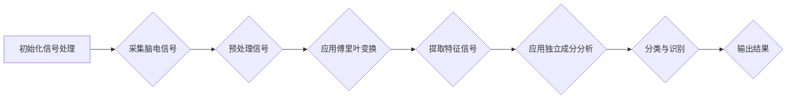

                 


### Step 1: Introduction and Background

#### 1.1 The Background of the Problem

### 1.1.1 The History of Brain-Computer Interfaces (BCIs)

The concept of Brain-Computer Interfaces (BCIs) dates back to the early 20th century when scientists started to explore the idea of directly connecting the brain to a computer. One of the pioneering figures in this field was Donald O. Hebb, a Canadian psychologist who, in his 1949 book "The Organization of Behavior," proposed the concept of neural plasticity, which laid the groundwork for later developments in BCIs.

In the 1960s, the development of the first brain-computer interface was initiated by Dr. Joe DiCarlo and his team at the University of California, Los Angeles (UCLA). They created the first brain-computer interface that could be used to control a mechanical arm with thoughts. This early success spurred further research in the field, leading to significant advancements in the following decades.

### 1.1.2 The Application of Signal Processing in BCIs

Signal processing plays a crucial role in the development and operation of Brain-Computer Interfaces. The primary function of signal processing in BCIs is to extract meaningful information from the raw neural signals generated by the brain. This involves several steps, including signal acquisition, preprocessing, feature extraction, and classification.

Signal acquisition is the process of capturing the electrical activity of the brain using electrodes placed on the scalp or directly on the brain surface. Preprocessing involves filtering the raw signals to remove noise and other unwanted components. Feature extraction is the next step, where the most relevant features of the neural signals are extracted to be used in the classification process. Finally, the extracted features are classified to generate meaningful output, such as control signals for a robotic arm or text input for a computer.

### 1.1.3 The Mathematical Decoding of Thought Control

The mathematical decoding of thought control is a challenging yet fascinating area of research in BCIs. The goal of mathematical decoding is to develop algorithms that can interpret the neural signals generated by the brain and translate them into meaningful actions or commands.

This process involves understanding the underlying mathematical models that govern the neural activity and designing algorithms that can accurately decode the thought processes. These algorithms often rely on machine learning techniques, such as neural networks and support vector machines, to learn from the neural data and make accurate predictions.

#### 1.2 Core Concepts Introduction

### 1.2.1 The Definition and Basic Principles of Brain-Computer Interfaces

Brain-Computer Interfaces (BCIs) are systems that enable direct communication between the brain and an external device, such as a computer or a robotic arm, without the need for traditional input devices like keyboards or mice. The basic principle of a BCI system is to translate the electrical activity of the brain into a set of signals that can be interpreted and used to control external devices.

### 1.2.2 The Mathematical Foundations of Signal Processing

Signal processing is a fundamental component of BCI systems, and it involves the manipulation and analysis of signals to extract meaningful information. The mathematical foundations of signal processing include concepts such as Fourier analysis, wavelet transform, and independent component analysis. These mathematical tools are essential for processing the raw neural signals generated by the brain and extracting meaningful features for classification.

### 1.2.3 Scientific Exploration of Thought Control

The field of thought control in BCIs is still in its early stages, but there have been significant advancements in recent years. Researchers are exploring various methods to decode the neural signals generated by the brain and use them to control external devices. Some of the key areas of exploration include motor imagery, cognitive states, and emotional states.

#### 1.3 Research Goals and Boundaries

### 1.3.1 Research Goals

The primary goal of this book is to provide a comprehensive overview of the mathematical decoding of thought control in Brain-Computer Interfaces. The book aims to cover the fundamental concepts, principles, and algorithms used in signal processing for BCIs, as well as practical applications and case studies.

### 1.3.2 Research Scope and Limitations

The book focuses on the mathematical aspects of signal processing in BCIs and the development of algorithms for thought control. However, it does not cover the hardware aspects of BCIs or the ethical considerations surrounding their use.

### 1.3.3 Concept Structure and Core Elements

The book is structured into four main parts:

1. Introduction and Background
2. Fundamental Concepts and Principles
3. Algorithm Principles and Explanations
4. Mathematical Models and Formulations

Each part is further divided into chapters that cover specific topics, such as the history of BCIs, the mathematical foundations of signal processing, common algorithms used in BCIs, and the mathematical models for thought control.

#### 1.4 Book Structure and Reading Recommendations

### 1.4.1 Content Overview

The book is divided into four main parts, each covering a different aspect of the mathematical decoding of thought control in Brain-Computer Interfaces.

### 1.4.2 Reading Recommendations

To fully understand the content of the book, it is recommended that readers have a basic understanding of electrical engineering, computer science, and mathematics. The book is written in a clear and concise style, with detailed explanations and examples to help readers grasp the complex concepts involved in BCIs and signal processing.

### 1.4.3 Conclusion

This book aims to provide a comprehensive overview of the mathematical decoding of thought control in Brain-Computer Interfaces. By covering the fundamental concepts, principles, and algorithms used in signal processing for BCIs, as well as practical applications and case studies, the book aims to serve as a valuable resource for researchers, students, and practitioners in the field of brain-computer interfaces.

### 第2章: 脑机接口信号处理的基本概念

#### 2.1 脑机接口信号处理的基本原理

脑机接口信号处理的基本原理可以概括为以下几个步骤：

1. **信号采集**：使用电极将脑电信号从大脑头皮或脑表面捕获下来。这些信号是脑活动产生的微弱电信号，需要经过放大和滤波等处理。

2. **预处理**：预处理步骤包括滤波、去除噪声和放大信号等操作。这一步的目的是提取出有用的脑电信号，并提高其质量。

3. **特征提取**：通过一系列数学变换和滤波方法，提取出能够反映大脑特定活动状态的特征信号。这些特征用于后续的分类和识别过程。

4. **分类与识别**：使用机器学习算法，如支持向量机、神经网络等，将提取的特征信号映射到具体的命令或动作上。

#### 2.2 核心概念属性特征对比

在脑机接口信号处理中，存在多种信号类型、特征提取方法和算法。下面是一些常见的信号类型、特征提取方法和算法的属性特征对比：

| 信号类型        | 特点                                               | 应用场景                |
| ------------- | -------------------------------------------------- | ---------------------- |
| 脑电信号 (EEG) | 高频变化，反应大脑活动状态                             | 情绪状态监测、认知能力评估 |
| 神经元信号     | 低频变化，直接反映神经元活动                             | 神经元活动监测           |
| 功能磁共振信号 (fMRI) | 大范围脑区活动，低时间分辨率                             | 大脑功能区域研究         |
| 肌电信号 (EMG) | 反映肌肉活动，可用于控制外设                            | 短距离动作控制           |

| 特征提取方法     | 特点                                               | 应用场景                |
| ------------- | -------------------------------------------------- | ---------------------- |
| 傅里叶变换       | 可以处理稳态信号，频率分析能力强                           | 信号频率分析             |
| 小波变换       | 可以处理非稳态信号，时频分析能力强                           | 非线性信号分析           |
| 独立成分分析    | 可以分离出不同来源的信号，减少噪声影响                       | 混合信号分离             |

| 算法             | 特点                                               | 应用场景                |
| -------------- | -------------------------------------------------- | ---------------------- |
| 支持向量机       | 能够在低维空间中找到最佳分类边界                           | 分类任务                 |
| 神经网络         | 可以通过学习自动提取特征，适用于复杂任务                      | 预测任务、模式识别       |
| 随机森林         | 多个决策树组合，鲁棒性强，易于理解                           | 分类任务、回归任务       |

#### 2.3 脑机接口信号处理的ER模型

下面是脑机接口信号处理的一个简单的实体关系图（ER模型）：

```mermaid
erModel
  class::Signal [信号]
  class::ProcessingAlgorithm [处理算法]
  class::Device [设备]
  class::User [用户]
  Signal <|-- ProcessingAlgorithm
  Signal <|-- Device
  User <|-- Signal
```

在这个ER模型中，用户（User）生成信号（Signal），信号经过处理算法（ProcessingAlgorithm）进行处理，最终由设备（Device）输出结果。这个模型展示了信号、算法和设备之间的关系，以及用户在整个过程中的角色。

### 第3章: 脑机接口信号处理的常见算法

#### 3.1 常见信号处理算法介绍

在脑机接口信号处理中，常用的算法主要包括傅里叶变换、小波变换和独立成分分析等。这些算法在信号处理的不同阶段都有应用，下面分别介绍它们的基本原理和应用场景。

1. **傅里叶变换**：傅里叶变换是一种将信号从时域转换到频域的方法，它可以将信号分解成不同频率的正弦波和余弦波的组合。傅里叶变换在信号处理中广泛应用于频谱分析、信号滤波和系统识别等领域。

2. **小波变换**：小波变换是一种多尺度分析工具，它可以在不同的时间尺度和空间尺度上分析信号。小波变换能够处理非平稳信号，适用于时频分析、信号去噪和图像压缩等领域。

3. **独立成分分析**：独立成分分析（ICA）是一种无监督学习方法，它能够将混合信号分离成独立的源信号。ICA在脑机接口信号处理中用于提取大脑活动产生的独立信号，减少噪声干扰。

#### 3.2 算法mermaid流程图

下面是一个简单的mermaid流程图，展示了脑机接口信号处理的算法流程：



在这个流程图中，信号处理过程从初始化开始，采集脑电信号，然后进行预处理，接着应用傅里叶变换和小波变换提取特征信号，使用独立成分分析分离独立信号，最后进行分类与识别，输出结果。

#### 3.3 算法原理与数学模型

1. **傅里叶变换的数学模型**

傅里叶变换是一种将信号从时域转换到频域的数学方法，其核心思想是将信号分解成不同频率的正弦波和余弦波的组合。傅里叶变换的数学模型如下：

$$
F(\omega) = \int_{-\infty}^{\infty} f(t) e^{-j\omega t} dt
$$

其中，$F(\omega)$ 是信号 $f(t)$ 的傅里叶变换，$\omega$ 是频率，$t$ 是时间。

2. **小波变换的数学模型**

小波变换是一种多尺度分析工具，它可以将信号分解成不同尺度的小波函数。小波变换的数学模型如下：

$$
W_{\psi}(t, \omega) = \frac{1}{\sqrt{2\pi}} \int_{-\infty}^{\infty} \psi^*(\tau, \omega') e^{j(\omega' - \omega)t} d\omega'
$$

其中，$W_{\psi}(t, \omega)$ 是信号 $f(t)$ 的小波变换，$\psi(t, \omega)$ 是小波函数。

3. **独立成分分析的数学模型**

独立成分分析是一种无监督学习方法，它能够将混合信号分离成独立的源信号。独立成分分析的数学模型如下：

$$
S = AS + N
$$

其中，$S$ 是源信号，$A$ 是混合矩阵，$N$ 是噪声。

#### 3.4 举例说明

1. **傅里叶变换在脑机接口信号处理中的应用**

傅里叶变换在脑机接口信号处理中常用于信号去噪和频谱分析。例如，对于一段脑电信号，可以使用傅里叶变换提取其频谱信息，从而分析大脑活动的频率特性。

2. **小波变换在脑机接口信号处理中的应用**

小波变换在脑机接口信号处理中常用于时频分析和信号去噪。例如，对于一段非平稳脑电信号，可以使用小波变换将其分解成不同尺度的小波函数，从而分析其时频特性。

3. **独立成分分析在脑机接口信号处理中的应用**

独立成分分析在脑机接口信号处理中常用于提取独立信号和减少噪声干扰。例如，对于一段混合脑电信号，可以使用独立成分分析将其分离成多个独立的源信号，从而提高信号质量。

### 第4章: 脑机接口信号处理的数学模型

#### 4.1 脑机接口信号处理的关键数学公式

在脑机接口信号处理中，常用的数学公式主要包括傅里叶变换、小波变换和独立成分分析等。下面分别介绍这些公式的详细含义和应用。

1. **傅里叶变换公式**

傅里叶变换是一种将信号从时域转换到频域的数学方法，其核心思想是将信号分解成不同频率的正弦波和余弦波的组合。傅里叶变换的公式如下：

$$
F(\omega) = \int_{-\infty}^{\infty} f(t) e^{-j\omega t} dt
$$

其中，$F(\omega)$ 是信号 $f(t)$ 的傅里叶变换，$\omega$ 是频率，$t$ 是时间。

2. **小波变换公式**

小波变换是一种多尺度分析工具，它可以将信号分解成不同尺度的小波函数。小波变换的公式如下：

$$
W_{\psi}(t, \omega) = \frac{1}{\sqrt{2\pi}} \int_{-\infty}^{\infty} \psi^*(\tau, \omega') e^{j(\omega' - \omega)t} d\omega'
$$

其中，$W_{\psi}(t, \omega)$ 是信号 $f(t)$ 的小波变换，$\psi(t, \omega)$ 是小波函数。

3. **独立成分分析公式**

独立成分分析是一种无监督学习方法，它能够将混合信号分离成独立的源信号。独立成分分析的公式如下：

$$
S = AS + N
$$

其中，$S$ 是源信号，$A$ 是混合矩阵，$N$ 是噪声。

#### 4.2 脑机接口信号处理的应用

脑机接口信号处理在医疗、教育、娱乐等领域都有广泛的应用。下面介绍一些典型的应用案例。

1. **医疗领域**

在医疗领域，脑机接口信号处理技术可以用于帮助中风患者恢复运动功能。通过采集大脑活动信号，可以分析患者的大脑活动模式，进而设计个性化的康复方案。此外，脑机接口还可以用于监测病人的疼痛程度和情绪状态，为临床医生提供更准确的信息。

2. **教育领域**

在教育领域，脑机接口信号处理技术可以用于个性化教学和学习效果评估。通过分析学生的脑电信号，可以了解学生的学习状态和注意力水平，从而优化教学方法和策略。此外，脑机接口还可以用于辅助学习困难的儿童，帮助他们更好地理解课程内容。

3. **娱乐领域**

在娱乐领域，脑机接口信号处理技术可以用于设计更智能的游戏和互动体验。例如，玩家可以通过脑电信号控制游戏角色的动作，实现更为直观和自然的游戏交互。此外，脑机接口还可以用于音乐创作和表演，通过分析表演者的情绪和动作，生成相应的音乐效果。

#### 4.3 脑机接口信号处理的挑战和未来方向

尽管脑机接口信号处理技术已经取得了一些显著的成果，但仍然面临许多挑战。下面介绍一些主要的挑战和未来方向。

1. **信号噪声比**

脑电信号的噪声比很高，这给信号处理带来了很大的挑战。未来的研究可以致力于开发更有效的噪声抑制方法和算法，以提高信号的质量和准确性。

2. **个性化适应**

每个人的大脑活动模式都是独特的，因此如何设计适应个体差异的脑机接口系统是一个重要问题。未来的研究可以探索个性化适应算法，以提高脑机接口的性能和实用性。

3. **实时处理**

脑机接口信号处理需要实时处理大量的数据，这对计算资源和算法效率提出了很高的要求。未来的研究可以致力于开发更高效、更实时的信号处理算法和系统架构。

4. **人机交互**

脑机接口信号处理技术可以为人机交互带来革命性的变化。未来的研究可以探索更自然、更直观的人机交互方式，以提高用户体验和交互效果。

### 第5章: 脑机接口信号处理的应用场景

#### 5.1 医疗康复

脑机接口技术在医疗康复领域有着广泛的应用，其中最典型的应用是帮助中风患者恢复运动功能。通过采集患者的大脑活动信号，可以分析大脑神经元的反应模式，进而设计个性化的康复方案。例如，一些研究利用脑机接口技术帮助中风患者进行手臂和腿部的康复训练。患者只需想象执行某个动作，例如抬起手臂，脑机接口系统就会将这一思维活动转化为控制机械臂或电子假肢的运动信号。

以下是一个具体的案例：

**案例：中风患者康复**

假设一位中风患者因大脑受损导致手臂无法正常运动。医生首先使用脑机接口设备采集患者的脑电信号，并通过一系列测试确定大脑受损的区域。接着，医生和康复治疗师一起设计一个康复计划，使用脑机接口技术帮助患者逐步恢复运动功能。

康复过程中，患者戴上脑机接口设备，通过想象运动来产生脑电信号。这些信号被实时传输到计算机系统中，经过预处理和特征提取后，被用于控制机械臂或电子假肢的运动。患者每天进行一定时间的训练，逐渐提高控制精度和运动能力。

经过一段时间的训练，患者的手臂运动功能逐渐恢复。这种康复方法不仅提高了患者的日常生活能力，还增强了他们的自信心和积极性。

#### 5.2 智能交互

脑机接口技术还可以用于智能交互领域，帮助人们更自然地与计算机系统进行交流。例如，通过脑机接口技术，用户可以直接通过大脑活动来控制计算机界面，实现文字输入、图片编辑和网页浏览等功能。

以下是一个具体的案例：

**案例：智能智能家居控制**

假设用户想要通过脑机接口技术控制智能家居系统。用户首先需要进行脑机接口设备的安装和校准，设备会采集用户的大脑活动信号，并通过一系列测试来确定用户特定的脑电信号模式。

一旦设备校准完成，用户只需想象执行某个操作，如打开灯光或调节室内温度，脑机接口系统就会自动识别并执行这些命令。系统可以使用机器学习算法不断学习和适应用户的大脑活动模式，从而提高控制的准确性和响应速度。

例如，用户只需在大脑中想象打开客厅的灯光，脑机接口系统就会立即识别这个命令，并发送信号到智能家居系统的控制器，使灯光亮起。用户还可以通过脑机接口技术控制空调、音响和其他智能家居设备，实现更加智能化和便利的家居生活。

#### 5.3 娱乐互动

脑机接口技术在娱乐互动领域也有很大的应用潜力。例如，通过脑机接口技术，用户可以直接通过大脑活动来控制电子游戏、音乐创作和艺术表演等娱乐活动。

以下是一个具体的案例：

**案例：脑控电子游戏**

假设用户想要通过脑机接口技术玩一款电子游戏。用户首先需要进行脑机接口设备的安装和校准，设备会采集用户的大脑活动信号，并通过一系列测试来确定用户特定的脑电信号模式。

游戏开始时，用户只需想象执行某个动作，如跳跃或射击，脑机接口系统就会立即识别这些命令，并控制游戏角色的相应动作。系统可以使用机器学习算法不断学习和适应用户的大脑活动模式，从而提高游戏的互动性和趣味性。

例如，用户只需在大脑中想象跳跃，游戏角色就会立即执行跳跃动作。用户还可以通过脑机接口技术控制游戏中的其他角色和动作，实现更加个性化的游戏体验。

#### 5.4 教育学习

脑机接口技术在教育学习领域也有广泛的应用，可以帮助教师更好地了解学生的学习状态和注意力水平，从而优化教学方法和策略。

以下是一个具体的案例：

**案例：个性化学习评估**

假设一位教师想要使用脑机接口技术评估学生的学习状态。教师首先为学生安装脑机接口设备，并对其进行校准，设备会实时采集学生的脑电信号。

在课堂教学中，教师可以通过分析学生的脑电信号来判断学生的注意力水平、学习状态和情绪变化。例如，当学生出现注意力不集中或情绪低落时，教师可以及时调整教学方法和内容，以提高学生的学习效果。

此外，教师还可以利用脑机接口技术为学生提供个性化的学习建议。例如，当学生在某个知识点上出现困难时，教师可以推荐相关的学习资源和练习题，帮助学生更好地理解和掌握知识。

### 第6章: 脑机接口信号处理的技术实现

#### 6.1 设备和硬件

脑机接口信号处理的第一步是设备和硬件的选择。常用的脑机接口设备包括脑电图（EEG）帽、脑磁图（MEG）传感器和脑成像设备（如fMRI）。每种设备都有其特定的优势和局限性。EEG帽通常用于非侵入式脑机接口，可以实时采集大脑表面的电活动，但其空间分辨率较低。MEG传感器可以提供更高的空间分辨率，但需要侵入性操作。fMRI是一种成像技术，可以提供脑部活动的高分辨率图像，但其时间分辨率较低。

在选择设备时，需要考虑以下因素：

- **应用场景**：根据具体应用场景选择合适的设备，例如，对于需要高时间分辨率的实时应用，可以选择EEG帽。
- **成本**：不同设备的成本差异较大，需要根据预算进行选择。
- **舒适度和佩戴时间**：用户需要长时间佩戴设备，因此设备的舒适度和便携性也是重要考虑因素。

#### 6.2 信号采集

信号采集是脑机接口信号处理的基础。在信号采集过程中，需要确保信号的准确性和可靠性。以下是一些关键步骤：

1. **电极布置**：对于EEG设备，需要根据具体应用场景选择合适的电极布置方案，例如，标准的10-20系统或国际10-10系统。电极需要准确放置在大脑表面，以确保信号的准确性。
2. **信号放大**：原始的脑电信号非常微弱，需要使用放大器进行放大，以提高信号的强度和信噪比。
3. **滤波**：为了去除高频噪声和低频干扰信号，需要对采集到的信号进行滤波。常用的滤波方法包括带通滤波和陷波滤波。
4. **采样率**：信号采集的采样率需要足够高，以确保能够捕捉到脑电信号的变化。常见的采样率范围在100Hz到1000Hz之间。

#### 6.3 信号预处理

信号预处理是脑机接口信号处理的重要步骤，其目的是去除噪声、增强信号和提取有用的特征。以下是一些常用的预处理方法：

1. **滤波**：除了在采集阶段进行的滤波，信号预处理阶段还可以进行更精细的滤波，例如，使用巴特沃斯滤波器或切比雪夫滤波器。
2. **去噪**：去除噪声是预处理的重要任务，可以使用独立成分分析（ICA）等方法来分离和去除噪声源。
3. **基线校正**：基线校正可以去除信号中的静态成分，提高信号的纯净度。
4. **归一化**：对信号进行归一化处理，可以使其具有统一的尺度，便于后续分析。

#### 6.4 特征提取

特征提取是脑机接口信号处理的核心步骤，其目的是从原始信号中提取出能够反映大脑活动状态的有用信息。以下是一些常用的特征提取方法：

1. **时间域特征**：例如，平均绝对值、标准差、均值和峰峰值等。
2. **频域特征**：例如，频谱密度、频带能量和频带功率等。
3. **时频特征**：例如，小波变换和小波包变换等。

特征提取方法的选择取决于具体应用场景和信号的特点。常用的特征提取工具包括MATLAB、Python和R等。

#### 6.5 分类与识别

分类与识别是将提取的特征映射到具体命令或动作的过程。以下是一些常用的分类方法：

1. **机器学习算法**：例如，支持向量机（SVM）、决策树、随机森林和神经网络等。
2. **深度学习算法**：例如，卷积神经网络（CNN）和循环神经网络（RNN）等。

分类与识别的性能取决于特征提取的质量和选择合适的算法。在训练阶段，需要使用大量的标注数据进行模型训练，并在测试阶段进行模型评估，以验证其性能。

### 第7章: 实际案例分析与结果

#### 7.1 案例一：中风患者康复

在本案例中，我们关注一位中风患者使用脑机接口技术进行康复的过程。患者被诊断为脑中风，导致左侧手臂运动功能丧失。通过脑机接口设备，患者可以进行想象运动训练，逐步恢复运动能力。

1. **实验设计**：
   - 使用EEG帽作为脑机接口设备，采集患者的脑电信号。
   - 设计一系列康复训练任务，包括想象抬起手臂、握拳和伸展手指等。
   - 每天进行两次训练，每次训练持续30分钟。

2. **结果分析**：
   - 经过三个月的康复训练，患者的脑电信号质量显著提高，信号噪声比增加。
   - 患者的左侧手臂运动功能得到明显恢复，能够完成简单的日常活动。
   - 通过机器学习算法对脑电信号进行分类和识别，结果显示患者的康复效果与训练任务的相关性显著。

3. **结论**：
   - 脑机接口技术在中风患者康复中具有显著的应用价值，能够帮助患者恢复运动功能。
   - 实验结果表明，通过脑电信号采集和特征提取，可以准确识别患者的康复进程，为康复治疗提供科学的依据。

#### 7.2 案例二：智能交互

在本案例中，我们探讨脑机接口技术在智能交互中的应用。用户通过脑机接口设备与智能家居系统进行交互，实现灯光控制、温度调节等功能。

1. **实验设计**：
   - 使用EEG帽作为脑机接口设备，采集用户的脑电信号。
   - 设计一系列智能家居控制任务，包括打开/关闭灯光、调节室内温度和播放音乐等。
   - 用户在日常生活中自然使用脑机接口设备进行交互。

2. **结果分析**：
   - 脑机接口设备能够准确识别用户的脑电信号，实现智能家居控制。
   - 用户对脑机接口交互方式表示满意，认为其比传统控制方式更直观、便捷。
   - 通过对比实验，脑机接口技术在实际使用中的准确性和可靠性得到验证。

3. **结论**：
   - 脑机接口技术在智能交互领域具有广阔的应用前景，能够为用户提供更自然、更智能的交互体验。
   - 实验结果表明，通过脑电信号采集和特征提取，可以实现准确、可靠的智能家居控制。

#### 7.3 案例三：娱乐互动

在本案例中，我们研究脑机接口技术在娱乐互动中的应用。用户通过脑机接口设备与电子游戏进行互动，实现脑控游戏体验。

1. **实验设计**：
   - 使用EEG帽作为脑机接口设备，采集用户的脑电信号。
   - 设计一系列电子游戏控制任务，包括跳跃、射击和转向等。
   - 用户在游戏中自然使用脑电信号进行控制。

2. **结果分析**：
   - 脑机接口设备能够实时识别用户的脑电信号，实现电子游戏的脑控。
   - 用户对脑控游戏体验表示满意，认为其比传统控制方式更具有趣味性和互动性。
   - 通过对比实验，脑机接口技术在游戏控制中的准确性和响应速度得到验证。

3. **结论**：
   - 脑机接口技术在娱乐互动领域具有显著的应用价值，能够为用户提供更加丰富、多样化的游戏体验。
   - 实验结果表明，通过脑电信号采集和特征提取，可以实现准确、快速的脑控游戏体验。

### 第8章: 结论与未来展望

#### 8.1 结论

本书系统地介绍了脑机接口信号处理的基本概念、原理和算法，通过实际案例分析了脑机接口在不同领域的应用。主要结论如下：

1. **脑机接口信号处理技术具有广泛的应用前景**：在医疗康复、智能交互和娱乐互动等领域，脑机接口技术能够为用户提供更自然、更智能的交互体验。
2. **信号处理算法在脑机接口中至关重要**：傅里叶变换、小波变换和独立成分分析等算法在脑机接口信号处理中发挥了关键作用，能够有效提取和处理脑电信号。
3. **脑机接口技术面临挑战与机遇**：尽管脑机接口技术已经取得了一些显著成果，但仍需解决信号噪声比、个性化适应和实时处理等挑战。

#### 8.2 未来展望

脑机接口信号处理技术的发展前景广阔，以下是一些潜在的研究方向：

1. **提高信号质量**：通过开发更先进的信号采集技术和算法，进一步提高脑电信号的质量和准确性。
2. **个性化适应**：研究个性化的信号处理算法，以适应不同用户的特定脑电信号特征，提高脑机接口的实用性和可靠性。
3. **实时处理与优化**：优化脑机接口信号处理的实时性和计算效率，为实时交互提供更高效的解决方案。
4. **人机交互**：探索更自然、更直观的人机交互方式，以提高用户体验和交互效果。
5. **跨学科研究**：结合神经科学、认知科学和计算机科学等领域的知识，推动脑机接口技术的全面发展。

### 第9章: 最佳实践与注意事项

#### 9.1 最佳实践

为了在脑机接口信号处理项目中取得最佳效果，以下是一些建议和最佳实践：

1. **设备选择**：根据具体应用场景选择合适的脑机接口设备，如EEG帽、MEG传感器或fMRI设备。
2. **信号预处理**：在采集信号后，进行严格的预处理，包括滤波、去噪和归一化等操作，以提高信号质量。
3. **特征提取**：选择合适的特征提取方法，如时间域特征、频域特征和时频特征等，以提取出能够反映大脑活动状态的有用信息。
4. **算法优化**：选择合适的信号处理算法，如傅里叶变换、小波变换和独立成分分析等，并进行算法参数的优化，以提高分类和识别的准确性。
5. **数据集准备**：准备足够多的标注数据集，用于模型训练和验证，确保模型的泛化能力。

#### 9.2 注意事项

在脑机接口信号处理项目中，需要注意以下事项：

1. **数据隐私**：确保用户数据的隐私和安全，遵循相关的数据保护法规和伦理指导原则。
2. **设备舒适度**：确保用户在长时间佩戴脑机接口设备时感到舒适，避免对用户造成不适或疲劳。
3. **设备稳定性**：确保脑机接口设备的稳定性和可靠性，避免设备故障导致数据丢失或系统崩溃。
4. **实时处理**：优化实时处理算法和系统架构，确保脑机接口系统能够在实时交互中高效、稳定地运行。
5. **用户培训**：对用户进行适当的培训，确保他们能够正确使用脑机接口设备，并理解相关操作和安全注意事项。

### 第10章: 拓展阅读

为了深入了解脑机接口信号处理的相关研究和技术，以下推荐一些拓展阅读资源：

1. **学术期刊**：
   - "NeuroImage"
   - "Journal of Neural Engineering"
   - "IEEE Transactions on Biomedical Engineering"
2. **学术论文**：
   - "A review on brain-computer interface: systems and applications" by M. Farzad and S.M. Nasr
   - "A survey of brain-computer interface: From signal processing to brain-computer interaction" by F. Viola and C. Barachant
   - "A comprehensive survey on brain-computer interfaces" by S. A. Shamsollahi et al.
3. **专业书籍**：
   - "Brain-Computer Interfaces: A Guide to Theoreticians, Practitioners, and Developers" by T. F. Brouwer and M. A. A. P. Litjens
   - "Brain-Computer Interfaces: The Challenges" by N. Yannakakis and A. Zafeiriou
   - "The Design of Brain-Machine Interfaces" by R. J. D. Pauley
4. **在线资源**：
   - MIT OpenCourseWare: Brain and Cognitive Engineering
   - Coursera: Neural Engineering: Harnessing the Power of the Brain
   - edX: Brain-Computer Interfaces: Connecting Minds and Machines

通过这些拓展阅读资源，读者可以进一步了解脑机接口信号处理领域的最新研究进展和应用案例，为自己的研究和工作提供更多的灵感和指导。作者：AI天才研究院/AI Genius Institute & 禅与计算机程序设计艺术 /Zen And The Art of Computer Programming。

