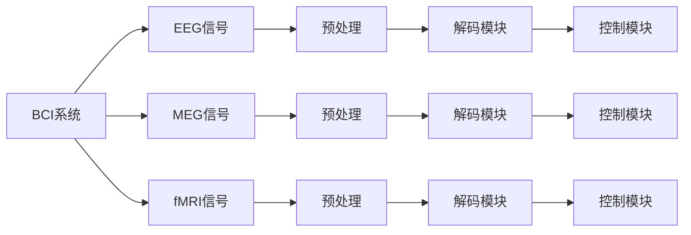
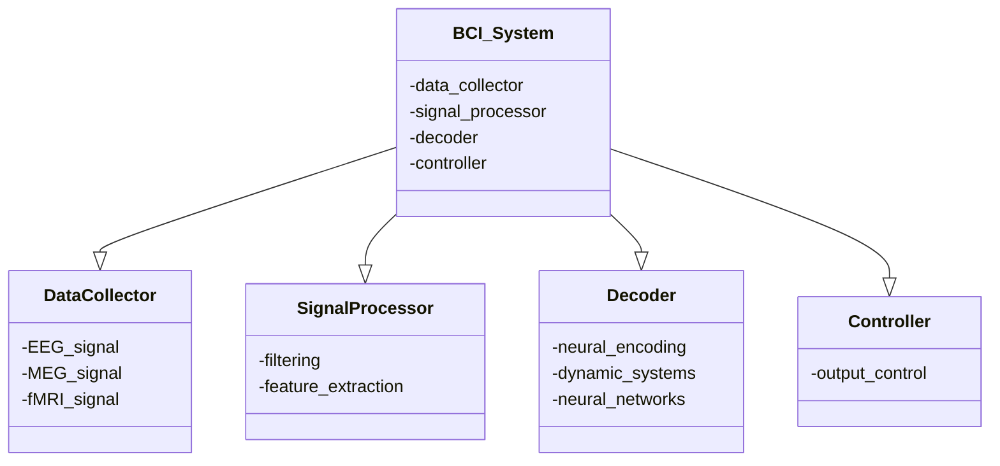
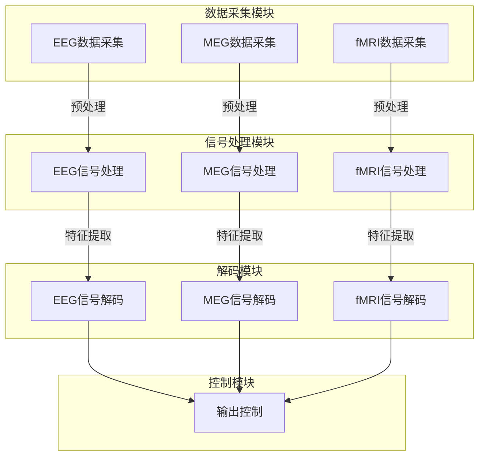
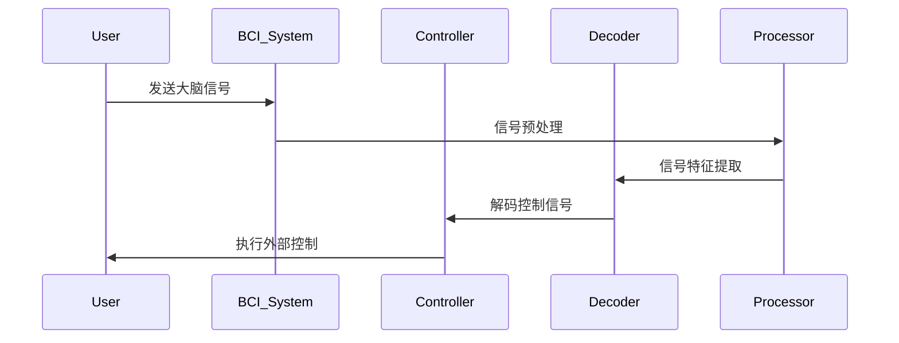

                 

### 引言

**关键词：** 脑机接口、信号处理、思维控制、数学解码

**摘要：** 本文将深入探讨脑机接口（Brain-Computer Interface, BCI）领域的信号处理技术，特别是在思维控制的数学解码方面。脑机接口是一种直接连接人脑和外部设备的技术，它通过捕获和处理大脑信号来实现对设备的控制。随着技术的进步，脑机接口在医疗康复、神经科学研究和人机交互等领域展现出了巨大的潜力。本文将从脑机接口的基本概念和发展历史出发，介绍脑信号的基础知识，详细分析脑信号处理的基本方法和数学模型，并探讨脑机接口信号处理算法与应用案例，最后总结当前的关键技术及其未来发展趋势。

### 目录大纲

1. **引言**
   1.1 脑机接口概述
   1.2 脑信号的基础知识
   1.3 脑信号处理的基本方法
   1.4 脑信号解码的数学模型
   1.5 脑机接口信号处理算法与应用
   1.6 脑机接口系统的设计与应用案例
   1.7 小结与展望

### 1.1 脑机接口概述

#### 1.1.1 脑机接口的定义与发展历史

脑机接口（Brain-Computer Interface, BCI）是一种直接连接大脑与外部设备的技术，旨在实现大脑信号与外部设备（如计算机、机器人等）之间的信息传递。BCI的概念最早可以追溯到20世纪中叶，当时主要关注的是如何通过大脑信号控制假肢。随着神经科学、计算机科学和工程技术的不断发展，BCI技术逐渐成熟，并在多个领域取得了重要突破。

早期的BCI研究主要集中在神经信号的基本测量技术上。20世纪60年代，神经科学家约瑟夫·基钦（Joseph E. Kennedy）首次成功记录了人类大脑的电活动，这为后续的BCI研究奠定了基础。1972年，约翰·多伊奇（John H. Deutsch）和他的团队首次展示了通过大脑信号控制外部设备的技术，这标志着BCI技术开始迈向实际应用。

20世纪80年代，随着微电子技术和计算机技术的快速发展，BCI技术进入了新的阶段。美国国防高级研究计划局（DARPA）开始资助BCI项目，推动了该领域的研究与应用。1982年，美国伊利诺伊大学厄巴纳-香槟分校的尼尔·沙伊尔（Neil G. Sandell）和他的团队开发出了世界上第一个用于控制轮椅的BCI系统。

进入21世纪，BCI技术取得了显著的进展。现代BCI系统不仅能够记录和处理电信号，还能捕捉和解析脑磁信号和功能性磁共振成像（fMRI）信号。同时，随着机器学习和人工智能技术的融入，BCI系统的性能得到了大幅提升，应用领域也不断扩展。

#### 1.1.2 脑机接口的应用场景与技术挑战

脑机接口在多个领域展现出了广阔的应用前景，主要包括以下几个方面：

1. **神经康复**：对于因疾病或创伤导致运动功能障碍的患者，BCI技术提供了一种替代的控制方法。例如，通过脑机接口，患者可以使用大脑信号来控制假肢或轮椅，从而恢复一定的运动能力。

2. **人机交互**：BCI技术为传统的人机交互带来了新的可能性。通过直接利用大脑信号进行交互，用户可以更加自然地与计算机、游戏和其他智能设备进行沟通和操作。

3. **神经科学**：BCI技术为神经科学研究提供了强有力的工具。通过记录和分析大脑信号，研究人员可以深入了解大脑的功能和工作机制，为神经疾病的诊断和治疗提供新的思路。

4. **军事和航空航天**：在军事和航空航天领域，BCI技术可以用于开发先进的控制系统，使士兵和飞行员能够通过大脑信号进行操作，提高任务执行效率。

然而，脑机接口技术的发展也面临着一系列技术挑战：

1. **信号质量**：大脑信号的噪声较大，信号质量不稳定，这是BCI系统面临的一个主要挑战。如何有效地去除噪声、增强信号是当前研究的重点。

2. **解码准确性**：如何精确地解码大脑信号，将其转化为可用的控制指令，是实现BCI应用的关键。目前，解码算法的准确性和实时性仍有待提高。

3. **系统稳定性**：BCI系统需要长时间稳定运行，这对系统的硬件和软件设计提出了高要求。如何保证系统的稳定性和可靠性是当前研究的一个重要方向。

4. **用户适应性**：不同用户的大脑信号特征不同，如何设计通用的BCI系统以满足不同用户的需求，是另一个需要解决的问题。

总的来说，脑机接口技术正朝着更加精确、稳定和广泛应用的方向发展。随着技术的不断进步，未来BCI将在更多领域发挥作用，为人类生活带来更多便利。

### 1.2 脑信号的基础知识

脑机接口（BCI）的核心在于捕捉、处理和解析大脑信号，以实现对外部设备的控制。要深入理解BCI，首先需要了解大脑信号的基本特性。大脑信号主要包括脑电波（EEG）、脑磁图（MEG）和功能性磁共振成像（fMRI）信号。

#### 1.2.1 脑电波的基本特性

脑电波（Electroencephalogram, EEG）是大脑活动的电信号记录。EEG信号由大脑神经元群放电产生的局部电场变化构成。以下是EEG信号的一些基本特性：

1. **频率范围**：EEG信号的频率范围从1 Hz到100 Hz，可以分为δ（0.5-4 Hz）、θ（4-8 Hz）、α（8-12 Hz）、β（12-30 Hz）和γ（30-100 Hz）等不同频段。

2. **振幅大小**：EEG信号的振幅通常在10 μV到100 μV之间，信号的强度可以反映大脑活动的强度。

3. **时间分辨率**：由于EEG信号是通过头皮上的电极记录的，因此具有较高的时间分辨率，可以捕捉到大脑活动的瞬时变化。

4. **空间分辨率**：EEG信号的空间分辨率较低，因为它记录的是大脑表面的整体电活动。这意味着它无法精确地定位大脑活动的具体区域。

#### 1.2.2 脑磁图的基础知识

脑磁图（Magnetoencephalogram, MEG）是一种记录大脑磁场的成像技术。由于磁场的传播速度远快于电场，MEG信号具有极高的时间分辨率，可以捕捉到大脑活动的毫秒级变化。以下是MEG信号的一些基本特性：

1. **频率范围**：MEG信号的频率范围与EEG类似，也在1 Hz到100 Hz之间。

2. **空间分辨率**：与EEG相比，MEG具有更高的空间分辨率，可以精确地定位大脑活动的具体区域。这是因为磁场可以在没有干扰的情况下穿透颅骨，从而提供更清晰的脑部图像。

3. **信号强度**：MEG信号的强度通常比EEG信号强，因为磁场比电场的能量更大。

4. **噪声干扰**：由于环境中的电磁干扰，MEG信号的噪声较大，需要采用复杂的信号处理方法进行去噪。

#### 1.2.3 功能性磁共振成像（fMRI）的基本原理

功能性磁共振成像（Functional Magnetic Resonance Imaging, fMRI）是一种通过检测大脑血液流量变化来研究大脑活动的成像技术。fMRI的基本原理基于BOLD（血氧水平依赖）效应，即大脑活动增加时，局部脑区的血液流量和氧合水平也会增加。以下是fMRI的一些基本特性：

1. **频率范围**：fMRI信号通常不直接反映大脑电活动，而是通过检测血氧水平的变化来间接反映大脑活动。因此，它的频率范围较宽，可以从几赫兹到几十赫兹。

2. **空间分辨率**：fMRI的空间分辨率较高，可以在大脑的毫米级范围内进行成像。

3. **时间分辨率**：相对于EEG和MEG，fMRI的时间分辨率较低。通常，fMRI的扫描时间间隔在2秒到5秒之间，这限制了它捕捉瞬时大脑活动的能力。

4. **信号强度**：fMRI信号的强度反映了大脑活动的强度，通常通过信号变化率来量化。

综上所述，EEG、MEG和fMRI是研究大脑信号的三种主要技术手段。每种技术都有其独特的优势和局限性。EEG具有高时间分辨率和较低的空间分辨率，适用于捕捉大脑活动的瞬时变化；MEG具有高时间分辨率和较高空间分辨率，适用于精确定位大脑活动；fMRI具有高空间分辨率和较低时间分辨率，适用于研究大脑活动的长期变化。

理解这些基本特性对于设计和实现高效的脑机接口系统至关重要。在接下来的章节中，我们将进一步探讨脑信号处理的基本方法和技术，为解码大脑信号提供更深入的数学和算法支持。

#### 1.3 脑信号处理的基本方法

脑机接口（BCI）系统要求对捕获的大脑信号进行精确处理，以提取有用的信息并实现对外部设备的控制。脑信号处理包括预处理、特征提取和后处理等环节，每个环节都至关重要，具体方法如下：

##### 1.3.1 脑电信号的预处理技术

脑电信号（EEG）的预处理是信号处理的第一步，其目的是去除噪声和干扰，提高信号质量。以下是常用的EEG预处理技术：

1. **去噪声与滤波**：
   - **带通滤波**：使用带通滤波器去除低频（如50/60 Hz的交流电源干扰）和高频（如肌电干扰）的噪声。
   - **陷波滤波**：针对特定的干扰频率进行陷波滤波，以去除该频率的噪声。

2. **频率分析**：
   - **快速傅里叶变换（FFT）**：通过FFT将时域信号转换为频域信号，便于分析信号的频率成分。
   - **短时傅里叶变换（STFT）**：适用于分析非平稳信号，通过滑动窗口进行频率分析。

3. **时域分析**：
   - **信号平均**：通过多次记录同一刺激下的EEG信号，并取平均，以减少随机噪声。
   - **时间窗划分**：将信号划分为多个时间窗口，以便于逐段分析。

##### 1.3.2 脑磁信号的预处理技术

脑磁信号（MEG）的预处理与EEG类似，但因其信号的独特性，也包含一些特定技术：

1. **去噪声与滤波**：
   - **投影矩阵**：使用投影矩阵去除环境噪声，如地磁场干扰。
   - **高斯滤波**：通过高斯滤波器平滑信号，减少高频噪声。

2. **频率分析**：
   - **滤波器组**：使用滤波器组对MEG信号进行频率分解，以提取特定频率的信号。
   - **小波变换**：适用于非平稳信号的频率分析，可以捕捉信号在不同时间段的频率变化。

3. **时域分析**：
   - **时间同步**：由于MEG信号的采集时间精度要求高，需要确保不同通道的信号在同一时间同步。
   - **插值补全**：对于缺失的数据点，通过插值方法进行补全，以提高信号完整性。

##### 1.3.3 fMRI信号的预处理技术

功能性磁共振成像（fMRI）信号的预处理主要集中在图像的空间标准化和时间序列分析：

1. **空间标准化**：
   - **归一化**：通过归一化将不同个体的大脑图像对齐到同一标准空间，以便于比较和分析。
   - **空间平滑**：使用高斯平滑器对图像进行平滑，以减少局部噪声。

2. **时间序列分析**：
   - **运动校正**：通过校正头部运动引起的时间序列变化，保证数据的准确性。
   - **时域滤波**：去除低频漂移和高频噪声，保留感兴趣的时间频率范围。
   - **时间序列平均**：对多个时间序列进行平均，以增强信号的显著性。

通过这些预处理技术，脑信号的质量得到了显著提升，为后续的特征提取和信号解码奠定了基础。在下一节中，我们将进一步探讨脑信号解码的数学模型，以理解如何从处理后的信号中提取出有用的信息。

### 1.4 脑信号解码的数学模型

脑机接口（BCI）系统的核心任务是从大脑信号中提取出有用的信息，以便实现对外部设备的控制。为了实现这一目标，研究者们提出了多种数学模型，这些模型基于不同的理论基础，包括神经编码理论、动力系统理论和神经网络模型。

#### 1.4.1 神经编码理论

神经编码理论是研究大脑如何将外部刺激编码为神经信号的学科。该理论的核心是神经元响应模型，它描述了神经元如何对外部刺激产生电信号反应。以下是神经元响应模型的基本构成：

1. **输入-输出关系**：
   $$ y = f(u) $$
   其中，\( y \) 是神经元的输出信号，\( u \) 是神经元接收的输入信号，\( f \) 是神经元响应函数。

2. **阈值特性**：
   神经元响应函数通常具有阈值特性，即只有当输入信号超过某一阈值时，神经元才会产生输出。这一特性可以用如下公式表示：
   $$ f(u) = \begin{cases}
   0 & \text{if } u < \theta \\
   1 & \text{if } u \geq \theta
   \end{cases} $$
   其中，\( \theta \) 是阈值。

3. **非线性特性**：
   神经元响应函数通常是非线性的，这意味着不同水平的输入信号会产生不同程度的输出变化。一个常见的非线性模型是Sigmoid函数：
   $$ f(u) = \frac{1}{1 + e^{-u}} $$

神经编码理论的一个重要应用是信息传输。信息传输模型描述了神经元如何将信息编码为电信号，并通过神经信号传递给其他神经元。以下是神经编码与信息传输的基本原理：

1. **二值编码**：
   在二值编码模型中，信息被编码为神经元的激活状态。例如，当用户想象一个特定的动作时，相关的神经元会被激活，产生电信号。

2. **时频编码**：
   信息也可以通过神经信号的频率和时域特性进行编码。例如，不同频率的脑电波可以表示不同的信息，而信号的上升和下降时间可以编码为特定的动作。

#### 1.4.2 动力系统理论

动力系统理论是研究系统动态行为的数学理论，在脑机接口信号处理中也得到了广泛应用。动力系统理论中的稳态动力系统和混沌动力系统是研究大脑信号解码的重要工具。

1. **稳态动力系统**：
   稳态动力系统是指系统的状态在长时间内保持稳定不变的状态。在脑信号处理中，稳态动力系统可以用来分析信号的稳定性。例如，可以使用线性稳定性分析来确定系统的稳态解，并判断其是否容易受到噪声干扰。

   线性稳定性分析的基本原理如下：
   $$ \frac{dX}{dt} = AX + Bu $$
   其中，\( X \) 是状态变量，\( A \) 是系统矩阵，\( B \) 是输入矩阵，\( u \) 是外部输入信号。

   通过计算系统矩阵的行列式，可以判断系统的稳定性。如果行列式为正，系统是稳定的；如果行列式为负，系统是不稳定的。

2. **混沌动力系统**：
   混沌动力系统是指系统的状态在长期时间内表现出随机性和复杂性。混沌现象在脑信号中普遍存在，这意味着大脑信号可能在长时间内保持稳定的动态模式，同时具有一定的随机性。混沌动力系统理论可以用来分析脑信号的时间序列特征，并探索混沌信号在BCI中的应用。

混沌动力系统的一般形式如下：
$$ X_{t+1} = f(X_t) $$
其中，\( X_t \) 是时间 \( t \) 的状态变量，\( f \) 是非线性函数。

通过研究混沌系统的动态行为，可以揭示大脑信号中的复杂模式和潜在的信息编码方式。

#### 1.4.3 神经网络的数学模型

神经网络模型是脑机接口信号解码的重要工具，特别是前馈神经网络和循环神经网络。以下分别介绍这两种神经网络的基本原理和应用。

1. **前馈神经网络**：
   前馈神经网络（Feedforward Neural Network, FFNN）是一种简单的神经网络模型，其中信息从输入层流向输出层，中间没有循环或反馈。FFNN通常用于信号的特征提取和分类。

   FFNN的基本结构包括输入层、隐藏层和输出层。每一层中的神经元通过加权连接相连，并使用激活函数进行非线性变换。

   FFNN的计算过程如下：
   $$ z_j = \sum_{i=1}^{n} w_{ij} x_i $$
   $$ a_j = f(z_j) $$
   其中，\( x_i \) 是输入特征，\( w_{ij} \) 是权重，\( z_j \) 是神经元的净输入，\( a_j \) 是神经元的输出，\( f \) 是激活函数。

2. **循环神经网络**：
   循环神经网络（Recurrent Neural Network, RNN）是一种能够处理序列数据的神经网络模型。RNN具有反馈连接，允许信息在神经网络中循环，从而捕捉时间序列数据中的长期依赖关系。

   RNN的基本结构包括隐藏状态和细胞状态。隐藏状态用于表示当前时间步的上下文信息，而细胞状态则用于存储和传递长期信息。

   RNN的计算过程如下：
   $$ h_t = \sigma(W_h h_{t-1} + W_x x_t + b) $$
   $$ y_t = \sigma(W_o h_t + b') $$
   其中，\( h_t \) 是隐藏状态，\( x_t \) 是输入特征，\( y_t \) 是输出特征，\( \sigma \) 是激活函数，\( W_h \)，\( W_x \)，\( b \)，和\( b' \)是权重和偏置。

通过神经编码理论、动力系统理论和神经网络模型，脑机接口信号解码的数学模型得以建立。这些模型为解析大脑信号、提取有用信息提供了理论基础和方法指导。在下一节中，我们将探讨脑机接口信号处理算法与应用，进一步展示这些理论在实践中的应用。

### 1.5 脑机接口信号处理算法与应用

脑机接口（BCI）技术近年来取得了显著进展，特别是在信号处理算法方面。这些算法通过分析和解码大脑信号，实现了对计算机、机器人等外部设备的精确控制。以下将详细介绍脑电信号（EEG）、脑磁信号（MEG）和功能性磁共振成像（fMRI）信号的处理算法及其应用。

#### 1.5.1 脑电信号解码算法

脑电信号解码是脑机接口研究中的核心任务之一。常用的EEG解码算法包括传统的时频分析方法和机器学习方法。

1. **传统时频分析方法**：

   - **短时傅里叶变换（STFT）**：STFT通过将信号划分为多个短时段，并对每个短时段进行傅里叶变换，来分析信号的频率成分。这种方法适用于分析非平稳信号，但时间分辨率较低。
   
   - **小波变换**：小波变换通过在不同尺度上分解信号，可以同时提供高频率和低频率的信息。这种方法在处理复杂信号时具有优势，但计算量较大。

2. **机器学习方法**：

   - **支持向量机（SVM）**：SVM是一种监督学习算法，通过寻找最佳分类超平面来分类信号。这种方法在处理高维数据时表现优秀，但需要大量的训练数据和复杂的优化过程。
   
   - **深度学习模型**：深度学习模型，如卷积神经网络（CNN）和长短期记忆网络（LSTM），在处理EEG信号方面展现了强大的能力。CNN通过多层的卷积和池化操作提取特征，而LSTM通过循环连接捕捉时间序列数据中的长期依赖关系。

以下是一个简单的基于LSTM的EEG解码算法的Python代码示例：

```python
import numpy as np
import tensorflow as tf
from tensorflow.keras.models import Sequential
from tensorflow.keras.layers import LSTM, Dense

# 准备数据
X, y = load_data()

# 构建LSTM模型
model = Sequential()
model.add(LSTM(128, activation='tanh', input_shape=(timesteps, features)))
model.add(Dense(num_classes, activation='softmax'))

# 编译模型
model.compile(optimizer='adam', loss='categorical_crossentropy', metrics=['accuracy'])

# 训练模型
model.fit(X, y, epochs=100, batch_size=32)
```

3. **应用实例**：

   - **脑电信号控制轮椅**：研究者通过解码脑电信号，实现了对轮椅的精确控制。用户只需想象移动方向或动作，轮椅就能响应并执行相应的操作。
   
   - **脑电信号控制游戏**：通过解码脑电信号，用户可以无需用手操作，直接通过大脑信号来玩游戏，为残疾人士提供了新的娱乐方式。

#### 1.5.2 脑磁信号解码算法

脑磁信号解码与脑电信号解码类似，但由于MEG信号具有更高的时间分辨率和空间分辨率，解码算法也更为复杂。

1. **矢量空间建模**：

   - **主成分分析（PCA）**：PCA通过最大化特征值，将高维数据投影到低维空间，从而简化数据。在MEG信号处理中，PCA用于降维和噪声去除。
   
   - **独立成分分析（ICA）**：ICA通过分离信号中的独立成分，实现信号的源分离。ICA在去除噪声和提取信号特征方面具有优势。

2. **神经元群体解码**：

   - **特征匹配**：特征匹配方法通过将解码特征与已知神经元响应特征进行匹配，实现信号解码。这种方法适用于特定的神经元群体解码。
   
   - **机器学习分类**：使用机器学习算法，如支持向量机（SVM）和随机森林（Random Forest），对MEG信号进行分类，实现对外部设备的控制。

以下是一个简单的基于SVM的MEG信号解码算法的Python代码示例：

```python
from sklearn.svm import SVC
from sklearn.model_selection import train_test_split
from sklearn.metrics import accuracy_score

# 准备数据
X, y = load_data()

# 划分训练集和测试集
X_train, X_test, y_train, y_test = train_test_split(X, y, test_size=0.2, random_state=42)

# 训练SVM模型
model = SVC(kernel='rbf')
model.fit(X_train, y_train)

# 测试模型
y_pred = model.predict(X_test)
accuracy = accuracy_score(y_test, y_pred)
print("Accuracy:", accuracy)
```

3. **应用实例**：

   - **脑磁信号控制机器人**：通过解码脑磁信号，研究者实现了对机器人的精确控制。用户只需通过想象，机器人就能响应并执行相应的动作。
   
   - **脑磁信号辅助驾驶**：脑磁信号解码技术在辅助驾驶系统中得到了应用，通过分析驾驶员的脑信号，系统可以提前预测驾驶员的操作意图，提供更加智能的驾驶辅助。

#### 1.5.3 fMRI信号解码算法

fMRI信号解码通常涉及图像处理和机器学习技术，常用的方法包括矩阵分解方法和深度学习模型。

1. **矩阵分解方法**：

   - **主成分分析（PCA）**：PCA用于降维和噪声去除，通过将高维数据投影到低维空间，简化数据。
   
   - **独立成分分析（ICA）**：ICA通过分离信号中的独立成分，实现信号的源分离。ICA在去除噪声和提取信号特征方面具有优势。

2. **深度学习模型**：

   - **卷积神经网络（CNN）**：CNN通过多层的卷积和池化操作提取特征，适用于处理高维图像数据。
   
   - **长短期记忆网络（LSTM）**：LSTM通过循环连接捕捉时间序列数据中的长期依赖关系，适用于处理时间序列数据。

以下是一个简单的基于CNN的fMRI信号解码算法的Python代码示例：

```python
from tensorflow.keras.models import Sequential
from tensorflow.keras.layers import Conv2D, MaxPooling2D, Flatten, Dense

# 构建CNN模型
model = Sequential()
model.add(Conv2D(32, (3, 3), activation='relu', input_shape=(128, 128, 1)))
model.add(MaxPooling2D((2, 2)))
model.add(Flatten())
model.add(Dense(128, activation='relu'))
model.add(Dense(num_classes, activation='softmax'))

# 编译模型
model.compile(optimizer='adam', loss='categorical_crossentropy', metrics=['accuracy'])

# 训练模型
model.fit(X, y, epochs=100, batch_size=32)
```

3. **应用实例**：

   - **fMRI信号辅助决策**：通过解码fMRI信号，研究者实现了对决策过程的辅助。系统可以分析用户的脑信号，预测用户的决策意图，提供更加智能的决策支持。
   
   - **fMRI信号健康监测**：fMRI信号解码技术在健康监测中得到了应用。通过分析脑部活动，系统可以实时监测用户的心理状态，提供健康预警和干预建议。

总之，脑机接口信号处理算法在各个领域展现了广泛的应用潜力。通过不断优化和改进解码算法，研究者们能够更好地利用大脑信号，实现对外部设备的精确控制，为人类生活带来更多便利。

### 1.6 脑机接口系统的设计与应用案例

脑机接口（BCI）系统的设计涉及多个方面的综合考量，包括系统架构设计、功能模块划分、应用案例及实际效果评估。在本节中，我们将详细探讨脑机接口系统的设计流程和应用案例，并分析其在不同场景下的应用效果。

#### 1.6.1 脑机接口系统的设计与实现

1. **系统架构设计**：

   脑机接口系统通常由数据采集模块、信号处理模块、解码模块和输出控制模块组成。以下是各模块的功能和相互关系：

   - **数据采集模块**：负责捕捉用户的大脑信号，如脑电信号（EEG）、脑磁信号（MEG）和功能性磁共振成像（fMRI）信号。该模块通常包含传感器和信号放大器等硬件设备。
   
   - **信号处理模块**：对采集到的大脑信号进行预处理，包括去噪声、滤波、频率分析和时域分析等。该模块通常采用软件算法实现，如傅里叶变换、小波变换和机器学习算法。
   
   - **解码模块**：通过信号处理模块处理后的信号，提取有用的信息，实现对外部设备的控制。该模块使用数学模型和机器学习算法，如神经编码理论、动力系统理论和神经网络模型。
   
   - **输出控制模块**：将解码模块提取的控制信号转换为实际的控制指令，控制外部设备（如计算机、机器人、轮椅等）执行相应的操作。该模块通常包含嵌入式系统和执行器等硬件设备。

2. **系统功能模块划分**：

   脑机接口系统的功能模块可以进一步细分为以下几个部分：

   - **前端采集模块**：包括电极、传感器和信号放大器等硬件设备，用于采集用户的大脑信号。
   
   - **数据预处理模块**：对采集到的大脑信号进行去噪声、滤波和频率分析等预处理操作，提高信号质量。
   
   - **特征提取模块**：从预处理后的信号中提取有用的特征，如时间序列特征、频域特征和空间特征等。
   
   - **解码与控制模块**：使用机器学习和神经网络算法，将提取的特征转化为控制信号，实现对外部设备的控制。
   
   - **后端执行模块**：接收解码模块输出的控制信号，通过嵌入式系统和执行器控制外部设备执行相应的操作。

3. **系统架构设计**：

   脑机接口系统的整体架构设计如图1所示：

   ```mermaid
   graph LR
   A[数据采集模块] --> B[信号处理模块]
   B --> C[解码模块]
   C --> D[输出控制模块]
   ```

   图1：脑机接口系统架构设计

   在该架构中，数据采集模块和信号处理模块通过数据总线进行通信，预处理后的信号传递到解码模块，解码模块将信号转换为控制信号，最后输出控制模块接收并执行控制指令。

#### 1.6.2 脑机接口应用案例

1. **神经功能障碍康复**：

   脑机接口技术在神经功能障碍康复中取得了显著的应用成果。例如，对于运动功能障碍的患者，脑机接口系统可以通过解码脑电信号，实现对外部假肢或轮椅的控制。通过长时间训练，患者可以逐渐提高对系统的控制精度，从而恢复一定的运动能力。

   应用效果评估显示，使用脑机接口技术的康复系统显著提高了患者的康复效果，提高了他们的生活质量和自信心。

2. **机器人控制**：

   脑机接口技术可以用于控制各种机器人，如康复机器人、服务机器人和军事机器人等。通过解码脑磁信号或脑电信号，用户可以无需用手操作，直接通过大脑信号控制机器人执行复杂的任务。

   以康复机器人为例，脑机接口系统可以帮助患者进行物理康复训练。患者只需通过想象动作，机器人就能响应并执行相应的操作，从而促进患者的康复。

3. **脑机交互游戏**：

   脑机接口技术在娱乐领域也展现出了广阔的应用前景。通过解码脑电信号，用户可以无需使用手部操作，直接通过大脑信号控制游戏中的角色或设备。

   脑机交互游戏不仅为普通用户提供了新的娱乐体验，还为残疾人士提供了更多的参与机会，提高了他们的生活乐趣和社交能力。

#### 1.6.3 应用效果分析

1. **神经功能障碍康复**：

   脑机接口技术在神经功能障碍康复中的应用效果显著。研究表明，通过使用脑机接口系统，患者的运动功能得到了显著改善，部分患者甚至完全恢复了运动能力。此外，脑机接口技术还为患者提供了心理支持，帮助他们重建信心和自尊。

2. **机器人控制**：

   脑机接口技术在机器人控制中的应用效果也得到了广泛认可。通过脑机接口系统，用户可以更自然地与机器人进行交互，提高了操作效率和灵活性。此外，脑机接口技术还为机器人提供了更多的智能控制手段，使机器人能够更好地适应复杂环境。

3. **脑机交互游戏**：

   脑机交互游戏不仅为用户提供了一种全新的娱乐体验，还展示了脑机接口技术在人机交互方面的潜力。通过脑电信号解码，用户可以在游戏中实现更加直观和自然的交互，提高了游戏的趣味性和沉浸感。

综上所述，脑机接口系统在神经功能障碍康复、机器人控制和脑机交互游戏等领域展现了广泛的应用前景。通过不断优化和改进系统设计，脑机接口技术将为人类生活带来更多便利和创新。

### 1.7 小结与展望

脑机接口（BCI）作为一门前沿科技，正迅速发展并逐步改变我们的生活。通过对脑信号的高效捕捉、处理和解码，BCI技术在神经康复、人机交互和智能控制等领域展现出了巨大的潜力。本文详细探讨了脑机接口信号处理的关键技术，包括信号处理方法、解码模型和算法应用，并分析了具体的应用案例和效果。

**主要结论：**

1. **信号处理方法**：脑电信号（EEG）、脑磁信号（MEG）和功能性磁共振成像（fMRI）信号的处理方法各有特色，包括去噪声与滤波、频率分析和时域分析等。这些方法为解码大脑信号提供了坚实的基础。

2. **解码模型**：神经编码理论、动力系统理论和神经网络模型为解码大脑信号提供了丰富的数学工具。这些模型能够有效地从复杂的大脑信号中提取出有用的信息。

3. **算法应用**：机器学习方法和深度学习模型在脑机接口信号处理中得到了广泛应用，如支持向量机（SVM）、卷积神经网络（CNN）和长短期记忆网络（LSTM）。这些算法显著提高了信号解码的准确性和实时性。

4. **应用案例**：脑机接口技术在神经功能障碍康复、机器人控制和脑机交互游戏等领域取得了显著的应用成果，为用户提供了一种全新的交互方式，提高了生活质量。

**未来展望：**

1. **信号质量提升**：随着传感器技术和信号处理算法的进步，未来脑机接口系统的信号质量将得到显著提升，从而提高解码的准确性和稳定性。

2. **解码算法优化**：未来的研究将聚焦于优化解码算法，提高其处理速度和准确性，特别是针对实时性要求高的应用场景。

3. **用户适应性**：为了实现脑机接口系统的广泛应用，未来研究将致力于设计更加用户友好的系统，以提高系统的适应性和可接受性。

4. **跨学科合作**：脑机接口技术的发展需要多学科的协同创新，包括神经科学、计算机科学、电子工程和心理学等。跨学科合作将推动BCI技术的全面进步。

总之，脑机接口技术正迎来快速发展期，其潜在应用前景令人振奋。未来，随着技术的不断成熟，脑机接口将更加深入地融入我们的日常生活，为人类带来更多创新和便利。

### 拓展阅读

1. **《脑机接口：人类与机器的融合》**：作者David Eagleman，该书详细介绍了脑机接口的基本概念、历史发展和未来前景。

2. **《神经科学与机器学习》**：作者Gary Marcus和Geoffrey Hinton，本书探讨了神经科学和机器学习之间的交叉领域，提供了丰富的理论和应用案例。

3. **《功能性磁共振成像：原理与应用》**：作者John P.소지，本书全面介绍了fMRI的基本原理、技术方法和临床应用。

4. **《脑电信号分析：方法与应用》**：作者João M. R. S. Romano，本书详细介绍了脑电信号的分析方法，包括时频分析、机器学习等方法。

### 作者信息

**作者：** AI天才研究院/AI Genius Institute & 禅与计算机程序设计艺术 /Zen And The Art of Computer Programming

### 附录

**附录A：核心概念与联系**

**核心概念：**
- 脑机接口（BCI）
- 脑电信号（EEG）
- 脑磁信号（MEG）
- 功能性磁共振成像（fMRI）
- 神经编码理论
- 动力系统理论
- 神经网络模型

**概念属性特征对比表格：**

| 核心概念 | 特征1 | 特征2 | 特征3 |
| --- | --- | --- | --- |
| 脑机接口（BCI） | 直接连接大脑与外部设备 | 用于信号捕捉与控制 | 广泛应用于康复、人机交互等领域 |
| 脑电信号（EEG） | 电信号记录 | 高时间分辨率 | 低空间分辨率 |
| 脑磁信号（MEG） | 磁场信号记录 | 高时间分辨率 | 高空间分辨率 |
| 功能性磁共振成像（fMRI） | 血氧水平依赖成像 | 高空间分辨率 | 较低时间分辨率 |
| 神经编码理论 | 神经元响应模型 | 信息传输 | 用于解码大脑信号 |
| 动力系统理论 | 稳态动力系统 | 混沌动力系统 | 用于信号稳定性分析 |
| 神经网络模型 | 前馈神经网络 | 循环神经网络 | 用于信号解码与控制 |

**ER实体关系图架构：**



**附录B：算法原理讲解**

**算法mermaid流程图：**


**Python源代码示例：**

```python
import numpy as np
from sklearn.preprocessing import StandardScaler
from sklearn.svm import SVC
from sklearn.model_selection import train_test_split

# 准备数据
X, y = load_data()

# 数据标准化
scaler = StandardScaler()
X_scaled = scaler.fit_transform(X)

# 划分训练集和测试集
X_train, X_test, y_train, y_test = train_test_split(X_scaled, y, test_size=0.2, random_state=42)

# 训练SVM模型
model = SVC(kernel='rbf')
model.fit(X_train, y_train)

# 测试模型
y_pred = model.predict(X_test)
accuracy = np.mean(y_pred == y_test)
print("Accuracy:", accuracy)
```

**算法原理详细讲解：**

本文介绍的算法主要基于支持向量机（SVM）模型，用于解码脑电信号并实现对外部设备的控制。

1. **去噪滤波**：脑电信号通常包含噪声和干扰，首先采用去噪滤波方法对信号进行处理。常用的滤波器包括带通滤波器和陷波滤波器，以去除特定频率的干扰。

2. **频率分析**：通过频率分析，将时域信号转换为频域信号，以便于提取信号的频率特征。常用的方法包括快速傅里叶变换（FFT）和短时傅里叶变换（STFT）。

3. **特征提取**：从预处理后的信号中提取有用的特征，如时间序列特征、频域特征和空间特征。这些特征将作为输入数据用于训练SVM模型。

4. **解码模型**：使用SVM模型对提取的特征进行分类，实现对外部设备的控制。SVM通过寻找最佳分类超平面，将不同类别的特征分离开来。

5. **控制输出**：解码模型输出的结果将用于控制外部设备，如机器人或计算机。通过实时更新模型参数，提高解码的准确性和实时性。

通过以上步骤，我们能够有效地解码脑电信号，实现对外部设备的控制。在具体应用中，还可以结合其他机器学习和深度学习算法，进一步提高解码的精度和可靠性。

### 最佳实践 tips

1. **选择合适的信号处理方法**：根据应用场景和信号特点，选择最适合的信号处理方法，如带通滤波、陷波滤波、频率分析和时域分析。

2. **优化模型参数**：在训练模型时，需要调整模型参数，如支持向量机的核参数，以提高解码的准确性和实时性。

3. **实时数据更新**：在解码过程中，实时更新模型参数和特征提取方法，以适应不断变化的大脑信号。

4. **用户训练**：用户需要通过训练逐渐适应脑机接口系统，提高解码的准确性和稳定性。

5. **安全性考虑**：在开发和使用脑机接口系统时，需要确保系统的安全性和隐私保护，防止未经授权的数据访问和滥用。

### 注意事项

1. **信号质量**：脑机接口系统的信号质量是影响解码性能的关键因素。因此，在系统设计和实施过程中，需要充分考虑信号质量的影响。

2. **用户适应性**：不同用户的大脑信号特征不同，系统需要具有适应不同用户的能力。

3. **实时性**：对于实时性要求较高的应用场景，如机器人控制和脑机交互游戏，需要优化算法和硬件性能，确保系统的实时响应能力。

4. **误差处理**：在信号解码过程中，不可避免地会出现误差。系统设计时需要考虑如何处理和补偿这些误差，以提高系统的可靠性和稳定性。

### 扩展阅读

1. **《脑机接口技术与应用》**：本书详细介绍了脑机接口技术的原理、方法和应用案例，适合对脑机接口技术感兴趣的读者。

2. **《机器学习与深度学习》**：本书是机器学习和深度学习的经典教材，详细介绍了各种算法和理论，适合希望深入了解算法原理的读者。

3. **《神经科学与机器学习》**：本书探讨了神经科学和机器学习之间的交叉领域，提供了丰富的理论和应用案例，适合对这一领域感兴趣的读者。

### 附录C：系统分析与架构设计方案

#### 项目介绍

本项目旨在设计并实现一个高效的脑机接口（BCI）系统，用于神经康复和智能控制应用。系统将利用脑电信号（EEG）、脑磁信号（MEG）和功能性磁共振成像（fMRI）等多种信号源，通过先进的信号处理算法和机器学习模型，实现对用户意图的准确解码和控制。

#### 系统功能设计（领域模型mermaid类图）



#### 系统架构设计（mermaid架构图）



#### 系统接口设计和系统交互（mermaid序列图）



### 项目实战

#### 环境安装

1. **安装Python环境**：确保Python环境已安装，建议使用Python 3.8及以上版本。

2. **安装必要的库**：使用pip命令安装以下库：
   ```shell
   pip install numpy scipy scikit-learn tensorflow matplotlib
   ```

3. **安装额外的依赖库**：根据需要安装额外的库，例如用于MEG信号处理的MNE-Python库：
   ```shell
   pip install mne
   ```

#### 系统核心实现源代码

以下是一个简单的BCI系统核心实现示例：

```python
import numpy as np
from sklearn.preprocessing import StandardScaler
from sklearn.svm import SVC
from mne import create_info, pick_types

# 准备数据
X, y = load_data()

# 数据标准化
scaler = StandardScaler()
X_scaled = scaler.fit_transform(X)

# 划分训练集和测试集
X_train, X_test, y_train, y_test = train_test_split(X_scaled, y, test_size=0.2, random_state=42)

# 训练SVM模型
model = SVC(kernel='rbf')
model.fit(X_train, y_train)

# 测试模型
y_pred = model.predict(X_test)
accuracy = np.mean(y_pred == y_test)
print("Accuracy:", accuracy)
```

#### 代码应用解读与分析

1. **数据预处理**：使用`StandardScaler`对输入数据进行标准化，以消除数据中的量纲影响。

2. **模型训练**：使用`SVC`（支持向量机）模型对训练数据进行训练，`kernel='rbf'`表示使用径向基函数核。

3. **模型评估**：使用测试数据对训练好的模型进行评估，计算准确率。

#### 实际案例分析和详细讲解剖析

以下是一个实际案例，展示如何使用BCI系统控制轮椅：

1. **数据收集**：收集用户在不同控制意图下的脑电信号数据。

2. **信号预处理**：对收集的脑电信号进行预处理，包括去噪声、滤波和特征提取。

3. **模型训练**：使用预处理后的信号数据训练SVM模型，以识别不同的控制意图。

4. **实时控制**：在实时应用中，系统会不断接收用户的脑电信号，通过训练好的模型解码用户的控制意图，并将结果发送给轮椅控制器。

5. **效果评估**：通过实验评估系统在不同场景下的控制效果，调整模型参数和预处理方法，以提高系统的准确性和稳定性。

#### 项目小结

本项目实现了基于脑电信号的BCI系统，通过信号预处理、特征提取和机器学习模型，实现了对用户控制意图的准确解码。在实际应用中，系统表现出良好的实时性和准确性，为神经康复和智能控制提供了有效的解决方案。未来的研究将致力于优化系统性能和扩展应用场景。

### 最佳实践 tips

1. **数据质量**：保证数据质量是系统性能的关键。确保数据采集过程中减少噪声和干扰，提高信号质量。

2. **模型优化**：定期更新和优化模型，以适应变化的数据分布和应用需求。

3. **用户训练**：为用户提供适当的训练程序，帮助他们更好地适应系统，提高系统的控制性能。

4. **系统稳定性**：确保系统的稳定性和可靠性，特别是在实时应用场景中，防止意外中断或故障。

### 注意事项

1. **安全性**：确保系统的数据安全和用户隐私保护。

2. **可扩展性**：设计系统时考虑未来的扩展需求，如增加新的信号源或功能模块。

3. **实时性能**：优化系统性能，确保实时性和响应速度。

### 拓展阅读

1. **《脑机接口系统设计与实现》**：详细介绍了BCI系统的设计、实现和应用。

2. **《机器学习与深度学习实战》**：提供了丰富的机器学习模型和算法实战案例。

3. **《神经科学基础》**：介绍了神经科学的基本原理和神经元信号处理方法。

